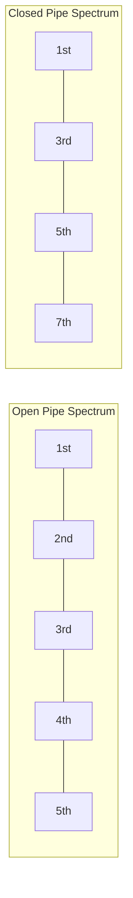
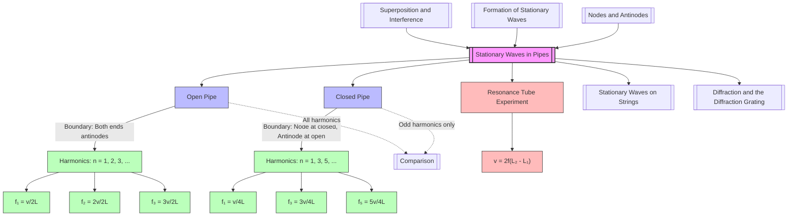

# Stationary Waves in Pipes (Open and Closed) / 管中的驻波（开管与闭管）

---

# 1. Overview / 概述

**English:**
This sub-topic explores how stationary waves are formed inside pipes with different boundary conditions — open at one or both ends. It builds directly on the concepts of [[Formation of Stationary Waves]] and [[Nodes and Antinodes]], applying them to real acoustic systems like organ pipes, flutes, and clarinets. Understanding pipe modes is essential for explaining musical pitch, harmonics, and the difference between instruments of the same length producing different notes. This sub-topic also connects to [[Superposition and Interference]] as the underlying wave phenomenon.

**中文:**
本子知识点探讨驻波在一端开口或两端开口的管中如何形成。它直接建立在[[Formation of Stationary Waves]]和[[Nodes and Antinodes]]的概念之上，并将其应用于真实的声学系统，如风琴管、长笛和单簧管。理解管中的振动模式对于解释音高、泛音以及相同长度的乐器产生不同音符的原因至关重要。本子知识点也与[[Superposition and Interference]]相联系，因为这是其背后的波动现象。

---

# 2. Syllabus Learning Objectives / 考纲学习目标

| CAIE 9702 | Edexcel IAL |
|-----------|-------------|
| 8.2(a) Explain the formation of a stationary wave using a graphical method, with reference to superposition of two progressive waves | WPH11 U2: 5.17 Describe stationary waves in pipes |
| 8.2(b) Describe nodes and antinodes | WPH11 U2: 5.18 Explain the formation of stationary waves in pipes |
| 8.2(c) Determine the wavelength of stationary waves using nodes and antinodes | WPH11 U2: 5.19 Calculate frequencies of harmonics in open and closed pipes |
| 8.2(d) Calculate the frequency of stationary waves in pipes | WPH11 U2: 5.20 Compare open and closed pipe harmonics |
| 8.2(e) Describe experiments to determine the speed of sound in air using stationary waves | |

**Examiner Expectations / 考官期望:**
- **English:** Students must be able to draw and interpret diagrams showing the first few harmonics in both open and closed pipes. They must know the boundary conditions: antinode at an open end, node at a closed end. Calculations of frequency, wavelength, and speed of sound are common.
- **中文:** 学生必须能够绘制并解释开管和闭管中前几个谐波的示意图。必须知道边界条件：开口端为波腹，闭口端为波节。频率、波长和声速的计算是常见考点。

---

# 3. Core Definitions / 核心定义

| Term (EN/CN) | Definition (EN) | Definition (CN) | Common Mistakes / 常见错误 |
|--------------|-----------------|-----------------|---------------------------|
| **Open Pipe** / 开管 | A pipe open at both ends, producing an antinode at each end. | 两端开口的管子，两端均为波腹。 | Confusing with closed pipe boundary conditions. |
| **Closed Pipe** / 闭管 | A pipe closed at one end and open at the other, producing a node at the closed end and an antinode at the open end. | 一端封闭、一端开口的管子，封闭端为波节，开口端为波腹。 | Thinking both ends are nodes. |
| **Fundamental Mode** / 基模 | The lowest frequency stationary wave pattern in a pipe. | 管中频率最低的驻波模式。 | Forgetting that closed pipe fundamental has λ = 4L, not 2L. |
| **Harmonic** / 谐波 | A frequency that is an integer multiple of the fundamental frequency. | 基频的整数倍频率。 | Confusing harmonic number with mode number in closed pipes. |
| **Node** / 波节 | A point of zero displacement in a stationary wave. | 驻波中位移始终为零的点。 | Thinking nodes occur at open ends. |
| **Antinode** / 波腹 | A point of maximum displacement in a stationary wave. | 驻波中位移最大的点。 | Thinking antinodes occur at closed ends. |

---

# 4. Key Concepts Explained / 关键概念详解

## 4.1 Boundary Conditions for Pipes / 管的边界条件

### Explanation / 解释
**English:**
The type of stationary wave formed in a pipe depends entirely on the boundary conditions at each end:
- **Open end:** Air molecules are free to move, so there is maximum displacement → **antinode**.
- **Closed end:** Air molecules cannot move (rigid wall), so displacement is zero → **node**.

These conditions determine the allowed wavelengths and frequencies. For an [[Open Pipe]], both ends are antinodes. For a [[Closed Pipe]], one end is a node (closed) and the other is an antinode (open).

**中文:**
管中形成的驻波类型完全取决于两端的边界条件：
- **开口端：** 空气分子可以自由移动，因此位移最大 → **波腹**。
- **闭口端：** 空气分子无法移动（刚性壁），因此位移为零 → **波节**。

这些条件决定了允许的波长和频率。对于[[开管]]，两端都是波腹。对于[[闭管]]，一端是波节（封闭端），另一端是波腹（开口端）。

### Physical Meaning / 物理意义
**English:**
The boundary conditions arise from the physical constraints on air molecules. At a closed end, the rigid wall forces displacement to zero. At an open end, air can move freely, so pressure variation is minimum but displacement is maximum.

**中文:**
边界条件源于对空气分子的物理约束。在封闭端，刚性壁迫使位移为零。在开口端，空气可以自由移动，因此压力变化最小，但位移最大。

### Common Misconceptions / 常见误区
- ❌ **"Both ends of a closed pipe are nodes."** — Only the closed end is a node; the open end is an antinode.
- ❌ **"Open pipes have nodes at both ends."** — Open pipes have antinodes at both ends.
- ❌ **"The fundamental wavelength is always 2L."** — This is only true for open pipes; for closed pipes, λ = 4L.

### Exam Tips / 考试提示
- ✅ Always draw the displacement-distance graph for the pipe, marking N (node) and A (antinode) at the ends.
- ✅ Memorise the boundary conditions: **Open = Antinode, Closed = Node**.
- ✅ For closed pipes, the fundamental has only one node and one antinode.

> 📷 **IMAGE PROMPT — BC01: Boundary Conditions for Open and Closed Pipes**
> A side-by-side diagram showing two pipes. Left: an open pipe (both ends open) with antinodes (A) marked at both ends. Right: a closed pipe (one end closed, one open) with a node (N) at the closed end and an antinode (A) at the open end. The displacement wave patterns for the fundamental mode are drawn inside each pipe. Labels: "Open Pipe", "Closed Pipe", "Node (N)", "Antinode (A)", "Open End", "Closed End".

---

## 4.2 Harmonics in Open Pipes / 开管中的谐波

### Explanation / 解释
**English:**
For an [[Open Pipe]] of length $L$, both ends are antinodes. The fundamental mode has one node in the centre, giving $\lambda_1 = 2L$. The allowed harmonics are all integer multiples of the fundamental frequency: $f_n = n f_1$ where $n = 1, 2, 3, ...$

The wavelength for the $n$th harmonic is:
$$\lambda_n = \frac{2L}{n}$$

The number of nodes in the $n$th harmonic is $n+1$, and the number of antinodes is $n$.

**中文:**
对于长度为 $L$ 的[[开管]]，两端都是波腹。基模在中心有一个波节，因此 $\lambda_1 = 2L$。允许的谐波是基频的所有整数倍：$f_n = n f_1$，其中 $n = 1, 2, 3, ...$

第 $n$ 次谐波的波长为：
$$\lambda_n = \frac{2L}{n}$$

第 $n$ 次谐波中的波节数为 $n+1$，波腹数为 $n$。

### Physical Meaning / 物理意义
**English:**
Open pipes produce all harmonics (1st, 2nd, 3rd, ...). This is why instruments like flutes and recorders (open at both ends) have a rich, bright sound with many overtones.

**中文:**
开管产生所有谐波（第1、2、3次...）。这就是为什么长笛和竖笛（两端开口）等乐器具有丰富、明亮的音色，包含许多泛音。

### Common Misconceptions / 常见误区
- ❌ **"Open pipes only produce odd harmonics."** — This is true for closed pipes, not open pipes.
- ❌ **"The fundamental has antinodes at both ends and a node in the middle."** — This is correct, but students often draw the node incorrectly.

### Exam Tips / 考试提示
- ✅ Remember: Open pipe → all harmonics ($n = 1, 2, 3, ...$)
- ✅ The distance between successive antinodes (or nodes) is $\lambda/2$.
- ✅ For the $n$th harmonic, there are $n$ loops (half-wavelengths) in the pipe.

> 📷 **IMAGE PROMPT — OP01: Harmonics in an Open Pipe**
> A diagram showing three modes of vibration in an open pipe of length L. Mode 1 (fundamental): one half-wavelength, antinodes at both ends, one node in centre. Mode 2 (2nd harmonic): two half-wavelengths, antinodes at both ends, two nodes. Mode 3 (3rd harmonic): three half-wavelengths, antinodes at both ends, three nodes. Labels: "L", "λ/2", "λ", "3λ/2", "A", "N", "n=1", "n=2", "n=3".

---

## 4.3 Harmonics in Closed Pipes / 闭管中的谐波

### Explanation / 解释
**English:**
For a [[Closed Pipe]] of length $L$, one end is a node (closed) and the other is an antinode (open). The fundamental mode has $\lambda_1 = 4L$. The allowed harmonics are only odd multiples of the fundamental frequency: $f_n = n f_1$ where $n = 1, 3, 5, ...$

The wavelength for the $n$th harmonic (where $n$ is odd) is:
$$\lambda_n = \frac{4L}{n}$$

The number of nodes in the $n$th harmonic is $\frac{n+1}{2}$, and the number of antinodes is $\frac{n+1}{2}$.

**中文:**
对于长度为 $L$ 的[[闭管]]，一端是波节（封闭端），另一端是波腹（开口端）。基模的 $\lambda_1 = 4L$。允许的谐波仅为基频的奇数倍：$f_n = n f_1$，其中 $n = 1, 3, 5, ...$

第 $n$ 次谐波（$n$ 为奇数）的波长为：
$$\lambda_n = \frac{4L}{n}$$

第 $n$ 次谐波中的波节数为 $\frac{n+1}{2}$，波腹数也为 $\frac{n+1}{2}$。

### Physical Meaning / 物理意义
**English:**
Closed pipes only produce odd harmonics (1st, 3rd, 5th, ...). This is why instruments like clarinets (closed at one end) have a mellow, hollow sound with fewer overtones.

**中文:**
闭管只产生奇次谐波（第1、3、5次...）。这就是为什么单簧管（一端封闭）等乐器具有圆润、空洞的音色，泛音较少。

### Common Misconceptions / 常见误区
- ❌ **"Closed pipes have all harmonics like open pipes."** — Only odd harmonics are present.
- ❌ **"The fundamental wavelength is 2L."** — For closed pipes, the fundamental has λ = 4L.
- ❌ **"The 3rd harmonic means n=3, so there are 3 half-wavelengths."** — In a closed pipe, the 3rd harmonic has 3/4 of a wavelength in the pipe, not 3 half-wavelengths.

### Exam Tips / 考试提示
- ✅ Remember: Closed pipe → only odd harmonics ($n = 1, 3, 5, ...$)
- ✅ The distance from the closed end (node) to the open end (antinode) is $\lambda/4$ for the fundamental.
- ✅ For the $n$th harmonic (odd), there are $\frac{n+1}{2}$ quarter-wavelengths in the pipe.

> 📷 **IMAGE PROMPT — CP01: Harmonics in a Closed Pipe**
> A diagram showing three modes of vibration in a closed pipe of length L. Mode 1 (fundamental): one quarter-wavelength, node at closed end, antinode at open end. Mode 2 (3rd harmonic): three quarter-wavelengths, node at closed end, antinode at open end, with one additional node and one additional antinode inside. Mode 3 (5th harmonic): five quarter-wavelengths. Labels: "L", "λ/4", "3λ/4", "5λ/4", "A", "N", "n=1", "n=3", "n=5", "Closed End", "Open End".

---

# 5. Essential Equations / 核心公式

## 5.1 Wave Equation / 波动方程

$$ v = f \lambda $$

| Symbol (符号) | Meaning (EN) | Meaning (CN) | Unit (单位) |
|--------------|-------------|-------------|------------|
| $v$ | Speed of sound in air | 空气中的声速 | m s⁻¹ |
| $f$ | Frequency of stationary wave | 驻波频率 | Hz |
| $\lambda$ | Wavelength of stationary wave | 驻波波长 | m |

**Conditions / 适用条件:** Applies to all waves in pipes. | 适用于管中所有波。
**Limitations / 局限性:** Assumes uniform temperature and pressure. | 假设温度和压力均匀。

---

## 5.2 Open Pipe Wavelength / 开管波长

$$ \lambda_n = \frac{2L}{n} \quad \text{where } n = 1, 2, 3, ... $$

| Symbol (符号) | Meaning (EN) | Meaning (CN) | Unit (单位) |
|--------------|-------------|-------------|------------|
| $\lambda_n$ | Wavelength of nth harmonic | 第n次谐波波长 | m |
| $L$ | Length of pipe | 管长 | m |
| $n$ | Harmonic number (positive integer) | 谐波次数（正整数） | - |

**Derivation / 推导:** For an open pipe, both ends are antinodes. The distance between successive antinodes is $\lambda/2$. For the $n$th harmonic, there are $n$ half-wavelengths in the pipe: $L = n(\lambda_n/2)$, so $\lambda_n = 2L/n$.

**Conditions / 适用条件:** Open pipe only. | 仅适用于开管。
**Limitations / 局限性:** Assumes ideal pipe with no end correction. | 假设理想管道，无端部修正。

---

## 5.3 Open Pipe Frequency / 开管频率

$$ f_n = \frac{nv}{2L} \quad \text{where } n = 1, 2, 3, ... $$

| Symbol (符号) | Meaning (EN) | Meaning (CN) | Unit (单位) |
|--------------|-------------|-------------|------------|
| $f_n$ | Frequency of nth harmonic | 第n次谐波频率 | Hz |
| $v$ | Speed of sound | 声速 | m s⁻¹ |
| $L$ | Length of pipe | 管长 | m |
| $n$ | Harmonic number | 谐波次数 | - |

**Derivation / 推导:** From $v = f\lambda$ and $\lambda_n = 2L/n$, we get $f_n = v/\lambda_n = v/(2L/n) = nv/(2L)$.

**Conditions / 适用条件:** Open pipe only. | 仅适用于开管。

---

## 5.4 Closed Pipe Wavelength / 闭管波长

$$ \lambda_n = \frac{4L}{n} \quad \text{where } n = 1, 3, 5, ... $$

| Symbol (符号) | Meaning (EN) | Meaning (CN) | Unit (单位) |
|--------------|-------------|-------------|------------|
| $\lambda_n$ | Wavelength of nth harmonic | 第n次谐波波长 | m |
| $L$ | Length of pipe | 管长 | m |
| $n$ | Harmonic number (odd only) | 谐波次数（仅奇数） | - |

**Derivation / 推导:** For a closed pipe, one end is a node and the other is an antinode. The distance from a node to the nearest antinode is $\lambda/4$. For the fundamental, $L = \lambda_1/4$, so $\lambda_1 = 4L$. For the $n$th harmonic (odd), there are $(n+1)/2$ quarter-wavelengths: $L = \frac{n+1}{2} \cdot \frac{\lambda_n}{4} = \frac{n\lambda_n}{4}$, so $\lambda_n = 4L/n$.

**Conditions / 适用条件:** Closed pipe only. | 仅适用于闭管。

---

## 5.5 Closed Pipe Frequency / 闭管频率

$$ f_n = \frac{nv}{4L} \quad \text{where } n = 1, 3, 5, ... $$

| Symbol (符号) | Meaning (EN) | Meaning (CN) | Unit (单位) |
|--------------|-------------|-------------|------------|
| $f_n$ | Frequency of nth harmonic | 第n次谐波频率 | Hz |
| $v$ | Speed of sound | 声速 | m s⁻¹ |
| $L$ | Length of pipe | 管长 | m |
| $n$ | Harmonic number (odd only) | 谐波次数（仅奇数） | - |

**Derivation / 推导:** From $v = f\lambda$ and $\lambda_n = 4L/n$, we get $f_n = v/\lambda_n = v/(4L/n) = nv/(4L)$.

**Conditions / 适用条件:** Closed pipe only. | 仅适用于闭管。

---

## 5.6 Speed of Sound from Resonance / 通过共振测量声速

$$ v = 2f(L_2 - L_1) $$

| Symbol (符号) | Meaning (EN) | Meaning (CN) | Unit (单位) |
|--------------|-------------|-------------|------------|
| $v$ | Speed of sound | 声速 | m s⁻¹ |
| $f$ | Frequency of tuning fork | 音叉频率 | Hz |
| $L_1$ | First resonance length | 第一次共振长度 | m |
| $L_2$ | Second resonance length | 第二次共振长度 | m |

**Derivation / 推导:** In a closed pipe resonance experiment, the first resonance occurs at $L_1 = \lambda/4$ and the second at $L_2 = 3\lambda/4$. The difference $L_2 - L_1 = \lambda/2$, so $\lambda = 2(L_2 - L_1)$. Using $v = f\lambda$, we get $v = 2f(L_2 - L_1)$.

**Conditions / 适用条件:** Closed pipe resonance experiment. | 适用于闭管共振实验。
**Limitations / 局限性:** Requires end correction for high accuracy. | 高精度需要端部修正。

> 📋 **CIE Only:** The resonance tube experiment is specifically required for CAIE 9702 8.2(e). Students must know how to determine the speed of sound using a tuning fork and a tube partially submerged in water.

> 📋 **Edexcel Only:** Edexcel IAL WPH11 U2 5.17-5.20 focuses more on the theoretical understanding and calculation of frequencies, with less emphasis on the experimental determination of the speed of sound.

---

# 6. Graphs and Relationships / 图表与关系

## 6.1 Displacement vs Distance for Open Pipe / 开管的位移-距离图

### Axes / 坐标轴
- **X-axis:** Distance along pipe / 沿管道的距离 (m)
- **Y-axis:** Displacement of air molecules / 空气分子的位移 (arbitrary units)

### Shape / 形状
- **Fundamental (n=1):** One complete half-sine wave from antinode to antinode.
- **2nd Harmonic (n=2):** Two half-sine waves.
- **3rd Harmonic (n=3):** Three half-sine waves.

### Gradient Meaning / 斜率含义
The gradient represents the rate of change of displacement with position, related to pressure variation.

### Area Meaning / 面积含义
No direct physical meaning for area under the displacement-distance graph.

### Exam Interpretation / 考试解读
- Count the number of half-wavelengths to determine the harmonic number.
- Identify nodes (zero displacement) and antinodes (maximum displacement).
- The ends must always be antinodes for an open pipe.

---

## 6.2 Displacement vs Distance for Closed Pipe / 闭管的位移-距离图

### Axes / 坐标轴
- **X-axis:** Distance along pipe / 沿管道的距离 (m)
- **Y-axis:** Displacement of air molecules / 空气分子的位移 (arbitrary units)

### Shape / 形状
- **Fundamental (n=1):** One quarter-sine wave from node to antinode.
- **3rd Harmonic (n=3):** Three quarter-sine waves.
- **5th Harmonic (n=5):** Five quarter-sine waves.

### Gradient Meaning / 斜率含义
Same as open pipe — represents rate of change of displacement.

### Area Meaning / 面积含义
No direct physical meaning.

### Exam Interpretation / 考试解读
- The closed end must always be a node (displacement = 0).
- The open end must always be an antinode (maximum displacement).
- Count quarter-wavelengths: the number of quarter-wavelengths = harmonic number (odd).

---

## 6.3 Frequency Spectrum Comparison / 频谱比较

### Axes / 坐标轴
- **X-axis:** Harmonic number / 谐波次数
- **Y-axis:** Relative amplitude / 相对振幅

### Shape / 形状
- **Open pipe:** Bars at n = 1, 2, 3, 4, 5, ... (all integers)
- **Closed pipe:** Bars at n = 1, 3, 5, 7, ... (odd integers only)

### Exam Interpretation / 考试解读
- Open pipes produce a richer sound with more harmonics.
- Closed pipes have a "hollower" sound due to missing even harmonics.

---

# 7. Required Diagrams / 必备图表

## 7.1 Open Pipe Harmonics / 开管谐波图

### Description / 描述
**English:** A diagram showing the first three harmonics of an open pipe of length L. Each mode shows the displacement pattern with antinodes at both ends and nodes in between.

**中文:** 显示长度为L的开管前三个谐波的示意图。每个模式显示位移图案，两端为波腹，中间为波节。

### Image Prompt / 图片生成提示
> 📷 **IMAGE PROMPT — OP02: Open Pipe Harmonics Diagram**
> A clear physics diagram showing three horizontal pipes of equal length L, stacked vertically. Pipe 1 (top): fundamental mode n=1, showing one half-sine wave with antinodes (A) at both ends and one node (N) in the centre. Pipe 2 (middle): 2nd harmonic n=2, showing two half-sine waves with antinodes at both ends and two nodes. Pipe 3 (bottom): 3rd harmonic n=3, showing three half-sine waves with antinodes at both ends and three nodes. Labels: "L", "n=1", "n=2", "n=3", "A", "N", "λ/2", "λ", "3λ/2". Professional style, white background, black lines, blue wave patterns.

### Labels Required / 需要标注
- Pipe length: L / 管长：L
- Harmonic number: n = 1, 2, 3 / 谐波次数：n = 1, 2, 3
- Nodes: N / 波节：N
- Antinodes: A / 波腹：A
- Wavelength segments: λ/2, λ, 3λ/2 / 波长段：λ/2, λ, 3λ/2

### Exam Importance / 考试重要性
**English:** Essential for understanding how wavelength relates to pipe length. Students must be able to draw these diagrams from memory.

**中文:** 对于理解波长与管长的关系至关重要。学生必须能够凭记忆绘制这些示意图。

---

## 7.2 Closed Pipe Harmonics / 闭管谐波图

### Description / 描述
**English:** A diagram showing the first three harmonics (1st, 3rd, 5th) of a closed pipe of length L. Each mode shows the displacement pattern with a node at the closed end and an antinode at the open end.

**中文:** 显示长度为L的闭管前三个谐波（第1、3、5次）的示意图。每个模式显示位移图案，封闭端为波节，开口端为波腹。

### Image Prompt / 图片生成提示
> 📷 **IMAGE PROMPT — CP02: Closed Pipe Harmonics Diagram**
> A clear physics diagram showing three horizontal pipes of equal length L, stacked vertically. Each pipe has a closed end (solid wall) on the left and an open end on the right. Pipe 1 (top): fundamental mode n=1, showing one quarter-sine wave with node (N) at closed end and antinode (A) at open end. Pipe 2 (middle): 3rd harmonic n=3, showing three quarter-sine waves with node at closed end, antinode at open end, and one additional node and antinode inside. Pipe 3 (bottom): 5th harmonic n=5, showing five quarter-sine waves. Labels: "L", "n=1", "n=3", "n=5", "A", "N", "λ/4", "3λ/4", "5λ/4", "Closed End", "Open End". Professional style, white background, black lines, red wave patterns.

### Labels Required / 需要标注
- Pipe length: L / 管长：L
- Harmonic number: n = 1, 3, 5 / 谐波次数：n = 1, 3, 5
- Nodes: N / 波节：N
- Antinodes: A / 波腹：A
- Closed end / 封闭端
- Open end / 开口端
- Wavelength segments: λ/4, 3λ/4, 5λ/4 / 波长段：λ/4, 3λ/4, 5λ/4

### Exam Importance / 考试重要性
**English:** Essential for understanding why closed pipes only produce odd harmonics. Students often confuse this with open pipes.

**中文:** 对于理解为什么闭管只产生奇次谐波至关重要。学生经常将其与开管混淆。

---

## 7.3 Resonance Tube Experiment / 共振管实验

### Description / 描述
**English:** A diagram showing the experimental setup to determine the speed of sound using a resonance tube. A tuning fork is held above a tube partially submerged in water. The water level is adjusted to find resonance positions.

**中文:** 显示使用共振管测量声速的实验装置示意图。音叉置于部分浸入水中的管子上方。调整水位以找到共振位置。

### Image Prompt / 图片生成提示
> 📷 **IMAGE PROMPT — RT01: Resonance Tube Experiment**
> A diagram showing a tall glass tube partially submerged in a water reservoir. A tuning fork is held above the open top of the tube. The water level inside the tube is shown at two positions: L1 (first resonance, shorter air column) and L2 (second resonance, longer air column). Labels: "Tuning Fork (frequency f)", "Glass Tube", "Water Reservoir", "L1 (first resonance)", "L2 (second resonance)", "Air Column", "Water Level". Arrows indicate adjusting water level. Professional laboratory diagram style.

### Labels Required / 需要标注
- Tuning fork / 音叉
- Glass tube / 玻璃管
- Water reservoir / 储水器
- First resonance length: L₁ / 第一次共振长度：L₁
- Second resonance length: L₂ / 第二次共振长度：L₂
- Air column / 气柱

### Exam Importance / 考试重要性
**English:** Required for CAIE 9702 8.2(e). Students must know how to use this setup to calculate the speed of sound.

**中文:** CAIE 9702 8.2(e) 要求掌握。学生必须知道如何使用该装置计算声速。

---

# 8. Worked Examples / 典型例题

## Example 1: Open Pipe Frequency Calculation / 开管频率计算

### Question / 题目
**English:**
An open pipe has a length of 0.68 m. The speed of sound in air is 340 m s⁻¹.
(a) Calculate the fundamental frequency of the pipe.
(b) Calculate the frequency of the 3rd harmonic.
(c) Determine the wavelength of the 2nd harmonic.

**中文:**
一根开管长度为0.68 m。空气中的声速为340 m s⁻¹。
(a) 计算该管的基频。
(b) 计算第3次谐波的频率。
(c) 确定第2次谐波的波长。

### Solution / 解答

**(a) Fundamental frequency / 基频**

For an open pipe, $f_n = \frac{nv}{2L}$ where $n = 1$ for the fundamental.

$$f_1 = \frac{1 \times 340}{2 \times 0.68} = \frac{340}{1.36} = 250 \text{ Hz}$$

**(b) 3rd harmonic frequency / 第3次谐波频率**

For an open pipe, $n = 3$:

$$f_3 = \frac{3 \times 340}{2 \times 0.68} = 3 \times 250 = 750 \text{ Hz}$$

**(c) 2nd harmonic wavelength / 第2次谐波波长**

For an open pipe, $\lambda_n = \frac{2L}{n}$ where $n = 2$:

$$\lambda_2 = \frac{2 \times 0.68}{2} = 0.68 \text{ m}$$

Alternatively, using $v = f\lambda$:
$$f_2 = \frac{2 \times 340}{2 \times 0.68} = 500 \text{ Hz}$$
$$\lambda_2 = \frac{v}{f_2} = \frac{340}{500} = 0.68 \text{ m}$$

### Final Answer / 最终答案
**Answer:** (a) 250 Hz, (b) 750 Hz, (c) 0.68 m | **答案：** (a) 250 Hz，(b) 750 Hz，(c) 0.68 m

### Quick Tip / 提示
**English:** For open pipes, the fundamental frequency is $v/2L$. All harmonics are integer multiples of the fundamental. The 2nd harmonic wavelength equals the pipe length.

**中文:** 对于开管，基频为 $v/2L$。所有谐波都是基频的整数倍。第2次谐波的波长等于管长。

---

## Example 2: Closed Pipe Frequency Calculation / 闭管频率计算

### Question / 题目
**English:**
A closed pipe has a length of 0.34 m. The speed of sound in air is 340 m s⁻¹.
(a) Calculate the fundamental frequency of the pipe.
(b) Calculate the frequency of the next harmonic.
(c) Determine the wavelength of the fundamental mode.

**中文:**
一根闭管长度为0.34 m。空气中的声速为340 m s⁻¹。
(a) 计算该管的基频。
(b) 计算下一个谐波的频率。
(c) 确定基模的波长。

### Solution / 解答

**(a) Fundamental frequency / 基频**

For a closed pipe, $f_n = \frac{nv}{4L}$ where $n = 1$ for the fundamental.

$$f_1 = \frac{1 \times 340}{4 \times 0.34} = \frac{340}{1.36} = 250 \text{ Hz}$$

**(b) Next harmonic / 下一个谐波**

For a closed pipe, the next harmonic is the 3rd harmonic ($n = 3$):

$$f_3 = \frac{3 \times 340}{4 \times 0.34} = 3 \times 250 = 750 \text{ Hz}$$

**(c) Fundamental wavelength / 基模波长**

For a closed pipe, $\lambda_n = \frac{4L}{n}$ where $n = 1$:

$$\lambda_1 = \frac{4 \times 0.34}{1} = 1.36 \text{ m}$$

Alternatively, using $v = f\lambda$:
$$\lambda_1 = \frac{v}{f_1} = \frac{340}{250} = 1.36 \text{ m}$$

### Final Answer / 最终答案
**Answer:** (a) 250 Hz, (b) 750 Hz, (c) 1.36 m | **答案：** (a) 250 Hz，(b) 750 Hz，(c) 1.36 m

### Quick Tip / 提示
**English:** For closed pipes, the fundamental frequency is $v/4L$. The next harmonic is the 3rd (not the 2nd). The fundamental wavelength is 4 times the pipe length.

**中文:** 对于闭管，基频为 $v/4L$。下一个谐波是第3次（不是第2次）。基模波长是管长的4倍。

---

## Example 3: Speed of Sound from Resonance Experiment / 通过共振实验测量声速

### Question / 题目
**English:**
In a resonance tube experiment, a tuning fork of frequency 512 Hz is used. The first resonance occurs when the air column length is 0.165 m, and the second resonance occurs at 0.495 m. Calculate the speed of sound in air.

**中文:**
在共振管实验中，使用频率为512 Hz的音叉。第一次共振时气柱长度为0.165 m，第二次共振时气柱长度为0.495 m。计算空气中的声速。

### Solution / 解答

For a closed pipe resonance experiment:
$$v = 2f(L_2 - L_1)$$

$$v = 2 \times 512 \times (0.495 - 0.165)$$

$$v = 2 \times 512 \times 0.330$$

$$v = 1024 \times 0.330 = 337.92 \text{ m s}^{-1}$$

### Final Answer / 最终答案
**Answer:** 338 m s⁻¹ (to 3 significant figures) | **答案：** 338 m s⁻¹（保留3位有效数字）

### Quick Tip / 提示
**English:** The difference between successive resonance lengths is $\lambda/2$. This method avoids the need for end correction.

**中文:** 连续共振长度之差为 $\lambda/2$。这种方法避免了端部修正的需要。

---

# 9. Past Paper Question Types / 历年真题题型

| Question Type / 题型 | Frequency / 频率 | Difficulty / 难度 | Past Paper References / 真题索引 |
|----------------------|------------------|------------------|-------------------------------|
| Draw harmonics in open/closed pipes | High | Easy | 📝 *待填入* |
| Calculate frequency/wavelength from pipe length | High | Medium | 📝 *待填入* |
| Compare open vs closed pipe harmonics | Medium | Medium | 📝 *待填入* |
| Speed of sound from resonance experiment | Medium | Medium | 📝 *待填入* |
| Explain why closed pipes only have odd harmonics | Low | Hard | 📝 *待填入* |
| End correction calculations | Low | Hard | 📝 *待填入* |

**Common Command Words / 常见指令词:**
- **Draw / 绘制:** Sketch the stationary wave pattern for the first harmonic.
- **Calculate / 计算:** Determine the fundamental frequency.
- **Explain / 解释:** Why does a closed pipe only produce odd harmonics?
- **Compare / 比较:** The harmonics produced by open and closed pipes.
- **Describe / 描述:** An experiment to determine the speed of sound.

---

# 10. Practical Skills Connections / 实验技能链接

**English:**
This sub-topic connects to practical work in several ways:

1. **Resonance Tube Experiment (CAIE 9702 8.2(e)):**
   - Use a tuning fork of known frequency above a tube partially submerged in water.
   - Adjust water level to find the first and second resonance positions.
   - Measure $L_1$ and $L_2$ using a metre rule.
   - Calculate speed of sound using $v = 2f(L_2 - L_1)$.
   - **Uncertainties:** Estimate uncertainty in length measurements (±1 mm), calculate percentage uncertainty in $v$.

2. **End Correction:**
   - In real pipes, the antinode is slightly above the open end, requiring an end correction $e \approx 0.3d$ (where $d$ is the pipe diameter).
   - For closed pipes: $L + e = \lambda/4$ for the fundamental.
   - This is an advanced topic but may appear in harder questions.

3. **Graph Plotting:**
   - Plot $L$ against $1/f$ to determine the speed of sound from the gradient.
   - The gradient of $L$ vs $1/f$ is $v/4$ for closed pipes.

4. **Experimental Design:**
   - Choose appropriate tuning fork frequencies (256 Hz, 512 Hz, 1024 Hz).
   - Ensure the tube is long enough to observe at least two resonances.
   - Control temperature (affects speed of sound).

**中文:**
本子知识点在多个方面与实验工作相关：

1. **共振管实验（CAIE 9702 8.2(e)）：**
   - 在部分浸入水中的管子上方使用已知频率的音叉。
   - 调整水位以找到第一次和第二次共振位置。
   - 使用米尺测量 $L_1$ 和 $L_2$。
   - 使用 $v = 2f(L_2 - L_1)$ 计算声速。
   - **不确定度：** 估计长度测量的不确定度（±1 mm），计算 $v$ 的百分比不确定度。

2. **端部修正：**
   - 在实际管中，波腹略高于开口端，需要端部修正 $e \approx 0.3d$（其中 $d$ 为管径）。
   - 对于闭管：基模的 $L + e = \lambda/4$。
   - 这是一个进阶话题，可能出现在较难的题目中。

3. **图表绘制：**
   - 绘制 $L$ 与 $1/f$ 的关系图，从斜率确定声速。
   - 对于闭管，$L$ 与 $1/f$ 的斜率为 $v/4$。

4. **实验设计：**
   - 选择合适的音叉频率（256 Hz、512 Hz、1024 Hz）。
   - 确保管子足够长以观察到至少两次共振。
   - 控制温度（影响声速）。

---

# 11. Concept Map / 概念图谱

---

# 12. Quick Revision Sheet / 速查表

| Category / 类别 | Key Points / 要点 |
|----------------|------------------|
| **Definition / 定义** | Stationary waves in pipes are formed by the superposition of incident and reflected waves. Boundary conditions: open end = antinode, closed end = node. |
| **Key Formula / 核心公式** | Open pipe: $f_n = \frac{nv}{2L}$ ($n = 1, 2, 3, ...$), $\lambda_n = \frac{2L}{n}$ |
| | Closed pipe: $f_n = \frac{nv}{4L}$ ($n = 1, 3, 5, ...$), $\lambda_n = \frac{4L}{n}$ |
| | Wave equation: $v = f\lambda$ |
| | Speed of sound: $v = 2f(L_2 - L_1)$ |
| **Key Graph / 核心图表** | Displacement-distance graphs showing nodes (N) and antinodes (A). Open pipe: antinodes at both ends. Closed pipe: node at closed end, antinode at open end. |
| **Key Comparison / 核心比较** | **Open pipe:** All harmonics (1, 2, 3, ...), fundamental $f_1 = v/2L$ |
| | **Closed pipe:** Odd harmonics only (1, 3, 5, ...), fundamental $f_1 = v/4L$ |
| | Same length pipe: closed pipe fundamental is half the frequency of open pipe fundamental. |
| **Exam Tip / 考试提示** | ✅ Always state boundary conditions first. |
| | ✅ Draw the wave pattern before calculating. |
| | ✅ For closed pipes, remember: next harmonic after fundamental is 3rd, not 2nd. |
| | ✅ Check units: length in metres, frequency in Hz, speed in m s⁻¹. |
| | ✅ For resonance experiment: $L_2 - L_1 = \lambda/2$. |
| **Common Mistake / 常见错误** | ❌ Using open pipe formula for closed pipe (or vice versa). |
| | ❌ Forgetting that closed pipes only have odd harmonics. |
| | ❌ Confusing node and antinode positions. |
| | ❌ Using $n=2$ for closed pipe second harmonic (should be $n=3$). |

---

> 📋 **CIE 9702 Specific:** The resonance tube experiment (8.2e) is a required practical. Students should be able to describe the procedure, identify sources of error, and calculate the speed of sound from experimental data.

> 📋 **Edexcel IAL Specific:** Focus on theoretical understanding (5.17-5.20). Be prepared to compare open and closed pipe harmonics and explain the physical reasons for the differences.