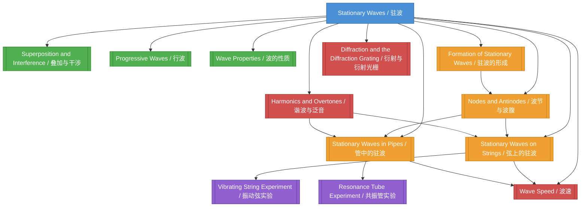

# Stationary Waves / 驻波

**Chapter:** 02-Waves / 02-波动
**Level:** AS
**Difficulty:** Intermediate / 中等
**Parent Folder:** `vault/02-Waves/02-Superposition/Stationary Waves/`

---

# 1. Overview / 概述

**English:**
Stationary waves (also called standing waves) are a fundamental wave phenomenon resulting from the superposition of two identical progressive waves travelling in opposite directions. Unlike progressive waves that transfer energy from one place to another, stationary waves appear to "stand still" — they do not transfer net energy. Instead, they exhibit fixed positions of zero displacement called **nodes** and positions of maximum displacement called **antinodes**.

This topic is central to understanding wave behaviour in bounded systems. Real-world applications include musical instruments (guitar strings, organ pipes), microwave ovens, laser cavities, and quantum mechanics (particle-in-a-box models). In both Cambridge 9702 and Edexcel IAL syllabuses, stationary waves form a core part of the Waves chapter, bridging [[Superposition and Interference]] with practical applications in strings and pipes.

**中文：**
驻波（又称定波）是由两列振幅相同、频率相同、传播方向相反的相干波叠加形成的波动现象。与行波不同，驻波不传递净能量，而是呈现出固定的波节（位移始终为零的点）和波腹（位移最大的点）。

理解驻波对于掌握有界系统中的波动行为至关重要。实际应用包括乐器（吉他弦、管风琴管）、微波炉、激光谐振腔以及量子力学（一维无限深势阱模型）。在剑桥 9702 和爱德思 IAL 考纲中，驻波是波动章节的核心内容，连接了[[叠加与干涉]]与弦和管中的实际应用。

---

# 2. Syllabus Learning Objectives / 考纲学习目标

| CAIE 9702 (8.2 a-e) | Edexcel IAL (WPH11 U2: 5.17-5.20) |
|---------------------|-----------------------------------|
| 8.2(a) Explain and use the principle of superposition to produce stationary waves | 5.17 Understand the concept of stationary waves and their formation by superposition of two progressive waves |
| 8.2(b) Describe stationary waves in terms of nodes and antinodes | 5.18 Understand the terms node and antinode |
| 8.2(c) Describe stationary waves in strings and pipes (open and closed) | 5.19 Understand the formation of stationary waves in strings and pipes (open and closed) |
| 8.2(d) Determine the wavelength and frequency of stationary waves | 5.20 Use the relationship between wavelength, frequency, and wave speed for stationary waves |
| 8.2(e) Solve problems involving stationary waves | — |

**Examiner Expectations / 考官期望：**

**English:**
- Candidates must be able to **describe** the formation of stationary waves using the principle of superposition.
- Candidates must **define** nodes and antinodes precisely.
- Candidates must **sketch** and **interpret** diagrams of stationary waves in strings and pipes.
- Candidates must **calculate** wavelength, frequency, and wave speed for fundamental and harmonic modes.
- Candidates must **distinguish** between open and closed pipes.

**中文：**
- 考生必须能够利用叠加原理**描述**驻波的形成。
- 考生必须精确定义**波节**和**波腹**。
- 考生必须能够**绘制**并**解释**弦和管中驻波的示意图。
- 考生必须能够计算基频和谐波模式下的波长、频率和波速。
- 考生必须能够区分**开端管**和**闭端管**。

> 📋 **CIE Only:** CAIE specifically requires solving problems involving stationary waves, including determining wavelength and frequency from given data.
>
> 📋 **Edexcel Only:** Edexcel explicitly lists the relationship between wavelength, frequency, and wave speed as a separate objective (5.20).

---

# 3. Core Definitions / 核心定义

| Term (EN/CN) | Definition (EN) | Definition (CN) | Common Mistakes / 常见错误 |
|--------------|-----------------|-----------------|---------------------------|
| **Stationary Wave / 驻波** | A wave formed by the superposition of two identical progressive waves travelling in opposite directions, resulting in no net energy transfer. | 由两列振幅相同、频率相同、传播方向相反的相干波叠加形成的波，不传递净能量。 | ❌ Thinking stationary waves are "not moving" — they oscillate, but the pattern is stationary. |
| **Node / 波节** | A point on a stationary wave where the displacement is always zero. | 驻波上位移始终为零的点。 | ❌ Confusing node with antinode. Remember: Node = No displacement. |
| **Antinode / 波腹** | A point on a stationary wave where the displacement is maximum. | 驻波上位移最大的点。 | ❌ Thinking antinodes are "anti-nodes" — they are points of maximum amplitude. |
| **Fundamental Mode / 基频模式** | The lowest frequency at which a stationary wave can be formed in a given system. | 在给定系统中能够形成驻波的最低频率。 | ❌ Confusing fundamental with first harmonic — they are the same. |
| **Harmonic / 谐波** | A frequency that is an integer multiple of the fundamental frequency. | 基频的整数倍频率。 | ❌ Using "overtone" interchangeably with "harmonic" — overtones are harmonics except the fundamental. |
| **Boundary Condition / 边界条件** | The physical constraints at the ends of a string or pipe that determine the positions of nodes and antinodes. | 弦或管两端的物理约束，决定了波节和波腹的位置。 | ❌ Forgetting that closed ends are nodes and open ends are antinodes. |
| **Wavelength / 波长** | The distance between two consecutive points in phase on a wave. | 波上两个相邻同相点之间的距离。 | ❌ Measuring between two nodes instead of two antinodes — both work for stationary waves. |
| **Frequency / 频率** | The number of complete oscillations per unit time. | 单位时间内完成的全振动次数。 | ❌ Confusing frequency with angular frequency. |

---

# 4. Key Concepts Explained / 关键概念详解

## 4.1 Formation of Stationary Waves / 驻波的形成

### Explanation / 解释
**English:**
Stationary waves are formed when two identical progressive waves travel in opposite directions and superpose. This typically occurs when a wave is reflected at a boundary and interferes with the incident wave. The principle of [[Superposition and Interference]] states that the resultant displacement at any point is the vector sum of the displacements of the individual waves.

Mathematically, consider two waves:
- Wave 1: $y_1 = A \sin(kx - \omega t)$ (travelling right)
- Wave 2: $y_2 = A \sin(kx + \omega t)$ (travelling left)

Using the superposition principle:
$$y = y_1 + y_2 = A \sin(kx - \omega t) + A \sin(kx + \omega t)$$

Using the trigonometric identity $\sin P + \sin Q = 2 \sin\left(\frac{P+Q}{2}\right) \cos\left(\frac{P-Q}{2}\right)$:
$$y = 2A \sin(kx) \cos(\omega t)$$

This is the equation of a stationary wave. The term $2A \sin(kx)$ represents the **amplitude envelope** — it varies with position $x$ but not with time $t$. The term $\cos(\omega t)$ represents the **time-dependent oscillation**.

**中文：**
当两列相同的行波沿相反方向传播并叠加时，就会形成驻波。这通常发生在波在边界处反射并与入射波干涉时。[[叠加与干涉]]原理指出，任意点的合位移是各列波位移的矢量和。

数学上，考虑两列波：
- 波 1：$y_1 = A \sin(kx - \omega t)$（向右传播）
- 波 2：$y_2 = A \sin(kx + \omega t)$（向左传播）

利用叠加原理：
$$y = y_1 + y_2 = A \sin(kx - \omega t) + A \sin(kx + \omega t)$$

利用三角恒等式 $\sin P + \sin Q = 2 \sin\left(\frac{P+Q}{2}\right) \cos\left(\frac{P-Q}{2}\right)$：
$$y = 2A \sin(kx) \cos(\omega t)$$

这就是驻波的方程。$2A \sin(kx)$ 项表示**振幅包络**——它随位置 $x$ 变化，但不随时间 $t$ 变化。$\cos(\omega t)$ 项表示**时间相关的振荡**。

### Physical Meaning / 物理意义
**English:**
The equation $y = 2A \sin(kx) \cos(\omega t)$ shows that:
- At positions where $\sin(kx) = 0$, the amplitude is always zero → **nodes**
- At positions where $\sin(kx) = \pm 1$, the amplitude is maximum → **antinodes**
- All particles between two consecutive nodes oscillate in phase (they reach maximum displacement simultaneously)
- Particles on opposite sides of a node oscillate in anti-phase (180° out of phase)

**中文：**
方程 $y = 2A \sin(kx) \cos(\omega t)$ 表明：
- 在 $\sin(kx) = 0$ 的位置，振幅始终为零 → **波节**
- 在 $\sin(kx) = \pm 1$ 的位置，振幅最大 → **波腹**
- 两个相邻波节之间的所有质点同相振动（同时达到最大位移）
- 波节两侧的质点反相振动（相位差 180°）

### Common Misconceptions / 常见误区
1. ❌ **"Stationary waves don't move"** — The pattern is stationary, but the particles oscillate.
2. ❌ **"Nodes are points of minimum amplitude"** — Nodes have zero amplitude, not minimum.
3. ❌ **"Energy is stored at antinodes"** — Energy is stored throughout the wave, not localised.
4. ❌ **"Stationary waves are a different type of wave"** — They are formed by superposition of progressive waves.

### Exam Tips / 考试提示
**English:**
- Cambridge often asks to **explain** the formation using superposition.
- Edexcel often asks to **describe** the pattern of nodes and antinodes.
- Always mention: "two identical waves travelling in opposite directions."
- Use the equation $y = 2A \sin(kx) \cos(\omega t)$ to derive node/antinode positions.

**中文：**
- 剑桥常要求利用叠加原理**解释**驻波的形成。
- 爱德思常要求**描述**波节和波腹的分布。
- 务必提及："两列相同的波沿相反方向传播。"
- 利用方程 $y = 2A \sin(kx) \cos(\omega t)$ 推导波节/波腹位置。

> 📷 **IMAGE PROMPT — SW01: Formation of Stationary Waves**
>
> A diagram showing two progressive waves (one red, one blue) travelling in opposite directions along a string. The resultant stationary wave is shown in purple below. Nodes are marked with N, antinodes with A. The diagram should show the superposition process step-by-step: at t=0, t=T/4, t=T/2, t=3T/4, and t=T. Use a clean educational style with clear labels and arrows indicating wave direction.

---

## 4.2 Nodes and Antinodes / 波节与波腹

### Explanation / 解释
**English:**
**Nodes** are points of permanent zero displacement. They occur where the two waves always cancel each other out (destructive interference). Mathematically, nodes occur when $\sin(kx) = 0$, which gives:
$$kx = n\pi \quad \text{where } n = 0, 1, 2, ...$$
$$x = \frac{n\lambda}{2}$$

So nodes are spaced $\lambda/2$ apart.

**Antinodes** are points of maximum displacement. They occur where the two waves always reinforce each other (constructive interference). Mathematically, antinodes occur when $\sin(kx) = \pm 1$, which gives:
$$kx = \left(n + \frac{1}{2}\right)\pi \quad \text{where } n = 0, 1, 2, ...$$
$$x = \left(n + \frac{1}{2}\right)\frac{\lambda}{2}$$

So antinodes are also spaced $\lambda/2$ apart, and the distance between a node and the next antinode is $\lambda/4$.

**中文：**
**波节**是位移始终为零的点。它们发生在两列波始终相互抵消的位置（相消干涉）。数学上，波节出现在 $\sin(kx) = 0$ 时：
$$kx = n\pi \quad \text{其中 } n = 0, 1, 2, ...$$
$$x = \frac{n\lambda}{2}$$

因此波节间距为 $\lambda/2$。

**波腹**是位移最大的点。它们发生在两列波始终相互增强的位置（相长干涉）。数学上，波腹出现在 $\sin(kx) = \pm 1$ 时：
$$kx = \left(n + \frac{1}{2}\right)\pi \quad \text{其中 } n = 0, 1, 2, ...$$
$$x = \left(n + \frac{1}{2}\right)\frac{\lambda}{2}$$

因此波腹间距也为 $\lambda/2$，相邻波节与波腹之间的距离为 $\lambda/4$。

### Physical Meaning / 物理意义
**English:**
- The distance between adjacent nodes = $\lambda/2$
- The distance between adjacent antinodes = $\lambda/2$
- The distance from a node to the nearest antinode = $\lambda/4$
- The number of nodes and antinodes depends on the boundary conditions

**中文：**
- 相邻波节间距 = $\lambda/2$
- 相邻波腹间距 = $\lambda/2$
- 波节到最近波腹的距离 = $\lambda/4$
- 波节和波腹的数量取决于边界条件

### Common Misconceptions / 常见误区
1. ❌ **"Nodes have minimum energy"** — Nodes have zero kinetic energy but potential energy is stored in the stretched string.
2. ❌ **"Antinodes are always at the ends"** — Only for open pipes; for strings, ends are nodes.
3. ❌ **"The distance between nodes is λ"** — It's λ/2, not λ.

### Exam Tips / 考试提示
**English:**
- Be precise: "Nodes are points of zero displacement, not zero amplitude."
- Remember: For a stationary wave, the distance between successive nodes = λ/2.
- Cambridge often asks: "State the distance between two adjacent nodes."
- Edexcel often asks: "Explain why nodes occur at certain positions."

**中文：**
- 要精确："波节是位移为零的点，不是振幅为零的点。"
- 记住：驻波中相邻波节间距 = λ/2。
- 剑桥常问："说出两个相邻波节之间的距离。"
- 爱德思常问："解释为什么波节出现在特定位置。"

---

## 4.3 Stationary Waves on Strings / 弦上的驻波

### Explanation / 解释
**English:**
When a string is fixed at both ends, the ends must be nodes because they cannot move. This boundary condition determines the possible wavelengths and frequencies.

For a string of length $L$ fixed at both ends:
- **Fundamental mode (1st harmonic):** $L = \frac{\lambda_1}{2}$, so $\lambda_1 = 2L$
- **2nd harmonic:** $L = \lambda_2$, so $\lambda_2 = L$
- **3rd harmonic:** $L = \frac{3\lambda_3}{2}$, so $\lambda_3 = \frac{2L}{3}$
- **nth harmonic:** $L = \frac{n\lambda_n}{2}$, so $\lambda_n = \frac{2L}{n}$

The frequency is given by $f = \frac{v}{\lambda}$, where $v$ is the wave speed on the string. The wave speed depends on tension $T$ and mass per unit length $\mu$:
$$v = \sqrt{\frac{T}{\mu}}$$

Therefore, the frequency of the nth harmonic is:
$$f_n = \frac{n}{2L} \sqrt{\frac{T}{\mu}}$$

**中文：**
当弦两端固定时，端点必须是波节，因为它们无法移动。这个边界条件决定了可能的波长和频率。

对于长度为 $L$、两端固定的弦：
- **基频模式（1次谐波）：** $L = \frac{\lambda_1}{2}$，所以 $\lambda_1 = 2L$
- **2次谐波：** $L = \lambda_2$，所以 $\lambda_2 = L$
- **3次谐波：** $L = \frac{3\lambda_3}{2}$，所以 $\lambda_3 = \frac{2L}{3}$
- **n次谐波：** $L = \frac{n\lambda_n}{2}$，所以 $\lambda_n = \frac{2L}{n}$

频率由 $f = \frac{v}{\lambda}$ 给出，其中 $v$ 是弦上的波速。波速取决于张力 $T$ 和线密度 $\mu$：
$$v = \sqrt{\frac{T}{\mu}}$$

因此，n次谐波的频率为：
$$f_n = \frac{n}{2L} \sqrt{\frac{T}{\mu}}$$

### Physical Meaning / 物理意义
**English:**
- The fundamental frequency is the lowest note a string can produce.
- Higher harmonics produce higher pitches (overtones).
- Changing tension (tuning peg) changes frequency.
- Changing length (finger position) changes frequency.
- Thicker strings (higher $\mu$) produce lower frequencies.

**中文：**
- 基频是弦能产生的最低音。
- 高次谐波产生更高的音调（泛音）。
- 改变张力（调音旋钮）改变频率。
- 改变长度（手指位置）改变频率。
- 更粗的弦（更高的 $\mu$）产生更低的频率。

### Common Misconceptions / 常见误区
1. ❌ **"The fundamental has a node at the centre"** — The fundamental has an antinode at the centre.
2. ❌ **"All harmonics are present in a plucked string"** — Only odd harmonics are present in a plucked string at the centre.
3. ❌ **"The wave speed depends on frequency"** — Wave speed depends only on tension and mass per unit length.

### Exam Tips / 考试提示
**English:**
- Cambridge often asks: "Sketch the stationary wave pattern for the first three harmonics."
- Edexcel often asks: "Calculate the fundamental frequency given L, T, and μ."
- Remember: $f_1 : f_2 : f_3 = 1 : 2 : 3$ for strings.
- Always check units: Tension in N, μ in kg/m, L in m.

**中文：**
- 剑桥常问："画出前三次谐波的驻波图案。"
- 爱德思常问："给定 L、T 和 μ，计算基频。"
- 记住：弦的 $f_1 : f_2 : f_3 = 1 : 2 : 3$。
- 始终检查单位：张力用 N，线密度用 kg/m，长度用 m。

> 📷 **IMAGE PROMPT — SW02: Stationary Waves on a String**
>
> A diagram showing a string fixed at both ends. Three separate strings are shown side by side, each with a different stationary wave pattern: (a) fundamental mode (1 loop), (b) 2nd harmonic (2 loops), (c) 3rd harmonic (3 loops). Nodes are marked with N (at ends and interior points), antinodes with A. Arrows indicate the direction of oscillation. Use a clean, educational style with labels for L, λ, and the mode number.

---

## 4.4 Stationary Waves in Pipes (Open and Closed) / 管中的驻波（开端管与闭端管）

### Explanation / 解释
**English:**
Stationary waves can also form in air columns inside pipes. The boundary conditions depend on whether the pipe ends are open or closed:

- **Closed end:** Air cannot move → **node** (displacement node, pressure antinode)
- **Open end:** Air can move freely → **antinode** (displacement antinode, pressure node)

**Open Pipe (both ends open):**
- Both ends are antinodes
- Fundamental: $L = \frac{\lambda_1}{2}$, so $\lambda_1 = 2L$
- nth harmonic: $L = \frac{n\lambda_n}{2}$, so $\lambda_n = \frac{2L}{n}$
- Frequency: $f_n = \frac{nv}{2L}$ where $v$ is the speed of sound
- All harmonics present: $f_1 : f_2 : f_3 = 1 : 2 : 3$

**Closed Pipe (one end closed, one end open):**
- Closed end = node, open end = antinode
- Fundamental: $L = \frac{\lambda_1}{4}$, so $\lambda_1 = 4L$
- 3rd harmonic: $L = \frac{3\lambda_3}{4}$, so $\lambda_3 = \frac{4L}{3}$
- nth harmonic (odd only): $L = \frac{(2n-1)\lambda_n}{4}$, so $\lambda_n = \frac{4L}{2n-1}$
- Frequency: $f_n = \frac{(2n-1)v}{4L}$
- Only odd harmonics present: $f_1 : f_3 : f_5 = 1 : 3 : 5$

**中文：**
驻波也可以在管内的空气柱中形成。边界条件取决于管端是开端还是闭端：

- **闭端：** 空气无法移动 → **波节**（位移波节，压力波腹）
- **开端：** 空气可以自由移动 → **波腹**（位移波腹，压力波节）

**开端管（两端开口）：**
- 两端都是波腹
- 基频：$L = \frac{\lambda_1}{2}$，所以 $\lambda_1 = 2L$
- n次谐波：$L = \frac{n\lambda_n}{2}$，所以 $\lambda_n = \frac{2L}{n}$
- 频率：$f_n = \frac{nv}{2L}$，其中 $v$ 是声速
- 所有谐波都存在：$f_1 : f_2 : f_3 = 1 : 2 : 3$

**闭端管（一端封闭，一端开口）：**
- 闭端 = 波节，开端 = 波腹
- 基频：$L = \frac{\lambda_1}{4}$，所以 $\lambda_1 = 4L$
- 3次谐波：$L = \frac{3\lambda_3}{4}$，所以 $\lambda_3 = \frac{4L}{3}$
- n次谐波（仅奇次）：$L = \frac{(2n-1)\lambda_n}{4}$，所以 $\lambda_n = \frac{4L}{2n-1}$
- 频率：$f_n = \frac{(2n-1)v}{4L}$
- 仅奇次谐波存在：$f_1 : f_3 : f_5 = 1 : 3 : 5$

### Physical Meaning / 物理意义
**English:**
- Open pipes produce all harmonics (richer sound).
- Closed pipes produce only odd harmonics (hollower sound).
- The fundamental frequency of a closed pipe is half that of an open pipe of the same length.
- Real pipes have "end correction" — the effective length is slightly longer than the physical length.

**中文：**
- 开端管产生所有谐波（声音更丰富）。
- 闭端管仅产生奇次谐波（声音更空洞）。
- 相同长度的闭端管基频是开端管的一半。
- 实际管道存在"末端修正"——有效长度略长于物理长度。

### Common Misconceptions / 常见误区
1. ❌ **"Open ends are nodes"** — Open ends are antinodes (displacement antinodes).
2. ❌ **"Closed pipes have all harmonics"** — Only odd harmonics.
3. ❌ **"The fundamental of a closed pipe is L = λ/2"** — It's L = λ/4.
4. ❌ **"Pressure and displacement are in phase"** — They are 90° out of phase.

### Exam Tips / 考试提示
**English:**
- Cambridge often asks: "Distinguish between stationary waves in open and closed pipes."
- Edexcel often asks: "Calculate the fundamental frequency of a closed pipe."
- Remember: For closed pipes, only odd harmonics exist.
- Draw the displacement pattern, not the pressure pattern.
- Use $v = f\lambda$ with the correct $\lambda$ for each mode.

**中文：**
- 剑桥常问："区分开端管和闭端管中的驻波。"
- 爱德思常问："计算闭端管的基频。"
- 记住：闭端管仅存在奇次谐波。
- 绘制位移图案，而非压力图案。
- 对每种模式使用正确的 $\lambda$ 代入 $v = f\lambda$。

> 📷 **IMAGE PROMPT — SW03: Stationary Waves in Pipes**
>
> A split diagram showing two pipes side by side. Left: Open pipe (both ends open) showing the first three harmonics (fundamental, 2nd, 3rd) with antinodes at both ends. Right: Closed pipe (one end closed, one end open) showing the first three harmonics (fundamental, 3rd, 5th) with a node at the closed end and an antinode at the open end. Use blue for displacement patterns. Labels: L, node (N), antinode (A), λ/4, λ/2. Educational style.

---

# 5. Essential Equations / 核心公式

## 5.1 Stationary Wave Equation / 驻波方程

**Equation / 公式:**
$$y = 2A \sin(kx) \cos(\omega t)$$

**Variables / 变量:**
| Symbol (符号) | Meaning (EN) | Meaning (CN) | Unit (单位) |
|--------------|-------------|-------------|------------|
| $y$ | Displacement at position $x$ and time $t$ | 在位置 $x$ 和时间 $t$ 的位移 | m |
| $A$ | Amplitude of each progressive wave | 每列行波的振幅 | m |
| $k$ | Wave number ($k = 2\pi/\lambda$) | 波数 | rad/m |
| $\omega$ | Angular frequency ($\omega = 2\pi f$) | 角频率 | rad/s |
| $x$ | Position along the wave | 沿波的位置 | m |
| $t$ | Time | 时间 | s |

**Derivation / 推导:**
**English:**
Start with two progressive waves travelling in opposite directions:
$$y_1 = A \sin(kx - \omega t)$$
$$y_2 = A \sin(kx + \omega t)$$

Apply superposition: $y = y_1 + y_2$
$$y = A[\sin(kx - \omega t) + \sin(kx + \omega t)]$$

Use identity: $\sin P + \sin Q = 2 \sin\left(\frac{P+Q}{2}\right) \cos\left(\frac{P-Q}{2}\right)$
$$y = 2A \sin\left(\frac{kx - \omega t + kx + \omega t}{2}\right) \cos\left(\frac{kx - \omega t - kx - \omega t}{2}\right)$$
$$y = 2A \sin(kx) \cos(-\omega t)$$
Since $\cos(-\theta) = \cos(\theta)$:
$$y = 2A \sin(kx) \cos(\omega t)$$

**中文：**
从两列沿相反方向传播的行波开始：
$$y_1 = A \sin(kx - \omega t)$$
$$y_2 = A \sin(kx + \omega t)$$

应用叠加：$y = y_1 + y_2$
$$y = A[\sin(kx - \omega t) + \sin(kx + \omega t)]$$

利用恒等式：$\sin P + \sin Q = 2 \sin\left(\frac{P+Q}{2}\right) \cos\left(\frac{P-Q}{2}\right)$
$$y = 2A \sin\left(\frac{kx - \omega t + kx + \omega t}{2}\right) \cos\left(\frac{kx - \omega t - kx - \omega t}{2}\right)$$
$$y = 2A \sin(kx) \cos(-\omega t)$$
由于 $\cos(-\theta) = \cos(\theta)$：
$$y = 2A \sin(kx) \cos(\omega t)$$

**Conditions / 适用条件:**
- Two identical waves (same amplitude, frequency, wavelength)
- Waves travel in exactly opposite directions
- Medium is non-dispersive (wave speed independent of frequency)

**Limitations / 局限性:**
- Does not account for energy losses (damping)
- Assumes perfect reflection at boundaries
- Does not apply to dispersive media

**Rearrangements / 变形:**
- Amplitude envelope: $A_{\text{envelope}} = 2A \sin(kx)$
- Node positions: $\sin(kx) = 0 \Rightarrow x = n\lambda/2$
- Antinode positions: $\sin(kx) = \pm 1 \Rightarrow x = (n+1/2)\lambda/2$

---

## 5.2 Frequency of Stationary Waves on a String / 弦上驻波的频率

**Equation / 公式:**
$$f_n = \frac{n}{2L} \sqrt{\frac{T}{\mu}}$$

**Variables / 变量:**
| Symbol (符号) | Meaning (EN) | Meaning (CN) | Unit (单位) |
|--------------|-------------|-------------|------------|
| $f_n$ | Frequency of nth harmonic | n次谐波的频率 | Hz |
| $n$ | Harmonic number (1, 2, 3, ...) | 谐波次数 | — |
| $L$ | Length of string | 弦长 | m |
| $T$ | Tension in the string | 弦的张力 | N |
| $\mu$ | Mass per unit length of string | 弦的线密度 | kg/m |

**Derivation / 推导:**
**English:**
1. For a string fixed at both ends: $L = n\lambda_n/2$, so $\lambda_n = 2L/n$
2. Wave speed on a string: $v = \sqrt{T/\mu}$
3. Using $v = f\lambda$: $f_n = v/\lambda_n = \sqrt{T/\mu} \div (2L/n) = \frac{n}{2L} \sqrt{T/\mu}$

**中文：**
1. 对于两端固定的弦：$L = n\lambda_n/2$，所以 $\lambda_n = 2L/n$
2. 弦上的波速：$v = \sqrt{T/\mu}$
3. 利用 $v = f\lambda$：$f_n = v/\lambda_n = \sqrt{T/\mu} \div (2L/n) = \frac{n}{2L} \sqrt{T/\mu}$

**Conditions / 适用条件:**
- String is perfectly flexible
- Tension is uniform along the string
- String is fixed at both ends
- Amplitude is small compared to length

**Limitations / 局限性:**
- Does not account for stiffness of real strings
- Assumes ideal boundary conditions
- Does not include end effects

**Rearrangements / 变形:**
- $f_1 = \frac{1}{2L} \sqrt{\frac{T}{\mu}}$ (fundamental frequency)
- $T = \mu (2L f_n / n)^2$
- $\mu = T / (2L f_n / n)^2$

---

## 5.3 Frequency of Stationary Waves in Open Pipes / 开端管中驻波的频率

**Equation / 公式:**
$$f_n = \frac{nv}{2L}$$

**Variables / 变量:**
| Symbol (符号) | Meaning (EN) | Meaning (CN) | Unit (单位) |
|--------------|-------------|-------------|------------|
| $f_n$ | Frequency of nth harmonic | n次谐波的频率 | Hz |
| $n$ | Harmonic number (1, 2, 3, ...) | 谐波次数 | — |
| $v$ | Speed of sound in air | 空气中的声速 | m/s |
| $L$ | Length of pipe | 管长 | m |

**Derivation / 推导:**
**English:**
1. For an open pipe (both ends antinodes): $L = n\lambda_n/2$, so $\lambda_n = 2L/n$
2. Using $v = f\lambda$: $f_n = v/\lambda_n = v \div (2L/n) = nv/(2L)$

**中文：**
1. 对于开端管（两端为波腹）：$L = n\lambda_n/2$，所以 $\lambda_n = 2L/n$
2. 利用 $v = f\lambda$：$f_n = v/\lambda_n = v \div (2L/n) = nv/(2L)$

**Conditions / 适用条件:**
- Pipe is cylindrical with uniform cross-section
- Both ends are open to the atmosphere
- Speed of sound is constant
- No end correction (ideal case)

**Limitations / 局限性:**
- Real pipes require end correction (effective length > physical length)
- Does not account for temperature effects on speed of sound

**Rearrangements / 变形:**
- $f_1 = v/(2L)$ (fundamental frequency)
- $v = 2L f_n / n$
- $L = nv/(2f_n)$

---

## 5.4 Frequency of Stationary Waves in Closed Pipes / 闭端管中驻波的频率

**Equation / 公式:**
$$f_n = \frac{(2n-1)v}{4L}$$

**Variables / 变量:**
| Symbol (符号) | Meaning (EN) | Meaning (CN) | Unit (单位) |
|--------------|-------------|-------------|------------|
| $f_n$ | Frequency of nth harmonic | n次谐波的频率 | Hz |
| $n$ | Harmonic number (1, 2, 3, ...) | 谐波次数 | — |
| $v$ | Speed of sound in air | 空气中的声速 | m/s |
| $L$ | Length of pipe | 管长 | m |

**Derivation / 推导:**
**English:**
1. For a closed pipe (one end node, one end antinode): $L = (2n-1)\lambda_n/4$, so $\lambda_n = 4L/(2n-1)$
2. Using $v = f\lambda$: $f_n = v/\lambda_n = v \div [4L/(2n-1)] = (2n-1)v/(4L)$

**中文：**
1. 对于闭端管（一端波节，一端波腹）：$L = (2n-1)\lambda_n/4$，所以 $\lambda_n = 4L/(2n-1)$
2. 利用 $v = f\lambda$：$f_n = v/\lambda_n = v \div [4L/(2n-1)] = (2n-1)v/(4L)$

**Conditions / 适用条件:**
- One end is closed, the other end is open
- Pipe is cylindrical with uniform cross-section
- Speed of sound is constant
- No end correction (ideal case)

**Limitations / 局限性:**
- Only odd harmonics exist
- Real pipes require end correction
- Does not account for temperature effects

**Rearrangements / 变形:**
- $f_1 = v/(4L)$ (fundamental frequency)
- $v = 4L f_n / (2n-1)$
- $L = (2n-1)v/(4f_n)$

---

## 5.5 Wave Speed on a String / 弦上的波速

**Equation / 公式:**
$$v = \sqrt{\frac{T}{\mu}}$$

**Variables / 变量:**
| Symbol (符号) | Meaning (EN) | Meaning (CN) | Unit (单位) |
|--------------|-------------|-------------|------------|
| $v$ | Wave speed on string | 弦上的波速 | m/s |
| $T$ | Tension in the string | 弦的张力 | N |
| $\mu$ | Mass per unit length | 线密度 | kg/m |

**Derivation / 推导:**
**English:**
This is derived from the wave equation for a string. Consider a small element of string under tension. The net restoring force is proportional to the curvature of the string. The wave speed is given by:
$$v = \sqrt{\frac{\text{restoring force}}{\text{inertia}}} = \sqrt{\frac{T}{\mu}}$$

**中文：**
这是从弦的波动方程推导出来的。考虑弦上的一小段在张力作用下。净回复力与弦的曲率成正比。波速由下式给出：
$$v = \sqrt{\frac{\text{回复力}}{\text{惯性}}} = \sqrt{\frac{T}{\mu}}$$

**Conditions / 适用条件:**
- String is perfectly flexible
- Tension is uniform
- Small amplitude oscillations
- No damping

**Limitations / 局限性:**
- Does not account for string stiffness
- Assumes ideal string

**Rearrangements / 变形:**
- $T = \mu v^2$
- $\mu = T/v^2$

---

# 6. Graphs and Relationships / 图表与关系

## 6.1 Displacement vs Position for a Stationary Wave / 驻波的位移-位置图

### Axes / 坐标轴
**English:** x-axis: Position along the wave (x), y-axis: Displacement (y)
**中文：** x轴：沿波的位置 (x)，y轴：位移 (y)

### Shape / 形状
**English:** A sinusoidal envelope with nodes (zero displacement) and antinodes (maximum displacement). The envelope is given by $2A \sin(kx)$. The actual wave oscillates within this envelope over time.
**中文：** 正弦包络线，具有波节（位移为零）和波腹（位移最大）。包络线由 $2A \sin(kx)$ 给出。实际波随时间在此包络线内振荡。

### Gradient Meaning / 斜率含义
**English:** The gradient at any point represents the strain (rate of change of displacement with position). Maximum gradient occurs at nodes.
**中文：** 任意点的斜率表示应变（位移随位置的变化率）。最大斜率出现在波节处。

### Area Meaning / 面积含义
**English:** The area under the displacement-position graph has no direct physical meaning for stationary waves.
**中文：** 位移-位置图下的面积对驻波没有直接的物理意义。

### Exam Interpretation / 考试解读
**English:**
- Identify nodes (where y=0 always) and antinodes (where y is maximum)
- Measure distance between nodes to find λ/2
- Determine the harmonic mode from the number of loops
- Compare with progressive wave graphs (stationary waves have fixed nodes)

**中文：**
- 识别波节（y始终为零）和波腹（y最大）
- 测量波节间距以求得 λ/2
- 根据环数确定谐波模式
- 与行波图比较（驻波有固定波节）

### Common Questions / 常见问题
**English:**
- "Sketch the displacement-position graph for the 3rd harmonic on a string."
- "Mark the positions of nodes and antinodes on the graph."
- "Determine the wavelength from the graph."

**中文：**
- "画出弦上3次谐波的位移-位置图。"
- "在图上标出波节和波腹的位置。"
- "从图中确定波长。"

> 📷 **IMAGE PROMPT — SW04: Displacement vs Position for Stationary Wave**
>
> A graph showing displacement (y) vs position (x) for a stationary wave at five different times: t=0 (solid line), t=T/8 (dashed), t=T/4 (dotted), t=3T/8 (dash-dot), t=T/2 (solid). The envelope is shown as a faint grey curve. Nodes are marked with N at positions where all curves cross zero. Antinodes are marked with A where the envelope is maximum. Use different colours for each time. Clean educational style with gridlines.

---

## 6.2 Frequency vs Harmonic Number / 频率-谐波次数图

### Axes / 坐标轴
**English:** x-axis: Harmonic number (n), y-axis: Frequency (f)
**中文：** x轴：谐波次数 (n)，y轴：频率 (f)

### Shape / 形状
**English:** A straight line through the origin for strings and open pipes ($f \propto n$). For closed pipes, only odd harmonics exist, so points are at n=1, 3, 5, ... but still lie on a straight line.
**中文：** 对于弦和开端管，是通过原点的直线（$f \propto n$）。对于闭端管，仅存在奇次谐波，因此点位于 n=1, 3, 5, ...，但仍位于直线上。

### Gradient Meaning / 斜率含义
**English:** The gradient equals the fundamental frequency $f_1$ for strings and open pipes. For closed pipes, the gradient is $v/(4L)$.
**中文：** 对于弦和开端管，斜率等于基频 $f_1$。对于闭端管，斜率为 $v/(4L)$。

### Area Meaning / 面积含义
**English:** No direct physical meaning.
**中文：** 没有直接的物理意义。

### Exam Interpretation / 考试解读
**English:**
- Use the graph to find the fundamental frequency
- Determine whether the system is a string, open pipe, or closed pipe
- Check if all harmonics or only odd harmonics are present

**中文：**
- 利用图求基频
- 确定系统是弦、开端管还是闭端管
- 检查是所有谐波还是仅奇次谐波存在

### Common Questions / 常见问题
**English:**
- "Plot a graph of frequency against harmonic number for an open pipe."
- "Use the graph to determine the speed of sound in the pipe."
- "Explain why only odd harmonics appear for a closed pipe."

**中文：**
- "画出开端管频率对谐波次数的图。"
- "利用图确定管中的声速。"
- "解释为什么闭端管仅出现奇次谐波。"

---

## 6.3 Amplitude Envelope vs Position / 振幅包络-位置图

### Axes / 坐标轴
**English:** x-axis: Position (x), y-axis: Amplitude envelope ($2A \sin(kx)$)
**中文：** x轴：位置 (x)，y轴：振幅包络 ($2A \sin(kx)$)

### Shape / 形状
**English:** A sine wave with amplitude $2A$. Nodes at $\sin(kx)=0$, antinodes at $\sin(kx)=\pm 1$.
**中文：** 振幅为 $2A$ 的正弦波。波节在 $\sin(kx)=0$ 处，波腹在 $\sin(kx)=\pm 1$ 处。

### Gradient Meaning / 斜率含义
**English:** The gradient represents how rapidly the amplitude changes with position. Maximum gradient at nodes.
**中文：** 斜率表示振幅随位置变化的快慢。最大斜率在波节处。

### Area Meaning / 面积含义
**English:** No direct physical meaning.
**中文：** 没有直接的物理意义。

### Exam Interpretation / 考试解读
**English:**
- The envelope shows the maximum possible displacement at each point
- Nodes are where the envelope touches zero
- Antinodes are where the envelope reaches maximum

**中文：**
- 包络线显示每个点的最大可能位移
- 波节是包络线触及零的位置
- 波腹是包络线达到最大值的位置

### Common Questions / 常见问题
**English:**
- "Sketch the amplitude envelope for the 2nd harmonic on a string."
- "Label the positions of nodes and antinodes."

**中文：**
- "画出弦上2次谐波的振幅包络线。"
- "标出波节和波腹的位置。"

---

# 7. Required Diagrams / 必备图表

## 7.1 Formation of Stationary Waves by Superposition / 通过叠加形成驻波

### Description / 描述
**English:**
A diagram showing two progressive waves (one incident, one reflected) travelling in opposite directions along a medium. The waves are shown at several time intervals (t=0, T/4, T/2, 3T/4, T) to illustrate how they superpose to form a stationary wave. Nodes and antinodes are clearly labelled. Arrows indicate the direction of travel of each wave.

**中文：**
展示两列行波（一列入射波，一列反射波）沿介质相反方向传播的示意图。波在多个时间间隔（t=0, T/4, T/2, 3T/4, T）显示，以说明它们如何叠加形成驻波。波节和波腹清晰标注。箭头指示每列波的传播方向。

### Image Prompt / 图片生成提示
> 📷 **IMAGE PROMPT — SW05: Formation of Stationary Waves by Superposition**
>
> A multi-panel educational diagram showing the formation of a stationary wave. Panel 1: Two identical sine waves (red and blue) travelling in opposite directions along a horizontal line. Panel 2: The waves at t=T/4 showing partial cancellation. Panel 3: The waves at t=T/2 showing complete cancellation at nodes. Panel 4: The resultant stationary wave pattern with nodes (N) and antinodes (A) labelled. Use a clean, minimalist style with a white background. Labels: "Incident wave", "Reflected wave", "Node", "Antinode". Arrows showing direction of travel.

### Labels Required / 需要标注
**English:** Incident wave, Reflected wave, Node (N), Antinode (A), Direction of travel, Time (t=0, T/4, T/2, 3T/4, T)
**中文：** 入射波，反射波，波节 (N)，波腹 (A)，传播方向，时间 (t=0, T/4, T/2, 3T/4, T)

### Exam Importance / 考试重要性
**English:**
This diagram is essential for understanding how stationary waves are formed. Cambridge and Edexcel both require candidates to explain the formation using superposition. This diagram directly supports that explanation.

**中文：**
此图对于理解驻波的形成至关重要。剑桥和爱德思都要求考生利用叠加原理解释驻波的形成。此图直接支持该解释。

---

## 7.2 Stationary Waves on a String (First Three Harmonics) / 弦上的驻波（前三次谐波）

### Description / 描述
**English:**
A diagram showing a string fixed at both ends. Three separate strings are shown side by side, each with a different stationary wave pattern: fundamental mode (1 loop), 2nd harmonic (2 loops), and 3rd harmonic (3 loops). Nodes are marked at the ends and at interior points. Antinodes are marked at the centre of each loop. The length L of the string is indicated, along with the wavelength λ for each mode.

**中文：**
展示两端固定的弦的示意图。三个独立的弦并排显示，每个弦具有不同的驻波图案：基频模式（1个环）、2次谐波（2个环）和3次谐波（3个环）。波节标记在两端和内部点。波腹标记在每个环的中心。标出弦长 L 和每种模式的波长 λ。

### Image Prompt / 图片生成提示
> 📷 **IMAGE PROMPT — SW06: Stationary Waves on a String - First Three Harmonics**
>
> A diagram with three horizontal strings arranged vertically. String 1 (top): Fundamental mode with one loop, nodes at both ends, one antinode in the centre. Label: "n=1, λ=2L". String 2 (middle): 2nd harmonic with two loops, nodes at ends and centre, two antinodes. Label: "n=2, λ=L". String 3 (bottom): 3rd harmonic with three loops, nodes at ends and two interior points, three antinodes. Label: "n=3, λ=2L/3". Use blue for the string, red dots for nodes, green dots for antinodes. Clean educational style with labels for L, λ, and mode number.

### Labels Required / 需要标注
**English:** Fixed end, Node (N), Antinode (A), L (length), λ (wavelength), n (harmonic number), Loop
**中文：** 固定端，波节 (N)，波腹 (A)，L（长度），λ（波长），n（谐波次数），环

### Exam Importance / 考试重要性
**English:**
This is the most commonly tested diagram for stationary waves. Cambridge and Edexcel both ask candidates to sketch these patterns and calculate frequencies. Understanding the relationship between L, λ, and n is fundamental.

**中文：**
这是驻波中最常考的图。剑桥和爱德思都要求考生画出这些图案并计算频率。理解 L、λ 和 n 之间的关系是基础。

---

## 7.3 Stationary Waves in Open and Closed Pipes / 开端管和闭端管中的驻波

### Description / 描述
**English:**
A split diagram showing two pipes side by side. Left: Open pipe (both ends open) showing the first three harmonics (fundamental, 2nd, 3rd) with antinodes at both ends. Right: Closed pipe (one end closed, one end open) showing the first three harmonics (fundamental, 3rd, 5th) with a node at the closed end and an antinode at the open end. Displacement patterns are shown as sine waves inside the pipes.

**中文：**
一个分屏图，并排显示两个管。左侧：开端管（两端开口），显示前三次谐波（基频、2次、3次），两端为波腹。右侧：闭端管（一端封闭，一端开口），显示前三次谐波（基频、3次、5次），闭端为波节，开端为波腹。管内显示位移图案为正弦波。

### Image Prompt / 图片生成提示
> 📷 **IMAGE PROMPT — SW07: Stationary Waves in Open and Closed Pipes**
>
> A split diagram. Left side: An open pipe (both ends open) with three horizontal rows showing the first three harmonics. Each row shows the displacement pattern as a sine wave inside the pipe outline. Antinodes (A) at both ends. Labels: "Open pipe", "n=1, λ=2L", "n=2, λ=L", "n=3, λ=2L/3". Right side: A closed pipe (one end closed, one end open) with three horizontal rows showing the first three harmonics (fundamental, 3rd, 5th). Node (N) at closed end, antinode (A) at open end. Labels: "Closed pipe", "n=1, λ=4L", "n=3, λ=4L/3", "n=5, λ=4L/5". Use blue for displacement patterns, grey for pipe outlines. Clean educational style.

### Labels Required / 需要标注
**English:** Open end, Closed end, Node (N), Antinode (A), L (length), λ (wavelength), n (harmonic number), Displacement pattern
**中文：** 开端，闭端，波节 (N)，波腹 (A)，L（长度），λ（波长），n（谐波次数），位移图案

### Exam Importance / 考试重要性
**English:**
This diagram is crucial for distinguishing between open and closed pipes. Cambridge and Edexcel both test the understanding that open pipes have antinodes at both ends while closed pipes have a node at the closed end and an antinode at the open end.

**中文：**
此图对于区分开端管和闭端管至关重要。剑桥和爱德思都测试考生是否理解开端管两端为波腹，而闭端管闭端为波节、开端为波腹。

---

# 8. Worked Examples / 典型例题

## Example 1: Fundamental Frequency of a Guitar String / 例1：吉他弦的基频

### Question / 题目
**English:**
A guitar string of length 0.65 m has a mass of 2.5 g. When plucked, it produces a fundamental frequency of 220 Hz.
(a) Calculate the tension in the string.
(b) Calculate the wave speed on the string.
(c) If the string is pressed at a fret to reduce its vibrating length to 0.52 m, what is the new fundamental frequency?

**中文：**
一根长度为 0.65 m 的吉他弦质量为 2.5 g。拨动时，产生 220 Hz 的基频。
(a) 计算弦中的张力。
(b) 计算弦上的波速。
(c) 如果按在品上使振动长度减少到 0.52 m，新的基频是多少？

### Solution / 解答

**Step 1: Identify known quantities / 步骤1：确定已知量**
- $L = 0.65 \text{ m}$
- $m = 2.5 \text{ g} = 2.5 \times 10^{-3} \text{ kg}$
- $\mu = m/L = 2.5 \times 10^{-3} / 0.65 = 3.846 \times 10^{-3} \text{ kg/m}$
- $f_1 = 220 \text{ Hz}$

**Step 2: Calculate wave speed / 步骤2：计算波速**
For fundamental mode: $\lambda_1 = 2L = 2 \times 0.65 = 1.30 \text{ m}$

Using $v = f\lambda$:
$$v = f_1 \times \lambda_1 = 220 \times 1.30 = 286 \text{ m/s}$$

**Step 3: Calculate tension / 步骤3：计算张力**
Using $v = \sqrt{T/\mu}$:
$$T = \mu v^2 = 3.846 \times 10^{-3} \times (286)^2$$
$$T = 3.846 \times 10^{-3} \times 81796$$
$$T = 314.6 \text{ N}$$

**Step 4: Calculate new frequency / 步骤4：计算新频率**
New length: $L' = 0.52 \text{ m}$
New wavelength: $\lambda_1' = 2L' = 1.04 \text{ m}$
Wave speed unchanged (same tension and string): $v = 286 \text{ m/s}$
New frequency: $f_1' = v / \lambda_1' = 286 / 1.04 = 275 \text{ Hz}$

### Final Answer / 最终答案
**Answer:**
(a) Tension = 315 N (3 s.f.)
(b) Wave speed = 286 m/s
(c) New fundamental frequency = 275 Hz

**答案：**
(a) 张力 = 315 N（3位有效数字）
(b) 波速 = 286 m/s
(c) 新基频 = 275 Hz

### Examiner Notes / 考官点评
**English:**
- Common mistake: Forgetting to convert mass to kg (2.5 g → 0.0025 kg).
- Common mistake: Using $L$ instead of $2L$ for the fundamental wavelength.
- The tension is quite high (315 N ≈ 32 kg weight) — realistic for a guitar string.
- Part (c) tests understanding that wave speed depends only on T and μ, not on length.

**中文：**
- 常见错误：忘记将质量转换为千克（2.5 g → 0.0025 kg）。
- 常见错误：使用 $L$ 而不是 $2L$ 作为基频波长。
- 张力相当高（315 N ≈ 32 kg 重量）——对吉他弦来说是现实的。
- 第(c)部分测试是否理解波速仅取决于 T 和 μ，而不取决于长度。

### Alternative Method / 替代方法
**English:**
For part (c), we can use the ratio method:
$$f_1' / f_1 = L / L' = 0.65 / 0.52 = 1.25$$
$$f_1' = 220 \times 1.25 = 275 \text{ Hz}$$

This works because $f_1 \propto 1/L$ when T and μ are constant.

**中文：**
对于第(c)部分，可以使用比例法：
$$f_1' / f_1 = L / L' = 0.65 / 0.52 = 1.25$$
$$f_1' = 220 \times 1.25 = 275 \text{ Hz}$$

这是因为当 T 和 μ 恒定时，$f_1 \propto 1/L$。

---

## Example 2: Stationary Waves in a Closed Pipe / 例2：闭端管中的驻波

### Question / 题目
**English:**
A closed pipe has a length of 0.34 m. The speed of sound in air is 340 m/s.
(a) Calculate the fundamental frequency of the pipe.
(b) Calculate the frequency of the next harmonic that can be produced.
(c) If the pipe were open at both ends, what would be its fundamental frequency?
(d) Explain why a closed pipe produces a "hollower" sound than an open pipe of the same length.

**中文：**
一根闭端管长度为 0.34 m。空气中的声速为 340 m/s。
(a) 计算管的基频。
(b) 计算下一个可以产生的谐波的频率。
(c) 如果管两端开口，其基频是多少？
(d) 解释为什么相同长度的闭端管比开端管产生更"空洞"的声音。

### Image Prompt / 图片提示
> 📷 **IMAGE PROMPT — SW08: Closed Pipe Stationary Wave Patterns**
>
> A diagram showing a closed pipe (one end closed, one end open) with two displacement patterns: (a) Fundamental mode showing λ/4 inside the pipe with a node at the closed end and antinode at the open end. (b) 3rd harmonic showing 3λ/4 inside the pipe with nodes at the closed end and at two interior points. Labels: "Closed end (node)", "Open end (antinode)", "L=0.34 m", "λ/4", "3λ/4". Clean educational style.

### Solution / 解答

**Step 1: Identify known quantities / 步骤1：确定已知量**
- $L = 0.34 \text{ m}$
- $v = 340 \text{ m/s}$
- Closed pipe: one end closed (node), one end open (antinode)

**Step 2: Calculate fundamental frequency / 步骤2：计算基频**
For closed pipe fundamental: $\lambda_1 = 4L = 4 \times 0.34 = 1.36 \text{ m}$
$$f_1 = \frac{v}{\lambda_1} = \frac{340}{1.36} = 250 \text{ Hz}$$

**Step 3: Calculate next harmonic / 步骤3：计算下一个谐波**
Closed pipes only produce odd harmonics: 1st, 3rd, 5th, ...
Next harmonic is the 3rd harmonic (n=2 in the formula $f_n = (2n-1)v/(4L)$):
$$f_2 = \frac{3v}{4L} = \frac{3 \times 340}{4 \times 0.34} = \frac{1020}{1.36} = 750 \text{ Hz}$$

**Step 4: Calculate open pipe fundamental / 步骤4：计算开端管基频**
For open pipe: $\lambda_1 = 2L = 2 \times 0.34 = 0.68 \text{ m}$
$$f_1(\text{open}) = \frac{v}{2L} = \frac{340}{0.68} = 500 \text{ Hz}$$

**Step 5: Explain the "hollower" sound / 步骤5：解释"空洞"的声音**
**English:**
A closed pipe produces only odd harmonics (1st, 3rd, 5th, ...), while an open pipe produces all harmonics (1st, 2nd, 3rd, ...). The missing even harmonics in the closed pipe give it a "hollower" or more mellow tone. Additionally, the fundamental frequency of the closed pipe is half that of the open pipe of the same length, so it produces a lower pitch.

**中文：**
闭端管仅产生奇次谐波（1次、3次、5次...），而开端管产生所有谐波（1次、2次、3次...）。闭端管中缺失的偶次谐波使其声音更"空洞"或更柔和。此外，相同长度的闭端管基频是开端管的一半，因此产生更低的音调。

### Final Answer / 最终答案
**Answer:**
(a) Fundamental frequency = 250 Hz
(b) Next harmonic (3rd) = 750 Hz
(c) Open pipe fundamental = 500 Hz
(d) Closed pipes produce only odd harmonics, giving a hollower sound.

**答案：**
(a) 基频 = 250 Hz
(b) 下一个谐波（3次）= 750 Hz
(c) 开端管基频 = 500 Hz
(d) 闭端管仅产生奇次谐波，声音更空洞。

### Examiner Notes / 考官点评
**English:**
- Common mistake: Using $L = \lambda/2$ for closed pipe (correct for open pipe).
- Common mistake: Saying the next harmonic is the 2nd harmonic — closed pipes don't have a 2nd harmonic.
- Part (d) requires understanding of harmonic content, not just frequency.
- Always specify "odd harmonics only" for closed pipes.

**中文：**
- 常见错误：对闭端管使用 $L = \lambda/2$（开端管才正确）。
- 常见错误：说下一个谐波是2次谐波——闭端管没有2次谐波。
- 第(d)部分需要理解谐波成分，而不仅仅是频率。
- 对闭端管始终说明"仅奇次谐波"。

---

# 9. Past Paper Question Types / 历年真题题型

| Question Type / 题型 | Frequency / 频率 | Difficulty / 难度 | Past Paper References / 真题索引 |
|----------------------|------------------|------------------|-------------------------------|
| Calculation of frequency/wavelength / 频率/波长计算 | High | Medium | 📝 *待填入* |
| Sketching stationary wave patterns / 绘制驻波图案 | High | Low-Medium | 📝 *待填入* |
| Explaining formation by superposition / 解释叠加形成 | Medium | Medium | 📝 *待填入* |
| Comparing open vs closed pipes / 比较开端管与闭端管 | Medium | Medium | 📝 *待填入* |
| Determining harmonic mode from data / 从数据确定谐波模式 | Medium | Medium-High | 📝 *待填入* |
| Practical: measuring frequency using stationary waves / 实验：利用驻波测量频率 | Low-Medium | High | 📝 *待填入* |
| Derivation of equations / 公式推导 | Low | High | 📝 *待填入* |

> 📝 **题库整理中 / Question Bank Under Construction:** 具体试卷编号（如 9702/23/M/J/24 Q3）将在后续整理真题后填入上表。

**Common Command Words / 常见指令词：**

| Command Word (EN) | Command Word (CN) | What to Do |
|-------------------|-------------------|------------|
| State / 陈述 | 陈述 | Give a brief answer without explanation |
| Define / 定义 | 定义 | Give the precise meaning |
| Explain / 解释 | 解释 | Give reasons or causes |
| Describe / 描述 | 描述 | Give a detailed account |
| Calculate / 计算 | 计算 | Use mathematics to find a numerical answer |
| Determine / 确定 | 确定 | Find a value using given data |
| Suggest / 建议 | 建议 | Propose a possible answer based on reasoning |
| Sketch / 画出 | 画出 | Draw a diagram showing the main features |
| Distinguish / 区分 | 区分 | State the differences between two things |

---

# 10. Practical Skills Connections / 实验技能链接

**English:**
Stationary waves provide excellent opportunities for practical work in both CAIE and Edexcel specifications.

**CAIE Paper 3 (AS) / Paper 5 (A2):**
- **Experiment: Measuring the speed of sound using a resonance tube** — A closed pipe is partially filled with water, and a tuning fork is held above the open end. The water level is adjusted until resonance (loud sound) is heard. The length of the air column is measured. This gives the fundamental mode ($L = \lambda/4$). Using $v = f\lambda$, the speed of sound can be calculated.
- **Experiment: Measuring the frequency of a vibrating string** — A string is stretched over a pulley with known masses to provide tension. The string is plucked, and the frequency is measured using a signal generator or by comparison with a known frequency.
- **Uncertainties:** Length measurements (±0.5 mm), frequency measurements (±1 Hz), temperature effects on speed of sound.
- **Graph plotting:** Plot $f$ vs $1/L$ to determine wave speed from gradient.
- **Experimental design:** Control variables (tension, mass per unit length), repeat measurements, identify sources of error.

**Edexcel Unit 3 (AS) / Unit 6 (A2):**
- **Core Practical: Determination of the speed of sound using stationary waves** — Similar resonance tube experiment.
- **Core Practical: Investigation of stationary waves on a string** — Using a signal generator and vibration generator to create stationary waves on a string. Measure wavelength for different frequencies and tensions.
- **Uncertainties and errors:** End correction in pipes, stiffness of strings, temperature effects.
- **Data analysis:** Use $f = nv/(2L)$ to determine $v$ from gradient of $f$ vs $n$ graph.

**中文：**
驻波为剑桥和爱德思考纲中的实验工作提供了极好的机会。

**剑桥 Paper 3 (AS) / Paper 5 (A2)：**
- **实验：利用共振管测量声速** — 闭端管部分注水，音叉置于开端上方。调整水位直至听到共振（响亮的声音）。测量空气柱长度。这对应于基频模式（$L = \lambda/4$）。利用 $v = f\lambda$ 计算声速。
- **实验：测量振动弦的频率** — 弦通过滑轮悬挂已知质量的砝码以提供张力。拨动弦，利用信号发生器或与已知频率比较来测量频率。
- **不确定度：** 长度测量（±0.5 mm），频率测量（±1 Hz），温度对声速的影响。
- **图表绘制：** 绘制 $f$ 对 $1/L$ 的图，从斜率确定波速。
- **实验设计：** 控制变量（张力、线密度），重复测量，识别误差来源。

**爱德思 Unit 3 (AS) / Unit 6 (A2)：**
- **核心实践：利用驻波测定声速** — 类似的共振管实验。
- **核心实践：弦上驻波的研究** — 使用信号发生器和振动发生器在弦上产生驻波。测量不同频率和张力下的波长。
- **不确定度和误差：** 管的末端修正，弦的刚度，温度效应。
- **数据分析：** 利用 $f = nv/(2L)$ 从 $f$ 对 $n$ 图的斜率确定 $v$。

> 📋 **CIE Only:** CAIE Paper 5 often includes questions on the resonance tube experiment, requiring candidates to describe the procedure, identify sources of error, and suggest improvements.
>
> 📋 **Edexcel Only:** Edexcel Unit 3 includes a core practical on stationary waves on a string, which is frequently assessed in written examinations.

---

# 11. Concept Map / 概念图谱

---

# 12. Quick Revision Sheet / 速查表

| Category / 类别 | Key Points / 要点 |
|----------------|------------------|
| **Definitions / 定义** | • **Stationary wave:** Formed by superposition of two identical waves travelling in opposite directions. No net energy transfer. / 由两列相同波反向传播叠加形成，无净能量传递。 • **Node:** Point of zero displacement. / 位移为零的点。 • **Antinode:** Point of maximum displacement. / 位移最大的点。 • **Fundamental mode:** Lowest frequency stationary wave. / 最低频率的驻波。 |
| **Equations / 公式** | • Stationary wave equation: $y = 2A \sin(kx) \cos(\omega t)$ / 驻波方程 • String: $f_n = \frac{n}{2L} \sqrt{\frac{T}{\mu}}$ / 弦 • Open pipe: $f_n = \frac{nv}{2L}$ / 开端管 • Closed pipe: $f_n = \frac{(2n-1)v}{4L}$ / 闭端管 • Wave speed on string: $v = \sqrt{T/\mu}$ / 弦上波速 • Wave equation: $v = f\lambda$ / 波方程 |
| **Graphs / 图表** | • Displacement vs position: Sinusoidal envelope with nodes and antinodes. / 位移-位置图：正弦包络线，有波节和波腹。 • Frequency vs harmonic number: Linear for strings/open pipes; odd harmonics only for closed pipes. / 频率-谐波次数图：弦/开端管为线性；闭端管仅奇次谐波。 • Amplitude envelope: $2A \sin(kx)$ showing maximum displacement at each point. / 振幅包络线：显示各点最大位移。 |
| **Key Facts / 关键事实** | • Distance between adjacent nodes = $\lambda/2$ / 相邻波节间距 = $\lambda/2$ • Distance between node and antinode = $\lambda/4$ / 波节到波腹距离 = $\lambda/4$ • String: both ends are nodes / 弦：两端为波节 • Open pipe: both ends are antinodes / 开端管：两端为波腹 • Closed pipe: closed end = node, open end = antinode / 闭端管：闭端=波节，开端=波腹 • Closed pipes: only odd harmonics / 闭端管：仅奇次谐波 • Open pipes: all harmonics / 开端管：所有谐波 • $f_1 : f_2 : f_3 = 1 : 2 : 3$ for strings and open pipes / 弦和开端管 • $f_1 : f_3 : f_5 = 1 : 3 : 5$ for closed pipes / 闭端管 |
| **Exam Reminders / 考试提醒** | • Always check units: mass in kg, tension in N, length in m. / 始终检查单位：质量用kg，张力用N，长度用m。 • For strings: $L = n\lambda/2$, not $L = n\lambda$. / 弦：$L = n\lambda/2$，不是 $L = n\lambda$。 • For closed pipes: $L = (2n-1)\lambda/4$, not $L = n\lambda/2$. / 闭端管：$L = (2n-1)\lambda/4$，不是 $L = n\lambda/2$。 • Nodes are points of zero displacement, not zero amplitude. / 波节是位移为零的点，不是振幅为零。 • Stationary waves do NOT transfer energy. / 驻波不传递能量。 • All particles between two nodes oscillate in phase. / 两波节间所有质点同相振动。 • Particles on opposite sides of a node oscillate in anti-phase. / 波节两侧质点反相振动。 • For practical questions: consider end correction, temperature effects, and measurement uncertainties. / 实验题：考虑末端修正、温度效应和测量不确定度。 |

---

> **Last Updated:** 2025-01
> **Next Review:** When syllabus changes occur
> **Related Hub Files:** [[Superposition and Interference]], [[Diffraction and the Diffraction Grating]]
> **Leaf Nodes:** [[Formation of Stationary Waves]], [[Nodes and Antinodes]], [[Stationary Waves on Strings]], [[Stationary Waves in Pipes (Open and Closed)]]