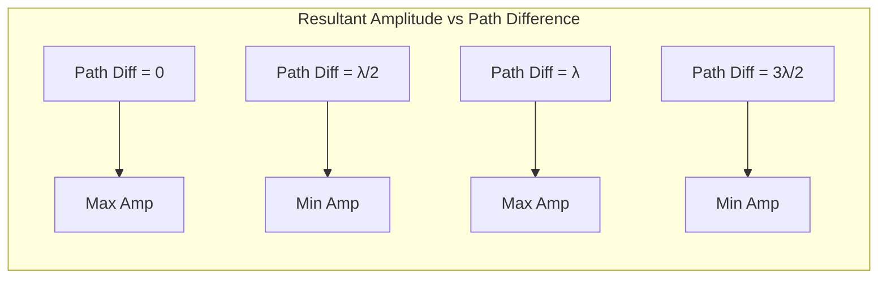

---
# Constructive and Destructive Interference / 相长干涉与相消干涉

---

# 1. Overview / 概述

**English:**
This sub-topic explores the two fundamental outcomes of wave superposition: constructive interference, where waves reinforce each other to produce a larger amplitude, and destructive interference, where waves cancel each other out. It is the core physical phenomenon that explains how two or more waves combine in space, forming the basis for understanding [[Young's Double-Slit Experiment]], [[Stationary Waves]], and [[Diffraction and the Diffraction Grating]]. Mastering the conditions for constructive and destructive interference is essential for predicting interference patterns and solving related problems in optics and acoustics.

**中文:**
本子知识点探讨波叠加的两种基本结果：相长干涉（波相互增强，产生更大振幅）和相消干涉（波相互抵消）。这是解释两个或多个波在空间中如何组合的核心物理现象，是理解[[杨氏双缝实验]]、[[驻波]]和[[衍射与衍射光栅]]的基础。掌握相长干涉和相消干涉的条件，对于预测干涉图样以及解决光学和声学中的相关问题至关重要。

---

# 2. Syllabus Learning Objectives / 考纲学习目标

| CAIE 9702 (8.1 a-e) | Edexcel IAL (WPH11 U2: 5.12-5.16) |
|-----------|-------------|
| Understand the principle of superposition and its application to interference. | Understand the conditions for constructive and destructive interference. |
| Define and apply the conditions for constructive and destructive interference in terms of path difference and phase difference. | Apply the conditions for constructive and destructive interference to waves from two coherent sources. |
| Describe experiments that demonstrate interference of waves (e.g., sound, light, microwaves). | Describe experiments to demonstrate interference (e.g., Young's double-slit, ripple tank). |
| Explain the meaning of coherence. | Understand the concept of coherence and its importance for observable interference. |
| Solve problems involving path difference and phase difference. | Solve problems involving the interference of waves. |

**Examiner Expectations / 考官期望:**
- **English:** Students must be able to state the exact conditions for constructive and destructive interference in terms of path difference ($\Delta x$) and phase difference ($\Delta \phi$). They must understand that these conditions are derived from the [[Principle of Superposition]]. A common requirement is to apply these conditions to two-source interference patterns, such as those from [[Young's Double-Slit Experiment]] or a ripple tank.
- **中文:** 学生必须能够用光程差 ($\Delta x$) 和相位差 ($\Delta \phi$) 精确表述相长干涉和相消干涉的条件。他们必须理解这些条件是从[[叠加原理]]推导出来的。一个常见的要求是将这些条件应用于双源干涉图样，例如来自[[杨氏双缝实验]]或波纹槽的图样。

---

# 3. Core Definitions / 核心定义

| Term (EN/CN) | Definition (EN) | Definition (CN) | Common Mistakes / 常见错误 |
|--------------|-----------------|-----------------|---------------------------|
| **Constructive Interference** / 相长干涉 | Superposition of two waves resulting in a resultant wave of greater amplitude than either individual wave. | 两个波叠加后产生的合成波振幅大于其中任何一个单独波的振幅。 | Confusing amplitude with intensity. Amplitude doubles, but intensity quadruples (since $I \propto A^2$). |
| **Destructive Interference** / 相消干涉 | Superposition of two waves resulting in a resultant wave of smaller amplitude than either individual wave. For identical waves, the resultant amplitude is zero. | 两个波叠加后产生的合成波振幅小于其中任何一个单独波的振幅。对于完全相同的波，合成振幅为零。 | Thinking that destructive interference always means total cancellation. This only happens if the waves have equal amplitude. |
| **Coherence** / 相干性 | A property of two wave sources that have a constant phase difference and the same frequency. | 两个波源具有恒定相位差和相同频率的特性。 | Forgetting that coherence requires *constant* phase difference, not necessarily zero. |
| **Path Difference ($\Delta x$)** / 光程差 | The difference in the distance traveled by two waves from their sources to a point of superposition. | 两个波从各自波源到叠加点的路程差。 | Using the wrong units (must be in meters, not wavelengths). |
| **Phase Difference ($\Delta \phi$)** / 相位差 | The difference in phase between two points on a wave, or between two waves at a point. Often measured in degrees or radians. | 波上两点之间或某点处两个波之间的相位差。通常以度或弧度为单位。 | Confusing phase difference with path difference. They are related by $\Delta \phi = \frac{2\pi}{\lambda} \Delta x$. |

---

# 4. Key Concepts Explained / 关键概念详解

## 4.1 Conditions for Interference / 干涉条件

### Explanation / 解释
**English:**
For two waves to produce a stable, observable interference pattern, they must be **coherent**. This means they must have:
1.  The **same frequency**.
2.  A **constant phase difference**.

If these conditions are not met, the interference pattern will change too rapidly to be observed (e.g., with two separate light bulbs).

The type of interference (constructive or destructive) at a specific point depends on the **path difference** ($\Delta x$) between the two waves arriving at that point.

- **Constructive Interference:** Occurs when the waves arrive **in phase**. This happens when the path difference is a whole number of wavelengths.
    $$ \Delta x = n\lambda \quad \text{where } n = 0, 1, 2, 3, ... $$
    The corresponding phase difference is:
    $$ \Delta \phi = 2n\pi \quad \text{radians} $$

- **Destructive Interference:** Occurs when the waves arrive **out of phase** by half a cycle. This happens when the path difference is an odd number of half-wavelengths.
    $$ \Delta x = (n + \frac{1}{2})\lambda \quad \text{where } n = 0, 1, 2, 3, ... $$
    The corresponding phase difference is:
    $$ \Delta \phi = (2n+1)\pi \quad \text{radians} $$

**中文:**
要使两个波产生稳定、可观察的干涉图样，它们必须是**相干的**。这意味着它们必须满足：
1.  具有**相同的频率**。
2.  具有**恒定的相位差**。

如果不满足这些条件，干涉图样变化太快而无法被观察到（例如，使用两个独立的灯泡）。

在特定点处的干涉类型（相长或相消）取决于到达该点的两个波之间的**光程差** ($\Delta x$)。

- **相长干涉：** 当波**同相**到达时发生。这发生在光程差为波长的整数倍时。
    $$ \Delta x = n\lambda \quad \text{其中 } n = 0, 1, 2, 3, ... $$
    对应的相位差为：
    $$ \Delta \phi = 2n\pi \quad \text{弧度} $$

- **相消干涉：** 当波**反相**（相差半个周期）到达时发生。这发生在光程差为半波长的奇数倍时。
    $$ \Delta x = (n + \frac{1}{2})\lambda \quad \text{其中 } n = 0, 1, 2, 3, ... $$
    对应的相位差为：
    $$ \Delta \phi = (2n+1)\pi \quad \text{弧度} $$

### Physical Meaning / 物理意义
**English:**
Constructive interference represents energy being concentrated at certain points (antinodes), while destructive interference represents energy being removed from other points (nodes). The total energy is conserved; it is simply redistributed in space.

**中文:**
相长干涉代表能量集中在某些点（波腹），而相消干涉代表能量从其他点（波节）移除。总能量是守恒的；它只是在空间中被重新分布。

### Common Misconceptions / 常见误区
- **English:**
    - Thinking that destructive interference destroys energy. It only redistributes it.
    - Assuming that any two waves will produce a stable interference pattern. They must be coherent.
    - Forgetting that the path difference condition depends on the wavelength of the wave in the medium.
- **中文:**
    - 认为相消干涉会摧毁能量。它只是重新分布能量。
    - 假设任意两个波都会产生稳定的干涉图样。它们必须是相干的。
    - 忘记光程差条件取决于波在介质中的波长。

### Exam Tips / 考试提示
- **English:** Always state the condition for constructive ($n\lambda$) and destructive ($(n+1/2)\lambda$) interference explicitly. When solving problems, first identify if the sources are in phase or out of phase. If the sources are initially out of phase by $\pi$, the conditions for constructive and destructive interference swap.
- **中文:** 始终明确表述相长干涉 ($n\lambda$) 和相消干涉 ($(n+1/2)\lambda$) 的条件。解题时，首先确定波源是同相还是反相。如果波源初始相位差为 $\pi$，则相长和相消干涉的条件会互换。

> 📷 **IMAGE PROMPT — DIAGRAM-01: Superposition of Two Waves**
> A diagram showing two sinusoidal waves (Wave 1 and Wave 2) of equal amplitude and frequency. In the top panel, they are perfectly in phase, and the resultant wave (Wave 1+2) has double the amplitude. In the bottom panel, they are perfectly out of phase (shifted by half a wavelength), and the resultant wave is a flat line (zero amplitude). Labels: "Constructive Interference", "Destructive Interference", "In Phase", "Out of Phase".

---

# 5. Essential Equations / 核心公式

## Equation 1: Condition for Constructive Interference / 相长干涉条件

$$ \Delta x = n\lambda \quad \text{or} \quad \Delta \phi = 2n\pi $$

| Symbol (符号) | Meaning (EN) | Meaning (CN) | Unit (单位) |
|--------------|-------------|-------------|------------|
| $\Delta x$ | Path difference | 光程差 | m |
| $n$ | Integer (0, 1, 2, ...) | 整数 (0, 1, 2, ...) | - |
| $\lambda$ | Wavelength | 波长 | m |
| $\Delta \phi$ | Phase difference | 相位差 | rad |

**Conditions / 适用条件:** Waves must be coherent (same frequency, constant phase difference). **中文:** 波必须是相干的（相同频率，恒定相位差）。
**Limitations / 局限性:** This is for ideal, monochromatic waves. Real waves may have amplitude differences, leading to incomplete cancellation. **中文:** 这适用于理想的单色波。实际波可能存在振幅差异，导致不完全抵消。

## Equation 2: Condition for Destructive Interference / 相消干涉条件

$$ \Delta x = (n + \frac{1}{2})\lambda \quad \text{or} \quad \Delta \phi = (2n+1)\pi $$

| Symbol (符号) | Meaning (EN) | Meaning (CN) | Unit (单位) |
|--------------|-------------|-------------|------------|
| $\Delta x$ | Path difference | 光程差 | m |
| $n$ | Integer (0, 1, 2, ...) | 整数 (0, 1, 2, ...) | - |
| $\lambda$ | Wavelength | 波长 | m |
| $\Delta \phi$ | Phase difference | 相位差 | rad |

**Conditions / 适用条件:** Waves must be coherent and have equal (or nearly equal) amplitude for total cancellation. **中文:** 波必须是相干的，并且具有相等（或几乎相等）的振幅才能完全抵消。
**Limitations / 局限性:** If amplitudes are not equal, the resultant amplitude is non-zero. **中文:** 如果振幅不相等，合成振幅不为零。

## Equation 3: Relationship between Path Difference and Phase Difference / 光程差与相位差的关系

$$ \Delta \phi = \frac{2\pi}{\lambda} \Delta x $$

| Symbol (符号) | Meaning (EN) | Meaning (CN) | Unit (单位) |
|--------------|-------------|-------------|------------|
| $\Delta \phi$ | Phase difference | 相位差 | rad |
| $\lambda$ | Wavelength | 波长 | m |
| $\Delta x$ | Path difference | 光程差 | m |

**Derivation / 推导:** A path difference of one wavelength ($\lambda$) corresponds to a phase difference of $2\pi$ radians. Therefore, the phase difference per unit path length is $2\pi / \lambda$. **中文:** 一个波长 ($\lambda$) 的光程差对应 $2\pi$ 弧度的相位差。因此，单位光程长度的相位差为 $2\pi / \lambda$。

---

# 6. Graphs and Relationships / 图表与关系

## 6.1 Resultant Amplitude vs. Path Difference / 合成振幅与光程差的关系

### Axes / 坐标轴
- **X-axis:** Path Difference ($\Delta x$) in units of $\lambda$ / 光程差 (以 $\lambda$ 为单位)
- **Y-axis:** Resultant Amplitude ($A_{res}$) / 合成振幅 ($A_{res}$)

### Shape / 形状
A periodic function. The amplitude is maximum (2A) at $\Delta x = 0, \lambda, 2\lambda, ...$ and minimum (0) at $\Delta x = \lambda/2, 3\lambda/2, 5\lambda/2, ...$.

### Gradient Meaning / 斜率含义
The gradient shows how quickly the resultant amplitude changes with a small change in path difference. It is steepest near the points of destructive interference.

### Area Meaning / 面积含义
The area under the graph is not physically meaningful in this context.

### Exam Interpretation / 考试解读
**English:** This graph is a visual representation of the interference pattern. Peaks correspond to constructive interference (bright fringes in light, loud spots in sound), and troughs correspond to destructive interference (dark fringes, quiet spots). **中文:** 此图是干涉图样的视觉表示。波峰对应相长干涉（光的亮纹，声音的响亮点），波谷对应相消干涉（暗纹，安静点）。



---

# 7. Required Diagrams / 必备图表

## 7.1 Two-Source Interference Pattern / 双源干涉图样

### Description / 描述
**English:** A diagram showing two point sources (S1 and S2) emitting coherent waves. Concentric circles represent wavefronts. Lines are drawn from S1 and S2 to various points (P1, P2, P3) on a screen. The path difference ($\Delta x = |S_2P - S_1P|$) is calculated for each point. Points where $\Delta x = n\lambda$ are labeled as "Constructive" (bright fringe), and points where $\Delta x = (n+1/2)\lambda$ are labeled as "Destructive" (dark fringe). **中文:** 一个显示两个点波源 (S1 和 S2) 发射相干波的示意图。同心圆代表波阵面。从 S1 和 S2 到屏幕上不同点 (P1, P2, P3) 画线。计算每个点的光程差 ($\Delta x = |S_2P - S_1P|$)。$\Delta x = n\lambda$ 的点标记为“相长”（亮纹），$\Delta x = (n+1/2)\lambda$ 的点标记为“相消”（暗纹）。

### Image Prompt / 图片生成提示
> 📷 **IMAGE PROMPT — DIAGRAM-02: Two-Source Interference Pattern**
> A clear physics diagram. Two point sources S1 and S2 are separated by a distance d. Concentric circular wavefronts emanate from each source. A vertical screen is placed to the right. Three points P1, P2, and P3 are marked on the screen. Dashed lines connect S1 and S2 to P2. The path difference S2P2 - S1P2 is labeled as Δx. P2 is at the center (n=0, constructive). P1 is the first bright fringe above center (n=1, constructive). P3 is the first dark fringe above center (n=0, destructive). Labels: "S1", "S2", "Screen", "Constructive (Bright)", "Destructive (Dark)", "Δx = nλ", "Δx = (n+1/2)λ".

### Labels Required / 需要标注
- **English:** S1, S2 (sources), d (separation), Screen, Path Difference ($\Delta x$), Constructive, Destructive, Central Maximum (n=0).
- **中文:** S1, S2 (波源), d (间距), 屏幕, 光程差 ($\Delta x$), 相长, 相消, 中央极大 (n=0).

### Exam Importance / 考试重要性
**English:** This diagram is the foundation for understanding [[Young's Double-Slit Experiment]] and is frequently used in exam questions to test the application of path difference conditions. **中文:** 此图是理解[[杨氏双缝实验]]的基础，常用于考试题目中测试光程差条件的应用。

---

# 8. Worked Examples / 典型例题

## Example 1: Identifying Interference Type / 识别干涉类型

### Question / 题目
**English:** Two coherent sources of microwaves of wavelength 3.0 cm are placed 12 cm apart. A detector is moved along a line perpendicular to the line joining the sources. At a point P, the distances from the two sources are 45.0 cm and 46.5 cm. Determine whether constructive or destructive interference occurs at P.
**中文:** 两个波长为 3.0 cm 的相干微波源相距 12 cm。一个探测器沿着垂直于两波源连线的直线移动。在某点 P，到两个波源的距离分别为 45.0 cm 和 46.5 cm。判断在 P 点发生的是相长干涉还是相消干涉。

### Solution / 解答
**Step 1: Calculate the path difference.**
$$ \Delta x = |46.5 - 45.0| = 1.5 \text{ cm} $$

**Step 2: Compare the path difference to the wavelength.**
$$ \frac{\Delta x}{\lambda} = \frac{1.5}{3.0} = 0.5 $$

**Step 3: Apply the condition.**
Since $\Delta x = 0.5\lambda = (0 + \frac{1}{2})\lambda$, this satisfies the condition for destructive interference.

**中文:**
**步骤 1：计算光程差。**
$$ \Delta x = |46.5 - 45.0| = 1.5 \text{ cm} $$
**步骤 2：将光程差与波长比较。**
$$ \frac{\Delta x}{\lambda} = \frac{1.5}{3.0} = 0.5 $$
**步骤 3：应用条件。**
由于 $\Delta x = 0.5\lambda = (0 + \frac{1}{2})\lambda$，这满足相消干涉的条件。

### Final Answer / 最终答案
**Answer:** Destructive interference occurs at P. | **答案：** 在 P 点发生相消干涉。

### Quick Tip / 提示
**English:** Always express the path difference in terms of the wavelength ($\Delta x / \lambda$). If the result is an integer, it's constructive. If it's a half-integer (0.5, 1.5, 2.5...), it's destructive. **中文:** 始终用波长来表示光程差 ($\Delta x / \lambda$)。如果结果是整数，则为相长干涉；如果是半整数 (0.5, 1.5, 2.5...)，则为相消干涉。

---

# 9. Past Paper Question Types / 历年真题题型

| Question Type / 题型 | Frequency / 频率 | Difficulty / 难度 | Past Paper References / 真题索引 |
|----------------------|------------------|------------------|-------------------------------|
| **Calculation of path/phase difference** / 计算光程差/相位差 | High | Easy | 📝 *待填入* |
| **Identifying interference type from given distances** / 根据给定距离识别干涉类型 | High | Medium | 📝 *待填入* |
| **Explaining conditions for stable interference (coherence)** / 解释稳定干涉的条件（相干性） | Medium | Medium | 📝 *待填入* |
| **Describing experiments to demonstrate interference** / 描述演示干涉的实验 | Medium | Medium | 📝 *待填入* |
| **Application to Young's double-slit or ripple tank** / 应用于杨氏双缝或波纹槽 | High | Hard | 📝 *待填入* |

**Common Command Words / 常见指令词:**
- **English:** State, Define, Calculate, Determine, Explain, Describe, Show that.
- **中文:** 陈述，定义，计算，确定，解释，描述，证明。

---

# 10. Practical Skills Connections / 实验技能链接

**English:**
This sub-topic is directly tested in practical contexts.
- **Ripple Tank:** You must be able to set up a ripple tank to demonstrate two-source interference. You should identify nodal lines (destructive interference) and antinodal lines (constructive interference). You may be asked to measure the wavelength using the interference pattern.
- **Microwave Interference:** Using a microwave transmitter and receiver with a double slit, you can map out maxima and minima. This requires careful measurement of positions and understanding of path difference.
- **Sound Interference:** Using two loudspeakers connected to the same signal generator, you can walk through the interference pattern, identifying loud (constructive) and quiet (destructive) spots.
- **Key Skills:** Measuring distances accurately, calculating path differences, identifying maxima and minima, and explaining how the pattern changes with frequency/wavelength.

**中文:**
本子知识点在实验环境中直接进行测试。
- **波纹槽：** 你必须能够设置波纹槽来演示双源干涉。你应该能识别节线（相消干涉）和腹线（相长干涉）。可能会要求你利用干涉图样测量波长。
- **微波干涉：** 使用微波发射器和接收器以及双缝，你可以绘制出极大值和极小值。这需要仔细测量位置并理解光程差。
- **声音干涉：** 使用连接到同一信号发生器的两个扬声器，你可以走过干涉图样，识别响亮（相长）和安静（相消）的位置。
- **关键技能：** 准确测量距离，计算光程差，识别极大值和极小值，并解释图样如何随频率/波长变化。

---

# 11. Concept Map / 概念图谱

```mermaid
graph TD
    %% Show connections for this leaf node
    A[Constructive & Destructive Interference] --> B{Requires};
    B --> C[Coherent Sources];
    B --> D[Principle of Superposition];
    
    A --> E{Determined by};
    E --> F[Path Difference (Δx)];
    E --> G[Phase Difference (Δφ)];
    
    F --> H[Δx = nλ → Constructive];
    F --> I[Δx = (n+1/2)λ → Destructive];
    
    G --> J[Δφ = 2nπ → Constructive];
    G --> K[Δφ = (2n+1)π → Destructive];
    
    A --> L[Applications];
    L --> M[Young's Double-Slit Experiment];
    L --> N[Stationary Waves];
    L --> O[Diffraction Grating];
    L --> P[Ripple Tank];
    
    C --> Q[Same Frequency];
    C --> R[Constant Phase Difference];
    
    subgraph "Prerequisites"
        S[Progressive Waves]
    end
    S --> A;
```

---

# 12. Quick Revision Sheet / 速查表

| Category / 类别 | Key Points / 要点 |
|----------------|------------------|
| **Definition / 定义** | Constructive: waves reinforce (amplitude increases). Destructive: waves cancel (amplitude decreases). / 相长：波增强（振幅增加）。相消：波抵消（振幅减小）。 |
| **Key Condition / 核心条件** | Constructive: $\Delta x = n\lambda$ or $\Delta \phi = 2n\pi$. Destructive: $\Delta x = (n+\frac{1}{2})\lambda$ or $\Delta \phi = (2n+1)\pi$. |
| **Key Requirement / 关键要求** | Sources must be **coherent** (same frequency, constant phase difference). / 波源必须是**相干的**（相同频率，恒定相位差）。 |
| **Key Graph / 核心图表** | Resultant Amplitude vs Path Difference: Peaks at $n\lambda$, Troughs at $(n+1/2)\lambda$. / 合成振幅与光程差图：在 $n\lambda$ 处为波峰，在 $(n+1/2)\lambda$ 处为波谷。 |
| **Exam Tip / 考试提示** | Always calculate $\Delta x / \lambda$. Integer = constructive; Half-integer = destructive. / 始终计算 $\Delta x / \lambda$。整数 = 相长；半整数 = 相消。 |