# 1. Overview / 概述

**English:**
Superposition and Interference is a foundational wave phenomenon that describes what happens when two or more waves meet at the same point in space. The principle of superposition states that the resultant displacement at any point is the vector sum of the individual displacements of each wave. When waves from coherent sources (sources with a constant phase difference) overlap, they produce a stable interference pattern of alternating regions of constructive interference (where waves reinforce) and destructive interference (where waves cancel). This topic is central to understanding wave behaviour in both Cambridge 9702 and Edexcel IAL A-Level Physics, appearing in multiple-choice, structured, and practical-based questions. Real-world applications include noise-cancelling headphones, anti-reflective coatings on lenses, radio wave interference in telecommunications, and the famous [[Young's Double-Slit Experiment]] which historically proved the wave nature of light. Mastering this topic is essential for progressing to [[Stationary Waves]] and [[Diffraction and the Diffraction Grating]].

**中文：**
叠加与干涉是一种基础波动现象，描述了两个或多个波在空间同一点相遇时发生的情况。叠加原理指出，任意点的合位移是每个波单独位移的矢量和。当来自相干波源（相位差恒定的波源）的波重叠时，会产生稳定的干涉图样，交替出现相长干涉（波相互增强）和相消干涉（波相互抵消）的区域。本主题是理解剑桥9702和爱德思IAL A-Level物理中波动行为的核心，出现在选择题、结构题和实验题中。实际应用包括降噪耳机、镜头上的抗反射涂层、电信中的无线电波干涉以及著名的[[杨氏双缝实验]]，该实验历史上证明了光的波动性。掌握本主题对于学习[[驻波]]和[[衍射与衍射光栅]]至关重要。

---

# 2. Syllabus Learning Objectives / 考纲学习目标

| CAIE 9702 (8.1 a-e) | Edexcel IAL (WPH11 U2: 5.12-5.16) |
|---------------------|-----------------------------------|
| 8.1(a) State and apply the principle of superposition | 5.12 Understand the principle of superposition and its application to the formation of stationary waves and interference patterns |
| 8.1(b) Describe the formation of stationary waves by superposition | 5.13 Understand the conditions required for observable interference: coherent sources, same frequency, similar amplitude |
| 8.1(c) Explain the meaning of constructive and destructive interference | 5.14 Understand the relationship between path difference and phase difference |
| 8.1(d) State the conditions for observable interference | 5.15 Understand the concept of coherence and the conditions for observable interference patterns |
| 8.1(e) Apply the principle of superposition to the [[Young's Double-Slit Experiment]] | 5.16 Apply the principle of superposition to the [[Young's Double-Slit Experiment]] and calculate fringe spacing using $w = \frac{\lambda D}{s}$ |

**Examiner Expectations / 考官期望:**

**English:**
- Candidates must be able to state the principle of superposition precisely: "When two or more waves meet at a point, the resultant displacement is the vector sum of the individual displacements."
- Candidates must distinguish between constructive interference (waves in phase, path difference = nλ) and destructive interference (waves in antiphase, path difference = (n+½)λ).
- Candidates must understand that coherence requires a constant phase difference, not necessarily zero phase difference.
- For [[Young's Double-Slit Experiment]], candidates must recall the formula $w = \frac{\lambda D}{s}$ and understand the conditions for a clear interference pattern.
- Candidates should be able to explain why two independent light sources cannot produce observable interference (they are incoherent).

**中文：**
- 考生必须能够精确陈述叠加原理："当两个或多个波在一点相遇时，合位移是各单独位移的矢量和。"
- 考生必须区分相长干涉（波同相，光程差 = nλ）和相消干涉（波反相，光程差 = (n+½)λ）。
- 考生必须理解相干性要求恒定的相位差，不一定是零相位差。
- 对于[[杨氏双缝实验]]，考生必须记住公式 $w = \frac{\lambda D}{s}$ 并理解清晰干涉图样的条件。
- 考生应能解释为什么两个独立光源不能产生可观察的干涉（它们是非相干的）。

> 📋 **CIE Only:** CAIE specifically requires candidates to describe the formation of [[Stationary Waves]] by superposition (8.1b) and to explain the meaning of constructive and destructive interference (8.1c). The term "antinode" and "node" are explicitly tested in the stationary waves context.

> 📋 **Edexcel Only:** Edexcel explicitly requires understanding of the relationship between path difference and phase difference (5.14) and the concept of coherence (5.15). The formula $w = \frac{\lambda D}{s}$ is directly stated in the syllabus for fringe spacing calculations.

---

# 3. Core Definitions / 核心定义

| Term (EN/CN) | Definition (EN) | Definition (CN) | Common Mistakes / 常见错误 |
|--------------|-----------------|-----------------|---------------------------|
| **[[Principle of Superposition]] / 叠加原理** | When two or more waves meet at a point, the resultant displacement is the vector sum of the individual displacements of each wave. | 当两个或多个波在一点相遇时，合位移是每个波单独位移的矢量和。 | ❌ Forgetting that displacement is a vector quantity — students often add magnitudes without considering direction. |
| **[[Constructive and Destructive Interference\|Constructive Interference]] / 相长干涉** | Interference that occurs when waves meet in phase (phase difference = 0°, 360°, etc.), resulting in maximum amplitude. | 当波同相相遇（相位差 = 0°, 360°等）时发生的干涉，产生最大振幅。 | ❌ Thinking constructive interference always means the waves have the same amplitude — they can have different amplitudes; the resultant is the sum. |
| **[[Constructive and Destructive Interference\|Destructive Interference]] / 相消干涉** | Interference that occurs when waves meet in antiphase (phase difference = 180°, 540°, etc.), resulting in minimum amplitude. | 当波反相相遇（相位差 = 180°, 540°等）时发生的干涉，产生最小振幅。 | ❌ Assuming destructive interference always gives zero amplitude — this only happens if the waves have equal amplitudes. |
| **[[Path Difference and Phase Difference\|Path Difference]] / 光程差** | The difference in distance travelled by two waves from their sources to a point of observation. | 两个波从波源到观察点所经过的距离之差。 | ❌ Confusing path difference with phase difference — they are related but not the same. |
| **[[Path Difference and Phase Difference\|Phase Difference]] / 相位差** | The difference in phase between two waves at a point, measured in degrees or radians. | 在一点处两个波之间的相位差异，以度或弧度为单位。 | ❌ Forgetting that 360° = 2π rad = one complete wavelength. |
| **Coherence / 相干性** | A property of two wave sources that have a constant phase difference (and the same frequency). | 两个波源具有恒定相位差（且频率相同）的特性。 | ❌ Thinking coherence means zero phase difference — it means constant phase difference. |
| **Fringe Spacing / 条纹间距** | The distance between adjacent bright (or dark) fringes in an interference pattern. | 干涉图样中相邻亮条纹（或暗条纹）之间的距离。 | ❌ Measuring from centre of bright to centre of adjacent bright correctly, but confusing with distance from central maximum. |
| **[[Young's Double-Slit Experiment]] / 杨氏双缝实验** | An experiment that demonstrates the wave nature of light by producing an interference pattern from two coherent slits. | 通过两个相干狭缝产生干涉图样来证明光的波动性的实验。 | ❌ Forgetting that the slits must be very narrow (comparable to λ) and very close together. |

---

# 4. Key Concepts Explained / 关键概念详解

## 4.1 The Principle of Superposition / 叠加原理

### Explanation / 解释
**English:**
The [[Principle of Superposition]] is the cornerstone of all interference phenomena. It states that when two or more waves overlap at a point in space, the resultant displacement $y_{\text{resultant}}$ is the vector sum of the individual displacements $y_1, y_2, y_3, ...$:

$$y_{\text{resultant}} = y_1 + y_2 + y_3 + ...$$

This principle applies to all types of waves: mechanical waves (sound, water), electromagnetic waves (light, radio), and matter waves. The key point is that waves pass through each other without being permanently altered — they simply add together at the point of overlap and then continue on their original paths. This is fundamentally different from particles colliding.

**中文：**
[[叠加原理]]是所有干涉现象的基石。它指出当两个或多个波在空间一点重叠时，合位移 $y_{\text{resultant}}$ 是各单独位移 $y_1, y_2, y_3, ...$ 的矢量和：

$$y_{\text{resultant}} = y_1 + y_2 + y_3 + ...$$

该原理适用于所有类型的波：机械波（声波、水波）、电磁波（光、无线电波）和物质波。关键在于波相互穿过而不会永久改变——它们只是在重叠点相加，然后继续沿原路径传播。这与粒子碰撞有根本区别。

### Physical Meaning / 物理意义
**English:**
Imagine two people shaking a rope from opposite ends. When the pulses meet in the middle, the rope's displacement at that instant is the sum of what each pulse would have produced alone. After they pass, each pulse continues unchanged. This is why we can hear conversations in a crowded room — sound waves from different people superimpose without destroying each other.

**中文：**
想象两个人从两端抖动一根绳子。当脉冲在中间相遇时，绳子在该时刻的位移是每个脉冲单独产生的位移之和。它们通过后，每个脉冲继续不变地传播。这就是为什么我们能在拥挤的房间里听到对话——来自不同人的声波叠加而不会相互破坏。

### Common Misconceptions / 常见误区
1. ❌ "Waves destroy each other during destructive interference." — No, they cancel only at the instant of overlap; energy is redistributed, not destroyed.
2. ❌ "Superposition only applies to waves of the same type." — No, it applies universally to all waves.
3. ❌ "The resultant amplitude is always larger than individual amplitudes." — No, destructive interference can produce smaller amplitudes.

### Exam Tips / 考试提示
**English:**
- Always state the principle in full: "The resultant displacement is the vector sum of the individual displacements."
- Use vector addition language — this shows the examiner you understand the vector nature.
- For CAIE, expect questions linking superposition to [[Stationary Waves]] formation.
- For Edexcel, expect questions linking superposition to interference patterns.

**中文：**
- 始终完整陈述原理："合位移是各单独位移的矢量和。"
- 使用矢量加法语言——这向考官表明你理解矢量性质。
- 对于CAIE，预期有将叠加与[[驻波]]形成联系起来的问题。
- 对于Edexcel，预期有将叠加与干涉图样联系起来的问题。

---

## 4.2 Constructive and Destructive Interference / 相长干涉与相消干涉

### Explanation / 解释
**English:**
When two waves of the same frequency and similar amplitude superimpose, they produce interference. The type of interference depends on the [[Path Difference and Phase Difference|phase difference]] between the waves at the point of observation.

**Constructive Interference:** Occurs when waves meet in phase (phase difference = 0°, 360°, 720°, ... or 0, 2π, 4π, ... rad). The path difference is an integer number of wavelengths:

$$\text{Path difference} = n\lambda \quad \text{where } n = 0, 1, 2, 3, ...$$

The resultant amplitude is the sum of the individual amplitudes: $A_{\text{resultant}} = A_1 + A_2$. If $A_1 = A_2 = A$, then $A_{\text{resultant}} = 2A$, and intensity $I \propto (2A)^2 = 4A^2$, which is four times the intensity of a single wave.

**Destructive Interference:** Occurs when waves meet in antiphase (phase difference = 180°, 540°, 900°, ... or π, 3π, 5π, ... rad). The path difference is an odd number of half-wavelengths:

$$\text{Path difference} = (n + \frac{1}{2})\lambda \quad \text{where } n = 0, 1, 2, 3, ...$$

The resultant amplitude is the difference of the individual amplitudes: $A_{\text{resultant}} = |A_1 - A_2|$. If $A_1 = A_2 = A$, then $A_{\text{resultant}} = 0$, and intensity $I = 0$.

**中文：**
当两个频率相同、振幅相近的波叠加时，会产生干涉。干涉类型取决于观察点处波之间的[[光程差与相位差|相位差]]。

**相长干涉：** 当波同相相遇时发生（相位差 = 0°, 360°, 720°, ... 或 0, 2π, 4π, ... 弧度）。光程差为波长的整数倍：

$$\text{光程差} = n\lambda \quad \text{其中 } n = 0, 1, 2, 3, ...$$

合振幅为各振幅之和：$A_{\text{合}} = A_1 + A_2$。如果 $A_1 = A_2 = A$，则 $A_{\text{合}} = 2A$，强度 $I \propto (2A)^2 = 4A^2$，是单个波强度的四倍。

**相消干涉：** 当波反相相遇时发生（相位差 = 180°, 540°, 900°, ... 或 π, 3π, 5π, ... 弧度）。光程差为半波长的奇数倍：

$$\text{光程差} = (n + \frac{1}{2})\lambda \quad \text{其中 } n = 0, 1, 2, 3, ...$$

合振幅为各振幅之差：$A_{\text{合}} = |A_1 - A_2|$。如果 $A_1 = A_2 = A$，则 $A_{\text{合}} = 0$，强度 $I = 0$。

### Physical Meaning / 物理意义
**English:**
Think of two speakers playing the same note. If you stand at a point where the sound waves arrive in phase, you hear a loud sound (constructive). If you move to a point where they arrive out of phase, the sound is quieter (destructive). This is why moving your head slightly can change the volume when listening to stereo speakers — you're moving through regions of constructive and destructive interference.

**中文：**
想象两个扬声器播放相同的音符。如果你站在声波同相到达的点，你会听到响亮的声音（相长）。如果你移动到它们反相到达的点，声音会更安静（相消）。这就是为什么听立体声扬声器时稍微移动头部会改变音量——你正在穿过相长和相消干涉的区域。

### Common Misconceptions / 常见误区
1. ❌ "Destructive interference means no energy is transferred." — Energy is redistributed to regions of constructive interference; total energy is conserved.
2. ❌ "Constructive interference always gives double the amplitude." — Only if the waves have equal amplitudes.
3. ❌ "The path difference for destructive interference is always λ/2." — It can be 3λ/2, 5λ/2, etc.

### Exam Tips / 考试提示
**English:**
- For CAIE, be prepared to explain why two independent light sources cannot produce observable interference (they are incoherent — phase difference changes rapidly).
- For Edexcel, be prepared to calculate path difference from geometry and determine whether constructive or destructive interference occurs.
- Always specify whether you are calculating for bright fringes (constructive) or dark fringes (destructive).

**中文：**
- 对于CAIE，准备好解释为什么两个独立光源不能产生可观察的干涉（它们是非相干的——相位差快速变化）。
- 对于Edexcel，准备好从几何关系计算光程差并确定发生相长还是相消干涉。
- 始终明确你是在计算亮条纹（相长）还是暗条纹（相消）。

---

## 4.3 Path Difference and Phase Difference / 光程差与相位差

### Explanation / 解释
**English:**
[[Path Difference and Phase Difference|Path difference]] and phase difference are closely related concepts. The path difference $\Delta x$ is the difference in distance travelled by two waves from their sources to a point of observation. The phase difference $\Delta \phi$ is related to path difference by:

$$\Delta \phi = \frac{2\pi}{\lambda} \times \Delta x$$

Or in degrees: $\Delta \phi = \frac{360°}{\lambda} \times \Delta x$

Where:
- $\Delta \phi$ = phase difference (rad or degrees)
- $\Delta x$ = path difference (m)
- $\lambda$ = wavelength (m)

A path difference of one wavelength ($\Delta x = \lambda$) corresponds to a phase difference of $2\pi$ rad (360°). A path difference of half a wavelength ($\Delta x = \lambda/2$) corresponds to a phase difference of $\pi$ rad (180°).

**中文：**
[[光程差与相位差|光程差]]和相位差是密切相关的概念。光程差 $\Delta x$ 是两个波从波源到观察点所经过的距离之差。相位差 $\Delta \phi$ 与光程差的关系为：

$$\Delta \phi = \frac{2\pi}{\lambda} \times \Delta x$$

或以度表示：$\Delta \phi = \frac{360°}{\lambda} \times \Delta x$$

其中：
- $\Delta \phi$ = 相位差（弧度或度）
- $\Delta x$ = 光程差（米）
- $\lambda$ = 波长（米）

一个波长的光程差（$\Delta x = \lambda$）对应于 $2\pi$ 弧度（360°）的相位差。半个波长的光程差（$\Delta x = \lambda/2$）对应于 $\pi$ 弧度（180°）的相位差。

### Physical Meaning / 物理意义
**English:**
Imagine two runners starting at the same time but running different distances to reach the finish line. The path difference is the difference in distances they run. The phase difference is like the time delay between their arrivals — one runner arrives later than the other. For waves, this time delay determines whether they reinforce or cancel.

**中文：**
想象两个跑步者同时出发但跑不同距离到达终点线。光程差是他们跑的距离之差。相位差就像他们到达的时间差——一个跑步者比另一个晚到。对于波，这个时间差决定了它们是增强还是抵消。

### Common Misconceptions / 常见误区
1. ❌ "Path difference and phase difference are the same thing." — They are related but different; path difference is a distance, phase difference is an angle.
2. ❌ "Phase difference is always measured in degrees." — Both degrees and radians are used; radians are preferred in calculations.
3. ❌ "A path difference of λ always gives destructive interference." — No, λ gives constructive interference; λ/2 gives destructive.

### Exam Tips / 考试提示
**English:**
- For Edexcel, be prepared to convert between path difference and phase difference using the formula $\Delta \phi = \frac{2\pi}{\lambda} \times \Delta x$.
- For CAIE, be prepared to calculate path difference from geometry in [[Young's Double-Slit Experiment]].
- Remember: $2\pi$ rad = 360°, so $\pi$ rad = 180°.

**中文：**
- 对于Edexcel，准备好使用公式 $\Delta \phi = \frac{2\pi}{\lambda} \times \Delta x$ 在光程差和相位差之间转换。
- 对于CAIE，准备好从[[杨氏双缝实验]]的几何关系计算光程差。
- 记住：$2\pi$ 弧度 = 360°，所以 $\pi$ 弧度 = 180°。

---

## 4.4 Coherence / 相干性

### Explanation / 解释
**English:**
Coherence is a property of wave sources that is essential for producing observable, stable interference patterns. Two sources are coherent if they have:
1. **The same frequency** (or wavelength)
2. **A constant phase difference** (not necessarily zero)

If the phase difference changes randomly over time, the interference pattern will shift rapidly and become blurred — no stable pattern is observed. This is why two independent light sources (e.g., two light bulbs) cannot produce observable interference: their atoms emit light randomly, so the phase difference changes unpredictably.

Methods to produce coherent sources:
- Using a single source split into two paths (e.g., [[Young's Double-Slit Experiment]] uses a single light source illuminating two slits)
- Using a laser (which is inherently coherent)
- Using two speakers driven by the same signal generator

**中文：**
相干性是波源的一种特性，对于产生可观察的稳定干涉图样至关重要。两个波源如果满足以下条件则是相干的：
1. **相同的频率**（或波长）
2. **恒定的相位差**（不一定是零）

如果相位差随时间随机变化，干涉图样将快速移动并变得模糊——观察不到稳定的图样。这就是为什么两个独立光源（例如两个灯泡）不能产生可观察的干涉：它们的原子随机发射光，因此相位差不可预测地变化。

产生相干波源的方法：
- 使用单个波源分成两路（例如，[[杨氏双缝实验]]使用单个光源照射两个狭缝）
- 使用激光（本质上是相干的）
- 使用由同一信号发生器驱动的两个扬声器

### Physical Meaning / 物理意义
**English:**
Think of two dancers. If they dance to the same music (same frequency) and stay in sync (constant phase difference), they create a beautiful, predictable pattern. If they dance to different songs or randomly change their timing, the pattern is chaotic. Coherence is like having the dancers perfectly synchronized.

**中文：**
想象两个舞者。如果他们随着相同的音乐跳舞（相同频率）并保持同步（恒定相位差），他们会创造出美丽、可预测的图案。如果他们跳不同的歌曲或随机改变节奏，图案就会混乱。相干性就像舞者完美同步。

### Common Misconceptions / 常见误区
1. ❌ "Coherent sources must have zero phase difference." — No, they must have constant phase difference; it can be any constant value.
2. ❌ "Two identical lasers are always coherent." — They are coherent individually, but two separate lasers are not coherent with each other unless specially designed.
3. ❌ "Coherence is only important for light waves." — Coherence is important for all wave interference, including sound and water waves.

### Exam Tips / 考试提示
**English:**
- For both CAIE and Edexcel, be prepared to explain why two independent sources cannot produce observable interference.
- For Edexcel, the concept of coherence is explicitly stated in the syllabus (5.15).
- For CAIE, coherence is implied in the conditions for observable interference (8.1d).

**中文：**
- 对于CAIE和Edexcel，准备好解释为什么两个独立波源不能产生可观察的干涉。
- 对于Edexcel，相干性概念在考纲中明确陈述（5.15）。
- 对于CAIE，相干性在可观察干涉的条件中隐含（8.1d）。

---

## 4.5 The Young's Double-Slit Experiment / 杨氏双缝实验

### Explanation / 解释
**English:**
[[Young's Double-Slit Experiment]] is a landmark experiment that demonstrated the wave nature of light. Thomas Young (1801) passed monochromatic light through two narrow, closely spaced slits and observed an interference pattern of alternating bright and dark fringes on a screen.

**Setup:**
- A monochromatic light source (single wavelength) illuminates a single slit (to ensure coherence)
- Light from the single slit then illuminates two parallel slits (S₁ and S₂), which act as coherent sources
- The light from the two slits overlaps on a screen, producing an interference pattern

**Key Formula:**
The fringe spacing $w$ (distance between adjacent bright fringes) is given by:

$$w = \frac{\lambda D}{s}$$

Where:
- $w$ = fringe spacing (m)
- $\lambda$ = wavelength of light (m)
- $D$ = distance from double slits to screen (m)
- $s$ = slit separation (m)

**Derivation:**
For a point P on the screen at an angle $\theta$ from the central axis:
- Path difference = $s \sin \theta$
- For constructive interference (bright fringe): $s \sin \theta = n\lambda$
- For small angles: $\sin \theta \approx \tan \theta = \frac{x}{D}$ where $x$ is the distance from the central maximum
- So: $s \frac{x}{D} = n\lambda$
- For adjacent fringes ($n$ and $n+1$): $s \frac{w}{D} = \lambda$
- Therefore: $w = \frac{\lambda D}{s}$

**中文：**
[[杨氏双缝实验]]是一个里程碑式的实验，证明了光的波动性。托马斯·杨（1801年）将单色光通过两个狭窄、间距很近的狭缝，在屏幕上观察到明暗相间的干涉条纹图样。

**装置：**
- 单色光源（单一波长）照射一个单缝（以确保相干性）
- 来自单缝的光然后照射两个平行狭缝（S₁和S₂），它们作为相干波源
- 来自两个狭缝的光在屏幕上重叠，产生干涉图样

**关键公式：**
条纹间距 $w$（相邻亮条纹之间的距离）由下式给出：

$$w = \frac{\lambda D}{s}$$

其中：
- $w$ = 条纹间距（米）
- $\lambda$ = 光的波长（米）
- $D$ = 双缝到屏幕的距离（米）
- $s$ = 狭缝间距（米）

**推导：**
对于屏幕上与中心轴成角度 $\theta$ 的点P：
- 光程差 = $s \sin \theta$
- 对于相长干涉（亮条纹）：$s \sin \theta = n\lambda$
- 对于小角度：$\sin \theta \approx \tan \theta = \frac{x}{D}$，其中 $x$ 是距中央最大值的距离
- 所以：$s \frac{x}{D} = n\lambda$
- 对于相邻条纹（$n$ 和 $n+1$）：$s \frac{w}{D} = \lambda$
- 因此：$w = \frac{\lambda D}{s}$

### Physical Meaning / 物理意义
**English:**
The experiment shows that light behaves like a wave — if light were made of particles, you would expect only two bright lines on the screen (corresponding to the two slits). Instead, you see many alternating bright and dark fringes, which can only be explained by wave interference. The fringe spacing tells us about the wavelength of light — smaller fringe spacing means shorter wavelength.

**中文：**
该实验表明光的行为像波——如果光由粒子组成，你只会期望在屏幕上看到两条亮线（对应于两个狭缝）。相反，你看到许多明暗相间的条纹，这只能用波干涉来解释。条纹间距告诉我们光的波长——条纹间距越小意味着波长越短。

### Common Misconceptions / 常见误区
1. ❌ "The single slit is not necessary." — The single slit is essential to ensure that light reaching the double slits is coherent (from the same source).
2. ❌ "The fringes are equally spaced only for small angles." — Yes, the formula $w = \lambda D/s$ assumes small angles; for large angles, the spacing is not uniform.
3. ❌ "Increasing slit separation increases fringe spacing." — No, $w \propto 1/s$, so increasing $s$ decreases $w$.

### Exam Tips / 考试提示
**English:**
- For both CAIE and Edexcel, the formula $w = \lambda D/s$ is essential and must be memorized.
- For CAIE, be prepared to describe the experimental setup and explain how it demonstrates the wave nature of light.
- For Edexcel, be prepared to calculate fringe spacing and rearrange the formula.
- Common exam question: "Explain why the fringes become closer together when the slit separation is increased."
- Common exam question: "Explain why the fringes become further apart when the screen is moved further away."

**中文：**
- 对于CAIE和Edexcel，公式 $w = \lambda D/s$ 是必需的，必须记住。
- 对于CAIE，准备好描述实验装置并解释它如何证明光的波动性。
- 对于Edexcel，准备好计算条纹间距并重新排列公式。
- 常见考题："解释为什么增加狭缝间距时条纹变得更近。"
- 常见考题："解释为什么将屏幕移得更远时条纹变得更远。"

> 📷 **IMAGE PROMPT — YDSE-01: Young's Double-Slit Experiment Setup**
>
> A detailed scientific diagram showing the Young's double-slit experiment setup. Left side: a monochromatic light source (laser or filtered lamp) with a single slit. Center: a barrier with two narrow parallel slits labeled S₁ and S₂, with slit separation 's' indicated by a double-headed arrow. Right side: a screen showing an interference pattern of alternating bright and dark vertical fringes. A dashed line from the midpoint between slits to the central bright fringe on the screen is labeled 'central maximum'. The distance from the double slit to the screen is labeled 'D'. The distance between adjacent bright fringes is labeled 'w'. Clean, textbook-style diagram with clear labels, black lines on white background, professional scientific illustration style.

---

# 5. Essential Equations / 核心公式

## 5.1 Path Difference and Phase Difference Relationship / 光程差与相位差关系

**Equation / 公式:**
$$\Delta \phi = \frac{2\pi}{\lambda} \times \Delta x$$

**Variables / 变量:**
| Symbol (符号) | Meaning (EN) | Meaning (CN) | Unit (单位) |
|--------------|-------------|-------------|------------|
| $\Delta \phi$ | Phase difference | 相位差 | rad (radians) |
| $\lambda$ | Wavelength | 波长 | m |
| $\Delta x$ | Path difference | 光程差 | m |

**Derivation / 推导:**
**English:**
One complete wavelength $\lambda$ corresponds to a phase change of $2\pi$ rad. Therefore, the phase difference per unit distance is $\frac{2\pi}{\lambda}$. For a path difference $\Delta x$, the phase difference is $\Delta \phi = \frac{2\pi}{\lambda} \times \Delta x$.

**中文：**
一个完整的波长 $\lambda$ 对应于 $2\pi$ 弧度的相位变化。因此，单位距离的相位差为 $\frac{2\pi}{\lambda}$。对于光程差 $\Delta x$，相位差为 $\Delta \phi = \frac{2\pi}{\lambda} \times \Delta x$。

**Conditions / 适用条件:**
**English:** The waves must have the same frequency/wavelength. The formula assumes the waves are traveling in the same medium (same wave speed).

**中文：** 波必须具有相同的频率/波长。该公式假设波在同一介质中传播（相同的波速）。

**Limitations / 局限性:**
**English:** This formula only applies when the waves are traveling in the same medium. If the waves travel through different media, the wavelength changes, and the relationship becomes more complex.

**中文：** 该公式仅适用于波在同一介质中传播时。如果波通过不同介质传播，波长会改变，关系变得更加复杂。

**Rearrangements / 变形:**
$$\Delta x = \frac{\lambda}{2\pi} \times \Delta \phi$$
$$\lambda = \frac{2\pi \times \Delta x}{\Delta \phi}$$

---

## 5.2 Conditions for Constructive and Destructive Interference / 相长与相消干涉的条件

**Equation / 公式:**
$$\text{Constructive: } \Delta x = n\lambda \quad (n = 0, 1, 2, 3, ...)$$
$$\text{Destructive: } \Delta x = (n + \frac{1}{2})\lambda \quad (n = 0, 1, 2, 3, ...)$$

**Variables / 变量:**
| Symbol (符号) | Meaning (EN) | Meaning (CN) | Unit (单位) |
|--------------|-------------|-------------|------------|
| $\Delta x$ | Path difference | 光程差 | m |
| $\lambda$ | Wavelength | 波长 | m |
| $n$ | Order number (integer) | 级数（整数） | dimensionless |

**Derivation / 推导:**
**English:**
For constructive interference, waves must arrive in phase. A phase difference of $2\pi$ rad corresponds to a path difference of $\lambda$. Therefore, path differences of $0, \lambda, 2\lambda, 3\lambda, ...$ (i.e., $n\lambda$) give constructive interference.

For destructive interference, waves must arrive in antiphase. A phase difference of $\pi$ rad corresponds to a path difference of $\lambda/2$. Therefore, path differences of $\lambda/2, 3\lambda/2, 5\lambda/2, ...$ (i.e., $(n + 1/2)\lambda$) give destructive interference.

**中文：**
对于相长干涉，波必须同相到达。$2\pi$ 弧度的相位差对应于 $\lambda$ 的光程差。因此，光程差为 $0, \lambda, 2\lambda, 3\lambda, ...$（即 $n\lambda$）产生相长干涉。

对于相消干涉，波必须反相到达。$\pi$ 弧度的相位差对应于 $\lambda/2$ 的光程差。因此，光程差为 $\lambda/2, 3\lambda/2, 5\lambda/2, ...$（即 $(n + 1/2)\lambda$）产生相消干涉。

**Conditions / 适用条件:**
**English:** The waves must be coherent (same frequency, constant phase difference) and have similar amplitudes for clear interference patterns.

**中文：** 波必须是相干的（相同频率，恒定相位差）并且具有相似的振幅才能产生清晰的干涉图样。

**Limitations / 局限性:**
**English:** These conditions assume the waves start in phase at the sources. If there is an initial phase difference, the conditions must be adjusted accordingly.

**中文：** 这些条件假设波在波源处同相开始。如果存在初始相位差，则必须相应调整条件。

**Rearrangements / 变形:**
$$n = \frac{\Delta x}{\lambda} \quad \text{(for constructive)}$$
$$n = \frac{\Delta x}{\lambda} - \frac{1}{2} \quad \text{(for destructive)}$$

---

## 5.3 Fringe Spacing in Young's Double-Slit Experiment / 杨氏双缝实验中的条纹间距

**Equation / 公式:**
$$w = \frac{\lambda D}{s}$$

**Variables / 变量:**
| Symbol (符号) | Meaning (EN) | Meaning (CN) | Unit (单位) |
|--------------|-------------|-------------|------------|
| $w$ | Fringe spacing (distance between adjacent bright fringes) | 条纹间距（相邻亮条纹之间的距离） | m |
| $\lambda$ | Wavelength of light | 光的波长 | m |
| $D$ | Distance from double slits to screen | 双缝到屏幕的距离 | m |
| $s$ | Slit separation | 狭缝间距 | m |

**Derivation / 推导:**
**English:**
Consider a point P on the screen at an angle $\theta$ from the central axis. The path difference between waves from the two slits is $s \sin \theta$.

For constructive interference (bright fringe): $s \sin \theta = n\lambda$

For small angles ($\theta$ small), $\sin \theta \approx \tan \theta = \frac{x}{D}$, where $x$ is the distance from the central maximum to the $n$th bright fringe.

Therefore: $s \frac{x}{D} = n\lambda$

For the $n$th bright fringe: $x_n = \frac{n\lambda D}{s}$

For the $(n+1)$th bright fringe: $x_{n+1} = \frac{(n+1)\lambda D}{s}$

The fringe spacing $w = x_{n+1} - x_n = \frac{\lambda D}{s}$

**中文：**
考虑屏幕上与中心轴成角度 $\theta$ 的点P。来自两个狭缝的波之间的光程差为 $s \sin \theta$。

对于相长干涉（亮条纹）：$s \sin \theta = n\lambda$

对于小角度（$\theta$ 很小），$\sin \theta \approx \tan \theta = \frac{x}{D}$，其中 $x$ 是从中央最大值到第 $n$ 级亮条纹的距离。

因此：$s \frac{x}{D} = n\lambda$

对于第 $n$ 级亮条纹：$x_n = \frac{n\lambda D}{s}$

对于第 $(n+1)$ 级亮条纹：$x_{n+1} = \frac{(n+1)\lambda D}{s}$

条纹间距 $w = x_{n+1} - x_n = \frac{\lambda D}{s}$

**Conditions / 适用条件:**
**English:** 
- Small angle approximation ($\theta$ small, typically $\theta < 10°$)
- Monochromatic light (single wavelength)
- Coherent sources
- Narrow slits (width comparable to $\lambda$)
- Screen far from slits ($D \gg s$)

**中文：**
- 小角度近似（$\theta$ 很小，通常 $\theta < 10°$）
- 单色光（单一波长）
- 相干波源
- 狭缝很窄（宽度与 $\lambda$ 相当）
- 屏幕离狭缝很远（$D \gg s$）

**Limitations / 局限性:**
**English:**
- For large angles, the small angle approximation breaks down, and fringes are no longer equally spaced
- The formula assumes the slits are point sources; real slits have finite width which affects the pattern
- The formula does not account for diffraction effects from individual slits

**中文：**
- 对于大角度，小角度近似失效，条纹不再等间距
- 该公式假设狭缝为点源；实际狭缝有有限宽度，会影响图样
- 该公式未考虑单个狭缝的衍射效应

**Rearrangements / 变形:**
$$\lambda = \frac{ws}{D}$$
$$D = \frac{ws}{\lambda}$$
$$s = \frac{\lambda D}{w}$$

---

# 6. Graphs and Relationships / 图表与关系

## 6.1 Intensity Distribution in Young's Double-Slit Experiment / 杨氏双缝实验中的强度分布

### Axes / 坐标轴
**English:** x-axis: Position on screen (distance from central maximum, $x$); y-axis: Intensity ($I$)
**中文：** x轴：屏幕上的位置（距中央最大值的距离，$x$）；y轴：强度（$I$）

### Shape / 形状
**English:** A series of equally spaced peaks (bright fringes) with decreasing intensity as you move away from the centre. The central maximum is the brightest, and the intensity of successive maxima decreases gradually. Between bright fringes, the intensity drops to zero (for equal amplitude waves) or to a minimum (for unequal amplitudes).

**中文：** 一系列等间距的峰值（亮条纹），随着远离中心强度逐渐减小。中央最大值最亮，后续最大值的强度逐渐减小。在亮条纹之间，强度降至零（对于等振幅波）或降至最小值（对于不等振幅波）。

### Gradient Meaning / 斜率含义
**English:** The gradient of the intensity distribution is not typically examined directly. However, the rate at which intensity changes with position determines the sharpness of the fringes.

**中文：** 强度分布的斜率通常不直接考查。然而，强度随位置变化的速率决定了条纹的锐度。

### Area Meaning / 面积含义
**English:** The area under the intensity distribution curve represents the total energy (power) incident on the screen per unit time. This is conserved — the total energy in the interference pattern equals the sum of energies from the two slits individually.

**中文：** 强度分布曲线下的面积表示单位时间内入射到屏幕上的总能量（功率）。这是守恒的——干涉图样中的总能量等于两个狭缝单独的能量之和。

### Exam Interpretation / 考试解读
**English:**
- Be able to sketch the intensity distribution for Young's double-slit experiment
- Understand why the central maximum is the brightest
- Explain what happens to the pattern when one slit is covered (pattern disappears, single-slit diffraction pattern appears)
- Explain what happens when the slit separation is changed (fringe spacing changes)
- Explain what happens when the wavelength is changed (fringe spacing changes)

**中文：**
- 能够画出杨氏双缝实验的强度分布草图
- 理解为什么中央最大值最亮
- 解释当一个狭缝被遮盖时图样会发生什么变化（图样消失，出现单缝衍射图样）
- 解释当狭缝间距改变时会发生什么（条纹间距改变）
- 解释当波长改变时会发生什么（条纹间距改变）

### Common Questions / 常见问题
**English:**
- "Sketch the intensity distribution for the interference pattern produced by two coherent sources."
- "Explain why the intensity of successive maxima decreases."
- "What happens to the fringe spacing if the screen is moved further away?"

**中文：**
- "画出两个相干波源产生的干涉图样的强度分布草图。"
- "解释为什么后续最大值的强度减小。"
- "如果屏幕移得更远，条纹间距会发生什么变化？"

> 📷 **IMAGE PROMPT — YDSE-02: Intensity Distribution Graph**
>
> A graph showing intensity I on the y-axis against position x on the x-axis for Young's double-slit interference. The graph shows a series of equally spaced peaks with the central peak at x=0 being the highest. The peaks decrease in height symmetrically as |x| increases. Between peaks, intensity drops to zero. The x-axis is labeled "Position on screen / m" and the y-axis is labeled "Intensity / W m⁻²". The fringe spacing 'w' is indicated between two adjacent peaks. Clean, textbook-style graph with gridlines, black lines on white background.

---

## 6.2 Path Difference vs. Position on Screen / 光程差与屏幕上位置的关系

### Axes / 坐标轴
**English:** x-axis: Position on screen ($x$); y-axis: Path difference ($\Delta x$)
**中文：** x轴：屏幕上的位置（$x$）；y轴：光程差（$\Delta x$）

### Shape / 形状
**English:** For small angles, the path difference is approximately proportional to the position on screen: $\Delta x \approx \frac{sx}{D}$. This is a straight line through the origin with gradient $s/D$.

**中文：** 对于小角度，光程差近似与屏幕上的位置成正比：$\Delta x \approx \frac{sx}{D}$。这是一条通过原点的直线，斜率为 $s/D$。

### Gradient Meaning / 斜率含义
**English:** The gradient is $s/D$, which represents how quickly the path difference changes with position on the screen. A larger gradient means fringes are closer together.

**中文：** 斜率为 $s/D$，表示光程差随屏幕上位置变化的速率。斜率越大意味着条纹越近。

### Area Meaning / 面积含义
**English:** Not typically examined.

**中文：** 通常不考查。

### Exam Interpretation / 考试解读
**English:**
- Use this relationship to determine where constructive and destructive interference occur
- The path difference increases linearly with distance from the central maximum

**中文：**
- 使用此关系确定相长和相消干涉发生的位置
- 光程差随距中央最大值的距离线性增加

### Common Questions / 常见问题
**English:**
- "Calculate the path difference at a point 5 mm from the central maximum."
- "Determine whether constructive or destructive interference occurs at this point."

**中文：**
- "计算距中央最大值5毫米处的光程差。"
- "确定在该点发生相长还是相消干涉。"

---

# 7. Required Diagrams / 必备图表

## 7.1 Young's Double-Slit Experiment Setup / 杨氏双缝实验装置图

### Description / 描述
**English:**
A schematic diagram showing the complete experimental setup: a monochromatic light source (laser or filtered lamp) on the left, followed by a single slit (to ensure coherence), then a barrier with two parallel slits (S₁ and S₂) separated by distance 's', and finally a screen on the right showing the interference pattern. Key distances (D, s, w) should be labeled. The path difference for a point on the screen should be indicated.

**中文：**
显示完整实验装置的示意图：左侧为单色光源（激光或滤光灯），接着是一个单缝（以确保相干性），然后是一个带有两个平行狭缝（S₁和S₂）的屏障，间距为's'，最后是右侧显示干涉图样的屏幕。应标注关键距离（D, s, w）。应指示屏幕上某点的光程差。

### Image Prompt / 图片生成提示
> 📷 **IMAGE PROMPT — YDSE-03: Complete Experimental Setup**
>
> A detailed scientific diagram of Young's double-slit experiment. Left to right: a monochromatic light source (shown as a glowing lamp with a filter), a single narrow slit in a barrier, a double-slit barrier with two parallel slits labeled S₁ and S₂ with separation 's' indicated by a double-headed arrow, and a screen showing alternating bright and dark vertical fringes. The distance from the double slit to the screen is labeled 'D'. The distance between adjacent bright fringes on the screen is labeled 'w'. A dashed line from the midpoint between S₁ and S₂ to the central bright fringe shows the central axis. A second dashed line from S₂ to a bright fringe at angle θ shows the path difference. Clean, textbook-style diagram, black lines on white background, professional scientific illustration.

### Labels Required / 需要标注
| English | 中文 |
|---------|------|
| Monochromatic light source | 单色光源 |
| Single slit | 单缝 |
| Double slit (S₁, S₂) | 双缝（S₁, S₂） |
| Slit separation (s) | 狭缝间距（s） |
| Screen | 屏幕 |
| Distance to screen (D) | 到屏幕的距离（D） |
| Fringe spacing (w) | 条纹间距（w） |
| Central maximum | 中央最大值 |
| Bright fringes | 亮条纹 |
| Dark fringes | 暗条纹 |

### Exam Importance / 考试重要性
**English:**
This diagram is essential for both CAIE and Edexcel. Candidates must be able to draw and label the setup, explain the function of each component, and use the diagram to derive the fringe spacing formula. It is a common question in both Paper 2 (theory) and Paper 5 (planning) for CAIE, and in Unit 2 for Edexcel.

**中文：**
该图对CAIE和Edexcel都至关重要。考生必须能够画出并标注装置图，解释每个组件的功能，并使用该图推导条纹间距公式。这是CAIE Paper 2（理论）和Paper 5（实验设计）以及Edexcel Unit 2中的常见问题。

---

## 7.2 Wave Superposition Diagrams / 波叠加图

### Description / 描述
**English:**
Two diagrams showing the superposition of two waves:
1. **Constructive Interference:** Two waves in phase (peaks aligned with peaks, troughs with troughs) and the resultant wave with double amplitude.
2. **Destructive Interference:** Two waves in antiphase (peaks aligned with troughs) and the resultant wave with zero amplitude (if equal amplitudes) or reduced amplitude.

**中文：**
两个显示两个波叠加的图：
1. **相长干涉：** 两个波同相（波峰与波峰对齐，波谷与波谷对齐），合成波振幅加倍。
2. **相消干涉：** 两个波反相（波峰与波谷对齐），合成波振幅为零（如果振幅相等）或减小。

### Image Prompt / 图片生成提示
> 📷 **IMAGE PROMPT — SUP-01: Constructive and Destructive Interference**
>
> Two side-by-side diagrams showing wave superposition. Left diagram (Constructive Interference): Three waves plotted on a displacement vs. position graph. Wave 1 (blue dashed line) and Wave 2 (red dashed line) are exactly in phase (peaks at same positions). The resultant wave (solid black line) has twice the amplitude. Right diagram (Destructive Interference): Three waves plotted similarly. Wave 1 (blue dashed line) and Wave 2 (red dashed line) are exactly out of phase (peak of one aligns with trough of other). The resultant wave (solid black line) is a flat line at zero displacement. Both diagrams have labeled axes (Displacement y on y-axis, Position x on x-axis). Clean, textbook-style, black and white with color accents.

### Labels Required / 需要标注
| English | 中文 |
|---------|------|
| Wave 1 | 波1 |
| Wave 2 | 波2 |
| Resultant wave | 合成波 |
| Amplitude | 振幅 |
| In phase / Constructive | 同相 / 相长 |
| In antiphase / Destructive | 反相 / 相消 |
| Displacement | 位移 |
| Position | 位置 |

### Exam Importance / 考试重要性
**English:**
This diagram is fundamental for understanding interference. Candidates must be able to sketch superposition diagrams and explain how the resultant wave is formed. It is commonly tested in multiple-choice questions and short-answer questions for both CAIE and Edexcel.

**中文：**
该图对于理解干涉至关重要。考生必须能够画出叠加图并解释合成波是如何形成的。在CAIE和Edexcel的选择题和简答题中经常考查。

---

## 7.3 Path Difference Geometry / 光程差几何图

### Description / 描述
**English:**
A geometric diagram showing the path difference between two waves from sources S₁ and S₂ to a point P on the screen. The diagram shows the two paths (S₁P and S₂P), the perpendicular from S₁ to S₂P, and the small angle approximation. The path difference is shown as the extra distance traveled by the wave from the farther slit.

**中文：**
显示从波源S₁和S₂到屏幕上点P的两个波之间的光程差的几何图。该图显示两条路径（S₁P和S₂P），从S₁到S₂P的垂线，以及小角度近似。光程差显示为来自较远狭缝的波传播的额外距离。

### Image Prompt / 图片生成提示
> 📷 **IMAGE PROMPT — YDSE-04: Path Difference Geometry**
>
> A geometric diagram showing the path difference calculation for Young's double-slit experiment. Two point sources S₁ and S₂ are shown separated by distance 's'. A point P is shown on a screen at distance D from the slits. The line S₂P is drawn. A perpendicular line is dropped from S₁ to S₂P, meeting at point Q. The path difference is shown as the distance S₁Q, which equals s sin θ. The angle θ is shown between the central axis (midpoint to P) and the line from the midpoint to P. The distance from the central axis to P is labeled 'x'. The small angle approximation (sin θ ≈ tan θ ≈ x/D) is indicated. Clean, textbook-style geometric diagram with clear labels.

### Labels Required / 需要标注
| English | 中文 |
|---------|------|
| S₁, S₂ (slits) | S₁, S₂（狭缝） |
| s (slit separation) | s（狭缝间距） |
| P (point on screen) | P（屏幕上的点） |
| D (distance to screen) | D（到屏幕的距离） |
| x (distance from central axis) | x（距中心轴的距离） |
| θ (angle) | θ（角度） |
| Path difference = s sin θ | 光程差 = s sin θ |
| Central axis | 中心轴 |

### Exam Importance / 考试重要性
**English:**
This diagram is essential for deriving the fringe spacing formula. Candidates must understand the geometry and be able to apply the small angle approximation. It is commonly tested in derivation questions and in questions requiring calculation of path difference.

**中文：**
该图对于推导条纹间距公式至关重要。考生必须理解几何关系并能够应用小角度近似。在推导题和需要计算光程差的题目中经常考查。

---

# 8. Worked Examples / 典型例题

## Example 1: Fringe Spacing Calculation / 条纹间距计算

### Question / 题目
**English:**
In a Young's double-slit experiment, monochromatic light of wavelength 589 nm is used. The double slits are separated by 0.40 mm, and the screen is placed 1.5 m from the slits.

(a) Calculate the fringe spacing.
(b) Calculate the distance from the central maximum to the third bright fringe.
(c) Explain what happens to the fringe spacing if the screen is moved to 2.0 m from the slits.

**中文：**
在杨氏双缝实验中，使用波长为589 nm的单色光。双缝间距为0.40 mm，屏幕放置在距狭缝1.5 m处。

(a) 计算条纹间距。
(b) 计算从中央最大值到第三级亮条纹的距离。
(c) 解释如果将屏幕移到距狭缝2.0 m处，条纹间距会发生什么变化。

### Solution / 解答

**Part (a):**

**English:**
Given:
- $\lambda = 589 \text{ nm} = 589 \times 10^{-9} \text{ m} = 5.89 \times 10^{-7} \text{ m}$
- $s = 0.40 \text{ mm} = 0.40 \times 10^{-3} \text{ m} = 4.0 \times 10^{-4} \text{ m}$
- $D = 1.5 \text{ m}$

Using the fringe spacing formula:
$$w = \frac{\lambda D}{s}$$

$$w = \frac{(5.89 \times 10^{-7})(1.5)}{4.0 \times 10^{-4}}$$

$$w = \frac{8.835 \times 10^{-7}}{4.0 \times 10^{-4}}$$

$$w = 2.21 \times 10^{-3} \text{ m} = 2.21 \text{ mm}$$

**中文：**
已知：
- $\lambda = 589 \text{ nm} = 589 \times 10^{-9} \text{ m} = 5.89 \times 10^{-7} \text{ m}$
- $s = 0.40 \text{ mm} = 0.40 \times 10^{-3} \text{ m} = 4.0 \times 10^{-4} \text{ m}$
- $D = 1.5 \text{ m}$

使用条纹间距公式：
$$w = \frac{\lambda D}{s}$$

$$w = \frac{(5.89 \times 10^{-7})(1.5)}{4.0 \times 10^{-4}}$$

$$w = \frac{8.835 \times 10^{-7}}{4.0 \times 10^{-4}}$$

$$w = 2.21 \times 10^{-3} \text{ m} = 2.21 \text{ mm}$$

**Part (b):**

**English:**
The distance from the central maximum to the $n$th bright fringe is:
$$x_n = n \times w$$

For the third bright fringe ($n = 3$):
$$x_3 = 3 \times 2.21 \text{ mm} = 6.63 \text{ mm}$$

**中文：**
从中央最大值到第 $n$ 级亮条纹的距离为：
$$x_n = n \times w$$

对于第三级亮条纹（$n = 3$）：
$$x_3 = 3 \times 2.21 \text{ mm} = 6.63 \text{ mm}$$

**Part (c):**

**English:**
From the formula $w = \frac{\lambda D}{s}$, fringe spacing $w$ is directly proportional to $D$ (the distance from slits to screen). If $D$ increases from 1.5 m to 2.0 m (an increase by a factor of $2.0/1.5 = 1.33$), the fringe spacing will also increase by the same factor:

$$w_{\text{new}} = \frac{2.0}{1.5} \times 2.21 \text{ mm} = 2.95 \text{ mm}$$

The fringes become further apart.

**中文：**
从公式 $w = \frac{\lambda D}{s}$ 可知，条纹间距 $w$ 与 $D$（狭缝到屏幕的距离）成正比。如果 $D$ 从1.5 m增加到2.0 m（增加了 $2.0/1.5 = 1.33$ 倍），条纹间距也将增加相同的倍数：

$$w_{\text{新}} = \frac{2.0}{1.5} \times 2.21 \text{ mm} = 2.95 \text{ mm}$$

条纹变得更远。

### Final Answer / 最终答案
**Answer:**
(a) $w = 2.21 \text{ mm}$
(b) $x_3 = 6.63 \text{ mm}$
(c) Fringe spacing increases to 2.95 mm (fringes become further apart)

**答案：**
(a) $w = 2.21 \text{ mm}$
(b) $x_3 = 6.63 \text{ mm}$
(c) 条纹间距增加到2.95 mm（条纹变得更远）

### Examiner Notes / 考官点评
**English:**
- Always convert units to meters before calculation (nm → m, mm → m)
- Show all working clearly — examiners award marks for correct substitution even if the final answer is wrong
- For part (c), a qualitative explanation ("fringes become further apart") is acceptable, but a quantitative calculation shows deeper understanding
- Common mistake: forgetting to convert nm to m (using 589 instead of $5.89 \times 10^{-7}$)

**中文：**
- 计算前始终将单位转换为米（nm → m, mm → m）
- 清晰展示所有步骤——即使最终答案错误，考官也会因正确的代入而给分
- 对于(c)部分，定性解释（"条纹变得更远"）可以接受，但定量计算显示更深的理解
- 常见错误：忘记将nm转换为m（使用589而不是 $5.89 \times 10^{-7}$）

---

## Example 2: Path Difference and Phase Difference / 光程差与相位差

### Question / 题目
**English:**
Two coherent sources emit waves of wavelength 0.50 m. At a point P, the waves from the two sources have a path difference of 1.25 m.

(a) Calculate the phase difference between the two waves at P.
(b) Determine whether constructive or destructive interference occurs at P.
(c) If the amplitude of each wave is 0.20 m, calculate the amplitude of the resultant wave at P.

**中文：**
两个相干波源发射波长为0.50 m的波。在点P处，来自两个波源的波的光程差为1.25 m。

(a) 计算在P点处两个波之间的相位差。
(b) 确定在P点发生相长还是相消干涉。
(c) 如果每个波的振幅为0.20 m，计算在P点处合成波的振幅。

### Solution / 解答

**Part (a):**

**English:**
Given:
- $\lambda = 0.50 \text{ m}$
- $\Delta x = 1.25 \text{ m}$

Using the relationship between path difference and phase difference:
$$\Delta \phi = \frac{2\pi}{\lambda} \times \Delta x$$

$$\Delta \phi = \frac{2\pi}{0.50} \times 1.25$$

$$\Delta \phi = 2\pi \times 2.5 = 5\pi \text{ rad}$$

In degrees: $\Delta \phi = 5 \times 180° = 900°$

**中文：**
已知：
- $\lambda = 0.50 \text{ m}$
- $\Delta x = 1.25 \text{ m}$

使用光程差与相位差的关系：
$$\Delta \phi = \frac{2\pi}{\lambda} \times \Delta x$$

$$\Delta \phi = \frac{2\pi}{0.50} \times 1.25$$

$$\Delta \phi = 2\pi \times 2.5 = 5\pi \text{ rad}$$

以度表示：$\Delta \phi = 5 \times 180° = 900°$

**Part (b):**

**English:**
To determine the type of interference, compare the path difference to the wavelength:
$$\frac{\Delta x}{\lambda} = \frac{1.25}{0.50} = 2.5$$

This means $\Delta x = 2.5\lambda = (2 + 0.5)\lambda = (n + \frac{1}{2})\lambda$ where $n = 2$.

Since the path difference is an odd number of half-wavelengths, destructive interference occurs at P.

Alternatively, the phase difference of $5\pi$ rad is an odd multiple of $\pi$ rad ($5\pi = (2n+1)\pi$ where $n=2$), confirming destructive interference.

**中文：**
要确定干涉类型，将光程差与波长比较：
$$\frac{\Delta x}{\lambda} = \frac{1.25}{0.50} = 2.5$$

这意味着 $\Delta x = 2.5\lambda = (2 + 0.5)\lambda = (n + \frac{1}{2})\lambda$，其中 $n = 2$。

由于光程差是半波长的奇数倍，因此在P点发生相消干涉。

或者，$5\pi$ 弧度的相位差是 $\pi$ 弧度的奇数倍（$5\pi = (2n+1)\pi$，其中 $n=2$），确认了相消干涉。

**Part (c):**

**English:**
For destructive interference, the resultant amplitude is the difference of the individual amplitudes:
$$A_{\text{resultant}} = |A_1 - A_2|$$

Since $A_1 = A_2 = 0.20 \text{ m}$:
$$A_{\text{resultant}} = |0.20 - 0.20| = 0 \text{ m}$$

The waves completely cancel at P, resulting in zero amplitude.

**中文：**
对于相消干涉，合成振幅为各振幅之差：
$$A_{\text{合}} = |A_1 - A_2|$$

由于 $A_1 = A_2 = 0.20 \text{ m}$：
$$A_{\text{合}} = |0.20 - 0.20| = 0 \text{ m}$$

波在P点完全抵消，振幅为零。

### Final Answer / 最终答案
**Answer:**
(a) $\Delta \phi = 5\pi \text{ rad}$ (or 900°)
(b) Destructive interference
(c) $A_{\text{resultant}} = 0 \text{ m}$

**答案：**
(a) $\Delta \phi = 5\pi \text{ rad}$（或900°）
(b) 相消干涉
(c) $A_{\text{合}} = 0 \text{ m}$

### Examiner Notes / 考官点评
**English:**
- For part (a), both radian and degree answers are acceptable, but radians are preferred in A-Level Physics
- For part (b), either the path difference method or the phase difference method is acceptable — show both for full marks
- For part (c), note that complete cancellation only occurs when amplitudes are equal
- Common mistake: confusing $n\lambda$ (constructive) with $(n+1/2)\lambda$ (destructive)

**中文：**
- 对于(a)部分，弧度和度两种答案都可以接受，但A-Level物理中优先使用弧度
- 对于(b)部分，光程差方法或相位差方法都可以接受——展示两者以获得满分
- 对于(c)部分，注意完全抵消仅在振幅相等时发生
- 常见错误：混淆 $n\lambda$（相长）和 $(n+1/2)\lambda$（相消）

---

# 9. Past Paper Question Types / 历年真题题型

| Question Type / 题型 | Frequency / 频率 | Difficulty / 难度 | Past Paper References / 真题索引 |
|----------------------|------------------|------------------|-------------------------------|
| Calculation of fringe spacing / 条纹间距计算 | High | Medium | 📝 *待填入* |
| Explanation of interference conditions / 干涉条件解释 | High | Medium | 📝 *待填入* |
| Path difference and phase difference conversion / 光程差与相位差转换 | Medium | Medium | 📝 *待填入* |
| Graph sketching (intensity distribution) / 图表绘制（强度分布） | Medium | Medium-High | 📝 *待填入* |
| Derivation of fringe spacing formula / 条纹间距公式推导 | Low-Medium | High | 📝 *待填入* |
| Experimental design (Young's double-slit) / 实验设计（杨氏双缝） | Low-Medium | High | 📝 *待填入* |
| Qualitative reasoning (effect of changing variables) / 定性推理（变量变化的影响） | High | Low-Medium | 📝 *待填入* |
| Superposition principle application / 叠加原理应用 | Medium | Low-Medium | 📝 *待填入* |

> 📝 **题库整理中 / Question Bank Under Construction:** 具体试卷编号（如 9702/23/M/J/24 Q3）将在后续整理真题后填入上表。

**Common Command Words / 常见指令词:**

| English | 中文 | Typical Usage / 典型用法 |
|---------|------|------------------------|
| State | 陈述 | State the principle of superposition / 陈述叠加原理 |
| Define | 定义 | Define coherence / 定义相干性 |
| Explain | 解释 | Explain why two independent sources cannot produce observable interference / 解释为什么两个独立波源不能产生可观察的干涉 |
| Describe | 描述 | Describe how an interference pattern is formed in Young's double-slit experiment / 描述杨氏双缝实验中干涉图样是如何形成的 |
| Calculate | 计算 | Calculate the fringe spacing / 计算条纹间距 |
| Determine | 确定 | Determine whether constructive or destructive interference occurs / 确定发生相长还是相消干涉 |
| Suggest | 建议 | Suggest how the experiment could be modified to increase fringe spacing / 建议如何修改实验以增加条纹间距 |
| Sketch | 画出草图 | Sketch the intensity distribution for the interference pattern / 画出干涉图样的强度分布草图 |
| Derive | 推导 | Derive the formula for fringe spacing / 推导条纹间距公式 |

---

# 10. Practical Skills Connections / 实验技能链接

**English:**
Superposition and interference are rich in practical applications and are frequently tested in practical examinations.

**CAIE Paper 3 (AS) / Paper 5 (A2):**
- **Paper 3:** Candidates may be asked to set up a ripple tank to demonstrate interference of water waves, or use a microwave transmitter and receiver to demonstrate interference of microwaves.
- **Paper 5:** Candidates may be asked to design an experiment to determine the wavelength of light using Young's double-slit apparatus. This requires:
  - Measuring fringe spacing using a travelling microscope or ruler
  - Measuring slit separation (often given or measured using a micrometer)
  - Measuring distance from slits to screen
  - Calculating wavelength using $w = \lambda D/s$
  - Estimating uncertainties and suggesting improvements

**Edexcel Unit 3 (AS) / Unit 6 (A2):**
- **Unit 3:** Candidates may perform experiments with a ripple tank to observe interference patterns, or use a laser and double slit to observe interference of light.
- **Unit 6:** Candidates may be required to design an experiment to determine the wavelength of laser light, including:
  - Setting up the apparatus safely (laser safety)
  - Making measurements of fringe spacing
  - Calculating wavelength and its uncertainty
  - Evaluating the experimental method

**Key Practical Skills / 关键实验技能:**

1. **Measurements / 测量:**
   - Measuring fringe spacing: use a ruler or travelling microscope; measure across several fringes and divide to reduce percentage uncertainty
   - Measuring slit separation: use a micrometer screw gauge
   - Measuring distance D: use a metre ruler or tape measure

2. **Uncertainties / 不确定度:**
   - Fringe spacing uncertainty: $\Delta w = \frac{\text{smallest division}}{\text{number of fringes measured}}$
   - Percentage uncertainty in $\lambda$: $\frac{\Delta \lambda}{\lambda} = \frac{\Delta w}{w} + \frac{\Delta D}{D} + \frac{\Delta s}{s}$
   - Common improvement: measure across 10 fringes to reduce uncertainty in $w$

3. **Graph Plotting / 图表绘制:**
   - Plot $w$ against $D$: gradient $= \lambda/s$, so $\lambda = \text{gradient} \times s$
   - Plot $w$ against $1/s$: gradient $= \lambda D$, so $\lambda = \text{gradient}/D$
   - Plot $x_n$ against $n$: gradient $= w = \lambda D/s$

4. **Experimental Design / 实验设计:**
   - Use a laser for coherent, monochromatic light
   - Ensure the laser is eye-safe (Class 2 or lower)
   - Use a dark room to improve visibility of fringes
   - Use a lens to expand the laser beam if necessary
   - Ensure the double slit is perpendicular to the laser beam

**中文：**
叠加与干涉在实验中有丰富的应用，在实验考试中经常考查。

**CAIE Paper 3 (AS) / Paper 5 (A2)：**
- **Paper 3：** 考生可能被要求设置波纹槽来演示水波的干涉，或使用微波发射器和接收器来演示微波的干涉。
- **Paper 5：** 考生可能被要求设计一个使用杨氏双缝装置测定光波长的实验。这需要：
  - 使用移动显微镜或尺子测量条纹间距
  - 测量狭缝间距（通常给出或使用千分尺测量）
  - 测量狭缝到屏幕的距离
  - 使用 $w = \lambda D/s$ 计算波长
  - 估计不确定度并提出改进建议

**Edexcel Unit 3 (AS) / Unit 6 (A2)：**
- **Unit 3：** 考生可能进行使用波纹槽观察干涉图样的实验，或使用激光和双缝观察光的干涉。
- **Unit 6：** 考生可能需要设计一个测定激光波长的实验，包括：
  - 安全设置装置（激光安全）
  - 测量条纹间距
  - 计算波长及其不确定度
  - 评估实验方法

**关键实验技能：**

1. **测量：**
   - 测量条纹间距：使用尺子或移动显微镜；测量多个条纹后除以数量以减少百分比不确定度
   - 测量狭缝间距：使用千分尺
   - 测量距离D：使用米尺或卷尺

2. **不确定度：**
   - 条纹间距不确定度：$\Delta w = \frac{\text{最小刻度}}{\text{测量的条纹数量}}$
   - $\lambda$ 的百分比不确定度：$\frac{\Delta \lambda}{\lambda} = \frac{\Delta w}{w} + \frac{\Delta D}{D} + \frac{\Delta s}{s}$
   - 常见改进：测量10个条纹以减少 $w$ 的不确定度

3. **图表绘制：**
   - 绘制 $w$ 对 $D$ 的图：斜率 $= \lambda/s$，所以 $\lambda = \text{斜率} \times s$
   - 绘制 $w$ 对 $1/s$ 的图：斜率 $= \lambda D$，所以 $\lambda = \text{斜率}/D$
   - 绘制 $x_n$ 对 $n$ 的图：斜率 $= w = \lambda D/s$

4. **实验设计：**
   - 使用激光以获得相干单色光
   - 确保激光对眼睛安全（Class 2或更低）
   - 使用暗室以提高条纹可见度
   - 必要时使用透镜扩展激光束
   - 确保双缝垂直于激光束

> 📋 **CIE Only:** CAIE Paper 5 often includes questions on experimental design for determining wavelength using Young's double-slit. Candidates should be familiar with the use of a travelling microscope and the calculation of uncertainties.

> 📋 **Edexcel Only:** Edexcel Unit 3 and Unit 6 emphasize practical skills including laser safety, measurement techniques, and evaluation of experimental methods. Candidates should be able to suggest improvements to reduce uncertainties.

---

# 11. Concept Map / 概念图谱

```mermaid
graph TD
    %% Main Topic
    SUPERPOSITION["Superposition and Interference<br>叠加与干涉"]
    
    %% Prerequisites
    PW["[[Progressive Waves]]<br>前进波"]
    
    %% Sub-topics (Leaf Nodes)
    POS["[[Principle of Superposition]]<br>叠加原理"]
    CDI["[[Constructive and Destructive Interference]]<br>相长与相消干涉"]
    PPD["[[Path Difference and Phase Difference]]<br>光程差与相位差"]
    YDSE["[[Young's Double-Slit Experiment]]<br>杨氏双缝实验"]
    
    %% Related Topics
    SW["[[Stationary Waves]]<br>驻波"]
    DG["[[Diffraction and the Diffraction Grating]]<br>衍射与衍射光栅"]
    
    %% Key Concepts
    COH["Coherence<br>相干性"]
    FRINGE["Fringe Spacing<br>条纹间距"]
    INTENSITY["Intensity Distribution<br>强度分布"]
    
    %% Connections - Prerequisites to Main
    PW -->|"provides foundation<br>提供基础"| SUPERPOSITION
    
    %% Connections - Main to Sub-topics
    SUPERPOSITION -->|"is based on<br>基于"| POS
    SUPERPOSITION -->|"produces<br>产生"| CDI
    SUPERPOSITION -->|"depends on<br>取决于"| PPD
    SUPERPOSITION -->|"demonstrated by<br>由...证明"| YDSE
    
    %% Connections between Sub-topics
    POS -->|"leads to<br>导致"| CDI
    PPD -->|"determines<br>决定"| CDI
    CDI -->|"observed in<br>在...中观察到"| YDSE
    PPD -->|"used to calculate<br>用于计算"| YDSE
    
    %% Connections to Key Concepts
    YDSE -->|"produces<br>产生"| FRINGE
    YDSE -->|"has<br>具有"| INTENSITY
    COH -->|"required for<br>是...必需的"| YDSE
    COH -->|"required for<br>是...必需的"| CDI
    
    %% Connections to Related Topics
    SUPERPOSITION -->|"also explains<br>也解释"| SW
    SUPERPOSITION -->|"related to<br>与...相关"| DG
    YDSE -->|"extends to<br>扩展到"| DG
    SW -->|"formed by<br>由...形成"| POS
    
    %% Styling
    classDef main fill:#e1f5fe,stroke:#01579b,stroke-width:2px
    classDef sub fill:#fff3e0,stroke:#e65100,stroke-width:1px
    classDef related fill:#f3e5f5,stroke:#4a148c,stroke-width:1px
    classDef concept fill:#e8f5e9,stroke:#1b5e20,stroke-width:1px
    
    class SUPERPOSITION main
    class POS,CDI,PPD,YDSE sub
    class SW,DG related
    class COH,FRINGE,INTENSITY concept
```

---

# 12. Quick Revision Sheet / 速查表

| Category / 类别 | Key Points / 要点 |
|----------------|------------------|
| **Definitions / 定义** | **[[Principle of Superposition]]:** Resultant displacement = vector sum of individual displacements / 合位移 = 各单独位移的矢量和 **Coherence:** Same frequency + constant phase difference / 相同频率 + 恒定相位差 **Constructive Interference:** Waves in phase, path difference = $n\lambda$ / 波同相，光程差 = $n\lambda$ **Destructive Interference:** Waves in antiphase, path difference = $(n+\frac{1}{2})\lambda$ / 波反相，光程差 = $(n+\frac{1}{2})\lambda$ |
| **Equations / 公式** | **Fringe spacing:** $w = \frac{\lambda D}{s}$ / 条纹间距 **Phase difference:** $\Delta \phi = \frac{2\pi}{\lambda} \times \Delta x$ / 相位差 **Constructive:** $\Delta x = n\lambda$ / 相长 **Destructive:** $\Delta x = (n+\frac{1}{2})\lambda$ / 相消 |
| **Graphs / 图表** | **Intensity vs Position:** Equally spaced peaks, central peak highest, decreasing intensity away from centre / 强度对位置：等间距峰值，中央峰值最高，远离中心强度减小 **Path difference vs Position:** Linear for small angles, gradient = $s/D$ / 光程差对位置：小角度时线性，斜率 = $s/D$ |
| **Key Facts / 关键事实** | 1. Two independent sources cannot produce observable interference (incoherent) / 两个独立波源不能产生可观察的干涉（非相干） 2. Young's double-slit experiment proves wave nature of light / 杨氏双缝实验证明光的波动性 3. Fringe spacing increases with $\lambda$ and $D$, decreases with $s$ / 条纹间距随 $\lambda$ 和 $D$ 增加，随 $s$ 减小 4. Complete cancellation only occurs when amplitudes are equal / 完全抵消仅在振幅相等时发生 5. Energy is conserved — redistributed, not destroyed / 能量守恒——重新分布，不消失 |
| **Exam Reminders / 考试提醒** | ✅ Always convert units: nm → m, mm → m / 始终转换单位：nm → m, mm → m ✅ State the principle of superposition precisely / 精确陈述叠加原理 ✅ For Young's experiment: single slit ensures coherence / 对于杨氏实验：单缝确保相干性 ✅ Small angle approximation: $\sin \theta \approx \tan \theta \approx \theta$ / 小角度近似 ✅ Measure across multiple fringes to reduce uncertainty / 测量多个条纹以减少不确定度 ❌ Don't confuse $n\lambda$ (constructive) with $(n+1/2)\lambda$ (destructive) / 不要混淆 $n\lambda$（相长）和 $(n+1/2)\lambda$（相消） ❌ Don't forget that displacement is a vector / 不要忘记位移是矢量 ❌ Don't say waves "destroy" each other — they superimpose / 不要说波相互"破坏"——它们叠加 |

---

> 📝 **Document Version:** v1.0 | **Last Updated:** 2025 | **Next Review:** After syllabus updates
> 
> **Related Notes:** [[Progressive Waves]], [[Stationary Waves]], [[Diffraction and the Diffraction Grating]], [[Principle of Superposition]], [[Constructive and Destructive Interference]], [[Path Difference and Phase Difference]], [[Young's Double-Slit Experiment]]