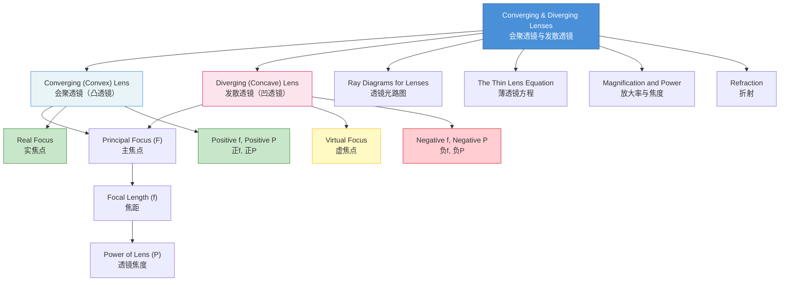

# 1. Overview / 概述

**English:**
This sub-topic introduces the two fundamental types of lenses: **converging (convex) lenses** and **diverging (concave) lenses**. It covers their physical structure, how they refract light, and their key properties including focal length, principal focus, and optical centre. Understanding the difference between these two lens types is essential for constructing [[Ray Diagrams for Lenses]] and applying [[The Thin Lens Equation]]. Converging lenses bring parallel light rays to a real focus, while diverging lenses spread light rays as if they came from a virtual focus. This distinction underpins all lens-based optical systems, from simple magnifying glasses to complex camera and telescope designs.

**中文:**
本子知识点介绍两种基本透镜类型：**会聚透镜（凸透镜）** 和 **发散透镜（凹透镜）**。内容包括它们的物理结构、对光的折射方式，以及关键特性，如焦距、主焦点和光心。理解这两种透镜的区别对于绘制[[Ray Diagrams for Lenses]]和应用[[The Thin Lens Equation]]至关重要。会聚透镜使平行光线会聚于实焦点，而发散透镜使光线发散，仿佛来自虚焦点。这一区别是所有基于透镜的光学系统的基础，从简单的放大镜到复杂的相机和望远镜设计。

---

# 2. Syllabus Learning Objectives / 考纲学习目标

| CAIE 9702 (8.5 a-d) | Edexcel IAL (WPH11 U2: 5.31-5.34) |
|-----------|-------------|
| Define the terms principal focus and focal length for a converging lens | Understand the terms principal focus and focal length for converging and diverging lenses |
| Define the term principal focus for a diverging lens | Understand the difference between real and virtual images formed by lenses |
| Use the formula $P = 1/f$ for the power of a lens | Use the lens formula $1/f = 1/u + 1/v$ |
| Use the lens formula $1/f = 1/u + 1/v$ | Understand the sign conventions for converging and diverging lenses |

**Examiner Expectations / 考官期望:**
- **English:** Students must be able to distinguish between converging and diverging lenses by their shape and effect on parallel light. They must define principal focus correctly for both types, noting that for a diverging lens the principal focus is virtual. The focal length of a diverging lens is taken as negative in calculations.
- **中文:** 学生必须能够通过形状和对平行光线的作用来区分会聚透镜和发散透镜。必须正确定义两种透镜的主焦点，注意发散透镜的主焦点是虚的。在计算中，发散透镜的焦距取负值。

---

# 3. Core Definitions / 核心定义

| Term (EN/CN) | Definition (EN) | Definition (CN) | Common Mistakes / 常见错误 |
|--------------|-----------------|-----------------|---------------------------|
| **Converging Lens** / 会聚透镜 | A lens that is thicker at the centre than at the edges, causing parallel light rays to converge to a real principal focus. | 中心比边缘厚的透镜，使平行光线会聚于实主焦点。 | Confusing with diverging lens shape. |
| **Diverging Lens** / 发散透镜 | A lens that is thinner at the centre than at the edges, causing parallel light rays to diverge as if coming from a virtual principal focus. | 中心比边缘薄的透镜，使平行光线发散，仿佛来自虚主焦点。 | Thinking diverging lenses have a real focus. |
| **Principal Focus (F)** / 主焦点 | For a converging lens: the point where parallel rays converge after refraction. For a diverging lens: the point from which parallel rays appear to diverge after refraction. | 对于会聚透镜：平行光线折射后会聚的点。对于发散透镜：平行光线折射后似乎发散的来源点。 | Forgetting that diverging lens focus is virtual. |
| **Focal Length (f)** / 焦距 | The distance from the optical centre of a lens to its principal focus. | 从透镜光心到主焦点的距离。 | Not using sign convention (converging: +f, diverging: -f). |
| **Optical Centre** / 光心 | The central point of a lens through which light passes without deviation. | 透镜的中心点，光线通过时不发生偏折。 | Confusing with principal focus. |
| **Power of a Lens (P)** / 透镜焦度 | The reciprocal of the focal length: $P = 1/f$. Measured in dioptres (D). | 焦距的倒数：$P = 1/f$。单位为屈光度（D）。 | Forgetting units or sign (converging: +P, diverging: -P). |

---

# 4. Key Concepts Explained / 关键概念详解

## 4.1 Shape and Structure / 形状与结构

### Explanation / 解释
**English:** A **converging lens** (also called a convex lens) has surfaces that curve outward, making it thicker at the centre than at the edges. A **diverging lens** (also called a concave lens) has surfaces that curve inward, making it thinner at the centre than at the edges. Both types can have different curvatures on each side (e.g., biconvex, plano-convex, biconcave, plano-concave). The curvature determines the lens's [[Magnification and Power of a Lens]].

**中文:** **会聚透镜**（也称为凸透镜）的表面向外弯曲，中心比边缘厚。**发散透镜**（也称为凹透镜）的表面向内弯曲，中心比边缘薄。两种透镜的两侧可以有不同的曲率（例如双凸、平凸、双凹、平凹）。曲率决定了透镜的[[Magnification and Power of a Lens]]。

### Physical Meaning / 物理意义
**English:** The shape determines how the lens refracts light. A converging lens bends light rays inward toward the principal axis, while a diverging lens bends light rays outward away from the principal axis. This is due to the lens shape causing different angles of incidence at different points on the lens surface.

**中文:** 形状决定了透镜如何折射光线。会聚透镜将光线向内弯向主光轴，而发散透镜将光线向外弯离主光轴。这是因为透镜形状导致透镜表面不同点的入射角不同。

### Common Misconceptions / 常见误区
- **English:** Students often think a diverging lens cannot form any image — it can form virtual images.
- **中文:** 学生常认为发散透镜不能形成任何图像——实际上它可以形成虚像。
- **English:** Some believe the focal length of a diverging lens is positive — it is negative in sign convention.
- **中文:** 有些人认为发散透镜的焦距是正的——在符号约定中它是负的。

### Exam Tips / 考试提示
- **English:** Always check the lens shape in diagrams — thicker centre = converging, thinner centre = diverging.
- **中文:** 始终检查图中的透镜形状——中心厚=会聚，中心薄=发散。

> 📷 **IMAGE PROMPT — LENS-01: Converging vs Diverging Lens Shapes**
> A side-by-side comparison diagram showing a biconvex converging lens (thicker centre, outward curves) and a biconcave diverging lens (thinner centre, inward curves). Both lenses are shown with their principal axis, optical centre labelled O, and principal foci labelled F. Arrows indicate the direction of curvature. Clean white background, educational style, labelled in English.

## 4.2 Effect on Parallel Light / 对平行光线的作用

### Explanation / 解释
**English:** When parallel rays of light (e.g., from a distant object) strike a **converging lens**, they are refracted and meet at the **real principal focus** (F) on the opposite side of the lens. For a **diverging lens**, parallel rays are refracted so they spread out; they appear to come from a **virtual principal focus** (F) on the same side as the incoming light. This is the key experimental distinction between the two lens types.

**中文:** 当平行光线（例如来自远处物体）照射到**会聚透镜**时，它们被折射并在透镜另一侧的**实主焦点**（F）处会聚。对于**发散透镜**，平行光线被折射后散开；它们似乎来自入射光同一侧的**虚主焦点**（F）。这是两种透镜类型的关键实验区别。

### Physical Meaning / 物理意义
**English:** The real focus of a converging lens can be projected onto a screen — it is a point where light energy is concentrated. The virtual focus of a diverging lens cannot be projected; it is only a point from which the diverging rays appear to originate when traced backward.

**中文:** 会聚透镜的实焦点可以投射到屏幕上——这是光能集中的点。发散透镜的虚焦点无法投射；它只是发散光线向后追踪时似乎起源的点。

### Common Misconceptions / 常见误区
- **English:** Students think both lenses have a real focus — only converging lenses do.
- **中文:** 学生认为两种透镜都有实焦点——只有会聚透镜有。
- **English:** Some believe diverging lenses do not refract light — they do, just in the opposite direction.
- **中文:** 有些人认为发散透镜不折射光线——它们确实折射，只是方向相反。

### Exam Tips / 考试提示
- **English:** In ray diagrams, use dashed lines to show virtual rays (extensions) for diverging lenses.
- **中文:** 在光路图中，使用虚线表示发散透镜的虚拟光线（延长线）。

> 📷 **IMAGE PROMPT — LENS-02: Parallel Light Through Converging and Diverging Lenses**
> Two diagrams side by side. Left: converging lens with three parallel rays entering from left, converging to a real focus F on the right. Right: diverging lens with three parallel rays entering from left, diverging outward; dashed lines extend backward to a virtual focus F on the left. Both show principal axis and optical centre O. Educational diagram, clean style.

---

# 5. Essential Equations / 核心公式

## 5.1 Power of a Lens / 透镜焦度

$$ P = \frac{1}{f} $$

| Symbol (符号) | Meaning (EN) | Meaning (CN) | Unit (单位) |
|--------------|-------------|-------------|------------|
| $P$ | Power of the lens | 透镜焦度 | dioptre (D) / 屈光度 |
| $f$ | Focal length | 焦距 | metre (m) / 米 |

**Derivation / 推导:** The power is defined as the reciprocal of the focal length. A lens with a short focal length bends light more strongly and has higher power.

**Conditions / 适用条件:**
- **English:** $f$ must be in metres. For a converging lens, $f > 0$ so $P > 0$. For a diverging lens, $f < 0$ so $P < 0$.
- **中文:** $f$ 必须以米为单位。对于会聚透镜，$f > 0$ 所以 $P > 0$。对于发散透镜，$f < 0$ 所以 $P < 0$。

**Limitations / 局限性:**
- **English:** The formula assumes thin lenses and paraxial rays (small angles). It does not account for lens thickness or aberrations.
- **中文:** 该公式假设薄透镜和近轴光线（小角度）。不考虑透镜厚度或像差。

## 5.2 Lens Formula / 透镜公式

$$ \frac{1}{f} = \frac{1}{u} + \frac{1}{v} $$

| Symbol (符号) | Meaning (EN) | Meaning (CN) | Unit (单位) |
|--------------|-------------|-------------|------------|
| $f$ | Focal length | 焦距 | m |
| $u$ | Object distance from lens | 物距 | m |
| $v$ | Image distance from lens | 像距 | m |

**Derivation / 推导:** Derived from geometry of similar triangles in ray diagrams. See [[The Thin Lens Equation]] for full derivation.

**Conditions / 适用条件:**
- **English:** Sign convention: $f$ positive for converging, negative for diverging. $u$ positive for real objects. $v$ positive for real images, negative for virtual images.
- **中文:** 符号约定：会聚透镜 $f$ 为正，发散透镜 $f$ 为负。实物 $u$ 为正。实像 $v$ 为正，虚像 $v$ 为负。

**Limitations / 局限性:**
- **English:** Only valid for thin lenses and paraxial rays. Does not apply to thick lenses or wide-angle rays.
- **中文:** 仅适用于薄透镜和近轴光线。不适用于厚透镜或宽角度光线。

> 📷 **IMAGE PROMPT — LENS-03: Lens Formula Sign Convention Diagram**
> A diagram showing a converging lens with labelled distances: object distance u (positive, left of lens), image distance v (positive, right of lens for real image), focal length f (positive, right of lens). Below, a diverging lens with u positive, v negative (left of lens for virtual image), f negative (left of lens). Arrows indicate direction. Clean educational style.

---

# 6. Graphs and Relationships / 图表与关系

## 6.1 Focal Length vs Lens Curvature / 焦距与透镜曲率的关系

### Axes / 坐标轴
- **X-axis:** Curvature of lens surfaces (1/R) / 透镜表面曲率 (1/R)
- **Y-axis:** Power of lens (P) / 透镜焦度 (P)

### Shape / 形状
- **English:** Linear relationship: $P \propto 1/R$ for a given refractive index. Steeper curvature gives higher power (shorter focal length).
- **中文:** 线性关系：对于给定的折射率，$P \propto 1/R$。曲率越大，焦度越高（焦距越短）。

### Gradient Meaning / 斜率含义
- **English:** Gradient depends on the refractive index of the lens material. Higher refractive index gives steeper gradient.
- **中文:** 斜率取决于透镜材料的折射率。折射率越高，斜率越大。

### Area Meaning / 面积含义
- **English:** Not applicable for this linear relationship.
- **中文:** 不适用于此线性关系。

### Exam Interpretation / 考试解读
- **English:** Be able to predict how changing curvature affects focal length. A more curved lens bends light more strongly.
- **中文:** 能够预测改变曲率如何影响焦距。曲率更大的透镜对光的弯曲更强。

---

# 7. Required Diagrams / 必备图表

## 7.1 Converging Lens with Principal Focus / 会聚透镜与主焦点

### Description / 描述
**English:** A diagram showing a converging lens with its optical centre (O), principal axis, and principal focus (F) on both sides. Parallel rays from the left converge at the real focus on the right. The focal length (f) is labelled from O to F.

**中文:** 显示会聚透镜及其光心（O）、主光轴和两侧主焦点（F）的图。来自左侧的平行光线会聚于右侧的实焦点。焦距（f）从O到F标出。

### Image Prompt / 图片生成提示
> 📷 **IMAGE PROMPT — LENS-04: Converging Lens with Labelled Focus**
> A clear educational diagram of a biconvex converging lens. The optical centre is labelled O, principal axis is a horizontal dashed line. Two principal foci F are labelled, one on each side of the lens. Three parallel rays enter from the left, refract through the lens, and converge at the right focus. The distance from O to F is labelled as focal length f. Clean white background, professional style, all labels in English.

### Labels Required / 需要标注
- Optical centre (O) / 光心 (O)
- Principal axis / 主光轴
- Principal focus (F) / 主焦点 (F)
- Focal length (f) / 焦距 (f)
- Incoming parallel rays / 入射平行光线
- Converging rays / 会聚光线

### Exam Importance / 考试重要性
- **English:** Essential for understanding how converging lenses work. Frequently tested in ray diagram questions.
- **中文:** 理解会聚透镜工作原理的基础。在光路图题中经常考查。

## 7.2 Diverging Lens with Virtual Focus / 发散透镜与虚焦点

### Description / 描述
**English:** A diagram showing a diverging lens with its optical centre (O), principal axis, and virtual principal focus (F) on the same side as incoming light. Parallel rays from the left diverge after refraction; dashed lines extend backward to meet at the virtual focus.

**中文:** 显示发散透镜及其光心（O）、主光轴和虚主焦点（F）的图，虚焦点在入射光同一侧。来自左侧的平行光线折射后发散；虚线向后延长，在虚焦点处相交。

### Image Prompt / 图片生成提示
> 📷 **IMAGE PROMPT — LENS-05: Diverging Lens with Virtual Focus**
> A clear educational diagram of a biconcave diverging lens. The optical centre is labelled O, principal axis is a horizontal dashed line. A virtual principal focus F is labelled on the left side of the lens (same side as incoming light). Three parallel rays enter from the left, refract outward through the lens; dashed lines extend backward to converge at F. The distance from O to F is labelled as focal length f. Clean white background, professional style, all labels in English.

### Labels Required / 需要标注
- Optical centre (O) / 光心 (O)
- Principal axis / 主光轴
- Virtual principal focus (F) / 虚主焦点 (F)
- Focal length (f) / 焦距 (f)
- Incoming parallel rays / 入射平行光线
- Diverging rays (solid) / 发散光线（实线）
- Virtual rays (dashed) / 虚拟光线（虚线）

### Exam Importance / 考试重要性
- **English:** Critical for understanding diverging lenses. Students must know that the focus is virtual and on the same side as incoming light.
- **中文:** 理解发散透镜的关键。学生必须知道焦点是虚的，且在入射光同一侧。

---

# 8. Worked Examples / 典型例题

## Example 1: Identifying Lens Types / 例1：识别透镜类型

### Question / 题目
**English:** A lens has a focal length of +15 cm. Is it converging or diverging? What is its power in dioptres?

**中文:** 一个透镜的焦距为+15 cm。它是会聚透镜还是发散透镜？它的焦度是多少屈光度？

### Solution / 解答
**Step 1:** Identify lens type from sign of focal length.
- Positive focal length → converging lens
- 正焦距 → 会聚透镜

**Step 2:** Convert focal length to metres.
- $f = 15 \text{ cm} = 0.15 \text{ m}$

**Step 3:** Calculate power.
- $P = \frac{1}{f} = \frac{1}{0.15} = 6.67 \text{ D}$

### Final Answer / 最终答案
**Answer:** Converging lens, power = +6.67 D | **答案：** 会聚透镜，焦度 = +6.67 D

### Quick Tip / 提示
- **English:** Remember: converging lens → positive f → positive P. Diverging lens → negative f → negative P.
- **中文：** 记住：会聚透镜 → 正f → 正P。发散透镜 → 负f → 负P。

## Example 2: Diverging Lens Focal Length / 例2：发散透镜焦距

### Question / 题目
**English:** A diverging lens has a power of -5.0 D. What is its focal length in cm?

**中文:** 一个发散透镜的焦度为-5.0 D。它的焦距是多少厘米？

### Solution / 解答
**Step 1:** Use power formula.
- $P = \frac{1}{f}$
- $f = \frac{1}{P} = \frac{1}{-5.0} = -0.20 \text{ m}$

**Step 2:** Convert to cm.
- $f = -0.20 \text{ m} = -20 \text{ cm}$

### Final Answer / 最终答案
**Answer:** -20 cm | **答案：** -20 cm

### Quick Tip / 提示
- **English:** The negative sign is essential — it indicates a diverging lens. Never omit it in calculations.
- **中文：** 负号至关重要——它表示发散透镜。在计算中绝不能省略。

---

# 9. Past Paper Question Types / 历年真题题型

| Question Type / 题型 | Frequency / 频率 | Difficulty / 难度 | Past Paper References / 真题索引 |
|----------------------|------------------|------------------|-------------------------------|
| Identify lens type from shape or focal length sign | High | Easy | 📝 *待填入* |
| Calculate power from focal length (or vice versa) | High | Easy | 📝 *待填入* |
| Describe effect of converging vs diverging lens on parallel light | Medium | Medium | 📝 *待填入* |
| Label principal focus on lens diagram | High | Easy | 📝 *待填入* |
| Sign convention in lens formula | Medium | Medium | 📝 *待填入* |

**Common Command Words / 常见指令词:**
- **English:** Define, State, Calculate, Determine, Sketch, Label, Explain
- **中文：** 定义、陈述、计算、确定、画出、标注、解释

---

# 10. Practical Skills Connections / 实验技能链接

**English:**
This sub-topic connects to practical work in several ways:
1. **Measuring focal length of a converging lens:** Use a distant object (e.g., window) and measure the distance from lens to screen when a sharp image is formed. This gives an approximate focal length.
2. **Distinguishing lens types:** Hold the lens near text — converging lens magnifies (thicker centre), diverging lens minifies (thinner centre).
3. **Uncertainty in focal length measurement:** When using the lens formula, uncertainties in u and v propagate to uncertainty in f. Use the formula $\Delta f = f^2 \sqrt{(\Delta u/u^2)^2 + (\Delta v/v^2)^2}$ for error analysis.
4. **Graph plotting:** Plot $1/v$ against $1/u$ to obtain a straight line with intercept $1/f$.

**中文:**
本子知识点通过以下方式与实验考试联系：
1. **测量会聚透镜的焦距：** 使用远处物体（如窗户），当形成清晰图像时测量透镜到屏幕的距离。这给出了近似焦距。
2. **区分透镜类型：** 将透镜靠近文字——会聚透镜放大（中心厚），发散透镜缩小（中心薄）。
3. **焦距测量的不确定度：** 使用透镜公式时，u和v的不确定度传播到f的不确定度。使用公式 $\Delta f = f^2 \sqrt{(\Delta u/u^2)^2 + (\Delta v/v^2)^2}$ 进行误差分析。
4. **绘制图表：** 绘制 $1/v$ 对 $1/u$ 的图，得到截距为 $1/f$ 的直线。

---

# 11. Concept Map / 概念图谱

---

# 12. Quick Revision Sheet / 速查表

| Category / 类别 | Key Points / 要点 |
|----------------|------------------|
| **Definition / 定义** | Converging lens: thicker centre, real focus. Diverging lens: thinner centre, virtual focus. / 会聚透镜：中心厚，实焦点。发散透镜：中心薄，虚焦点。 |
| **Key Formula / 核心公式** | $P = 1/f$ (power in dioptres, f in metres). Converging: $f > 0, P > 0$. Diverging: $f < 0, P < 0$. / $P = 1/f$（焦度单位屈光度，f单位米）。会聚：$f > 0, P > 0$。发散：$f < 0, P < 0$。 |
| **Key Graph / 核心图表** | Power vs curvature: linear relationship. Steeper curvature → higher power. / 焦度与曲率：线性关系。曲率越大→焦度越高。 |
| **Exam Tip / 考试提示** | Always check sign of f: positive = converging, negative = diverging. In ray diagrams, use dashed lines for virtual rays. / 始终检查f的符号：正=会聚，负=发散。在光路图中，用虚线表示虚拟光线。 |
| **Common Mistake / 常见错误** | Thinking diverging lenses have a real focus. They have a virtual focus on the same side as incoming light. / 认为发散透镜有实焦点。它们有虚焦点，在入射光同一侧。 |
| **Practical Skill / 实验技能** | Measure f using distant object method. Distinguish lenses by holding near text. / 使用远处物体法测量f。通过靠近文字区分透镜。 |