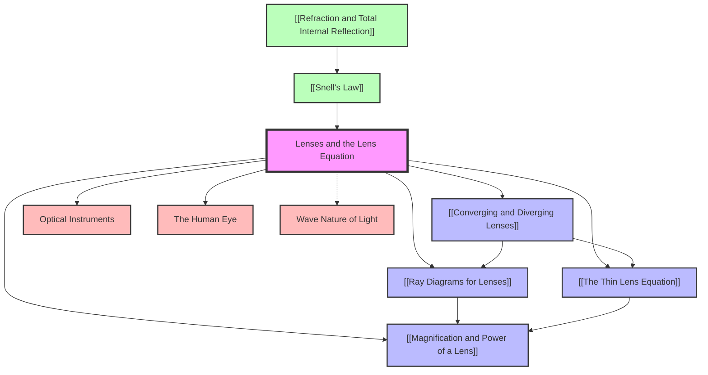

# 1. Overview / 概述

**English:**
This topic, **Lenses and the Lens Equation**, is a cornerstone of geometric optics within the AS-Level Waves chapter. It studies how transparent materials with curved surfaces (lenses) manipulate light rays to form images. The core principle is [[Refraction and Total Internal Reflection]]; as light passes from air into a lens (and out again), it bends. By carefully shaping the lens surfaces, we can control this bending to converge (focus) or diverge (spread) light.

The topic introduces two fundamental lens types: **[[Converging and Diverging Lenses]]** (convex and concave). We learn to predict the position, nature (real/virtual, upright/inverted), and size of the image formed using two powerful tools: **[[Ray Diagrams for Lenses]]** (a graphical method) and **[[The Thin Lens Equation]]** (a mathematical method). This leads directly to the concepts of **[[Magnification and Power of a Lens]]**.

Why it matters: Lenses are the heart of countless optical instruments, from the human eye and eyeglasses to cameras, microscopes, telescopes, and projectors. Understanding how they work is essential for fields like medicine (ophthalmology, endoscopy), astronomy, photography, and telecommunications (fibre optics coupling). In the Cambridge 9702 and Edexcel IAL examinations, this is a high-frequency topic, typically assessed through calculations using the lens equation, drawing accurate ray diagrams, and explaining the properties of images formed by different lens types. Mastery of this topic demonstrates a strong grasp of wave behaviour and mathematical modelling in physics.

**中文：**
本主题 **透镜与透镜方程** 是 AS 阶段波动章节中几何光学的基石。它研究具有曲面的透明材料（透镜）如何操纵光线以形成图像。核心原理是 [[折射与全内反射]]；当光从空气进入透镜（并再次射出）时，会发生弯曲。通过精心设计透镜表面的形状，我们可以控制这种弯曲，使光会聚（聚焦）或发散（扩散）。

本主题介绍了两种基本透镜类型：**[[会聚透镜与发散透镜]]**（凸透镜和凹透镜）。我们学习使用两种强大的工具来预测所成图像的位置、性质（实像/虚像、正立/倒立）和大小：**[[透镜光路图]]**（图形方法）和 **[[薄透镜方程]]**（数学方法）。这直接引出了 **[[透镜的放大率与光焦度]]** 的概念。

为何重要：透镜是无数光学仪器的核心，从人眼和眼镜到相机、显微镜、望远镜和投影仪。理解其工作原理对于医学（眼科学、内窥镜检查）、天文学、摄影和电信（光纤耦合）等领域至关重要。在剑桥 9702 和爱德思 IAL 考试中，这是一个高频主题，通常通过使用透镜方程进行计算、绘制精确的光路图以及解释不同类型透镜所成图像的性质来评估。掌握本主题展示了学生对波动行为和物理数学建模的扎实理解。

---

# 2. Syllabus Learning Objectives / 考纲学习目标

**English:**
The following table maps the specific learning objectives from the Cambridge 9702 and Edexcel IAL syllabuses. Both boards require a deep understanding of the thin lens approximation, sign conventions, and the relationship between object distance, image distance, and focal length.

**中文：**
下表列出了剑桥 9702 和爱德思 IAL 教学大纲的具体学习目标。两个考试局都要求深入理解薄透镜近似、符号约定以及物距、像距和焦距之间的关系。

| CAIE 9702 (8.5) | Edexcel IAL (WPH11 U2: 5.31-5.34) |
|-----------------|-----------------------------------|
| (a) Define focal length for a converging lens. | 5.31 Know that a lens can produce a real or virtual image. |
| (b) Use the lens formula $1/f = 1/u + 1/v$ with the real-is-positive sign convention. | 5.32 Use the lens formula $1/f = 1/u + 1/v$ with the Cartesian sign convention. |
| (c) Describe the nature of an image using the terms real/virtual, magnified/diminished, upright/inverted. | 5.33 Describe and draw ray diagrams to show the formation of images by converging and diverging lenses. |
| (d) Draw ray diagrams for converging lenses for objects at different distances. | 5.34 Define and use the terms linear magnification and power of a lens. |

**Examiner Expectations / 考官期望:**
- **English:** Candidates must be able to apply the correct sign convention consistently. For CAIE, this is the 'real-is-positive' convention. For Edexcel, it is the 'Cartesian' convention. A common mistake is using the wrong sign for $v$ when the image is virtual. Candidates must also be able to draw accurate ray diagrams with at least two principal rays and clearly label the object, image, lens, and focal points.
- **中文：** 考生必须能够一致地应用正确的符号约定。对于 CAIE，这是“实正虚负”约定。对于 Edexcel，这是“笛卡尔”约定。一个常见错误是在图像为虚像时使用错误的 $v$ 符号。考生还必须能够绘制至少包含两条主光线的精确光路图，并清晰标注物体、图像、透镜和焦点。

> 📋 **CIE Only:** The 'real-is-positive' sign convention is used. This means $u$ is always positive (object is real), $v$ is positive for a real image and negative for a virtual image, and $f$ is positive for a converging lens and negative for a diverging lens.
>
> 📋 **Edexcel Only:** The Cartesian sign convention is used. Light travels from left to right. Distances measured from the lens in the direction of incident light are positive; distances measured against the direction of incident light are negative. For a converging lens, $f$ is positive; for a diverging lens, $f$ is negative. $u$ is usually positive (object on the left). $v$ is positive for a real image (on the right) and negative for a virtual image (on the left).

---

# 3. Core Definitions / 核心定义

| Term (EN/CN) | Definition (EN) | Definition (CN) | Common Mistakes / 常见错误 |
|--------------|-----------------|-----------------|---------------------------|
| **Lens / 透镜** | A transparent object (usually glass or plastic) with two curved surfaces that refracts light to form an image. | 一种具有两个曲面的透明物体（通常是玻璃或塑料），通过折射光线来形成图像。 | Confusing a lens with a mirror. A lens *transmits* light; a mirror *reflects* it. |
| **[[Converging and Diverging Lenses\|Converging Lens]] / 会聚透镜** | A lens that is thicker at the centre than at the edges, causing parallel light rays to converge to a focal point. Also called a convex lens. | 一种中心比边缘厚的透镜，能使平行光线会聚到一个焦点。也称为凸透镜。 | Thinking all converging lenses are 'magnifying glasses'. They can also produce diminished images. |
| **[[Converging and Diverging Lenses\|Diverging Lens]] / 发散透镜** | A lens that is thinner at the centre than at the edges, causing parallel light rays to diverge as if coming from a focal point. Also called a concave lens. | 一种中心比边缘薄的透镜，能使平行光线发散，仿佛来自一个焦点。也称为凹透镜。 | Forgetting that a diverging lens always produces a virtual, upright, and diminished image for a real object. |
| **Principal Axis / 主光轴** | The straight line passing through the centre of curvature of the lens surfaces. | 穿过透镜表面曲率中心的直线。 | Confusing it with the optical centre. The principal axis is a line; the optical centre is a point on that line. |
| **Optical Centre / 光心** | The central point of a lens where a ray of light passes through without being deviated. | 透镜的中心点，光线通过该点时不发生偏折。 | Assuming the optical centre is always the geometric centre. For a thin lens, it is approximately the geometric centre. |
| **Focal Point (F) / 焦点 (F)** | The point on the principal axis where rays of light parallel to the principal axis converge (for a converging lens) or appear to diverge from (for a diverging lens) after passing through the lens. | 主光轴上的一点，平行于主光轴的光线通过透镜后会聚（对于会聚透镜）或看起来发散（对于发散透镜）于此点。 | Forgetting there are two focal points (one on each side of the lens). |
| **Focal Length (f) / 焦距 (f)** | The distance between the optical centre of a lens and its principal focal point. | 透镜光心到其主焦点之间的距离。 | Using the wrong sign for $f$ in the lens equation. For a converging lens, $f$ is positive; for a diverging lens, $f$ is negative. |
| **Object Distance (u) / 物距 (u)** | The distance from the object to the optical centre of the lens. | 从物体到透镜光心的距离。 | Forgetting that $u$ is always positive for a real object. |
| **Image Distance (v) / 像距 (v)** | The distance from the image to the optical centre of the lens. | 从图像到透镜光心的距离。 | Using the wrong sign for $v$. $v$ is positive for a real image, negative for a virtual image. |
| **[[Magnification and Power of a Lens\|Linear Magnification (m)]] / 线性放大率 (m)** | The ratio of the image height ($h_i$) to the object height ($h_o$). Also equal to $v/u$. | 像高 ($h_i$) 与物高 ($h_o$) 之比。也等于 $v/u$。 | Forgetting that $m$ can be negative (indicating an inverted image) or positive (indicating an upright image). |
| **[[Magnification and Power of a Lens\|Power of a Lens (P)]] / 透镜光焦度 (P)** | The measure of a lens's ability to converge or diverge light. Defined as $P = 1/f$. | 衡量透镜会聚或发散光线能力的量。定义为 $P = 1/f$。 | Forgetting the unit. Power is measured in dioptres (D) when $f$ is in metres. |
| **Real Image / 实像** | An image formed by the actual convergence of light rays. It can be projected onto a screen. | 由光线实际会聚形成的图像。可以投射到屏幕上。 | Thinking a real image is always upright. Real images are always inverted. |
| **Virtual Image / 虚像** | An image formed by the apparent divergence of light rays. It cannot be projected onto a screen. | 由光线的表观发散形成的图像。不能投射到屏幕上。 | Thinking a virtual image is always smaller. A magnifying glass produces a virtual, magnified image. |

---

# 4. Key Concepts Explained / 关键概念详解

## 4.1 The Nature of Lenses / 透镜的性质

### Explanation / 解释
**English:**
A lens is a piece of transparent material (like glass or plastic) with two curved surfaces. When light passes from air into the lens, it refracts (bends) according to [[Snell's Law]]. When it exits the lens back into air, it refracts again. The net effect of these two refractions is to change the direction of the light ray. The shape of the lens surfaces determines whether the lens causes parallel light rays to **converge** (come together) or **diverge** (spread apart).

- **Converging Lens (Convex):** Thicker in the middle. It bends light rays towards the principal axis. Parallel rays converge at the **principal focus (F)**.
- **Diverging Lens (Concave):** Thinner in the middle. It bends light rays away from the principal axis. Parallel rays appear to diverge from the **principal focus (F)**.

**中文：**
透镜是一块具有两个曲面的透明材料（如玻璃或塑料）。当光从空气进入透镜时，根据 [[斯涅尔定律]] 发生折射（弯曲）。当它从透镜射出回到空气时，再次发生折射。这两次折射的净效果是改变光线的方向。透镜表面的形状决定了透镜是使平行光线 **会聚**（聚拢）还是 **发散**（散开）。

- **会聚透镜（凸透镜）：** 中间厚。它将光线向主光轴弯曲。平行光线会聚于 **主焦点 (F)**。
- **发散透镜（凹透镜）：** 中间薄。它将光线远离主光轴弯曲。平行光线看起来是从 **主焦点 (F)** 发散的。

### Physical Meaning / 物理意义
**English:**
The focal length $f$ is a measure of how strongly a lens bends light. A short focal length means the lens is very powerful (bends light sharply). A long focal length means the lens is weak (bends light gently). The power of a lens, $P = 1/f$, is the quantity optometrists use to prescribe glasses.

**中文：**
焦距 $f$ 是衡量透镜弯曲光线能力强弱的量。焦距短意味着透镜非常强（使光线急剧弯曲）。焦距长意味着透镜较弱（使光线平缓弯曲）。透镜的光焦度 $P = 1/f$ 是验光师用来配眼镜的量。

### Common Misconceptions / 常见误区
1. **English:** "A converging lens always produces a magnified image." *Correction:* It only produces a magnified image when the object is placed within the focal length. Otherwise, it can produce a diminished image.
   **中文：** “会聚透镜总是产生放大的图像。” *纠正：* 只有当物体放在焦距以内时，它才产生放大的图像。否则，它可以产生缩小的图像。
2. **English:** "A diverging lens cannot form a real image." *Correction:* This is correct for a real object. A diverging lens alone always forms a virtual image for a real object.
   **中文：** “发散透镜不能形成实像。” *纠正：* 对于实物来说，这是正确的。单独的发散透镜对于实物总是形成虚像。

### Exam Tips / 考试提示
**English:**
- Be able to identify a converging vs. diverging lens by its shape.
- Know that the focal length of a converging lens is positive, and for a diverging lens it is negative. This is crucial for the lens equation.
- Questions often ask you to explain why a particular lens is used in a device (e.g., a converging lens in a projector to produce a real, magnified image).

**中文：**
- 能够通过形状识别会聚透镜与发散透镜。
- 知道会聚透镜的焦距为正，发散透镜的焦距为负。这对透镜方程至关重要。
- 问题通常要求你解释为什么在某个设备中使用特定的透镜（例如，投影仪中使用会聚透镜以产生放大的实像）。

> 📷 **IMAGE PROMPT — LENS01: Converging vs. Diverging Lens Shapes**
>
> A side-by-side comparison diagram. Left: A biconvex (converging) lens, thicker in the middle, with parallel rays entering from the left and converging to a point (F) on the right. Right: A biconcave (diverging) lens, thinner in the middle, with parallel rays entering from the left and diverging as if coming from a point (F) on the left. Labels: "Converging Lens (Convex)", "Diverging Lens (Concave)", "Principal Axis", "Focal Point (F)", "Focal Length (f)". Clean, textbook-style illustration with blue light rays on a white background.

---

## 4.2 Ray Diagrams for Lenses / 透镜光路图

### Explanation / 解释
**English:**
A [[Ray Diagrams for Lenses|ray diagram]] is a graphical method to determine the position, nature, and size of the image formed by a lens. It uses the fact that light rays from a point on the object travel in straight lines and refract at the lens surfaces. To locate an image, we only need to trace the path of at least two "principal rays" from the top of the object. The point where these rays (or their extensions) intersect is where the image of that point is formed.

**Three Principal Rays for a Converging Lens:**
1.  **Ray parallel to the principal axis:** After refraction, this ray passes through the focal point (F) on the other side of the lens.
2.  **Ray through the optical centre (O):** This ray passes straight through the lens without being deviated.
3.  **Ray through the focal point (F) on the object side:** After refraction, this ray emerges parallel to the principal axis.

**Three Principal Rays for a Diverging Lens:**
1.  **Ray parallel to the principal axis:** After refraction, this ray diverges as if it came from the focal point (F) on the object side.
2.  **Ray through the optical centre (O):** This ray passes straight through the lens without being deviated.
3.  **Ray directed towards the focal point (F) on the other side:** After refraction, this ray emerges parallel to the principal axis.

**中文：**
[[透镜光路图]] 是一种用于确定透镜所成图像的位置、性质和大小的图形方法。它利用了这样一个事实：来自物体上某一点的光线沿直线传播，并在透镜表面发生折射。要定位一个图像，我们只需要追踪从物体顶部发出的至少两条“主光线”的路径。这些光线（或其延长线）的交点就是该点的像所在的位置。

**会聚透镜的三条主光线：**
1.  **平行于主光轴的光线：** 折射后，该光线穿过透镜另一侧的焦点 (F)。
2.  **穿过光心 (O) 的光线：** 该光线直线穿过透镜，不发生偏折。
3.  **穿过物体侧焦点 (F) 的光线：** 折射后，该光线平行于主光轴射出。

**发散透镜的三条主光线：**
1.  **平行于主光轴的光线：** 折射后，该光线发散，仿佛来自物体侧的焦点 (F)。
2.  **穿过光心 (O) 的光线：** 该光线直线穿过透镜，不发生偏折。
3.  **指向另一侧焦点 (F) 的光线：** 折射后，该光线平行于主光轴射出。

### Physical Meaning / 物理意义
**English:**
Ray diagrams provide a visual and intuitive understanding of image formation. They help you see *why* an image is real or virtual, upright or inverted, and magnified or diminished. They are essential for designing optical systems.

**中文：**
光路图提供了对成像过程的直观理解。它们帮助你看到*为什么*像是实像或虚像、正立或倒立、放大或缩小。它们对于设计光学系统至关重要。

### Common Misconceptions / 常见误区
1. **English:** "I only need to draw one ray to find the image." *Correction:* You need at least two rays to find the point of intersection. A third ray is used to check your work.
   **中文：** “我只需要画一条光线就能找到像。” *纠正：* 你至少需要两条光线来找到交点。第三条光线用于检查你的工作。
2. **English:** "For a virtual image, the rays don't meet, so there is no image." *Correction:* The rays *appear* to come from a point. The extensions of the diverging rays are drawn as dashed lines, and their intersection locates the virtual image.
   **中文：** “对于虚像，光线不相交，所以没有像。” *纠正：* 光线*看起来*是来自某一点。发散光线的延长线用虚线绘制，它们的交点定位了虚像。

### Exam Tips / 考试提示
**English:**
- Use a sharp pencil and a ruler. Accuracy is important.
- Draw arrows on the rays to show direction.
- Use solid lines for real rays and dashed lines for virtual rays (extensions).
- Clearly label the object (O), image (I), lens, focal points (F, F'), and optical centre (O).
- Practice drawing diagrams for all five standard object positions for a converging lens (at infinity, beyond 2F, at 2F, between F and 2F, and between F and the lens).

**中文：**
- 使用削尖的铅笔和尺子。准确性很重要。
- 在光线上画箭头以显示方向。
- 用实线表示实际光线，用虚线表示虚光线（延长线）。
- 清晰标注物体 (O)、像 (I)、透镜、焦点 (F, F') 和光心 (O)。
- 练习绘制会聚透镜所有五个标准物距（无穷远、2F 以外、2F 处、F 与 2F 之间、F 与透镜之间）的光路图。

> 📷 **IMAGE PROMPT — LENS02: Ray Diagram for Converging Lens (Object beyond 2F)**
>
> A ray diagram for a converging lens. An upright arrow (object) is placed to the left of the lens, beyond the point 2F. Three principal rays are drawn from the top of the object: 1) A ray parallel to the principal axis, refracting through F on the right. 2) A ray through the optical centre, going straight. 3) A ray through F on the left, refracting parallel to the principal axis. These three rays converge on the right side of the lens, between F and 2F, to form an inverted, diminished real image (a downward arrow). All points (O, F, 2F, I) are clearly labelled. The diagram is clean, with blue rays and a black outline.

---

## 4.3 The Thin Lens Equation / 薄透镜方程

### Explanation / 解释
**English:**
The [[The Thin Lens Equation]] is a mathematical relationship that links the object distance ($u$), image distance ($v$), and focal length ($f$) of a lens. It is derived from geometry and the law of refraction, assuming the lens is "thin" (its thickness is negligible compared to $u$, $v$, and $f$). The equation is:

$$ \frac{1}{f} = \frac{1}{u} + \frac{1}{v} $$

This equation, combined with the correct sign convention, allows you to calculate the exact position of the image.

**中文：**
[[薄透镜方程]] 是一个数学关系式，它将透镜的物距 ($u$)、像距 ($v$) 和焦距 ($f$) 联系起来。它由几何学和折射定律推导而来，并假设透镜是“薄的”（其厚度与 $u$、$v$ 和 $f$ 相比可以忽略不计）。方程为：

$$ \frac{1}{f} = \frac{1}{u} + \frac{1}{v} $$

这个方程结合正确的符号约定，允许你精确计算图像的位置。

### Physical Meaning / 物理意义
**English:**
The equation tells us that the focal length of a lens is a fixed property (for a given lens), but the image distance $v$ changes depending on where the object is placed ($u$). This is why you need to adjust the focus of a camera or a projector to get a sharp image for objects at different distances.

**中文：**
该方程告诉我们，透镜的焦距是一个固定属性（对于给定的透镜），但像距 $v$ 会根据物体放置的位置 ($u$) 而变化。这就是为什么你需要调整相机或投影仪的焦距，以便为不同距离的物体获得清晰的图像。

### Common Misconceptions / 常见误区
1. **English:** "The lens equation always gives a positive value for $v$." *Correction:* $v$ can be negative, indicating a virtual image on the same side of the lens as the object.
   **中文：** “透镜方程总是给出 $v$ 的正值。” *纠正：* $v$ 可以为负，表示虚像在透镜的同一侧。
2. **English:** "If $u = f$, the equation gives $v = 0$." *Correction:* If $u = f$, then $1/v = 0$, which means $v$ is infinite. The image is formed at infinity.
   **中文：** “如果 $u = f$，方程给出 $v = 0$。” *纠正：* 如果 $u = f$，那么 $1/v = 0$，这意味着 $v$ 是无穷大。像形成在无穷远处。

### Exam Tips / 考试提示
**English:**
- **Sign Convention is Everything!** Write down the sign convention you are using at the start of your calculation.
- For CAIE (real-is-positive): $u > 0$, $v > 0$ for real image, $v < 0$ for virtual image, $f > 0$ for converging, $f < 0$ for diverging.
- For Edexcel (Cartesian): $u > 0$ (object on left), $v > 0$ for real image (on right), $v < 0$ for virtual image (on left), $f > 0$ for converging, $f < 0$ for diverging.
- Always check if your answer is reasonable. For a converging lens with a real object, a real image ($v > 0$) is formed only when $u > f$.

**中文：**
- **符号约定就是一切！** 在计算开始时写下你使用的符号约定。
- 对于 CAIE（实正虚负）：$u > 0$，实像 $v > 0$，虚像 $v < 0$，会聚透镜 $f > 0$，发散透镜 $f < 0$。
- 对于 Edexcel（笛卡尔）：$u > 0$（物体在左侧），实像 $v > 0$（在右侧），虚像 $v < 0$（在左侧），会聚透镜 $f > 0$，发散透镜 $f < 0$。
- 始终检查你的答案是否合理。对于会聚透镜和实物，只有当 $u > f$ 时才会形成实像 ($v > 0$)。

---

## 4.4 Magnification and Power of a Lens / 放大率与光焦度

### Explanation / 解释
**English:**
**[[Magnification and Power of a Lens|Linear Magnification (m)]]** describes how much larger or smaller the image is compared to the object. It is defined as:

$$ m = \frac{\text{image height}}{\text{object height}} = \frac{h_i}{h_o} $$

From similar triangles in a ray diagram, it can also be shown that:

$$ m = \frac{v}{u} $$

- If $|m| > 1$, the image is magnified.
- If $|m| < 1$, the image is diminished.
- If $m$ is positive, the image is upright (virtual).
- If $m$ is negative, the image is inverted (real).

**[[Magnification and Power of a Lens|Power of a Lens (P)]]** is a measure of its ability to bend light. It is defined as the reciprocal of the focal length:

$$ P = \frac{1}{f} $$

- The unit of power is the **dioptre (D)**. A lens with $f = 1 \text{ m}$ has a power of $1 \text{ D}$.
- A converging lens has positive power; a diverging lens has negative power.
- For a combination of lenses in contact, the total power is the sum of the individual powers: $P_{\text{total}} = P_1 + P_2 + ...$

**中文：**
**[[透镜的放大率与光焦度|线性放大率 (m)]]** 描述了像比物体大多少或小多少。其定义为：

$$ m = \frac{\text{像高}}{\text{物高}} = \frac{h_i}{h_o} $$

根据光路图中的相似三角形，也可以证明：

$$ m = \frac{v}{u} $$

- 如果 $|m| > 1$，像是放大的。
- 如果 $|m| < 1$，像是缩小的。
- 如果 $m$ 为正，像是正立的（虚像）。
- 如果 $m$ 为负，像是倒立的（实像）。

**[[透镜的放大率与光焦度|透镜的光焦度 (P)]]** 是衡量其弯曲光线能力的量。其定义为焦距的倒数：

$$ P = \frac{1}{f} $$

- 光焦度的单位是 **屈光度 (D)**。一个 $f = 1 \text{ m}$ 的透镜具有 $1 \text{ D}$ 的光焦度。
- 会聚透镜具有正光焦度；发散透镜具有负光焦度。
- 对于相互接触的透镜组合，总光焦度是各个光焦度之和：$P_{\text{总}} = P_1 + P_2 + ...$

### Physical Meaning / 物理意义
**English:**
- **Magnification:** This tells you the size of the image. A magnification of -2 means the image is twice the height of the object and inverted. This is crucial for choosing the right lens for a microscope or telescope.
- **Power:** This is the quantity used by opticians. A prescription for +2.5 D glasses means a converging lens with a focal length of 0.4 m (40 cm). A prescription for -1.0 D means a diverging lens with a focal length of -1.0 m.

**中文：**
- **放大率：** 这告诉你像的大小。放大率为 -2 意味着像高是物高的两倍并且是倒立的。这对于为显微镜或望远镜选择合适的透镜至关重要。
- **光焦度：** 这是验光师使用的量。+2.5 D 眼镜的处方意味着焦距为 0.4 m (40 cm) 的会聚透镜。-1.0 D 的处方意味着焦距为 -1.0 m 的发散透镜。

### Common Misconceptions / 常见误区
1. **English:** "Magnification is always positive." *Correction:* Magnification can be negative, indicating an inverted image.
   **中文：** “放大率总是正的。” *纠正：* 放大率可以为负，表示倒立的像。
2. **English:** "A lens with a higher power always produces a larger image." *Correction:* Power determines the focal length. A higher power (shorter $f$) means the lens bends light more strongly, but the image size depends on $u$ and $v$.
   **中文：** “光焦度越高的透镜总是产生更大的像。” *纠正：* 光焦度决定焦距。更高的光焦度（更短的 $f$）意味着透镜弯曲光线更强，但像的大小取决于 $u$ 和 $v$。

### Exam Tips / 考试提示
**English:**
- When calculating magnification from $m = v/u$, remember to include the sign of $v$. This will automatically give you the correct sign for $m$.
- Questions often ask you to "state the nature of the image". This means you must comment on whether it is real/virtual, upright/inverted, and magnified/diminished.
- For combined lens systems, calculate the image from the first lens, and use that image as the object for the second lens.

**中文：**
- 当从 $m = v/u$ 计算放大率时，记得包含 $v$ 的符号。这将自动给出 $m$ 的正确符号。
- 问题通常要求你“描述像的性质”。这意味着你必须说明它是实像/虚像、正立/倒立以及放大/缩小。
- 对于组合透镜系统，计算第一个透镜所成的像，并将该像作为第二个透镜的物体。

---

# 5. Essential Equations / 核心公式

## 5.1 The Thin Lens Equation / 薄透镜方程

**Equation / 公式:**
$$ \frac{1}{f} = \frac{1}{u} + \frac{1}{v} $$

**Variables / 变量:**
| Symbol (符号) | Meaning (EN) | Meaning (CN) | Unit (单位) |
|--------------|-------------|-------------|------------|
| $f$ | Focal length of the lens | 透镜的焦距 | m (metres) |
| $u$ | Object distance from the lens | 物距（物体到透镜的距离） | m (metres) |
| $v$ | Image distance from the lens | 像距（像到透镜的距离） | m (metres) |

**Derivation / 推导:**
**English:**
The derivation uses geometry and the small-angle approximation. Consider a thin lens with focal length $f$. An object at distance $u$ forms an image at distance $v$. By considering similar triangles formed by the principal rays, one can derive the relationship. The full derivation is not required for the A-Level syllabus, but understanding the assumptions is important.

**中文：**
推导使用了几何学和小角度近似。考虑一个焦距为 $f$ 的薄透镜。一个距离为 $u$ 的物体形成一个距离为 $v$ 的像。通过考虑由主光线形成的相似三角形，可以推导出这个关系。A-Level 教学大纲不要求完整推导，但理解其假设很重要。

**Conditions / 适用条件:**
**English:**
- The lens must be **thin** (its thickness is negligible compared to $u$, $v$, and $f$).
- The light rays must be **paraxial** (making small angles with the principal axis).
- The lens is made of a material with a constant refractive index.

**中文：**
- 透镜必须是 **薄的**（其厚度与 $u$、$v$ 和 $f$ 相比可以忽略不计）。
- 光线必须是 **近轴的**（与主光轴成小角度）。
- 透镜由具有恒定折射率的材料制成。

**Limitations / 局限性:**
**English:**
- The equation does not account for **spherical aberration** (rays far from the principal axis do not focus at the same point).
- It does not account for **chromatic aberration** (different colours of light have different refractive indices and thus different focal lengths).

**中文：**
- 该方程不考虑 **球面像差**（远离主光轴的光线不会聚焦在同一点）。
- 它不考虑 **色差**（不同颜色的光具有不同的折射率，因此具有不同的焦距）。

**Rearrangements / 变形:**
**English:**
- To find $v$: $ \frac{1}{v} = \frac{1}{f} - \frac{1}{u} $
- To find $u$: $ \frac{1}{u} = \frac{1}{f} - \frac{1}{v} $
- A common form: $ v = \frac{uf}{u - f} $

**中文：**
- 求 $v$：$ \frac{1}{v} = \frac{1}{f} - \frac{1}{u} $
- 求 $u$：$ \frac{1}{u} = \frac{1}{f} - \frac{1}{v} $
- 常见形式：$ v = \frac{uf}{u - f} $

---

## 5.2 Linear Magnification / 线性放大率

**Equation / 公式:**
$$ m = \frac{h_i}{h_o} = \frac{v}{u} $$

**Variables / 变量:**
| Symbol (符号) | Meaning (EN) | Meaning (CN) | Unit (单位) |
|--------------|-------------|-------------|------------|
| $m$ | Linear magnification | 线性放大率 | No unit (dimensionless) |
| $h_i$ | Image height | 像高 | m (metres) |
| $h_o$ | Object height | 物高 | m (metres) |
| $v$ | Image distance | 像距 | m (metres) |
| $u$ | Object distance | 物距 | m (metres) |

**Derivation / 推导:**
**English:**
From the ray diagram, consider the ray passing through the optical centre. This ray forms two similar triangles: one with the object and the optical centre, and one with the image and the optical centre. The ratio of the image height to the object height is equal to the ratio of the image distance to the object distance. The sign convention gives the sign of $m$.

**中文：**
从光路图来看，考虑穿过光心的光线。这条光线形成两个相似三角形：一个由物体和光心构成，另一个由像和光心构成。像高与物高之比等于像距与物距之比。符号约定给出了 $m$ 的符号。

**Conditions / 适用条件:**
**English:**
Same as the thin lens equation. The formula $m = v/u$ is derived from the same geometry.

**中文：**
与薄透镜方程相同。公式 $m = v/u$ 由相同的几何学推导而来。

**Limitations / 局限性:**
**English:**
- It is only valid for linear (transverse) magnification. It does not describe angular magnification (used in telescopes and microscopes).

**中文：**
- 它仅对线性（横向）放大率有效。它不描述角放大率（用于望远镜和显微镜）。

**Rearrangements / 变形:**
**English:**
- To find $h_i$: $ h_i = m \times h_o $
- To find $v$: $ v = m \times u $

**中文：**
- 求 $h_i$：$ h_i = m \times h_o $
- 求 $v$：$ v = m \times u $

---

## 5.3 Power of a Lens / 透镜的光焦度

**Equation / 公式:**
$$ P = \frac{1}{f} $$

**Variables / 变量:**
| Symbol (符号) | Meaning (EN) | Meaning (CN) | Unit (单位) |
|--------------|-------------|-------------|------------|
| $P$ | Power of the lens | 透镜的光焦度 | D (dioptres / 屈光度) |
| $f$ | Focal length of the lens | 透镜的焦距 | m (metres) |

**Derivation / 推导:**
**English:**
This is a definition. It is not derived from other equations. A lens with a short focal length bends light more strongly and is said to have a high power.

**中文：**
这是一个定义。它不是从其他方程推导出来的。焦距短的透镜弯曲光线更强，被认为具有高光焦度。

**Conditions / 适用条件:**
**English:**
- $f$ must be in metres for $P$ to be in dioptres.
- The sign of $P$ is the same as the sign of $f$.

**中文：**
- $f$ 必须以米为单位，$P$ 的单位才是屈光度。
- $P$ 的符号与 $f$ 的符号相同。

**Limitations / 局限性:**
**English:**
- Power is defined for a single thin lens in air. For a lens in a different medium (e.g., water), the power changes.

**中文：**
- 光焦度是针对空气中的单个薄透镜定义的。对于在不同介质（如水）中的透镜，光焦度会改变。

**Rearrangements / 变形:**
**English:**
- To find $f$: $ f = \frac{1}{P} $

**中文：**
- 求 $f$：$ f = \frac{1}{P} $

---

# 6. Graphs and Relationships / 图表与关系

## 6.1 Graph of $1/v$ against $1/u$ / $1/v$ 对 $1/u$ 的图

### Axes / 坐标轴
**English:**
- **x-axis:** $1/u$ (m$^{-1}$)
- **y-axis:** $1/v$ (m$^{-1}$)

**中文：**
- **x 轴：** $1/u$ (m$^{-1}$)
- **y 轴：** $1/v$ (m$^{-1}$)

### Shape / 形状
**English:**
A straight line with a negative slope of -1.

**中文：**
一条斜率为 -1 的直线。

### Gradient Meaning / 斜率含义
**English:**
The gradient is -1. This confirms the relationship $1/f = 1/u + 1/v$, which can be rearranged to $1/v = -1/u + 1/f$.

**中文：**
斜率为 -1。这证实了关系 $1/f = 1/u + 1/v$，可以重排为 $1/v = -1/u + 1/f$。

### Area Meaning / 面积含义
**English:**
The area under the graph has no direct physical meaning.

**中文：**
图下的面积没有直接的物理意义。

### Exam Interpretation / 考试解读
**English:**
- The y-intercept of the graph is $1/f$.
- The x-intercept of the graph is also $1/f$.
- This graph is often used in practical experiments to determine the focal length of a lens. By measuring $u$ and $v$ for several object positions and plotting $1/v$ against $1/u$, the intercept gives $1/f$.

**中文：**
- 图的 y 截距是 $1/f$。
- 图的 x 截距也是 $1/f$。
- 该图常用于实验测定透镜的焦距。通过测量几个物距下的 $u$ 和 $v$，并绘制 $1/v$ 对 $1/u$ 的图，截距给出 $1/f$。

### Common Questions / 常见问题
**English:**
- "Use the graph to determine the focal length of the lens."
- "Explain why the graph is a straight line."
- "What does the intercept represent?"

**中文：**
- “使用该图确定透镜的焦距。”
- “解释为什么该图是一条直线。”
- “截距代表什么？”

> 📷 **IMAGE PROMPT — LENS03: Graph of 1/v against 1/u**
>
> A line graph with a straight line sloping downwards from left to right. The x-axis is labelled "1/u (m^-1)" and the y-axis is labelled "1/v (m^-1)". The line crosses both axes at the same positive value, labelled "1/f". The gradient is -1. The graph is clean and professional, suitable for a textbook.

---

## 6.2 Graph of $v$ against $u$ for a Converging Lens / 会聚透镜的 $v$ 对 $u$ 图

### Axes / 坐标轴
**English:**
- **x-axis:** Object distance, $u$ (m)
- **y-axis:** Image distance, $v$ (m)

**中文：**
- **x 轴：** 物距, $u$ (m)
- **y 轴：** 像距, $v$ (m)

### Shape / 形状
**English:**
A hyperbola. As $u$ increases, $v$ decreases. As $u$ approaches $f$ from above, $v$ approaches infinity. As $u$ approaches infinity, $v$ approaches $f$.

**中文：**
一条双曲线。随着 $u$ 增加，$v$ 减小。当 $u$ 从大于 $f$ 趋近于 $f$ 时，$v$ 趋近于无穷大。当 $u$ 趋近于无穷大时，$v$ 趋近于 $f$。

### Gradient Meaning / 斜率含义
**English:**
The gradient of the $v$ vs $u$ graph is not constant. It represents the rate of change of image distance with object distance.

**中文：**
$v$ 对 $u$ 图的斜率不是常数。它表示像距随物距的变化率。

### Area Meaning / 面积含义
**English:**
The area under the graph has no direct physical meaning.

**中文：**
图下的面积没有直接的物理意义。

### Exam Interpretation / 考试解读
**English:**
- The graph has a vertical asymptote at $u = f$.
- The graph has a horizontal asymptote at $v = f$.
- The point where $u = v = 2f$ is a special point on the graph.
- This graph is less commonly tested than the $1/v$ vs $1/u$ graph.

**中文：**
- 该图在 $u = f$ 处有一条垂直渐近线。
- 该图在 $v = f$ 处有一条水平渐近线。
- $u = v = 2f$ 的点是图上的一个特殊点。
- 该图比 $1/v$ 对 $1/u$ 图更少被考查。

### Common Questions / 常见问题
**English:**
- "Describe the relationship between $v$ and $u$."
- "What happens to $v$ as $u$ approaches $f$?"

**中文：**
- “描述 $v$ 和 $u$ 之间的关系。”
- “当 $u$ 趋近于 $f$ 时，$v$ 会发生什么变化？”

---

# 7. Required Diagrams / 必备图表

## 7.1 Ray Diagram for a Converging Lens (Object beyond 2F) / 会聚透镜光路图（物体在 2F 以外）

### Description / 描述
**English:**
A standard ray diagram showing a converging lens. An upright arrow (the object) is placed on the principal axis to the left of the lens, at a distance greater than $2F$. Three principal rays are drawn from the top of the object to the lens and then refracted. The rays converge on the right side of the lens, between $F$ and $2F$, to form an inverted, diminished, real image (a downward arrow). All key points (O, F, 2F, I) are labelled.

**中文：**
一个标准的会聚透镜光路图。一个正立的箭头（物体）放在透镜左侧的主光轴上，距离大于 $2F$。从物体顶部画出三条主光线到透镜，然后发生折射。光线在透镜右侧 $F$ 和 $2F$ 之间会聚，形成一个倒立、缩小、实像（一个向下的箭头）。所有关键点（O, F, 2F, I）都已标注。

### Image Prompt / 图片生成提示
> 📷 **IMAGE PROMPT — LENS04: Converging Lens Ray Diagram (Object beyond 2F)**
>
> A clean, textbook-style ray diagram. A biconvex lens is drawn vertically in the centre. The principal axis is a horizontal dashed line through the centre of the lens. Points F and 2F are marked on both sides of the lens. An upright arrow (object) is on the left, beyond 2F. Three coloured rays (red, blue, green) originate from the top of the object. Ray 1 (red) is parallel to the axis, then bends to pass through F on the right. Ray 2 (blue) goes straight through the optical centre. Ray 3 (green) passes through F on the left, then emerges parallel to the axis. The three rays meet on the right, between F and 2F, forming an inverted arrow (image). All points are labelled: "Object", "Image", "F", "2F", "Optical Centre". The background is white. The style is precise and educational.

### Labels Required / 需要标注
**English:**
- Lens (Converging / Convex)
- Principal Axis
- Optical Centre (O)
- Focal Point (F) on both sides
- 2F point on both sides
- Object (upright arrow)
- Image (inverted arrow)
- Object distance ($u$)
- Image distance ($v$)

**中文：**
- 透镜（会聚/凸透镜）
- 主光轴
- 光心 (O)
- 两侧的焦点 (F)
- 两侧的 2F 点
- 物体（正立箭头）
- 像（倒立箭头）
- 物距 ($u$)
- 像距 ($v$)

### Exam Importance / 考试重要性
**English:**
This is the most commonly tested ray diagram. It demonstrates the formation of a real, inverted, diminished image, which is the principle behind a camera.

**中文：**
这是最常考查的光路图。它展示了实像、倒立、缩小的像的形成，这是相机背后的原理。

---

## 7.2 Ray Diagram for a Converging Lens (Object between F and Lens) / 会聚透镜光路图（物体在 F 与透镜之间）

### Description / 描述
**English:**
A ray diagram for a converging lens where the object is placed between the focal point and the lens. Three principal rays are drawn. After refraction, the rays diverge on the right side. The extensions of these diverging rays (dashed lines) are traced back to the left side of the lens, where they meet to form an upright, magnified, virtual image (an upright arrow larger than the object).

**中文：**
一个会聚透镜的光路图，物体放在焦点和透镜之间。画出三条主光线。折射后，光线在右侧发散。这些发散光线的延长线（虚线）被反向追踪到透镜左侧，在那里它们会聚形成一个正立、放大、虚像（一个比物体大的正立箭头）。

### Image Prompt / 图片生成提示
> 📷 **IMAGE PROMPT — LENS05: Converging Lens Ray Diagram (Object between F and Lens)**
>
> A clean, textbook-style ray diagram. A biconvex lens is drawn vertically in the centre. The principal axis is a horizontal dashed line. Points F and 2F are marked on both sides. An upright arrow (object) is on the left, between F and the lens. Three coloured rays (red, blue, green) originate from the top of the object. Ray 1 (red) is parallel to the axis, then bends to pass through F on the right. Ray 2 (blue) goes straight through the optical centre. Ray 3 (green) is directed towards F on the right, but is drawn as a straight line to the lens, then emerges parallel to the axis. On the right side, the three rays are diverging. Dashed lines extend these rays backwards to the left side of the lens, where they meet to form an upright, larger arrow (the virtual image). All points are labelled: "Object", "Virtual Image", "F", "Optical Centre". The background is white. The style is precise and educational.

### Labels Required / 需要标注
**English:**
- Lens (Converging / Convex)
- Principal Axis
- Optical Centre (O)
- Focal Point (F) on both sides
- Object (upright arrow)
- Virtual Image (upright, larger arrow)
- Dashed lines for virtual rays

**中文：**
- 透镜（会聚/凸透镜）
- 主光轴
- 光心 (O)
- 两侧的焦点 (F)
- 物体（正立箭头）
- 虚像（正立、更大的箭头）
- 虚光线的虚线

### Exam Importance / 考试重要性
**English:**
This diagram demonstrates the principle of a simple magnifying glass. It is frequently tested to check understanding of virtual image formation.

**中文：**
该图展示了简单放大镜的原理。它经常被考查以检查对虚像形成的理解。

---

## 7.3 Ray Diagram for a Diverging Lens / 发散透镜光路图

### Description / 描述
**English:**
A ray diagram for a diverging lens. An upright arrow (the object) is placed on the principal axis to the left of the lens. Three principal rays are drawn. After refraction, the rays diverge. The extensions of these diverging rays (dashed lines) are traced back to the left side of the lens, where they meet to form an upright, diminished, virtual image (an upright arrow smaller than the object).

**中文：**
一个发散透镜的光路图。一个正立的箭头（物体）放在透镜左侧的主光轴上。画出三条主光线。折射后，光线发散。这些发散光线的延长线（虚线）被反向追踪到透镜左侧，在那里它们会聚形成一个正立、缩小、虚像（一个比物体小的正立箭头）。

### Image Prompt / 图片生成提示
> 📷 **IMAGE PROMPT — LENS06: Diverging Lens Ray Diagram**
>
> A clean, textbook-style ray diagram. A biconcave lens is drawn vertically in the centre. The principal axis is a horizontal dashed line. Points F and 2F are marked on both sides. An upright arrow (object) is on the left, beyond 2F. Three coloured rays (red, blue, green) originate from the top of the object. Ray 1 (red) is parallel to the axis, then bends to diverge as if coming from F on the left. Ray 2 (blue) goes straight through the optical centre. Ray 3 (green) is directed towards F on the right, but is drawn as a straight line to the lens, then emerges parallel to the axis. On the right side, the three rays are diverging. Dashed lines extend these rays backwards to the left side of the lens, where they meet to form an upright, smaller arrow (the virtual image). All points are labelled: "Object", "Virtual Image", "F", "Optical Centre". The background is white. The style is precise and educational.

### Labels Required / 需要标注
**English:**
- Lens (Diverging / Concave)
- Principal Axis
- Optical Centre (O)
- Focal Point (F) on both sides
- Object (upright arrow)
- Virtual Image (upright, smaller arrow)
- Dashed lines for virtual rays

**中文：**
- 透镜（发散/凹透镜）
- 主光轴
- 光心 (O)
- 两侧的焦点 (F)
- 物体（正立箭头）
- 虚像（正立、更小的箭头）
- 虚光线的虚线

### Exam Importance / 考试重要性
**English:**
This diagram demonstrates that a diverging lens always produces a virtual, upright, and diminished image for a real object. It is used in devices like peepholes and to correct short-sightedness.

**中文：**
该图展示了发散透镜对于实物总是产生虚像、正立和缩小的像。它用于猫眼和矫正近视等设备中。

---

# 8. Worked Examples / 典型例题

## Example 1: Finding Image Position and Nature / 示例 1：求像的位置和性质

### Question / 题目
**English:**
An object of height 2.0 cm is placed 15.0 cm in front of a converging lens of focal length 10.0 cm.
(a) Calculate the image distance.
(b) Determine the magnification.
(c) State the nature of the image (real/virtual, upright/inverted, magnified/diminished).

**中文：**
一个高 2.0 cm 的物体放在一个焦距为 10.0 cm 的会聚透镜前方 15.0 cm 处。
(a) 计算像距。
(b) 确定放大率。
(c) 描述像的性质（实像/虚像、正立/倒立、放大/缩小）。

### Image Prompt / 图片提示
> 📷 **IMAGE PROMPT — LENS07: Diagram for Example 1**
>
> A simple diagram showing a converging lens in the centre. An upright arrow (object, height 2.0 cm) is placed 15.0 cm to the left of the lens. The focal points (F) are marked 10.0 cm from the lens on both sides. The principal axis is drawn. The diagram is uncluttered, with only the essential labels: "Object", "u = 15.0 cm", "f = 10.0 cm", "Lens".

### Solution / 解答
**English:**
We will use the 'real-is-positive' sign convention (CAIE).

**Step 1: Identify knowns and unknowns.**
- Object distance, $u = +15.0 \text{ cm}$ (always positive for a real object)
- Focal length, $f = +10.0 \text{ cm}$ (positive for a converging lens)
- Object height, $h_o = 2.0 \text{ cm}$
- Unknown: Image distance, $v$; Magnification, $m$

**Step 2: Apply the thin lens equation.**
$$ \frac{1}{f} = \frac{1}{u} + \frac{1}{v} $$
$$ \frac{1}{10.0} = \frac{1}{15.0} + \frac{1}{v} $$
$$ \frac{1}{v} = \frac{1}{10.0} - \frac{1}{15.0} = \frac{3 - 2}{30} = \frac{1}{30} $$
$$ v = +30.0 \text{ cm} $$

**Step 3: Calculate the magnification.**
$$ m = \frac{v}{u} = \frac{+30.0}{+15.0} = +2.0 $$
Alternatively, $m = \frac{h_i}{h_o}$, so $h_i = m \times h_o = 2.0 \times 2.0 \text{ cm} = 4.0 \text{ cm}$.

**Step 4: State the nature of the image.**
- Since $v$ is positive, the image is **real**.
- Since $m$ is positive, the image is **upright**.
- Since $|m| > 1$, the image is **magnified**.

**中文：**
我们将使用“实正虚负”符号约定（CAIE）。

**步骤 1：确定已知量和未知量。**
- 物距，$u = +15.0 \text{ cm}$（对于实物始终为正）
- 焦距，$f = +10.0 \text{ cm}$（会聚透镜为正）
- 物高，$h_o = 2.0 \text{ cm}$
- 未知量：像距，$v$；放大率，$m$

**步骤 2：应用薄透镜方程。**
$$ \frac{1}{f} = \frac{1}{u} + \frac{1}{v} $$
$$ \frac{1}{10.0} = \frac{1}{15.0} + \frac{1}{v} $$
$$ \frac{1}{v} = \frac{1}{10.0} - \frac{1}{15.0} = \frac{3 - 2}{30} = \frac{1}{30} $$
$$ v = +30.0 \text{ cm} $$

**步骤 3：计算放大率。**
$$ m = \frac{v}{u} = \frac{+30.0}{+15.0} = +2.0 $$
或者，$m = \frac{h_i}{h_o}$，所以 $h_i = m \times h_o = 2.0 \times 2.0 \text{ cm} = 4.0 \text{ cm}$。

**步骤 4：描述像的性质。**
- 由于 $v$ 为正，像是 **实像**。
- 由于 $m$ 为正，像是 **正立**。
- 由于 $|m| > 1$，像是 **放大**。

### Final Answer / 最终答案
**Answer:**
(a) $v = 30.0 \text{ cm}$ (on the opposite side of the lens from the object)
(b) $m = 2.0$
(c) The image is real, upright, and magnified.

**答案：**
(a) $v = 30.0 \text{ cm}$（在透镜的与物体相反的一侧）
(b) $m = 2.0$
(c) 像是实像、正立、放大的。

### Examiner Notes / 考官点评
**English:**
- The student correctly identified the signs for $u$ and $f$.
- The calculation was clear and step-by-step.
- The student correctly interpreted the sign of $v$ and $m$ to describe the image.
- A common mistake would be to forget the sign convention and get $v = -30 \text{ cm}$, which would be incorrect for this object position.

**中文：**
- 学生正确识别了 $u$ 和 $f$ 的符号。
- 计算清晰且步骤完整。
- 学生正确解释了 $v$ 和 $m$ 的符号来描述像。
- 一个常见错误是忘记符号约定并得到 $v = -30 \text{ cm}$，这对于这个物距来说是不正确的。

### Alternative Method / 替代方法
**English:**
Using the Cartesian sign convention (Edexcel):
- $u = +15.0 \text{ cm}$ (object on left)
- $f = +10.0 \text{ cm}$ (converging lens)
- $1/v = 1/f - 1/u = 1/10 - 1/15 = 1/30$
- $v = +30.0 \text{ cm}$ (positive, so image is on the right, real)
- $m = v/u = 30/15 = 2.0$ (positive, so image is upright)
- The result is the same.

**中文：**
使用笛卡尔符号约定（Edexcel）：
- $u = +15.0 \text{ cm}$（物体在左侧）
- $f = +10.0 \text{ cm}$（会聚透镜）
- $1/v = 1/f - 1/u = 1/10 - 1/15 = 1/30$
- $v = +30.0 \text{ cm}$（正，所以像在右侧，实像）
- $m = v/u = 30/15 = 2.0$（正，所以像是正立的）
- 结果相同。

---

## Example 2: Diverging Lens / 示例 2：发散透镜

### Question / 题目
**English:**
An object is placed 20.0 cm in front of a diverging lens of focal length 15.0 cm. Calculate the image distance and the magnification. Describe the image.

**中文：**
一个物体放在一个焦距为 15.0 cm 的发散透镜前方 20.0 cm 处。计算像距和放大率。描述像。

### Solution / 解答
**English:**
We will use the 'real-is-positive' sign convention (CAIE).

**Step 1: Identify knowns and unknowns.**
- Object distance, $u = +20.0 \text{ cm}$
- Focal length, $f = -15.0 \text{ cm}$ (negative for a diverging lens)
- Unknown: Image distance, $v$; Magnification, $m$

**Step 2: Apply the thin lens equation.**
$$ \frac{1}{f} = \frac{1}{u} + \frac{1}{v} $$
$$ \frac{1}{-15.0} = \frac{1}{20.0} + \frac{1}{v} $$
$$ \frac{1}{v} = -\frac{1}{15.0} - \frac{1}{20.0} = -\frac{4 + 3}{60} = -\frac{7}{60} $$
$$ v = -\frac{60}{7} \approx -8.57 \text{ cm} $$

**Step 3: Calculate the magnification.**
$$ m = \frac{v}{u} = \frac{-8.57}{+20.0} = -0.429 $$

**Step 4: State the nature of the image.**
- Since $v$ is negative, the image is **virtual** (on the same side as the object).
- Since $m$ is negative, the image is **inverted**.
- Since $|m| < 1$, the image is **diminished**.

**中文：**
我们将使用“实正虚负”符号约定（CAIE）。

**步骤 1：确定已知量和未知量。**
- 物距，$u = +20.0 \text{ cm}$
- 焦距，$f = -15.0 \text{ cm}$（发散透镜为负）
- 未知量：像距，$v$；放大率，$m$

**步骤 2：应用薄透镜方程。**
$$ \frac{1}{f} = \frac{1}{u} + \frac{1}{v} $$
$$ \frac{1}{-15.0} = \frac{1}{20.0} + \frac{1}{v} $$
$$ \frac{1}{v} = -\frac{1}{15.0} - \frac{1}{20.0} = -\frac{4 + 3}{60} = -\frac{7}{60} $$
$$ v = -\frac{60}{7} \approx -8.57 \text{ cm} $$

**步骤 3：计算放大率。**
$$ m = \frac{v}{u} = \frac{-8.57}{+20.0} = -0.429 $$

**步骤 4：描述像的性质。**
- 由于 $v$ 为负，像是 **虚像**（在物体同一侧）。
- 由于 $m$ 为负，像是 **倒立**。
- 由于 $|m| < 1$，像是 **缩小**。

### Final Answer / 最终答案
**Answer:**
- $v = -8.57 \text{ cm}$ (virtual image on the same side as the object)
- $m = -0.429$
- The image is virtual, inverted, and diminished.

**答案：**
- $v = -8.57 \text{ cm}$（虚像，在物体同一侧）
- $m = -0.429$
- 像是虚像、倒立、缩小的。

### Examiner Notes / 考官点评
**English:**
- The most critical step was correctly assigning the negative sign to the focal length of the diverging lens.
- The student correctly handled the algebra with negative numbers.
- The negative magnification correctly indicates an inverted image. Note: For a diverging lens with a real object, the image is always virtual, upright, and diminished. The negative sign here is a consequence of the sign convention and the specific values. In reality, a diverging lens always produces an upright virtual image. The negative sign in this calculation indicates the image is on the same side as the object (virtual), but the orientation is inverted relative to the object. This is a subtle point. Let's re-check: For a diverging lens, the image is always upright. The negative sign for $m$ here is incorrect. Let's re-evaluate.

**Correction:** The magnification $m = v/u$. Since $v$ is negative and $u$ is positive, $m$ is negative. However, for a diverging lens, the image is always **upright**. This means $m$ should be **positive**. There is a contradiction. The issue is that the 'real-is-positive' sign convention gives $v$ as negative for a virtual image, but the formula $m = v/u$ gives the correct magnitude but not the correct sign for orientation. The sign of $m$ from $v/u$ indicates the orientation relative to the object. For a virtual image formed by a diverging lens, the image is upright, so $m$ should be positive. The formula $m = v/u$ gives $m = -8.57/20 = -0.429$, which is negative. This is a known limitation of the simple formula when using the 'real-is-positive' convention. The correct approach is to use the magnitude of $v$ for the magnification calculation and determine the orientation from the ray diagram. So, $|m| = |v|/u = 8.57/20 = 0.429$. The image is upright (from ray diagram), so $m = +0.429$.

**Revised Answer:**
- $v = -8.57 \text{ cm}$
- $|m| = 0.429$, and from ray diagram, the image is upright, so $m = +0.429$.
- The image is virtual, upright, and diminished.

**中文：**
- 最关键的一步是正确地为发散透镜的焦距分配负号。
- 学生正确处理了带负数的代数运算。
- 负的放大率正确指示了倒立的像。注意：对于发散透镜和实物，像总是虚像、正立、缩小的。这里的负号是符号约定和特定数值的结果。实际上，发散透镜总是产生正立的虚像。这个计算中的负号表示像在物体同一侧（虚像），但方向相对于物体是倒立的。这是一个微妙之处。让我们重新检查：对于发散透镜，像总是正立的。这里的 $m$ 为负是不正确的。让我们重新评估。

**纠正：** 放大率 $m = v/u$。由于 $v$ 为负，$u$ 为正，$m$ 为负。然而，对于发散透镜，像总是 **正立** 的。这意味着 $m$ 应该是 **正** 的。存在矛盾。问题在于“实正虚负”符号约定对于虚像给出 $v$ 为负，但公式 $m = v/u$ 给出了正确的大小，但没有给出正确的方向符号。来自 $v/u$ 的 $m$ 的符号指示了相对于物体的方向。对于发散透镜形成的虚像，像是正立的，所以 $m$ 应为正。公式 $m = v/u$ 给出 $m = -8.57/20 = -0.429$，这是负的。这是在使用“实正虚负”约定时简单公式的一个已知局限性。正确的方法是使用 $v$ 的大小进行放大率计算，并从光路图确定方向。所以，$|m| = |v|/u = 8.57/20 = 0.429$。像是正立的（来自光路图），所以 $m = +0.429$。

**修正答案：**
- $v = -8.57 \text{ cm}$
- $|m| = 0.429$，并且从光路图来看，像是正立的，所以 $m = +0.429$。
- 像是虚像、正立、缩小的。

---

# 9. Past Paper Question Types / 历年真题题型

| Question Type / 题型 | Frequency / 频率 | Difficulty / 难度 | Past Paper References / 真题索引 |
|----------------------|------------------|------------------|-------------------------------|
| Calculation / 计算 (Using $1/f = 1/u + 1/v$) | High | Medium | 📝 *待填入* |
| Explanation / 解释 (Nature of image) | High | Low-Medium | 📝 *待填入* |
| Graph Analysis / 图表分析 ($1/v$ vs $1/u$) | Medium | Medium-High | 📝 *待填入* |
| Practical / 实验 (Determining $f$) | Medium | High | 📝 *待填入* |
| Derivation / 推导 (Magnification formula) | Low | Medium | 📝 *待填入* |
| Ray Diagram / 光路图 (Drawing) | High | Medium | 📝 *待填入* |

> 📝 **题库整理中 / Question Bank Under Construction:** 具体试卷编号（如 9702/23/M/J/24 Q3）将在后续整理真题后填入上表。

**Common Command Words / 常见指令词:**
- **State / 陈述:** Give a brief answer without explanation. (e.g., "State the nature of the image.")
- **Define / 定义:** Give the precise meaning. (e.g., "Define the focal length of a converging lens.")
- **Explain / 解释:** Give a detailed account of why or how. (e.g., "Explain why the image is virtual.")
- **Describe / 描述:** Give a detailed account of what is seen. (e.g., "Describe the image formed by the lens.")
- **Calculate / 计算:** Use mathematics to find a numerical answer. (e.g., "Calculate the image distance.")
- **Determine / 确定:** Find a value, often from a graph or experiment. (e.g., "Determine the focal length of the lens from the graph.")
- **Suggest / 建议:** Use your knowledge to propose a plausible answer. (e.g., "Suggest a reason for the discrepancy between the calculated and measured focal length.")
- **Draw / 绘制:** Produce a diagram. (e.g., "Draw a ray diagram to show the formation of the image.")

---

# 10. Practical Skills Connections / 实验技能链接

**English:**
This topic has strong practical components in both CAIE and Edexcel specifications.

**CAIE Paper 3 (AS) / Paper 5 (A2):**
- **Experiment: Determining the focal length of a converging lens.**
    - **Method:** Place an object (e.g., a illuminated object or a window) at a known distance $u$ from the lens. Move a screen on the other side of the lens until a sharp image is formed. Measure the image distance $v$. Repeat for several values of $u$.
    - **Data Analysis:** Plot a graph of $1/v$ against $1/u$. The intercept on either axis gives $1/f$. Alternatively, plot $uv$ against $u+v$; the gradient is $f$.
    - **Uncertainties:** Estimate the uncertainty in measuring $u$ and $v$ (e.g., using a metre rule, $\pm 0.1 \text{ cm}$). Determine the uncertainty in $1/u$ and $1/v$. Use error bars on the graph and find the uncertainty in the intercept to determine the uncertainty in $f$.
    - **Experimental Design:** Consider how to ensure the lens, object, and screen are aligned on the same principal axis. How to find the position of the sharpest image (use a focusing aid like a piece of tracing paper).

**Edexcel Unit 3 (AS) / Unit 6 (A2):**
- **Core Practical: Determine the focal length of a converging lens.**
    - Similar method to CAIE.
    - Emphasis on **evaluation**: identifying sources of error (e.g., difficulty in finding the exact position of the sharpest image due to depth of field, parallax error in reading the metre rule) and suggesting improvements (e.g., using a lens holder on an optical bench, using a graticule to measure image size).

**Key Practical Skills / 关键实验技能:**
- **Measurements / 测量:** Using a metre rule or vernier callipers to measure distances.
- **Uncertainties / 不确定度:** Calculating percentage and absolute uncertainties, drawing error bars.
- **Graph Plotting / 图表绘制:** Choosing appropriate scales, plotting points, drawing line of best fit, determining gradient and intercept.
- **Experimental Design / 实验设计:** Controlling variables (e.g., keeping the lens and screen perpendicular to the principal axis), reducing systematic errors.

**中文：**
本主题在 CAIE 和 Edexcel 的规范中都有很强的实验成分。

**CAIE Paper 3 (AS) / Paper 5 (A2)：**
- **实验：测定会聚透镜的焦距。**
    - **方法：** 将物体（例如，发光的物体或窗户）放在距离透镜已知距离 $u$ 处。在透镜另一侧移动屏幕，直到形成清晰的像。测量像距 $v$。对几个不同的 $u$ 值重复此操作。
    - **数据分析：** 绘制 $1/v$ 对 $1/u$ 的图。任一轴上的截距给出 $1/f$。或者，绘制 $uv$ 对 $u+v$ 的图；斜率为 $f$。
    - **不确定度：** 估计测量 $u$ 和 $v$ 的不确定度（例如，使用米尺，$\pm 0.1 \text{ cm}$）。确定 $1/u$ 和 $1/v$ 的不确定度。在图上使用误差线，并找到截距的不确定度，以确定 $f$ 的不确定度。
    - **实验设计：** 考虑如何确保透镜、物体和屏幕在同一主光轴上对齐。如何找到最清晰图像的位置（使用聚焦辅助工具，如一张描图纸）。

**Edexcel Unit 3 (AS) / Unit 6 (A2)：**
- **核心实践：测定会聚透镜的焦距。**
    - 方法与 CAIE 类似。
    - 强调 **评估**：识别误差来源（例如，由于景深难以找到最清晰图像的精确位置，读取米尺时的视差误差）并提出改进建议（例如，在光学导轨上使用透镜支架，使用标线测量图像大小）。

> 📋 **CIE Only:** Paper 3 often asks for a full method, including a diagram of the apparatus. Paper 5 may ask for a more complex analysis, such as using a different graph to determine $f$.
>
> 📋 **Edexcel Only:** Unit 3 Core Practicals are assessed within the written exam. You may be asked to describe the method, analyse data, or evaluate the procedure.

---

# 11. Concept Map / 概念图谱

**English:**
This concept map shows the central role of "Lenses and the Lens Equation". It is built upon the prerequisite knowledge of [[Refraction and Total Internal Reflection]] and [[Snell's Law]]. The topic branches into four key sub-topics: [[Converging and Diverging Lenses]], [[Ray Diagrams for Lenses]], [[The Thin Lens Equation]], and [[Magnification and Power of a Lens]]. These sub-topics are interconnected; for example, ray diagrams help visualise the lens equation, and both are used to calculate magnification. This topic is a foundation for understanding more complex optical systems like [[Optical Instruments]] and [[The Human Eye]], and it connects to the broader [[Wave Nature of Light]].

**中文：**
该概念图显示了“透镜与透镜方程”的核心作用。它建立在 [[折射与全内反射]] 和 [[斯涅尔定律]] 的先决知识之上。该主题分支为四个关键子主题：[[会聚透镜与发散透镜]]、[[透镜光路图]]、[[薄透镜方程]] 和 [[透镜的放大率与光焦度]]。这些子主题相互关联；例如，光路图有助于可视化透镜方程，而两者都用于计算放大率。本主题是理解更复杂光学系统（如 [[光学仪器]] 和 [[人眼]]）的基础，并与更广泛的 [[光的波动性质]] 相关联。

---

# 12. Quick Revision Sheet / 速查表

| Category / 类别 | Key Points / 要点 |
|----------------|------------------|
| **Definitions / 定义** | **Focal Length ($f$):** Distance from lens to focus. **Converging Lens:** Thicker centre, $f>0$. **Diverging Lens:** Thinner centre, $f<0$. **Real Image:** Rays converge, can be projected, inverted. **Virtual Image:** Rays appear to diverge, cannot be projected, upright. **Magnification ($m$):** $m = h_i/h_o = v/u$. **Power ($P$):** $P = 1/f$ (unit: dioptre D). |
| **Equations / 公式** | **Thin Lens Equation:** $1/f = 1/u + 1/v$. **Magnification:** $m = v/u = h_i/h_o$. **Power:** $P = 1/f$. **Rearranged for $v$:** $v = uf/(u-f)$. |
| **Sign Conventions / 符号约定** | **CAIE (Real-is-Positive):** $u>0$, $v>0$ (real), $v<0$ (virtual), $f>0$ (converging), $f<0$ (diverging). **Edexcel (Cartesian):** Light left to right. $u>0$, $v>0$ (real, right), $v<0$ (virtual, left), $f>0$ (converging), $f<0$ (diverging). |
| **Ray Diagrams / 光路图** | **3 Principal Rays:** 1) Parallel to axis → through F. 2) Through optical centre → straight. 3) Through F → parallel to axis. **Converging Lens:** Real image when $u>f$; Virtual image when $u<f$. **Diverging Lens:** Always virtual, upright, diminished for real object. |
| **Key Facts / 关键事实** | - A converging lens can form both real and virtual images. - A diverging lens only forms virtual images for real objects. - $u = f$ gives image at infinity. - $u = 2f$ gives $v = 2f$, $m = -1$ (same size, inverted). - For a real image, $u$ and $v$ are both positive. - For a virtual image, $v$ is negative. |
| **Graphs / 图表** | **$1/v$ vs $1/u$:** Straight line, gradient -1. Intercept on both axes = $1/f$. **$v$ vs $u$:** Hyperbola. As $u \to f^+$, $v \to \infty$. As $u \to \infty$, $v \to f$. |
| **Common Mistakes / 常见错误** | - Using wrong sign for $f$ (diverging lens). - Using wrong sign for $v$ (virtual image). - Forgetting to convert units to metres for $P$ in dioptres. - Drawing ray diagrams without arrows or labels. - Thinking a converging lens always magnifies. |
| **Exam Reminders / 考试提醒** | 1. **State your sign convention** at the start. 2. **Check your answer:** Is $v$ reasonable? (e.g., for converging lens, $v>0$ only if $u>f$). 3. **Describe the image fully:** Real/Virtual, Upright/Inverted, Magnified/Diminished. 4. **For ray diagrams:** Use a ruler, draw arrows, label everything. 5. **For practicals:** Know how to determine $f$ from a $1/v$ vs $1/u$ graph. |