# 1. Overview / 概述

**English:**
Ray diagrams are the graphical method for determining the position, size, orientation, and nature (real or virtual) of images formed by lenses. This sub-topic focuses on the systematic construction of ray diagrams for both converging (convex) and diverging (concave) lenses using three principal rays. Mastering ray diagrams is essential for understanding how lenses work in optical instruments like cameras, projectors, and the human eye. This skill directly supports the [[The Thin Lens Equation]] by providing a visual verification of calculated results and is a prerequisite for understanding [[Magnification and Power of a Lens]].

**中文:**
光线图是确定透镜成像的位置、大小、方向和性质（实像或虚像）的图形方法。本子知识点专注于使用三条主光线系统性地绘制凸透镜和凹透镜的光线图。掌握光线图对于理解透镜在照相机、投影仪和人眼等光学仪器中的工作原理至关重要。这项技能直接支持[[The Thin Lens Equation]]，为计算结果提供视觉验证，也是理解[[Magnification and Power of a Lens]]的前提。

---

# 2. Syllabus Learning Objectives / 考纲学习目标

| CAIE 9702 | Edexcel IAL |
|-----------|-------------|
| 8.5(a) Draw ray diagrams to illustrate the formation of real and virtual images of an object by a lens | 5.31 Draw ray diagrams to show the formation of images by converging and diverging lenses |
| 8.5(b) Define and use the terms principal focus, focal length, and optical centre | 5.32 Define the focal length of a lens |
| 8.5(c) Use the lens formula $1/f = 1/u + 1/v$ | 5.33 Use the lens formula $1/f = 1/u + 1/v$ |
| 8.5(d) Describe the nature of an image using the terms real/virtual and upright/inverted | 5.34 Describe the nature of images formed by lenses |

**Examiner Expectations / 考官期望:**
- **English:** Students must be able to draw accurate ray diagrams with straight lines, arrows on rays, and clearly labelled points (F, 2F, O). The three principal rays must be correctly drawn. Students must state whether the image is real/virtual, upright/inverted, magnified/diminished.
- **中文:** 学生必须能够绘制准确的光线图，包括直线、光线上的箭头以及清晰标注的点（F、2F、O）。必须正确绘制三条主光线。学生必须说明像是实像/虚像、正立/倒立、放大/缩小。

---

# 3. Core Definitions / 核心定义

| Term (EN/CN) | Definition (EN) | Definition (CN) | Common Mistakes / 常见错误 |
|--------------|-----------------|-----------------|---------------------------|
| **Principal Axis** / 主光轴 | The straight line passing through the optical centre and the centres of curvature of the lens surfaces | 通过透镜光心和两个球面曲率中心的直线 | Confusing with the optical centre itself |
| **Optical Centre (O)** / 光心 | The point at the centre of a lens through which light rays pass without deviation | 透镜中心点，光线通过该点时不发生偏折 | Thinking all rays pass through O undeviated (only the central ray does) |
| **Principal Focus (F)** / 主焦点 | The point on the principal axis where rays parallel to the principal axis converge (converging lens) or appear to diverge from (diverging lens) after passing through the lens | 平行于主光轴的光线通过透镜后会聚（凸透镜）或发散（凹透镜）的点 | Forgetting there are two foci (F and F') on either side of the lens |
| **Focal Length (f)** / 焦距 | The distance from the optical centre to the principal focus | 从光心到主焦点的距离 | Confusing with object distance (u) or image distance (v) |
| **Real Image** / 实像 | An image formed where light rays actually converge; can be projected onto a screen | 光线实际会聚形成的像；可以投射到屏幕上 | Thinking all images are real |
| **Virtual Image** / 虚像 | An image formed where light rays appear to diverge from; cannot be projected onto a screen | 光线看起来发散形成的像；无法投射到屏幕上 | Confusing virtual images with real images |

---

# 4. Key Concepts Explained / 关键概念详解

## 4.1 The Three Principal Rays / 三条主光线

### Explanation / 解释
**English:**
For any lens, three special rays (principal rays) can be drawn to locate the image. These rays follow predictable paths through the lens:

1. **Ray 1 (Parallel Ray):** A ray parallel to the principal axis. After passing through a converging lens, it refracts through the principal focus (F). For a diverging lens, it refracts as if coming from the principal focus (F) on the same side.

2. **Ray 2 (Central Ray):** A ray passing through the optical centre (O). This ray passes straight through without any deviation (undeviated).

3. **Ray 3 (Focal Ray):** A ray passing through the principal focus (F) on the object side. After passing through a converging lens, it emerges parallel to the principal axis. For a diverging lens, a ray directed towards the focus on the opposite side emerges parallel.

The intersection of any two of these rays determines the image position. The third ray serves as a check.

**中文:**
对于任何透镜，可以绘制三条特殊光线（主光线）来确定像的位置。这些光线通过透镜时遵循可预测的路径：

1. **光线1（平行光线）：** 平行于主光轴的光线。通过凸透镜后，它会折射通过主焦点（F）。对于凹透镜，它折射后看起来来自同侧的主焦点（F）。

2. **光线2（中心光线）：** 通过光心（O）的光线。这条光线直线通过，不发生任何偏折。

3. **光线3（焦点光线）：** 通过物侧主焦点（F）的光线。通过凸透镜后，它平行于主光轴射出。对于凹透镜，指向对侧焦点的光线平行射出。

任意两条光线的交点确定像的位置。第三条光线用作验证。

### Physical Meaning / 物理意义
**English:** The three principal rays represent the predictable behaviour of light at a lens surface. Ray 1 shows how parallel light (from infinity) is focused. Ray 2 shows that the centre of the lens acts like a thin piece of glass with parallel sides. Ray 3 is the reverse of Ray 1, showing that light from the focus becomes parallel.

**中文:** 三条主光线代表了光在透镜表面的可预测行为。光线1显示了平行光（来自无穷远）如何被聚焦。光线2显示了透镜中心像一块平行玻璃板。光线3是光线1的逆过程，显示了来自焦点的光变成平行光。

### Common Misconceptions / 常见误区
- **English:**
  - Thinking all three rays must be drawn for every diagram (only two are needed; the third is a check)
  - Drawing curved rays instead of straight lines
  - Forgetting to put arrows on rays
  - Drawing Ray 2 as bending at the lens
  - Confusing which focus (F or F') to use for Ray 3
- **中文:**
  - 认为每张图都必须画三条光线（只需要两条；第三条用于验证）
  - 画成曲线而不是直线
  - 忘记在光线上画箭头
  - 将光线2画成在透镜处弯曲
  - 混淆光线3使用哪个焦点（F或F'）

### Exam Tips / 考试提示
- **English:** Always use a ruler. Draw rays as thin, straight lines. Label F, 2F, O clearly. For converging lenses, F is on the opposite side of the lens from the object. For diverging lenses, F is on the same side as the object. Use dashed lines for virtual rays (extensions behind the lens).
- **中文:** 始终使用直尺。将光线画成细直线。清晰标注F、2F、O。对于凸透镜，F在透镜的物对侧。对于凹透镜，F在透镜的物同侧。使用虚线表示虚光线（透镜后的延长线）。

> 📷 **IMAGE PROMPT — RDL-01: Three Principal Rays for Converging Lens**
> A clear ray diagram showing a converging (convex) lens with its principal axis. Three rays originate from the top of an object arrow: (1) a ray parallel to the axis refracting through F on the opposite side, (2) a ray through the optical centre O passing straight through undeviated, (3) a ray through F on the object side emerging parallel to the axis. All rays converge at the image point. Labels: O, F, F', 2F, 2F', object (arrow), image (arrow). Rays have arrows. Thin, straight lines. White background, black lines, professional physics diagram style.

---

# 5. Essential Equations / 核心公式

**Note:** The lens equation is covered in detail in [[The Thin Lens Equation]]. Here we focus on the relationship between ray diagrams and the equation.

$$ \frac{1}{f} = \frac{1}{u} + \frac{1}{v} $$

| Symbol (符号) | Meaning (EN) | Meaning (CN) | Unit (单位) |
|--------------|-------------|-------------|------------|
| $f$ | Focal length (positive for converging, negative for diverging) | 焦距（凸透镜为正，凹透镜为负） | m or cm |
| $u$ | Object distance from optical centre | 物距（物体到光心的距离） | m or cm |
| $v$ | Image distance from optical centre (positive for real, negative for virtual) | 像距（像到光心的距离，实像为正，虚像为负） | m or cm |

**Sign Convention / 符号约定:**
- **English:** Real-is-positive convention: real objects and real images have positive distances; virtual images have negative distances. For diverging lenses, $f$ is negative.
- **中文:** 实正虚负约定：实物和实像的距离为正；虚像的距离为负。对于凹透镜，$f$为负。

**Conditions / 适用条件:**
- **English:** Valid for thin lenses only (lens thickness << focal length). Paraxial approximation: rays must be close to the principal axis (small angles).
- **中文:** 仅适用于薄透镜（透镜厚度远小于焦距）。近轴近似：光线必须靠近主光轴（小角度）。

**Limitations / 局限性:**
- **English:** Does not account for lens aberrations (spherical, chromatic). Fails for thick lenses or rays far from the principal axis.
- **中文:** 不考虑透镜像差（球差、色差）。不适用于厚透镜或远离主光轴的光线。

---

# 6. Graphs and Relationships / 图表与关系

## 6.1 Object Distance vs Image Distance / 物距与像距关系

### Axes / 坐标轴
- **X-axis:** Object distance $u$ (m or cm) / 物距 $u$
- **Y-axis:** Image distance $v$ (m or cm) / 像距 $v$

### Shape / 形状
**English:** For a converging lens, the graph of $v$ against $u$ is a hyperbola. As $u \to \infty$, $v \to f$. As $u \to f^+$, $v \to \infty$. For $u < f$, $v$ becomes negative (virtual image).

**中文:** 对于凸透镜，$v$对$u$的图是双曲线。当$u \to \infty$时，$v \to f$。当$u \to f^+$时，$v \to \infty$。当$u < f$时，$v$变为负值（虚像）。

### Gradient Meaning / 斜率含义
**English:** The gradient $\frac{dv}{du}$ is not constant. It represents the rate of change of image distance with object distance. At $u = 2f$, $v = 2f$ and the gradient is -1.

**中文:** 梯度$\frac{dv}{du}$不是常数。它表示像距随物距的变化率。在$u = 2f$处，$v = 2f$，梯度为-1。

### Area Meaning / 面积含义
**English:** The area under the $v$ vs $u$ curve has no direct physical meaning in this context.

**中文:** $v$对$u$曲线下的面积在此上下文中没有直接的物理意义。

### Exam Interpretation / 考试解读
**English:** You may be asked to use the graph to find $f$ (from the asymptote) or to determine image characteristics for a given $u$. The intersection of the curve with the line $v = u$ gives $u = v = 2f$.

**中文:** 可能会要求你使用该图求$f$（从渐近线）或确定给定$u$的像特征。曲线与直线$v = u$的交点给出$u = v = 2f$。

> 📷 **IMAGE PROMPT — RDL-02: v vs u Graph for Converging Lens**
> A graph with x-axis labelled "u (object distance)" and y-axis labelled "v (image distance)". A hyperbolic curve in the first quadrant. A vertical asymptote at u = f. A horizontal asymptote at v = f. The point (2f, 2f) is marked on the curve. The region u < f shows v negative (below x-axis). Professional graph paper style, clear labels, grid lines.

---

# 7. Required Diagrams / 必备图表

## 7.1 Ray Diagram: Converging Lens — Object Beyond 2F / 凸透镜光线图：物体在2F之外

### Description / 描述
**English:** A converging lens with an object placed beyond 2F (i.e., $u > 2f$). The image is real, inverted, diminished, and located between F and 2F on the opposite side. This is the principle of a camera.

**中文:** 凸透镜，物体放置在2F之外（即$u > 2f$）。像是实像、倒立、缩小，位于对侧的F和2F之间。这是照相机的原理。

### Image Prompt / 图片生成提示
> 📷 **IMAGE PROMPT — RDL-03: Converging Lens Ray Diagram - Object Beyond 2F**
> A ray diagram for a converging (convex) lens. An upright arrow object is placed to the left of the lens, beyond 2F. Three principal rays are drawn from the top of the object: (1) parallel ray refracting through F on the right, (2) central ray straight through O, (3) ray through F on the left emerging parallel. All three rays converge on the right side between F and 2F, forming an inverted, smaller arrow (the image). Labels: O (optical centre), F (principal focus), 2F, object, image. Dashed lines for construction. Thin straight rays with arrows. White background, black lines, professional physics diagram.

### Labels Required / 需要标注
- Optical centre (O) / 光心 (O)
- Principal focus (F) on both sides / 两侧的主焦点 (F)
- 2F on both sides / 两侧的2F
- Object (arrow) / 物体（箭头）
- Image (arrow) / 像（箭头）
- Object distance (u) / 物距 (u)
- Image distance (v) / 像距 (v)

### Exam Importance / 考试重要性
**English:** This is the most frequently tested ray diagram. Students must be able to draw it from memory and describe the image characteristics. Common exam questions ask to complete a partially drawn diagram or to identify errors.

**中文:** 这是最常考的光线图。学生必须能够凭记忆绘制并描述像的特征。常见的考题要求补全部分绘制的图或识别错误。

## 7.2 Ray Diagram: Converging Lens — Object Between F and Lens / 凸透镜光线图：物体在F和透镜之间

### Description / 描述
**English:** A converging lens with an object placed between F and the lens (i.e., $u < f$). The image is virtual, upright, magnified, and located on the same side as the object. This is the principle of a magnifying glass.

**中文:** 凸透镜，物体放置在F和透镜之间（即$u < f$）。像是虚像、正立、放大，位于物体同侧。这是放大镜的原理。

### Image Prompt / 图片生成提示
> 📷 **IMAGE PROMPT — RDL-04: Converging Lens Ray Diagram - Object Between F and Lens**
> A ray diagram for a converging (convex) lens. An upright arrow object is placed to the left of the lens, between F and the lens. Three principal rays are drawn from the top of the object: (1) parallel ray refracting through F on the right, (2) central ray straight through O, (3) ray through F on the left emerging parallel. On the right side, the three rays diverge. Dashed lines extend the refracted rays backward (to the left) to meet at a point behind the object, forming an upright, larger arrow (the virtual image). Labels: O, F, 2F, object, virtual image (dashed). Thin straight rays with arrows. White background, black lines, professional physics diagram.

### Labels Required / 需要标注
- Optical centre (O) / 光心 (O)
- Principal focus (F) on both sides / 两侧的主焦点 (F)
- Object (arrow) / 物体（箭头）
- Virtual image (dashed arrow) / 虚像（虚线箭头）
- Dashed lines for virtual rays / 虚光线用虚线

### Exam Importance / 考试重要性
**English:** This is the second most common ray diagram. Students often forget to use dashed lines for virtual rays and the virtual image. The magnifying glass application is frequently tested.

**中文:** 这是第二常见的光线图。学生经常忘记对虚光线和虚像使用虚线。放大镜的应用经常被考到。

---

# 8. Worked Examples / 典型例题

## Example 1: Drawing a Ray Diagram for a Converging Lens / 例1：绘制凸透镜光线图

### Question / 题目
**English:**
A converging lens has a focal length of 10 cm. An object of height 2 cm is placed 30 cm from the lens. Draw a ray diagram to scale and determine:
(a) The image distance
(b) The image height
(c) Whether the image is real or virtual, upright or inverted

**中文:**
一个凸透镜的焦距为10厘米。一个高2厘米的物体放置在距透镜30厘米处。按比例绘制光线图，并确定：
(a) 像距
(b) 像高
(c) 像是实像还是虚像，正立还是倒立

### Solution / 解答

**Step 1: Set up the diagram / 步骤1：建立图表**
- Draw the principal axis (horizontal line)
- Draw the converging lens at the centre (vertical line with double arrows)
- Mark O at the centre of the lens
- Mark F at 10 cm on both sides of O
- Mark 2F at 20 cm on both sides of O
- Place the object (2 cm tall arrow) at 30 cm to the left of O (beyond 2F)

**Step 2: Draw the three principal rays / 步骤2：绘制三条主光线**
- **Ray 1:** From top of object, parallel to axis → refracts through F on right side
- **Ray 2:** From top of object, through O → straight through undeviated
- **Ray 3:** From top of object, through F on left side → emerges parallel to axis

**Step 3: Find the image / 步骤3：找到像**
- The three rays converge on the right side
- Measure: image distance = 15 cm from lens
- Image height = 1 cm (diminished)
- Image is real (rays actually converge) and inverted

### Final Answer / 最终答案
**Answer:** (a) $v = 15$ cm, (b) image height = 1.0 cm, (c) real, inverted | **答案：** (a) $v = 15$ 厘米，(b) 像高 = 1.0 厘米，(c) 实像、倒立

**Verification using lens equation / 使用透镜方程验证:**
$$ \frac{1}{f} = \frac{1}{u} + \frac{1}{v} $$
$$ \frac{1}{10} = \frac{1}{30} + \frac{1}{v} $$
$$ \frac{1}{v} = \frac{1}{10} - \frac{1}{30} = \frac{3-1}{30} = \frac{2}{30} $$
$$ v = 15 \text{ cm} $$

### Quick Tip / 提示
**English:** Always verify your ray diagram result using the lens equation. If they disagree, check your diagram for errors. For $u > 2f$, the image is always between $f$ and $2f$, real, and inverted.

**中文:** 始终使用透镜方程验证你的光线图结果。如果结果不一致，检查你的图是否有错误。当$u > 2f$时，像总是在$f$和$2f$之间，是实像且倒立。

---

## Example 2: Drawing a Ray Diagram for a Diverging Lens / 例2：绘制凹透镜光线图

### Question / 题目
**English:**
A diverging lens has a focal length of 8 cm. An object of height 3 cm is placed 12 cm from the lens. Draw a ray diagram and determine the image characteristics.

**中文:**
一个凹透镜的焦距为8厘米。一个高3厘米的物体放置在距透镜12厘米处。绘制光线图并确定像的特征。

### Solution / 解答

**Step 1: Set up the diagram / 步骤1：建立图表**
- Draw the principal axis
- Draw the diverging lens (vertical line with inward-pointing arrows)
- Mark O at the centre
- Mark F at 8 cm on both sides (remember: for diverging lens, F is on the same side as the object)
- Place object at 12 cm to the left of O

**Step 2: Draw the three principal rays / 步骤2：绘制三条主光线**
- **Ray 1:** From top of object, parallel to axis → refracts as if coming from F on the left side (draw dashed line from F to lens, then solid ray diverging)
- **Ray 2:** From top of object, through O → straight through undeviated
- **Ray 3:** From top of object, directed towards F on the right side → emerges parallel to axis

**Step 3: Find the image / 步骤3：找到像**
- The refracted rays diverge on the right side
- Extend them backward (dashed lines) to meet on the left side
- Image is between F and the lens, on the same side as the object
- Image is virtual, upright, and diminished

### Final Answer / 最终答案
**Answer:** Virtual, upright, diminished image located between F and the lens on the object side | **答案：** 虚像、正立、缩小，位于物体同侧的F和透镜之间

**Verification using lens equation / 使用透镜方程验证:**
$$ \frac{1}{f} = \frac{1}{u} + \frac{1}{v} $$
For diverging lens, $f = -8$ cm:
$$ \frac{1}{-8} = \frac{1}{12} + \frac{1}{v} $$
$$ \frac{1}{v} = -\frac{1}{8} - \frac{1}{12} = -\frac{3+2}{24} = -\frac{5}{24} $$
$$ v = -4.8 \text{ cm} $$
Negative $v$ confirms virtual image.

### Quick Tip / 提示
**English:** For a diverging lens, the image is ALWAYS virtual, upright, and diminished, regardless of object position. The image is always between the lens and the focus on the object side.

**中文:** 对于凹透镜，无论物体在什么位置，像总是虚像、正立、缩小的。像总是在物体同侧的透镜和焦点之间。

---

# 9. Past Paper Question Types / 历年真题题型

| Question Type / 题型 | Frequency / 频率 | Difficulty / 难度 | Past Paper References / 真题索引 |
|----------------------|------------------|------------------|-------------------------------|
| Complete a partially drawn ray diagram | ★★★★★ | Medium | 📝 *待填入* |
| Draw a full ray diagram from given data | ★★★★☆ | Medium-Hard | 📝 *待填入* |
| Identify errors in a given ray diagram | ★★★☆☆ | Medium | 📝 *待填入* |
| Describe image characteristics from a diagram | ★★★★☆ | Easy | 📝 *待填入* |
| Combine ray diagram with lens equation calculation | ★★★☆☆ | Hard | 📝 *待填入* |
| Ray diagram for diverging lens | ★★☆☆☆ | Medium | 📝 *待填入* |

**Common Command Words / 常见指令词:**
- **Draw** / 绘制: Construct a ray diagram with correct rays and labels
- **Complete** / 补全: Finish a partially drawn diagram
- **Describe** / 描述: State the nature (real/virtual, upright/inverted, magnified/diminished)
- **Determine** / 确定: Find image position and characteristics
- **Explain** / 解释: Give reasons for the image formation

---

# 10. Practical Skills Connections / 实验技能链接

**English:**
Ray diagrams connect to practical work in several ways:

1. **Experimental Determination of Focal Length:** In the practical exam, you may be asked to determine the focal length of a converging lens by measuring object and image distances. The ray diagram helps you understand where to place the screen to find the image.

2. **Graph Plotting:** Plotting $1/v$ against $1/u$ gives a straight line with intercept $1/f$. This is a common practical analysis technique.

3. **Uncertainties:** When drawing ray diagrams, uncertainties in measuring distances on the diagram propagate to uncertainties in image position. In practical work, you must estimate uncertainties in $u$ and $v$ measurements.

4. **Experimental Design:** To obtain a real image, you must place the object at $u > f$. The ray diagram shows why: for $u < f$, the image is virtual and cannot be projected onto a screen.

5. **Magnification Measurement:** The ratio of image height to object height can be measured directly from a ray diagram and compared with the calculated magnification $M = v/u$.

**中文:**
光线图在多个方面与实验工作相关联：

1. **实验测定焦距：** 在实验考试中，可能会要求你通过测量物距和像距来确定凸透镜的焦距。光线图帮助你理解在哪里放置屏幕以找到像。

2. **绘图：** 绘制$1/v$对$1/u$的图得到一条直线，截距为$1/f$。这是一种常见的实验分析技术。

3. **不确定度：** 绘制光线图时，图上距离测量的不确定度会传递到像的位置不确定度。在实验工作中，必须估计$u$和$v$测量的不确定度。

4. **实验设计：** 要获得实像，必须将物体放置在$u > f$处。光线图显示了原因：当$u < f$时，像是虚像，无法投射到屏幕上。

5. **放大率测量：** 像高与物高的比值可以直接从光线图中测量，并与计算出的放大率$M = v/u$进行比较。

---

# 11. Concept Map / 概念图谱

```mermaid
graph TD
    %% Ray Diagrams for Lenses - Concept Map
    RDL[Ray Diagrams for Lenses] --> CR[Converging Lens / 凸透镜]
    RDL --> DR[Diverging Lens / 凹透镜]
    
    RDL --> PR[Three Principal Rays / 三条主光线]
    PR --> R1[Ray 1: Parallel Ray / 平行光线]
    PR --> R2[Ray 2: Central Ray / 中心光线]
    PR --> R3[Ray 3: Focal Ray / 焦点光线]
    
    CR --> CR1[Object > 2F: Real, Inverted, Diminished / 实像、倒立、缩小]
    CR --> CR2[Object at 2F: Real, Inverted, Same Size / 实像、倒立、等大]
    CR --> CR3[Object between F & 2F: Real, Inverted, Magnified / 实像、倒立、放大]
    CR --> CR4[Object at F: Image at Infinity / 像在无穷远]
    CR --> CR5[Object < F: Virtual, Upright, Magnified / 虚像、正立、放大]
    
    DR --> DR1[All Positions: Virtual, Upright, Diminished / 虚像、正立、缩小]
    
    RDL --> IC[Image Characteristics / 像的特征]
    IC --> RT[Real vs Virtual / 实像与虚像]
    IC --> UI[Upright vs Inverted / 正立与倒立]
    IC --> MD[Magnified vs Diminished / 放大与缩小]
    
    RDL --> LE[Lens Equation / 透镜方程]
    LE --> SC[Sign Convention / 符号约定]
    
    RDL --> APP[Applications / 应用]
    APP --> CAM[Camera: Object > 2F / 照相机]
    APP --> PROJ[Projector: Object between F & 2F / 投影仪]
    APP --> MAG[Magnifying Glass: Object < F / 放大镜]
    
    %% Links to other topics
    RDL --> |prerequisite| REF[Refraction and Total Internal Reflection]
    RDL --> |supports| TLE[The Thin Lens Equation]
    RDL --> |supports| MPL[Magnification and Power of a Lens]
    RDL --> |parent| LLE[Lenses and the Lens Equation]
```

---

# 12. Quick Revision Sheet / 速查表

| Category / 类别 | Key Points / 要点 |
|----------------|------------------|
| **Definition / 定义** | Ray diagrams use three principal rays to locate images formed by lenses. / 光线图使用三条主光线来确定透镜成像的位置。 |
| **Three Principal Rays / 三条主光线** | 1. Parallel ray → through F (converging) or from F (diverging) / 平行光线→通过F（凸）或来自F（凹） 2. Central ray → undeviated through O / 中心光线→直线通过O 3. Focal ray → through F → parallel / 焦点光线→通过F→平行 |
| **Converging Lens Cases / 凸透镜情况** | $u > 2f$: Real, inverted, diminished / 实像、倒立、缩小 $u = 2f$: Real, inverted, same size / 实像、倒立、等大 $f < u < 2f$: Real, inverted, magnified / 实像、倒立、放大 $u < f$: Virtual, upright, magnified / 虚像、正立、放大 |
| **Diverging Lens / 凹透镜** | ALWAYS: Virtual, upright, diminished / 始终：虚像、正立、缩小 |
| **Key Formula / 核心公式** | $\frac{1}{f} = \frac{1}{u} + \frac{1}{v}$ (Sign convention: real = positive, virtual = negative) / （符号约定：实为正，虚为负） |
| **Key Graph / 核心图表** | $v$ vs $u$: Hyperbola with asymptotes at $u = f$ and $v = f$ / 双曲线，渐近线在$u = f$和$v = f$ |
| **Drawing Rules / 绘图规则** | Use ruler, straight lines, arrows on rays, label F, 2F, O. Dashed lines for virtual rays and virtual images. / 使用直尺、直线、光线箭头、标注F、2F、O。虚光线和虚像用虚线。 |
| **Common Mistake / 常见错误** | Forgetting dashed lines for virtual rays; drawing curved rays; wrong focus for diverging lens. / 忘记虚光线用虚线；画曲线；凹透镜焦点位置错误。 |
| **Exam Tip / 考试提示** | Always verify with lens equation. For diverging lens, $f$ is negative. / 始终用透镜方程验证。凹透镜的$f$为负。 |
| **Application / 应用** | Camera ($u > 2f$), Projector ($f < u < 2f$), Magnifying glass ($u < f$) / 照相机、投影仪、放大镜 |