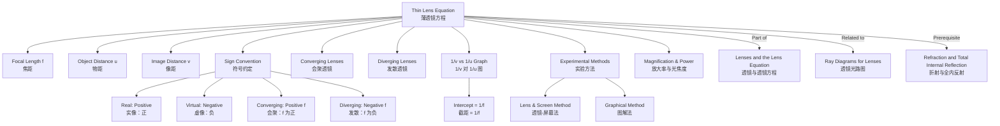

# 1. Overview / 概述

**English:**
The Thin Lens Equation is the mathematical foundation of lens optics, providing a precise relationship between the focal length ($f$), object distance ($u$), and image distance ($v$) for thin lenses. This equation, $\frac{1}{f} = \frac{1}{u} + \frac{1}{v}$, allows us to calculate the position of an image formed by a lens without drawing ray diagrams. It applies to both [[Converging and Diverging Lenses]] and is essential for understanding how lenses form real and virtual images. This sub-topic is a core component of [[Lenses and the Lens Equation]] and builds directly on concepts from [[Refraction and Total Internal Reflection]].

**中文:**
薄透镜方程是透镜光学的数学基础，它精确描述了焦距 ($f$)、物距 ($u$) 和像距 ($v$) 之间的关系。该方程 $\frac{1}{f} = \frac{1}{u} + \frac{1}{v}$ 使我们无需绘制光路图即可计算透镜所成像的位置。它适用于[[Converging and Diverging Lenses|会聚透镜和发散透镜]]，对于理解透镜如何形成实像和虚像至关重要。本子知识点是[[Lenses and the Lens Equation|透镜与透镜方程]]的核心组成部分，并直接建立在[[Refraction and Total Internal Reflection|折射与全内反射]]的概念之上。

---

# 2. Syllabus Learning Objectives / 考纲学习目标

| CAIE 9702 | Edexcel IAL |
|-----------|-------------|
| 8.5 (a) Define the terms focal length, object distance, and image distance | 5.31 Use the lens formula $\frac{1}{f} = \frac{1}{u} + \frac{1}{v}$ |
| 8.5 (b) Use the lens formula $\frac{1}{f} = \frac{1}{u} + \frac{1}{v}$ | 5.32 Apply the sign convention for real and virtual images |
| 8.5 (c) Apply the sign convention: real is positive, virtual is negative | 5.33 Solve problems involving the lens formula |
| 8.5 (d) Solve problems using the lens formula | 5.34 Understand the relationship between focal length and power of a lens |

**Examiner Expectations / 考官期望:**
- **English:** Students must correctly apply the sign convention (real is positive, virtual is negative) when using the thin lens equation. They should be able to rearrange the equation to solve for any variable and interpret the sign of the answer to determine the nature of the image.
- **中文:** 学生必须在使用薄透镜方程时正确应用符号约定（实像为正，虚像为负）。他们应能重新排列方程以求解任何变量，并通过解释答案的符号来确定像的性质。

---

# 3. Core Definitions / 核心定义

| Term (EN/CN) | Definition (EN) | Definition (CN) | Common Mistakes / 常见错误 |
|--------------|-----------------|-----------------|---------------------------|
| **Focal Length** / 焦距 | The distance from the optical centre of a lens to its principal focus (F). For a converging lens, $f$ is positive; for a diverging lens, $f$ is negative. | 从透镜光心到其主焦点(F)的距离。对于会聚透镜，$f$为正；对于发散透镜，$f$为负。 | Confusing focal length with object distance; forgetting the sign convention for diverging lenses. |
| **Object Distance ($u$)** / 物距 | The distance from the object to the optical centre of the lens. Always taken as positive in the thin lens equation. | 从物体到透镜光心的距离。在薄透镜方程中始终取正值。 | Thinking $u$ can be negative; it is always positive. |
| **Image Distance ($v$)** / 像距 | The distance from the image to the optical centre of the lens. Positive for real images, negative for virtual images. | 从像到透镜光心的距离。实像为正，虚像为负。 | Forgetting to assign the correct sign to $v$ based on image type. |
| **Real Image** / 实像 | An image formed where light rays actually converge; can be projected onto a screen. | 光线实际会聚形成的像；可以投影到屏幕上。 | Thinking all images formed by lenses are real. |
| **Virtual Image** / 虚像 | An image formed where light rays appear to diverge from; cannot be projected onto a screen. | 光线似乎发散形成的像；无法投影到屏幕上。 | Confusing virtual images with real images; not using negative sign for $v$. |

---

# 4. Key Concepts Explained / 关键概念详解

## 4.1 The Thin Lens Equation / 薄透镜方程

### Explanation / 解释
**English:** The thin lens equation, $\frac{1}{f} = \frac{1}{u} + \frac{1}{v}$, relates the focal length ($f$) of a lens to the object distance ($u$) and image distance ($v$). This equation assumes the lens is "thin" (its thickness is negligible compared to its focal length) and that light rays are paraxial (close to the principal axis). The equation is derived from geometry and Snell's law, and it applies to both [[Converging and Diverging Lenses]].

**中文:** 薄透镜方程 $\frac{1}{f} = \frac{1}{u} + \frac{1}{v}$ 将透镜的焦距 ($f$) 与物距 ($u$) 和像距 ($v$) 联系起来。该方程假设透镜是"薄"的（其厚度与焦距相比可忽略不计），并且光线是近轴光线（靠近主光轴）。该方程由几何学和斯涅尔定律推导得出，适用于[[Converging and Diverging Lenses|会聚透镜和发散透镜]]。

### Physical Meaning / 物理意义
**English:** The equation shows that the curvature of the wavefront (represented by $1/f$) is the sum of the curvatures of the incident wavefront ($1/u$) and the transmitted wavefront ($1/v$). A shorter focal length means stronger focusing power.

**中文:** 该方程表明波前的曲率（由 $1/f$ 表示）是入射波前曲率 ($1/u$) 和透射波前曲率 ($1/v$) 之和。焦距越短，聚焦能力越强。

### Sign Convention / 符号约定
**English:** The standard sign convention for the thin lens equation is:
- $f$ is positive for converging lenses, negative for diverging lenses
- $u$ is always positive (object is real)
- $v$ is positive for real images, negative for virtual images

**中文:** 薄透镜方程的标准符号约定为：
- 会聚透镜 $f$ 为正，发散透镜 $f$ 为负
- $u$ 始终为正（物体是真实的）
- 实像 $v$ 为正，虚像 $v$ 为负

### Common Misconceptions / 常见误区
- **English:** 
  - Thinking the equation only works for converging lenses
  - Forgetting to use the negative sign for diverging lenses
  - Confusing object distance with image distance
  - Thinking $u$ can be negative
- **中文:**
  - 认为该方程仅适用于会聚透镜
  - 忘记对发散透镜使用负号
  - 混淆物距和像距
  - 认为 $u$ 可以为负

### Exam Tips / 考试提示
- **English:** Always write down the equation with signs before substituting values. Check if your answer makes physical sense (e.g., a real image should be on the opposite side of the lens from the object).
- **中文:** 在代入数值之前，始终先写出带符号的方程。检查答案是否具有物理意义（例如，实像应在透镜的与物体相对的一侧）。

> 📷 **IMAGE PROMPT — DIAGRAM-01: Sign Convention for Thin Lens Equation**
> A clear diagram showing a converging lens with labeled distances: object distance (u) measured from object to lens center, image distance (v) measured from lens center to image. Show both real image (positive v, on opposite side) and virtual image (negative v, on same side as object). Include arrows indicating positive direction.

---

# 5. Essential Equations / 核心公式

## 5.1 The Thin Lens Equation / 薄透镜方程

$$ \frac{1}{f} = \frac{1}{u} + \frac{1}{v} $$

| Symbol (符号) | Meaning (EN) | Meaning (CN) | Unit (单位) |
|--------------|-------------|-------------|------------|
| $f$ | Focal length | 焦距 | m (or cm) |
| $u$ | Object distance | 物距 | m (or cm) |
| $v$ | Image distance | 像距 | m (or cm) |

**Derivation / 推导:** Derived from similar triangles in ray diagrams and Snell's law for paraxial rays.

**Conditions / 适用条件:**
- **English:** Thin lens approximation; paraxial rays; lens in air (or same medium on both sides)
- **中文:** 薄透镜近似；近轴光线；透镜在空气中（或两侧介质相同）

**Limitations / 局限性:**
- **English:** Does not account for lens thickness; inaccurate for thick lenses or non-paraxial rays; assumes monochromatic light (no chromatic aberration)
- **中文:** 不考虑透镜厚度；对于厚透镜或非近轴光线不准确；假设单色光（无色差）

## 5.2 Rearranged Forms / 变形形式

$$ v = \frac{uf}{u - f} $$

$$ u = \frac{vf}{v - f} $$

$$ f = \frac{uv}{u + v} $$

---

# 6. Graphs and Relationships / 图表与关系

## 6.1 $1/v$ vs $1/u$ Graph / $1/v$ 对 $1/u$ 关系图

### Axes / 坐标轴
- **X-axis:** $1/u$ (m⁻¹) — reciprocal of object distance
- **Y-axis:** $1/v$ (m⁻¹) — reciprocal of image distance

### Shape / 形状
**English:** A straight line with gradient -1 and y-intercept $1/f$. The equation $\frac{1}{v} = -\frac{1}{u} + \frac{1}{f}$ shows this linear relationship.

**中文:** 一条斜率为 -1、y 截距为 $1/f$ 的直线。方程 $\frac{1}{v} = -\frac{1}{u} + \frac{1}{f}$ 显示了这种线性关系。

### Gradient Meaning / 斜率含义
**English:** The gradient is -1, confirming the inverse relationship between $u$ and $v$.

**中文:** 斜率为 -1，确认了 $u$ 和 $v$ 之间的反比关系。

### Intercept Meaning / 截距含义
**English:** The y-intercept equals $1/f$ (when $1/u = 0$, i.e., object at infinity). The x-intercept also equals $1/f$ (when $1/v = 0$, i.e., image at infinity).

**中文:** y 截距等于 $1/f$（当 $1/u = 0$ 时，即物体在无穷远处）。x 截距也等于 $1/f$（当 $1/v = 0$ 时，即像在无穷远处）。

### Exam Interpretation / 考试解读
- **English:** This graph is used to determine the focal length of a lens experimentally. Plot $1/v$ against $1/u$, find the intercept, and calculate $f$.
- **中文:** 该图用于通过实验确定透镜的焦距。绘制 $1/v$ 对 $1/u$ 的图，找到截距，并计算 $f$。

> 📷 **IMAGE PROMPT — GRAPH-01: 1/v vs 1/u Graph for Thin Lens**
> A graph showing 1/v on the y-axis and 1/u on the x-axis. A straight line with gradient -1 crosses both axes at the same positive value (1/f). Label the intercepts clearly. Include data points with error bars to show experimental nature.

---

# 7. Required Diagrams / 必备图表

## 7.1 Sign Convention Diagram / 符号约定图

### Description / 描述
**English:** A diagram showing a converging lens with an object placed beyond 2F, forming a real, inverted image on the opposite side. Label $u$, $v$, $f$, and $2F$ clearly. Show the direction of light travel.

**中文:** 一个会聚透镜的示意图，物体放置在 2F 之外，在另一侧形成倒立的实像。清晰标注 $u$、$v$、$f$ 和 $2F$。显示光的传播方向。

### Image Prompt / 图片生成提示
> 📷 **IMAGE PROMPT — DIAGRAM-02: Thin Lens Sign Convention**
> A physics textbook-style diagram of a converging lens with principal axis. Object (arrow) placed left of lens beyond 2F. Real image (inverted arrow) formed right of lens between F and 2F. Label: u (object distance) from object to lens center, v (image distance) from lens center to image, f (focal length) from lens center to F. Include 2F labels on both sides. Light rays shown converging at image point.

### Labels Required / 需要标注
- Optical centre / 光心 (O)
- Principal focus / 主焦点 (F)
- 2F point / 2F 点
- Object distance / 物距 ($u$)
- Image distance / 像距 ($v$)
- Focal length / 焦距 ($f$)

### Exam Importance / 考试重要性
- **English:** Essential for understanding the sign convention and applying the thin lens equation correctly.
- **中文:** 对于理解符号约定和正确应用薄透镜方程至关重要。

---

# 8. Worked Examples / 典型例题

## Example 1: Converging Lens / 会聚透镜例题

### Question / 题目
**English:** An object is placed 30 cm from a converging lens of focal length 20 cm. Calculate the image distance and state whether the image is real or virtual.

**中文:** 一个物体放置在焦距为 20 cm 的会聚透镜前 30 cm 处。计算像距，并说明像是实像还是虚像。

### Solution / 解答

**Step 1:** Write the thin lens equation with sign convention.
**步骤 1:** 写出带符号约定的薄透镜方程。

$$ \frac{1}{f} = \frac{1}{u} + \frac{1}{v} $$

For a converging lens: $f = +20$ cm
For a real object: $u = +30$ cm

**Step 2:** Substitute values.
**步骤 2:** 代入数值。

$$ \frac{1}{20} = \frac{1}{30} + \frac{1}{v} $$

**Step 3:** Solve for $v$.
**步骤 3:** 求解 $v$。

$$ \frac{1}{v} = \frac{1}{20} - \frac{1}{30} = \frac{3 - 2}{60} = \frac{1}{60} $$

$$ v = +60 \text{ cm} $$

**Step 4:** Interpret the sign.
**步骤 4:** 解释符号。

Since $v$ is positive, the image is real.

### Final Answer / 最终答案
**Answer:** $v = 60$ cm, real image | **答案：** $v = 60$ cm，实像

### Quick Tip / 提示
**English:** When $u > f$ for a converging lens, the image is always real and inverted. When $u < f$, the image is virtual and upright.

**中文:** 对于会聚透镜，当 $u > f$ 时，像总是实像且倒立。当 $u < f$ 时，像是虚像且正立。

---

## Example 2: Diverging Lens / 发散透镜例题

### Question / 题目
**English:** An object is placed 15 cm from a diverging lens of focal length 10 cm. Calculate the image distance and state whether the image is real or virtual.

**中文:** 一个物体放置在焦距为 10 cm 的发散透镜前 15 cm 处。计算像距，并说明像是实像还是虚像。

### Solution / 解答

**Step 1:** Write the thin lens equation with sign convention.
**步骤 1:** 写出带符号约定的薄透镜方程。

$$ \frac{1}{f} = \frac{1}{u} + \frac{1}{v} $$

For a diverging lens: $f = -10$ cm
For a real object: $u = +15$ cm

**Step 2:** Substitute values.
**步骤 2:** 代入数值。

$$ \frac{1}{-10} = \frac{1}{15} + \frac{1}{v} $$

**Step 3:** Solve for $v$.
**步骤 3:** 求解 $v$。

$$ \frac{1}{v} = -\frac{1}{10} - \frac{1}{15} = -\frac{3 + 2}{30} = -\frac{5}{30} = -\frac{1}{6} $$

$$ v = -6 \text{ cm} $$

**Step 4:** Interpret the sign.
**步骤 4:** 解释符号。

Since $v$ is negative, the image is virtual.

### Final Answer / 最终答案
**Answer:** $v = -6$ cm, virtual image | **答案：** $v = -6$ cm，虚像

### Quick Tip / 提示
**English:** For a diverging lens, the image is always virtual, upright, and diminished, regardless of object position. The image distance is always negative.

**中文:** 对于发散透镜，无论物体在何处，像总是虚像、正立且缩小。像距始终为负。

---

# 9. Past Paper Question Types / 历年真题题型

| Question Type / 题型 | Frequency / 频率 | Difficulty / 难度 | Past Paper References / 真题索引 |
|----------------------|------------------|------------------|-------------------------------|
| Calculate image distance given $u$ and $f$ | High | Easy | 📝 *待填入* |
| Determine focal length from $u$ and $v$ | High | Medium | 📝 *待填入* |
| Find object distance given $v$ and $f$ | Medium | Medium | 📝 *待填入* |
| Interpret sign of $v$ to determine image type | High | Easy | 📝 *待填入* |
| Experimental determination of $f$ using graph | Medium | Hard | 📝 *待填入* |

**Common Command Words / 常见指令词:**
- **English:** Calculate, Determine, Find, State, Show, Explain
- **中文:** 计算，确定，求出，说明，证明，解释

---

# 10. Practical Skills Connections / 实验技能链接

**English:** The thin lens equation is central to the practical determination of focal length. Common experiments include:
1. **Lens and Screen Method:** Place an object at a known distance, move a screen to find the sharp image, measure $v$, and calculate $f$ using $\frac{1}{f} = \frac{1}{u} + \frac{1}{v}$.
2. **Graphical Method:** Measure $v$ for several values of $u$, plot $1/v$ against $1/u$, and find $f$ from the intercept.
3. **Uncertainties:** Measure $u$ and $v$ with rulers (±1 mm), propagate uncertainties to find the uncertainty in $f$.

**Key Practical Skills:**
- Measuring distances accurately along the optical bench
- Finding the sharpest image position
- Plotting graphs with error bars
- Calculating gradients and intercepts

**中文:** 薄透镜方程是实验测定焦距的核心。常见实验包括：
1. **透镜-屏幕法：** 将物体放置在已知距离处，移动屏幕找到清晰的像，测量 $v$，使用 $\frac{1}{f} = \frac{1}{u} + \frac{1}{v}$ 计算 $f$。
2. **图解法：** 测量多个 $u$ 值对应的 $v$，绘制 $1/v$ 对 $1/u$ 的图，从截距求出 $f$。
3. **不确定度：** 用尺子测量 $u$ 和 $v$（±1 mm），传播不确定度以求出 $f$ 的不确定度。

**关键实验技能：**
- 沿光具座准确测量距离
- 找到最清晰的像位置
- 绘制带误差线的图表
- 计算斜率和截距

---

# 11. Concept Map / 概念图谱

---

# 12. Quick Revision Sheet / 速查表

| Category / 类别 | Key Points / 要点 |
|----------------|------------------|
| **Definition / 定义** | $\frac{1}{f} = \frac{1}{u} + \frac{1}{v}$ — relates focal length, object distance, and image distance for thin lenses |
| **Sign Convention / 符号约定** | $f$: + for converging, - for diverging; $u$: always +; $v$: + for real, - for virtual |
| **Key Formula / 核心公式** | $\frac{1}{f} = \frac{1}{u} + \frac{1}{v}$; $v = \frac{uf}{u-f}$; $f = \frac{uv}{u+v}$ |
| **Key Graph / 核心图表** | $1/v$ vs $1/u$: straight line, gradient -1, intercept $1/f$ |
| **Converging Lens / 会聚透镜** | $u > f$ → real image ($v$ +); $u < f$ → virtual image ($v$ -) |
| **Diverging Lens / 发散透镜** | Always virtual image ($v$ -), upright, diminished |
| **Common Mistake / 常见错误** | Forgetting sign for diverging lens ($f$ negative); confusing $u$ and $v$ |
| **Exam Tip / 考试提示** | Write equation with signs first; check physical plausibility of answer |
| **Practical / 实验** | Measure $u$ and $v$ on optical bench; plot $1/v$ vs $1/u$ to find $f$ |