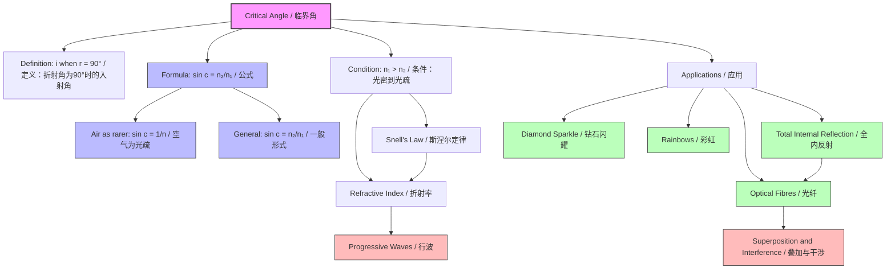

# Critical Angle / 临界角

---

# 1. Overview / 概述

**English:**
The critical angle is a fundamental concept in [[Refraction and Total Internal Reflection]] that defines the threshold angle of incidence at which light transitions from refraction to [[Total Internal Reflection]]. When light travels from a denser medium (higher [[Refractive Index]]) to a less dense medium (lower refractive index), the critical angle represents the specific incident angle that produces an angle of refraction of exactly 90° (along the boundary). This concept is essential for understanding optical fibre technology, fibre optic communications, and various optical instruments. The critical angle depends solely on the refractive indices of the two media and is a key parameter in determining whether total internal reflection will occur.

**中文:**
临界角是[[Refraction and Total Internal Reflection]]中的一个基本概念，它定义了光从折射转变为[[Total Internal Reflection]]的入射角阈值。当光从光密介质（较高[[Refractive Index]]）传播到光疏介质（较低折射率）时，临界角是产生恰好90°折射角（沿界面方向）的特定入射角。这一概念对于理解光纤技术、光纤通信和各种光学仪器至关重要。临界角仅取决于两种介质的折射率，是判断是否发生全内反射的关键参数。

---

# 2. Syllabus Learning Objectives / 考纲学习目标

| CAIE 9702 | Edexcel IAL |
|-----------|-------------|
| 8.4(a) Define and derive the critical angle | WPH11 U2: 5.26 Define critical angle |
| 8.4(b) Relate critical angle to refractive indices | WPH11 U2: 5.27 Derive critical angle formula |
| 8.4(c) Apply critical angle to TIR conditions | WPH11 U2: 5.28 Calculate critical angle |
| 8.4(d) Use critical angle in problem-solving | WPH11 U2: 5.29 Apply to optical fibres |
| 8.4(e) Explain critical angle in optical fibres | WPH11 U2: 5.30 Solve problems involving critical angle |
| 8.4(f) Calculate critical angle for different media | — |

**Examiner Expectations / 考官期望:**
- **English:** Students must be able to define the critical angle precisely, derive the formula $n_1 \sin c = n_2 \sin 90°$, calculate critical angles for various media combinations, and apply the concept to determine whether total internal reflection occurs. Common exam questions involve calculating the critical angle for glass-air, water-air, and diamond-air interfaces, as well as explaining why diamonds sparkle.
- **中文:** 学生必须能够精确定义临界角，推导公式 $n_1 \sin c = n_2 \sin 90°$，计算不同介质组合的临界角，并应用该概念判断是否发生全内反射。常见考题涉及计算玻璃-空气、水-空气和钻石-空气界面的临界角，以及解释钻石为何闪耀。

---

# 3. Core Definitions / 核心定义

| Term (EN/CN) | Definition (EN) | Definition (CN) | Common Mistakes / 常见错误 |
|--------------|-----------------|-----------------|---------------------------|
| **Critical Angle** / 临界角 | The angle of incidence in the denser medium for which the angle of refraction in the less dense medium is exactly 90° | 在光密介质中的入射角，使得在光疏介质中的折射角恰好为90° | ❌ Confusing with angle of refraction; ❌ Thinking it applies when light goes from less dense to denser medium |
| **Angle of Incidence** / 入射角 | The angle between the incident ray and the normal at the boundary | 入射光线与法线之间的夹角 | ❌ Measuring from the boundary surface instead of the normal |
| **Angle of Refraction** / 折射角 | The angle between the refracted ray and the normal in the second medium | 折射光线与法线在第二种介质中的夹角 | ❌ Forgetting it's measured in the second medium |
| **Denser Medium** / 光密介质 | The medium with higher refractive index (where light travels slower) | 折射率较高的介质（光在其中传播速度较慢） | ❌ Confusing with physical density (mass/volume) |
| **Rarer Medium** / 光疏介质 | The medium with lower refractive index (where light travels faster) | 折射率较低的介质（光在其中传播速度较快） | ❌ Thinking "rarer" means less common |
| **Normal** / 法线 | An imaginary line perpendicular to the boundary surface at the point of incidence | 在入射点处垂直于界面的假想线 | ❌ Drawing the normal at an angle |

---

# 4. Key Concepts Explained / 关键概念详解

## 4.1 The Critical Angle Condition / 临界角条件

### Explanation / 解释
**English:**
The critical angle exists only when light travels from a medium with higher [[Refractive Index]] ($n_1$) to a medium with lower refractive index ($n_2$), i.e., $n_1 > n_2$. At the critical angle $c$, the refracted ray emerges exactly along the boundary surface (angle of refraction = 90°). For any incident angle greater than the critical angle, [[Total Internal Reflection]] occurs — all light is reflected back into the denser medium.

The relationship is derived from [[Snell's Law]]:
$$n_1 \sin c = n_2 \sin 90° = n_2$$

Therefore:
$$\sin c = \frac{n_2}{n_1}$$

Where:
- $c$ = critical angle (in the denser medium)
- $n_1$ = refractive index of denser medium
- $n_2$ = refractive index of rarer medium

**中文:**
临界角仅当光从较高[[Refractive Index]]（$n_1$）的介质传播到较低折射率（$n_2$）的介质时才存在，即 $n_1 > n_2$。在临界角 $c$ 处，折射光线恰好沿界面表面射出（折射角 = 90°）。对于任何大于临界角的入射角，都会发生[[Total Internal Reflection]]——所有光都被反射回光密介质。

该关系由[[Snell's Law]]推导得出：
$$n_1 \sin c = n_2 \sin 90° = n_2$$

因此：
$$\sin c = \frac{n_2}{n_1}$$

其中：
- $c$ = 临界角（在光密介质中）
- $n_1$ = 光密介质的折射率
- $n_2$ = 光疏介质的折射率

### Physical Meaning / 物理意义
**English:**
The critical angle represents the maximum angle at which light can still escape from a denser medium into a rarer medium. Beyond this angle, the light cannot "break free" and is trapped inside the denser medium through total internal reflection. This is why diamonds sparkle — their high refractive index ($n \approx 2.42$) gives a small critical angle ($\approx 24.4°$), causing light to undergo multiple internal reflections before escaping.

**中文:**
临界角代表了光仍能从光密介质逃逸到光疏介质的最大角度。超过这个角度，光无法"挣脱"并被困在光密介质中，通过全内反射传播。这就是钻石闪耀的原因——其高折射率（$n \approx 2.42$）产生较小的临界角（$\approx 24.4°$），使光在逃逸前经历多次内反射。

### Common Misconceptions / 常见误区
- ❌ **"Critical angle applies to any boundary"** — Only when $n_1 > n_2$ (denser to rarer)
- ❌ **"Critical angle is always 90°"** — No, it's the incident angle that gives a 90° refraction angle
- ❌ **"At critical angle, light stops"** — No, it refracts along the boundary
- ❌ **"Critical angle depends on angle of incidence"** — No, it's a fixed property of the two media

### Exam Tips / 考试提示
- ✅ Always check which medium is denser before applying critical angle
- ✅ Remember: $\sin c = n_2/n_1$ when the rarer medium is air ($n_2 = 1$)
- ✅ For air as the rarer medium: $\sin c = 1/n_1$
- ✅ Draw ray diagrams showing the three cases: $i < c$, $i = c$, $i > c$

> 📷 **IMAGE PROMPT — CRITICAL-ANGLE-01: Critical Angle Ray Diagram**
> A clear ray diagram showing three rays from a denser medium (glass) to a rarer medium (air): Ray 1 with incident angle less than critical angle showing refraction away from normal; Ray 2 at exactly critical angle showing refracted ray along the boundary at 90°; Ray 3 with incident angle greater than critical angle showing total internal reflection. All angles clearly labelled with normal line, incident angles, and refracted angles. Clean white background with professional physics diagram style.

---

## 4.2 Critical Angle and Refractive Index Relationship / 临界角与折射率的关系

### Explanation / 解释
**English:**
The critical angle is inversely related to the refractive index of the denser medium. A higher refractive index produces a smaller critical angle. This inverse relationship is crucial for understanding why different materials have different critical angles:

| Material | Refractive Index ($n$) | Critical Angle (to air) |
|----------|----------------------|------------------------|
| Diamond | 2.42 | 24.4° |
| Glass (crown) | 1.52 | 41.1° |
| Glass (flint) | 1.62 | 38.1° |
| Water | 1.33 | 48.8° |
| Ice | 1.31 | 49.8° |

**中文:**
临界角与光密介质的折射率成反比。折射率越高，临界角越小。这种反比关系对于理解不同材料为何具有不同的临界角至关重要：

| 材料 | 折射率 ($n$) | 临界角（对空气） |
|------|-------------|----------------|
| 钻石 | 2.42 | 24.4° |
| 玻璃（冕牌） | 1.52 | 41.1° |
| 玻璃（火石） | 1.62 | 38.1° |
| 水 | 1.33 | 48.8° |
| 冰 | 1.31 | 49.8° |

### Physical Meaning / 物理意义
**English:**
The smaller the critical angle, the more likely total internal reflection will occur. This explains:
- **Diamonds sparkle** — small critical angle means light is trapped and undergoes multiple reflections
- **Optical fibres** — use materials with high refractive index cores to keep critical angle small
- **Rainbow formation** — water droplets have a critical angle of ~48.8°, contributing to the rainbow's geometry

**中文:**
临界角越小，发生全内反射的可能性越大。这解释了：
- **钻石闪耀** — 小临界角意味着光被捕获并经历多次反射
- **光纤** — 使用高折射率纤芯材料使临界角变小
- **彩虹形成** — 水滴的临界角约为48.8°，影响彩虹的几何形状

### Common Misconceptions / 常见误区
- ❌ **"Higher refractive index means larger critical angle"** — Incorrect! They are inversely related
- ❌ **"Critical angle is the same for all materials"** — No, it depends on the refractive indices

### Exam Tips / 考试提示
- ✅ For air as the rarer medium: $c = \sin^{-1}(1/n)$
- ✅ For two non-air media: $c = \sin^{-1}(n_2/n_1)$
- ✅ Remember: $\sin c$ is always less than 1, so $n_2 < n_1$ is required

---

# 5. Essential Equations / 核心公式

## Equation 1: Critical Angle Formula / 临界角公式

$$ \sin c = \frac{n_2}{n_1} $$

| Symbol (符号) | Meaning (EN) | Meaning (CN) | Unit (单位) |
|--------------|-------------|-------------|------------|
| $c$ | Critical angle | 临界角 | degrees (°) or radians |
| $n_1$ | Refractive index of denser medium | 光密介质的折射率 | dimensionless |
| $n_2$ | Refractive index of rarer medium | 光疏介质的折射率 | dimensionless |

**Derivation / 推导:**
From [[Snell's Law]]: $n_1 \sin \theta_1 = n_2 \sin \theta_2$
At critical angle: $\theta_1 = c$ and $\theta_2 = 90°$
Therefore: $n_1 \sin c = n_2 \sin 90° = n_2$
Rearranging: $\sin c = \frac{n_2}{n_1}$

**Conditions / 适用条件:**
- **English:** Only valid when $n_1 > n_2$ (light travels from denser to rarer medium). The formula assumes the rarer medium is transparent and the boundary is smooth.
- **中文:** 仅当 $n_1 > n_2$（光从光密介质传播到光疏介质）时有效。该公式假设光疏介质是透明的且界面光滑。

**Limitations / 局限性:**
- **English:** Does not account for absorption, scattering, or imperfect boundaries. Assumes monochromatic light (refractive index varies with wavelength). For white light, each colour has a slightly different critical angle (dispersion).
- **中文:** 不考虑吸收、散射或不完美界面的影响。假设单色光（折射率随波长变化）。对于白光，每种颜色都有略微不同的临界角（色散）。

---

## Equation 2: Critical Angle with Air / 空气作为光疏介质的临界角

$$ \sin c = \frac{1}{n} $$

| Symbol (符号) | Meaning (EN) | Meaning (CN) | Unit (单位) |
|--------------|-------------|-------------|------------|
| $c$ | Critical angle | 临界角 | degrees (°) |
| $n$ | Refractive index of denser medium | 光密介质的折射率 | dimensionless |

**Derivation / 推导:**
When the rarer medium is air (or vacuum), $n_2 = 1$, so:
$$\sin c = \frac{1}{n_1}$$

**Conditions / 适用条件:**
- **English:** Only when the rarer medium is air or vacuum ($n \approx 1$). This is the most common exam scenario.
- **中文:** 仅当光疏介质是空气或真空（$n \approx 1$）时。这是最常见的考试场景。

**Limitations / 局限性:**
- **English:** Assumes air has refractive index exactly 1 (very close approximation). For precise calculations, air's actual refractive index ($n \approx 1.0003$) may be needed.
- **中文:** 假设空气的折射率恰好为1（非常接近的近似值）。对于精确计算，可能需要空气的实际折射率（$n \approx 1.0003$）。

> 📷 **IMAGE PROMPT — CRITICAL-ANGLE-02: Critical Angle vs Refractive Index Graph**
> A graph showing the inverse relationship between critical angle (y-axis, 0° to 90°) and refractive index (x-axis, 1.0 to 3.0). The curve follows $c = \sin^{-1}(1/n)$, showing a steep drop from 90° at n=1 to about 19.5° at n=3. Key points marked: water (n=1.33, c=48.8°), crown glass (n=1.52, c=41.1°), diamond (n=2.42, c=24.4°). Clean white background with grid lines and labelled axes.

---

# 6. Graphs and Relationships / 图表与关系

## 6.1 Critical Angle vs Refractive Index / 临界角与折射率的关系

### Axes / 坐标轴
- **X-axis:** Refractive index of denser medium ($n_1$), dimensionless
- **Y-axis:** Critical angle ($c$), degrees (°)
- **X轴：** 光密介质的折射率（$n_1$），无量纲
- **Y轴：** 临界角（$c$），度（°）

### Shape / 形状
**English:** A decreasing curve following $c = \sin^{-1}(1/n_1)$. The curve drops steeply from 90° at $n_1 = 1$ and approaches 0° asymptotically as $n_1$ increases. The rate of decrease slows for higher refractive indices.

**中文:** 遵循 $c = \sin^{-1}(1/n_1)$ 的递减曲线。曲线从 $n_1 = 1$ 时的90°急剧下降，随着 $n_1$ 增加渐近趋近于0°。对于较高折射率，下降速率减慢。

### Gradient Meaning / 斜率含义
**English:** The gradient $\frac{dc}{dn_1}$ represents how sensitive the critical angle is to changes in refractive index. The gradient is steepest near $n_1 = 1$ (small changes in $n$ cause large changes in $c$) and becomes shallower for higher $n_1$ (large changes in $n$ cause small changes in $c$).

**中文:** 梯度 $\frac{dc}{dn_1}$ 表示临界角对折射率变化的敏感程度。梯度在 $n_1 = 1$ 附近最陡（$n$ 的微小变化导致 $c$ 的较大变化），对于较高的 $n_1$ 变得较平缓（$n$ 的较大变化导致 $c$ 的较小变化）。

### Area Meaning / 面积含义
**English:** The area under the curve has no direct physical meaning in this context.

**中文:** 曲线下的面积在此上下文中没有直接的物理意义。

### Exam Interpretation / 考试解读
- ✅ Be able to read critical angle values from a graph given refractive index
- ✅ Understand that materials with $n > 1.5$ have critical angles less than 42°
- ✅ Recognise that diamond ($n = 2.42$) has a very small critical angle (24.4°)

---

# 7. Required Diagrams / 必备图表

## 7.1 Critical Angle Ray Diagram / 临界角光线图

### Description / 描述
**English:** A ray diagram showing three scenarios at a boundary between a denser medium (e.g., glass) and a rarer medium (e.g., air). The diagram must clearly show:
1. Incident angle less than critical angle — refraction occurs (bending away from normal)
2. Incident angle equal to critical angle — refracted ray along the boundary (90°)
3. Incident angle greater than critical angle — total internal reflection occurs

**中文:** 显示光密介质（如玻璃）和光疏介质（如空气）界面处三种情况的光线图。该图必须清晰显示：
1. 入射角小于临界角——发生折射（偏离法线弯曲）
2. 入射角等于临界角——折射光线沿界面（90°）
3. 入射角大于临界角——发生全内反射

### Image Prompt / 图片生成提示
> 📷 **IMAGE PROMPT — CRITICAL-ANGLE-03: Complete Critical Angle Diagram**
> Professional physics textbook-style diagram showing a glass-air boundary. Three incident rays originate from a point source in the glass: Ray A (i=30°, less than critical) refracts into air at about 50° from normal; Ray B (i=41.1°, exactly critical) refracts along the boundary at 90°; Ray C (i=50°, greater than critical) reflects back into glass at 50°. All angles clearly labelled with degree values. Normal line shown as dashed vertical line. Boundary surface clearly marked. Glass region shaded light blue, air region white. Clean, educational style with arrows on rays.

### Labels Required / 需要标注
- **English:** Incident rays (A, B, C), Refracted rays, Reflected ray, Normal, Boundary, Angle of incidence ($i$), Angle of refraction ($r$), Critical angle ($c$), Denser medium, Rarer medium
- **中文:** 入射光线（A、B、C），折射光线，反射光线，法线，界面，入射角（$i$），折射角（$r$），临界角（$c$），光密介质，光疏介质

### Exam Importance / 考试重要性
- **English:** This is the most frequently tested diagram for critical angle questions. Students must be able to draw, label, and interpret this diagram. Common exam questions ask to identify which ray shows the critical angle or to calculate the critical angle from the diagram.
- **中文:** 这是临界角问题中最常考的图表。学生必须能够绘制、标注和解释该图。常见考题要求识别哪条光线显示临界角，或从图中计算临界角。

---

## 7.2 Optical Fibre Critical Angle Diagram / 光纤临界角图

### Description / 描述
**English:** A diagram showing how the critical angle is used in optical fibres. The core (higher refractive index) is surrounded by cladding (lower refractive index). Light entering the fibre at an angle greater than the critical angle undergoes total internal reflection, propagating along the fibre.

**中文:** 显示临界角如何在光纤中使用的图。纤芯（较高折射率）被包层（较低折射率）包围。以大于临界角的角度进入光纤的光发生全内反射，沿光纤传播。

### Image Prompt / 图片生成提示
> 📷 **IMAGE PROMPT — CRITICAL-ANGLE-04: Optical Fibre Critical Angle**
> Cross-section diagram of an optical fibre showing the core (diameter ~50μm, shaded light blue) surrounded by cladding (darker blue). A light ray enters from the left at an angle greater than the critical angle at the core-cladding interface. The ray zigzags down the fibre through multiple total internal reflections. Critical angle marked at one reflection point. Acceptance angle shown at the entrance. Labels: Core (n₁), Cladding (n₂), Critical angle (c), Total Internal Reflection. Clean engineering diagram style.

### Labels Required / 需要标注
- **English:** Core, Cladding, Critical angle, Total internal reflection, Acceptance angle, Incident ray, Transmitted ray
- **中文:** 纤芯，包层，临界角，全内反射，接收角，入射光线，传输光线

### Exam Importance / 考试重要性
- **English:** Essential for understanding optical fibre communication. Students must explain how the critical angle ensures light remains in the core.
- **中文:** 对于理解光纤通信至关重要。学生必须解释临界角如何确保光保持在纤芯中。

---

# 8. Worked Examples / 典型例题

## Example 1: Calculating Critical Angle for Glass-Air Interface / 计算玻璃-空气界面的临界角

### Question / 题目
**English:**
A ray of light travels from crown glass ($n = 1.52$) into air ($n = 1.00$). Calculate the critical angle for this interface.

**中文:**
一束光从冕牌玻璃（$n = 1.52$）传播到空气（$n = 1.00$）。计算该界面的临界角。

### Solution / 解答

**Step 1: Identify the media / 步骤1：识别介质**
- Denser medium: crown glass, $n_1 = 1.52$
- Rarer medium: air, $n_2 = 1.00$
- Since $n_1 > n_2$, critical angle exists

**Step 2: Apply the formula / 步骤2：应用公式**
$$\sin c = \frac{n_2}{n_1} = \frac{1.00}{1.52}$$

**Step 3: Calculate / 步骤3：计算**
$$\sin c = 0.6579$$

**Step 4: Find the angle / 步骤4：求角度**
$$c = \sin^{-1}(0.6579) = 41.1°$$

### Final Answer / 最终答案
**Answer:** $c = 41.1°$ | **答案：** $c = 41.1°$

### Quick Tip / 提示
- **English:** For air as the rarer medium, always use $\sin c = 1/n$. Check your calculator is in degree mode!
- **中文:** 对于空气作为光疏介质，始终使用 $\sin c = 1/n$。检查计算器是否处于角度模式！

---

## Example 2: Determining if Total Internal Reflection Occurs / 判断是否发生全内反射

### Question / 题目
**English:**
Light travels from water ($n = 1.33$) into air ($n = 1.00$) at an incident angle of 55°. Will total internal reflection occur? Justify your answer.

**中文:**
光以55°的入射角从水（$n = 1.33$）传播到空气（$n = 1.00$）。是否会发生全内反射？证明你的答案。

### Solution / 解答

**Step 1: Calculate the critical angle / 步骤1：计算临界角**
$$\sin c = \frac{n_2}{n_1} = \frac{1.00}{1.33} = 0.7519$$
$$c = \sin^{-1}(0.7519) = 48.8°$$

**Step 2: Compare incident angle with critical angle / 步骤2：比较入射角与临界角**
- Incident angle: $i = 55°$
- Critical angle: $c = 48.8°$
- Since $i > c$ (55° > 48.8°), total internal reflection WILL occur

**Step 3: Justification / 步骤3：证明**
- **English:** The incident angle (55°) exceeds the critical angle (48.8°). According to the principles of refraction, when $i > c$, no refraction is possible — all light is reflected back into the water.
- **中文:** 入射角（55°）超过了临界角（48.8°）。根据折射原理，当 $i > c$ 时，不可能发生折射——所有光都被反射回水中。

### Final Answer / 最终答案
**Answer:** Yes, total internal reflection occurs because $i = 55° > c = 48.8°$ | **答案：** 是的，发生全内反射，因为 $i = 55° > c = 48.8°$

### Quick Tip / 提示
- **English:** Always calculate the critical angle first, then compare with the given incident angle. The condition for TIR is $i > c$.
- **中文:** 始终先计算临界角，然后与给定的入射角比较。全内反射的条件是 $i > c$。

---

## Example 3: Finding Refractive Index from Critical Angle / 从临界角求折射率

### Question / 题目
**English:**
The critical angle for a certain type of glass in air is 38.0°. Calculate the refractive index of this glass.

**中文:**
某种玻璃在空气中的临界角为38.0°。计算该玻璃的折射率。

### Solution / 解答

**Step 1: Identify known values / 步骤1：识别已知值**
- Critical angle: $c = 38.0°$
- Rarer medium: air, $n_2 = 1.00$
- Unknown: $n_1$ (refractive index of glass)

**Step 2: Apply the formula / 步骤2：应用公式**
$$\sin c = \frac{n_2}{n_1}$$
$$\sin 38.0° = \frac{1.00}{n_1}$$

**Step 3: Rearrange and calculate / 步骤3：重新排列并计算**
$$n_1 = \frac{1.00}{\sin 38.0°} = \frac{1.00}{0.6157} = 1.62$$

### Final Answer / 最终答案
**Answer:** $n = 1.62$ | **答案：** $n = 1.62$

### Quick Tip / 提示
- **English:** When finding refractive index from critical angle, use $n = 1/\sin c$. This is flint glass (typical $n = 1.62$).
- **中文:** 从临界角求折射率时，使用 $n = 1/\sin c$。这是火石玻璃（典型 $n = 1.62$）。

---

# 9. Past Paper Question Types / 历年真题题型

| Question Type / 题型 | Frequency / 频率 | Difficulty / 难度 | Past Paper References / 真题索引 |
|----------------------|------------------|------------------|-------------------------------|
| Calculate critical angle from refractive indices | ★★★★★ (Very High) | ★★☆☆☆ (Easy) | 📝 *待填入* |
| Determine if TIR occurs given incident angle | ★★★★☆ (High) | ★★★☆☆ (Medium) | 📝 *待填入* |
| Find refractive index from critical angle | ★★★★☆ (High) | ★★★☆☆ (Medium) | 📝 *待填入* |
| Explain diamond sparkle using critical angle | ★★★☆☆ (Medium) | ★★★★☆ (Hard) | 📝 *待填入* |
| Optical fibre critical angle application | ★★★☆☆ (Medium) | ★★★★☆ (Hard) | 📝 *待填入* |
| Derive critical angle formula | ★★☆☆☆ (Low) | ★★★☆☆ (Medium) | 📝 *待填入* |

**Common Command Words / 常见指令词:**
- **English:** Calculate, Determine, Explain, Derive, Show that, State, Define
- **中文:** 计算，确定，解释，推导，证明，陈述，定义

---

# 10. Practical Skills Connections / 实验技能链接

**English:**
The critical angle concept connects to practical work in several ways:

1. **Measuring Refractive Index:** The critical angle can be used to determine the refractive index of a material experimentally. A semicircular glass block is used — light is directed through the curved surface to the flat surface, and the incident angle is varied until the refracted ray just disappears (critical angle reached).

2. **Experimental Setup:**
   - Use a semicircular glass block on a protractor
   - Direct a ray of light through the curved side (no refraction at curved surface)
   - Rotate the ray until the emergent ray along the flat surface just disappears
   - Record the critical angle
   - Calculate $n = 1/\sin c$

3. **Uncertainties:**
   - Angle measurement uncertainty: typically ±0.5° to ±1°
   - This leads to uncertainty in $n$: $\Delta n = n \cot c \cdot \Delta c$
   - Multiple readings improve accuracy

4. **Graph Plotting:**
   - Plot $\sin c$ against $1/n$ to verify the relationship
   - The gradient should be 1 (for air as rarer medium)

5. **Common Errors:**
   - Not using a semicircular block (refraction at curved surface complicates)
   - Parallax error in reading angles
   - Not ensuring the ray passes through the centre of the semicircle

**中文:**
临界角概念通过多种方式与实验工作联系：

1. **测量折射率：** 临界角可用于实验确定材料的折射率。使用半圆形玻璃块——光通过曲面射向平面，改变入射角直到折射光线刚好消失（达到临界角）。

2. **实验装置：**
   - 在量角器上使用半圆形玻璃块
   - 通过曲面引导光线（曲面处无折射）
   - 旋转光线直到沿平面的出射光线刚好消失
   - 记录临界角
   - 计算 $n = 1/\sin c$

3. **不确定度：**
   - 角度测量不确定度：通常 ±0.5° 到 ±1°
   - 这导致 $n$ 的不确定度：$\Delta n = n \cot c \cdot \Delta c$
   - 多次读数提高精度

4. **图表绘制：**
   - 绘制 $\sin c$ 对 $1/n$ 的图以验证关系
   - 斜率应为1（对于空气作为光疏介质）

5. **常见错误：**
   - 未使用半圆形块（曲面处的折射使问题复杂化）
   - 读取角度时的视差误差
   - 未确保光线通过半圆的中心

---

# 11. Concept Map / 概念图谱

---

# 12. Quick Revision Sheet / 速查表

| Category / 类别 | Key Points / 要点 |
|----------------|------------------|
| **Definition / 定义** | The angle of incidence in the denser medium that produces an angle of refraction of 90° in the rarer medium / 光密介质中产生光疏介质中90°折射角的入射角 |
| **Condition / 条件** | Only exists when $n_1 > n_2$ (denser to rarer) / 仅当 $n_1 > n_2$（光密到光疏）时存在 |
| **Key Formula / 核心公式** | $\sin c = \frac{n_2}{n_1}$; For air: $\sin c = \frac{1}{n}$ |
| **TIR Condition / 全内反射条件** | Total internal reflection occurs when $i > c$ / 当 $i > c$ 时发生全内反射 |
| **Key Values / 关键数值** | Water-air: 48.8°; Crown glass-air: 41.1°; Diamond-air: 24.4° |
| **Key Graph / 核心图表** | $c$ vs $n$: Inverse relationship, decreasing curve / $c$ 对 $n$：反比关系，递减曲线 |
| **Common Exam Question / 常见考题** | "Calculate the critical angle for..." / "计算...的临界角" |
| **Exam Tip / 考试提示** | Always check $n_1 > n_2$ first; Use degree mode on calculator / 始终先检查 $n_1 > n_2$；计算器使用角度模式 |
| **Practical Connection / 实验联系** | Use semicircular block to measure critical angle experimentally / 使用半圆形块实验测量临界角 |
| **Common Mistake / 常见错误** | Applying critical angle when $n_1 < n_2$ (rarer to denser) / 当 $n_1 < n_2$（光疏到光密）时应用临界角 |

---

**Parent Hub:** [[Refraction and Total Internal Reflection]]
**Sibling Topics:** [[Refraction and Snell's Law]], [[Refractive Index]], [[Total Internal Reflection]], [[Optical Fibres and Their Applications]]
**Prerequisites:** [[Progressive Waves]]
**Related Topics:** [[Superposition and Interference]]