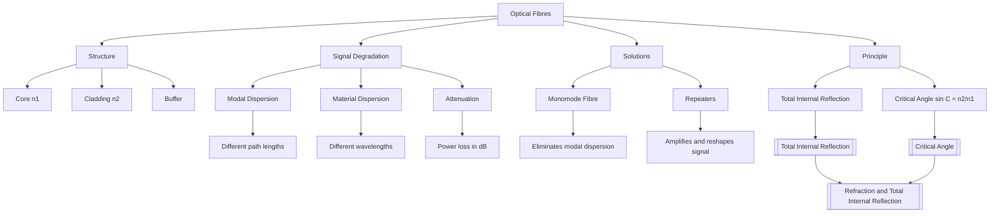

---
# Optical Fibres and Their Applications / 光纤及其应用

---

# 1. Overview / 概述

**English:**
This sub-topic explores the practical application of [[Total Internal Reflection]] in the form of optical fibres. Optical fibres are thin, flexible strands of glass or plastic that can transmit light signals over long distances with minimal loss. The principle relies on the critical angle and total internal reflection to guide light along the fibre's core. This technology is fundamental to modern telecommunications, medicine (endoscopy), and data transmission. Understanding the structure of an optical fibre, the conditions for signal propagation, and the limitations such as dispersion and attenuation is essential for A-Level Physics. This leaf node builds directly on the concepts of [[Refractive Index]] and [[Critical Angle]] from the parent hub [[Refraction and Total Internal Reflection]].

**中文:**
本子知识点探讨了[[全内反射]]在光纤中的实际应用。光纤是由玻璃或塑料制成的细长柔性纤维，能够以极低的损耗长距离传输光信号。其原理依赖于临界角和全内反射，将光限制在纤芯内传播。这项技术是现代电信、医学（内窥镜）和数据传输的基础。理解光纤的结构、信号传播的条件以及色散和衰减等限制，对于A-Level物理至关重要。本知识点直接建立在[[折射率]]和[[临界角]]的概念之上，属于[[折射与全内反射]]父主题的一部分。

---

# 2. Syllabus Learning Objectives / 考纲学习目标

| CAIE 9702 (8.4 a-f) | Edexcel IAL (WPH11 U2: 5.26-5.30) |
|-----------|-------------|
| Describe the structure of an optical fibre. | Understand the principles of the transmission of light through an optical fibre. |
| Explain the use of total internal reflection in optical fibres. | Explain the meaning of modal dispersion and material dispersion. |
| Define and calculate the critical angle for a fibre. | Describe the use of a monomode fibre to reduce pulse broadening. |
| Explain the meaning of modal and material dispersion. | Understand the meaning of attenuation and the use of repeaters. |
| Explain the use of a cladding and a monomode fibre. | |
| Explain the use of repeaters to reduce signal degradation. | |

**Examiner Expectations / 考官期望:**
- **English:** You must be able to draw and label a cross-section of an optical fibre (core and cladding). You must explain why the cladding has a lower refractive index than the core. You must be able to calculate the critical angle at the core-cladding boundary. You must distinguish between modal and material dispersion and explain how a monomode fibre reduces pulse broadening. You must define attenuation and calculate signal loss in dB.
- **中文:** 你必须能够绘制并标注光纤的横截面（纤芯和包层）。你必须解释为什么包层的折射率低于纤芯。你必须能够计算纤芯-包层界面的临界角。你必须区分模式色散和材料色散，并解释单模光纤如何减少脉冲展宽。你必须定义衰减并以分贝（dB）为单位计算信号损失。

---

# 3. Core Definitions / 核心定义

| Term (EN/CN) | Definition (EN) | Definition (CN) | Common Mistakes / 常见错误 |
|--------------|-----------------|-----------------|---------------------------|
| **Optical Fibre** / 光纤 | A thin, flexible transparent fibre that acts as a waveguide to transmit light signals using total internal reflection. | 一种细长柔韧的透明纤维，利用全内反射作为波导传输光信号。 | Confusing it with a simple glass rod; the cladding is essential. |
| **Core** / 纤芯 | The central, high-refractive-index part of the fibre through which light travels. | 光纤中心折射率较高的部分，光在其中传播。 | Forgetting that the core must have a higher refractive index than the cladding. |
| **Cladding** / 包层 | The outer layer of the fibre with a lower refractive index than the core, ensuring total internal reflection and protecting the core. | 光纤的外层，折射率低于纤芯，确保全内反射并保护纤芯。 | Thinking the cladding is just for protection; its optical function is critical. |
| **Modal Dispersion** / 模式色散 | Pulse broadening caused by different ray paths (modes) taking different times to travel through the fibre. | 由不同路径（模式）的光线在光纤中传播时间不同引起的脉冲展宽。 | Confusing it with material dispersion; modal is about path length, material is about wavelength. |
| **Material Dispersion** / 材料色散 | Pulse broadening caused by different wavelengths of light travelling at different speeds in the core material. | 由不同波长的光在纤芯材料中传播速度不同引起的脉冲展宽。 | Forgetting that this is due to the refractive index varying with wavelength. |
| **Attenuation** / 衰减 | The gradual loss of signal power as light travels along the fibre. | 光在光纤中传播时信号功率的逐渐损失。 | Confusing attenuation with dispersion; attenuation is loss of amplitude, dispersion is spreading of pulse. |
| **Repeater** / 中继器 | A device that receives, amplifies, and retransmits the optical signal to compensate for attenuation. | 一种接收、放大并重新传输光信号以补偿衰减的设备。 | Thinking repeaters only amplify; they also reshape the signal. |

---

# 4. Key Concepts Explained / 关键概念详解

## 4.1 Structure of an Optical Fibre / 光纤的结构

### Explanation / 解释
**English:** An optical fibre consists of a central **core** (high refractive index, $n_1$) surrounded by a **cladding** (lower refractive index, $n_2$). The cladding is often made of a different type of glass or plastic. The entire fibre is then covered by a protective **buffer coating**. The key optical condition is $n_1 > n_2$. This ensures that when light enters the core at an angle greater than the [[Critical Angle]] at the core-cladding boundary, it undergoes [[Total Internal Reflection]] and is guided along the fibre.

**中文:** 光纤由中心的**纤芯**（高折射率，$n_1$）和周围的**包层**（较低折射率，$n_2$）组成。包层通常由不同类型的玻璃或塑料制成。整个光纤外面还有一层保护性的**缓冲涂层**。关键的光学条件是 $n_1 > n_2$。这确保了当光以大于纤芯-包层界面[[临界角]]的角度进入纤芯时，会发生[[全内反射]]，从而沿着光纤传播。

### Physical Meaning / 物理意义
**English:** The cladding is not just for protection. It creates a sharp optical boundary that allows total internal reflection to occur. Without the cladding, the fibre would need to be in air, and any dirt or contact with another material would disrupt the reflection and cause signal loss.

**中文:** 包层不仅仅是为了保护。它创造了一个清晰的光学边界，使得全内反射能够发生。如果没有包层，光纤需要处于空气中，任何污垢或与其他材料的接触都会破坏反射并导致信号损失。

### Common Misconceptions / 常见误区
- **English:** Thinking the cladding has a higher refractive index. (It must be lower.)
- **中文:** 认为包层的折射率更高。（实际上必须更低。）
- **English:** Believing the light reflects off the cladding. (It reflects at the core-cladding boundary.)
- **中文:** 认为光是在包层上反射的。（实际上是在纤芯-包层界面上反射。）

### Exam Tips / 考试提示
- **English:** Always draw the core and cladding clearly. Label $n_1$ and $n_2$ with $n_1 > n_2$.
- **中文:** 务必清晰画出纤芯和包层，并标注 $n_1$ 和 $n_2$，且 $n_1 > n_2$。

> 📷 **IMAGE PROMPT — FIB-01: Cross-section of an Optical Fibre**
> A detailed cross-section diagram of a step-index optical fibre. Show the central core (labelled "Core, n1") in a light blue, surrounded by a slightly darker ring (labelled "Cladding, n2"), with an outer protective coating (labelled "Buffer"). Include a ray of light entering the core at an angle and undergoing total internal reflection at the core-cladding boundary. The ray path should be a zigzag line. Labels: Core, Cladding, Buffer, n1 > n2, Total Internal Reflection.

---

## 4.2 Signal Degradation: Dispersion and Attenuation / 信号退化：色散与衰减

### Explanation / 解释
**English:** Two main problems affect signal quality in optical fibres: **dispersion** (pulse broadening) and **attenuation** (signal power loss).

- **Modal Dispersion:** In a multi-mode fibre, rays take different paths (modes). Axial rays travel the shortest distance, while oblique rays travel a longer zigzag path. This causes a single input pulse to spread out in time, limiting the data transmission rate.
- **Material Dispersion:** The refractive index of the core material depends on the wavelength of light. A real light source (e.g., an LED) emits a range of wavelengths. Different wavelengths travel at different speeds, causing the pulse to spread.
- **Attenuation:** Light is absorbed and scattered by impurities in the glass. The signal power decreases exponentially with distance. This is measured in decibels per kilometre (dB km⁻¹).

**中文:** 影响光纤信号质量的两个主要问题是**色散**（脉冲展宽）和**衰减**（信号功率损失）。

- **模式色散：** 在多模光纤中，光线走不同的路径（模式）。轴向光线走最短距离，而斜向光线走更长的锯齿形路径。这导致单个输入脉冲在时间上展宽，限制了数据传输速率。
- **材料色散：** 纤芯材料的折射率取决于光的波长。一个真实光源（如LED）会发射一系列波长。不同波长的光传播速度不同，导致脉冲展宽。
- **衰减：** 光被玻璃中的杂质吸收和散射。信号功率随距离呈指数衰减。这以每公里分贝（dB km⁻¹）为单位测量。

### Physical Meaning / 物理意义
**English:** Dispersion limits the **bandwidth** (data rate) of the fibre. If pulses spread too much, they overlap and become indistinguishable. Attenuation limits the **range** of the fibre without amplification.

**中文:** 色散限制了光纤的**带宽**（数据速率）。如果脉冲展宽太多，它们会重叠而无法区分。衰减限制了无需放大的光纤**传输距离**。

### Common Misconceptions / 常见误区
- **English:** Thinking dispersion and attenuation are the same thing. (Dispersion is temporal spreading; attenuation is power loss.)
- **中文:** 认为色散和衰减是同一回事。（色散是时间上的展宽；衰减是功率损失。）

### Exam Tips / 考试提示
- **English:** Use the term "pulse broadening" for dispersion. For attenuation, be able to use the formula: $ \text{Attenuation (dB)} = 10 \log_{10} \left( \frac{P_{\text{in}}}{P_{\text{out}}} \right) $.
- **中文:** 对于色散，使用术语“脉冲展宽”。对于衰减，要能使用公式：$ \text{Attenuation (dB)} = 10 \log_{10} \left( \frac{P_{\text{in}}}{P_{\text{out}}} \right) $。

---

## 4.3 Solutions: Monomode Fibres and Repeaters / 解决方案：单模光纤与中继器

### Explanation / 解释
**English:**
- **Monomode Fibre:** The core diameter is made very small (about 5-10 μm). This forces the light to travel in only one mode (the axial ray). This virtually eliminates **modal dispersion**. However, **material dispersion** still exists.
- **Repeaters:** These are placed at intervals along a long fibre link. They detect the weakened and broadened optical signal, convert it to an electrical signal, amplify it, reshape it, and convert it back to a strong, clean optical pulse. This compensates for both attenuation and some dispersion.

**中文:**
- **单模光纤：** 将纤芯直径做得很小（约5-10微米）。这迫使光只以一种模式（轴向光线）传播。这几乎消除了**模式色散**。然而，**材料色散**仍然存在。
- **中继器：** 它们沿长距离光纤链路间隔放置。它们检测到减弱和展宽的光信号，将其转换为电信号，放大、整形，再转换回一个强而清晰的光脉冲。这补偿了衰减和部分色散。

### Physical Meaning / 物理意义
**English:** A monomode fibre is like a single-lane road – all traffic follows the same path, so there is no delay difference. A repeater is like a service station that cleans and refuels the signal.

**中文:** 单模光纤就像一条单车道公路——所有交通都走同一条路，所以没有时间延迟差异。中继器就像一个服务站，对信号进行清洁和加油。

### Common Misconceptions / 常见误区
- **English:** Thinking a monomode fibre eliminates all dispersion. (It only eliminates modal dispersion.)
- **中文:** 认为单模光纤消除了所有色散。（它只消除了模式色散。）

### Exam Tips / 考试提示
- **English:** Be prepared to explain why a monomode fibre has a much higher bandwidth than a multi-mode fibre.
- **中文:** 准备好解释为什么单模光纤的带宽远高于多模光纤。

---

# 5. Essential Equations / 核心公式

## 5.1 Critical Angle for the Core-Cladding Boundary / 纤芯-包层界面的临界角

$$ \sin C = \frac{n_2}{n_1} $$

| Symbol (符号) | Meaning (EN) | Meaning (CN) | Unit (单位) |
|--------------|-------------|-------------|------------|
| $C$ | Critical angle at the core-cladding boundary | 纤芯-包层界面的临界角 | degrees (°) |
| $n_1$ | Refractive index of the core | 纤芯的折射率 | no unit |
| $n_2$ | Refractive index of the cladding | 包层的折射率 | no unit |

**Conditions / 适用条件:** $n_1 > n_2$. This equation is derived from Snell's Law at the critical angle where the angle of refraction is 90°.
**Limitations / 局限性:** This assumes the cladding is thick enough that the evanescent wave does not escape.

## 5.2 Attenuation in Decibels / 以分贝表示的衰减

$$ \text{Attenuation (dB)} = 10 \log_{10} \left( \frac{P_{\text{in}}}{P_{\text{out}}} \right) $$

| Symbol (符号) | Meaning (EN) | Meaning (CN) | Unit (单位) |
|--------------|-------------|-------------|------------|
| $P_{\text{in}}$ | Input power | 输入功率 | W (or mW) |
| $P_{\text{out}}$ | Output power | 输出功率 | W (or mW) |

**Conditions / 适用条件:** The ratio must be dimensionless. A positive value indicates a loss.
**Limitations / 局限性:** This is a logarithmic measure; a 3 dB loss corresponds to a 50% power loss.

## 5.3 Attenuation Coefficient / 衰减系数

$$ \text{Attenuation coefficient (dB km}^{-1}) = \frac{10 \log_{10} \left( \frac{P_{\text{in}}}{P_{\text{out}}} \right)}{L} $$

| Symbol (符号) | Meaning (EN) | Meaning (CN) | Unit (单位) |
|--------------|-------------|-------------|------------|
| $L$ | Length of the fibre | 光纤长度 | km |

**Conditions / 适用条件:** Assumes uniform loss along the fibre.

> 📷 **IMAGE PROMPT — FIB-02: Attenuation Graph**
> A graph showing exponential decay of signal power (P) against distance (L) along an optical fibre. The y-axis is labelled "Signal Power / mW" and the x-axis is "Distance / km". The curve should be a smooth, decreasing exponential. Mark a point at the start (P_in) and at a distance L (P_out). Show a dashed line indicating the half-power point (3 dB loss).

---

# 6. Graphs and Relationships / 图表与关系

## 6.1 Pulse Broadening due to Modal Dispersion / 模式色散导致的脉冲展宽

### Axes / 坐标轴
- **X-axis:** Time / 时间 (t)
- **Y-axis:** Light Intensity / 光强 (I)

### Shape / 形状
**English:** Two separate pulses on the same graph. The first pulse (input) is narrow and tall. The second pulse (output) is wider and shorter, showing the same energy spread over a longer time.

**中文:** 同一张图上的两个独立脉冲。第一个脉冲（输入）窄而高。第二个脉冲（输出）宽而矮，显示相同的能量分布在更长的时间上。

### Gradient Meaning / 斜率含义
**English:** Not directly relevant; the key is the width of the pulse at half the maximum height (FWHM).

**中文:** 不直接相关；关键是半高宽（FWHM）。

### Area Meaning / 面积含义
**English:** The area under each pulse represents the total energy of the pulse. For a lossless fibre, the areas should be equal.

**中文:** 每个脉冲下的面积代表脉冲的总能量。对于无损耗光纤，面积应相等。

### Exam Interpretation / 考试解读
**English:** The wider the output pulse, the greater the dispersion. If pulses overlap, data is lost. This is why monomode fibres are used for high-speed data.

**中文:** 输出脉冲越宽，色散越大。如果脉冲重叠，数据就会丢失。这就是为什么高速数据使用单模光纤。

> 📷 **IMAGE PROMPT — FIB-03: Pulse Broadening Diagram**
> A graph with two Gaussian-shaped pulses. One is tall and narrow, labelled "Input Pulse". The other is shorter and wider, labelled "Output Pulse after distance L". The x-axis is "Time", y-axis is "Intensity". Show a horizontal dashed line at half the maximum height of the input pulse, and label the width of both pulses at this line as "Pulse Width".

---

# 7. Required Diagrams / 必备图表

## 7.1 Ray Diagram in a Multi-Mode Fibre / 多模光纤中的光线图

### Description / 描述
**English:** A diagram showing a step-index optical fibre in cross-section. Two rays enter the core from the left. One ray travels straight along the axis (axial ray). Another ray enters at a steeper angle and undergoes multiple total internal reflections, following a zigzag path.

**中文:** 一张显示阶跃折射率光纤横截面的图。两条光线从左侧进入纤芯。一条光线沿轴线直行（轴向光线）。另一条光线以更陡的角度进入，经历多次全内反射，走锯齿形路径。

### Image Prompt / 图片生成提示
> 📷 **IMAGE PROMPT — FIB-04: Multi-mode Fibre Ray Paths**
> A cross-section of a step-index optical fibre. The core is a light blue rectangle, the cladding is a slightly darker blue border. Two rays enter from the left. Ray 1 (axial) is a straight horizontal line down the centre. Ray 2 (oblique) enters at an angle, reflects off the top core-cladding boundary, then the bottom boundary, then the top again, forming a zigzag. Label the angles of incidence at the boundary as being greater than the critical angle. Labels: Core, Cladding, Axial Ray, Oblique Ray, Total Internal Reflection.

### Labels Required / 需要标注
- Core / 纤芯
- Cladding / 包层
- Axial Ray / 轴向光线
- Oblique Ray / 斜向光线
- Angle of incidence > Critical angle / 入射角 > 临界角

### Exam Importance / 考试重要性
**English:** This is the most common diagram asked in exams. It directly illustrates the cause of modal dispersion.

**中文:** 这是考试中最常见的图表。它直接说明了模式色散的原因。

---

# 8. Worked Examples / 典型例题

## Example 1: Calculating Critical Angle and Attenuation / 计算临界角和衰减

### Question / 题目
**English:**
An optical fibre has a core of refractive index 1.50 and a cladding of refractive index 1.46.
(a) Calculate the critical angle at the core-cladding boundary.
(b) A signal of 100 mW is input into a 5.0 km length of this fibre. The output power is 25 mW. Calculate the attenuation in dB and the attenuation coefficient in dB km⁻¹.

**中文:**
一根光纤的纤芯折射率为1.50，包层折射率为1.46。
(a) 计算纤芯-包层界面的临界角。
(b) 一个100 mW的信号输入到5.0公里长的该光纤中。输出功率为25 mW。计算以dB为单位的衰减和以dB km⁻¹为单位的衰减系数。

### Solution / 解答
**Part (a):**
$$ \sin C = \frac{n_2}{n_1} = \frac{1.46}{1.50} = 0.9733 $$
$$ C = \sin^{-1}(0.9733) = 76.7^\circ $$

**Part (b):**
$$ \text{Attenuation (dB)} = 10 \log_{10} \left( \frac{P_{\text{in}}}{P_{\text{out}}} \right) = 10 \log_{10} \left( \frac{100}{25} \right) = 10 \log_{10}(4) $$
$$ \text{Attenuation} = 10 \times 0.602 = 6.02 \text{ dB} $$

$$ \text{Attenuation coefficient} = \frac{\text{Total attenuation}}{\text{Length}} = \frac{6.02 \text{ dB}}{5.0 \text{ km}} = 1.20 \text{ dB km}^{-1} $$

### Final Answer / 最终答案
**Answer:**
(a) $C = 76.7^\circ$
(b) Attenuation = 6.02 dB, Attenuation coefficient = 1.20 dB km⁻¹

**答案：**
(a) $C = 76.7^\circ$
(b) 衰减 = 6.02 dB，衰减系数 = 1.20 dB km⁻¹

### Quick Tip / 提示
**English:** Remember that a 3 dB loss is a 50% power loss. Here, 100 mW to 25 mW is a 75% loss, which is more than 3 dB.
**中文:** 记住3 dB的损失对应50%的功率损失。这里，从100 mW到25 mW是75%的损失，所以大于3 dB。

---

# 9. Past Paper Question Types / 历年真题题型

| Question Type / 题型 | Frequency / 频率 | Difficulty / 难度 | Past Paper References / 真题索引 |
|----------------------|------------------|------------------|-------------------------------|
| Draw and label an optical fibre, explaining TIR. | High | Easy | 📝 *待填入* |
| Calculate critical angle from refractive indices. | High | Medium | 📝 *待填入* |
| Explain the difference between modal and material dispersion. | Medium | Medium | 📝 *待填入* |
| Explain how a monomode fibre reduces pulse broadening. | Medium | Medium | 📝 *待填入* |
| Calculate attenuation and attenuation coefficient. | High | Medium | 📝 *待填入* |
| Explain the function of a repeater. | Low | Easy | 📝 *待填入* |

**Common Command Words / 常见指令词:**
- **English:** Describe, Explain, Calculate, State, Suggest
- **中文:** 描述，解释，计算，陈述，提出

---

# 10. Practical Skills Connections / 实验技能链接

**English:**
While you will not build an optical fibre in the lab, the principles are tested through practical skills:
- **Measurement of Refractive Index:** You may be asked to use a semi-circular block to find the critical angle and hence the refractive index of a material. This directly links to the fibre's core-cladding condition.
- **Attenuation Simulation:** You could be given data for input and output power for different fibre lengths and asked to plot a graph of $\log_{10}(P_{\text{out}})$ against length. The gradient would give the attenuation coefficient.
- **Uncertainties:** When measuring angles for the critical angle, you must consider the uncertainty in the protractor (±1°). When calculating attenuation, you must propagate uncertainties from power measurements.

**中文:**
虽然你不会在实验室里制造光纤，但这些原理会通过实验技能进行测试：
- **折射率的测量：** 你可能会被要求使用半圆形玻璃砖来找到临界角，从而求出材料的折射率。这直接关系到光纤的纤芯-包层条件。
- **衰减模拟：** 你可能会得到不同光纤长度的输入和输出功率数据，并被要求绘制 $\log_{10}(P_{\text{out}})$ 与长度的关系图。斜率将给出衰减系数。
- **不确定度：** 在测量临界角的角度时，你必须考虑量角器的不确定度（±1°）。在计算衰减时，你必须从功率测量中传播不确定度。

---

# 11. Concept Map / 概念图谱

---

# 12. Quick Revision Sheet / 速查表

| Category / 类别 | Key Points / 要点 |
|----------------|------------------|
| **Definition / 定义** | Optical fibre: waveguide using TIR. Core ($n_1$) > Cladding ($n_2$). |
| **Key Formula / 核心公式** | $\sin C = n_2/n_1$; Attenuation (dB) = $10 \log_{10}(P_{\text{in}}/P_{\text{out}})$ |
| **Key Graph / 核心图表** | Pulse broadening (input vs output pulse width); Exponential decay of power with distance. |
| **Exam Tip / 考试提示** | Always state $n_1 > n_2$ for TIR. Distinguish between modal (path length) and material (wavelength) dispersion. Monomode fibres eliminate modal dispersion only. |