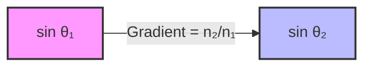
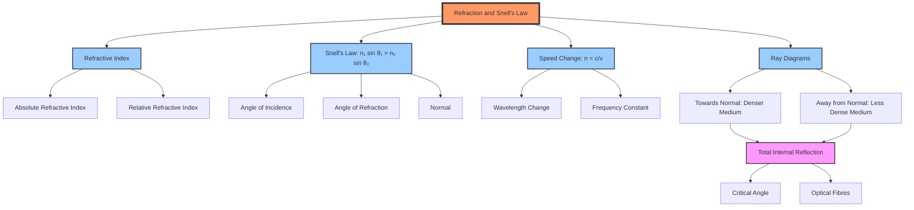

# 1. Overview / 概述

**English:**
Refraction is the bending of light (or any wave) as it passes from one medium to another due to a change in its speed. Snell's Law provides the mathematical relationship between the angles of incidence and refraction and the refractive indices of the two media. This sub-topic is fundamental to understanding how lenses, prisms, and optical fibres work, and forms the core of the broader [[Refraction and Total Internal Reflection]] topic. It connects directly to [[Refractive Index]] and is a prerequisite for [[Total Internal Reflection]] and [[Critical Angle]].

**中文:**
折射是光（或任何波）在从一种介质传播到另一种介质时，由于速度变化而发生的弯曲现象。斯涅尔定律（Snell's Law）给出了入射角、折射角与两种介质折射率之间的数学关系。本子知识点是理解透镜、棱镜和光纤工作原理的基础，也是更广泛的[[Refraction and Total Internal Reflection]]主题的核心。它与[[Refractive Index]]直接相关，并且是学习[[Total Internal Reflection]]和[[Critical Angle]]的先决条件。

---

# 2. Syllabus Learning Objectives / 考纲学习目标

| CAIE 9702 (8.4 a-f) | Edexcel IAL (WPH11 U2: 5.26-5.30) |
|-----------|-------------|
| Define and use the terms: refraction, angle of incidence, angle of refraction, normal, refractive index | Understand the concept of refraction of light |
| Recall and apply Snell's Law: $n_1 \sin \theta_1 = n_2 \sin \theta_2$ | Use Snell's Law: $n_1 \sin \theta_1 = n_2 \sin \theta_2$ |
| Describe and explain experiments to determine refractive index | Describe experiments to determine the refractive index of a material |
| Define absolute refractive index | Understand absolute and relative refractive index |
| Recall that the refractive index of a medium is the ratio of speed of light in vacuum to speed in the medium: $n = \frac{c}{v}$ | Use $n = \frac{c}{v}$ |
| Understand that the refractive index depends on the wavelength of light (dispersion) | Understand that refractive index varies with wavelength (dispersion) |

**Examiner Expectations / 考官期望:**
- **English:** You must be able to apply Snell's Law in both numerical and algebraic forms. You should be able to draw accurate ray diagrams showing the normal, incident ray, refracted ray, and angles. You must understand that the refractive index is a property of the medium and depends on the wavelength of light.
- **中文:** 你必须能够以数值和代数形式应用斯涅尔定律。你应该能够绘制准确的射线图，显示法线、入射光线、折射光线和角度。你必须理解折射率是介质的属性，并且取决于光的波长。

---

# 3. Core Definitions / 核心定义

| Term (EN/CN) | Definition (EN) | Definition (CN) | Common Mistakes / 常见错误 |
|--------------|-----------------|-----------------|---------------------------|
| **Refraction** / 折射 | The change in direction of a wave as it passes from one medium to another due to a change in its speed. | 波在从一种介质传播到另一种介质时，由于速度变化而发生的方向改变。 | Confusing refraction with reflection. Refraction involves transmission into the new medium. |
| **Angle of Incidence ($\theta_1$)** / 入射角 | The angle between the incident ray and the normal at the point of incidence. | 入射光线与入射点处法线之间的夹角。 | Measuring from the surface instead of the normal. Always measure from the normal. |
| **Angle of Refraction ($\theta_2$)** / 折射角 | The angle between the refracted ray and the normal at the point of incidence. | 折射光线与入射点处法线之间的夹角。 | Confusing with angle of deviation. |
| **Normal** / 法线 | An imaginary line drawn perpendicular to the surface at the point of incidence. | 在入射点处垂直于表面绘制的假想线。 | Forgetting to draw the normal in ray diagrams. |
| **Refractive Index ($n$)** / 折射率 | A measure of how much a medium slows down light compared to its speed in a vacuum. | 衡量介质使光速减慢程度的物理量，与真空中的光速相比。 | Confusing absolute and relative refractive index. |
| **Optically Dense** / 光密介质 | A medium with a higher refractive index, where light travels slower. | 折射率较高的介质，光在其中传播速度较慢。 | Thinking "dense" means physically dense (mass/volume). Optical density is about speed of light. |

---

# 4. Key Concepts Explained / 关键概念详解

## 4.1 The Cause of Refraction / 折射的原因

### Explanation / 解释
**English:** When light travels from one medium to another, its speed changes. If the light enters a medium where it travels slower (optically denser), it bends **towards** the normal. If it enters a medium where it travels faster (optically less dense), it bends **away from** the normal. This is because the wavefronts change direction due to the change in speed, as described by [[Progressive Waves]] principles. The frequency of the light remains constant, but the wavelength changes.

**中文:** 当光从一种介质传播到另一种介质时，其速度会发生变化。如果光进入速度较慢的介质（光密介质），它会向法线方向**偏折**。如果进入速度较快的介质（光疏介质），它会**远离**法线方向偏折。这是因为波前由于速度变化而改变方向，如[[Progressive Waves]]原理所述。光的频率保持不变，但波长发生变化。

### Physical Meaning / 物理意义
**English:** Refraction is a consequence of the principle of least time (Fermat's principle). Light "chooses" the path that takes the least time to travel between two points. When the speed changes, the path bends to minimize the travel time.

**中文:** 折射是费马原理（最小时间原理）的结果。光“选择”在两点之间传播所需时间最短的路径。当速度变化时，路径会弯曲以最小化传播时间。

### Common Misconceptions / 常见误区
- **English:**
  - Light always bends towards the normal when entering a denser medium. (True)
  - Light bends away from the normal when entering a less dense medium. (True)
  - The angle of refraction is always smaller than the angle of incidence when entering a denser medium. (True)
  - The angle of refraction is always larger than the angle of incidence when entering a less dense medium. (True)
- **中文:**
  - 光进入光密介质时总是向法线方向偏折。（正确）
  - 光进入光疏介质时总是远离法线方向偏折。（正确）
  - 进入光密介质时，折射角总是小于入射角。（正确）
  - 进入光疏介质时，折射角总是大于入射角。（正确）

### Exam Tips / 考试提示
- **English:** Always draw the normal first in ray diagrams. Label angles clearly. Remember that the incident ray, refracted ray, and normal all lie in the same plane.
- **中文:** 在射线图中始终先画法线。清晰标注角度。记住入射光线、折射光线和法线都在同一平面内。

> 📷 **IMAGE PROMPT — DIAGRAM-01: Refraction at a Plane Surface**
> A clear diagram showing a ray of light passing from air into glass. Label: incident ray, refracted ray, normal, angle of incidence (θ₁), angle of refraction (θ₂). Show the ray bending towards the normal. Use arrows to indicate direction of travel.

## 4.2 Snell's Law / 斯涅尔定律

### Explanation / 解释
**English:** Snell's Law gives the quantitative relationship between the angles and refractive indices:

$$ n_1 \sin \theta_1 = n_2 \sin \theta_2 $$

Where:
- $n_1$ = refractive index of medium 1 (where the incident ray is)
- $\theta_1$ = angle of incidence (measured from the normal)
- $n_2$ = refractive index of medium 2 (where the refracted ray is)
- $\theta_2$ = angle of refraction (measured from the normal)

The law can also be written as:

$$ \frac{\sin \theta_1}{\sin \theta_2} = \frac{n_2}{n_1} = \frac{v_1}{v_2} $$

Where $v_1$ and $v_2$ are the speeds of light in the respective media.

**中文:** 斯涅尔定律给出了角度和折射率之间的定量关系：

$$ n_1 \sin \theta_1 = n_2 \sin \theta_2 $$

其中：
- $n_1$ = 介质1的折射率（入射光线所在介质）
- $\theta_1$ = 入射角（从法线测量）
- $n_2$ = 介质2的折射率（折射光线所在介质）
- $\theta_2$ = 折射角（从法线测量）

该定律也可以写成：

$$ \frac{\sin \theta_1}{\sin \theta_2} = \frac{n_2}{n_1} = \frac{v_1}{v_2} $$

其中 $v_1$ 和 $v_2$ 是光在相应介质中的速度。

### Physical Meaning / 物理意义
**English:** Snell's Law is a consequence of the conservation of the wave's frequency and the change in wavelength. The ratio of sines is constant for a given pair of media and a given wavelength of light.

**中文:** 斯涅尔定律是波的频率守恒和波长变化的结果。对于给定的一对介质和给定的光波长，正弦值的比值是常数。

### Common Misconceptions / 常见误区
- **English:**
  - Confusing which angle goes with which refractive index. Remember: $n_1$ is the medium of the incident ray.
  - Forgetting that angles are measured from the normal, not the surface.
  - Thinking Snell's Law only applies to light. It applies to all waves (sound, water waves, etc.).
- **中文:**
  - 混淆哪个角度对应哪个折射率。记住：$n_1$ 是入射光线所在介质的折射率。
  - 忘记角度是从法线测量的，而不是从表面。
  - 认为斯涅尔定律只适用于光。它适用于所有波（声波、水波等）。

### Exam Tips / 考试提示
- **English:** When solving problems, always identify which medium is which. Draw a diagram. Check if the ray is going from a denser to a less dense medium (bends away from normal) or vice versa (bends towards normal).
- **中文:** 解题时，始终确定哪个是哪个介质。画一个图。检查光线是从光密介质到光疏介质（远离法线偏折）还是相反（向法线偏折）。

---

# 5. Essential Equations / 核心公式

## Equation 1: Snell's Law (Standard Form) / 斯涅尔定律（标准形式）

$$ n_1 \sin \theta_1 = n_2 \sin \theta_2 $$

| Symbol (符号) | Meaning (EN) | Meaning (CN) | Unit (单位) |
|--------------|-------------|-------------|------------|
| $n_1$ | Refractive index of medium 1 | 介质1的折射率 | dimensionless (无量纲) |
| $\theta_1$ | Angle of incidence | 入射角 | degrees (°) or radians (rad) |
| $n_2$ | Refractive index of medium 2 | 介质2的折射率 | dimensionless (无量纲) |
| $\theta_2$ | Angle of refraction | 折射角 | degrees (°) or radians (rad) |

**Derivation / 推导:** Snell's Law can be derived from Huygens' principle or Fermat's principle. For A-Level, you only need to apply it.

**Conditions / 适用条件:**
- **English:** The media must be homogeneous and isotropic. The light must be monochromatic (single wavelength) or the refractive index for that specific wavelength must be used.
- **中文:** 介质必须是均匀且各向同性的。光必须是单色的（单一波长），或者必须使用该特定波长的折射率。

**Limitations / 局限性:**
- **English:** Snell's Law does not account for the polarization of light. It assumes a sharp boundary between media.
- **中文:** 斯涅尔定律不考虑光的偏振。它假设介质之间存在清晰的边界。

## Equation 2: Refractive Index in Terms of Speed / 用速度表示的折射率

$$ n = \frac{c}{v} $$

| Symbol (符号) | Meaning (EN) | Meaning (CN) | Unit (单位) |
|--------------|-------------|-------------|------------|
| $n$ | Absolute refractive index | 绝对折射率 | dimensionless (无量纲) |
| $c$ | Speed of light in vacuum ($3.00 \times 10^8 \text{ m s}^{-1}$) | 真空中的光速 | m s⁻¹ |
| $v$ | Speed of light in the medium | 介质中的光速 | m s⁻¹ |

**Derivation / 推导:** This is the definition of absolute refractive index.

**Conditions / 适用条件:**
- **English:** $c$ is the speed of light in a vacuum. For most practical purposes, the speed of light in air is very close to $c$.
- **中文:** $c$ 是真空中的光速。对于大多数实际应用，空气中的光速非常接近 $c$。

**Limitations / 局限性:**
- **English:** This equation gives the absolute refractive index. For relative refractive index between two media, use $n_{12} = \frac{n_2}{n_1} = \frac{v_1}{v_2}$.
- **中文:** 这个方程给出的是绝对折射率。对于两种介质之间的相对折射率，使用 $n_{12} = \frac{n_2}{n_1} = \frac{v_1}{v_2}$。

> 📷 **IMAGE PROMPT — DIAGRAM-02: Snell's Law Diagram**
> A diagram showing a ray of light passing from air (n₁=1.00) into glass (n₂=1.50). Label: incident ray in air, refracted ray in glass, normal, θ₁=45°, θ₂=28.1°. Show the ray bending towards the normal.

---

# 6. Graphs and Relationships / 图表与关系

## 6.1 $\sin \theta_1$ vs $\sin \theta_2$ Graph / $\sin \theta_1$ 对 $\sin \theta_2$ 的图表

### Axes / 坐标轴
- **X-axis:** $\sin \theta_2$ (sine of angle of refraction / 折射角的正弦值)
- **Y-axis:** $\sin \theta_1$ (sine of angle of incidence / 入射角的正弦值)

### Shape / 形状
- **English:** A straight line passing through the origin.
- **中文:** 一条通过原点的直线。

### Gradient Meaning / 斜率含义
- **English:** The gradient of the line is equal to $\frac{n_2}{n_1}$, the relative refractive index of medium 2 with respect to medium 1.
- **中文:** 直线的斜率等于 $\frac{n_2}{n_1}$，即介质2相对于介质1的相对折射率。

### Area Meaning / 面积含义
- **English:** No physical meaning.
- **中文:** 没有物理意义。

### Exam Interpretation / 考试解读
- **English:** This graph is used in experiments to determine the refractive index of a material. By measuring $\theta_1$ and $\theta_2$ for various angles and plotting $\sin \theta_1$ against $\sin \theta_2$, the gradient gives the refractive index of the material (if medium 1 is air, $n_1 \approx 1$).
- **中文:** 该图表用于通过实验确定材料的折射率。通过测量不同角度下的 $\theta_1$ 和 $\theta_2$，并绘制 $\sin \theta_1$ 对 $\sin \theta_2$ 的图表，斜率给出材料的折射率（如果介质1是空气，$n_1 \approx 1$）。

---

# 7. Required Diagrams / 必备图表

## 7.1 Refraction at a Plane Surface / 平面表面的折射

### Description / 描述
**English:** A ray of light passing from air into a rectangular glass block. The ray bends towards the normal upon entering the glass and bends away from the normal upon exiting back into air. The emergent ray is parallel to the incident ray but displaced laterally.

**中文:** 一束光从空气进入矩形玻璃块。光线进入玻璃时向法线方向偏折，从玻璃射出回到空气时远离法线方向偏折。出射光线与入射光线平行，但有横向位移。

### Image Prompt / 图片生成提示
> 📷 **IMAGE PROMPT — DIAGRAM-03: Refraction through a Rectangular Glass Block**
> A clear diagram showing a rectangular glass block. A ray of light enters from air on the left, bends towards the normal at the first surface, travels through the glass, then bends away from the normal at the second surface as it exits into air. Label: incident ray, refracted ray (inside glass), emergent ray, normal at first surface, normal at second surface, angle of incidence (θ₁), angle of refraction (θ₂), lateral displacement. Show that the emergent ray is parallel to the incident ray.

### Labels Required / 需要标注
- **English:** Incident ray, refracted ray (inside block), emergent ray, normal (at both surfaces), angle of incidence ($\theta_1$), angle of refraction ($\theta_2$), lateral displacement.
- **中文:** 入射光线、折射光线（块内）、出射光线、法线（在两个表面）、入射角 ($\theta_1$)、折射角 ($\theta_2$)、横向位移。

### Exam Importance / 考试重要性
- **English:** This is a standard diagram for understanding refraction. It is used in experiments to determine the refractive index of glass. The lateral displacement is a key concept.
- **中文:** 这是理解折射的标准图表。它用于通过实验确定玻璃的折射率。横向位移是一个关键概念。

## 7.2 Refraction from Denser to Less Dense Medium / 从光密介质到光疏介质的折射

### Description / 描述
**English:** A ray of light passing from glass (denser) into air (less dense). The ray bends away from the normal. As the angle of incidence increases, the angle of refraction increases faster. At the critical angle, the angle of refraction is 90°. Beyond the critical angle, [[Total Internal Reflection]] occurs.

**中文:** 一束光从玻璃（光密介质）进入空气（光疏介质）。光线远离法线方向偏折。随着入射角增大，折射角增大得更快。在临界角处，折射角为90°。超过临界角，发生[[Total Internal Reflection]]。

### Image Prompt / 图片生成提示
> 📷 **IMAGE PROMPT — DIAGRAM-04: Refraction from Glass to Air**
> A diagram showing a ray of light passing from glass into air. The ray bends away from the normal. Label: incident ray (in glass), refracted ray (in air), normal, angle of incidence (θ₁), angle of refraction (θ₂). Show that θ₂ > θ₁.

### Labels Required / 需要标注
- **English:** Incident ray (in glass), refracted ray (in air), normal, angle of incidence ($\theta_1$), angle of refraction ($\theta_2$).
- **中文:** 入射光线（玻璃中）、折射光线（空气中）、法线、入射角 ($\theta_1$)、折射角 ($\theta_2$)。

### Exam Importance / 考试重要性
- **English:** This diagram is essential for understanding [[Total Internal Reflection]] and [[Critical Angle]]. It shows the condition for TIR: light must travel from a denser to a less dense medium.
- **中文:** 这个图表对于理解[[Total Internal Reflection]]和[[Critical Angle]]至关重要。它显示了发生全内反射的条件：光必须从光密介质传播到光疏介质。

---

# 8. Worked Examples / 典型例题

## Example 1: Applying Snell's Law / 应用斯涅尔定律

### Question / 题目
**English:** A ray of light passes from air ($n_{\text{air}} = 1.00$) into a glass block. The angle of incidence is $45^\circ$ and the angle of refraction is $28.1^\circ$. Calculate the refractive index of the glass.

**中文:** 一束光从空气 ($n_{\text{空气}} = 1.00$) 进入玻璃块。入射角为 $45^\circ$，折射角为 $28.1^\circ$。计算玻璃的折射率。

### Solution / 解答
**Step 1:** Identify the known quantities.
- $n_1 = 1.00$ (air)
- $\theta_1 = 45^\circ$
- $\theta_2 = 28.1^\circ$
- $n_2 = ?$ (glass)

**Step 2:** Apply Snell's Law:
$$ n_1 \sin \theta_1 = n_2 \sin \theta_2 $$

**Step 3:** Rearrange for $n_2$:
$$ n_2 = \frac{n_1 \sin \theta_1}{\sin \theta_2} $$

**Step 4:** Substitute values:
$$ n_2 = \frac{1.00 \times \sin 45^\circ}{\sin 28.1^\circ} $$

**Step 5:** Calculate:
$$ n_2 = \frac{1.00 \times 0.7071}{0.4714} = 1.50 $$

### Final Answer / 最终答案
**Answer:** The refractive index of the glass is 1.50. | **答案：** 玻璃的折射率为1.50。

### Quick Tip / 提示
- **English:** Always check if your answer makes sense. Glass typically has a refractive index between 1.45 and 1.65. If you get a value outside this range, check your calculations.
- **中文:** 始终检查你的答案是否合理。玻璃的折射率通常在1.45到1.65之间。如果得到超出这个范围的值，请检查你的计算。

## Example 2: Using $n = \frac{c}{v}$ / 使用 $n = \frac{c}{v}$

### Question / 题目
**English:** The speed of light in a certain type of glass is $2.00 \times 10^8 \text{ m s}^{-1}$. Calculate the refractive index of this glass. (Speed of light in vacuum $c = 3.00 \times 10^8 \text{ m s}^{-1}$)

**中文:** 光在某种玻璃中的速度为 $2.00 \times 10^8 \text{ m s}^{-1}$。计算这种玻璃的折射率。（真空中的光速 $c = 3.00 \times 10^8 \text{ m s}^{-1}$）

### Solution / 解答
**Step 1:** Identify the known quantities.
- $c = 3.00 \times 10^8 \text{ m s}^{-1}$
- $v = 2.00 \times 10^8 \text{ m s}^{-1}$
- $n = ?$

**Step 2:** Apply the formula:
$$ n = \frac{c}{v} $$

**Step 3:** Substitute values:
$$ n = \frac{3.00 \times 10^8}{2.00 \times 10^8} = 1.50 $$

### Final Answer / 最终答案
**Answer:** The refractive index of the glass is 1.50. | **答案：** 这种玻璃的折射率为1.50。

### Quick Tip / 提示
- **English:** Remember that the refractive index is always greater than 1 for any medium other than vacuum (or air, approximately). This is because light always travels slower in a medium than in vacuum.
- **中文:** 记住，对于真空（或近似地，空气）以外的任何介质，折射率总是大于1。这是因为光在介质中的传播速度总是比在真空中慢。

---

# 9. Past Paper Question Types / 历年真题题型

| Question Type / 题型 | Frequency / 频率 | Difficulty / 难度 | Past Paper References / 真题索引 |
|----------------------|------------------|------------------|-------------------------------|
| Numerical application of Snell's Law / 斯涅尔定律的数值应用 | Very High / 非常高 | Easy / 简单 | 📝 *待填入* |
| Ray diagram drawing / 射线图绘制 | High / 高 | Medium / 中等 | 📝 *待填入* |
| Experimental determination of refractive index / 折射率的实验测定 | High / 高 | Medium / 中等 | 📝 *待填入* |
| Conceptual questions on refraction / 折射的概念题 | Medium / 中等 | Easy / 简单 | 📝 *待填入* |
| Dispersion and wavelength dependence / 色散与波长依赖性 | Low / 低 | Hard / 困难 | 📝 *待填入* |

**Common Command Words / 常见指令词:**
- **English:** Calculate, Determine, Show that, Draw, Explain, Describe, State
- **中文:** 计算、确定、证明、绘制、解释、描述、陈述

---

# 10. Practical Skills Connections / 实验技能链接

**English:**
This sub-topic connects to practical work in several ways:

1. **Determining Refractive Index of a Glass Block:** This is a classic experiment where you measure the angles of incidence and refraction for a ray passing through a rectangular glass block. You plot $\sin \theta_1$ against $\sin \theta_2$ and find the gradient, which gives the refractive index.

2. **Measurements and Uncertainties:** You need to measure angles using a protractor. The uncertainty in angle measurement (±0.5° or ±1°) propagates to uncertainty in $\sin \theta$ and hence in the refractive index.

3. **Graph Plotting:** Plotting $\sin \theta_1$ vs $\sin \theta_2$ gives a straight line. The gradient is the refractive index. You need to draw a line of best fit and calculate the gradient.

4. **Experimental Design:** You need to consider how to minimize errors, such as using a ray box with a narrow slit, using a sharp pencil to mark the ray paths, and taking multiple readings.

**中文:**
本子知识点通过多种方式与实验工作联系：

1. **测定玻璃块的折射率：** 这是一个经典实验，测量光线穿过矩形玻璃块时的入射角和折射角。绘制 $\sin \theta_1$ 对 $\sin \theta_2$ 的图表，找到斜率，即折射率。

2. **测量与不确定度：** 需要使用量角器测量角度。角度测量的不确定度（±0.5°或±1°）会传递到 $\sin \theta$ 的不确定度，进而影响折射率的不确定度。

3. **图表绘制：** 绘制 $\sin \theta_1$ 对 $\sin \theta_2$ 的图表得到一条直线。斜率即为折射率。需要绘制最佳拟合线并计算斜率。

4. **实验设计：** 需要考虑如何最小化误差，例如使用窄缝的光源盒、用尖铅笔标记光线路径、以及进行多次测量。

---

# 11. Concept Map / 概念图谱

---

# 12. Quick Revision Sheet / 速查表

| Category / 类别 | Key Points / 要点 |
|----------------|------------------|
| **Definition / 定义** | Refraction: bending of light due to speed change when passing between media. / 折射：光在介质间传播时因速度变化而发生的弯曲。 |
| **Key Formula / 核心公式** | $n_1 \sin \theta_1 = n_2 \sin \theta_2$ (Snell's Law) / 斯涅尔定律 |
| **Key Formula 2 / 核心公式2** | $n = \frac{c}{v}$ (Refractive index in terms of speed) / 用速度表示的折射率 |
| **Key Graph / 核心图表** | $\sin \theta_1$ vs $\sin \theta_2$: straight line through origin, gradient = $n_2/n_1$ / $\sin \theta_1$ 对 $\sin \theta_2$：通过原点的直线，斜率 = $n_2/n_1$ |
| **Key Diagram / 核心图表** | Ray diagram showing refraction at a plane surface, with normal, incident ray, refracted ray, and angles labeled. / 显示平面表面折射的射线图，标注法线、入射光线、折射光线和角度。 |
| **Rule of Thumb / 经验法则** | Denser → slower → bends towards normal. Less dense → faster → bends away from normal. / 光密 → 慢 → 向法线偏折。光疏 → 快 → 远离法线偏折。 |
| **Common Mistake / 常见错误** | Measuring angles from the surface instead of the normal. / 从表面而不是法线测量角度。 |
| **Exam Tip / 考试提示** | Always draw the normal first. Check if the ray bends correctly (towards or away from normal). / 始终先画法线。检查光线偏折方向是否正确（向法线或远离法线）。 |
| **Practical Link / 实验联系** | Use a rectangular glass block, ray box, and protractor to measure angles. Plot $\sin \theta_1$ vs $\sin \theta_2$ to find refractive index. / 使用矩形玻璃块、光源盒和量角器测量角度。绘制 $\sin \theta_1$ 对 $\sin \theta_2$ 的图表以找到折射率。 |
| **Prerequisite / 先决条件** | [[Progressive Waves]]: understanding of wave speed, frequency, and wavelength. / [[Progressive Waves]]：理解波速、频率和波长。 |
| **Next Topic / 下一主题** | [[Total Internal Reflection]] and [[Critical Angle]]: what happens when $\theta_2 = 90^\circ$. / [[Total Internal Reflection]] 和 [[Critical Angle]]：当 $\theta_2 = 90^\circ$ 时会发生什么。 |