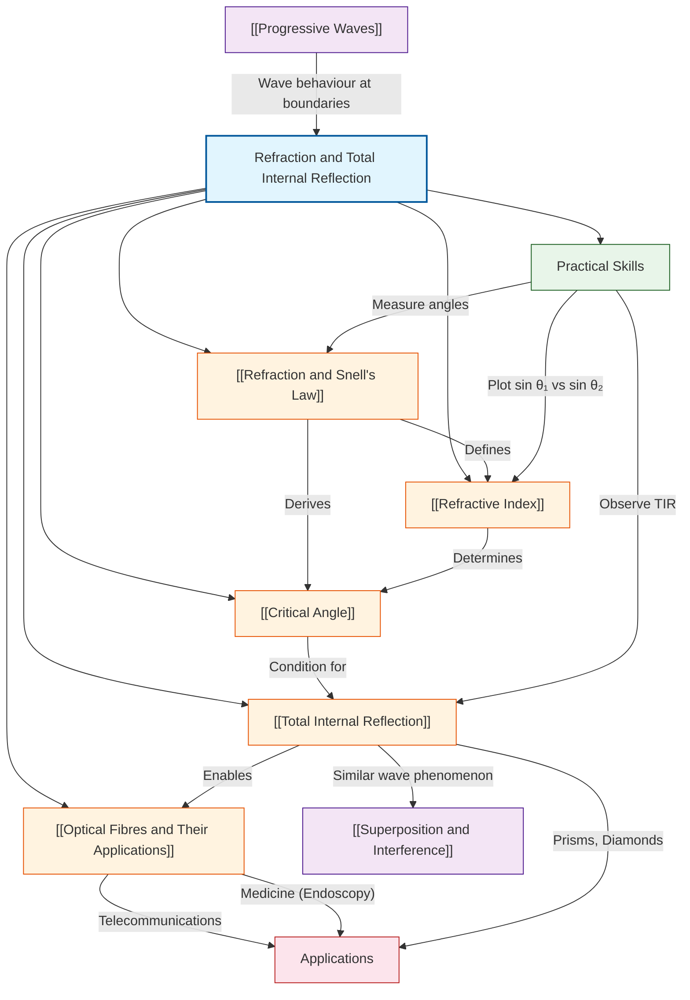

# 1. Overview / 概述

**English:**
Refraction and Total Internal Reflection (TIR) are fundamental wave phenomena that describe how light behaves when it travels from one medium to another. Refraction is the bending of light as it passes from one transparent material to another, caused by a change in the speed of light. Total Internal Reflection is a special case where light is completely reflected back into the original medium when it strikes a boundary at an angle greater than the critical angle.

This topic is crucial in A-Level Physics because it bridges theoretical wave theory with practical applications. Real-world applications include optical fibres used in telecommunications and medicine (endoscopy), lenses in cameras and eyeglasses, rainbows, and the apparent bending of objects in water. Understanding refraction is essential for explaining why a straw appears broken in a glass of water and why the sky appears blue.

In both Cambridge 9702 and Edexcel IAL examinations, this topic is tested through calculations using Snell's Law, determining refractive indices, explaining TIR conditions, and analysing optical fibre applications. Students must be able to draw ray diagrams, calculate critical angles, and explain how optical fibres transmit information with minimal loss.

**中文：**
折射和全内反射是描述光在不同介质间传播时的基本波动现象。折射是光从一种透明材料进入另一种透明材料时发生的弯曲，由光速变化引起。全内反射是一种特殊情况，当光以大于临界角的角度射向边界时，光被完全反射回原介质。

这个主题在A-Level物理中至关重要，因为它将理论波动学与实际应用联系起来。实际应用包括用于电信和医学（内窥镜）的光纤、相机和眼镜中的透镜、彩虹以及物体在水中看似弯曲的现象。理解折射对于解释为什么吸管在水中看起来断裂以及为什么天空呈现蓝色至关重要。

在剑桥9702和爱德思IAL考试中，该主题通过使用斯涅尔定律进行计算、确定折射率、解释全内反射条件以及分析光纤应用来测试。学生必须能够绘制光线图、计算临界角，并解释光纤如何以最小损耗传输信息。

---

# 2. Syllabus Learning Objectives / 考纲学习目标

| CAIE 9702 (8.4 a-f) | Edexcel IAL (WPH11 U2: 5.26-5.30) |
|---------------------|-----------------------------------|
| 8.4(a) Define and use the terms refractive index and critical angle | 5.26 Understand the concept of refractive index and use the equation $n = c/v$ |
| 8.4(b) Use Snell's Law: $n_1 \sin \theta_1 = n_2 \sin \theta_2$ | 5.27 Use Snell's Law: $n_1 \sin \theta_1 = n_2 \sin \theta_2$ |
| 8.4(c) Explain and use the relationship $n = 1/\sin C$ for the critical angle | 5.28 Derive and use the relationship $\sin C = 1/n$ for the critical angle |
| 8.4(d) Describe and explain total internal reflection (TIR) | 5.29 Describe and explain total internal reflection |
| 8.4(e) Describe the use of optical fibres in endoscopy and communications | 5.30 Describe the use of optical fibres in medicine and communications |
| 8.4(f) Explain the meaning of the term 'critical angle' | — |

> 📋 **CIE Only:** CIE requires students to define and use both refractive index and critical angle explicitly. The term "critical angle" is a separate learning objective (8.4f). CIE also expects students to explain the meaning of the term 'critical angle' in words.

> 📋 **Edexcel Only:** Edexcel explicitly requires derivation of $\sin C = 1/n$ from Snell's Law. Edexcel also emphasises the equation $n = c/v$ as a separate learning objective (5.26). Edexcel's specification mentions "medicine" specifically for optical fibre applications.

**Examiner Expectations / 考官期望:**

**English:**
- Define refractive index as the ratio of speed of light in vacuum to speed in medium
- Apply Snell's Law correctly with angles measured from the normal
- Calculate critical angle using $\sin C = 1/n$
- Explain TIR conditions: light travels from denser to rarer medium, angle of incidence > critical angle
- Describe optical fibre structure: core, cladding, and their refractive indices
- Explain how cladding prevents signal degradation and reduces dispersion

**中文：**
- 将折射率定义为真空中光速与介质中光速之比
- 正确应用斯涅尔定律，角度从法线测量
- 使用 $\sin C = 1/n$ 计算临界角
- 解释全内反射条件：光从光密介质射向光疏介质，入射角大于临界角
- 描述光纤结构：纤芯、包层及其折射率
- 解释包层如何防止信号衰减并减少色散

---

# 3. Core Definitions / 核心定义

| Term (EN/CN) | Definition (EN) | Definition (CN) | Common Mistakes / 常见错误 |
|--------------|-----------------|-----------------|---------------------------|
| **Refraction / 折射** | The change in direction of a wave as it passes from one medium to another, caused by a change in its speed | 波从一种介质进入另一种介质时，由于速度变化而改变方向的现象 | Confusing refraction with reflection; thinking refraction always bends light towards the normal |
| **Refractive Index / 折射率** | The ratio of the speed of light in a vacuum to the speed of light in a medium: $n = c/v$ | 真空中光速与介质中光速之比：$n = c/v$ | Forgetting that $n$ is always ≥ 1; using $n = v/c$ instead of $c/v$ |
| **Snell's Law / 斯涅尔定律** | The relationship between the angles of incidence and refraction: $n_1 \sin \theta_1 = n_2 \sin \theta_2$ | 入射角和折射角之间的关系：$n_1 \sin \theta_1 = n_2 \sin \theta_2$ | Measuring angles from the surface instead of the normal; swapping $n_1$ and $n_2$ |
| **Critical Angle / 临界角** | The angle of incidence in the denser medium for which the angle of refraction in the rarer medium is 90° | 在光密介质中，使光疏介质中折射角为90°的入射角 | Thinking critical angle exists for all boundaries; forgetting it only applies when going from denser to rarer medium |
| **Total Internal Reflection / 全内反射** | The complete reflection of a light ray back into the original medium when it strikes a boundary at an angle greater than the critical angle | 当光线以大于临界角的角度射向边界时，完全反射回原介质的现象 | Confusing TIR with ordinary reflection; thinking TIR can occur when going from rarer to denser medium |
| **Optical Fibre / 光纤** | A thin, flexible strand of glass or plastic that transmits light signals using total internal reflection | 使用全内反射传输光信号的细而柔韧的玻璃或塑料丝 | Forgetting the cladding layer; thinking the core has lower refractive index than cladding |
| **Cladding / 包层** | A layer of material with a lower refractive index surrounding the core of an optical fibre | 光纤纤芯周围折射率较低的材料层 | Thinking cladding has higher refractive index than core; forgetting cladding prevents signal leakage |
| **Normal / 法线** | An imaginary line drawn perpendicular to the surface at the point of incidence | 在入射点垂直于表面的假想线 | Measuring angles from the surface instead of the normal |

---

# 4. Key Concepts Explained / 关键概念详解

## 4.1 Refraction / 折射

### Explanation / 解释
**English:**
Refraction occurs when a [[Progressive Waves|wave]] passes from one medium to another and changes speed. This speed change causes the wave to bend. When light travels from a less dense medium (e.g., air, $n \approx 1.00$) to a denser medium (e.g., glass, $n \approx 1.50$), it slows down and bends **towards** the normal. When light travels from a denser medium to a less dense medium, it speeds up and bends **away** from the normal.

The amount of bending depends on the refractive indices of the two media and the angle of incidence. This relationship is quantified by [[Snell's Law]]. Refraction explains many everyday phenomena, such as why a straw appears bent in water, why swimming pools look shallower than they are, and why the sun appears flattened at sunset.

**中文：**
当波从一种介质进入另一种介质并改变速度时，就会发生折射。这种速度变化导致波弯曲。当光从光疏介质（如空气，$n \approx 1.00$）进入光密介质（如玻璃，$n \approx 1.50$）时，它会减速并向法线方向弯曲。当光从光密介质进入光疏介质时，它会加速并远离法线方向弯曲。

弯曲的程度取决于两种介质的折射率和入射角。这种关系由斯涅尔定律量化。折射解释了许多日常现象，比如为什么吸管在水中看起来弯曲，为什么游泳池看起来比实际浅，以及为什么日落时太阳看起来是扁平的。

### Physical Meaning / 物理意义
**English:**
Refraction is a consequence of the principle of least time (Fermat's principle): light takes the path that minimises travel time. When light enters a medium where it travels slower, it "chooses" a path that spends less time in that medium, which means bending towards the normal. This is why light bends when entering water or glass.

**中文：**
折射是最小时间原理（费马原理）的结果：光选择使传播时间最小的路径。当光进入传播速度较慢的介质时，它"选择"在该介质中花费较少时间的路径，这意味着向法线方向弯曲。这就是为什么光进入水或玻璃时会弯曲。

### Common Misconceptions / 常见误区
1. **Misconception:** Refraction always bends light towards the normal.
   **Correction:** Refraction bends light towards the normal only when entering a denser medium. When entering a rarer medium, it bends away from the normal.

2. **Misconception:** The angle of refraction is always smaller than the angle of incidence.
   **Correction:** The angle of refraction is smaller only when entering a denser medium. When entering a rarer medium, the angle of refraction is larger.

3. **Misconception:** Refraction and reflection are the same phenomenon.
   **Correction:** Refraction involves transmission with bending; reflection involves bouncing back without transmission.

**常见误区：**
1. **误区：** 折射总是使光线向法线弯曲。
   **纠正：** 只有进入光密介质时，折射才使光线向法线弯曲。进入光疏介质时，光线远离法线弯曲。

2. **误区：** 折射角总是小于入射角。
   **纠正：** 只有进入光密介质时，折射角才小于入射角。进入光疏介质时，折射角大于入射角。

3. **误区：** 折射和反射是同一现象。
   **纠正：** 折射涉及透射和弯曲；反射涉及弹回而不透射。

### Exam Tips / 考试提示
**English:**
- Always draw the normal line first when constructing ray diagrams
- Measure angles from the normal, not from the surface
- Remember that $n_{air} \approx 1.00$ (use 1.00 unless specified otherwise)
- For CIE, be prepared to define refractive index in words
- For Edexcel, be prepared to derive Snell's Law from $n = c/v$

**中文：**
- 绘制光线图时始终先画法线
- 从法线测量角度，而不是从表面
- 记住 $n_{空气} \approx 1.00$（除非另有说明，否则使用1.00）
- 对于CIE，准备用文字定义折射率
- 对于爱德思，准备从 $n = c/v$ 推导斯涅尔定律

---

## 4.2 Snell's Law / 斯涅尔定律

### Explanation / 解释
**English:**
[[Snell's Law]] is the fundamental equation governing refraction. It states that the ratio of the sine of the angle of incidence to the sine of the angle of refraction is constant for a given pair of media. Mathematically:

$$n_1 \sin \theta_1 = n_2 \sin \theta_2$$

where $n_1$ and $n_2$ are the refractive indices of the two media, and $\theta_1$ and $\theta_2$ are the angles of incidence and refraction respectively, both measured from the normal.

Snell's Law can also be expressed in terms of wave speeds:

$$\frac{\sin \theta_1}{\sin \theta_2} = \frac{v_1}{v_2} = \frac{n_2}{n_1}$$

This shows that the bending of light is directly related to the change in wave speed.

**中文：**
斯涅尔定律是控制折射的基本方程。它指出，对于给定的一对介质，入射角的正弦与折射角的正弦之比是常数。数学上：

$$n_1 \sin \theta_1 = n_2 \sin \theta_2$$

其中 $n_1$ 和 $n_2$ 是两种介质的折射率，$\theta_1$ 和 $\theta_2$ 分别是入射角和折射角，均从法线测量。

斯涅尔定律也可以用波速表示：

$$\frac{\sin \theta_1}{\sin \theta_2} = \frac{v_1}{v_2} = \frac{n_2}{n_1}$$

这表明光的弯曲与波速的变化直接相关。

### Physical Meaning / 物理意义
**English:**
Snell's Law quantifies how much light bends when crossing a boundary. The larger the difference in refractive indices, the more the light bends. If $n_2 > n_1$, then $\theta_2 < \theta_1$ (bends towards normal). If $n_2 < n_1$, then $\theta_2 > \theta_1$ (bends away from normal).

**中文：**
斯涅尔定律量化了光穿过边界时的弯曲程度。折射率差异越大，光弯曲得越多。如果 $n_2 > n_1$，则 $\theta_2 < \theta_1$（向法线弯曲）。如果 $n_2 < n_1$，则 $\theta_2 > \theta_1$（远离法线弯曲）。

### Common Misconceptions / 常见误区
1. **Misconception:** The angles in Snell's Law are measured from the surface.
   **Correction:** All angles in Snell's Law are measured from the normal (perpendicular to the surface).

2. **Misconception:** $n_1 \sin \theta_1 = n_2 \sin \theta_2$ means the product is always 1.
   **Correction:** The product is constant for a given pair of media, not necessarily 1.

3. **Misconception:** Snell's Law only applies to light.
   **Correction:** Snell's Law applies to all waves, including sound and water waves.

**常见误区：**
1. **误区：** 斯涅尔定律中的角度从表面测量。
   **纠正：** 斯涅尔定律中的所有角度都从法线（垂直于表面）测量。

2. **误区：** $n_1 \sin \theta_1 = n_2 \sin \theta_2$ 意味着乘积总是1。
   **纠正：** 对于给定的一对介质，乘积是常数，不一定是1。

3. **误区：** 斯涅尔定律只适用于光。
   **纠正：** 斯涅尔定律适用于所有波，包括声波和水波。

### Exam Tips / 考试提示
**English:**
- Always identify which medium is 1 (incident) and which is 2 (refracted)
- Check your answer: if light enters a denser medium, the angle should decrease
- For calculations, ensure your calculator is in degree mode
- CIE often asks to "use Snell's Law" without providing the equation — memorise it
- Edexcel may ask to derive Snell's Law from $n = c/v$

**中文：**
- 始终确定哪个是介质1（入射）和哪个是介质2（折射）
- 检查答案：如果光进入光密介质，角度应该减小
- 计算时，确保计算器处于度数模式
- CIE经常要求"使用斯涅尔定律"而不提供方程——记住它
- 爱德思可能要求从 $n = c/v$ 推导斯涅尔定律

---

## 4.3 Refractive Index / 折射率

### Explanation / 解释
**English:**
The [[Refractive Index]] ($n$) of a medium is a measure of how much it slows down light compared to vacuum. It is defined as:

$$n = \frac{c}{v}$$

where $c = 3.00 \times 10^8 \text{ m s}^{-1}$ is the speed of light in vacuum, and $v$ is the speed of light in the medium.

Since $v \leq c$, the refractive index is always greater than or equal to 1. A vacuum has $n = 1.00$, air has $n \approx 1.00$ (usually taken as 1.00), water has $n \approx 1.33$, and glass has $n \approx 1.50$.

The refractive index also determines how much light bends at a boundary. A higher refractive index means light travels slower in that medium and bends more when entering from air.

**中文：**
介质的折射率是衡量其与真空相比使光减速程度的量。它定义为：

$$n = \frac{c}{v}$$

其中 $c = 3.00 \times 10^8 \text{ m s}^{-1}$ 是真空中的光速，$v$ 是介质中的光速。

由于 $v \leq c$，折射率总是大于或等于1。真空的 $n = 1.00$，空气的 $n \approx 1.00$（通常取1.00），水的 $n \approx 1.33$，玻璃的 $n \approx 1.50$。

折射率也决定了光在边界处的弯曲程度。折射率越高，意味着光在该介质中传播越慢，从空气进入时弯曲得越多。

### Physical Meaning / 物理意义
**English:**
The refractive index tells us how "optically dense" a material is. A material with a higher refractive index is more optically dense, meaning light travels slower through it. This is why diamond ($n \approx 2.42$) sparkles so much — light slows down significantly and bends a lot, causing total internal reflection at many internal surfaces.

**中文：**
折射率告诉我们材料的"光学密度"。折射率较高的材料光学密度更大，意味着光在其中传播更慢。这就是为什么钻石（$n \approx 2.42$）如此闪耀——光显著减速并大量弯曲，在许多内表面引起全内反射。

### Common Misconceptions / 常见误区
1. **Misconception:** Refractive index depends on the angle of incidence.
   **Correction:** Refractive index is a property of the material and does not depend on the angle.

2. **Misconception:** A material with $n = 1.5$ slows light to half its speed.
   **Correction:** It slows light to $v = c/1.5$, which is 2/3 of the speed in vacuum.

3. **Misconception:** Refractive index is the same for all colours of light.
   **Correction:** Refractive index varies slightly with wavelength (dispersion), which is why white light splits into colours in a prism.

**常见误区：**
1. **误区：** 折射率取决于入射角。
   **纠正：** 折射率是材料的属性，不取决于角度。

2. **误区：** $n = 1.5$ 的材料将光速减半。
   **纠正：** 它将光速减为 $v = c/1.5$，即真空中速度的2/3。

3. **误区：** 折射率对所有颜色的光都相同。
   **纠正：** 折射率随波长略有变化（色散），这就是为什么白光在棱镜中分解成颜色。

### Exam Tips / 考试提示
**English:**
- Memorise $n = c/v$ — it's the definition
- Know typical values: air (1.00), water (1.33), glass (1.50), diamond (2.42)
- For CIE, be prepared to define refractive index in words
- For Edexcel, be prepared to use $n = c/v$ to calculate speed of light in a medium
- Remember that refractive index is dimensionless

**中文：**
- 记住 $n = c/v$ —— 这是定义
- 知道典型值：空气（1.00）、水（1.33）、玻璃（1.50）、钻石（2.42）
- 对于CIE，准备用文字定义折射率
- 对于爱德思，准备使用 $n = c/v$ 计算介质中的光速
- 记住折射率是无量纲的

---

## 4.4 Total Internal Reflection / 全内反射

### Explanation / 解释
**English:**
[[Total Internal Reflection]] (TIR) occurs when a light ray travelling in a denser medium strikes a boundary with a rarer medium at an angle of incidence greater than the [[Critical Angle]]. At this point, all the light is reflected back into the denser medium, and none is transmitted.

For TIR to occur, two conditions must be satisfied:
1. Light must travel from a denser medium (higher $n$) to a rarer medium (lower $n$)
2. The angle of incidence must be greater than the critical angle

When the angle of incidence equals the critical angle, the refracted ray travels along the boundary (angle of refraction = 90°). When the angle of incidence is less than the critical angle, both refraction and reflection occur (partial reflection).

**中文：**
当在光密介质中传播的光线以大于临界角的入射角射向与光疏介质的边界时，发生全内反射。此时，所有光都被反射回光密介质，没有光透射。

发生全内反射必须满足两个条件：
1. 光必须从光密介质（较高 $n$）射向光疏介质（较低 $n$）
2. 入射角必须大于临界角

当入射角等于临界角时，折射光线沿边界传播（折射角 = 90°）。当入射角小于临界角时，同时发生折射和反射（部分反射）。

### Physical Meaning / 物理意义
**English:**
TIR is the principle behind optical fibres, which transmit light signals over long distances with minimal loss. It also explains why diamonds sparkle — light enters the diamond and undergoes multiple TIRs before exiting, creating brilliance. TIR also explains why fish underwater can see a "circle of light" above them (Snell's window).

**中文：**
全内反射是光纤背后的原理，光纤以最小损耗长距离传输光信号。它也解释了为什么钻石闪耀——光进入钻石并在射出前经历多次全内反射，产生光彩。全内反射也解释了为什么水下的鱼可以看到它们上方的"光之圆"（斯涅尔窗口）。

### Common Misconceptions / 常见误区
1. **Misconception:** TIR can occur when light goes from air to glass.
   **Correction:** TIR only occurs when light goes from a denser to a rarer medium (e.g., glass to air).

2. **Misconception:** TIR is the same as ordinary reflection.
   **Correction:** TIR is 100% efficient (no energy loss), while ordinary reflection loses some energy.

3. **Misconception:** The critical angle is the same for all materials.
   **Correction:** The critical angle depends on the refractive indices of both media.

**常见误区：**
1. **误区：** 光从空气到玻璃时会发生全内反射。
   **纠正：** 全内反射只发生在光从光密介质到光疏介质时（例如，玻璃到空气）。

2. **误区：** 全内反射与普通反射相同。
   **纠正：** 全内反射是100%高效的（无能量损失），而普通反射会损失一些能量。

3. **误区：** 临界角对所有材料都相同。
   **纠正：** 临界角取决于两种介质的折射率。

### Exam Tips / 考试提示
**English:**
- Always state both conditions for TIR in exam answers
- Draw ray diagrams showing the three cases: $\theta < C$, $\theta = C$, $\theta > C$
- Remember that TIR is used in optical fibres, prisms (periscopes, binoculars), and diamonds
- CIE often asks to "explain" TIR in words
- Edexcel may ask to "derive" the critical angle formula

**中文：**
- 在考试答案中始终说明全内反射的两个条件
- 绘制显示三种情况的光线图：$\theta < C$，$\theta = C$，$\theta > C$
- 记住全内反射用于光纤、棱镜（潜望镜、双筒望远镜）和钻石
- CIE经常要求用文字"解释"全内反射
- 爱德思可能要求"推导"临界角公式

---

## 4.5 Critical Angle / 临界角

### Explanation / 解释
**English:**
The [[Critical Angle]] ($C$) is the angle of incidence in the denser medium for which the angle of refraction in the rarer medium is exactly 90°. At this angle, the refracted ray travels along the boundary between the two media.

The critical angle can be calculated using Snell's Law. When $\theta_2 = 90°$ (refracted ray along boundary):

$$n_1 \sin C = n_2 \sin 90° = n_2$$

Therefore:

$$\sin C = \frac{n_2}{n_1}$$

If the rarer medium is air ($n_2 \approx 1.00$), this simplifies to:

$$\sin C = \frac{1}{n_1}$$

or equivalently:

$$C = \sin^{-1}\left(\frac{1}{n_1}\right)$$

For water ($n = 1.33$), $C \approx 48.8°$. For glass ($n = 1.50$), $C \approx 41.8°$. For diamond ($n = 2.42$), $C \approx 24.4°$.

**中文：**
临界角是光密介质中的入射角，此时光疏介质中的折射角恰好为90°。在这个角度下，折射光线沿两种介质的边界传播。

临界角可以使用斯涅尔定律计算。当 $\theta_2 = 90°$（折射光线沿边界）时：

$$n_1 \sin C = n_2 \sin 90° = n_2$$

因此：

$$\sin C = \frac{n_2}{n_1}$$

如果光疏介质是空气（$n_2 \approx 1.00$），这简化为：

$$\sin C = \frac{1}{n_1}$$

或等价地：

$$C = \sin^{-1}\left(\frac{1}{n_1}\right)$$

对于水（$n = 1.33$），$C \approx 48.8°$。对于玻璃（$n = 1.50$），$C \approx 41.8°$。对于钻石（$n = 2.42$），$C \approx 24.4°$。

### Physical Meaning / 物理意义
**English:**
The critical angle determines the "window" through which light can escape from a denser medium. A smaller critical angle means TIR occurs more easily (for more angles of incidence). This is why diamonds have such brilliant sparkle — their small critical angle (24.4°) means most light entering undergoes TIR.

**中文：**
临界角决定了光可以从光密介质逃逸的"窗口"。较小的临界角意味着全内反射更容易发生（对于更多的入射角）。这就是为什么钻石有如此耀眼的光彩——它们的小临界角（24.4°）意味着进入的大部分光都会经历全内反射。

### Common Misconceptions / 常见误区
1. **Misconception:** The critical angle is measured from the surface.
   **Correction:** The critical angle is measured from the normal, just like all other angles in optics.

2. **Misconception:** The critical angle is the same for all boundaries involving a given material.
   **Correction:** The critical angle depends on both media, not just one.

3. **Misconception:** If $\theta = C$, TIR occurs.
   **Correction:** At $\theta = C$, the refracted ray travels along the boundary. TIR only occurs when $\theta > C$.

**常见误区：**
1. **误区：** 临界角从表面测量。
   **纠正：** 临界角从法线测量，与光学中所有其他角度一样。

2. **误区：** 对于涉及给定材料的所有边界，临界角相同。
   **纠正：** 临界角取决于两种介质，而不仅仅是一种。

3. **误区：** 如果 $\theta = C$，发生全内反射。
   **纠正：** 在 $\theta = C$ 时，折射光线沿边界传播。只有当 $\theta > C$ 时才发生全内反射。

### Exam Tips / 考试提示
**English:**
- Memorise the formula $\sin C = 1/n$ for a material surrounded by air
- Be able to derive $\sin C = n_2/n_1$ from Snell's Law
- Remember that a higher refractive index gives a smaller critical angle
- CIE often asks to "calculate the critical angle"
- Edexcel may ask to "show that the critical angle is ..."

**中文：**
- 记住对于被空气包围的材料，公式 $\sin C = 1/n$
- 能够从斯涅尔定律推导 $\sin C = n_2/n_1$
- 记住折射率越高，临界角越小
- CIE经常要求"计算临界角"
- 爱德思可能要求"证明临界角是..."

---

## 4.6 Optical Fibres / 光纤

### Explanation / 解释
**English:**
[[Optical Fibres and Their Applications|Optical fibres]] are thin, flexible strands of glass or plastic that transmit light signals using total internal reflection. They consist of two main parts:
- **Core:** The central part where light travels, made of material with high refractive index ($n_{core}$)
- **Cladding:** The outer layer surrounding the core, made of material with lower refractive index ($n_{cladding} < n_{core}$)

Light entering the core at an angle greater than the critical angle undergoes TIR at the core-cladding boundary, allowing it to travel along the fibre with minimal loss.

Optical fibres have two main applications:
1. **Communications:** Transmitting telephone, internet, and television signals using pulses of light
2. **Medicine:** Endoscopy — viewing inside the body using a flexible tube containing optical fibres

**中文：**
光纤是细而柔韧的玻璃或塑料丝，使用全内反射传输光信号。它们由两个主要部分组成：
- **纤芯：** 光传播的中心部分，由高折射率材料制成（$n_{纤芯}$）
- **包层：** 围绕纤芯的外层，由较低折射率材料制成（$n_{包层} < n_{纤芯}$）

以大于临界角的角度进入纤芯的光在纤芯-包层边界发生全内反射，使其能够以最小损耗沿光纤传播。

光纤有两个主要应用：
1. **通信：** 使用光脉冲传输电话、互联网和电视信号
2. **医学：** 内窥镜检查——使用含有光纤的柔性管观察体内

### Physical Meaning / 物理意义
**English:**
Optical fibres revolutionised communications by allowing data to be transmitted at the speed of light with minimal loss. Unlike electrical cables, optical fibres are immune to electromagnetic interference, can carry much more data (higher bandwidth), and are lighter and thinner. In medicine, endoscopes allow doctors to see inside the body without major surgery.

**中文：**
光纤通过允许数据以光速传输且损耗最小，彻底改变了通信。与电缆不同，光纤不受电磁干扰，可以承载更多数据（更高带宽），并且更轻更薄。在医学中，内窥镜使医生无需大手术就能看到体内。

### Common Misconceptions / 常见误区
1. **Misconception:** The cladding has a higher refractive index than the core.
   **Correction:** The cladding must have a lower refractive index than the core for TIR to occur.

2. **Misconception:** Optical fibres can only transmit light in straight lines.
   **Correction:** Optical fibres are flexible and can bend, as long as the bend radius is not too small.

3. **Misconception:** All light entering the fibre undergoes TIR.
   **Correction:** Only light entering at an angle greater than the critical angle undergoes TIR. Light entering at smaller angles escapes through the cladding.

**常见误区：**
1. **误区：** 包层的折射率高于纤芯。
   **纠正：** 包层的折射率必须低于纤芯，才能发生全内反射。

2. **误区：** 光纤只能直线传输光。
   **纠正：** 光纤是柔韧的，可以弯曲，只要弯曲半径不太小。

3. **误区：** 所有进入光纤的光都经历全内反射。
   **纠正：** 只有以大于临界角的角度进入的光才经历全内反射。以较小角度进入的光通过包层逃逸。

### Exam Tips / 考试提示
**English:**
- Know the structure: core (high $n$) + cladding (low $n$)
- Explain why cladding is needed: prevents signal loss, protects core, reduces dispersion
- For communications: mention high bandwidth, low loss, immunity to interference
- For medicine: mention endoscopy, non-invasive procedures
- CIE often asks to "describe the use of optical fibres"
- Edexcel may ask to "explain how optical fibres work"

**中文：**
- 知道结构：纤芯（高 $n$）+ 包层（低 $n$）
- 解释为什么需要包层：防止信号损失、保护纤芯、减少色散
- 对于通信：提到高带宽、低损耗、抗干扰
- 对于医学：提到内窥镜、非侵入性手术
- CIE经常要求"描述光纤的用途"
- 爱德思可能要求"解释光纤的工作原理"

---

# 5. Essential Equations / 核心公式

## 5.1 Refractive Index Definition / 折射率定义

**Equation / 公式:**
$$n = \frac{c}{v}$$

**Variables / 变量:**
| Symbol (符号) | Meaning (EN) | Meaning (CN) | Unit (单位) |
|--------------|-------------|-------------|------------|
| $n$ | Refractive index | 折射率 | dimensionless (无量纲) |
| $c$ | Speed of light in vacuum | 真空中光速 | m s$^{-1}$ |
| $v$ | Speed of light in medium | 介质中光速 | m s$^{-1}$ |

**Derivation / 推导:**
**English:**
This is the definition of refractive index. It is not derived but defined. The refractive index is a measure of how much a medium slows down light compared to vacuum.

**中文：**
这是折射率的定义。它不是推导出来的，而是定义的。折射率是衡量介质与真空相比使光减速程度的量。

**Conditions / 适用条件:**
**English:** Always applicable. $n \geq 1$ for all materials. $n = 1$ for vacuum.
**中文：** 始终适用。所有材料的 $n \geq 1$。真空的 $n = 1$。

**Limitations / 局限性:**
**English:** $n$ varies slightly with wavelength (dispersion). This equation gives the average value.
**中文：** $n$ 随波长略有变化（色散）。该方程给出平均值。

**Rearrangements / 变形:**
$$v = \frac{c}{n}$$
$$c = nv$$

---

## 5.2 Snell's Law / 斯涅尔定律

**Equation / 公式:**
$$n_1 \sin \theta_1 = n_2 \sin \theta_2$$

**Variables / 变量:**
| Symbol (符号) | Meaning (EN) | Meaning (CN) | Unit (单位) |
|--------------|-------------|-------------|------------|
| $n_1$ | Refractive index of medium 1 (incident) | 介质1的折射率（入射） | dimensionless (无量纲) |
| $n_2$ | Refractive index of medium 2 (refracted) | 介质2的折射率（折射） | dimensionless (无量纲) |
| $\theta_1$ | Angle of incidence (from normal) | 入射角（从法线） | degrees (°) |
| $\theta_2$ | Angle of refraction (from normal) | 折射角（从法线） | degrees (°) |

**Derivation / 推导:**
**English:**
Snell's Law can be derived from the wave nature of light. Consider a wavefront crossing a boundary at an angle. The wavefront travels at speed $v_1$ in medium 1 and $v_2$ in medium 2. In time $t$, the wavefront travels distances $v_1 t$ and $v_2 t$ in the two media. Using geometry:

$$\frac{\sin \theta_1}{\sin \theta_2} = \frac{v_1}{v_2}$$

Since $n = c/v$, we have $v_1 = c/n_1$ and $v_2 = c/n_2$, so:

$$\frac{\sin \theta_1}{\sin \theta_2} = \frac{c/n_1}{c/n_2} = \frac{n_2}{n_1}$$

Therefore:

$$n_1 \sin \theta_1 = n_2 \sin \theta_2$$

**中文：**
斯涅尔定律可以从光的波动性推导。考虑一个波前以一定角度穿过边界。波前在介质1中以速度 $v_1$ 传播，在介质2中以速度 $v_2$ 传播。在时间 $t$ 内，波前在两种介质中传播距离 $v_1 t$ 和 $v_2 t$。使用几何学：

$$\frac{\sin \theta_1}{\sin \theta_2} = \frac{v_1}{v_2}$$

由于 $n = c/v$，我们有 $v_1 = c/n_1$ 和 $v_2 = c/n_2$，所以：

$$\frac{\sin \theta_1}{\sin \theta_2} = \frac{c/n_1}{c/n_2} = \frac{n_2}{n_1}$$

因此：

$$n_1 \sin \theta_1 = n_2 \sin \theta_2$$

**Conditions / 适用条件:**
**English:** Applies to all waves crossing a boundary between two media. Angles must be measured from the normal.
**中文：** 适用于穿过两种介质边界的所有波。角度必须从法线测量。

**Limitations / 局限性:**
**English:** Does not apply when $\theta_1 > C$ (TIR occurs). Does not account for dispersion (wavelength dependence).
**中文：** 当 $\theta_1 > C$ 时不适用（发生全内反射）。不考虑色散（波长依赖性）。

**Rearrangements / 变形:**
$$\sin \theta_2 = \frac{n_1}{n_2} \sin \theta_1$$
$$\theta_2 = \sin^{-1}\left(\frac{n_1}{n_2} \sin \theta_1\right)$$
$$\frac{\sin \theta_1}{\sin \theta_2} = \frac{n_2}{n_1} = \frac{v_1}{v_2}$$

---

## 5.3 Critical Angle Formula / 临界角公式

**Equation / 公式:**
$$\sin C = \frac{n_2}{n_1}$$

For a material surrounded by air ($n_2 \approx 1.00$):
$$\sin C = \frac{1}{n_1}$$

**Variables / 变量:**
| Symbol (符号) | Meaning (EN) | Meaning (CN) | Unit (单位) |
|--------------|-------------|-------------|------------|
| $C$ | Critical angle | 临界角 | degrees (°) |
| $n_1$ | Refractive index of denser medium | 光密介质的折射率 | dimensionless (无量纲) |
| $n_2$ | Refractive index of rarer medium | 光疏介质的折射率 | dimensionless (无量纲) |

**Derivation / 推导:**
**English:**
Start with Snell's Law:
$$n_1 \sin \theta_1 = n_2 \sin \theta_2$$

At the critical angle, $\theta_1 = C$ and $\theta_2 = 90°$:
$$n_1 \sin C = n_2 \sin 90° = n_2$$

Therefore:
$$\sin C = \frac{n_2}{n_1}$$

If the rarer medium is air ($n_2 = 1.00$):
$$\sin C = \frac{1}{n_1}$$

**中文：**
从斯涅尔定律开始：
$$n_1 \sin \theta_1 = n_2 \sin \theta_2$$

在临界角时，$\theta_1 = C$ 且 $\theta_2 = 90°$：
$$n_1 \sin C = n_2 \sin 90° = n_2$$

因此：
$$\sin C = \frac{n_2}{n_1}$$

如果光疏介质是空气（$n_2 = 1.00$）：
$$\sin C = \frac{1}{n_1}$$

**Conditions / 适用条件:**
**English:** Only applies when light travels from denser to rarer medium ($n_1 > n_2$). The critical angle only exists when $n_1 > n_2$.
**中文：** 仅适用于光从光密介质到光疏介质（$n_1 > n_2$）。只有当 $n_1 > n_2$ 时才存在临界角。

**Limitations / 局限性:**
**English:** Does not apply when $n_1 \leq n_2$ (no critical angle exists). Assumes the rarer medium is transparent.
**中文：** 当 $n_1 \leq n_2$ 时不适用（不存在临界角）。假设光疏介质是透明的。

**Rearrangements / 变形:**
$$C = \sin^{-1}\left(\frac{n_2}{n_1}\right)$$
$$n_1 = \frac{n_2}{\sin C}$$
$$n_1 = \frac{1}{\sin C} \quad \text{(for air)}$$

---

## 5.4 Speed of Light in Medium / 介质中的光速

**Equation / 公式:**
$$v = \frac{c}{n}$$

**Variables / 变量:**
| Symbol (符号) | Meaning (EN) | Meaning (CN) | Unit (单位) |
|--------------|-------------|-------------|------------|
| $v$ | Speed of light in medium | 介质中的光速 | m s$^{-1}$ |
| $c$ | Speed of light in vacuum ($3.00 \times 10^8$ m s$^{-1}$) | 真空中光速 | m s$^{-1}$ |
| $n$ | Refractive index of medium | 介质的折射率 | dimensionless (无量纲) |

**Derivation / 推导:**
**English:**
This is a rearrangement of the definition $n = c/v$. Multiply both sides by $v$: $nv = c$. Divide by $n$: $v = c/n$.

**中文：**
这是定义 $n = c/v$ 的变形。两边乘以 $v$：$nv = c$。除以 $n$：$v = c/n$。

**Conditions / 适用条件:**
**English:** Always applicable for transparent media.
**中文：** 始终适用于透明介质。

**Limitations / 局限性:**
**English:** $v$ varies slightly with wavelength due to dispersion.
**中文：** 由于色散，$v$ 随波长略有变化。

**Rearrangements / 变形:**
$$n = \frac{c}{v}$$
$$c = nv$$

---

# 6. Graphs and Relationships / 图表与关系

## 6.1 $\sin \theta_1$ vs $\sin \theta_2$ Graph / $\sin \theta_1$ 与 $\sin \theta_2$ 关系图

### Axes / 坐标轴
**English:** x-axis: $\sin \theta_2$ (angle of refraction), y-axis: $\sin \theta_1$ (angle of incidence)
**中文：** x轴：$\sin \theta_2$（折射角），y轴：$\sin \theta_1$（入射角）

### Shape / 形状
**English:** A straight line passing through the origin with gradient $n_2/n_1$.
**中文：** 一条通过原点的直线，斜率为 $n_2/n_1$。

### Gradient Meaning / 斜率含义
**English:** Gradient = $n_2/n_1$. If medium 1 is air ($n_1 = 1$), gradient = $n_2$ (refractive index of medium 2).
**中文：** 斜率 = $n_2/n_1$。如果介质1是空气（$n_1 = 1$），斜率 = $n_2$（介质2的折射率）。

### Area Meaning / 面积含义
**English:** No meaningful area under this graph.
**中文：** 该图下没有有意义的面积。

### Exam Interpretation / 考试解读
**English:**
- A straight line confirms Snell's Law
- The gradient gives the ratio of refractive indices
- If one refractive index is known, the other can be calculated
- Used in practical experiments to determine refractive index

**中文：**
- 直线确认斯涅尔定律
- 斜率给出折射率之比
- 如果已知一个折射率，可以计算另一个
- 在实验实践中用于确定折射率

### Common Questions / 常见问题
**English:**
- "Plot a graph of $\sin \theta_1$ against $\sin \theta_2$ and determine the refractive index of the glass block"
- "Explain why the graph is a straight line through the origin"
- "Calculate the gradient and hence find the refractive index"

**中文：**
- "绘制 $\sin \theta_1$ 对 $\sin \theta_2$ 的图，并确定玻璃块的折射率"
- "解释为什么该图是通过原点的直线"
- "计算斜率，从而求出折射率"

> 📷 **IMAGE PROMPT — GRAPH-01: Graph of sin θ₁ vs sin θ₂**
>
> A Cartesian graph showing a straight line through the origin. x-axis labelled "sin θ₂" and y-axis labelled "sin θ₁". The line has a positive gradient. Include data points with error bars. The gradient is labelled as "n₂/n₁". Clean, professional style suitable for a physics textbook.

---

## 6.2 Angle of Incidence vs Angle of Refraction / 入射角与折射角关系图

### Axes / 坐标轴
**English:** x-axis: $\theta_1$ (angle of incidence in degrees), y-axis: $\theta_2$ (angle of refraction in degrees)
**中文：** x轴：$\theta_1$（入射角，度），y轴：$\theta_2$（折射角，度）

### Shape / 形状
**English:** A curve that starts at (0,0) and increases, but with decreasing gradient. For light entering a denser medium, $\theta_2 < \theta_1$ (curve below the line $\theta_2 = \theta_1$).
**中文：** 一条从(0,0)开始增加的曲线，但斜率递减。对于进入光密介质的光，$\theta_2 < \theta_1$（曲线在 $\theta_2 = \theta_1$ 线下方）。

### Gradient Meaning / 斜率含义
**English:** The gradient at any point is $d\theta_2/d\theta_1$, which decreases as $\theta_1$ increases. The gradient is not constant because the relationship is not linear.
**中文：** 任意点的斜率为 $d\theta_2/d\theta_1$，随 $\theta_1$ 增加而减小。斜率不是常数，因为关系不是线性的。

### Area Meaning / 面积含义
**English:** No meaningful area under this graph.
**中文：** 该图下没有有意义的面积。

### Exam Interpretation / 考试解读
**English:**
- Shows that refraction is not a linear process
- The curve approaches a maximum $\theta_2$ value (the critical angle when going from denser to rarer)
- Used to visualise how much light bends for different angles

**中文：**
- 显示折射不是线性过程
- 曲线接近最大 $\theta_2$ 值（从光密到光疏时的临界角）
- 用于可视化不同角度下光的弯曲程度

### Common Questions / 常见问题
**English:**
- "Sketch a graph showing how the angle of refraction varies with the angle of incidence"
- "Explain the shape of the graph"
- "Use the graph to find the critical angle"

**中文：**
- "画出折射角随入射角变化的草图"
- "解释图的形状"
- "使用图找出临界角"

---

## 6.3 Refractive Index vs Critical Angle / 折射率与临界角关系图

### Axes / 坐标轴
**English:** x-axis: $n$ (refractive index), y-axis: $C$ (critical angle in degrees)
**中文：** x轴：$n$（折射率），y轴：$C$（临界角，度）

### Shape / 形状
**English:** A decreasing curve. As $n$ increases, $C$ decreases. The relationship is $C = \sin^{-1}(1/n)$.
**中文：** 一条递减曲线。随着 $n$ 增加，$C$ 减小。关系为 $C = \sin^{-1}(1/n)$。

### Gradient Meaning / 斜率含义
**English:** The gradient is negative and becomes less steep as $n$ increases. It shows how sensitive the critical angle is to changes in refractive index.
**中文：** 斜率为负，随着 $n$ 增加而变缓。它显示临界角对折射率变化的敏感程度。

### Area Meaning / 面积含义
**English:** No meaningful area under this graph.
**中文：** 该图下没有有意义的面积。

### Exam Interpretation / 考试解读
**English:**
- Shows that materials with higher refractive index have smaller critical angles
- Explains why diamonds (high $n$) have such small critical angles and sparkle
- Used to select materials for optical fibres (need small critical angle for efficient TIR)

**中文：**
- 显示折射率较高的材料具有较小的临界角
- 解释为什么钻石（高 $n$）有如此小的临界角并闪耀
- 用于选择光纤材料（需要小临界角以实现高效全内反射）

### Common Questions / 常见问题
**English:**
- "Sketch a graph showing how the critical angle depends on the refractive index"
- "Explain why the critical angle decreases as the refractive index increases"
- "Use the graph to estimate the refractive index of a material with a critical angle of 30°"

**中文：**
- "画出临界角如何随折射率变化的草图"
- "解释为什么临界角随折射率增加而减小"
- "使用图估计临界角为30°的材料的折射率"

---

# 7. Required Diagrams / 必备图表

## 7.1 Refraction at a Plane Boundary / 平面边界处的折射

### Description / 描述
**English:**
A diagram showing a light ray travelling from air into a glass block. The incident ray approaches the boundary at angle $\theta_1$ from the normal. At the boundary, the ray bends towards the normal and continues through the glass at angle $\theta_2$ (where $\theta_2 < \theta_1$). The normal is drawn as a dashed line perpendicular to the boundary. Labels include: incident ray, refracted ray, normal, angle of incidence ($\theta_1$), angle of refraction ($\theta_2$), air ($n=1.00$), glass ($n=1.50$).

**中文：**
显示光从空气进入玻璃块的光线图。入射光线以与法线成 $\theta_1$ 角接近边界。在边界处，光线向法线弯曲，并以 $\theta_2$ 角（$\theta_2 < \theta_1$）继续穿过玻璃。法线画为垂直于边界的虚线。标签包括：入射光线、折射光线、法线、入射角（$\theta_1$）、折射角（$\theta_2$）、空气（$n=1.00$）、玻璃（$n=1.50$）。

### Image Prompt / 图片生成提示
> 📷 **IMAGE PROMPT — DIAG-01: Refraction at a Plane Boundary**
>
> A clean, labelled diagram showing a light ray entering a rectangular glass block from air. The boundary is horizontal. A dashed vertical line represents the normal. The incident ray comes from above-left at 45° to the normal. The refracted ray inside the glass bends towards the normal at approximately 28°. Labels: "Incident ray", "Refracted ray", "Normal", "θ₁ = 45°", "θ₂ = 28°", "Air (n = 1.00)", "Glass (n = 1.50)". Arrows show direction of light. Professional textbook style, white background, black lines, blue rays.

### Labels Required / 需要标注
| English | 中文 |
|---------|------|
| Incident ray | 入射光线 |
| Refracted ray | 折射光线 |
| Normal | 法线 |
| Angle of incidence ($\theta_1$) | 入射角（$\theta_1$） |
| Angle of refraction ($\theta_2$) | 折射角（$\theta_2$） |
| Air ($n = 1.00$) | 空气（$n = 1.00$） |
| Glass ($n = 1.50$) | 玻璃（$n = 1.50$） |
| Boundary | 边界 |

### Exam Importance / 考试重要性
**English:**
This is the most fundamental diagram in refraction. Cambridge and Edexcel both expect students to be able to draw and label this diagram. It is used to explain Snell's Law and to calculate refractive indices. Students must show the correct bending direction (towards normal when entering denser medium).

**中文：**
这是折射中最基本的图。剑桥和爱德思都期望学生能够绘制和标注此图。它用于解释斯涅尔定律和计算折射率。学生必须显示正确的弯曲方向（进入光密介质时向法线弯曲）。

---

## 7.2 Total Internal Reflection / 全内反射

### Description / 描述
**English:**
A diagram showing three cases of light travelling from glass to air:
1. **$\theta < C$:** Incident ray at small angle. Ray refracts into air (bends away from normal) and partially reflects.
2. **$\theta = C$:** Incident ray at critical angle. Refracted ray travels along the boundary (angle of refraction = 90°).
3. **$\theta > C$:** Incident ray at large angle. Total internal reflection occurs — all light reflects back into glass.

The diagram should show the glass-air boundary, the normal, and all three rays with different colours or styles.

**中文：**
显示光从玻璃到空气的三种情况的图：
1. **$\theta < C$：** 小角度入射光线。光线折射到空气中（远离法线弯曲）并部分反射。
2. **$\theta = C$：** 临界角入射光线。折射光线沿边界传播（折射角 = 90°）。
3. **$\theta > C$：** 大角度入射光线。发生全内反射——所有光反射回玻璃。

图应显示玻璃-空气边界、法线以及所有三种光线，使用不同颜色或样式。

### Image Prompt / 图片生成提示
> 📷 **IMAGE PROMPT — DIAG-02: Total Internal Reflection — Three Cases**
>
> A composite diagram showing three scenarios side by side. Each shows a horizontal boundary (glass below, air above) with a dashed normal line. Left panel: incident ray at 30° (θ < C), showing a refracted ray in air bending away from normal and a faint reflected ray in glass. Middle panel: incident ray at 42° (θ = C), showing refracted ray exactly along the boundary at 90°. Right panel: incident ray at 60° (θ > C), showing only a reflected ray in glass (no refracted ray). Labels: "θ < C", "θ = C", "θ > C", "Glass (n = 1.50)", "Air (n = 1.00)", "Critical angle C = 42°". Professional textbook style, white background, black lines, coloured rays (blue for incident, green for refracted, red for reflected).

### Labels Required / 需要标注
| English | 中文 |
|---------|------|
| Glass ($n = 1.50$) | 玻璃（$n = 1.50$） |
| Air ($n = 1.00$) | 空气（$n = 1.00$） |
| Normal | 法线 |
| Incident ray | 入射光线 |
| Refracted ray | 折射光线 |
| Reflected ray | 反射光线 |
| Critical angle ($C$) | 临界角（$C$） |
| $\theta < C$ | $\theta < C$ |
| $\theta = C$ | $\theta = C$ |
| $\theta > C$ | $\theta > C$ |

### Exam Importance / 考试重要性
**English:**
This diagram is essential for explaining TIR. Cambridge and Edexcel both expect students to draw this diagram and explain the three cases. It is commonly used in exam questions about optical fibres and critical angle calculations.

**中文：**
此图对于解释全内反射至关重要。剑桥和爱德思都期望学生绘制此图并解释三种情况。它常用于关于光纤和临界角计算的考试问题中。

---

## 7.3 Optical Fibre Structure / 光纤结构

### Description / 描述
**English:**
A cross-sectional diagram of an optical fibre showing:
- **Core:** Central region with high refractive index ($n_{core}$)
- **Cladding:** Surrounding layer with lower refractive index ($n_{cladding} < n_{core}$)
- **Protective coating:** Outer layer for mechanical protection

The diagram should show a light ray entering the fibre and undergoing multiple total internal reflections as it travels along the core. The ray should be shown zigzagging along the fibre, reflecting at the core-cladding boundary.

**中文：**
光纤的横截面图，显示：
- **纤芯：** 高折射率的中心区域（$n_{纤芯}$）
- **包层：** 较低折射率的周围层（$n_{包层} < n_{纤芯}$）
- **保护涂层：** 用于机械保护的外层

图应显示光线进入光纤并在沿纤芯传播时经历多次全内反射。光线应显示为沿光纤曲折前进，在纤芯-包层边界反射。

### Image Prompt / 图片生成提示
> 📷 **IMAGE PROMPT — DIAG-03: Optical Fibre Structure and Light Path**
>
> A cross-sectional diagram of an optical fibre. The fibre is shown as a long cylinder. The core is a central circle (light blue, labelled "Core n_core = 1.50"). The cladding is a surrounding ring (darker blue, labelled "Cladding n_cladding = 1.45"). An outer grey ring is labelled "Protective coating". A light ray enters from the left at an angle greater than the critical angle. The ray zigzags along the core, reflecting at each core-cladding boundary. Arrows show direction. Labels: "Core", "Cladding", "Protective coating", "n_core > n_cladding", "Total internal reflection". Professional textbook style, white background, clear labels.

### Labels Required / 需要标注
| English | 中文 |
|---------|------|
| Core ($n_{core}$) | 纤芯（$n_{纤芯}$） |
| Cladding ($n_{cladding}$) | 包层（$n_{包层}$） |
| Protective coating | 保护涂层 |
| $n_{core} > n_{cladding}$ | $n_{纤芯} > n_{包层}$ |
| Total internal reflection | 全内反射 |
| Light ray | 光线 |

### Exam Importance / 考试重要性
**English:**
This diagram is essential for explaining how optical fibres work. Cambridge and Edexcel both expect students to describe the structure and explain why the cladding has a lower refractive index. It is commonly used in questions about communications and endoscopy.

**中文：**
此图对于解释光纤的工作原理至关重要。剑桥和爱德思都期望学生描述结构并解释为什么包层具有较低的折射率。它常用于关于通信和内窥镜检查的问题中。

---

# 8. Worked Examples / 典型例题

## Example 1: Calculating Refractive Index Using Snell's Law / 使用斯涅尔定律计算折射率

### Question / 题目
**English:**
A light ray passes from air into a glass block. The angle of incidence is 45° and the angle of refraction is 28°. Calculate the refractive index of the glass.

**中文：**
一束光从空气进入玻璃块。入射角为45°，折射角为28°。计算玻璃的折射率。

### Image Prompt / 图片提示
> 📷 **IMAGE PROMPT — EX01: Refraction at Air-Glass Boundary**
>
> A diagram showing a light ray entering a rectangular glass block from air. The incident ray is at 45° to the normal. The refracted ray inside the glass is at 28° to the normal. Labels: "Air (n = 1.00)", "Glass (n = ?)", "θ₁ = 45°", "θ₂ = 28°". Professional textbook style.

### Solution / 解答

**Step 1: Identify known quantities / 步骤1：确定已知量**
- $n_1 = 1.00$ (air)
- $\theta_1 = 45°$
- $\theta_2 = 28°$
- $n_2 = ?$ (glass)

**Step 2: Apply Snell's Law / 步骤2：应用斯涅尔定律**
$$n_1 \sin \theta_1 = n_2 \sin \theta_2$$

**Step 3: Substitute values / 步骤3：代入数值**
$$1.00 \times \sin 45° = n_2 \times \sin 28°$$

**Step 4: Calculate / 步骤4：计算**
$$n_2 = \frac{\sin 45°}{\sin 28°}$$

$$\sin 45° = 0.7071$$
$$\sin 28° = 0.4695$$

$$n_2 = \frac{0.7071}{0.4695} = 1.51$$

### Final Answer / 最终答案
**Answer:** $n_{glass} = 1.51$ | **答案：** $n_{玻璃} = 1.51$

### Examiner Notes / 考官点评
**English:**
- Always check that your answer is reasonable: glass has $n \approx 1.50$, so 1.51 is correct
- Ensure your calculator is in degree mode
- Show all working, including the sine values
- Common mistake: using $\sin 45° / \sin 28°$ but forgetting to include $n_1 = 1.00$

**中文：**
- 始终检查答案是否合理：玻璃的 $n \approx 1.50$，所以1.51是正确的
- 确保计算器处于度数模式
- 显示所有计算过程，包括正弦值
- 常见错误：使用 $\sin 45° / \sin 28°$ 但忘记包含 $n_1 = 1.00$

### Alternative Method / 替代方法
**English:**
Using the wave speed form of Snell's Law:
$$\frac{\sin \theta_1}{\sin \theta_2} = \frac{v_1}{v_2} = \frac{n_2}{n_1}$$

This gives the same result.

**中文：**
使用斯涅尔定律的波速形式：
$$\frac{\sin \theta_1}{\sin \theta_2} = \frac{v_1}{v_2} = \frac{n_2}{n_1}$$

这给出相同的结果。

---

## Example 2: Calculating Critical Angle / 计算临界角

### Question / 题目
**English:**
A glass prism has a refractive index of 1.52. Calculate the critical angle for light travelling from the glass into air.

**中文：**
一个玻璃棱镜的折射率为1.52。计算光从玻璃进入空气时的临界角。

### Solution / 解答

**Step 1: Identify known quantities / 步骤1：确定已知量**
- $n_1 = 1.52$ (glass)
- $n_2 = 1.00$ (air)
- $C = ?$

**Step 2: Apply critical angle formula / 步骤2：应用临界角公式**
$$\sin C = \frac{n_2}{n_1} = \frac{1.00}{1.52}$$

**Step 3: Calculate / 步骤3：计算**
$$\sin C = 0.6579$$

$$C = \sin^{-1}(0.6579) = 41.1°$$

### Final Answer / 最终答案
**Answer:** $C = 41.1°$ | **答案：** $C = 41.1°$

### Examiner Notes / 考官点评
**English:**
- The critical angle is always less than 90° and typically between 20° and 50° for common materials
- For glass ($n \approx 1.50$), the critical angle is about 42°
- Common mistake: using $\sin C = n_1/n_2$ instead of $n_2/n_1$
- Remember: $\sin C = n_2/n_1$ where $n_1$ is the denser medium

**中文：**
- 临界角总是小于90°，对于常见材料通常在20°到50°之间
- 对于玻璃（$n \approx 1.50$），临界角约为42°
- 常见错误：使用 $\sin C = n_1/n_2$ 而不是 $n_2/n_1$
- 记住：$\sin C = n_2/n_1$，其中 $n_1$ 是光密介质

### Alternative Method / 替代方法
**English:**
Derive from Snell's Law:
$$n_1 \sin C = n_2 \sin 90°$$
$$1.52 \times \sin C = 1.00 \times 1$$
$$\sin C = \frac{1.00}{1.52} = 0.6579$$
$$C = 41.1°$$

**中文：**
从斯涅尔定律推导：
$$n_1 \sin C = n_2 \sin 90°$$
$$1.52 \times \sin C = 1.00 \times 1$$
$$\sin C = \frac{1.00}{1.52} = 0.6579$$
$$C = 41.1°$$

---

## Example 3: Optical Fibre Application / 光纤应用

### Question / 题目
**English:**
An optical fibre has a core with refractive index 1.50 and cladding with refractive index 1.45. Calculate:
(a) The critical angle at the core-cladding boundary
(b) The maximum angle of incidence at the fibre end for which light will undergo TIR inside the fibre

**中文：**
一根光纤的纤芯折射率为1.50，包层折射率为1.45。计算：
(a) 纤芯-包层边界的临界角
(b) 光线在光纤内发生全内反射时，在光纤端面的最大入射角

### Solution / 解答

**Part (a): Critical angle / 部分(a)：临界角**

**Step 1: Identify known quantities / 步骤1：确定已知量**
- $n_{core} = 1.50$
- $n_{cladding} = 1.45$
- $C = ?$

**Step 2: Apply critical angle formula / 步骤2：应用临界角公式**
$$\sin C = \frac{n_{cladding}}{n_{core}} = \frac{1.45}{1.50}$$

**Step 3: Calculate / 步骤3：计算**
$$\sin C = 0.9667$$

$$C = \sin^{-1}(0.9667) = 75.1°$$

**Answer (a):** $C = 75.1°$ | **答案(a)：** $C = 75.1°$

**Part (b): Maximum acceptance angle / 部分(b)：最大接收角**

**Step 1: Understand the geometry / 步骤1：理解几何关系**
Light enters the fibre from air ($n_{air} = 1.00$) into the core ($n_{core} = 1.50$). Inside the core, the light must hit the core-cladding boundary at an angle $\geq C$ for TIR to occur.

**Step 2: Relate angles / 步骤2：关联角度**
Let $\theta_{air}$ be the angle of incidence in air, and $\theta_{core}$ be the angle of refraction in the core. Inside the core, the angle of incidence at the core-cladding boundary is $90° - \theta_{core}$.

For TIR: $90° - \theta_{core} \geq C$
Therefore: $\theta_{core} \leq 90° - C = 90° - 75.1° = 14.9°$

**Step 3: Apply Snell's Law at the air-core boundary / 步骤3：在空气-纤芯边界应用斯涅尔定律**
$$n_{air} \sin \theta_{air} = n_{core} \sin \theta_{core}$$
$$1.00 \times \sin \theta_{air} = 1.50 \times \sin 14.9°$$
$$\sin \theta_{air} = 1.50 \times 0.2571 = 0.3857$$
$$\theta_{air} = \sin^{-1}(0.3857) = 22.7°$$

**Answer (b):** Maximum angle of incidence = $22.7°$ | **答案(b)：** 最大入射角 = $22.7°$

### Final Answer / 最终答案
**Answer:** (a) $C = 75.1°$, (b) $\theta_{max} = 22.7°$ | **答案：** (a) $C = 75.1°$, (b) $\theta_{最大} = 22.7°$

### Examiner Notes / 考官点评
**English:**
- The critical angle at the core-cladding boundary is large (75.1°) because the refractive indices are close
- The maximum acceptance angle (22.7°) is the half-angle of the cone of light that can enter the fibre
- Common mistake: forgetting to convert between the angle inside the core and the angle at the boundary
- This is a typical A-Level question combining Snell's Law and TIR

**中文：**
- 纤芯-包层边界的临界角很大（75.1°），因为折射率接近
- 最大接收角（22.7°）是可以进入光纤的光锥的半角
- 常见错误：忘记在纤芯内的角度和边界处的角度之间转换
- 这是一个典型的A-Level问题，结合了斯涅尔定律和全内反射

---

# 9. Past Paper Question Types / 历年真题题型

| Question Type / 题型 | Frequency / 频率 | Difficulty / 难度 | Past Paper References / 真题索引 |
|----------------------|------------------|------------------|-------------------------------|
| Calculation / 计算 | High | Medium | 📝 *待填入* |
| Explanation / 解释 | High | Medium | 📝 *待填入* |
| Graph Analysis / 图表分析 | Medium | Medium | 📝 *待填入* |
| Practical / 实验 | Medium | High | 📝 *待填入* |
| Derivation / 推导 | Low | High | 📝 *待填入* |

> 📝 **题库整理中 / Question Bank Under Construction:** 具体试卷编号（如 9702/23/M/J/24 Q3）将在后续整理真题后填入上表。

**Common Command Words / 常见指令词:**

| English | 中文 | Example / 示例 |
|---------|------|----------------|
| State | 陈述 | "State Snell's Law" |
| Define | 定义 | "Define refractive index" |
| Explain | 解释 | "Explain why total internal reflection occurs" |
| Describe | 描述 | "Describe the structure of an optical fibre" |
| Calculate | 计算 | "Calculate the critical angle" |
| Determine | 确定 | "Determine the refractive index of the glass" |
| Suggest | 建议 | "Suggest why cladding is used in optical fibres" |
| Derive | 推导 | "Derive the relationship between critical angle and refractive index" |
| Sketch | 画草图 | "Sketch a graph of sin θ₁ against sin θ₂" |
| Show that | 证明 | "Show that the critical angle is 42°" |

---

# 10. Practical Skills Connections / 实验技能链接

**English:**
This topic has strong practical components in both CAIE and Edexcel specifications.

**CAIE Practical Skills (Paper 3 for AS, Paper 5 for A2):**
- **Determining refractive index of a glass block:** Students use a ray box to shine light through a rectangular glass block at various angles. They measure angles of incidence and refraction using a protractor. They plot $\sin \theta_1$ against $\sin \theta_2$ and determine the gradient, which equals the refractive index.
- **Uncertainties:** Students must estimate uncertainties in angle measurements (typically ±1°), calculate percentage uncertainties, and draw error bars on graphs.
- **Graph plotting:** Plot $\sin \theta_1$ (y-axis) against $\sin \theta_2$ (x-axis). The line should pass through the origin. Gradient = $n_2/n_1$.
- **Experimental design:** Students may be asked to design an experiment to find the critical angle of a semi-circular glass block.

**Edexcel Practical Skills (Unit 3 for AS, Unit 6 for A2):**
- **Determining refractive index:** Similar experiment using a glass block or prism.
- **Critical angle measurement:** Using a semi-circular block, students vary the angle of incidence and observe when TIR occurs.
- **Optical fibre demonstration:** Using a plastic rod or optical fibre kit to demonstrate TIR.
- **Uncertainties:** Edexcel emphasises calculating absolute and percentage uncertainties, and drawing lines of best fit with error bars.

**Measurements / 测量:**
- Angle of incidence ($\theta_1$) using a protractor (±1°)
- Angle of refraction ($\theta_2$) using a protractor (±1°)
- Critical angle ($C$) using a protractor (±1°)

**Uncertainties / 不确定度:**
- Percentage uncertainty in $\sin \theta$: $\frac{\Delta(\sin \theta)}{\sin \theta} \times 100\%$
- For small angles, $\Delta(\sin \theta) \approx \cos \theta \times \Delta \theta$ (in radians)
- Typical uncertainty in refractive index: ±0.02 to ±0.05

**Graph Plotting / 图表绘制:**
- Plot $\sin \theta_1$ (y-axis) against $\sin \theta_2$ (x-axis)
- Draw line of best fit through origin
- Gradient = $n_2/n_1$
- Include error bars (±$\Delta(\sin \theta)$)

**Experimental Design / 实验设计:**
- Use a ray box with a single slit for a narrow beam
- Use a protractor to measure angles accurately
- Repeat measurements at multiple angles (at least 5)
- Use a semi-circular block for critical angle measurement (light always enters perpendicular to curved surface)

**中文：**
这个主题在CAIE和Edexcel规范中都有很强的实验成分。

**CAIE实验技能（AS的试卷3，A2的试卷5）：**
- **确定玻璃块的折射率：** 学生使用光箱以不同角度将光穿过矩形玻璃块。他们使用量角器测量入射角和折射角。他们绘制 $\sin \theta_1$ 对 $\sin \theta_2$ 的图，并确定斜率，该斜率等于折射率。
- **不确定度：** 学生必须估计角度测量的不确定度（通常±1°），计算百分比不确定度，并在图上绘制误差线。
- **图表绘制：** 绘制 $\sin \theta_1$（y轴）对 $\sin \theta_2$（x轴）的图。线应通过原点。斜率 = $n_2/n_1$。
- **实验设计：** 学生可能被要求设计一个实验来找到半圆形玻璃块的临界角。

**Edexcel实验技能（AS的单元3，A2的单元6）：**
- **确定折射率：** 使用玻璃块或棱镜的类似实验。
- **临界角测量：** 使用半圆形块，学生改变入射角并观察何时发生全内反射。
- **光纤演示：** 使用塑料棒或光纤套件演示全内反射。
- **不确定度：** Edexcel强调计算绝对和百分比不确定度，并绘制带有误差线的最佳拟合线。

> 📋 **CIE Only:** CIE Paper 3 often includes a question on determining refractive index using a glass block. Students must describe the procedure, draw a diagram, and calculate uncertainties.

> 📋 **Edexcel Only:** Edexcel Unit 3 often includes a question on measuring critical angle using a semi-circular block. Students must explain why a semi-circular block is used (light enters perpendicular to curved surface, so no refraction at entry point).

---

# 11. Concept Map / 概念图谱

---

# 12. Quick Revision Sheet / 速查表

| Category / 类别 | Key Points / 要点 |
|----------------|------------------|
| **Definitions / 定义** | • **Refractive index:** $n = c/v$, ratio of speed of light in vacuum to speed in medium • **Snell's Law:** $n_1 \sin \theta_1 = n_2 \sin \theta_2$ • **Critical angle:** Angle of incidence in denser medium giving $\theta_2 = 90°$ • **TIR:** Complete reflection when $\theta_1 > C$ and light goes from denser to rarer medium |
| **Equations / 公式** | • $n = c/v$ (definition of refractive index) • $n_1 \sin \theta_1 = n_2 \sin \theta_2$ (Snell's Law) • $\sin C = n_2/n_1$ (critical angle) • $\sin C = 1/n$ (for material surrounded by air) • $v = c/n$ (speed of light in medium) |
| **Graphs / 图表** | • $\sin \theta_1$ vs $\sin \theta_2$: Straight line through origin, gradient = $n_2/n_1$ • $\theta_1$ vs $\theta_2$: Curve, $\theta_2 < \theta_1$ for denser medium • $n$ vs $C$: Decreasing curve, $C = \sin^{-1}(1/n)$ |
| **Key Facts / 关键事实** | • Refractive index is always $\geq 1$ • Light bends towards normal when entering denser medium • Light bends away from normal when entering rarer medium • TIR requires: (1) denser to rarer, (2) $\theta > C$ • Higher $n$ → smaller $C$ → easier TIR • Optical fibre: core (high $n$) + cladding (low $n$) |
| **Exam Reminders / 考试提醒** | • Always measure angles from the normal, not the surface • Ensure calculator is in degree mode • Check answer: if entering denser medium, $\theta_2 < \theta_1$ • For TIR questions, state both conditions • For optical fibres, explain why cladding has lower $n$ • Show all working, including sine values • Typical values: air (1.00), water (1.33), glass (1.50), diamond (2.42) |
| **Common Mistakes / 常见错误** | • Using $\sin C = n_1/n_2$ instead of $n_2/n_1$ • Measuring angles from the surface • Thinking TIR occurs when going from rarer to denser • Forgetting that cladding has lower $n$ than core • Not converting between degrees and radians |
| **Practical Tips / 实验提示** | • Use ray box with single slit for narrow beam • Measure angles with protractor (±1°) • Plot $\sin \theta_1$ vs $\sin \theta_2$ for straight line • Use semi-circular block for critical angle measurement • Include error bars on graphs • Repeat measurements at 5+ angles |