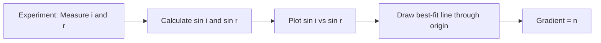
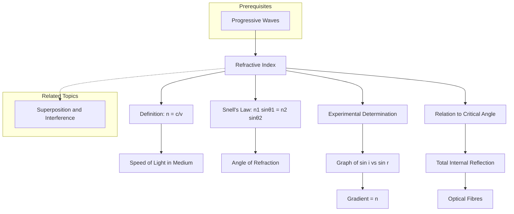

---
# 1. Overview / 概述

**English:**
The refractive index ($n$) is a fundamental property of a material that quantifies how much it slows down light compared to its speed in a vacuum. It is the core parameter that governs all phenomena in [[Refraction and Total Internal Reflection]], including [[Refraction and Snell's Law]] and the [[Critical Angle]]. Understanding refractive index is essential for explaining why light bends when entering a different medium, and it directly determines the conditions for [[Total Internal Reflection]] and the design of [[Optical Fibres and Their Applications]]. This sub-topic covers the definition, physical meaning, and methods for determining refractive index.

**中文:**
折射率 ($n$) 是材料的一种基本属性，它量化了光在该材料中相对于在真空中速度的减慢程度。它是支配[[Refraction and Total Internal Reflection]]中所有现象的核心参数，包括[[Refraction and Snell's Law]]和[[Critical Angle]]。理解折射率对于解释光为何在进入不同介质时发生弯曲至关重要，它直接决定了[[Total Internal Reflection]]的条件以及[[Optical Fibres and Their Applications]]的设计。本子知识点涵盖折射率的定义、物理意义及测定方法。

---

# 2. Syllabus Learning Objectives / 考纲学习目标

| CAIE 9702 | Edexcel IAL |
|-----------|-------------|
| Define refractive index of a medium. | Understand the concept of refractive index. |
| Recall and use $n = \frac{c}{v}$. | Use $n = \frac{c}{v}$ to calculate the speed of light in a medium. |
| Recall and use Snell's Law: $n_1 \sin \theta_1 = n_2 \sin \theta_2$. | Use Snell's Law: $n_1 \sin \theta_1 = n_2 \sin \theta_2$. |
| Describe experiments to determine refractive index. | Describe an experiment to determine the refractive index of a material. |
| Understand absolute and relative refractive index. | Understand the concept of absolute refractive index. |

**Examiner Expectations / 考官期望:**
- **English:** You must be able to define refractive index in terms of the speed of light ($n = c/v$) and in terms of Snell's Law ($n = \sin i / \sin r$). You must be able to apply these equations to solve problems involving light passing from one medium to another. You should also be able to describe and analyze experimental methods for measuring refractive index, including the use of a glass block and a ray box.
- **中文:** 你必须能够根据光速 ($n = c/v$) 和斯涅尔定律 ($n = \sin i / \sin r$) 来定义折射率。你必须能够应用这些方程来解决涉及光从一种介质传播到另一种介质的问题。你还应该能够描述和分析测量折射率的实验方法，包括使用玻璃砖和光具盘。

---

# 3. Core Definitions / 核心定义

| Term (EN/CN) | Definition (EN) | Definition (CN) | Common Mistakes / 常见错误 |
|--------------|-----------------|-----------------|---------------------------|
| **Refractive Index** / 折射率 | The ratio of the speed of light in a vacuum to the speed of light in a medium. | 光在真空中的速度与光在该介质中的速度之比。 | Confusing $n$ with density; a higher $n$ means slower light, not necessarily denser material. |
| **Absolute Refractive Index** / 绝对折射率 | The refractive index of a material relative to a vacuum. | 材料相对于真空的折射率。 | Forgetting that $n$ for air is approximately 1.00. |
| **Relative Refractive Index** / 相对折射率 | The ratio of the speed of light in one medium to the speed of light in another medium. | 光在一种介质中的速度与在另一种介质中的速度之比。 | Confusing $n_1/n_2$ with $n_2/n_1$ when applying Snell's Law. |
| **Optically Dense** / 光密介质 | A medium with a higher refractive index, where light travels slower. | 折射率较高的介质，光在其中传播速度较慢。 | Thinking "dense" means physically dense; e.g., diamond is optically dense but not physically dense. |
| **Optically Less Dense** / 光疏介质 | A medium with a lower refractive index, where light travels faster. | 折射率较低的介质，光在其中传播速度较快。 | Assuming air is always the reference; it is only approximately so. |

---

# 4. Key Concepts Explained / 关键概念详解

## 4.1 Definition of Refractive Index / 折射率的定义

### Explanation / 解释
**English:**
The refractive index ($n$) of a material is defined as the ratio of the speed of light in a vacuum ($c$) to the speed of light in that material ($v$):
$$ n = \frac{c}{v} $$
Since $c$ is the maximum possible speed of light ($3.00 \times 10^8 \text{ m/s}$), $v$ is always less than $c$ in any material. Therefore, $n$ is always greater than or equal to 1. For example, water has $n \approx 1.33$, glass has $n \approx 1.5$, and diamond has $n \approx 2.42$. This definition is fundamental to understanding [[Refraction and Snell's Law]] and [[Total Internal Reflection]].

**中文:**
材料的折射率 ($n$) 定义为光在真空中的速度 ($c$) 与光在该材料中的速度 ($v$) 之比：
$$ n = \frac{c}{v} $$
由于 $c$ 是光可能达到的最大速度 ($3.00 \times 10^8 \text{ m/s}$)，在任何材料中 $v$ 总是小于 $c$。因此，$n$ 总是大于或等于 1。例如，水的 $n \approx 1.33$，玻璃的 $n \approx 1.5$，钻石的 $n \approx 2.42$。这个定义是理解[[Refraction and Snell's Law]]和[[Total Internal Reflection]]的基础。

### Physical Meaning / 物理意义
**English:**
Physically, the refractive index tells us how much a material slows down light. A higher refractive index means light travels slower in that material. This slowing down is due to the interaction of light with the atoms and molecules of the material. The refractive index also determines how much light bends when entering or leaving the material, as described by Snell's Law.

**中文:**
从物理上讲，折射率告诉我们材料使光减速的程度。折射率越高，意味着光在该材料中传播得越慢。这种减速是由于光与材料中的原子和分子相互作用造成的。折射率还决定了光在进入或离开材料时弯曲的程度，如斯涅尔定律所述。

### Common Misconceptions / 常见误区
- **English:**
  - Thinking refractive index is the same as density. (Diamond has a high refractive index but is not physically dense.)
  - Confusing absolute and relative refractive index.
  - Forgetting that $n$ for air is approximately 1.00.
- **中文:**
  - 认为折射率与密度相同。(钻石折射率高，但物理密度并不大。)
  - 混淆绝对折射率和相对折射率。
  - 忘记空气的 $n$ 约为 1.00。

### Exam Tips / 考试提示
- **English:**
  - Always use $n = c/v$ when asked to calculate the speed of light in a medium.
  - Remember that $n$ is dimensionless.
  - For Snell's Law, ensure angles are measured from the normal, not the surface.
- **中文:**
  - 当被要求计算介质中的光速时，始终使用 $n = c/v$。
  - 记住 $n$ 是无量纲的。
  - 对于斯涅尔定律，确保角度是从法线测量的，而不是从表面。

> 📷 **IMAGE PROMPT — DIAGRAM-01: Light Slowing Down in a Medium**
> A diagram showing a light wave entering a glass block. The wavefronts are closer together inside the glass, indicating a shorter wavelength and slower speed. Labels: "Vacuum (c)", "Glass (v < c)", "Wavefronts".

---

# 5. Essential Equations / 核心公式

## 5.1 Definition of Refractive Index / 折射率定义

$$ n = \frac{c}{v} $$

| Symbol (符号) | Meaning (EN) | Meaning (CN) | Unit (单位) |
|--------------|-------------|-------------|------------|
| $n$ | Refractive index | 折射率 | dimensionless (无量纲) |
| $c$ | Speed of light in vacuum | 真空中的光速 | m/s |
| $v$ | Speed of light in the medium | 介质中的光速 | m/s |

**Derivation / 推导:** This is a definition, not derived.
**Conditions / 适用条件:** Valid for all transparent materials.
**Limitations / 局限性:** $n$ varies slightly with wavelength (dispersion), but this is often ignored at AS level.

## 5.2 Snell's Law / 斯涅尔定律

$$ n_1 \sin \theta_1 = n_2 \sin \theta_2 $$

| Symbol (符号) | Meaning (EN) | Meaning (CN) | Unit (单位) |
|--------------|-------------|-------------|------------|
| $n_1$ | Refractive index of first medium | 第一种介质的折射率 | dimensionless (无量纲) |
| $\theta_1$ | Angle of incidence in first medium | 第一种介质中的入射角 | degrees (°) |
| $n_2$ | Refractive index of second medium | 第二种介质的折射率 | dimensionless (无量纲) |
| $\theta_2$ | Angle of refraction in second medium | 第二种介质中的折射角 | degrees (°) |

**Derivation / 推导:** Derived from Fermat's principle of least time.
**Conditions / 适用条件:** Valid for light passing between two isotropic media.
**Limitations / 局限性:** Does not apply to anisotropic materials or when total internal reflection occurs.

> 📷 **IMAGE PROMPT — DIAGRAM-02: Snell's Law Diagram**
> A diagram showing a light ray passing from air (n=1) into glass (n=1.5). The incident ray, refracted ray, and normal are shown. Angles i and r are labeled. The ray bends towards the normal.

---

# 6. Graphs and Relationships / 图表与关系

## 6.1 Graph of $\sin i$ vs $\sin r$ / $\sin i$ 对 $\sin r$ 的图表

### Axes / 坐标轴 (EN+CN)
- **X-axis:** $\sin r$ (sine of angle of refraction / 折射角的正弦)
- **Y-axis:** $\sin i$ (sine of angle of incidence / 入射角的正弦)

### Shape / 形状 (EN+CN)
- **English:** A straight line passing through the origin.
- **中文:** 一条通过原点的直线。

### Gradient Meaning / 斜率含义 (EN+CN)
- **English:** The gradient of the line is equal to the refractive index ($n$) of the second medium relative to the first. If the first medium is air ($n_1 = 1$), the gradient is the absolute refractive index of the second medium.
- **中文:** 直线的斜率等于第二种介质相对于第一种介质的折射率 ($n$)。如果第一种介质是空气 ($n_1 = 1$)，则斜率是第二种介质的绝对折射率。

### Area Meaning / 面积含义 (EN+CN)
- **English:** No physical meaning.
- **中文:** 没有物理意义。

### Exam Interpretation / 考试解读 (EN+CN)
- **English:** This graph is commonly used in experimental work to determine the refractive index of a material. The straight line confirms Snell's Law. A non-linear graph suggests experimental error or incorrect angle measurement.
- **中文:** 该图常用于实验工作中测定材料的折射率。直线证实了斯涅尔定律。非线性图表明存在实验误差或角度测量不正确。

---

# 7. Required Diagrams / 必备图表

## 7.1 Experimental Setup for Measuring Refractive Index / 测量折射率的实验装置

### Description / 描述 (EN+CN)
- **English:** A ray box is used to direct a narrow beam of light at a glass block placed on a sheet of paper. The incident and emergent rays are traced. The angles of incidence ($i$) and refraction ($r$) are measured using a protractor.
- **中文:** 使用光具盒将一窄束光射向放置在纸上的玻璃砖。追踪入射光线和出射光线。使用量角器测量入射角 ($i$) 和折射角 ($r$)。

### Image Prompt / 图片生成提示
> 📷 **IMAGE PROMPT — DIAGRAM-03: Refractive Index Experiment**
> A diagram showing a ray box shining light at a rectangular glass block. The incident ray, refracted ray inside the block, and emergent ray are shown. A protractor is shown measuring the angle of incidence and angle of refraction. The normal is drawn as a dashed line. Labels: "Ray box", "Glass block", "Incident ray", "Refracted ray", "Emergent ray", "Normal", "Angle i", "Angle r".

### Labels Required / 需要标注 (EN+CN)
- Ray box / 光具盒
- Glass block / 玻璃砖
- Incident ray / 入射光线
- Refracted ray / 折射光线
- Emergent ray / 出射光线
- Normal / 法线
- Angle of incidence ($i$) / 入射角 ($i$)
- Angle of refraction ($r$) / 折射角 ($r$)

### Exam Importance / 考试重要性 (EN+CN)
- **English:** This is a classic AS-level practical. You must be able to describe the setup, identify sources of error (e.g., thick ray, parallax error), and explain how to improve accuracy (e.g., use pins, repeat measurements).
- **中文:** 这是一个经典的AS水平实验。你必须能够描述实验装置，识别误差来源（例如，光线太粗、视差误差），并解释如何提高准确性（例如，使用大头针、重复测量）。

---

# 8. Worked Examples / 典型例题

## Example 1: Calculating Speed of Light in a Medium / 计算介质中的光速

### Question / 题目
**English:**
The refractive index of diamond is 2.42. Calculate the speed of light in diamond. (Speed of light in vacuum, $c = 3.00 \times 10^8 \text{ m/s}$)

**中文:**
钻石的折射率为 2.42。计算光在钻石中的速度。(真空中的光速 $c = 3.00 \times 10^8 \text{ m/s}$)

### Solution / 解答
**Step 1:** Recall the definition of refractive index:
$$ n = \frac{c}{v} $$

**Step 2:** Rearrange to solve for $v$:
$$ v = \frac{c}{n} $$

**Step 3:** Substitute the values:
$$ v = \frac{3.00 \times 10^8}{2.42} $$

**Step 4:** Calculate:
$$ v = 1.24 \times 10^8 \text{ m/s} $$

### Final Answer / 最终答案
**Answer:** $1.24 \times 10^8 \text{ m/s}$ | **答案：** $1.24 \times 10^8 \text{ m/s}$

### Quick Tip / 提示
(EN+CN)
- **English:** Always check that your answer is less than $c$. If it's greater, you've made a mistake.
- **中文:** 始终检查你的答案是否小于 $c$。如果更大，你就犯错了。

---

## Example 2: Applying Snell's Law / 应用斯涅尔定律

### Question / 题目
**English:**
A light ray passes from air ($n = 1.00$) into water ($n = 1.33$). The angle of incidence is $30^\circ$. Calculate the angle of refraction.

**中文:**
一束光从空气 ($n = 1.00$) 射入水中 ($n = 1.33$)。入射角为 $30^\circ$。计算折射角。

### Solution / 解答
**Step 1:** Write Snell's Law:
$$ n_1 \sin \theta_1 = n_2 \sin \theta_2 $$

**Step 2:** Substitute the known values:
$$ 1.00 \times \sin 30^\circ = 1.33 \times \sin \theta_2 $$

**Step 3:** Solve for $\sin \theta_2$:
$$ \sin \theta_2 = \frac{1.00 \times 0.5}{1.33} = 0.376 $$

**Step 4:** Find $\theta_2$:
$$ \theta_2 = \sin^{-1}(0.376) = 22.1^\circ $$

### Final Answer / 最终答案
**Answer:** $22.1^\circ$ | **答案：** $22.1^\circ$

### Quick Tip / 提示
(EN+CN)
- **English:** When light goes from a less dense to a more dense medium (air to water), it bends towards the normal, so the angle of refraction is smaller than the angle of incidence.
- **中文:** 当光从光疏介质进入光密介质（空气到水）时，它向法线方向弯曲，因此折射角小于入射角。

---

# 9. Past Paper Question Types / 历年真题题型

| Question Type / 题型 | Frequency / 频率 | Difficulty / 难度 | Past Paper References / 真题索引 |
|----------------------|------------------|------------------|-------------------------------|
| Definition of refractive index | High | Easy | 📝 *待填入* |
| Calculation using $n = c/v$ | High | Medium | 📝 *待填入* |
| Application of Snell's Law | Very High | Medium | 📝 *待填入* |
| Experimental determination of $n$ | Medium | Medium-Hard | 📝 *待填入* |
| Graph of $\sin i$ vs $\sin r$ | Medium | Medium | 📝 *待填入* |

**Common Command Words / 常见指令词:**
- **English:** Define, Calculate, Determine, Describe, Explain, Plot, State
- **中文:** 定义、计算、确定、描述、解释、绘制、陈述

---

# 10. Practical Skills Connections / 实验技能链接

**English:**
This sub-topic is directly linked to the practical determination of refractive index. Key skills include:
- **Measurements:** Using a protractor to measure angles of incidence and refraction. Using a ruler to trace light rays.
- **Uncertainties:** Estimating uncertainty in angle measurements (typically $\pm 1^\circ$). Calculating percentage uncertainty in $n$.
- **Graph Plotting:** Plotting $\sin i$ against $\sin r$ to find the gradient, which equals $n$. This reduces random errors.
- **Experimental Design:** Using pins instead of a ray box for more accurate ray tracing. Using a glass block with parallel sides to ensure the emergent ray is parallel to the incident ray.

**中文:**
本子知识点与折射率的实验测定直接相关。关键技能包括：
- **测量：** 使用量角器测量入射角和折射角。使用尺子追踪光线。
- **不确定度：** 估计角度测量的不确定度（通常为 $\pm 1^\circ$）。计算 $n$ 的百分比不确定度。
- **图表绘制：** 绘制 $\sin i$ 对 $\sin r$ 的图表以找到斜率，该斜率等于 $n$。这减少了随机误差。
- **实验设计：** 使用大头针代替光具盒进行更精确的光线追踪。使用平行边的玻璃砖以确保出射光线与入射光线平行。

> 📋 **Edexcel Only:** Edexcel may ask you to describe an experiment using a semicircular block to find the critical angle and hence the refractive index.

---

# 11. Concept Map / 概念图谱

---

# 12. Quick Revision Sheet / 速查表

| Category / 类别 | Key Points / 要点 |
|----------------|------------------|
| Definition / 定义 | $n = \frac{c}{v}$; $n \geq 1$; dimensionless / $n = \frac{c}{v}$; $n \geq 1$; 无量纲 |
| Key Formula / 核心公式 | $n_1 \sin \theta_1 = n_2 \sin \theta_2$ (Snell's Law / 斯涅尔定律) |
| Key Graph / 核心图表 | $\sin i$ vs $\sin r$: straight line through origin, gradient = $n$ / $\sin i$ 对 $\sin r$: 通过原点的直线，斜率 = $n$ |
| Exam Tip / 考试提示 | Always measure angles from the normal. Use $n = c/v$ for speed calculations. / 始终从法线测量角度。使用 $n = c/v$ 进行速度计算。 |
| Common Mistake / 常见错误 | Confusing $i$ and $r$ in Snell's Law. Forgetting $n$ for air is 1.00. / 在斯涅尔定律中混淆 $i$ 和 $r$。忘记空气的 $n$ 是 1.00。 |
| Practical Skill / 实验技能 | Use pins for accurate ray tracing. Plot $\sin i$ vs $\sin r$ to find $n$. / 使用大头针进行精确的光线追踪。绘制 $\sin i$ 对 $\sin r$ 的图表以找到 $n$。 |