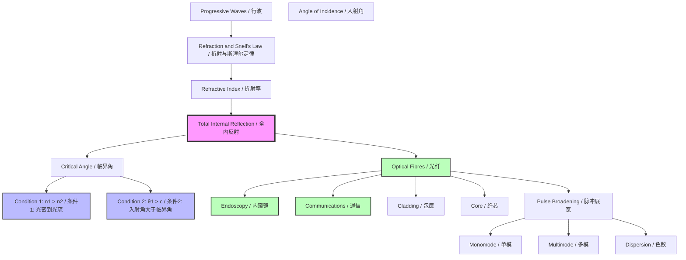

---
# Total Internal Reflection / 全内反射

---

# 1. Overview / 概述

**English:**
Total Internal Reflection (TIR) is a phenomenon that occurs when a wave traveling from a medium with a higher [[Refractive Index]] to a medium with a lower refractive index is completely reflected back into the original medium, rather than being refracted. This happens when the angle of incidence exceeds a specific threshold known as the [[Critical Angle]]. TIR is a cornerstone concept in wave optics, with profound practical applications, most notably in [[Optical Fibres and Their Applications]] for high-speed data transmission and in medical endoscopy. Understanding TIR requires a solid grasp of [[Refraction and Snell's Law]] and the concept of [[Refractive Index]]. This sub-topic explains the conditions required for TIR, how to calculate the critical angle, and its key applications.

**中文:**
全内反射（TIR）是一种波动现象，当波从高[[折射率]]介质传播到低折射率介质时，如果入射角超过一个特定的阈值（即[[临界角]]），波将完全被反射回原介质，而不是发生折射。TIR 是波动光学中的基石概念，具有深远的实际应用，最著名的是在[[光纤及其应用]]中用于高速数据传输，以及在医疗内窥镜中。理解 TIR 需要扎实掌握[[折射与斯涅尔定律]]和[[折射率]]的概念。本子知识点解释了 TIR 发生的条件、如何计算临界角及其关键应用。

---

# 2. Syllabus Learning Objectives / 考纲学习目标

| CAIE 9702 (8.4) | Edexcel IAL (WPH11 U2) |
|-----------------|------------------------|
| 8.4(a) Describe what is meant by total internal reflection. | 5.26 Understand the conditions for total internal reflection. |
| 8.4(b) Define and derive the critical angle. | 5.27 Derive the equation for the critical angle at a boundary between two media. |
| 8.4(c) Recall and use the equation for critical angle: $\sin c = 1/n$. | 5.28 Recall and use the equation $\sin c = n_2/n_1$. |
| 8.4(d) Describe the use of optical fibres in endoscopy and communications. | 5.29 Understand the principles and applications of optical fibres. |
| 8.4(e) Understand the principles of monomode and multimode optical fibres. | 5.30 Understand the causes and effects of pulse broadening (modal and material dispersion) in optical fibres. |
| 8.4(f) Understand the use of cladding in optical fibres. | |

**Examiner Expectations / 考官期望:**
- **CAIE:** Students must be able to derive the critical angle formula from Snell's Law, explain the role of cladding, and distinguish between monomode and multimode fibres. Pulse broadening is a key exam topic.
- **Edexcel:** Students must be able to apply the critical angle formula in different contexts (e.g., from glass to air, or between two different media). Understanding the causes of pulse broadening (modal and material dispersion) is essential.

---

# 3. Core Definitions / 核心定义

| Term (EN/CN) | Definition (EN) | Definition (CN) | Common Mistakes / 常见错误 |
|--------------|-----------------|-----------------|---------------------------|
| **Total Internal Reflection (TIR)** / 全内反射 | The complete reflection of a light ray at the boundary between two transparent media, occurring when the angle of incidence is greater than the critical angle. | 当入射角大于临界角时，光线在两种透明介质界面上发生的完全反射现象。 | Confusing TIR with normal reflection. TIR only occurs when light travels from a higher to a lower refractive index. |
| **Critical Angle ($c$)** / 临界角 | The angle of incidence in the optically denser medium for which the angle of refraction in the less dense medium is exactly 90°. | 在光密介质中，使光疏介质中的折射角恰好为90°时的入射角。 | Forgetting that the critical angle is defined *inside* the denser medium. |
| **Optical Fibre** / 光纤 | A thin, flexible, transparent fibre (usually glass or plastic) that transmits light signals via total internal reflection. | 一种细长、柔韧的透明纤维（通常为玻璃或塑料），通过全内反射传输光信号。 | Thinking the fibre core is hollow; it is solid. |
| **Cladding** / 包层 | A layer of material with a lower refractive index surrounding the core of an optical fibre, which ensures TIR and protects the core. | 包裹在光纤纤芯外的一层折射率较低的材料，用于确保全内反射并保护纤芯。 | Forgetting that cladding has a *lower* refractive index than the core. |
| **Pulse Broadening / Dispersion** / 脉冲展宽/色散 | The spreading of a light pulse as it travels along an optical fibre, caused by different path lengths (modal dispersion) or different wavelengths (material dispersion). | 光脉冲在光纤中传输时发生的展宽现象，由不同路径长度（模式色散）或不同波长（材料色散）引起。 | Confusing modal dispersion (path length) with material dispersion (wavelength dependence). |

---

# 4. Key Concepts Explained / 关键概念详解

## 4.1 Conditions for Total Internal Reflection / 全内反射的条件

### Explanation / 解释
**English:** For TIR to occur, two conditions must be satisfied simultaneously:
1.  **Direction of Travel:** Light must be traveling from a medium with a higher [[Refractive Index]] ($n_1$) to a medium with a lower refractive index ($n_2$), i.e., $n_1 > n_2$. For example, from glass ($n \approx 1.5$) to air ($n \approx 1.0$).
2.  **Angle of Incidence:** The angle of incidence ($\theta_1$) in the denser medium must be greater than the [[Critical Angle]] ($c$), i.e., $\theta_1 > c$.

If the angle of incidence is less than the critical angle ($\theta_1 < c$), normal refraction occurs. If it equals the critical angle ($\theta_1 = c$), the refracted ray grazes along the boundary.

**中文:** 全内反射的发生必须同时满足两个条件：
1.  **传播方向：** 光必须从高[[折射率]] ($n_1$) 的介质传播到低折射率 ($n_2$) 的介质，即 $n_1 > n_2$。例如，从玻璃 ($n \approx 1.5$) 到空气 ($n \approx 1.0$)。
2.  **入射角：** 光密介质中的入射角 ($\theta_1$) 必须大于[[临界角]] ($c$)，即 $\theta_1 > c$。

如果入射角小于临界角 ($\theta_1 < c$)，则发生正常的折射。如果等于临界角 ($\theta_1 = c$)，则折射光线沿界面掠过。

### Physical Meaning / 物理意义
**English:** TIR is a consequence of the wave nature of light. When light tries to exit a denser medium at a steep angle, the refracted wave cannot "keep up" with the boundary conditions, forcing all the energy to be reflected back. It is a 100% efficient reflection process, unlike partial reflection at a surface.

**中文:** 全内反射是光波动性的结果。当光试图以陡峭的角度离开光密介质时，折射波无法“跟上”边界条件，迫使所有能量被反射回去。与界面上的部分反射不同，这是一个100%高效的反射过程。

### Common Misconceptions / 常见误区
- **Misconception:** TIR can happen when light goes from air to glass.
  - **Truth:** TIR only occurs when light goes from a higher $n$ to a lower $n$ (e.g., glass to air).
- **Misconception:** The critical angle is measured in the rarer medium.
  - **Truth:** The critical angle is always measured in the denser medium.
- **Misconception:** TIR is the same as ordinary reflection.
  - **Truth:** Ordinary reflection is partial (some light is transmitted). TIR is 100% efficient.

### Exam Tips / 考试提示
- **Tip:** Always draw a normal line at the point of incidence. Label the angles of incidence, refraction, and reflection clearly.
- **Tip:** When asked to "show that" the critical angle is a certain value, always start by writing down Snell's Law: $n_1 \sin \theta_1 = n_2 \sin \theta_2$.
- **Tip:** For TIR, set $\theta_2 = 90^\circ$ and $\theta_1 = c$.

> 📷 **IMAGE PROMPT — TIR-DIAGRAM-01: Conditions for Total Internal Reflection**
> A clear ray diagram showing three scenarios for a light ray traveling from glass (n=1.5) to air (n=1.0). Scenario 1: Angle of incidence < critical angle, showing a refracted ray bending away from the normal. Scenario 2: Angle of incidence = critical angle, showing the refracted ray traveling along the boundary (angle of refraction = 90°). Scenario 3: Angle of incidence > critical angle, showing a strong reflected ray back into the glass and no refracted ray. All angles are clearly labeled with Greek letters. The normal is a dashed line.

---

# 5. Essential Equations / 核心公式

## 5.1 The Critical Angle Equation / 临界角方程

$$ \sin c = \frac{n_2}{n_1} $$

Where $n_1 > n_2$.

| Symbol (符号) | Meaning (EN) | Meaning (CN) | Unit (单位) |
|--------------|-------------|-------------|------------|
| $c$ | Critical angle | 临界角 | Degrees (°) or radians (rad) |
| $n_1$ | Refractive index of the denser medium (incident medium) | 光密介质的折射率（入射介质） | No unit |
| $n_2$ | Refractive index of the rarer medium (transmitting medium) | 光疏介质的折射率（透射介质） | No unit |

**Derivation / 推导:**
Start from [[Refraction and Snell's Law]]: $n_1 \sin \theta_1 = n_2 \sin \theta_2$.
At the critical angle, $\theta_1 = c$ and $\theta_2 = 90^\circ$.
Therefore: $n_1 \sin c = n_2 \sin 90^\circ = n_2 \times 1$.
Rearranging gives: $\sin c = \frac{n_2}{n_1}$.

**Special Case (CAIE focus):** If the rarer medium is air (or vacuum), $n_2 \approx 1$. The equation simplifies to:
$$ \sin c = \frac{1}{n_1} $$

**Conditions / 适用条件:**
- **EN:** This equation is valid only when $n_1 > n_2$. If $n_1 < n_2$, there is no critical angle and TIR cannot occur.
- **CN:** 该方程仅在 $n_1 > n_2$ 时有效。如果 $n_1 < n_2$，则不存在临界角，全内反射不会发生。

**Limitations / 局限性:**
- **EN:** The equation assumes the media are isotropic (same properties in all directions) and non-absorbing. It is derived from geometric optics and does not account for wave effects like evanescent waves.
- **CN:** 该方程假设介质是各向同性的（在所有方向上性质相同）且不吸收。它基于几何光学推导，未考虑像倏逝波这样的波动效应。

---

# 6. Graphs and Relationships / 图表与关系

## 6.1 Angle of Refraction vs. Angle of Incidence (for $n_1 > n_2$) / 折射角与入射角的关系

### Axes / 坐标轴
- **X-axis:** Angle of incidence in denser medium ($\theta_1$) / 光密介质中的入射角 ($\theta_1$)
- **Y-axis:** Angle of refraction in rarer medium ($\theta_2$) / 光疏介质中的折射角 ($\theta_2$)

### Shape / 形状
**EN:** The graph is non-linear. As $\theta_1$ increases, $\theta_2$ increases more rapidly. The curve ends abruptly at $\theta_1 = c$, where $\theta_2 = 90^\circ$. For $\theta_1 > c$, there is no refracted ray (TIR region).

**CN:** 图形是非线性的。随着 $\theta_1$ 增加，$\theta_2$ 增加得更快。曲线在 $\theta_1 = c$ 处突然结束，此时 $\theta_2 = 90^\circ$。对于 $\theta_1 > c$，没有折射光线（全内反射区域）。

### Gradient Meaning / 斜率含义
**EN:** The gradient $\frac{d\theta_2}{d\theta_1}$ represents how sensitive the refraction angle is to changes in the incidence angle. It approaches infinity as $\theta_1$ approaches $c$.

**CN:** 斜率 $\frac{d\theta_2}{d\theta_1}$ 表示折射角对入射角变化的敏感程度。当 $\theta_1$ 接近 $c$ 时，斜率趋近于无穷大。

### Area Meaning / 面积含义
**EN:** The area under the graph has no direct physical meaning in this context.

**CN:** 该图下的面积在此上下文中没有直接的物理意义。

### Exam Interpretation / 考试解读
**EN:** You may be asked to sketch this graph or to use it to determine the critical angle from experimental data. The point where the graph reaches $\theta_2 = 90^\circ$ is the critical angle.

**CN:** 你可能会被要求画出此图，或利用它从实验数据中确定临界角。图形达到 $\theta_2 = 90^\circ$ 的点即为临界角。

> 📷 **IMAGE PROMPT — TIR-GRAPH-01: Refraction Angle vs Incidence Angle**
> A graph plotting angle of refraction (y-axis, 0° to 90°) against angle of incidence (x-axis, 0° to 90°). The curve starts at the origin (0,0) and curves upwards. It is labeled with a dashed vertical line at the critical angle (e.g., 42°). The region to the left of this line is labeled "Refraction", and the region to the right is labeled "Total Internal Reflection". The curve ends at the point (c, 90°).

---

# 7. Required Diagrams / 必备图表

## 7.1 Ray Diagram for TIR at a Glass-Air Boundary / 玻璃-空气界面的全内反射光线图

### Description / 描述
**EN:** A diagram showing a glass block (semicircular is best) with a ray of light entering from the curved side and traveling towards the center of the flat face. The ray is incident on the flat face from inside the glass. The diagram should show three key rays: one where the angle of incidence is less than the critical angle (refraction), one where it equals the critical angle (grazing emergence), and one where it is greater than the critical angle (TIR).

**CN:** 一个显示玻璃块（最好为半圆形）的示意图，光线从曲面射入并射向平面面的中心。光线从玻璃内部入射到平面面上。该图应显示三条关键光线：一条入射角小于临界角（折射），一条等于临界角（掠射），一条大于临界角（全内反射）。

### Image Prompt / 图片生成提示
> 📷 **IMAGE PROMPT — TIR-DIAGRAM-02: TIR in a Semicircular Glass Block**
> A detailed physics ray diagram of a semicircular glass block. A single light ray enters from the curved side, always traveling towards the center of the flat face. The diagram shows three positions of the ray (or three separate rays) hitting the flat face at different angles. Ray A: incident at 30° (less than critical angle), showing a refracted ray bending away from the normal into the air. Ray B: incident at 42° (critical angle), showing the refracted ray traveling exactly along the surface. Ray C: incident at 60° (greater than critical angle), showing a bright reflected ray back into the glass and no refracted ray. The normal is a dashed line. Angles are clearly labeled.

### Labels Required / 需要标注
- **EN:** Incident ray, Refracted ray, Reflected ray (for TIR), Normal, Angle of incidence ($\theta_1$), Angle of refraction ($\theta_2$), Critical angle ($c$), Glass, Air.
- **CN:** 入射光线，折射光线，反射光线（全内反射时），法线，入射角 ($\theta_1$)，折射角 ($\theta_2$)，临界角 ($c$)，玻璃，空气。

### Exam Importance / 考试重要性
**EN:** Extremely high. This is the standard diagram used to explain and test TIR. You must be able to draw it and label it correctly.

**CN:** 极高。这是解释和测试全内反射的标准图表。你必须能够正确绘制并标注它。

---

# 8. Worked Examples / 典型例题

## Example 1: Calculating the Critical Angle / 计算临界角

### Question / 题目
**English:** The refractive index of a type of glass is 1.52. Calculate the critical angle for light traveling from this glass into air (refractive index of air = 1.00).

**中文:** 某种玻璃的折射率为 1.52。计算光从这种玻璃射入空气（空气折射率 = 1.00）时的临界角。

### Solution / 解答
**Step 1:** Identify the known quantities.
- $n_1$ (glass) = 1.52
- $n_2$ (air) = 1.00

**Step 2:** Write down the formula for the critical angle.
$$ \sin c = \frac{n_2}{n_1} $$

**Step 3:** Substitute the values.
$$ \sin c = \frac{1.00}{1.52} = 0.6579 $$

**Step 4:** Solve for $c$.
$$ c = \sin^{-1}(0.6579) = 41.1^\circ $$

### Final Answer / 最终答案
**Answer:** $c = 41.1^\circ$ | **答案：** $c = 41.1^\circ$

### Quick Tip / 提示
**EN:** Always ensure your calculator is in degree mode when calculating inverse sine. The critical angle is always measured in the denser medium (the glass).

**CN:** 在计算反正弦时，务必确保计算器处于角度模式。临界角始终在光密介质（玻璃）中测量。

---

## Example 2: Applying TIR in an Optical Fibre / 光纤中的全内反射应用

### Question / 题目
**English:** An optical fibre has a core of refractive index 1.50 and a cladding of refractive index 1.45. Calculate the critical angle at the core-cladding boundary.

**中文:** 一根光纤的纤芯折射率为 1.50，包层折射率为 1.45。计算纤芯-包层界面处的临界角。

### Solution / 解答
**Step 1:** Identify the known quantities.
- $n_1$ (core) = 1.50
- $n_2$ (cladding) = 1.45

**Step 2:** Write down the formula.
$$ \sin c = \frac{n_2}{n_1} $$

**Step 3:** Substitute the values.
$$ \sin c = \frac{1.45}{1.50} = 0.9667 $$

**Step 4:** Solve for $c$.
$$ c = \sin^{-1}(0.9667) = 75.2^\circ $$

### Final Answer / 最终答案
**Answer:** $c = 75.2^\circ$ | **答案：** $c = 75.2^\circ$

### Quick Tip / 提示
**EN:** Notice that the critical angle is much larger here (75.2°) than in the glass-air example (41.1°). This is because the difference in refractive indices is smaller. A larger critical angle means the fibre can accept light at a wider range of angles.

**CN:** 注意，这里的临界角（75.2°）比玻璃-空气的例子（41.1°）大得多。这是因为折射率差较小。较大的临界角意味着光纤可以接受更宽角度范围的光。

---

# 9. Past Paper Question Types / 历年真题题型

| Question Type / 题型 | Frequency / 频率 | Difficulty / 难度 | Past Paper References / 真题索引 |
|----------------------|------------------|------------------|-------------------------------|
| **Calculation of Critical Angle** / 临界角计算 | Very High / 非常高 | Easy / 简单 | 📝 *待填入* |
| **Explaining Conditions for TIR** / 解释全内反射条件 | High / 高 | Medium / 中等 | 📝 *待填入* |
| **Ray Diagram for TIR** / 全内反射光线图 | High / 高 | Medium / 中等 | 📝 *待填入* |
| **Optical Fibre Principles & Pulse Broadening** / 光纤原理与脉冲展宽 | Medium / 中等 | Hard / 困难 | 📝 *待填入* |
| **Comparing Monomode vs Multimode Fibres** / 单模与多模光纤比较 | Low / 低 | Medium / 中等 | 📝 *待填入* |

**Common Command Words / 常见指令词:**
- **EN:** Define, Derive, Calculate, Explain, Sketch, Describe, State.
- **CN:** 定义，推导，计算，解释，画出，描述，陈述。

---

# 10. Practical Skills Connections / 实验技能链接

**English:**
This sub-topic connects to practical work in several ways:
1.  **Measuring the Critical Angle:** A common experiment involves using a semicircular glass block. A ray of light is directed into the curved side so it hits the center of the flat face. The angle of incidence is gradually increased until the refracted ray disappears. The angle of incidence at this point is the critical angle.
2.  **Determining Refractive Index:** Once the critical angle ($c$) is measured, the refractive index of the glass can be calculated using $n = 1/\sin c$.
3.  **Uncertainties:** The main source of uncertainty is in judging the exact moment the refracted ray disappears. This leads to a range of possible values for $c$. Students should be able to calculate the percentage uncertainty in $c$ and propagate it to find the uncertainty in $n$.
4.  **Graph Plotting:** Plotting a graph of $\sin \theta_2$ against $\sin \theta_1$ can yield a straight line with a gradient equal to $n_1/n_2$, allowing for a more accurate determination of the critical angle.

**中文:**
本子知识点通过以下几种方式与实验操作相关联：
1.  **测量临界角：** 一个常见实验是使用半圆形玻璃块。将一束光线射向曲面，使其射到平面面的中心。逐渐增大入射角，直到折射光线消失。此时对应的入射角即为临界角。
2.  **测定折射率：** 一旦测出临界角 ($c$)，就可以使用公式 $n = 1/\sin c$ 计算玻璃的折射率。
3.  **不确定度：** 不确定度的主要来源是判断折射光线消失的精确时刻。这会导致 $c$ 的测量值有一个范围。学生应能计算 $c$ 的百分比不确定度，并将其传递以求出 $n$ 的不确定度。
4.  **图表绘制：** 绘制 $\sin \theta_2$ 对 $\sin \theta_1$ 的图表可以得到一条直线，其斜率等于 $n_1/n_2$，从而可以更精确地确定临界角。

---

# 11. Concept Map / 概念图谱

---

# 12. Quick Revision Sheet / 速查表

| Category / 类别 | Key Points / 要点 |
|----------------|------------------|
| **Definition / 定义** | TIR is the complete reflection of light at a boundary when $\theta_1 > c$ and $n_1 > n_2$. / 全内反射是当 $\theta_1 > c$ 且 $n_1 > n_2$ 时，光在界面上的完全反射。 |
| **Key Formula / 核心公式** | $\sin c = \frac{n_2}{n_1}$ (General) / $\sin c = \frac{1}{n}$ (Air) |
| **Key Condition / 关键条件** | 1. Light from denser to rarer medium ($n_1 > n_2$). / 光从光密到光疏介质。 2. Angle of incidence > critical angle ($\theta_1 > c$). / 入射角大于临界角。 |
| **Key Application / 核心应用** | [[Optical Fibres and Their Applications]]: High-speed data transmission and medical endoscopy. / [[光纤及其应用]]：高速数据传输和医疗内窥镜。 |
| **Key Graph / 核心图表** | $\theta_2$ vs $\theta_1$: Curve ends at $\theta_2 = 90^\circ$ when $\theta_1 = c$. / $\theta_2$ 对 $\theta_1$ 图：曲线在 $\theta_1 = c$ 时结束于 $\theta_2 = 90^\circ$。 |
| **Exam Tip / 考试提示** | Always start TIR derivations from Snell's Law: $n_1 \sin \theta_1 = n_2 \sin \theta_2$. Set $\theta_2 = 90^\circ$ for the critical angle. / 全内反射推导始终从斯涅尔定律开始：$n_1 \sin \theta_1 = n_2 \sin \theta_2$。对于临界角，设 $\theta_2 = 90^\circ$。 |
| **Common Mistake / 常见错误** | Measuring the critical angle in the rarer medium. It is always measured in the denser medium. / 在光疏介质中测量临界角。它始终在光密介质中测量。 |