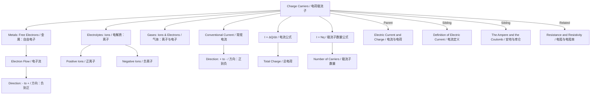

# Charge Carriers (Electrons, Ions) / 电荷载流子（电子、离子）

---

# 1. Overview / 概述

**English:**
This sub-topic introduces the concept of **charge carriers** — the microscopic particles that transport electric charge through a material. In metals, the charge carriers are **free electrons**; in electrolytes (liquids) and gases, they are **positive and negative ions**. Understanding charge carriers is fundamental to explaining how electric current flows in different materials, and it bridges the gap between the macroscopic measurement of current and the microscopic behaviour of particles. This knowledge is essential for later topics such as [[Resistance and Resistivity]] and [[Potential Difference and EMF]].

**中文:**
本子知识点介绍**电荷载流子**的概念——即在材料中传输电荷的微观粒子。在金属中，电荷载流子是**自由电子**；在电解质（液体）和气体中，它们是**正离子和负离子**。理解电荷载流子是解释电流如何在不同材料中流动的基础，它连接了电流的宏观测量与粒子的微观行为。这一知识对于后续学习[[Resistance and Resistivity]]和[[Potential Difference and EMF]]等主题至关重要。

---

# 2. Syllabus Learning Objectives / 考纲学习目标

| CAIE 9702 (9.1 a-d) | Edexcel IAL (WPH11 U2: 3.1-3.4) |
|-----------|-------------|
| Understand that electric current is the flow of charge carriers | Know that electric current is the rate of flow of charge |
| Identify charge carriers in different materials (metals: electrons; electrolytes: ions) | Identify charge carriers in metals (free electrons) and electrolytes (positive and negative ions) |
| Understand that the direction of conventional current is opposite to electron flow | Understand the difference between conventional current and electron flow |
| Use the equation $I = \Delta Q / \Delta t$ | Use the equation $I = \Delta Q / \Delta t$ |

**Examiner Expectations / 考官期望:**
- **English:** You must be able to state the charge carrier for a given material and explain why current flows. You should also be able to calculate the number of charge carriers passing a point per second using $I = \Delta Q / \Delta t$.
- **中文:** 你必须能够指出给定材料中的电荷载流子，并解释电流为何流动。你还应能使用 $I = \Delta Q / \Delta t$ 计算每秒通过某一点的电荷载流子数量。

---

# 3. Core Definitions / 核心定义

| Term (EN/CN) | Definition (EN) | Definition (CN) | Common Mistakes / 常见错误 |
|--------------|-----------------|-----------------|---------------------------|
| **Charge Carrier** / 电荷载流子 | A particle that carries electric charge and is free to move within a material, enabling electric current to flow. | 携带电荷并在材料内自由移动的粒子，使电流能够流动。 | Confusing charge carriers with the material itself (e.g., saying "copper" instead of "free electrons"). |
| **Free Electron** / 自由电子 | An electron that is not bound to a specific atom and can move freely through a metal lattice. | 不受特定原子束缚、能在金属晶格中自由移动的电子。 | Thinking all electrons in a metal are free — only the outermost (valence) electrons are free. |
| **Ion** / 离子 | An atom or molecule that has gained or lost electrons, acquiring a net positive or negative charge. | 获得或失去电子而带有净正电荷或净负电荷的原子或分子。 | Forgetting that ions can be positive (cations) or negative (anions). |
| **Electrolyte** / 电解质 | A liquid or solution that contains ions and can conduct electricity. | 含有离子并能导电的液体或溶液。 | Thinking electrolytes only conduct via electrons — they conduct via ions. |
| **Conventional Current** / 常规电流 | The direction of flow of positive charge from the positive terminal to the negative terminal of a power supply. | 正电荷从电源正极流向负极的方向。 | Confusing this with electron flow direction. |
| **Electron Flow** / 电子流 | The actual movement of electrons from the negative terminal to the positive terminal of a power supply. | 电子从电源负极流向正极的实际运动。 | Thinking electron flow and conventional current are the same direction. |

---

# 4. Key Concepts Explained / 关键概念详解

## 4.1 Charge Carriers in Different Materials / 不同材料中的电荷载流子

### Explanation / 解释
**English:**
The type of charge carrier depends on the material:
- **Metals (e.g., copper, aluminium):** The charge carriers are **free electrons**. Each metal atom contributes one or more valence electrons that become delocalised and can move through the metal lattice. These free electrons drift under the influence of an electric field, creating an electric current.
- **Electrolytes (e.g., salt solution, acids):** The charge carriers are **positive ions (cations)** and **negative ions (anions)**. When an ionic compound dissolves in water, it dissociates into its constituent ions, which can move freely in the solution.
- **Gases (e.g., in a discharge tube):** The charge carriers are **ions and free electrons**. Gases are normally insulators, but when ionised (e.g., by high voltage or radiation), they can conduct.

**中文:**
电荷载流子的类型取决于材料：
- **金属（如铜、铝）：** 电荷载流子是**自由电子**。每个金属原子贡献一个或多个价电子，这些电子成为离域电子，可以在金属晶格中移动。这些自由电子在电场的影响下漂移，产生电流。
- **电解质（如盐溶液、酸）：** 电荷载流子是**正离子（阳离子）**和**负离子（阴离子）**。当离子化合物溶解在水中时，它会解离成其组成离子，这些离子可以在溶液中自由移动。
- **气体（如放电管中）：** 电荷载流子是**离子和自由电子**。气体通常是绝缘体，但当被电离时（例如通过高压或辐射），它们可以导电。

### Physical Meaning / 物理意义
**English:**
The existence of charge carriers explains why some materials conduct electricity and others do not. In conductors, charge carriers are abundant and mobile; in insulators, they are scarce or bound. The number density of charge carriers ($n$) and their drift velocity ($v$) determine the current.

**中文:**
电荷载流子的存在解释了为什么有些材料导电而其他材料不导电。在导体中，电荷载流子丰富且可移动；在绝缘体中，它们稀少或被束缚。电荷载流子的数密度（$n$）和它们的漂移速度（$v$）决定了电流。

### Common Misconceptions / 常见误区
- **English:**
  - "All electrons in a metal are free." → Only the outermost valence electrons are free; inner electrons remain bound to the nucleus.
  - "Ions only exist in solids." → Ions exist in solutions (electrolytes) and gases, not just in solid ionic crystals.
  - "Current is carried by electrons in all materials." → In electrolytes and gases, ions are the primary charge carriers.
- **中文:**
  - "金属中的所有电子都是自由的。" → 只有最外层的价电子是自由的；内层电子仍束缚在原子核上。
  - "离子只存在于固体中。" → 离子存在于溶液（电解质）和气体中，而不仅仅在固体离子晶体中。
  - "所有材料中电流都由电子携带。" → 在电解质和气体中，离子是主要的电荷载流子。

### Exam Tips / 考试提示
- **English:** When asked "What are the charge carriers in copper?" the answer is "free electrons" — not "copper atoms" or "protons".
- **中文:** 当被问及"铜中的电荷载流子是什么？"时，答案是"自由电子"——而不是"铜原子"或"质子"。

> 📷 **IMAGE PROMPT — DIAGRAM-01: Charge Carriers in Metals vs Electrolytes**
> A side-by-side comparison diagram. Left: A metal lattice showing positive metal ions fixed in a regular array, with free electrons (small dots) moving between them. Right: An electrolyte solution showing positive and negative ions (larger spheres with + and - signs) moving randomly in water. Arrows indicate direction of movement under an electric field. Labels in English and Chinese.

---

## 4.2 Conventional Current vs Electron Flow / 常规电流与电子流

### Explanation / 解释
**English:**
This is a critical distinction:
- **Conventional current** flows from **positive to negative** (outside the power supply). This is the direction Benjamin Franklin assumed when he defined current — he thought positive charges moved.
- **Electron flow** is from **negative to positive** (outside the power supply). This is the actual direction of electron movement in a metal conductor.
- In circuit diagrams, arrows for current always show **conventional current** direction.

**中文:**
这是一个关键区别：
- **常规电流**从**正极流向负极**（在电源外部）。这是本杰明·富兰克林定义电流时假设的方向——他认为正电荷在移动。
- **电子流**从**负极流向正极**（在电源外部）。这是金属导体中电子实际运动的方向。
- 在电路图中，电流箭头始终表示**常规电流**方向。

### Physical Meaning / 物理意义
**English:**
Although the actual charge carriers (electrons) move one way, the convention of positive-to-negative current is used universally in circuit analysis. This does not affect calculations because the magnitude of current is the same regardless of direction convention.

**中文:**
尽管实际电荷载流子（电子）向一个方向移动，但正到负的电流约定在电路分析中被普遍使用。这不会影响计算，因为电流的大小与方向约定无关。

### Common Misconceptions / 常见误区
- **English:**
  - "Electron flow is the same as conventional current." → They are opposite in direction.
  - "Conventional current is wrong." → It's a convention, not a fact — it's still correct for calculations.
- **中文:**
  - "电子流与常规电流相同。" → 它们方向相反。
  - "常规电流是错误的。" → 这是一种约定，不是事实——它对于计算仍然是正确的。

### Exam Tips / 考试提示
- **English:** In exam questions, always use conventional current direction unless specifically asked about electron flow. For CAIE, be prepared to explain the difference.
- **中文:** 在考试题目中，除非特别问到电子流，否则始终使用常规电流方向。对于CAIE，要准备好解释两者的区别。

> 📷 **IMAGE PROMPT — DIAGRAM-02: Conventional Current vs Electron Flow**
> A simple circuit diagram with a battery and a resistor. Two arrows: one labelled "Conventional Current (I)" pointing from positive to negative terminal outside the battery; another labelled "Electron Flow" pointing from negative to positive terminal. The battery terminals are labelled "+" and "-". Clear colour coding (e.g., red for conventional, blue for electron flow).

---

## 4.3 Number of Charge Carriers / 电荷载流子数量

### Explanation / 解释
**English:**
The current $I$ is related to the number of charge carriers passing a point per second. If each charge carrier has charge $e$ (for an electron, $e = 1.60 \times 10^{-19} \text{ C}$), and $N$ charge carriers pass per second, then:
$$ I = N e $$
More generally, if the charge carriers have charge $q$:
$$ I = N q $$
where $N$ is the number of charge carriers per second.

**中文:**
电流 $I$ 与每秒通过某一点的电荷载流子数量有关。如果每个电荷载流子带有电荷 $e$（对于电子，$e = 1.60 \times 10^{-19} \text{ C}$），且每秒有 $N$ 个电荷载流子通过，则：
$$ I = N e $$
更一般地，如果电荷载流子带有电荷 $q$：
$$ I = N q $$
其中 $N$ 是每秒通过的电荷载流子数量。

### Physical Meaning / 物理意义
**English:**
This equation shows that current is a measure of the **rate of flow of charge carriers**. A larger current means more charge carriers are passing per second, or each carrier carries more charge.

**中文:**
这个方程表明电流是**电荷载流子流动速率**的量度。更大的电流意味着每秒有更多的电荷载流子通过，或者每个载流子携带更多的电荷。

### Common Misconceptions / 常见误区
- **English:**
  - "All charge carriers have the same charge." → Electrons have charge $e$, but ions can have multiples of $e$ (e.g., $2e$ for $\text{Ca}^{2+}$).
  - "The number of charge carriers is the same as the number of atoms." → Only free electrons (not all electrons) are charge carriers.
- **中文:**
  - "所有电荷载流子都有相同的电荷。" → 电子带有电荷 $e$，但离子可以带有 $e$ 的倍数（例如 $\text{Ca}^{2+}$ 带有 $2e$）。
  - "电荷载流子的数量等于原子的数量。" → 只有自由电子（而不是所有电子）是电荷载流子。

### Exam Tips / 考试提示
- **English:** When calculating the number of charge carriers, always use $e = 1.60 \times 10^{-19} \text{ C}$ for electrons. For ions, check the charge state (e.g., $\text{Cu}^{2+}$ has charge $2e$).
- **中文:** 计算电荷载流子数量时，对于电子始终使用 $e = 1.60 \times 10^{-19} \text{ C}$。对于离子，检查电荷状态（例如 $\text{Cu}^{2+}$ 带有电荷 $2e$）。

---

# 5. Essential Equations / 核心公式

## 5.1 Current and Charge / 电流与电荷

$$ I = \frac{\Delta Q}{\Delta t} $$

| Symbol (符号) | Meaning (EN) | Meaning (CN) | Unit (单位) |
|--------------|-------------|-------------|------------|
| $I$ | Electric current | 电流 | A (amperes) |
| $\Delta Q$ | Charge passing a point | 通过某一点的电荷 | C (coulombs) |
| $\Delta t$ | Time interval | 时间间隔 | s (seconds) |

**Derivation / 推导:**
Current is defined as the rate of flow of charge. If a charge $\Delta Q$ passes a point in time $\Delta t$, the average current is $I = \Delta Q / \Delta t$.

**Conditions / 适用条件:**
- **English:** This equation applies to any steady current where charge flows at a constant rate.
- **中文:** 该方程适用于任何电荷以恒定速率流动的稳定电流。

**Limitations / 局限性:**
- **English:** For alternating current (AC), the instantaneous current varies, so this equation gives the average current over the time interval.
- **中文:** 对于交流电（AC），瞬时电流变化，因此该方程给出时间间隔内的平均电流。

## 5.2 Current and Number of Charge Carriers / 电流与电荷载流子数量

$$ I = N q $$

| Symbol (符号) | Meaning (EN) | Meaning (CN) | Unit (单位) |
|--------------|-------------|-------------|------------|
| $I$ | Electric current | 电流 | A |
| $N$ | Number of charge carriers per second | 每秒电荷载流子数量 | s$^{-1}$ |
| $q$ | Charge of each carrier | 每个载流子的电荷 | C |

**Derivation / 推导:**
If $N$ charge carriers each carrying charge $q$ pass a point per second, the total charge per second is $Nq$, which is the current.

**Conditions / 适用条件:**
- **English:** All charge carriers must have the same charge $q$.
- **中文:** 所有电荷载流子必须具有相同的电荷 $q$。

**Limitations / 局限性:**
- **English:** This equation assumes a single type of charge carrier. In electrolytes, both positive and negative ions move, so the total current is the sum of contributions from both.
- **中文:** 该方程假设只有一种类型的电荷载流子。在电解质中，正离子和负离子都移动，因此总电流是两者贡献的总和。

---

# 6. Graphs and Relationships / 图表与关系

## 6.1 Current vs Time for Constant Current / 恒定电流的电流-时间图

### Axes / 坐标轴
- **X-axis:** Time / 时间 (s)
- **Y-axis:** Current / 电流 (A)

### Shape / 形状
- **English:** A horizontal straight line at $I = \text{constant}$.
- **中文:** 在 $I = \text{常数}$ 处的水平直线。

### Gradient Meaning / 斜率含义
- **English:** Gradient = 0 (current is constant).
- **中文:** 斜率为 0（电流恒定）。

### Area Meaning / 面积含义
- **English:** Area under the graph = charge passed ($\Delta Q = I \times \Delta t$).
- **中文:** 图线下的面积 = 通过的电荷（$\Delta Q = I \times \Delta t$）。

### Exam Interpretation / 考试解读
- **English:** For a constant current, the charge is simply $I \times t$. For a varying current, the charge is the area under the $I$-$t$ graph.
- **中文:** 对于恒定电流，电荷就是 $I \times t$。对于变化电流，电荷是 $I$-$t$ 图线下的面积。

> 📷 **IMAGE PROMPT — GRAPH-01: Current-Time Graph for Constant Current**
> A simple graph with time on the x-axis (0 to 10 s) and current on the y-axis (0 to 5 A). A horizontal line at I = 3 A. The area under the line from t=0 to t=5 s is shaded, with label "Area = Charge (Q)". Axes labelled in English and Chinese.

---

# 7. Required Diagrams / 必备图表

## 7.1 Charge Carriers in a Metal Conductor / 金属导体中的电荷载流子

### Description / 描述
**English:**
A diagram showing a metal wire with a battery connected. The metal lattice consists of fixed positive ions (circles with + signs) and free electrons (small dots) moving between them. When the battery is connected, the free electrons drift from the negative terminal to the positive terminal.

**中文:**
显示连接电池的金属导线的示意图。金属晶格由固定的正离子（带+号的圆圈）和在其间移动的自由电子（小点）组成。当连接电池时，自由电子从负极向正极漂移。

### Image Prompt / 图片生成提示
> 📷 **IMAGE PROMPT — DIAGRAM-03: Charge Carriers in a Metal Conductor**
> A cross-section of a metal wire connected to a battery. The metal lattice shows regularly spaced positive ions (large circles with "+" inside). Small blue dots (free electrons) are scattered between the ions. Arrows show electrons drifting from the negative terminal (labelled "-") to the positive terminal (labelled "+"). The battery is shown at one end. Labels: "Free electrons (自由电子)", "Positive ions (正离子)", "Direction of electron flow (电子流方向)". Clean, educational style.

### Labels Required / 需要标注
- Free electrons / 自由电子
- Positive ions / 正离子
- Direction of electron flow / 电子流方向
- Battery terminals (+ and -) / 电池正负极

### Exam Importance / 考试重要性
- **English:** High — this diagram is frequently used to explain how current flows in metals.
- **中文:** 高——该图常用于解释电流如何在金属中流动。

## 7.2 Charge Carriers in an Electrolyte / 电解质中的电荷载流子

### Description / 描述
**English:**
A diagram showing two electrodes immersed in an electrolyte solution (e.g., copper sulfate solution). Positive ions (Cu²⁺) move towards the negative electrode (cathode), and negative ions (SO₄²⁻) move towards the positive electrode (anode).

**中文:**
显示浸入电解质溶液（如硫酸铜溶液）中的两个电极的示意图。正离子（Cu²⁺）向负极（阴极）移动，负离子（SO₄²⁻）向正极（阳极）移动。

### Image Prompt / 图片生成提示
> 📷 **IMAGE PROMPT — DIAGRAM-04: Charge Carriers in an Electrolyte**
> A beaker containing blue copper sulfate solution. Two metal electrodes (anode and cathode) are immersed, connected to a battery. Positive copper ions (Cu²⁺, blue spheres with "+" signs) are shown moving towards the cathode (negative electrode). Negative sulfate ions (SO₄²⁻, red spheres with "-" signs) move towards the anode (positive electrode). Arrows show the direction of ion movement. Labels: "Cathode (阴极)", "Anode (阳极)", "Cu²⁺ ions (铜离子)", "SO₄²⁻ ions (硫酸根离子)". Educational diagram style.

### Labels Required / 需要标注
- Anode (positive electrode) / 阳极（正极）
- Cathode (negative electrode) / 阴极（负极）
- Positive ions (cations) / 正离子（阳离子）
- Negative ions (anions) / 负离子（阴离子）
- Direction of ion movement / 离子运动方向

### Exam Importance / 考试重要性
- **English:** Medium — important for understanding electrolysis and current in liquids.
- **中文:** 中——对于理解电解和液体中的电流很重要。

---

# 8. Worked Examples / 典型例题

## Example 1: Number of Electrons in a Current / 电流中的电子数量

### Question / 题目
**English:**
A current of 2.0 A flows through a copper wire for 30 seconds. Calculate:
(a) The total charge that passes through the wire.
(b) The number of electrons that pass through the wire.
(Elementary charge $e = 1.60 \times 10^{-19} \text{ C}$)

**中文:**
2.0 A 的电流通过铜导线 30 秒。计算：
(a) 通过导线的总电荷。
(b) 通过导线的电子数量。
（元电荷 $e = 1.60 \times 10^{-19} \text{ C}$）

### Solution / 解答

**(a) Total charge / 总电荷**

$$ I = \frac{\Delta Q}{\Delta t} \Rightarrow \Delta Q = I \times \Delta t $$

$$ \Delta Q = 2.0 \times 30 = 60 \text{ C} $$

**Answer / 答案:** 60 C

**(b) Number of electrons / 电子数量**

Each electron carries charge $e = 1.60 \times 10^{-19} \text{ C}$.

$$ N = \frac{\Delta Q}{e} = \frac{60}{1.60 \times 10^{-19}} $$

$$ N = 3.75 \times 10^{20} \text{ electrons} $$

**Answer / 答案:** $3.75 \times 10^{20}$ electrons / 电子

### Quick Tip / 提示
- **English:** Always use $e = 1.60 \times 10^{-19} \text{ C}$ for electron charge. Remember that $1 \text{ C}$ is a very large amount of charge — it corresponds to about $6.25 \times 10^{18}$ electrons.
- **中文:** 对于电子电荷始终使用 $e = 1.60 \times 10^{-19} \text{ C}$。记住 $1 \text{ C}$ 是非常大的电荷量——它对应大约 $6.25 \times 10^{18}$ 个电子。

---

## Example 2: Charge Carriers in an Electrolyte / 电解质中的电荷载流子

### Question / 题目
**English:**
In an electrolytic cell, a current of 0.50 A flows for 10 minutes. The charge carriers are Cu²⁺ ions (charge $+2e$) and SO₄²⁻ ions (charge $-2e$). Calculate the total charge that passes through the cell.

**中文:**
在电解池中，0.50 A 的电流流动 10 分钟。电荷载流子是 Cu²⁺ 离子（电荷 $+2e$）和 SO₄²⁻ 离子（电荷 $-2e$）。计算通过电解池的总电荷。

### Solution / 解答

The current is the rate of flow of charge, regardless of the type of charge carrier.

$$ I = \frac{\Delta Q}{\Delta t} \Rightarrow \Delta Q = I \times \Delta t $$

Convert time to seconds: $10 \text{ min} = 10 \times 60 = 600 \text{ s}$

$$ \Delta Q = 0.50 \times 600 = 300 \text{ C} $$

**Answer / 答案:** 300 C

### Quick Tip / 提示
- **English:** The total charge depends only on current and time, not on the type of charge carrier. However, the number of ions would be different because each ion carries $2e$ instead of $e$.
- **中文:** 总电荷仅取决于电流和时间，与电荷载流子的类型无关。然而，离子的数量会不同，因为每个离子携带 $2e$ 而不是 $e$。

---

# 9. Past Paper Question Types / 历年真题题型

| Question Type / 题型 | Frequency / 频率 | Difficulty / 难度 | Past Paper References / 真题索引 |
|----------------------|------------------|------------------|-------------------------------|
| Identify charge carriers in a given material | High | Easy | 📝 *待填入* |
| Calculate number of charge carriers from current | High | Medium | 📝 *待填入* |
| Explain difference between conventional current and electron flow | Medium | Medium | 📝 *待填入* |
| Describe current flow in electrolytes | Low | Medium | 📝 *待填入* |

**Common Command Words / 常见指令词:**
- **English:** State, Identify, Calculate, Explain, Describe
- **中文:** 指出，识别，计算，解释，描述

---

# 10. Practical Skills Connections / 实验技能链接

**English:**
This sub-topic connects to practical work in the following ways:
- **Measuring current:** Using an ammeter to measure current in circuits with different materials (metals, electrolytes).
- **Electrolysis experiments:** Observing the movement of ions in electrolyte solutions (e.g., copper sulfate with copper electrodes).
- **Uncertainty analysis:** When calculating the number of charge carriers, uncertainties in current and time measurements propagate to the final answer.
- **Graph plotting:** Plotting $I$ vs $t$ to find total charge from the area under the graph.

**中文:**
本子知识点通过以下方式与实验工作联系：
- **测量电流：** 使用电流表测量不同材料（金属、电解质）电路中的电流。
- **电解实验：** 观察电解质溶液中离子的运动（例如硫酸铜与铜电极）。
- **不确定度分析：** 计算电荷载流子数量时，电流和时间测量的不确定度会传递到最终答案。
- **图表绘制：** 绘制 $I$ 与 $t$ 的关系图，从图线下的面积找到总电荷。

---

# 11. Concept Map / 概念图谱

---

# 12. Quick Revision Sheet / 速查表

| Category / 类别 | Key Points / 要点 |
|----------------|------------------|
| **Definition / 定义** | Charge carriers are particles that transport electric charge. In metals: free electrons. In electrolytes: positive and negative ions. In gases: ions and free electrons. / 电荷载流子是传输电荷的粒子。金属中：自由电子。电解质中：正离子和负离子。气体中：离子和自由电子。 |
| **Key Formula / 核心公式** | $I = \Delta Q / \Delta t$ (current = charge / time) / 电流 = 电荷 / 时间 $I = Nq$ (current = number of carriers per second × charge per carrier) / 电流 = 每秒载流子数 × 每个载流子的电荷 |
| **Key Graph / 核心图表** | $I$-$t$ graph: horizontal line for constant current; area = charge / $I$-$t$ 图：恒定电流为水平线；面积 = 电荷 |
| **Exam Tip / 考试提示** | Always state "free electrons" for metals, not just "electrons". Remember conventional current is opposite to electron flow. Use $e = 1.60 \times 10^{-19} \text{ C}$ for electron charge. / 对于金属始终说"自由电子"，而不仅仅是"电子"。记住常规电流与电子流方向相反。对于电子电荷使用 $e = 1.60 \times 10^{-19} \text{ C}$。 |