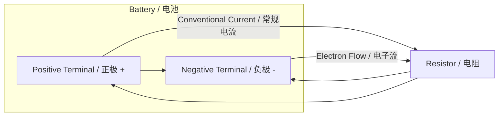
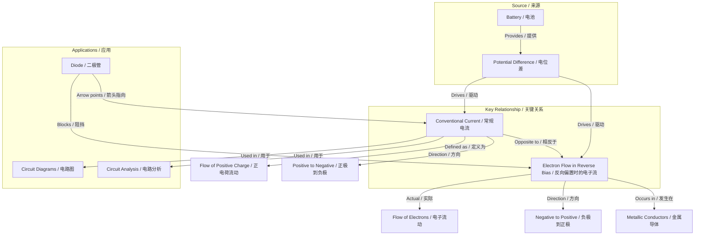

# Conventional Current vs Electron Flow / 常规电流与电子流

---

# 1. Overview / 概述

**English:**
This sub-topic addresses a fundamental conceptual distinction in electric circuit theory: the difference between **conventional current** (the direction positive charge would flow) and **electron flow** (the actual direction electrons move). While conventional current flows from positive to negative terminal in a circuit, electrons—being negatively charged—flow from negative to positive. This distinction is crucial for understanding circuit diagrams, component symbols (especially diodes and transistors), and avoiding sign errors in calculations. It connects directly to [[Definition of Electric Current]] and [[Charge Carriers (Electrons, Ions)]].

**中文:**
本子知识点探讨电路理论中的一个基本概念区分：**常规电流**（正电荷流动的方向）与**电子流**（电子实际移动的方向）之间的区别。虽然常规电流在电路中从正极流向负极，但带负电的电子实际上从负极流向正极。这一区别对于理解电路图、元件符号（特别是二极管和晶体管）以及避免计算中的符号错误至关重要。它与[[电流的定义]]和[[电荷载流子（电子、离子）]]直接相关。

---

# 2. Syllabus Learning Objectives / 考纲学习目标

| CAIE 9702 | Edexcel IAL |
|-----------|-------------|
| 9.1(a): State that conventional current is defined as the rate of flow of positive charge | 3.1: Understand the difference between conventional current and electron flow |
| 9.1(b): Explain the difference between conventional current and electron flow | 3.2: Use conventional current direction in circuit diagrams |
| 9.1(c): Use conventional current direction in circuit diagrams | 3.3: Explain the direction of electron flow in metallic conductors |
| 9.1(d): Describe the direction of electron flow in metallic conductors | 3.4: Apply the concept to semiconductor devices |

**Examiner Expectations / 考官期望:**
- **CAIE:** Students must state that conventional current is from positive to negative; electron flow is opposite. Be able to draw arrows on circuit diagrams showing conventional current direction.
- **Edexcel:** Students must understand both conventions and apply conventional current direction consistently in circuit analysis, especially with diodes and transistors.

---

# 3. Core Definitions / 核心定义

| Term (EN/CN) | Definition (EN) | Definition (CN) | Common Mistakes / 常见错误 |
|--------------|-----------------|-----------------|---------------------------|
| **Conventional Current** / 常规电流 | The direction in which positive charge would flow in a circuit; from the positive terminal to the negative terminal of a power supply. | 正电荷在电路中流动的方向；从电源正极流向负极。 | Thinking conventional current is the actual flow of positive particles (it's a convention, not reality). |
| **Electron Flow** / 电子流 | The actual movement of electrons in a metallic conductor; from the negative terminal to the positive terminal of a power supply. | 金属导体中电子的实际运动；从电源负极流向正极。 | Confusing electron flow direction with conventional current direction. |
| **Charge Carrier** / 电荷载流子 | A particle that carries electric charge through a conductor (e.g., electrons in metals, ions in electrolytes). | 在导体中携带电荷的粒子（例如金属中的电子、电解质中的离子）。 | Assuming all charge carriers are electrons (ions also carry charge). |
| **Circuit Convention** / 电路惯例 | The agreed-upon use of conventional current direction for drawing circuit diagrams and analyzing circuits. | 在绘制电路图和分析电路时约定使用的常规电流方向。 | Using electron flow direction in circuit analysis (leads to sign errors). |

---

# 4. Key Concepts Explained / 关键概念详解

## 4.1 Historical Origin / 历史起源

### Explanation / 解释
**English:** The concept of conventional current dates back to Benjamin Franklin in the 18th century. Franklin hypothesized that electricity flowed from positive to negative. At that time, the electron had not been discovered. When J.J. Thomson discovered the electron in 1897, it was found that electrons actually flow from negative to positive—the opposite direction. However, by then the conventional current convention was already deeply established in textbooks, circuit diagrams, and engineering practice. Rather than change everything, the scientific community kept the conventional current convention and simply noted that electron flow is opposite.

**中文:** 常规电流的概念可以追溯到18世纪的本杰明·富兰克林。富兰克林假设电流从正极流向负极。当时，电子尚未被发现。当J.J.汤姆逊在1897年发现电子时，发现电子实际上从负极流向正极——方向相反。然而，到那时，常规电流的惯例已经深深扎根于教科书、电路图和工程实践中。科学界没有改变一切，而是保留了常规电流的惯例，并指出电子流方向相反。

### Physical Meaning / 物理意义
**English:** The physical reality is that electrons move from negative to positive. The conventional current is a mathematical convenience that works because positive charge moving one way is equivalent to negative charge moving the opposite way (in terms of net current).

**中文:** 物理现实是电子从负极移动到正极。常规电流是一种数学上的便利，因为正电荷向一个方向移动等同于负电荷向相反方向移动（就净电流而言）。

### Common Misconceptions / 常见误区
- ❌ **Misconception:** Conventional current is the actual flow of positive particles.
  **Truth:** It's a convention—positive particles rarely flow in metallic circuits.
- ❌ **Misconception:** Electron flow is always opposite to conventional current.
  **Truth:** In metals, yes. In electrolytes, both positive and negative ions move.
- ❌ **Misconception:** You can use either convention in calculations.
  **Truth:** Always use conventional current for circuit analysis to avoid sign errors.

### Exam Tips / 考试提示
- ✅ Always draw conventional current arrows (positive to negative) on circuit diagrams.
- ✅ When asked "direction of current," assume conventional current unless specified otherwise.
- ✅ For electron flow questions, explicitly state "from negative to positive."
- ✅ In semiconductor devices (diodes, transistors), conventional current direction is essential.

> 📷 **IMAGE PROMPT — CC-01: Conventional Current vs Electron Flow Diagram**
> A clear circuit diagram showing a battery connected to a resistor. Two arrows: one red arrow labeled "Conventional Current (I)" pointing from positive terminal to negative terminal through the circuit; one blue arrow labeled "Electron Flow" pointing from negative terminal to positive terminal through the circuit. Labels: Battery (+ and - terminals), Resistor, connecting wires. Clean, educational style with contrasting colors.

---

# 5. Essential Equations / 核心公式

## 5.1 Current Definition / 电流定义

$$ I = \frac{\Delta Q}{\Delta t} $$

| Symbol (符号) | Meaning (EN) | Meaning (CN) | Unit (单位) |
|--------------|-------------|-------------|------------|
| $I$ | Electric current | 电流 | A (amperes) |
| $\Delta Q$ | Charge passing a point | 通过某点的电荷量 | C (coulombs) |
| $\Delta t$ | Time interval | 时间间隔 | s (seconds) |

**Derivation / 推导:** This is the definition of current. It applies to both conventional current and electron flow—the magnitude is the same, only the direction differs.

**Conditions / 适用条件:** 
- **English:** Applies to steady currents and average current over a time interval.
- **中文:** 适用于稳定电流和一段时间内的平均电流。

**Limitations / 局限性:**
- **English:** Does not describe instantaneous current variations; for that, use $I = dQ/dt$.
- **中文:** 不描述瞬时电流变化；需要使用 $I = dQ/dt$。

## 5.2 Relationship Between Current and Electron Flow / 电流与电子流的关系

$$ I_{\text{conventional}} = -I_{\text{electron flow}} $$

| Symbol (符号) | Meaning (EN) | Meaning (CN) | Unit (单位) |
|--------------|-------------|-------------|------------|
| $I_{\text{conventional}}$ | Conventional current (positive to negative) | 常规电流（正极到负极） | A |
| $I_{\text{electron flow}}$ | Electron flow (negative to positive) | 电子流（负极到正极） | A |

**Derivation / 推导:** Since electrons carry negative charge ($-e$), their movement in one direction is equivalent to positive charge moving in the opposite direction. The magnitude of current is the same; only the sign differs.

**Conditions / 适用条件:**
- **English:** Only valid for metallic conductors where electrons are the sole charge carriers.
- **中文:** 仅适用于电子是唯一电荷载流子的金属导体。

**Limitations / 局限性:**
- **English:** In electrolytes or semiconductors, both positive and negative charge carriers move, making the relationship more complex.
- **中文:** 在电解质或半导体中，正负电荷载流子都会移动，关系更为复杂。

---

# 6. Graphs and Relationships / 图表与关系

## 6.1 Current Direction in a Simple Circuit / 简单电路中的电流方向

### Axes / 坐标轴
- **English:** Not a graph—this is a circuit diagram showing direction conventions.
- **中文:** 不是图表——这是显示方向惯例的电路图。

### Shape / 形状
- **English:** A closed loop circuit with a battery, resistor, and connecting wires.
- **中文:** 一个包含电池、电阻和连接导线的闭合回路。

### Gradient Meaning / 斜率含义
- **English:** N/A (circuit diagram, not a graph).
- **中文:** 不适用（电路图，不是图表）。

### Area Meaning / 面积含义
- **English:** N/A.
- **中文:** 不适用。

### Exam Interpretation / 考试解读
- **English:** Students must be able to draw arrows on circuit diagrams showing conventional current direction (from + to -) and electron flow direction (from - to +).
- **中文:** 学生必须能够在电路图上画出箭头，显示常规电流方向（从+到-）和电子流方向（从-到+）。

---

# 7. Required Diagrams / 必备图表

## 7.1 Conventional Current vs Electron Flow in a Simple Circuit / 简单电路中的常规电流与电子流

### Description / 描述
**English:** A simple DC circuit consisting of a battery, a resistor, and connecting wires. Two sets of arrows are shown: red arrows indicating conventional current direction (positive to negative) and blue arrows indicating electron flow direction (negative to positive). The battery terminals are clearly labeled (+ and -).

**中文:** 一个由电池、电阻和连接导线组成的简单直流电路。显示两组箭头：红色箭头表示常规电流方向（正极到负极），蓝色箭头表示电子流方向（负极到正极）。电池端子清晰标注（+和-）。

### Image Prompt / 图片生成提示
> 📷 **IMAGE PROMPT — CC-02: Simple Circuit Direction Conventions**
> A clean, educational circuit diagram. A 9V battery on the left with clearly marked + and - terminals. A resistor on the right. Connecting wires form a complete loop. Two curved arrows along the wire: a thick red arrow labeled "Conventional Current (I)" pointing clockwise from battery + through resistor to battery -; a dashed blue arrow labeled "Electron Flow" pointing counterclockwise from battery - through resistor to battery +. Labels: "Battery", "Resistor", "Conventional Current", "Electron Flow". White background, high contrast, suitable for textbook.

### Labels Required / 需要标注
- **English:** Battery (+ terminal, - terminal), Resistor, Conventional Current arrow (red), Electron Flow arrow (blue), direction labels.
- **中文:** 电池（正极、负极）、电阻、常规电流箭头（红色）、电子流箭头（蓝色）、方向标签。

### Exam Importance / 考试重要性
- **English:** High—this diagram is frequently tested in both CAIE and Edexcel exams. Students must be able to draw and label it correctly.
- **中文:** 高——该图表在CAIE和Edexcel考试中经常出现。学生必须能够正确绘制和标注。

## 7.2 Diode Circuit Showing Conventional Current / 显示常规电流的二极管电路

### Description / 描述
**English:** A circuit with a battery, a diode, and a resistor. The diode is shown with its arrow symbol pointing in the direction of conventional current (from anode to cathode). When the diode is forward-biased, conventional current flows through it; when reverse-biased, no current flows.

**中文:** 一个包含电池、二极管和电阻的电路。二极管用箭头符号表示，箭头指向常规电流方向（从阳极到阴极）。当二极管正向偏置时，常规电流通过；当反向偏置时，无电流通过。

### Image Prompt / 图片生成提示
> 📷 **IMAGE PROMPT — CC-03: Diode and Conventional Current**
> A circuit diagram with a battery (9V), a diode (standard triangle-and-line symbol), and a resistor in series. The diode's triangle points from left to right (anode to cathode). A red arrow labeled "Conventional Current" flows from battery + through the diode (in the direction of the triangle) to the resistor and back to battery -. Below, a second diagram shows the same circuit but with the diode reversed (triangle pointing left), and a red "X" over the circuit indicating no current flows. Labels: "Forward Bias", "Reverse Bias", "Anode", "Cathode". Educational style.

### Labels Required / 需要标注
- **English:** Battery (+/-), Diode (Anode, Cathode), Resistor, Conventional Current arrow, Forward Bias, Reverse Bias.
- **中文:** 电池（正/负）、二极管（阳极、阴极）、电阻、常规电流箭头、正向偏置、反向偏置。

### Exam Importance / 考试重要性
- **English:** High—Edexcel specifically tests understanding of conventional current direction in semiconductor devices.
- **中文:** 高——Edexcel特别测试对半导体器件中常规电流方向的理解。

---

# 8. Worked Examples / 典型例题

## Example 1: Direction Conventions / 方向惯例

### Question / 题目
**English:** A simple circuit consists of a 6V battery connected to a lamp. Draw the circuit diagram and clearly indicate:
(a) The direction of conventional current
(b) The direction of electron flow
(c) Explain why the two directions are opposite.

**中文:** 一个简单电路由6V电池连接到一个灯泡组成。画出电路图并清晰标注：
(a) 常规电流的方向
(b) 电子流的方向
(c) 解释为什么这两个方向相反。

### Solution / 解答
**Step 1: Draw the circuit diagram / 步骤1：画出电路图**
- Battery with + and - terminals clearly labeled.
- Lamp (resistor symbol) connected in series.
- Complete closed loop.

**Step 2: Indicate conventional current / 步骤2：标注常规电流**
- Red arrow from battery + terminal, through the lamp, to battery - terminal.
- Label: "Conventional Current (I)"

**Step 3: Indicate electron flow / 步骤3：标注电子流**
- Blue arrow from battery - terminal, through the lamp, to battery + terminal.
- Label: "Electron Flow"

**Step 4: Explanation / 步骤4：解释**
- **English:** Conventional current is defined as the direction positive charge would flow. Since electrons are negatively charged, they are attracted to the positive terminal and repelled from the negative terminal. Therefore, electrons flow from negative to positive—opposite to conventional current.
- **中文:** 常规电流被定义为正电荷流动的方向。由于电子带负电，它们被正极吸引，被负极排斥。因此，电子从负极流向正极——与常规电流方向相反。

### Final Answer / 最终答案
**Answer:** Diagram with correct arrows and explanation. | **答案：** 带有正确箭头和解释的图表。

### Quick Tip / 提示
- **English:** Remember: "Conventional Current goes from + to -; Electrons go from - to +." Use the mnemonic: "C for Conventional = C for Correct direction in circuit analysis."
- **中文:** 记住："常规电流从+到-；电子从-到+。"使用记忆法："C代表常规电流 = C代表电路分析中的正确方向。"

## Example 2: Current Direction in a Diode / 二极管中的电流方向

### Question / 题目
**English:** A diode is connected in a circuit with a 12V battery and a 100Ω resistor. The diode's anode is connected to the positive terminal of the battery. 
(a) Is the diode forward-biased or reverse-biased?
(b) Draw the circuit and show the direction of conventional current.
(c) Explain what happens to electron flow in this configuration.

**中文:** 一个二极管与12V电池和100Ω电阻连接在电路中。二极管的阳极连接到电池的正极。
(a) 二极管是正向偏置还是反向偏置？
(b) 画出电路并显示常规电流的方向。
(c) 解释在这种配置下电子流会发生什么。

### Solution / 解答
**Step 1: Determine bias / 步骤1：确定偏置**
- **English:** Anode connected to + terminal, cathode connected through resistor to - terminal. This is forward bias—the diode allows current to flow.
- **中文:** 阳极连接到正极，阴极通过电阻连接到负极。这是正向偏置——二极管允许电流通过。

**Step 2: Draw circuit / 步骤2：画出电路**
- Battery (12V) with + on left, - on right.
- Diode symbol (triangle pointing right) with anode on left, cathode on right.
- 100Ω resistor after the diode.
- Red arrow: Conventional current from battery + → diode anode → diode cathode → resistor → battery -.

**Step 3: Explain electron flow / 步骤3：解释电子流**
- **English:** Electrons flow from the battery's negative terminal, through the resistor, to the diode's cathode. In forward bias, electrons can cross the junction from cathode to anode (opposite to the triangle direction). Then they continue to the battery's positive terminal. So electron flow is opposite to conventional current.
- **中文:** 电子从电池负极流出，通过电阻，到达二极管的阴极。在正向偏置下，电子可以从阴极穿过结到达阳极（与三角形方向相反）。然后它们继续流向电池的正极。所以电子流与常规电流方向相反。

### Final Answer / 最终答案
**Answer:** (a) Forward-biased. (b) Diagram with conventional current arrow from + to - through the diode. (c) Electron flow is from - to +, opposite to conventional current. | **答案：** (a) 正向偏置。(b) 带有常规电流箭头（从+到-通过二极管）的图表。(c) 电子流从-到+，与常规电流方向相反。

### Quick Tip / 提示
- **English:** The diode's arrow symbol points in the direction of conventional current (from anode to cathode). This is a key exam point.
- **中文:** 二极管的箭头符号指向常规电流的方向（从阳极到阴极）。这是一个关键的考试点。

---

# 9. Past Paper Question Types / 历年真题题型

| Question Type / 题型 | Frequency / 频率 | Difficulty / 难度 | Past Paper References / 真题索引 |
|----------------------|------------------|------------------|-------------------------------|
| Draw circuit with direction arrows / 画出带有方向箭头的电路 | High / 高 | Easy / 简单 | 📝 *待填入* |
| Explain difference between conventional current and electron flow / 解释常规电流与电子流的区别 | Medium / 中 | Easy / 简单 | 📝 *待填入* |
| Diode bias and current direction / 二极管偏置与电流方向 | Medium / 中 | Medium / 中等 | 📝 *待填入* |
| Multiple choice on current direction / 关于电流方向的选择题 | High / 高 | Easy / 简单 | 📝 *待填入* |

**Common Command Words / 常见指令词:**
- **English:** State, Explain, Draw, Show, Indicate, Describe
- **中文:** 陈述、解释、画出、显示、标注、描述

---

# 10. Practical Skills Connections / 实验技能链接

**English:**
This sub-topic connects to practical work in the following ways:
1. **Circuit Construction:** When building circuits, students must understand that the direction of conventional current determines how components (especially diodes, LEDs, and transistors) are connected.
2. **Ammeter Connection:** Ammeters must be connected in series with the correct polarity—conventional current enters the positive terminal of the ammeter.
3. **Voltmeter Connection:** Voltmeters are connected in parallel, with the positive terminal connected to the higher potential side (where conventional current enters).
4. **Oscilloscope Traces:** Understanding current direction helps interpret oscilloscope traces showing voltage variations.
5. **Uncertainty Consideration:** While direction doesn't affect uncertainty calculations, incorrect polarity can damage instruments.

**中文:**
本子知识点与实验工作的联系如下：
1. **电路搭建：** 搭建电路时，学生必须理解常规电流的方向决定了元件（特别是二极管、LED和晶体管）的连接方式。
2. **电流表连接：** 电流表必须串联连接，且极性正确——常规电流从电流表的正极流入。
3. **电压表连接：** 电压表并联连接，正极连接到电位较高的一侧（常规电流进入的地方）。
4. **示波器波形：** 理解电流方向有助于解释显示电压变化的示波器波形。
5. **不确定度考虑：** 虽然方向不影响不确定度计算，但错误的极性可能会损坏仪器。

---

# 11. Concept Map / 概念图谱

---

# 12. Quick Revision Sheet / 速查表

| Category / 类别 | Key Points / 要点 |
|----------------|------------------|
| **Definition / 定义** | Conventional current = flow of positive charge (+ to -). Electron flow = actual electron movement (- to +). / 常规电流 = 正电荷流动（+到-）。电子流 = 电子实际运动（-到+）。 |
| **Key Formula / 核心公式** | $I = \Delta Q / \Delta t$ (same magnitude for both conventions) / 两个惯例的电流大小相同 |
| **Key Graph / 核心图表** | Circuit diagram with red arrow (conventional) and blue arrow (electron flow) in opposite directions / 电路图中红色箭头（常规）和蓝色箭头（电子流）方向相反 |
| **Exam Tip / 考试提示** | Always use conventional current direction in circuit analysis. For electron flow questions, explicitly state "from negative to positive." / 在电路分析中始终使用常规电流方向。对于电子流问题，明确说明"从负极到正极"。 |
| **Common Mistake / 常见错误** | Using electron flow direction in circuit analysis (leads to sign errors with diodes, transistors) / 在电路分析中使用电子流方向（导致二极管、晶体管的符号错误） |
| **Diode Rule / 二极管规则** | Diode arrow points in direction of conventional current (anode to cathode) / 二极管箭头指向常规电流方向（阳极到阴极） |
| **Historical Note / 历史注记** | Franklin chose + to - before electrons were discovered. Convention kept for consistency. / 富兰克林在发现电子之前选择了+到-。为保持一致性而保留此惯例。 |

---

> 📋 **CIE Only:** CAIE 9702 specifically requires students to "state that conventional current is defined as the rate of flow of positive charge" (9.1a) and "explain the difference between conventional current and electron flow" (9.1b). Expect direct questions on this distinction in Paper 1 (multiple choice) and Paper 2 (structured questions).

> 📋 **Edexcel Only:** Edexcel IAL WPH11 U2 places greater emphasis on applying conventional current direction to semiconductor devices (diodes, transistors). Questions often involve determining whether a diode is forward or reverse biased based on conventional current direction.