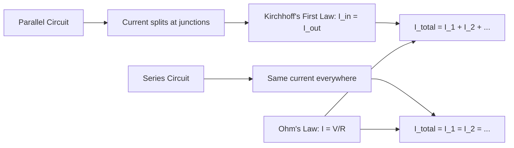
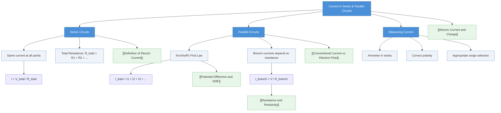

# Current in Series and Parallel Circuits / 串联与并联电路中的电流

---

# 1. Overview / 概述

**English:**
This sub-topic explores how electric current behaves when components are connected in series and parallel configurations. In a **series circuit**, components are connected end-to-end along a single path, meaning the same current flows through every component. In a **parallel circuit**, components are connected across the same two points, creating multiple paths for current to flow — the total current splits between the branches. Understanding current distribution in these configurations is fundamental to analysing all electrical circuits, from simple household wiring to complex electronic systems. This knowledge directly links to [[Potential Difference and EMD]] and [[Resistance and Resistivity]], as current behaviour is inseparable from voltage and resistance relationships.

**中文:**
本子知识点探讨当元件以串联和并联方式连接时，电流的行为。在**串联电路**中，元件首尾相连形成单一路径，因此通过每个元件的电流相同。在**并联电路**中，元件连接在相同的两点之间，形成多条电流路径——总电流在各支路之间分配。理解这些配置中的电流分布是分析所有电路的基础，从简单的家庭布线到复杂的电子系统。本知识与[[Potential Difference and EMF|电势差与电动势]]和[[Resistance and Resistivity|电阻与电阻率]]直接相关，因为电流行为与电压和电阻关系密不可分。

---

# 2. Syllabus Learning Objectives / 考纲学习目标

| CAIE 9702 | Edexcel IAL |
|-----------|-------------|
| 9.1(a) State that current is the same at all points in a series circuit | 3.1 Explain that current is the same at all points in a series circuit |
| 9.1(b) State that the sum of currents in the branches of a parallel circuit equals the current from the supply | 3.2 Explain that the sum of currents entering a junction equals the sum leaving (Kirchhoff's first law) |
| 9.1(c) Recall and use the equation $I = V/R$ in circuit calculations | 3.3 Apply $I = V/R$ to series and parallel circuits |
| 9.1(d) Describe how to measure current using an ammeter | 3.4 Describe the use of ammeters in series and parallel circuits |

**Examiner Expectations / 考官期望:**
- **English:** Students must be able to predict current values in series and parallel circuits, explain why current behaves as it does using charge conservation, and correctly connect ammeters in circuits.
- **中文:** 学生必须能够预测串联和并联电路中的电流值，使用电荷守恒解释电流行为的原因，并正确连接电流表到电路中。

---

# 3. Core Definitions / 核心定义

| Term (EN/CN) | Definition (EN) | Definition (CN) | Common Mistakes / 常见错误 |
|--------------|-----------------|-----------------|---------------------------|
| **Series Circuit** / 串联电路 | A circuit where components are connected end-to-end along a single conducting path | 元件首尾相连形成单一导电路径的电路 | Confusing with parallel; thinking current "uses up" as it goes |
| **Parallel Circuit** / 并联电路 | A circuit where components are connected across the same two points, providing multiple conducting paths | 元件连接在相同两点之间，提供多条导电路径的电路 | Thinking current is the same in all branches |
| **Junction** / 节点 | A point in a circuit where three or more conductors meet | 电路中三个或更多导体交汇的点 | Forgetting that a junction is where current splits or combines |
| **Branch** / 支路 | A single conducting path in a parallel circuit between two junctions | 并联电路中两个节点之间的单一导电路径 | Confusing branch with the whole circuit |
| **Ammeter** / 电流表 | A device used to measure electric current, connected in series with the component | 用于测量电流的装置，与元件串联连接 | Connecting ammeter in parallel (causes short circuit) |
| **Kirchhoff's First Law** / 基尔霍夫第一定律 | The sum of currents entering a junction equals the sum of currents leaving the junction (conservation of charge) | 流入节点的电流之和等于流出节点的电流之和（电荷守恒） | Forgetting direction matters; applying to series circuits incorrectly |

---

# 4. Key Concepts Explained / 关键概念详解

## 4.1 Current in Series Circuits / 串联电路中的电流

### Explanation / 解释
**English:** In a series circuit, there is only one path for charge to flow. Since charge cannot be created or destroyed (conservation of charge), the same number of charge carriers must pass through every point in the circuit per unit time. Therefore, **the current is the same at all points in a series circuit**, regardless of the components placed in the circuit. This means an ammeter placed anywhere in a series circuit will read the same value.

**中文:** 在串联电路中，电荷只有一条路径可以流动。由于电荷不能创造或消灭（电荷守恒），每单位时间内通过电路中每一点的电荷载流子数量必须相同。因此，**串联电路中所有点的电流都相同**，无论电路中放置了什么元件。这意味着电流表放在串联电路中的任何位置都会显示相同的读数。

### Physical Meaning / 物理意义
**English:** Imagine a single-lane road — every car must pass through every point on the road. Similarly, every charge carrier must pass through every component in a series circuit. The current is like the flow rate of cars; it's the same everywhere.

**中文:** 想象一条单车道道路——每辆车必须经过道路上的每一点。同样，每个电荷载流子必须经过串联电路中的每个元件。电流就像汽车的流量；在任何地方都相同。

### Common Misconceptions / 常见误区
- ❌ **"Current is used up by components"** — Current is not "consumed"; charge carriers simply transfer energy and continue flowing.
- ❌ **"Current decreases after a resistor"** — In series, current is the same before and after any component.
- ❌ **"More components means less current everywhere"** — While total current may decrease (due to increased resistance), it remains the same at all points.

### Exam Tips / 考试提示
- ✅ Always state "current is the same at all points in a series circuit" when explaining.
- ✅ When calculating current in series, use total resistance $R_{total} = R_1 + R_2 + ...$ and $I = V_{total} / R_{total}$.
- ✅ Remember: ammeters must be placed **in series** with the component being measured.

> 📷 **IMAGE PROMPT — SERIES-CURRENT: Series Circuit Current Distribution**
> A simple series circuit with a battery, two resistors, and an ammeter. Arrows of equal size show current flowing through each component. Labels: "Same current I at all points". Clean, educational style with colour-coded wires.

## 4.2 Current in Parallel Circuits / 并联电路中的电流

### Explanation / 解释
**English:** In a parallel circuit, charge has multiple paths to follow. At a junction, the current divides between the available branches. According to **Kirchhoff's First Law** (conservation of charge), the sum of currents entering a junction equals the sum of currents leaving that junction. Therefore, the total current from the supply equals the sum of the currents in each parallel branch: $I_{total} = I_1 + I_2 + I_3 + ...$

The current in each branch depends on the resistance of that branch — lower resistance branches carry more current (since $I = V/R$ and voltage is the same across parallel branches).

**中文:** 在并联电路中，电荷有多条路径可以选择。在节点处，电流在可用的支路之间分配。根据**基尔霍夫第一定律**（电荷守恒），流入节点的电流之和等于流出该节点的电流之和。因此，电源的总电流等于每个并联支路中的电流之和：$I_{总} = I_1 + I_2 + I_3 + ...$

每个支路中的电流取决于该支路的电阻——电阻较小的支路承载更多电流（因为 $I = V/R$ 且并联支路两端的电压相同）。

### Physical Meaning / 物理意义
**English:** Think of a multi-lane highway — cars can choose different lanes. The total number of cars passing per minute is the sum of cars in each lane. If one lane is blocked (high resistance), fewer cars use it. Similarly, in a parallel circuit, charge distributes itself based on the ease of each path.

**中文:** 想象一条多车道高速公路——汽车可以选择不同的车道。每分钟通过的汽车总数是每条车道上汽车数量的总和。如果一条车道被阻塞（高电阻），使用它的汽车就少。同样，在并联电路中，电荷根据每条路径的容易程度分配自己。

### Common Misconceptions / 常见误区
- ❌ **"Current is the same in all branches"** — Only if all branches have identical resistance.
- ❌ **"Current splits equally"** — Only if all branches have the same resistance.
- ❌ **"Adding more branches increases current in existing branches"** — Adding a branch provides an additional path, reducing total resistance and increasing total current, but the current in existing branches remains the same (since voltage across them is unchanged).

### Exam Tips / 考试提示
- ✅ Use Kirchhoff's First Law: $I_{in} = I_{out}$ at any junction.
- ✅ For parallel circuits, remember voltage is the same across all branches — use $I = V/R$ for each branch.
- ✅ When measuring current in a branch, the ammeter must be placed **in series with that branch**.
- ✅ To measure total current, place the ammeter before or after the parallel combination (in the main line).

> 📷 **IMAGE PROMPT — PARALLEL-CURRENT: Parallel Circuit Current Distribution**
> A parallel circuit with a battery and three resistors in separate branches. Arrows of different sizes show current splitting at the junction. Labels: "I_total = I1 + I2 + I3" and "I1 > I2 > I3" (if R1 < R2 < R3). Clean educational diagram.

## 4.3 Measuring Current with Ammeters / 用电流表测量电流

### Explanation / 解释
**English:** An ammeter is a device that measures the current flowing through it. To measure the current through a specific component, the ammeter must be connected **in series** with that component — meaning the current must flow through the ammeter itself. An ideal ammeter has **zero resistance** so it does not affect the circuit. In practice, ammeters have very low resistance.

**中文:** 电流表是一种测量通过它的电流的装置。要测量通过特定元件的电流，电流表必须与该元件**串联**连接——这意味着电流必须流过电流表本身。理想电流表具有**零电阻**，因此不影响电路。实际上，电流表的电阻非常低。

### Key Rules / 关键规则
- **Series connection:** Ammeter must be in series with the component being measured.
- **Polarity:** Connect the positive terminal of the ammeter to the positive side of the circuit.
- **Range:** Choose an appropriate range to avoid damaging the meter.
- **Parallel connection is dangerous:** Connecting an ammeter in parallel creates a short circuit (very low resistance path), which can damage the meter and the circuit.

> 📋 **CIE Only:** Students must be able to describe how to set up an ammeter in a circuit diagram and in a real circuit.
> 📋 **Edexcel Only:** Students should understand the concept of an ideal ammeter having zero internal resistance.

---

# 5. Essential Equations / 核心公式

## 5.1 Series Circuit Current / 串联电路电流

$$ I_{total} = I_1 = I_2 = I_3 = ... $$

| Symbol (符号) | Meaning (EN) | Meaning (CN) | Unit (单位) |
|--------------|-------------|-------------|------------|
| $I_{total}$ | Total current from supply | 电源总电流 | A (amperes) |
| $I_1, I_2, I_3$ | Current through each component | 通过每个元件的电流 | A (amperes) |

**Conditions / 适用条件:** All components are connected in a single loop with no junctions.
**Limitations / 局限性:** Does not apply to parallel circuits or circuits with junctions.

## 5.2 Parallel Circuit Current (Kirchhoff's First Law) / 并联电路电流（基尔霍夫第一定律）

$$ I_{total} = I_1 + I_2 + I_3 + ... $$

$$ \sum I_{in} = \sum I_{out} $$

| Symbol (符号) | Meaning (EN) | Meaning (CN) | Unit (单位) |
|--------------|-------------|-------------|------------|
| $I_{total}$ | Total current from supply | 电源总电流 | A |
| $I_1, I_2, I_3$ | Current in each branch | 每个支路的电流 | A |
| $\sum I_{in}$ | Sum of currents entering a junction | 流入节点的电流之和 | A |
| $\sum I_{out}$ | Sum of currents leaving a junction | 流出节点的电流之和 | A |

**Conditions / 适用条件:** Applies at any junction in any circuit.
**Limitations / 局限性:** Requires correct identification of current direction at junctions.

## 5.3 Current from Voltage and Resistance / 从电压和电阻计算电流

$$ I = \frac{V}{R} $$

| Symbol (符号) | Meaning (EN) | Meaning (CN) | Unit (单位) |
|--------------|-------------|-------------|------------|
| $I$ | Current | 电流 | A |
| $V$ | Potential difference (voltage) | 电势差（电压） | V (volts) |
| $R$ | Resistance | 电阻 | $\Omega$ (ohms) |

**Derivation / 推导:** This is Ohm's law, derived experimentally. For a conductor at constant temperature, current is proportional to voltage.
**Conditions / 适用条件:** Ohmic conductors at constant temperature.
**Limitations / 局限性:** Does not apply to non-ohmic conductors (e.g., diodes, filament lamps at varying temperature).

> 📷 **IMAGE PROMPT — FORMULA-DIAGRAM: Ohm's Law Triangle**
> A triangle divided into three sections: V at top, I at bottom left, R at bottom right. Arrows show: V = I×R, I = V/R, R = V/I. Clean, simple educational graphic.

---

# 6. Graphs and Relationships / 图表与关系

## 6.1 Current vs Position in Series Circuit / 串联电路中电流与位置的关系

### Axes / 坐标轴
- **X-axis:** Position along the circuit (元件位置)
- **Y-axis:** Current / A (电流 / 安培)

### Shape / 形状
A horizontal straight line — current is constant at all positions.

### Gradient Meaning / 斜率含义
Gradient = 0 — current does not change with position.

### Area Meaning / 面积含义
No meaningful area.

### Exam Interpretation / 考试解读
- **English:** If asked to sketch current vs position for a series circuit, draw a horizontal line. Any variation indicates a misunderstanding.
- **中文:** 如果要求画出串联电路中电流与位置的关系图，画一条水平线。任何变化都表明理解有误。

## 6.2 Current in Branches vs Resistance of Branch / 支路电流与支路电阻的关系

### Axes / 坐标轴
- **X-axis:** Resistance of branch / $\Omega$ (支路电阻 / 欧姆)
- **Y-axis:** Current in branch / A (支路电流 / 安培)

### Shape / 形状
A decreasing curve — $I \propto 1/R$ (inverse relationship) for constant voltage across parallel branches.

### Gradient Meaning / 斜率含义
Gradient is negative and decreasing in magnitude — rate of change of current with resistance decreases as resistance increases.

### Area Meaning / 面积含义
No meaningful area.

### Exam Interpretation / 考试解读
- **English:** The graph shows that lower resistance branches carry more current. This is why adding a low-resistance branch (like a short circuit) can cause very high currents.
- **中文:** 该图显示电阻较低的支路承载更多电流。这就是为什么添加低电阻支路（如短路）会导致非常高的电流。

---

# 7. Required Diagrams / 必备图表

## 7.1 Series Circuit with Ammeter / 带电流表的串联电路

### Description / 描述
**English:** A simple series circuit showing a cell (battery), two resistors, and an ammeter connected in series. Arrows indicate current direction (conventional current from positive to negative). Labels show that current is the same at all points.

**中文:** 一个简单的串联电路，显示一个电池、两个电阻和一个串联连接的电流表。箭头指示电流方向（常规电流从正极到负极）。标签显示所有点的电流相同。

### Image Prompt / 图片生成提示
> 📷 **IMAGE PROMPT — DIAG-SERIES: Series Circuit with Ammeter**
> A clean educational diagram of a series circuit. Components: a 6V battery (two cells), two resistors (R1 = 10Ω, R2 = 20Ω), and an ammeter (A) all connected in a single loop with wires. Arrows of equal size show conventional current flowing clockwise. Labels: "I = 0.2A at all points". Circuit symbols should be standard IEC symbols. White background, clear lines, colour-coded wires (red for positive, black for negative).

### Labels Required / 需要标注
- Battery (电池) with + and - terminals
- Resistor R1 (电阻R1) and Resistor R2 (电阻R2)
- Ammeter A (电流表A)
- Current arrows (电流箭头) — same size everywhere
- "I = constant" (电流恒定)

### Exam Importance / 考试重要性
- **English:** This is the most common diagram for explaining current in series circuits. Students must be able to draw and interpret it.
- **中文:** 这是解释串联电路电流最常见的图表。学生必须能够绘制和解读它。

## 7.2 Parallel Circuit with Ammeters / 带电流表的并联电路

### Description / 描述
**English:** A parallel circuit showing a cell, three resistors in parallel branches, and ammeters placed to measure total current and current in each branch. Arrows of different sizes show current distribution.

**中文:** 一个并联电路，显示一个电池、三个并联支路中的电阻，以及用于测量总电流和每个支路电流的电流表。不同大小的箭头显示电流分布。

### Image Prompt / 图片生成提示
> 📷 **IMAGE PROMPT — DIAG-PARALLEL: Parallel Circuit with Multiple Ammeters**
> A clean educational diagram of a parallel circuit. Components: a 12V battery, three resistors in parallel (R1 = 6Ω, R2 = 12Ω, R3 = 24Ω), ammeter A0 in the main line (before the junction), ammeters A1, A2, A3 in each branch. Arrows of different sizes show current splitting: largest arrow at A0, then A1 (largest branch current), A2 (medium), A3 (smallest). Labels: "I_total = I1 + I2 + I3". Standard circuit symbols, white background.

### Labels Required / 需要标注
- Battery (电池) with voltage
- Resistors R1, R2, R3 (电阻R1, R2, R3)
- Ammeters A0 (total), A1, A2, A3 (电流表A0总电流, A1, A2, A3)
- Junction points (节点)
- Current arrows of different sizes (不同大小的电流箭头)
- "I_total = I1 + I2 + I3" (总电流 = 支路电流之和)

### Exam Importance / 考试重要性
- **English:** Essential for understanding current distribution in parallel circuits and Kirchhoff's First Law.
- **中文:** 对于理解并联电路中的电流分布和基尔霍夫第一定律至关重要。

---

# 8. Worked Examples / 典型例题

## Example 1: Series Circuit Current Calculation / 串联电路电流计算

### Question / 题目
**English:**
A series circuit contains a 12V battery and two resistors: R₁ = 4Ω and R₂ = 8Ω.
(a) Calculate the total current in the circuit.
(b) State the current through R₁ and through R₂.

**中文:**
一个串联电路包含一个12V电池和两个电阻：R₁ = 4Ω 和 R₂ = 8Ω。
(a) 计算电路中的总电流。
(b) 说明通过R₁和通过R₂的电流。

### Solution / 解答

**Step 1: Calculate total resistance**
$$ R_{total} = R_1 + R_2 = 4\ \Omega + 8\ \Omega = 12\ \Omega $$

**Step 2: Apply Ohm's law to find total current**
$$ I_{total} = \frac{V_{total}}{R_{total}} = \frac{12\ \text{V}}{12\ \Omega} = 1.0\ \text{A} $$

**Step 3: State current through each resistor**
In a series circuit, current is the same at all points:
$$ I_1 = I_2 = I_{total} = 1.0\ \text{A} $$

### Final Answer / 最终答案
**Answer:** (a) $I_{total} = 1.0\ \text{A}$ | (b) $I_1 = I_2 = 1.0\ \text{A}$
**答案：** (a) $I_{总} = 1.0\ \text{A}$ | (b) $I_1 = I_2 = 1.0\ \text{A}$

### Quick Tip / 提示
**English:** In series circuits, always find total resistance first, then use Ohm's law. Remember current is the same everywhere — don't recalculate for each component!
**中文:** 在串联电路中，总是先求总电阻，然后使用欧姆定律。记住电流处处相同——不要为每个元件重新计算！

---

## Example 2: Parallel Circuit Current Calculation / 并联电路电流计算

### Question / 题目
**English:**
A 24V battery is connected to three resistors in parallel: R₁ = 6Ω, R₂ = 12Ω, R₃ = 24Ω.
(a) Calculate the current in each branch.
(b) Calculate the total current from the battery.

**中文:**
一个24V电池连接到三个并联电阻：R₁ = 6Ω, R₂ = 12Ω, R₃ = 24Ω。
(a) 计算每个支路中的电流。
(b) 计算电池提供的总电流。

### Solution / 解答

**Step 1: Calculate current in each branch using $I = V/R$**
(Voltage across each branch = 24V in parallel)

$$ I_1 = \frac{V}{R_1} = \frac{24\ \text{V}}{6\ \Omega} = 4.0\ \text{A} $$

$$ I_2 = \frac{V}{R_2} = \frac{24\ \text{V}}{12\ \Omega} = 2.0\ \text{A} $$

$$ I_3 = \frac{V}{R_3} = \frac{24\ \text{V}}{24\ \Omega} = 1.0\ \text{A} $$

**Step 2: Apply Kirchhoff's First Law to find total current**
$$ I_{total} = I_1 + I_2 + I_3 = 4.0 + 2.0 + 1.0 = 7.0\ \text{A} $$

### Final Answer / 最终答案
**Answer:** (a) $I_1 = 4.0\ \text{A}$, $I_2 = 2.0\ \text{A}$, $I_3 = 1.0\ \text{A}$ | (b) $I_{total} = 7.0\ \text{A}$
**答案：** (a) $I_1 = 4.0\ \text{A}$, $I_2 = 2.0\ \text{A}$, $I_3 = 1.0\ \text{A}$ | (b) $I_{总} = 7.0\ \text{A}$

### Quick Tip / 提示
**English:** In parallel circuits, voltage is the same across all branches — use $I = V/R$ for each branch individually. Then sum the branch currents. The branch with the smallest resistance carries the most current.
**中文:** 在并联电路中，所有支路两端的电压相同——对每个支路分别使用 $I = V/R$。然后将支路电流相加。电阻最小的支路承载的电流最大。

---

# 9. Past Paper Question Types / 历年真题题型

| Question Type / 题型 | Frequency / 频率 | Difficulty / 难度 | Past Paper References / 真题索引 |
|----------------------|------------------|------------------|-------------------------------|
| Calculate current in series circuit | ⭐⭐⭐⭐⭐ Very High | ⭐⭐ Easy | 📝 *待填入* |
| Calculate current in parallel circuit | ⭐⭐⭐⭐⭐ Very High | ⭐⭐⭐ Medium | 📝 *待填入* |
| Explain why current is same in series | ⭐⭐⭐⭐ High | ⭐⭐ Easy | 📝 *待填入* |
| Kirchhoff's First Law application | ⭐⭐⭐⭐ High | ⭐⭐⭐ Medium | 📝 *待填入* |
| Ammeter connection in circuit diagram | ⭐⭐⭐ Medium | ⭐⭐ Easy | 📝 *待填入* |
| Compare current in series vs parallel | ⭐⭐⭐ Medium | ⭐⭐⭐ Medium | 📝 *待填入* |
| Combined series-parallel circuits | ⭐⭐ Low | ⭐⭐⭐⭐ Hard | 📝 *待填入* |

**Common Command Words / 常见指令词:**
- **Calculate / 计算** — Use equations to find numerical values
- **State / 说明** — Give a fact or definition without explanation
- **Explain / 解释** — Give reasons for why something happens
- **Describe / 描述** — Give a detailed account of how to do something
- **Sketch / 画出** — Draw a graph or diagram showing key features
- **Compare / 比较** — Describe similarities and differences

---

# 10. Practical Skills Connections / 实验技能链接

**English:**
This sub-topic connects directly to practical work in several ways:

1. **Building circuits:** Students must physically construct series and parallel circuits on breadboards or with components. Correct wiring is essential — ammeters must be in series.

2. **Measuring current:** Using an ammeter correctly:
   - Select appropriate range (start with highest range to protect the meter)
   - Connect in series with the component
   - Observe polarity (red to positive, black to negative)
   - Read the scale correctly (avoid parallax error with analogue meters)

3. **Investigating current distribution:** A common experiment involves measuring current at different points in series and parallel circuits to verify the theoretical predictions.

4. **Uncertainty analysis:** When measuring current, consider:
   - Reading uncertainty (half the smallest division)
   - Zero error on the ammeter
   - Effect of ammeter resistance on the circuit (loading effect)

5. **Graph plotting:** Plotting current vs resistance for parallel branches to verify the inverse relationship.

**中文:**
本子知识点通过多种方式与实验工作直接相关：

1. **搭建电路：** 学生必须在面包板上或用元件实际搭建串联和并联电路。正确接线至关重要——电流表必须串联。

2. **测量电流：** 正确使用电流表：
   - 选择合适的量程（从最高量程开始以保护电表）
   - 与元件串联连接
   - 注意极性（红色接正极，黑色接负极）
   - 正确读取刻度（模拟电表避免视差误差）

3. **研究电流分布：** 一个常见实验是在串联和并联电路的不同点测量电流，以验证理论预测。

4. **不确定度分析：** 测量电流时，考虑：
   - 读数不确定度（最小刻度的一半）
   - 电流表的零误差
   - 电流表电阻对电路的影响（负载效应）

5. **绘制图表：** 绘制并联支路的电流与电阻关系图，以验证反比关系。

---

# 11. Concept Map / 概念图谱

---

# 12. Quick Revision Sheet / 速查表

| Category / 类别 | Key Points / 要点 |
|----------------|------------------|
| **Definition / 定义** | Series: single path, same current everywhere. Parallel: multiple paths, current splits at junctions. |
| **Key Formula / 核心公式** | Series: $I_{total} = I_1 = I_2 = ...$; Parallel: $I_{total} = I_1 + I_2 + ...$; Ohm's law: $I = V/R$ |
| **Key Graph / 核心图表** | Series: horizontal line (I vs position). Parallel: decreasing curve (I vs R per branch) |
| **Ammeter Connection / 电流表连接** | Always in **series** with the component being measured. Never in parallel (causes short circuit). |
| **Kirchhoff's First Law / 基尔霍夫第一定律** | $\sum I_{in} = \sum I_{out}$ at any junction — conservation of charge. |
| **Common Exam Question / 常见考题** | "Calculate current in each branch of a parallel circuit" — use $I = V/R$ for each branch, then sum. |
| **Common Mistake / 常见错误** | Thinking current is "used up" by components. Current is conserved — only energy is transferred. |
| **Practical Tip / 实验提示** | Always start with highest ammeter range to protect the meter, then reduce for better precision. |
| **Series vs Parallel / 串联与并联对比** | Series: one path, same I, voltage divides. Parallel: multiple paths, I divides, same V across branches. |
| **Exam Command Words / 考试指令词** | "Calculate" → use formula; "Explain" → give reasons; "State" → give fact without explanation. |

---

> **Parent Hub:** [[Electric Current and Charge]]
> **Related Topics:** [[Potential Difference and EMF]], [[Resistance and Resistivity]]
> **Sibling Nodes:** [[Definition of Electric Current]], [[Charge Carriers (Electrons, Ions)]], [[The Ampere and the Coulomb]], [[Conventional Current vs Electron Flow]]