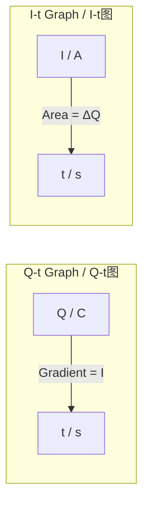

# Definition of Electric Current / 电流的定义

---

# 1. Overview / 概述

**English:**
Electric current is one of the most fundamental concepts in electricity. This sub-topic defines electric current as the rate of flow of charge, establishing the mathematical relationship $I = \Delta Q / \Delta t$. Understanding this definition is essential for all subsequent work in electric circuits, including [[Potential Difference and EMF]], [[Resistance and Resistivity]], and circuit analysis. The definition connects directly to [[Charge Carriers (Electrons, Ions)]] and provides the foundation for understanding [[The Ampere and the Coulomb]].

**中文:**
电流是电学中最基本的概念之一。本子知识点将电流定义为电荷流动的速率，建立了数学关系 $I = \Delta Q / \Delta t$。理解这一定义对于后续所有电路相关内容（包括[[Potential Difference and EMF]]、[[Resistance and Resistivity]]以及电路分析）至关重要。该定义直接与[[Charge Carriers (Electrons, Ions)]]相关联，并为理解[[The Ampere and the Coulomb]]奠定了基础。

---

# 2. Syllabus Learning Objectives / 考纲学习目标

| CAIE 9702 (9.1 a-d) | Edexcel IAL (WPH11 U2: 3.1-3.4) |
|-----------|-------------|
| Define electric current as the rate of flow of charge | Define electric current as the rate of flow of charge |
| Use the equation $I = \Delta Q / \Delta t$ | Use the equation $I = \Delta Q / \Delta t$ |
| Distinguish between conventional current and electron flow | Understand charge carriers in different materials |
| Apply the definition to simple circuit problems | Apply $I = \Delta Q / \Delta t$ to problems involving charge and time |

**Examiner Expectations / 考官期望:**
- **English:** Students must be able to recall and apply the definition $I = \Delta Q / \Delta t$ in both direct calculation and rearranged forms. They should understand that current is a **scalar** quantity (not a vector), despite having a direction. The definition must be applied to both steady and varying currents.
- **中文:** 学生必须能够记忆并应用定义 $I = \Delta Q / \Delta t$，包括直接计算和变形形式。他们应理解电流是**标量**（不是矢量），尽管有方向。该定义必须适用于恒定电流和变化电流。

---

# 3. Core Definitions / 核心定义

| Term (EN/CN) | Definition (EN) | Definition (CN) | Common Mistakes / 常见错误 |
|--------------|-----------------|-----------------|---------------------------|
| **Electric Current** / 电流 | The rate of flow of electric charge past a point in a circuit, measured in amperes (A). | 电荷在电路中某一点流动的速率，单位为安培（A）。 | ❌ Confusing current with charge — current is a **rate**, not an amount |
| **Charge** / 电荷 | A fundamental property of matter that causes electrostatic interactions; measured in coulombs (C). | 物质的基本属性，引起静电相互作用；单位为库仑（C）。 | ❌ Thinking charge is "used up" — charge is conserved |
| **Ampere** / 安培 | The SI base unit of electric current; 1 A = 1 C s⁻¹ | 电流的SI基本单位；1 A = 1 C s⁻¹ | ❌ Forgetting the "per second" part of the definition |
| **Charge Carrier** / 电荷载流子 | A particle that carries electric charge through a conductor (e.g., electrons in metals, ions in electrolytes). | 在导体中携带电荷的粒子（例如金属中的电子，电解质中的离子）。 | ❌ Assuming only electrons can be charge carriers |
| **Conventional Current** / 常规电流 | The direction of flow of positive charge from the positive terminal to the negative terminal of a power supply. | 正电荷从电源正极流向负极的方向。 | ❌ Confusing with actual electron flow direction |
| **Electron Flow** / 电子流 | The actual movement of electrons from the negative terminal to the positive terminal. | 电子从负极流向正极的实际运动。 | ❌ Using electron flow direction in circuit analysis (use conventional current) |

---

# 4. Key Concepts Explained / 关键概念详解

## 4.1 Current as Rate of Charge Flow / 电流作为电荷流动速率

### Explanation / 解释
**English:**
Electric current is defined as the **rate at which charge passes a point** in a circuit. Mathematically:

$$ I = \frac{\Delta Q}{\Delta t} $$

Where:
- $I$ = electric current (amperes, A)
- $\Delta Q$ = charge passing through a cross-section (coulombs, C)
- $\Delta t$ = time interval (seconds, s)

This means that 1 ampere = 1 coulomb per second. If 6.25 × 10¹⁸ electrons (each with charge $e = 1.60 \times 10^{-19}$ C) pass a point in 1 second, the current is 1 A.

The definition applies to:
- **Steady (direct) current:** Constant rate of charge flow
- **Varying current:** Instantaneous current $I = dQ/dt$ (A-Level extension)

**中文:**
电流定义为**电荷通过电路中某一点的速率**。数学表达式为：

$$ I = \frac{\Delta Q}{\Delta t} $$

其中：
- $I$ = 电流（安培，A）
- $\Delta Q$ = 通过横截面的电荷量（库仑，C）
- $\Delta t$ = 时间间隔（秒，s）

这意味着1安培 = 1库仑每秒。如果6.25 × 10¹⁸个电子（每个电子电荷 $e = 1.60 \times 10^{-19}$ C）在1秒内通过某一点，则电流为1 A。

该定义适用于：
- **恒定（直流）电流：** 恒定的电荷流动速率
- **变化电流：** 瞬时电流 $I = dQ/dt$（A-Level扩展内容）

### Physical Meaning / 物理意义
**English:**
Current is not a "thing" that flows — it is a **measurement** of how much charge flows per second. Think of it like water flow: the current is analogous to the **flow rate** (liters per second), not the total volume of water. Charge carriers (electrons, ions) are the "water molecules," and current is how fast they move past a point.

**中文:**
电流不是"流动的东西"——它是**测量**每秒有多少电荷流动的量。可以类比水流：电流类似于**流速**（升/秒），而不是水的总体积。电荷载流子（电子、离子）是"水分子"，电流是它们通过某一点的速度。

### Common Misconceptions / 常见误区
- ❌ **"Current is the flow of electrons"** — Current is the **rate** of flow, not the flow itself
- ❌ **"Current is used up in a circuit"** — Current is conserved in a series circuit; charge is not consumed
- ❌ **"Bigger current means faster electrons"** — Partially true, but current also depends on the number of charge carriers (drift velocity concept — see [[Charge Carriers (Electrons, Ions)]])
- ❌ **"Current is a vector because it has direction"** — Current is a **scalar**; direction is a sign convention, not a vector direction

### Exam Tips / 考试提示
- **English:** Always write the definition as "rate of flow of charge" — not just "flow of charge." Use the equation $I = \Delta Q / \Delta t$ and be comfortable rearranging for $\Delta Q = I \Delta t$ and $\Delta t = \Delta Q / I$.
- **中文:** 始终将定义写为"电荷流动的速率"——而不仅仅是"电荷流动"。使用方程 $I = \Delta Q / \Delta t$，并熟练掌握变形 $\Delta Q = I \Delta t$ 和 $\Delta t = \Delta Q / I$。

> 📷 **IMAGE PROMPT — DIAGRAM-01: Current as Rate of Charge Flow**
> A clear diagram showing a cross-section of a wire with charge carriers (electrons) moving through it. An arrow labeled "I" points along the wire. A dashed line marks the cross-section. Labels show: "ΔQ = charge passing through cross-section in time Δt" and "I = ΔQ/Δt". The diagram should be simple, educational, and suitable for an A-Level physics textbook.

---

## 4.2 Charge Carriers and Current / 电荷载流子与电流

### Explanation / 解释
**English:**
Different materials have different charge carriers:
- **Metals:** Free electrons (negative charge carriers)
- **Electrolytes:** Positive and negative ions
- **Semiconductors:** Electrons and holes (positive charge carriers)
- **Gases (ionized):** Electrons and positive ions

The total charge passing a point is:
$$ \Delta Q = n A v_d e \Delta t $$

Where $n$ is charge carrier density, $A$ is cross-sectional area, $v_d$ is drift velocity, and $e$ is elementary charge. This leads to:
$$ I = n A v_d e $$

See [[Charge Carriers (Electrons, Ions)]] for detailed treatment.

**中文:**
不同材料有不同的电荷载流子：
- **金属：** 自由电子（负电荷载流子）
- **电解质：** 正离子和负离子
- **半导体：** 电子和空穴（正电荷载流子）
- **气体（电离）：** 电子和正离子

通过某一点的总电荷量为：
$$ \Delta Q = n A v_d e \Delta t $$

其中 $n$ 是电荷载流子密度，$A$ 是横截面积，$v_d$ 是漂移速度，$e$ 是元电荷。由此可得：
$$ I = n A v_d e $$

详见[[Charge Carriers (Electrons, Ions)]]。

---

## 4.3 Conventional Current vs Electron Flow / 常规电流与电子流

### Explanation / 解释
**English:**
This is a critical distinction for A-Level:
- **Conventional current:** Direction from positive (+) to negative (−) terminal — used in all circuit analysis
- **Electron flow:** Actual direction of electron movement from negative (−) to positive (+) terminal

**Why use conventional current?** Historical convention established by Benjamin Franklin before electrons were discovered. All circuit symbols, Kirchhoff's laws, and circuit analysis use conventional current.

**Exam rule:** Always use conventional current in circuit diagrams and calculations unless specifically asked about electron flow.

See [[Conventional Current vs Electron Flow]] for full treatment.

**中文:**
这是A-Level的一个关键区别：
- **常规电流：** 从正极（+）到负极（−）的方向——用于所有电路分析
- **电子流：** 电子从负极（−）到正极（+）的实际运动方向

**为什么使用常规电流？** 本杰明·富兰克林在发现电子之前建立的历史惯例。所有电路符号、基尔霍夫定律和电路分析都使用常规电流。

**考试规则：** 在电路图和计算中始终使用常规电流，除非特别要求讨论电子流。

详见[[Conventional Current vs Electron Flow]]。

---

# 5. Essential Equations / 核心公式

## Equation 1: Definition of Electric Current

$$ I = \frac{\Delta Q}{\Delta t} $$

| Symbol (符号) | Meaning (EN) | Meaning (CN) | Unit (单位) |
|--------------|-------------|-------------|------------|
| $I$ | Electric current | 电流 | A (ampere / 安培) |
| $\Delta Q$ | Charge passing through cross-section | 通过横截面的电荷量 | C (coulomb / 库仑) |
| $\Delta t$ | Time interval | 时间间隔 | s (second / 秒) |

**Derivation / 推导:**
This is a **definition**, not derived from other equations. It comes from the experimental observation that charge flows at a rate proportional to the current.

**Conditions / 适用条件:**
- **English:** For steady (constant) current. For varying current, use $I = dQ/dt$ (instantaneous current).
- **中文：** 适用于恒定电流。对于变化电流，使用 $I = dQ/dt$（瞬时电流）。

**Limitations / 局限性:**
- **English:** Does not account for the type of charge carrier or the mechanism of charge flow. It is a macroscopic definition.
- **中文：** 不考虑电荷载流子的类型或电荷流动的机制。这是一个宏观定义。

## Equation 2: Current in Terms of Charge Carriers

$$ I = n A v_d e $$

| Symbol (符号) | Meaning (EN) | Meaning (CN) | Unit (单位) |
|--------------|-------------|-------------|------------|
| $n$ | Number density of charge carriers | 电荷载流子数密度 | m⁻³ |
| $A$ | Cross-sectional area | 横截面积 | m² |
| $v_d$ | Drift velocity | 漂移速度 | m s⁻¹ |
| $e$ | Elementary charge (1.60 × 10⁻¹⁹ C) | 元电荷 | C |

**Derivation / 推导:**
Consider a wire of length $L$ and cross-sectional area $A$. Number of charge carriers = $nAL$. Total charge = $nALe$. Time for carriers to travel length $L$ = $L/v_d$. Therefore $I = \frac{nALe}{L/v_d} = n A v_d e$.

**Conditions / 适用条件:**
- **English:** For metallic conductors with one type of charge carrier (electrons). For multiple charge carrier types, sum contributions.
- **中文：** 适用于只有一种电荷载流子（电子）的金属导体。对于多种电荷载流子，需要求和。

**Limitations / 局限性:**
- **English:** Assumes uniform cross-section and constant drift velocity. Does not account for temperature effects on $n$ or scattering.
- **中文：** 假设横截面均匀且漂移速度恒定。不考虑温度对 $n$ 或散射的影响。

> 📷 **IMAGE PROMPT — DIAGRAM-02: Current and Charge Carrier Relationship**
> A diagram showing a cylindrical wire segment of length L and cross-sectional area A. Charge carriers (small circles with "e⁻") are shown moving with drift velocity v_d. Labels indicate: n = number density, A = cross-sectional area, v_d = drift velocity. An equation box shows I = nAv_de. The diagram should be clean and suitable for an A-Level textbook.

---

# 6. Graphs and Relationships / 图表与关系

## 6.1 Charge vs Time Graph / 电荷-时间图

### Axes / 坐标轴
- **X-axis:** Time / 时间 (t / s)
- **Y-axis:** Charge / 电荷 (Q / C)

### Shape / 形状
- **Constant current:** Straight line through origin with positive slope
- **Varying current:** Curved line (slope changes)

### Gradient Meaning / 斜率含义
$$ \text{Gradient} = \frac{\Delta Q}{\Delta t} = I $$

The gradient of a Q-t graph gives the **current**.

### Area Meaning / 面积含义
Area under an I-t graph gives the **total charge** $\Delta Q$.

### Exam Interpretation / 考试解读
- **English:** If given a Q-t graph, the current at any instant is the gradient. For a straight line, current is constant. For a curve, draw a tangent to find instantaneous current.
- **中文：** 如果给出Q-t图，任意时刻的电流就是该点的斜率。直线表示电流恒定。曲线需要画切线来求瞬时电流。



---

# 7. Required Diagrams / 必备图表

## 7.1 Simple Circuit Showing Current Measurement / 显示电流测量的简单电路

### Description / 描述
**English:** A simple circuit with a cell, a resistor, and an ammeter connected in series. Arrows show the direction of conventional current (from + to −). Labels indicate the ammeter reading current I.

**中文：** 一个包含电池、电阻和串联电流表的简单电路。箭头显示常规电流方向（从+到−）。标签指示电流表读数为I。

### Image Prompt / 图片生成提示
> 📷 **IMAGE PROMPT — DIAGRAM-03: Simple Circuit for Current Measurement**
> A clean, educational circuit diagram showing: a cell (battery symbol with + and − terminals), a resistor (rectangle symbol), and an ammeter (circle with "A") all connected in series by straight wires. Arrows labeled "I" show conventional current direction from positive to negative terminal. Labels: "Cell", "Resistor", "Ammeter". The diagram should be simple, black and white, suitable for an A-Level physics textbook.

### Labels Required / 需要标注
- Cell / 电池 (+ and − terminals / 正负极)
- Resistor / 电阻
- Ammeter / 电流表 (A)
- Current direction arrows / 电流方向箭头 (I)

### Exam Importance / 考试重要性
- **English:** High — students must be able to draw and interpret this circuit. The ammeter must always be in **series**.
- **中文：** 高——学生必须能够绘制和解读此电路。电流表必须始终**串联**。

---

## 7.2 Cross-Section of a Wire Showing Charge Flow / 导线横截面显示电荷流动

### Description / 描述
**English:** A 3D or 2D cross-section of a metal wire showing free electrons moving through a lattice of positive metal ions. An arrow indicates the direction of conventional current.

**中文：** 金属导线的3D或2D横截面，显示自由电子在正金属离子晶格中移动。箭头指示常规电流方向。

### Image Prompt / 图片生成提示
> 📷 **IMAGE PROMPT — DIAGRAM-04: Cross-Section of Wire with Charge Carriers**
> A 2D cross-section of a metal wire. The background shows a regular lattice of large circles labeled "Metal ions (+)". Small circles labeled "Free electrons (−)" are shown moving through the gaps between ions. A large arrow above the wire points to the right, labeled "Conventional current direction". A smaller arrow below the wire points to the left, labeled "Electron flow direction". The diagram should clearly show the difference between conventional current and electron flow.

### Labels Required / 需要标注
- Metal ions / 金属离子 (+)
- Free electrons / 自由电子 (−)
- Conventional current direction / 常规电流方向
- Electron flow direction / 电子流方向

### Exam Importance / 考试重要性
- **English:** Medium — helps visualize the microscopic mechanism of current.
- **中文：** 中——帮助可视化电流的微观机制。

---

# 8. Worked Examples / 典型例题

## Example 1: Calculating Current from Charge and Time / 从电荷和时间计算电流

### Question / 题目
**English:**
A charge of 24 C passes through a lamp in 2.0 minutes. Calculate the current in the lamp.

**中文：**
24 C的电荷在2.0分钟内通过一盏灯。计算灯中的电流。

### Solution / 解答

**Step 1:** Identify known quantities / 确定已知量
- $\Delta Q = 24$ C
- $\Delta t = 2.0$ minutes = $2.0 \times 60 = 120$ s

**Step 2:** Apply the definition / 应用定义
$$ I = \frac{\Delta Q}{\Delta t} = \frac{24}{120} $$

**Step 3:** Calculate / 计算
$$ I = 0.20 \text{ A} $$

### Final Answer / 最终答案
**Answer:** 0.20 A | **答案：** 0.20 A

### Quick Tip / 提示
- **English:** Always convert time to seconds before calculating. Watch for minutes, hours, etc.
- **中文：** 计算前始终将时间转换为秒。注意分钟、小时等单位。

---

## Example 2: Finding Charge from Current and Time / 从电流和时间求电荷

### Question / 题目
**English:**
A current of 0.50 A flows through a wire for 5.0 minutes. Calculate the total charge that passes through the wire.

**中文：**
0.50 A的电流通过一根导线5.0分钟。计算通过导线的总电荷量。

### Solution / 解答

**Step 1:** Identify known quantities / 确定已知量
- $I = 0.50$ A
- $\Delta t = 5.0$ minutes = $5.0 \times 60 = 300$ s

**Step 2:** Rearrange the equation / 变形方程
$$ \Delta Q = I \Delta t $$

**Step 3:** Calculate / 计算
$$ \Delta Q = 0.50 \times 300 = 150 \text{ C} $$

### Final Answer / 最终答案
**Answer:** 150 C | **答案：** 150 C

### Quick Tip / 提示
- **English:** Rearranging $I = \Delta Q / \Delta t$ gives $\Delta Q = I \Delta t$ — this is the most common rearrangement in exams.
- **中文：** 将 $I = \Delta Q / \Delta t$ 变形得到 $\Delta Q = I \Delta t$ ——这是考试中最常见的变形。

---

## Example 3: Number of Electrons / 电子数量

### Question / 题目
**English:**
A current of 2.0 A flows for 30 seconds. How many electrons pass a point in the wire? (Elementary charge $e = 1.60 \times 10^{-19}$ C)

**中文：**
2.0 A的电流流动30秒。有多少个电子通过导线中的某一点？（元电荷 $e = 1.60 \times 10^{-19}$ C）

### Solution / 解答

**Step 1:** Find total charge / 求总电荷
$$ \Delta Q = I \Delta t = 2.0 \times 30 = 60 \text{ C} $$

**Step 2:** Find number of electrons / 求电子数量
$$ \text{Number of electrons} = \frac{\Delta Q}{e} = \frac{60}{1.60 \times 10^{-19}} $$

**Step 3:** Calculate / 计算
$$ \text{Number of electrons} = 3.75 \times 10^{20} $$

### Final Answer / 最终答案
**Answer:** $3.75 \times 10^{20}$ electrons | **答案：** $3.75 \times 10^{20}$ 个电子

### Quick Tip / 提示
- **English:** Remember that each electron carries charge $e = 1.60 \times 10^{-19}$ C. The number of electrons $N = \Delta Q / e$.
- **中文：** 记住每个电子携带电荷 $e = 1.60 \times 10^{-19}$ C。电子数量 $N = \Delta Q / e$。

---

# 9. Past Paper Question Types / 历年真题题型

| Question Type / 题型 | Frequency / 频率 | Difficulty / 难度 | Past Paper References / 真题索引 |
|----------------------|------------------|------------------|-------------------------------|
| Direct calculation of $I = \Delta Q / \Delta t$ | Very High / 非常高 | Easy / 简单 | 📝 *待填入* |
| Rearranging for $\Delta Q$ or $\Delta t$ | High / 高 | Easy / 简单 | 📝 *待填入* |
| Number of charge carriers calculation | Medium / 中 | Medium / 中等 | 📝 *待填入* |
| Q-t graph interpretation | Medium / 中 | Medium / 中等 | 📝 *待填入* |
| Distinguishing conventional vs electron flow | Low / 低 | Easy / 简单 | 📝 *待填入* |

**Common Command Words / 常见指令词:**
- **Define / 定义:** "Define electric current." — Must give the definition as "rate of flow of charge"
- **Calculate / 计算:** "Calculate the current when 30 C passes in 10 s."
- **Determine / 确定:** "Determine the charge that passes when a current of 2.0 A flows for 5 minutes."
- **State / 陈述:** "State the direction of conventional current."

---

# 10. Practical Skills Connections / 实验技能链接

**English:**
This sub-topic connects to practical work in several ways:

1. **Measuring current with an ammeter:**
   - Ammeters must be connected in **series** with the component
   - Ammeters have very low resistance (ideally zero)
   - Always start with the highest range and work down

2. **Uncertainty in current measurements:**
   - Digital ammeter: uncertainty = ± half the smallest division
   - Analogue ammeter: uncertainty = ± half the smallest scale division
   - Percentage uncertainty: $\frac{\Delta I}{I} \times 100\%$

3. **Graph plotting:**
   - Plot Q against t — gradient gives current
   - Plot I against t — area under graph gives charge

4. **Experimental design:**
   - Use a coulombmeter to measure charge directly
   - Use a stopwatch and ammeter to measure charge indirectly ($Q = I \times t$)

**中文:**
本子知识点通过以下方式与实验工作相关联：

1. **用电流表测量电流：**
   - 电流表必须**串联**在电路中
   - 电流表电阻非常小（理想为零）
   - 始终从最大量程开始，然后向下调整

2. **电流测量的不确定度：**
   - 数字电流表：不确定度 = ±最小分度的一半
   - 模拟电流表：不确定度 = ±最小刻度的一半
   - 百分比不确定度：$\frac{\Delta I}{I} \times 100\%$

3. **图表绘制：**
   - 绘制Q-t图——斜率给出电流
   - 绘制I-t图——曲线下面积给出电荷

4. **实验设计：**
   - 使用库仑计直接测量电荷
   - 使用秒表和电流表间接测量电荷（$Q = I \times t$）

---

# 11. Concept Map / 概念图谱

```mermaid
graph TD
    %% Definition of Electric Current - Leaf Node Concept Map
    EC[Electric Current<br/>电流] --> DEF[Definition<br/>定义: I = ΔQ/Δt]
    EC --> DIR[Direction<br/>方向]
    EC --> UNIT[Unit: Ampere (A)<br/>单位：安培]
    
    DEF --> Q[Charge ΔQ<br/>电荷]
    DEF --> T[Time Δt<br/>时间]
    
    Q --> CC[Charge Carriers<br/>电荷载流子]
    Q --> ELEM[Elementary Charge e<br/>元电荷]
    
    CC --> ELEC[Electrons<br/>电子]
    CC --> IONS[Ions<br/>离子]
    
    DIR --> CONV[Conventional Current<br/>常规电流 + → −]
    DIR --> E_FLOW[Electron Flow<br/>电子流 − → +]
    
    CONV --> CIRCUIT[Circuit Analysis<br/>电路分析]
    
    EC --> MEAS[Measurement<br/>测量]
    MEAS --> AMM[Ammeter in Series<br/>电流表串联]
    
    EC --> RELATE[Related Concepts<br/>相关概念]
    RELATE --> PD[Potential Difference<br/>电势差]
    RELATE --> RES[Resistance<br/>电阻]
    
    style EC fill:#4a90d9,color:#fff
    style DEF fill:#f5a623,color:#fff
    style DIR fill:#7ed321,color:#fff
    style UNIT fill:#d0021b,color:#fff
```

---

# 12. Quick Revision Sheet / 速查表

| Category / 类别 | Key Points / 要点 |
|----------------|------------------|
| **Definition / 定义** | Electric current = rate of flow of charge / 电流 = 电荷流动的速率 |
| **Key Formula / 核心公式** | $I = \frac{\Delta Q}{\Delta t}$ — Rearranged: $\Delta Q = I \Delta t$, $\Delta t = \frac{\Delta Q}{I}$ |
| **Unit / 单位** | Ampere (A) = Coulomb per second (C s⁻¹) / 安培 = 库仑每秒 |
| **Direction / 方向** | Conventional current: + to − (use in circuits) / 常规电流：+到−（电路中使用） |
| **Charge Carriers / 电荷载流子** | Metals: electrons; Electrolytes: ions / 金属：电子；电解质：离子 |
| **Key Graph / 核心图表** | Q-t graph: gradient = current / Q-t图：斜率 = 电流 |
| **Measurement / 测量** | Ammeter in series / 电流表串联 |
| **Common Mistake / 常见错误** | ❌ Current is NOT "flow of charge" — it is **rate** of flow / 电流不是"电荷流动"——而是流动的**速率** |
| **Exam Tip / 考试提示** | Always convert time to seconds / 始终将时间转换为秒 |
| **Microscopic View / 微观视角** | $I = n A v_d e$ — current depends on carrier density, area, drift velocity / 电流取决于载流子密度、横截面积、漂移速度 |

---

> **Parent Hub:** [[Electric Current and Charge]]
> **Sibling Notes:** [[Charge Carriers (Electrons, Ions)]] | [[The Ampere and the Coulomb]] | [[Conventional Current vs Electron Flow]] | [[Current in Series and Parallel Circuits]]
> **Related Topics:** [[Potential Difference and EMF]] | [[Resistance and Resistivity]]