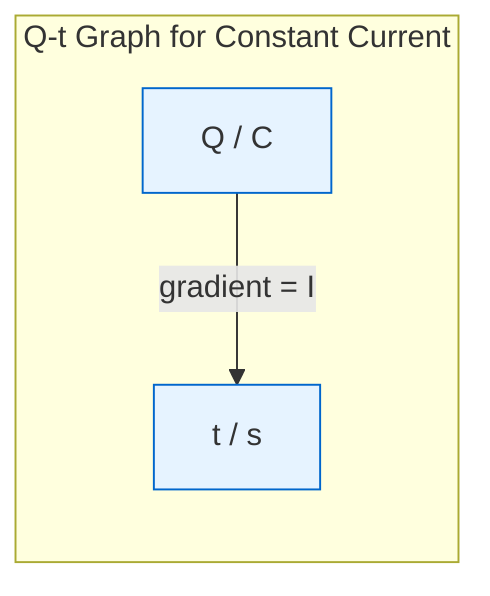
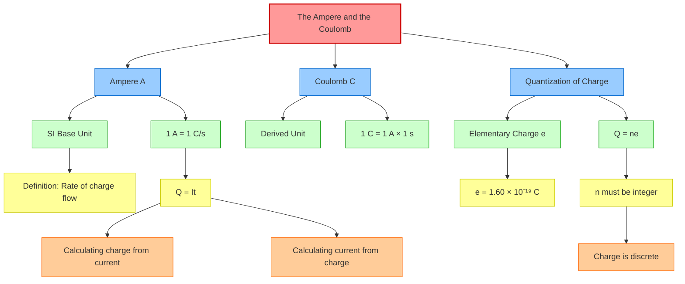

# The Ampere and the Coulomb / 安培与库仑

---

# 1. Overview / 概述

**English:**
This sub-topic establishes the fundamental definitions of electric current and electric charge — the two most basic quantities in electricity. The **ampere (A)** is defined as the SI base unit for electric current, while the **coulomb (C)** is the derived SI unit for electric charge. Understanding the relationship $Q = It$ is essential for all subsequent work in electric circuits, including [[Definition of Electric Current]], [[Potential Difference and EMF]], and [[Resistance and Resistivity]]. This sub-topic also introduces the concept of charge quantization — that charge exists in discrete multiples of the elementary charge $e = 1.60 \times 10^{-19} \text{ C}$.

**中文:**
本子知识点建立了电流和电荷的基本定义——电学中最基本的两个量。**安培 (A)** 被定义为电流的SI基本单位，而**库仑 (C)** 是电荷的导出SI单位。理解关系式 $Q = It$ 对于后续所有电路相关内容（包括[[电流的定义]]、[[电势差与电动势]]以及[[电阻与电阻率]]）至关重要。本子知识点还引入了电荷量子化的概念——电荷以基本电荷 $e = 1.60 \times 10^{-19} \text{ C}$ 的整数倍存在。

---

# 2. Syllabus Learning Objectives / 考纲学习目标

| CAIE 9702 | Edexcel IAL |
|-----------|-------------|
| 9.1(a) Define electric current as the rate of flow of charge | 3.1 Define electric current as the rate of flow of charge |
| 9.1(b) Recall and use $Q = It$ | 3.2 Use $Q = It$ |
| 9.1(c) Define the coulomb | 3.3 Define the coulomb in terms of the ampere and second |
| 9.1(d) Describe the quantization of charge | 3.4 State that charge is quantized and $e = 1.60 \times 10^{-19} \text{ C}$ |

**Examiner Expectations / 考官期望:**
- **English:** Students must be able to define current as $I = \Delta Q / \Delta t$, recall and apply $Q = It$, define the coulomb as the charge passing a point when a current of 1 A flows for 1 s, and state that charge is quantized in multiples of $e$.
- **中文:** 学生必须能够将电流定义为 $I = \Delta Q / \Delta t$，回忆并应用 $Q = It$，将库仑定义为1 A电流流动1秒时通过某点的电荷量，并说明电荷以 $e$ 的整数倍量子化。

---

# 3. Core Definitions / 核心定义

| Term (EN/CN) | Definition (EN) | Definition (CN) | Common Mistakes / 常见错误 |
|--------------|-----------------|-----------------|---------------------------|
| **Electric Current** / 电流 | The rate of flow of electric charge past a point in a circuit. | 电荷在电路中通过某点的速率。 | Confusing current with charge — current is NOT charge, it's the *rate* of flow. |
| **Ampere (A)** / 安培 | The SI base unit of electric current. One ampere is the current that flows when one coulomb of charge passes a point per second. | 电流的SI基本单位。1安培是每秒有1库仑电荷通过某点时的电流。 | Writing "amp" instead of "ampere" in formal answers. |
| **Coulomb (C)** / 库仑 | The SI unit of electric charge. One coulomb is the charge that passes a point when a current of 1 A flows for 1 s. | 电荷的SI单位。1库仑是1 A电流流动1秒时通过某点的电荷量。 | Thinking coulomb is a base unit — it's a *derived* unit. |
| **Elementary Charge (e)** / 基本电荷 | The magnitude of charge on a single electron or proton: $e = 1.60 \times 10^{-19} \text{ C}$. | 单个电子或质子所带电荷的大小：$e = 1.60 \times 10^{-19} \text{ C}$。 | Forgetting the sign — $e$ is the *magnitude*; electrons have $-e$, protons have $+e$. |
| **Quantization of Charge** / 电荷量子化 | The principle that electric charge exists only in discrete multiples of the elementary charge $e$. | 电荷只能以基本电荷 $e$ 的整数倍存在的原理。 | Thinking charge can be any continuous value. |

---

# 4. Key Concepts Explained / 关键概念详解

## 4.1 The Ampere as a Base Unit / 安培作为基本单位

### Explanation / 解释
**English:**
The ampere (A) is one of the seven SI base units. It is defined in terms of the force between two parallel current-carrying conductors, but at A-Level you only need to understand it operationally: **1 A = 1 C/s**. This means that if a current of 1 A flows through a wire, exactly 1 coulomb of charge passes any cross-section of the wire every second. The ampere is the *fundamental* unit; the coulomb is *derived* from it.

**中文:**
安培 (A) 是七个SI基本单位之一。它的定义基于两根平行载流导体之间的力，但在A-Level阶段，你只需要理解其操作性定义：**1 A = 1 C/s**。这意味着如果1 A的电流流过导线，每秒恰好有1库仑的电荷通过导线的任何横截面。安培是*基本*单位；库仑是从它*导出*的。

### Physical Meaning / 物理意义
**English:**
Current measures how much charge is moving per unit time. A larger current means more charge flows each second. For example, a 2 A current carries twice as much charge per second as a 1 A current.

**中文:**
电流衡量单位时间内有多少电荷在移动。电流越大，每秒流过的电荷越多。例如，2 A的电流每秒携带的电荷量是1 A电流的两倍。

### Common Misconceptions / 常见误区
- **EN:** "Current is the flow of electrons." — Actually, current is the *rate* of flow, not the flow itself.
- **CN:** "电流就是电子的流动。" — 实际上，电流是流动的*速率*，而不是流动本身。
- **EN:** "The ampere is defined by $Q = It$." — No, the ampere is the base unit; $Q = It$ relates charge to current.
- **CN:** "安培是由 $Q = It$ 定义的。" — 不对，安培是基本单位；$Q = It$ 是电荷与电流的关系式。

### Exam Tips / 考试提示
- **EN:** Always write "ampere" not "amp" in definitions. Use "A" as the symbol.
- **CN:** 在定义中始终写"ampere"而不是"amp"。使用"A"作为符号。
- **EN:** Remember: $I = Q/t$ is the *definition* of current; $Q = It$ is the *calculation* of charge.
- **CN:** 记住：$I = Q/t$ 是电流的*定义*；$Q = It$ 是电荷的*计算*。

> 📷 **IMAGE PROMPT — AMPERE-001: Visualizing 1 Ampere**
> A clear diagram showing a wire cross-section with 1 coulomb of charge (represented as a group of 6.25 × 10^18 electrons) passing through it in 1 second. A clock icon shows 1 second elapsed. The wire is labeled "1 A". The charge group is labeled "1 C". Educational style, suitable for A-Level physics textbook.

---

## 4.2 The Coulomb as a Derived Unit / 库仑作为导出单位

### Explanation / 解释
**English:**
The coulomb (C) is the SI derived unit of electric charge. It is defined from the ampere and the second: **1 C = 1 A × 1 s**. This means that if a current of 1 ampere flows for 1 second, the total charge that has passed is 1 coulomb. The coulomb is a very large unit — one coulomb corresponds to approximately $6.25 \times 10^{18}$ electrons.

**中文:**
库仑 (C) 是电荷的SI导出单位。它由安培和秒定义：**1 C = 1 A × 1 s**。这意味着如果1安培的电流流动1秒，通过的总电荷量为1库仑。库仑是一个非常大的单位——1库仑大约对应 $6.25 \times 10^{18}$ 个电子。

### Physical Meaning / 物理意义
**English:**
Charge is a fundamental property of matter. The coulomb quantifies how much charge is present or has moved. In circuits, we calculate charge transferred using $Q = It$, where $t$ is the time the current flows.

**中文:**
电荷是物质的基本属性。库仑量化了存在或移动了多少电荷。在电路中，我们使用 $Q = It$ 计算转移的电荷量，其中 $t$ 是电流流动的时间。

### Common Misconceptions / 常见误区
- **EN:** "The coulomb is an SI base unit." — No, only the ampere is a base unit; the coulomb is derived.
- **CN:** "库仑是SI基本单位。" — 不对，只有安培是基本单位；库仑是导出单位。
- **EN:** "Charge and current are the same thing." — No, charge is the quantity; current is the rate of flow.
- **CN:** "电荷和电流是同一个东西。" — 不对，电荷是数量；电流是流动的速率。

### Exam Tips / 考试提示
- **EN:** When defining the coulomb, always mention both the ampere AND the second.
- **CN:** 定义库仑时，始终同时提到安培和秒。
- **EN:** Use $Q = It$ for calculations — ensure time is in seconds.
- **CN:** 使用 $Q = It$ 进行计算——确保时间以秒为单位。

---

## 4.3 Quantization of Charge / 电荷量子化

### Explanation / 解释
**English:**
Charge is quantized — it exists only in discrete packets. The smallest possible amount of free charge is the **elementary charge** $e = 1.60 \times 10^{-19} \text{ C}$, which is the magnitude of charge on a single electron or proton. Any observable charge $Q$ must be an integer multiple of $e$: $Q = ne$, where $n$ is an integer (positive, negative, or zero).

**中文:**
电荷是量子化的——它只以离散的包形式存在。自由电荷的最小可能量是**基本电荷** $e = 1.60 \times 10^{-19} \text{ C}$，即单个电子或质子所带电荷的大小。任何可观测的电荷 $Q$ 必须是 $e$ 的整数倍：$Q = ne$，其中 $n$ 是整数（正数、负数或零）。

### Physical Meaning / 物理意义
**English:**
This explains why charge values like $3.2 \times 10^{-19} \text{ C}$ (exactly $2e$) are possible, but values like $2.0 \times 10^{-19} \text{ C}$ are not — because $2.0 \times 10^{-19} / 1.60 \times 10^{-19} = 1.25$, which is not an integer. This quantization is a direct consequence of the particulate nature of matter.

**中文:**
这解释了为什么像 $3.2 \times 10^{-19} \text{ C}$（恰好是 $2e$）这样的电荷值是可能的，但像 $2.0 \times 10^{-19} \text{ C}$ 这样的值是不可能的——因为 $2.0 \times 10^{-19} / 1.60 \times 10^{-19} = 1.25$，不是整数。这种量子化是物质粒子性质的直接结果。

### Common Misconceptions / 常见误区
- **EN:** "Protons have charge $+e$ and electrons have charge $-e$, so they cancel." — They cancel only if equal numbers are present.
- **CN:** "质子带 $+e$ 电荷，电子带 $-e$ 电荷，所以它们抵消。" — 只有在数量相等时才抵消。
- **EN:** "Charge can be any value." — No, it must be a multiple of $e$.
- **CN:** "电荷可以是任何值。" — 不对，必须是 $e$ 的整数倍。

### Exam Tips / 考试提示
- **EN:** Know $e = 1.60 \times 10^{-19} \text{ C}$ — this is a standard data value.
- **CN:** 记住 $e = 1.60 \times 10^{-19} \text{ C}$ ——这是一个标准数据值。
- **EN:** To find the number of electrons: $n = Q/e$.
- **CN:** 求电子数量：$n = Q/e$。

> 📷 **IMAGE PROMPT — QUANT-001: Charge Quantization Visualization**
> A diagram showing a scale with discrete "packets" of charge (small spheres labeled "+e" and "-e") being added. Below, a number line shows allowed charge values at multiples of e (0, ±e, ±2e, ±3e...) with crosses at non-integer multiples. Educational style for A-Level physics.

---

# 5. Essential Equations / 核心公式

## 5.1 The Fundamental Relationship / 基本关系式

$$ I = \frac{\Delta Q}{\Delta t} \quad \text{or} \quad Q = It $$

| Symbol (符号) | Meaning (EN) | Meaning (CN) | Unit (单位) |
|--------------|-------------|-------------|------------|
| $I$ | Electric current | 电流 | A (ampere / 安培) |
| $Q$ | Electric charge | 电荷 | C (coulomb / 库仑) |
| $\Delta Q$ | Charge passing a point in time $\Delta t$ | 在时间 $\Delta t$ 内通过某点的电荷 | C |
| $t$ or $\Delta t$ | Time interval | 时间间隔 | s (second / 秒) |

**Derivation / 推导:**
- **English:** Current is defined as the rate of flow of charge. For a constant current, $I = Q/t$. Rearranging gives $Q = It$.
- **中文:** 电流定义为电荷流动的速率。对于恒定电流，$I = Q/t$。整理得 $Q = It$。

**Conditions / 适用条件:**
- **EN:** $I$ must be constant (steady current). For varying current, use $I = dQ/dt$ or average current.
- **CN:** $I$ 必须是恒定的（稳恒电流）。对于变化电流，使用 $I = dQ/dt$ 或平均电流。

**Limitations / 局限性:**
- **EN:** Does not account for the direction of charge flow or the type of charge carrier.
- **中文:** 不考虑电荷流动的方向或载流子的类型。

---

## 5.2 Charge Quantization / 电荷量子化

$$ Q = ne $$

| Symbol (符号) | Meaning (EN) | Meaning (CN) | Unit (单位) |
|--------------|-------------|-------------|------------|
| $Q$ | Total charge | 总电荷 | C |
| $n$ | Number of charge carriers (integer) | 载流子数量（整数） | dimensionless / 无量纲 |
| $e$ | Elementary charge ($1.60 \times 10^{-19} \text{ C}$) | 基本电荷 | C |

**Derivation / 推导:**
- **EN:** Direct consequence of the particulate nature of charge. Each electron or proton carries charge $\pm e$.
- **中文:** 电荷粒子性质的直接结果。每个电子或质子携带 $\pm e$ 的电荷。

**Conditions / 适用条件:**
- **EN:** $n$ must be an integer. $Q$ can be positive or negative depending on the sign of the charge carriers.
- **中文:** $n$ 必须是整数。$Q$ 的正负取决于载流子的符号。

**Limitations / 局限性:**
- **EN:** Quarks have fractional charges ($\pm e/3$, $\pm 2e/3$), but these are never observed in isolation (quark confinement).
- **中文:** 夸克具有分数电荷 ($\pm e/3$, $\pm 2e/3$)，但这些从未被孤立观察到（夸克禁闭）。

---

# 6. Graphs and Relationships / 图表与关系

## 6.1 Charge vs Time for Constant Current / 恒定电流的电荷-时间图

### Axes / 坐标轴
- **X-axis:** Time / time / s (秒)
- **Y-axis:** Charge / 电荷 / C (库仑)

### Shape / 形状
- **EN:** A straight line through the origin with positive gradient.
- **中文:** 一条通过原点的直线，斜率为正。

### Gradient Meaning / 斜率含义
- **EN:** The gradient equals the current $I$. Steeper gradient = larger current.
- **中文:** 斜率等于电流 $I$。斜率越陡 = 电流越大。

### Area Meaning / 面积含义
- **EN:** Not applicable — area under a $Q$-$t$ graph has no physical meaning.
- **中文:** 不适用——$Q$-$t$ 图下的面积没有物理意义。

### Exam Interpretation / 考试解读
- **EN:** If the graph is a straight line, current is constant. If curved, current is changing.
- **中文:** 如果图形是直线，电流恒定。如果是曲线，电流在变化。

> 📷 **IMAGE PROMPT — GRAPH-001: Charge vs Time Graphs**
> Two Q-t graphs on the same axes: one steep straight line (2 A) and one shallower straight line (1 A). Both pass through origin. Axes labeled "Charge / C" and "Time / s". Arrows indicate gradients labeled "I = 2 A" and "I = 1 A". Educational style for A-Level physics.

---

# 7. Required Diagrams / 必备图表

## 7.1 Current as Rate of Charge Flow / 电流作为电荷流动速率

### Description / 描述
**English:**
A diagram showing a wire with a cross-section marked. Electrons (or charge carriers) are shown moving through the cross-section. The number of charge carriers passing per second determines the current.

**中文:**
一个显示导线并标出横截面的示意图。电子（或载流子）被显示穿过横截面。每秒通过的载流子数量决定了电流。

### Image Prompt / 图片生成提示
> 📷 **IMAGE PROMPT — DIAG-001: Current as Charge Flow Rate**
> A straight wire with a dashed vertical line marking a cross-section. Small spheres labeled "e⁻" are shown moving from left to right through the cross-section. An arrow above the wire indicates direction of current (opposite to electron flow). Labels: "Cross-sectional area", "Charge carriers (electrons)", "Current I = ΔQ/Δt". Educational diagram for A-Level physics, clean and clear.

### Labels Required / 需要标注
- **EN:** Cross-section, direction of charge flow, current direction (conventional), charge carriers
- **中文:** 横截面、电荷流动方向、电流方向（常规方向）、载流子

### Exam Importance / 考试重要性
- **EN:** High — this diagram is essential for understanding the definition of current.
- **中文:** 高——此图对于理解电流的定义至关重要。

---

## 7.2 Quantization of Charge / 电荷量子化

### Description / 描述
**English:**
A diagram showing a number line of charge values, with allowed values marked at multiples of $e$ and disallowed values crossed out.

**中文:**
一个显示电荷值数轴的图，允许的值在 $e$ 的整数倍处标记，不允许的值被划掉。

### Image Prompt / 图片生成提示
> 📷 **IMAGE PROMPT — DIAG-002: Charge Quantization Number Line**
> A horizontal number line from -3e to +3e. At each integer multiple of e (0, ±e, ±2e, ±3e), a green checkmark appears. At non-integer positions (e.g., 0.5e, 1.5e), red X marks appear. Labels: "Allowed: Q = ne (n = integer)", "Disallowed: Q ≠ ne". Educational style for A-Level physics.

### Labels Required / 需要标注
- **EN:** Allowed values (multiples of $e$), disallowed values, $e = 1.60 \times 10^{-19} \text{ C}$
- **中文:** 允许值（$e$ 的整数倍）、不允许值、$e = 1.60 \times 10^{-19} \text{ C}$

### Exam Importance / 考试重要性
- **EN:** Medium — helps visualize why charge values like $3.2 \times 10^{-19} \text{ C}$ are possible.
- **中文:** 中等——有助于理解为什么像 $3.2 \times 10^{-19} \text{ C}$ 这样的电荷值是可能的。

---

# 8. Worked Examples / 典型例题

## Example 1: Calculating Charge from Current / 从电流计算电荷

### Question / 题目
**English:**
A current of 0.50 A flows through a lamp for 2.0 minutes. Calculate:
(a) The total charge that passes through the lamp.
(b) The number of electrons that pass through the lamp in this time.
(Elementary charge $e = 1.60 \times 10^{-19} \text{ C}$)

**中文:**
0.50 A的电流流过一盏灯，持续2.0分钟。计算：
(a) 通过灯的总电荷量。
(b) 在这段时间内通过灯的电子数量。
（基本电荷 $e = 1.60 \times 10^{-19} \text{ C}$）

### Solution / 解答

**Part (a):**

$$ Q = It $$

$$ I = 0.50 \text{ A}, \quad t = 2.0 \text{ min} = 2.0 \times 60 = 120 \text{ s} $$

$$ Q = 0.50 \times 120 = 60 \text{ C} $$

**Part (b):**

$$ Q = ne \quad \Rightarrow \quad n = \frac{Q}{e} $$

$$ n = \frac{60}{1.60 \times 10^{-19}} = 3.75 \times 10^{20} \text{ electrons} $$

### Final Answer / 最终答案
**Answer:** (a) 60 C | **答案：** (a) 60 C
**Answer:** (b) $3.75 \times 10^{20}$ electrons | **答案：** (b) $3.75 \times 10^{20}$ 个电子

### Quick Tip / 提示
- **EN:** Always convert time to seconds before using $Q = It$.
- **中文:** 在使用 $Q = It$ 之前，始终将时间转换为秒。

---

## Example 2: Determining Current from Charge Flow / 从电荷流动确定电流

### Question / 题目
**English:**
$2.0 \times 10^{18}$ electrons pass a point in a wire in 0.50 s. Calculate the current in the wire.
($e = 1.60 \times 10^{-19} \text{ C}$)

**中文:**
$2.0 \times 10^{18}$ 个电子在0.50秒内通过导线中的某点。计算导线中的电流。
($e = 1.60 \times 10^{-19} \text{ C}$)

### Solution / 解答

**Step 1:** Calculate total charge.

$$ Q = ne = (2.0 \times 10^{18}) \times (1.60 \times 10^{-19}) = 0.32 \text{ C} $$

**Step 2:** Calculate current.

$$ I = \frac{Q}{t} = \frac{0.32}{0.50} = 0.64 \text{ A} $$

### Final Answer / 最终答案
**Answer:** 0.64 A | **答案：** 0.64 A

### Quick Tip / 提示
- **EN:** First find total charge using $Q = ne$, then use $I = Q/t$.
- **中文:** 先用 $Q = ne$ 求总电荷，再用 $I = Q/t$ 求电流。

---

# 9. Past Paper Question Types / 历年真题题型

| Question Type / 题型 | Frequency / 频率 | Difficulty / 难度 | Past Paper References / 真题索引 |
|----------------------|------------------|------------------|-------------------------------|
| Define the ampere or coulomb | High | Easy | 📝 *待填入* |
| Calculate charge from $Q = It$ | High | Easy | 📝 *待填入* |
| Calculate number of electrons | Medium | Medium | 📝 *待填入* |
| Explain quantization of charge | Low | Medium | 📝 *待填入* |
| Convert between charge and current | Medium | Easy | 📝 *待填入* |

**Common Command Words / 常见指令词:**
- **EN:** Define, Calculate, Determine, State, Explain
- **中文:** 定义、计算、确定、陈述、解释

---

# 10. Practical Skills Connections / 实验技能链接

**English:**
This sub-topic connects to practical work in several ways:

1. **Measuring current:** Using an ammeter in series to measure current. Understanding that the ammeter measures the rate of charge flow.
2. **Measuring charge indirectly:** Using $Q = It$ by measuring current and time with a stopwatch.
3. **Uncertainty analysis:** If current is $0.50 \pm 0.01 \text{ A}$ and time is $120 \pm 1 \text{ s}$, the uncertainty in charge is:
   $$ \frac{\Delta Q}{Q} = \frac{\Delta I}{I} + \frac{\Delta t}{t} = \frac{0.01}{0.50} + \frac{1}{120} = 0.02 + 0.0083 = 0.0283 \approx 2.8\% $$
4. **Data logging:** Using a data logger to record current over time and integrating to find total charge.

**中文:**
本子知识点通过以下几种方式与实验工作联系：

1. **测量电流：** 使用串联的安培表测量电流。理解安培表测量的是电荷流动的速率。
2. **间接测量电荷：** 通过测量电流和用秒表计时，使用 $Q = It$ 计算电荷。
3. **不确定度分析：** 如果电流为 $0.50 \pm 0.01 \text{ A}$，时间为 $120 \pm 1 \text{ s}$，则电荷的不确定度为：
   $$ \frac{\Delta Q}{Q} = \frac{\Delta I}{I} + \frac{\Delta t}{t} = \frac{0.01}{0.50} + \frac{1}{120} = 0.02 + 0.0083 = 0.0283 \approx 2.8\% $$
4. **数据记录：** 使用数据记录器记录电流随时间的变化，并积分求总电荷。

---

# 11. Concept Map / 概念图谱

---

# 12. Quick Revision Sheet / 速查表

| Category / 类别 | Key Points / 要点 |
|----------------|------------------|
| **Definition / 定义** | Current $I = \Delta Q / \Delta t$ (rate of charge flow) / 电流 $I = \Delta Q / \Delta t$（电荷流动速率） |
| **Key Formula / 核心公式** | $Q = It$ and $Q = ne$ ($e = 1.60 \times 10^{-19} \text{ C}$) |
| **Key Graph / 核心图表** | $Q$-$t$ graph: straight line through origin, gradient = $I$ / $Q$-$t$ 图：通过原点的直线，斜率 = $I$ |
| **Unit Definitions / 单位定义** | 1 A = 1 C/s; 1 C = 1 A × 1 s |
| **Quantization / 量子化** | Charge exists in multiples of $e$: $Q = ne$, $n$ integer / 电荷以 $e$ 的整数倍存在：$Q = ne$，$n$ 为整数 |
| **Common Mistake / 常见错误** | Confusing current with charge; forgetting time unit conversion / 混淆电流与电荷；忘记时间单位转换 |
| **Exam Tip / 考试提示** | Always convert minutes to seconds; use $Q = ne$ for electron count / 始终将分钟转换为秒；使用 $Q = ne$ 计算电子数量 |
| **Practical Link / 实验联系** | Ammeter measures current; $Q = It$ for charge; uncertainty propagation / 安培表测量电流；$Q = It$ 求电荷；不确定度传播 |

---

**Parent Hub:** [[Electric Current and Charge]]
**Sibling Sub-topics:** [[Definition of Electric Current]], [[Charge Carriers (Electrons, Ions)]], [[Conventional Current vs Electron Flow]], [[Current in Series and Parallel Circuits]]
**Related Topics:** [[Potential Difference and EMF]], [[Resistance and Resistivity]]