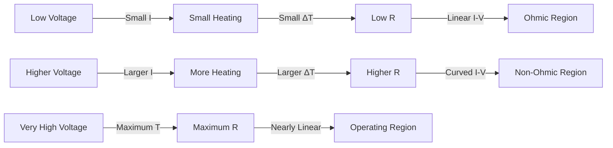
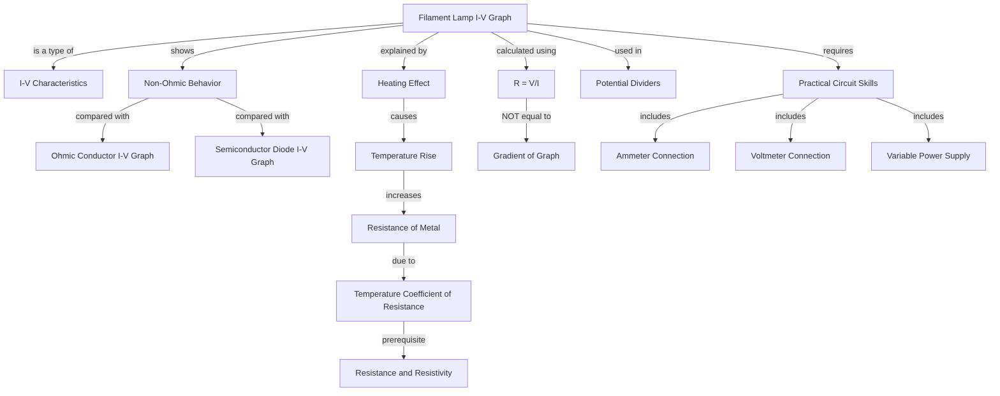

# Filament Lamp I-V Graph / 白炽灯I-V特性曲线

---

# 1. Overview / 概述

**English:**
The filament lamp is a classic non-ohmic conductor whose I-V characteristic graph reveals the temperature-dependent nature of resistance. Unlike ohmic conductors, the filament lamp's resistance increases as current flows through it, due to the heating effect of the current. This sub-topic explores why the I-V graph is curved, how to interpret the gradient, and the physical principles behind the changing resistance. Understanding this graph is essential for mastering [[I-V Characteristics]] and forms the foundation for more advanced topics like [[Potential Dividers]] and power dissipation in circuits.

**中文:**
白炽灯是一种经典的非欧姆导体，其I-V特性曲线揭示了电阻随温度变化的本质。与欧姆导体不同，白炽灯的电阻随电流增大而增加，这是由于电流的热效应。本子知识点探讨I-V图为何弯曲、如何解读斜率变化以及电阻变化的物理原理。理解该图是掌握[[I-V Characteristics]]的关键，并为[[Potential Dividers]]和电路功率损耗等进阶内容奠定基础。

---

# 2. Syllabus Learning Objectives / 考纲学习目标

| CAIE 9702 | Edexcel IAL |
|-----------|-------------|
| 9.3(g): Sketch and explain the I-V characteristic of a filament lamp | WPH11 U2: 3.13 - Describe the I-V characteristic of a filament lamp |
| 9.3(h): Explain why resistance increases with current | WPH11 U2: 3.14 - Explain the temperature dependence of resistance |
| 9.3(i): Calculate resistance from I-V graph at a point | WPH11 U2: 3.15 - Interpret gradient of I-V graph |
| 9.3(j): Compare with ohmic conductor | WPH11 U2: 3.16 - Compare I-V characteristics of different components |

**Examiner Expectations / 考官要求:**
- **English:** You must be able to sketch the curved I-V graph, explain why it curves (temperature effect), and calculate resistance at specific points using $R = V/I$. Do NOT confuse gradient with resistance — the gradient at a point is NOT equal to $1/R$ for a non-linear graph.
- **中文:** 必须能画出弯曲的I-V图，解释弯曲原因（温度效应），并能用$R = V/I$计算特定点的电阻。切勿混淆斜率与电阻——对于非线性图，某点的斜率不等于$1/R$。

---

# 3. Core Definitions / 核心定义

| Term (EN/CN) | Definition (EN) | Definition (CN) | Common Mistakes / 常见错误 |
|--------------|-----------------|-----------------|---------------------------|
| **Filament Lamp** / 白炽灯 | A device that produces light by heating a thin wire (filament) to high temperature using electric current | 利用电流加热细丝（灯丝）至高温而发光的器件 | Confusing with LED or fluorescent lamp |
| **Non-Ohmic Conductor** / 非欧姆导体 | A conductor that does NOT obey Ohm's law; its resistance changes with applied voltage or current | 不遵守欧姆定律的导体；其电阻随电压或电流变化 | Thinking all conductors are ohmic |
| **Temperature Coefficient of Resistance** / 电阻温度系数 | The property that resistance increases with temperature for metallic conductors | 金属导体电阻随温度升高的特性 | Forgetting this applies to metals, not semiconductors |
| **Dynamic Resistance** / 动态电阻 | The resistance at a specific point on a non-linear I-V graph, calculated as $R = V/I$ at that point | 非线性I-V图上某点的电阻，用该点的$V/I$计算 | Using gradient ($\Delta V/\Delta I$) instead of $V/I$ |
| **Heating Effect** / 热效应 | The conversion of electrical energy into thermal energy due to resistance | 电阻将电能转化为热能的过程 | Ignoring that this causes the resistance change |

---

# 4. Key Concepts Explained / 关键概念详解

## 4.1 Why the Filament Lamp I-V Graph Curves / 白炽灯I-V图为何弯曲

### Explanation / 解释
**English:**
When a small voltage is first applied, the filament is at room temperature, so its resistance is low. The current increases linearly with voltage initially (ohmic region at low voltages). As the current increases, more electrical energy is converted to heat ($P = I^2R$), raising the filament's temperature. For metallic conductors, resistance increases with temperature (positive temperature coefficient). This increased resistance causes the current to increase more slowly for each additional volt — the graph curves and becomes shallower. At very high voltages, the filament approaches its maximum operating temperature (~2500°C for tungsten), and the graph becomes nearly linear again but with a much smaller gradient.

**中文:**
当首次施加小电压时，灯丝处于室温，电阻较低。电流最初随电压线性增加（低压下的欧姆区）。随着电流增大，更多电能转化为热能（$P = I^2R$），灯丝温度升高。对于金属导体，电阻随温度升高而增大（正温度系数）。电阻增大导致每增加一伏特电压时电流增加得更慢——图线弯曲并变平缓。在极高电压下，灯丝接近其最高工作温度（钨丝约2500°C），图线再次接近线性，但斜率小得多。

### Physical Meaning / 物理意义
**English:**
The curvature directly shows that resistance is NOT constant — it increases with current. This is fundamentally different from an [[Ohmic Conductor I-V Graph]] where resistance is constant. The filament lamp demonstrates the coupling between electrical and thermal physics: current causes heating, heating changes resistance, and changed resistance affects current.

**中文:**
弯曲直接表明电阻不是恒定的——它随电流增大而增大。这与[[Ohmic Conductor I-V Graph]]中电阻恒定有本质区别。白炽灯展示了电学与热学的耦合：电流产生热量，热量改变电阻，电阻变化又影响电流。

### Common Misconceptions / 常见误区
- ❌ **"The gradient of the I-V graph equals 1/R"** — This is ONLY true for ohmic conductors. For a filament lamp, the gradient at a point is $\Delta I/\Delta V$, which is NOT equal to $1/R$ because the graph is non-linear.
- ❌ **"The filament lamp obeys Ohm's law at low voltages"** — It appears linear at very low voltages, but this is because the temperature hasn't changed significantly yet. Strictly, it never obeys Ohm's law because resistance always changes with current.
- ❌ **"The graph is symmetrical for reverse bias"** — The filament lamp is a symmetrical device (unlike a [[Semiconductor Diode I-V Graph]]), so the I-V graph is anti-symmetrical about the origin.

### Exam Tips / 考试提示
- **English:** Always sketch the graph passing through the origin. Label the axes correctly (I on y-axis, V on x-axis). Show the curvature clearly — it should be concave downwards (getting shallower). For calculation questions, use $R = V/I$ at the specific point, NOT the gradient.
- **中文:** 画图时务必经过原点。正确标注坐标轴（I在y轴，V在x轴）。清晰显示弯曲——应为向下凹（逐渐变平缓）。计算题用$R = V/I$计算某点电阻，切勿用斜率。

> 📷 **IMAGE PROMPT — FL01: Filament Lamp I-V Characteristic Graph**
> A clear graph showing current (I) on the y-axis and voltage (V) on the x-axis. The curve starts at the origin, rises linearly at first, then curves downwards (concave) as voltage increases. Label the initial linear region "low voltage - ohmic region" and the curved region "high voltage - non-ohmic region". Show a dashed line from a point on the curve to the axes to indicate how to calculate R = V/I at that point.

---

# 5. Essential Equations / 核心公式

## Equation 1: Resistance from I-V Graph

$$ R = \frac{V}{I} $$

| Symbol (符号) | Meaning (EN) | Meaning (CN) | Unit (单位) |
|--------------|-------------|-------------|------------|
| $R$ | Resistance at a specific operating point | 特定工作点的电阻 | $\Omega$ |
| $V$ | Voltage across the lamp at that point | 该点灯两端的电压 | V |
| $I$ | Current through the lamp at that point | 该点通过灯的电流 | A |

**Conditions / 适用条件:**
- **English:** This formula gives the **static resistance** (also called DC resistance) at a specific operating point. It is valid for any point on the I-V graph.
- **中文:** 该公式给出特定工作点的**静态电阻**（也称直流电阻），适用于I-V图上任意点。

**Limitations / 局限性:**
- **English:** This does NOT give the incremental resistance (small-signal resistance), which would be $\Delta V/\Delta I$. For a non-linear device, static and dynamic resistance differ.
- **中文:** 该公式不给出增量电阻（小信号电阻），后者为$\Delta V/\Delta I$。对于非线性器件，静态电阻与动态电阻不同。

## Equation 2: Power Dissipation

$$ P = IV = I^2R = \frac{V^2}{R} $$

| Symbol (符号) | Meaning (EN) | Meaning (CN) | Unit (单位) |
|--------------|-------------|-------------|------------|
| $P$ | Power dissipated as heat and light | 以热和光形式耗散的功率 | W |

**Conditions / 适用条件:**
- **English:** All three forms are equivalent. Use $P = IV$ when you know current and voltage directly from the graph.
- **中文:** 三种形式等价。当从图中直接知道电流和电压时，用$P = IV$。

**Limitations / 局限性:**
- **English:** For a filament lamp, most power (~95%) is dissipated as heat, only ~5% as visible light. This is why filament lamps are inefficient.
- **中文:** 白炽灯约95%的功率以热的形式耗散，仅约5%转化为可见光，因此效率很低。

---

# 6. Graphs and Relationships / 图表与关系

## 6.1 Filament Lamp I-V Characteristic / 白炽灯I-V特性曲线

### Axes / 坐标轴
- **X-axis:** Voltage $V$ / 电压 $V$ (V)
- **Y-axis:** Current $I$ / 电流 $I$ (A)

### Shape / 形状
**English:** The graph passes through the origin. At low voltages (0 to ~1V), it is approximately linear (ohmic region). As voltage increases further, the graph curves downwards (concave), becoming progressively shallower. The curve is anti-symmetrical about the origin for reverse bias (since the lamp is a symmetrical device).

**中文:** 图线经过原点。低压时（0至约1V）近似线性（欧姆区）。随电压进一步增大，图线向下弯曲（凹形），逐渐变平缓。反向偏置时图线关于原点反对称（因为灯是对称器件）。

### Gradient Meaning / 斜率含义
**English:** The gradient $\Delta I/\Delta V$ at any point is **NOT** equal to $1/R$. It represents the **incremental conductance** (how much the current changes for a small change in voltage). The gradient decreases as voltage increases because resistance increases.

**中文:** 任意点的斜率$\Delta I/\Delta V$**不等于**$1/R$。它代表**增量电导**（电压微小变化引起的电流变化量）。斜率随电压增大而减小，因为电阻增大。

### Area Meaning / 面积含义
**English:** The area under the I-V graph up to a point represents the **power** dissipated at that operating point ($P = IV$). This is because area = $V \times I$ = power.

**中文:** I-V图下至某点的面积代表该工作点耗散的**功率**（$P = IV$）。因为面积 = $V \times I$ = 功率。

### Exam Interpretation / 考试解读
**English:** When asked to "explain the shape," always mention: (1) initial linear region — low current, small temperature rise, resistance approximately constant; (2) curvature — as current increases, more heating, temperature rises, resistance increases, so current increases more slowly; (3) at very high voltages, the graph becomes nearly linear again as the filament approaches its maximum temperature.

**中文:** 当被要求"解释形状"时，务必提到：(1) 初始线性区——电流小，温升小，电阻近似恒定；(2) 弯曲——随电流增大，发热增加，温度升高，电阻增大，电流增加变慢；(3) 极高电压时，灯丝接近最高温度，图线再次接近线性。

---

# 7. Required Diagrams / 必备图表

## 7.1 Filament Lamp I-V Characteristic with Resistance Calculation / 白炽灯I-V特性曲线及电阻计算

### Description / 描述
**English:** A complete I-V characteristic graph for a filament lamp showing both forward and reverse bias. The graph should include: labeled axes (I in A, V in V), the curved shape passing through origin, a specific operating point marked with coordinates, and a dashed line showing how to read V and I values for resistance calculation.

**中文:** 白炽灯的完整I-V特性曲线图，显示正反向偏置。图应包括：标注坐标轴（I/A，V/V），经过原点的弯曲形状，标记特定工作点坐标，以及显示如何读取V和I值计算电阻的虚线。

### Image Prompt / 图片生成提示
> 📷 **IMAGE PROMPT — FL02: Filament Lamp I-V Graph with Operating Point**
> A professional physics textbook-style graph. X-axis: Voltage/V from -12 to +12. Y-axis: Current/A from -0.5 to +0.5. A smooth curve passes through the origin, anti-symmetrical. At low voltages (0 to ±2V), the curve is nearly straight. Beyond ±2V, it curves downwards. Mark a point at (6V, 0.3A) with a dot. Draw dashed horizontal line from this point to the y-axis (I=0.3A) and dashed vertical line to the x-axis (V=6V). Label these as "I" and "V". Add a note: "R = V/I = 6/0.3 = 20Ω at this point". Include grid lines for readability.

### Labels Required / 需要标注
| Label (EN) | Label (CN) | Description |
|------------|------------|-------------|
| Ohmic region | 欧姆区 | Linear portion at low voltages |
| Non-ohmic region | 非欧姆区 | Curved portion at higher voltages |
| Operating point (V, I) | 工作点 (V, I) | Specific point where resistance is calculated |
| R = V/I | R = V/I | Formula for resistance at that point |

### Exam Importance / 考试重要性
**English:** This diagram is frequently tested in Paper 2 (theory) and Paper 4 (A2). Students must be able to sketch it from memory, explain the shape, and calculate resistance from a given point. The ability to read values from the graph and apply $R = V/I$ is essential.

**中文:** 该图在Paper 2（理论）和Paper 4（A2）中经常考到。学生必须能凭记忆画出、解释形状、并从给定点计算电阻。从图中读取数值并应用$R = V/I$的能力至关重要。

---

# 8. Worked Examples / 典型例题

## Example 1: Calculating Resistance from I-V Graph / 从I-V图计算电阻

### Question / 题目
**English:**
The I-V characteristic of a filament lamp is shown below. At a voltage of 8.0 V, the current through the lamp is 0.40 A.

(a) Calculate the resistance of the lamp at this operating point.
(b) At a lower voltage of 2.0 V, the current is 0.25 A. Calculate the resistance at this point.
(c) Explain why the resistance is different at the two points.

**中文:**
某白炽灯的I-V特性曲线如下所示。当电压为8.0 V时，通过灯的电流为0.40 A。

(a) 计算该工作点灯的电阻。
(b) 在较低电压2.0 V时，电流为0.25 A。计算该点的电阻。
(c) 解释为什么两个点的电阻不同。

### Solution / 解答

**(a)** Using $R = V/I$:
$$ R = \frac{8.0}{0.40} = 20 \, \Omega $$

**(b)** Using $R = V/I$:
$$ R = \frac{2.0}{0.25} = 8.0 \, \Omega $$

**(c)** **English:** At the higher voltage (8.0 V), more current flows through the lamp, causing greater heating ($P = I^2R$). The filament temperature increases significantly. Since the filament is made of a metal (tungsten), its resistance increases with temperature (positive temperature coefficient). Therefore, the resistance at 8.0 V (20 Ω) is higher than at 2.0 V (8.0 Ω).

**中文:** 在较高电压（8.0 V）时，更多电流通过灯丝，产生更大的热量（$P = I^2R$）。灯丝温度显著升高。由于灯丝由金属（钨）制成，其电阻随温度升高而增大（正温度系数）。因此，8.0 V时的电阻（20 Ω）高于2.0 V时的电阻（8.0 Ω）。

### Final Answer / 最终答案
**Answer:** (a) 20 Ω (b) 8.0 Ω (c) Resistance increases with temperature due to heating effect | **答案：** (a) 20 Ω (b) 8.0 Ω (c) 由于热效应，电阻随温度升高而增大

### Quick Tip / 提示
**English:** Always use $R = V/I$, NOT the gradient. The gradient at 8.0 V would give a different (and incorrect) value because the graph is non-linear. | **中文：** 始终用$R = V/I$，不要用斜率。8.0 V处的斜率会给出不同（且错误）的值，因为图是非线性的。

---

## Example 2: Comparing Filament Lamp with Ohmic Conductor / 比较白炽灯与欧姆导体

### Question / 题目
**English:**
A student connects a filament lamp and a fixed resistor separately to a variable power supply. She measures current for different voltages and plots I-V graphs for both components.

(a) Sketch the expected I-V graphs for both components on the same axes.
(b) State two differences between the graphs.
(c) The fixed resistor has a resistance of 10 Ω. Calculate the current when the voltage across it is 5.0 V.

**中文:**
一名学生分别将白炽灯和固定电阻连接到可调电源。她测量不同电压下的电流，并画出两个元件的I-V图。

(a) 在同一坐标轴上画出两个元件预期的I-V图。
(b) 指出两个图的两个不同点。
(c) 固定电阻的阻值为10 Ω。计算其两端电压为5.0 V时的电流。

### Solution / 解答

**(a)** **English:** The fixed resistor graph is a straight line through the origin (ohmic conductor). The filament lamp graph starts similarly but curves downwards at higher voltages.

**中文:** 固定电阻图是通过原点的直线（欧姆导体）。白炽灯图起始类似，但在较高电压时向下弯曲。

**(b)** **Differences / 不同点:**
| Difference (EN) | Difference (CN) |
|-----------------|-----------------|
| Fixed resistor graph is linear; filament lamp graph is curved | 固定电阻图是线性的；白炽灯图是弯曲的 |
| Fixed resistor has constant gradient; filament lamp gradient decreases | 固定电阻斜率恒定；白炽灯斜率减小 |
| Fixed resistor resistance is constant; filament lamp resistance increases with voltage | 固定电阻阻值恒定；白炽灯电阻随电压增大 |

**(c)** Using Ohm's law $V = IR$:
$$ I = \frac{V}{R} = \frac{5.0}{10} = 0.50 \, \text{A} $$

### Final Answer / 最终答案
**Answer:** (a) See sketch (b) Linearity and gradient constancy (c) 0.50 A | **答案：** (a) 见草图 (b) 线性度和斜率恒定性 (c) 0.50 A

### Quick Tip / 提示
**English:** For the fixed resistor, you can use either $R = V/I$ or the gradient method — they give the same result because the graph is linear. | **中文：** 对于固定电阻，可以用$R = V/I$或斜率法——结果相同，因为图是线性的。

---

# 9. Past Paper Question Types / 历年真题题型

| Question Type / 题型 | Frequency / 频率 | Difficulty / 难度 | Past Paper References / 真题索引 |
|----------------------|------------------|------------------|-------------------------------|
| Sketch I-V graph and explain shape | ★★★★★ Very High | Medium | 📝 *待填入* |
| Calculate resistance from graph point | ★★★★ High | Easy | 📝 *待填入* |
| Compare with ohmic conductor | ★★★ Medium | Medium | 📝 *待填入* |
| Explain why resistance changes | ★★★★★ Very High | Medium | 📝 *待填入* |
| Power calculation from I-V graph | ★★★ Medium | Medium | 📝 *待填入* |
| Experimental design for I-V characteristics | ★★ Low | Hard | 📝 *待填入* |

**Common Command Words / 常见指令词:**
- **Sketch** / 画出 — Draw the approximate shape (not to scale)
- **Explain** / 解释 — Give reasons for the shape
- **Calculate** / 计算 — Use $R = V/I$ with values from graph
- **Compare** / 比较 — State similarities and differences
- **Suggest** / 建议 — Propose an explanation or improvement

---

# 10. Practical Skills Connections / 实验技能链接

**English:**
The filament lamp I-V characteristic is a common required practical. Key skills include:

1. **Circuit Setup:** Connect the lamp in series with an ammeter and in parallel with a voltmeter. Use a variable power supply or potential divider to vary voltage.
2. **Data Collection:** Record current for increasing voltage steps (e.g., 0V, 1V, 2V... up to 12V). Also collect data for decreasing voltage to check for hysteresis (though minimal for filament lamps).
3. **Safety:** Do not exceed the lamp's rated voltage (usually 12V or 6V). The lamp gets very hot — allow cooling between readings.
4. **Uncertainties:** Voltmeter and ammeter readings have ± half the smallest division. For a digital meter, use ±1 least significant digit.
5. **Graph Plotting:** Plot I on y-axis, V on x-axis. Draw a smooth curve through points (not straight line segments). The curve must pass through the origin.
6. **Error Analysis:** If points don't lie exactly on a smooth curve, consider: heating effects during measurement, contact resistance, or meter calibration errors.

**Common Practical Question:** "Suggest why the graph is not a perfect smooth curve" — Answer: The lamp temperature changes during measurement, or there is experimental uncertainty in readings.

**中文:**
白炽灯I-V特性是常见的必做实验。关键技能包括：

1. **电路搭建：** 灯与电流表串联，电压表并联。用可调电源或分压器改变电压。
2. **数据采集：** 记录电压递增时的电流（如0V、1V、2V...至12V）。也记录递减数据检查滞后效应（白炽灯滞后很小）。
3. **安全：** 不要超过灯的额定电压（通常12V或6V）。灯会非常热——读数间应让其冷却。
4. **不确定度：** 电压表和电流表读数有±最小刻度的一半。数字表用±1个最低有效位。
5. **作图：** I在y轴，V在x轴。通过数据点画平滑曲线（不是直线段）。曲线必须经过原点。
6. **误差分析：** 如果点不在平滑曲线上，考虑：测量时灯的温度变化、接触电阻、或仪表校准误差。

**常见实验题：** "建议为什么图不是完美的平滑曲线"——答案：测量过程中灯的温度变化，或读数有实验不确定度。

---

# 11. Concept Map / 概念图谱

---

# 12. Quick Revision Sheet / 速查表

| Category / 类别 | Key Points / 要点 |
|----------------|------------------|
| **Definition / 定义** | Non-ohmic conductor; resistance increases with current due to heating |
| **Key Formula / 核心公式** | $R = V/I$ at a point (NOT gradient); $P = IV$ for power |
| **Key Graph / 核心图表** | I-V curve: linear at low V, concave downwards at high V; passes through origin; anti-symmetrical |
| **Shape Explanation / 形状解释** | Low V: small I, small heating, constant R → linear. High V: large I, large heating, R increases → curved |
| **Common Mistake / 常见错误** | ❌ Using gradient = 1/R for filament lamp; ✅ Use R = V/I at the point |
| **Comparison / 比较** | vs Ohmic: linear vs curved, constant R vs increasing R. vs Diode: symmetrical vs asymmetrical |
| **Exam Tip / 考试提示** | Always sketch through origin. Label axes I/A and V/V. Show curvature clearly. For calculations, read V and I from the point, then divide. |
| **Practical Tip / 实验提示** | Use potential divider circuit. Allow lamp to cool between readings. Plot smooth curve through points. |
| **Key Equation / 关键方程** | $R = V/I$ (static resistance at operating point) |
| **Key Graph Shape / 关键图形** | 📈 Concave downward curve through origin |