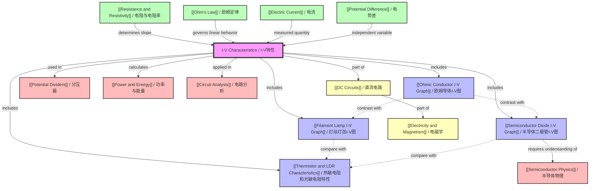

# 1. Overview / 概述

**English:**
This topic explores the **I-V (Current-Voltage) Characteristics** of electrical components, which is fundamental to understanding how different circuit elements behave under varying voltage conditions. The I-V characteristic is a graphical representation showing how the current through a component varies as the potential difference across it changes. This topic is crucial because it reveals whether a component obeys [[Ohm's Law]] (ohmic conductors) or exhibits non-ohmic behavior (filament lamps, semiconductor diodes, thermistors, and LDRs).

In both Cambridge 9702 and Edexcel IAL A-Level Physics, this topic is examined through:
- **Graphical analysis:** Interpreting the shape, gradient, and intercepts of I-V curves
- **Experimental skills:** Setting up circuits to measure I-V characteristics
- **Theoretical understanding:** Explaining the physical mechanisms behind non-linear behavior
- **Application:** Understanding how components like [[Thermistor and LDR Characteristics]] are used in sensing circuits

Real-world applications include:
- **Electronic circuit design:** Understanding component behavior for proper circuit operation
- **Sensor technology:** Thermistors and LDRs in temperature and light sensing
- **Power electronics:** Diode characteristics in rectification circuits
- **Lighting systems:** Filament lamp behavior in household lighting

**中文：**
本主题探讨电气元件的 **I-V（电流-电压）特性**，这是理解不同电路元件在不同电压条件下如何行为的基础。I-V特性是一种图形表示，显示当元件两端的电势差变化时，通过元件的电流如何变化。这个主题至关重要，因为它揭示了元件是遵循[[欧姆定律]]（欧姆导体）还是表现出非欧姆行为（灯丝灯泡、半导体二极管、热敏电阻和光敏电阻）。

在剑桥9702和爱德思IAL A-Level物理中，本主题通过以下方式考查：
- **图形分析：** 解释I-V曲线的形状、斜率和截距
- **实验技能：** 搭建电路测量I-V特性
- **理论理解：** 解释非线性行为背后的物理机制
- **应用：** 理解[[热敏电阻和光敏电阻特性]]等元件在传感电路中的使用

实际应用包括：
- **电子电路设计：** 理解元件行为以确保电路正常运行
- **传感器技术：** 热敏电阻和光敏电阻在温度和光传感中的应用
- **电力电子：** 二极管特性在整流电路中的应用
- **照明系统：** 家用照明中灯丝灯泡的行为

---

# 2. Syllabus Learning Objectives / 考纲学习目标

| CAIE 9702 (9.3 g-j) | Edexcel IAL (WPH11 U2: 3.13-3.16) |
|---------------------|-----------------------------------|
| 9.3(g) Sketch and explain the I-V characteristic of an ohmic conductor | 3.13 Know that the I-V characteristic for an ohmic conductor at constant temperature is a straight line through the origin |
| 9.3(h) Sketch and explain the I-V characteristic of a filament lamp | 3.14 Know that the I-V characteristic for a filament lamp shows an increasing resistance with increasing current |
| 9.3(i) Sketch and explain the I-V characteristic of a semiconductor diode | 3.15 Know that the I-V characteristic for a semiconductor diode shows negligible current in reverse bias and a threshold voltage in forward bias |
| 9.3(j) Sketch and explain the I-V characteristic of a thermistor | 3.16 Understand how the I-V characteristics of a thermistor and an LDR differ from those of an ohmic conductor |

**Examiner Expectations / 考官期望:**

**English:**
- **Sketching:** Draw accurate I-V curves with correct shapes, axes labels (I on y-axis, V on x-axis), and key features (threshold voltage, saturation, linear regions)
- **Explaining:** Provide physical reasoning for the shape, linking to atomic/molecular behavior (e.g., lattice vibrations, charge carrier concentration)
- **Comparing:** Contrast ohmic vs. non-ohmic behavior, and different non-ohmic components
- **Calculating:** Use gradient of I-V graph to determine resistance (R = V/I at a point)
- **Experimental:** Describe circuit setup (variable resistor, ammeter in series, voltmeter in parallel) and safety precautions

**中文：**
- **绘制：** 准确画出I-V曲线，标注正确的坐标轴（I在y轴，V在x轴）和关键特征（阈值电压、饱和区、线性区）
- **解释：** 提供形状的物理原因，联系原子/分子行为（如晶格振动、载流子浓度）
- **比较：** 对比欧姆与非欧姆行为，以及不同的非欧姆元件
- **计算：** 利用I-V图的斜率确定电阻（某点的R = V/I）
- **实验：** 描述电路搭建（可变电阻、电流表串联、电压表并联）和安全注意事项

> 📋 **CIE Only:** CAIE requires students to sketch AND explain the I-V characteristics for all four components (ohmic conductor, filament lamp, diode, thermistor). The explanation must include the physical mechanism behind the shape.
>
> 📋 **Edexcel Only:** Edexcel focuses more on knowing the characteristics and understanding how they differ from ohmic conductors. The syllabus explicitly mentions comparing thermistor and LDR characteristics with ohmic conductors.

---

# 3. Core Definitions / 核心定义

| Term (EN/CN) | Definition (EN) | Definition (CN) | Common Mistakes / 常见错误 |
|--------------|-----------------|-----------------|---------------------------|
| **I-V Characteristic** / I-V特性 | A graph showing the relationship between the current through a component and the potential difference across it | 显示通过元件的电流与元件两端电势差之间关系的图形 | Confusing axes: I is always on y-axis, V on x-axis |
| **Ohmic Conductor** / 欧姆导体 | A conductor that obeys [[Ohm's Law]]; current is directly proportional to voltage at constant temperature | 遵循[[欧姆定律]]的导体；在恒定温度下电流与电压成正比 | Assuming all conductors are ohmic; forgetting "constant temperature" condition |
| **Non-Ohmic Conductor** / 非欧姆导体 | A conductor that does not obey Ohm's Law; the resistance changes with voltage or current | 不遵循欧姆定律的导体；电阻随电压或电流变化 | Thinking non-ohmic means no relationship between I and V |
| **Filament Lamp** / 灯丝灯泡 | A component where current heats a thin wire (filament), causing increased resistance due to lattice vibrations | 电流加热细丝（灯丝）的元件，由于晶格振动导致电阻增加 | Confusing with LED; forgetting resistance increases with temperature |
| **Semiconductor Diode** / 半导体二极管 | A component that allows current to flow in one direction only (forward bias) with a threshold voltage of ~0.6-0.7V | 只允许电流单向流动（正向偏置）的元件，阈值电压约0.6-0.7V | Thinking diode conducts in reverse bias; confusing threshold voltage with breakdown voltage |
| **Forward Bias** / 正向偏置 | Applying voltage so that the p-type side is positive relative to the n-type side, allowing current flow | 施加电压使p型侧相对于n型侧为正，允许电流流动 | Reversing the polarity; thinking forward bias means high resistance |
| **Reverse Bias** / 反向偏置 | Applying voltage so that the n-type side is positive relative to the p-type side, blocking current flow | 施加电压使n型侧相对于p型侧为正，阻止电流流动 | Thinking no current flows at all (there is a tiny leakage current) |
| **Threshold Voltage** / 阈值电压 | The minimum forward voltage required for a diode to conduct significantly (~0.6V for silicon) | 二极管开始显著导通所需的最小正向电压（硅约0.6V） | Confusing with breakdown voltage; thinking it's the same for all diodes |
| **Thermistor** / 热敏电阻 | A temperature-dependent resistor; resistance decreases as temperature increases (NTC type) | 温度依赖型电阻；电阻随温度升高而降低（NTC型） | Forgetting there are PTC types; assuming linear relationship |
| **LDR (Light Dependent Resistor)** / 光敏电阻 | A light-dependent resistor; resistance decreases as light intensity increases | 光依赖型电阻；电阻随光强度增加而降低 | Confusing with photodiode; forgetting response time limitations |

---

# 4. Key Concepts Explained / 关键概念详解

## 4.1 Ohmic Conductor I-V Characteristic / 欧姆导体I-V特性

### Explanation / 解释
**English:**
An [[Ohmic Conductor I-V Graph]] shows a straight line through the origin, indicating that current is directly proportional to voltage. This means the resistance is constant (R = V/I = constant). The gradient of the line is 1/R. Examples include metal wires at constant temperature and [[Resistance and Resistivity]] fixed resistors.

The physical explanation is that at constant temperature, the lattice vibrations in the metal are constant. The drift velocity of electrons is proportional to the electric field (and hence voltage), so current is proportional to voltage. This is the basis of [[Ohm's Law]].

**中文：**
[[欧姆导体I-V图]]显示一条通过原点的直线，表明电流与电压成正比。这意味着电阻是恒定的（R = V/I = 常数）。线的斜率为1/R。例子包括恒定温度下的金属线和[[电阻与电阻率]]固定电阻。

物理解释是，在恒定温度下，金属中的晶格振动是恒定的。电子的漂移速度与电场（因此与电压）成正比，所以电流与电压成正比。这是[[欧姆定律]]的基础。

### Physical Meaning / 物理意义
**English:**
If you double the voltage across an ohmic conductor, the current doubles. The component behaves predictably and linearly. This is why fixed resistors are used in voltage dividers and current limiters.

**中文：**
如果加倍欧姆导体两端的电压，电流也加倍。元件行为可预测且线性。这就是为什么固定电阻用于分压器和限流器。

### Common Misconceptions / 常见误区
- **Misconception 1:** All conductors are ohmic. *Correction:* Only at constant temperature; filament lamps are non-ohmic.
- **Misconception 2:** The gradient of I-V graph equals resistance. *Correction:* Gradient = 1/R, not R.
- **Misconception 3:** Ohmic means the I-V graph is always a straight line. *Correction:* It must pass through the origin too.

### Exam Tips / 考试提示
**English:**
- Always state "at constant temperature" when describing ohmic conductors
- Use the gradient to calculate resistance: R = 1/gradient
- Be prepared to sketch the graph and explain why it's linear
- Remember that the I-V graph for an ohmic conductor is symmetrical for positive and negative voltages

**中文：**
- 描述欧姆导体时始终说明"在恒定温度下"
- 利用斜率计算电阻：R = 1/斜率
- 准备绘制图形并解释为什么是线性的
- 记住欧姆导体的I-V图对正负电压是对称的

> 📷 **IMAGE PROMPT — IV-01: Ohmic Conductor I-V Characteristic**
>
> A clean, labeled graph showing a straight line through the origin. The y-axis is labeled "Current I / A" and the x-axis is labeled "Potential Difference V / V". The line has a constant positive gradient. Include a small circuit diagram in the corner showing a resistor with an ammeter in series and voltmeter in parallel. Style: textbook-quality diagram, white background, black lines, clear labels.

---

## 4.2 Filament Lamp I-V Characteristic / 灯丝灯泡I-V特性

### Explanation / 解释
**English:**
A [[Filament Lamp I-V Graph]] shows a curve that starts linear near the origin but then curves towards the voltage axis (becomes less steep) as current increases. This indicates that resistance increases with current.

The physical mechanism: As current increases, the filament gets hotter (Joule heating). The increased temperature causes greater lattice vibrations in the metal, which scatter electrons more frequently. This increases the resistance. The relationship is R ∝ T (approximately), and since P = I²R, the heating effect increases rapidly with current.

**中文：**
[[灯丝灯泡I-V图]]显示一条曲线，在原点附近是线性的，但随着电流增加向电压轴弯曲（变得更平缓）。这表明电阻随电流增加而增加。

物理机制：随着电流增加，灯丝变热（焦耳加热）。温度升高导致金属中晶格振动加剧，更频繁地散射电子。这增加了电阻。关系近似为R ∝ T，且由于P = I²R，加热效应随电流迅速增加。

### Physical Meaning / 物理意义
**English:**
A filament lamp is self-regulating: as more current flows, it gets hotter, which increases resistance, which limits further current increase. This is why filament lamps don't blow immediately when turned on—the initial cold resistance is much lower than the hot operating resistance.

**中文：**
灯丝灯泡是自调节的：随着更多电流流过，它变热，这增加了电阻，从而限制了进一步的电流增加。这就是为什么灯丝灯泡在打开时不会立即烧毁——初始冷电阻远低于热工作电阻。

### Common Misconceptions / 常见误区
- **Misconception 1:** The filament lamp obeys Ohm's Law at low voltages. *Correction:* Even at low voltages, if temperature changes, it's non-ohmic. However, at very low currents where heating is negligible, it approximates ohmic behavior.
- **Misconception 2:** The I-V graph is a straight line. *Correction:* It curves because resistance changes.
- **Misconception 3:** Resistance decreases with current. *Correction:* Resistance increases with current (and temperature).

### Exam Tips / 考试提示
**English:**
- Sketch the curve showing it starts linear then curves towards V-axis
- Explain the shape using the heating effect and lattice vibrations
- Calculate resistance at a point using R = V/I (not gradient)
- Compare with ohmic conductor: filament lamp has increasing resistance

**中文：**
- 绘制曲线，显示它从线性开始然后向V轴弯曲
- 使用加热效应和晶格振动解释形状
- 使用R = V/I（不是斜率）计算某点的电阻
- 与欧姆导体比较：灯丝灯泡电阻增加

> 📷 **IMAGE PROMPT — IV-02: Filament Lamp I-V Characteristic**
>
> A graph showing a curve that starts as a straight line from the origin, then gradually curves towards the x-axis (voltage axis). The y-axis is "Current I / A" and x-axis is "Voltage V / V". Include labels showing "Cold resistance" (steep initial gradient) and "Hot resistance" (shallower gradient at high current). Add a small diagram of a filament lamp circuit. Style: clear educational diagram, blue curve on white background.

---

## 4.3 Semiconductor Diode I-V Characteristic / 半导体二极管I-V特性

### Explanation / 解释
**English:**
A [[Semiconductor Diode I-V Graph]] shows highly asymmetric behavior:
- **Forward bias (V > 0):** Very little current flows until a threshold voltage (~0.6-0.7V for silicon) is reached, after which current increases rapidly with small voltage increases.
- **Reverse bias (V < 0):** Essentially no current flows (only a tiny leakage current, typically μA or less), until breakdown voltage is reached (not typically studied at A-Level).

The physical mechanism involves the p-n junction. In forward bias, the applied voltage reduces the depletion layer width, allowing charge carriers to cross the junction. Below threshold voltage, the depletion layer is too wide for significant current. Above threshold, carriers can cross easily. In reverse bias, the depletion layer widens, preventing carrier flow.

**中文：**
[[半导体二极管I-V图]]显示高度不对称的行为：
- **正向偏置（V > 0）：** 在达到阈值电压（硅约0.6-0.7V）之前几乎没有电流流动，之后电流随电压小幅增加而迅速增加。
- **反向偏置（V < 0）：** 基本上没有电流流动（只有微小的漏电流，通常为μA或更小），直到达到击穿电压（A-Level通常不研究）。

物理机制涉及p-n结。在正向偏置中，施加的电压减小耗尽层宽度，允许载流子穿过结。低于阈值电压时，耗尽层太宽，无法产生显著电流。高于阈值时，载流子可以轻松穿过。在反向偏置中，耗尽层变宽，阻止载流子流动。

### Physical Meaning / 物理意义
**English:**
Diodes act as one-way valves for electric current. They are used in:
- **Rectification:** Converting AC to DC
- **Protection:** Preventing reverse current damage
- **Logic gates:** In digital electronics
- **Voltage regulation:** Zener diodes (not at A-Level)

**中文：**
二极管充当电流的单向阀。它们用于：
- **整流：** 将交流转换为直流
- **保护：** 防止反向电流损坏
- **逻辑门：** 在数字电子中
- **电压调节：** 齐纳二极管（A-Level不涉及）

### Common Misconceptions / 常见误区
- **Misconception 1:** No current flows in reverse bias. *Correction:* A tiny leakage current flows (nA to μA range).
- **Misconception 2:** The diode conducts immediately in forward bias. *Correction:* It needs a threshold voltage (~0.6V for Si).
- **Misconception 3:** The I-V graph is symmetrical. *Correction:* It is highly asymmetric.
- **Misconception 4:** All diodes have the same threshold voltage. *Correction:* It varies (Si ~0.6V, Ge ~0.3V, LED ~1.5-3V).

### Exam Tips / 考试提示
**English:**
- Sketch the characteristic showing both forward and reverse bias regions
- Label the threshold voltage clearly (~0.6-0.7V)
- Explain the p-n junction mechanism (depletion layer, charge carriers)
- Remember that in reverse bias, the graph is essentially flat along the V-axis
- Be prepared to explain why a diode is used in a half-wave rectifier circuit

**中文：**
- 绘制特性曲线，显示正向和反向偏置区域
- 清晰标注阈值电压（~0.6-0.7V）
- 解释p-n结机制（耗尽层、载流子）
- 记住在反向偏置中，图形基本上沿V轴平坦
- 准备解释为什么二极管用于半波整流电路

> 📷 **IMAGE PROMPT — IV-03: Semiconductor Diode I-V Characteristic**
>
> A graph showing the asymmetric I-V characteristic of a silicon diode. The forward bias region (positive V) shows a sharp increase in current after ~0.7V. The reverse bias region (negative V) shows essentially zero current. Label: "Threshold voltage ~0.7V", "Forward bias", "Reverse bias", "Leakage current". Include a small diagram of a diode symbol. Style: clear technical diagram, two distinct regions clearly marked.

---

## 4.4 Thermistor and LDR Characteristics / 热敏电阻和光敏电阻特性

### Explanation / 解释
**English:**
Both [[Thermistor and LDR Characteristics]] are non-ohmic components whose resistance changes with external conditions:

**Thermistor (NTC type):** Resistance decreases as temperature increases. The I-V graph is non-linear because as current flows, Joule heating increases the temperature, which decreases resistance. This creates a positive feedback loop: more current → more heating → lower resistance → even more current.

**LDR:** Resistance decreases as light intensity increases. The I-V graph depends on light level. At constant light intensity, the LDR may behave approximately ohmically (linear I-V), but the resistance value changes with light level.

**中文：**
[[热敏电阻和光敏电阻特性]]都是非欧姆元件，其电阻随外部条件变化：

**热敏电阻（NTC型）：** 电阻随温度升高而降低。I-V图是非线性的，因为电流流动时，焦耳加热增加温度，从而降低电阻。这产生正反馈循环：更多电流 → 更多加热 → 更低电阻 → 更多电流。

**光敏电阻：** 电阻随光强度增加而降低。I-V图取决于光照水平。在恒定光强度下，光敏电阻可能近似欧姆行为（线性I-V），但电阻值随光照水平变化。

### Physical Meaning / 物理意义
**English:**
- **Thermistor:** Used in temperature sensors (thermostats, fire alarms, car engine temperature monitors)
- **LDR:** Used in light sensors (automatic street lights, camera exposure meters, burglar alarms)

Both are crucial components in [[Potential Dividers]] for creating voltage signals that vary with environmental conditions.

**中文：**
- **热敏电阻：** 用于温度传感器（恒温器、火灾报警器、汽车发动机温度监测器）
- **光敏电阻：** 用于光传感器（自动路灯、相机曝光计、防盗报警器）

两者都是[[分压器]]中用于创建随环境条件变化的电压信号的关键元件。

### Common Misconceptions / 常见误区
- **Misconception 1:** Thermistor resistance increases with temperature. *Correction:* NTC thermistors decrease; PTC thermistors increase (but A-Level typically uses NTC).
- **Misconception 2:** LDR resistance increases with light. *Correction:* Resistance decreases with increasing light intensity.
- **Misconception 3:** Thermistor and LDR have the same I-V shape. *Correction:* They are different; thermistor shows more pronounced non-linearity due to self-heating.
- **Misconception 4:** The I-V graph for LDR is always curved. *Correction:* At constant light, it can be approximately linear.

### Exam Tips / 考试提示
**English:**
- For thermistor: Explain the I-V shape using self-heating effect
- For LDR: Explain that at constant light, I-V is approximately linear, but resistance changes with light
- Both are used in potential divider circuits for sensing applications
- Be able to sketch how resistance varies with temperature/light (not just I-V)
- Understand the difference between NTC and PTC thermistors

**中文：**
- 对于热敏电阻：使用自加热效应解释I-V形状
- 对于光敏电阻：解释在恒定光照下I-V近似线性，但电阻随光照变化
- 两者都用于分压器电路进行传感应用
- 能够绘制电阻如何随温度/光照变化（不仅仅是I-V）
- 理解NTC和PTC热敏电阻的区别

> 📷 **IMAGE PROMPT — IV-04: Thermistor and LDR Characteristics Comparison**
>
> Two graphs side by side. Left: Thermistor I-V characteristic showing a curve that becomes steeper as voltage increases (resistance decreasing). Right: LDR I-V characteristics showing three straight lines at different gradients for different light levels (dim, medium, bright). Label each graph clearly. Include small icons: a thermometer for thermistor, a sun for LDR. Style: comparison diagram, clean layout, educational quality.

---

# 5. Essential Equations / 核心公式

## 5.1 Ohm's Law / 欧姆定律

**Equation / 公式:**
$$ V = IR $$

**Variables / 变量:**
| Symbol (符号) | Meaning (EN) | Meaning (CN) | Unit (单位) |
|--------------|-------------|-------------|------------|
| V | Potential difference | 电势差 | V (Volt) |
| I | Current | 电流 | A (Ampere) |
| R | Resistance | 电阻 | Ω (Ohm) |

**Derivation / 推导:**
**English:**
Ohm's Law is an empirical law, not derived from first principles. It states that for an ohmic conductor at constant temperature, the current through it is directly proportional to the potential difference across it. The constant of proportionality is the resistance.

From the I-V graph: gradient = ΔI/ΔV = 1/R, so R = 1/gradient.

**中文：**
欧姆定律是经验定律，不是从基本原理推导出来的。它指出，对于恒定温度下的欧姆导体，通过它的电流与它两端的电势差成正比。比例常数是电阻。

从I-V图：斜率 = ΔI/ΔV = 1/R，所以 R = 1/斜率。

**Conditions / 适用条件:**
**English:**
- Constant temperature
- Ohmic conductor (metal wire, fixed resistor)
- DC or low-frequency AC

**中文：**
- 恒定温度
- 欧姆导体（金属线、固定电阻）
- 直流或低频交流

**Limitations / 局限性:**
**English:**
- Does not apply to non-ohmic components (filament lamps, diodes, thermistors)
- Does not apply if temperature changes significantly
- Does not apply at very high frequencies (skin effect)

**中文：**
- 不适用于非欧姆元件（灯丝灯泡、二极管、热敏电阻）
- 如果温度显著变化则不适用
- 在非常高频率下不适用（趋肤效应）

**Rearrangements / 变形:**
$$ I = \frac{V}{R} \quad \text{and} \quad R = \frac{V}{I} $$

---

## 5.2 Power Dissipation / 功率耗散

**Equation / 公式:**
$$ P = IV = I^2R = \frac{V^2}{R} $$

**Variables / 变量:**
| Symbol (符号) | Meaning (EN) | Meaning (CN) | Unit (单位) |
|--------------|-------------|-------------|------------|
| P | Power | 功率 | W (Watt) |
| I | Current | 电流 | A (Ampere) |
| V | Potential difference | 电势差 | V (Volt) |
| R | Resistance | 电阻 | Ω (Ohm) |

**Derivation / 推导:**
**English:**
From the definition of power: P = IV (power = current × voltage)
Using Ohm's Law V = IR: P = I(IR) = I²R
Using Ohm's Law I = V/R: P = (V/R)V = V²/R

**中文：**
从功率定义：P = IV（功率 = 电流 × 电压）
使用欧姆定律 V = IR：P = I(IR) = I²R
使用欧姆定律 I = V/R：P = (V/R)V = V²/R

**Conditions / 适用条件:**
**English:**
- P = IV applies to any electrical component
- P = I²R and P = V²/R apply only to ohmic conductors (where V = IR holds)

**中文：**
- P = IV 适用于任何电气元件
- P = I²R 和 P = V²/R 仅适用于欧姆导体（其中 V = IR 成立）

**Limitations / 局限性:**
**English:**
- For non-ohmic components, only P = IV is valid
- P = I²R and P = V²/R give incorrect results if resistance is not constant

**中文：**
- 对于非欧姆元件，只有 P = IV 有效
- 如果电阻不恒定，P = I²R 和 P = V²/R 给出错误结果

**Rearrangements / 变形:**
$$ I = \frac{P}{V}, \quad V = \frac{P}{I}, \quad R = \frac{P}{I^2}, \quad R = \frac{V^2}{P} $$

---

## 5.3 Resistance from I-V Graph / 从I-V图求电阻

**Equation / 公式:**
$$ R = \frac{V}{I} \quad \text{(at a specific point)} $$

**Variables / 变量:**
| Symbol (符号) | Meaning (EN) | Meaning (CN) | Unit (单位) |
|--------------|-------------|-------------|------------|
| R | Resistance at that operating point | 该工作点的电阻 | Ω (Ohm) |
| V | Voltage at that point | 该点的电压 | V (Volt) |
| I | Current at that point | 该点的电流 | A (Ampere) |

**Derivation / 推导:**
**English:**
This is simply the definition of resistance. For a non-linear I-V graph, the resistance at any point is found by taking the coordinates (V, I) at that point and calculating R = V/I. This gives the **static resistance** or **DC resistance** at that operating point.

Note: The gradient of the I-V graph gives 1/R only for linear (ohmic) graphs. For non-linear graphs, the gradient at a point gives the **dynamic resistance** (r = dV/dI), which is different from the static resistance.

**中文：**
这只是电阻的定义。对于非线性I-V图，任何点的电阻通过取该点的坐标(V, I)并计算R = V/I得到。这给出了该工作点的**静态电阻**或**直流电阻**。

注意：I-V图的斜率只对线性（欧姆）图给出1/R。对于非线性图，某点的斜率给出**动态电阻**（r = dV/dI），这与静态电阻不同。

**Conditions / 适用条件:**
**English:**
- Applies to any component at any operating point
- Gives the static (DC) resistance

**中文：**
- 适用于任何元件在任何工作点
- 给出静态（直流）电阻

**Limitations / 局限性:**
**English:**
- Does not give the dynamic (AC) resistance
- For non-linear components, resistance changes with operating point

**中文：**
- 不给出动态（交流）电阻
- 对于非线性元件，电阻随工作点变化

**Rearrangements / 变形:**
$$ V = IR, \quad I = \frac{V}{R} $$

---

# 6. Graphs and Relationships / 图表与关系

## 6.1 Ohmic Conductor I-V Graph / 欧姆导体I-V图

### Axes / 坐标轴
**English:** x-axis: Voltage V (V), y-axis: Current I (A)
**中文：** x轴：电压 V (V)，y轴：电流 I (A)

### Shape / 形状
**English:** Straight line through the origin with constant positive gradient
**中文：** 通过原点的直线，具有恒定的正斜率

### Gradient Meaning / 斜率含义
**English:** Gradient = ΔI/ΔV = 1/R. A steeper gradient means lower resistance.
**中文：** 斜率 = ΔI/ΔV = 1/R。斜率越陡，电阻越小。

### Area Meaning / 面积含义
**English:** The area under the I-V graph has no direct physical meaning. However, the area under a P-V graph would give energy.
**中文：** I-V图下的面积没有直接的物理意义。然而，P-V图下的面积给出能量。

### Exam Interpretation / 考试解读
**English:**
- If the graph is a straight line through origin → ohmic conductor
- If the gradient changes → non-ohmic behavior
- Compare gradients of different lines to compare resistances

**中文：**
- 如果图形是通过原点的直线 → 欧姆导体
- 如果斜率变化 → 非欧姆行为
- 比较不同线的斜率以比较电阻

### Common Questions / 常见问题
**English:**
- "Determine the resistance from the graph" → Use R = V/I at any point
- "Explain why the graph is a straight line" → Constant temperature, obeying Ohm's Law
- "What happens to the graph if temperature increases?" → Gradient decreases (resistance increases)

**中文：**
- "从图中确定电阻" → 在任何点使用 R = V/I
- "解释为什么图形是直线" → 恒定温度，遵循欧姆定律
- "如果温度升高，图形会发生什么变化？" → 斜率减小（电阻增加）

---

## 6.2 Filament Lamp I-V Graph / 灯丝灯泡I-V图

### Axes / 坐标轴
**English:** x-axis: Voltage V (V), y-axis: Current I (A)
**中文：** x轴：电压 V (V)，y轴：电流 I (A)

### Shape / 形状
**English:** Starts linear near origin, then curves towards the voltage axis (gradient decreases)
**中文：** 在原点附近线性，然后向电压轴弯曲（斜率减小）

### Gradient Meaning / 斜率含义
**English:** The gradient decreases as voltage increases, indicating increasing resistance. The gradient at any point gives 1/dynamic resistance.
**中文：** 斜率随电压增加而减小，表明电阻增加。任何点的斜率给出1/动态电阻。

### Area Meaning / 面积含义
**English:** No direct physical meaning for I-V graph area.
**中文：** I-V图面积没有直接的物理意义。

### Exam Interpretation / 考试解读
**English:**
- Curve towards V-axis → resistance increases with current
- Initial linear portion → at low currents, heating is negligible
- Calculate resistance at a point using R = V/I (not gradient)

**中文：**
- 向V轴弯曲 → 电阻随电流增加
- 初始线性部分 → 在低电流下，加热可忽略
- 使用R = V/I（不是斜率）计算某点的电阻

### Common Questions / 常见问题
**English:**
- "Explain the shape of the I-V graph for a filament lamp" → Heating effect increases resistance
- "Calculate the resistance at V = 6V" → Read I from graph, use R = V/I
- "Compare with an ohmic conductor" → Ohmic has constant R, filament lamp has increasing R

**中文：**
- "解释灯丝灯泡I-V图的形状" → 加热效应增加电阻
- "计算V = 6V时的电阻" → 从图中读取I，使用R = V/I
- "与欧姆导体比较" → 欧姆导体R恒定，灯丝灯泡R增加

---

## 6.3 Semiconductor Diode I-V Graph / 半导体二极管I-V图

### Axes / 坐标轴
**English:** x-axis: Voltage V (V), y-axis: Current I (A). Show both positive and negative axes.
**中文：** x轴：电压 V (V)，y轴：电流 I (A)。显示正负轴。

### Shape / 形状
**English:** Highly asymmetric. Forward bias: negligible current until threshold (~0.7V), then rapid increase. Reverse bias: essentially zero current (flat line along V-axis).
**中文：** 高度不对称。正向偏置：在阈值（~0.7V）之前电流可忽略，然后迅速增加。反向偏置：基本上零电流（沿V轴的平坦线）。

### Gradient Meaning / 斜率含义
**English:** In forward bias above threshold, gradient is very steep → very low dynamic resistance. In reverse bias, gradient ≈ 0 → very high dynamic resistance.
**中文：** 在阈值以上的正向偏置中，斜率非常陡 → 非常低的动态电阻。在反向偏置中，斜率 ≈ 0 → 非常高的动态电阻。

### Area Meaning / 面积含义
**English:** No direct physical meaning.
**中文：** 没有直接的物理意义。

### Exam Interpretation / 考试解读
**English:**
- Asymmetric about origin → diode allows current in one direction only
- Threshold voltage → minimum voltage for conduction
- Flat reverse bias region → diode blocks reverse current

**中文：**
- 关于原点不对称 → 二极管只允许电流单向流动
- 阈值电压 → 导通的最小电压
- 平坦的反向偏置区域 → 二极管阻止反向电流

### Common Questions / 常见问题
**English:**
- "Sketch the I-V characteristic of a silicon diode" → Show threshold at ~0.7V
- "Explain why current increases rapidly after threshold" → Depletion layer collapses
- "What is the purpose of a diode in a circuit?" → Rectification, protection

**中文：**
- "绘制硅二极管的I-V特性" → 显示阈值在~0.7V
- "解释为什么阈值后电流迅速增加" → 耗尽层坍塌
- "二极管在电路中的目的是什么？" → 整流、保护

---

## 6.4 Thermistor I-V Graph / 热敏电阻I-V图

### Axes / 坐标轴
**English:** x-axis: Voltage V (V), y-axis: Current I (A)
**中文：** x轴：电压 V (V)，y轴：电流 I (A)

### Shape / 形状
**English:** Initially linear (low current, negligible self-heating), then curves upwards (becomes steeper) as voltage increases, indicating decreasing resistance.
**中文：** 初始线性（低电流，自加热可忽略），然后随电压增加向上弯曲（变得更陡），表明电阻减小。

### Gradient Meaning / 斜率含义
**English:** Gradient increases as voltage increases → resistance decreases (negative temperature coefficient).
**中文：** 斜率随电压增加而增加 → 电阻减小（负温度系数）。

### Area Meaning / 面积含义
**English:** No direct physical meaning.
**中文：** 没有直接的物理意义。

### Exam Interpretation / 考试解读
**English:**
- Curve becomes steeper → resistance decreases with increasing current/temperature
- Self-heating effect causes the non-linearity
- Compare with ohmic conductor: thermistor has decreasing R

**中文：**
- 曲线变得更陡 → 电阻随电流/温度增加而减小
- 自加热效应导致非线性
- 与欧姆导体比较：热敏电阻R减小

### Common Questions / 常见问题
**English:**
- "Explain the shape of the thermistor I-V graph" → Self-heating reduces resistance
- "How does the thermistor differ from a filament lamp?" → Thermistor R decreases, filament lamp R increases
- "What is the thermistor used for?" → Temperature sensing

**中文：**
- "解释热敏电阻I-V图的形状" → 自加热降低电阻
- "热敏电阻与灯丝灯泡有何不同？" → 热敏电阻R减小，灯丝灯泡R增加
- "热敏电阻用于什么？" → 温度传感

---

# 7. Required Diagrams / 必备图表

## 7.1 Circuit for Measuring I-V Characteristics / 测量I-V特性的电路

### Description / 描述
**English:**
A circuit diagram showing how to measure the I-V characteristic of a component. It includes:
- A DC power supply (or battery)
- A variable resistor (rheostat) to vary voltage
- An ammeter in series with the component (to measure current)
- A voltmeter in parallel with the component (to measure voltage)
- The component under test (resistor, filament lamp, diode, thermistor, or LDR)

For the diode, a switch to reverse polarity is needed to measure both forward and reverse bias characteristics.

**中文：**
显示如何测量元件I-V特性的电路图。包括：
- 直流电源（或电池）
- 可变电阻（变阻器）以改变电压
- 与元件串联的电流表（测量电流）
- 与元件并联的电压表（测量电压）
- 待测元件（电阻、灯丝灯泡、二极管、热敏电阻或光敏电阻）

对于二极管，需要一个开关来反转极性，以测量正向和反向偏置特性。

### Image Prompt / 图片生成提示
> 📷 **IMAGE PROMPT — IV-05: Circuit for Measuring I-V Characteristics**
>
> A clean circuit diagram showing: a DC power supply (battery symbol with + and -), a variable resistor (rheostat symbol with arrow), an ammeter (A in circle) in series, a voltmeter (V in circle) in parallel with the component, and a box labeled "Component under test". For diode measurement, include a reversing switch (DPDT switch). Use standard circuit symbols. Style: textbook-quality, black on white, clear labels, professional layout.

### Labels Required / 需要标注
**English:**
- Power supply (DC)
- Variable resistor / Rheostat
- Ammeter (A)
- Voltmeter (V)
- Component under test
- (For diode) Reversing switch

**中文：**
- 电源（直流）
- 可变电阻 / 变阻器
- 电流表 (A)
- 电压表 (V)
- 待测元件
- （对于二极管）反向开关

### Exam Importance / 考试重要性
**English:**
This circuit is essential for Paper 3 (CAIE) and Unit 3 (Edexcel) practical exams. Students must be able to:
- Draw the circuit correctly
- Explain why ammeter is in series and voltmeter in parallel
- Describe how to vary voltage using the variable resistor
- Explain safety precautions (e.g., not exceeding rated current for filament lamp)

**中文：**
这个电路对于CAIE Paper 3和Edexcel Unit 3实验考试至关重要。学生必须能够：
- 正确绘制电路
- 解释为什么电流表串联而电压表并联
- 描述如何使用可变电阻改变电压
- 解释安全预防措施（例如，不超过灯丝灯泡的额定电流）

---

## 7.2 I-V Characteristic Comparison Graph / I-V特性比较图

### Description / 描述
**English:**
A single graph showing all four I-V characteristics on the same axes for comparison:
1. **Ohmic conductor:** Straight line through origin
2. **Filament lamp:** Curve bending towards V-axis
3. **Semiconductor diode:** Asymmetric with threshold voltage
4. **Thermistor:** Curve bending away from V-axis (becoming steeper)

Each curve should be in a different color and clearly labeled.

**中文：**
在同一坐标轴上显示所有四种I-V特性以进行比较的单一图形：
1. **欧姆导体：** 通过原点的直线
2. **灯丝灯泡：** 向V轴弯曲的曲线
3. **半导体二极管：** 具有阈值电压的不对称曲线
4. **热敏电阻：** 远离V轴弯曲（变得更陡）的曲线

每条曲线应为不同颜色并清晰标注。

### Image Prompt / 图片生成提示
> 📷 **IMAGE PROMPT — IV-06: Comparison of I-V Characteristics**
>
> A single graph with four curves in different colors: Blue straight line (ohmic conductor), Red curve bending towards x-axis (filament lamp), Green asymmetric curve with sharp turn at +0.7V (diode), Purple curve bending upwards (thermistor). All on same axes: x-axis "Voltage V/V", y-axis "Current I/A". Include legend. Style: educational comparison diagram, clear colors, professional.

### Labels Required / 需要标注
**English:**
- Ohmic conductor (linear)
- Filament lamp (increasing R)
- Semiconductor diode (threshold at ~0.7V)
- Thermistor (decreasing R)
- Axes: Voltage V/V, Current I/A

**中文：**
- 欧姆导体（线性）
- 灯丝灯泡（R增加）
- 半导体二极管（阈值在~0.7V）
- 热敏电阻（R减小）
- 坐标轴：电压 V/V，电流 I/A

### Exam Importance / 考试重要性
**English:**
This comparison graph is frequently used in exam questions to test students' ability to:
- Identify which curve corresponds to which component
- Explain differences in shape
- Compare resistance behavior
- Predict how the graph would change under different conditions

**中文：**
这个比较图经常在考试题中使用，以测试学生：
- 识别哪条曲线对应哪个元件
- 解释形状差异
- 比较电阻行为
- 预测图形在不同条件下如何变化

---

## 7.3 Resistance vs. Temperature/Light Graphs / 电阻随温度/光照变化图

### Description / 描述
**English:**
Two separate graphs showing:
1. **Thermistor:** Resistance (R) vs. Temperature (T) — a curve showing R decreasing as T increases (NTC type)
2. **LDR:** Resistance (R) vs. Light Intensity (L) — a curve showing R decreasing as L increases

These graphs are complementary to the I-V characteristics and help understand the physical behavior.

**中文：**
两个单独的图形显示：
1. **热敏电阻：** 电阻(R) vs. 温度(T) — 显示R随T增加而减小的曲线（NTC型）
2. **光敏电阻：** 电阻(R) vs. 光强度(L) — 显示R随L增加而减小的曲线

这些图形是对I-V特性的补充，有助于理解物理行为。

### Image Prompt / 图片生成提示
> 📷 **IMAGE PROMPT — IV-07: Resistance vs. Temperature and Light Intensity**
>
> Two graphs side by side. Left: R vs T for NTC thermistor — curve decreasing from high R at low T to low R at high T. Right: R vs L for LDR — curve decreasing from high R in dark to low R in bright light. Both axes labeled. Include small icons: thermometer for left, sun for right. Style: clear comparison, educational quality.

### Labels Required / 需要标注
**English:**
- Left graph: "Resistance R/Ω" (y-axis), "Temperature T/°C" (x-axis), "NTC Thermistor"
- Right graph: "Resistance R/Ω" (y-axis), "Light Intensity L/lux" (x-axis), "LDR"

**中文：**
- 左图："电阻 R/Ω"（y轴），"温度 T/°C"（x轴），"NTC热敏电阻"
- 右图："电阻 R/Ω"（y轴），"光强度 L/lux"（x轴），"光敏电阻"

### Exam Importance / 考试重要性
**English:**
These graphs are essential for understanding how thermistors and LDRs are used in [[Potential Dividers]] for sensing applications. Students must be able to:
- Sketch the R vs. T graph for a thermistor
- Sketch the R vs. L graph for an LDR
- Explain the shape using physical principles
- Use these graphs to design sensor circuits

**中文：**
这些图形对于理解热敏电阻和光敏电阻如何在[[分压器]]中用于传感应用至关重要。学生必须能够：
- 绘制热敏电阻的R vs. T图
- 绘制光敏电阻的R vs. L图
- 使用物理原理解释形状
- 使用这些图形设计传感器电路

---

# 8. Worked Examples / 典型例题

## Example 1: Analyzing a Filament Lamp I-V Graph / 分析灯丝灯泡I-V图

### Question / 题目
**English:**
The I-V characteristic of a filament lamp is shown below. At a voltage of 6.0 V, the current is 0.50 A. At a voltage of 12.0 V, the current is 0.75 A.

(a) Calculate the resistance of the filament lamp at 6.0 V and at 12.0 V.
(b) Explain why the resistance changes.
(c) Sketch the I-V graph for an ohmic conductor with the same resistance at 6.0 V on the same axes.

**中文：**
灯丝灯泡的I-V特性如下所示。在电压6.0 V时，电流为0.50 A。在电压12.0 V时，电流为0.75 A。

(a) 计算灯丝灯泡在6.0 V和12.0 V时的电阻。
(b) 解释为什么电阻变化。
(c) 在同一坐标轴上绘制在6.0 V时具有相同电阻的欧姆导体的I-V图。

### Image Prompt / 图片提示
> 📷 **IMAGE PROMPT — IV-08: Filament Lamp I-V Graph for Example**
>
> A graph showing a curve starting from origin, initially linear, then curving towards the x-axis. Mark points at (6V, 0.5A) and (12V, 0.75A) with dotted lines to axes. Label axes: "Voltage V/V" and "Current I/A". Style: clear graph with marked points.

### Solution / 解答

**Part (a):**

**English:**
Using R = V/I:

At V = 6.0 V, I = 0.50 A:
$$ R_1 = \frac{6.0}{0.50} = 12 \, \Omega $$

At V = 12.0 V, I = 0.75 A:
$$ R_2 = \frac{12.0}{0.75} = 16 \, \Omega $$

**中文：**
使用 R = V/I：

在 V = 6.0 V，I = 0.50 A：
$$ R_1 = \frac{6.0}{0.50} = 12 \, \Omega $$

在 V = 12.0 V，I = 0.75 A：
$$ R_2 = \frac{12.0}{0.75} = 16 \, \Omega $$

**Part (b):**

**English:**
The resistance increases from 12 Ω to 16 Ω as the voltage increases. This is because the increased current causes greater Joule heating (P = I²R), which raises the temperature of the filament. The higher temperature increases lattice vibrations in the metal, which scatter conduction electrons more frequently, thereby increasing the resistance.

**中文：**
电阻从12 Ω增加到16 Ω，随着电压增加。这是因为增加的电流导致更大的焦耳加热（P = I²R），提高了灯丝的温度。更高的温度增加了金属中的晶格振动，更频繁地散射传导电子，从而增加了电阻。

**Part (c):**

**English:**
For an ohmic conductor with R = 12 Ω at 6.0 V:
The I-V graph would be a straight line through the origin with gradient = 1/R = 1/12 = 0.0833 A/V.

At V = 6.0 V: I = V/R = 6.0/12 = 0.50 A (same as filament lamp at this point)
At V = 12.0 V: I = V/R = 12.0/12 = 1.0 A (different from filament lamp)

The ohmic conductor line would be steeper than the filament lamp curve at higher voltages.

**中文：**
对于R = 12 Ω的欧姆导体在6.0 V：
I-V图将是通过原点的直线，斜率 = 1/R = 1/12 = 0.0833 A/V。

在V = 6.0 V：I = V/R = 6.0/12 = 0.50 A（此时与灯丝灯泡相同）
在V = 12.0 V：I = V/R = 12.0/12 = 1.0 A（与灯丝灯泡不同）

欧姆导体的线在较高电压下比灯丝灯泡曲线更陡。

### Final Answer / 最终答案
**Answer:**
(a) At 6.0 V: R = 12 Ω; At 12.0 V: R = 16 Ω
(b) Resistance increases due to heating effect increasing temperature and lattice vibrations
(c) Straight line through origin with gradient 1/12 A/V

**答案：**
(a) 在6.0 V：R = 12 Ω；在12.0 V：R = 16 Ω
(b) 电阻增加是由于加热效应提高温度并增加晶格振动
(c) 通过原点的直线，斜率为1/12 A/V

### Examiner Notes / 考官点评
**English:**
- Common mistake: Using gradient to find resistance (gradient = 1/R, not R)
- Must use R = V/I at each point for non-linear graphs
- Explanation must mention lattice vibrations and electron scattering
- Sketch must show straight line through origin with correct gradient

**中文：**
- 常见错误：使用斜率求电阻（斜率 = 1/R，不是R）
- 对于非线性图，必须在每个点使用R = V/I
- 解释必须提到晶格振动和电子散射
- 草图必须显示通过原点的直线，具有正确的斜率

---

## Example 2: Diode Circuit Analysis / 二极管电路分析

### Question / 题目
**English:**
A silicon diode is connected in series with a 100 Ω resistor and a 5.0 V battery. The diode has a threshold voltage of 0.7 V.

(a) Calculate the current in the circuit.
(b) Calculate the power dissipated in the resistor.
(c) Explain what would happen if the diode were connected in reverse bias.

**中文：**
一个硅二极管与一个100 Ω电阻和一个5.0 V电池串联。二极管的阈值电压为0.7 V。

(a) 计算电路中的电流。
(b) 计算电阻中耗散的功率。
(c) 解释如果二极管反向偏置连接会发生什么。

### Solution / 解答

**Part (a):**

**English:**
In forward bias, the diode has a voltage drop of approximately 0.7 V (threshold voltage). The remaining voltage appears across the resistor.

Voltage across resistor: V_R = 5.0 - 0.7 = 4.3 V

Using Ohm's Law for the resistor:
$$ I = \frac{V_R}{R} = \frac{4.3}{100} = 0.043 \, \text{A} = 43 \, \text{mA} $$

**中文：**
在正向偏置中，二极管有大约0.7 V的电压降（阈值电压）。剩余电压出现在电阻两端。

电阻两端的电压：V_R = 5.0 - 0.7 = 4.3 V

对电阻使用欧姆定律：
$$ I = \frac{V_R}{R} = \frac{4.3}{100} = 0.043 \, \text{A} = 43 \, \text{mA} $$

**Part (b):**

**English:**
Power dissipated in the resistor:
$$ P = I^2R = (0.043)^2 \times 100 = 0.185 \, \text{W} $$
Or using P = IV_R = 0.043 × 4.3 = 0.185 W

**中文：**
电阻中耗散的功率：
$$ P = I^2R = (0.043)^2 \times 100 = 0.185 \, \text{W} $$
或使用 P = IV_R = 0.043 × 4.3 = 0.185 W

**Part (c):**

**English:**
In reverse bias, the diode blocks current flow. Only a tiny leakage current (typically nA to μA) would flow, which is negligible for most practical purposes. Therefore, the current in the circuit would be essentially zero, and no significant power would be dissipated in the resistor. The full 5.0 V would appear across the diode (as long as the reverse breakdown voltage is not exceeded).

**中文：**
在反向偏置中，二极管阻止电流流动。只有微小的漏电流（通常nA到μA）会流动，对于大多数实际目的来说可以忽略。因此，电路中的电流基本上为零，电阻中不会耗散显著功率。完整的5.0 V将出现在二极管两端（只要不超过反向击穿电压）。

### Final Answer / 最终答案
**Answer:**
(a) I = 43 mA
(b) P = 0.185 W
(c) Essentially no current flows; diode blocks reverse current

**答案：**
(a) I = 43 mA
(b) P = 0.185 W
(c) 基本上没有电流流动；二极管阻止反向电流

### Examiner Notes / 考官点评
**English:**
- Common mistake: Forgetting to subtract diode voltage drop
- Must state that diode voltage drop is approximately constant at 0.7V when conducting
- In reverse bias, mention "negligible current" not "zero current"
- For part (c), mention that the diode acts as an open circuit in reverse bias

**中文：**
- 常见错误：忘记减去二极管电压降
- 必须说明导通时二极管电压降近似恒定为0.7V
- 在反向偏置中，说"可忽略的电流"而不是"零电流"
- 对于部分(c)，说明二极管在反向偏置中充当开路

### Alternative Method / 替代方法
**English:**
Using Kirchhoff's Voltage Law:
$$ V_{\text{battery}} = V_{\text{diode}} + V_{\text{resistor}} $$
$$ 5.0 = 0.7 + IR $$
$$ I = \frac{5.0 - 0.7}{100} = 0.043 \, \text{A} $$

**中文：**
使用基尔霍夫电压定律：
$$ V_{\text{电池}} = V_{\text{二极管}} + V_{\text{电阻}} $$
$$ 5.0 = 0.7 + IR $$
$$ I = \frac{5.0 - 0.7}{100} = 0.043 \, \text{A} $$

---

# 9. Past Paper Question Types / 历年真题题型

| Question Type / 题型 | Frequency / 频率 | Difficulty / 难度 | Past Paper References / 真题索引 |
|----------------------|------------------|------------------|-------------------------------|
| Calculation / 计算 | High | Medium | 📝 *待填入* |
| Explanation / 解释 | High | Medium-High | 📝 *待填入* |
| Graph Analysis / 图表分析 | High | Medium | 📝 *待填入* |
| Sketching / 绘制 | Medium | Medium | 📝 *待填入* |
| Practical / 实验 | Medium | High | 📝 *待填入* |
| Comparison / 比较 | Medium | Medium | 📝 *待填入* |

> 📝 **题库整理中 / Question Bank Under Construction:** 具体试卷编号（如 9702/23/M/J/24 Q3）将在后续整理真题后填入上表。

**Common Command Words / 常见指令词:**

| Command Word (EN) | Command Word (CN) | What to Do |
|-------------------|-------------------|------------|
| **State** | 陈述 | Give a brief answer without explanation |
| **Define** | 定义 | Give the precise meaning |
| **Explain** | 解释 | Give reasons for a phenomenon |
| **Describe** | 描述 | Give a detailed account |
| **Sketch** | 绘制 | Draw a graph showing general shape and key features |
| **Calculate** | 计算 | Use mathematics to find a numerical answer |
| **Determine** | 确定 | Find a value using given data or graph |
| **Suggest** | 建议 | Propose a possible answer using reasoning |
| **Compare** | 比较 | Describe similarities and differences |
| **Discuss** | 讨论 | Present arguments for and against |

**Typical Question Formats / 典型问题格式:**

1. **Sketch and explain:** "Sketch the I-V characteristic of a filament lamp and explain its shape." (6 marks)
2. **Calculate from graph:** "Using the I-V graph, determine the resistance of the component at V = 4.0 V." (3 marks)
3. **Compare:** "Compare the I-V characteristics of an ohmic conductor and a semiconductor diode." (4 marks)
4. **Practical:** "Describe how you would obtain the I-V characteristic of a thermistor in the laboratory." (5 marks)
5. **Application:** "A thermistor is used in a potential divider circuit to monitor temperature. Explain how the output voltage changes as temperature increases." (4 marks)

---

# 10. Practical Skills Connections / 实验技能链接

**English:**
The study of I-V characteristics is heavily linked to practical work in both CAIE and Edexcel specifications.

**CAIE Paper 3 (AS) / Paper 5 (A2):**
- **Paper 3:** Students may be asked to set up a circuit to measure I-V characteristics, record data in a table, plot a graph, and analyze the results
- **Paper 5:** Students may design an experiment to investigate how resistance varies with temperature (thermistor) or light intensity (LDR)

**Edexcel Unit 3 (AS) / Unit 6 (A2):**
- **Unit 3:** Core practical on investigating I-V characteristics of components
- **Unit 6:** More complex investigations involving sensor circuits with thermistors and LDRs

**Key Practical Skills / 关键实验技能:**

1. **Circuit Setup / 电路搭建:**
   - Connect ammeter in series with the component
   - Connect voltmeter in parallel with the component
   - Use a variable resistor (rheostat) to vary the voltage
   - For diodes, include a reversing switch to measure both forward and reverse bias

2. **Measurements / 测量:**
   - Record voltage and current readings for a range of values
   - Take at least 6-8 readings for a good graph
   - For non-linear components, take more readings where the graph changes rapidly (e.g., near diode threshold)

3. **Uncertainties / 不确定度:**
   - Estimate uncertainty in voltage and current readings (typically ±0.5% of reading for digital meters)
   - Calculate percentage uncertainty in resistance: ΔR/R = ΔV/V + ΔI/I
   - Use error bars on graphs where appropriate

4. **Graph Plotting / 图表绘制:**
   - Plot I on y-axis, V on x-axis
   - Draw a smooth curve (not straight lines between points) for non-linear components
   - For ohmic conductors, draw the line of best fit through the origin

5. **Safety / 安全:**
   - Do not exceed the rated current of components (especially filament lamps)
   - Use appropriate resistors to limit current through diodes
   - Allow components to cool between readings (especially filament lamps and thermistors)

**中文：**
I-V特性的研究与CAIE和Edexcel大纲中的实验工作密切相关。

**CAIE Paper 3 (AS) / Paper 5 (A2)：**
- **Paper 3：** 学生可能被要求搭建电路测量I-V特性，在表格中记录数据，绘制图形，并分析结果
- **Paper 5：** 学生可能设计实验研究电阻如何随温度（热敏电阻）或光强度（光敏电阻）变化

**Edexcel Unit 3 (AS) / Unit 6 (A2)：**
- **Unit 3：** 关于研究元件I-V特性的核心实践
- **Unit 6：** 涉及使用热敏电阻和光敏电阻的传感器电路的更复杂研究

**关键实验技能：**

1. **电路搭建：**
   - 将电流表与元件串联
   - 将电压表与元件并联
   - 使用可变电阻（变阻器）改变电压
   - 对于二极管，包括反向开关以测量正向和反向偏置

2. **测量：**
   - 记录一系列电压和电流读数
   - 至少取6-8个读数以获得良好的图形
   - 对于非线性元件，在图形变化快的区域取更多读数（例如，二极管阈值附近）

3. **不确定度：**
   - 估计电压和电流读数的不确定度（数字仪表通常为读数的±0.5%）
   - 计算电阻的百分比不确定度：ΔR/R = ΔV/V + ΔI/I
   - 在适当的情况下在图形上使用误差线

4. **图表绘制：**
   - 在y轴上绘制I，x轴上绘制V
   - 对于非线性元件，绘制平滑曲线（不是点之间的直线）
   - 对于欧姆导体，绘制通过原点的最佳拟合线

5. **安全：**
   - 不要超过元件的额定电流（特别是灯丝灯泡）
   - 使用适当的电阻限制通过二极管的电流
   - 在读数之间让元件冷却（特别是灯丝灯泡和热敏电阻）

> 📋 **CIE Only:** CAIE Paper 3 often includes a question where students must identify the correct circuit diagram for measuring I-V characteristics. Students must be able to draw the circuit and explain the function of each component.
>
> 📋 **Edexcel Only:** Edexcel Unit 3 core practical 5 specifically requires students to investigate the I-V characteristics of a filament lamp and a diode. Students must write a full practical report including method, results, graph, and conclusion.

---

# 11. Concept Map / 概念图谱

**Concept Map Explanation / 概念图说明:**

**English:**
The concept map shows how I-V Characteristics connects to:
- **Prerequisites:** [[Resistance and Resistivity]], [[Ohm's Law]], [[Electric Current]], [[Potential Difference]]
- **Sub-topics:** Four specific component types (ohmic conductor, filament lamp, diode, thermistor/LDR)
- **Related topics:** [[Potential Dividers]], [[Power and Energy]], [[Circuit Analysis]], [[Semiconductor Physics]]
- **Broader context:** [[DC Circuits]] → [[Electricity and Magnetism]]

The map emphasizes that I-V Characteristics is a central concept that bridges fundamental electrical theory with practical component behavior and circuit applications.

**中文：**
概念图显示I-V特性如何连接到：
- **先决条件：** [[电阻与电阻率]]、[[欧姆定律]]、[[电流]]、[[电势差]]
- **子主题：** 四种特定元件类型（欧姆导体、灯丝灯泡、二极管、热敏电阻/光敏电阻）
- **相关主题：** [[分压器]]、[[功率与能量]]、[[电路分析]]、[[半导体物理]]
- **更广泛的背景：** [[直流电路]] → [[电磁学]]

该图强调I-V特性是一个核心概念，将基础电学理论与实际元件行为和电路应用连接起来。

---

# 12. Quick Revision Sheet / 速查表

| Category / 类别 | Key Points / 要点 |
|----------------|------------------|
| **Definitions / 定义** | • **I-V Characteristic:** Graph of current vs. voltage for a component • **Ohmic Conductor:** Obeys V = IR at constant temperature; I-V graph is straight line through origin • **Non-Ohmic:** Resistance changes with V or I; I-V graph is non-linear • **Threshold Voltage:** Minimum forward voltage for diode conduction (~0.7V for Si) |
| **Equations / 公式** | • **Ohm's Law:** V = IR (only for ohmic conductors at constant temp) • **Resistance from graph:** R = V/I at a point (for any component) • **Power:** P = IV = I²R = V²/R (P = IV is universal; others require ohmic behavior) • **Gradient of I-V:** = 1/R (only for linear graphs) |
| **Graphs / 图表** | • **Ohmic conductor:** Straight line through origin, constant gradient • **Filament lamp:** Starts linear, curves towards V-axis (R increases with I) • **Diode:** Asymmetric; forward bias: threshold at ~0.7V then steep rise; reverse bias: ~0 current • **Thermistor (NTC):** Curves away from V-axis (R decreases with I due to self-heating) • **LDR:** At constant light, approximately linear; R decreases with increasing light |
| **Key Facts / 关键事实** | • **Ohmic:** Metal wires, fixed resistors at constant temperature • **Filament lamp:** R increases due to Joule heating → lattice vibrations → electron scattering • **Diode:** p-n junction; forward bias reduces depletion layer; reverse bias widens it • **Thermistor:** NTC type most common; used in temperature sensors • **LDR:** Used in light sensors; resistance range: ~1 MΩ (dark) to ~100 Ω (bright) |
| **Exam Reminders / 考试提醒** | • Always label axes: I (y-axis) vs V (x-axis) • For non-linear graphs, use R = V/I at a point, NOT gradient • State "at constant temperature" for ohmic conductors • For diode, show both forward and reverse bias regions • For thermistor, mention self-heating effect • Compare and contrast different components when asked • In practical questions: ammeter in series, voltmeter in parallel, variable resistor to vary voltage |

**Quick Comparison Table / 快速比较表:**

| Component / 元件 | I-V Shape / I-V形状 | Resistance Behavior / 电阻行为 | Key Application / 关键应用 |
|-----------------|-------------------|-------------------------------|--------------------------|
| Ohmic Conductor / 欧姆导体 | Straight line / 直线 | Constant / 恒定 | Fixed resistors / 固定电阻 |
| Filament Lamp / 灯丝灯泡 | Curves to V-axis / 向V轴弯曲 | Increases with I / 随I增加 | Lighting / 照明 |
| Diode / 二极管 | Asymmetric / 不对称 | Forward: low; Reverse: high / 正向低，反向高 | Rectification / 整流 |
| Thermistor / 热敏电阻 | Curves from V-axis / 远离V轴弯曲 | Decreases with T / 随T减小 | Temperature sensing / 温度传感 |
| LDR / 光敏电阻 | Linear at constant light / 恒定光照下线性 | Decreases with light / 随光照减小 | Light sensing / 光传感 |

---

**End of I-V Characteristics Knowledge Graph Node / I-V特性知识图谱节点结束**