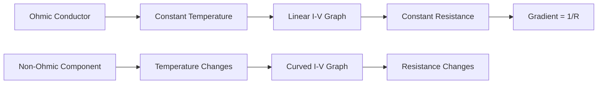
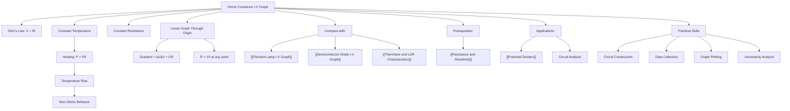

# Ohmic Conductor I-V Graph / 欧姆导体的I-V特性图

---

# 1. Overview / 概述

**English:**
This sub-topic focuses on the current-voltage (I-V) characteristics of ohmic conductors — materials that obey [[Ohm's Law]] at constant temperature. The I-V graph for an ohmic conductor is a straight line through the origin, demonstrating a constant [[Resistance and Resistivity|resistance]]. Understanding this graph is fundamental to distinguishing ohmic from non-ohmic components like [[Filament Lamp I-V Graph|filament lamps]] and [[Semiconductor Diode I-V Graph|semiconductor diodes]]. This concept directly applies to circuit analysis in [[Potential Dividers]] and forms the basis for understanding how temperature affects resistance in real-world components.

**中文:**
本子知识点聚焦于欧姆导体的电流-电压（I-V）特性——即在恒定温度下遵循[[欧姆定律]]的材料。欧姆导体的I-V图是一条通过原点的直线，表明其[[电阻与电阻率|电阻]]恒定。理解该图是区分欧姆与非欧姆元件（如[[白炽灯I-V图]]和[[半导体二极管I-V图]]）的基础。该概念直接应用于[[分压器]]的电路分析，并为理解温度如何影响实际元件中的电阻奠定基础。

---

# 2. Syllabus Learning Objectives / 考纲学习目标

| CAIE 9702 (9.3 g-j) | Edexcel IAL (WPH11 U2: 3.13-3.16) |
|-----------|-------------|
| Sketch and interpret I-V characteristic graphs for ohmic conductors | Draw and interpret I-V graphs for ohmic conductors |
| Explain why the I-V graph is linear for ohmic conductors | Explain the relationship between current and voltage for ohmic materials |
| Use the gradient of the I-V graph to determine resistance | Calculate resistance from the gradient of an I-V graph |
| Distinguish between ohmic and non-ohmic conductors from their I-V graphs | Identify ohmic conductors from their linear I-V characteristics |

**Examiner Expectations / 考官期望:**
- **English:** Students must be able to sketch the I-V graph accurately, label axes correctly, explain why the graph is linear (constant R at constant T), and calculate resistance from the gradient. They should also understand that the gradient equals 1/R, not R.
- **中文:** 学生必须能够准确绘制I-V图，正确标注坐标轴，解释为何图形为直线（恒定温度下R恒定），并能从斜率计算电阻。还应理解斜率等于1/R，而非R。

---

# 3. Core Definitions / 核心定义

| Term (EN/CN) | Definition (EN) | Definition (CN) | Common Mistakes / 常见错误 |
|--------------|-----------------|-----------------|---------------------------|
| **Ohmic Conductor** / 欧姆导体 | A conductor that obeys Ohm's Law, where current is directly proportional to potential difference at constant temperature | 在恒定温度下，电流与电势差成正比的导体，遵循欧姆定律 | ❌ Thinking all metals are ohmic at all temperatures |
| **Ohm's Law** / 欧姆定律 | The current through a conductor is directly proportional to the potential difference across it, provided physical conditions (especially temperature) remain constant | 通过导体的电流与其两端的电势差成正比，前提是物理条件（尤其是温度）保持不变 | ❌ Forgetting the "constant temperature" condition |
| **Linear I-V Characteristic** / 线性I-V特性 | An I-V graph that is a straight line through the origin, indicating constant resistance | 一条通过原点的直线I-V图，表明电阻恒定 | ❌ Confusing gradient with R (gradient = 1/R) |
| **Constant Resistance** / 恒定电阻 | Resistance that does not change with applied voltage or current | 电阻不随外加电压或电流变化 | ❌ Assuming all conductors have constant resistance |
| **Gradient of I-V Graph** / I-V图的斜率 | The slope of the I-V line, equal to 1/R (not R) | I-V线的斜率，等于1/R（而非R） | ❌ Writing gradient = R instead of gradient = 1/R |

---

# 4. Key Concepts Explained / 关键概念详解

## 4.1 Ohm's Law and Ohmic Conductors / 欧姆定律与欧姆导体

### Explanation / 解释
**English:**
[[Ohm's Law]] states that the current $I$ through a conductor is directly proportional to the potential difference $V$ across it, provided physical conditions (especially temperature) remain constant. Mathematically: $V \propto I$, or $V = IR$ where $R$ is constant. An **ohmic conductor** is any material that obeys this relationship. Common examples include metallic wires (e.g., copper, constantan) at constant temperature and [[Resistance and Resistivity|carbon resistors]].

The key condition is **constant temperature**. As current flows through a conductor, heating occurs due to $P = I^2R$. If the temperature rises significantly, the resistance changes, and the conductor no longer behaves ohmically. This is why the I-V graph of a [[Filament Lamp I-V Graph|filament lamp]] is curved — the temperature increases with current.

**中文:**
[[欧姆定律]]指出，通过导体的电流 $I$ 与其两端的电势差 $V$ 成正比，前提是物理条件（尤其是温度）保持不变。数学表达式为：$V \propto I$，或 $V = IR$，其中 $R$ 为常数。**欧姆导体**是遵循该关系的任何材料。常见例子包括恒定温度下的金属导线（如铜、康铜）和[[电阻与电阻率|碳膜电阻]]。

关键条件是**恒定温度**。当电流通过导体时，由于 $P = I^2R$ 会产生热量。如果温度显著升高，电阻会发生变化，导体不再表现为欧姆特性。这就是为什么[[白炽灯I-V图]]是弯曲的——电流增加导致温度升高。

### Physical Meaning / 物理意义
**English:**
The linear I-V relationship means that the resistance of an ohmic conductor is independent of the applied voltage. This implies that the charge carriers (electrons) experience a constant average collision rate with the lattice ions, regardless of the electric field strength. The drift velocity of electrons is directly proportional to the applied electric field, leading to a proportional current.

**中文:**
线性I-V关系意味着欧姆导体的电阻与外加电压无关。这表明无论电场强度如何，电荷载流子（电子）与晶格离子的平均碰撞率是恒定的。电子的漂移速度与外加电场成正比，从而产生成正比的电流。

### Common Misconceptions / 常见误区
- ❌ **"All metals are ohmic at all temperatures"** — Metals are only ohmic if temperature remains constant. At high currents, heating changes resistance.
- ❌ **"The gradient of the I-V graph equals resistance"** — The gradient equals $1/R$, not $R$. To find $R$, calculate $V/I$ at any point or take the reciprocal of the gradient.
- ❌ **"Ohmic conductors have zero resistance"** — Ohmic conductors have constant, non-zero resistance.
- ❌ **"The I-V graph must pass through the origin"** — This is true for ohmic conductors; if it doesn't, there's a systematic error or the component is not ohmic.

### Exam Tips / 考试提示
- ✅ **Always state "at constant temperature"** when explaining Ohm's Law or ohmic behavior.
- ✅ **To find R from an I-V graph:** pick any point on the line, read $V$ and $I$, then use $R = V/I$.
- ✅ **To find R from the gradient:** gradient $= \Delta I / \Delta V = 1/R$, so $R = 1/\text{gradient}$.
- ✅ **Sketch graphs carefully:** label axes ($I$ on y-axis, $V$ on x-axis), show the line passing through the origin.

> 📷 **IMAGE PROMPT — IV-01: Ohmic Conductor I-V Graph**
> A clear graph showing current (I) on the y-axis and voltage (V) on the x-axis. A straight line passes through the origin with a constant positive gradient. The line is labeled "Ohmic Conductor at Constant Temperature." Axes are labeled with units (A and V). A point on the line is marked with coordinates (V₁, I₁) to show how R = V₁/I₁ is calculated.

---

# 5. Essential Equations / 核心公式

## Equation 1: Ohm's Law / 欧姆定律

$$ V = IR $$

| Symbol (符号) | Meaning (EN) | Meaning (CN) | Unit (单位) |
|--------------|-------------|-------------|------------|
| $V$ | Potential difference across conductor | 导体两端的电势差 | V (volts) |
| $I$ | Current through conductor | 通过导体的电流 | A (amperes) |
| $R$ | Resistance (constant for ohmic conductor) | 电阻（欧姆导体为常数） | Ω (ohms) |

**Conditions / 适用条件:**
- **English:** Constant temperature; conductor must be ohmic (metallic conductor at constant temperature, carbon resistor).
- **中文:** 恒定温度；导体必须是欧姆性的（恒定温度下的金属导体、碳膜电阻）。

**Limitations / 局限性:**
- **English:** Does not apply to non-ohmic components (filament lamps, diodes, thermistors). Does not apply if temperature changes significantly.
- **中文:** 不适用于非欧姆元件（白炽灯、二极管、热敏电阻）。温度显著变化时不适用。

## Equation 2: Gradient of I-V Graph / I-V图的斜率

$$ \text{Gradient} = \frac{\Delta I}{\Delta V} = \frac{1}{R} $$

| Symbol (符号) | Meaning (EN) | Meaning (CN) | Unit (单位) |
|--------------|-------------|-------------|------------|
| $\Delta I$ | Change in current | 电流变化量 | A |
| $\Delta V$ | Change in potential difference | 电势差变化量 | V |
| $R$ | Resistance | 电阻 | Ω |

**Derivation / 推导:**
From $V = IR$, rearranging gives $I = \frac{1}{R}V$. This is of the form $y = mx + c$ where $y = I$, $x = V$, gradient $m = 1/R$, and intercept $c = 0$. Hence the graph is a straight line through the origin with gradient $1/R$.

**Conditions / 适用条件:**
- **English:** Only valid for ohmic conductors at constant temperature.
- **中文:** 仅适用于恒定温度下的欧姆导体。

> 📷 **IMAGE PROMPT — IV-02: Gradient Calculation on I-V Graph**
> A close-up of an I-V graph showing a right triangle drawn on the line. The vertical side is labeled ΔI, the horizontal side is labeled ΔV. The calculation gradient = ΔI/ΔV = 1/R is shown. A note reads: "R = 1/gradient = ΔV/ΔI."

---

# 6. Graphs and Relationships / 图表与关系

## 6.1 I-V Characteristic Graph for Ohmic Conductor / 欧姆导体的I-V特性图

### Axes / 坐标轴
- **x-axis:** Voltage / Potential Difference $V$ (V) — 电压/电势差 $V$ (V)
- **y-axis:** Current $I$ (A) — 电流 $I$ (A)

### Shape / 形状
- **English:** A straight line passing through the origin with constant positive gradient.
- **中文:** 一条通过原点的直线，具有恒定的正斜率。

### Gradient Meaning / 斜率含义
- **English:** Gradient $= \Delta I / \Delta V = 1/R$. A steeper gradient means lower resistance; a shallower gradient means higher resistance.
- **中文:** 斜率 $= \Delta I / \Delta V = 1/R$。斜率越大，电阻越小；斜率越小，电阻越大。

### Area Meaning / 面积含义
- **English:** The area under the I-V graph has no direct physical meaning for ohmic conductors. (Note: area under a P-V graph gives work, but not for I-V.)
- **中文:** I-V图下的面积对欧姆导体没有直接的物理意义。（注意：P-V图下的面积表示功，但I-V图不适用。）

### Exam Interpretation / 考试解读
- **English:** If asked to determine if a component is ohmic, check if the I-V graph is a straight line through the origin. If yes, it is ohmic. If curved, it is non-ohmic.
- **中文:** 如果需要判断元件是否为欧姆性，检查I-V图是否为通过原点的直线。如果是，则为欧姆性；如果是曲线，则为非欧姆性。

---

# 7. Required Diagrams / 必备图表

## 7.1 Ohmic Conductor I-V Characteristic / 欧姆导体I-V特性图

### Description / 描述
**English:**
A graph with current $I$ on the y-axis and voltage $V$ on the x-axis. A straight line passes through the origin with a constant positive slope. The line is labeled "Ohmic conductor at constant temperature." A second line with a different slope could be shown for comparison (e.g., a different resistor).

**中文:**
一张以电流 $I$ 为纵轴、电压 $V$ 为横轴的图。一条通过原点的直线具有恒定的正斜率。该线标注为"恒定温度下的欧姆导体"。可显示另一条不同斜率的线作为比较（例如，不同阻值的电阻）。

### Image Prompt / 图片生成提示
> 📷 **IMAGE PROMPT — IV-03: Ohmic Conductor I-V Graph with Labels**
> A clear physics graph with current (I) on the y-axis (0 to 5 A) and voltage (V) on the x-axis (0 to 10 V). A straight line passes through the origin at 45 degrees. The line is labeled "Ohmic Conductor (Constant Temperature)." A point on the line is marked with dashed lines to the axes, showing V=5V, I=2.5A. A calculation box shows R = V/I = 5/2.5 = 2Ω. Axes have arrows and labels with units. The graph has a grid for clarity.

### Labels Required / 需要标注
- **English:** y-axis: "Current I / A"; x-axis: "Voltage V / V"; line: "Ohmic conductor at constant temperature"; optional: "R = V/I" calculation
- **中文:** 纵轴："电流 I / A"；横轴："电压 V / V"；线："恒定温度下的欧姆导体"；可选："R = V/I" 计算

### Exam Importance / 考试重要性
- **English:** High — students are often asked to sketch this graph from memory, label axes, and explain its shape. It is the benchmark for identifying ohmic vs. non-ohmic components.
- **中文:** 高——学生常被要求凭记忆绘制该图、标注坐标轴并解释其形状。它是识别欧姆与非欧姆元件的基准。

## 7.2 Circuit for Measuring I-V Characteristics / 测量I-V特性的电路

### Description / 描述
**English:**
A circuit diagram showing a variable resistor (rheostat) in series with the component under test, an ammeter in series, and a voltmeter in parallel across the component. A DC power supply provides the voltage.

**中文:**
电路图显示一个可变电阻（变阻器）与待测元件串联，电流表串联，电压表与元件并联。直流电源提供电压。

### Image Prompt / 图片生成提示
> 📷 **IMAGE PROMPT — IV-04: Circuit for I-V Characteristic Measurement**
> A clear circuit diagram showing: a DC power supply (battery symbol with + and -), a variable resistor (rheostat symbol with arrow), an ammeter (A in circle) in series, the component under test (resistor symbol), and a voltmeter (V in circle) in parallel across the component. Wires connect all components. Labels: "Power Supply," "Variable Resistor," "Ammeter," "Component Under Test," "Voltmeter."

### Labels Required / 需要标注
- **English:** Power supply, variable resistor (rheostat), ammeter (series), component under test, voltmeter (parallel)
- **中文:** 电源、可变电阻（变阻器）、电流表（串联）、待测元件、电压表（并联）

### Exam Importance / 考试重要性
- **English:** High — students must be able to draw and explain this circuit for practical Paper 3/5 questions.
- **中文:** 高——学生必须能够绘制并解释该电路，以应对实验卷3/5的题目。

---

# 8. Worked Examples / 典型例题

## Example 1: Determining Resistance from I-V Graph / 从I-V图确定电阻

### Question / 题目
**English:**
The I-V characteristic of an ohmic conductor is shown below. At point A, $V = 6.0 \text{ V}$ and $I = 1.5 \text{ A}$.
(a) Calculate the resistance of the conductor.
(b) Calculate the gradient of the I-V graph.
(c) If the voltage is increased to 12.0 V, what current would flow? (Assume constant temperature.)

**中文:**
某欧姆导体的I-V特性如下图所示。在A点，$V = 6.0 \text{ V}$，$I = 1.5 \text{ A}$。
(a) 计算该导体的电阻。
(b) 计算I-V图的斜率。
(c) 如果电压增加到12.0 V，电流为多少？（假设温度恒定。）

### Solution / 解答

**(a) Resistance / 电阻:**
$$ R = \frac{V}{I} = \frac{6.0}{1.5} = 4.0 \, \Omega $$

**(b) Gradient / 斜率:**
$$ \text{Gradient} = \frac{\Delta I}{\Delta V} = \frac{1.5}{6.0} = 0.25 \, \text{A V}^{-1} $$
Alternatively: $\text{Gradient} = 1/R = 1/4.0 = 0.25 \, \text{A V}^{-1}$

**(c) Current at 12.0 V / 12.0 V时的电流:**
Since the conductor is ohmic, $R$ is constant:
$$ I = \frac{V}{R} = \frac{12.0}{4.0} = 3.0 \, \text{A} $$

### Final Answer / 最终答案
**Answer:** (a) $R = 4.0 \, \Omega$ | (b) Gradient $= 0.25 \, \text{A V}^{-1}$ | (c) $I = 3.0 \, \text{A}$
**答案：** (a) $R = 4.0 \, \Omega$ | (b) 斜率 $= 0.25 \, \text{A V}^{-1}$ | (c) $I = 3.0 \, \text{A}$

### Quick Tip / 提示
- **English:** Always use $R = V/I$ from a single point, not the gradient. The gradient gives $1/R$, which is useful for comparing resistances.
- **中文:** 始终使用单个点的 $R = V/I$，而非斜率。斜率给出 $1/R$，可用于比较电阻大小。

---

## Example 2: Comparing Two Ohmic Conductors / 比较两个欧姆导体

### Question / 题目
**English:**
Two ohmic conductors X and Y have I-V graphs. Conductor X has a steeper gradient than conductor Y. Which conductor has the higher resistance? Explain your reasoning.

**中文:**
两个欧姆导体X和Y的I-V图。导体X的斜率大于导体Y。哪个导体的电阻更大？解释你的推理。

### Solution / 解答
**English:**
Gradient $= 1/R$. A steeper gradient means a larger value of $1/R$, which means a smaller $R$. Therefore, conductor X (steeper gradient) has a **lower** resistance than conductor Y. Conductor Y has the **higher** resistance.

**中文:**
斜率 $= 1/R$。斜率越大，$1/R$ 的值越大，意味着 $R$ 越小。因此，导体X（斜率更大）的电阻**小于**导体Y。导体Y的电阻**更大**。

### Final Answer / 最终答案
**Answer:** Conductor Y has the higher resistance. | **答案：** 导体Y的电阻更大。

### Quick Tip / 提示
- **English:** Remember: steep gradient = low resistance; shallow gradient = high resistance.
- **中文:** 记住：斜率大 = 电阻小；斜率小 = 电阻大。

---

# 9. Past Paper Question Types / 历年真题题型

| Question Type / 题型 | Frequency / 频率 | Difficulty / 难度 | Past Paper References / 真题索引 |
|----------------------|------------------|------------------|-------------------------------|
| Sketch I-V graph for ohmic conductor / 绘制欧姆导体I-V图 | High / 高 | Easy / 简单 | 📝 *待填入* |
| Calculate R from I-V graph / 从I-V图计算R | High / 高 | Easy / 简单 | 📝 *待填入* |
| Explain why graph is linear / 解释为何图形为直线 | Medium / 中 | Medium / 中等 | 📝 *待填入* |
| Compare ohmic vs non-ohmic from graphs / 从图形比较欧姆与非欧姆 | High / 高 | Medium / 中等 | 📝 *待填入* |
| Determine if component is ohmic from data / 从数据判断元件是否为欧姆性 | Medium / 中 | Medium / 中等 | 📝 *待填入* |
| Practical: circuit for I-V measurement / 实验：测量I-V的电路 | High / 高 | Medium / 中等 | 📝 *待填入* |

**Common Command Words / 常见指令词:**
- **English:** Sketch, Draw, Calculate, Determine, Explain, State, Compare
- **中文:** 绘制、画出、计算、确定、解释、陈述、比较

---

# 10. Practical Skills Connections / 实验技能链接

**English:**
This sub-topic directly connects to practical Paper 3 (CAIE) and Paper 5 (Edexcel). Key practical skills include:

1. **Circuit Construction:** Setting up a series circuit with a variable resistor (rheostat) to vary voltage, an ammeter in series, and a voltmeter in parallel across the component.
2. **Data Collection:** Taking multiple readings of $V$ and $I$ by adjusting the variable resistor. Typically 6-8 readings are taken.
3. **Graph Plotting:** Plotting $I$ on the y-axis against $V$ on the x-axis. Drawing a line of best fit through the origin.
4. **Uncertainty Analysis:** Error bars on the graph; calculating percentage uncertainty in $R$ from uncertainties in $V$ and $I$.
5. **Identifying Ohmic Behavior:** Checking if the graph is linear through the origin. If not, the component is non-ohmic or temperature has changed.
6. **Temperature Control:** Using a heat sink or allowing time between readings to prevent temperature rise, ensuring ohmic behavior.

**Common Practical Errors / 常见实验错误:**
- **English:** Not zeroing meters; connecting voltmeter in series; taking too few readings; not allowing component to cool between readings.
- **中文:** 未将仪表调零；电压表串联；读数太少；读数间未让元件冷却。

**中文:**
本子知识点直接关联实验卷3（CAIE）和卷5（Edexcel）。关键实验技能包括：

1. **电路搭建：** 搭建串联电路，使用可变电阻（变阻器）改变电压，电流表串联，电压表与元件并联。
2. **数据采集：** 通过调节变阻器获取多组 $V$ 和 $I$ 读数。通常取6-8组数据。
3. **图表绘制：** 以 $I$ 为纵轴、$V$ 为横轴绘图。绘制通过原点的最佳拟合直线。
4. **不确定度分析：** 图上标注误差棒；根据 $V$ 和 $I$ 的不确定度计算 $R$ 的百分比不确定度。
5. **识别欧姆行为：** 检查图形是否为通过原点的直线。如果不是，则元件为非欧姆性或温度已变化。
6. **温度控制：** 使用散热器或在读数间留出时间以防止温度升高，确保欧姆行为。

---

# 11. Concept Map / 概念图谱

---

# 12. Quick Revision Sheet / 速查表

| Category / 类别 | Key Points / 要点 |
|----------------|------------------|
| **Definition / 定义** | Ohmic conductor: obeys Ohm's Law at constant temperature / 欧姆导体：恒定温度下遵循欧姆定律 |
| **Key Condition / 关键条件** | Temperature must remain constant / 温度必须保持恒定 |
| **Key Formula / 核心公式** | $V = IR$; Gradient $= 1/R$; $R = V/I$ |
| **Key Graph / 核心图表** | Straight line through origin (I vs V) / 通过原点的直线（I对V） |
| **Gradient Meaning / 斜率含义** | Gradient $= 1/R$; steep = low R; shallow = high R / 斜率 $= 1/R$；陡=小R；缓=大R |
| **How to Find R / 如何求R** | Pick any point: $R = V/I$; OR $R = 1/\text{gradient}$ / 任取一点：$R = V/I$；或 $R = 1/\text{斜率}$ |
| **Common Examples / 常见例子** | Copper wire, constantan wire, carbon resistors (at constant T) / 铜线、康铜线、碳膜电阻（恒定温度下） |
| **Non-Ohmic Examples / 非欧姆例子** | Filament lamp, semiconductor diode, thermistor, LDR / 白炽灯、半导体二极管、热敏电阻、光敏电阻 |
| **Exam Tip 1 / 考试提示1** | Always state "at constant temperature" / 始终说明"在恒定温度下" |
| **Exam Tip 2 / 考试提示2** | Gradient ≠ R; gradient = 1/R / 斜率 ≠ R；斜率 = 1/R |
| **Exam Tip 3 / 考试提示3** | For comparison: steeper gradient = lower resistance / 比较时：斜率越大，电阻越小 |
| **Practical Tip / 实验提示** | Use rheostat to vary voltage; allow cooling between readings / 使用变阻器改变电压；读数间留出冷却时间 |

---

> 📋 **CIE Only:** CAIE 9702 specifically requires students to sketch I-V graphs from memory and explain the shape in terms of resistance changes. For ohmic conductors, the explanation must include "constant temperature" and "constant resistance."
>
> 📋 **Edexcel Only:** Edexcel IAL emphasizes calculating resistance from the gradient and comparing ohmic vs. non-ohmic behavior in practical contexts. Students should be able to determine if a component is ohmic from a table of data by checking if $V/I$ is constant.

---

**Parent Hub:** [[I-V Characteristics]]
**Sibling Nodes:** [[Filament Lamp I-V Graph]], [[Semiconductor Diode I-V Graph]], [[Thermistor and LDR Characteristics]]
**Prerequisites:** [[Resistance and Resistivity]]
**Related Topics:** [[Potential Dividers]]