# Semiconductor Diode I-V Graph / 半导体二极管的I-V特性曲线

---

# 1. Overview / 概述

**English:**
This sub-topic focuses on the current-voltage (I-V) characteristic graph of a semiconductor diode — a non-ohmic component that allows current to flow primarily in one direction. Unlike [[Ohmic Conductor I-V Graph|ohmic conductors]] or [[Filament Lamp I-V Graph|filament lamps]], the diode exhibits a highly nonlinear relationship: negligible current in reverse bias, a sharp "turn-on" at a threshold voltage (≈0.6–0.7 V for silicon) in forward bias, and a steep linear rise thereafter. Understanding this graph is essential for rectification, signal processing, and circuit protection. It builds directly on [[Resistance and Resistivity]] and connects to [[Potential Dividers]] for biasing applications.

**中文:**
本子知识点聚焦半导体二极管的电流-电压（I-V）特性曲线——一种非欧姆元件，允许电流主要沿一个方向流动。与[[Ohmic Conductor I-V Graph|欧姆导体]]或[[Filament Lamp I-V Graph|白炽灯]]不同，二极管表现出高度非线性关系：反向偏置时电流可忽略，正向偏置时在阈值电压（硅管约0.6–0.7 V）处出现急剧“导通”，随后电流陡峭线性上升。理解该图形对于整流、信号处理和电路保护至关重要。它直接建立在[[Resistance and Resistivity]]之上，并与[[Potential Dividers]]（偏置应用）相关联。

---

# 2. Syllabus Learning Objectives / 考纲学习目标

| CAIE 9702 (9.3 g–j) | Edexcel IAL (WPH11 U2: 3.13–3.16) |
|----------------------|------------------------------------|
| Describe the I-V characteristic of a semiconductor diode | Explain the shape of the I-V characteristic for a diode |
| Explain the concept of threshold voltage (turn-on voltage) | Define and calculate forward and reverse bias |
| Use the diode I-V graph to determine resistance at a point | Use the graph to find the resistance at a given current |
| Recognise the diode as a non-ohmic conductor | Describe the use of a diode as a rectifier |

**Examiner Expectations / 考官期望:**
- **English:** You must be able to sketch the I-V graph from memory, label the threshold voltage, explain why resistance is not constant, and calculate dynamic resistance from the gradient. For Edexcel, also explain half-wave rectification.
- **中文:** 必须能凭记忆画出I-V曲线，标注阈值电压，解释电阻为何不恒定，并从斜率计算动态电阻。Edexcel考生还需解释半波整流。

---

# 3. Core Definitions / 核心定义

| Term (EN/CN) | Definition (EN) | Definition (CN) | Common Mistakes / 常见错误 |
|--------------|-----------------|-----------------|---------------------------|
| **Semiconductor Diode** / 半导体二极管 | A two-terminal electronic component that conducts current primarily in one direction (forward bias) and blocks current in the opposite direction (reverse bias). | 一种两端电子元件，主要在一个方向（正向偏置）导通电流，在相反方向（反向偏置）阻断电流。 | Confusing with a resistor; forgetting it is non-ohmic. |
| **Forward Bias** / 正向偏置 | The condition where the anode is at a higher potential than the cathode, allowing significant current to flow above the threshold voltage. | 阳极电位高于阴极的状态，允许在阈值电压以上有显著电流通过。 | Thinking current flows immediately at 0 V. |
| **Reverse Bias** / 反向偏置 | The condition where the cathode is at a higher potential than the anode, resulting in negligible current (leakage current only). | 阴极电位高于阳极的状态，导致电流可忽略（仅有漏电流）。 | Believing reverse current is exactly zero. |
| **Threshold Voltage (Vₜ)** / 阈值电压 | The minimum forward voltage required for the diode to conduct significant current; ≈0.6–0.7 V for silicon, ≈0.3 V for germanium. | 二极管导通显著电流所需的最小正向电压；硅管约0.6–0.7 V，锗管约0.3 V。 | Using the wrong value; forgetting it depends on material. |
| **Dynamic Resistance (r)** / 动态电阻 | The resistance of the diode at a specific operating point, given by the reciprocal of the gradient of the I-V curve: $r = \frac{\Delta V}{\Delta I}$. | 二极管在特定工作点的电阻，由I-V曲线斜率的倒数给出：$r = \frac{\Delta V}{\Delta I}$。 | Using $R = V/I$ (static resistance) instead of gradient. |
| **Breakdown Voltage** / 击穿电压 | The reverse voltage at which the diode suddenly conducts large current in reverse bias (destructive unless Zener). | 反向偏置中二极管突然导通大电流的反向电压（除非是齐纳二极管，否则具有破坏性）。 | Assuming all diodes break down at the same voltage. |

---

# 4. Key Concepts Explained / 关键概念详解

## 4.1 Forward Bias Region / 正向偏置区

### Explanation / 解释
**English:** When the anode is positive relative to the cathode (forward bias), the diode initially blocks current until the applied voltage reaches the **threshold voltage** $V_t$ (≈0.6–0.7 V for silicon). Below $V_t$, only a tiny leakage current flows. At $V_t$, the depletion layer collapses, and current rises exponentially. Above $V_t$, the I-V relationship becomes approximately linear, and the diode behaves like a small fixed resistor (dynamic resistance ≈ 10–100 Ω). The exact shape depends on temperature and doping.

**中文:** 当阳极相对于阴极为正（正向偏置）时，二极管最初阻断电流，直到外加电压达到**阈值电压** $V_t$（硅管约0.6–0.7 V）。低于 $V_t$ 时，仅有微小漏电流。在 $V_t$ 处，耗尽层崩溃，电流呈指数上升。高于 $V_t$ 后，I-V关系近似线性，二极管表现为一个小固定电阻（动态电阻约10–100 Ω）。具体形状取决于温度和掺杂浓度。

### Physical Meaning / 物理意义
**English:** The threshold voltage represents the energy needed to overcome the potential barrier at the p-n junction. Once overcome, majority carriers (holes in p-type, electrons in n-type) flow freely, and the diode's resistance drops dramatically.

**中文:** 阈值电压代表克服p-n结势垒所需的能量。一旦克服，多数载流子（p型中的空穴，n型中的电子）自由流动，二极管的电阻急剧下降。

### Common Misconceptions / 常见误区
- **English:** "The diode conducts immediately at 0 V." → No, it requires the threshold voltage.
- **English:** "The I-V graph is a straight line through the origin." → No, it is nonlinear with a sharp knee.
- **中文:** “二极管在0 V时立即导通。” → 不对，需要阈值电压。
- **中文:** “I-V曲线是通过原点的直线。” → 不对，它是非线性的，有一个尖锐的拐点。

### Exam Tips / 考试提示
- **English:** Always label the threshold voltage on the graph. For CAIE, sketch the curve with a clear knee. For Edexcel, explain that the gradient increases after $V_t$.
- **中文:** 务必在图上标注阈值电压。CAIE考生需画出带有清晰拐点的曲线。Edexcel考生需解释 $V_t$ 后斜率增大。

> 📷 **IMAGE PROMPT — DIODE-IV-01: Forward Bias Region of Diode I-V Graph**
> A clear I-V characteristic graph for a silicon diode showing forward bias region only. X-axis: Voltage (V) from 0 to 1.0 V. Y-axis: Current (mA) from 0 to 50 mA. The curve shows negligible current until 0.6 V, then a sharp exponential rise, becoming linear after 0.7 V. Label: "Threshold Voltage V_t ≈ 0.6 V" at the knee. Include a small inset showing the diode symbol with anode (+) and cathode (-) for forward bias.

---

## 4.2 Reverse Bias Region / 反向偏置区

### Explanation / 解释
**English:** When the cathode is positive relative to the anode (reverse bias), the depletion layer widens, and only a very small **leakage current** (typically nA to µA) flows. This current is nearly constant and independent of voltage until **breakdown**. At the breakdown voltage (often >50 V for standard diodes), the diode suddenly conducts large reverse current, which can destroy it unless it is a Zener diode designed for this purpose. For A-Level, we assume reverse current is zero.

**中文:** 当阴极相对于阳极为正（反向偏置）时，耗尽层变宽，仅有非常小的**漏电流**（通常nA到µA）通过。该电流几乎恒定且与电压无关，直到**击穿**。在击穿电压（标准二极管通常>50 V）处，二极管突然导通大反向电流，除非是为此设计的齐纳二极管，否则可能损坏。在A-Level中，我们假设反向电流为零。

### Physical Meaning / 物理意义
**English:** The reverse bias strengthens the internal electric field at the junction, preventing majority carriers from crossing. Only thermally generated minority carriers contribute to the tiny leakage current.

**中文:** 反向偏置增强了结处的内建电场，阻止多数载流子穿越。仅有热产生的少数载流子贡献微小的漏电流。

### Common Misconceptions / 常见误区
- **English:** "Reverse current is exactly zero." → No, there is a tiny leakage current, but we approximate it as zero.
- **English:** "Breakdown is always destructive." → Not for Zener diodes; they operate in breakdown safely.
- **中文:** “反向电流恰好为零。” → 不对，有微小漏电流，但我们近似为零。
- **中文:** “击穿总是破坏性的。” → 齐纳二极管除外；它们可在击穿区安全工作。

### Exam Tips / 考试提示
- **English:** For CAIE, you do not need to draw the reverse breakdown region unless specified. For Edexcel, be aware that the reverse current is not exactly zero but is negligible.
- **中文:** CAIE考生除非特别说明，否则无需画出反向击穿区。Edexcel考生需注意反向电流并非恰好为零，但可忽略。

> 📷 **IMAGE PROMPT — DIODE-IV-02: Complete Diode I-V Characteristic Graph**
> Full I-V characteristic graph for a silicon diode. X-axis: Voltage (V) from -10 V to +1.0 V. Y-axis: Current (mA) from -5 mA to +50 mA. Forward bias region (positive V, positive I) shows knee at 0.6 V, then steep rise. Reverse bias region (negative V, near-zero I) shows flat line near 0 mA. Label: "Forward Bias", "Reverse Bias", "Threshold Voltage V_t ≈ 0.6 V", "Breakdown Voltage (optional)". Include diode symbol with polarity markings.

---

# 5. Essential Equations / 核心公式

## 5.1 Dynamic Resistance / 动态电阻

$$ r = \frac{\Delta V}{\Delta I} $$

| Symbol (符号) | Meaning (EN) | Meaning (CN) | Unit (单位) |
|--------------|-------------|-------------|------------|
| $r$ | Dynamic resistance at operating point | 工作点处的动态电阻 | Ω (ohm) |
| $\Delta V$ | Small change in voltage | 电压的小变化 | V (volt) |
| $\Delta I$ | Corresponding change in current | 对应的电流变化 | A (ampere) |

**Derivation / 推导:** From the definition of resistance, but using incremental changes because the diode is non-ohmic. The gradient of the I-V curve at a point is $\frac{\Delta I}{\Delta V}$, so $r = \frac{1}{\text{gradient}}$.

**Conditions / 适用条件:** Only valid in the forward bias region above $V_t$ where the curve is approximately linear. Not valid in reverse bias or near the knee.

**Limitations / 局限性:** Dynamic resistance changes with operating point; it is not a constant. For small signals, it is a good approximation.

> 📋 **Edexcel Only:** You may be asked to calculate dynamic resistance from a graph. Use a tangent at the operating point.

## 5.2 Static Resistance / 静态电阻

$$ R = \frac{V}{I} $$

| Symbol (符号) | Meaning (EN) | Meaning (CN) | Unit (单位) |
|--------------|-------------|-------------|------------|
| $R$ | Static (DC) resistance | 静态（直流）电阻 | Ω (ohm) |
| $V$ | Voltage across diode | 二极管两端电压 | V (volt) |
| $I$ | Current through diode | 通过二极管的电流 | A (ampere) |

**Conditions / 适用条件:** Valid at any point on the I-V curve, but note that $R$ is not constant — it decreases as current increases.

**Limitations / 局限性:** Static resistance is different from dynamic resistance. Do not confuse them in exams.

> 📋 **CAIE Only:** You may be asked to calculate static resistance at a given voltage. Use $R = V/I$ directly from the graph.

---

# 6. Graphs and Relationships / 图表与关系

## 6.1 I-V Characteristic Graph of a Semiconductor Diode / 半导体二极管的I-V特性曲线

### Axes / 坐标轴
- **X-axis:** Voltage $V$ (V) — positive to the right, negative to the left
- **Y-axis:** Current $I$ (mA or A) — positive upward, negative downward
- **中文:** X轴：电压 $V$（V）— 向右为正，向左为负；Y轴：电流 $I$（mA或A）— 向上为正，向下为负

### Shape / 形状
- **Forward bias:** Starts at origin, negligible current until $V_t$ (≈0.6 V), then sharp exponential rise, becoming linear after ≈0.7 V.
- **Reverse bias:** Flat line near zero current for all negative voltages until breakdown (not usually shown).
- **中文:** 正向偏置：从原点开始，$V_t$（约0.6 V）前电流可忽略，然后急剧指数上升，约0.7 V后变为线性。反向偏置：所有负电压下接近零电流的平坦直线，直到击穿（通常不显示）。

### Gradient Meaning / 斜率含义
- **English:** The gradient $\frac{\Delta I}{\Delta V}$ at any point is the **conductance** (inverse of dynamic resistance). A steep gradient means low dynamic resistance.
- **中文:** 任意点的斜率 $\frac{\Delta I}{\Delta V}$ 是**电导**（动态电阻的倒数）。斜率陡峭意味着动态电阻小。

### Area Meaning / 面积含义
- **English:** The area under the I-V curve has no direct physical meaning for a diode (unlike for a capacitor or inductor).
- **中文:** I-V曲线下的面积对二极管没有直接的物理意义（与电容或电感不同）。

### Exam Interpretation / 考试解读
- **English:** Be able to sketch the graph from memory. Identify the threshold voltage. Explain why the diode is non-ohmic (resistance changes with voltage). Calculate dynamic resistance from a tangent.
- **中文:** 能凭记忆画出图形。识别阈值电压。解释二极管为何是非欧姆的（电阻随电压变化）。从切线计算动态电阻。

```mermaid
graph LR
    A[Origin 0,0] --> B[Threshold V_t ≈ 0.6 V]
    B --> C[Exponential rise]
    C --> D[Linear region above 0.7 V]
    A --> E[Reverse bias: flat near 0 mA]
    E --> F[Breakdown (not shown)]
```

---

# 7. Required Diagrams / 必备图表

## 7.1 Complete I-V Characteristic Graph / 完整的I-V特性曲线图

### Description / 描述
**English:** A graph with four quadrants, but only the first (forward bias) and third (reverse bias) quadrants are relevant. The forward bias curve shows a sharp knee at the threshold voltage. The reverse bias curve is a flat line near zero. Include labels for axes, threshold voltage, and regions.

**中文:** 一个四象限图，但只有第一象限（正向偏置）和第三象限（反向偏置）相关。正向偏置曲线在阈值电压处显示尖锐拐点。反向偏置曲线是接近零的平坦直线。包括坐标轴、阈值电压和区域的标注。

### Image Prompt / 图片生成提示
> 📷 **IMAGE PROMPT — DIODE-IV-03: Complete Diode I-V Characteristic for A-Level**
> A clean, exam-style I-V characteristic graph for a silicon semiconductor diode. X-axis: Voltage (V) from -10 V to +1.0 V, with tick marks every 1 V. Y-axis: Current (mA) from -5 mA to +50 mA, with tick marks every 10 mA. Forward bias region (positive V, positive I): curve starts at (0,0), stays near zero until (0.6 V, 0.1 mA), then rises steeply to (0.7 V, 20 mA) and (0.8 V, 45 mA). Reverse bias region (negative V, near-zero I): flat line at 0 mA from -10 V to 0 V. Labels: "Forward Bias", "Reverse Bias", "Threshold Voltage V_t ≈ 0.6 V". Include a small circuit diagram showing a diode in series with a resistor and a DC power supply. Use a white background, black lines, and clear fonts. Style: textbook-quality, suitable for A-Level physics.

### Labels Required / 需要标注
- **English:** Axes: Voltage (V) and Current (I); Threshold voltage $V_t$; Forward bias region; Reverse bias region; (Optional) Breakdown voltage.
- **中文:** 坐标轴：电压（V）和电流（I）；阈值电压 $V_t$；正向偏置区；反向偏置区；（可选）击穿电压。

### Exam Importance / 考试重要性
- **English:** High. This graph appears in almost every exam on diodes. You must be able to sketch it, label it, and explain its shape.
- **中文:** 高。该图形几乎出现在每次关于二极管的考试中。必须能画出、标注并解释其形状。

---

## 7.2 Circuit Diagram for Obtaining the I-V Characteristic / 获取I-V特性的电路图

### Description / 描述
**English:** A series circuit with a variable DC power supply, a diode (connected in forward bias), a resistor (to limit current), an ammeter (in series), and a voltmeter (in parallel across the diode). For reverse bias, reverse the diode connections.

**中文:** 一个串联电路，包含可变直流电源、二极管（正向偏置连接）、限流电阻、电流表（串联）和电压表（并联在二极管两端）。对于反向偏置，反转二极管连接。

### Image Prompt / 图片生成提示
> 📷 **IMAGE PROMPT — DIODE-IV-04: Circuit for Diode I-V Characteristic**
> A circuit diagram showing: a variable DC power supply (symbol with + and -), a silicon diode (triangle with line, anode to positive), a 100 Ω resistor in series, an ammeter (A) in series, and a voltmeter (V) in parallel across the diode. Include labels: "Variable DC Supply", "Diode", "100 Ω Resistor", "Ammeter", "Voltmeter". For reverse bias, show a second diagram with the diode reversed. Style: clear, schematic, suitable for A-Level physics.

### Labels Required / 需要标注
- **English:** Power supply polarity; Diode anode (+) and cathode (-); Ammeter and voltmeter positions.
- **中文:** 电源极性；二极管阳极（+）和阴极（-）；电流表和电压表位置。

### Exam Importance / 考试重要性
- **English:** Medium. You may be asked to draw or describe the circuit for obtaining the I-V characteristic.
- **中文:** 中。可能会要求画出或描述获取I-V特性的电路。

---

# 8. Worked Examples / 典型例题

## Example 1: Calculating Dynamic Resistance / 例1：计算动态电阻

### Question / 题目
**English:** The I-V characteristic of a silicon diode shows that when the voltage increases from 0.70 V to 0.75 V, the current increases from 20 mA to 35 mA. Calculate the dynamic resistance of the diode at this operating point.

**中文:** 某硅二极管的I-V特性显示，当电压从0.70 V增加到0.75 V时，电流从20 mA增加到35 mA。计算该二极管在此工作点的动态电阻。

### Solution / 解答
**Step 1:** Identify the changes.
$\Delta V = 0.75 \, \text{V} - 0.70 \, \text{V} = 0.05 \, \text{V}$
$\Delta I = 35 \, \text{mA} - 20 \, \text{mA} = 15 \, \text{mA} = 0.015 \, \text{A}$

**Step 2:** Apply the formula for dynamic resistance.
$$ r = \frac{\Delta V}{\Delta I} = \frac{0.05}{0.015} = 3.33 \, \Omega $$

**Step 3:** State the answer with units.
**Answer:** $r = 3.33 \, \Omega$

**中文解答:**
**步骤1:** 确定变化量。
$\Delta V = 0.75 \, \text{V} - 0.70 \, \text{V} = 0.05 \, \text{V}$
$\Delta I = 35 \, \text{mA} - 20 \, \text{mA} = 15 \, \text{mA} = 0.015 \, \text{A}$

**步骤2:** 应用动态电阻公式。
$$ r = \frac{\Delta V}{\Delta I} = \frac{0.05}{0.015} = 3.33 \, \Omega $$

**步骤3:** 给出带单位的答案。
**答案:** $r = 3.33 \, \Omega$

### Final Answer / 最终答案
**Answer:** $3.33 \, \Omega$ | **答案：** $3.33 \, \Omega$

### Quick Tip / 提示
- **English:** Always convert current to amperes (A) before calculating. Dynamic resistance is the gradient's reciprocal, not $V/I$.
- **中文:** 计算前务必将电流转换为安培（A）。动态电阻是斜率的倒数，不是 $V/I$。

---

## Example 2: Static Resistance from Graph / 例2：从图形求静态电阻

### Question / 题目
**English:** From the I-V graph of a diode, at a voltage of 0.72 V, the current is 25 mA. Calculate the static resistance of the diode at this point.

**中文:** 从二极管的I-V图形中，在电压0.72 V时，电流为25 mA。计算该点二极管的静态电阻。

### Solution / 解答
**Step 1:** Use the static resistance formula.
$$ R = \frac{V}{I} = \frac{0.72}{0.025} = 28.8 \, \Omega $$

**Step 2:** State the answer.
**Answer:** $R = 28.8 \, \Omega$

**中文解答:**
**步骤1:** 使用静态电阻公式。
$$ R = \frac{V}{I} = \frac{0.72}{0.025} = 28.8 \, \Omega $$

**步骤2:** 给出答案。
**答案:** $R = 28.8 \, \Omega$

### Final Answer / 最终答案
**Answer:** $28.8 \, \Omega$ | **答案：** $28.8 \, \Omega$

### Quick Tip / 提示
- **English:** Static resistance is much larger than dynamic resistance near the knee. Do not confuse the two.
- **中文:** 在拐点附近，静态电阻远大于动态电阻。不要混淆两者。

---

# 9. Past Paper Question Types / 历年真题题型

| Question Type / 题型 | Frequency / 频率 | Difficulty / 难度 | Past Paper References / 真题索引 |
|----------------------|------------------|------------------|-------------------------------|
| Sketch the I-V characteristic of a diode | Very High | Easy | 📝 *待填入* |
| Explain why a diode is non-ohmic | High | Medium | 📝 *待填入* |
| Calculate dynamic resistance from a graph | High | Medium | 📝 *待填入* |
| Describe the circuit to obtain the I-V characteristic | Medium | Medium | 📝 *待填入* |
| Explain the use of a diode as a rectifier (Edexcel) | Medium | Medium | 📝 *待填入* |
| Compare diode I-V with ohmic conductor | Low | Medium | 📝 *待填入* |

**Common Command Words / 常见指令词:**
- **English:** Sketch, Explain, Calculate, Describe, Compare, Determine
- **中文:** 画出，解释，计算，描述，比较，确定

---

# 10. Practical Skills Connections / 实验技能链接

**English:**
This sub-topic connects to practical work in Paper 3 (CAIE) and Unit 2 (Edexcel). Key skills include:
- **Circuit construction:** Building a series circuit with a diode, resistor, ammeter, and voltmeter. Ensure correct polarity (diode anode to positive).
- **Data collection:** Vary the power supply voltage in small steps (e.g., 0.1 V) near the threshold voltage to capture the sharp rise. Record voltage across the diode and current.
- **Graph plotting:** Plot I-V graph with appropriate scales. Identify the threshold voltage from the knee.
- **Uncertainties:** The voltmeter and ammeter have reading uncertainties. The threshold voltage may have an uncertainty of ±0.05 V.
- **Safety:** Use a current-limiting resistor (e.g., 100 Ω) to prevent diode burnout. Do not exceed the maximum forward current.

**中文:**
本子知识点与CAIE Paper 3和Edexcel Unit 2的实验工作相关。关键技能包括：
- **电路搭建：** 搭建包含二极管、电阻、电流表和电压表的串联电路。确保极性正确（二极管阳极接正极）。
- **数据采集：** 在阈值电压附近以小步长（如0.1 V）改变电源电压，以捕捉急剧上升。记录二极管两端电压和电流。
- **图形绘制：** 用适当比例绘制I-V图。从拐点识别阈值电压。
- **不确定度：** 电压表和电流表有读数不确定度。阈值电压可能有±0.05 V的不确定度。
- **安全：** 使用限流电阻（如100 Ω）防止二极管烧毁。不要超过最大正向电流。

---

# 11. Concept Map / 概念图谱

```mermaid
graph TD
    %% Semiconductor Diode I-V Graph - Leaf Node
    A["Semiconductor Diode I-V Graph"] --> B["Forward Bias Region"]
    A --> C["Reverse Bias Region"]
    A --> D["Threshold Voltage V_t"]
    A --> E["Dynamic Resistance r = ΔV/ΔI"]
    A --> F["Static Resistance R = V/I"]
    A --> G["Non-Ohmic Conductor"]
    
    B --> B1["Current flows above V_t"]
    B --> B2["Exponential then linear rise"]
    B --> B3["Low dynamic resistance"]
    
    C --> C1["Negligible current"]
    C --> C2["Leakage current only"]
    C --> C3["Breakdown at high voltage"]
    
    D --> D1["≈0.6-0.7 V for silicon"]
    D --> D2["≈0.3 V for germanium"]
    
    E --> E1["Gradient of I-V curve"]
    E --> E2["Changes with operating point"]
    
    F --> F1["V/I at a point"]
    F --> F2["Decreases as I increases"]
    
    G --> G1["Resistance not constant"]
    G --> G2["Compare with [[Ohmic Conductor I-V Graph]]"]
    G --> G3["Compare with [[Filament Lamp I-V Graph]]"]
    
    %% Connections to parent and siblings
    A --> H["Parent: [[I-V Characteristics]]"]
    H --> I["Sibling: [[Ohmic Conductor I-V Graph]]"]
    H --> J["Sibling: [[Filament Lamp I-V Graph]]"]
    H --> K["Sibling: [[Thermistor and LDR Characteristics]]"]
    
    %% Prerequisites
    A --> L["Prerequisite: [[Resistance and Resistivity]]"]
    
    %% Related topics
    A --> M["Related: [[Potential Dividers]]"]
```



---

# 12. Quick Revision Sheet / 速查表

| Category / 类别 | Key Points / 要点 |
|----------------|------------------|
| **Definition / 定义** | A semiconductor diode conducts current in one direction (forward bias) and blocks it in the other (reverse bias). / 半导体二极管在一个方向（正向偏置）导通电流，在另一个方向（反向偏置）阻断电流。 |
| **Key Formula / 核心公式** | Dynamic resistance: $r = \frac{\Delta V}{\Delta I}$ (gradient reciprocal). Static resistance: $R = \frac{V}{I}$. / 动态电阻：$r = \frac{\Delta V}{\Delta I}$（斜率倒数）。静态电阻：$R = \frac{V}{I}$。 |
| **Key Graph / 核心图表** | I-V graph: Forward bias shows knee at $V_t$ (≈0.6 V for Si), then steep rise. Reverse bias: flat near 0 mA. / I-V图：正向偏置在 $V_t$（硅管约0.6 V）处有拐点，然后陡峭上升。反向偏置：接近0 mA的平坦直线。 |
| **Threshold Voltage / 阈值电压** | Silicon: ≈0.6–0.7 V; Germanium: ≈0.3 V. / 硅管：约0.6–0.7 V；锗管：约0.3 V。 |
| **Non-Ohmic / 非欧姆** | Resistance changes with voltage; I-V graph is not a straight line through origin. / 电阻随电压变化；I-V图不是通过原点的直线。 |
| **Exam Tip / 考试提示** | Always label $V_t$ on the graph. Use a tangent for dynamic resistance. Convert mA to A. / 务必在图上标注 $V_t$。用切线求动态电阻。将mA转换为A。 |
| **Common Mistake / 常见错误** | Confusing dynamic and static resistance. Forgetting the threshold voltage. / 混淆动态电阻和静态电阻。忘记阈值电压。 |
| **Practical / 实验** | Use a current-limiting resistor. Vary voltage in small steps near $V_t$. / 使用限流电阻。在 $V_t$ 附近以小步长改变电压。 |

---

**End of Leaf Node: Semiconductor Diode I-V Graph / 半导体二极管的I-V特性曲线**