# Thermistor and LDR Characteristics / 热敏电阻与光敏电阻特性

---

# 1. Overview / 概述

**English:**
This sub-topic explores the current-voltage (I-V) characteristics of two important non-ohmic components: the **thermistor** and the **light-dependent resistor (LDR)** . Unlike ohmic conductors, these components have resistance that changes with environmental conditions — temperature for thermistors and light intensity for LDRs. Understanding their I-V characteristics is crucial for designing sensor circuits, particularly in [[Potential Dividers]] and automatic control systems. This leaf node builds on [[Resistance and Resistivity]] and connects to [[Semiconductor Diode I-V Graph]] as another non-ohmic component.

**中文:**
本子知识点研究两种重要的非欧姆元件的电流-电压（I-V）特性：**热敏电阻**和**光敏电阻（LDR）**。与欧姆导体不同，这些元件的电阻随环境条件变化——热敏电阻随温度变化，光敏电阻随光照强度变化。理解它们的I-V特性对于设计传感器电路至关重要，特别是在[[分压器]]和自动控制系统中。本节点建立在[[电阻与电阻率]]基础上，并与[[半导体二极管I-V图]]作为另一种非欧姆元件相关联。

---

# 2. Syllabus Learning Objectives / 考纲学习目标

| CAIE 9702 | Edexcel IAL |
|-----------|-------------|
| 9.3(g) Describe the I-V characteristics of a thermistor | WPH11 U2: 3.13 Describe the variation of resistance of a thermistor with temperature |
| 9.3(h) Describe the I-V characteristics of an LDR | WPH11 U2: 3.14 Describe the variation of resistance of an LDR with light intensity |
| 9.3(i) Explain the use of thermistors and LDRs in potential divider circuits | WPH11 U2: 3.15 Explain the use of thermistors and LDRs in sensing circuits |
| 9.3(j) Sketch and interpret I-V graphs for these components | WPH11 U2: 3.16 Sketch and interpret I-V characteristics for non-ohmic components |

**Examiner Expectations / 考官期望:**
- **English:** Students must be able to sketch I-V graphs showing non-linear behaviour, explain the physical mechanism behind resistance change, and apply these components in potential divider circuits for sensing applications.
- **中文:** 学生必须能够绘制显示非线性行为的I-V图，解释电阻变化背后的物理机制，并将这些元件应用于分压电路中的传感应用。

---

# 3. Core Definitions / 核心定义

| Term (EN/CN) | Definition (EN) | Definition (CN) | Common Mistakes / 常见错误 |
|--------------|-----------------|-----------------|---------------------------|
| **Thermistor** / 热敏电阻 | A semiconductor device whose resistance decreases significantly as temperature increases (negative temperature coefficient, NTC) | 一种半导体器件，其电阻随温度升高而显著降低（负温度系数，NTC） | Confusing NTC with positive temperature coefficient (PTC) thermistors |
| **Light-Dependent Resistor (LDR)** / 光敏电阻 | A semiconductor device whose resistance decreases as light intensity increases | 一种半导体器件，其电阻随光照强度增加而降低 | Thinking LDR resistance increases with light |
| **Negative Temperature Coefficient (NTC)** / 负温度系数 | Property where resistance decreases with increasing temperature | 电阻随温度升高而降低的特性 | Forgetting that most thermistors in A-Level are NTC |
| **Non-ohmic** / 非欧姆 | A component that does not obey Ohm's law; its I-V graph is non-linear | 不遵守欧姆定律的元件；其I-V图是非线性的 | Assuming all non-ohmic components have the same I-V shape |
| **Sensing Circuit** / 传感电路 | A circuit that uses a component whose resistance changes with a physical quantity to detect or measure that quantity | 使用电阻随物理量变化的元件来检测或测量该物理量的电路 | Not understanding the role in [[Potential Dividers]] |

---

# 4. Key Concepts Explained / 关键概念详解

## 4.1 Thermistor I-V Characteristic / 热敏电阻I-V特性

### Explanation / 解释
**English:** A thermistor is a semiconductor device. At low temperatures, few charge carriers (electrons and holes) are available, so resistance is high. As temperature increases, more charge carriers are thermally excited into the conduction band, dramatically reducing resistance. The I-V graph for an NTC thermistor shows a **non-linear** relationship: at low voltages, current is small (high resistance); as voltage increases, self-heating occurs, raising the temperature, which further reduces resistance, causing current to increase more rapidly. The graph is **concave upward** (curving towards the current axis).

**中文:** 热敏电阻是一种半导体器件。在低温下，可用的电荷载流子（电子和空穴）很少，因此电阻很高。随着温度升高，更多电荷载流子被热激发到导带，从而显著降低电阻。NTC热敏电阻的I-V图显示**非线性**关系：在低电压下，电流很小（高电阻）；随着电压增加，自热效应发生，温度升高，进一步降低电阻，导致电流更快速地增加。图形是**向上凹**的（向电流轴弯曲）。

### Physical Meaning / 物理意义
**English:** The thermistor converts thermal energy into a change in electrical resistance. This makes it an excellent temperature sensor — small temperature changes produce large, measurable resistance changes.

**中文:** 热敏电阻将热能转化为电阻的变化。这使其成为优秀的温度传感器——微小的温度变化会产生大的、可测量的电阻变化。

### Common Misconceptions / 常见误区
- **EN:** Thinking thermistor resistance increases with temperature (confusing with metallic conductors)
- **CN:** 认为热敏电阻随温度升高而增大（与金属导体混淆）
- **EN:** Assuming the I-V graph is linear at all voltages
- **CN:** 假设I-V图在所有电压下都是线性的
- **EN:** Forgetting that self-heating affects the measurement
- **CN:** 忘记自热效应会影响测量

### Exam Tips / 考试提示
- **EN:** Always state "NTC thermistor" unless told otherwise. Sketch the I-V graph with clear curvature. Label axes with V (x-axis) and I (y-axis).
- **CN:** 除非另有说明，始终说明"NTC热敏电阻"。绘制I-V图时要有清晰的弯曲。标注坐标轴V（x轴）和I（y轴）。

> 📷 **IMAGE PROMPT — THM-01: Thermistor I-V Characteristic Graph**
> A clear graph showing current (I) on the y-axis versus voltage (V) on the x-axis. The curve starts near the origin with a shallow slope (high resistance), then curves upward steeply (low resistance) as voltage increases. Label the axes "V / V" and "I / A". Add a dashed line showing the ohmic behaviour for comparison. The graph should be concave upward.

## 4.2 LDR I-V Characteristic / 光敏电阻I-V特性

### Explanation / 解释
**English:** An LDR (light-dependent resistor) is made from a semiconductor material like cadmium sulfide (CdS). In darkness, few charge carriers are available, so resistance is very high (typically MΩ). When light shines on the LDR, photons provide energy to excite electrons into the conduction band, creating more charge carriers and reducing resistance. The I-V graph for an LDR shows **non-linear** behaviour: at a fixed voltage, the current increases as light intensity increases. The graph is **linear at a fixed light intensity** (Ohm's law applies for constant illumination), but the **slope changes** with light level.

**中文:** 光敏电阻（LDR）由半导体材料如硫化镉（CdS）制成。在黑暗中，可用的电荷载流子很少，因此电阻非常高（通常为MΩ）。当光线照射到LDR上时，光子提供能量将电子激发到导带，产生更多电荷载流子并降低电阻。LDR的I-V图显示**非线性**行为：在固定电压下，电流随光照强度增加而增加。在**固定光照强度下图形是线性的**（恒定照度下欧姆定律适用），但**斜率随光照水平变化**。

### Physical Meaning / 物理意义
**English:** The LDR converts light energy into a change in electrical resistance. This makes it ideal for light-sensing applications like automatic street lights, camera exposure meters, and burglar alarms.

**中文:** 光敏电阻将光能转化为电阻的变化。这使其非常适合光传感应用，如自动路灯、相机曝光计和防盗报警器。

### Common Misconceptions / 常见误区
- **EN:** Thinking LDR resistance increases with light intensity
- **CN:** 认为光敏电阻随光照强度增加而增大
- **EN:** Assuming the I-V graph is always non-linear (it's linear at constant light)
- **CN:** 假设I-V图总是非线性的（在恒定光照下是线性的）
- **EN:** Confusing LDR with a photovoltaic cell (which generates voltage)
- **CN:** 将光敏电阻与光伏电池混淆（光伏电池产生电压）

### Exam Tips / 考试提示
- **EN:** For LDR questions, always specify the light condition (dark, dim, bright). Draw separate I-V lines for different light intensities. Label clearly.
- **CN:** 对于LDR问题，始终说明光照条件（黑暗、昏暗、明亮）。为不同光照强度绘制单独的I-V线。清晰标注。

> 📷 **IMAGE PROMPT — LDR-01: LDR I-V Characteristic Graph**
> A graph showing current (I) on the y-axis versus voltage (V) on the x-axis. Three straight lines through the origin with different slopes: "Dark" (very shallow slope, high resistance), "Dim light" (medium slope), "Bright light" (steep slope, low resistance). Label each line and the axes "V / V" and "I / A". The lines should be straight, showing ohmic behaviour at constant light.

---

# 5. Essential Equations / 核心公式

## 5.1 Resistance-Temperature Relationship (Thermistor) / 电阻-温度关系（热敏电阻）

$$ R = R_0 e^{B(\frac{1}{T} - \frac{1}{T_0})} $$

| Symbol (符号) | Meaning (EN) | Meaning (CN) | Unit (单位) |
|--------------|-------------|-------------|------------|
| $R$ | Resistance at temperature $T$ | 温度$T$下的电阻 | Ω |
| $R_0$ | Resistance at reference temperature $T_0$ | 参考温度$T_0$下的电阻 | Ω |
| $B$ | Material constant (typically 3000-4000 K) | 材料常数（通常3000-4000 K） | K |
| $T$ | Absolute temperature | 绝对温度 | K |
| $T_0$ | Reference absolute temperature | 参考绝对温度 | K |

**Derivation / 推导:** Based on semiconductor physics — the number of charge carriers increases exponentially with temperature.

**Conditions / 适用条件:**
- **EN:** Valid for NTC thermistors over a limited temperature range. Requires temperature in Kelvin.
- **CN:** 适用于有限温度范围内的NTC热敏电阻。温度需用开尔文表示。

**Limitations / 局限性:**
- **EN:** The equation is approximate; real thermistors may show slight deviations. Self-heating effects are not included.
- **CN:** 该方程是近似的；实际热敏电阻可能有轻微偏差。不包括自热效应。

## 5.2 Resistance-Light Intensity Relationship (LDR) / 电阻-光照强度关系（光敏电阻）

$$ R \propto \frac{1}{E} $$

or more precisely:

$$ R = k E^{-n} $$

| Symbol (符号) | Meaning (EN) | Meaning (CN) | Unit (单位) |
|--------------|-------------|-------------|------------|
| $R$ | Resistance of LDR | 光敏电阻的电阻 | Ω |
| $E$ | Illuminance (light intensity) | 照度（光照强度） | lux |
| $k$ | Constant depending on LDR material | 取决于LDR材料的常数 | Ω·luxⁿ |
| $n$ | Exponent (typically 0.5-1.0) | 指数（通常0.5-1.0） | dimensionless |

**Derivation / 推导:** Empirical relationship based on the photoconductivity effect.

**Conditions / 适用条件:**
- **EN:** Approximate relationship; exact values depend on the specific LDR. Valid over several orders of magnitude of light intensity.
- **CN:** 近似关系；精确值取决于具体的光敏电阻。在几个数量级的光照强度范围内有效。

**Limitations / 局限性:**
- **EN:** The relationship is not exact; LDRs have response time (ms to seconds) and may show hysteresis.
- **CN:** 该关系不精确；光敏电阻有响应时间（毫秒到秒）并可能显示滞后。

---

# 6. Graphs and Relationships / 图表与关系

## 6.1 Thermistor: Resistance vs Temperature / 热敏电阻：电阻-温度图

### Axes / 坐标轴
- **x-axis:** Temperature / Temperature / 温度 / 温度 (K or °C)
- **y-axis:** Resistance / Resistance / 电阻 / 电阻 (Ω)

### Shape / 形状
**English:** A steeply decreasing curve. At low temperatures, resistance is very high. As temperature increases, resistance drops rapidly, then more gradually at higher temperatures. The curve is **exponential decay**.

**中文:** 急剧下降的曲线。在低温下，电阻非常高。随着温度升高，电阻迅速下降，然后在较高温度下逐渐变缓。曲线是**指数衰减**形状。

### Gradient Meaning / 斜率含义
**English:** The gradient shows the sensitivity of the thermistor — how much resistance changes per degree temperature change. A steeper gradient means higher sensitivity.

**中文:** 斜率表示热敏电阻的灵敏度——每度温度变化电阻变化多少。斜率越陡，灵敏度越高。

### Area Meaning / 面积含义
**English:** No meaningful area under this curve.

**中文:** 该曲线下没有有意义的面积。

### Exam Interpretation / 考试解读
**English:** Be able to read resistance values from the graph at given temperatures. Understand that a small temperature change produces a large resistance change, making thermistors excellent sensors.

**中文:** 能够从图中读取给定温度下的电阻值。理解微小的温度变化会产生大的电阻变化，使热敏电阻成为优秀的传感器。

> 📷 **IMAGE PROMPT — THM-02: Thermistor Resistance vs Temperature**
> A graph with temperature on the x-axis (0°C to 100°C) and resistance on the y-axis (log scale). The curve starts high on the left (e.g., 10 kΩ at 0°C) and drops steeply to low resistance (e.g., 100 Ω at 100°C). The curve is smooth and exponential in shape.

## 6.2 LDR: Resistance vs Light Intensity / 光敏电阻：电阻-光照强度图

### Axes / 坐标轴
- **x-axis:** Light intensity / Light intensity / 光照强度 / 光照强度 (lux)
- **y-axis:** Resistance / Resistance / 电阻 / 电阻 (Ω)

### Shape / 形状
**English:** A decreasing curve. In darkness, resistance is very high (MΩ). As light intensity increases, resistance drops rapidly at first, then more slowly. The curve is often plotted on **log-log axes** to show the power-law relationship.

**中文:** 下降的曲线。在黑暗中，电阻非常高（MΩ）。随着光照强度增加，电阻先迅速下降，然后变缓。该曲线通常在**双对数坐标轴**上绘制以显示幂律关系。

### Gradient Meaning / 斜率含义
**English:** The gradient shows the sensitivity of the LDR. A steeper gradient means the LDR is more sensitive to changes in light intensity.

**中文:** 斜率表示光敏电阻的灵敏度。斜率越陡，光敏电阻对光照强度变化越敏感。

### Area Meaning / 面积含义
**English:** No meaningful area under this curve.

**中文:** 该曲线下没有有意义的面积。

### Exam Interpretation / 考试解读
**English:** Be able to compare resistance values in dark vs bright conditions. Understand that the large resistance range (several orders of magnitude) makes LDRs useful for light detection.

**中文:** 能够比较黑暗和明亮条件下的电阻值。理解大的电阻范围（几个数量级）使光敏电阻适用于光检测。

> 📷 **IMAGE PROMPT — LDR-02: LDR Resistance vs Light Intensity**
> A graph with light intensity on the x-axis (log scale, 1 to 10000 lux) and resistance on the y-axis (log scale, 100 Ω to 10 MΩ). The curve starts high on the left (dark, ~10 MΩ) and drops to low on the right (bright, ~100 Ω). The curve is a straight line on log-log axes.

---

# 7. Required Diagrams / 必备图表

## 7.1 Thermistor I-V Characteristic Graph / 热敏电阻I-V特性图

### Description / 描述
**English:** A graph showing current (I) on the y-axis against voltage (V) on the x-axis for an NTC thermistor. The curve is non-linear and concave upward. At low voltages, the slope is shallow (high resistance). As voltage increases, self-heating reduces resistance, causing the curve to steepen.

**中文:** 显示NTC热敏电阻的电流（I）对电压（V）的图。曲线是非线性的且向上凹。在低电压下，斜率较缓（高电阻）。随着电压增加，自热效应降低电阻，导致曲线变陡。

### Image Prompt / 图片生成提示
> 📷 **IMAGE PROMPT — THM-03: Thermistor I-V Characteristic**
> A clear, labelled graph for an A-Level physics textbook. x-axis: "V / V" from 0 to 10. y-axis: "I / A" from 0 to 0.5. A smooth curve starting at the origin, initially with a shallow gradient (approximately 0.02 A/V), then curving upward to a steeper gradient (approximately 0.1 A/V) at higher voltages. Add a dashed straight line from the origin showing ohmic behaviour for comparison. The curve should be concave upward. Title: "I-V Characteristic of an NTC Thermistor".

### Labels Required / 需要标注
- **EN:** Axes: V/V (x-axis), I/A (y-axis); Curve label: "NTC Thermistor"; Optional: "Ohmic" dashed line
- **CN:** 坐标轴：V/V（x轴），I/A（y轴）；曲线标注："NTC热敏电阻"；可选："欧姆"虚线

### Exam Importance / 考试重要性
- **EN:** High — students must be able to sketch this graph from memory and explain its shape.
- **CN:** 高——学生必须能够凭记忆绘制此图并解释其形状。

## 7.2 LDR I-V Characteristic Graph / 光敏电阻I-V特性图

### Description / 描述
**English:** A graph showing current (I) on the y-axis against voltage (V) on the x-axis for an LDR at different light intensities. Three straight lines through the origin: one for dark (shallow slope), one for dim light (medium slope), and one for bright light (steep slope). Each line is straight because at constant light intensity, the LDR obeys Ohm's law.

**中文:** 显示不同光照强度下光敏电阻的电流（I）对电压（V）的图。三条通过原点的直线：一条用于黑暗（缓斜率），一条用于昏暗光线（中等斜率），一条用于明亮光线（陡斜率）。每条线都是直的，因为在恒定光照强度下，光敏电阻遵守欧姆定律。

### Image Prompt / 图片生成提示
> 📷 **IMAGE PROMPT — LDR-03: LDR I-V Characteristic**
> A clear, labelled graph for an A-Level physics textbook. x-axis: "V / V" from 0 to 10. y-axis: "I / A" from 0 to 0.5. Three straight lines through the origin: "Dark" (very shallow, reaching 0.05 A at 10 V), "Dim light" (medium, reaching 0.2 A at 10 V), "Bright light" (steep, reaching 0.5 A at 10 V). Each line is straight. Title: "I-V Characteristics of an LDR at Different Light Intensities".

### Labels Required / 需要标注
- **EN:** Axes: V/V (x-axis), I/A (y-axis); Three lines: "Dark", "Dim light", "Bright light"
- **CN:** 坐标轴：V/V（x轴），I/A（y轴）；三条线："黑暗"、"昏暗光线"、"明亮光线"

### Exam Importance / 考试重要性
- **EN:** High — students must understand that LDRs are ohmic at constant light but non-ohmic when light varies.
- **CN:** 高——学生必须理解光敏电阻在恒定光照下是欧姆的，但光照变化时是非欧姆的。

---

# 8. Worked Examples / 典型例题

## Example 1: Thermistor in a Potential Divider / 示例1：热敏电阻在分压器中的应用

### Question / 题目
**English:**
A thermistor with resistance 5 kΩ at 20°C and 500 Ω at 80°C is used in a potential divider circuit with a 10 kΩ fixed resistor and a 6.0 V supply. Calculate the output voltage at (a) 20°C and (b) 80°C when the thermistor is in the lower arm of the divider.

**中文:**
一个热敏电阻在20°C时电阻为5 kΩ，在80°C时电阻为500 Ω，与一个10 kΩ固定电阻和6.0 V电源组成分压器电路。当热敏电阻在分压器下臂时，计算(a) 20°C和(b) 80°C时的输出电压。

### Solution / 解答

**Step 1: Identify the circuit configuration / 步骤1：确定电路配置**
- **EN:** The thermistor is in the lower arm, so output voltage $V_{out}$ is across the thermistor.
- **CN:** 热敏电阻在下臂，因此输出电压$V_{out}$在热敏电阻两端。

**Step 2: Apply the potential divider formula / 步骤2：应用分压器公式**
$$ V_{out} = \frac{R_{thermistor}}{R_{thermistor} + R_{fixed}} \times V_{supply} $$

**Step 3: Calculate at 20°C / 步骤3：计算20°C时**
$$ V_{out} = \frac{5000}{5000 + 10000} \times 6.0 = \frac{5000}{15000} \times 6.0 = \frac{1}{3} \times 6.0 = 2.0 \text{ V} $$

**Step 4: Calculate at 80°C / 步骤4：计算80°C时**
$$ V_{out} = \frac{500}{500 + 10000} \times 6.0 = \frac{500}{10500} \times 6.0 = \frac{1}{21} \times 6.0 = 0.286 \text{ V} $$

### Final Answer / 最终答案
**Answer:** (a) 2.0 V at 20°C; (b) 0.286 V at 80°C | **答案：** (a) 20°C时为2.0 V；(b) 80°C时为0.286 V

### Quick Tip / 提示
- **EN:** As temperature increases, thermistor resistance decreases, so output voltage decreases (if thermistor is in lower arm). Remember this for qualitative questions.
- **CN:** 随着温度升高，热敏电阻降低，因此输出电压降低（如果热敏电阻在下臂）。记住这一点用于定性问题。

## Example 2: LDR Resistance Calculation / 示例2：光敏电阻计算

### Question / 题目
**English:**
An LDR has a resistance of 1.0 MΩ in darkness and 100 Ω in bright sunlight. It is connected to a 12 V supply. Calculate the current through the LDR in (a) darkness and (b) bright sunlight.

**中文:**
一个光敏电阻在黑暗中电阻为1.0 MΩ，在明亮阳光下为100 Ω。它连接到12 V电源。计算(a) 黑暗中和(b) 明亮阳光下通过光敏电阻的电流。

### Solution / 解答

**Step 1: Apply Ohm's law / 步骤1：应用欧姆定律**
$$ I = \frac{V}{R} $$

**Step 2: Calculate in darkness / 步骤2：计算黑暗中**
$$ I = \frac{12}{1.0 \times 10^6} = 1.2 \times 10^{-5} \text{ A} = 12 \text{ μA} $$

**Step 3: Calculate in bright sunlight / 步骤3：计算明亮阳光下**
$$ I = \frac{12}{100} = 0.12 \text{ A} = 120 \text{ mA} $$

### Final Answer / 最终答案
**Answer:** (a) 12 μA in darkness; (b) 0.12 A in bright sunlight | **答案：** (a) 黑暗中12 μA；(b) 明亮阳光下0.12 A

### Quick Tip / 提示
- **EN:** Notice the huge difference in current (10,000 times). This is why LDRs are excellent light sensors — they produce easily measurable current changes.
- **CN:** 注意电流的巨大差异（10,000倍）。这就是为什么光敏电阻是优秀的光传感器——它们产生易于测量的电流变化。

---

# 9. Past Paper Question Types / 历年真题题型

| Question Type / 题型 | Frequency / 频率 | Difficulty / 难度 | Past Paper References / 真题索引 |
|----------------------|------------------|------------------|-------------------------------|
| Sketch I-V graph for thermistor/LDR | High | Easy | 📝 *待填入* |
| Explain shape of I-V graph | High | Medium | 📝 *待填入* |
| Calculate resistance from I-V data | Medium | Medium | 📝 *待填入* |
| Potential divider with thermistor/LDR | High | Medium-Hard | 📝 *待填入* |
| Compare thermistor and LDR behaviour | Low | Medium | 📝 *待填入* |
| Design a sensing circuit | Medium | Hard | 📝 *待填入* |

**Common Command Words / 常见指令词:**
- **EN:** Sketch, Explain, Calculate, Determine, Compare, Design
- **CN:** 绘制、解释、计算、确定、比较、设计

---

# 10. Practical Skills Connections / 实验技能链接

**English:**
This sub-topic connects to practical work in several ways:

1. **Measuring I-V Characteristics:** Set up a circuit with a thermistor/LDR, variable power supply, ammeter (in series), and voltmeter (in parallel). Vary voltage and record current. Plot I-V graph.

2. **Temperature Control:** For thermistor experiments, use a water bath to control temperature. Measure resistance at different temperatures using an ohmmeter or multimeter.

3. **Light Control:** For LDR experiments, vary light intensity using a lamp at different distances. Use the inverse square law ($I \propto 1/r^2$) to relate distance to intensity.

4. **Uncertainties:** Consider uncertainties in temperature measurement (±0.5°C), voltage (±0.01 V), current (±0.001 A), and resistance (±1%). Plot error bars on graphs.

5. **Graph Plotting:** Plot I-V graphs with voltage on x-axis and current on y-axis. For resistance-temperature graphs, use appropriate scales (log scale for resistance if range is large).

**中文:**
本子知识点通过多种方式与实验工作联系：

1. **测量I-V特性：** 设置包含热敏电阻/光敏电阻、可变电源、电流表（串联）和电压表（并联）的电路。改变电压并记录电流。绘制I-V图。

2. **温度控制：** 对于热敏电阻实验，使用水浴控制温度。使用欧姆表或多用表测量不同温度下的电阻。

3. **光控制：** 对于光敏电阻实验，使用不同距离的灯改变光照强度。使用平方反比定律（$I \propto 1/r^2$）将距离与强度联系起来。

4. **不确定度：** 考虑温度测量（±0.5°C）、电压（±0.01 V）、电流（±0.001 A）和电阻（±1%）的不确定度。在图上绘制误差棒。

5. **绘图：** 绘制I-V图，电压在x轴，电流在y轴。对于电阻-温度图，使用适当的比例（如果范围大，电阻使用对数刻度）。

---

# 11. Concept Map / 概念图谱

```mermaid
graph TD
    %% Main topic
    THM_LDR["Thermistor & LDR Characteristics"]
    
    %% Prerequisites
    RES["[[Resistance and Resistivity]]"]
    OHM["[[Ohm's Law]]"]
    SEMI["Semiconductor Physics"]
    
    %% Sibling topics
    OHMIC["[[Ohmic Conductor I-V Graph]]"]
    FILAMENT["[[Filament Lamp I-V Graph]]"]
    DIODE["[[Semiconductor Diode I-V Graph]]"]
    
    %% Related topics
    PD["[[Potential Dividers]]"]
    SENSOR["Sensor Circuits"]
    
    %% Thermistor specifics
    THM["Thermistor"]
    NTC["Negative Temperature Coefficient"]
    THM_IV["Thermistor I-V Graph"]
    THM_RT["Resistance vs Temperature"]
    
    %% LDR specifics
    LDR["Light-Dependent Resistor"]
    PHOTO["Photoconductivity"]
    LDR_IV["LDR I-V Graph"]
    LDR_RL["Resistance vs Light Intensity"]
    
    %% Connections
    THM_LDR --> THM
    THM_LDR --> LDR
    
    THM --> NTC
    THM --> THM_IV
    THM --> THM_RT
    
    LDR --> PHOTO
    LDR --> LDR_IV
    LDR --> LDR_RL
    
    THM_LDR --> RES
    THM_LDR --> OHM
    THM_LDR --> SEMI
    
    THM_LDR --> OHMIC
    THM_LDR --> FILAMENT
    THM_LDR --> DIODE
    
    THM_LDR --> PD
    THM_LDR --> SENSOR
    
    %% Styling
    classDef leaf fill:#e1f5fe,stroke:#01579b,stroke-width:2px
    classDef hub fill:#fff3e0,stroke:#e65100,stroke-width:2px
    classDef sibling fill:#f3e5f5,stroke:#7b1fa2,stroke-width:2px
    classDef related fill:#e8f5e9,stroke:#1b5e20,stroke-width:2px
    
    class THM,LDR leaf
    class THM_LDR hub
    class OHMIC,FILAMENT,DIODE sibling
    class PD,SENSOR related
```

---

# 12. Quick Revision Sheet / 速查表

| Category / 类别 | Key Points / 要点 |
|----------------|------------------|
| **Definition / 定义** | **Thermistor:** Resistance decreases as temperature increases (NTC) / 热敏电阻：电阻随温度升高而降低（NTC） |
| | **LDR:** Resistance decreases as light intensity increases / 光敏电阻：电阻随光照强度增加而降低 |
| **Key Formula / 核心公式** | Thermistor: $R = R_0 e^{B(1/T - 1/T_0)}$ |
| | LDR: $R \propto 1/E$ or $R = kE^{-n}$ |
| | Potential divider: $V_{out} = \frac{R_2}{R_1 + R_2} V_s$ |
| **Key Graph / 核心图表** | **Thermistor I-V:** Non-linear, concave upward curve / 热敏电阻I-V：非线性，向上凹曲线 |
| | **LDR I-V:** Straight lines through origin, slope increases with light / 光敏电阻I-V：通过原点的直线，斜率随光照增加 |
| | **R vs T (Thermistor):** Exponential decay curve / 电阻-温度（热敏电阻）：指数衰减曲线 |
| | **R vs E (LDR):** Decreasing curve, often log-log / 电阻-光照（光敏电阻）：下降曲线，常用双对数 |
| **Exam Tip / 考试提示** | Always specify NTC for thermistors / 始终说明热敏电阻为NTC |
| | For LDR, draw separate lines for different light levels / 对于光敏电阻，为不同光照水平绘制单独的线 |
| | In potential divider questions, check which arm contains the sensor / 在分压器问题中，检查传感器在哪个臂 |
| | Self-heating affects thermistor measurements / 自热效应影响热敏电阻测量 |
| | LDR response time is slow (ms to seconds) / 光敏电阻响应时间慢（毫秒到秒） |
| **Common Mistakes / 常见错误** | Confusing NTC with PTC / 混淆NTC和PTC |
| | Thinking LDR resistance increases with light / 认为光敏电阻随光照增加而增大 |
| | Forgetting to convert temperature to Kelvin / 忘记将温度转换为开尔文 |
| | Assuming thermistor I-V is linear / 假设热敏电阻I-V是线性的 |
| **Applications / 应用** | Thermistor: Temperature sensors, fire alarms, thermostats / 热敏电阻：温度传感器、火灾报警器、恒温器 |
| | LDR: Automatic street lights, camera exposure, burglar alarms / 光敏电阻：自动路灯、相机曝光、防盗报警器 |

---

> 📋 **CIE Only:** CAIE 9702 specifically requires students to describe the I-V characteristics and explain the use in potential divider circuits. Questions often ask students to sketch the I-V graph and explain its shape in terms of charge carrier behaviour.
>
> 📋 **Edexcel Only:** Edexcel IAL WPH11 U2 requires students to describe the variation of resistance with temperature/light intensity and explain the use in sensing circuits. Questions may include calculations of resistance at different conditions and design of simple sensor circuits.