# Applying Kirchhoff's Laws to Circuits / 基尔霍夫定律在电路中的应用

---

# 1. Overview / 概述

**English:**
This sub-topic focuses on the practical application of [[Kirchhoff's Laws]] to solve complex electrical circuits that cannot be simplified using series and parallel resistor combinations alone. Students will learn a systematic approach to applying [[Kirchhoff's First Law (Current Law)]] and [[Kirchhoff's Second Law (Voltage Law)]] simultaneously to determine unknown currents, voltages, and resistances in multi-loop circuits. This skill is fundamental for understanding real-world electrical networks, from simple battery-resistor circuits to more complex systems encountered in electronics and power distribution. Mastery of this sub-topic builds directly on [[Potential Difference and EMF]] and [[Resistance and Resistivity]], and is essential for [[Solving Multi-loop Circuit Problems]].

**中文:**
本子知识点专注于实际应用[[基尔霍夫定律]]来解决无法仅通过串联和并联电阻组合简化的复杂电路。学生将学习一种系统性的方法，同时应用[[基尔霍夫第一定律（电流定律）]]和[[基尔霍夫第二定律（电压定律）]]来确定多回路电路中的未知电流、电压和电阻。这项技能对于理解现实世界的电气网络至关重要，从简单的电池-电阻电路到电子学和配电中遇到的更复杂系统。掌握本子知识点直接建立在[[电势差与电动势]]和[[电阻与电阻率]]的基础上，并且是[[解决多回路电路问题]]的必要前提。

---

# 2. Syllabus Learning Objectives / 考纲学习目标

| CAIE 9702 (9.4 a-d) | Edexcel IAL (WPH11 U2: 3.17-3.20) |
|-----------|-------------|
| Apply Kirchhoff's first and second laws to circuits | Apply Kirchhoff's laws to solve problems involving circuits with more than one loop |
| Solve problems involving circuits with more than one loop | Use Kirchhoff's laws to determine unknown currents, potential differences, and resistances |
| Determine unknown currents, potential differences, and resistances | Set up and solve simultaneous equations from circuit analysis |
| Understand the sign conventions for applying Kirchhoff's laws | Interpret circuit diagrams and assign correct directions for currents |

**Examiner Expectations / 考官期望:**
- **English:** Students must demonstrate a systematic approach: (1) Label all currents with assumed directions, (2) Apply KCL at junctions, (3) Apply KVL around loops with correct sign conventions, (4) Solve simultaneous equations. Marks are awarded for clear working, correct sign conventions, and logical equation setup — not just the final answer.
- **中文:** 学生必须展示系统性的方法：(1) 用假定的方向标记所有电流，(2) 在节点处应用KCL，(3) 用正确的符号约定在回路中应用KVL，(4) 解联立方程。分数授予清晰的解题过程、正确的符号约定和逻辑方程建立——而不仅仅是最终答案。

---

# 3. Core Definitions / 核心定义

| Term (EN/CN) | Definition (EN) | Definition (CN) | Common Mistakes / 常见错误 |
|--------------|-----------------|-----------------|---------------------------|
| **Junction (Node)** / 节点 | A point in a circuit where three or more conductors meet | 电路中三个或更多导体连接的点 | Confusing a junction with a simple connection point (two wires) — KCL only applies where current can divide |
| **Loop** / 回路 | Any closed conducting path in a circuit | 电路中任何闭合的导电路径 | Forgetting that loops can be chosen arbitrarily — any closed path is valid |
| **Sign Convention** / 符号约定 | A consistent rule for assigning positive/negative signs to potential differences when applying KVL | 应用KVL时为电势差分配正/负号的一致规则 | The most common source of errors — inconsistent sign assignment leads to wrong equations |
| **Simultaneous Equations** / 联立方程 | A set of equations that must be solved together to find multiple unknown currents | 必须一起求解以找到多个未知电流的一组方程 | Not having enough independent equations — must have N equations for N unknowns |
| **Assumed Current Direction** / 假设电流方向 | A direction arbitrarily assigned to an unknown current before solving | 求解前任意分配给未知电流的方向 | If the final answer is negative, the actual direction is opposite to the assumed direction — this is correct, not an error |

---

# 4. Key Concepts Explained / 关键概念详解

## 4.1 Systematic Approach to Applying Kirchhoff's Laws / 应用基尔霍夫定律的系统性方法

### Explanation / 解释
**English:**
Applying Kirchhoff's Laws to circuits requires a **step-by-step systematic approach**:

**Step 1: Label the circuit.** Assign a current variable ($I_1, I_2, I_3$, etc.) to each branch of the circuit. Draw arrows to indicate the **assumed direction** of each current. The direction is arbitrary — if you guess wrong, the final answer will simply be negative.

**Step 2: Apply Kirchhoff's First Law (KCL) at junctions.** At any junction, the sum of currents entering equals the sum of currents leaving: $\sum I_{in} = \sum I_{out}$. This gives you one equation per independent junction.

**Step 3: Apply Kirchhoff's Second Law (KVL) around loops.** Choose closed loops in the circuit. For each loop, the sum of all potential differences equals zero: $\sum V = 0$. Follow a consistent direction around the loop (clockwise or anticlockwise).

**Step 4: Sign convention for KVL.** When traversing a component:
- **Resistor:** If the loop direction matches the assumed current direction → $V = -IR$ (potential drop). If opposite → $V = +IR$ (potential rise).
- **Cell/Battery:** If traversed from negative to positive terminal → $V = +\mathcal{E}$ (potential rise). If from positive to negative → $V = -\mathcal{E}$ (potential drop).

**Step 5: Solve the simultaneous equations.** You need as many independent equations as unknown currents. Use substitution or elimination methods.

**中文:**
将基尔霍夫定律应用于电路需要**逐步的系统性方法**：

**步骤1：标记电路。** 为电路的每个支路分配一个电流变量（$I_1, I_2, I_3$等）。画箭头表示每个电流的**假设方向**。方向是任意的——如果猜错了，最终答案只会是负数。

**步骤2：在节点处应用基尔霍夫第一定律（KCL）。** 在任何节点，流入电流之和等于流出电流之和：$\sum I_{in} = \sum I_{out}$。这为每个独立节点提供一个方程。

**步骤3：在回路中应用基尔霍夫第二定律（KVL）。** 选择电路中的闭合回路。对于每个回路，所有电势差之和等于零：$\sum V = 0$。围绕回路遵循一致的方向（顺时针或逆时针）。

**步骤4：KVL的符号约定。** 遍历元件时：
- **电阻：** 如果回路方向与假设电流方向一致 → $V = -IR$（电势降）。如果相反 → $V = +IR$（电势升）。
- **电池/电源：** 如果从负极到正极遍历 → $V = +\mathcal{E}$（电势升）。如果从正极到负极 → $V = -\mathcal{E}$（电势降）。

**步骤5：解联立方程。** 需要与未知电流数量相同的独立方程。使用代入法或消元法。

### Physical Meaning / 物理意义
**English:**
The systematic approach ensures that the laws of conservation of charge (KCL) and conservation of energy (KVL) are correctly applied to the circuit. KCL ensures no charge accumulates at junctions, while KVL ensures that the total energy gained by charges equals the total energy lost as they travel around any closed loop.

**中文:**
系统性方法确保电荷守恒定律（KCL）和能量守恒定律（KVL）被正确应用于电路。KCL确保电荷不会在节点积累，而KVL确保电荷在围绕任何闭合回路运动时获得的总能量等于损失的总能量。

### Common Misconceptions / 常见误区
- **English:**
  - ❌ "The direction I choose for currents must be correct" — No, the sign of the answer tells you the actual direction.
  - ❌ "I can use any number of loops" — You need exactly enough independent loops to get N equations for N unknowns.
  - ❌ "KVL only works for simple loops" — KVL works for ANY closed path, even if it passes through multiple components.
  - ❌ "The sign convention doesn't matter as long as I'm consistent" — You must use the STANDARD sign convention, not just any consistent one.

- **中文:**
  - ❌ "我选择的电流方向必须正确" — 不，答案的符号告诉你实际方向。
  - ❌ "我可以使用任意数量的回路" — 你需要恰好足够数量的独立回路来为N个未知数得到N个方程。
  - ❌ "KVL只适用于简单回路" — KVL适用于任何闭合路径，即使它经过多个元件。
  - ❌ "只要一致，符号约定不重要" — 你必须使用标准的符号约定，而不仅仅是任何一致的约定。

### Exam Tips / 考试提示
- **English:**
  - ✅ Always draw the circuit diagram and label currents clearly before writing equations.
  - ✅ Use a pencil so you can erase and adjust current directions if needed.
  - ✅ Write KVL equations in a consistent format: $\sum \mathcal{E} = \sum IR$ (sum of EMFs = sum of potential drops).
  - ✅ Check that you have the same number of independent equations as unknowns.
  - ✅ If a current comes out negative, DON'T change your diagram — just note the actual direction is opposite.

- **中文:**
  - ✅ 在写方程之前，始终画出电路图并清晰标记电流。
  - ✅ 使用铅笔，以便在需要时擦除和调整电流方向。
  - ✅ 以一致格式写KVL方程：$\sum \mathcal{E} = \sum IR$（电动势之和 = 电势降之和）。
  - ✅ 检查独立方程的数量是否与未知数数量相同。
  - ✅ 如果电流结果为负，不要改变你的图——只需注意实际方向相反。

> 📷 **IMAGE PROMPT — DIAGRAM-01: Systematic Circuit Analysis Flowchart**
> A flowchart showing the 5-step systematic approach: Step 1: Label Circuit → Step 2: Apply KCL at Junctions → Step 3: Choose Loops → Step 4: Apply KVL with Sign Convention → Step 5: Solve Simultaneous Equations. Each step has a small circuit diagram example. Clean, educational style with arrows connecting steps. Suitable for A-Level physics textbook.

---

## 4.2 Sign Convention for KVL / KVL的符号约定

### Explanation / 解释
**English:**
The sign convention is the **most critical** part of applying KVL correctly. When you travel around a loop in a chosen direction (clockwise or anticlockwise), you encounter components. For each component, you must determine whether the potential **increases** or **decreases** as you pass through it.

**For a resistor:**
- If the loop direction matches the assumed current direction → you are moving in the direction of current flow → potential **decreases** → $V = -IR$
- If the loop direction is opposite to the assumed current direction → you are moving against current flow → potential **increases** → $V = +IR$

**For a cell/battery:**
- If you travel from the **negative** terminal to the **positive** terminal → potential **increases** → $V = +\mathcal{E}$
- If you travel from the **positive** terminal to the **negative** terminal → potential **decreases** → $V = -\mathcal{E}$

**Alternative approach (Edexcel preferred):** Write KVL as $\sum \mathcal{E} = \sum IR$, where EMFs that tend to drive current in the loop direction are positive, and IR drops are always positive for resistors carrying current in the loop direction.

**中文:**
符号约定是正确应用KVL的**最关键**部分。当你沿选定的方向（顺时针或逆时针）绕回路运动时，会遇到元件。对于每个元件，你必须确定通过它时电势是**增加**还是**减少**。

**对于电阻：**
- 如果回路方向与假设电流方向一致 → 你沿电流方向运动 → 电势**减少** → $V = -IR$
- 如果回路方向与假设电流方向相反 → 你逆电流方向运动 → 电势**增加** → $V = +IR$

**对于电池/电源：**
- 如果你从**负极**到**正极**遍历 → 电势**增加** → $V = +\mathcal{E}$
- 如果你从**正极**到**负极**遍历 → 电势**减少** → $V = -\mathcal{E}$

**替代方法（Edexcel偏好）：** 将KVL写为 $\sum \mathcal{E} = \sum IR$，其中倾向于在回路方向驱动电流的电动势为正，而承载回路方向电流的电阻的IR降始终为正。

### Physical Meaning / 物理意义
**English:**
The sign convention reflects the physical reality that charges gain energy when passing through a cell (from negative to positive) and lose energy when passing through a resistor (in the direction of current). The sum of all energy gains must equal the sum of all energy losses around any closed loop — this is conservation of energy.

**中文:**
符号约定反映了物理现实：电荷通过电池时获得能量（从负极到正极），通过电阻时损失能量（沿电流方向）。在任何闭合回路中，所有能量获得之和必须等于所有能量损失之和——这就是能量守恒。

### Common Misconceptions / 常见误区
- **English:**
  - ❌ "I can choose any sign convention as long as I'm consistent" — No, examiners expect the standard convention.
  - ❌ "The sign of IR depends on whether the resistor is in series or parallel" — No, it only depends on the relative direction of loop traversal and current.
  - ❌ "EMF is always positive in KVL" — No, it depends on which terminal you enter first.

- **中文:**
  - ❌ "只要一致，我可以选择任何符号约定" — 不，考官期望标准约定。
  - ❌ "IR的符号取决于电阻是串联还是并联" — 不，它只取决于回路遍历和电流的相对方向。
  - ❌ "在KVL中电动势总是正的" — 不，它取决于你先进入哪个端子。

### Exam Tips / 考试提示
- **English:**
  - ✅ Draw the loop direction with a dashed arrow on your diagram.
  - ✅ Write the assumed current direction next to each resistor.
  - ✅ Before writing the KVL equation, mentally "walk" around the loop and note each component's sign.
  - ✅ Use the $\sum \mathcal{E} = \sum IR$ form if you find it easier — it's accepted by both exam boards.

- **中文:**
  - ✅ 在图上用虚线箭头画出回路方向。
  - ✅ 在每个电阻旁边写出假设电流方向。
  - ✅ 在写KVL方程之前，在脑海中"走"一遍回路并记下每个元件的符号。
  - ✅ 如果你觉得更容易，可以使用 $\sum \mathcal{E} = \sum IR$ 形式——两个考试局都接受。

> 📷 **IMAGE PROMPT — DIAGRAM-02: KVL Sign Convention Examples**
> Two side-by-side circuit diagrams showing the same loop but with different traversal directions. One shows clockwise traversal with arrows indicating potential rises (green +) and drops (red -) for each component. The other shows anticlockwise traversal with opposite signs. Labels: "Clockwise Traversal" and "Anticlockwise Traversal". Educational style for A-Level physics.

---

# 5. Essential Equations / 核心公式

## 5.1 Kirchhoff's First Law (KCL) / 基尔霍夫第一定律

$$ \sum I_{in} = \sum I_{out} $$

| Symbol (符号) | Meaning (EN) | Meaning (CN) | Unit (单位) |
|--------------|-------------|-------------|------------|
| $I_{in}$ | Current entering a junction | 流入节点的电流 | A (amperes) |
| $I_{out}$ | Current leaving a junction | 流出节点的电流 | A (amperes) |

**Derivation / 推导:** Conservation of charge — charge cannot accumulate at a junction.
**Conditions / 适用条件:** Applies at any junction in any circuit, at any instant.
**Limitations / 局限性:** Does not apply if charge is accumulating (e.g., capacitor charging transient).

## 5.2 Kirchhoff's Second Law (KVL) / 基尔霍夫第二定律

$$ \sum V = 0 \quad \text{or} \quad \sum \mathcal{E} = \sum IR $$

| Symbol (符号) | Meaning (EN) | Meaning (CN) | Unit (单位) |
|--------------|-------------|-------------|------------|
| $V$ | Potential difference across a component | 元件两端的电势差 | V (volts) |
| $\mathcal{E}$ | Electromotive force of a cell | 电池的电动势 | V (volts) |
| $I$ | Current through a resistor | 通过电阻的电流 | A (amperes) |
| $R$ | Resistance of a resistor | 电阻的电阻值 | $\Omega$ (ohms) |

**Derivation / 推导:** Conservation of energy — the net change in potential energy around any closed loop is zero.
**Conditions / 适用条件:** Applies to any closed loop in any circuit, at any instant.
**Limitations / 局限性:** Assumes ideal wires (zero resistance); real wires have small resistance that may need to be included.

## 5.3 Power in Circuits / 电路中的功率

$$ P = I^2R = IV = \frac{V^2}{R} $$

| Symbol (符号) | Meaning (EN) | Meaning (CN) | Unit (单位) |
|--------------|-------------|-------------|------------|
| $P$ | Power dissipated | 耗散功率 | W (watts) |
| $I$ | Current | 电流 | A |
| $V$ | Potential difference | 电势差 | V |
| $R$ | Resistance | 电阻 | $\Omega$ |

**Conditions / 适用条件:** $P = I^2R$ is always true for resistors; $P = IV$ is general for any component.
**Limitations / 局限性:** $P = V^2/R$ only applies when $V$ is the voltage across the resistor itself.

> 📋 **CIE Only:** CIE 9702 expects students to use the $\sum V = 0$ form of KVL with careful sign convention.
> 📋 **Edexcel Only:** Edexcel IAL often prefers the $\sum \mathcal{E} = \sum IR$ form, which can be simpler for students.

---

# 6. Graphs and Relationships / 图表与关系

## 6.1 Current Distribution at a Junction / 节点处的电流分布

### Axes / 坐标轴
- **X-axis:** Branch number / 支路编号
- **Y-axis:** Current magnitude / 电流大小 (A)

### Shape / 形状
A bar chart showing currents entering and leaving a junction. The sum of bars pointing upward (entering) equals the sum of bars pointing downward (leaving).

### Gradient Meaning / 斜率含义
Not applicable — this is a discrete relationship, not a continuous function.

### Area Meaning / 面积含义
Not applicable.

### Exam Interpretation / 考试解读
- **English:** This visual representation helps verify KCL. In exam questions, you may be asked to find a missing current given the others. Always check that $\sum I_{in} = \sum I_{out}$.
- **中文:** 这种可视化表示有助于验证KCL。在考试问题中，你可能会被要求在已知其他电流的情况下找出缺失的电流。始终检查 $\sum I_{in} = \sum I_{out}$。

## 6.2 Potential Distribution Around a Loop / 回路中的电势分布

### Axes / 坐标轴
- **X-axis:** Position around the loop / 回路中的位置
- **Y-axis:** Electric potential / 电势 (V)

### Shape / 形状
A step-like graph that starts and ends at the same potential. Each resistor causes a drop (step down), each cell causes a rise (step up). The net change around the loop is zero.

### Gradient Meaning / 斜率含义
The gradient of each step represents the electric field strength in that component (not typically examined at AS level).

### Area Meaning / 面积含义
Not applicable.

### Exam Interpretation / 考试解读
- **English:** This graph visually demonstrates KVL — the potential returns to its starting value after one complete loop. In exam questions, you may be asked to determine the potential at specific points in the circuit.
- **中文:** 该图直观地展示了KVL——经过一个完整回路后，电势返回到其起始值。在考试问题中，你可能会被要求确定电路中特定点的电势。

> 📷 **IMAGE PROMPT — GRAPH-01: Potential Around a Loop**
> A step graph showing potential (V) on y-axis vs position around a loop on x-axis. The graph starts at 0V, rises sharply at a cell (e.g., +12V), then decreases in steps at each resistor (e.g., -3V, -5V, -4V), returning to 0V. Labels indicate which component causes each change. Clean, educational style for A-Level physics.

---

# 7. Required Diagrams / 必备图表

## 7.1 Multi-Loop Circuit with Labels / 带标记的多回路电路

### Description / 描述
**English:** A circuit diagram with two or more loops, showing two cells and multiple resistors. All currents are labeled with arrows ($I_1, I_2, I_3$), junctions are marked (J1, J2), and loop directions are shown with dashed arrows (Loop 1, Loop 2).

**中文:** 一个具有两个或更多回路的电路图，显示两个电池和多个电阻。所有电流都用箭头标记（$I_1, I_2, I_3$），节点被标记（J1, J2），回路方向用虚线箭头显示（回路1, 回路2）。

### Image Prompt / 图片生成提示
> 📷 **IMAGE PROMPT — DIAGRAM-03: Multi-Loop Circuit for KVL/KCL Application**
> A detailed circuit diagram with two loops sharing a common branch. Left loop contains a 12V cell and two resistors (R1=4Ω, R2=6Ω). Right loop contains a 6V cell and two resistors (R3=3Ω, R4=5Ω). The common branch has one resistor (R5=2Ω). All currents are labeled: I1 in left loop, I2 in right loop, I3 in common branch. Junctions labeled J1 and J2. Loop directions shown with dashed arrows (clockwise for both). Clean, professional style for A-Level physics textbook. Use standard circuit symbols.

### Labels Required / 需要标注
- **English:** Currents ($I_1, I_2, I_3$), Junctions (J1, J2), Loop directions (Loop 1, Loop 2), Component values ($\mathcal{E}_1, \mathcal{E}_2, R_1, R_2$, etc.)
- **中文:** 电流（$I_1, I_2, I_3$），节点（J1, J2），回路方向（回路1, 回路2），元件值（$\mathcal{E}_1, \mathcal{E}_2, R_1, R_2$等）

### Exam Importance / 考试重要性
- **English:** This is the most common type of circuit diagram in exam questions. Students must be able to draw and label it correctly, then apply KCL and KVL to set up equations.
- **中文:** 这是考试问题中最常见的电路图类型。学生必须能够正确绘制和标记它，然后应用KCL和KVL建立方程。

## 7.2 Junction Showing KCL / 展示KCL的节点

### Description / 描述
**English:** A simple diagram of a junction with three or more branches. Arrows show currents entering and leaving. The equation $I_1 + I_2 = I_3 + I_4$ is written next to it.

**中文:** 一个具有三个或更多支路的节点简图。箭头显示流入和流出的电流。旁边写有方程 $I_1 + I_2 = I_3 + I_4$。

### Image Prompt / 图片生成提示
> 📷 **IMAGE PROMPT — DIAGRAM-04: Junction with KCL Application**
> A clean diagram showing a junction point (dot) with four branches. Two arrows point toward the junction (I1, I2) and two arrows point away (I3, I4). The equation I1 + I2 = I3 + I4 is displayed prominently. Educational style for A-Level physics.

### Labels Required / 需要标注
- **English:** Junction point, Current directions ($I_1, I_2, I_3, I_4$), KCL equation
- **中文:** 节点，电流方向（$I_1, I_2, I_3, I_4$），KCL方程

### Exam Importance / 考试重要性
- **English:** Understanding junctions is essential for applying KCL. Many students lose marks by incorrectly identifying which currents enter and leave.
- **中文:** 理解节点对于应用KCL至关重要。许多学生因错误识别哪些电流流入和流出而失分。

---

# 8. Worked Examples / 典型例题

## Example 1: Two-Loop Circuit with Two Cells / 双电池双回路电路

### Question / 题目
**English:**
In the circuit shown, $\mathcal{E}_1 = 12\text{ V}$, $\mathcal{E}_2 = 6\text{ V}$, $R_1 = 4\ \Omega$, $R_2 = 6\ \Omega$, $R_3 = 3\ \Omega$. The internal resistances are negligible. Find the currents $I_1$, $I_2$, and $I_3$.

**中文:**
在所示电路中，$\mathcal{E}_1 = 12\text{ V}$，$\mathcal{E}_2 = 6\text{ V}$，$R_1 = 4\ \Omega$，$R_2 = 6\ \Omega$，$R_3 = 3\ \Omega$。内阻可忽略。求电流 $I_1$、$I_2$ 和 $I_3$。

### Solution / 解答

**Step 1: Label the circuit / 步骤1：标记电路**

Assume currents as shown: $I_1$ in left loop (clockwise), $I_2$ in right loop (clockwise), $I_3$ in the middle branch (downward).

**Step 2: Apply KCL at junction J1 / 步骤2：在节点J1处应用KCL**

At the top junction: $I_1 = I_2 + I_3$ ... (1)

**Step 3: Apply KVL to Loop 1 (left loop, clockwise) / 步骤3：对回路1应用KVL（左回路，顺时针）**

Starting from the bottom-left corner, going clockwise:
- $\mathcal{E}_1$: from negative to positive → $+12\text{ V}$
- $R_1$: loop direction matches $I_1$ → $-I_1R_1 = -4I_1$
- $R_3$: loop direction matches $I_3$ → $-I_3R_3 = -3I_3$

KVL: $12 - 4I_1 - 3I_3 = 0$ ... (2)

**Step 4: Apply KVL to Loop 2 (right loop, clockwise) / 步骤4：对回路2应用KVL（右回路，顺时针）**

Starting from the bottom-right corner, going clockwise:
- $\mathcal{E}_2$: from negative to positive → $+6\text{ V}$
- $R_2$: loop direction matches $I_2$ → $-I_2R_2 = -6I_2$
- $R_3$: loop direction is opposite to $I_3$ → $+I_3R_3 = +3I_3$

KVL: $6 - 6I_2 + 3I_3 = 0$ ... (3)

**Step 5: Solve the simultaneous equations / 步骤5：解联立方程**

From (1): $I_1 = I_2 + I_3$

Substitute into (2): $12 - 4(I_2 + I_3) - 3I_3 = 0$
$12 - 4I_2 - 4I_3 - 3I_3 = 0$
$12 - 4I_2 - 7I_3 = 0$ ... (2a)

From (3): $6 - 6I_2 + 3I_3 = 0$ ... (3)

Multiply (3) by 2: $12 - 12I_2 + 6I_3 = 0$ ... (3a)

Subtract (2a) from (3a):
$(12 - 12I_2 + 6I_3) - (12 - 4I_2 - 7I_3) = 0$
$-12I_2 + 6I_3 + 4I_2 + 7I_3 = 0$
$-8I_2 + 13I_3 = 0$
$13I_3 = 8I_2$
$I_3 = \frac{8}{13}I_2$ ... (4)

Substitute (4) into (3):
$6 - 6I_2 + 3(\frac{8}{13}I_2) = 0$
$6 - 6I_2 + \frac{24}{13}I_2 = 0$
$6 - \frac{78}{13}I_2 + \frac{24}{13}I_2 = 0$
$6 - \frac{54}{13}I_2 = 0$
$\frac{54}{13}I_2 = 6$
$I_2 = 6 \times \frac{13}{54} = \frac{78}{54} = \frac{13}{9} \approx 1.44\text{ A}$

From (4): $I_3 = \frac{8}{13} \times \frac{13}{9} = \frac{8}{9} \approx 0.889\text{ A}$

From (1): $I_1 = I_2 + I_3 = \frac{13}{9} + \frac{8}{9} = \frac{21}{9} = \frac{7}{3} \approx 2.33\text{ A}$

### Final Answer / 最终答案
**Answer:** $I_1 = \frac{7}{3}\text{ A} \approx 2.33\text{ A}$, $I_2 = \frac{13}{9}\text{ A} \approx 1.44\text{ A}$, $I_3 = \frac{8}{9}\text{ A} \approx 0.889\text{ A}$ | **答案：** $I_1 = \frac{7}{3}\text{ A} \approx 2.33\text{ A}$，$I_2 = \frac{13}{9}\text{ A} \approx 1.44\text{ A}$，$I_3 = \frac{8}{9}\text{ A} \approx 0.889\text{ A}$

### Quick Tip / 提示
- **English:** Always check your answer by verifying KCL at the other junction (J2). At J2: $I_2 + I_3 = 1.44 + 0.889 = 2.33 = I_1$ ✓
- **中文:** 始终通过在另一个节点（J2）验证KCL来检查答案。在J2处：$I_2 + I_3 = 1.44 + 0.889 = 2.33 = I_1$ ✓

---

## Example 2: Finding a Missing EMF / 求未知电动势

### Question / 题目
**English:**
In the circuit shown, $I_1 = 2.0\text{ A}$, $I_2 = 0.5\text{ A}$, $R_1 = 5\ \Omega$, $R_2 = 10\ \Omega$, $R_3 = 4\ \Omega$. Find the EMF $\mathcal{E}$ of the cell.

**中文:**
在所示电路中，$I_1 = 2.0\text{ A}$，$I_2 = 0.5\text{ A}$，$R_1 = 5\ \Omega$，$R_2 = 10\ \Omega$，$R_3 = 4\ \Omega$。求电池的电动势 $\mathcal{E}$。

### Solution / 解答

**Step 1: Find $I_3$ using KCL / 步骤1：使用KCL求$I_3$**

At the junction: $I_1 = I_2 + I_3$
$2.0 = 0.5 + I_3$
$I_3 = 1.5\text{ A}$

**Step 2: Apply KVL to the outer loop / 步骤2：对外回路应用KVL**

Going clockwise around the outer loop (through $\mathcal{E}$, $R_1$, $R_2$):
- $\mathcal{E}$: from negative to positive → $+\mathcal{E}$
- $R_1$: loop direction matches $I_1$ → $-I_1R_1 = -2.0 \times 5 = -10\text{ V}$
- $R_2$: loop direction matches $I_2$ → $-I_2R_2 = -0.5 \times 10 = -5\text{ V}$

KVL: $\mathcal{E} - 10 - 5 = 0$
$\mathcal{E} = 15\text{ V}$

### Final Answer / 最终答案
**Answer:** $\mathcal{E} = 15\text{ V}$ | **答案：** $\mathcal{E} = 15\text{ V}$

### Quick Tip / 提示
- **English:** When a current is given, you don't need to solve simultaneous equations — just apply KCL and KVL directly.
- **中文:** 当电流已知时，你不需要解联立方程——只需直接应用KCL和KVL。

---

# 9. Past Paper Question Types / 历年真题题型

| Question Type / 题型 | Frequency / 频率 | Difficulty / 难度 | Past Paper References / 真题索引 |
|----------------------|------------------|------------------|-------------------------------|
| Find currents in a two-loop circuit with two cells | Very High | Medium-Hard | 📝 *待填入* |
| Find a missing EMF or resistance given some currents | High | Medium | 📝 *待填入* |
| Determine potential difference between two points | Medium | Medium | 📝 *待填入* |
| Circuit with internal resistance included | Medium | Hard | 📝 *待填入* |
| Three-loop circuit with three unknowns | Low | Very Hard | 📝 *待填入* |

**Common Command Words / 常见指令词:**
- **English:** "Find", "Calculate", "Determine", "Show that", "Deduce", "State"
- **中文:** "求"，"计算"，"确定"，"证明"，"推导"，"写出"

> 📋 **CIE Only:** CIE 9702 often includes questions where students must derive the equation for current in a specific branch.
> 📋 **Edexcel Only:** Edexcel IAL frequently asks students to "show that" a particular current has a given value, then use it to find another quantity.

---

# 10. Practical Skills Connections / 实验技能链接

**English:**
Applying Kirchhoff's Laws connects to practical work in several ways:

1. **Circuit Construction:** Students must build multi-loop circuits on breadboards, ensuring correct connections and polarity of cells. This develops practical circuit-building skills.

2. **Measurement Techniques:** Using ammeters (in series) and voltmeters (in parallel) to measure currents and potential differences in different branches. Students must understand how to connect meters correctly without disturbing the circuit.

3. **Verification Experiments:** A common practical is to verify Kirchhoff's Laws by measuring currents at junctions and potential differences around loops. This involves:
   - Measuring all currents with ammeters
   - Measuring all potential differences with voltmeters
   - Comparing experimental values with theoretical predictions
   - Calculating percentage uncertainties

4. **Uncertainty Analysis:** When verifying KCL ($\sum I_{in} = \sum I_{out}$), students must account for measurement uncertainties. If the sum of entering currents equals the sum of leaving currents within experimental uncertainty, KCL is verified.

5. **Graph Plotting:** Plotting potential against position around a loop to visually verify KVL (the graph should return to the starting potential).

**中文:**
应用基尔霍夫定律以多种方式与实验工作联系：

1. **电路构建：** 学生必须在面包板上构建多回路电路，确保正确连接和电池极性。这培养了实际的电路构建技能。

2. **测量技术：** 使用电流表（串联）和电压表（并联）测量不同支路中的电流和电势差。学生必须理解如何在不干扰电路的情况下正确连接仪表。

3. **验证实验：** 一个常见的实验是通过测量节点处的电流和回路周围的电势差来验证基尔霍夫定律。这包括：
   - 用电流表测量所有电流
   - 用电压表测量所有电势差
   - 将实验值与理论预测进行比较
   - 计算百分比不确定度

4. **不确定度分析：** 在验证KCL（$\sum I_{in} = \sum I_{out}$）时，学生必须考虑测量不确定度。如果在实验不确定度范围内，流入电流之和等于流出电流之和，则KCL得到验证。

5. **图表绘制：** 绘制电势相对于回路中位置的变化图，以直观地验证KVL（图表应返回到起始电势）。

---

# 11. Concept Map / 概念图谱

```mermaid
graph TD
    %% Core concept
    A["Applying Kirchhoff's Laws to Circuits<br/>基尔霍夫定律在电路中的应用"] --> B["Systematic Approach<br/>系统性方法"]
    
    %% Prerequisites
    A --> C["Prerequisites<br/>先决条件"]
    C --> C1["[[Potential Difference and EMF]]<br/>电势差与电动势"]
    C --> C2["[[Resistance and Resistivity]]<br/>电阻与电阻率"]
    
    %% Key components
    A --> D["Key Components<br/>关键组成部分"]
    D --> D1["[[Kirchhoff's First Law (Current Law)]]<br/>基尔霍夫第一定律"]
    D --> D2["[[Kirchhoff's Second Law (Voltage Law)]]<br/>基尔霍夫第二定律"]
    D --> D3["Sign Convention<br/>符号约定"]
    
    %% Application steps
    A --> E["Application Steps<br/>应用步骤"]
    E --> E1["Label Currents<br/>标记电流"]
    E --> E2["Apply KCL at Junctions<br/>在节点应用KCL"]
    E --> E3["Choose Loops<br/>选择回路"]
    E --> E4["Apply KVL with Signs<br/>带符号应用KVL"]
    E --> E5["Solve Simultaneous Equations<br/>解联立方程"]
    
    %% Related topics
    A --> F["Related Topics<br/>相关主题"]
    F --> F1["[[Solving Multi-loop Circuit Problems]]<br/>解决多回路电路问题"]
    F --> F2["[[Potential Dividers]]<br/>分压器"]
    
    %% Practical skills
    A --> G["Practical Skills<br/>实验技能"]
    G --> G1["Circuit Construction<br/>电路构建"]
    G --> G2["Measurement Techniques<br/>测量技术"]
    G --> G3["Verification Experiments<br/>验证实验"]
    
    %% Styling
    classDef core fill:#f9f,stroke:#333,stroke-width:4px
    classDef prereq fill:#bbf,stroke:#333,stroke-width:2px
    classDef component fill:#bfb,stroke:#333,stroke-width:2px
    classDef step fill:#ffb,stroke:#333,stroke-width:2px
    classDef related fill:#fbb,stroke:#333,stroke-width:2px
    classDef practical fill:#bff,stroke:#333,stroke-width:2px
    
    class A core
    class C,C1,C2 prereq
    class D,D1,D2,D3 component
    class E,E1,E2,E3,E4,E5 step
    class F,F1,F2 related
    class G,G1,G2,G3 practical
```

---

# 12. Quick Revision Sheet / 速查表

| Category / 类别 | Key Points / 要点 |
|----------------|------------------|
| **Definition / 定义** | Applying KCL ($\sum I_{in} = \sum I_{out}$) and KVL ($\sum V = 0$) to solve multi-loop circuits / 应用KCL（$\sum I_{in} = \sum I_{out}$）和KVL（$\sum V = 0$）解决多回路电路 |
| **Key Formula / 核心公式** | KCL: $\sum I_{in} = \sum I_{out}$; KVL: $\sum V = 0$ or $\sum \mathcal{E} = \sum IR$ |
| **Key Graph / 核心图表** | Potential vs position around a loop — returns to starting value / 电势相对于回路中位置的变化图——返回到起始值 |
| **Sign Convention / 符号约定** | Resistor: loop with current → $-IR$, loop against current → $+IR$; Cell: negative to positive → $+\mathcal{E}$, positive to negative → $-\mathcal{E}$ / 电阻：回路与电流同向 → $-IR$，回路与电流反向 → $+IR$；电池：负极到正极 → $+\mathcal{E}$，正极到负极 → $-\mathcal{E}$ |
| **Number of Equations / 方程数量** | Need N independent equations for N unknown currents / 需要N个独立方程求解N个未知电流 |
| **Common Mistake / 常见错误** | Inconsistent sign convention; not enough independent equations; forgetting to apply KCL / 符号约定不一致；独立方程不足；忘记应用KCL |
| **Exam Tip / 考试提示** | Draw and label the circuit first; check KCL at all junctions; verify answers by substitution / 先画图并标记电路；在所有节点检查KCL；通过代入验证答案 |
| **Practical Link / 实验联系** | Build circuits, measure currents/voltages, verify KCL/KVL within experimental uncertainty / 构建电路，测量电流/电压，在实验不确定度范围内验证KCL/KVL |

---

> 📋 **CIE Only:** For CIE 9702 Paper 4 (A2), Kirchhoff's laws may be applied to circuits with alternating currents or more complex arrangements.
> 📋 **Edexcel Only:** Edexcel IAL Unit 2 often includes Kirchhoff's laws in the context of potential divider circuits and sensor applications.