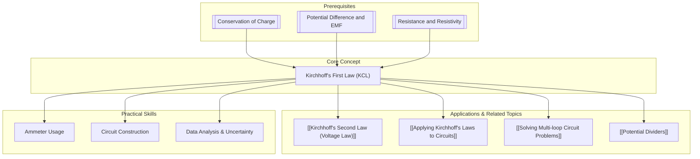

# 1. Overview / 概述

**English:**
Kirchhoff's First Law, also known as the **Current Law (KCL)** , is a fundamental principle in circuit analysis. It is based on the **conservation of electric charge**. The law states that the total current entering a junction (or node) in an electrical circuit must equal the total current leaving that junction. This sub-topic focuses on understanding, applying, and calculating currents at circuit junctions. It is the first of two key laws that form the foundation for analyzing complex circuits, including multi-loop and [[Potential Dividers]] circuits. Mastering KCL is essential before moving on to [[Kirchhoff's Second Law (Voltage Law)]] and [[Solving Multi-loop Circuit Problems]].

**中文:**
基尔霍夫第一定律，也称为**电流定律 (KCL)** ，是电路分析中的基本原理。它基于**电荷守恒**定律。该定律指出，流入电路中某个节点（或结点）的总电流必须等于流出该节点的总电流。本子知识点侧重于理解、应用和计算电路节点处的电流。它是构成分析复杂电路（包括多回路和[[Potential Dividers]]电路）基础的两个关键定律中的第一个。在继续学习[[Kirchhoff's Second Law (Voltage Law)]]和[[Solving Multi-loop Circuit Problems]]之前，掌握KCL至关重要。

---

# 2. Syllabus Learning Objectives / 考纲学习目标

| CAIE 9702 (9.4 a-d) | Edexcel IAL (WPH11 U2: 3.17-3.20) |
|-----------|-------------|
| State Kirchhoff's first law and appreciate that it is a consequence of conservation of charge. | Know that Kirchhoff's first law is a consequence of conservation of charge. |
| Apply Kirchhoff's first law to simple DC circuits. | Apply Kirchhoff's first law to simple DC circuits. |
| Use Kirchhoff's first law to solve problems involving currents at a junction. | Use Kirchhoff's first law to solve problems involving currents at a junction. |
| Combine Kirchhoff's first law with the second law to solve circuit problems. | Combine Kirchhoff's first law with the second law to solve circuit problems. |

**Examiner Expectations / 考官期望:**
- **EN:** You must be able to state the law, explain its physical basis (conservation of charge), and apply it to find unknown currents in a circuit diagram. You must be able to assign correct positive/negative signs to currents based on assumed directions.
- **CN:** 你必须能够陈述该定律，解释其物理基础（电荷守恒），并应用它来找出电路图中的未知电流。你必须能够根据假定的方向为电流分配正确的正/负号。

---

# 3. Core Definitions / 核心定义

| Term (EN/CN) | Definition (EN) | Definition (CN) | Common Mistakes / 常见错误 |
|--------------|-----------------|-----------------|---------------------------|
| **Kirchhoff's First Law (KCL)** / 基尔霍夫第一定律 | The sum of the currents entering any junction in an electrical circuit is equal to the sum of the currents leaving that junction. | 在电路中，流入任一节点的电流之和等于流出该节点的电流之和。 | Forgetting to account for all branches at the junction. / 忘记考虑节点处的所有分支。 |
| **Junction (Node)** / 节点 | A point in a circuit where three or more conductors meet. | 电路中三个或更多导体连接的点。 | Confusing a junction with a simple connection point (e.g., a wire joining two components in series). / 将节点与简单的连接点（例如，串联连接两个元件的导线）混淆。 |
| **Conservation of Charge** / 电荷守恒 | A fundamental physical law stating that electric charge cannot be created or destroyed; it can only be transferred. | 一个基本的物理定律，指出电荷既不能被创造也不能被消灭，只能被转移。 | Not linking KCL directly to this principle. / 没有将KCL直接与这个原理联系起来。 |
| **Branch Current** / 支路电流 | The current flowing through a single path (branch) of a circuit. | 流过电路单一路径（支路）的电流。 | Assuming all branch currents are equal. / 假设所有支路电流都相等。 |

---

# 4. Key Concepts Explained / 关键概念详解

## 4.1 The Principle of Current Conservation at a Junction / 节点处电流守恒原理

### Explanation / 解释
**English:**
Imagine a junction as a point where several paths (branches) meet. Electric charge carriers (electrons) flow into this point from some paths and flow out to others. Since charge cannot accumulate at the junction (it has nowhere to go), the total amount of charge flowing in per unit time (current) must equal the total amount flowing out per unit time. This is the essence of KCL. Mathematically, we can write:
$$ \Sigma I_{in} = \Sigma I_{out} $$
Alternatively, if we assign a sign convention (e.g., currents entering are positive, currents leaving are negative), the algebraic sum of all currents at a junction is zero:
$$ \Sigma I = 0 $$
This law is a direct consequence of the [[Conservation of Charge]].

**中文:**
将一个节点想象成几条路径（支路）汇合的点。电荷载流子（电子）从某些路径流入该点，并从其他路径流出。由于电荷不能在节点处积累（它无处可去），因此单位时间内流入的总电荷量（电流）必须等于单位时间内流出的总电荷量。这就是KCL的本质。数学上，我们可以写成：
$$ \Sigma I_{in} = \Sigma I_{out} $$
或者，如果我们采用符号约定（例如，流入的电流为正，流出的电流为负），则节点处所有电流的代数和为零：
$$ \Sigma I = 0 $$
该定律是[[Conservation of Charge]]的直接结果。

### Physical Meaning / 物理意义
**English:**
The law ensures that charge is conserved in the circuit. It prevents the unphysical build-up of charge at any point. It is a statement of continuity for electric current.

**中文:**
该定律确保了电路中的电荷守恒。它防止了电荷在任何点上的非物理性积累。这是电流连续性的一种表述。

### Common Misconceptions / 常见误区
- **EN:** Thinking that the current is "used up" by components like resistors. Current is not consumed; it is the same everywhere in a series circuit, but it splits at junctions in a parallel circuit.
- **CN:** 认为电流被电阻器等元件“消耗”了。电流不会被消耗；在串联电路中，电流处处相等，但在并联电路的节点处会分流。
- **EN:** Forgetting to consider the direction of the current. The sign of the current in the equation depends on whether it is entering or leaving the junction.
- **CN:** 忘记考虑电流的方向。方程中电流的符号取决于它是流入还是流出节点。

### Exam Tips / 考试提示
- **EN:** Always draw an arrow on the circuit diagram to indicate the assumed direction of each unknown current. If your calculation yields a negative value, it simply means the actual current flows in the opposite direction to your arrow.
- **CN:** 始终在电路图上画一个箭头，以指示每个未知电流的假定方向。如果你的计算得出负值，这仅仅意味着实际电流与你的箭头方向相反。

> 📷 **IMAGE PROMPT — KCL-01: Junction Current Flow Diagram**
> A clear, simple circuit diagram showing a central junction (node) with three wires. One wire has an arrow and label "I1 = 5A" pointing towards the junction. A second wire has an arrow and label "I2 = 2A" pointing towards the junction. A third wire has an arrow and label "I3 = ?" pointing away from the junction. The equation "I1 + I2 = I3" is written next to the diagram.

---

# 5. Essential Equations / 核心公式

For each key equation:

$$ \Sigma I_{in} = \Sigma I_{out} $$

| Symbol (符号) | Meaning (EN) | Meaning (CN) | Unit (单位) |
|--------------|-------------|-------------|------------|
| $\Sigma I_{in}$ | Sum of all currents entering the junction | 流入节点的所有电流之和 | Amperes (A) / 安培 |
| $\Sigma I_{out}$ | Sum of all currents leaving the junction | 流出节点的所有电流之和 | Amperes (A) / 安培 |

**Derivation / 推导:** This is not derived mathematically but is a statement of a fundamental physical law (conservation of charge).
**Conditions / 适用条件:** (EN+CN) This law applies to any junction in any electrical circuit, under all conditions (DC and AC, steady-state and transient). / 该定律适用于任何电路中的任何节点，在所有条件下（直流和交流，稳态和瞬态）。
**Limitations / 局限性:** (EN+CN) KCL is a macroscopic law. It does not describe the microscopic behavior of individual charge carriers. It assumes no net charge accumulation at the junction. / KCL是一个宏观定律。它不描述单个电荷载流子的微观行为。它假设节点处没有净电荷积累。

---

# 6. Graphs and Relationships / 图表与关系

There are no specific graphs for KCL itself. The relationship is a simple algebraic sum. However, the concept is crucial for understanding current distribution in parallel circuits.

## 6.1 Current Distribution in a Parallel Circuit / 并联电路中的电流分布

### Axes / 坐标轴 (EN+CN)
- X-axis: Branch Resistance (R) / 支路电阻 (R)
- Y-axis: Branch Current (I) / 支路电流 (I)

### Shape / 形状 (EN+CN)
- An inverse relationship (hyperbolic curve). As resistance increases, the current in that branch decreases. / 反比关系（双曲线）。随着电阻增加，该支路中的电流减小。

### Gradient Meaning / 斜率含义 (EN+CN)
- The gradient is not constant and has no simple physical meaning. / 斜率不是常数，没有简单的物理意义。

### Area Meaning / 面积含义 (EN+CN)
- No meaningful area. / 没有有意义的面积。

### Exam Interpretation / 考试解读 (EN+CN)
- This graph illustrates that in a parallel circuit, current divides inversely to resistance. KCL is the principle that governs this division. / 该图说明了在并联电路中，电流与电阻成反比分配。KCL是支配这种分配的原理。

---

# 7. Required Diagrams / 必备图表

## 7.1 A Simple Junction with Three Branches / 一个有三条支路的简单节点

### Description / 描述 (EN+CN)
A diagram showing a single junction point with three wires connected to it. Two wires have currents flowing into the junction, and one wire has a current flowing out. / 一个显示单个节点点以及连接到它的三条导线的图。两条导线有电流流入节点，一条导线有电流流出。

### Image Prompt / 图片生成提示
> 📷 **IMAGE PROMPT — KCL-02: Simple Junction Diagram**
> A clean, educational diagram of an electrical circuit junction. A central black dot represents the node. Three thick colored lines (red, blue, green) represent wires. Red and blue wires have arrows pointing towards the dot, labeled "I1" and "I2". The green wire has an arrow pointing away from the dot, labeled "I3". A text box shows the equation: I1 + I2 = I3. The background is white. The style is simple and clear, suitable for a physics textbook.

### Labels Required / 需要标注 (EN+CN)
- Junction (Node) / 节点
- I1 (Current entering) / I1 (流入电流)
- I2 (Current entering) / I2 (流入电流)
- I3 (Current leaving) / I3 (流出电流)

### Exam Importance / 考试重要性 (EN+CN)
- **High.** This is the most basic and essential diagram for understanding and applying KCL. You will be expected to draw and interpret such diagrams in exam questions. / **高。** 这是理解和应用KCL最基本、最重要的图。考试中会期望你画出并解释此类图。

---

# 8. Worked Examples / 典型例题

## Example 1: Finding an Unknown Current at a Junction / 求节点处的未知电流

### Question / 题目
**English:**
In the circuit shown, a junction has three wires. The current in one wire is 3.0 A flowing into the junction. The current in a second wire is 5.0 A flowing out of the junction. The current in the third wire is unknown, $I$. Find the magnitude and direction of $I$.

**中文:**
在所示的电路中，一个节点有三条导线。一条导线中的电流为 3.0 A，流入节点。第二条导线中的电流为 5.0 A，流出节点。第三条导线中的电流未知，为 $I$。求 $I$ 的大小和方向。

### Solution / 解答
**Step 1: Assign signs.**
Let currents entering the junction be positive, and currents leaving be negative.
$I_1 = +3.0 \text{ A}$ (entering)
$I_2 = -5.0 \text{ A}$ (leaving)
$I_3 = I$ (unknown)

**Step 2: Apply KCL ($\Sigma I = 0$).**
$$ +3.0 + (-5.0) + I = 0 $$
$$ -2.0 + I = 0 $$
$$ I = +2.0 \text{ A} $$

**Step 3: Interpret the sign.**
Since $I$ is positive, it flows into the junction.

### Final Answer / 最终答案
**Answer:** The magnitude of the current is 2.0 A, and it flows into the junction. | **答案：** 电流大小为 2.0 A，方向为流入节点。

### Quick Tip / 提示
(EN+CN) Always define your sign convention before applying the equation. / 在应用方程之前，务必定义你的符号约定。

---

# 9. Past Paper Question Types / 历年真题题型

| Question Type / 题型 | Frequency / 频率 | Difficulty / 难度 | Past Paper References / 真题索引 |
|----------------------|------------------|------------------|-------------------------------|
| Direct application of KCL to find a single unknown current. | Very High / 非常高 | Easy / 简单 | 📝 *待填入* |
| Combining KCL with Ohm's Law to find currents and voltages in a simple circuit. | High / 高 | Medium / 中等 | 📝 *待填入* |
| Using KCL as part of a larger problem involving [[Kirchhoff's Second Law (Voltage Law)]] in multi-loop circuits. | High / 高 | Hard / 困难 | 📝 *待填入* |

**Common Command Words / 常见指令词:**
- **EN:** State, Apply, Calculate, Determine, Show that
- **CN:** 陈述，应用，计算，确定，证明

---

# 10. Practical Skills Connections / 实验技能链接

**English:**
KCL is verified experimentally by measuring currents in different branches of a circuit using **ammeters**. You must be able to:
1.  **Set up a circuit** with a junction (e.g., a parallel circuit).
2.  **Connect ammeters** in series with each branch to measure the branch currents.
3.  **Record and analyze data** to show that the sum of currents entering a junction equals the sum leaving.
4.  **Account for uncertainties** in ammeter readings. The experimental result should be consistent with KCL within the limits of experimental uncertainty.
5.  **Identify sources of error**, such as the internal resistance of the ammeters affecting the circuit.

**中文:**
KCL通过使用**电流表**测量电路不同支路中的电流来实验验证。你必须能够：
1.  **搭建一个带有节点**的电路（例如，并联电路）。
2.  **将电流表串联**到每个支路中以测量支路电流。
3.  **记录和分析数据**，以证明流入节点的电流之和等于流出的电流之和。
4.  **考虑电流表读数的不确定度**。实验结果应在实验不确定度范围内与KCL一致。
5.  **识别误差来源**，例如电流表的内阻影响电路。

---

# 11. Concept Map / 概念图谱

---

# 12. Quick Revision Sheet / 速查表

| Category / 类别 | Key Points / 要点 |
|----------------|------------------|
| Definition / 定义 | $\Sigma I_{in} = \Sigma I_{out}$ at a junction. / 在节点处，$\Sigma I_{in} = \Sigma I_{out}$。 |
| Key Formula / 核心公式 | $\Sigma I = 0$ (with sign convention). / $\Sigma I = 0$（使用符号约定）。 |
| Key Graph / 核心图表 | No specific graph. Concept is used in current vs. resistance graphs for parallel circuits. / 无特定图表。该概念用于并联电路的电流-电阻图。 |
| Exam Tip / 考试提示 | 1. Draw arrows for assumed current directions.   2. Define a sign convention (e.g., entering = +).   3. A negative answer means the current flows opposite to your arrow.   1. 为假定的电流方向画箭头。   2. 定义符号约定（例如，流入 = +）。   3. 负答案意味着电流与你的箭头方向相反。 |