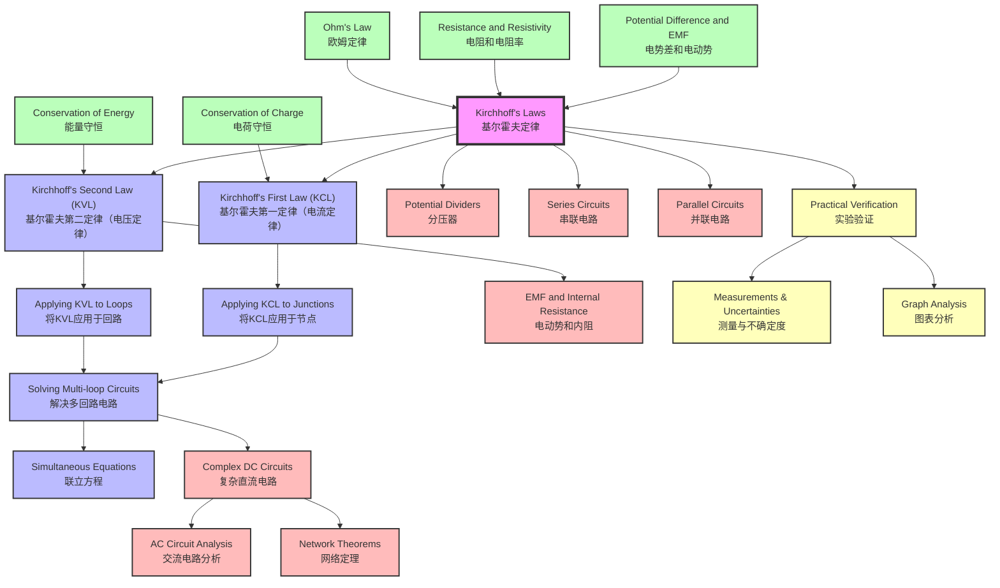

# 1. Overview / 概述

**English:**
Kirchhoff's Laws are two fundamental principles that govern the behaviour of electrical circuits. They extend Ohm's Law to more complex circuits where multiple components are connected in loops and junctions. Kirchhoff's Current Law (KCL) states that the total current entering a junction equals the total current leaving it, based on the conservation of electric charge. Kirchhoff's Voltage Law (KVL) states that the sum of potential differences around any closed loop equals zero, based on the conservation of energy.

These laws are essential for analysing circuits that cannot be simplified using series and parallel resistor combinations alone. They form the foundation for understanding [[Potential Dividers]], complex DC circuits, and eventually AC circuit analysis. In both Cambridge 9702 and Edexcel IAL syllabuses, Kirchhoff's Laws are examined at AS Level and are prerequisites for A2 topics such as [[Electromotive Force and Internal Resistance]] and [[Capacitors in Circuits]].

Real-world applications include: designing electrical power distribution networks, analysing electronic circuits in smartphones and computers, automotive electrical systems, and renewable energy systems like solar panel arrays. In examinations, students are expected to apply these laws to solve multi-loop circuit problems, calculate unknown currents and voltages, and explain the underlying physical principles.

**中文：**
基尔霍夫定律是支配电路行为的两条基本定律。它们将欧姆定律扩展到更复杂的电路，其中多个元件连接在回路和节点中。基尔霍夫电流定律（KCL）指出，流入节点的总电流等于流出节点的总电流，基于电荷守恒。基尔霍夫电压定律（KVL）指出，围绕任何闭合回路的电势差之和为零，基于能量守恒。

这些定律对于分析无法仅用串联和并联电阻组合简化的电路至关重要。它们构成了理解[[分压器]]、复杂直流电路以及最终交流电路分析的基础。在剑桥9702和爱德思IAL教学大纲中，基尔霍夫定律在AS阶段考试，是A2主题如[[电动势和内阻]]和[[电路中的电容器]]的先修知识。

实际应用包括：设计电力分配网络、分析智能手机和计算机中的电子电路、汽车电气系统以及太阳能电池板阵列等可再生能源系统。在考试中，学生需要应用这些定律解决多回路电路问题，计算未知电流和电压，并解释基本的物理原理。

---

# 2. Syllabus Learning Objectives / 考纲学习目标

| CAIE 9702 | Edexcel IAL |
|-----------|-------------|
| 9.4(a) State Kirchhoff's first law and show an understanding of its use | 3.17 Use Kirchhoff's first law (conservation of charge) |
| 9.4(b) State Kirchhoff's second law and show an understanding of its use | 3.18 Use Kirchhoff's second law (conservation of energy) |
| 9.4(c) Apply Kirchhoff's laws to solve simple circuit problems | 3.19 Apply Kirchhoff's laws to circuits with more than one loop |
| 9.4(d) Derive and use the equation for the combined resistance of two or more resistors in series and parallel | 3.20 Solve problems involving circuits with cells in series and parallel |

**Examiner Expectations / 考官期望：**

**English:**
- Students must be able to state both laws verbatim using correct terminology
- Apply KCL to junctions with up to 4 branches
- Apply KVL to loops containing cells, resistors, and other components
- Solve simultaneous equations arising from circuit analysis
- Distinguish between EMF and potential difference when applying KVL
- Handle circuits with multiple cells (both aiding and opposing)
- Calculate combined resistance using Kirchhoff's laws as derivation

**中文：**
- 学生必须能够用正确的术语逐字陈述两条定律
- 将KCL应用于最多有4个分支的节点
- 将KVL应用于包含电池、电阻和其他元件的回路
- 解电路分析中产生的联立方程
- 在应用KVL时区分电动势和电势差
- 处理包含多个电池的电路（同向和反向）
- 使用基尔霍夫定律推导并计算组合电阻

> 📋 **CIE Only:** CIE specifically requires derivation of series and parallel resistance formulas using Kirchhoff's laws. Students must show the step-by-step derivation in Paper 4 (A2) questions.

> 📋 **Edexcel Only:** Edexcel emphasises practical applications and requires students to set up circuits to verify Kirchhoff's laws experimentally (Unit 3 practical skills). They also include problems with non-ohmic components.

---

# 3. Core Definitions / 核心定义

| Term (EN/CN) | Definition (EN) | Definition (CN) | Common Mistakes / 常见错误 |
|--------------|-----------------|-----------------|---------------------------|
| **Kirchhoff's First Law (Current Law)** / 基尔霍夫第一定律（电流定律） | The sum of the currents entering any junction in an electrical circuit equals the sum of the currents leaving that junction. | 在电路中，流入任何节点的电流之和等于流出该节点的电流之和。 | Confusing entering/leaving directions; forgetting to include all branches; sign convention errors |
| **Kirchhoff's Second Law (Voltage Law)** / 基尔霍夫第二定律（电压定律） | The sum of the electromotive forces (EMFs) around any closed loop in a circuit equals the sum of the potential differences around that loop. | 电路中任何闭合回路中电动势之和等于该回路中电势差之和。 | Forgetting to account for internal resistance; incorrect sign convention for voltage drops; mixing EMF and PD |
| **Junction (Node)** / 节点 | A point in a circuit where three or more conductors meet. | 电路中三个或更多导体连接的点。 | Calling a simple connection a junction; missing hidden junctions in complex circuits |
| **Loop** / 回路 | Any closed conducting path in a circuit. | 电路中任何闭合的导电路径。 | Not considering all possible loops; using non-independent loops |
| **Conservation of Charge** / 电荷守恒 | Electric charge cannot be created or destroyed; it is conserved in any process. | 电荷不能被创造或消灭；在任何过程中电荷守恒。 | Thinking current is "used up" by components |
| **Conservation of Energy** / 能量守恒 | Energy cannot be created or destroyed; it can only be transformed from one form to another. | 能量不能被创造或消灭；只能从一种形式转化为另一种形式。 | Forgetting that energy is dissipated in resistors as heat |
| **EMF (Electromotive Force)** / 电动势 | The electrical energy per unit charge supplied by a source. | 电源提供的每单位电荷的电能。 | Confusing EMF with potential difference; thinking EMF is a force |
| **Potential Difference** / 电势差 | The electrical energy per unit charge converted to other forms of energy when charge passes through a component. | 电荷通过元件时每单位电荷转化为其他形式的电能。 | Using PD instead of EMF in KVL; sign errors |

---

# 4. Key Concepts Explained / 关键概念详解

## 4.1 Kirchhoff's First Law (KCL) / 基尔霍夫第一定律（电流定律）

### Explanation / 解释
**English:**
Kirchhoff's Current Law (KCL) is a direct consequence of the [[Conservation of Charge]]. At any junction in a circuit, charge cannot accumulate — what flows in must flow out. Mathematically:

$$ \sum I_{\text{in}} = \sum I_{\text{out}} $$

For a junction with currents $I_1$, $I_2$, $I_3$, and $I_4$, if $I_1$ and $I_2$ enter while $I_3$ and $I_4$ leave:

$$ I_1 + I_2 = I_3 + I_4 $$

Alternatively, using sign convention where currents entering are positive and leaving are negative:

$$ \sum I = 0 $$

This law applies to all junctions regardless of the components connected. It is used to relate currents in different branches of a circuit.

**中文：**
基尔霍夫电流定律（KCL）是[[电荷守恒]]的直接结果。在电路的任何节点处，电荷不能积累——流入的必须等于流出的。数学上：

$$ \sum I_{\text{入}} = \sum I_{\text{出}} $$

对于一个有电流 $I_1$、$I_2$、$I_3$ 和 $I_4$ 的节点，如果 $I_1$ 和 $I_2$ 流入而 $I_3$ 和 $I_4$ 流出：

$$ I_1 + I_2 = I_3 + I_4 $$

或者使用符号约定，流入为正，流出为负：

$$ \sum I = 0 $$

该定律适用于所有节点，无论连接什么元件。它用于关联电路不同分支中的电流。

### Physical Meaning / 物理意义
**English:**
Imagine water flowing through pipes. At a pipe junction, the amount of water entering must equal the amount leaving — water cannot disappear or appear. Similarly, electric current (flow of charge) behaves the same way. This is why when a current splits at a junction, the sum of the branch currents equals the original current.

**中文：**
想象水流过管道。在管道连接处，进入的水量必须等于流出的水量——水不能消失或出现。类似地，电流（电荷流动）也以同样的方式行为。这就是为什么当电流在节点处分流时，分支电流之和等于原始电流。

### Common Misconceptions / 常见误区
1. **"Current is used up by components"** — Current is not consumed; charge is conserved. Components convert electrical energy to other forms, but the charge continues flowing.
2. **"Only two branches matter"** — KCL applies to any number of branches at a junction.
3. **"Direction doesn't matter"** — Sign convention is critical; incorrect direction assignment leads to wrong equations.

### Exam Tips / 考试提示
**English:**
- Always label currents with arrows on circuit diagrams
- Use consistent sign convention (entering = positive, leaving = negative)
- For junctions with unknown currents, assume a direction — if the answer is negative, the actual direction is opposite
- CIE often asks to "state Kirchhoff's first law" (1 mark) then apply it (2-3 marks)
- Edexcel may ask to "explain how conservation of charge leads to Kirchhoff's first law"

**中文：**
- 始终在电路图上用箭头标记电流
- 使用一致的符号约定（流入为正，流出为负）
- 对于未知电流的节点，假设一个方向——如果答案为负，实际方向相反
- CIE常要求"陈述基尔霍夫第一定律"（1分）然后应用（2-3分）
- Edexcel可能要求"解释电荷守恒如何导出基尔霍夫第一定律"

> 📷 **IMAGE PROMPT — KCL-01: Junction with Multiple Currents**
>
> A clear diagram showing a junction point with 4 branches. Arrows indicate current directions: two arrows pointing toward the junction (labeled I₁, I₂) and two arrows pointing away (labeled I₃, I₄). The equation I₁ + I₂ = I₃ + I₄ is displayed below. Clean white background, educational style, suitable for A-Level physics textbook. Labels in English with clear font.

---

## 4.2 Kirchhoff's Second Law (KVL) / 基尔霍夫第二定律（电压定律）

### Explanation / 解释
**English:**
Kirchhoff's Voltage Law (KVL) is a direct consequence of the [[Conservation of Energy]]. As charge moves around a closed loop, the total energy gained from sources (EMFs) must equal the total energy lost in components (potential differences). Mathematically:

$$ \sum \mathcal{E} = \sum IR $$

Or using sign convention:

$$ \sum V = 0 \quad \text{(around any closed loop)} $$

When traversing a loop:
- **EMF source:** Positive if traversed from negative to positive terminal (gaining energy)
- **EMF source:** Negative if traversed from positive to negative terminal (losing energy)
- **Resistor:** Negative if traversed in direction of current (voltage drop, $V = IR$)
- **Resistor:** Positive if traversed opposite to current direction (voltage rise)

**中文：**
基尔霍夫电压定律（KVL）是[[能量守恒]]的直接结果。当电荷在闭合回路中移动时，从电源获得的总能量（电动势）必须等于在元件中损失的总能量（电势差）。数学上：

$$ \sum \mathcal{E} = \sum IR $$

或使用符号约定：

$$ \sum V = 0 \quad \text{（围绕任何闭合回路）} $$

当遍历回路时：
- **电动势源：** 如果从负极到正极遍历则为正（获得能量）
- **电动势源：** 如果从正极到负极遍历则为负（损失能量）
- **电阻：** 如果沿电流方向遍历则为负（电压降，$V = IR$）
- **电阻：** 如果逆电流方向遍历则为正（电压升）

### Physical Meaning / 物理意义
**English:**
Think of a hiker walking around a mountain loop. The total height gained going up must equal the total height lost going down to return to the starting point. Similarly, in an electrical circuit, the total voltage "lift" from batteries must equal the total voltage "drop" across components when going around a complete loop.

**中文：**
想象一个徒步者围绕山丘走一圈。上升的总高度必须等于下降的总高度才能回到起点。类似地，在电路中，电池提供的总电压"升"必须等于元件上的总电压"降"才能完成一个完整的回路。

### Common Misconceptions / 常见误区
1. **"EMF and PD are the same"** — EMF is energy supplied per unit charge; PD is energy converted per unit charge. They are equal only for an ideal battery with no internal resistance.
2. **"Sign convention doesn't matter"** — Incorrect signs lead to wrong equations. Always define a traversal direction.
3. **"Only one loop matters"** — Complex circuits have multiple loops; each gives an independent equation.
4. **"Internal resistance can be ignored"** — In KVL, the internal resistance of a cell must be included as an additional voltage drop.

### Exam Tips / 考试提示
**English:**
- Always draw the loop direction (clockwise or anticlockwise) on the circuit diagram
- Write KVL equations systematically: start at one point, go around, return to the same point
- For cells with internal resistance $r$, the voltage drop across the cell is $Ir$ (not $\mathcal{E}$)
- CIE often combines KVL with [[Resistance and Resistivity]] in multi-part questions
- Edexcel may include practical scenarios where students measure voltages to verify KVL

**中文：**
- 始终在电路图上画出回路方向（顺时针或逆时针）
- 系统地写出KVL方程：从一点开始，绕一圈，回到同一点
- 对于有内阻 $r$ 的电池，电池上的电压降是 $Ir$（不是 $\mathcal{E}$）
- CIE常将KVL与[[电阻和电阻率]]结合在多部分问题中
- Edexcel可能包括实际场景，学生测量电压以验证KVL

> 📷 **IMAGE PROMPT — KVL-01: Single Loop Circuit**
>
> A simple circuit diagram showing a single loop with one cell (battery symbol with + and - terminals, labeled ε and internal resistance r) and one resistor (labeled R). An arrow shows the clockwise traversal direction. Labels indicate: +ε when going from - to + terminal, -IR when going through resistor in current direction. Clean educational style, white background.

---

## 4.3 Applying Kirchhoff's Laws to Circuits / 应用基尔霍夫定律于电路

### Explanation / 解释
**English:**
Solving circuit problems using Kirchhoff's laws involves a systematic approach:

1. **Identify all junctions** — Apply KCL to each junction (except one, which is redundant)
2. **Identify all loops** — Apply KVL to enough independent loops to obtain the required number of equations
3. **Assign current directions** — Label currents in each branch with arrows (assume directions if unknown)
4. **Write equations** — Use KCL for junctions and KVL for loops
5. **Solve simultaneous equations** — Find unknown currents and voltages
6. **Check consistency** — Negative current means actual direction is opposite to assumed

The number of independent equations needed equals the number of unknown currents. For a circuit with $b$ branches and $j$ junctions:
- Number of KCL equations: $j - 1$
- Number of KVL equations: $b - (j - 1)$

**中文：**
使用基尔霍夫定律解决电路问题涉及系统的方法：

1. **识别所有节点** — 对每个节点应用KCL（除一个外，其余是冗余的）
2. **识别所有回路** — 对足够多的独立回路应用KVL以获得所需数量的方程
3. **分配电流方向** — 用箭头标记每个分支中的电流（如果未知则假设方向）
4. **写出方程** — 对节点使用KCL，对回路使用KVL
5. **解联立方程** — 求未知电流和电压
6. **检查一致性** — 负电流意味着实际方向与假设相反

所需独立方程的数量等于未知电流的数量。对于有 $b$ 个分支和 $j$ 个节点的电路：
- KCL方程数量：$j - 1$
- KVL方程数量：$b - (j - 1)$

### Common Misconceptions / 常见误区
1. **"More loops = more equations"** — Only independent loops give independent equations. A loop that is a combination of other loops is not independent.
2. **"Current direction must be correct"** — Assumed direction is fine; the sign of the answer tells the actual direction.
3. **"KCL and KVL are separate"** — They must be used together to solve complex circuits.
4. **"All components are ohmic"** — Kirchhoff's laws apply to any circuit, but non-ohmic components require their V-I characteristics.

### Exam Tips / 考试提示
**English:**
- Draw a large, clear circuit diagram
- Label ALL currents, EMFs, and resistances
- Show the loop traversal direction for each KVL equation
- Write equations in standard form: $a_1I_1 + a_2I_2 + ... = b$
- Use substitution or elimination to solve simultaneous equations
- Check answers by verifying KCL at a junction or KVL in a loop not used
- CIE Paper 4 often has a 6-8 mark question on Kirchhoff's laws
- Edexcel Unit 2 may have a 4-6 mark calculation question

**中文：**
- 画出大而清晰的电路图
- 标记所有电流、电动势和电阻
- 显示每个KVL方程的回路遍历方向
- 以标准形式写出方程：$a_1I_1 + a_2I_2 + ... = b$
- 使用代入法或消元法解联立方程
- 通过验证未使用的节点或回路的KCL/KVL来检查答案
- CIE试卷4常有6-8分的基尔霍夫定律问题
- Edexcel单元2可能有4-6分的计算题

---

## 4.4 Solving Multi-loop Circuit Problems / 解决多回路电路问题

### Explanation / 解释
**English:**
Multi-loop circuits have two or more loops sharing common branches. The systematic approach is:

**Step 1:** Identify all branches and assign currents $I_1, I_2, I_3, ...$

**Step 2:** Apply KCL at junctions to relate currents

**Step 3:** Choose independent loops and apply KVL

**Step 4:** Solve the system of equations

**Example Circuit:** A circuit with two loops sharing a middle branch:
- Loop 1: Cell $\mathcal{E}_1$, resistor $R_1$, shared resistor $R_3$
- Loop 2: Cell $\mathcal{E}_2$, resistor $R_2$, shared resistor $R_3$

KCL at top junction: $I_1 = I_2 + I_3$ (if $I_1$ enters, $I_2$ and $I_3$ leave)

KVL Loop 1 (clockwise): $\mathcal{E}_1 - I_1R_1 - I_3R_3 = 0$

KVL Loop 2 (clockwise): $\mathcal{E}_2 - I_2R_2 + I_3R_3 = 0$ (note: $I_3$ direction opposite to loop direction)

**中文：**
多回路电路有两个或更多共享公共分支的回路。系统方法是：

**步骤1：** 识别所有分支并分配电流 $I_1, I_2, I_3, ...$

**步骤2：** 在节点处应用KCL以关联电流

**步骤3：** 选择独立回路并应用KVL

**步骤4：** 解方程组

**示例电路：** 一个有两个回路共享中间分支的电路：
- 回路1：电池 $\mathcal{E}_1$，电阻 $R_1$，共享电阻 $R_3$
- 回路2：电池 $\mathcal{E}_2$，电阻 $R_2$，共享电阻 $R_3$

顶部节点的KCL：$I_1 = I_2 + I_3$（如果 $I_1$ 流入，$I_2$ 和 $I_3$ 流出）

回路1的KVL（顺时针）：$\mathcal{E}_1 - I_1R_1 - I_3R_3 = 0$

回路2的KVL（顺时针）：$\mathcal{E}_2 - I_2R_2 + I_3R_3 = 0$（注意：$I_3$ 方向与回路方向相反）

### Common Misconceptions / 常见误区
1. **"All loops must be traversed in the same direction"** — Loops can be traversed in any direction; consistency within each loop is what matters.
2. **"The middle branch current is the sum of loop currents"** — This is true only if loop currents are defined as mesh currents.
3. **"More equations than unknowns means overdetermined"** — Some equations may be dependent; check for independence.

### Exam Tips / 考试提示
**English:**
- For circuits with 2 loops, you typically get 3 equations (1 KCL + 2 KVL) for 3 unknowns
- Use matrix methods or systematic elimination for complex circuits
- Check units: all terms in KVL must be in volts
- Common exam trick: one cell may be connected in reverse (opposing)
- Edexcel may ask to "determine the current in each branch" — show all working

**中文：**
- 对于有2个回路的电路，通常得到3个方程（1个KCL + 2个KVL）对应3个未知数
- 对复杂电路使用矩阵方法或系统消元法
- 检查单位：KVL中的所有项必须是伏特
- 常见考试技巧：一个电池可能反向连接（反向）
- Edexcel可能要求"确定每个分支中的电流"——展示所有步骤

> 📷 **IMAGE PROMPT — MULTI-01: Two-Loop Circuit**
>
> A circuit diagram with two loops sharing a middle branch. Left loop: cell ε₁ (left side, + top) with internal resistance r₁, resistor R₁ (top). Right loop: cell ε₂ (right side, + top) with internal resistance r₂, resistor R₂ (bottom). Middle branch: resistor R₃. Current arrows: I₁ in left loop (clockwise), I₂ in right loop (clockwise), I₃ in middle branch (downward). All components labeled. Clean educational style.

---

# 5. Essential Equations / 核心公式

## 5.1 Kirchhoff's Current Law / 基尔霍夫电流定律

**Equation / 公式:**
$$ \sum I_{\text{in}} = \sum I_{\text{out}} \quad \text{or} \quad \sum I = 0 $$

**Variables / 变量:**
| Symbol (符号) | Meaning (EN) | Meaning (CN) | Unit (单位) |
|--------------|-------------|-------------|------------|
| $I_{\text{in}}$ | Current entering a junction | 流入节点的电流 | A (Ampere) |
| $I_{\text{out}}$ | Current leaving a junction | 流出节点的电流 | A (Ampere) |
| $\sum I$ | Algebraic sum of all currents at a junction | 节点处所有电流的代数和 | A (Ampere) |

**Derivation / 推导:**
**English:**
Based on conservation of charge. In a steady state, charge cannot accumulate at a junction. The rate of charge flow (current) entering must equal the rate leaving. For a junction with $n$ branches:

$$ \sum_{k=1}^{n} I_k = 0 $$

where currents entering are positive and currents leaving are negative.

**中文：**
基于电荷守恒。在稳态下，电荷不能在节点处积累。进入的电荷流动率（电流）必须等于流出的。对于有 $n$ 个分支的节点：

$$ \sum_{k=1}^{n} I_k = 0 $$

其中流入的电流为正，流出的电流为负。

**Conditions / 适用条件:**
**English:** Steady-state DC circuits. Valid for AC circuits at any instant. Not valid if charge accumulates at the junction (e.g., during transient charging of capacitors).

**中文：** 稳态直流电路。对交流电路在任何瞬间都有效。如果电荷在节点处积累（例如电容器充电瞬态过程）则不成立。

**Limitations / 局限性:**
**English:** Does not account for displacement current in capacitors; for high-frequency AC, the law must be modified.

**中文：** 不考虑电容器中的位移电流；对于高频交流电，该定律必须修改。

**Rearrangements / 变形:**
**English:** $I_1 + I_2 = I_3 + I_4$ (for a junction with 4 branches, 2 entering, 2 leaving)

**中文：** $I_1 + I_2 = I_3 + I_4$（对于有4个分支的节点，2个流入，2个流出）

---

## 5.2 Kirchhoff's Voltage Law / 基尔霍夫电压定律

**Equation / 公式:**
$$ \sum \mathcal{E} = \sum IR \quad \text{or} \quad \sum V = 0 $$

**Variables / 变量:**
| Symbol (符号) | Meaning (EN) | Meaning (CN) | Unit (单位) |
|--------------|-------------|-------------|------------|
| $\mathcal{E}$ | Electromotive force of a source | 电源的电动势 | V (Volt) |
| $I$ | Current through a component | 通过元件的电流 | A (Ampere) |
| $R$ | Resistance of a component | 元件的电阻 | Ω (Ohm) |
| $V$ | Potential difference across a component | 元件两端的电势差 | V (Volt) |

**Derivation / 推导:**
**English:**
Based on conservation of energy. When charge $Q$ moves around a closed loop, the total work done by sources equals the total energy dissipated. Work done by source: $W = Q\mathcal{E}$. Energy dissipated: $W = QV = QIR$. For a complete loop:

$$ \sum Q\mathcal{E} = \sum QIR $$

Dividing by $Q$:

$$ \sum \mathcal{E} = \sum IR $$

**中文：**
基于能量守恒。当电荷 $Q$ 在闭合回路中移动时，电源做的总功等于消耗的总能量。电源做功：$W = Q\mathcal{E}$。消耗的能量：$W = QV = QIR$。对于一个完整回路：

$$ \sum Q\mathcal{E} = \sum QIR $$

除以 $Q$：

$$ \sum \mathcal{E} = \sum IR $$

**Conditions / 适用条件:**
**English:** Any closed loop in a circuit. Valid for both DC and AC circuits. Assumes no changing magnetic fields linking the loop (otherwise Faraday's law applies).

**中文：** 电路中的任何闭合回路。对直流和交流电路都有效。假设没有变化的磁场穿过回路（否则法拉第定律适用）。

**Limitations / 局限性:**
**English:** Does not account for induced EMF from changing magnetic fields (electromagnetic induction). For circuits with inductors or transformers, the full form including $L\frac{dI}{dt}$ must be used.

**中文：** 不考虑变化磁场产生的感应电动势（电磁感应）。对于含有电感器或变压器的电路，必须使用包含 $L\frac{dI}{dt}$ 的完整形式。

**Rearrangements / 变形:**
**English:** $\mathcal{E} = I(R + r)$ for a single cell with internal resistance $r$ connected to external resistance $R$.

**中文：** $\mathcal{E} = I(R + r)$ 对于单个有内阻 $r$ 的电池连接到外电阻 $R$。

---

## 5.3 Series Resistance Formula / 串联电阻公式

**Equation / 公式:**
$$ R_{\text{total}} = R_1 + R_2 + R_3 + ... $$

**Variables / 变量:**
| Symbol (符号) | Meaning (EN) | Meaning (CN) | Unit (单位) |
|--------------|-------------|-------------|------------|
| $R_{\text{total}}$ | Total (equivalent) resistance | 总（等效）电阻 | Ω (Ohm) |
| $R_1, R_2, ...$ | Individual resistances | 各个电阻 | Ω (Ohm) |

**Derivation / 推导:**
**English:**
Using KVL: For resistors in series, the same current $I$ flows through each. The total voltage across the combination is the sum of individual voltages:

$$ V_{\text{total}} = V_1 + V_2 + V_3 + ... $$

Using Ohm's law: $V = IR$, so:

$$ IR_{\text{total}} = IR_1 + IR_2 + IR_3 + ... $$

Dividing by $I$:

$$ R_{\text{total}} = R_1 + R_2 + R_3 + ... $$

**中文：**
使用KVL：对于串联电阻，相同的电流 $I$ 流过每个电阻。组合两端的总电压是各个电压之和：

$$ V_{\text{总}} = V_1 + V_2 + V_3 + ... $$

使用欧姆定律：$V = IR$，所以：

$$ IR_{\text{总}} = IR_1 + IR_2 + IR_3 + ... $$

除以 $I$：

$$ R_{\text{总}} = R_1 + R_2 + R_3 + ... $$

**Conditions / 适用条件:**
**English:** Resistors connected end-to-end with no junctions between them.

**中文：** 电阻首尾相连，之间没有节点。

**Limitations / 局限性:**
**English:** Only valid for ohmic resistors at constant temperature.

**中文：** 仅对恒定温度下的欧姆电阻有效。

---

## 5.4 Parallel Resistance Formula / 并联电阻公式

**Equation / 公式:**
$$ \frac{1}{R_{\text{total}}} = \frac{1}{R_1} + \frac{1}{R_2} + \frac{1}{R_3} + ... $$

**Variables / 变量:**
| Symbol (符号) | Meaning (EN) | Meaning (CN) | Unit (单位) |
|--------------|-------------|-------------|------------|
| $R_{\text{total}}$ | Total (equivalent) resistance | 总（等效）电阻 | Ω (Ohm) |
| $R_1, R_2, ...$ | Individual resistances | 各个电阻 | Ω (Ohm) |

**Derivation / 推导:**
**English:**
Using KCL: For resistors in parallel, the same voltage $V$ is across each. The total current is the sum of individual currents:

$$ I_{\text{total}} = I_1 + I_2 + I_3 + ... $$

Using Ohm's law: $I = V/R$, so:

$$ \frac{V}{R_{\text{total}}} = \frac{V}{R_1} + \frac{V}{R_2} + \frac{V}{R_3} + ... $$

Dividing by $V$:

$$ \frac{1}{R_{\text{total}}} = \frac{1}{R_1} + \frac{1}{R_2} + \frac{1}{R_3} + ... $$

For two resistors in parallel:

$$ R_{\text{total}} = \frac{R_1R_2}{R_1 + R_2} $$

**中文：**
使用KCL：对于并联电阻，每个电阻两端的电压 $V$ 相同。总电流是各个电流之和：

$$ I_{\text{总}} = I_1 + I_2 + I_3 + ... $$

使用欧姆定律：$I = V/R$，所以：

$$ \frac{V}{R_{\text{总}}} = \frac{V}{R_1} + \frac{V}{R_2} + \frac{V}{R_3} + ... $$

除以 $V$：

$$ \frac{1}{R_{\text{总}}} = \frac{1}{R_1} + \frac{1}{R_2} + \frac{1}{R_3} + ... $$

对于两个并联电阻：

$$ R_{\text{总}} = \frac{R_1R_2}{R_1 + R_2} $$

**Conditions / 适用条件:**
**English:** Resistors connected across the same two points (same potential difference).

**中文：** 电阻连接在相同的两点之间（相同的电势差）。

**Limitations / 局限性:**
**English:** Only valid for ohmic resistors at constant temperature. The total resistance is always less than the smallest individual resistance.

**中文：** 仅对恒定温度下的欧姆电阻有效。总电阻总是小于最小的单个电阻。

---

# 6. Graphs and Relationships / 图表与关系

## 6.1 Current Distribution at a Junction / 节点处的电流分布

### Axes / 坐标轴
**English:** x-axis: Branch number; y-axis: Current (A)
**中文：** x轴：分支编号；y轴：电流（A）

### Shape / 形状
**English:** Bar chart showing currents entering (positive) and leaving (negative) a junction. The sum of positive bars equals the sum of negative bars.
**中文：** 柱状图显示流入（正）和流出（负）节点的电流。正柱之和等于负柱之和。

### Gradient Meaning / 斜率含义
**English:** Not applicable for bar chart.
**中文：** 不适用于柱状图。

### Area Meaning / 面积含义
**English:** Not applicable.
**中文：** 不适用。

### Exam Interpretation / 考试解读
**English:** Students may be asked to determine an unknown current from a bar chart or to verify KCL by checking that the sum of currents is zero.
**中文：** 学生可能需要从柱状图确定未知电流，或通过检查电流之和为零来验证KCL。

### Common Questions / 常见问题
**English:** "Use the data in the bar chart to determine the current in branch X."
**中文：** "使用柱状图中的数据确定分支X中的电流。"

---

## 6.2 Voltage Distribution Around a Loop / 回路中的电压分布

### Axes / 坐标轴
**English:** x-axis: Position around loop; y-axis: Potential (V)
**中文：** x轴：回路中的位置；y轴：电势（V）

### Shape / 形状
**English:** A graph showing potential at different points around a closed loop. The potential starts at some value, changes across components (drops across resistors, rises across cells), and returns to the starting value.
**中文：** 显示闭合回路中不同点电势的图表。电势从某个值开始，经过元件时变化（电阻处下降，电池处上升），并回到起始值。

### Gradient Meaning / 斜率含义
**English:** The gradient at any point represents the electric field strength ($E = -dV/dx$). Steeper gradient means stronger field.
**中文：** 任何点的斜率代表电场强度（$E = -dV/dx$）。斜率越陡，场越强。

### Area Meaning / 面积含义
**English:** Not directly applicable.
**中文：** 不直接适用。

### Exam Interpretation / 考试解读
**English:** Students may be asked to identify where voltage drops occur, calculate the EMF of a cell from the graph, or explain why the potential returns to the starting value.
**中文：** 学生可能需要识别电压降发生的位置，从图表计算电池的电动势，或解释为什么电势回到起始值。

### Common Questions / 常见问题
**English:** "Sketch a graph showing how the potential varies around the loop shown in Figure 1."
**中文：** "画出显示图1所示回路中电势变化的图表。"

---

## 6.3 Current-Voltage Characteristics for Circuit Analysis / 电路分析的电流-电压特性

### Axes / 坐标轴
**English:** x-axis: Voltage (V); y-axis: Current (A)
**中文：** x轴：电压（V）；y轴：电流（A）

### Shape / 形状
**English:** For ohmic components, a straight line through origin with gradient $1/R$. For non-ohmic components (e.g., filament lamp, diode), the line is curved.
**中文：** 对于欧姆元件，是通过原点的直线，斜率为 $1/R$。对于非欧姆元件（如白炽灯、二极管），线是弯曲的。

### Gradient Meaning / 斜率含义
**English:** Gradient = $1/R$ (conductance). Steeper gradient means lower resistance.
**中文：** 斜率 = $1/R$（电导）。斜率越陡，电阻越小。

### Area Meaning / 面积含义
**English:** Area under the curve represents power ($P = VI$) only if the graph is for a specific component and the axes are current and voltage.
**中文：** 曲线下的面积代表功率（$P = VI$），仅当图表是针对特定元件且坐标轴是电流和电压时。

### Exam Interpretation / 考试解读
**English:** Students use I-V characteristics to determine resistance at different operating points. Combined with Kirchhoff's laws, they can find the operating point of a non-ohmic component in a circuit.
**中文：** 学生使用I-V特性确定不同工作点的电阻。结合基尔霍夫定律，他们可以找到电路中非欧姆元件的工作点。

### Common Questions / 常见问题
**English:** "Using the I-V characteristic graph and Kirchhoff's laws, determine the current through the diode when connected in series with a 10 Ω resistor and a 5 V battery."
**中文：** "使用I-V特性图和基尔霍夫定律，确定二极管与10Ω电阻和5V电池串联时的电流。"

---

# 7. Required Diagrams / 必备图表

## 7.1 Junction with Multiple Currents / 多电流节点图

### Description / 描述
**English:** A diagram showing a junction point where multiple conductors meet. Arrows indicate current directions with labels. The diagram should clearly show currents entering and leaving the junction, with the KCL equation displayed.

**中文：** 显示多个导体交汇的节点图。箭头指示电流方向并带有标签。图表应清晰显示流入和流出节点的电流，并显示KCL方程。

### Image Prompt / 图片生成提示
> 📷 **IMAGE PROMPT — KCL-DIAG-01: Junction with Four Branches**
>
> A clean educational diagram showing a central junction point (black dot) with four branches extending outward. Two arrows point toward the junction (labeled I₁ = 3A, I₂ = 2A) and two arrows point away (labeled I₃ = 4A, I₄ = 1A). Below the diagram, the equation I₁ + I₂ = I₃ + I₄ is displayed. White background, black lines, blue arrows, red labels. Suitable for A-Level physics textbook. Minimalist style, high contrast.

### Labels Required / 需要标注
**English:** Junction point, I₁ (entering), I₂ (entering), I₃ (leaving), I₄ (leaving), KCL equation
**中文：** 节点，I₁（流入），I₂（流入），I₃（流出），I₄（流出），KCL方程

### Exam Importance / 考试重要性
**English:** Essential for explaining KCL. Students must be able to draw and interpret such diagrams. Cambridge and Edexcel both use this diagram in questions asking students to apply KCL.

**中文：** 对解释KCL至关重要。学生必须能够绘制和解释此类图表。剑桥和爱德思都在要求学生应用KCL的问题中使用此图。

---

## 7.2 Single Loop Circuit with KVL / 单回路电路与KVL

### Description / 描述
**English:** A circuit diagram showing a single closed loop containing a cell (with internal resistance) and one or more resistors. The loop traversal direction is shown, and voltage rises/drops are labeled.

**中文：** 显示包含一个电池（带内阻）和一个或多个电阻的单个闭合回路的电路图。显示回路遍历方向，并标记电压升/降。

### Image Prompt / 图片生成提示
> 📷 **IMAGE PROMPT — KVL-DIAG-01: Single Loop with KVL Labels**
>
> A circuit diagram with one cell (battery symbol, + top, - bottom) labeled ε = 12V with internal resistance r = 1Ω, connected in series to a resistor R = 5Ω. A clockwise arrow shows loop traversal direction. Labels: "+ε" at cell going from - to +, "-Ir" across internal resistance, "-IR" across external resistor. Clean white background, educational style, black lines, red voltage labels, blue current arrow.

### Labels Required / 需要标注
**English:** Cell (ε, r), Resistor (R), Loop direction arrow, +ε, -Ir, -IR, Current I
**中文：** 电池（ε, r），电阻（R），回路方向箭头，+ε，-Ir，-IR，电流I

### Exam Importance / 考试重要性
**English:** Fundamental for explaining KVL. Used in almost every Kirchhoff's laws question. Students must understand how to label voltage rises and drops correctly.

**中文：** 对解释KVL至关重要。几乎每个基尔霍夫定律问题都会用到。学生必须理解如何正确标记电压升和降。

---

## 7.3 Two-Loop Circuit for Simultaneous Equations / 双回路电路（联立方程）

### Description / 描述
**English:** A circuit with two loops sharing a common branch. Each loop contains a cell and resistors. Current directions are assigned, and both KCL and KVL equations are derived from this diagram.

**中文：** 一个有两个回路共享公共分支的电路。每个回路包含一个电池和电阻。分配电流方向，并从此图推导KCL和KVL方程。

### Image Prompt / 图片生成提示
> 📷 **IMAGE PROMPT — MULTI-DIAG-01: Two-Loop Circuit for Kirchhoff Analysis**
>
> A circuit diagram with two rectangular loops sharing a vertical middle branch. Left loop: cell ε₁ = 6V (left side, + top) with internal resistance r₁ = 0.5Ω, resistor R₁ = 4Ω (top). Right loop: cell ε₂ = 9V (right side, + top) with internal resistance r₂ = 0.5Ω, resistor R₂ = 6Ω (bottom). Middle branch: resistor R₃ = 2Ω. Current arrows: I₁ clockwise in left loop, I₂ clockwise in right loop, I₃ downward in middle branch. All components clearly labeled. Clean educational style, white background.

### Labels Required / 需要标注
**English:** ε₁, r₁, R₁, ε₂, r₂, R₂, R₃, I₁, I₂, I₃, Junction A, Junction B, Loop 1, Loop 2
**中文：** ε₁, r₁, R₁, ε₂, r₂, R₂, R₃, I₁, I₂, I₃, 节点A, 节点B, 回路1, 回路2

### Exam Importance / 考试重要性
**English:** This is the standard diagram for multi-loop circuit problems. Both Cambridge and Edexcel use this type of diagram for 6-8 mark questions. Students must be able to set up and solve the equations.

**中文：** 这是多回路电路问题的标准图。剑桥和爱德思都使用此类图出6-8分的问题。学生必须能够建立并解方程。

---

# 8. Worked Examples / 典型例题

## Example 1: Single Loop Circuit with Internal Resistance / 单回路电路（含内阻）

### Question / 题目
**English:**
A battery of EMF 12.0 V and internal resistance 0.50 Ω is connected to a 5.5 Ω resistor. Calculate:
(a) The current in the circuit
(b) The terminal potential difference across the battery
(c) The power dissipated in the external resistor

**中文：**
一个电动势为12.0 V、内阻为0.50 Ω的电池连接到一个5.5 Ω的电阻上。计算：
(a) 电路中的电流
(b) 电池两端的端电压
(c) 外电阻中消耗的功率

### Solution / 解答

**Step 1: Apply KVL around the loop**

**English:**
Traversing clockwise from the negative terminal of the battery:
$$ +\mathcal{E} - Ir - IR = 0 $$
$$ 12.0 - I(0.50) - I(5.5) = 0 $$
$$ 12.0 = I(0.50 + 5.5) $$
$$ 12.0 = I(6.0) $$

**中文：**
从电池负极开始顺时针遍历：
$$ +\mathcal{E} - Ir - IR = 0 $$
$$ 12.0 - I(0.50) - I(5.5) = 0 $$
$$ 12.0 = I(0.50 + 5.5) $$
$$ 12.0 = I(6.0) $$

**Step 2: Solve for current**

**English:**
$$ I = \frac{12.0}{6.0} = 2.0 \, \text{A} $$

**中文：**
$$ I = \frac{12.0}{6.0} = 2.0 \, \text{A} $$

**Step 3: Calculate terminal PD**

**English:**
Terminal PD = EMF - voltage drop across internal resistance
$$ V = \mathcal{E} - Ir = 12.0 - (2.0)(0.50) = 12.0 - 1.0 = 11.0 \, \text{V} $$

Alternatively: $V = IR = (2.0)(5.5) = 11.0 \, \text{V}$

**中文：**
端电压 = 电动势 - 内阻上的电压降
$$ V = \mathcal{E} - Ir = 12.0 - (2.0)(0.50) = 12.0 - 1.0 = 11.0 \, \text{V} $$

或者：$V = IR = (2.0)(5.5) = 11.0 \, \text{V}$

**Step 4: Calculate power dissipated**

**English:**
$$ P = I^2R = (2.0)^2(5.5) = 4.0 \times 5.5 = 22.0 \, \text{W} $$

**中文：**
$$ P = I^2R = (2.0)^2(5.5) = 4.0 \times 5.5 = 22.0 \, \text{W} $$

### Final Answer / 最终答案
**Answer:** (a) $I = 2.0 \, \text{A}$ | **答案：** (a) $I = 2.0 \, \text{A}$
**Answer:** (b) $V = 11.0 \, \text{V}$ | **答案：** (b) $V = 11.0 \, \text{V}$
**Answer:** (c) $P = 22.0 \, \text{W}$ | **答案：** (c) $P = 22.0 \, \text{W}$

### Examiner Notes / 考官点评
**English:**
- Common mistake: forgetting to include internal resistance in KVL equation
- Common mistake: using terminal PD instead of EMF in KVL
- Always check: terminal PD should be less than EMF when current flows
- Power can also be calculated using $P = VI = (11.0)(2.0) = 22.0 \, \text{W}$

**中文：**
- 常见错误：在KVL方程中忘记包括内阻
- 常见错误：在KVL中使用端电压而不是电动势
- 始终检查：有电流时端电压应小于电动势
- 功率也可以用 $P = VI = (11.0)(2.0) = 22.0 \, \text{W}$ 计算

---

## Example 2: Two-Loop Circuit / 双回路电路

### Question / 题目
**English:**
In the circuit shown, $\mathcal{E}_1 = 6.0 \, \text{V}$, $\mathcal{E}_2 = 4.0 \, \text{V}$, $R_1 = 2.0 \, \Omega$, $R_2 = 3.0 \, \Omega$, $R_3 = 1.0 \, \Omega$. The internal resistances are negligible. Calculate the currents $I_1$, $I_2$, and $I_3$.

**中文：**
在所示电路中，$\mathcal{E}_1 = 6.0 \, \text{V}$，$\mathcal{E}_2 = 4.0 \, \text{V}$，$R_1 = 2.0 \, \Omega$，$R_2 = 3.0 \, \Omega$，$R_3 = 1.0 \, \Omega$。内阻可忽略。计算电流 $I_1$、$I_2$ 和 $I_3$。

### Image Prompt / 图片提示
> 📷 **IMAGE PROMPT — EX02-DIAG: Two-Loop Circuit for Example 2**
>
> Circuit diagram: Left loop has cell ε₁ = 6V (left side, + top) and resistor R₁ = 2Ω (top). Right loop has cell ε₂ = 4V (right side, + top) and resistor R₂ = 3Ω (bottom). Middle branch has resistor R₃ = 1Ω. Current arrows: I₁ clockwise in left loop, I₂ clockwise in right loop, I₃ downward in middle branch. Junction A at top middle, Junction B at bottom middle. Clean educational style.

### Solution / 解答

**Step 1: Apply KCL at junction A**

**English:**
At junction A (top middle), assuming I₁ enters, I₂ enters, I₃ leaves:
$$ I_1 + I_2 = I_3 \quad \text{(Equation 1)} $$

**中文：**
在节点A（顶部中间），假设I₁流入，I₂流入，I₃流出：
$$ I_1 + I_2 = I_3 \quad \text{（方程1）} $$

**Step 2: Apply KVL to Loop 1 (left loop, clockwise)**

**English:**
Starting from bottom left, going clockwise:
$$ +\mathcal{E}_1 - I_1R_1 - I_3R_3 = 0 $$
$$ 6.0 - 2.0I_1 - 1.0I_3 = 0 $$
$$ 2.0I_1 + I_3 = 6.0 \quad \text{(Equation 2)} $$

**中文：**
从左下角开始，顺时针方向：
$$ +\mathcal{E}_1 - I_1R_1 - I_3R_3 = 0 $$
$$ 6.0 - 2.0I_1 - 1.0I_3 = 0 $$
$$ 2.0I_1 + I_3 = 6.0 \quad \text{（方程2）} $$

**Step 3: Apply KVL to Loop 2 (right loop, clockwise)**

**English:**
Starting from bottom right, going clockwise:
$$ +\mathcal{E}_2 - I_2R_2 + I_3R_3 = 0 $$
Note: I₃ flows upward through R₃ in this loop direction, so the voltage change is +I₃R₃
$$ 4.0 - 3.0I_2 + 1.0I_3 = 0 $$
$$ 3.0I_2 - I_3 = 4.0 \quad \text{(Equation 3)} $$

**中文：**
从右下角开始，顺时针方向：
$$ +\mathcal{E}_2 - I_2R_2 + I_3R_3 = 0 $$
注意：在此回路方向中，I₃向上流过R₃，所以电压变化为 +I₃R₃
$$ 4.0 - 3.0I_2 + 1.0I_3 = 0 $$
$$ 3.0I_2 - I_3 = 4.0 \quad \text{（方程3）} $$

**Step 4: Solve the simultaneous equations**

**English:**
From Equation 1: $I_3 = I_1 + I_2$

Substitute into Equation 2:
$$ 2I_1 + (I_1 + I_2) = 6.0 $$
$$ 3I_1 + I_2 = 6.0 \quad \text{(Equation 4)} $$

Substitute into Equation 3:
$$ 3I_2 - (I_1 + I_2) = 4.0 $$
$$ -I_1 + 2I_2 = 4.0 \quad \text{(Equation 5)} $$

From Equation 4: $I_2 = 6.0 - 3I_1$

Substitute into Equation 5:
$$ -I_1 + 2(6.0 - 3I_1) = 4.0 $$
$$ -I_1 + 12.0 - 6I_1 = 4.0 $$
$$ -7I_1 = -8.0 $$
$$ I_1 = \frac{8.0}{7.0} = 1.14 \, \text{A} $$

Then:
$$ I_2 = 6.0 - 3(1.14) = 6.0 - 3.43 = 2.57 \, \text{A} $$
$$ I_3 = I_1 + I_2 = 1.14 + 2.57 = 3.71 \, \text{A} $$

**中文：**
从方程1：$I_3 = I_1 + I_2$

代入方程2：
$$ 2I_1 + (I_1 + I_2) = 6.0 $$
$$ 3I_1 + I_2 = 6.0 \quad \text{（方程4）} $$

代入方程3：
$$ 3I_2 - (I_1 + I_2) = 4.0 $$
$$ -I_1 + 2I_2 = 4.0 \quad \text{（方程5）} $$

从方程4：$I_2 = 6.0 - 3I_1$

代入方程5：
$$ -I_1 + 2(6.0 - 3I_1) = 4.0 $$
$$ -I_1 + 12.0 - 6I_1 = 4.0 $$
$$ -7I_1 = -8.0 $$
$$ I_1 = \frac{8.0}{7.0} = 1.14 \, \text{A} $$

然后：
$$ I_2 = 6.0 - 3(1.14) = 6.0 - 3.43 = 2.57 \, \text{A} $$
$$ I_3 = I_1 + I_2 = 1.14 + 2.57 = 3.71 \, \text{A} $$

### Final Answer / 最终答案
**Answer:** $I_1 = 1.14 \, \text{A}$, $I_2 = 2.57 \, \text{A}$, $I_3 = 3.71 \, \text{A}$ | **答案：** $I_1 = 1.14 \, \text{A}$，$I_2 = 2.57 \, \text{A}$，$I_3 = 3.71 \, \text{A}$

### Examiner Notes / 考官点评
**English:**
- Common mistake: incorrect sign for I₃R₃ in Loop 2 KVL equation
- Common mistake: not checking that KCL is satisfied at junction B ($I_3 = I_1 + I_2$)
- Always verify: substitute answers back into original equations
- The negative sign in the elimination was handled correctly; check arithmetic carefully
- Edexcel may ask for currents to 2 or 3 significant figures

**中文：**
- 常见错误：在回路2的KVL方程中I₃R₃的符号错误
- 常见错误：未检查节点B处的KCL是否满足（$I_3 = I_1 + I_2$）
- 始终验证：将答案代回原方程
- 消元中的负号处理正确；仔细检查算术
- Edexcel可能要求电流保留2或3位有效数字

### Alternative Method / 替代方法
**English:**
Using mesh current analysis: Define mesh currents $I_A$ (left loop) and $I_B$ (right loop), both clockwise. Then $I_1 = I_A$, $I_2 = I_B$, $I_3 = I_A + I_B$ (since both flow downward through R₃).

KVL for mesh A: $6 - 2I_A - 1(I_A + I_B) = 0 \rightarrow 3I_A + I_B = 6$
KVL for mesh B: $4 - 3I_B - 1(I_A + I_B) = 0 \rightarrow I_A + 4I_B = 4$

Solving: $I_A = 1.14 \, \text{A}$, $I_B = 2.57 \, \text{A}$, $I_3 = 3.71 \, \text{A}$

**中文：**
使用网孔电流法：定义网孔电流 $I_A$（左回路）和 $I_B$（右回路），均为顺时针方向。则 $I_1 = I_A$，$I_2 = I_B$，$I_3 = I_A + I_B$（因为两者都向下流过R₃）。

网孔A的KVL：$6 - 2I_A - 1(I_A + I_B) = 0 \rightarrow 3I_A + I_B = 6$
网孔B的KVL：$4 - 3I_B - 1(I_A + I_B) = 0 \rightarrow I_A + 4I_B = 4$

解得：$I_A = 1.14 \, \text{A}$，$I_B = 2.57 \, \text{A}$，$I_3 = 3.71 \, \text{A}$

---

# 9. Past Paper Question Types / 历年真题题型

| Question Type / 题型 | Frequency / 频率 | Difficulty / 难度 | Past Paper References / 真题索引 |
|----------------------|------------------|------------------|-------------------------------|
| Calculation / 计算 | High | Medium-High | 📝 *待填入* |
| Explanation / 解释 | Medium | Low-Medium | 📝 *待填入* |
| Graph Analysis / 图表分析 | Low | Medium | 📝 *待填入* |
| Practical / 实验 | Medium | Medium | 📝 *待填入* |
| Derivation / 推导 | Low | Medium | 📝 *待填入* |

> 📝 **题库整理中 / Question Bank Under Construction:** 具体试卷编号（如 9702/23/M/J/24 Q3）将在后续整理真题后填入上表。

**Common Command Words / 常见指令词：**

| Command Word (EN) | Command Word (CN) | What to Do / 要求 |
|-------------------|-------------------|-------------------|
| State | 陈述 | Write the law verbatim without explanation |
| Define | 定义 | Give the precise meaning with equation if applicable |
| Explain | 解释 | Give reasons and show understanding |
| Describe | 描述 | Give a detailed account |
| Calculate | 计算 | Use mathematics to find a numerical answer |
| Determine | 确定 | Find a value using given data or graph |
| Suggest | 建议 | Propose a possible answer based on reasoning |
| Show that | 证明 | Demonstrate that a given result follows from data |
| Derive | 推导 | Obtain an equation from fundamental principles |
| Sketch | 简画 | Draw a graph showing general shape without precise values |

---

# 10. Practical Skills Connections / 实验技能链接

**English:**
Kirchhoff's laws are verified experimentally in both CAIE and Edexcel practical examinations.

**CAIE Paper 3 (AS) / Paper 5 (A2):**
- **Experiment: Verification of Kirchhoff's Laws**
  - Set up a circuit with two loops using cells, resistors, and connecting wires
  - Use ammeters (or multimeters in current mode) to measure currents at junctions
  - Use voltmeters (or multimeters in voltage mode) to measure potential differences around loops
  - Record readings in a table
  - Calculate the sum of currents at a junction (should be zero within experimental uncertainty)
  - Calculate the sum of potential differences around a loop (should be zero within experimental uncertainty)
  - Estimate uncertainties: typically ±0.01 A for digital ammeters, ±0.01 V for digital voltmeters
  - Percentage uncertainty in current: $\frac{\Delta I}{I} \times 100\%$
  - Discuss sources of error: internal resistance of meters, contact resistance, wire resistance

**Edexcel Unit 3 (AS) / Unit 6 (A2):**
- **Core Practical: Investigating Kirchhoff's Laws**
  - Similar setup to CAIE
  - Use data loggers for automated data collection
  - Plot graphs of potential around a loop against position
  - Determine EMF of cells from intercepts
  - Evaluate the validity of Kirchhoff's laws by comparing experimental results with theoretical predictions
  - Calculate percentage difference: $\frac{|\text{theoretical} - \text{experimental}|}{\text{theoretical}} \times 100\%$
  - Suggest improvements: use higher precision meters, reduce contact resistance, use thicker wires

**Measurements / 测量：**
- Current: ammeter in series (range 0-5 A, resolution 0.01 A)
- Voltage: voltmeter in parallel (range 0-15 V, resolution 0.01 V)
- Resistance: ohmmeter or calculated from V/I

**Uncertainties / 不确定度：**
- Digital meter uncertainty: ±1 least significant digit
- For a reading of 2.45 A on a meter with 0.01 A resolution: uncertainty = ±0.01 A
- Percentage uncertainty: $\frac{0.01}{2.45} \times 100\% = 0.41\%$

**Graph Plotting / 图表绘制：**
- Plot potential (y-axis) against position around loop (x-axis)
- Draw line of best fit
- Calculate gradient where applicable
- Area under graph may represent energy

**Experimental Design / 实验设计：**
- Choose appropriate component values to keep currents within meter ranges
- Use variable resistors to adjust currents
- Include a switch to prevent battery drain
- Record multiple readings and calculate mean
- Identify and minimise systematic errors (e.g., zero error on meters)

**中文：**
基尔霍夫定律在CAIE和Edexcel的实验考试中都通过实验验证。

**CAIE试卷3（AS）/ 试卷5（A2）：**
- **实验：验证基尔霍夫定律**
  - 使用电池、电阻和连接线搭建双回路电路
  - 使用电流表（或万用表电流模式）测量节点处的电流
  - 使用电压表（或万用表电压模式）测量回路周围的电势差
  - 将读数记录在表格中
  - 计算节点处电流之和（应在实验不确定度范围内为零）
  - 计算回路周围电势差之和（应在实验不确定度范围内为零）
  - 估计不确定度：数字电流表通常为±0.01 A，数字电压表通常为±0.01 V
  - 电流的百分比不确定度：$\frac{\Delta I}{I} \times 100\%$
  - 讨论误差来源：仪表内阻、接触电阻、导线电阻

**Edexcel单元3（AS）/ 单元6（A2）：**
- **核心实践：研究基尔霍夫定律**
  - 与CAIE类似的设置
  - 使用数据记录器进行自动数据采集
  - 绘制回路周围电势随位置变化的图表
  - 从截距确定电池的电动势
  - 通过比较实验结果与理论预测来评估基尔霍夫定律的有效性
  - 计算百分比差异：$\frac{|\text{理论值} - \text{实验值}|}{\text{理论值}} \times 100\%$
  - 提出改进建议：使用更高精度的仪表，减少接触电阻，使用更粗的导线

> 📋 **CIE Only:** CIE Paper 5 may ask students to design an experiment to verify Kirchhoff's laws, including circuit diagram, procedure, and error analysis.

> 📋 **Edexcel Only:** Edexcel Unit 3 may include a practical question where students analyse experimental data to verify Kirchhoff's laws and evaluate the reliability of results.

---

# 11. Concept Map / 概念图谱

---

# 12. Quick Revision Sheet / 速查表

| Category / 类别 | Key Points / 要点 |
|----------------|------------------|
| **Definitions / 定义** | **KCL:** $\sum I_{\text{in}} = \sum I_{\text{out}}$ — Conservation of charge at a junction / 节点处电荷守恒 |
| | **KVL:** $\sum \mathcal{E} = \sum IR$ — Conservation of energy around a closed loop / 闭合回路中能量守恒 |
| | **Junction / 节点:** Point where 3+ conductors meet / 三个或更多导体连接的点 |
| | **Loop / 回路:** Any closed conducting path / 任何闭合的导电路径 |
| **Equations / 公式** | KCL: $\sum I = 0$ (with sign convention) / （使用符号约定） |
| | KVL: $\sum V = 0$ (around any closed loop) / （围绕任何闭合回路） |
| | Series: $R_{\text{total}} = R_1 + R_2 + R_3 + ...$ |
| | Parallel: $\frac{1}{R_{\text{total}}} = \frac{1}{R_1} + \frac{1}{R_2} + \frac{1}{R_3} + ...$ |
| | Two resistors in parallel: $R_{\text{total}} = \frac{R_1R_2}{R_1 + R_2}$ |
| **Sign Convention / 符号约定** | **KCL:** Entering = +, Leaving = - / 流入为正，流出为负 |
| | **KVL (traversing loop):** EMF from - to + = +$\mathcal{E}$; EMF from + to - = -$\mathcal{E}$; Voltage drop with current = -$IR$; Voltage rise against current = +$IR$ |
| | **KVL（遍历回路）：** 从-到+的EMF = +$\mathcal{E}$；从+到-的EMF = -$\mathcal{E}$；顺电流电压降 = -$IR$；逆电流电压升 = +$IR$ |
| **Key Facts / 关键事实** | Number of independent KCL equations = $j - 1$ (j = number of junctions) |
| | Number of independent KVL equations = $b - (j - 1)$ (b = number of branches) |
| | Total equations needed = number of unknown currents |
| | Internal resistance must be included in KVL |
| | Negative current means actual direction is opposite to assumed |
| **Graphs / 图表** | Potential vs position around loop: starts and ends at same value |
| | I-V characteristics: gradient = $1/R$ for ohmic components |
| | Bar chart of currents at junction: sum of positive = sum of negative |
| **Exam Reminders / 考试提醒** | Always draw and label circuit diagrams clearly |
| | Show loop traversal direction with arrows |
| | Write KVL equations systematically: start → go around → return |
| | Check units: all terms in KVL must be in volts |
| | Verify answers by substituting back or using alternative loop |
| | CIE: Derivation of series/parallel formulas required |
| | Edexcel: Practical verification and data analysis common |
| **Common Mistakes / 常见错误** | Forgetting internal resistance in KVL |
| | Incorrect sign for voltage across shared resistor |
| | Not using enough independent equations |
| | Confusing EMF with terminal PD |
| | Arithmetic errors in solving simultaneous equations |
| **Practical Tips / 实验提示** | Use digital multimeters for accurate readings |
| | Record uncertainties: ± least significant digit |
| | Calculate percentage differences: $\frac{|\text{theory} - \text{exp}|}{\text{theory}} \times 100\%$ |
| | Sources of error: meter internal resistance, contact resistance, wire resistance |
| | Improvements: higher precision meters, reduce contact resistance, use thicker wires |