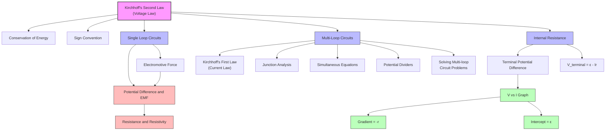

# Kirchhoff's Second Law (Voltage Law) / 基尔霍夫第二定律（电压定律）

---

# 1. Overview / 概述

**English:**
Kirchhoff's Second Law, also known as the **Voltage Law** or **Loop Rule**, is a fundamental principle in circuit analysis that deals with the conservation of energy in electrical circuits. This law states that the **sum of all potential differences around any closed loop in a circuit is zero**. In simpler terms, the total voltage supplied by sources (like batteries) in a loop must equal the total voltage dropped across components (like resistors) in that same loop.

This sub-topic is crucial because it allows us to analyze **complex circuits** that cannot be simplified using [[Resistance and Resistivity]] series/parallel combinations alone. It forms the foundation for solving [[Solving Multi-loop Circuit Problems]] and understanding [[Potential Dividers]]. Together with [[Kirchhoff's First Law (Current Law)]], it provides a complete framework for analyzing any electrical network.

**中文:**
基尔霍夫第二定律，也称为**电压定律**或**回路规则**，是电路分析中关于电路中能量守恒的基本原理。该定律指出：**在电路中，沿任意闭合回路所有电势差的代数和为零**。简单来说，回路中电源（如电池）提供的总电压必须等于该回路中元件（如电阻）上消耗的总电压。

这个子知识点至关重要，因为它使我们能够分析无法通过[[电阻与电阻率]]的串并联组合简化的**复杂电路**。它是解决[[多回路电路问题]]和理解[[分压器]]的基础。与[[基尔霍夫第一定律（电流定律）]]一起，它为分析任何电路网络提供了完整的框架。

---

# 2. Syllabus Learning Objectives / 考纲学习目标

| CAIE 9702 | Edexcel IAL |
|-----------|-------------|
| 9.4(a) State Kirchhoff's second law | 3.17 State Kirchhoff's second law |
| 9.4(b) Apply Kirchhoff's second law to simple closed circuits | 3.18 Apply Kirchhoff's second law to circuits with one or more loops |
| 9.4(c) Derive and use equations for circuits with multiple loops | 3.19 Solve problems involving circuits with two or more loops |
| 9.4(d) Solve circuit problems involving internal resistance | 3.20 Use Kirchhoff's laws to solve problems with internal resistance |

**Examiner Expectations / 考官期望:**
- **English:** Students must be able to state the law precisely, apply it correctly with proper sign conventions, and combine it with [[Kirchhoff's First Law (Current Law)]] to solve multi-loop circuits. Understanding the relationship between EMF, terminal potential difference, and [[Potential Difference and EMF]] is essential.
- **中文:** 学生必须能够准确陈述定律，正确应用符号约定，并与[[基尔霍夫第一定律（电流定律）]]结合解决多回路电路问题。理解电动势、端电压和[[电势差与电动势]]之间的关系至关重要。

---

# 3. Core Definitions / 核心定义

| Term (EN/CN) | Definition (EN) | Definition (CN) | Common Mistakes / 常见错误 |
|--------------|-----------------|-----------------|---------------------------|
| **Kirchhoff's Second Law** / 基尔霍夫第二定律 | The sum of the electromotive forces (EMFs) around any closed loop in a circuit equals the sum of the potential differences across the components in that loop. | 在电路中，沿任意闭合回路的电动势之和等于该回路中各元件上的电势差之和。 | Confusing with KCL; forgetting sign convention |
| **Closed Loop** / 闭合回路 | A continuous path in a circuit that starts and ends at the same point without passing through any point more than once. | 电路中从某点出发，不重复经过任何点，最终回到起点的连续路径。 | Not recognizing multiple loops in complex circuits |
| **EMF (Electromotive Force)** / 电动势 | The energy supplied per unit charge by a source of electrical energy, measured in volts (V). | 电源提供给每单位电荷的能量，单位为伏特(V)。 | Thinking it's a force; confusing with terminal PD |
| **Potential Difference (PD)** / 电势差 | The energy transferred per unit charge as charge moves between two points in a circuit, measured in volts (V). | 电荷在电路中两点间移动时每单位电荷转移的能量，单位为伏特(V)。 | Forgetting sign convention for PD across resistors |
| **Sign Convention** / 符号约定 | A systematic rule for assigning positive or negative signs to potential differences when traversing a loop. | 在遍历回路时为电势差分配正负号的系统规则。 | Inconsistent application; mixing up directions |
| **Terminal Potential Difference** / 端电压 | The voltage measured across the terminals of a source when current is flowing; equals EMF minus the voltage drop across internal resistance. | 有电流通过时电源两端的电压；等于电动势减去内阻上的电压降。 | Confusing with EMF; forgetting internal resistance |

---

# 4. Key Concepts Explained / 关键概念详解

## 4.1 The Loop Rule and Energy Conservation / 回路规则与能量守恒

### Explanation / 解释
**English:**
Kirchhoff's Second Law is a direct consequence of the **conservation of energy**. When a charge completes one full loop around a circuit, it must return to its starting point with the same electrical potential energy. This means the net change in potential energy around the loop must be zero.

Mathematically, for any closed loop:
$$ \sum \mathcal{E} = \sum IR $$

Where $\mathcal{E}$ represents EMFs (sources) and $IR$ represents voltage drops across resistors. This can also be written as:
$$ \sum V = 0 $$

Where $V$ includes ALL potential differences (both rises and drops) with appropriate signs.

**中文:**
基尔霍夫第二定律是**能量守恒**的直接结果。当电荷在电路中完成一个完整的回路时，它必须回到起点并具有相同的电势能。这意味着回路中电势能的净变化必须为零。

数学上，对于任意闭合回路：
$$ \sum \mathcal{E} = \sum IR $$

其中 $\mathcal{E}$ 表示电动势（电源），$IR$ 表示电阻上的电压降。这也可以写成：
$$ \sum V = 0 $$

其中 $V$ 包括所有电势差（上升和下降），并带有适当的符号。

### Physical Meaning / 物理意义
**English:**
Physically, this law tells us that energy is conserved in electrical circuits. The energy provided by batteries (or other sources) is completely transferred to other forms (heat in resistors, light in bulbs, etc.) as charges move around the circuit. No energy is created or destroyed — it is simply converted from one form to another.

**中文:**
从物理意义上讲，这个定律告诉我们电路中的能量是守恒的。当电荷在电路中移动时，电池（或其他电源）提供的能量完全转化为其他形式（电阻中的热能、灯泡中的光能等）。能量既不会创生也不会消失——只是从一种形式转化为另一种形式。

### Common Misconceptions / 常见误区
- **EN:** Students often think the sum of EMFs equals the sum of PDs *without considering signs*. In reality, when using $\sum V = 0$, EMFs and PDs have opposite signs depending on traversal direction.
- **CN:** 学生常认为电动势之和等于电势差之和*而不考虑符号*。实际上，当使用$\sum V = 0$时，电动势和电势差根据遍历方向具有相反的符号。
- **EN:** Another misconception is that Kirchhoff's Second Law only applies to simple series circuits. It applies to **any closed loop** in any circuit.
- **CN:** 另一个误区是认为基尔霍夫第二定律只适用于简单的串联电路。它适用于任何电路中的**任何闭合回路**。

### Exam Tips / 考试提示
- **EN:** Always draw the loop direction (clockwise or anticlockwise) before applying the law. Be consistent with your sign convention.
- **CN:** 在应用定律之前，始终画出回路方向（顺时针或逆时针）。保持符号约定的一致性。
- **EN:** For EMF sources: if you traverse from negative to positive terminal, it's a **rise** (+$\mathcal{E}$); from positive to negative, it's a **drop** (-$\mathcal{E}$).
- **CN:** 对于电动势源：如果从负极到正极遍历，是**上升**（+$\mathcal{E}$）；从正极到负极，是**下降**（-$\mathcal{E}$）。
- **EN:** For resistors: if you traverse in the direction of current, it's a **drop** (-$IR$); against current, it's a **rise** (+$IR$).
- **CN:** 对于电阻：如果沿电流方向遍历，是**下降**（-$IR$）；逆电流方向，是**上升**（+$IR$）。

> 📷 **IMAGE PROMPT — KVL-01: Sign Convention for Kirchhoff's Voltage Law**
> A clear diagram showing a simple loop circuit with a battery and two resistors. Arrows indicate the traversal direction (clockwise). Labels show: "+ε" when crossing battery from - to +, "-ε" when crossing from + to -, "-IR" when crossing resistor in current direction, "+IR" when crossing resistor against current direction. Use different colors for rises (red) and drops (blue).

---

## 4.2 Internal Resistance and Terminal PD / 内阻与端电压

### Explanation / 解释
**English:**
Real batteries have **internal resistance** ($r$), which means the voltage measured across their terminals ($V_{terminal}$) is less than the EMF ($\mathcal{E}$) when current flows. This is because some energy is "lost" inside the battery itself.

The relationship is:
$$ V_{terminal} = \mathcal{E} - Ir $$

When applying Kirchhoff's Second Law, the internal resistance is treated as a **resistor in series** with the EMF source. So in a loop containing a battery with internal resistance, the equation includes both the EMF and the $Ir$ drop.

**中文:**
实际电池具有**内阻**（$r$），这意味着当有电流通过时，电池两端测得的电压（$V_{端}$）小于电动势（$\mathcal{E}$）。这是因为部分能量在电池内部"损失"了。

关系为：
$$ V_{端} = \mathcal{E} - Ir $$

在应用基尔霍夫第二定律时，内阻被视为与电动势源**串联的电阻**。因此，在包含带内阻电池的回路中，方程同时包括电动势和$Ir$电压降。

### Physical Meaning / 物理意义
**English:**
Internal resistance represents the opposition to current flow within the battery itself due to the materials and chemical reactions inside. As current increases, more voltage is dropped across the internal resistance, reducing the terminal voltage available to the external circuit.

**中文:**
内阻表示电池内部由于材料和化学反应而对电流流动的阻碍。随着电流增加，内阻上的电压降增大，从而减少了外部电路可用的端电压。

### Common Misconceptions / 常见误区
- **EN:** Students often forget to include internal resistance when applying Kirchhoff's Second Law to circuits with real batteries.
- **CN:** 学生在对包含实际电池的电路应用基尔霍夫第二定律时，常忘记考虑内阻。
- **EN:** Some think terminal PD equals EMF always — this is only true when no current flows (open circuit).
- **CN:** 有人认为端电压总是等于电动势——这仅在无电流时（开路）成立。

### Exam Tips / 考试提示
- **EN:** When a battery has internal resistance $r$, treat it as an ideal EMF $\mathcal{E}$ in series with a resistor $r$.
- **CN:** 当电池有内阻$r$时，将其视为理想电动势$\mathcal{E}$与电阻$r$串联。
- **EN:** The terminal PD is what you would measure with a voltmeter across the battery terminals.
- **CN:** 端电压是用电压表在电池两端测量得到的电压。

> 📷 **IMAGE PROMPT — KVL-02: Internal Resistance Model**
> A diagram showing a real battery represented as an ideal EMF source (ε) in series with a small resistor (r). The terminals are labeled A and B. A voltmeter is shown connected across A and B measuring V_terminal. An external resistor R is connected to form a complete circuit. Arrows show current I flowing. Labels: "V_terminal = ε - Ir".

---

# 5. Essential Equations / 核心公式

## 5.1 Kirchhoff's Second Law (General Form) / 基尔霍夫第二定律（一般形式）

$$ \sum_{loop} V = 0 $$

or equivalently:

$$ \sum \mathcal{E} = \sum IR $$

| Symbol (符号) | Meaning (EN) | Meaning (CN) | Unit (单位) |
|--------------|-------------|-------------|------------|
| $\sum V$ | Sum of all potential differences around a closed loop | 闭合回路中所有电势差之和 | V (伏特) |
| $\sum \mathcal{E}$ | Sum of all electromotive forces in the loop | 回路中所有电动势之和 | V (伏特) |
| $\sum IR$ | Sum of all voltage drops across resistors in the loop | 回路中所有电阻上的电压降之和 | V (伏特) |

**Derivation / 推导:**
Based on conservation of energy. A charge $q$ moving around a closed loop gains energy $q\mathcal{E}$ from sources and loses energy $qIR$ across resistors. For the charge to return to its starting point with the same energy: $q\sum\mathcal{E} = q\sum IR$, hence $\sum\mathcal{E} = \sum IR$.

**Conditions / 适用条件:**
- **EN:** Applies to any closed loop in any electrical circuit. Valid for both DC and AC circuits (instantaneous values).
- **CN:** 适用于任何电路中的任意闭合回路。对直流和交流电路（瞬时值）均有效。

**Limitations / 局限性:**
- **EN:** Does not account for electromagnetic induction effects (Faraday's Law) unless modified. For A-Level, only applied to DC circuits.
- **CN:** 不考虑电磁感应效应（法拉第定律），除非修改。在A-Level中，仅应用于直流电路。

---

## 5.2 Terminal Potential Difference / 端电压公式

$$ V_{terminal} = \mathcal{E} - Ir $$

| Symbol (符号) | Meaning (EN) | Meaning (CN) | Unit (单位) |
|--------------|-------------|-------------|------------|
| $V_{terminal}$ | Terminal potential difference | 端电压 | V (伏特) |
| $\mathcal{E}$ | Electromotive force of the source | 电源的电动势 | V (伏特) |
| $I$ | Current flowing through the source | 通过电源的电流 | A (安培) |
| $r$ | Internal resistance of the source | 电源的内阻 | $\Omega$ (欧姆) |

**Derivation / 推导:**
Applying KVL to a loop containing a battery with internal resistance $r$ and external resistance $R$:
$$\mathcal{E} - Ir - IR = 0$$
$$\mathcal{E} = I(r + R)$$
$$V_{terminal} = IR = \mathcal{E} - Ir$$

**Conditions / 适用条件:**
- **EN:** Only valid when current is flowing. When $I = 0$ (open circuit), $V_{terminal} = \mathcal{E}$.
- **CN:** 仅在有电流通过时有效。当$I = 0$（开路）时，$V_{端} = \mathcal{E}$。

**Limitations / 局限性:**
- **EN:** Assumes internal resistance is constant, which may not be true for all batteries (e.g., as they discharge).
- **CN:** 假设内阻恒定，这对所有电池（如放电时）可能不成立。

---

# 6. Graphs and Relationships / 图表与关系

## 6.1 Terminal PD vs. Current Graph / 端电压-电流关系图

### Axes / 坐标轴
- **X-axis:** Current $I$ (A) / 电流 $I$ (A)
- **Y-axis:** Terminal PD $V_{terminal}$ (V) / 端电压 $V_{terminal}$ (V)

### Shape / 形状
**English:** A straight line with **negative slope**. The line is linear because $V_{terminal} = \mathcal{E} - Ir$ is a linear equation in $I$.

**中文:** 一条具有**负斜率**的直线。因为$V_{端} = \mathcal{E} - Ir$是关于$I$的线性方程，所以直线是线性的。

### Gradient Meaning / 斜率含义
**English:** The gradient of the line equals **-r** (negative of internal resistance). A steeper negative slope means higher internal resistance.

**中文:** 直线的斜率等于**-r**（内阻的负值）。负斜率越陡，内阻越大。

### Intercept Meaning / 截距含义
**English:** The y-intercept (when $I = 0$) equals the **EMF** $\mathcal{E}$ of the source. The x-intercept (when $V = 0$) gives the **short-circuit current** $I_{short} = \mathcal{E}/r$.

**中文:** y轴截距（当$I = 0$时）等于电源的**电动势**$\mathcal{E}$。x轴截距（当$V = 0$时）给出**短路电流**$I_{短} = \mathcal{E}/r$。

### Exam Interpretation / 考试解读
- **EN:** This graph is commonly used in practical experiments to determine the EMF and internal resistance of a cell. The y-intercept gives $\mathcal{E}$, and the gradient gives $-r$.
- **CN:** 该图常用于实验测定电池的电动势和内阻。y轴截距给出$\mathcal{E}$，斜率给出$-r$。

> 📷 **IMAGE PROMPT — KVL-03: Terminal PD vs Current Graph**
> A graph with I on x-axis (0 to I_short) and V_terminal on y-axis (0 to ε). A straight line with negative slope is drawn. The y-intercept is labeled "ε (EMF)", the x-intercept is labeled "I_short = ε/r". The gradient is labeled "-r". Include a small circuit diagram in the corner showing a battery with internal resistance connected to a variable resistor.

---

# 7. Required Diagrams / 必备图表

## 7.1 Single Loop Circuit with Sign Convention / 单回路电路与符号约定

### Description / 描述
**English:** A simple circuit containing one battery (with EMF $\mathcal{E}$ and internal resistance $r$) and one external resistor $R$. The diagram shows the direction of current $I$ and the traversal direction for applying KVL.

**中文:** 一个包含一个电池（电动势$\mathcal{E}$，内阻$r$）和一个外部电阻$R$的简单电路。图中显示电流$I$的方向和应用KVL的遍历方向。

### Image Prompt / 图片生成提示
> 📷 **IMAGE PROMPT — KVL-04: Single Loop KVL Application**
> A circuit diagram with a battery (labeled ε, with small resistor r inside) connected to a resistor R. Current I flows clockwise. A clockwise traversal arrow is shown. Labels at each component: crossing battery from - to + gives "+ε", crossing internal resistor in current direction gives "-Ir", crossing external resistor in current direction gives "-IR". The KVL equation is written below: "+ε - Ir - IR = 0".

### Labels Required / 需要标注
- **EN:** Battery terminals (+ and -), EMF $\mathcal{E}$, internal resistance $r$, external resistance $R$, current direction $I$, traversal direction, voltage rises (+$\mathcal{E}$) and drops (-$Ir$, -$IR$).
- **CN:** 电池端子（+和-），电动势$\mathcal{E}$，内阻$r$，外部电阻$R$，电流方向$I$，遍历方向，电压上升（+$\mathcal{E}$）和下降（-$Ir$，-$IR$）。

### Exam Importance / 考试重要性
- **EN:** This is the most basic application of KVL. Understanding this diagram is essential before moving to multi-loop circuits.
- **CN:** 这是KVL最基本的应用。理解此图是学习多回路电路的基础。

---

## 7.2 Two-Loop Circuit / 双回路电路

### Description / 描述
**English:** A circuit with two loops sharing a common branch. This is the standard configuration for applying both Kirchhoff's laws simultaneously. The diagram shows two batteries, three resistors, and the assumed current directions in each branch.

**中文:** 一个具有两个共享公共支路的回路电路。这是同时应用两个基尔霍夫定律的标准配置。图中显示两个电池、三个电阻以及每个支路中假定的电流方向。

### Image Prompt / 图片生成提示
> 📷 **IMAGE PROMPT — KVL-05: Two-Loop Circuit for KVL and KCL**
> A circuit with two loops. Left loop: Battery ε1 (with internal resistance r1) in series with resistor R1. Right loop: Battery ε2 (with internal resistance r2) in series with resistor R2. The common branch has resistor R3. Currents labeled: I1 in left loop (clockwise), I2 in right loop (clockwise), I3 in common branch (downward). Junction points labeled A and B. KVL traversal arrows shown for both loops. KCL equation at junction A: I1 = I2 + I3.

### Labels Required / 需要标注
- **EN:** All components labeled with values, current directions ($I_1$, $I_2$, $I_3$), junction points (A, B), loop traversal arrows, KVL equations for each loop.
- **CN:** 所有元件标有数值，电流方向（$I_1$，$I_2$，$I_3$），节点（A，B），回路遍历箭头，每个回路的KVL方程。

### Exam Importance / 考试重要性
- **EN:** This is the most common exam configuration for testing Kirchhoff's laws. Students must be able to write KVL equations for both loops and combine with KCL at junctions.
- **CN:** 这是考试中测试基尔霍夫定律最常见的配置。学生必须能够为两个回路写出KVL方程，并与节点处的KCL结合。

---

# 8. Worked Examples / 典型例题

## Example 1: Single Loop with Internal Resistance / 例1：含内阻的单回路

### Question / 题目
**English:**
A battery of EMF 12.0 V and internal resistance 0.50 Ω is connected to a resistor of 5.50 Ω. Calculate:
(a) The current in the circuit.
(b) The terminal potential difference of the battery.
(c) The power dissipated in the external resistor.

**中文:**
一个电动势为12.0 V、内阻为0.50 Ω的电池连接到一个5.50 Ω的电阻上。计算：
(a) 电路中的电流。
(b) 电池的端电压。
(c) 外部电阻上消耗的功率。

### Solution / 解答

**Step 1: Apply Kirchhoff's Second Law / 应用基尔霍夫第二定律**

Traverse the loop clockwise starting from the negative terminal of the battery:

$$+\mathcal{E} - Ir - IR = 0$$

$$12.0 - I(0.50) - I(5.50) = 0$$

**Step 2: Solve for current / 求解电流**

$$12.0 = I(0.50 + 5.50)$$
$$12.0 = I(6.00)$$
$$I = \frac{12.0}{6.00} = 2.0 \text{ A}$$

**Step 3: Calculate terminal PD / 计算端电压**

$$V_{terminal} = \mathcal{E} - Ir$$
$$V_{terminal} = 12.0 - (2.0)(0.50)$$
$$V_{terminal} = 12.0 - 1.0 = 11.0 \text{ V}$$

**Step 4: Calculate power in external resistor / 计算外部电阻功率**

$$P = I^2R$$
$$P = (2.0)^2(5.50)$$
$$P = 4.0 \times 5.50 = 22.0 \text{ W}$$

### Final Answer / 最终答案
**Answer:** (a) $I = 2.0 \text{ A}$ | (b) $V_{terminal} = 11.0 \text{ V}$ | (c) $P = 22.0 \text{ W}$
**答案：** (a) $I = 2.0 \text{ A}$ | (b) $V_{端} = 11.0 \text{ V}$ | (c) $P = 22.0 \text{ W}$

### Quick Tip / 提示
- **EN:** Always include internal resistance as a separate term in the KVL equation. The terminal PD is always less than the EMF when current flows.
- **CN:** 在KVL方程中始终将内阻作为单独项处理。有电流时，端电压总是小于电动势。

---

## Example 2: Two-Loop Circuit / 例2：双回路电路

### Question / 题目
**English:**
In the circuit shown, $\mathcal{E}_1 = 6.0 \text{ V}$, $\mathcal{E}_2 = 4.0 \text{ V}$, $R_1 = 2.0 \,\Omega$, $R_2 = 3.0 \,\Omega$, $R_3 = 1.0 \,\Omega$. The batteries have negligible internal resistance. Find the currents $I_1$, $I_2$, and $I_3$ in each branch.

**中文:**
在所示电路中，$\mathcal{E}_1 = 6.0 \text{ V}$，$\mathcal{E}_2 = 4.0 \text{ V}$，$R_1 = 2.0 \,\Omega$，$R_2 = 3.0 \,\Omega$，$R_3 = 1.0 \,\Omega$。电池内阻可忽略。求各支路中的电流$I_1$、$I_2$和$I_3$。

### Solution / 解答

**Step 1: Assign currents and apply KCL / 分配电流并应用KCL**

Assume $I_1$ flows clockwise in left loop, $I_2$ flows clockwise in right loop, $I_3$ flows downward through $R_3$.

At junction A: $I_1 = I_2 + I_3$ (Equation 1)

**Step 2: Apply KVL to left loop / 对左回路应用KVL**

Traverse left loop clockwise:
$$+\mathcal{E}_1 - I_1R_1 - I_3R_3 = 0$$
$$6.0 - 2.0I_1 - 1.0I_3 = 0$$
$$2.0I_1 + I_3 = 6.0$$ (Equation 2)

**Step 3: Apply KVL to right loop / 对右回路应用KVL**

Traverse right loop clockwise:
$$+\mathcal{E}_2 - I_2R_2 - I_3R_3 = 0$$
$$4.0 - 3.0I_2 - 1.0I_3 = 0$$
$$3.0I_2 + I_3 = 4.0$$ (Equation 3)

**Step 4: Solve the system / 解方程组**

From Equation 1: $I_1 = I_2 + I_3$

Substitute into Equation 2:
$$2.0(I_2 + I_3) + I_3 = 6.0$$
$$2.0I_2 + 2.0I_3 + I_3 = 6.0$$
$$2.0I_2 + 3.0I_3 = 6.0$$ (Equation 4)

From Equation 3: $3.0I_2 + I_3 = 4.0$ → $I_3 = 4.0 - 3.0I_2$

Substitute into Equation 4:
$$2.0I_2 + 3.0(4.0 - 3.0I_2) = 6.0$$
$$2.0I_2 + 12.0 - 9.0I_2 = 6.0$$
$$-7.0I_2 = -6.0$$
$$I_2 = \frac{6.0}{7.0} = 0.857 \text{ A}$$

Then:
$$I_3 = 4.0 - 3.0(0.857) = 4.0 - 2.571 = 1.429 \text{ A}$$
$$I_1 = I_2 + I_3 = 0.857 + 1.429 = 2.286 \text{ A}$$

### Final Answer / 最终答案
**Answer:** $I_1 = 2.29 \text{ A}$, $I_2 = 0.857 \text{ A}$, $I_3 = 1.43 \text{ A}$
**答案：** $I_1 = 2.29 \text{ A}$，$I_2 = 0.857 \text{ A}$，$I_3 = 1.43 \text{ A}$

### Quick Tip / 提示
- **EN:** Always check that your answers satisfy KCL at all junctions. If a current comes out negative, it means your assumed direction was wrong — just reverse it.
- **CN:** 始终检查答案是否满足所有节点的KCL。如果电流为负，说明假定的方向错了——只需反转方向即可。

---

# 9. Past Paper Question Types / 历年真题题型

| Question Type / 题型 | Frequency / 频率 | Difficulty / 难度 | Past Paper References / 真题索引 |
|----------------------|------------------|------------------|-------------------------------|
| Single loop with internal resistance | Very High / 非常高 | Medium / 中等 | 📝 *待填入* |
| Two-loop circuit with two batteries | High / 高 | Hard / 困难 | 📝 *待填入* |
| Finding EMF and internal resistance from graph | High / 高 | Medium / 中等 | 📝 *待填入* |
| Circuit with three or more loops | Low / 低 | Very Hard / 非常困难 | 📝 *待填入* |
| Combined KVL and KCL with junction analysis | Very High / 非常高 | Hard / 困难 | 📝 *待填入* |

**Common Command Words / 常见指令词:**
- **EN:** "State", "Apply", "Derive", "Calculate", "Determine", "Show that", "Find"
- **CN:** "陈述"，"应用"，"推导"，"计算"，"确定"，"证明"，"求"

---

# 10. Practical Skills Connections / 实验技能链接

**English:**
Kirchhoff's Second Law is directly tested in practical experiments, particularly:

1. **Determining EMF and Internal Resistance:** Students set up a circuit with a cell, variable resistor, ammeter, and voltmeter. By varying the external resistance and measuring terminal PD and current, they plot $V$ vs $I$ to find $\mathcal{E}$ (y-intercept) and $r$ (negative gradient).

2. **Measurements and Uncertainties:**
   - Voltmeter must be connected **across the battery terminals** to measure terminal PD.
   - Ammeter is connected **in series** to measure current.
   - Uncertainties in readings affect the accuracy of $\mathcal{E}$ and $r$ determination.

3. **Graph Plotting:** Students must plot $V_{terminal}$ on y-axis and $I$ on x-axis, draw a line of best fit, and calculate gradient and intercept.

4. **Experimental Design:** To minimize errors, use a high-resistance voltmeter (to avoid drawing current) and a low-resistance ammeter.

**中文:**
基尔霍夫第二定律在实验考试中直接测试，特别是：

1. **测定电动势和内阻：** 学生搭建包含电池、可变电阻、电流表和电压表的电路。通过改变外部电阻并测量端电压和电流，绘制$V$ vs $I$图以求出$\mathcal{E}$（y轴截距）和$r$（负斜率）。

2. **测量与不确定度：**
   - 电压表必须**并联在电池两端**以测量端电压。
   - 电流表**串联**在电路中测量电流。
   - 读数的不确定度影响$\mathcal{E}$和$r$的准确性。

3. **绘图：** 学生必须在y轴上绘制$V_{端}$，在x轴上绘制$I$，画出最佳拟合直线，并计算斜率和截距。

4. **实验设计：** 为减少误差，使用高内阻电压表（避免分流）和低内阻电流表。

> 📋 **CIE Only:** In CAIE Paper 3 (Practical), students may be asked to determine internal resistance using a graphical method. The circuit typically includes a cell, variable resistor, and voltmeter only (using the "voltmeter method").
>
> 📋 **Edexcel Only:** In Edexcel IAL Unit 2 (Practical), students may use a data logger to record voltage and current values, then use spreadsheet software to plot the graph and calculate gradient.

---

# 11. Concept Map / 概念图谱

---

# 12. Quick Revision Sheet / 速查表

| Category / 类别 | Key Points / 要点 |
|----------------|------------------|
| **Definition / 定义** | Sum of all potential differences around any closed loop = 0 ($\sum V = 0$) / 任意闭合回路中所有电势差之和为零 |
| **Key Formula / 核心公式** | $\sum \mathcal{E} = \sum IR$ or $V_{terminal} = \mathcal{E} - Ir$ |
| **Sign Convention / 符号约定** | EMF: + when traversing - to +; Resistor: - when traversing in current direction / 电动势：从-到+为正；电阻：沿电流方向为负 |
| **Key Graph / 核心图表** | $V_{terminal}$ vs $I$: Straight line with negative slope (-r), y-intercept = $\mathcal{E}$ / $V_{端}$ vs $I$：负斜率直线(-r)，y轴截距 = $\mathcal{E}$ |
| **Common Mistake / 常见错误** | Forgetting sign convention; ignoring internal resistance; not combining KVL with KCL / 忘记符号约定；忽略内阻；未将KVL与KCL结合 |
| **Exam Tip / 考试提示** | Always draw loop direction first; label currents clearly; check KCL at junctions / 先画回路方向；清晰标注电流；检查节点处的KCL |
| **Practical Skill / 实验技能** | Plot $V$ vs $I$ to find $\mathcal{E}$ and $r$; use high-resistance voltmeter / 绘制$V$ vs $I$图求$\mathcal{E}$和$r$；使用高内阻电压表 |
| **Prerequisites / 前置知识** | [[Potential Difference and EMF]], [[Resistance and Resistivity]] |
| **Related Topics / 相关主题** | [[Kirchhoff's First Law (Current Law)]], [[Solving Multi-loop Circuit Problems]], [[Potential Dividers]] |

---

> 📋 **CIE 9702 Specific:** For CAIE, Kirchhoff's Second Law is in Chapter 9.4 (a-d). Students must be able to apply it to circuits with up to two loops. Internal resistance problems are common in Paper 4 (A2).
>
> 📋 **Edexcel IAL Specific:** For Edexcel, this is in Unit 2 (WPH11) sections 3.17-3.20. Students must be able to solve problems with two or more loops and understand the practical determination of EMF and internal resistance.