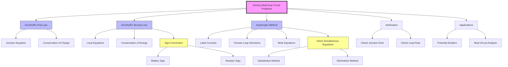

# 1. Overview / 概述

**English:**
Solving multi-loop circuit problems is the most advanced application of [[Kirchhoff's Laws]] in the A-Level syllabus. While single-loop circuits can be solved using simple [[Potential Difference and EMF]] and [[Resistance and Resistivity]] principles, circuits with two or more loops require a systematic approach using both of Kirchhoff's laws simultaneously. This sub-topic teaches students how to set up and solve simultaneous equations for currents in complex circuits containing multiple batteries and resistors. Mastering this skill is essential for understanding real-world electrical networks and forms the foundation for more advanced topics like [[Potential Dividers]] and AC circuit analysis.

**中文:**
多回路电路问题求解是A-Level考纲中[[Kirchhoff's Laws]]的最高级应用。单回路电路可以使用简单的[[Potential Difference and EMF]]和[[Resistance and Resistivity]]原理求解，但包含两个或更多回路的电路需要系统性地同时使用基尔霍夫两条定律。本子知识点教授学生如何为包含多个电池和电阻的复杂电路建立并求解电流联立方程。掌握这项技能对于理解真实电路网络至关重要，并为[[Potential Dividers]]和交流电路分析等更高级主题奠定基础。

---

# 2. Syllabus Learning Objectives / 考纲学习目标

| CAIE 9702 | Edexcel IAL |
|-----------|-------------|
| 9.4(a) Apply Kirchhoff's first and second laws to circuits | 3.17 Use Kirchhoff's laws to solve circuit problems |
| 9.4(b) Solve problems involving circuits with more than one loop | 3.18 Solve problems involving circuits with two or more loops |
| 9.4(c) Derive and solve simultaneous equations for currents | 3.19 Apply the conservation of energy and charge to multi-loop circuits |
| 9.4(d) Calculate potential differences across components in multi-loop circuits | 3.20 Determine the current in any branch of a multi-loop circuit |

**Examiner Expectations / 考官期望:**
- **English:** Students must be able to correctly assign current directions, apply sign conventions consistently, and solve simultaneous equations accurately. Marks are often lost due to sign errors rather than mathematical mistakes.
- **中文:** 学生必须能够正确指定电流方向，一致地应用符号约定，并准确求解联立方程。失分通常是由于符号错误而非数学错误。

---

# 3. Core Definitions / 核心定义

| Term (EN/CN) | Definition (EN) | Definition (CN) | Common Mistakes / 常见错误 |
|--------------|-----------------|-----------------|---------------------------|
| **Multi-loop circuit** / 多回路电路 | A circuit containing two or more closed loops, requiring simultaneous equations to solve for unknown currents | 包含两个或更多闭合回路的电路，需要联立方程求解未知电流 | Confusing multi-loop with series/parallel circuits |
| **Junction (Node)** / 节点 | A point where three or more conductors meet; current divides or combines | 三个或更多导体连接的点；电流在此分流或汇合 | Treating a simple wire junction (2 wires) as a node |
| **Loop** / 回路 | Any closed conducting path in a circuit | 电路中任何闭合的导电路径 | Missing a loop or double-counting loops |
| **Branch** / 支路 | A section of a circuit between two junctions containing one or more components | 两个节点之间的电路段，包含一个或多个元件 | Treating each component as a separate branch |
| **Simultaneous equations** / 联立方程 | A set of equations solved together to find multiple unknown currents | 一起求解以找到多个未知电流的一组方程 | Solving equations incorrectly or making sign errors |
| **Sign convention** / 符号约定 | A consistent rule for assigning positive/negative signs to potential differences when traversing a loop | 在遍历回路时为电势差分配正/负号的一致规则 | Inconsistent sign application across different loops |

---

# 4. Key Concepts Explained / 关键概念详解

## 4.1 The Systematic Approach to Multi-loop Circuits / 多回路电路系统求解法

### Explanation / 解释
**English:** Solving multi-loop circuits requires a step-by-step method:
1. **Label all currents** — Assign a direction and label (I₁, I₂, I₃, etc.) to each branch current. The direction is arbitrary; if the calculated value is negative, the actual direction is opposite.
2. **Apply [[Kirchhoff's First Law (Current Law)]]** at junctions — The sum of currents entering a junction equals the sum leaving.
3. **Apply [[Kirchhoff's Second Law (Voltage Law)]]** around loops — The sum of EMFs equals the sum of potential differences (IR drops) around any closed loop.
4. **Choose loop directions** — Usually clockwise, but consistency within each loop is what matters.
5. **Solve the simultaneous equations** — Use substitution or elimination methods.

**中文:** 求解多回路电路需要分步进行：
1. **标记所有电流** — 为每个支路电流指定方向和标签（I₁、I₂、I₃等）。方向是任意的；如果计算值为负，则实际方向相反。
2. **在节点处应用[[Kirchhoff's First Law (Current Law)]]** — 流入节点的电流之和等于流出节点的电流之和。
3. **在回路中应用[[Kirchhoff's Second Law (Voltage Law)]]** — 任何闭合回路中EMF之和等于电势差（IR压降）之和。
4. **选择回路方向** — 通常为顺时针，但每个回路内的一致性才是关键。
5. **求解联立方程** — 使用代入法或消元法。

### Physical Meaning / 物理意义
**English:** This approach embodies two fundamental conservation principles: [[Kirchhoff's First Law (Current Law)]] represents conservation of electric charge (charge cannot accumulate at a junction), while [[Kirchhoff's Second Law (Voltage Law)]] represents conservation of energy (the net energy gained from EMFs equals the energy dissipated in resistors around any closed path).

**中文:** 这种方法体现了两个基本守恒原理：[[Kirchhoff's First Law (Current Law)]]代表电荷守恒（电荷不能在节点处积累），而[[Kirchhoff's Second Law (Voltage Law)]]代表能量守恒（从EMF获得的净能量等于在任何闭合路径中电阻消耗的能量）。

### Common Misconceptions / 常见误区
- **English:**
  - Thinking current always flows from positive to negative terminal of a battery (it does, but the direction you assign is arbitrary)
  - Forgetting that voltage drops across resistors are IR, not just R
  - Using the same current variable for different branches
  - Not checking if the number of equations equals the number of unknowns
- **中文:**
  - 认为电流总是从电池正极流向负极（确实如此，但你指定的方向是任意的）
  - 忘记电阻两端的电压降是IR，而不仅仅是R
  - 对不同支路使用相同的电流变量
  - 没有检查方程数量是否等于未知数数量

### Exam Tips / 考试提示
- **English:** Always write down the junction equation and loop equations clearly before solving. Show your sign convention explicitly. If you get a negative current, state that the actual direction is opposite to your assumed direction.
- **中文:** 在求解前务必清楚地写出节点方程和回路方程。明确展示你的符号约定。如果得到负电流，说明实际方向与你假设的方向相反。

> 📷 **IMAGE PROMPT — MLC01: Multi-loop Circuit Diagram**
> A clear circuit diagram showing two loops with two batteries (E₁ = 6V, E₂ = 3V) and three resistors (R₁ = 4Ω, R₂ = 2Ω, R₃ = 6Ω). Label all currents I₁, I₂, I₃ with arrows showing assumed directions. Mark junctions A and B. Show loop directions with dashed arrows labeled Loop 1 and Loop 2. Clean, educational style with color-coded components.

## 4.2 Sign Convention for Kirchhoff's Second Law / 基尔霍夫第二定律的符号约定

### Explanation / 解释
**English:** When traversing a loop, follow these rules:
- **For a battery:** If you go from negative to positive terminal (through the battery), the EMF is positive (+E). If you go from positive to negative, the EMF is negative (-E).
- **For a resistor:** If you go in the direction of the assumed current, the voltage drop is negative (-IR). If you go against the assumed current, the voltage drop is positive (+IR).

**中文:** 遍历回路时，遵循以下规则：
- **对于电池：** 如果从负极到正极（经过电池内部），EMF为正（+E）。如果从正极到负极，EMF为负（-E）。
- **对于电阻：** 如果沿假设电流方向经过电阻，电压降为负（-IR）。如果逆假设电流方向经过电阻，电压降为正（+IR）。

### Physical Meaning / 物理意义
**English:** The sign convention ensures that the algebraic sum of potential changes around any closed loop equals zero. This is a direct consequence of the conservative nature of the electric field — returning to the same point after traversing a loop means the net potential change must be zero.

**中文:** 符号约定确保任何闭合回路周围电势变化的代数和为零。这是电场保守性质的直接结果——遍历回路后回到同一点意味着净电势变化必须为零。

### Common Misconceptions / 常见误区
- **English:**
  - Confusing the sign for batteries and resistors
  - Applying different sign conventions in different loops
  - Forgetting that the sign depends on the direction you traverse the loop, not the direction of current
- **中文:**
  - 混淆电池和电阻的符号
  - 在不同回路中应用不同的符号约定
  - 忘记符号取决于遍历回路的方向，而非电流方向

### Exam Tips / 考试提示
- **English:** Draw arrows on the circuit diagram showing your loop traversal direction. Write the sign convention at the top of your answer: "Going through a battery from - to +: +E; going through a resistor in the direction of current: -IR."
- **中文:** 在电路图上画出箭头显示回路遍历方向。在答案顶部写出符号约定："经过电池从-到+：+E；沿电流方向经过电阻：-IR。"

---

# 5. Essential Equations / 核心公式

## Equation 1: Kirchhoff's First Law (Junction Rule) / 基尔霍夫第一定律（节点规则）

$$ \sum I_{\text{in}} = \sum I_{\text{out}} $$

| Symbol (符号) | Meaning (EN) | Meaning (CN) | Unit (单位) |
|--------------|-------------|-------------|------------|
| $\sum I_{\text{in}}$ | Sum of currents entering a junction | 流入节点的电流之和 | A (安培) |
| $\sum I_{\text{out}}$ | Sum of currents leaving a junction | 流出节点的电流之和 | A (安培) |

**Derivation / 推导:** Conservation of electric charge — charge cannot accumulate at a junction.
**Conditions / 适用条件:** Applies at any junction in any circuit, steady-state or time-varying.
**Limitations / 局限性:** Does not apply at points where charge can accumulate (e.g., capacitor plates).

## Equation 2: Kirchhoff's Second Law (Loop Rule) / 基尔霍夫第二定律（回路规则）

$$ \sum \mathcal{E} = \sum IR $$

| Symbol (符号) | Meaning (EN) | Meaning (CN) | Unit (单位) |
|--------------|-------------|-------------|------------|
| $\sum \mathcal{E}$ | Sum of EMFs around a closed loop | 闭合回路中EMF之和 | V (伏特) |
| $\sum IR$ | Sum of potential differences across resistors | 电阻两端电势差之和 | V (伏特) |

**Derivation / 推导:** Conservation of energy — the net work done by the electric field on a charge moving around a closed path is zero.
**Conditions / 适用条件:** Applies to any closed loop in a circuit.
**Limitations / 局限性:** Assumes steady-state conditions; does not account for changing magnetic fields (Faraday's law).

## Equation 3: General Loop Equation / 通用回路方程

$$ \sum \mathcal{E} + \sum (-IR) = 0 $$

| Symbol (符号) | Meaning (EN) | Meaning (CN) | Unit (单位) |
|--------------|-------------|-------------|------------|
| $\sum \mathcal{E}$ | Algebraic sum of EMFs (with sign) | EMF的代数和（带符号） | V (伏特) |
| $\sum (-IR)$ | Algebraic sum of voltage drops (with sign) | 电压降的代数和（带符号） | V (伏特) |

**Derivation / 推导:** Rearranging Kirchhoff's second law to show that the total potential change around a loop is zero.
**Conditions / 适用条件:** Same as Equation 2.
**Limitations / 局限性:** Same as Equation 2.

> 📷 **IMAGE PROMPT — MLC02: Sign Convention Diagram**
> A diagram showing a loop with a battery and resistor. Arrows indicate traversal direction. Labels show: "+E" when going from - to + through battery, "-E" when going from + to -, "-IR" when going with current through resistor, "+IR" when going against current. Color-coded for clarity.

---

# 6. Graphs and Relationships / 图表与关系

## 6.1 Current Distribution in Multi-loop Circuits / 多回路电路中的电流分布

### Axes / 坐标轴
- **X-axis:** Branch number / 支路编号
- **Y-axis:** Current magnitude (A) / 电流大小 (A)

### Shape / 形状
**English:** A bar chart showing the magnitude and direction (positive/negative) of currents in each branch. The sum of currents entering a junction equals the sum leaving, which can be verified from the chart.

**中文:** 显示每个支路电流大小和方向（正/负）的柱状图。流入节点的电流之和等于流出节点的电流之和，可以从图表中验证。

### Gradient Meaning / 斜率含义
**English:** Not applicable for a bar chart.

**中文:** 不适用于柱状图。

### Area Meaning / 面积含义
**English:** Not applicable.

**中文:** 不适用。

### Exam Interpretation / 考试解读
**English:** Examiners may ask you to verify Kirchhoff's first law from a set of current values. Check that the algebraic sum of currents at any junction equals zero.

**中文:** 考官可能要求你从一组电流值验证基尔霍夫第一定律。检查任何节点处电流的代数和是否为零。

---

# 7. Required Diagrams / 必备图表

## 7.1 Two-Loop Circuit with Two Batteries / 双电池双回路电路

### Description / 描述
**English:** A standard two-loop circuit containing two batteries (E₁ and E₂) and three resistors (R₁, R₂, R₃). The circuit has two junctions (A and B) and three branches. Currents I₁, I₂, and I₃ are labeled with assumed directions.

**中文:** 一个标准的双回路电路，包含两个电池（E₁和E₂）和三个电阻（R₁、R₂、R₃）。电路有两个节点（A和B）和三个支路。电流I₁、I₂和I₃标有假设方向。

### Image Prompt / 图片生成提示
> 📷 **IMAGE PROMPT — MLC03: Two-Loop Circuit**
> A clear, educational circuit diagram showing a two-loop circuit. Left loop contains battery E₁ (6V) and resistor R₁ (4Ω). Right loop contains battery E₂ (3V) and resistor R₂ (2Ω). The middle branch contains resistor R₃ (6Ω). Label junctions A (top middle) and B (bottom middle). Show currents I₁ (left branch, clockwise), I₂ (right branch, clockwise), I₃ (middle branch, downward). Use dashed arrows for loop traversal directions (Loop 1: clockwise around left loop, Loop 2: clockwise around right loop). Clean white background, professional style.

### Labels Required / 需要标注
- **English:** E₁, E₂, R₁, R₂, R₃, I₁, I₂, I₃, Junction A, Junction B, Loop 1, Loop 2
- **中文:** E₁、E₂、R₁、R₂、R₃、I₁、I₂、I₃、节点A、节点B、回路1、回路2

### Exam Importance / 考试重要性
**English:** This is the most common configuration tested in exams. Students must be able to draw and label this circuit, write the junction equation, and derive two loop equations.

**中文:** 这是考试中最常见的配置。学生必须能够绘制和标注此电路，写出节点方程，并推导出两个回路方程。

## 7.2 Three-Loop Circuit (Advanced) / 三回路电路（进阶）

### Description / 描述
**English:** A more complex circuit with three loops, three batteries, and multiple resistors. This tests the ability to handle more simultaneous equations.

**中文:** 一个更复杂的电路，包含三个回路、三个电池和多个电阻。这测试处理更多联立方程的能力。

### Image Prompt / 图片生成提示
> 📷 **IMAGE PROMPT — MLC04: Three-Loop Circuit**
> A circuit diagram with three loops arranged in a ladder configuration. Three batteries (E₁=9V, E₂=6V, E₃=3V) and four resistors (R₁=2Ω, R₂=4Ω, R₃=3Ω, R₄=5Ω). Label all currents I₁ through I₄. Mark junctions A, B, C. Show loop directions with dashed arrows. Educational style with clear labels.

### Labels Required / 需要标注
- **English:** All components, currents, junctions, and loops
- **中文:** 所有元件、电流、节点和回路

### Exam Importance / 考试重要性
**English:** Less common but tests deeper understanding. Usually appears in more challenging questions or as part of a multi-part problem.

**中文:** 不太常见，但测试更深层次的理解。通常出现在更具挑战性的问题中，或作为多部分问题的一部分。

---

# 8. Worked Examples / 典型例题

## Example 1: Two-Loop Circuit with Two Batteries / 双电池双回路电路

### Question / 题目
**English:**
In the circuit shown, E₁ = 6.0 V, E₂ = 3.0 V, R₁ = 4.0 Ω, R₂ = 2.0 Ω, and R₃ = 6.0 Ω. Find the currents I₁, I₂, and I₃ in each branch.

**中文:**
在所示电路中，E₁ = 6.0 V，E₂ = 3.0 V，R₁ = 4.0 Ω，R₂ = 2.0 Ω，R₃ = 6.0 Ω。求每个支路中的电流I₁、I₂和I₃。

### Solution / 解答

**Step 1: Label the circuit and assign currents / 步骤1：标注电路并指定电流**

Assume:
- I₁ flows clockwise in the left loop (through E₁ and R₁)
- I₂ flows clockwise in the right loop (through E₂ and R₂)
- I₃ flows downward through R₃ (middle branch)

**Step 2: Apply Kirchhoff's First Law at junction A / 步骤2：在节点A应用基尔霍夫第一定律**

At junction A: I₁ = I₂ + I₃
$$ I_1 = I_2 + I_3 \quad \text{(Equation 1)} $$

**Step 3: Apply Kirchhoff's Second Law to Loop 1 (left loop, clockwise) / 步骤3：对回路1（左回路，顺时针）应用基尔霍夫第二定律**

Traversing clockwise from the bottom left:
- Going through E₁ from - to +: +6.0 V
- Going through R₁ in direction of I₁: -4.0I₁
- Going through R₃ in direction of I₃: -6.0I₃

$$ +6.0 - 4.0I_1 - 6.0I_3 = 0 $$
$$ 4.0I_1 + 6.0I_3 = 6.0 \quad \text{(Equation 2)} $$

**Step 4: Apply Kirchhoff's Second Law to Loop 2 (right loop, clockwise) / 步骤4：对回路2（右回路，顺时针）应用基尔霍夫第二定律**

Traversing clockwise from the bottom right:
- Going through E₂ from - to +: +3.0 V
- Going through R₂ in direction of I₂: -2.0I₂
- Going through R₃ opposite to I₃: +6.0I₃ (because we go against I₃)

$$ +3.0 - 2.0I_2 + 6.0I_3 = 0 $$
$$ 2.0I_2 - 6.0I_3 = 3.0 \quad \text{(Equation 3)} $$

**Step 5: Solve the simultaneous equations / 步骤5：求解联立方程**

From Equation 1: I₁ = I₂ + I₃

Substitute into Equation 2:
$$ 4.0(I_2 + I_3) + 6.0I_3 = 6.0 $$
$$ 4.0I_2 + 4.0I_3 + 6.0I_3 = 6.0 $$
$$ 4.0I_2 + 10.0I_3 = 6.0 \quad \text{(Equation 4)} $$

From Equation 3: 2.0I₂ - 6.0I₃ = 3.0
Multiply by 2: 4.0I₂ - 12.0I₃ = 6.0

Subtract from Equation 4:
$$ (4.0I_2 + 10.0I_3) - (4.0I_2 - 12.0I_3) = 6.0 - 6.0 $$
$$ 22.0I_3 = 0 $$
$$ I_3 = 0 \text{ A} $$

Substitute I₃ = 0 into Equation 3:
$$ 2.0I_2 - 6.0(0) = 3.0 $$
$$ I_2 = 1.5 \text{ A} $$

From Equation 1: I₁ = 1.5 + 0 = 1.5 A

### Final Answer / 最终答案
**Answer:** I₁ = 1.5 A, I₂ = 1.5 A, I₃ = 0 A | **答案：** I₁ = 1.5 A，I₂ = 1.5 A，I₃ = 0 A

### Quick Tip / 提示
**English:** When I₃ = 0, it means no current flows through R₃. This can happen when the potential difference across R₃ is zero — the two batteries balance each other. Always check if your answer makes physical sense.

**中文：** 当I₃ = 0时，意味着没有电流流过R₃。这可能发生在R₃两端的电势差为零时——两个电池相互平衡。始终检查你的答案是否具有物理意义。

## Example 2: Circuit with Three Unknown Currents / 三个未知电流的电路

### Question / 题目
**English:**
A circuit has E₁ = 12 V, E₂ = 6 V, R₁ = 2 Ω, R₂ = 4 Ω, R₃ = 3 Ω. Find all branch currents.

**中文:**
一个电路有E₁ = 12 V，E₂ = 6 V，R₁ = 2 Ω，R₂ = 4 Ω，R₃ = 3 Ω。求所有支路电流。

### Solution / 解答

**Step 1: Label currents / 步骤1：标注电流**
- I₁ through left branch (E₁, R₁)
- I₂ through right branch (E₂, R₂)
- I₃ through middle branch (R₃)

**Step 2: Junction equation at top junction / 步骤2：顶部节点处的节点方程**
$$ I_1 = I_2 + I_3 \quad \text{(1)} $$

**Step 3: Loop 1 (left loop, clockwise) / 步骤3：回路1（左回路，顺时针）**
$$ +12 - 2I_1 - 3I_3 = 0 $$
$$ 2I_1 + 3I_3 = 12 \quad \text{(2)} $$

**Step 4: Loop 2 (right loop, clockwise) / 步骤4：回路2（右回路，顺时针）**
$$ +6 - 4I_2 + 3I_3 = 0 $$
$$ 4I_2 - 3I_3 = 6 \quad \text{(3)} $$

**Step 5: Solve / 步骤5：求解**
From (1): I₁ = I₂ + I₃

Substitute into (2):
$$ 2(I_2 + I_3) + 3I_3 = 12 $$
$$ 2I_2 + 5I_3 = 12 \quad \text{(4)} $$

From (3): 4I₂ - 3I₃ = 6 → I₂ = (6 + 3I₃)/4

Substitute into (4):
$$ 2\left(\frac{6 + 3I_3}{4}\right) + 5I_3 = 12 $$
$$ \frac{12 + 6I_3}{4} + 5I_3 = 12 $$
$$ 3 + 1.5I_3 + 5I_3 = 12 $$
$$ 6.5I_3 = 9 $$
$$ I_3 = 1.38 \text{ A} $$

$$ I_2 = \frac{6 + 3(1.38)}{4} = \frac{6 + 4.14}{4} = 2.54 \text{ A} $$

$$ I_1 = 2.54 + 1.38 = 3.92 \text{ A} $$

### Final Answer / 最终答案
**Answer:** I₁ = 3.92 A, I₂ = 2.54 A, I₃ = 1.38 A | **答案：** I₁ = 3.92 A，I₂ = 2.54 A，I₃ = 1.38 A

### Quick Tip / 提示
**English:** Always verify your answer by checking that the sum of potential differences around each loop equals zero. For Loop 1: 12 - 2(3.92) - 3(1.38) = 12 - 7.84 - 4.14 = 0.02 ≈ 0 (rounding error).

**中文：** 始终通过检查每个回路周围电势差之和是否为零来验证答案。对于回路1：12 - 2(3.92) - 3(1.38) = 12 - 7.84 - 4.14 = 0.02 ≈ 0（舍入误差）。

---

# 9. Past Paper Question Types / 历年真题题型

| Question Type / 题型 | Frequency / 频率 | Difficulty / 难度 | Past Paper References / 真题索引 |
|----------------------|------------------|------------------|-------------------------------|
| Two-loop circuit with two batteries (find all currents) | Very High / 非常高 | Medium / 中等 | 📝 *待填入* |
| Multi-loop circuit with one unknown component value | High / 高 | Medium-Hard / 中高 | 📝 *待填入* |
| Three-loop circuit (advanced) | Low / 低 | Hard / 高 | 📝 *待填入* |
| Circuit with ammeter/voltmeter readings | Medium / 中 | Medium / 中等 | 📝 *待填入* |
| Verify Kirchhoff's laws from given data | Medium / 中 | Easy-Medium / 易-中 | 📝 *待填入* |

**Common Command Words / 常见指令词:**
- **English:** "Find", "Calculate", "Determine", "Show that", "Verify", "Deduce"
- **中文：** "求"、"计算"、"确定"、"证明"、"验证"、"推导"

---

# 10. Practical Skills Connections / 实验技能链接

**English:**
Solving multi-loop circuits connects to practical work in several ways:

1. **Circuit Construction:** Building multi-loop circuits on breadboards requires careful planning to avoid short circuits. Students must understand how to connect components in parallel branches.

2. **Measurement Techniques:** Using ammeters (connected in series) and voltmeters (connected in parallel) in multi-loop circuits requires understanding of how meters affect the circuit. Ideal meters have zero resistance (ammeter) or infinite resistance (voltmeter).

3. **Uncertainty Analysis:** When verifying Kirchhoff's laws experimentally, measured currents and voltages will have uncertainties. The sum of currents at a junction may not be exactly zero due to experimental errors. Students should calculate percentage uncertainties and determine if results are consistent with theory.

4. **Graph Plotting:** Current-voltage characteristics of different branches can be plotted to verify Ohm's law and Kirchhoff's laws.

5. **Experimental Design:** Designing experiments to determine unknown resistances or EMFs using multi-loop circuits tests understanding of circuit theory and practical skills.

**中文:**
求解多回路电路在多个方面与实验工作相关：

1. **电路搭建：** 在面包板上搭建多回路电路需要仔细规划以避免短路。学生必须理解如何连接并联支路中的元件。

2. **测量技术：** 在多回路电路中使用电流表（串联）和电压表（并联）需要理解仪表如何影响电路。理想仪表具有零电阻（电流表）或无穷大电阻（电压表）。

3. **不确定度分析：** 在实验验证基尔霍夫定律时，测量的电流和电压会有不确定度。由于实验误差，节点处电流之和可能不完全为零。学生应计算百分比不确定度并确定结果是否与理论一致。

4. **图表绘制：** 可以绘制不同支路的电流-电压特性曲线，以验证欧姆定律和基尔霍夫定律。

5. **实验设计：** 设计实验使用多回路电路确定未知电阻或EMF，测试对电路理论和实验技能的理解。

---

# 11. Concept Map / 概念图谱

---

# 12. Quick Revision Sheet / 速查表

| Category / 类别 | Key Points / 要点 |
|----------------|------------------|
| **Definition / 定义** | Multi-loop circuits require simultaneous equations using both Kirchhoff's laws / 多回路电路需要使用基尔霍夫两条定律建立联立方程 |
| **Key Formula / 核心公式** | $\sum I_{\text{in}} = \sum I_{\text{out}}$ (Junction rule / 节点规则) |
| | $\sum \mathcal{E} = \sum IR$ (Loop rule / 回路规则) |
| **Key Graph / 核心图表** | Current distribution bar chart showing branch currents / 显示支路电流的电流分布柱状图 |
| **Sign Convention / 符号约定** | Battery: +E if - to + traversal; Resistor: -IR if with current / 电池：从-到+遍历为+E；电阻：沿电流方向为-IR |
| **Method / 方法** | 1. Label currents → 2. Junction equation → 3. Loop equations → 4. Solve / 1. 标注电流 → 2. 节点方程 → 3. 回路方程 → 4. 求解 |
| **Common Mistake / 常见错误** | Sign errors in loop equations; inconsistent current labeling / 回路方程中的符号错误；电流标注不一致 |
| **Verification / 验证** | Check $\sum \mathcal{E} - \sum IR = 0$ for each loop / 检查每个回路中$\sum \mathcal{E} - \sum IR = 0$ |
| **Exam Tip / 考试提示** | Show all steps clearly; state sign convention; check negative currents mean opposite direction / 清晰展示所有步骤；说明符号约定；负电流意味着相反方向 |
| **Practical Link / 实验联系** | Build circuits, measure currents/voltages, verify laws with uncertainty analysis / 搭建电路，测量电流/电压，通过不确定度分析验证定律 |