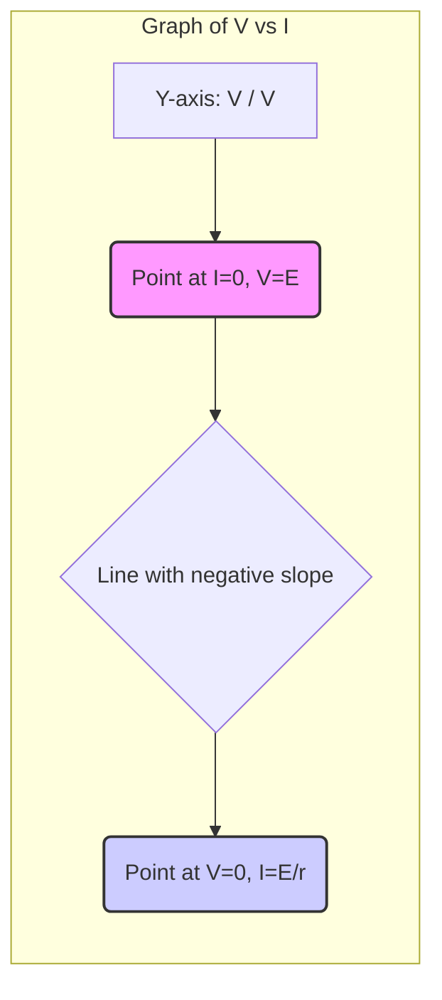
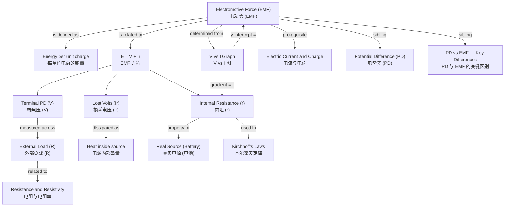

---
# Electromotive Force (EMF) / 电动势 (EMF)

---

# 1. Overview / 概述

**English:**
Electromotive Force (EMF) is a foundational concept in electricity that describes the energy provided by a source (like a battery or generator) to drive electric charge around a complete circuit. Despite its name, EMF is **not a force** but an **energy per unit charge**, measured in volts (V). This sub-topic explains the definition of EMF, its physical origin inside a source, and how it differs from the potential difference (PD) across the terminals of a source when it is supplying current. Understanding EMF is crucial for analyzing real-world circuits, as it accounts for the internal resistance of power supplies, which causes the terminal PD to drop when current flows. This leaf node builds directly on [[Electric Current and Charge]] and is a sibling to [[Potential Difference (PD)]] and [[PD vs EMF — Key Differences]].

**中文:**
电动势 (EMF) 是电学中的一个基础概念，它描述了电源（如电池或发电机）驱动电荷在完整电路中运动所提供的能量。尽管名称如此，EMF **不是一种力**，而是**每单位电荷的能量**，以伏特 (V) 为单位。本子知识点解释了 EMF 的定义、其在电源内部的物理起源，以及当电源供电时，它如何与电源两端的电势差 (PD) 区分开来。理解 EMF 对于分析真实电路至关重要，因为它解释了电源的内阻，内阻会导致当有电流流动时，端电压下降。本叶节点直接建立在 [[Electric Current and Charge]] 之上，并与 [[Potential Difference (PD)]] 和 [[PD vs EMF — Key Differences]] 是同级子知识点。

---

# 2. Syllabus Learning Objectives / 考纲学习目标

| CAIE 9702 (9.2 a-e) | Edexcel IAL (WPH11 U2: 3.5-3.8) |
|-----------|-------------|
| Define electromotive force (e.m.f.) as the electrical work done per unit charge. | Define electromotive force (e.m.f.) as the energy transferred per unit charge from other forms of electrical energy when a source drives charge around a complete circuit. |
| Distinguish between e.m.f. and potential difference (p.d.). | Distinguish between e.m.f. and potential difference (p.d.). |
| Show an understanding of the effects of the internal resistance of a source of e.m.f. | Understand that a source of e.m.f. has an internal resistance. |
| Derive and use the equation $E = V + Ir$. | Use the equation $E = V + Ir$ to solve circuit problems. |
| Solve problems involving e.m.f., internal resistance, and terminal p.d. | Solve problems involving e.m.f., internal resistance, and terminal p.d. |

**Examiner Expectations / 考官期望:**
- **English:** You must be able to state the definition of EMF precisely, using the phrase "energy per unit charge." You must be able to explain why the terminal PD of a battery is less than its EMF when current flows, due to internal resistance. You must be able to apply the equation $E = V + Ir$ in calculations.
- **中文:** 你必须能够精确陈述 EMF 的定义，使用“每单位电荷的能量”这一短语。你必须能够解释为什么当有电流流动时，电池的端电压小于其 EMF，这是由于内阻造成的。你必须能够在计算中应用公式 $E = V + Ir$。

---

# 3. Core Definitions / 核心定义

| Term (EN/CN) | Definition (EN) | Definition (CN) | Common Mistakes / 常见错误 |
|--------------|-----------------|-----------------|---------------------------|
| **Electromotive Force (EMF)** / 电动势 | The electrical work done by a source in driving a unit charge around a complete circuit. It is the energy transferred from chemical (or other) to electrical form per unit charge. | 电源在驱动单位电荷绕完整电路一周时所做的电功。它是每单位电荷从化学能（或其他形式）转化为电能的能量。 | ❌ **Thinking it is a force.** It is measured in volts (V), not newtons (N).   ❌ **Confusing it with terminal PD.** EMF is the *open-circuit* voltage; terminal PD is the voltage *under load*. |
| **Internal Resistance ($r$)** / 内阻 | The resistance to the flow of charge *within* the source of EMF itself (e.g., the electrolyte and electrodes of a battery). | 电荷在电源*内部*流动时受到的阻力（例如，电池的电解液和电极）。 | ❌ **Forgetting it exists.** In ideal circuit problems, internal resistance is often ignored, but in real-world problems, it is crucial. |
| **Terminal Potential Difference (Terminal PD)** / 端电压 | The potential difference across the terminals of a source when it is supplying current to an external circuit. | 当电源向外部电路供电时，其两端的电势差。 | ❌ **Assuming it equals EMF.** Terminal PD is always less than EMF when current flows (unless $r=0$). |
| **Lost Volts ($Ir$)** / 损耗电压 | The potential difference across the internal resistance of the source, equal to $Ir$. This energy is dissipated as heat inside the source. | 电源内阻两端的电势差，等于 $Ir$。这部分能量在电源内部以热量形式耗散。 | ❌ **Not recognizing it as the difference between EMF and terminal PD.** $E - V = Ir$. |

---

# 4. Key Concepts Explained / 关键概念详解

## 4.1 The Physical Origin of EMF / EMF 的物理起源

### Explanation / 解释
**English:** Inside a battery, chemical reactions do work to separate positive and negative charges, creating a surplus of electrons at the negative terminal and a deficit at the positive terminal. This separation creates an electric field. The EMF is the energy per unit charge that the chemical reactions provide to push charges "uphill" against this electric field, from the negative to the positive terminal inside the battery. This is the source of the electrical potential energy that drives the current in the external circuit. For a generator, the work is done by a mechanical force (e.g., a turbine) moving a conductor through a magnetic field, as described by [[Magnetic Fields and Forces]].

**中文:** 在电池内部，化学反应做功来分离正负电荷，在负极产生多余的电子，在正极产生电子的缺失。这种分离产生了一个电场。EMF 是化学反应为将电荷从电池内部负极“逆着”电场“推”到正极所提供的每单位电荷的能量。这是驱动外部电路中电流的电势能的来源。对于发电机，做功是由机械力（例如，涡轮机）在磁场中移动导体来完成的，如 [[Magnetic Fields and Forces]] 所述。

### Physical Meaning / 物理意义
**English:** EMF represents the "pushing power" or "driving potential" of a source. A higher EMF means the source can do more work per unit charge, potentially driving a larger current through a given external resistance.
**中文:** EMF 代表电源的“推动能力”或“驱动势”。更高的 EMF 意味着电源每单位电荷能做更多的功，从而可能在给定的外部电阻下驱动更大的电流。

### Common Misconceptions / 常见误区
- **EMF is a force:** This is the most common mistake. EMF is energy per unit charge (J/C = V), not a force (N).
- **EMF is constant:** While the EMF of a battery is relatively constant, it can decrease as the battery discharges.
- **EMF is the voltage you measure across a battery in use:** The voltage you measure across a battery powering a circuit is the *terminal PD*, which is less than the EMF.

### Exam Tips / 考试提示
- **English:** Always use the phrase "energy per unit charge" in your definition. When explaining why terminal PD < EMF, always mention "internal resistance" and "lost volts ($Ir$)."
- **中文:** 在定义中始终使用“每单位电荷的能量”这一短语。在解释为什么端电压小于 EMF 时，始终要提到“内阻”和“损耗电压 ($Ir$)”。

> 📷 **IMAGE PROMPT — EMF-01: Internal Structure of a Battery Showing EMF Origin**
> A cross-section diagram of a simple battery (e.g., a zinc-carbon cell). Show the zinc case (negative terminal), carbon rod (positive terminal), and the electrolyte paste. Use arrows to indicate the chemical reactions doing work to separate charges. Label the direction of the electric field inside the battery (from positive to negative) and the direction the EMF "pushes" positive charge (from negative to positive, against the field). Show the external circuit with a resistor, and label the terminal PD ($V$) across the battery terminals.

---

## 4.2 The EMF Equation: $E = V + Ir$ / EMF 公式: $E = V + Ir$

### Explanation / 解释
**English:** This is the master equation for a real source of EMF. It states that the total EMF ($E$) of the source is equal to the sum of the terminal potential difference ($V$) across the external circuit and the "lost volts" ($Ir$) across the internal resistance ($r$) of the source.
- $E$: The total energy per unit charge provided by the source.
- $V$: The energy per unit charge delivered to the external circuit (used by the load).
- $Ir$: The energy per unit charge "wasted" or dissipated as heat inside the source itself.

**中文:** 这是真实电源的主方程。它表明电源的总 EMF ($E$) 等于外部电路两端的端电压 ($V$) 与电源内阻 ($r$) 上的“损耗电压”($Ir$) 之和。
- $E$: 电源提供的每单位电荷的总能量。
- $V$: 传递给外部电路（被负载使用）的每单位电荷的能量。
- $Ir$: 在电源内部以热量形式“浪费”或耗散的每单位电荷的能量。

### Physical Meaning / 物理意义
**English:** This equation is a statement of [[Conservation of Energy]]. The total energy supplied by the source is split between the useful energy delivered to the external circuit and the wasted energy dissipated inside the source.
**中文:** 这个方程是[[能量守恒定律]]的体现。电源提供的总能量被分配给了传递给外部电路的有用能量和在电源内部耗散的无用能量。

### Common Misconceptions / 常见误区
- **$V$ is the EMF:** No, $V$ is the terminal PD. $E$ is the open-circuit voltage.
- **$Ir$ is a separate voltage source:** No, it's a voltage *drop* across the internal resistance. It's not a separate EMF.
- **The equation only applies when current flows:** Yes, if $I=0$, then $Ir=0$, and $E=V$. This is the open-circuit condition.

### Exam Tips / 考试提示
- **English:** Be able to rearrange the equation: $V = E - Ir$, $I = \frac{E}{R+r}$, and $r = \frac{E-V}{I}$. Remember that the external circuit often has a single resistor $R$, so $V = IR$.
- **中文:** 能够重新排列方程：$V = E - Ir$, $I = \frac{E}{R+r}$, 和 $r = \frac{E-V}{I}$。记住外部电路通常有一个单个电阻 $R$，所以 $V = IR$。

---

# 5. Essential Equations / 核心公式

$$ E = V + Ir $$

| Symbol (符号) | Meaning (EN) | Meaning (CN) | Unit (单位) |
|--------------|-------------|-------------|------------|
| $E$ | Electromotive Force of the source | 电源的电动势 | V (Volt) |
| $V$ | Terminal Potential Difference | 端电压 | V (Volt) |
| $I$ | Current in the circuit | 电路中的电流 | A (Ampere) |
| $r$ | Internal resistance of the source | 电源的内阻 | $\Omega$ (Ohm) |

**Derivation / 推导:**
From [[Conservation of Energy]], the total work done by the source ($W_{total} = EQ$) is equal to the work done on the external circuit ($W_{ext} = VQ$) plus the work done inside the source ($W_{int} = Ir \cdot Q$). Dividing by $Q$ gives $E = V + Ir$.

**Conditions / 适用条件:**
- **English:** This equation applies to any real source of EMF (battery, generator, power supply) that has a constant internal resistance. It is valid for both direct current (DC) and, with modifications, alternating current (AC) circuits.
- **中文:** 该方程适用于任何具有恒定内阻的真实电源（电池、发电机、电源）。它适用于直流 (DC) 电路，经过修改后也适用于交流 (AC) 电路。

**Limitations / 局限性:**
- **English:** The internal resistance $r$ of a battery is not truly constant; it can change with temperature, state of charge, and current. The equation assumes a linear model.
- **中文:** 电池的内阻 $r$ 并非真正恒定；它会随温度、充电状态和电流而变化。该方程假设了一个线性模型。

$$ I = \frac{E}{R + r} $$

| Symbol (符号) | Meaning (EN) | Meaning (CN) | Unit (单位) |
|--------------|-------------|-------------|------------|
| $I$ | Current in the circuit | 电路中的电流 | A |
| $E$ | EMF of the source | 电源的电动势 | V |
| $R$ | Total external resistance (load) | 总外部电阻（负载） | $\Omega$ |
| $r$ | Internal resistance of the source | 电源的内阻 | $\Omega$ |

**Derivation / 推导:**
From $E = V + Ir$ and $V = IR$ (Ohm's law for the external circuit), we get $E = IR + Ir = I(R+r)$. Therefore, $I = \frac{E}{R+r}$.

**Conditions / 适用条件:**
- **English:** This is the total current in a simple series circuit consisting of a source of EMF and a single external resistor.
- **中文:** 这是由一个电源和一个外部电阻组成的简单串联电路中的总电流。

**Limitations / 局限性:**
- **English:** It only applies to simple series circuits. For more complex circuits, you would need to use [[Kirchhoff's Laws]].
- **中文:** 它仅适用于简单的串联电路。对于更复杂的电路，需要使用[[基尔霍夫定律]]。

> 📷 **IMAGE PROMPT — EMF-02: Circuit Diagram for EMF Equation**
> A simple circuit diagram showing a battery represented as a cell with an internal resistor $r$ in series. The battery is connected to an external resistor $R$. Label the EMF $E$ of the battery, the terminal PD $V$ across the battery terminals, the current $I$ flowing in the circuit, and the "lost volts" $Ir$ across the internal resistor.

---

# 6. Graphs and Relationships / 图表与关系

## 6.1 Terminal PD vs. Current ($V$ vs. $I$) / 端电压与电流的关系 ($V$ vs. $I$)

### Axes / 坐标轴
- **X-axis:** Current, $I$ / A (电流, $I$ / A)
- **Y-axis:** Terminal Potential Difference, $V$ / V (端电压, $V$ / V)

### Shape / 形状
A straight line with a **negative gradient**.

### Gradient Meaning / 斜率含义
The gradient of the $V$ vs. $I$ graph is equal to **$-r$** (the negative of the internal resistance).

### Y-intercept Meaning / Y轴截距含义
The y-intercept (where $I=0$) is equal to the **EMF ($E$)** of the source. This is the open-circuit voltage.

### X-intercept Meaning / X轴截距含义
The x-intercept (where $V=0$) is the **short-circuit current ($I_{sc}$)**. This is the maximum current the source can theoretically supply if its terminals are connected with a zero-resistance wire. $I_{sc} = E/r$.

### Equation of the Line / 直线方程
$$ V = -r I + E $$
This is the linear form of $E = V + Ir$, rearranged to $V = E - Ir$.

### Exam Interpretation / 考试解读
- **English:** This is the most important graph for this topic. You will be asked to determine $E$ and $r$ from the graph. A steeper negative slope means a larger internal resistance. A higher y-intercept means a larger EMF.
- **中文:** 这是本主题最重要的图表。你将被要求从图中确定 $E$ 和 $r$。更陡的负斜率意味着更大的内阻。更高的 y 轴截距意味着更大的 EMF。

> 📷 **IMAGE PROMPT — EMF-03: Graph of Terminal PD vs Current for a Real Battery**
> A graph with a linear, downward-sloping line. The y-axis is labeled "Terminal PD, V / V" and the x-axis is labeled "Current, I / A". The y-intercept is clearly marked as "EMF, E". The x-intercept is marked as "Short-circuit current, I_sc = E/r". The gradient of the line is labeled as "-r". Show two different lines on the same graph: one with a shallow slope (low internal resistance) and one with a steep slope (high internal resistance).

---

# 7. Required Diagrams / 必备图表

## 7.1 Circuit for Measuring EMF and Internal Resistance / 测量电动势和内阻的电路

### Description / 描述
**English:** A circuit used in a laboratory experiment to determine the EMF ($E$) and internal resistance ($r$) of a battery. It consists of the battery under test, a variable resistor (rheostat) as the load, an ammeter in series to measure current ($I$), and a voltmeter connected in parallel across the battery terminals to measure terminal PD ($V$).

**中文:** 用于在实验室实验中确定电池电动势 ($E$) 和内阻 ($r$) 的电路。它由待测电池、作为负载的变阻器、串联的电流表（用于测量电流 $I$）以及并联在电池两端的电压表（用于测量端电压 $V$）组成。

### Image Prompt / 图片生成提示
> 📷 **IMAGE PROMPT — EMF-04: Experimental Circuit for EMF and Internal Resistance**
> A clear circuit diagram. A battery is shown on the left. A voltmeter is connected directly across the battery terminals. In series with the battery is an ammeter and a variable resistor (rheostat symbol). The wires connect all components to form a complete loop. Label the battery as "Source of EMF, E (with internal resistance r)", the voltmeter as "V", the ammeter as "A", and the variable resistor as "R (load)".

### Labels Required / 需要标注
- **English:** Battery (Source of EMF, $E$, with internal resistance $r$), Voltmeter ($V$), Ammeter ($A$), Variable Resistor ($R$).
- **中文:** 电池（电动势源，$E$，内阻 $r$），电压表 ($V$)，电流表 ($A$)，变阻器 ($R$)。

### Exam Importance / 考试重要性
- **English:** This is a core practical. You must be able to draw this circuit, describe the experimental procedure (vary $R$, record $V$ and $I$), and explain how to plot a $V$ vs. $I$ graph to find $E$ and $r$.
- **中文:** 这是一个核心实验。你必须能够画出这个电路，描述实验步骤（改变 $R$，记录 $V$ 和 $I$），并解释如何绘制 $V$ vs. $I$ 图来找到 $E$ 和 $r$。

---

# 8. Worked Examples / 典型例题

## Example 1: Finding EMF and Internal Resistance / 例题1：求电动势和内阻

### Question / 题目
**English:** A battery has an EMF of 12.0 V and an internal resistance of 0.50 $\Omega$. It is connected to a 5.5 $\Omega$ resistor.
(a) Calculate the current in the circuit.
(b) Calculate the terminal potential difference across the battery.
(c) Calculate the "lost volts" in the battery.

**中文:** 一个电池的电动势为 12.0 V，内阻为 0.50 $\Omega$。它连接到一个 5.5 $\Omega$ 的电阻上。
(a) 计算电路中的电流。
(b) 计算电池两端的端电压。
(c) 计算电池中的“损耗电压”。

### Solution / 解答
**(a) Current / 电流:**
Using $I = \frac{E}{R + r}$:
$$ I = \frac{12.0}{5.5 + 0.50} = \frac{12.0}{6.0} = 2.0 \, \text{A} $$

**(b) Terminal PD / 端电压:**
Using $V = IR$ (for the external resistor):
$$ V = 2.0 \times 5.5 = 11.0 \, \text{V} $$
Alternatively, using $V = E - Ir$:
$$ V = 12.0 - (2.0 \times 0.50) = 12.0 - 1.0 = 11.0 \, \text{V} $$

**(c) Lost Volts / 损耗电压:**
Using $V_{lost} = Ir$:
$$ V_{lost} = 2.0 \times 0.50 = 1.0 \, \text{V} $$

### Final Answer / 最终答案
**Answer:** (a) 2.0 A, (b) 11.0 V, (c) 1.0 V | **答案：** (a) 2.0 A, (b) 11.0 V, (c) 1.0 V

### Quick Tip / 提示
- **English:** Always check that $E = V + Ir$ holds true. Here, $12.0 = 11.0 + 1.0$, which is correct.
- **中文:** 始终检查 $E = V + Ir$ 是否成立。这里，$12.0 = 11.0 + 1.0$，是正确的。

---

## Example 2: Determining EMF and r from a Graph / 例题2：从图中确定 EMF 和 r

### Question / 题目
**English:** In an experiment to determine the EMF and internal resistance of a cell, the following data was obtained. Plot a graph of $V$ (y-axis) against $I$ (x-axis) and determine the EMF and internal resistance of the cell.

| $I$ / A | 0.0 | 0.5 | 1.0 | 1.5 | 2.0 |
|---------|-----|-----|-----|-----|-----|
| $V$ / V | 1.50 | 1.40 | 1.30 | 1.20 | 1.10 |

**中文:** 在确定一个电池的电动势和内阻的实验中，获得了以下数据。绘制 $V$（y 轴）对 $I$（x 轴）的图，并确定电池的电动势和内阻。

| $I$ / A | 0.0 | 0.5 | 1.0 | 1.5 | 2.0 |
|---------|-----|-----|-----|-----|-----|
| $V$ / V | 1.50 | 1.40 | 1.30 | 1.20 | 1.10 |

### Solution / 解答
**Step 1: Plot the graph / 步骤1：绘制图表**
Plot the points on a graph. The y-intercept is at $V = 1.50 \, \text{V}$ when $I = 0 \, \text{A}$.

**Step 2: Determine EMF / 步骤2：确定 EMF**
The y-intercept is the EMF.
$$ E = 1.50 \, \text{V} $$

**Step 3: Determine Internal Resistance / 步骤3：确定内阻**
The gradient of the line is $-r$.
$$ \text{Gradient} = \frac{\Delta V}{\Delta I} = \frac{1.10 - 1.50}{2.0 - 0.0} = \frac{-0.40}{2.0} = -0.20 \, \text{V/A} $$
Since the gradient is $-r$, we have $-r = -0.20$, so:
$$ r = 0.20 \, \Omega $$

### Final Answer / 最终答案
**Answer:** EMF = 1.50 V, Internal Resistance = 0.20 $\Omega$ | **答案：** 电动势 = 1.50 V, 内阻 = 0.20 $\Omega$

### Quick Tip / 提示
- **English:** The gradient is negative. The internal resistance is the *magnitude* of the gradient. Always use a large, well-scaled graph to minimize errors.
- **中文:** 斜率为负。内阻是斜率的*大小*。始终使用大比例、刻度合适的图表以最小化误差。

---

# 9. Past Paper Question Types / 历年真题题型

| Question Type / 题型 | Frequency / 频率 | Difficulty / 难度 | Past Paper References / 真题索引 |
|----------------------|------------------|------------------|-------------------------------|
| **Definition of EMF** / EMF 的定义 | High | Easy | 📝 *待填入* |
| **Calculation using $E = V + Ir$** / 使用 $E = V + Ir$ 计算 | High | Medium | 📝 *待填入* |
| **Determining $E$ and $r$ from a $V$ vs. $I$ graph** / 从 $V$ vs. $I$ 图中确定 $E$ 和 $r$ | High | Medium | 📝 *待填入* |
| **Explaining why terminal PD < EMF** / 解释为什么端电压小于 EMF | Medium | Medium | 📝 *待填入* |
| **Experimental design for measuring $E$ and $r$** / 测量 $E$ 和 $r$ 的实验设计 | Medium | Hard | 📝 *待填入* |

**Common Command Words / 常见指令词:**
- **Define / 定义:** State the precise meaning of a term (e.g., "Define electromotive force").
- **Derive / 推导:** Obtain an equation from given principles (e.g., "Derive the equation $E = V + Ir$").
- **Calculate / 计算:** Use a formula to find a numerical answer.
- **Determine / 确定:** Find a value, often from a graph.
- **Explain / 解释:** Give reasons for a phenomenon (e.g., "Explain why the terminal PD of a battery is less than its EMF").
- **Sketch / 画图:** Draw a graph showing the general shape and key features.

---

# 10. Practical Skills Connections / 实验技能链接

**English:**
This sub-topic is directly linked to the core practical of **determining the EMF and internal resistance of a cell**. Key practical skills include:
- **Circuit Construction:** Building the circuit shown in Section 7.1 correctly, ensuring the voltmeter is in parallel and the ammeter in series.
- **Data Collection:** Varying the load resistance ($R$) using a rheostat and recording corresponding values of current ($I$) and terminal PD ($V$). Taking multiple readings to improve accuracy.
- **Graph Plotting:** Plotting a graph of $V$ (y-axis) against $I$ (x-axis). This is a linear graph, so a line of best fit should be drawn.
- **Graph Analysis:**
    - **Y-intercept:** Read the EMF ($E$) directly from the graph.
    - **Gradient:** Calculate the gradient of the line of best fit. The internal resistance ($r$) is the negative of this gradient ($r = -\text{gradient}$).
- **Uncertainties:** Estimate uncertainties in $V$ and $I$ readings. Use error bars on the graph to draw worst-fit lines and determine the uncertainty in $E$ and $r$.
- **Experimental Considerations:**
    - The switch should only be closed when taking readings to prevent the battery from discharging and heating up, which would change its internal resistance.
    - A high-resistance voltmeter should be used to minimize the current drawn by the voltmeter itself.

**中文:**
本子知识点与**测定电池的电动势和内阻**的核心实验直接相关。关键实验技能包括：
- **电路搭建：** 正确搭建第7.1节所示的电路，确保电压表并联，电流表串联。
- **数据收集：** 使用变阻器改变负载电阻 ($R$)，并记录相应的电流 ($I$) 和端电压 ($V$) 值。多次读数以提高准确性。
- **图表绘制：** 绘制 $V$（y 轴）对 $I$（x 轴）的图。这是一条线性图，应画出最佳拟合直线。
- **图表分析：**
    - **Y 轴截距：** 直接从图中读取 EMF ($E$)。
    - **斜率：** 计算最佳拟合直线的斜率。内阻 ($r$) 是该斜率的相反数 ($r = -\text{斜率}$)。
- **不确定度：** 估算 $V$ 和 $I$ 读数的测量不确定度。在图上使用误差棒来绘制最差拟合线，并确定 $E$ 和 $r$ 的不确定度。
- **实验注意事项：**
    - 仅在读数时闭合开关，以防止电池放电和发热，从而改变其内阻。
    - 应使用高内阻电压表，以最小化电压表本身消耗的电流。

---

# 11. Concept Map / 概念图谱

---

# 12. Quick Revision Sheet / 速查表

| Category / 类别 | Key Points / 要点 |
|----------------|------------------|
| **Definition / 定义** | EMF is the **energy per unit charge** transferred from other forms to electrical energy by a source. It is **not a force**.   电动势是电源将其他形式能量转化为电能的**每单位电荷的能量**。它**不是力**。 |
| **Key Formula / 核心公式** | $$E = V + Ir$$   $$I = \frac{E}{R+r}$$ |
| **Key Graph / 核心图表** | **$V$ vs. $I$ graph:**   - Y-intercept = EMF ($E$)   - Gradient = -Internal Resistance ($-r$)   - X-intercept = Short-circuit current ($E/r$)   **$V$ vs. $I$ 图:**   - Y轴截距 = 电动势 ($E$)   - 斜率 = -内阻 ($-r$)   - X轴截距 = 短路电流 ($E/r$) |
| **Key Distinction / 关键区别** | **EMF ($E$):** Energy supplied *by* the source per unit charge. Measured when **no current flows** (open circuit).   **Terminal PD ($V$):** Energy delivered *to* the external circuit per unit charge. Measured when **current flows** (under load).   **电动势 ($E$):** 电源*提供*的每单位电荷的能量。在**无电流**（开路）时测量。   **端电压 ($V$):** *传递*给外部电路的每单位电荷的能量。在**有电流**（带负载）时测量。 |
| **Exam Tip / 考试提示** | 1. Always define EMF as "energy per unit charge."   2. When terminal PD < EMF, always mention "internal resistance" and "lost volts ($Ir$)."   3. For graph questions, remember $r = -\text{gradient}$.   1. 始终将 EMF 定义为“每单位电荷的能量”。   2. 当端电压小于 EMF 时，始终提到“内阻”和“损耗电压 ($Ir$)”。   3. 对于图表题，记住 $r = -\text{斜率}$。 |