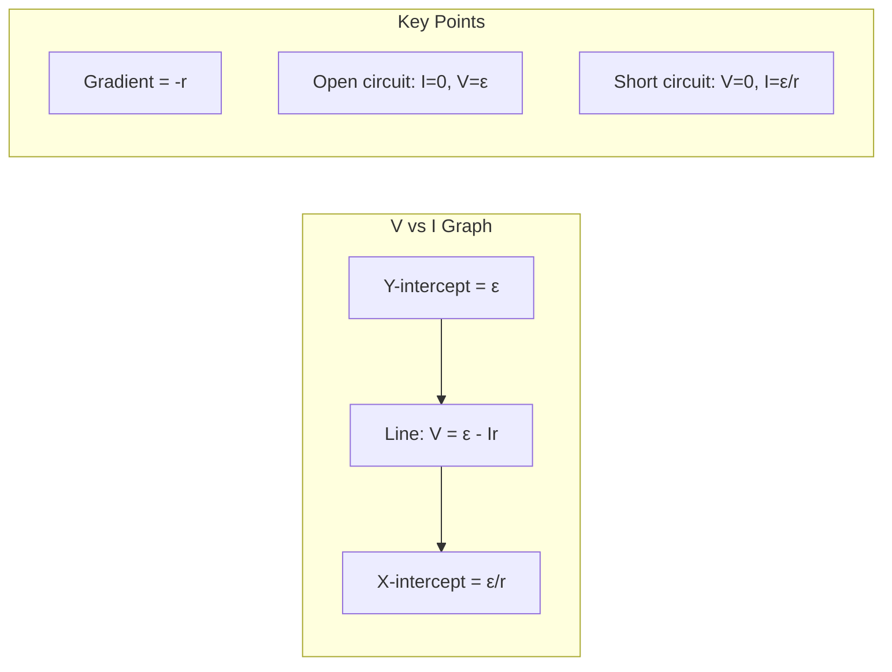

---
# Energy Transfer in Circuits / 电路中的能量转移

---

# 1. Overview / 概述

**English:**
This sub-topic explores how electrical energy is transferred from a source (like a battery or power supply) to components in a circuit. It explains the fundamental relationship between [[Potential Difference (PD)]] and [[Electromotive Force (EMF)]] in terms of energy per unit charge. Understanding this energy transfer is crucial for analyzing circuit behavior, calculating power, and explaining why real batteries have internal resistance. This concept forms the foundation for [[Resistance and Resistivity]] and [[Kirchhoff's Laws]].

**中文:**
本子知识点探讨电能如何从电源（如电池或电源供应器）转移到电路中的元件。它解释了[[Potential Difference (PD)]]和[[Electromotive Force (EMF)]]在每单位电荷能量方面的基本关系。理解这种能量转移对于分析电路行为、计算功率以及解释为什么真实电池具有内阻至关重要。这个概念构成了[[Resistance and Resistivity]]和[[Kirchhoff's Laws]]的基础。

---

# 2. Syllabus Learning Objectives / 考纲学习目标

| CAIE 9702 | Edexcel IAL |
|-----------|-------------|
| 9.2(a) Define potential difference (PD) and electromotive force (EMF) in terms of energy transfer | 3.5 Understand the concept of EMF and PD in terms of energy transfer |
| 9.2(b) Derive and use the equation $P = VI$ | 3.6 Use the equation $P = VI$ and $W = VIt$ |
| 9.2(c) Derive and use $P = I^2R$ and $P = V^2/R$ | 3.7 Derive and use $P = I^2R$ and $P = V^2/R$ |
| 9.2(d) Explain the meaning of internal resistance | 3.8 Understand internal resistance and its effect on terminal PD |
| 9.2(e) Solve problems involving EMF, internal resistance, and terminal PD | 3.8 Solve problems involving EMF, internal resistance, and terminal PD |

**Examiner Expectations / 考官期望:**
- **EN:** You must be able to define PD and EMF in terms of energy per unit charge ($W/Q$). You must derive power equations from definitions. You must explain why terminal PD is less than EMF when current flows.
- **CN:** 你必须能够根据每单位电荷的能量 ($W/Q$) 来定义电势差和电动势。你必须从定义推导出功率方程。你必须解释为什么当有电流流动时，端电压小于电动势。

---

# 3. Core Definitions / 核心定义

| Term (EN/CN) | Definition (EN) | Definition (CN) | Common Mistakes / 常见错误 |
|--------------|-----------------|-----------------|---------------------------|
| **Potential Difference (PD)** / 电势差 | The energy transferred per unit charge from electrical energy to other forms as charge passes through a component. | 电荷通过元件时，每单位电荷从电能转化为其他形式的能量。 | ❌ Confusing PD with EMF. PD is energy *lost* by charge; EMF is energy *gained* by charge. |
| **Electromotive Force (EMF)** / 电动势 | The total energy transferred per unit charge from other forms to electrical energy as charge passes through a source. | 电荷通过电源时，每单位电荷从其他形式转化为电能的总能量。 | ❌ Thinking EMF is a force. It is energy per unit charge (J/C = V). |
| **Internal Resistance ($r$)** / 内阻 | The resistance within a source (e.g., battery) that causes energy loss as heat when current flows. | 电源（如电池）内部的电阻，当电流流动时会导致能量以热量形式损失。 | ❌ Forgetting that internal resistance only matters when current flows. |
| **Terminal PD ($V$)** / 端电压 | The PD measured across the terminals of a source when current is flowing. | 当有电流流动时，在电源两端测得的电势差。 | ❌ Confusing terminal PD with EMF. $V = \mathcal{E} - Ir$ |
| **Electrical Power ($P$)** / 电功率 | The rate at which electrical energy is transferred. | 电能转移的速率。 | ❌ Using wrong formula for series vs parallel circuits. |

---

# 4. Key Concepts Explained / 关键概念详解

## 4.1 Energy Transfer in a Complete Circuit / 完整电路中的能量转移

### Explanation / 解释
**English:**
In a complete circuit, energy transfer occurs in two stages:
1. **Inside the source (EMF):** Chemical (or other) energy is converted to electrical energy. The EMF $\mathcal{E}$ is the energy per unit charge supplied by the source.
2. **Inside the load (PD):** Electrical energy is converted to other forms (heat, light, sound, etc.). The PD $V$ is the energy per unit charge dissipated by the component.

For a circuit with a battery and a resistor:
- Charge gains energy $\mathcal{E}$ as it passes through the battery.
- Charge loses energy $V$ as it passes through the resistor.
- If there is no internal resistance, $\mathcal{E} = V$.

**中文:**
在完整电路中，能量转移发生在两个阶段：
1. **电源内部（电动势）：** 化学能（或其他形式）转化为电能。电动势 $\mathcal{E}$ 是电源提供的每单位电荷的能量。
2. **负载内部（电势差）：** 电能转化为其他形式（热、光、声等）。电势差 $V$ 是元件消耗的每单位电荷的能量。

对于包含电池和电阻的电路：
- 电荷通过电池时获得能量 $\mathcal{E}$。
- 电荷通过电阻时损失能量 $V$。
- 如果没有内阻，则 $\mathcal{E} = V$。

### Physical Meaning / 物理意义
**English:** Energy is conserved in a circuit. The total energy supplied by the source equals the total energy dissipated by all components (including internal resistance). This is a direct application of the [[Conservation of Energy]].

**中文:** 电路中的能量是守恒的。电源提供的总能量等于所有元件（包括内阻）消耗的总能量。这是[[Conservation of Energy]]的直接应用。

### Common Misconceptions / 常见误区
- ❌ **EN:** "Current carries energy." → **Correct:** Charge carries energy. Current is the rate of flow of charge.
- ❌ **CN:** "电流携带能量。" → **正确：** 电荷携带能量。电流是电荷流动的速率。
- ❌ **EN:** "PD is the same as EMF." → **Correct:** EMF is energy *gained* by charge; PD is energy *lost* by charge.
- ❌ **CN:** "电势差等于电动势。" → **正确：** 电动势是电荷*获得*的能量；电势差是电荷*损失*的能量。
- ❌ **EN:** "Internal resistance is constant." → **Correct:** Internal resistance can change with temperature, battery age, etc.
- ❌ **CN:** "内阻是恒定的。" → **正确：** 内阻会随温度、电池老化等因素变化。

### Exam Tips / 考试提示
- **EN:** Always define PD and EMF in terms of energy per unit charge ($W/Q$). This is the exam-standard definition.
- **CN:** 始终根据每单位电荷的能量 ($W/Q$) 来定义电势差和电动势。这是考试标准定义。
- **EN:** When solving problems with internal resistance, draw the circuit showing $r$ as a separate resistor in series with the load.
- **CN:** 在解决涉及内阻的问题时，画出电路图，将 $r$ 显示为与负载串联的独立电阻。

> 📷 **IMAGE PROMPT — DIAGRAM-01: Energy Transfer in a Simple Circuit**
> A simple circuit diagram showing a battery (with internal resistance r shown as a small resistor inside the battery symbol) connected to an external resistor R. Arrows show energy flow: chemical energy → electrical energy (inside battery) → heat/light energy (in resistor). Labels: EMF (ε), Terminal PD (V), Internal resistance (r), Load resistance (R). Clean, educational style with color coding: green for energy gain, red for energy loss.

---

## 4.2 Internal Resistance and Terminal PD / 内阻与端电压

### Explanation / 解释
**English:**
Real batteries have internal resistance $r$. When current $I$ flows:
- Some energy is lost inside the battery as heat: $W_{\text{lost}} = I^2 r$
- The terminal PD $V$ (what you measure across the terminals) is less than the EMF $\mathcal{E}$:
  $$V = \mathcal{E} - Ir$$

The term $Ir$ is called the "lost volts" — the PD across the internal resistance.

**中文:**
真实电池具有内阻 $r$。当电流 $I$ 流动时：
- 部分能量在电池内部以热量形式损失：$W_{\text{lost}} = I^2 r$
- 端电压 $V$（在端子间测得的电压）小于电动势 $\mathcal{E}$：
  $$V = \mathcal{E} - Ir$$

$Ir$ 项称为"损失电压"——内阻两端的电势差。

### Physical Meaning / 物理意义
**English:** The internal resistance represents energy dissipation within the source itself. This is why a battery gets warm when delivering large currents. The terminal PD decreases as current increases because more voltage is dropped across the internal resistance.

**中文:** 内阻代表电源内部的能量耗散。这就是为什么电池在输出大电流时会发热。端电压随着电流增加而降低，因为更多电压降在内阻上。

### Common Misconceptions / 常见误区
- ❌ **EN:** "Terminal PD equals EMF when the circuit is open." → **Correct:** Yes, because $I = 0$, so $V = \mathcal{E} - 0 = \mathcal{E}$.
- ❌ **CN:** "开路时端电压等于电动势。" → **正确：** 是的，因为 $I = 0$，所以 $V = \mathcal{E} - 0 = \mathcal{E}$。
- ❌ **EN:** "Internal resistance is always small." → **Correct:** It depends on the source. A car battery has very low $r$ (~0.01 Ω); a small cell may have $r$ ~ 1 Ω.
- ❌ **CN:** "内阻总是很小。" → **正确：** 这取决于电源。汽车电池的内阻非常低（约0.01 Ω）；小电池的内阻可能约为1 Ω。

### Exam Tips / 考试提示
- **EN:** When asked to "explain why terminal PD is less than EMF," always mention: (1) internal resistance, (2) energy lost as heat inside the source, (3) $V = \mathcal{E} - Ir$.
- **CN:** 当被要求"解释为什么端电压小于电动势"时，务必提到：(1) 内阻，(2) 电源内部以热量形式损失的能量，(3) $V = \mathcal{E} - Ir$。
- **EN:** For maximum power transfer problems, remember: maximum power is delivered to the load when $R = r$.
- **CN:** 对于最大功率传输问题，记住：当 $R = r$ 时，负载获得最大功率。

> 📷 **IMAGE PROMPT — DIAGRAM-02: Internal Resistance Effect on Terminal PD**
> Graph showing terminal PD (V) on y-axis vs current (I) on x-axis. A straight line with negative slope. Y-intercept = EMF (ε). Slope = -r (internal resistance). Label the intercept and gradient clearly. Show a circuit diagram inset: battery with internal resistance r connected to a variable resistor. Educational style with clear axis labels and annotations.

---

# 5. Essential Equations / 核心公式

## 5.1 Electrical Power / 电功率

$$P = VI$$

| Symbol (符号) | Meaning (EN) | Meaning (CN) | Unit (单位) |
|--------------|-------------|-------------|------------|
| $P$ | Electrical power | 电功率 | W (Watt / 瓦特) |
| $V$ | Potential difference | 电势差 | V (Volt / 伏特) |
| $I$ | Current | 电流 | A (Ampere / 安培) |

**Derivation / 推导:**
$$P = \frac{W}{t} = \frac{VQ}{t} = V \cdot \frac{Q}{t} = VI$$

**Conditions / 适用条件:**
- **EN:** Valid for any component. $V$ is the PD across the component, $I$ is the current through it.
- **CN:** 适用于任何元件。$V$ 是元件两端的电势差，$I$ 是通过元件的电流。

**Limitations / 局限性:**
- **EN:** For AC circuits, this gives instantaneous power. Average power requires RMS values.
- **CN:** 对于交流电路，这给出瞬时功率。平均功率需要均方根值。

---

## 5.2 Power in Resistors / 电阻中的功率

$$P = I^2R \quad \text{and} \quad P = \frac{V^2}{R}$$

| Symbol (符号) | Meaning (EN) | Meaning (CN) | Unit (单位) |
|--------------|-------------|-------------|------------|
| $P$ | Power dissipated | 耗散功率 | W |
| $I$ | Current through resistor | 通过电阻的电流 | A |
| $R$ | Resistance | 电阻 | Ω |
| $V$ | PD across resistor | 电阻两端的电势差 | V |

**Derivation / 推导:**
From $P = VI$ and $V = IR$:
$$P = (IR)I = I^2R$$
From $P = VI$ and $I = V/R$:
$$P = V\left(\frac{V}{R}\right) = \frac{V^2}{R}$$

**Conditions / 适用条件:**
- **EN:** Only for ohmic conductors where $V \propto I$ (constant $R$).
- **CN:** 仅适用于欧姆导体，其中 $V \propto I$（$R$ 恒定）。

**Limitations / 局限性:**
- **EN:** For non-ohmic components (e.g., filament lamp), $R$ changes with temperature, so these equations give instantaneous power only.
- **CN:** 对于非欧姆元件（如白炽灯），$R$ 随温度变化，因此这些方程仅给出瞬时功率。

---

## 5.3 Energy Transferred / 转移的能量

$$W = VIt$$

| Symbol (符号) | Meaning (EN) | Meaning (CN) | Unit (单位) |
|--------------|-------------|-------------|------------|
| $W$ | Electrical energy transferred | 转移的电能 | J (Joule / 焦耳) |
| $V$ | Potential difference | 电势差 | V |
| $I$ | Current | 电流 | A |
| $t$ | Time | 时间 | s (second / 秒) |

**Derivation / 推导:**
$$W = VQ = V(It) = VIt$$

**Conditions / 适用条件:**
- **EN:** Valid for constant PD and current.
- **CN:** 适用于恒定电势差和电流。

---

## 5.4 EMF and Internal Resistance / 电动势与内阻

$$\mathcal{E} = V + Ir \quad \text{or} \quad V = \mathcal{E} - Ir$$

| Symbol (符号) | Meaning (EN) | Meaning (CN) | Unit (单位) |
|--------------|-------------|-------------|------------|
| $\mathcal{E}$ | Electromotive force | 电动势 | V |
| $V$ | Terminal PD | 端电压 | V |
| $I$ | Current in circuit | 电路中的电流 | A |
| $r$ | Internal resistance | 内阻 | Ω |

**Derivation / 推导:**
Total energy supplied by source = Energy dissipated in external circuit + Energy lost in internal resistance
$$\mathcal{E}Q = VQ + IrQ$$
Dividing by $Q$: $\mathcal{E} = V + Ir$

**Conditions / 适用条件:**
- **EN:** Valid for any source with internal resistance. $V$ is the PD across the external circuit (load).
- **CN:** 适用于任何具有内阻的电源。$V$ 是外部电路（负载）两端的电势差。

**Limitations / 局限性:**
- **EN:** Assumes $r$ is constant. In reality, $r$ may vary with temperature and battery state.
- **CN:** 假设 $r$ 是恒定的。实际上，$r$ 可能随温度和电池状态变化。

---

# 6. Graphs and Relationships / 图表与关系

## 6.1 Terminal PD vs Current / 端电压与电流的关系

### Axes / 坐标轴
- **X-axis:** Current $I$ (A) / 电流 $I$ (A)
- **Y-axis:** Terminal PD $V$ (V) / 端电压 $V$ (V)

### Shape / 形状
- **EN:** Straight line with negative slope.
- **CN:** 具有负斜率的直线。

### Gradient Meaning / 斜率含义
- **EN:** Gradient = $-r$ (negative of internal resistance).
- **CN:** 斜率 = $-r$（内阻的负值）。

### Y-intercept Meaning / 截距含义
- **EN:** Y-intercept = $\mathcal{E}$ (EMF). This is the terminal PD when $I = 0$ (open circuit).
- **CN:** Y截距 = $\mathcal{E}$（电动势）。这是当 $I = 0$（开路）时的端电压。

### X-intercept Meaning / 截距含义
- **EN:** X-intercept = $\mathcal{E}/r$ (short circuit current). This is the maximum current the source can deliver.
- **CN:** X截距 = $\mathcal{E}/r$（短路电流）。这是电源能提供的最大电流。

### Exam Interpretation / 考试解读
- **EN:** From the graph, you can determine both $\mathcal{E}$ (y-intercept) and $r$ (negative of gradient). This is a common experimental method.
- **CN:** 从图中，你可以确定 $\mathcal{E}$（y截距）和 $r$（斜率的负值）。这是一种常见的实验方法。

> 📷 **IMAGE PROMPT — GRAPH-01: Terminal PD vs Current**
> A clear graph with V (volts) on y-axis and I (amps) on x-axis. A straight line sloping downward from left to right. Y-intercept labeled "ε (EMF)". Gradient labeled "-r". X-intercept labeled "ε/r (short circuit current)". Include a small circuit diagram in corner showing battery with internal resistance. Clean, exam-style graph paper background.

---

## 6.2 Power Dissipated vs Load Resistance / 功率耗散与负载电阻的关系

### Axes / 坐标轴
- **X-axis:** Load resistance $R$ (Ω) / 负载电阻 $R$ (Ω)
- **Y-axis:** Power dissipated in load $P$ (W) / 负载中耗散的功率 $P$ (W)

### Shape / 形状
- **EN:** Curve that rises to a maximum then falls. Maximum at $R = r$.
- **CN:** 先上升至最大值然后下降的曲线。最大值在 $R = r$ 处。

### Exam Interpretation / 考试解读
- **EN:** Maximum power transfer theorem: maximum power is delivered to the load when load resistance equals internal resistance ($R = r$).
- **CN:** 最大功率传输定理：当负载电阻等于内阻时（$R = r$），负载获得最大功率。

---

# 7. Required Diagrams / 必备图表

## 7.1 Circuit Showing Internal Resistance / 显示内阻的电路图

### Description / 描述
**English:** A circuit diagram showing a battery with internal resistance $r$ connected to an external load resistor $R$. The internal resistance is shown as a separate resistor inside the battery symbol or as a resistor in series with an ideal EMF source.

**中文:** 一个电路图，显示具有内阻 $r$ 的电池连接到外部负载电阻 $R$。内阻显示为电池符号内部的独立电阻，或与理想电动势源串联的电阻。

### Image Prompt / 图片生成提示
> 📷 **IMAGE PROMPT — DIAGRAM-03: Circuit with Internal Resistance**
> A circuit diagram showing: (1) A battery represented as a dashed box containing an ideal EMF source (ε) in series with a small resistor (r). (2) An external load resistor (R) connected to the battery terminals. (3) A voltmeter connected across the battery terminals (measuring V). (4) An ammeter in series measuring I. (5) Labels: ε (EMF), r (internal resistance), R (load resistance), V (terminal PD), I (current). Clean, educational style with clear symbols and labels.

### Labels Required / 需要标注
| Label (EN) | Label (CN) | Description |
|------------|------------|-------------|
| $\mathcal{E}$ | 电动势 | EMF of the source |
| $r$ | 内阻 | Internal resistance |
| $R$ | 负载电阻 | External load resistance |
| $V$ | 端电压 | Terminal PD (voltmeter reading) |
| $I$ | 电流 | Current (ammeter reading) |

### Exam Importance / 考试重要性
- **EN:** High. This diagram is essential for explaining why terminal PD < EMF. It appears in almost every exam paper on this topic.
- **CN:** 高。此图对于解释为什么端电压小于电动势至关重要。几乎每份关于此主题的试卷都会出现。

---

## 7.2 Energy Flow Diagram / 能量流动图

### Description / 描述
**English:** A Sankey diagram showing energy flow in a circuit with internal resistance. It shows the total energy supplied (EMF) splitting into useful energy (terminal PD) and wasted energy (lost volts).

**中文:** 一个桑基图，显示具有内阻的电路中的能量流动。它显示总能量（电动势）分为有用能量（端电压）和浪费的能量（损失电压）。

### Image Prompt / 图片生成提示
> 📷 **IMAGE PROMPT — DIAGRAM-04: Energy Flow Sankey Diagram**
> A Sankey diagram showing energy flow in a circuit. The input arrow (wide) labeled "Total Energy from EMF (εQ)" splits into two arrows: (1) A wider arrow going to "Useful Energy in Load (VQ)" and (2) A narrower arrow going to "Wasted Energy in Internal Resistance (IrQ)". The widths should be proportional to the energy amounts. Clean, educational style with color coding: green for useful, red for wasted.

### Labels Required / 需要标注
| Label (EN) | Label (CN) | Description |
|------------|------------|-------------|
| $\mathcal{E}Q$ | 总能量 | Total energy supplied by source |
| $VQ$ | 有用能量 | Useful energy transferred to load |
| $IrQ$ | 损失能量 | Energy wasted as heat in internal resistance |

### Exam Importance / 考试重要性
- **EN:** Medium. Useful for explaining the concept of energy conservation in circuits.
- **CN:** 中等。有助于解释电路中能量守恒的概念。

---

# 8. Worked Examples / 典型例题

## Example 1: Calculating Power and Energy / 计算功率和能量

### Question / 题目
**English:**
A 12 V battery is connected to a 4 Ω resistor. Calculate:
(a) The current in the circuit.
(b) The power dissipated in the resistor.
(c) The energy transferred in 2 minutes.

**中文:**
一个12 V的电池连接到4 Ω的电阻。计算：
(a) 电路中的电流。
(b) 电阻中耗散的功率。
(c) 2分钟内转移的能量。

### Solution / 解答

**Step 1: Calculate current / 步骤1：计算电流**
$$I = \frac{V}{R} = \frac{12}{4} = 3 \text{ A}$$

**Step 2: Calculate power / 步骤2：计算功率**
$$P = VI = 12 \times 3 = 36 \text{ W}$$
Or using $P = I^2R = 3^2 \times 4 = 36 \text{ W}$
Or using $P = V^2/R = 12^2/4 = 36 \text{ W}$

**Step 3: Calculate energy / 步骤3：计算能量**
$$t = 2 \text{ min} = 120 \text{ s}$$
$$W = VIt = 12 \times 3 \times 120 = 4320 \text{ J}$$
Or $W = Pt = 36 \times 120 = 4320 \text{ J}$

### Final Answer / 最终答案
**Answer:** (a) $I = 3$ A | (b) $P = 36$ W | (c) $W = 4320$ J
**答案：** (a) $I = 3$ A | (b) $P = 36$ W | (c) $W = 4320$ J

### Quick Tip / 提示
- **EN:** Always convert time to seconds when using $W = VIt$ or $W = Pt$.
- **CN:** 使用 $W = VIt$ 或 $W = Pt$ 时，始终将时间转换为秒。

---

## Example 2: Internal Resistance Problem / 内阻问题

### Question / 题目
**English:**
A battery has an EMF of 9.0 V and an internal resistance of 0.5 Ω. It is connected to a 2.5 Ω resistor.
(a) Calculate the current in the circuit.
(b) Calculate the terminal PD of the battery.
(c) Calculate the power dissipated in the internal resistance.
(d) Calculate the efficiency of the circuit.

**中文:**
一个电池的电动势为9.0 V，内阻为0.5 Ω。它连接到2.5 Ω的电阻。
(a) 计算电路中的电流。
(b) 计算电池的端电压。
(c) 计算内阻中耗散的功率。
(d) 计算电路的效率。

### Solution / 解答

**Step 1: Calculate total resistance / 步骤1：计算总电阻**
$$R_{\text{total}} = R + r = 2.5 + 0.5 = 3.0 \text{ Ω}$$

**Step 2: Calculate current / 步骤2：计算电流**
$$I = \frac{\mathcal{E}}{R_{\text{total}}} = \frac{9.0}{3.0} = 3.0 \text{ A}$$

**Step 3: Calculate terminal PD / 步骤3：计算端电压**
$$V = \mathcal{E} - Ir = 9.0 - (3.0 \times 0.5) = 9.0 - 1.5 = 7.5 \text{ V}$$
Or $V = IR = 3.0 \times 2.5 = 7.5 \text{ V}$

**Step 4: Calculate power in internal resistance / 步骤4：计算内阻中的功率**
$$P_r = I^2r = (3.0)^2 \times 0.5 = 4.5 \text{ W}$$

**Step 5: Calculate efficiency / 步骤5：计算效率**
$$\text{Efficiency} = \frac{\text{Useful power}}{\text{Total power}} = \frac{I^2R}{I^2(R+r)} = \frac{R}{R+r} = \frac{2.5}{3.0} = 0.833 = 83.3\%$$
Or: $\text{Efficiency} = \frac{V}{\mathcal{E}} = \frac{7.5}{9.0} = 0.833 = 83.3\%$

### Final Answer / 最终答案
**Answer:** (a) $I = 3.0$ A | (b) $V = 7.5$ V | (c) $P_r = 4.5$ W | (d) Efficiency = 83.3%
**答案：** (a) $I = 3.0$ A | (b) $V = 7.5$ V | (c) $P_r = 4.5$ W | (d) 效率 = 83.3%

### Quick Tip / 提示
- **EN:** Efficiency can be calculated as $R/(R+r)$ or $V/\mathcal{E}$. Both give the same answer.
- **CN:** 效率可以计算为 $R/(R+r)$ 或 $V/\mathcal{E}$。两者给出相同的答案。

---

# 9. Past Paper Question Types / 历年真题题型

| Question Type / 题型 | Frequency / 频率 | Difficulty / 难度 | Past Paper References / 真题索引 |
|----------------------|------------------|------------------|-------------------------------|
| Define PD and EMF in terms of energy | High | Easy | 📝 *待填入* |
| Calculate power using $P=VI$, $P=I^2R$, $P=V^2/R$ | High | Medium | 📝 *待填入* |
| Internal resistance problem ($\mathcal{E} = V + Ir$) | High | Medium-Hard | 📝 *待填入* |
| Graph interpretation (V vs I) | Medium | Medium | 📝 *待填入* |
| Efficiency calculation | Medium | Medium | 📝 *待填入* |
| Maximum power transfer | Low | Hard | 📝 *待填入* |

**Common Command Words / 常见指令词:**
- **Define / 定义:** State the meaning precisely (e.g., "Define potential difference in terms of energy transfer.")
- **Calculate / 计算:** Use equations to find a numerical value.
- **Explain / 解释:** Give reasons for a phenomenon (e.g., "Explain why the terminal PD is less than the EMF.")
- **Derive / 推导:** Show the steps to obtain an equation from definitions.
- **Sketch / 画图:** Draw a graph showing the general shape.

---

# 10. Practical Skills Connections / 实验技能链接

**English:**
This sub-topic connects to practical work in several ways:

1. **Measuring EMF and Internal Resistance:** The most common experiment involves measuring terminal PD for different currents (by varying load resistance) and plotting $V$ vs $I$. The y-intercept gives $\mathcal{E}$, and the gradient gives $-r$.

2. **Uncertainties:** When measuring $V$ and $I$, consider:
   - Voltmeter and ammeter resolution uncertainties
   - Connection resistance (especially for low-resistance circuits)
   - Temperature changes affecting $r$

3. **Graph Plotting:** 
   - Plot $V$ on y-axis, $I$ on x-axis
   - Draw line of best fit
   - Determine gradient and intercept with uncertainties

4. **Experimental Design:**
   - Use a variable resistor (rheostat) to change current
   - Record multiple readings
   - Repeat for reliability
   - Consider using a data logger for accuracy

**中文:**
本子知识点在多个方面与实验工作相关：

1. **测量电动势和内阻：** 最常见的实验是测量不同电流下的端电压（通过改变负载电阻），并绘制 $V$ 与 $I$ 的关系图。y截距给出 $\mathcal{E}$，斜率给出 $-r$。

2. **不确定度：** 测量 $V$ 和 $I$ 时，考虑：
   - 电压表和电流表的分辨率不确定度
   - 连接电阻（特别是对于低电阻电路）
   - 温度变化影响 $r$

3. **图表绘制：**
   - 在y轴上绘制 $V$，在x轴上绘制 $I$
   - 绘制最佳拟合线
   - 确定斜率和截距及其不确定度

4. **实验设计：**
   - 使用可变电阻（变阻器）改变电流
   - 记录多个读数
   - 重复实验以确保可靠性
   - 考虑使用数据记录器以提高精度

> 📋 **CIE Only:** In Paper 3 (Practical), you may be asked to determine the internal resistance of a cell using a potentiometer or a simple circuit with a variable resistor.
>
> 📋 **Edexcel Only:** In Unit 2 (WPH12), the practical "Investigation of the EMF and internal resistance of a cell" is a core practical. You must know the procedure, circuit diagram, and how to analyze the results.

---

# 11. Concept Map / 概念图谱

```mermaid
graph TD
    %% Energy Transfer in Circuits - Concept Map
    E[Energy Transfer in Circuits] --> PD[Potential Difference]
    E --> EMF[Electromotive Force]
    E --> P[Power]
    E --> W[Energy]
    
    PD --> |Definition| PD_def[Energy per unit charge<br/>lost by charge in component]
    EMF --> |Definition| EMF_def[Energy per unit charge<br/>gained by charge in source]
    
    PD --> |Related to| R[Resistance]
    EMF --> |Related to| r[Internal Resistance]
    
    P --> |Equation 1| P1[P = VI]
    P --> |Equation 2| P2[P = I²R]
    P --> |Equation 3| P3[P = V²/R]
    
    W --> |Equation| W_eq[W = VIt]
    
    EMF --> |With internal resistance| V_eq[V = ε - Ir]
    V_eq --> |Terminal PD| V_term[Terminal PD]
    V_eq --> |Lost volts| V_lost[Lost Volts = Ir]
    
    r --> |Effect| r_effect[Energy lost as heat]
    r --> |Maximum power| MPT[Max power when R = r]
    
    %% Links to other topics
    E --> |Prerequisite| Current[[Electric Current and Charge]]
    E --> |Leads to| Kirchhoff[[Kirchhoff's Laws]]
    E --> |Leads to| Resistance[[Resistance and Resistivity]]
    E --> |Sibling| PD_vs_EMF[[PD vs EMF — Key Differences]]
    E --> |Sibling| Measuring[[Measuring PD and EMF]]
    
    %% Styling
    classDef main fill:#f9f,stroke:#333,stroke-width:2px
    classDef concept fill:#bbf,stroke:#333,stroke-width:1px
    classDef equation fill:#bfb,stroke:#333,stroke-width:1px
    classDef link fill:#ddd,stroke:#666,stroke-width:1px,stroke-dasharray: 5 5
    
    class E main
    class PD,EMF,P,W concept
    class P1,P2,P3,W_eq,V_eq equation
    class Current,Kirchhoff,Resistance,PD_vs_EMF,Measuring link
```

---

# 12. Quick Revision Sheet / 速查表

| Category / 类别 | Key Points / 要点 |
|----------------|------------------|
| **Definition / 定义** | **PD:** Energy per unit charge *lost* by charge in a component ($V = W/Q$). **EMF:** Energy per unit charge *gained* by charge in a source ($\mathcal{E} = W/Q$). |
| **Key Formula / 核心公式** | $P = VI$, $P = I^2R$, $P = V^2/R$, $W = VIt$, $\mathcal{E} = V + Ir$, $V = \mathcal{E} - Ir$ |
| **Key Graph / 核心图表** | $V$ vs $I$: Straight line with negative slope. Y-intercept = $\mathcal{E}$, gradient = $-r$, X-intercept = $\mathcal{E}/r$ |
| **Internal Resistance / 内阻** | Real sources have internal resistance $r$. Causes terminal PD to be less than EMF when current flows. $V = \mathcal{E} - Ir$ |
| **Lost Volts / 损失电压** | $Ir$ = PD across internal resistance. Energy lost as heat inside the source. |
| **Efficiency / 效率** | $\eta = \frac{V}{\mathcal{E}} = \frac{R}{R+r}$ (for a circuit with one load resistor) |
| **Maximum Power / 最大功率** | Maximum power transferred to load when $R = r$ |
| **Common Units / 常用单位** | Power: W (Watt), Energy: J (Joule), PD/EMF: V (Volt), Current: A (Ampere), Resistance: Ω (Ohm) |
| **Exam Tip / 考试提示** | Always define PD and EMF in terms of energy per unit charge. Show working with units. For internal resistance problems, draw the circuit with $r$ as a separate resistor. |
| **Common Mistake / 常见错误** | ❌ Confusing PD and EMF. ❌ Forgetting internal resistance when current flows. ❌ Using wrong power formula. ❌ Not converting time to seconds. |

---

> **Related Notes:** [[Potential Difference (PD)]] | [[Electromotive Force (EMF)]] | [[PD vs EMF — Key Differences]] | [[Measuring PD and EMF]] | [[Electric Current and Charge]] | [[Resistance and Resistivity]] | [[Kirchhoff's Laws]]
>
> **Parent Hub:** [[Potential Difference and EMF]]