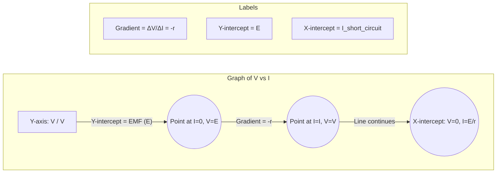

---
# Measuring PD and EMF / 测量电势差与电动势

---

# 1. Overview / 概述

**English:**
This sub-topic focuses on the practical techniques and instruments used to measure potential difference (PD) and electromotive force (EMF) in electrical circuits. It covers the correct use of voltmeters, the distinction between measuring terminal PD and EMF, and the experimental setup required to determine the EMF and internal resistance of a cell or battery. Understanding how to accurately measure these quantities is fundamental to analysing circuit behaviour, energy transfer, and the limitations of real power sources. This knowledge directly supports the study of [[Potential Difference (PD)]] and [[Electromotive Force (EMF)]], and is essential for practical work in [[Resistance and Resistivity]] and [[Kirchhoff's Laws]].

**中文:**
本子知识点侧重于测量电路中电势差 (PD) 和电动势 (EMF) 所使用的实用技术和仪器。内容包括正确使用电压表、区分测量路端电压和电动势，以及确定电池或蓄电池的电动势和内阻所需的实验装置。准确理解如何测量这些量是分析电路行为、能量转换以及真实电源局限性的基础。这些知识直接支持对[[Potential Difference (PD)]]和[[Electromotive Force (EMF)]]的学习，并且对于[[Resistance and Resistivity]]和[[Kirchhoff's Laws]]的实验工作至关重要。

---

# 2. Syllabus Learning Objectives / 考纲学习目标

| CAIE 9702 (9.2 a-e) | Edexcel IAL (WPH11 U2: 3.5-3.8) |
|-----------|-------------|
| (a) Show an understanding of the distinction between e.m.f. and p.d. in terms of energy transfer. | 3.5 Understand the distinction between e.m.f. and p.d. in terms of energy transfer. |
| (b) Show an understanding of the effects of the internal resistance of a source of e.m.f. on the terminal potential difference. | 3.6 Understand the effects of the internal resistance of a source of e.m.f. on the terminal potential difference. |
| (c) Select and use the equation $V = E - Ir$. | 3.7 Use the equation $V = E - Ir$. |
| (d) Select and use the equation $E = I(R + r)$. | 3.8 Use the equation $E = I(R + r)$. |
| (e) Describe an experiment to determine the internal resistance of a cell. | (Implicit in practical skills) |

**Examiner Expectations / 考官期望:**
- **English:** Candidates must be able to describe and explain the experimental setup for measuring EMF and internal resistance, including the circuit diagram, the use of a voltmeter and ammeter, and the method for varying the load. They must be able to interpret a graph of terminal PD ($V$) against current ($I$) to determine $E$ and $r$.
- **中文:** 考生必须能够描述并解释测量电动势和内阻的实验装置，包括电路图、电压表和电流表的使用，以及改变负载的方法。他们必须能够解释路端电压 ($V$) 对电流 ($I$) 的图表，以确定 $E$ 和 $r$。

---

# 3. Core Definitions / 核心定义

| Term (EN/CN) | Definition (EN) | Definition (CN) | Common Mistakes / 常见错误 |
|--------------|-----------------|-----------------|---------------------------|
| **Terminal Potential Difference (V)** / 路端电压 | The potential difference across the terminals of a source when a current is flowing in the circuit. | 当电路中有电流流动时，电源两端的电势差。 | Confusing this with EMF. V is always less than E when current flows. |
| **Electromotive Force (E)** / 电动势 | The electrical potential energy transferred per unit charge from other forms of energy into electrical energy by a source. | 电源将其他形式的能量转化为电能时，每单位电荷所转移的电势能。 | Thinking EMF is a force. It is an energy per unit charge (measured in volts). |
| **Internal Resistance (r)** / 内阻 | The resistance to the flow of current within the source of EMF itself. | 电源内部对电流流动的电阻。 | Forgetting that internal resistance causes a "lost volts" drop inside the source. |
| **Lost Volts ($Ir$)** / 损耗电压 | The potential difference across the internal resistance of the source, equal to $E - V$. | 电源内阻两端的电势差，等于 $E - V$。 | Thinking "lost volts" is wasted energy; it is dissipated as heat inside the source. |
| **Voltmeter** / 电压表 | An instrument used to measure potential difference, connected in parallel across a component. | 用于测量电势差的仪器，与被测元件并联连接。 | Connecting a voltmeter in series. |
| **Ammeter** / 电流表 | An instrument used to measure electric current, connected in series in a circuit. | 用于测量电流的仪器，串联在电路中。 | Connecting an ammeter in parallel. |

---

# 4. Key Concepts Explained / 关键概念详解

## 4.1 Measuring Terminal PD / 测量路端电压

### Explanation / 解释
**English:** The terminal potential difference ($V$) is measured using a [[Voltmeter]] connected directly across the terminals of the power source (e.g., a cell or battery). The voltmeter must be connected in **parallel** with the source. For an ideal voltmeter, it should have an **infinite resistance** so that it draws no current from the circuit, ensuring it measures the true PD without affecting the circuit. In practice, a high-resistance digital voltmeter is used. When the circuit is open (no current, $I=0$), the voltmeter reading equals the EMF ($E$) of the source. When a current flows ($I>0$), the voltmeter reading drops to $V = E - Ir$, which is the terminal PD.

**中文:** 路端电压 ($V$) 是通过直接连接在电源（例如电池或蓄电池）两端的[[Voltmeter]]来测量的。电压表必须与电源**并联**连接。对于理想电压表，它应该具有**无穷大电阻**，这样它就不会从电路中分流电流，从而确保在不影响电路的情况下测量真实的电势差。实践中，使用高电阻的数字电压表。当电路开路时（无电流，$I=0$），电压表读数等于电源的电动势 ($E$)。当有电流流动时 ($I>0$)，电压表读数下降到 $V = E - Ir$，这就是路端电压。

### Physical Meaning / 物理意义
**English:** The terminal PD is the actual voltage "available" to the external circuit. It is less than the EMF because some energy per unit charge ($Ir$) is "lost" (dissipated as heat) inside the source due to its internal resistance.

**中文:** 路端电压是外部电路实际“可用”的电压。它小于电动势，因为每单位电荷的一部分能量 ($Ir$) 由于电源的内阻而在电源内部“损失”（以热量形式耗散）。

### Common Misconceptions / 常见误区
- **English:** Students often think the voltmeter reading is always equal to the EMF. It is only equal when no current flows.
- **中文:** 学生常认为电压表读数总是等于电动势。它只在没有电流流动时才相等。
- **English:** Students may connect the voltmeter in series, which would break the circuit and give an incorrect reading.
- **中文:** 学生可能会将电压表串联，这会断开电路并给出错误读数。

### Exam Tips / 考试提示
- **English:** Always state that the voltmeter is connected "in parallel" across the source. For EMF measurement, specify that the circuit is "open" or the switch is "off".
- **中文:** 始终说明电压表是“并联”在电源两端的。对于电动势测量，要说明电路是“开路”或开关是“断开”的。

> 📷 **IMAGE PROMPT — MEASUREMENT: Measuring Terminal PD**
> A clear circuit diagram showing a cell with internal resistance (r) inside a dashed box, connected to an external resistor (R). A voltmeter (V) is connected in parallel across the cell's terminals. An ammeter (A) is connected in series with the external resistor. A switch is in series. Arrows show current flow. Labels: EMF (E), Internal Resistance (r), Terminal PD (V), External Resistance (R).

## 4.2 Measuring EMF / 测量电动势

### Explanation / 解释
**English:** The EMF ($E$) of a source is measured by connecting a high-resistance [[Voltmeter]] directly across its terminals when **no current is flowing** through the source. This is achieved by having an **open circuit** (e.g., switch open). Under this condition, there is no current ($I=0$), so there is no potential drop across the internal resistance ($Ir = 0$). Therefore, the voltmeter reading equals the EMF ($V = E$). It is crucial that the voltmeter itself has a very high resistance to minimise the current it draws, ensuring the measurement is as accurate as possible.

**中文:** 电源的电动势 ($E$) 是通过在**没有电流流过**电源时，将高电阻[[Voltmeter]]直接连接在其两端来测量的。这通过**开路**（例如，开关断开）来实现。在这种条件下，没有电流 ($I=0$)，因此内阻上没有电势降 ($Ir = 0$)。因此，电压表读数等于电动势 ($V = E$)。至关重要的是，电压表本身具有非常高的电阻，以最大限度地减少其分流的电流，确保测量尽可能准确。

### Physical Meaning / 物理意义
**English:** The EMF represents the total energy per unit charge supplied by the source. Measuring it under open-circuit conditions isolates the source's inherent ability to provide energy, without the influence of its internal resistance.

**中文:** 电动势代表电源提供的每单位电荷的总能量。在开路条件下测量它，可以隔离电源提供能量的固有能力，而不受其内阻的影响。

### Common Misconceptions / 常见误区
- **English:** Thinking you can measure EMF by connecting a voltmeter while the circuit is complete and current is flowing.
- **中文:** 认为可以在电路闭合且有电流流动时通过连接电压表来测量电动势。
- **English:** Believing that a standard voltmeter can measure EMF perfectly. In reality, it draws a tiny current, so the reading is slightly less than the true EMF.
- **中文:** 相信标准电压表可以完美测量电动势。实际上，它会分流微小的电流，因此读数略小于真实电动势。

### Exam Tips / 考试提示
- **English:** Explicitly state "open circuit" or "no current flowing" when describing EMF measurement. Mention that a high-resistance voltmeter (or a digital voltmeter) is used to minimise current draw.
- **中文:** 在描述电动势测量时，明确说明“开路”或“没有电流流动”。提及使用高电阻电压表（或数字电压表）以最小化分流电流。

> 📷 **IMAGE PROMPT — MEASUREMENT: Measuring EMF**
> A simple circuit diagram showing a cell with internal resistance (r) inside a dashed box. A high-resistance voltmeter (V) is connected directly across the cell's terminals. The circuit is open (no external resistor, switch is open). A label reads: "Open Circuit: I = 0, V = EMF".

---

# 5. Essential Equations / 核心公式

## 5.1 Terminal PD Equation / 路端电压方程

$$ V = E - Ir $$

| Symbol (符号) | Meaning (EN) | Meaning (CN) | Unit (单位) |
|--------------|-------------|-------------|------------|
| $V$ | Terminal Potential Difference | 路端电压 | V (Volt) |
| $E$ | Electromotive Force | 电动势 | V (Volt) |
| $I$ | Current in the circuit | 电路中的电流 | A (Ampere) |
| $r$ | Internal resistance of the source | 电源的内阻 | $\Omega$ (Ohm) |

**Derivation / 推导:**
The total EMF ($E$) is used to drive current through the total circuit resistance, which is the sum of the external resistance ($R$) and the internal resistance ($r$). So, $E = I(R + r)$. The terminal PD ($V$) is the PD across the external resistance $R$, so $V = IR$. Substituting $IR = E - Ir$ gives $V = E - Ir$.

**Conditions / 适用条件:**
- **English:** The source must have internal resistance ($r > 0$). The equation applies for any current $I$ flowing in the circuit.
- **中文:** 电源必须具有内阻 ($r > 0$)。该方程适用于电路中流动的任何电流 $I$。

**Limitations / 局限性:**
- **English:** Assumes internal resistance $r$ is constant. In reality, $r$ can change with temperature, current, and the state of the cell (e.g., discharging).
- **中文:** 假设内阻 $r$ 是恒定的。实际上，$r$ 会随温度、电流和电池状态（例如放电）而变化。

## 5.2 EMF and Total Resistance / 电动势与总电阻

$$ E = I(R + r) $$

| Symbol (符号) | Meaning (EN) | Meaning (CN) | Unit (单位) |
|--------------|-------------|-------------|------------|
| $E$ | Electromotive Force | 电动势 | V (Volt) |
| $I$ | Current in the circuit | 电路中的电流 | A (Ampere) |
| $R$ | External resistance (load) | 外部电阻（负载） | $\Omega$ (Ohm) |
| $r$ | Internal resistance of the source | 电源的内阻 | $\Omega$ (Ohm) |

**Derivation / 推导:**
This is derived from applying [[Kirchhoff's Laws|Kirchhoff's Second Law]] (loop rule) to the complete circuit. The sum of the EMFs equals the sum of the potential differences across all resistances: $E = IR + Ir = I(R + r)$.

**Conditions / 适用条件:**
- **English:** The circuit must be a simple series circuit containing the source and an external resistor $R$.
- **中文:** 电路必须是包含电源和外部电阻 $R$ 的简单串联电路。

**Limitations / 局限性:**
- **English:** Does not account for the internal resistance of the ammeter or connecting wires, which are usually negligible.
- **中文:** 不考虑电流表或连接导线的内阻，这些通常可以忽略不计。

---

# 6. Graphs and Relationships / 图表与关系

## 6.1 Terminal PD ($V$) vs. Current ($I$) Graph / 路端电压 ($V$) 对电流 ($I$) 图

### Axes / 坐标轴
- **X-axis:** Current, $I$ / A (安培)
- **Y-axis:** Terminal PD, $V$ / V (伏特)

### Shape / 形状
A straight line with a **negative gradient**.

### Gradient Meaning / 斜率含义
The gradient of the line is equal to **$-r$** (the negative of the internal resistance).

$$ \text{Gradient} = \frac{\Delta V}{\Delta I} = -r $$

### Y-intercept Meaning / Y轴截距含义
The y-intercept (where $I=0$) is equal to the **EMF ($E$)** of the source. This is the open-circuit voltage.

### X-intercept Meaning / X轴截距含义
The x-intercept (where $V=0$) occurs when the terminal PD is zero. This is the **short-circuit current ($I_{\text{sc}}$)**. At this point, $E = I_{\text{sc}} r$, so $I_{\text{sc}} = E/r$.

### Exam Interpretation / 考试解读
- **English:** This is the most important graph for this topic. You must be able to read $E$ from the y-intercept and calculate $r$ from the gradient. A steeper negative gradient indicates a larger internal resistance.
- **中文:** 这是本主题最重要的图表。你必须能够从 y 轴截距读取 $E$，并从斜率计算 $r$。更陡的负斜率表示更大的内阻。



> 📷 **IMAGE PROMPT — GRAPH: V vs I for a Cell**
> A graph with "Current / A" on the x-axis and "Terminal PD / V" on the y-axis. A straight line with a negative slope is drawn. The y-intercept is clearly labelled "EMF (E)". The x-intercept is labelled "Short-circuit current (I_sc)". Two points on the line are marked to show ΔV and ΔI for calculating the gradient, which is labelled "-r".

---

# 7. Required Diagrams / 必备图表

## 7.1 Circuit for Determining EMF and Internal Resistance / 测定电动势和内阻的电路

### Description / 描述
**English:** A circuit diagram showing a cell (with its internal resistance represented as a separate resistor $r$ inside a dashed box), connected in series with an ammeter ($A$), a variable resistor ($R$), and a switch. A voltmeter ($V$) is connected in parallel across the cell's terminals. This setup allows the current to be varied by changing the variable resistor, and the corresponding terminal PD to be measured.

**中文:** 一个电路图，显示一个电池（其内阻表示为虚线框内的一个独立电阻 $r$），与电流表 ($A$)、可变电阻 ($R$) 和开关串联。电压表 ($V$) 并联在电池两端。该装置允许通过改变可变电阻来改变电流，并测量相应的路端电压。

### Image Prompt / 图片生成提示
> 📷 **IMAGE PROMPT — DIAGRAM: EMF and Internal Resistance Experiment**
> A clear, labelled circuit diagram. A cell is represented by two parallel lines (long and short). Inside a dashed box around the cell, a small resistor symbol is drawn and labelled "r" (internal resistance). An ammeter (A) is connected in series with the cell. A variable resistor (R) is connected in series. A switch (S) is in series. A voltmeter (V) is connected in parallel across the cell's terminals (the dashed box). All connecting wires are straight lines. Labels: "Cell", "Internal Resistance (r)", "Ammeter (A)", "Variable Resistor (R)", "Voltmeter (V)", "Switch (S)".

### Labels Required / 需要标注
- Cell / 电池
- Internal Resistance ($r$) / 内阻 ($r$)
- Ammeter ($A$) / 电流表 ($A$)
- Variable Resistor ($R$) / 可变电阻 ($R$)
- Voltmeter ($V$) / 电压表 ($V$)
- Switch ($S$) / 开关 ($S$)

### Exam Importance / 考试重要性
- **English:** This is a standard required practical. You must be able to draw this circuit, explain the purpose of each component, and describe how to collect data to plot the $V$ vs $I$ graph.
- **中文:** 这是一个标准的要求实验。你必须能够画出这个电路，解释每个元件的用途，并描述如何收集数据来绘制 $V$ 对 $I$ 的图表。

---

# 8. Worked Examples / 典型例题

## Example 1: Calculating Internal Resistance / 计算内阻

### Question / 题目
**English:** A cell has an EMF of 1.50 V. When it is connected to a 4.0 $\Omega$ resistor, the current in the circuit is 0.30 A. Calculate the internal resistance of the cell.

**中文:** 一个电池的电动势为 1.50 V。当它连接到一个 4.0 $\Omega$ 的电阻时，电路中的电流为 0.30 A。计算该电池的内阻。

### Solution / 解答
**Step 1:** Identify known quantities.
$E = 1.50 \text{ V}$, $R = 4.0 \ \Omega$, $I = 0.30 \text{ A}$.

**Step 2:** Use the equation $E = I(R + r)$.
$$ 1.50 = 0.30 (4.0 + r) $$

**Step 3:** Solve for $r$.
$$ 1.50 = 1.2 + 0.30r $$
$$ 0.30 = 0.30r $$
$$ r = 1.0 \ \Omega $$

### Final Answer / 最终答案
**Answer:** The internal resistance is $1.0 \ \Omega$. | **答案：** 内阻为 $1.0 \ \Omega$。

### Quick Tip / 提示
- **English:** Always check your units. If you use $E = I(R+r)$, ensure $R$ and $r$ are in ohms.
- **中文:** 始终检查单位。如果你使用 $E = I(R+r)$，确保 $R$ 和 $r$ 的单位是欧姆。

## Example 2: Using the V vs I Graph / 使用 V-I 图

### Question / 题目
**English:** In an experiment to determine the internal resistance of a battery, the following data was obtained:

| Current / A | Terminal PD / V |
|-------------|-----------------|
| 0.0         | 9.0             |
| 0.5         | 8.5             |
| 1.0         | 8.0             |
| 1.5         | 7.5             |
| 2.0         | 7.0             |

Plot a graph of terminal PD against current and use it to determine the EMF and internal resistance of the battery.

**中文:** 在测定电池内阻的实验中，获得了以下数据：

| 电流 / A | 路端电压 / V |
|-------------|-----------------|
| 0.0         | 9.0             |
| 0.5         | 8.5             |
| 1.0         | 8.0             |
| 1.5         | 7.5             |
| 2.0         | 7.0             |

绘制路端电压对电流的图表，并用它来确定电池的电动势和内阻。

### Solution / 解答
**Step 1:** Plot the points on a graph with $I$ on the x-axis and $V$ on the y-axis. Draw a best-fit straight line.

**Step 2:** Determine the EMF ($E$).
The y-intercept is at $I=0$, $V=9.0 \text{ V}$. Therefore, $E = 9.0 \text{ V}$.

**Step 3:** Determine the internal resistance ($r$).
The gradient of the line is $\frac{\Delta V}{\Delta I}$.
Choose two points on the line: (0.0, 9.0) and (2.0, 7.0).
$$ \text{Gradient} = \frac{7.0 - 9.0}{2.0 - 0.0} = \frac{-2.0}{2.0} = -1.0 $$
Since the gradient $= -r$, we have $r = 1.0 \ \Omega$.

### Final Answer / 最终答案
**Answer:** EMF = 9.0 V, Internal Resistance = 1.0 $\Omega$. | **答案：** 电动势 = 9.0 V，内阻 = 1.0 $\Omega$。

### Quick Tip / 提示
- **English:** When calculating the gradient, use points from the best-fit line, not the raw data points. The y-intercept gives the EMF directly.
- **中文:** 计算斜率时，使用最佳拟合线上的点，而不是原始数据点。y 轴截距直接给出电动势。

---

# 9. Past Paper Question Types / 历年真题题型

| Question Type / 题型 | Frequency / 频率 | Difficulty / 难度 | Past Paper References / 真题索引 |
|----------------------|------------------|------------------|-------------------------------|
| **Calculation of $r$ or $E$** using $E = I(R+r)$ or $V = E - Ir$ | High | Easy | 📝 *待填入* |
| **Interpretation of $V$ vs $I$ graph** to find $E$ and $r$ | High | Medium | 📝 *待填入* |
| **Describing the experiment** to determine $E$ and $r$ | Medium | Medium | 📝 *待填入* |
| **Explaining the difference** between EMF and terminal PD in a circuit | Medium | Easy | 📝 *待填入* |
| **Effect of internal resistance** on circuit performance (e.g., starter motor) | Low | Hard | 📝 *待填入* |

**Common Command Words / 常见指令词:**
- **Calculate / 计算:** Use a formula to find a numerical value.
- **Determine / 确定:** Find a value from a graph or data.
- **Describe / 描述:** Give a detailed account of an experiment or setup.
- **Explain / 解释:** Give reasons for a phenomenon or difference.
- **Plot / 绘制:** Draw a graph with labelled axes.

---

# 10. Practical Skills Connections / 实验技能链接

**English:**
This sub-topic is heavily linked to practical work. Key skills include:
- **Circuit Construction:** Building a series circuit with a cell, ammeter, and variable resistor, and connecting a voltmeter in parallel.
- **Data Collection:** Varying the external resistance and recording corresponding values of current and terminal PD.
- **Graph Plotting:** Plotting a graph of $V$ (y-axis) against $I$ (x-axis) and drawing a best-fit straight line.
- **Graph Analysis:** Determining the y-intercept (EMF) and gradient (negative internal resistance).
- **Uncertainty and Error:** Identifying sources of error, such as the voltmeter drawing a small current, resistance changes due to heating, and contact resistance. Using a high-resistance voltmeter and taking multiple readings can reduce errors.

**中文:**
本子知识点与实验工作密切相关。关键技能包括：
- **电路搭建：** 构建包含电池、电流表和可变电阻的串联电路，并并联连接电压表。
- **数据收集：** 改变外部电阻，并记录相应的电流和路端电压值。
- **图表绘制：** 绘制 $V$（y 轴）对 $I$（x 轴）的图表，并绘制最佳拟合直线。
- **图表分析：** 确定 y 轴截距（电动势）和斜率（负的内阻）。
- **不确定度和误差：** 识别误差来源，例如电压表分流微小电流、发热导致的电阻变化以及接触电阻。使用高电阻电压表和多次读数可以减少误差。

---

# 11. Concept Map / 概念图谱

```mermaid
graph TD
    %% Show connections for this leaf node
    A[Measuring PD and EMF] --> B[Instruments]
    A --> C[Key Quantities]
    A --> D[Experimental Method]
    A --> E[Graphical Analysis]

    B --> B1[Voltmeter: Parallel, High R]
    B --> B2[Ammeter: Series, Low R]

    C --> C1[EMF (E): Open-circuit voltage]
    C --> C2[Terminal PD (V): Voltage across terminals when current flows]
    C --> C3[Internal Resistance (r): Resistance inside source]
    C --> C4[Lost Volts (Ir): E - V]

    D --> D1[Circuit: Cell, A, V, Variable R]
    D --> D2[Procedure: Vary R, record I and V]
    D --> D3[Equation: E = I(R+r) or V = E - Ir]

    E --> E1[Graph: V vs I]
    E1 --> E2[Y-intercept: EMF (E)]
    E1 --> E3[Gradient: -r]

    %% Links to other topics
    A -.-> F[[Potential Difference (PD)]]
    A -.-> G[[Electromotive Force (EMF)]]
    A -.-> H[[Energy Transfer in Circuits]]
    A -.-> I[[Resistance and Resistivity]]
    A -.-> J[[Kirchhoff's Laws]]
```

---

# 12. Quick Revision Sheet / 速查表

| Category / 类别 | Key Points / 要点 |
|----------------|------------------|
| **Definition / 定义** | **EMF ($E$):** Energy per unit charge supplied by source. **Terminal PD ($V$):** Voltage across source when current flows. **Internal Resistance ($r$):** Resistance inside the source. |
| **Key Formula / 核心公式** | $V = E - Ir$; $E = I(R + r)$ |
| **Key Graph / 核心图表** | **$V$ vs $I$:** Straight line with negative gradient. Y-intercept = $E$. Gradient = $-r$. |
| **Measurement / 测量** | **EMF:** High-resistance voltmeter across source, open circuit. **Terminal PD:** Voltmeter across source, circuit complete. **$r$:** From gradient of $V$ vs $I$ graph. |
| **Exam Tip / 考试提示** | Always state "open circuit" for EMF measurement. Use points from the best-fit line for gradient calculation. Remember that "lost volts" ($Ir$) is dissipated as heat inside the source. |