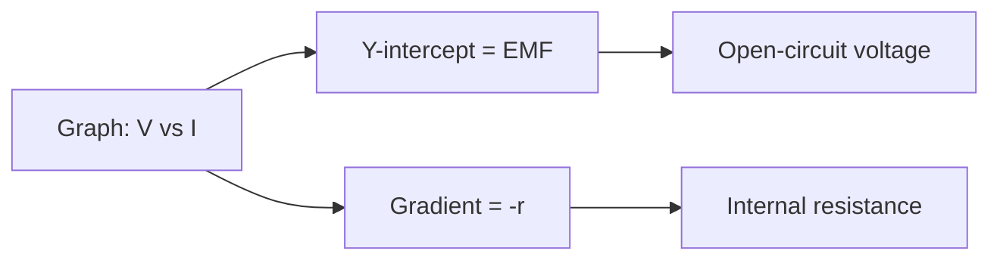

---
# PD vs EMF — Key Differences / 电势差与电动势的关键区别

---

# 1. Overview / 概述

**English:**
This sub-topic clarifies the fundamental distinction between **Potential Difference (PD)** and **Electromotive Force (EMF)** — two of the most commonly confused concepts in A-Level electricity. While both are measured in volts (V), they represent fundamentally different physical quantities: PD is the *energy dissipated per unit charge* as it moves through a component, whereas EMF is the *energy supplied per unit charge* by a source. Understanding this difference is critical for analysing circuits, applying [[Kirchhoff's Laws]], and interpreting energy transfers. This leaf node builds directly on [[Potential Difference (PD)]] and [[Electromotive Force (EMF)]], and is a prerequisite for [[Energy Transfer in Circuits]] and [[Measuring PD and EMF]].

**中文:**
本子知识点阐明**电势差 (PD)** 与**电动势 (EMF)** 之间的根本区别——这是 A-Level 电学中最常被混淆的两个概念。虽然两者都以伏特 (V) 为单位，但它们代表根本不同的物理量：PD 是电荷通过元件时*每单位电荷耗散的能量*，而 EMF 是电源*每单位电荷提供的能量*。理解这一区别对于分析电路、应用[[基尔霍夫定律]]以及解释能量转移至关重要。本叶节点直接建立在[[电势差 (PD)]] 和[[电动势 (EMF)]] 的基础上，是[[电路中的能量转移]]和[[测量 PD 与 EMF]] 的先决条件。

---

# 2. Syllabus Learning Objectives / 考纲学习目标

| CAIE 9702 (9.2 a-e) | Edexcel IAL (WPH11 U2: 3.5-3.8) |
|-----------|-------------|
| Define electromotive force (e.m.f.) as the electrical work done per unit charge by a source. | Define e.m.f. as the energy transferred per unit charge from other forms to electrical form. |
| Define potential difference (p.d.) as the electrical work done per unit charge when charge flows through a component. | Define p.d. as the energy transferred per unit charge from electrical form to other forms. |
| Distinguish between e.m.f. and p.d. in terms of energy transfer. | Distinguish between e.m.f. and p.d. in terms of energy transfer. |
| Use the relationship $E = V + Ir$ to relate e.m.f., terminal p.d., and internal resistance. | Use the relationship $\mathcal{E} = V + Ir$ for a source with internal resistance. |
| Explain why the terminal p.d. of a source is less than its e.m.f. when delivering current. | Explain the difference between e.m.f. and terminal p.d. for a source. |

**Examiner Expectations / 考官期望:**
- **English:** You must be able to state the definitions of PD and EMF *in terms of energy per unit charge*, not just "voltage". You must explain why terminal PD < EMF when a current flows, using the concept of [[Internal Resistance]]. You must be able to apply $E = V + Ir$ in calculations.
- **中文:** 你必须能够*从每单位电荷能量的角度*陈述 PD 和 EMF 的定义，而不仅仅是“电压”。你必须使用[[内阻]]的概念解释为什么当有电流流动时，端电压 < 电动势。你必须能够应用 $E = V + Ir$ 进行计算。

---

# 3. Core Definitions / 核心定义

| Term (EN/CN) | Definition (EN) | Definition (CN) | Common Mistakes / 常见错误 |
|--------------|-----------------|-----------------|---------------------------|
| **Electromotive Force (EMF)** / 电动势 | The electrical work done per unit charge by a source to drive charge around a complete circuit. | 电源驱动电荷绕完整电路一周时，每单位电荷所做的电功。 | ❌ Saying EMF is the "force" or "voltage across the source". ✅ It is *energy per unit charge* supplied. |
| **Potential Difference (PD)** / 电势差 | The electrical work done per unit charge when charge flows through a component. | 电荷通过元件时，每单位电荷所做的电功。 | ❌ Confusing PD with EMF. ✅ PD is *energy dissipated* per unit charge, not supplied. |
| **Terminal Potential Difference** / 端电压 | The PD across the terminals of a source when it is delivering current. | 电源在输送电流时其两端的电势差。 | ❌ Assuming terminal PD = EMF always. ✅ Terminal PD < EMF when current flows due to [[Internal Resistance]]. |
| **Lost Volts** / 损耗电压 | The voltage drop across the internal resistance of a source, equal to $Ir$. | 电源内阻上的电压降，等于 $Ir$。 | ❌ Thinking "lost volts" is wasted energy. ✅ It is energy dissipated inside the source. |
| **Internal Resistance** / 内阻 | The resistance within a source that opposes the flow of current, causing energy to be dissipated as heat. | 电源内部阻碍电流流动的电阻，导致能量以热量形式耗散。 | ❌ Ignoring internal resistance in simple circuits. ✅ Always consider it for real sources. |

---

# 4. Key Concepts Explained / 关键概念详解

## 4.1 Energy Transfer Perspective / 能量转移视角

### Explanation / 解释
**English:** The most fundamental difference between EMF and PD lies in the direction of energy transfer. **EMF** is the energy *supplied* to each coulomb of charge by a source (e.g., a battery, generator, solar cell). This energy comes from a non-electrical form (chemical, mechanical, light) and is converted into electrical potential energy. **PD**, on the other hand, is the energy *dissipated* (transformed into other forms) by each coulomb of charge as it passes through a component (e.g., a resistor, lamp, motor). In a complete circuit, the total EMF supplied equals the total PD dissipated (by conservation of energy), but only if there is no [[Internal Resistance]].

**中文:** EMF 和 PD 最根本的区别在于能量转移的方向。**EMF** 是电源*提供给*每库仑电荷的能量（例如电池、发电机、太阳能电池）。这些能量来自非电形式（化学能、机械能、光能），并转化为电势能。另一方面，**PD** 是每库仑电荷通过元件（例如电阻器、灯泡、电动机）时*耗散*（转化为其他形式）的能量。在完整电路中，总 EMF 等于总 PD（根据能量守恒），但前提是没有[[内阻]]。

### Physical Meaning / 物理意义
**English:** Think of EMF as the "pump" that pushes charge around the circuit, giving it energy. Think of PD as the "energy drop" as charge flows through a component, like water losing height as it flows downhill. The pump (EMF) provides the total height gain; the drops (PDs) sum to the total height loss.

**中文:** 将 EMF 视为推动电荷绕电路运动的“泵”，赋予其能量。将 PD 视为电荷通过元件时的“能量下降”，就像水流下坡时失去高度一样。泵 (EMF) 提供总的高度增益；下降 (PDs) 总和等于总的高度损失。

### Common Misconceptions / 常见误区
- **English:**
  - "EMF is the voltage across the battery." → No, that's terminal PD. EMF is the voltage when *no* current flows.
  - "PD and EMF are the same thing." → No, they represent opposite energy transfer processes.
  - "A battery's EMF is constant regardless of current." → Yes, but terminal PD decreases as current increases due to internal resistance.
- **中文:**
  - “EMF 是电池两端的电压。” → 不对，那是端电压。EMF 是*没有*电流流动时的电压。
  - “PD 和 EMF 是同一回事。” → 不对，它们代表相反的能量转移过程。
  - “无论电流大小，电池的 EMF 都是恒定的。” → 是的，但由于内阻，端电压会随着电流增加而减小。

### Exam Tips / 考试提示
- **English:** Always use the phrase "energy per unit charge" in definitions. For EMF, say "supplied by a source". For PD, say "dissipated in a component". When comparing, draw a circuit and label where EMF is supplied and where PDs are dropped.
- **中文:** 在定义中始终使用“每单位电荷的能量”这一短语。对于 EMF，说“由电源提供”。对于 PD，说“在元件中耗散”。比较时，画一个电路并标出 EMF 提供的位置和 PD 下降的位置。

> 📷 **IMAGE PROMPT — PDvsEMF-01: Energy Transfer Diagram**
> A clear diagram showing a battery (chemical energy → electrical energy) labelled "EMF: Energy supplied per unit charge", connected to a resistor (electrical energy → thermal energy) labelled "PD: Energy dissipated per unit charge". Arrows show energy flow direction. Include a simple circuit with a battery, resistor, and ammeter.

---

## 4.2 The EMF Equation: $E = V + Ir$ / 电动势方程：$E = V + Ir$

### Explanation / 解释
**English:** For a real source (with [[Internal Resistance]] $r$), the EMF $E$ is not equal to the terminal PD $V$ when a current $I$ flows. The relationship is:
$$E = V + Ir$$
where $Ir$ is the "lost volts" — the PD across the internal resistance. This equation shows that as current increases, the terminal PD decreases. When no current flows ($I=0$), $E = V$, so the EMF equals the open-circuit terminal PD.

**中文:** 对于真实电源（具有[[内阻]] $r$），当有电流 $I$ 流动时，EMF $E$ 不等于端电压 $V$。关系式为：
$$E = V + Ir$$
其中 $Ir$ 是“损耗电压”——内阻两端的电势差。该方程表明，随着电流增加，端电压减小。当没有电流流动时 ($I=0$)，$E = V$，因此 EMF 等于开路端电压。

### Physical Meaning / 物理意义
**English:** The EMF is the total energy per unit charge supplied by the source. Part of this energy ($V$) is delivered to the external circuit, and part ($Ir$) is wasted as heat inside the source itself.

**中文:** EMF 是电源提供的每单位电荷的总能量。其中一部分能量 ($V$) 输送到外部电路，另一部分 ($Ir$) 作为热量在电源内部浪费掉。

### Common Misconceptions / 常见误区
- **English:**
  - "Lost volts means the battery is losing charge." → No, it means energy is being dissipated internally as heat.
  - "Terminal PD is always less than EMF." → Yes, when current flows. But if $r=0$ (ideal source), $V=E$.
- **中文:**
  - “损耗电压意味着电池正在失去电荷。” → 不对，这意味着能量在内部以热量形式耗散。
  - “端电压总是小于 EMF。” → 是的，当有电流流动时。但如果 $r=0$（理想电源），$V=E$。

### Exam Tips / 考试提示
- **English:** In calculations, always identify $E$, $V$, $I$, and $r$. Rearrange the equation to find any unknown. Remember that $V$ is the PD across the *external* circuit (or the load resistor). $Ir$ is the PD across the *internal* resistance.
- **中文:** 在计算中，始终识别 $E$、$V$、$I$ 和 $r$。重新排列方程以求解任何未知量。记住 $V$ 是*外部*电路（或负载电阻）两端的 PD。$Ir$ 是*内部*电阻两端的 PD。

---

# 5. Essential Equations / 核心公式

## Equation 1: EMF Definition / EMF 定义

$$ \mathcal{E} = \frac{W}{Q} $$

| Symbol (符号) | Meaning (EN) | Meaning (CN) | Unit (单位) |
|--------------|-------------|-------------|------------|
| $\mathcal{E}$ | Electromotive force | 电动势 | V (volt) |
| $W$ | Electrical work done by the source | 电源所做的电功 | J (joule) |
| $Q$ | Charge passing through the source | 通过电源的电荷 | C (coulomb) |

**Derivation / 推导:** By definition, EMF is the work done per unit charge.
**Conditions / 适用条件:** Always true for any source.
**Limitations / 局限性:** None, it's a definition.

## Equation 2: PD Definition / PD 定义

$$ V = \frac{W}{Q} $$

| Symbol (符号) | Meaning (EN) | Meaning (CN) | Unit (单位) |
|--------------|-------------|-------------|------------|
| $V$ | Potential difference | 电势差 | V (volt) |
| $W$ | Electrical work done (dissipated) in the component | 在元件中（耗散）所做的电功 | J (joule) |
| $Q$ | Charge passing through the component | 通过元件的电荷 | C (coulomb) |

**Derivation / 推导:** By definition, PD is the work done per unit charge.
**Conditions / 适用条件:** Always true for any component.
**Limitations / 局限性:** None, it's a definition.

## Equation 3: EMF with Internal Resistance / 含内阻的 EMF 方程

$$ \mathcal{E} = V + Ir $$

| Symbol (符号) | Meaning (EN) | Meaning (CN) | Unit (单位) |
|--------------|-------------|-------------|------------|
| $\mathcal{E}$ | Electromotive force | 电动势 | V (volt) |
| $V$ | Terminal potential difference | 端电压 | V (volt) |
| $I$ | Current in the circuit | 电路中的电流 | A (ampere) |
| $r$ | Internal resistance of the source | 电源的内阻 | $\Omega$ (ohm) |

**Derivation / 推导:** From conservation of energy: total energy supplied = energy delivered to external circuit + energy dissipated internally.
**Conditions / 适用条件:** For any real source with internal resistance.
**Limitations / 局限性:** Assumes $r$ is constant (which is approximately true for most batteries at moderate currents).

> 📷 **IMAGE PROMPT — PDvsEMF-02: EMF Equation Diagram**
> A circuit diagram showing a battery with internal resistance $r$ drawn inside the battery symbol. The battery has EMF $\mathcal{E}$. An external resistor $R$ is connected. Label the terminal PD $V$ across the battery terminals. Show the equation $\mathcal{E} = V + Ir$ with arrows indicating where each term applies.

---

# 6. Graphs and Relationships / 图表与关系

## 6.1 Terminal PD vs Current / 端电压与电流的关系

### Axes / 坐标轴
- **X-axis:** Current $I$ / A (电流 $I$ / A)
- **Y-axis:** Terminal PD $V$ / V (端电压 $V$ / V)

### Shape / 形状
A straight line with a **negative gradient**.

### Gradient Meaning / 斜率含义
The gradient of the graph is $-r$, where $r$ is the [[Internal Resistance]] of the source. A steeper negative slope means a larger internal resistance.

### Y-intercept Meaning / Y 轴截距含义
The y-intercept is the EMF $\mathcal{E}$ of the source (the terminal PD when $I=0$, i.e., open circuit).

### Equation / 方程
$$ V = \mathcal{E} - Ir $$
This is the straight-line equation $y = mx + c$, where $y = V$, $m = -r$, $x = I$, $c = \mathcal{E}$.

### Exam Interpretation / 考试解读
- **English:** You may be asked to determine $\mathcal{E}$ and $r$ from a graph of $V$ vs $I$. The y-intercept gives $\mathcal{E}$, and the gradient gives $-r$. Alternatively, you can use two data points to solve simultaneous equations.
- **中文:** 你可能会被要求从 $V$ 对 $I$ 的图中确定 $\mathcal{E}$ 和 $r$。Y 轴截距给出 $\mathcal{E}$，斜率给出 $-r$。或者，你可以使用两个数据点来求解联立方程。



> 📷 **IMAGE PROMPT — PDvsEMF-03: Terminal PD vs Current Graph**
> A graph with current $I$ on the x-axis (0 to 5 A) and terminal PD $V$ on the y-axis (0 to 12 V). A straight line with negative slope starts at (0, 12) and ends at (5, 10). Label the y-intercept as "EMF $\mathcal{E} = 12$ V". Label the gradient as "$-r = -0.4$ $\Omega$". Show the equation $V = \mathcal{E} - Ir$.

---

# 7. Required Diagrams / 必备图表

## 7.1 Circuit for Measuring EMF and Terminal PD / 测量 EMF 和端电压的电路

### Description / 描述
**English:** A circuit diagram showing a battery (with internal resistance), a variable resistor (rheostat) as the load, a voltmeter connected across the battery terminals, and an ammeter in series. This setup is used to measure the terminal PD at different currents, allowing determination of EMF and internal resistance.

**中文:** 一个电路图，显示一个电池（带内阻）、一个可变电阻器（变阻器）作为负载、一个连接在电池两端的电压表，以及一个串联的电流表。此设置用于测量不同电流下的端电压，从而确定 EMF 和内阻。

### Image Prompt / 图片生成提示
> 📷 **IMAGE PROMPT — PDvsEMF-04: Measuring EMF and Terminal PD Circuit**
> A clear circuit diagram. A battery symbol with a small resistor $r$ drawn inside to represent internal resistance. A variable resistor $R$ (rheostat symbol) connected in series with the battery. An ammeter $A$ in series. A voltmeter $V$ connected directly across the battery terminals (parallel to the battery). Label the battery EMF as $\mathcal{E}$. Show the direction of current $I$.

### Labels Required / 需要标注
- Battery with EMF $\mathcal{E}$ and internal resistance $r$ (电池，标注 EMF $\mathcal{E}$ 和内阻 $r$)
- Variable resistor $R$ (可变电阻器 $R$)
- Ammeter $A$ (电流表 $A$)
- Voltmeter $V$ (电压表 $V$)
- Terminal PD $V$ (端电压 $V$)
- Current $I$ (电流 $I$)

### Exam Importance / 考试重要性
- **English:** This circuit is the standard method for determining the EMF and internal resistance of a cell. You must be able to draw it, explain how to take readings, and analyse the data (plot $V$ vs $I$).
- **中文:** 该电路是测定电池 EMF 和内阻的标准方法。你必须能够画出它，解释如何读取数据，并分析数据（绘制 $V$ 对 $I$ 的图）。

---

## 7.2 Energy Flow Diagram / 能量流图

### Description / 描述
**English:** A diagram showing the energy transformations in a circuit. Chemical energy in the battery is converted to electrical energy (EMF). This electrical energy is then converted to thermal energy in the resistor (PD) and also to thermal energy in the internal resistance (lost volts).

**中文:** 显示电路中能量转换的图。电池中的化学能转化为电能 (EMF)。然后，该电能转化为电阻器中的热能 (PD) 以及内阻中的热能（损耗电压）。

### Image Prompt / 图片生成提示
> 📷 **IMAGE PROMPT — PDvsEMF-05: Energy Flow Diagram**
> A flow chart. Start with "Chemical Energy (Battery)". Arrow to "Electrical Energy (EMF $\mathcal{E}$)". Split into two arrows: one to "Thermal Energy in External Resistor (PD $V$)" and one to "Thermal Energy in Internal Resistance (Lost Volts $Ir$)". Show the equation $\mathcal{E} = V + Ir$ at the bottom.

### Labels Required / 需要标注
- Chemical Energy (化学能)
- Electrical Energy / EMF (电能 / EMF)
- Thermal Energy in External Resistor / PD (外部电阻器中的热能 / PD)
- Thermal Energy in Internal Resistance / Lost Volts (内阻中的热能 / 损耗电压)

### Exam Importance / 考试重要性
- **English:** Helps visualise why terminal PD is less than EMF. The "lost" energy is not destroyed but converted to heat inside the source.
- **中文:** 有助于形象化理解为什么端电压小于 EMF。“损失”的能量并未被摧毁，而是在电源内部转化为热量。

---

# 8. Worked Examples / 典型例题

## Example 1: Calculating Terminal PD / 计算端电压

### Question / 题目
**English:** A battery has an EMF of 9.0 V and an internal resistance of 0.5 $\Omega$. It is connected to a 4.0 $\Omega$ resistor. Calculate:
(a) The current in the circuit.
(b) The terminal PD of the battery.
(c) The lost volts.

**中文:** 一个电池的电动势为 9.0 V，内阻为 0.5 $\Omega$。它连接到一个 4.0 $\Omega$ 的电阻器。计算：
(a) 电路中的电流。
(b) 电池的端电压。
(c) 损耗电压。

### Solution / 解答

**Step 1: Calculate total resistance.**
Total resistance $R_{\text{total}} = R_{\text{external}} + r = 4.0 + 0.5 = 4.5 \, \Omega$

**Step 2: Calculate current using $I = \frac{\mathcal{E}}{R_{\text{total}}}$.**
$$I = \frac{9.0}{4.5} = 2.0 \, \text{A}$$

**Step 3: Calculate terminal PD using $V = \mathcal{E} - Ir$.**
$$V = 9.0 - (2.0 \times 0.5) = 9.0 - 1.0 = 8.0 \, \text{V}$$

**Step 4: Calculate lost volts.**
Lost volts $= Ir = 2.0 \times 0.5 = 1.0 \, \text{V}$

### Final Answer / 最终答案
**Answer:** (a) $I = 2.0$ A | **答案：** (a) $I = 2.0$ A
(b) $V = 8.0$ V | (b) $V = 8.0$ V
(c) Lost volts $= 1.0$ V | (c) 损耗电压 $= 1.0$ V

### Quick Tip / 提示
- **English:** Check: $\mathcal{E} = V + Ir \Rightarrow 9.0 = 8.0 + 1.0$ ✓. Always verify your answer using the EMF equation.
- **中文:** 检查：$\mathcal{E} = V + Ir \Rightarrow 9.0 = 8.0 + 1.0$ ✓。始终使用 EMF 方程验证你的答案。

---

## Example 2: Determining EMF and Internal Resistance from Data / 从数据确定 EMF 和内阻

### Question / 题目
**English:** A student measures the terminal PD of a cell at different currents. The results are:
- When $I = 0$ A, $V = 1.50$ V
- When $I = 0.50$ A, $V = 1.35$ V

Determine the EMF and internal resistance of the cell.

**中文:** 一名学生测量了电池在不同电流下的端电压。结果如下：
- 当 $I = 0$ A 时，$V = 1.50$ V
- 当 $I = 0.50$ A 时，$V = 1.35$ V

确定电池的 EMF 和内阻。

### Solution / 解答

**Step 1: Identify EMF.**
When $I = 0$, $V = \mathcal{E} = 1.50$ V.

**Step 2: Use the EMF equation to find $r$.**
$$\mathcal{E} = V + Ir$$
$$1.50 = 1.35 + (0.50 \times r)$$
$$0.15 = 0.50r$$
$$r = \frac{0.15}{0.50} = 0.30 \, \Omega$$

### Final Answer / 最终答案
**Answer:** $\mathcal{E} = 1.50$ V, $r = 0.30 \, \Omega$ | **答案：** $\mathcal{E} = 1.50$ V, $r = 0.30 \, \Omega$

### Quick Tip / 提示
- **English:** The open-circuit voltage ($I=0$) directly gives the EMF. Then use any other data point to find $r$. Alternatively, plot a graph of $V$ vs $I$ and find the gradient.
- **中文:** 开路电压 ($I=0$) 直接给出 EMF。然后使用任何其他数据点来求 $r$。或者，绘制 $V$ 对 $I$ 的图并求斜率。

---

# 9. Past Paper Question Types / 历年真题题型

| Question Type / 题型 | Frequency / 频率 | Difficulty / 难度 | Past Paper References / 真题索引 |
|----------------------|------------------|------------------|-------------------------------|
| Definition of EMF and PD | High | Easy | 📝 *待填入* |
| Calculation using $E = V + Ir$ | Very High | Medium | 📝 *待填入* |
| Graph analysis ($V$ vs $I$) | High | Medium | 📝 *待填入* |
| Explaining why terminal PD < EMF | Medium | Medium | 📝 *待填入* |
| Experimental determination of $E$ and $r$ | Medium | Hard | 📝 *待填入* |

**Common Command Words / 常见指令词:**
- **English:** Define, Distinguish, Calculate, Determine, Explain, Sketch, Plot
- **中文:** 定义、区分、计算、确定、解释、画出、绘制

---

# 10. Practical Skills Connections / 实验技能链接

**English:**
This sub-topic is directly tested in the practical exam (Paper 3 for CAIE, Unit 2 Practical for Edexcel). Key skills include:
- **Circuit Construction:** Building the circuit shown in Section 7.1 to measure terminal PD at different currents.
- **Data Collection:** Varying the load resistance and recording pairs of $I$ and $V$ readings.
- **Graph Plotting:** Plotting $V$ on the y-axis against $I$ on the x-axis.
- **Graph Analysis:** Determining the y-intercept (EMF) and gradient (internal resistance).
- **Uncertainty Analysis:** Estimating uncertainties in $V$ and $I$ readings and propagating them to find the uncertainty in $r$.
- **Experimental Design:** Understanding why a high-resistance voltmeter is needed (to minimise current through it) and why the ammeter should be in series.

**中文:**
本子知识点在实验考试中直接考查（CAIE 的 Paper 3，Edexcel 的 Unit 2 Practical）。关键技能包括：
- **电路搭建：** 搭建第 7.1 节所示的电路，以测量不同电流下的端电压。
- **数据收集：** 改变负载电阻，记录成对的 $I$ 和 $V$ 读数。
- **图表绘制：** 以 $V$ 为 y 轴，$I$ 为 x 轴绘图。
- **图表分析：** 确定 y 轴截距 (EMF) 和斜率（内阻）。
- **不确定度分析：** 估算 $V$ 和 $I$ 读数的不确定度，并传递以求出 $r$ 的不确定度。
- **实验设计：** 理解为什么需要高电阻电压表（以最小化通过它的电流）以及为什么电流表应串联。

---

# 11. Concept Map / 概念图谱

```mermaid
graph TD
    %% Leaf Node: PD vs EMF Key Differences
    L[PD vs EMF Key Differences] --> A[EMF]
    L --> B[PD]
    L --> C[Internal Resistance]
    L --> D[Terminal PD]
    L --> E[Lost Volts]

    A --> A1[Energy supplied per unit charge]
    A --> A2[Measured in volts]
    A --> A3[Open-circuit voltage]

    B --> B1[Energy dissipated per unit charge]
    B --> B2[Measured in volts]
    B --> B3[Across components]

    C --> C1[Resistance inside source]
    C --> C2[Causes lost volts]
    C --> C3[Equation: E = V + Ir]

    D --> D1[PD across source terminals]
    D --> D2[Less than EMF when I > 0]
    D --> D3[Equals EMF when I = 0]

    E --> E1[Ir]
    E --> E2[Energy dissipated as heat]

    %% Links to parent hub and siblings
    L --> H[[Potential Difference and EMF]]
    A --> S1[[Electromotive Force (EMF)]]
    B --> S2[[Potential Difference (PD)]]
    D --> S3[[Measuring PD and EMF]]
    C --> P1[[Electric Current and Charge]]
    C --> P2[[Resistance and Resistivity]]
    L --> P3[[Kirchhoff's Laws]]
```

---

# 12. Quick Revision Sheet / 速查表

| Category / 类别 | Key Points / 要点 |
|----------------|------------------|
| **Definition / 定义** | **EMF:** Energy supplied per unit charge by a source. **PD:** Energy dissipated per unit charge in a component. Both in volts (J/C). |
| **Key Formula / 核心公式** | $\mathcal{E} = V + Ir$ (EMF = Terminal PD + Lost Volts) |
| **Key Graph / 核心图表** | $V$ vs $I$: Straight line with negative gradient. Y-intercept = $\mathcal{E}$. Gradient = $-r$. |
| **Key Difference / 关键区别** | EMF is energy *in* (to charges). PD is energy *out* (from charges). |
| **Key Relationship / 关键关系** | Terminal PD < EMF when current flows due to internal resistance. |
| **Common Exam Question / 常见考题** | "Explain why the terminal PD of a battery is less than its EMF when it is delivering current." → Answer: Because of the lost volts ($Ir$) across the internal resistance. |
| **Practical Tip / 实验提示** | To measure EMF, use a voltmeter directly across the source with no load (open circuit). To measure terminal PD, use a voltmeter across the source with a load connected. |
| **Units / 单位** | EMF and PD: volts (V). Internal resistance: ohms ($\Omega$). Current: amperes (A). |
| **Ideal vs Real Source / 理想与真实电源** | Ideal source: $r = 0$, so $V = \mathcal{E}$ always. Real source: $r > 0$, so $V < \mathcal{E}$ when $I > 0$. |
| **Conservation of Energy / 能量守恒** | $\mathcal{E} = V + Ir$ is a direct consequence of energy conservation. |