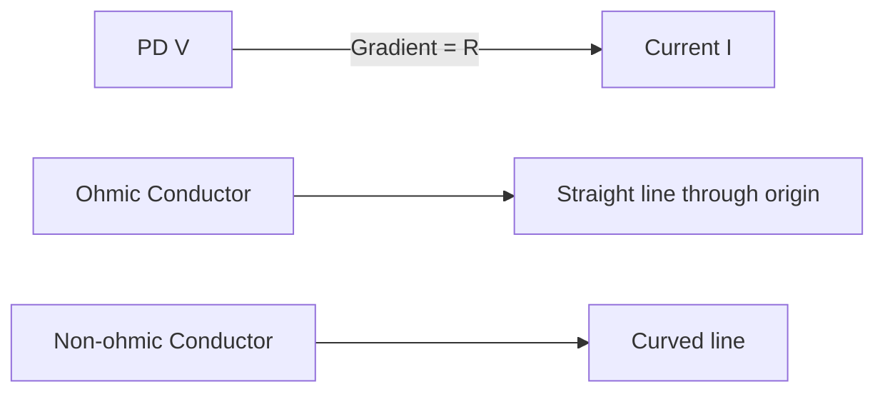

# 1. Overview / 概述

**English:**
Potential Difference (PD) is a fundamental concept in electricity that describes the energy transferred per unit charge as charge moves between two points in a circuit. This sub-topic covers the definition, measurement, and application of PD in electrical circuits. Understanding PD is essential for analyzing circuit behavior, calculating energy transfers, and distinguishing it from [[Electromotive Force (EMF)]]. PD is measured in volts (V) and is directly related to [[Electric Current and Charge]] through the energy transfer process. This concept forms the foundation for more advanced topics like [[Resistance and Resistivity]] and [[Kirchhoff's Laws]].

**中文:**
电势差（Potential Difference, PD）是电学中的一个基本概念，描述了电荷在电路中两点之间移动时每单位电荷转移的能量。本子知识点涵盖电势差的定义、测量及其在电路中的应用。理解电势差对于分析电路行为、计算能量转移以及将其与[[Electromotive Force (EMF)]]区分开来至关重要。电势差以伏特（V）为单位测量，并通过能量转移过程与[[Electric Current and Charge]]直接相关。这个概念构成了[[Resistance and Resistivity]]和[[Kirchhoff's Laws]]等更高级主题的基础。

---

# 2. Syllabus Learning Objectives / 考纲学习目标

| CAIE 9702 (9.2 a-e) | Edexcel IAL (WPH11 U2: 3.5-3.8) |
|-----------|-------------|
| Define potential difference (PD) | Define potential difference as the work done per unit charge |
| Recall and use the equation $V = W/Q$ | Use the equation $V = W/Q$ to solve problems |
| Describe how to measure PD using a voltmeter | Explain how a voltmeter is connected in parallel to measure PD |
| Explain energy transfer in terms of PD | Relate PD to energy transfer in circuits |
| Distinguish between PD and EMF | Distinguish between PD and [[Electromotive Force (EMF)]] |

**Examiner Expectations / 考官期望:**
- **English:** Students must be able to define PD precisely as "work done per unit charge" and apply the formula $V = W/Q$ in calculations. They should understand that a voltmeter must be connected in parallel across the component being measured. Common mistakes include confusing PD with EMF or incorrectly connecting a voltmeter in series.
- **中文:** 学生必须能够精确定义电势差为"每单位电荷所做的功"，并应用公式 $V = W/Q$ 进行计算。他们应理解电压表必须与被测元件并联连接。常见错误包括混淆电势差与电动势，或将电压表错误地串联连接。

---

# 3. Core Definitions / 核心定义

| Term (EN/CN) | Definition (EN) | Definition (CN) | Common Mistakes / 常见错误 |
|--------------|-----------------|-----------------|---------------------------|
| **Potential Difference (PD)** / 电势差 | The work done per unit charge when charge moves between two points in a circuit. | 电荷在电路中两点之间移动时，每单位电荷所做的功。 | Confusing PD with EMF — PD is energy *dissipated* per unit charge, while EMF is energy *supplied* per unit charge. |
| **Volt (V)** / 伏特 | The unit of PD; 1 volt = 1 joule per coulomb (1 V = 1 J/C). | 电势差的单位；1伏特 = 1焦耳/库仑。 | Thinking voltage is a force — it's energy per charge, not a force. |
| **Work Done (W)** / 功 | The energy transferred when charge moves through a PD. | 电荷通过电势差时转移的能量。 | Forgetting that work done equals energy transferred in electrical contexts. |
| **Voltmeter** / 电压表 | A device used to measure PD, connected in parallel across a component. | 用于测量电势差的仪器，与被测元件并联连接。 | Connecting a voltmeter in series instead of parallel. |
| **Terminal PD** / 端电压 | The PD across the terminals of a power supply when current is flowing. | 当有电流流动时电源两端的电势差。 | Confusing terminal PD with [[Electromotive Force (EMF)]] — terminal PD is less than EMF due to internal resistance. |

---

# 4. Key Concepts Explained / 关键概念详解

## 4.1 Definition of Potential Difference / 电势差的定义

### Explanation / 解释
**English:**
Potential Difference (PD) is defined as the **work done per unit charge** when charge moves between two points in a circuit. Mathematically, this is expressed as:

$$ V = \frac{W}{Q} $$

Where:
- $V$ = potential difference (volts, V)
- $W$ = work done or energy transferred (joules, J)
- $Q$ = charge (coulombs, C)

PD represents the **energy dissipated** (converted to other forms like heat, light, or motion) as charge flows through a component. For example, when charge passes through a resistor, electrical energy is converted to thermal energy — the PD across the resistor quantifies this energy transfer per unit charge.

**中文:**
电势差定义为电荷在电路中两点之间移动时**每单位电荷所做的功**。数学上表示为：

$$ V = \frac{W}{Q} $$

其中：
- $V$ = 电势差（伏特，V）
- $W$ = 功或转移的能量（焦耳，J）
- $Q$ = 电荷（库仑，C）

电势差表示电荷通过元件时**耗散的能量**（转化为其他形式，如热、光或运动）。例如，当电荷通过电阻器时，电能转化为热能——电阻器两端的电势差量化了每单位电荷的能量转移。

### Physical Meaning / 物理意义
**English:**
Physically, PD is a measure of the **electrical pressure difference** between two points. A higher PD means more energy is available to be transferred per unit charge. When a charge of 1 C moves through a PD of 1 V, 1 J of energy is transferred. PD is always measured **across** a component (between two points), not through it.

**中文:**
从物理意义上讲，电势差是两点之间**电势差**的量度。更高的电势差意味着每单位电荷可转移的能量更多。当1库仑的电荷通过1伏特的电势差时，转移1焦耳的能量。电势差总是**跨过**元件（两点之间）测量的，而不是通过它。

### Common Misconceptions / 常见误区
- **English:**
  - ❌ "PD is the same as current" — PD is energy per charge; current is charge per time.
  - ❌ "PD is a force" — PD is energy per charge, not a force (which is measured in newtons).
  - ❌ "A voltmeter measures current" — A voltmeter measures PD and must be connected in parallel.
- **中文:**
  - ❌ "电势差和电流一样" — 电势差是每单位电荷的能量；电流是单位时间的电荷量。
  - ❌ "电势差是一种力" — 电势差是每单位电荷的能量，不是力（力以牛顿为单位）。
  - ❌ "电压表测量电流" — 电压表测量电势差，必须并联连接。

### Exam Tips / 考试提示
- **English:**
  - Always use the formula $V = W/Q$ when calculating PD from energy and charge.
  - Remember: PD is measured **across** components (parallel connection), while current is measured **through** components (series connection).
  - In circuit diagrams, a voltmeter is represented by a circle with a V inside, connected in parallel.
- **中文:**
  - 从能量和电荷计算电势差时，始终使用公式 $V = W/Q$。
  - 记住：电势差是**跨过**元件测量的（并联），而电流是**通过**元件测量的（串联）。
  - 在电路图中，电压表用内含V的圆圈表示，并联连接。

> 📷 **IMAGE PROMPT — PD01: Potential Difference Definition Diagram**
> A simple circuit showing a battery connected to a resistor. Two points A and B are marked across the resistor. An arrow shows charge Q flowing from A to B. A label indicates "PD = V = W/Q" with W representing energy transferred. A voltmeter is shown connected in parallel across the resistor. Clean, educational style with clear labels in English.

---

## 4.2 Measuring Potential Difference / 测量电势差

### Explanation / 解释
**English:**
PD is measured using a **voltmeter**, which must be connected **in parallel** with the component across which the PD is to be measured. The voltmeter has a very high internal resistance to ensure it draws minimal current from the circuit, thus not affecting the PD being measured.

For a component like a resistor or lamp, the voltmeter is connected across its terminals. For a power supply, the voltmeter is connected across its output terminals to measure the terminal PD.

**中文:**
电势差使用**电压表**测量，电压表必须**并联**连接到要测量电势差的元件两端。电压表具有非常高的内阻，以确保从电路中吸取的电流最小，从而不影响被测量的电势差。

对于电阻器或灯泡等元件，电压表连接在其两端。对于电源，电压表连接在其输出端以测量端电压。

### Physical Meaning / 物理意义
**English:**
The voltmeter measures the energy difference per unit charge between its two probes. A reading of 5 V means that each coulomb of charge passing through the component transfers 5 J of energy.

**中文:**
电压表测量其两个探针之间每单位电荷的能量差。读数为5伏特意味着每库仑电荷通过该元件时转移5焦耳的能量。

### Common Misconceptions / 常见误区
- **English:**
  - ❌ "Connect a voltmeter in series" — This would break the circuit and give incorrect readings.
  - ❌ "A voltmeter has low resistance" — Voltmeters have very high resistance to avoid drawing current.
- **中文:**
  - ❌ "将电压表串联连接" — 这会断开电路并给出错误读数。
  - ❌ "电压表电阻很低" — 电压表具有非常高的电阻以避免吸取电流。

### Exam Tips / 考试提示
- **English:**
  - In exam questions, always draw the voltmeter in parallel across the component.
  - Remember: Voltmeter → Parallel; Ammeter → Series.
  - For ideal voltmeters, assume infinite resistance (no current flows through them).
- **中文:**
  - 在考试题目中，始终将电压表并联绘制在元件两端。
  - 记住：电压表 → 并联；电流表 → 串联。
  - 对于理想电压表，假设电阻无穷大（没有电流通过它们）。

---

## 4.3 Energy Transfer and PD / 能量转移与电势差

### Explanation / 解释
**English:**
When charge flows through a component with a PD across it, electrical energy is transferred to other forms. The energy transferred ($E$) is given by:

$$ E = V \times Q $$

Where:
- $E$ = energy transferred (joules, J)
- $V$ = potential difference (volts, V)
- $Q$ = charge (coulombs, C)

Since $Q = I \times t$ (from [[Electric Current and Charge]]), we can also write:

$$ E = V \times I \times t $$

This shows that the energy transferred depends on the PD, the current, and the time for which the current flows.

**中文:**
当电荷通过两端有电势差的元件时，电能转化为其他形式。转移的能量（$E$）由下式给出：

$$ E = V \times Q $$

其中：
- $E$ = 转移的能量（焦耳，J）
- $V$ = 电势差（伏特，V）
- $Q$ = 电荷（库仑，C）

由于 $Q = I \times t$（来自[[Electric Current and Charge]]），我们也可以写成：

$$ E = V \times I \times t $$

这表明转移的能量取决于电势差、电流和电流流动的时间。

### Physical Meaning / 物理意义
**English:**
A component with a larger PD across it transfers more energy per unit charge. For example, a 12 V lamp transfers 12 J of energy for each coulomb of charge passing through it, while a 6 V lamp transfers only 6 J per coulomb.

**中文:**
两端电势差较大的元件每单位电荷转移的能量更多。例如，12伏特的灯泡每通过1库仑电荷转移12焦耳的能量，而6伏特的灯泡每库仑只转移6焦耳。

### Common Misconceptions / 常见误区
- **English:**
  - ❌ "Energy transferred depends only on PD" — It also depends on charge (or current and time).
  - ❌ "PD is the same as power" — PD is energy per charge; power is energy per time ($P = VI$).
- **中文:**
  - ❌ "转移的能量只取决于电势差" — 它还取决于电荷（或电流和时间）。
  - ❌ "电势差和功率一样" — 电势差是每单位电荷的能量；功率是单位时间的能量（$P = VI$）。

### Exam Tips / 考试提示
- **English:**
  - Use $E = VQ$ when charge is given directly.
  - Use $E = VIt$ when current and time are given.
  - Remember: $P = VI$ (power) is derived from $E = VIt$ divided by time.
- **中文:**
  - 当直接给出电荷时，使用 $E = VQ$。
  - 当给出电流和时间时，使用 $E = VIt$。
  - 记住：$P = VI$（功率）由 $E = VIt$ 除以时间推导而来。

---

# 5. Essential Equations / 核心公式

## 5.1 Definition of PD / 电势差的定义

$$ V = \frac{W}{Q} $$

| Symbol (符号) | Meaning (EN) | Meaning (CN) | Unit (单位) |
|--------------|-------------|-------------|------------|
| $V$ | Potential difference | 电势差 | V (volt / 伏特) |
| $W$ | Work done / energy transferred | 功 / 转移的能量 | J (joule / 焦耳) |
| $Q$ | Electric charge | 电荷 | C (coulomb / 库仑) |

**Derivation / 推导:**
This is the **definition** of PD, not derived from other equations. It comes from the concept that PD is the energy transferred per unit charge.

**Conditions / 适用条件:**
- **English:** Applies to any two points in a circuit where charge flows. Assumes uniform energy transfer per unit charge.
- **中文:** 适用于电路中电荷流动的任何两点。假设每单位电荷的能量转移是均匀的。

**Limitations / 局限性:**
- **English:** Does not account for energy losses due to internal resistance in power supplies. For real circuits, the terminal PD is less than the [[Electromotive Force (EMF)]].
- **中文:** 不考虑电源内阻导致的能量损失。对于实际电路，端电压小于[[Electromotive Force (EMF)]]。

## 5.2 Energy Transfer / 能量转移

$$ E = V \times Q $$

| Symbol (符号) | Meaning (EN) | Meaning (CN) | Unit (单位) |
|--------------|-------------|-------------|------------|
| $E$ | Energy transferred | 转移的能量 | J (joule / 焦耳) |
| $V$ | Potential difference | 电势差 | V (volt / 伏特) |
| $Q$ | Electric charge | 电荷 | C (coulomb / 库仑) |

**Derivation / 推导:**
Rearranging $V = W/Q$ gives $W = V \times Q$, where $W$ is the work done (energy transferred).

**Conditions / 适用条件:**
- **English:** Valid for any component with a constant PD. For varying PD, use average values.
- **中文:** 适用于具有恒定电势差的任何元件。对于变化的电势差，使用平均值。

**Limitations / 局限性:**
- **English:** Assumes all electrical energy is converted to other forms (no energy storage in the component).
- **中文:** 假设所有电能都转化为其他形式（元件中没有能量储存）。

## 5.3 Energy Transfer with Current / 含电流的能量转移

$$ E = V \times I \times t $$

| Symbol (符号) | Meaning (EN) | Meaning (CN) | Unit (单位) |
|--------------|-------------|-------------|------------|
| $E$ | Energy transferred | 转移的能量 | J (joule / 焦耳) |
| $V$ | Potential difference | 电势差 | V (volt / 伏特) |
| $I$ | Electric current | 电流 | A (ampere / 安培) |
| $t$ | Time | 时间 | s (second / 秒) |

**Derivation / 推导:**
From $E = VQ$ and $Q = It$ (from [[Electric Current and Charge]]), substituting gives $E = V \times I \times t$.

**Conditions / 适用条件:**
- **English:** Valid for constant current and PD. For varying values, use average or integrate.
- **中文:** 适用于恒定电流和电势差。对于变化的值，使用平均值或积分。

**Limitations / 局限性:**
- **English:** Does not account for energy losses in the circuit (e.g., heating in wires).
- **中文:** 不考虑电路中的能量损失（例如，导线中的发热）。

> 📷 **IMAGE PROMPT — PD02: Energy Transfer Formula Diagram**
> A diagram showing a battery connected to a light bulb. Arrows indicate charge flow. Labels show: "V = 6 V" across the bulb, "I = 2 A" through the circuit, "t = 5 s". A calculation box shows "E = V × I × t = 6 × 2 × 5 = 60 J". Educational style with clear annotations.

---

# 6. Graphs and Relationships / 图表与关系

## 6.1 PD vs Current for a Resistor / 电阻器的电势差-电流关系

### Axes / 坐标轴
- **X-axis:** Current, $I$ (A) / 电流 $I$（安培）
- **Y-axis:** Potential Difference, $V$ (V) / 电势差 $V$（伏特）

### Shape / 形状
- **English:** A straight line through the origin for an ohmic conductor (constant resistance). The gradient equals the resistance ($R = V/I$).
- **中文:** 对于欧姆导体（恒定电阻），是一条通过原点的直线。斜率等于电阻（$R = V/I$）。

### Gradient Meaning / 斜率含义
- **English:** The gradient of the $V$-$I$ graph is the **resistance** of the component ($R = \Delta V / \Delta I$).
- **中文:** $V$-$I$ 图的斜率是元件的**电阻**（$R = \Delta V / \Delta I$）。

### Area Meaning / 面积含义
- **English:** The area under a $V$-$I$ graph does not have a direct physical meaning. However, the product $V \times I$ gives power ($P$).
- **中文:** $V$-$I$ 图下的面积没有直接的物理意义。然而，乘积 $V \times I$ 给出功率（$P$）。

### Exam Interpretation / 考试解读
- **English:** If the graph is a straight line through the origin, the component obeys Ohm's law. If it curves, the resistance changes (e.g., due to temperature changes in a filament lamp).
- **中文:** 如果图形是通过原点的直线，则该元件遵循欧姆定律。如果弯曲，则电阻变化（例如，由于灯丝温度变化）。

---

# 7. Required Diagrams / 必备图表

## 7.1 Voltmeter Connection Diagram / 电压表连接图

### Description / 描述
**English:**
A circuit diagram showing a battery, a resistor, and a voltmeter connected in parallel across the resistor. The voltmeter is represented by a circle with a V inside. The circuit also includes an ammeter in series to measure current.

**中文:**
一个电路图，显示电池、电阻器和并联连接在电阻器两端的电压表。电压表用内含V的圆圈表示。电路还包括一个串联的电流表以测量电流。

### Image Prompt / 图片生成提示
> 📷 **IMAGE PROMPT — PD03: Voltmeter Connection Circuit**
> A clear circuit diagram with a battery (two parallel lines, longer positive), a resistor (zigzag symbol), and a voltmeter (circle with V) connected in parallel across the resistor. An ammeter (circle with A) is in series with the resistor. Arrows show current direction from positive to negative terminal. Labels: "Voltmeter (parallel)", "Ammeter (series)", "Resistor". Clean educational style, black on white background.

### Labels Required / 需要标注
- **English:** Battery, Resistor, Voltmeter (V), Ammeter (A), Current direction
- **中文:** 电池、电阻器、电压表（V）、电流表（A）、电流方向

### Exam Importance / 考试重要性
- **English:** High — Students are frequently asked to draw or interpret circuits with voltmeters. Correct connection is essential for accurate measurements.
- **中文:** 高 — 学生经常被要求绘制或解释带有电压表的电路。正确连接对于准确测量至关重要。

## 7.2 PD Across Components in Series / 串联元件两端的电势差

### Description / 描述
**English:**
A circuit with two resistors in series connected to a battery. Voltmeters are connected across each resistor and across the battery. This diagram illustrates that the sum of PDs across individual components equals the total PD supplied by the battery (Kirchhoff's voltage law).

**中文:**
一个电路，两个电阻器串联连接到电池。电压表连接在每个电阻器两端和电池两端。该图说明各个元件两端的电势差之和等于电池提供的总电势差（基尔霍夫电压定律）。

### Image Prompt / 图片生成提示
> 📷 **IMAGE PROMPT — PD04: PD in Series Circuit**
> A circuit diagram with a battery and two resistors (R1 and R2) in series. Three voltmeters: V1 across R1, V2 across R2, and V_total across the battery. Labels show: "V_total = V1 + V2". Arrows indicate current flow. Clean educational style with clear component labels and voltage readings.

### Labels Required / 需要标注
- **English:** Battery, R1, R2, V1, V2, V_total, Current direction
- **中文:** 电池、R1、R2、V1、V2、V_total、电流方向

### Exam Importance / 考试重要性
- **English:** High — Understanding PD distribution in series circuits is fundamental for circuit analysis and [[Kirchhoff's Laws]].
- **中文:** 高 — 理解串联电路中的电势差分布对于电路分析和[[Kirchhoff's Laws]]至关重要。

---

# 8. Worked Examples / 典型例题

## Example 1: Calculating PD from Energy and Charge / 从能量和电荷计算电势差

### Question / 题目
**English:**
A charge of 25 C flows through a component, and 150 J of electrical energy is converted to thermal energy. Calculate the potential difference across the component.

**中文:**
25库仑的电荷通过一个元件，150焦耳的电能转化为热能。计算该元件两端的电势差。

### Solution / 解答
**Step 1:** Identify the known quantities.
- $Q = 25 \text{ C}$
- $W = 150 \text{ J}$

**Step 2:** Use the definition of PD: $V = \frac{W}{Q}$

**Step 3:** Substitute the values:
$$ V = \frac{150}{25} = 6 \text{ V} $$

**Step 4:** State the answer with units.

### Final Answer / 最终答案
**Answer:** 6 V | **答案：** 6伏特

### Quick Tip / 提示
- **English:** Always check units: energy in joules (J), charge in coulombs (C), PD in volts (V). If units are different, convert first.
- **中文:** 始终检查单位：能量用焦耳（J），电荷用库仑（C），电势差用伏特（V）。如果单位不同，先进行转换。

---

## Example 2: Calculating Energy Transferred / 计算转移的能量

### Question / 题目
**English:**
A 12 V lamp carries a current of 0.5 A for 2 minutes. Calculate the energy transferred by the lamp.

**中文:**
一个12伏特的灯泡承载0.5安培的电流，持续2分钟。计算灯泡转移的能量。

### Solution / 解答
**Step 1:** Identify the known quantities.
- $V = 12 \text{ V}$
- $I = 0.5 \text{ A}$
- $t = 2 \text{ minutes} = 2 \times 60 = 120 \text{ s}$

**Step 2:** Use the formula $E = V \times I \times t$

**Step 3:** Substitute the values:
$$ E = 12 \times 0.5 \times 120 = 720 \text{ J} $$

**Step 4:** State the answer with units.

### Final Answer / 最终答案
**Answer:** 720 J | **答案：** 720焦耳

### Quick Tip / 提示
- **English:** Always convert time to seconds before using the formula. Watch out for minutes, hours, or other time units.
- **中文:** 在使用公式前，始终将时间转换为秒。注意分钟、小时或其他时间单位。

---

# 9. Past Paper Question Types / 历年真题题型

| Question Type / 题型 | Frequency / 频率 | Difficulty / 难度 | Past Paper References / 真题索引 |
|----------------------|------------------|------------------|-------------------------------|
| Definition of PD (short answer) | High | Easy | 📝 *待填入* |
| Calculation using $V = W/Q$ | High | Easy-Medium | 📝 *待填入* |
| Calculation using $E = VIt$ | High | Medium | 📝 *待填入* |
| Voltmeter connection (circuit diagram) | Medium | Easy | 📝 *待填入* |
| Distinguishing PD from EMF | Medium | Medium | 📝 *待填入* |
| PD in series/parallel circuits | High | Medium-Hard | 📝 *待填入* |

**Common Command Words / 常见指令词:**
- **English:** Define, Calculate, Determine, State, Explain, Sketch, Draw
- **中文:** 定义、计算、确定、陈述、解释、绘制、画出

---

# 10. Practical Skills Connections / 实验技能链接

**English:**
This sub-topic connects to practical work in several ways:

1. **Measuring PD:** Students must be able to connect a voltmeter correctly in parallel and read its scale. This is tested in Paper 3 (CAIE) and practical exams (Edexcel).

2. **Investigating PD in circuits:** Common experiments include measuring PD across different components in series and parallel circuits to verify Kirchhoff's voltage law.

3. **Determining resistance:** By measuring PD and current, students can calculate resistance using $R = V/I$ (see [[Resistance and Resistivity]]).

4. **Uncertainty analysis:** When measuring PD, students should consider the uncertainty in voltmeter readings (typically ± half the smallest division) and calculate percentage uncertainties.

5. **Graph plotting:** Students may plot $V$ vs $I$ graphs to determine resistance from the gradient.

**中文:**
本子知识点通过多种方式与实验工作联系：

1. **测量电势差：** 学生必须能够正确并联连接电压表并读取其刻度。这在CAIE的Paper 3和Edexcel的实验考试中测试。

2. **研究电路中的电势差：** 常见实验包括测量串联和并联电路中不同元件两端的电势差，以验证基尔霍夫电压定律。

3. **确定电阻：** 通过测量电势差和电流，学生可以使用 $R = V/I$ 计算电阻（参见[[Resistance and Resistivity]]）。

4. **不确定度分析：** 测量电势差时，学生应考虑电压表读数的不确定度（通常为±最小刻度的一半）并计算百分比不确定度。

5. **图表绘制：** 学生可能绘制 $V$ vs $I$ 图，从斜率确定电阻。

---

# 11. Concept Map / 概念图谱

```mermaid
graph TD
    PD[Potential Difference PD] -->|Defined as| Def[Work done per unit charge]
    PD -->|Formula| V_eq[V = W/Q]
    PD -->|Measured by| VM[Voltmeter - parallel connection]
    PD -->|Related to| Energy[Energy Transfer E = VQ = VIt]
    PD -->|Related to| Current[Electric Current I = Q/t]
    PD -->|Related to| Resistance[Resistance R = V/I]
    PD -->|Distinguished from| EMF[Electromotive Force EMF]
    PD -->|Applied in| KVL[Kirchhoff's Voltage Law]
    PD -->|Applied in| Series[Series Circuits - PD divides]
    PD -->|Applied in| Parallel[Parallel Circuits - PD same]
    
    style PD fill:#4a90d9,color:#fff
    style Def fill:#f0f0f0,stroke:#333
    style V_eq fill:#f0f0f0,stroke:#333
    style VM fill:#f0f0f0,stroke:#333
    style Energy fill:#f0f0f0,stroke:#333
    style Current fill:#f0f0f0,stroke:#333
    style Resistance fill:#f0f0f0,stroke:#333
    style EMF fill:#f0f0f0,stroke:#333
    style KVL fill:#f0f0f0,stroke:#333
    style Series fill:#f0f0f0,stroke:#333
    style Parallel fill:#f0f0f0,stroke:#333
```

---

# 12. Quick Revision Sheet / 速查表

| Category / 类别 | Key Points / 要点 |
|----------------|------------------|
| **Definition / 定义** | PD = work done per unit charge / 电势差 = 每单位电荷所做的功 |
| **Key Formula / 核心公式** | $V = \frac{W}{Q}$, $E = VQ = VIt$ |
| **Unit / 单位** | Volt (V) = J/C / 伏特 (V) = 焦耳/库仑 |
| **Measurement / 测量** | Voltmeter in parallel / 电压表并联连接 |
| **Key Graph / 核心图表** | $V$ vs $I$: straight line through origin for ohmic conductors / $V$ vs $I$：欧姆导体为通过原点的直线 |
| **Common Mistake / 常见错误** | Confusing PD with EMF; connecting voltmeter in series / 混淆电势差与电动势；串联连接电压表 |
| **Energy Transfer / 能量转移** | $E = V \times Q$ — energy depends on PD and charge / $E = V \times Q$ — 能量取决于电势差和电荷 |
| **Exam Tip / 考试提示** | Always convert time to seconds; check units / 始终将时间转换为秒；检查单位 |
| **Related Topics / 相关主题** | [[Electromotive Force (EMF)]], [[Resistance and Resistivity]], [[Kirchhoff's Laws]] |
| **Prerequisites / 先决条件** | [[Electric Current and Charge]] |