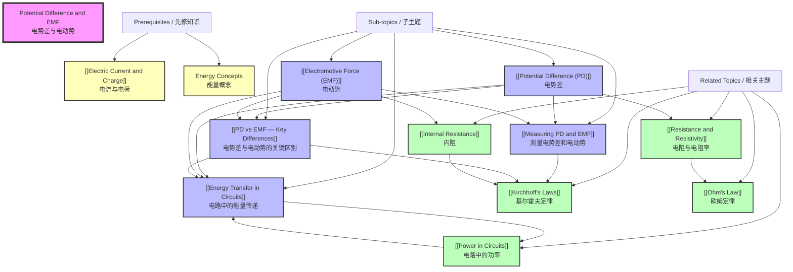

# 1. Overview / 概述

**English:**
This topic introduces two fundamental concepts in electricity: **Potential Difference (PD)** and **Electromotive Force (EMF)** . These concepts are central to understanding how energy is transferred in electric circuits. Potential Difference (often called voltage) is the energy transferred per unit charge between two points in a circuit, while Electromotive Force is the energy supplied per unit charge by a source such as a battery or generator.

Understanding PD and EMF is crucial because they explain why circuits work — why bulbs light, why motors turn, and why energy is conserved in electrical systems. In real-world applications, these concepts underpin everything from household wiring (230 V mains supply) to battery technology (1.5 V cells, 12 V car batteries) and power generation.

In both Cambridge 9702 and Edexcel IAL examinations, this topic appears frequently in multiple-choice questions, structured calculations, and practical-based questions. It forms the foundation for more advanced topics like [[Resistance and Resistivity]], [[Kirchhoff's Laws]], and internal resistance. A strong grasp of PD and EMF is essential for achieving high marks in AS-level electricity papers.

**中文：**
本主题介绍电学中的两个基本概念：**电势差（PD）** 和 **电动势（EMF）** 。这些概念是理解电路中能量如何传递的核心。电势差（常称为电压）是电路中两点之间每单位电荷传递的能量，而电动势是电池或发电机等电源每单位电荷提供的能量。

理解电势差和电动势至关重要，因为它们解释了电路为何工作——为何灯泡发光、为何电机转动、为何能量在电气系统中守恒。在实际应用中，这些概念支撑着从家庭布线（230 V 市电电源）到电池技术（1.5 V 电池、12 V 汽车电池）和发电的一切。

在剑桥 9702 和爱德思 IAL 考试中，本主题频繁出现在选择题、结构化计算题和实验题中。它构成了更高级主题如 [[电阻与电阻率]]、[[基尔霍夫定律]] 和内阻的基础。扎实掌握电势差和电动势对于在 AS 级电学试卷中取得高分至关重要。

---

# 2. Syllabus Learning Objectives / 考纲学习目标

| CAIE 9702 | Edexcel IAL |
|-----------|-------------|
| 9.2(a) Define potential difference (PD) and electromotive force (EMF) | 3.5 Define potential difference (PD) and electromotive force (EMF) |
| 9.2(b) Recall and use $V = W/Q$ | 3.6 Use $V = W/Q$ and $E = W/Q$ |
| 9.2(c) Recall and use $E = W/Q$ | 3.7 Distinguish between EMF and PD |
| 9.2(d) Distinguish between EMF and PD | 3.8 Explain energy transfer in circuits using PD and EMF |
| 9.2(e) Show understanding of the difference between EMF and PD in terms of energy transfer | — |

**Examiner Expectations / 考官期望：**

**English:**
- Candidates must be able to state the **definitions** of PD and EMF **exactly** as given in the syllabus — examiners are strict about wording.
- Candidates must be able to **distinguish** between PD and EMF in terms of energy transfer direction and location in the circuit.
- Candidates must be able to **calculate** PD, EMF, charge, and energy using $V = W/Q$ and $E = W/Q$.
- Candidates must understand that **EMF is the energy supplied per unit charge** by a source, while **PD is the energy dissipated per unit charge** across a component.
- Candidates should be able to explain that **EMF is measured across the terminals of a source when no current flows** (open circuit), while **PD is measured across a component when current flows**.

**中文：**
- 考生必须能够**准确**陈述电势差和电动势的定义，如考纲所述——考官对措辞要求严格。
- 考生必须能够根据能量传递方向和电路中的位置**区分**电势差和电动势。
- 考生必须能够使用 $V = W/Q$ 和 $E = W/Q$ **计算**电势差、电动势、电荷和能量。
- 考生必须理解**电动势是电源每单位电荷提供的能量**，而**电势差是元件每单位电荷耗散的能量**。
- 考生应能够解释**电动势是在无电流流动时（开路）在电源两端测量的**，而**电势差是在有电流流动时在元件两端测量的**。

> 📋 **CIE Only:** CAIE specifically requires candidates to "show understanding of the difference between EMF and PD in terms of energy transfer" — this means you must be able to write a paragraph explaining the difference using energy transfer language.
>
> 📋 **Edexcel Only:** Edexcel explicitly lists "distinguish between EMF and PD" as a separate learning objective (3.7) and requires practical skills in measuring both quantities.

---

# 3. Core Definitions / 核心定义

| Term (EN/CN) | Definition (EN) | Definition (CN) | Common Mistakes / 常见错误 |
|--------------|-----------------|-----------------|---------------------------|
| **Potential Difference (PD)** / 电势差 | The energy transferred per unit charge when electrical energy is converted into other forms of energy as charge passes through a component. $V = W/Q$ | 电荷通过元件时，电能转化为其他形式能量时每单位电荷传递的能量。$V = W/Q$ | ❌ Saying "voltage drop" without defining energy transfer. ❌ Confusing PD with EMF. ❌ Forgetting that PD is measured **across** a component. |
| **Electromotive Force (EMF)** / 电动势 | The energy transferred per unit charge from chemical (or other) energy to electrical energy when charge passes through a source. $E = W/Q$ | 电荷通过电源时，从化学能（或其他能量）转化为电能时每单位电荷传递的能量。$E = W/Q$ | ❌ Calling it "voltage" — EMF is not the same as voltage. ❌ Thinking EMF is the maximum PD across a source (it is, but only under open-circuit conditions). ❌ Forgetting that EMF is measured **across the source** when no current flows. |
| **Volt** / 伏特 | The unit of PD and EMF. 1 volt = 1 joule per coulomb (1 V = 1 J C⁻¹) | 电势差和电动势的单位。1 伏特 = 1 焦耳每库仑（1 V = 1 J C⁻¹） | ❌ Confusing volt with watt (power). ❌ Not knowing the base units: V = kg m² s⁻³ A⁻¹ |
| **Energy Transfer** / 能量传递 | In a circuit: the source (battery) supplies energy (EMF), and components (bulbs, resistors) dissipate energy (PD). Energy is conserved. | 在电路中：电源（电池）提供能量（电动势），元件（灯泡、电阻）耗散能量（电势差）。能量守恒。 | ❌ Thinking energy is "used up" — it is converted, not destroyed. ❌ Not linking PD to energy dissipation and EMF to energy supply. |
| **Open Circuit** / 开路 | A circuit with no complete path for current to flow. The PD across the terminals of a source equals its EMF. | 没有完整电流路径的电路。电源两端的电势差等于其电动势。 | ❌ Thinking open circuit means "switch off" — it means no current path. ❌ Not knowing that EMF is measured under open-circuit conditions. |
| **Closed Circuit** / 闭合电路 | A complete circuit where current can flow. The PD across the terminals of a source is less than its EMF due to internal resistance. | 电流可以流动的完整电路。由于内阻，电源两端的电势差小于其电动势。 | ❌ Forgetting that PD across a source in a closed circuit is **less** than EMF. ❌ Not linking this to [[Internal Resistance]]. |

---

# 4. Key Concepts Explained / 关键概念详解

## 4.1 Potential Difference (PD) / 电势差

### Explanation / 解释
**English:**
Potential Difference (PD) is the **energy transferred per unit charge** when electrical energy is converted into other forms of energy (heat, light, sound, kinetic, etc.) as charge passes through a component. It is measured in **volts (V)** , where 1 V = 1 J C⁻¹.

When a charge $Q$ passes through a component (like a resistor or bulb), the electrical potential energy of the charge decreases by an amount $W$. This energy is transferred to the component — for example, a bulb converts electrical energy into light and heat. The PD across the component is defined as:

$$V = \frac{W}{Q}$$

Where:
- $V$ = potential difference (V)
- $W$ = energy transferred (J)
- $Q$ = charge (C)

PD is always measured **across** a component using a voltmeter connected in **parallel**. The PD across a component tells you how much energy each coulomb of charge loses as it passes through that component.

**中文：**
电势差（PD）是电荷通过元件时，电能转化为其他形式能量（热能、光能、声能、动能等）时**每单位电荷传递的能量**。它以**伏特（V）** 为单位，其中 1 V = 1 J C⁻¹。

当电荷 $Q$ 通过元件（如电阻或灯泡）时，电荷的电势能减少 $W$。这些能量被传递给元件——例如，灯泡将电能转化为光和热。元件两端的电势差定义为：

$$V = \frac{W}{Q}$$

其中：
- $V$ = 电势差（V）
- $W$ = 传递的能量（J）
- $Q$ = 电荷（C）

电势差始终使用**并联**连接的电压表在元件**两端**测量。元件两端的电势差告诉你每库仑电荷通过该元件时损失了多少能量。

### Physical Meaning / 物理意义
**English:**
Think of PD as the "energy drop" per coulomb of charge. Imagine a waterfall: the height difference represents PD — the greater the height, the more energy each kilogram of water can release. Similarly, a higher PD means each coulomb of charge can transfer more energy to the component. A 12 V bulb transfers 12 J of energy for every coulomb of charge passing through it.

**中文：**
将电势差想象为每库仑电荷的"能量降"。想象一个瀑布：高度差代表电势差——高度越大，每千克水释放的能量越多。类似地，更高的电势差意味着每库仑电荷可以向元件传递更多能量。一个 12 V 的灯泡每通过一库仑电荷就传递 12 J 的能量。

### Common Misconceptions / 常见误区
1. ❌ **"PD is the same as voltage"** — While PD is often called voltage, the term "voltage" is ambiguous. PD specifically refers to the energy transfer **across a component**.
2. ❌ **"PD is the energy"** — PD is energy **per unit charge**, not total energy. A high PD with a small charge can transfer less total energy than a low PD with a large charge.
3. ❌ **"PD is the same everywhere in a circuit"** — In a series circuit, PD is shared across components. In a parallel circuit, PD is the same across each branch.
4. ❌ **"A voltmeter measures current"** — A voltmeter measures PD, not current. It has very high resistance to draw negligible current.

### Exam Tips / 考试提示
**English:**
- When asked to "define potential difference," use the exact wording: "The energy transferred per unit charge when electrical energy is converted into other forms of energy."
- Always include the equation $V = W/Q$ in your answer.
- In calculations, ensure you use the correct units: V for PD, J for energy, C for charge.
- For circuit problems, remember that PD is measured **across** components, not through them.
- Cambridge and Edexcel often ask you to distinguish PD from EMF — be prepared to write a comparison.

**中文：**
- 当被要求"定义电势差"时，使用准确措辞："电荷通过元件时，电能转化为其他形式能量时每单位电荷传递的能量。"
- 始终在答案中包含方程 $V = W/Q$。
- 在计算中，确保使用正确的单位：V 表示电势差，J 表示能量，C 表示电荷。
- 对于电路问题，记住电势差是在元件**两端**测量的，而不是通过元件。
- 剑桥和爱德思经常要求你区分电势差和电动势——准备好写比较。

---

## 4.2 Electromotive Force (EMF) / 电动势

### Explanation / 解释
**English:**
Electromotive Force (EMF) is the **energy transferred per unit charge** from chemical (or other non-electrical forms) to electrical energy when charge passes through a source (such as a battery, cell, or generator). It is also measured in **volts (V)** .

When a charge $Q$ passes through a source, the source does work $W$ to convert non-electrical energy (chemical, mechanical, thermal, etc.) into electrical energy. The EMF of the source is defined as:

$$E = \frac{W}{Q}$$

Where:
- $E$ = electromotive force (V)
- $W$ = energy transferred from non-electrical to electrical form (J)
- $Q$ = charge (C)

EMF is measured **across the terminals of the source** using a voltmeter connected in **parallel**, but **only when no current is flowing** (open circuit). This is because when current flows, the source's [[Internal Resistance]] causes a PD drop inside the source, making the terminal PD less than the EMF.

**中文：**
电动势（EMF）是电荷通过电源（如电池、电池组或发电机）时，从化学能（或其他非电能形式）转化为电能时**每单位电荷传递的能量**。它也以**伏特（V）** 为单位。

当电荷 $Q$ 通过电源时，电源做功 $W$ 将非电能（化学能、机械能、热能等）转化为电能。电源的电动势定义为：

$$E = \frac{W}{Q}$$

其中：
- $E$ = 电动势（V）
- $W$ = 从非电能转化为电能的能量（J）
- $Q$ = 电荷（C）

电动势使用**并联**连接的电压表在**电源两端**测量，但**仅在无电流流动时（开路）** 测量。这是因为当电流流动时，电源的[[内阻]]会在电源内部引起电势差降，使得端电压小于电动势。

### Physical Meaning / 物理意义
**English:**
Think of EMF as the "energy pump" of the circuit. The source (battery) "lifts" each coulomb of charge to a higher electrical potential energy level, just as a water pump lifts water to a higher gravitational potential energy level. The EMF tells you how much energy each coulomb of charge gains from the source. A 1.5 V cell gives 1.5 J of electrical energy to every coulomb of charge passing through it.

**中文：**
将电动势想象为电路的"能量泵"。电源（电池）将每库仑电荷"提升"到更高的电势能水平，就像水泵将水提升到更高的重力势能水平一样。电动势告诉你每库仑电荷从电源获得了多少能量。一个 1.5 V 的电池给通过它的每库仑电荷提供 1.5 J 的电能。

### Common Misconceptions / 常见误区
1. ❌ **"EMF is a force"** — Despite its name, EMF is **not** a force. It is an energy per unit charge, measured in volts, not newtons.
2. ❌ **"EMF equals the terminal PD of a battery"** — This is only true when **no current flows** (open circuit). When current flows, terminal PD < EMF due to internal resistance.
3. ❌ **"EMF is the same as PD"** — EMF is energy **supplied** by the source; PD is energy **dissipated** by components. They are opposite in terms of energy transfer direction.
4. ❌ **"A higher EMF means more current"** — Current depends on both EMF and total circuit resistance ($I = E/R_{\text{total}}$). A high EMF with high resistance may produce less current than a low EMF with low resistance.

### Exam Tips / 考试提示
**English:**
- When asked to "define electromotive force," use the exact wording: "The energy transferred per unit charge from chemical (or other) energy to electrical energy when charge passes through a source."
- Always include the equation $E = W/Q$ in your answer.
- Remember that EMF is measured under **open-circuit** conditions — this is a key exam point.
- Be prepared to explain why the terminal PD of a battery is less than its EMF when current flows (due to [[Internal Resistance]]).
- Cambridge and Edexcel often ask: "Explain the difference between EMF and PD" — this is a common 2-3 mark question.

**中文：**
- 当被要求"定义电动势"时，使用准确措辞："电荷通过电源时，从化学能（或其他能量）转化为电能时每单位电荷传递的能量。"
- 始终在答案中包含方程 $E = W/Q$。
- 记住电动势是在**开路**条件下测量的——这是一个关键的考试点。
- 准备好解释为什么电池的端电压在有电流流动时小于其电动势（由于[[内阻]]）。
- 剑桥和爱德思经常问："解释电动势和电势差之间的区别"——这是一个常见的 2-3 分问题。

---

## 4.3 PD vs EMF — Key Differences / 电势差与电动势——关键区别

### Explanation / 解释
**English:**
The fundamental difference between PD and EMF lies in the **direction of energy transfer**:

| Aspect | Potential Difference (PD) | Electromotive Force (EMF) |
|--------|--------------------------|---------------------------|
| **Energy transfer** | Electrical energy → Other forms (dissipation) | Other forms → Electrical energy (supply) |
| **Location** | Across a **component** (load) | Across a **source** (battery, generator) |
| **Measurement condition** | When current flows (closed circuit) | When no current flows (open circuit) |
| **Symbol** | $V$ | $E$ or $\mathcal{E}$ |
| **Equation** | $V = W/Q$ | $E = W/Q$ |
| **Effect of internal resistance** | Not affected (component has no internal resistance) | Terminal PD < EMF when current flows |

In a complete circuit:
1. The source (battery) provides EMF — it **supplies** energy to the charges.
2. The charges carry this energy around the circuit.
3. The components (bulbs, resistors) have PD across them — they **dissipate** energy from the charges.
4. By conservation of energy: Total EMF supplied = Total PD dissipated (in a closed loop).

**中文：**
电势差和电动势之间的根本区别在于**能量传递的方向**：

| 方面 | 电势差 (PD) | 电动势 (EMF) |
|------|-------------|--------------|
| **能量传递** | 电能 → 其他形式（耗散） | 其他形式 → 电能（供应） |
| **位置** | 在**元件**（负载）两端 | 在**电源**（电池、发电机）两端 |
| **测量条件** | 有电流流动时（闭合电路） | 无电流流动时（开路） |
| **符号** | $V$ | $E$ 或 $\mathcal{E}$ |
| **方程** | $V = W/Q$ | $E = W/Q$ |
| **内阻的影响** | 不受影响（元件无内阻） | 有电流时端电压 < 电动势 |

在完整电路中：
1. 电源（电池）提供电动势——它向电荷**供应**能量。
2. 电荷携带这些能量在电路中移动。
3. 元件（灯泡、电阻）两端有电势差——它们从电荷中**耗散**能量。
4. 根据能量守恒：总电动势供应 = 总电势差耗散（在闭合回路中）。

### Physical Meaning / 物理意义
**English:**
Imagine a water circuit with a pump and a water wheel:
- The **pump** (source) adds energy to the water — this is like **EMF**.
- The **water wheel** (component) takes energy from the water — this is like **PD**.
- The pump's "lifting power" is the EMF; the wheel's "energy extraction" is the PD.

**中文：**
想象一个带有水泵和水轮的水路：
- **水泵**（电源）向水添加能量——这就像**电动势**。
- **水轮**（元件）从水中获取能量——这就像**电势差**。
- 水泵的"提升能力"是电动势；水轮的"能量提取"是电势差。

### Common Misconceptions / 常见误区
1. ❌ **"EMF and PD are the same thing"** — They are both measured in volts and both involve energy per unit charge, but they describe opposite energy transfer processes.
2. ❌ **"EMF is always greater than PD"** — EMF of a source is always greater than the **terminal PD** of that source when current flows, but the PD across a component can be any value depending on the circuit.
3. ❌ **"PD is always positive"** — PD can be negative if measured in the opposite direction (e.g., across a source in a charging circuit).

### Exam Tips / 考试提示
**English:**
- This is one of the most common exam questions in AS electricity. Be prepared to write a clear comparison.
- Use the energy transfer direction as your main distinguishing point.
- Mention that EMF is measured under open-circuit conditions; PD is measured under closed-circuit conditions.
- For higher marks, mention [[Internal Resistance]] and how it causes terminal PD to be less than EMF.
- Draw a simple circuit diagram to illustrate the difference.

**中文：**
- 这是 AS 电学中最常见的考试问题之一。准备好写一个清晰的比较。
- 使用能量传递方向作为主要区分点。
- 提到电动势是在开路条件下测量的；电势差是在闭合电路条件下测量的。
- 为了获得更高分数，提到[[内阻]]以及它如何导致端电压小于电动势。
- 画一个简单的电路图来说明区别。

---

## 4.4 Energy Transfer in Circuits / 电路中的能量传递

### Explanation / 解释
**English:**
In an electric circuit, energy is transferred from the source to the components. The process can be understood as follows:

1. **Source (Battery/Cell):** Chemical energy is converted into electrical energy. The EMF $E$ of the source tells us how much energy is given to each coulomb of charge: $E = W_{\text{supplied}}/Q$.

2. **Wires:** Ideally, wires have negligible resistance, so no energy is transferred in the wires. The charges travel at constant electrical potential along the wires.

3. **Components (Loads):** Electrical energy is converted into other forms (heat, light, sound, etc.). The PD $V$ across each component tells us how much energy is transferred per coulomb: $V = W_{\text{dissipated}}/Q$.

4. **Energy Conservation:** In a complete circuit, the total energy supplied by the source equals the total energy dissipated by all components:
   $$E_{\text{source}} = V_1 + V_2 + V_3 + \dots$$
   (For a series circuit, the sum of PDs across all components equals the EMF of the source.)

5. **Power:** The rate of energy transfer is power: $P = VI = \frac{W}{t}$. This links PD and EMF to [[Power in Circuits]].

**中文：**
在电路中，能量从电源传递到元件。该过程可以理解如下：

1. **电源（电池/电池组）：** 化学能转化为电能。电源的电动势 $E$ 告诉我们每库仑电荷获得了多少能量：$E = W_{\text{供应}}/Q$。

2. **导线：** 理想情况下，导线电阻可忽略不计，因此导线中没有能量传递。电荷沿导线以恒定电势移动。

3. **元件（负载）：** 电能转化为其他形式（热能、光能、声能等）。每个元件两端的电势差 $V$ 告诉我们每库仑传递了多少能量：$V = W_{\text{耗散}}/Q$。

4. **能量守恒：** 在完整电路中，电源供应的总能量等于所有元件耗散的总能量：
   $$E_{\text{电源}} = V_1 + V_2 + V_3 + \dots$$
   （对于串联电路，所有元件两端电势差之和等于电源的电动势。）

5. **功率：** 能量传递的速率是功率：$P = VI = \frac{W}{t}$。这将电势差和电动势与[[电路中的功率]]联系起来。

### Physical Meaning / 物理意义
**English:**
Think of the circuit as a "energy delivery system":
- The battery is the "energy source" (like a power plant).
- The charges are the "energy carriers" (like delivery trucks).
- The components are the "energy users" (like factories).
- EMF is the "energy loaded per truck" at the source.
- PD is the "energy unloaded per truck" at each component.

**中文：**
将电路想象成一个"能量输送系统"：
- 电池是"能源"（像发电厂）。
- 电荷是"能量载体"（像送货卡车）。
- 元件是"能量用户"（像工厂）。
- 电动势是"每辆卡车在源头装载的能量"。
- 电势差是"每辆卡车在每个元件卸载的能量"。

### Common Misconceptions / 常见误区
1. ❌ **"Energy is used up in a circuit"** — Energy is **conserved**, not used up. It is converted from one form to another.
2. ❌ **"Current carries energy"** — Current is the flow of charge. The charges carry energy, but the energy is in the electric field, not in the charges themselves.
3. ❌ **"The battery provides current"** — The battery provides EMF (energy per charge), which drives current. Current depends on the entire circuit.

### Exam Tips / 考试提示
**English:**
- When explaining energy transfer, always mention the **conversion** of energy from one form to another.
- Use the equation $W = VQ$ or $W = EQ$ to calculate energy transferred.
- For series circuits, remember that the sum of PDs equals the EMF (Kirchhoff's Voltage Law).
- For parallel circuits, the PD across each branch is the same and equals the terminal PD of the source.
- Be prepared to calculate the energy transferred to a component given the PD and charge or current and time.

**中文：**
- 在解释能量传递时，始终提到能量从一种形式到另一种形式的**转换**。
- 使用方程 $W = VQ$ 或 $W = EQ$ 计算传递的能量。
- 对于串联电路，记住电势差之和等于电动势（基尔霍夫电压定律）。
- 对于并联电路，每个支路两端的电势差相同，等于电源的端电压。
- 准备好根据给定的电势差和电荷或电流和时间计算传递给元件的能量。

---

## 4.5 Measuring PD and EMF / 测量电势差和电动势

### Explanation / 解释
**English:**
**Measuring Potential Difference:**
- Use a **voltmeter** connected in **parallel** across the component.
- The voltmeter must have **very high resistance** (ideally infinite) so that it draws negligible current and does not affect the circuit.
- Digital voltmeters typically have resistance of 10 MΩ or higher.
- The reading gives the PD across the component when current is flowing.

**Measuring Electromotive Force:**
- Use a **voltmeter** connected in **parallel** across the terminals of the source.
- The measurement must be taken when **no current is flowing** (open circuit).
- This means the circuit must be **broken** (switch open) so that no current passes through the source.
- Under these conditions, the voltmeter reading equals the EMF of the source.
- If current flows, the voltmeter reads the **terminal PD**, which is less than the EMF due to [[Internal Resistance]].

**Practical Setup:**
> 📷 **IMAGE PROMPT — [MEAS-01]: Circuit for Measuring PD and EMF**
>
> A clear circuit diagram showing:
> - Left side: A cell (battery symbol) with a voltmeter connected across its terminals. A switch is shown in the open position. Label: "Measuring EMF (open circuit)"
> - Right side: The same cell connected to a resistor (load). A voltmeter is connected across the resistor. An ammeter is in series. Label: "Measuring PD across resistor (closed circuit)"
> - Use standard circuit symbols. Clean, educational style. Black lines on white background. Labels in English.

**中文：**
**测量电势差：**
- 使用**并联**连接在元件两端的**电压表**。
- 电压表必须具有**非常高的电阻**（理想情况下为无穷大），以便它吸取可忽略的电流并且不影响电路。
- 数字电压表通常具有 10 MΩ 或更高的电阻。
- 读数给出有电流流动时元件两端的电势差。

**测量电动势：**
- 使用**并联**连接在电源两端的**电压表**。
- 必须在**无电流流动**（开路）时进行测量。
- 这意味着电路必须**断开**（开关打开），以便没有电流通过电源。
- 在这些条件下，电压表读数等于电源的电动势。
- 如果有电流流动，电压表读数为**端电压**，由于[[内阻]]，该值小于电动势。

**实验设置：**

### Physical Meaning / 物理意义
**English:**
Measuring PD is like measuring the "energy drop" across a component while it is working. Measuring EMF is like measuring the "energy rating" of a battery when it is not supplying current — like checking the voltage of a new battery before using it.

**中文：**
测量电势差就像测量元件工作时两端的"能量降"。测量电动势就像测量电池在不供电时的"能量额定值"——就像在使用前检查新电池的电压。

### Common Misconceptions / 常见误区
1. ❌ **"A voltmeter is connected in series"** — Voltmeters are always connected in **parallel**. Connecting in series would break the circuit.
2. ❌ **"You can measure EMF with current flowing"** — No, EMF must be measured under open-circuit conditions. With current flowing, you measure terminal PD.
3. ❌ **"Any voltmeter works for measuring EMF"** — The voltmeter must have very high resistance to avoid drawing current. An ideal voltmeter has infinite resistance.

### Exam Tips / 考试提示
**English:**
- Know the difference between measuring PD and EMF — this is a common practical question.
- Remember: EMF is measured with an **open circuit** (no current); PD is measured with a **closed circuit** (current flowing).
- Be able to explain why a voltmeter must have high resistance.
- In practical exams (CAIE Paper 3/5, Edexcel Unit 3/6), you may be asked to set up circuits to measure PD and EMF.
- Understand that the voltmeter reading across a battery in a closed circuit is **less** than its EMF due to internal resistance.

**中文：**
- 知道测量电势差和电动势之间的区别——这是一个常见的实验题。
- 记住：电动势在**开路**（无电流）时测量；电势差在**闭合电路**（有电流流动）时测量。
- 能够解释为什么电压表必须具有高电阻。
- 在实验考试（CAIE Paper 3/5, Edexcel Unit 3/6）中，你可能被要求搭建电路来测量电势差和电动势。
- 理解闭合电路中电池两端的电压表读数由于内阻而**小于**其电动势。

---

# 5. Essential Equations / 核心公式

## 5.1 Potential Difference Equation / 电势差方程

**Equation / 公式:**
$$V = \frac{W}{Q}$$

**Variables / 变量:**
| Symbol (符号) | Meaning (EN) | Meaning (CN) | Unit (单位) |
|--------------|-------------|-------------|------------|
| $V$ | Potential difference | 电势差 | V (volt / 伏特) |
| $W$ | Energy transferred (work done) | 传递的能量（做功） | J (joule / 焦耳) |
| $Q$ | Charge | 电荷 | C (coulomb / 库仑) |

**Derivation / 推导:**
**English:**
Potential difference is defined as the energy transferred per unit charge. By definition:
$$V = \frac{\text{energy transferred}}{\text{charge}} = \frac{W}{Q}$$
This is a definition, not derived from other equations. However, it can be rearranged to find energy: $W = VQ$, or charge: $Q = W/V$.

**中文：**
电势差定义为每单位电荷传递的能量。根据定义：
$$V = \frac{\text{传递的能量}}{\text{电荷}} = \frac{W}{Q}$$
这是一个定义，不是从其他方程推导出来的。然而，它可以重新排列以找到能量：$W = VQ$，或电荷：$Q = W/V$。

**Conditions / 适用条件:**
**English:**
- Applies to any component in any circuit.
- $W$ is the energy converted from electrical to other forms (heat, light, etc.).
- $Q$ is the total charge passing through the component.

**中文：**
- 适用于任何电路中的任何元件。
- $W$ 是从电能转化为其他形式（热能、光能等）的能量。
- $Q$ 是通过元件的总电荷。

**Limitations / 局限性:**
**English:**
- Does not account for the rate of energy transfer (power) — use $P = VI$ for that.
- Assumes all energy is transferred to the component (no losses in connecting wires).

**中文：**
- 不考虑能量传递的速率（功率）——为此使用 $P = VI$。
- 假设所有能量都传递给了元件（连接导线中没有损耗）。

**Rearrangements / 变形:**
**English:**
- $W = VQ$ — Energy transferred = PD × charge
- $Q = \frac{W}{V}$ — Charge = Energy ÷ PD
- Combined with $Q = It$: $W = VIt$ — Energy = PD × current × time

**中文：**
- $W = VQ$ — 传递的能量 = 电势差 × 电荷
- $Q = \frac{W}{V}$ — 电荷 = 能量 ÷ 电势差
- 结合 $Q = It$：$W = VIt$ — 能量 = 电势差 × 电流 × 时间

---

## 5.2 Electromotive Force Equation / 电动势方程

**Equation / 公式:**
$$E = \frac{W}{Q}$$

**Variables / 变量:**
| Symbol (符号) | Meaning (EN) | Meaning (CN) | Unit (单位) |
|--------------|-------------|-------------|------------|
| $E$ | Electromotive force | 电动势 | V (volt / 伏特) |
| $W$ | Energy transferred from non-electrical to electrical form | 从非电能转化为电能的能量 | J (joule / 焦耳) |
| $Q$ | Charge | 电荷 | C (coulomb / 库仑) |

**Derivation / 推导:**
**English:**
EMF is defined as the energy transferred per unit charge from non-electrical to electrical form. By definition:
$$E = \frac{\text{energy supplied}}{\text{charge}} = \frac{W}{Q}$$
This is a definition. It can be rearranged: $W = EQ$ or $Q = W/E$.

**中文：**
电动势定义为从非电能转化为电能时每单位电荷传递的能量。根据定义：
$$E = \frac{\text{供应的能量}}{\text{电荷}} = \frac{W}{Q}$$
这是一个定义。它可以重新排列：$W = EQ$ 或 $Q = W/E$。

**Conditions / 适用条件:**
**English:**
- Applies to any source of electrical energy (battery, cell, generator, solar cell, etc.).
- $W$ is the energy converted from chemical, mechanical, thermal, or other forms to electrical energy.
- $Q$ is the total charge passing through the source.

**中文：**
- 适用于任何电能来源（电池、电池组、发电机、太阳能电池等）。
- $W$ 是从化学能、机械能、热能或其他形式转化为电能的能量。
- $Q$ 是通过电源的总电荷。

**Limitations / 局限性:**
**English:**
- Does not account for internal resistance — the actual terminal PD of the source when current flows is less than $E$.
- Assumes all energy from the source is available as electrical energy (no losses in the source itself).

**中文：**
- 不考虑内阻——有电流流动时电源的实际端电压小于 $E$。
- 假设来自电源的所有能量都可用作电能（电源本身没有损耗）。

**Rearrangements / 变形:**
**English:**
- $W = EQ$ — Energy supplied = EMF × charge
- $Q = \frac{W}{E}$ — Charge = Energy ÷ EMF
- Combined with $Q = It$: $W = EIt$ — Energy = EMF × current × time

**中文：**
- $W = EQ$ — 供应的能量 = 电动势 × 电荷
- $Q = \frac{W}{E}$ — 电荷 = 能量 ÷ 电动势
- 结合 $Q = It$：$W = EIt$ — 能量 = 电动势 × 电流 × 时间

---

## 5.3 Relationship Between EMF, Terminal PD, and Internal Resistance / 电动势、端电压和内阻之间的关系

**Equation / 公式:**
$$E = V + Ir$$

**Variables / 变量:**
| Symbol (符号) | Meaning (EN) | Meaning (CN) | Unit (单位) |
|--------------|-------------|-------------|------------|
| $E$ | Electromotive force of the source | 电源的电动势 | V |
| $V$ | Terminal potential difference (terminal voltage) | 端电势差（端电压） | V |
| $I$ | Current in the circuit | 电路中的电流 | A |
| $r$ | Internal resistance of the source | 电源的内阻 | Ω |

**Derivation / 推导:**
**English:**
When current flows through a source, the source's internal resistance $r$ causes a PD drop inside the source equal to $Ir$. The total EMF $E$ is shared between the internal resistance (lost volts $Ir$) and the external circuit (terminal PD $V$):
$$E = V + Ir$$
This is derived from [[Kirchhoff's Laws]] — specifically, the voltage law applied to the complete circuit including the internal resistance.

**中文：**
当电流通过电源时，电源的内阻 $r$ 会在电源内部引起等于 $Ir$ 的电势差降。总电动势 $E$ 在内阻（损失电压 $Ir$）和外电路（端电压 $V$）之间分配：
$$E = V + Ir$$
这是从[[基尔霍夫定律]]推导出来的——具体来说，是应用于包括内阻在内的完整电路的电压定律。

**Conditions / 适用条件:**
**English:**
- Applies when current is flowing in the circuit (closed circuit).
- The source must have internal resistance (all real sources do).
- $V$ is the PD across the terminals of the source (what you measure with a voltmeter).

**中文：**
- 适用于电路中有电流流动时（闭合电路）。
- 电源必须具有内阻（所有真实电源都有）。
- $V$ 是电源两端的电势差（你用电压表测量的值）。

**Limitations / 局限性:**
**English:**
- Assumes internal resistance is constant (in reality, it can vary with temperature and current).
- Does not apply to ideal sources (which have zero internal resistance).

**中文：**
- 假设内阻是恒定的（实际上，它会随温度和电流变化）。
- 不适用于理想电源（其内阻为零）。

**Rearrangements / 变形:**
**English:**
- $V = E - Ir$ — Terminal PD = EMF − lost volts
- $r = \frac{E - V}{I}$ — Internal resistance = (EMF − terminal PD) ÷ current
- $I = \frac{E}{R + r}$ — Current = EMF ÷ (external resistance + internal resistance)

**中文：**
- $V = E - Ir$ — 端电压 = 电动势 − 损失电压
- $r = \frac{E - V}{I}$ — 内阻 = (电动势 − 端电压) ÷ 电流
- $I = \frac{E}{R + r}$ — 电流 = 电动势 ÷ (外电阻 + 内阻)

---

# 6. Graphs and Relationships / 图表与关系

## 6.1 Terminal PD vs Current for a Source / 电源的端电压与电流关系图

### Axes / 坐标轴
**English:** x-axis: Current $I$ (A); y-axis: Terminal PD $V$ (V)
**中文：** x 轴：电流 $I$ (A)；y 轴：端电压 $V$ (V)

### Shape / 形状
**English:** A straight line with **negative gradient** (downward sloping). The line starts at $V = E$ when $I = 0$ (open circuit) and decreases linearly as current increases.
**中文：** 一条具有**负斜率**（向下倾斜）的直线。当 $I = 0$（开路）时，直线从 $V = E$ 开始，并随着电流增加而线性减小。

### Gradient Meaning / 斜率含义
**English:** The gradient of the line is equal to **−r** (negative of the internal resistance). This is because $V = E - Ir$, which is in the form $y = mx + c$ where $m = -r$ and $c = E$.
**中文：** 直线的斜率等于 **−r**（内阻的负值）。这是因为 $V = E - Ir$，形式为 $y = mx + c$，其中 $m = -r$，$c = E$。

### Area Meaning / 面积含义
**English:** The area under the graph has no direct physical meaning in this context. However, the product $VI$ at any point gives the power delivered to the external circuit.
**中文：** 在此上下文中，图下的面积没有直接的物理意义。然而，任何点的乘积 $VI$ 给出了传递给外电路的功率。

### Exam Interpretation / 考试解读
**English:**
- The y-intercept gives the **EMF** of the source ($E$).
- The gradient gives the **negative of internal resistance** ($-r$).
- A steeper negative gradient means higher internal resistance.
- A zero gradient (horizontal line) means zero internal resistance (ideal source).
- The x-intercept (where $V = 0$) gives the **short-circuit current**: $I_{\text{short}} = E/r$.

**中文：**
- y 轴截距给出电源的**电动势** ($E$)。
- 斜率给出**内阻的负值** ($-r$)。
- 更陡的负斜率意味着更高的内阻。
- 零斜率（水平线）意味着零内阻（理想电源）。
- x 轴截距（$V = 0$ 处）给出**短路电流**：$I_{\text{short}} = E/r$。

### Common Questions / 常见问题
**English:**
- "Determine the EMF and internal resistance from the graph."
- "Explain why the terminal PD decreases as current increases."
- "Calculate the short-circuit current."
- "Compare two sources based on their V-I graphs."

**中文：**
- "从图中确定电动势和内阻。"
- "解释为什么端电压随着电流增加而减小。"
- "计算短路电流。"
- "根据 V-I 图比较两个电源。"

> 📷 **IMAGE PROMPT — [GRAPH-01]: Terminal PD vs Current Graph**
>
> A graph titled "Terminal PD vs Current for a Battery" with:
> - x-axis: Current I / A (0 to 5 A)
> - y-axis: Terminal PD V / V (0 to 12 V)
> - A straight line with negative gradient starting at (0, 9.0) and ending at (3.0, 6.0)
> - Labels: "EMF = 9.0 V" at y-intercept, "Gradient = −r = −1.0 Ω" on the line
> - Clean, educational style. Grid lines shown. Black lines on white background.

---

## 6.2 Energy Transfer in a Circuit / 电路中的能量传递图

### Axes / 坐标轴
**English:** A circuit diagram showing energy flow, not a standard graph. Alternatively, a bar chart showing energy distribution.
**中文：** 显示能量流动的电路图，不是标准图表。或者，显示能量分布的条形图。

### Shape / 形状
**English:** A bar chart with two bars: one for EMF (energy supplied per coulomb) and one for PD (energy dissipated per coulomb). In a simple circuit with one source and one resistor, the bars are equal in height (energy conserved).
**中文：** 一个有两个条形的条形图：一个表示电动势（每库仑供应的能量），一个表示电势差（每库仑耗散的能量）。在只有一个电源和一个电阻的简单电路中，条形的高度相等（能量守恒）。

### Gradient Meaning / 斜率含义
**English:** Not applicable for a bar chart.
**中文：** 不适用于条形图。

### Area Meaning / 面积含义
**English:** The height of each bar represents energy per unit charge (in J C⁻¹ = V). The area is not meaningful.
**中文：** 每个条形的高度表示每单位电荷的能量（以 J C⁻¹ = V 为单位）。面积没有意义。

### Exam Interpretation / 考试解读
**English:**
- Shows that energy is conserved: EMF energy = PD energy (in a simple circuit).
- In a circuit with multiple components, the total PD across all components equals the EMF.
- Helps visualize the difference between energy supply (EMF) and energy dissipation (PD).

**中文：**
- 显示能量守恒：电动势能量 = 电势差能量（在简单电路中）。
- 在具有多个元件的电路中，所有元件两端的电势差之和等于电动势。
- 有助于可视化能量供应（电动势）和能量耗散（电势差）之间的区别。

### Common Questions / 常见问题
**English:**
- "Draw an energy bar chart for a circuit with a battery and two resistors in series."
- "Explain how the energy is distributed in the circuit."
- "What happens to the energy if the internal resistance is significant?"

**中文：**
- "为具有电池和两个串联电阻的电路绘制能量条形图。"
- "解释能量如何在电路中分布。"
- "如果内阻显著，能量会发生什么变化？"

---

# 7. Required Diagrams / 必备图表

## 7.1 Circuit for Measuring PD Across a Component / 测量元件两端电势差的电路

### Description / 描述
**English:**
A circuit diagram showing a cell (battery) connected to a resistor (load) with a voltmeter connected in parallel across the resistor. An ammeter is connected in series to measure current. The switch is closed, indicating current is flowing. This setup measures the PD across the resistor under operating conditions.

**中文：**
一个电路图，显示一个电池连接到电阻（负载），电压表并联连接在电阻两端。电流表串联连接以测量电流。开关闭合，表示有电流流动。此设置测量电阻在工作条件下的电势差。

### Image Prompt / 图片生成提示
> 📷 **IMAGE PROMPT — [DIA-01]: Circuit for Measuring PD**
>
> A clean circuit diagram on white background showing:
> - A cell (battery symbol with + and −) on the left
> - A resistor (zigzag symbol) on the right
> - Connecting wires forming a rectangular loop
> - A voltmeter (circle with V) connected in parallel across the resistor
> - An ammeter (circle with A) connected in series between the cell and resistor
> - A closed switch (SPST) in the circuit
> - Labels: "Cell", "Resistor", "Voltmeter (V)", "Ammeter (A)", "Switch"
> - Arrows showing current direction (clockwise)
> - Educational style, black lines, clear labels, no shading

### Labels Required / 需要标注
**English:** Cell, Resistor, Voltmeter (V), Ammeter (A), Switch, Current direction arrows
**中文：** 电池、电阻、电压表 (V)、电流表 (A)、开关、电流方向箭头

### Exam Importance / 考试重要性
**English:**
This is the standard circuit for measuring PD. Candidates must be able to draw and interpret this circuit. It appears in both theory and practical exams. Understanding this circuit is essential for understanding how voltmeters and ammeters are connected.

**中文：**
这是测量电势差的标准电路。考生必须能够绘制和解释此电路。它出现在理论和实验考试中。理解此电路对于理解电压表和电流表的连接方式至关重要。

---

## 7.2 Circuit for Measuring EMF of a Source / 测量电源电动势的电路

### Description / 描述
**English:**
A circuit diagram showing a cell (battery) with a voltmeter connected in parallel across its terminals. The switch is **open**, indicating no current is flowing. This is the key difference from the PD measurement circuit. Under open-circuit conditions, the voltmeter reading equals the EMF of the source.

**中文：**
一个电路图，显示一个电池，电压表并联连接在其两端。开关**打开**，表示没有电流流动。这是与电势差测量电路的关键区别。在开路条件下，电压表读数等于电源的电动势。

### Image Prompt / 图片生成提示
> 📷 **IMAGE PROMPT — [DIA-02]: Circuit for Measuring EMF**
>
> A clean circuit diagram on white background showing:
> - A cell (battery symbol with + and −) on the left
> - A voltmeter (circle with V) connected in parallel across the cell terminals
> - An **open** switch (SPST) in the circuit (showing a gap)
> - No other components (no resistor, no ammeter)
> - Labels: "Cell", "Voltmeter (V)", "Switch (open)"
> - Note: "No current flows — voltmeter reads EMF"
> - Educational style, black lines, clear labels

### Labels Required / 需要标注
**English:** Cell, Voltmeter (V), Switch (open), "No current — EMF measurement"
**中文：** 电池、电压表 (V)、开关（打开）、"无电流——电动势测量"

### Exam Importance / 考试重要性
**English:**
This circuit is frequently tested. Candidates often confuse the EMF measurement circuit with the PD measurement circuit. The key difference is the **open switch** — EMF is measured with no current flowing. This is a common exam trap.

**中文：**
此电路经常被测试。考生经常混淆电动势测量电路和电势差测量电路。关键区别是**打开的开关**——电动势是在无电流流动时测量的。这是一个常见的考试陷阱。

---

## 7.3 Energy Transfer Diagram / 能量传递图

### Description / 描述
**English:**
A diagram showing the energy flow in a simple circuit. It includes:
- A source (battery) where chemical energy is converted to electrical energy (EMF).
- Wires where electrical energy is transferred (ideally no loss).
- A component (bulb) where electrical energy is converted to light and heat (PD).
- Arrows showing the direction of energy flow.
- Labels indicating the energy conversions at each stage.

**中文：**
一个显示简单电路中能量流动的图。它包括：
- 一个电源（电池），其中化学能转化为电能（电动势）。
- 导线，其中电能被传递（理想情况下无损耗）。
- 一个元件（灯泡），其中电能转化为光和热（电势差）。
- 显示能量流动方向的箭头。
- 指示每个阶段能量转换的标签。

### Image Prompt / 图片生成提示
> 📷 **IMAGE PROMPT — [DIA-03]: Energy Transfer in a Simple Circuit**
>
> A diagram showing energy flow in a circuit:
> - Left: A battery with label "Chemical Energy" and an arrow "EMF: Chemical → Electrical"
> - Center: Wires with label "Electrical Energy Transfer" and small arrows along wires
> - Right: A light bulb with label "Light + Heat Energy" and an arrow "PD: Electrical → Light + Heat"
> - A large arrow across the top: "Energy Flow Direction"
> - Color coding: Blue for chemical, Yellow for electrical, Red for heat, Green for light
> - Educational style, clean layout, clear labels in English

### Labels Required / 需要标注
**English:** Chemical Energy (battery), Electrical Energy (wires), Light + Heat Energy (bulb), EMF (energy supply), PD (energy dissipation), Energy flow arrows
**中文：** 化学能（电池）、电能（导线）、光能 + 热能（灯泡）、电动势（能量供应）、电势差（能量耗散）、能量流动箭头

### Exam Importance / 考试重要性
**English:**
This diagram helps visualize the difference between EMF and PD. It is often used in exam questions asking candidates to "explain the difference between EMF and PD in terms of energy transfer." Drawing this diagram in your answer can help you get full marks.

**中文：**
此图有助于可视化电动势和电势差之间的区别。它经常用于考试问题中，要求考生"根据能量传递解释电动势和电势差之间的区别"。在答案中绘制此图可以帮助你获得满分。

---

# 8. Worked Examples / 典型例题

## Example 1: Calculating Energy Transferred Using PD / 使用电势差计算传递的能量

### Question / 题目
**English:**
A current of 0.50 A flows through a resistor for 2.0 minutes. The potential difference across the resistor is 12 V.

(a) Calculate the charge that flows through the resistor.
(b) Calculate the energy transferred to the resistor.
(c) Calculate the power dissipated in the resistor.

**中文：**
0.50 A 的电流通过一个电阻器 2.0 分钟。电阻器两端的电势差为 12 V。

(a) 计算通过电阻器的电荷。
(b) 计算传递给电阻器的能量。
(c) 计算电阻器中耗散的功率。

### Solution / 解答

**Step 1: Calculate charge / 步骤 1：计算电荷**

**English:**
Use $Q = It$. Time must be in seconds: $t = 2.0 \text{ min} = 2.0 \times 60 = 120 \text{ s}$.

$$Q = It = 0.50 \times 120 = 60 \text{ C}$$

**中文：**
使用 $Q = It$。时间必须以秒为单位：$t = 2.0 \text{ 分钟} = 2.0 \times 60 = 120 \text{ s}$。

$$Q = It = 0.50 \times 120 = 60 \text{ C}$$

**Step 2: Calculate energy transferred / 步骤 2：计算传递的能量**

**English:**
Use $W = VQ$ (rearranged from $V = W/Q$).

$$W = VQ = 12 \times 60 = 720 \text{ J}$$

Alternatively, use $W = VIt$:
$$W = 12 \times 0.50 \times 120 = 720 \text{ J}$$

**中文：**
使用 $W = VQ$（从 $V = W/Q$ 重新排列）。

$$W = VQ = 12 \times 60 = 720 \text{ J}$$

或者，使用 $W = VIt$：
$$W = 12 \times 0.50 \times 120 = 720 \text{ J}$$

**Step 3: Calculate power / 步骤 3：计算功率**

**English:**
Use $P = VI$ or $P = W/t$.

$$P = VI = 12 \times 0.50 = 6.0 \text{ W}$$

Or:
$$P = \frac{W}{t} = \frac{720}{120} = 6.0 \text{ W}$$

**中文：**
使用 $P = VI$ 或 $P = W/t$。

$$P = VI = 12 \times 0.50 = 6.0 \text{ W}$$

或者：
$$P = \frac{W}{t} = \frac{720}{120} = 6.0 \text{ W}$$

### Final Answer / 最终答案
**Answer:**
(a) $Q = 60 \text{ C}$
(b) $W = 720 \text{ J}$
(c) $P = 6.0 \text{ W}$

**答案：**
(a) $Q = 60 \text{ C}$
(b) $W = 720 \text{ J}$
(c) $P = 6.0 \text{ W}$

### Examiner Notes / 考官点评
**English:**
- Common mistake: Forgetting to convert minutes to seconds. Always check units!
- Common mistake: Using $W = VQ$ but not calculating $Q$ first.
- Full marks require showing all steps and including units.
- The alternative method ($W = VIt$) is faster but requires remembering the formula.

**中文：**
- 常见错误：忘记将分钟转换为秒。始终检查单位！
- 常见错误：使用 $W = VQ$ 但没有先计算 $Q$。
- 满分需要展示所有步骤并包括单位。
- 替代方法 ($W = VIt$) 更快，但需要记住公式。

### Alternative Method / 替代方法
**English:**
Use $W = VIt$ directly:
$$W = 12 \times 0.50 \times 120 = 720 \text{ J}$$
This combines steps (a) and (b) into one calculation.

**中文：**
直接使用 $W = VIt$：
$$W = 12 \times 0.50 \times 120 = 720 \text{ J}$$
这将步骤 (a) 和 (b) 合并为一个计算。

---

## Example 2: EMF and Terminal PD / 电动势和端电压

### Question / 题目
**English:**
A battery has an electromotive force (EMF) of 9.0 V and an internal resistance of 0.50 Ω. The battery is connected to an external resistor of resistance 4.0 Ω.

(a) Calculate the current in the circuit.
(b) Calculate the terminal potential difference across the battery.
(c) Calculate the energy supplied by the battery per coulomb of charge.
(d) Calculate the energy dissipated in the external resistor per coulomb of charge.

**中文：**
一个电池的电动势为 9.0 V，内阻为 0.50 Ω。该电池连接到一个电阻为 4.0 Ω 的外电阻。

(a) 计算电路中的电流。
(b) 计算电池两端的端电势差。
(c) 计算电池每库仑电荷供应的能量。
(d) 计算外电阻每库仑电荷耗散的能量。

### Solution / 解答

**Step 1: Calculate current / 步骤 1：计算电流**

**English:**
Total resistance in circuit: $R_{\text{total}} = R + r = 4.0 + 0.50 = 4.5 \text{ Ω}$

Using $I = \frac{E}{R_{\text{total}}}$:
$$I = \frac{9.0}{4.5} = 2.0 \text{ A}$$

**中文：**
电路中的总电阻：$R_{\text{total}} = R + r = 4.0 + 0.50 = 4.5 \text{ Ω}$

使用 $I = \frac{E}{R_{\text{total}}}$：
$$I = \frac{9.0}{4.5} = 2.0 \text{ A}$$

**Step 2: Calculate terminal PD / 步骤 2：计算端电压**

**English:**
Using $V = E - Ir$:
$$V = 9.0 - (2.0 \times 0.50) = 9.0 - 1.0 = 8.0 \text{ V}$$

Alternatively, using $V = IR$:
$$V = 2.0 \times 4.0 = 8.0 \text{ V}$$

**中文：**
使用 $V = E - Ir$：
$$V = 9.0 - (2.0 \times 0.50) = 9.0 - 1.0 = 8.0 \text{ V}$$

或者，使用 $V = IR$：
$$V = 2.0 \times 4.0 = 8.0 \text{ V}$$

**Step 3: Energy supplied per coulomb / 步骤 3：每库仑供应的能量**

**English:**
The energy supplied per coulomb is the EMF: $E = 9.0 \text{ J C}^{-1}$.
This means each coulomb of charge gains 9.0 J of electrical energy from the battery.

**中文：**
每库仑供应的能量是电动势：$E = 9.0 \text{ J C}^{-1}$。
这意味着每库仑电荷从电池获得 9.0 J 的电能。

**Step 4: Energy dissipated per coulomb in external resistor / 步骤 4：外电阻每库仑耗散的能量**

**English:**
The energy dissipated per coulomb is the PD across the resistor: $V = 8.0 \text{ J C}^{-1}$.
This means each coulomb of charge loses 8.0 J of electrical energy as it passes through the resistor.

Note: The remaining 1.0 J per coulomb is dissipated inside the battery due to its internal resistance (lost volts = $Ir = 1.0 \text{ V}$).

**中文：**
每库仑耗散的能量是电阻两端的电势差：$V = 8.0 \text{ J C}^{-1}$。
这意味着每库仑电荷通过电阻时损失 8.0 J 的电能。

注意：剩余的每库仑 1.0 J 由于内阻在电池内部耗散（损失电压 = $Ir = 1.0 \text{ V}$）。

### Final Answer / 最终答案
**Answer:**
(a) $I = 2.0 \text{ A}$
(b) $V = 8.0 \text{ V}$
(c) $E = 9.0 \text{ J C}^{-1}$ (by definition of EMF)
(d) $V = 8.0 \text{ J C}^{-1}$ (by definition of PD)

**答案：**
(a) $I = 2.0 \text{ A}$
(b) $V = 8.0 \text{ V}$
(c) $E = 9.0 \text{ J C}^{-1}$（根据电动势的定义）
(d) $V = 8.0 \text{ J C}^{-1}$（根据电势差的定义）

### Examiner Notes / 考官点评
**English:**
- This is a classic exam question combining EMF, internal resistance, and PD.
- Common mistake: Forgetting to include internal resistance when calculating current.
- Common mistake: Thinking terminal PD equals EMF (it doesn't when current flows).
- Part (c) and (d) test understanding of the definitions — many students miss these marks by not linking back to the definitions.
- The "lost volts" ($Ir = 1.0 \text{ V}$) is the energy per coulomb dissipated inside the battery.

**中文：**
- 这是一个经典的考试问题，结合了电动势、内阻和电势差。
- 常见错误：计算电流时忘记包括内阻。
- 常见错误：认为端电压等于电动势（有电流流动时不是）。
- 部分 (c) 和 (d) 测试对定义的理解——许多学生因为没有联系回定义而丢失这些分数。
- "损失电压" ($Ir = 1.0 \text{ V}$) 是电池内部每库仑耗散的能量。

### Alternative Method / 替代方法
**English:**
For part (b), you can also use the potential divider principle:
$$V = E \times \frac{R}{R + r} = 9.0 \times \frac{4.0}{4.5} = 8.0 \text{ V}$$

**中文：**
对于部分 (b)，你也可以使用分压原理：
$$V = E \times \frac{R}{R + r} = 9.0 \times \frac{4.0}{4.5} = 8.0 \text{ V}$$

---

# 9. Past Paper Question Types / 历年真题题型

| Question Type / 题型 | Frequency / 频率 | Difficulty / 难度 | Past Paper References / 真题索引 |
|----------------------|------------------|------------------|-------------------------------|
| Calculation / 计算 | High | Medium | 📝 *待填入* |
| Definition / 定义 | High | Low | 📝 *待填入* |
| Explanation / 解释 | High | Medium | 📝 *待填入* |
| Graph Analysis / 图表分析 | Medium | Medium-High | 📝 *待填入* |
| Practical / 实验 | Medium | Medium | 📝 *待填入* |
| Comparison (PD vs EMF) / 比较 | High | Medium | 📝 *待填入* |

> 📝 **题库整理中 / Question Bank Under Construction:** 具体试卷编号（如 9702/23/M/J/24 Q3）将在后续整理真题后填入上表。

**Common Command Words / 常见指令词：**

| Command Word (EN) | Command Word (CN) | What to Do |
|-------------------|-------------------|------------|
| State / 陈述 | 陈述 | Give a brief answer without explanation |
| Define / 定义 | 定义 | Give the exact definition from the syllabus |
| Explain / 解释 | 解释 | Give reasons and causes, not just description |
| Describe / 描述 | 描述 | Give a detailed account |
| Calculate / 计算 | 计算 | Use mathematics to find a numerical answer |
| Determine / 确定 | 确定 | Find a value using given data or a graph |
| Suggest / 建议 | 建议 | Use your knowledge to propose a possible answer |
| Distinguish / 区分 | 区分 | State the differences between two concepts |
| Compare / 比较 | 比较 | State similarities and differences |

---

# 10. Practical Skills Connections / 实验技能链接

**English:**
This topic has strong connections to practical work in both CAIE and Edexcel specifications.

**CAIE Paper 3 (AS) and Paper 5 (A2):**
- **Paper 3:** Candidates may be required to set up a circuit to measure the PD across a resistor and the EMF of a cell. This involves connecting voltmeters and ammeters correctly.
- **Paper 5:** Candidates may be asked to design an experiment to determine the EMF and internal resistance of a cell by measuring terminal PD at different currents. This involves plotting a graph of $V$ vs $I$ and finding the intercept (EMF) and gradient ($-r$).

**Edexcel Unit 3 (AS) and Unit 6 (A2):**
- **Unit 3:** Core Practical 5: "Determine the EMF and internal resistance of a cell." This involves measuring terminal PD for different currents and plotting $V$ vs $I$.
- **Unit 6:** More advanced experiments involving non-ohmic components and temperature effects on internal resistance.

**Key Practical Skills / 关键实验技能：**

1. **Circuit Construction / 电路搭建:**
   - Correctly connect voltmeters in parallel and ammeters in series.
   - Use a variable resistor (rheostat) to vary current.
   - Ensure switch is open when not taking readings.

2. **Measurements / 测量:**
   - Measure EMF with an open circuit (no current).
   - Measure terminal PD with a closed circuit (current flowing).
   - Record multiple pairs of ($I$, $V$) values.

3. **Graph Plotting / 图表绘制:**
   - Plot $V$ on y-axis and $I$ on x-axis.
   - Draw line of best fit.
   - Determine y-intercept = EMF.
   - Determine gradient = $-r$.

4. **Uncertainties / 不确定度:**
   - Estimate uncertainty in voltmeter and ammeter readings.
   - Use error bars on the graph.
   - Calculate percentage uncertainty in EMF and internal resistance.

5. **Experimental Design / 实验设计:**
   - Choose appropriate ranges for current.
   - Avoid overheating the cell (keep currents low).
   - Use a high-resistance voltmeter to minimize current through it.

**中文：**
本主题与 CAIE 和 Edexcel 规范中的实验工作有很强的联系。

**CAIE Paper 3 (AS) 和 Paper 5 (A2)：**
- **Paper 3：** 考生可能需要搭建电路来测量电阻两端的电势差和电池的电动势。这涉及正确连接电压表和电流表。
- **Paper 5：** 考生可能被要求设计一个实验，通过测量不同电流下的端电压来确定电池的电动势和内阻。这涉及绘制 $V$ 对 $I$ 的图并找到截距（电动势）和斜率（$-r$）。

**Edexcel Unit 3 (AS) 和 Unit 6 (A2)：**
- **Unit 3：** 核心实验 5："确定电池的电动势和内阻。" 这涉及测量不同电流下的端电压并绘制 $V$ 对 $I$ 的图。
- **Unit 6：** 更高级的实验，涉及非欧姆元件和内阻的温度效应。

**关键实验技能：**

1. **电路搭建：**
   - 正确连接电压表（并联）和电流表（串联）。
   - 使用可变电阻（变阻器）来改变电流。
   - 在不读数时确保开关打开。

2. **测量：**
   - 在开路（无电流）时测量电动势。
   - 在闭合电路（有电流流动）时测量端电压。
   - 记录多组 ($I$, $V$) 值。

3. **图表绘制：**
   - 在 y 轴上绘制 $V$，在 x 轴上绘制 $I$。
   - 绘制最佳拟合线。
   - 确定 y 轴截距 = 电动势。
   - 确定斜率 = $-r$。

4. **不确定度：**
   - 估计电压表和电流表读数的不确定度。
   - 在图上使用误差线。
   - 计算电动势和内阻的百分比不确定度。

5. **实验设计：**
   - 为电流选择合适的范围。
   - 避免电池过热（保持低电流）。
   - 使用高电阻电压表以最小化通过它的电流。

> 📋 **CIE Only:** CAIE Paper 3 often includes a question where candidates must draw a circuit diagram for measuring PD or EMF. Practice drawing these circuits.
>
> 📋 **Edexcel Only:** Edexcel Unit 3 Core Practical 5 is specifically about determining EMF and internal resistance. Make sure you understand the procedure, graph plotting, and analysis.

---

# 11. Concept Map / 概念图谱

---

# 12. Quick Revision Sheet / 速查表

| Category / 类别 | Key Points / 要点 |
|----------------|------------------|
| **Definitions / 定义** | **PD ($V$):** Energy transferred per unit charge when electrical energy → other forms across a component. $V = W/Q$ (1 V = 1 J C⁻¹) |
| | **EMF ($E$):** Energy transferred per unit charge from non-electrical → electrical energy in a source. $E = W/Q$ (1 V = 1 J C⁻¹) |
| | **Key difference:** PD = energy **dissipated** (output); EMF = energy **supplied** (input) |
| **Equations / 公式** | $V = W/Q$ — PD equation |
| | $E = W/Q$ — EMF equation |
| | $W = VQ = VIt$ — Energy transferred |
| | $E = V + Ir$ — EMF = terminal PD + lost volts |
| | $V = E - Ir$ — Terminal PD |
| | $I = E/(R + r)$ — Current in circuit with internal resistance |
| **Graphs / 图表** | **$V$ vs $I$ for a source:** Straight line with negative gradient |
| | y-intercept = EMF ($E$) |
| | Gradient = $-r$ (negative of internal resistance) |
| | x-intercept = short-circuit current ($E/r$) |
| **Key Facts / 关键事实** | PD is measured **across** a component with a voltmeter in **parallel** |
| | EMF is measured **across** a source with a voltmeter in **parallel** when **no current flows** (open circuit) |
| | When current flows, terminal PD < EMF due to internal resistance |
| | Energy is conserved: EMF energy supplied = total PD energy dissipated |
| | Voltmeter must have **very high resistance** to avoid drawing current |
| | Ammeter must have **very low resistance** to avoid affecting the circuit |
| **Exam Reminders / 考试提醒** | ✅ Always convert time to seconds ($t$ in s) |
| | ✅ Use correct units: V, J, C, A, Ω |
| | ✅ For EMF measurement: **open circuit** (switch open) |
| | ✅ For PD measurement: **closed circuit** (switch closed) |
| | ✅ Distinguish between EMF and PD using energy transfer direction |
| | ✅ Include internal resistance in calculations when specified |
| | ✅ Draw circuit diagrams clearly with correct symbols |
| | ✅ For $V$ vs $I$ graphs: label axes, find intercept and gradient |
| | ❌ Don't confuse EMF with terminal PD |
| | ❌ Don't forget internal resistance when calculating current |
| | ❌ Don't connect voltmeter in series |
| | ❌ Don't say "energy is used up" — it is converted |

---

> 📝 **Note / 备注:** This knowledge graph node serves as the HUB (overview) file for "Potential Difference and EMF." It links to leaf nodes: [[Potential Difference (PD)]], [[Electromotive Force (EMF)]], [[PD vs EMF — Key Differences]], [[Energy Transfer in Circuits]], and [[Measuring PD and EMF]] for more detailed exploration of each sub-topic.