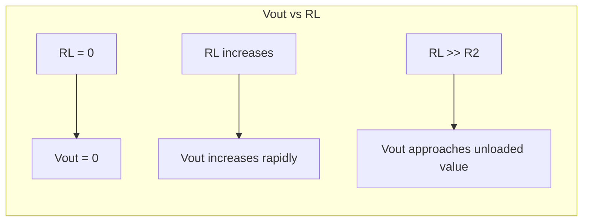

# Loading Effect and Practical Considerations
# 负载效应与实际考量

---

# 1. Overview / 概述

**English:**
This sub-topic explores what happens when a load (such as a resistor, sensor, or device) is connected to a [[Potential Dividers|potential divider]] circuit. In theory, the output voltage $V_{out}$ follows the simple formula $V_{out} = V_{in} \times \frac{R_2}{R_1 + R_2}$. However, in practice, connecting a load resistor $R_L$ in parallel with $R_2$ changes the effective resistance of the lower arm, causing the output voltage to drop — this is the **loading effect**. Understanding this effect is crucial for designing reliable sensing circuits (e.g., [[Sensing Circuits (Thermistor, LDR)|thermistor and LDR circuits]]) and for selecting appropriate component values to minimize errors. This sub-topic also covers practical considerations such as power dissipation, component tolerances, and the choice between using a [[Potentiometers and Variable Resistors|potentiometer]] versus fixed resistors.

**中文:**
本子知识点探讨当负载（如电阻、传感器或设备）连接到[[Potential Dividers|分压器]]电路时会发生什么。理论上，输出电压 $V_{out}$ 遵循简单公式 $V_{out} = V_{in} \times \frac{R_2}{R_1 + R_2}$。然而，在实际中，将负载电阻 $R_L$ 与 $R_2$ 并联会改变下臂的有效电阻，导致输出电压下降——这就是**负载效应**。理解这一效应对于设计可靠的传感电路（如[[Sensing Circuits (Thermistor, LDR)|热敏电阻和光敏电阻电路]]）以及选择合适元件值以最小化误差至关重要。本子知识点还涵盖实际考量，如功率耗散、元件公差以及选择[[Potentiometers and Variable Resistors|电位器]]与固定电阻的权衡。

---

# 2. Syllabus Learning Objectives / 考纲学习目标

| CAIE 9702 | Edexcel IAL |
|-----------|-------------|
| 9.5(a) Explain the effect of connecting a load resistor across the output of a potential divider | WPH11 U2: 3.21 Describe the loading effect in potential divider circuits |
| 9.5(b) Calculate the output voltage of a loaded potential divider | WPH11 U2: 3.22 Calculate the output voltage when a load is connected |
| 9.5(c) Describe practical considerations including power rating and component tolerance | WPH11 U2: 3.23 Explain the importance of choosing appropriate resistor values |
| 9.5(d) Explain why a high-resistance load is preferable | WPH11 U2: 3.24 Discuss practical limitations of potential dividers |
| 9.5(e) Solve problems involving loaded potential dividers | — |

**Examiner Expectations / 考官期望:**
- **English:** Students must be able to calculate the new output voltage when a load is connected, explain why the voltage drops, and suggest how to minimize the loading effect (e.g., use a high-resistance load or low-resistance divider resistors).
- **中文:** 学生必须能够计算连接负载后的新输出电压，解释电压下降的原因，并提出如何最小化负载效应（例如，使用高阻负载或低阻分压电阻）。

---

# 3. Core Definitions / 核心定义

| Term (EN/CN) | Definition (EN) | Definition (CN) | Common Mistakes / 常见错误 |
|--------------|-----------------|-----------------|---------------------------|
| **Loading Effect** / 负载效应 | The change in output voltage of a potential divider when a load resistor is connected across the output, due to the parallel combination of the load with one of the divider resistors. | 当负载电阻连接到分压器输出端时，由于负载与其中一个分压电阻并联，导致输出电压发生变化的现象。 | ❌ Thinking the load is in series with $R_2$ (it's in parallel). |
| **Load Resistor ($R_L$)** / 负载电阻 | The external resistor or device connected across the output of a potential divider that draws current from the circuit. | 连接在分压器输出端的外部电阻或设备，会从电路中汲取电流。 | ❌ Assuming $R_L$ has no effect if it's "large enough" — it always has some effect. |
| **Effective Resistance ($R_{eff}$)** / 等效电阻 | The combined resistance of $R_2$ and $R_L$ in parallel, given by $R_{eff} = \frac{R_2 R_L}{R_2 + R_L}$. | $R_2$ 和 $R_L$ 并联后的总电阻，公式为 $R_{eff} = \frac{R_2 R_L}{R_2 + R_L}$。 | ❌ Forgetting to recalculate $V_{out}$ using $R_{eff}$ instead of $R_2$. |
| **Unloaded Potential Divider** / 空载分压器 | A potential divider with no load connected; output voltage follows the ideal formula. | 没有连接负载的分压器；输出电压遵循理想公式。 | ❌ Using the unloaded formula when a load is present. |
| **High-Impedance Load** / 高阻抗负载 | A load with very high resistance ($R_L \gg R_2$), which minimizes the loading effect. | 电阻非常大的负载 ($R_L \gg R_2$)，可最小化负载效应。 | ❌ Thinking "high impedance" means no current flows — it means very little current flows. |

---

# 4. Key Concepts Explained / 关键概念详解

## 4.1 The Loading Effect / 负载效应

### Explanation / 解释
**English:**
Consider a basic [[The Potential Divider Formula|potential divider]] with resistors $R_1$ and $R_2$, connected to a supply voltage $V_{in}$. The unloaded output voltage is:

$$ V_{out(unloaded)} = V_{in} \times \frac{R_2}{R_1 + R_2} $$

Now, connect a load resistor $R_L$ across $R_2$ (i.e., between the output terminal and ground). The load is **in parallel** with $R_2$, not in series. The effective resistance of the lower arm becomes:

$$ R_{eff} = \frac{R_2 R_L}{R_2 + R_L} $$

Since $R_{eff} < R_2$ (parallel resistors always have a lower combined resistance than the smallest individual resistor), the new output voltage is:

$$ V_{out(loaded)} = V_{in} \times \frac{R_{eff}}{R_1 + R_{eff}} $$

Because $R_{eff} < R_2$, the fraction $\frac{R_{eff}}{R_1 + R_{eff}}$ is smaller than $\frac{R_2}{R_1 + R_2}$, so **$V_{out}$ decreases**. This drop is the loading effect.

**中文:**
考虑一个由电阻 $R_1$ 和 $R_2$ 组成的基本[[The Potential Divider Formula|分压器]]，连接到电源电压 $V_{in}$。空载输出电压为：

$$ V_{out(空载)} = V_{in} \times \frac{R_2}{R_1 + R_2} $$

现在，将负载电阻 $R_L$ 连接到 $R_2$ 两端（即输出端和地之间）。负载与 $R_2$ **并联**，而非串联。下臂的等效电阻变为：

$$ R_{eff} = \frac{R_2 R_L}{R_2 + R_L} $$

由于 $R_{eff} < R_2$（并联电阻的总电阻总是小于最小的单个电阻），新的输出电压为：

$$ V_{out(负载)} = V_{in} \times \frac{R_{eff}}{R_1 + R_{eff}} $$

因为 $R_{eff} < R_2$，分数 $\frac{R_{eff}}{R_1 + R_{eff}}$ 小于 $\frac{R_2}{R_1 + R_2}$，所以 **$V_{out}$ 下降**。这个下降就是负载效应。

### Physical Meaning / 物理意义
**English:** The load draws current from the potential divider. This additional current flows through $R_1$, causing a larger voltage drop across $R_1$. Consequently, less voltage remains across the parallel combination ($R_2 \parallel R_L$), so $V_{out}$ drops. The lower the load resistance, the more current it draws, and the greater the loading effect.

**中文:** 负载从分压器中汲取电流。这个额外的电流流过 $R_1$，导致 $R_1$ 上的电压降增大。因此，并联组合 ($R_2 \parallel R_L$) 上的剩余电压减少，所以 $V_{out}$ 下降。负载电阻越低，汲取的电流越多，负载效应越显著。

### Common Misconceptions / 常见误区
- ❌ **"The load is in series with $R_2$."** — No, the load is connected *across* $R_2$, so it's in parallel.
- ❌ **"If $R_L$ is large, there is no loading effect."** — There is always some effect; it's just negligible when $R_L \gg R_2$.
- ❌ **"The output voltage always equals $V_{in} \times \frac{R_2}{R_1 + R_2}$ regardless of the load."** — This is only true for an unloaded divider.
- ❌ **"Loading effect only matters for low-resistance loads."** — True, but even a moderately large load can cause a noticeable drop if $R_2$ is also large.

### Exam Tips / 考试提示
- **English:** Always check if a load is present. If $R_L$ is given, recalculate $R_{eff}$ and use it in the formula. If the question says "a high-resistance voltmeter is connected," the loading effect is negligible — but you should still mention why.
- **中文:** 始终检查是否存在负载。如果给出了 $R_L$，重新计算 $R_{eff}$ 并使用它代入公式。如果题目说"连接了一个高阻电压表"，则负载效应可忽略——但你仍应说明原因。

> 📷 **IMAGE PROMPT — DIAGRAM-01: Loaded vs Unloaded Potential Divider**
> A side-by-side comparison circuit diagram. Left: unloaded potential divider with $V_{in}=12V$, $R_1=10k\Omega$, $R_2=5k\Omega$, showing $V_{out}=4V$. Right: same divider with a load $R_L=5k\Omega$ connected across $R_2$, showing $R_{eff}=2.5k\Omega$ and $V_{out}=2.4V$. Arrows indicate current flow, with thicker arrows on the loaded side showing increased current through $R_1$.

---

## 4.2 Minimizing the Loading Effect / 最小化负载效应

### Explanation / 解释
**English:**
To minimize the loading effect, we want $R_{eff} \approx R_2$. This happens when $R_L \gg R_2$, because:

$$ R_{eff} = \frac{R_2 R_L}{R_2 + R_L} \approx \frac{R_2 R_L}{R_L} = R_2 \quad \text{(when $R_L \gg R_2$)} $$

Two practical strategies:
1. **Use a high-resistance load** — e.g., a digital voltmeter has $R_L \approx 10 M\Omega$, so it draws negligible current.
2. **Use low-resistance divider resistors** — if $R_1$ and $R_2$ are small (e.g., $100 \Omega$), even a moderate load (e.g., $1 k\Omega$) has $R_L \gg R_2$, minimizing the effect.

However, low-resistance dividers draw more current from the supply, increasing power dissipation. There is a trade-off between loading effect and power consumption.

**中文:**
为了最小化负载效应，我们希望 $R_{eff} \approx R_2$。当 $R_L \gg R_2$ 时，这种情况发生，因为：

$$ R_{eff} = \frac{R_2 R_L}{R_2 + R_L} \approx \frac{R_2 R_L}{R_L} = R_2 \quad \text{(当 $R_L \gg R_2$)} $$

两种实用策略：
1. **使用高阻负载** — 例如，数字电压表的 $R_L \approx 10 M\Omega$，因此汲取的电流可忽略。
2. **使用低阻分压电阻** — 如果 $R_1$ 和 $R_2$ 很小（例如 $100 \Omega$），即使中等负载（例如 $1 k\Omega$）也能满足 $R_L \gg R_2$，从而最小化效应。

然而，低阻分压器会从电源汲取更多电流，增加功率耗散。负载效应和功耗之间存在权衡。

### Physical Meaning / 物理意义
**English:** The loading effect is essentially a current-sharing problem. The load "steals" current from $R_2$, reducing the voltage across it. By making $R_L$ very large, the load draws very little current, so the voltage drop across $R_1$ is almost unchanged, and $V_{out}$ remains close to its unloaded value.

**中文:** 负载效应本质上是一个电流分配问题。负载从 $R_2$ "窃取"电流，从而降低其两端电压。通过使 $R_L$ 非常大，负载汲取的电流非常小，因此 $R_1$ 上的电压降几乎不变，$V_{out}$ 保持接近其空载值。

### Common Misconceptions / 常见误区
- ❌ **"Making $R_1$ and $R_2$ very large minimizes the loading effect."** — No! Large $R_1$ and $R_2$ make the loading effect *worse* because $R_L$ is no longer much larger than $R_2$.
- ❌ **"A voltmeter with $1 M\Omega$ resistance always gives accurate readings."** — It depends on the divider resistors. If $R_2 = 1 M\Omega$, the loading effect is significant.

### Exam Tips / 考试提示
- **English:** If asked "suggest how to reduce the loading effect," two answers are acceptable: (1) use a load with higher resistance, or (2) use divider resistors with lower resistance. Be prepared to discuss the trade-off with power dissipation.
- **中文:** 如果被问到"建议如何减少负载效应"，两个答案均可接受：(1) 使用更高电阻的负载，或 (2) 使用更低电阻的分压电阻。准备好讨论与功率耗散的权衡。

---

## 4.3 Practical Considerations / 实际考量

### Explanation / 解释
**English:**
Beyond the loading effect, several practical factors affect potential divider design:

1. **Power Dissipation / 功率耗散:** Each resistor dissipates power $P = I^2 R = \frac{V^2}{R}$. If $R_1$ and $R_2$ are too small, they may overheat. Resistors have a power rating (e.g., $0.25 W$, $0.5 W$). Exceeding this rating damages the component.

2. **Component Tolerance / 元件公差:** Real resistors have a tolerance (e.g., $\pm 5\%$, $\pm 1\%$). This means the actual resistance can differ from the stated value, causing $V_{out}$ to deviate from the calculated value. For precision applications, use low-tolerance resistors.

3. **Temperature Effects / 温度效应:** Resistor values change with temperature (temperature coefficient of resistance). In sensing circuits like [[Sensing Circuits (Thermistor, LDR)|thermistor circuits]], this is intentional, but in precision dividers, it's a problem.

4. **Potentiometer vs Fixed Resistors / 电位器 vs 固定电阻:** A [[Potentiometers and Variable Resistors|potentiometer]] allows adjustable $V_{out}$, but it may have lower precision and stability than fixed resistors. Potentiometers also suffer from wiper contact resistance and wear.

5. **Supply Voltage Stability / 电源电压稳定性:** $V_{out}$ depends on $V_{in}$. If $V_{in}$ fluctuates (e.g., from a battery discharging), $V_{out}$ also fluctuates. Use a regulated power supply or a [[Zener Diode as a Voltage Regulator|Zener diode regulator]].

**中文:**
除了负载效应，几个实际因素影响分压器设计：

1. **功率耗散:** 每个电阻耗散功率 $P = I^2 R = \frac{V^2}{R}$。如果 $R_1$ 和 $R_2$ 太小，它们可能过热。电阻有额定功率（例如 $0.25 W$、$0.5 W$）。超过额定功率会损坏元件。

2. **元件公差:** 实际电阻有公差（例如 $\pm 5\%$、$\pm 1\%$）。这意味着实际电阻可能与标称值不同，导致 $V_{out}$ 偏离计算值。对于精密应用，使用低公差电阻。

3. **温度效应:** 电阻值随温度变化（电阻温度系数）。在[[Sensing Circuits (Thermistor, LDR)|热敏电阻电路]]等传感电路中，这是有意为之，但在精密分压器中，这是一个问题。

4. **电位器 vs 固定电阻:** [[Potentiometers and Variable Resistors|电位器]]允许可调 $V_{out}$，但其精度和稳定性可能低于固定电阻。电位器还存在滑臂接触电阻和磨损问题。

5. **电源电压稳定性:** $V_{out}$ 取决于 $V_{in}$。如果 $V_{in}$ 波动（例如来自放电的电池），$V_{out}$ 也会波动。使用稳压电源或[[Zener Diode as a Voltage Regulator|齐纳二极管稳压器]]。

### Physical Meaning / 物理意义
**English:** A potential divider is not just a mathematical formula — it's a physical circuit with real components that have limitations. Engineers must balance accuracy, power consumption, cost, and reliability when designing dividers.

**中文:** 分压器不仅仅是一个数学公式——它是一个由具有实际限制的真实元件组成的物理电路。工程师在设计分压器时必须平衡精度、功耗、成本和可靠性。

### Common Misconceptions / 常见误区
- ❌ **"A $100 \Omega$ resistor can handle any voltage."** — No, it has a power rating. $P = V^2/R$, so at $12V$, $P = 1.44W$, which exceeds a standard $0.25W$ resistor.
- ❌ **"A $100 \Omega$ resistor is exactly $100 \Omega$."** — No, a $\pm 5\%$ resistor could be anywhere from $95 \Omega$ to $105 \Omega$.

### Exam Tips / 考试提示
- **English:** When asked about practical considerations, mention at least two factors (e.g., power dissipation and tolerance). For calculation questions, always check if the power rating is exceeded.
- **中文:** 当被问及实际考量时，至少提及两个因素（例如功率耗散和公差）。对于计算题，始终检查是否超过额定功率。

> 📷 **IMAGE PROMPT — DIAGRAM-02: Practical Potential Divider Considerations**
> A diagram showing a potential divider with annotations: (1) Power dissipation label near $R_1$ showing $P = I^2 R$, (2) Tolerance label showing $\pm 5\%$, (3) Temperature label with a thermometer icon, (4) Load label showing $R_L$ with a warning symbol if $R_L$ is too low, (5) Supply voltage label showing $V_{in}$ with a ripple symbol indicating instability.

---

# 5. Essential Equations / 核心公式

## Equation 1: Effective Resistance of Parallel Combination / 并联等效电阻

$$ R_{eff} = \frac{R_2 R_L}{R_2 + R_L} $$

| Symbol (符号) | Meaning (EN) | Meaning (CN) | Unit (单位) |
|--------------|-------------|-------------|------------|
| $R_{eff}$ | Effective resistance of $R_2$ and $R_L$ in parallel | $R_2$ 和 $R_L$ 并联的等效电阻 | $\Omega$ |
| $R_2$ | Lower resistor in potential divider | 分压器中的下电阻 | $\Omega$ |
| $R_L$ | Load resistance connected across output | 连接在输出端的负载电阻 | $\Omega$ |

**Derivation / 推导:** For two resistors in parallel: $\frac{1}{R_{eff}} = \frac{1}{R_2} + \frac{1}{R_L} \Rightarrow R_{eff} = \frac{R_2 R_L}{R_2 + R_L}$.

**Conditions / 适用条件:** Only two resistors in parallel. For more than two, use the general formula.

**Limitations / 局限性:** Assumes ideal resistors with no inductance or capacitance.

---

## Equation 2: Loaded Potential Divider Output Voltage / 负载分压器输出电压

$$ V_{out(loaded)} = V_{in} \times \frac{R_{eff}}{R_1 + R_{eff}} $$

| Symbol (符号) | Meaning (EN) | Meaning (CN) | Unit (单位) |
|--------------|-------------|-------------|------------|
| $V_{out(loaded)}$ | Output voltage with load connected | 连接负载后的输出电压 | $V$ |
| $V_{in}$ | Supply voltage | 电源电压 | $V$ |
| $R_1$ | Upper resistor in potential divider | 分压器中的上电阻 | $\Omega$ |
| $R_{eff}$ | Effective resistance of $R_2 \parallel R_L$ | $R_2 \parallel R_L$ 的等效电阻 | $\Omega$ |

**Derivation / 推导:** Substitute $R_{eff}$ for $R_2$ in the unloaded formula.

**Conditions / 适用条件:** Load is connected in parallel with $R_2$ only. If load is across $R_1$, swap roles.

**Limitations / 局限性:** Assumes $V_{in}$ is constant and load is purely resistive.

---

## Equation 3: Power Dissipated in a Resistor / 电阻耗散功率

$$ P = I^2 R = \frac{V^2}{R} = IV $$

| Symbol (符号) | Meaning (EN) | Meaning (CN) | Unit (单位) |
|--------------|-------------|-------------|------------|
| $P$ | Power dissipated | 耗散功率 | $W$ |
| $I$ | Current through resistor | 流过电阻的电流 | $A$ |
| $R$ | Resistance | 电阻 | $\Omega$ |
| $V$ | Voltage across resistor | 电阻两端电压 | $V$ |

**Derivation / 推导:** From $P = IV$ and Ohm's law $V = IR$.

**Conditions / 适用条件:** DC circuits with resistive loads.

**Limitations / 局限性:** For AC circuits, use RMS values.

---

## Equation 4: Percentage Loading Error / 负载误差百分比

$$ \text{Error} = \frac{V_{out(unloaded)} - V_{out(loaded)}}{V_{out(unloaded)}} \times 100\% $$

| Symbol (符号) | Meaning (EN) | Meaning (CN) | Unit (单位) |
|--------------|-------------|-------------|------------|
| $V_{out(unloaded)}$ | Output voltage without load | 空载输出电压 | $V$ |
| $V_{out(loaded)}$ | Output voltage with load | 负载输出电压 | $V$ |

**Derivation / 推导:** Standard percentage difference formula.

**Conditions / 适用条件:** Used to quantify the loading effect.

**Limitations / 局限性:** Only meaningful when $V_{out(unloaded)} \neq 0$.

> 📷 **IMAGE PROMPT — FORMULA-DIAGRAM-01: Loaded Potential Divider Formula**
> A visual derivation: Start with unloaded divider showing $V_{out} = V_{in} \times \frac{R_2}{R_1+R_2}$. Then show $R_L$ being connected in parallel with $R_2$, with an arrow pointing to $R_{eff} = \frac{R_2 R_L}{R_2+R_L}$. Finally show the loaded formula $V_{out} = V_{in} \times \frac{R_{eff}}{R_1+R_{eff}}$. Use color coding: $R_1$ in blue, $R_2$ in green, $R_L$ in red, $R_{eff}$ in orange.

---

# 6. Graphs and Relationships / 图表与关系

## 6.1 Output Voltage vs Load Resistance / 输出电压 vs 负载电阻

### Axes / 坐标轴
- **X-axis:** Load resistance $R_L$ (log scale, $\Omega$)
- **Y-axis:** Output voltage $V_{out}$ (linear scale, $V$)

### Shape / 形状
**English:** The graph starts at $V_{out} = 0$ when $R_L = 0$ (short circuit). As $R_L$ increases, $V_{out}$ rises rapidly at first, then approaches the unloaded value $V_{out(unloaded)}$ asymptotically as $R_L \to \infty$. The curve is concave down (increasing but at a decreasing rate).

**中文:** 当 $R_L = 0$（短路）时，图形从 $V_{out} = 0$ 开始。随着 $R_L$ 增加，$V_{out}$ 起初快速上升，然后当 $R_L \to \infty$ 时渐近趋近于空载值 $V_{out(空载)}$。曲线向下凹（递增但增速递减）。

### Gradient Meaning / 斜率含义
**English:** The gradient $\frac{dV_{out}}{dR_L}$ represents the sensitivity of the output voltage to changes in load resistance. A steep gradient at low $R_L$ means the loading effect changes rapidly with small changes in load. A shallow gradient at high $R_L$ means the output is stable.

**中文:** 梯度 $\frac{dV_{out}}{dR_L}$ 表示输出电压对负载电阻变化的敏感度。低 $R_L$ 处的陡峭梯度意味着负载效应随负载的微小变化而快速变化。高 $R_L$ 处的平缓梯度意味着输出稳定。

### Area Meaning / 面积含义
**English:** The area under the curve has no direct physical meaning in this context.

**中文:** 曲线下的面积在此上下文中没有直接的物理意义。

### Exam Interpretation / 考试解读
**English:** You may be asked to read values from such a graph or to sketch it. Remember the asymptotic approach to $V_{out(unloaded)}$ and the rapid drop as $R_L$ becomes comparable to $R_2$.

**中文:** 你可能会被要求从这样的图形中读取数值或绘制草图。记住渐近趋近于 $V_{out(空载)}$ 以及当 $R_L$ 与 $R_2$ 相当时快速下降。

---

## 6.2 Output Voltage vs Temperature (Thermistor Divider) / 输出电压 vs 温度（热敏电阻分压器）

### Axes / 坐标轴
- **X-axis:** Temperature $T$ (°C)
- **Y-axis:** Output voltage $V_{out}$ (V)

### Shape / 形状
**English:** For a [[Sensing Circuits (Thermistor, LDR)|thermistor]] in the lower arm ($R_2$ position), as temperature increases, thermistor resistance decreases, so $V_{out}$ decreases. The curve is non-linear, typically S-shaped or exponential, depending on the thermistor characteristics.

**中文:** 对于位于下臂（$R_2$ 位置）的[[Sensing Circuits (Thermistor, LDR)|热敏电阻]]，随着温度升高，热敏电阻阻值下降，因此 $V_{out}$ 下降。曲线是非线性的，通常呈 S 形或指数形，取决于热敏电阻特性。

### Gradient Meaning / 斜率含义
**English:** The gradient $\frac{dV_{out}}{dT}$ is the sensitivity of the temperature sensor. A steeper gradient means higher sensitivity (larger voltage change per degree).

**中文:** 梯度 $\frac{dV_{out}}{dT}$ 是温度传感器的灵敏度。更陡的梯度意味着更高的灵敏度（每度电压变化更大）。

### Area Meaning / 面积含义
**English:** No direct physical meaning.

**中文:** 没有直接的物理意义。

### Exam Interpretation / 考试解读
**English:** You may be asked to explain why the output is non-linear or to calculate the output at a specific temperature. Remember that the loading effect of the measuring device (e.g., voltmeter) also applies here.

**中文:** 你可能会被要求解释为什么输出是非线性的，或在特定温度下计算输出。记住测量设备（如电压表）的负载效应在此处也适用。

---

# 7. Required Diagrams / 必备图表

## 7.1 Loaded Potential Divider Circuit / 负载分压器电路图

### Description / 描述
**English:** A circuit diagram showing a potential divider with $R_1$, $R_2$, and a load resistor $R_L$ connected in parallel with $R_2$. Include voltage source $V_{in}$, output terminals, and current arrows showing the split of current at the junction.

**中文:** 电路图显示一个分压器，包含 $R_1$、$R_2$ 以及与 $R_2$ 并联的负载电阻 $R_L$。包括电压源 $V_{in}$、输出端子和显示节点处电流分配的电流箭头。

### Image Prompt / 图片生成提示
> 📷 **IMAGE PROMPT — DIAGRAM-03: Loaded Potential Divider Circuit**
> A clean circuit diagram on a white background. Top: a battery symbol labeled $V_{in} = 12V$. Below it, resistor $R_1 = 10k\Omega$ in series with a junction point. From the junction, two parallel branches: one with resistor $R_2 = 5k\Omega$ going to ground, and another with resistor $R_L = 5k\Omega$ also going to ground. Output terminals are shown across $R_2$ (or across the parallel combination). Current arrows: $I_{total}$ flowing from battery through $R_1$, then splitting into $I_2$ through $R_2$ and $I_L$ through $R_L$. Labels: $V_{out}$ across the output terminals. Use professional schematic style with clear component values.

### Labels Required / 需要标注
| Label (EN) | Label (CN) | Description |
|------------|------------|-------------|
| $V_{in}$ | 输入电压 | Supply voltage |
| $R_1$ | 上电阻 | Upper resistor |
| $R_2$ | 下电阻 | Lower resistor |
| $R_L$ | 负载电阻 | Load resistor |
| $V_{out}$ | 输出电压 | Output voltage |
| $I_{total}$ | 总电流 | Total current from supply |
| $I_2$ | 通过R2的电流 | Current through $R_2$ |
| $I_L$ | 通过RL的电流 | Current through $R_L$ |

### Exam Importance / 考试重要性
**English:** This is the most important diagram for this sub-topic. You must be able to draw it, label it, and use it to explain the loading effect. Examiners often ask: "Explain why connecting a load causes $V_{out}$ to drop."

**中文:** 这是本子知识点最重要的图表。你必须能够绘制、标注并使用它来解释负载效应。考官经常问："解释为什么连接负载会导致 $V_{out}$ 下降。"

---

## 7.2 Practical Potential Divider with Voltmeter / 带电压表的实际分压器

### Description / 描述
**English:** A potential divider circuit with a voltmeter connected across the output. The voltmeter has an internal resistance $R_V$ (typically $10 M\Omega$), which acts as a load. This diagram illustrates why a high-resistance voltmeter is preferred.

**中文:** 一个分压器电路，输出端连接了一个电压表。电压表有内阻 $R_V$（通常为 $10 M\Omega$），它充当负载。此图说明了为什么首选高阻电压表。

### Image Prompt / 图片生成提示
> 📷 **IMAGE PROMPT — DIAGRAM-04: Potential Divider with Voltmeter Loading**
> A circuit diagram showing a potential divider with $R_1 = 100k\Omega$ and $R_2 = 100k\Omega$, $V_{in} = 10V$. A voltmeter is connected across $R_2$, with its internal resistance $R_V = 10M\Omega$ shown as a resistor inside the voltmeter symbol. An annotation bubble says "Voltmeter internal resistance acts as load $R_L = R_V$". A second annotation shows the calculation: $R_{eff} = \frac{100k \times 10M}{100k + 10M} \approx 99k\Omega$, so $V_{out} \approx 4.98V$ instead of $5.00V$. Use a professional style with clear component values and annotations.

### Labels Required / 需要标注
| Label (EN) | Label (CN) | Description |
|------------|------------|-------------|
| $R_V$ | 电压表内阻 | Voltmeter internal resistance |
| $V_{out}$ | 输出电压 | Output voltage reading |
| $R_{eff}$ | 等效电阻 | Effective resistance of $R_2 \parallel R_V$ |

### Exam Importance / 考试重要性
**English:** This diagram is commonly used to explain why digital voltmeters (with very high input resistance) are more accurate than analog voltmeters (with lower input resistance). It also connects to the concept of [[Resistance and Resistivity|input impedance]].

**中文:** 此图常用于解释为什么数字电压表（具有非常高的输入电阻）比模拟电压表（具有较低的输入电阻）更准确。它还与[[Resistance and Resistivity|输入阻抗]]的概念相关。

---

# 8. Worked Examples / 典型例题

## Example 1: Calculating Loaded Output Voltage / 计算负载输出电压

### Question / 题目
**English:**
A potential divider consists of $R_1 = 10 k\Omega$ and $R_2 = 5 k\Omega$ connected to a $12 V$ supply. A load resistor $R_L = 5 k\Omega$ is connected across $R_2$. Calculate:
(a) The unloaded output voltage.
(b) The effective resistance of $R_2$ and $R_L$ in parallel.
(c) The loaded output voltage.
(d) The percentage loading error.

**中文:**
一个分压器由 $R_1 = 10 k\Omega$ 和 $R_2 = 5 k\Omega$ 组成，连接到 $12 V$ 电源。一个负载电阻 $R_L = 5 k\Omega$ 连接到 $R_2$ 两端。计算：
(a) 空载输出电压。
(b) $R_2$ 和 $R_L$ 并联的等效电阻。
(c) 负载输出电压。
(d) 负载误差百分比。

### Solution / 解答

**Step 1: Unloaded output voltage / 空载输出电压**

$$ V_{out(unloaded)} = V_{in} \times \frac{R_2}{R_1 + R_2} = 12 \times \frac{5}{10 + 5} = 12 \times \frac{5}{15} = 12 \times \frac{1}{3} = 4.0 V $$

**Step 2: Effective resistance / 等效电阻**

$$ R_{eff} = \frac{R_2 R_L}{R_2 + R_L} = \frac{5 \times 10^3 \times 5 \times 10^3}{5 \times 10^3 + 5 \times 10^3} = \frac{25 \times 10^6}{10 \times 10^3} = 2.5 \times 10^3 \Omega = 2.5 k\Omega $$

**Step 3: Loaded output voltage / 负载输出电压**

$$ V_{out(loaded)} = V_{in} \times \frac{R_{eff}}{R_1 + R_{eff}} = 12 \times \frac{2.5}{10 + 2.5} = 12 \times \frac{2.5}{12.5} = 12 \times 0.2 = 2.4 V $$

**Step 4: Percentage loading error / 负载误差百分比**

$$ \text{Error} = \frac{V_{out(unloaded)} - V_{out(loaded)}}{V_{out(unloaded)}} \times 100\% = \frac{4.0 - 2.4}{4.0} \times 100\% = \frac{1.6}{4.0} \times 100\% = 40\% $$

### Final Answer / 最终答案
**Answer:** (a) $4.0 V$, (b) $2.5 k\Omega$, (c) $2.4 V$, (d) $40\%$ | **答案：** (a) $4.0 V$，(b) $2.5 k\Omega$，(c) $2.4 V$，(d) $40\%$

### Quick Tip / 提示
**English:** Notice that when $R_L = R_2$, the effective resistance is exactly half of $R_2$, and the output voltage drops significantly. This is why a load should have $R_L \gg R_2$ to avoid large errors.

**中文:** 注意当 $R_L = R_2$ 时，等效电阻恰好是 $R_2$ 的一半，输出电压显著下降。这就是为什么负载应满足 $R_L \gg R_2$ 以避免较大误差。

---

## Example 2: Choosing Resistor Values to Minimize Loading / 选择电阻值以最小化负载

### Question / 题目
**English:**
A potential divider is required to produce $V_{out} = 5.0 V$ from a $V_{in} = 12 V$ supply. The load connected to the output has resistance $R_L = 10 k\Omega$. Choose suitable values for $R_1$ and $R_2$ such that the loading error is less than $5\%$. Assume standard resistor values are available.

**中文:**
需要一个分压器从 $V_{in} = 12 V$ 电源产生 $V_{out} = 5.0 V$。连接到输出的负载电阻为 $R_L = 10 k\Omega$。选择合适的 $R_1$ 和 $R_2$ 值，使负载误差小于 $5\%$。假设有标准电阻值可用。

### Solution / 解答

**Step 1: Determine the required ratio / 确定所需比例**

For unloaded divider: $\frac{V_{out}}{V_{in}} = \frac{R_2}{R_1 + R_2} = \frac{5}{12}$

So $\frac{R_2}{R_1 + R_2} = \frac{5}{12} \Rightarrow 12R_2 = 5R_1 + 5R_2 \Rightarrow 7R_2 = 5R_1 \Rightarrow R_1 = \frac{7}{5}R_2 = 1.4 R_2$

**Step 2: Condition for less than 5% error / 误差小于5%的条件**

We want $\frac{V_{out(unloaded)} - V_{out(loaded)}}{V_{out(unloaded)}} < 0.05$

This means $V_{out(loaded)} > 0.95 \times V_{out(unloaded)}$

$V_{out(loaded)} = V_{in} \times \frac{R_{eff}}{R_1 + R_{eff}}$ where $R_{eff} = \frac{R_2 R_L}{R_2 + R_L}$

For $V_{out(loaded)} > 0.95 \times V_{out(unloaded)}$, we need $R_{eff} \approx R_2$, which requires $R_L \gg R_2$.

**Step 3: Choose $R_2$ such that $R_L \gg R_2$ / 选择 $R_2$ 使 $R_L \gg R_2$**

Let's try $R_2 = 1 k\Omega$. Then $R_1 = 1.4 k\Omega$ (use $1.5 k\Omega$ standard value).

Check: $R_{eff} = \frac{1k \times 10k}{1k + 10k} = \frac{10k}{11} \approx 0.909 k\Omega$

$V_{out(loaded)} = 12 \times \frac{0.909}{1.5 + 0.909} = 12 \times \frac{0.909}{2.409} \approx 12 \times 0.377 = 4.53 V$

$V_{out(unloaded)} = 12 \times \frac{1}{1.5 + 1} = 12 \times \frac{1}{2.5} = 4.8 V$

Error $= \frac{4.8 - 4.53}{4.8} \times 100\% \approx 5.6\%$ — slightly over 5%.

**Step 4: Try lower $R_2$ / 尝试更低的 $R_2$**

Let's try $R_2 = 470 \Omega$ (standard value). Then $R_1 = 1.4 \times 470 \approx 658 \Omega$ (use $680 \Omega$).

$R_{eff} = \frac{470 \times 10k}{470 + 10k} = \frac{4.7M}{10.47k} \approx 449 \Omega$

$V_{out(loaded)} = 12 \times \frac{449}{680 + 449} = 12 \times \frac{449}{1129} \approx 12 \times 0.398 = 4.77 V$

$V_{out(unloaded)} = 12 \times \frac{470}{680 + 470} = 12 \times \frac{470}{1150} \approx 12 \times 0.409 = 4.91 V$

Error $= \frac{4.91 - 4.77}{4.91} \times 100\% \approx 2.9\%$ — within 5%.

### Final Answer / 最终答案
**Answer:** $R_1 = 680 \Omega$, $R_2 = 470 \Omega$ (standard values) | **答案：** $R_1 = 680 \Omega$，$R_2 = 470 \Omega$（标准值）

### Quick Tip / 提示
**English:** To minimize loading error, make $R_2$ as small as possible compared to $R_L$. However, smaller resistors draw more current and dissipate more power. Check power ratings: $P = V^2/R$, so for $R_1 = 680 \Omega$ at $12V$, $P \approx 0.21W$, which is within a standard $0.25W$ rating.

**中文:** 为了最小化负载误差，使 $R_2$ 尽可能小于 $R_L$。然而，更小的电阻会汲取更多电流并耗散更多功率。检查额定功率：$P = V^2/R$，对于 $R_1 = 680 \Omega$ 在 $12V$ 下，$P \approx 0.21W$，在标准 $0.25W$ 额定值内。

---

# 9. Past Paper Question Types / 历年真题题型

| Question Type / 题型 | Frequency / 频率 | Difficulty / 难度 | Past Paper References / 真题索引 |
|----------------------|------------------|------------------|-------------------------------|
| Calculate loaded $V_{out}$ given $R_1$, $R_2$, $R_L$, $V_{in}$ | High | Easy | 📝 *待填入* |
| Explain why $V_{out}$ drops when load is connected | High | Medium | 📝 *待填入* |
| Suggest how to reduce loading effect | Medium | Medium | 📝 *待填入* |
| Calculate power dissipation in divider resistors | Medium | Medium | 📝 *待填入* |
| Choose resistor values to meet accuracy requirements | Low | Hard | 📝 *待填入* |
| Explain why a high-resistance voltmeter is preferred | Medium | Easy | 📝 *待填入* |

**Common Command Words / 常见指令词:**
- **Calculate / 计算:** Find the numerical value of $V_{out}$, $R_{eff}$, or power.
- **Explain / 解释:** Describe why the loading effect occurs, using physics principles.
- **Suggest / 建议:** Propose a method to reduce the loading effect or improve accuracy.
- **Determine / 确定:** Find a value, possibly through calculation or graph reading.
- **Discuss / 讨论:** Consider multiple factors (e.g., loading effect vs power dissipation).

---

# 10. Practical Skills Connections / 实验技能链接

**English:**
This sub-topic connects to practical work in several ways:

1. **Circuit Construction / 电路搭建:** Students must build potential divider circuits on breadboards, connecting resistors and measuring $V_{out}$ with a voltmeter. They will observe the loading effect firsthand when using different voltmeters (analog vs digital).

2. **Measurement Techniques / 测量技术:** Understanding loading effect is crucial for accurate voltage measurements. Students should learn to use a digital multimeter (high input impedance) rather than an analog voltmeter (lower input impedance) for precision work.

3. **Uncertainty Analysis / 不确定度分析:** Component tolerances introduce uncertainty in $V_{out}$. Students should calculate the range of possible $V_{out}$ values given resistor tolerances (e.g., $\pm 5\%$).

4. **Graph Plotting / 绘图:** Plot $V_{out}$ vs $R_L$ for a fixed divider to observe the loading effect experimentally. This can be done by connecting different load resistors and measuring $V_{out}$.

5. **Experimental Design / 实验设计:** When designing a sensing circuit (e.g., [[Sensing Circuits (Thermistor, LDR)|thermistor temperature sensor]]), students must choose $R_1$ to balance sensitivity, linearity, and loading effects from the measuring device.

6. **Power Considerations / 功率考量:** Students should check that resistors are not overheating. Use the power formula $P = V^2/R$ to verify that the power rating is not exceeded.

**中文:**
本子知识点通过多种方式与实验工作联系：

1. **电路搭建:** 学生必须在面包板上搭建分压器电路，连接电阻并使用电压表测量 $V_{out}$。当使用不同的电压表（模拟 vs 数字）时，他们将直接观察到负载效应。

2. **测量技术:** 理解负载效应对准确电压测量至关重要。学生应学会使用数字万用表（高输入阻抗）而非模拟电压表（较低输入阻抗）进行精密测量。

3. **不确定度分析:** 元件公差引入 $V_{out}$ 的不确定度。学生应计算给定电阻公差（例如 $\pm 5\%$）下可能的 $V_{out}$ 值范围。

4. **绘图:** 绘制固定分压器的 $V_{out}$ 与 $R_L$ 关系图，以实验方式观察负载效应。这可以通过连接不同的负载电阻并测量 $V_{out}$ 来完成。

5. **实验设计:** 在设计传感电路（例如[[Sensing Circuits (Thermistor, LDR)|热敏电阻温度传感器]]）时，学生必须选择 $R_1$ 以平衡灵敏度、线性度和来自测量设备的负载效应。

6. **功率考量:** 学生应检查电阻是否过热。使用功率公式 $P = V^2/R$ 验证是否超过额定功率。

---

# 11. Concept Map / 概念图谱

```mermaid
graph TD
    %% Main topic
    PL[Loading Effect and Practical Considerations] --> PD[Potential Dividers]
    
    %% Core concepts
    PL --> LE[Loading Effect]
    PL --> PC[Practical Considerations]
    
    %% Loading Effect sub-concepts
    LE --> RL[Load Resistor RL]
    LE --> REFF[Effective Resistance Reff]
    LE --> VOUT[Output Voltage Drop]
    LE --> MIN[Minimizing Loading]
    
    MIN --> HR[High-Resistance Load]
    MIN --> LR[Low-Resistance Divider]
    
    %% Practical Considerations sub-concepts
    PC --> PDISS[Power Dissipation]
    PC --> TOL[Component Tolerance]
    PC --> TEMP[Temperature Effects]
    PC --> POT[Potentiometer vs Fixed]
    PC --> VSUP[Supply Stability]
    
    %% Connections to other topics
    PD --> PDR[The Potential Divider Formula]
    PD --> POTV[Potentiometers and Variable Resistors]
    PD --> SENS[Sensing Circuits]
    
    SENS --> THERM[Thermistor]
    SENS --> LDR[Light Dependent Resistor]
    
    %% Prerequisites
    PL --> RES[Resistance and Resistivity]
    PL --> KIRCH[Kirchhoff's Laws]
    PL --> IV[I-V Characteristics]
    
    %% Practical skills
    PL --> MEAS[Measurement Techniques]
    PL --> UNC[Uncertainty Analysis]
    
    %% Styling
    classDef main fill:#f9f,stroke:#333,stroke-width:2px
    classDef concept fill:#bbf,stroke:#333,stroke-width:1px
    classDef practical fill:#bfb,stroke:#333,stroke-width:1px
    classDef external fill:#fbb,stroke:#333,stroke-width:1px
    
    class PL main
    class LE,PC,REFF,VOUT,MIN concept
    class PDISS,TOL,TEMP,POT,VSUP practical
    class RES,KIRCH,IV external
```

---

# 12. Quick Revision Sheet / 速查表

| Category / 类别 | Key Points / 要点 |
|----------------|------------------|
| **Definition / 定义** | Loading effect: $V_{out}$ drops when a load $R_L$ is connected in parallel with $R_2$ because $R_{eff} < R_2$. / 负载效应：当负载 $R_L$ 与 $R_2$ 并联时，$V_{out}$ 下降，因为 $R_{eff} < R_2$。 |
| **Key Formula / 核心公式** | $R_{eff} = \frac{R_2 R_L}{R_2 + R_L}$; $V_{out(loaded)} = V_{in} \times \frac{R_{eff}}{R_1 + R_{eff}}$; $P = I^2 R = V^2/R$ |
| **Key Graph / 核心图表** | $V_{out}$ vs $R_L$: Starts at 0 when $R_L = 0$, rises rapidly, then asymptotically approaches $V_{out(unloaded)}$ as $R_L \to \infty$. / $V_{out}$ 与 $R_L$ 关系图：当 $R_L = 0$ 时从 0 开始，快速上升，然后当 $R_L \to \infty$ 时渐近趋近于 $V_{out(空载)}$。 |
| **Minimizing Loading / 最小化负载** | (1) Use high-resistance load ($R_L \gg R_2$), e.g., digital voltmeter. (2) Use low-resistance divider ($R_1, R_2$ small). Trade-off: higher power dissipation. / (1) 使用高阻负载 ($R_L \gg R_2$)，例如数字电压表。(2) 使用低阻分压器 ($R_1, R_2$ 小)。权衡：更高的功率耗散。 |
| **Practical Factors / 实际因素** | Power rating (check $P < P_{rated}$), tolerance ($\pm 5\%$ means $V_{out}$ has uncertainty), temperature effects, supply stability. / 额定功率（检查 $P < P_{额定}$），公差（$\pm 5\%$ 意味着 $V_{out}$ 有不确定度），温度效应，电源稳定性。 |
| **Common Mistake / 常见错误** | Using unloaded formula when load is present. Forgetting that $R_L$ is in parallel with $R_2$, not in series. / 当存在负载时使用空载公式。忘记 $R_L$ 与 $R_2$ 并联而非串联。 |
| **Exam Tip / 考试提示** | Always recalculate $R_{eff}$ if $R_L$ is given. For "high-resistance voltmeter" questions, mention that loading is negligible because $R_V \gg R_2$. / 如果给出了 $R_L$，始终重新计算 $R_{eff}$。对于"高阻电压表"问题，提及负载可忽略，因为 $R_V \gg R_2$。 |
| **Key Connection / 关键联系** | [[Sensing Circuits (Thermistor, LDR)]]: Loading effect is critical when designing sensor circuits — the measuring device must not significantly alter the sensor output. / [[Sensing Circuits (Thermistor, LDR)]]：在设计传感器电路时，负载效应至关重要——测量设备不得显著改变传感器输出。 |