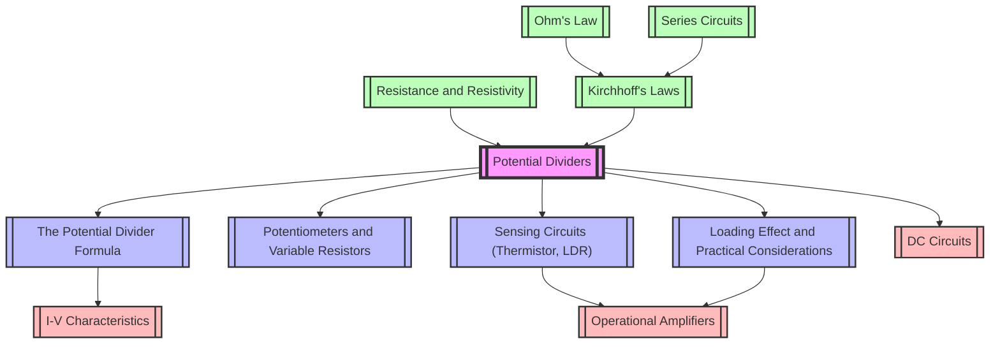

# 1. Overview / 概述

**English:**
A potential divider is a simple yet fundamental circuit configuration that uses two or more resistors in series to "divide" a supply voltage into smaller, predictable fractions. This topic explores how the output voltage across one resistor depends on the ratio of resistances, forming the basis for countless applications in electronics, sensing, and control systems. In the Cambridge 9702 and Edexcel IAL syllabuses, potential dividers are essential for understanding how sensors like thermistors and light-dependent resistors (LDRs) convert physical changes into voltage signals, which can then be processed by microcontrollers or other circuits. Real-world applications include volume controls (potentiometers), temperature monitoring systems, light-activated switches, and touchscreens. Mastering this topic requires a solid grasp of [[Resistance and Resistivity]] and [[Kirchhoff's Laws]], particularly Kirchhoff's Voltage Law (KVL), as the divider is essentially a series circuit where the sum of voltage drops equals the supply voltage.

**中文：**
分压器是一种简单但基础的电路配置，它使用两个或多个串联电阻将电源电压“分割”成较小的、可预测的分数。本主题探讨了跨一个电阻的输出电压如何取决于电阻的比值，这构成了电子学、传感和控制系统无数应用的基础。在剑桥 9702 和爱德思 IAL 教学大纲中，分压器对于理解热敏电阻和光敏电阻 (LDR) 等传感器如何将物理变化转换为电压信号至关重要，这些信号随后可由微控制器或其他电路处理。实际应用包括音量控制（电位器）、温度监测系统、光控开关和触摸屏。掌握本主题需要扎实理解 [[电阻与电阻率]] 和 [[基尔霍夫定律]]，特别是基尔霍夫电压定律 (KVL)，因为分压器本质上是一个串联电路，其中电压降之和等于电源电压。

---

# 2. Syllabus Learning Objectives / 考纲学习目标

**English:**
The following table maps the specific learning objectives from Cambridge 9702 and Edexcel IAL syllabuses for this topic. Both boards require students to understand the principle, derive the formula, and apply it to circuits with fixed and variable resistors, including sensing applications.

**中文：**
下表映射了剑桥 9702 和爱德思 IAL 教学大纲中本主题的具体学习目标。两个考试局都要求学生理解原理、推导公式，并将其应用于固定和可变电阻电路，包括传感应用。

| CAIE 9702 (9.5 a-e) | Edexcel IAL (WPH11 U2: 3.21-3.24) |
|---------------------|-----------------------------------|
| 9.5(a) Understand the principle of a potential divider circuit as a source of variable potential difference. | 3.21 Understand the principle of a potential divider circuit. |
| 9.5(b) Recall and use the potential divider equation: $V_{out} = \frac{R_2}{R_1 + R_2} V_{in}$ (for two resistors in series). | 3.22 Use the potential divider equation: $V_{out} = \frac{R_2}{R_1 + R_2} V_{in}$. |
| 9.5(c) Explain the use of a potential divider circuit with a light-dependent resistor (LDR) or thermistor to provide a potential difference that varies with light intensity or temperature. | 3.23 Explain the use of a potential divider circuit with an LDR or thermistor. |
| 9.5(d) Explain the use of a potential divider circuit as a sensing circuit. | 3.24 Understand the loading effect and the need for a high-resistance voltmeter or buffer amplifier. |
| 9.5(e) Understand the loading effect of a voltmeter on a potential divider circuit. | (Included in 3.24) |

> 📋 **CIE Only:** CAIE explicitly requires understanding the principle of a potential divider as a "source of variable potential difference" (9.5a) and the loading effect of a voltmeter (9.5e). The equation recall is also explicitly stated (9.5b).
>
> 📋 **Edexcel Only:** Edexcel explicitly mentions the need for a "high-resistance voltmeter or buffer amplifier" to mitigate the loading effect (3.24). This is a more practical, engineering-focused requirement.

---

# 3. Core Definitions / 核心定义

**English:**
The following table provides official definitions for key terms related to potential dividers, with exam-standard wording and common mistakes highlighted.

**中文：**
下表提供了与分压器相关的关键术语的官方定义，采用考试标准措辞，并突出了常见错误。

| Term (EN/CN) | Definition (EN) | Definition (CN) | Common Mistakes / 常见错误 |
|--------------|-----------------|-----------------|---------------------------|
| **Potential Divider / 分压器** | A circuit consisting of two or more resistors in series across a supply voltage, used to obtain a fraction of the supply voltage as an output. | 由两个或多个电阻串联在电源电压上组成的电路，用于获得电源电压的一部分作为输出。 | Mistaking it for a current divider; forgetting that the resistors must be in series. |
| **Output Voltage ($V_{out}$) / 输出电压** | The potential difference across one of the resistors in the divider, typically the one connected to ground. | 分压器中跨一个电阻（通常连接到地的那一个）的电位差。 | Confusing $V_{out}$ with the supply voltage $V_{in}$; not specifying which resistor the output is across. |
| **Supply Voltage ($V_{in}$) / 电源电压** | The total potential difference applied across the series combination of resistors. | 施加在串联电阻组合两端的总电位差。 | Forgetting that $V_{in}$ is the total voltage, not the voltage across a single component. |
| **Loading Effect / 负载效应** | The change in the output voltage of a potential divider when a load (e.g., a voltmeter or another circuit) is connected across the output, due to the load's resistance being in parallel with part of the divider. | 当负载（例如电压表或其他电路）连接到输出端时，由于负载电阻与分压器的一部分并联，导致分压器输出电压发生变化。 | Assuming an ideal voltmeter with infinite resistance; not considering the parallel combination of the load and the resistor. |
| **Potentiometer / 电位器** | A three-terminal variable resistor used as a potential divider to provide a continuously variable output voltage. | 一种三端可变电阻器，用作分压器以提供连续可变的输出电压。 | Confusing a potentiometer with a rheostat (two-terminal variable resistor used to control current). |
| **Thermistor / 热敏电阻** | A temperature-dependent resistor whose resistance decreases (NTC) or increases (PTC) with increasing temperature. | 一种温度依赖性电阻器，其电阻随温度升高而减小（负温度系数 NTC）或增大（正温度系数 PTC）。 | Forgetting to specify NTC or PTC; assuming all thermistors behave the same way. |
| **Light-Dependent Resistor (LDR) / 光敏电阻** | A light-dependent resistor whose resistance decreases with increasing light intensity. | 一种光依赖性电阻器，其电阻随光强度增加而减小。 | Forgetting that LDR resistance is high in the dark and low in bright light. |

---

# 4. Key Concepts Explained / 关键概念详解

## 4.1 The Principle of a Potential Divider / 分压器原理

### Explanation / 解释
**English:**
A potential divider is based on the principle of [[Kirchhoff's Laws|Kirchhoff's Voltage Law (KVL)]] applied to a series circuit. In a series circuit, the current $I$ is the same through all components. The total resistance $R_{total} = R_1 + R_2$. The current is given by $I = \frac{V_{in}}{R_1 + R_2}$. The voltage across $R_2$ (the output voltage) is then $V_{out} = I R_2 = \frac{R_2}{R_1 + R_2} V_{in}$. This shows that $V_{out}$ is a fraction of $V_{in}$, determined solely by the ratio of $R_2$ to the total resistance. By choosing appropriate resistor values, any fraction of the supply voltage can be obtained.

**中文：**
分压器基于应用于串联电路的 [[基尔霍夫定律|基尔霍夫电压定律 (KVL)]] 原理。在串联电路中，电流 $I$ 在所有元件中相同。总电阻 $R_{total} = R_1 + R_2$。电流由 $I = \frac{V_{in}}{R_1 + R_2}$ 给出。跨 $R_2$ 的电压（输出电压）则为 $V_{out} = I R_2 = \frac{R_2}{R_1 + R_2} V_{in}$。这表明 $V_{out}$ 是 $V_{in}$ 的一个分数，仅由 $R_2$ 与总电阻的比值决定。通过选择合适的电阻值，可以获得电源电压的任何分数。

### Physical Meaning / 物理意义
**English:**
In real life, a potential divider allows us to "tap off" a specific voltage from a fixed supply. For example, a volume knob on a radio uses a potentiometer (a variable potential divider) to send a fraction of the audio signal to the amplifier. Turning the knob changes the resistance ratio, thus changing the output voltage and the volume. Similarly, a light sensor uses an LDR in a potential divider to produce a voltage that changes with light level, which can then trigger a switch or a microcontroller.

**中文：**
在现实生活中，分压器允许我们从固定电源中“分接”出一个特定电压。例如，收音机上的音量旋钮使用电位器（一种可变分压器）将音频信号的一部分发送到放大器。转动旋钮会改变电阻比，从而改变输出电压和音量。类似地，光传感器在分压器中使用 LDR 来产生随光照水平变化的电压，然后可以触发开关或微控制器。

### Common Misconceptions / 常见误区
1. **Misconception:** The output voltage is always half the input voltage.
   **Correction:** $V_{out} = \frac{V_{in}}{2}$ only when $R_1 = R_2$.
2. **Misconception:** The current through $R_1$ and $R_2$ is different.
   **Correction:** In a series circuit, the current is the same through all components.
3. **Misconception:** The output voltage is independent of the load connected.
   **Correction:** Connecting a load (e.g., a voltmeter) changes the effective resistance of the lower part of the divider, altering $V_{out}$ (the [[Loading Effect and Practical Considerations|loading effect]]).

### Exam Tips / 考试提示
**English:**
- Always identify which resistor is $R_1$ (top) and which is $R_2$ (bottom, connected to ground) in the formula $V_{out} = \frac{R_2}{R_1 + R_2} V_{in}$.
- For variable resistors (potentiometers), the output voltage can vary continuously from 0 to $V_{in}$.
- For sensing circuits, remember: a thermistor's resistance decreases with temperature (NTC), and an LDR's resistance decreases with light intensity. This causes $V_{out}$ to increase or decrease depending on the circuit configuration.

**中文：**
- 在公式 $V_{out} = \frac{R_2}{R_1 + R_2} V_{in}$ 中，始终确定哪个电阻是 $R_1$（顶部），哪个是 $R_2$（底部，连接到地）。
- 对于可变电阻（电位器），输出电压可以从 0 连续变化到 $V_{in}$。
- 对于传感电路，请记住：热敏电阻的电阻随温度升高而减小（NTC），LDR 的电阻随光强度增加而减小。这会导致 $V_{out}$ 根据电路配置而增加或减少。

---

## 4.2 The Potential Divider Formula / 分压器公式

### Explanation / 解释
**English:**
The potential divider formula is derived directly from Ohm's law and KVL. For two resistors $R_1$ and $R_2$ in series across a supply $V_{in}$, the current $I = \frac{V_{in}}{R_1 + R_2}$. The voltage across $R_2$ is $V_{out} = I R_2 = \frac{R_2}{R_1 + R_2} V_{in}$. This formula is the cornerstone of all potential divider calculations. It can also be rearranged to find the voltage across $R_1$: $V_1 = \frac{R_1}{R_1 + R_2} V_{in}$. Note that $V_1 + V_{out} = V_{in}$.

**中文：**
分压器公式直接由欧姆定律和 KVL 推导得出。对于串联在电源 $V_{in}$ 上的两个电阻 $R_1$ 和 $R_2$，电流 $I = \frac{V_{in}}{R_1 + R_2}$。跨 $R_2$ 的电压为 $V_{out} = I R_2 = \frac{R_2}{R_1 + R_2} V_{in}$。该公式是所有分压器计算的基石。它也可以重新排列以找到跨 $R_1$ 的电压：$V_1 = \frac{R_1}{R_1 + R_2} V_{in}$。注意 $V_1 + V_{out} = V_{in}$。

### Physical Meaning / 物理意义
**English:**
The formula shows that the output voltage is proportional to the resistance of the lower resistor. If $R_2$ is much larger than $R_1$, $V_{out}$ is close to $V_{in}$. If $R_2$ is much smaller than $R_1$, $V_{out}$ is close to 0 V. This allows precise control of voltage levels.

**中文：**
该公式表明输出电压与下方电阻的阻值成正比。如果 $R_2$ 远大于 $R_1$，则 $V_{out}$ 接近 $V_{in}$。如果 $R_2$ 远小于 $R_1$，则 $V_{out}$ 接近 0 V。这允许精确控制电压水平。

### Common Misconceptions / 常见误区
1. **Misconception:** The formula gives the voltage across $R_1$.
   **Correction:** The formula $V_{out} = \frac{R_2}{R_1 + R_2} V_{in}$ gives the voltage across $R_2$ (the resistor connected to ground). The voltage across $R_1$ is $\frac{R_1}{R_1 + R_2} V_{in}$.
2. **Misconception:** The formula works for any circuit with two resistors.
   **Correction:** The formula only applies to two resistors in series. If there are more than two, the principle is the same but the formula must be extended.

### Exam Tips / 考试提示
**English:**
- Memorise the formula and practice rearranging it to find $R_1$, $R_2$, or $V_{in}$.
- Be careful with units: resistances in ohms (Ω), voltages in volts (V).
- In exam questions, you may be asked to calculate the output voltage for a given set of resistors, or to choose resistor values to achieve a specific output voltage.

**中文：**
- 记住公式并练习重新排列以求出 $R_1$、$R_2$ 或 $V_{in}$。
- 注意单位：电阻单位为欧姆 (Ω)，电压单位为伏特 (V)。
- 在考试问题中，可能会要求你计算给定电阻组的输出电压，或选择电阻值以达到特定的输出电压。

---

## 4.3 Potentiometers and Variable Resistors / 电位器和可变电阻

### Explanation / 解释
**English:**
A potentiometer is a three-terminal device that acts as a variable potential divider. It consists of a resistive track with a movable wiper. The total resistance between the two outer terminals is fixed. The wiper divides this track into two parts: $R_1$ (from the top terminal to the wiper) and $R_2$ (from the wiper to the bottom terminal). Moving the wiper changes the ratio $R_1 : R_2$, thus varying $V_{out}$ from 0 V (wiper at bottom) to $V_{in}$ (wiper at top). This is different from a rheostat, which is a two-terminal variable resistor used to control current.

**中文：**
电位器是一种三端器件，用作可变分压器。它由一个电阻轨道和一个可移动的滑片组成。两个外端子之间的总电阻是固定的。滑片将该轨道分成两部分：$R_1$（从顶部端子到滑片）和 $R_2$（从滑片到底部端子）。移动滑片会改变比值 $R_1 : R_2$，从而使 $V_{out}$ 从 0 V（滑片在底部）变化到 $V_{in}$（滑片在顶部）。这与变阻器不同，变阻器是一种用于控制电流的两端可变电阻器。

### Physical Meaning / 物理意义
**English:**
Potentiometers are used in countless applications: volume controls, dimmer switches, joysticks, and as position sensors. In a volume control, the wiper is connected to the amplifier input. Turning the knob moves the wiper, changing the fraction of the audio signal sent to the amplifier.

**中文：**
电位器用于无数应用：音量控制、调光开关、操纵杆以及位置传感器。在音量控制中，滑片连接到放大器输入。转动旋钮会移动滑片，改变发送到放大器的音频信号的比例。

### Common Misconceptions / 常见误区
1. **Misconception:** A potentiometer is the same as a rheostat.
   **Correction:** A potentiometer is a three-terminal device used as a voltage divider. A rheostat is a two-terminal device used as a variable resistor to control current.
2. **Misconception:** The output voltage of a potentiometer is always linear with wiper position.
   **Correction:** This depends on the construction of the resistive track. Linear potentiometers have a linear relationship, while logarithmic potentiometers are used for audio applications.

### Exam Tips / 考试提示
**English:**
- In circuit diagrams, a potentiometer is usually shown with an arrow pointing to the wiper.
- Questions may ask you to calculate the output voltage for a given wiper position, or to determine the wiper position for a given output voltage.
- Remember that the total resistance of the potentiometer is constant.

**中文：**
- 在电路图中，电位器通常用一个指向滑片的箭头表示。
- 问题可能会要求你计算给定滑片位置的输出电压，或确定给定输出电压的滑片位置。
- 请记住，电位器的总电阻是恒定的。

---

## 4.4 Sensing Circuits (Thermistor, LDR) / 传感电路（热敏电阻、光敏电阻）

### Explanation / 解释
**English:**
Sensing circuits use a potential divider with one fixed resistor and one sensor (thermistor or LDR). The sensor's resistance changes with a physical quantity (temperature or light intensity), causing $V_{out}$ to change. This voltage can then be used to trigger an alarm, switch a device on/off, or be read by a microcontroller. For example, a temperature sensor might use a thermistor as $R_2$ and a fixed resistor as $R_1$. As temperature increases, the thermistor's resistance decreases (NTC), so $V_{out}$ decreases. This voltage can be compared to a reference voltage using a comparator circuit to activate a fan when the temperature exceeds a threshold.

**中文：**
传感电路使用一个固定电阻和一个传感器（热敏电阻或 LDR）组成的分压器。传感器的电阻随物理量（温度或光强度）变化，导致 $V_{out}$ 变化。然后可以使用该电压触发警报、开关设备或由微控制器读取。例如，温度传感器可能使用热敏电阻作为 $R_2$，固定电阻作为 $R_1$。随着温度升高，热敏电阻的电阻减小（NTC），因此 $V_{out}$ 减小。可以使用比较器电路将该电压与参考电压进行比较，以便在温度超过阈值时启动风扇。

### Physical Meaning / 物理意义
**English:**
These circuits are everywhere: automatic night lights (LDR), thermostats (thermistor), fire alarms, and digital thermometers. They convert a physical change into an electrical signal that can be processed.

**中文：**
这些电路无处不在：自动夜灯（LDR）、恒温器（热敏电阻）、火灾报警器和数字温度计。它们将物理变化转换为可处理的电信号。

### Common Misconceptions / 常见误区
1. **Misconception:** The output voltage always increases when the sensor's resistance increases.
   **Correction:** This depends on where the sensor is placed. If the sensor is $R_2$ (bottom), $V_{out}$ increases with its resistance. If the sensor is $R_1$ (top), $V_{out}$ decreases with its resistance.
2. **Misconception:** All thermistors are NTC.
   **Correction:** There are also PTC (Positive Temperature Coefficient) thermistors, whose resistance increases with temperature. NTC is more common in A-Level syllabuses.

### Exam Tips / 考试提示
**English:**
- Identify whether the sensor is in the top or bottom position.
- State clearly how the sensor's resistance changes with the physical quantity.
- Explain how this change affects $V_{out}$.
- For exam questions, you may be asked to sketch a graph of $V_{out}$ vs. temperature or light intensity.

**中文：**
- 确定传感器是在顶部还是底部位置。
- 清楚地说明传感器的电阻如何随物理量变化。
- 解释这种变化如何影响 $V_{out}$。
- 对于考试问题，可能会要求你绘制 $V_{out}$ 与温度或光强度的关系图。

---

## 4.5 Loading Effect and Practical Considerations / 负载效应和实际考虑

### Explanation / 解释
**English:**
The loading effect occurs when a load (e.g., a voltmeter, an amplifier input, or another circuit) is connected across the output of a potential divider. The load resistance $R_L$ is in parallel with $R_2$, reducing the effective resistance of the lower part of the divider. This changes the voltage division ratio, causing $V_{out}$ to drop. The effect is more significant when $R_L$ is comparable to or smaller than $R_2$. To minimise the loading effect, the load should have a very high resistance (ideally infinite). This is why voltmeters are designed to have very high resistance (e.g., 10 MΩ). In practice, a buffer amplifier (e.g., an operational amplifier in voltage follower configuration) can be used to provide a high-impedance input to the divider and a low-impedance output to the load.

**中文：**
当负载（例如电压表、放大器输入或其他电路）连接到分压器输出端时，会发生负载效应。负载电阻 $R_L$ 与 $R_2$ 并联，降低了分压器下部的有效电阻。这会改变分压比，导致 $V_{out}$ 下降。当 $R_L$ 与 $R_2$ 相当或更小时，这种效应更为显著。为了最小化负载效应，负载应具有非常高的电阻（理想情况下是无穷大）。这就是为什么电压表被设计成具有非常高的电阻（例如 10 MΩ）。在实践中，可以使用缓冲放大器（例如，电压跟随器配置中的运算放大器）为分压器提供高阻抗输入，并为负载提供低阻抗输出。

### Physical Meaning / 物理意义
**English:**
Imagine measuring the voltage across a resistor in a potential divider with a cheap voltmeter. The voltmeter's internal resistance acts as a parallel resistor, "loading" the circuit and giving a reading lower than the true open-circuit voltage. This is a common source of error in practical measurements.

**中文：**
想象一下用便宜的电压表测量分压器中一个电阻两端的电压。电压表的内阻充当并联电阻，“加载”电路，并给出低于真实开路电压的读数。这是实际测量中常见的误差来源。

### Common Misconceptions / 常见误区
1. **Misconception:** The loading effect only matters for very large loads.
   **Correction:** The loading effect is significant when the load resistance is comparable to or less than the resistor it is in parallel with.
2. **Misconception:** An ideal voltmeter has zero resistance.
   **Correction:** An ideal voltmeter has infinite resistance. A real voltmeter has very high resistance.

### Exam Tips / 考试提示
**English:**
- You may be asked to calculate the new output voltage when a load is connected.
- Explain why a high-resistance voltmeter is preferred.
- Understand that the loading effect can be reduced by using a buffer amplifier or by making the divider resistors much smaller than the load resistance (but this increases power consumption).

**中文:**
- 可能会要求你计算连接负载后的新输出电压。
- 解释为什么首选高电阻电压表。
- 理解可以通过使用缓冲放大器或使分压器电阻远小于负载电阻来减少负载效应（但这会增加功耗）。

---

# 5. Essential Equations / 核心公式

## 5.1 The Potential Divider Equation / 分压器方程

**Equation / 公式:**
$$ V_{out} = \frac{R_2}{R_1 + R_2} V_{in} $$

**Variables / 变量:**
| Symbol (符号) | Meaning (EN) | Meaning (CN) | Unit (单位) |
|--------------|-------------|-------------|------------|
| $V_{out}$ | Output voltage across $R_2$ | 跨 $R_2$ 的输出电压 | V (volts) |
| $V_{in}$ | Supply voltage across the series combination | 串联组合两端的电源电压 | V (volts) |
| $R_1$ | Resistance of the top resistor | 顶部电阻的阻值 | Ω (ohms) |
| $R_2$ | Resistance of the bottom resistor | 底部电阻的阻值 | Ω (ohms) |

**Derivation / 推导:**
**English:**
1. Total resistance in series: $R_{total} = R_1 + R_2$
2. Current through the circuit (Ohm's law): $I = \frac{V_{in}}{R_{total}} = \frac{V_{in}}{R_1 + R_2}$
3. Voltage across $R_2$ (Ohm's law): $V_{out} = I R_2 = \frac{V_{in}}{R_1 + R_2} \times R_2 = \frac{R_2}{R_1 + R_2} V_{in}$

**中文：**
1. 串联总电阻：$R_{total} = R_1 + R_2$
2. 电路中的电流（欧姆定律）：$I = \frac{V_{in}}{R_{total}} = \frac{V_{in}}{R_1 + R_2}$
3. 跨 $R_2$ 的电压（欧姆定律）：$V_{out} = I R_2 = \frac{V_{in}}{R_1 + R_2} \times R_2 = \frac{R_2}{R_1 + R_2} V_{in}$

**Conditions / 适用条件:**
**English:**
- The circuit must consist of exactly two resistors in series.
- The output is taken across $R_2$ (the resistor connected to the negative terminal of the supply / ground).
- No load is connected across the output (or the load resistance is infinite).

**中文：**
- 电路必须恰好由两个串联电阻组成。
- 输出取自 $R_2$（连接到电源负极/地的电阻）。
- 输出端未连接负载（或负载电阻为无穷大）。

**Limitations / 局限性:**
**English:**
- The formula does not account for the [[Loading Effect and Practical Considerations|loading effect]] when a load is connected.
- It assumes ideal resistors with no temperature dependence or other non-ideal behaviour.
- It only applies to DC circuits.

**中文：**
- 该公式不考虑连接负载时的 [[负载效应和实际考虑|负载效应]]。
- 它假设电阻是理想的，没有温度依赖性或其他非理想行为。
- 它仅适用于直流电路。

**Rearrangements / 变形:**
**English:**
- To find $R_2$: $R_2 = \frac{V_{out}}{V_{in} - V_{out}} R_1$
- To find $R_1$: $R_1 = \frac{V_{in} - V_{out}}{V_{out}} R_2$
- To find $V_{in}$: $V_{in} = \frac{R_1 + R_2}{R_2} V_{out}$

**中文：**
- 求 $R_2$：$R_2 = \frac{V_{out}}{V_{in} - V_{out}} R_1$
- 求 $R_1$：$R_1 = \frac{V_{in} - V_{out}}{V_{out}} R_2$
- 求 $V_{in}$：$V_{in} = \frac{R_1 + R_2}{R_2} V_{out}$

---

## 5.2 Voltage Across the Top Resistor / 顶部电阻两端的电压

**Equation / 公式:**
$$ V_1 = \frac{R_1}{R_1 + R_2} V_{in} $$

**Variables / 变量:**
| Symbol (符号) | Meaning (EN) | Meaning (CN) | Unit (单位) |
|--------------|-------------|-------------|------------|
| $V_1$ | Voltage across $R_1$ | 跨 $R_1$ 的电压 | V (volts) |
| $V_{in}$ | Supply voltage | 电源电压 | V (volts) |
| $R_1$ | Resistance of the top resistor | 顶部电阻的阻值 | Ω (ohms) |
| $R_2$ | Resistance of the bottom resistor | 底部电阻的阻值 | Ω (ohms) |

**Derivation / 推导:**
**English:**
This is derived similarly to the main equation: $V_1 = I R_1 = \frac{V_{in}}{R_1 + R_2} \times R_1 = \frac{R_1}{R_1 + R_2} V_{in}$. Note that $V_1 + V_{out} = V_{in}$.

**中文：**
这与主方程类似推导：$V_1 = I R_1 = \frac{V_{in}}{R_1 + R_2} \times R_1 = \frac{R_1}{R_1 + R_2} V_{in}$。注意 $V_1 + V_{out} = V_{in}$。

**Conditions / 适用条件:**
**English:**
Same as for the main potential divider equation.

**中文：**
与主分压器方程相同。

**Limitations / 局限性:**
**English:**
Same as for the main potential divider equation.

**中文：**
与主分压器方程相同。

**Rearrangements / 变形:**
**English:**
- To find $R_1$: $R_1 = \frac{V_1}{V_{in} - V_1} R_2$
- To find $R_2$: $R_2 = \frac{V_{in} - V_1}{V_1} R_1$

**中文：**
- 求 $R_1$：$R_1 = \frac{V_1}{V_{in} - V_1} R_2$
- 求 $R_2$：$R_2 = \frac{V_{in} - V_1}{V_1} R_1$

---

## 5.3 Output Voltage with a Load / 带负载时的输出电压

**Equation / 公式:**
$$ V_{out, loaded} = \frac{R_{eff}}{R_1 + R_{eff}} V_{in} $$
where $R_{eff} = \frac{R_2 R_L}{R_2 + R_L}$ (parallel combination of $R_2$ and load $R_L$).

**Variables / 变量:**
| Symbol (符号) | Meaning (EN) | Meaning (CN) | Unit (单位) |
|--------------|-------------|-------------|------------|
| $V_{out, loaded}$ | Output voltage with load connected | 连接负载后的输出电压 | V (volts) |
| $R_{eff}$ | Effective resistance of $R_2$ and $R_L$ in parallel | $R_2$ 和 $R_L$ 并联的有效电阻 | Ω (ohms) |
| $R_1$ | Resistance of the top resistor | 顶部电阻的阻值 | Ω (ohms) |
| $R_2$ | Resistance of the bottom resistor | 底部电阻的阻值 | Ω (ohms) |
| $R_L$ | Load resistance | 负载电阻 | Ω (ohms) |

**Derivation / 推导:**
**English:**
1. The load $R_L$ is in parallel with $R_2$, so the effective resistance of the lower part is $R_{eff} = \frac{R_2 R_L}{R_2 + R_L}$.
2. The circuit now behaves as a potential divider with $R_1$ and $R_{eff}$.
3. Therefore, $V_{out, loaded} = \frac{R_{eff}}{R_1 + R_{eff}} V_{in}$.

**中文：**
1. 负载 $R_L$ 与 $R_2$ 并联，因此下部的有效电阻为 $R_{eff} = \frac{R_2 R_L}{R_2 + R_L}$。
2. 电路现在表现为一个由 $R_1$ 和 $R_{eff}$ 组成的分压器。
3. 因此，$V_{out, loaded} = \frac{R_{eff}}{R_1 + R_{eff}} V_{in}$。

**Conditions / 适用条件:**
**English:**
- The load is connected directly across $R_2$.
- The load is purely resistive.

**中文：**
- 负载直接连接在 $R_2$ 两端。
- 负载是纯电阻性的。

**Limitations / 局限性:**
**English:**
- This formula assumes the load is purely resistive. For capacitive or inductive loads, the analysis is more complex.
- It does not account for the internal resistance of the voltage source.

**中文：**
- 该公式假设负载是纯电阻性的。对于电容性或电感性负载，分析更为复杂。
- 它不考虑电压源的内阻。

**Rearrangements / 变形:**
**English:**
- To find $R_L$ given $V_{out, loaded}$: This requires solving a quadratic equation.

**中文：**
- 给定 $V_{out, loaded}$ 求 $R_L$：这需要求解二次方程。

---

# 6. Graphs and Relationships / 图表与关系

## 6.1 Output Voltage vs. Resistance of Sensor (Thermistor/LDR) / 输出电压与传感器电阻的关系

### Axes / 坐标轴
**English:**
- X-axis: Resistance of the sensor ($R_{sensor}$) / 传感器电阻 ($R_{sensor}$)
- Y-axis: Output voltage ($V_{out}$) / 输出电压 ($V_{out}$)

**中文：**
- X 轴：传感器电阻 ($R_{sensor}$)
- Y 轴：输出电压 ($V_{out}$)

### Shape / 形状
**English:**
The graph is a curve. If the sensor is in the bottom position ($R_2$), $V_{out}$ increases as $R_{sensor}$ increases, following a hyperbolic-like shape. If the sensor is in the top position ($R_1$), $V_{out}$ decreases as $R_{sensor}$ increases.

**中文：**
该图是一条曲线。如果传感器在底部位置 ($R_2$)，$V_{out}$ 随 $R_{sensor}$ 增加而增加，呈类双曲线形状。如果传感器在顶部位置 ($R_1$)，$V_{out}$ 随 $R_{sensor}$ 增加而减小。

### Gradient Meaning / 斜率含义
**English:**
The gradient represents the sensitivity of the circuit: $\frac{dV_{out}}{dR_{sensor}}$. A steeper gradient means a larger change in output voltage for a given change in sensor resistance. The gradient is not constant; it is highest when $R_{sensor}$ is comparable to the fixed resistor.

**中文：**
梯度表示电路的灵敏度：$\frac{dV_{out}}{dR_{sensor}}$。梯度越陡，意味着对于给定的传感器电阻变化，输出电压变化越大。梯度不是恒定的；当 $R_{sensor}$ 与固定电阻相当时，梯度最高。

### Area Meaning / 面积含义
**English:**
The area under the graph has no direct physical meaning in this context.

**中文：**
该图下的面积在此上下文中没有直接的物理意义。

### Exam Interpretation / 考试解读
**English:**
- You may be asked to sketch this graph for a given circuit.
- You may be asked to determine the range of output voltages for a given range of sensor resistances.
- You may be asked to choose the fixed resistor value to maximise sensitivity over a specific range.

**中文：**
- 可能会要求你为给定电路绘制此图。
- 可能会要求你确定给定传感器电阻范围内的输出电压范围。
- 可能会要求你选择固定电阻值以在特定范围内最大化灵敏度。

### Common Questions / 常见问题
**English:**
- "Sketch a graph to show how the output voltage varies with temperature for a thermistor in a potential divider."
- "Explain why the graph is non-linear."

**中文：**
- "绘制图表，显示分压器中热敏电阻的输出电压如何随温度变化。"
- "解释为什么该图是非线性的。"

---

## 6.2 Output Voltage vs. Wiper Position (Potentiometer) / 输出电压与滑片位置的关系

### Axes / 坐标轴
**English:**
- X-axis: Wiper position (as a fraction of total track length, from 0 to 1) / 滑片位置（占总轨道长度的比例，从 0 到 1）
- Y-axis: Output voltage ($V_{out}$) / 输出电压 ($V_{out}$)

**中文：**
- X 轴：滑片位置（占总轨道长度的比例，从 0 到 1）
- Y 轴：输出电压 ($V_{out}$)

### Shape / 形状
**English:**
For a linear potentiometer, the graph is a straight line from (0, 0) to (1, $V_{in}$). For a logarithmic potentiometer, the graph is a curve.

**中文：**
对于线性电位器，该图是一条从 (0, 0) 到 (1, $V_{in}$) 的直线。对于对数电位器，该图是一条曲线。

### Gradient Meaning / 斜率含义
**English:**
The gradient is constant for a linear potentiometer and equals $V_{in}$. It represents the change in output voltage per unit change in wiper position.

**中文：**
对于线性电位器，梯度是恒定的，等于 $V_{in}$。它表示每单位滑片位置变化的输出电压变化。

### Area Meaning / 面积含义
**English:**
The area under the graph has no direct physical meaning.

**中文：**
该图下的面积没有直接的物理意义。

### Exam Interpretation / 考试解读
**English:**
- You may be asked to calculate the output voltage for a given wiper position.
- You may be asked to determine the wiper position for a given output voltage.
- You may be asked to explain the difference between linear and logarithmic potentiometers.

**中文：**
- 可能会要求你计算给定滑片位置的输出电压。
- 可能会要求你确定给定输出电压的滑片位置。
- 可能会要求你解释线性和对数电位器之间的区别。

### Common Questions / 常见问题
**English:**
- "A potentiometer has a total resistance of 10 kΩ and is connected across a 5 V supply. Calculate the output voltage when the wiper is at 40% of its travel."
- "Explain why a logarithmic potentiometer is used for volume control."

**中文：**
- "一个电位器的总电阻为 10 kΩ，连接在 5 V 电源两端。计算滑片在其行程的 40% 时的输出电压。"
- "解释为什么对数电位器用于音量控制。"

---

## 6.3 Output Voltage vs. Load Resistance (Loading Effect) / 输出电压与负载电阻的关系

### Axes / 坐标轴
**English:**
- X-axis: Load resistance ($R_L$) / 负载电阻 ($R_L$)
- Y-axis: Output voltage ($V_{out, loaded}$) / 输出电压 ($V_{out, loaded}$)

**中文：**
- X 轴：负载电阻 ($R_L$)
- Y 轴：输出电压 ($V_{out, loaded}$)

### Shape / 形状
**English:**
The graph starts at 0 V when $R_L = 0$ (short circuit) and asymptotically approaches the unloaded output voltage $V_{out, unloaded}$ as $R_L \to \infty$. The curve is hyperbolic in shape.

**中文：**
该图从 $R_L = 0$（短路）时的 0 V 开始，并渐近地接近未加载的输出电压 $V_{out, unloaded}$，因为 $R_L \to \infty$。该曲线呈双曲线形状。

### Gradient Meaning / 斜率含义
**English:**
The gradient represents the sensitivity of the output voltage to changes in load resistance. It is highest for load resistances comparable to $R_2$.

**中文：**
梯度表示输出电压对负载电阻变化的灵敏度。对于与 $R_2$ 相当的负载电阻，梯度最高。

### Area Meaning / 面积含义
**English:**
The area under the graph has no direct physical meaning.

**中文：**
该图下的面积没有直接的物理意义。

### Exam Interpretation / 考试解读
**English:**
- You may be asked to sketch this graph and explain its shape.
- You may be asked to calculate the output voltage for a given load resistance.
- You may be asked to explain why a high-resistance voltmeter is necessary.

**中文：**
- 可能会要求你绘制此图并解释其形状。
- 可能会要求你计算给定负载电阻的输出电压。
- 可能会要求你解释为什么需要高电阻电压表。

### Common Questions / 常见问题
**English:**
- "A potential divider has $R_1 = 1 \text{ k}\Omega$ and $R_2 = 1 \text{ k}\Omega$ across a 10 V supply. Calculate the output voltage when a 1 kΩ load is connected across $R_2$."
- "Explain the loading effect and how it can be minimised."

**中文：**
- "一个分压器有 $R_1 = 1 \text{ k}\Omega$ 和 $R_2 = 1 \text{ k}\Omega$，跨接在 10 V 电源上。计算当 1 kΩ 负载连接在 $R_2$ 两端时的输出电压。"
- "解释负载效应以及如何将其最小化。"

---

# 7. Required Diagrams / 必备图表

## 7.1 Basic Potential Divider Circuit / 基本分压器电路

### Description / 描述
**English:**
A simple circuit diagram showing a battery (or DC power supply) connected across two resistors $R_1$ and $R_2$ in series. The output voltage $V_{out}$ is taken across $R_2$. The circuit should clearly show the ground (0 V) connection at the bottom of $R_2$.

**中文：**
一个简单的电路图，显示一个电池（或直流电源）连接在两个串联电阻 $R_1$ 和 $R_2$ 两端。输出电压 $V_{out}$ 取自 $R_2$ 两端。电路应清楚地显示 $R_2$ 底部的地 (0 V) 连接。

### Image Prompt / 图片生成提示
> 📷 **IMAGE PROMPT — PD01: Basic Potential Divider Circuit Diagram**
>
> A clean, educational circuit diagram on a white background. A 9V battery on the left is connected to two resistors, R1 (top, 1 kΩ) and R2 (bottom, 2 kΩ), in series. The bottom of R2 is connected to ground (0V). A voltmeter is shown connected across R2, labeled "Vout". All components are clearly labeled with standard circuit symbols. The style is flat, vector-based, with a blue color scheme for wires and black for components. No shadows, high contrast for projection.

### Labels Required / 需要标注
| English | 中文 |
|---------|------|
| $V_{in}$ (9 V) | 电源电压 $V_{in}$ (9 V) |
| $R_1$ (1 kΩ) | 电阻 $R_1$ (1 kΩ) |
| $R_2$ (2 kΩ) | 电阻 $R_2$ (2 kΩ) |
| $V_{out}$ | 输出电压 $V_{out}$ |
| Ground (0 V) | 地 (0 V) |

### Exam Importance / 考试重要性
**English:**
This is the fundamental diagram for the topic. Students must be able to draw, label, and interpret it. It is the basis for all potential divider calculations and sensing circuit diagrams.

**中文：**
这是本主题的基本图表。学生必须能够绘制、标注和解释它。它是所有分压器计算和传感电路图的基础。

---

## 7.2 Potentiometer as a Variable Potential Divider / 电位器作为可变分压器

### Description / 描述
**English:**
A circuit diagram showing a potentiometer connected across a supply voltage. The wiper (arrow) is connected to the output terminal. The diagram should show how moving the wiper changes the resistance ratio and thus the output voltage.

**中文：**
一个电路图，显示一个电位器连接在电源电压两端。滑片（箭头）连接到输出端子。该图应显示移动滑片如何改变电阻比，从而改变输出电压。

### Image Prompt / 图片生成提示
> 📷 **IMAGE PROMPT — PD02: Potentiometer as a Variable Potential Divider**
>
> A detailed circuit diagram on a white background. A 5V DC supply is connected across the two outer terminals of a 10 kΩ potentiometer. The potentiometer is drawn as a resistor with an arrow pointing to a movable wiper on the track. The wiper is connected to an output terminal labeled "Vout". The bottom terminal of the potentiometer is connected to ground. A dashed line shows the wiper's range of motion. The style is clean, vector-based, with a green color scheme for the potentiometer and black for other components.

### Labels Required / 需要标注
| English | 中文 |
|---------|------|
| $V_{in}$ (5 V) | 电源电压 $V_{in}$ (5 V) |
| Potentiometer (10 kΩ) | 电位器 (10 kΩ) |
| Wiper | 滑片 |
| $V_{out}$ | 输出电压 $V_{out}$ |
| Ground (0 V) | 地 (0 V) |

### Exam Importance / 考试重要性
**English:**
This diagram is essential for understanding variable voltage sources. Questions often ask about the range of output voltages and the effect of wiper position.

**中文：**
此图对于理解可变电压源至关重要。问题通常涉及输出电压范围和滑片位置的影响。

---

## 7.3 Sensing Circuit with a Thermistor / 带热敏电阻的传感电路

### Description / 描述
**English:**
A circuit diagram showing a potential divider with a fixed resistor $R_1$ and a thermistor $R_2$ (NTC). The output voltage $V_{out}$ is taken across the thermistor. The diagram should include a label indicating that the thermistor's resistance decreases with increasing temperature.

**中文：**
一个电路图，显示一个由固定电阻 $R_1$ 和热敏电阻 $R_2$ (NTC) 组成的分压器。输出电压 $V_{out}$ 取自热敏电阻两端。该图应包括一个标签，指示热敏电阻的电阻随温度升高而减小。

### Image Prompt / 图片生成提示
> 📷 **IMAGE PROMPT — PD03: Sensing Circuit with NTC Thermistor**
>
> A circuit diagram on a white background. A 6V battery is connected to a fixed resistor R1 (10 kΩ) in series with an NTC thermistor (labeled "Thermistor (NTC)"). The bottom of the thermistor is connected to ground. A voltmeter is connected across the thermistor, labeled "Vout". A small flame icon near the thermistor indicates heat. A text annotation reads: "Resistance decreases as temperature increases". The style is clean, vector-based, with a red color scheme for the thermistor and black for other components.

### Labels Required / 需要标注
| English | 中文 |
|---------|------|
| $V_{in}$ (6 V) | 电源电压 $V_{in}$ (6 V) |
| $R_1$ (10 kΩ, fixed) | $R_1$ (10 kΩ, 固定) |
| Thermistor (NTC) | 热敏电阻 (NTC) |
| $V_{out}$ | 输出电压 $V_{out}$ |
| Ground (0 V) | 地 (0 V) |
| Temperature ↑ → Resistance ↓ | 温度 ↑ → 电阻 ↓ |

### Exam Importance / 考试重要性
**English:**
This is a classic exam question. Students must be able to explain how the output voltage changes with temperature and why. They may also be asked to calculate the output voltage at different temperatures.

**中文：**
这是一个经典的考试问题。学生必须能够解释输出电压如何随温度变化以及原因。他们也可能被要求计算不同温度下的输出电压。

---

## 7.4 Sensing Circuit with an LDR / 带光敏电阻的传感电路

### Description / 描述
**English:**
A circuit diagram showing a potential divider with a fixed resistor $R_1$ and an LDR $R_2$. The output voltage $V_{out}$ is taken across the LDR. The diagram should include a label indicating that the LDR's resistance decreases with increasing light intensity.

**中文：**
一个电路图，显示一个由固定电阻 $R_1$ 和 LDR $R_2$ 组成的分压器。输出电压 $V_{out}$ 取自 LDR 两端。该图应包括一个标签，指示 LDR 的电阻随光强度增加而减小。

### Image Prompt / 图片生成提示
> 📷 **IMAGE PROMPT — PD04: Sensing Circuit with LDR**
>
> A circuit diagram on a white background. A 9V battery is connected to a fixed resistor R1 (100 kΩ) in series with an LDR (labeled "LDR"). The bottom of the LDR is connected to ground. A voltmeter is connected across the LDR, labeled "Vout". A small sun icon near the LDR indicates light. A text annotation reads: "Resistance decreases as light intensity increases". The style is clean, vector-based, with a yellow color scheme for the LDR and black for other components.

### Labels Required / 需要标注
| English | 中文 |
|---------|------|
| $V_{in}$ (9 V) | 电源电压 $V_{in}$ (9 V) |
| $R_1$ (100 kΩ, fixed) | $R_1$ (100 kΩ, 固定) |
| LDR | 光敏电阻 (LDR) |
| $V_{out}$ | 输出电压 $V_{out}$ |
| Ground (0 V) | 地 (0 V) |
| Light ↑ → Resistance ↓ | 光强 ↑ → 电阻 ↓ |

### Exam Importance / 考试重要性
**English:**
Similar to the thermistor circuit, this is a very common exam question. Students must be able to explain the circuit's operation and calculate output voltages.

**中文：**
与热敏电阻电路类似，这是一个非常常见的考试问题。学生必须能够解释电路的工作原理并计算输出电压。

---

# 8. Worked Examples / 典型例题

## Example 1: Basic Potential Divider Calculation / 基本分压器计算

### Question / 题目
**English:**
A potential divider consists of a 12 V supply connected to two resistors, $R_1 = 4 \text{ k}\Omega$ and $R_2 = 6 \text{ k}\Omega$, in series. The output voltage is taken across $R_2$.
(a) Calculate the output voltage.
(b) Calculate the voltage across $R_1$.
(c) Calculate the current through the circuit.

**中文：**
一个分压器由一个 12 V 电源连接到两个串联电阻 $R_1 = 4 \text{ k}\Omega$ 和 $R_2 = 6 \text{ k}\Omega$ 组成。输出电压取自 $R_2$ 两端。
(a) 计算输出电压。
(b) 计算 $R_1$ 两端的电压。
(c) 计算电路中的电流。

### Solution / 解答
**English:**
(a) Using the potential divider formula:
$$ V_{out} = \frac{R_2}{R_1 + R_2} V_{in} = \frac{6 \text{ k}\Omega}{4 \text{ k}\Omega + 6 \text{ k}\Omega} \times 12 \text{ V} = \frac{6}{10} \times 12 \text{ V} = 7.2 \text{ V} $$

(b) The voltage across $R_1$ can be found using the formula for the top resistor, or by using KVL:
$$ V_1 = \frac{R_1}{R_1 + R_2} V_{in} = \frac{4 \text{ k}\Omega}{10 \text{ k}\Omega} \times 12 \text{ V} = 4.8 \text{ V} $$
Alternatively, $V_1 = V_{in} - V_{out} = 12 \text{ V} - 7.2 \text{ V} = 4.8 \text{ V}$.

(c) The current through the circuit is:
$$ I = \frac{V_{in}}{R_1 + R_2} = \frac{12 \text{ V}}{10 \times 10^3 \Omega} = 1.2 \times 10^{-3} \text{ A} = 1.2 \text{ mA} $$

**中文：**
(a) 使用分压器公式：
$$ V_{out} = \frac{R_2}{R_1 + R_2} V_{in} = \frac{6 \text{ k}\Omega}{4 \text{ k}\Omega + 6 \text{ k}\Omega} \times 12 \text{ V} = \frac{6}{10} \times 12 \text{ V} = 7.2 \text{ V} $$

(b) 跨 $R_1$ 的电压可以使用顶部电阻的公式求出，或使用 KVL：
$$ V_1 = \frac{R_1}{R_1 + R_2} V_{in} = \frac{4 \text{ k}\Omega}{10 \text{ k}\Omega} \times 12 \text{ V} = 4.8 \text{ V} $$
或者，$V_1 = V_{in} - V_{out} = 12 \text{ V} - 7.2 \text{ V} = 4.8 \text{ V}$。

(c) 电路中的电流为：
$$ I = \frac{V_{in}}{R_1 + R_2} = \frac{12 \text{ V}}{10 \times 10^3 \Omega} = 1.2 \times 10^{-3} \text{ A} = 1.2 \text{ mA} $$

### Final Answer / 最终答案
**Answer:** (a) $V_{out} = 7.2 \text{ V}$, (b) $V_1 = 4.8 \text{ V}$, (c) $I = 1.2 \text{ mA}$
**答案：** (a) $V_{out} = 7.2 \text{ V}$, (b) $V_1 = 4.8 \text{ V}$, (c) $I = 1.2 \text{ mA}$

### Examiner Notes / 考官点评
**English:**
- This is a straightforward application of the formula. Common mistakes include using the wrong resistor in the numerator or forgetting to convert kΩ to Ω.
- Always check that $V_1 + V_{out} = V_{in}$ as a verification step.
- The current calculation is often required to show understanding of the series circuit.

**中文：**
- 这是公式的直接应用。常见错误包括在分子中使用错误的电阻或忘记将 kΩ 转换为 Ω。
- 始终检查 $V_1 + V_{out} = V_{in}$ 作为验证步骤。
- 通常需要计算电流以显示对串联电路的理解。

---

## Example 2: Sensing Circuit with an LDR / 带光敏电阻的传感电路

### Question / 题目
**English:**
A potential divider circuit is used as a light sensor. It consists of a 5.0 V supply, a fixed resistor $R_1 = 10 \text{ k}\Omega$, and an LDR as $R_2$. The output voltage $V_{out}$ is taken across the LDR.
(a) In bright light, the LDR has a resistance of 500 Ω. Calculate $V_{out}$.
(b) In darkness, the LDR has a resistance of 500 kΩ. Calculate $V_{out}$.
(c) Explain how this circuit could be used to switch on a light when it gets dark.

**中文：**
一个分压器电路用作光传感器。它由一个 5.0 V 电源、一个固定电阻 $R_1 = 10 \text{ k}\Omega$ 和一个作为 $R_2$ 的 LDR 组成。输出电压 $V_{out}$ 取自 LDR 两端。
(a) 在强光下，LDR 的电阻为 500 Ω。计算 $V_{out}$。
(b) 在黑暗中，LDR 的电阻为 500 kΩ。计算 $V_{out}$。
(c) 解释该电路如何用于在天黑时打开灯。

### Solution / 解答
**English:**
(a) In bright light, $R_{LDR} = 500 \Omega = 0.5 \text{ k}\Omega$.
$$ V_{out} = \frac{R_{LDR}}{R_1 + R_{LDR}} V_{in} = \frac{0.5 \text{ k}\Omega}{10 \text{ k}\Omega + 0.5 \text{ k}\Omega} \times 5.0 \text{ V} = \frac{0.5}{10.5} \times 5.0 \text{ V} = 0.238 \text{ V} $$

(b) In darkness, $R_{LDR} = 500 \text{ k}\Omega$.
$$ V_{out} = \frac{500 \text{ k}\Omega}{10 \text{ k}\Omega + 500 \text{ k}\Omega} \times 5.0 \text{ V} = \frac{500}{510} \times 5.0 \text{ V} = 4.90 \text{ V} $$

(c) The output voltage is low in bright light (0.238 V) and high in darkness (4.90 V). This voltage can be fed into a comparator circuit that compares $V_{out}$ to a reference voltage (e.g., 2.5 V). When $V_{out}$ exceeds the reference voltage (i.e., it gets dark), the comparator output goes high and switches on a transistor or relay that turns on the light.

**中文：**
(a) 在强光下，$R_{LDR} = 500 \Omega = 0.5 \text{ k}\Omega$。
$$ V_{out} = \frac{R_{LDR}}{R_1 + R_{LDR}} V_{in} = \frac{0.5 \text{ k}\Omega}{10 \text{ k}\Omega + 0.5 \text{ k}\Omega} \times 5.0 \text{ V} = \frac{0.5}{10.5} \times 5.0 \text{ V} = 0.238 \text{ V} $$

(b) 在黑暗中，$R_{LDR} = 500 \text{ k}\Omega$。
$$ V_{out} = \frac{500 \text{ k}\Omega}{10 \text{ k}\Omega + 500 \text{ k}\Omega} \times 5.0 \text{ V} = \frac{500}{510} \times 5.0 \text{ V} = 4.90 \text{ V} $$

(c) 输出电压在强光下很低 (0.238 V)，在黑暗中很高 (4.90 V)。该电压可以输入到一个比较器电路中，该电路将 $V_{out}$ 与参考电压（例如 2.5 V）进行比较。当 $V_{out}$ 超过参考电压时（即天黑了），比较器输出变为高电平，并打开一个晶体管或继电器，从而打开灯。

### Final Answer / 最终答案
**Answer:** (a) $V_{out} = 0.238 \text{ V}$, (b) $V_{out} = 4.90 \text{ V}$, (c) See explanation.
**答案：** (a) $V_{out} = 0.238 \text{ V}$, (b) $V_{out} = 4.90 \text{ V}$, (c) 见解释。

### Examiner Notes / 考官点评
**English:**
- This question tests the application of the potential divider formula to a real-world sensor.
- Common mistake: forgetting to convert kΩ to Ω, or using the wrong resistor in the numerator.
- Part (c) requires a clear explanation of how the voltage change is used. Mentioning a comparator or transistor is often expected.

**中文：**
- 本题测试分压器公式在真实世界传感器中的应用。
- 常见错误：忘记将 kΩ 转换为 Ω，或在分子中使用错误的电阻。
- 第 (c) 部分需要清晰解释如何使用电压变化。通常期望提到比较器或晶体管。

---

## Example 3: Loading Effect / 负载效应

### Question / 题目
**English:**
A potential divider has $R_1 = 10 \text{ k}\Omega$ and $R_2 = 10 \text{ k}\Omega$ across a 10 V supply. The unloaded output voltage is 5.0 V.
(a) A voltmeter with an internal resistance of 10 kΩ is connected across $R_2$ to measure $V_{out}$. Calculate the new output voltage.
(b) Explain why the reading is different from the unloaded value.
(c) Suggest how the loading effect could be reduced.

**中文：**
一个分压器有 $R_1 = 10 \text{ k}\Omega$ 和 $R_2 = 10 \text{ k}\Omega$，跨接在 10 V 电源上。未加载的输出电压为 5.0 V。
(a) 一个内阻为 10 kΩ 的电压表连接在 $R_2$ 两端以测量 $V_{out}$。计算新的输出电压。
(b) 解释为什么读数与未加载的值不同。
(c) 建议如何减少负载效应。

### Solution / 解答
**English:**
(a) The voltmeter's internal resistance $R_V = 10 \text{ k}\Omega$ is in parallel with $R_2 = 10 \text{ k}\Omega$. The effective resistance of this parallel combination is:
$$ R_{eff} = \frac{R_2 R_V}{R_2 + R_V} = \frac{10 \times 10}{10 + 10} \text{ k}\Omega = \frac{100}{20} \text{ k}\Omega = 5 \text{ k}\Omega $$
The new output voltage is:
$$ V_{out, loaded} = \frac{R_{eff}}{R_1 + R_{eff}} V_{in} = \frac{5 \text{ k}\Omega}{10 \text{ k}\Omega + 5 \text{ k}\Omega} \times 10 \text{ V} = \frac{5}{15} \times 10 \text{ V} = 3.33 \text{ V} $$

(b) The voltmeter's internal resistance acts as a load in parallel with $R_2$. This reduces the effective resistance of the lower part of the divider, changing the voltage division ratio. The output voltage drops from 5.0 V to 3.33 V. This is the loading effect.

(c) The loading effect can be reduced by:
1. Using a voltmeter with a much higher internal resistance (e.g., 10 MΩ).
2. Using a buffer amplifier (e.g., an operational amplifier in voltage follower configuration) between the divider and the voltmeter.
3. Making the divider resistors much smaller than the load resistance (e.g., using 100 Ω resistors instead of 10 kΩ), but this increases power consumption.

**中文：**
(a) 电压表的内阻 $R_V = 10 \text{ k}\Omega$ 与 $R_2 = 10 \text{ k}\Omega$ 并联。该并联组合的有效电阻为：
$$ R_{eff} = \frac{R_2 R_V}{R_2 + R_V} = \frac{10 \times 10}{10 + 10} \text{ k}\Omega = \frac{100}{20} \text{ k}\Omega = 5 \text{ k}\Omega $$
新的输出电压为：
$$ V_{out, loaded} = \frac{R_{eff}}{R_1 + R_{eff}} V_{in} = \frac{5 \text{ k}\Omega}{10 \text{ k}\Omega + 5 \text{ k}\Omega} \times 10 \text{ V} = \frac{5}{15} \times 10 \text{ V} = 3.33 \text{ V} $$

(b) 电压表的内阻充当与 $R_2$ 并联的负载。这会降低分压器下部的有效电阻，改变分压比。输出电压从 5.0 V 下降到 3.33 V。这就是负载效应。

(c) 可以通过以下方式减少负载效应：
1. 使用内阻高得多的电压表（例如 10 MΩ）。
2. 在分压器和电压表之间使用缓冲放大器（例如，电压跟随器配置中的运算放大器）。
3. 使分压器电阻远小于负载电阻（例如，使用 100 Ω 电阻而不是 10 kΩ），但这会增加功耗。

### Final Answer / 最终答案
**Answer:** (a) $V_{out, loaded} = 3.33 \text{ V}$, (b) See explanation, (c) See suggestions.
**答案：** (a) $V_{out, loaded} = 3.33 \text{ V}$, (b) 见解释, (c) 见建议。

### Examiner Notes / 考官点评
**English:**
- This question tests understanding of the loading effect, a key practical consideration.
- Common mistake: forgetting to calculate the parallel combination first.
- Part (c) often requires a specific suggestion like "use a high-resistance voltmeter" or "use a buffer amplifier".

**中文：**
- 本题测试对负载效应的理解，这是一个关键的实际考虑因素。
- 常见错误：忘记先计算并联组合。
- 第 (c) 部分通常需要具体的建议，例如“使用高电阻电压表”或“使用缓冲放大器”。

---

# 9. Past Paper Question Types / 历年真题题型

**English:**
The following table summarises the common question types for potential dividers in Cambridge 9702 and Edexcel IAL exams. The frequency and difficulty are based on typical exam patterns.

**中文：**
下表总结了剑桥 9702 和爱德思 IAL 考试中分压器的常见题型。频率和难度基于典型的考试模式。

| Question Type / 题型 | Frequency / 频率 | Difficulty / 难度 | Past Paper References / 真题索引 |
|----------------------|------------------|------------------|-------------------------------|
| Calculation / 计算 | High | Medium | 📝 *待填入* |
| Explanation / 解释 | High | Medium | 📝 *待填入* |
| Graph Analysis / 图表分析 | Medium | Medium-High | 📝 *待填入* |
| Practical / 实验 | Medium | Medium | 📝 *待填入* |
| Derivation / 推导 | Low | Low | 📝 *待填入* |

> 📝 **题库整理中 / Question Bank Under Construction:** 具体试卷编号（如 9702/23/M/J/24 Q3）将在后续整理真题后填入上表。

**Common Command Words / 常见指令词:**

| English | 中文 | Example / 示例 |
|---------|------|----------------|
| State | 陈述 | "State the potential divider equation." |
| Define | 定义 | "Define the loading effect." |
| Explain | 解释 | "Explain how the output voltage changes when the temperature increases." |
| Describe | 描述 | "Describe how a potential divider can be used as a temperature sensor." |
| Calculate | 计算 | "Calculate the output voltage." |
| Determine | 确定 | "Determine the resistance of the thermistor." |
| Suggest | 建议 | "Suggest how the loading effect could be minimised." |
| Sketch | 绘制 | "Sketch a graph of output voltage against light intensity." |

---

# 10. Practical Skills Connections / 实验技能链接

**English:**
Potential dividers are a core part of practical work in both CAIE and Edexcel syllabuses. The following connections highlight how this topic links to practical skills.

**中文：**
分压器是 CAIE 和 Edexcel 教学大纲中实验工作的核心部分。以下联系突出了本主题如何与实验技能相关联。

### Measurements / 测量
**English:**
- Measuring output voltage with a voltmeter (understanding the loading effect).
- Measuring resistance of a thermistor or LDR at different temperatures/light levels using an ohmmeter or a multimeter.
- Using a potentiometer to provide a variable voltage for other experiments (e.g., [[I-V Characteristics]] of a diode or filament lamp).

**中文：**
- 用电压表测量输出电压（理解负载效应）。
- 使用欧姆表或多用表在不同温度/光照水平下测量热敏电阻或 LDR 的电阻。
- 使用电位器为其他实验提供可变电压（例如，二极管或白炽灯的 [[I-V 特性]]）。

### Uncertainties / 不确定度
**English:**
- The loading effect introduces a systematic error in voltage measurements. Students should be able to estimate the magnitude of this error.
- Resistance measurements of sensors have uncertainties due to temperature fluctuations or light intensity variations.
- When calculating $V_{out}$ from measured resistances, uncertainties propagate. Students should be able to calculate the uncertainty in $V_{out}$.

**中文：**
- 负载效应在电压测量中引入系统误差。学生应能估计此误差的大小。
- 由于温度波动或光强度变化，传感器的电阻测量具有不确定度。
- 当根据测量的电阻计算 $V_{out}$ 时，不确定度会传播。学生应能计算 $V_{out}$ 的不确定度。

### Graph Plotting / 图表绘制
**English:**
- Plotting $V_{out}$ vs. temperature for a thermistor circuit.
- Plotting $V_{out}$ vs. light intensity for an LDR circuit.
- Plotting $V_{out}$ vs. wiper position for a potentiometer.
- Analysing the shape of the graph to determine the relationship (linear or non-linear).

**中文：**
- 绘制热敏电阻电路的 $V_{out}$ 与温度的关系图。
- 绘制 LDR 电路的 $V_{out}$ 与光强度的关系图。
- 绘制电位器的 $V_{out}$ 与滑片位置的关系图。
- 分析图表的形状以确定关系（线性或非线性）。

### Experimental Design / 实验设计
**English:**
- Designing a circuit to measure temperature using a thermistor and a potential divider.
- Designing a circuit to switch on a light when it gets dark.
- Investigating the loading effect by measuring $V_{out}$ with voltmeters of different internal resistances.
- Calibrating a sensor circuit by measuring $V_{out}$ at known temperatures or light intensities.

**中文：**
- 设计一个使用热敏电阻和分压器测量温度的电路。
- 设计一个在天黑时打开灯的电路。
- 通过使用不同内阻的电压表测量 $V_{out}$ 来研究负载效应。
- 通过在已知温度或光强度下测量 $V_{out}$ 来校准传感器电路。

> 📋 **CAIE Practical (Paper 3/5):** Potential divider circuits are common in Paper 3 (AS) for investigating sensor characteristics. In Paper 5 (A2), students may be asked to design an experiment involving a potential divider.
>
> 📋 **Edexcel Practical (Unit 3/6):** Potential dividers are used in Unit 3 (AS) for investigating the I-V characteristics of components and in Unit 6 (A2) for more complex sensor circuits.

---

# 11. Concept Map / 概念图谱

**English:**
The following Mermaid diagram shows the conceptual relationships for the topic of Potential Dividers. It links prerequisites, sub-topics, and related topics.

**中文：**
以下 Mermaid 图显示了分压器主题的概念关系。它链接了先决条件、子主题和相关主题。

---

# 12. Quick Revision Sheet / 速查表

**English:**
This one-page summary provides a quick reference for the key points of the Potential Dividers topic.

**中文：**
此一页摘要为分压器主题的关键点提供了快速参考。

| Category / 类别 | Key Points / 要点 |
|----------------|------------------|
| **Definitions / 定义** | **Potential Divider:** A series circuit that divides a supply voltage into fractions.   **Output Voltage ($V_{out}$):** Voltage across the bottom resistor ($R_2$).   **Loading Effect:** Change in $V_{out}$ when a load is connected in parallel with $R_2$.   **Potentiometer:** A three-terminal variable resistor used as a variable potential divider.   **Thermistor (NTC):** Resistance decreases as temperature increases.   **LDR:** Resistance decreases as light intensity increases. |
| **Equations / 公式** | **Main Formula:** $V_{out} = \frac{R_2}{R_1 + R_2} V_{in}$   **Voltage across $R_1$:** $V_1 = \frac{R_1}{R_1 + R_2} V_{in}$   **With Load:** $V_{out, loaded} = \frac{R_{eff}}{R_1 + R_{eff}} V_{in}$, where $R_{eff} = \frac{R_2 R_L}{R_2 + R_L}$   **Rearrangements:** $R_2 = \frac{V_{out}}{V_{in} - V_{out}} R_1$, $R_1 = \frac{V_{in} - V_{out}}{V_{out}} R_2$ |
| **Graphs / 图表** | **$V_{out}$ vs. $R_{sensor}$ (sensor at bottom):** Increasing curve, hyperbolic shape.   **$V_{out}$ vs. $R_{sensor}$ (sensor at top):** Decreasing curve.   **$V_{out}$ vs. Wiper Position (linear pot):** Straight line from (0,0) to (1, $V_{in}$).   **$V_{out}$ vs. $R_L$ (loading effect):** Starts at 0 V, asymptotically approaches unloaded $V_{out}$. |
| **Key Facts / 关键事实** | 1. Current is the same through both resistors in a potential divider.   2. $V_{out}$ depends only on the ratio of resistances, not their absolute values.   3. For a sensor at the bottom: $V_{out}$ increases as sensor resistance increases.   4. For a sensor at the top: $V_{out}$ decreases as sensor resistance increases.   5. The loading effect is significant when $R_L$ is comparable to or less than $R_2$.   6. A high-resistance voltmeter (or buffer amplifier) minimises the loading effect. |
| **Exam Reminders / 考试提醒** | 1. Always identify $R_1$ (top) and $R_2$ (bottom) correctly.   2. Convert all resistances to the same unit (Ω) before calculation.   3. Check that $V_1 + V_{out} = V_{in}$ as a verification step.   4. For sensing circuits, state clearly how the sensor's resistance changes with the physical quantity.   5. For loading effect questions, always calculate the parallel combination first.   6. Use the correct formula for the unloaded case unless a load is explicitly mentioned. |