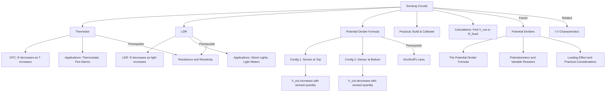

# Sensing Circuits (Thermistor, LDR) / 传感电路（热敏电阻、光敏电阻）

---

# 1. Overview / 概述

**English:**
Sensing circuits are practical applications of [[Potential Dividers]] that convert physical changes in the environment into measurable voltage changes. This sub-topic focuses on two key components: the **thermistor** (temperature-dependent resistor) and the **LDR** (Light-Dependent Resistor). These components form the sensing element in a potential divider circuit, producing an output voltage that varies with temperature or light intensity. Understanding these circuits is essential for real-world applications such as thermostats, automatic lighting systems, and fire alarms. This builds directly on [[The Potential Divider Formula]] and [[Resistance and Resistivity]].

**中文:**
传感电路是[[Potential Dividers]]的实际应用，将环境中的物理变化转换为可测量的电压变化。本子知识点聚焦两个关键元件：**热敏电阻**（温度依赖性电阻）和**LDR**（光敏电阻）。这些元件在分压电路中构成传感元件，产生随温度或光强变化的输出电压。理解这些电路对于恒温器、自动照明系统和火灾报警器等实际应用至关重要。本内容直接建立在[[The Potential Divider Formula]]和[[Resistance and Resistivity]]基础之上。

---

# 2. Syllabus Learning Objectives / 考纲学习目标

| CAIE 9702 | Edexcel IAL |
|-----------|-------------|
| 9.5(a) Describe how the resistance of a thermistor varies with temperature | 3.21 Understand how the resistance of an LDR varies with light intensity |
| 9.5(b) Describe how the resistance of an LDR varies with light intensity | 3.22 Understand how the resistance of a thermistor varies with temperature |
| 9.5(c) Describe the use of a thermistor and an LDR in potential divider circuits | 3.23 Understand the use of thermistors and LDRs in potential divider circuits |
| 9.5(d) Explain how sensing circuits can be used to monitor environmental conditions | 3.24 Explain how sensing circuits can be used to monitor environmental conditions |
| 9.5(e) Solve problems involving thermistors and LDRs in potential divider circuits | — |

**Examiner Expectations / 考官期望:**
- **English:** Students must be able to predict and explain how output voltage changes when temperature or light intensity changes. They must also be able to calculate output voltages and suggest suitable component values for given applications.
- **中文:** 学生必须能够预测并解释当温度或光强变化时输出电压如何变化。还必须能够计算输出电压，并为给定应用建议合适的元件值。

---

# 3. Core Definitions / 核心定义

| Term (EN/CN) | Definition (EN) | Definition (CN) | Common Mistakes / 常见错误 |
|--------------|-----------------|-----------------|---------------------------|
| **Thermistor** / 热敏电阻 | A temperature-dependent resistor whose resistance decreases as temperature increases (NTC type) | 一种温度依赖性电阻，其电阻值随温度升高而降低（NTC型） | Confusing NTC with PTC (positive temperature coefficient) types |
| **LDR** / 光敏电阻 | A Light-Dependent Resistor whose resistance decreases as light intensity increases | 一种光敏电阻，其电阻值随光强增加而降低 | Thinking LDR resistance increases with light |
| **Output Voltage** / 输出电压 | The voltage across the fixed resistor or sensing component in a potential divider sensing circuit | 在分压传感电路中，固定电阻或传感元件两端的电压 | Forgetting to specify which component's voltage is being measured |
| **Threshold** / 阈值 | The specific temperature or light intensity at which the output voltage triggers a response | 输出电压触发响应的特定温度或光强 | Not considering that threshold depends on both resistor values |
| **NTC Thermistor** / 负温度系数热敏电阻 | Negative Temperature Coefficient thermistor — resistance decreases as temperature increases | 负温度系数热敏电阻 — 电阻随温度升高而降低 | Assuming all thermistors behave the same way |

---

# 4. Key Concepts Explained / 关键概念详解

## 4.1 Thermistor Characteristics / 热敏电阻特性

### Explanation / 解释
**English:** A **thermistor** is a semiconductor device whose resistance changes significantly with temperature. The most common type used in A-Level physics is the **NTC (Negative Temperature Coefficient)** thermistor. As temperature increases, more charge carriers (electrons and holes) are released in the semiconductor, causing resistance to decrease. The relationship is non-linear — the resistance change is much more dramatic at lower temperatures. This makes thermistors ideal for precise temperature sensing in circuits like [[Potential Dividers]].

**中文:** 热敏电阻是一种半导体器件，其电阻随温度显著变化。A-Level物理中最常用的是**NTC（负温度系数）**热敏电阻。当温度升高时，半导体中释放出更多载流子（电子和空穴），导致电阻降低。这种关系是非线性的——在较低温度下电阻变化更为剧烈。这使得热敏电阻非常适合在[[Potential Dividers]]等电路中进行精确温度传感。

### Physical Meaning / 物理意义
**English:** The thermistor converts thermal energy into an electrical signal (resistance change). In a potential divider, this resistance change is converted into a voltage change that can be measured or used to trigger other circuits.

**中文:** 热敏电阻将热能转换为电信号（电阻变化）。在分压器中，这种电阻变化被转换为可测量或用于触发其他电路的电压变化。

### Common Misconceptions / 常见误区
- ❌ **English:** "Thermistor resistance increases with temperature" — Only PTC types do; NTC is standard for A-Level.
- ❌ **中文:** "热敏电阻的电阻随温度升高而增大" — 只有PTC型如此；A-Level标准使用NTC。
- ❌ **English:** "The relationship is linear" — It is highly non-linear.
- ❌ **中文:** "关系是线性的" — 实际上高度非线性。
- ❌ **English:** "Thermistor and LDR behave the same way" — They respond to different physical quantities.
- ❌ **中文:** "热敏电阻和光敏电阻行为相同" — 它们响应不同的物理量。

### Exam Tips / 考试提示
- ✅ **English:** Always state "NTC thermistor" and describe resistance decreasing as temperature increases.
- ✅ **中文:** 始终说明"NTC热敏电阻"，并描述电阻随温度升高而降低。
- ✅ **English:** When calculating output voltage, use the thermistor resistance at the specific temperature given.
- ✅ **中文:** 计算输出电压时，使用给定温度下的热敏电阻值。

> 📷 **IMAGE PROMPT — TH01: Thermistor Resistance vs Temperature Graph**
> A graph showing resistance (y-axis) against temperature (x-axis) for an NTC thermistor. The curve starts high on the left (low temperature) and drops steeply, then flattens at higher temperatures. Label axes: "Resistance / Ω" and "Temperature / °C". Show the non-linear, decreasing relationship clearly.

## 4.2 LDR Characteristics / 光敏电阻特性

### Explanation / 解释
**English:** An **LDR (Light-Dependent Resistor)** is a semiconductor device whose resistance decreases as light intensity increases. In darkness, the LDR has very high resistance (typically MΩ range). When light shines on it, photons provide energy to release charge carriers, reducing resistance. In bright light, resistance can drop to just a few hundred ohms. Like the thermistor, the LDR's response is non-linear, with the most significant changes occurring at low light levels.

**中文:** LDR（光敏电阻）是一种半导体器件，其电阻随光强增加而降低。在黑暗中，LDR具有非常高的电阻（通常在MΩ范围）。当光线照射时，光子提供能量释放载流子，降低电阻。在强光下，电阻可降至仅几百欧姆。与热敏电阻类似，LDR的响应是非线性的，在低光照水平下变化最为显著。

### Physical Meaning / 物理意义
**English:** The LDR converts light energy into an electrical signal. In a potential divider circuit, this allows the circuit to "sense" light levels and produce a corresponding voltage output.

**中文:** LDR将光能转换为电信号。在分压电路中，这使得电路能够"感知"光照水平并产生相应的电压输出。

### Common Misconceptions / 常见误区
- ❌ **English:** "LDR resistance increases with light" — It decreases.
- ❌ **中文:** "LDR电阻随光强增加而增大" — 实际上是减小。
- ❌ **English:** "LDR works like a solar cell" — LDR changes resistance; solar cells generate voltage.
- ❌ **中文:** "LDR像太阳能电池一样工作" — LDR改变电阻；太阳能电池产生电压。
- ❌ **English:** "The relationship is linear" — It is non-linear, especially at low light.
- ❌ **中文:** "关系是线性的" — 是非线性的，尤其在低光照下。

### Exam Tips / 考试提示
- ✅ **English:** Remember: Dark = High Resistance; Bright = Low Resistance.
- ✅ **中文:** 记住：暗 = 高电阻；亮 = 低电阻。
- ✅ **English:** For calculations, you'll typically be given the LDR resistance at specific light intensities.
- ✅ **中文:** 计算时，通常会给出特定光强下的LDR电阻值。

> 📷 **IMAGE PROMPT — LDR01: LDR Resistance vs Light Intensity Graph**
> A graph showing resistance (y-axis) against light intensity (x-axis) for an LDR. The curve starts very high on the left (dark) and drops steeply, then flattens at higher light intensities. Label axes: "Resistance / Ω" and "Light Intensity / lux". Show the non-linear, decreasing relationship.

## 4.3 Sensing Circuit Configurations / 传感电路配置

### Explanation / 解释
**English:** A sensing circuit uses a [[Potential Divider]] with one sensing component (thermistor or LDR) and one fixed resistor. There are two common configurations:

1. **Sensing component at the top** (between V_in and V_out): As resistance decreases, V_out decreases.
2. **Sensing component at the bottom** (between V_out and ground): As resistance decreases, V_out increases.

The choice depends on the desired response — whether you want the output voltage to increase or decrease with the sensed quantity.

**中文:** 传感电路使用一个[[Potential Divider]]，包含一个传感元件（热敏电阻或LDR）和一个固定电阻。有两种常见配置：

1. **传感元件在上方**（V_in和V_out之间）：电阻降低时，V_out降低。
2. **传感元件在下方**（V_out和地之间）：电阻降低时，V_out升高。

选择取决于所需响应——是否希望输出电压随被感知量增加或减少。

### Physical Meaning / 物理意义
**English:** The circuit converts a physical change (temperature or light) into a voltage signal that can be used by other circuits (e.g., comparators, transistors, microcontrollers) to trigger actions like switching on a heater or turning on a light.

**中文:** 该电路将物理变化（温度或光）转换为电压信号，供其他电路（如比较器、晶体管、微控制器）使用，以触发诸如打开加热器或开启灯光等动作。

### Common Misconceptions / 常见误区
- ❌ **English:** "The output voltage is always across the sensing component" — It can be across either component.
- ❌ **中文:** "输出电压总是在传感元件两端" — 可以在任一元件两端。
- ❌ **English:** "Only one configuration works" — Both work; choose based on application.
- ❌ **中文:** "只有一种配置有效" — 两种都有效；根据应用选择。

### Exam Tips / 考试提示
- ✅ **English:** Always state which component's voltage is the output voltage.
- ✅ **中文:** 始终说明哪个元件的电压是输出电压。
- ✅ **English:** Use the potential divider formula: $$V_{out} = V_{in} \times \frac{R_{bottom}}{R_{top} + R_{bottom}}$$
- ✅ **中文:** 使用分压公式：$$V_{out} = V_{in} \times \frac{R_{bottom}}{R_{top} + R_{bottom}}$$

> 📷 **IMAGE PROMPT — SC01: Two Sensing Circuit Configurations**
> Two circuit diagrams side by side. Left: Thermistor at top (R1), fixed resistor at bottom (R2), V_out across R2. Right: Fixed resistor at top (R1), thermistor at bottom (R2), V_out across R2. Label V_in, V_out, ground. Show arrows indicating temperature change direction.

---

# 5. Essential Equations / 核心公式

## 5.1 Potential Divider Formula / 分压公式

$$ V_{out} = V_{in} \times \frac{R_{bottom}}{R_{top} + R_{bottom}} $$

| Symbol (符号) | Meaning (EN) | Meaning (CN) | Unit (单位) |
|--------------|-------------|-------------|------------|
| $V_{out}$ | Output voltage | 输出电压 | V |
| $V_{in}$ | Input (supply) voltage | 输入（电源）电压 | V |
| $R_{bottom}$ | Resistance of the lower component | 下方元件的电阻 | Ω |
| $R_{top}$ | Resistance of the upper component | 上方元件的电阻 | Ω |

**Derivation / 推导:** Derived from [[The Potential Divider Formula]] using current conservation and Ohm's law.

**Conditions / 适用条件:**
- **English:** Components are in series; no significant current is drawn from V_out (no loading effect).
- **中文:** 元件串联；V_out处无显著电流抽取（无负载效应）。

**Limitations / 局限性:**
- **English:** Assumes ideal conditions; real circuits may have [[Loading Effect and Practical Considerations]].
- **中文:** 假设理想条件；实际电路可能存在[[Loading Effect and Practical Considerations]]。

## 5.2 Output Voltage for Specific Configurations / 特定配置的输出电压

**Configuration 1: Sensing component at top (R_sensor = R_top)**

$$ V_{out} = V_{in} \times \frac{R_{fixed}}{R_{sensor} + R_{fixed}} $$

- As $R_{sensor} \downarrow$, $V_{out} \uparrow$ (inverse relationship)

**Configuration 2: Sensing component at bottom (R_sensor = R_bottom)**

$$ V_{out} = V_{in} \times \frac{R_{sensor}}{R_{fixed} + R_{sensor}} $$

- As $R_{sensor} \downarrow$, $V_{out} \downarrow$ (direct relationship)

| Symbol (符号) | Meaning (EN) | Meaning (CN) | Unit (单位) |
|--------------|-------------|-------------|------------|
| $R_{sensor}$ | Thermistor or LDR resistance | 热敏电阻或LDR的电阻 | Ω |
| $R_{fixed}$ | Fixed resistor value | 固定电阻值 | Ω |

> 📋 **CIE Only:** Students must be able to solve problems involving both configurations.
> 📋 **Edexcel Only:** Focus on qualitative understanding and simple calculations.

---

# 6. Graphs and Relationships / 图表与关系

## 6.1 Output Voltage vs Temperature (Thermistor Circuit) / 输出电压与温度关系（热敏电阻电路）

### Axes / 坐标轴
- **X-axis:** Temperature / °C (温度)
- **Y-axis:** Output Voltage / V (输出电压)

### Shape / 形状
**English:** The shape depends on the configuration:
- **Thermistor at top:** V_out increases with temperature (curve flattens at high T)
- **Thermistor at bottom:** V_out decreases with temperature (curve flattens at high T)

**中文:** 形状取决于配置：
- **热敏电阻在上方：** V_out随温度升高而增加（高温时曲线变平）
- **热敏电阻在下方：** V_out随温度降低而减小（高温时曲线变平）

### Gradient Meaning / 斜率含义
**English:** The gradient shows the sensitivity of the circuit — how much V_out changes per degree. Steeper gradient = more sensitive.

**中文:** 斜率表示电路的灵敏度——每度V_out的变化量。斜率越陡 = 越灵敏。

### Area Meaning / 面积含义
**English:** Not applicable for this graph.

**中文:** 不适用于此图。

### Exam Interpretation / 考试解读
**English:** Be able to sketch the graph shape and explain why it flattens at extremes (thermistor resistance changes less at high temperatures).

**中文:** 能够绘制图形形状并解释为何在极端情况下曲线变平（高温时热敏电阻变化较小）。

> 📷 **IMAGE PROMPT — TH02: Output Voltage vs Temperature Graphs**
> Two graphs side by side. Left: V_out vs T with thermistor at top — curve rises steeply then flattens. Right: V_out vs T with thermistor at bottom — curve drops steeply then flattens. Label both axes clearly.

## 6.2 Output Voltage vs Light Intensity (LDR Circuit) / 输出电压与光强关系（LDR电路）

### Axes / 坐标轴
- **X-axis:** Light Intensity / lux (光强)
- **Y-axis:** Output Voltage / V (输出电压)

### Shape / 形状
**English:** Similar to thermistor:
- **LDR at top:** V_out increases with light intensity
- **LDR at bottom:** V_out decreases with light intensity

**中文:** 与热敏电阻类似：
- **LDR在上方：** V_out随光强增加而增加
- **LDR在下方：** V_out随光强增加而减小

### Gradient Meaning / 斜率含义
**English:** Sensitivity of the circuit to light changes. Steeper at low light levels.

**中文:** 电路对光变化的灵敏度。在低光照水平下更陡。

### Area Meaning / 面积含义
**English:** Not applicable.

**中文:** 不适用。

### Exam Interpretation / 考试解读
**English:** Be able to explain why the circuit is more sensitive at low light levels (LDR resistance changes more dramatically in dim conditions).

**中文:** 能够解释为何电路在低光照下更灵敏（LDR电阻在昏暗条件下变化更剧烈）。

> 📷 **IMAGE PROMPT — LDR02: Output Voltage vs Light Intensity Graphs**
> Two graphs side by side. Left: V_out vs light intensity with LDR at top — curve rises steeply then flattens. Right: V_out vs light intensity with LDR at bottom — curve drops steeply then flattens. Label both axes clearly.

---

# 7. Required Diagrams / 必备图表

## 7.1 Thermistor Sensing Circuit / 热敏电阻传感电路

### Description / 描述
**English:** A potential divider circuit with a thermistor and a fixed resistor, showing the output voltage connection. Include labels for the thermistor, fixed resistor, input voltage, output voltage, and ground.

**中文:** 包含热敏电阻和固定电阻的分压电路，显示输出电压连接。标注热敏电阻、固定电阻、输入电压、输出电压和地。

### Image Prompt / 图片生成提示
> 📷 **IMAGE PROMPT — SC02: Thermistor Sensing Circuit Diagram**
> A clear circuit diagram showing a potential divider with a 5V DC supply at the top, a thermistor (labeled "Thermistor" with temperature symbol) as the top resistor, a fixed resistor (labeled "R_fixed = 10 kΩ") as the bottom resistor, V_out taken across the fixed resistor, and ground at the bottom. Use standard circuit symbols. Add a small arrow pointing to the thermistor labeled "Temperature ↑".

### Labels Required / 需要标注
- **English:** V_in, V_out, Thermistor, R_fixed, Ground, Temperature direction arrow
- **中文:** V_in（输入电压）、V_out（输出电压）、热敏电阻、R_fixed（固定电阻）、地（Ground）、温度方向箭头

### Exam Importance / 考试重要性
- **English:** High — students must be able to draw and label this circuit from memory.
- **中文:** 高 — 学生必须能够凭记忆绘制并标注此电路。

## 7.2 LDR Sensing Circuit / 光敏电阻传感电路

### Description / 描述
**English:** A potential divider circuit with an LDR and a fixed resistor, showing the output voltage connection. Include labels for the LDR, fixed resistor, input voltage, output voltage, and ground.

**中文:** 包含LDR和固定电阻的分压电路，显示输出电压连接。标注LDR、固定电阻、输入电压、输出电压和地。

### Image Prompt / 图片生成提示
> 📷 **IMAGE PROMPT — SC03: LDR Sensing Circuit Diagram**
> A clear circuit diagram showing a potential divider with a 5V DC supply at the top, a fixed resistor (labeled "R_fixed = 10 kΩ") as the top resistor, an LDR (labeled "LDR" with light symbol) as the bottom resistor, V_out taken across the LDR, and ground at the bottom. Use standard circuit symbols. Add a small arrow pointing to the LDR labeled "Light ↑".

### Labels Required / 需要标注
- **English:** V_in, V_out, LDR, R_fixed, Ground, Light direction arrow
- **中文:** V_in（输入电压）、V_out（输出电压）、LDR、R_fixed（固定电阻）、地（Ground）、光方向箭头

### Exam Importance / 考试重要性
- **English:** High — students must be able to draw and label this circuit from memory.
- **中文:** 高 — 学生必须能够凭记忆绘制并标注此电路。

---

# 8. Worked Examples / 典型例题

## Example 1: Thermistor Circuit Calculation / 热敏电阻电路计算

### Question / 题目
**English:**
A potential divider circuit uses a 5.0 V supply, a thermistor (R_T) and a fixed resistor (R = 2.0 kΩ). The thermistor is placed at the top of the divider. At 20°C, the thermistor resistance is 8.0 kΩ. At 60°C, it is 1.0 kΩ.

(a) Calculate the output voltage at 20°C.
(b) Calculate the output voltage at 60°C.
(c) Explain why this circuit could be used as a fire alarm sensor.

**中文:**
一个分压电路使用5.0 V电源、一个热敏电阻（R_T）和一个固定电阻（R = 2.0 kΩ）。热敏电阻放置在分压器上方。在20°C时，热敏电阻为8.0 kΩ。在60°C时，为1.0 kΩ。

(a) 计算20°C时的输出电压。
(b) 计算60°C时的输出电压。
(c) 解释为何此电路可用作火灾报警传感器。

### Solution / 解答

**(a)** At 20°C:
- R_T = 8.0 kΩ, R_fixed = 2.0 kΩ
- V_out is across the fixed resistor (bottom component)
- $$V_{out} = V_{in} \times \frac{R_{fixed}}{R_T + R_{fixed}} = 5.0 \times \frac{2.0}{8.0 + 2.0} = 5.0 \times \frac{2.0}{10.0} = 1.0 \text{ V}$$

**(b)** At 60°C:
- R_T = 1.0 kΩ, R_fixed = 2.0 kΩ
- $$V_{out} = 5.0 \times \frac{2.0}{1.0 + 2.0} = 5.0 \times \frac{2.0}{3.0} = 3.33 \text{ V}$$

**(c)** At normal temperatures, V_out is low (1.0 V). When temperature rises (e.g., in a fire), thermistor resistance drops, V_out rises to 3.33 V. This voltage change can trigger a comparator circuit to sound an alarm.

### Final Answer / 最终答案
**Answer:** (a) 1.0 V, (b) 3.33 V | **答案：** (a) 1.0 V, (b) 3.33 V

### Quick Tip / 提示
**English:** Always check which component is at the bottom of the divider — that's where V_out is measured.
**中文:** 始终检查哪个元件在分压器下方——那里就是测量V_out的位置。

## Example 2: LDR Circuit Design / LDR电路设计

### Question / 题目
**English:**
An LDR has resistance 500 kΩ in darkness and 5.0 kΩ in bright light. It is used in a potential divider with a 12 V supply and a fixed resistor R. The output voltage is taken across the LDR, which is at the bottom of the divider. The circuit should give V_out = 8.0 V in bright light.

(a) Calculate the required value of R.
(b) Calculate V_out in darkness.
(c) Suggest a practical application for this circuit.

**中文:**
一个LDR在黑暗中电阻为500 kΩ，在强光下为5.0 kΩ。它与12 V电源和一个固定电阻R组成分压电路。输出电压取自LDR两端，LDR在分压器下方。电路应在强光下给出V_out = 8.0 V。

(a) 计算所需的R值。
(b) 计算黑暗中的V_out。
(c) 建议此电路的实际应用。

### Solution / 解答

**(a)** In bright light: R_LDR = 5.0 kΩ, V_out = 8.0 V
- $$V_{out} = V_{in} \times \frac{R_{LDR}}{R + R_{LDR}}$$
- $$8.0 = 12 \times \frac{5.0}{R + 5.0}$$
- $$\frac{8.0}{12} = \frac{5.0}{R + 5.0}$$
- $$0.667 = \frac{5.0}{R + 5.0}$$
- $$R + 5.0 = \frac{5.0}{0.667} = 7.5$$
- $$R = 7.5 - 5.0 = 2.5 \text{ kΩ}$$

**(b)** In darkness: R_LDR = 500 kΩ
- $$V_{out} = 12 \times \frac{500}{2.5 + 500} = 12 \times \frac{500}{502.5} = 11.94 \text{ V}$$

**(c)** This circuit could be used as a **darkness detector** — V_out is high (≈12 V) in darkness and drops to 8.0 V in bright light. A comparator set to trigger at, say, 10 V would activate a circuit when it gets dark (e.g., switching on street lights).

### Final Answer / 最终答案
**Answer:** (a) R = 2.5 kΩ, (b) V_out = 11.94 V | **答案：** (a) R = 2.5 kΩ, (b) V_out = 11.94 V

### Quick Tip / 提示
**English:** When designing circuits, choose R_fixed to be comparable to the sensor's resistance in the condition you want to detect.
**中文:** 设计电路时，选择与传感器在目标检测条件下的电阻值相当的固定电阻。

---

# 9. Past Paper Question Types / 历年真题题型

| Question Type / 题型 | Frequency / 频率 | Difficulty / 难度 | Past Paper References / 真题索引 |
|----------------------|------------------|------------------|-------------------------------|
| Calculate V_out given component values | Very High | Easy | 📝 *待填入* |
| Explain how V_out changes with temperature/light | Very High | Medium | 📝 *待填入* |
| Suggest suitable component values for an application | High | Medium-Hard | 📝 *待填入* |
| Draw and label a sensing circuit | Medium | Easy | 📝 *待填入* |
| Sketch V_out vs temperature/light graph | Medium | Medium | 📝 *待填入* |
| Compare thermistor and LDR behavior | Low | Easy | 📝 *待填入* |

**Common Command Words / 常见指令词:**
- **English:** Calculate, Explain, Suggest, Draw, Sketch, Describe, Determine
- **中文:** 计算、解释、建议、绘制、画出、描述、确定

---

# 10. Practical Skills Connections / 实验技能链接

**English:**
Sensing circuits connect to practical work in several ways:

1. **Component Characteristics:** You may be asked to experimentally determine the resistance-temperature relationship of a thermistor or resistance-light intensity relationship of an LDR. This involves using an ohmmeter or a [[Potential Divider]] circuit with a voltmeter.

2. **Uncertainty Analysis:** When measuring resistance values, consider uncertainties in temperature measurement (±0.5°C) and voltage readings (±0.01 V). Calculate percentage uncertainties in final V_out values.

3. **Graph Plotting:** Plot resistance vs temperature/light intensity graphs. Identify non-linear regions and calculate sensitivity (ΔR/ΔT or ΔR/Δlux).

4. **Circuit Construction:** Build a sensing circuit on a breadboard. Use a multimeter to measure V_out while changing temperature (using a water bath) or light intensity (using a lamp at varying distances).

5. **Calibration:** Calibrate the circuit by measuring V_out at known temperatures/light intensities. Create a calibration curve for the sensor.

**中文:**
传感电路在实验中的连接方式：

1. **元件特性：** 可能要求通过实验确定热敏电阻的电阻-温度关系或LDR的电阻-光强关系。这涉及使用欧姆表或带电压表的[[Potential Divider]]电路。

2. **不确定度分析：** 测量电阻值时，考虑温度测量（±0.5°C）和电压读数（±0.01 V）的不确定度。计算最终V_out值的百分比不确定度。

3. **图表绘制：** 绘制电阻与温度/光强关系图。识别非线性区域并计算灵敏度（ΔR/ΔT或ΔR/Δlux）。

4. **电路搭建：** 在面包板上搭建传感电路。使用万用表测量V_out，同时改变温度（使用水浴）或光强（使用不同距离的灯）。

5. **校准：** 通过在已知温度/光强下测量V_out来校准电路。为传感器创建校准曲线。

---

# 11. Concept Map / 概念图谱

---

# 12. Quick Revision Sheet / 速查表

| Category / 类别 | Key Points / 要点 |
|----------------|------------------|
| **Definition / 定义** | Sensing circuits use [[Potential Dividers]] with thermistors or LDRs to convert physical changes into voltage changes |
| **Thermistor / 热敏电阻** | NTC type: R ↓ as T ↑. Non-linear response. Used for temperature sensing |
| **LDR / 光敏电阻** | R ↓ as light intensity ↑. Non-linear response. Used for light sensing |
| **Key Formula / 核心公式** | $$V_{out} = V_{in} \times \frac{R_{bottom}}{R_{top} + R_{bottom}}$$ |
| **Config 1: Sensor at Top / 配置1：传感器在上方** | As sensor R ↓, V_out ↑ (inverse relationship) |
| **Config 2: Sensor at Bottom / 配置2：传感器在下方** | As sensor R ↓, V_out ↓ (direct relationship) |
| **Key Graph / 核心图表** | V_out vs T (or light) — non-linear, flattens at extremes |
| **Common Application / 常见应用** | Fire alarm: Thermistor at top → high T → high V_out → trigger alarm |
| **Common Application / 常见应用** | Street light: LDR at bottom → dark → high R → high V_out → lights on |
| **Exam Tip / 考试提示** | Always specify which component V_out is across. Check if sensor is top or bottom. Use correct formula. |
| **Practical Tip / 实验提示** | Calibrate the circuit at known temperatures/light intensities. Account for uncertainties. |
| **Common Mistake / 常见错误** | Confusing NTC with PTC. Thinking LDR R increases with light. Assuming linear response. |

---

> **Parent Hub:** [[Potential Dividers]]
> **Sibling Topics:** [[The Potential Divider Formula]], [[Potentiometers and Variable Resistors]], [[Loading Effect and Practical Considerations]]
> **Prerequisites:** [[Resistance and Resistivity]], [[Kirchhoff's Laws]]
> **Related Topics:** [[I-V Characteristics]]