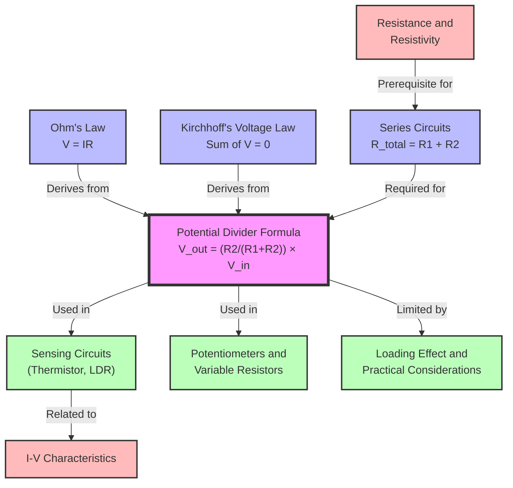

# The Potential Divider Formula / 分压器公式

---

# 1. Overview / 概述

**English:**
The potential divider formula is the mathematical backbone of all potential divider circuits. It allows us to calculate the output voltage ($V_{out}$) across one of two series resistors, given the input voltage ($V_{in}$) and the two resistance values. This formula is derived directly from [[Kirchhoff's Laws]] and [[Resistance and Resistivity]] principles. Understanding this formula is essential for designing [[Sensing Circuits (Thermistor, LDR)]] and understanding how [[Potentiometers and Variable Resistors]] work. The formula shows that the output voltage is proportional to the fraction of total resistance that the output resistor represents.

**中文:**
分压器公式是所有分压器电路的数学基础。它使我们能够根据输入电压 ($V_{in}$) 和两个电阻值，计算跨其中一个串联电阻的输出电压 ($V_{out}$)。该公式直接源自[[基尔霍夫定律]]和[[电阻与电阻率]]原理。理解这个公式对于设计[[传感电路（热敏电阻、光敏电阻）]]以及理解[[电位器和可变电阻器]]的工作原理至关重要。该公式表明，输出电压与输出电阻占总电阻的比例成正比。

---

# 2. Syllabus Learning Objectives / 考纲学习目标

| CAIE 9702 | Edexcel IAL |
|-----------|-------------|
| 9.5(a): Derive and use the potential divider formula $V_{out} = \frac{R_2}{R_1 + R_2} V_{in}$ | 3.21: Derive and use the potential divider formula |
| 9.5(b): Explain how the output voltage varies with resistance changes | 3.22: Calculate output voltage for given resistor values |
| 9.5(c): Use the formula to design circuits with specific output voltages | 3.23: Explain the effect of changing one resistor |
| 9.5(d): Apply the formula to circuits with variable resistors | 3.24: Use the formula in sensing circuit contexts |
| 9.5(e): Understand the relationship between $V_{out}$ and resistance ratio | |

**Examiner Expectations / 考官期望:**
- **English:** Students must be able to derive the formula from Ohm's Law and Kirchhoff's Voltage Law. They must apply it to both fixed-resistor dividers and variable-resistor circuits. Common errors include using the wrong resistor in the numerator or forgetting that the formula assumes no current is drawn from $V_{out}$.
- **中文:** 学生必须能够从欧姆定律和基尔霍夫电压定律推导出该公式。他们必须能够将其应用于固定电阻分压器和可变电阻电路。常见错误包括在分子中使用错误的电阻，或忘记该公式假设没有电流从 $V_{out}$ 端流出。

---

# 3. Core Definitions / 核心定义

| Term (EN/CN) | Definition (EN) | Definition (CN) | Common Mistakes / 常见错误 |
|--------------|-----------------|-----------------|---------------------------|
| **Potential Divider** / 分压器 | A circuit that uses two or more series resistors to produce a fraction of the input voltage across one resistor | 使用两个或多个串联电阻，在其中一个电阻上产生输入电压的一部分的电路 | Confusing with current divider circuits |
| **Input Voltage ($V_{in}$)** / 输入电压 | The total voltage applied across the series combination of resistors | 施加在串联电阻组合两端的总电压 | Forgetting $V_{in}$ is the total voltage, not the supply voltage if there are other components |
| **Output Voltage ($V_{out}$)** / 输出电压 | The voltage measured across one of the resistors in the divider | 在分压器中其中一个电阻两端测得的电压 | Assuming $V_{out}$ is always across the bottom resistor |
| **Ratio ($\frac{R_2}{R_1+R_2}$)** / 比例 | The fraction of total resistance that the output resistor represents | 输出电阻占总电阻的比例 | Using $\frac{R_1}{R_2}$ instead of $\frac{R_2}{R_1+R_2}$ |
| **Load** / 负载 | Any component connected across $V_{out}$ that draws current | 连接在 $V_{out}$ 两端并消耗电流的任何元件 | Ignoring [[Loading Effect and Practical Considerations]] when a load is connected |

---

# 4. Key Concepts Explained / 关键概念详解

## 4.1 Derivation of the Formula / 公式推导

### Explanation / 解释
**English:**
Consider two resistors $R_1$ and $R_2$ connected in series across a voltage source $V_{in}$. From [[Kirchhoff's Laws]]:
- The total resistance is $R_{total} = R_1 + R_2$
- The current through both resistors is the same: $I = \frac{V_{in}}{R_1 + R_2}$ (from Ohm's Law)
- The voltage across $R_2$ is $V_{out} = I \times R_2 = \frac{V_{in}}{R_1 + R_2} \times R_2$

Therefore: $$V_{out} = \frac{R_2}{R_1 + R_2} V_{in}$$

Similarly, the voltage across $R_1$ is: $$V_1 = \frac{R_1}{R_1 + R_2} V_{in}$$

**中文:**
考虑两个电阻 $R_1$ 和 $R_2$ 串联连接在电压源 $V_{in}$ 两端。根据[[基尔霍夫定律]]：
- 总电阻为 $R_{total} = R_1 + R_2$
- 通过两个电阻的电流相同：$I = \frac{V_{in}}{R_1 + R_2}$（根据欧姆定律）
- $R_2$ 两端的电压为 $V_{out} = I \times R_2 = \frac{V_{in}}{R_1 + R_2} \times R_2$

因此：$$V_{out} = \frac{R_2}{R_1 + R_2} V_{in}$$

类似地，$R_1$ 两端的电压为：$$V_1 = \frac{R_1}{R_1 + R_2} V_{in}$$

### Physical Meaning / 物理意义
**English:** The formula shows that $V_{out}$ is a fraction of $V_{in}$, where the fraction is determined by the ratio of $R_2$ to the total resistance. If $R_2$ is large compared to $R_1$, $V_{out}$ is close to $V_{in}$. If $R_2$ is small, $V_{out}$ is close to 0 V. This is because voltage drops across series resistors are proportional to their resistances.

**中文:** 该公式表明 $V_{out}$ 是 $V_{in}$ 的一部分，该部分由 $R_2$ 与总电阻的比值决定。如果 $R_2$ 相对于 $R_1$ 较大，则 $V_{out}$ 接近 $V_{in}$。如果 $R_2$ 较小，则 $V_{out}$ 接近 0 V。这是因为串联电阻上的电压降与其电阻成正比。

### Common Misconceptions / 常见误区
- **English:**
  - Thinking $V_{out}$ is always across $R_2$ — it can be across either resistor
  - Forgetting that the formula assumes no current is drawn from the output
  - Using $V_{out} = \frac{R_1}{R_2} V_{in}$ — this is dimensionally incorrect
  - Confusing $V_{out}$ with the voltage across the entire divider
- **中文:**
  - 认为 $V_{out}$ 总是在 $R_2$ 两端——它可以在任一电阻两端
  - 忘记该公式假设没有电流从输出端流出
  - 使用 $V_{out} = \frac{R_1}{R_2} V_{in}$——这在量纲上不正确
  - 将 $V_{out}$ 与整个分压器两端的电压混淆

### Exam Tips / 考试提示
- **English:** Always identify which resistor $V_{out}$ is across. Check that the resistor in the numerator matches the output resistor. Remember the formula works for any two series resistors, not just fixed ones — it applies to [[Sensing Circuits (Thermistor, LDR)]] where one resistor varies.
- **中文:** 始终确定 $V_{out}$ 跨哪个电阻。检查分子中的电阻是否与输出电阻匹配。记住该公式适用于任何两个串联电阻，不仅仅是固定电阻——它适用于其中一个电阻变化的[[传感电路（热敏电阻、光敏电阻）]]。

> 📷 **IMAGE PROMPT — DERIVATION: Potential Divider Circuit Diagram**
> A clear circuit diagram showing two resistors R1 and R2 in series. Label Vin across the entire combination, Vout across R2. Show the current I flowing through both resistors. Use standard circuit symbols. Include voltage arrows showing Vin and Vout. Clean white background, educational style.

---

## 4.2 The Ratio Principle / 比例原理

### Explanation / 解释
**English:**
The potential divider formula can be understood as a ratio: $$\frac{V_{out}}{V_{in}} = \frac{R_2}{R_1 + R_2}$$

This means the fraction of input voltage that appears at the output is exactly equal to the fraction of total resistance that $R_2$ represents. If $R_2$ is 30% of the total resistance, then $V_{out}$ is 30% of $V_{in}$.

**中文:**
分压器公式可以理解为一个比例：$$\frac{V_{out}}{V_{in}} = \frac{R_2}{R_1 + R_2}$$

这意味着出现在输出端的输入电压的比例恰好等于 $R_2$ 占总电阻的比例。如果 $R_2$ 占总电阻的 30%，那么 $V_{out}$ 就是 $V_{in}$ 的 30%。

### Special Cases / 特殊情况
- **English:**
  - If $R_2 = 0$: $V_{out} = 0$ V (short circuit across output)
  - If $R_1 = 0$: $V_{out} = V_{in}$ (output directly connected to supply)
  - If $R_1 = R_2$: $V_{out} = \frac{1}{2} V_{in}$ (equal division)
  - If $R_2 \gg R_1$: $V_{out} \approx V_{in}$ (most voltage across $R_2$)
  - If $R_2 \ll R_1$: $V_{out} \approx 0$ V (most voltage across $R_1$)
- **中文:**
  - 如果 $R_2 = 0$：$V_{out} = 0$ V（输出端短路）
  - 如果 $R_1 = 0$：$V_{out} = V_{in}$（输出端直接连接到电源）
  - 如果 $R_1 = R_2$：$V_{out} = \frac{1}{2} V_{in}$（等分）
  - 如果 $R_2 \gg R_1$：$V_{out} \approx V_{in}$（大部分电压在 $R_2$ 上）
  - 如果 $R_2 \ll R_1$：$V_{out} \approx 0$ V（大部分电压在 $R_1$ 上）

---

# 5. Essential Equations / 核心公式

## 5.1 Standard Potential Divider Formula / 标准分压器公式

$$V_{out} = \frac{R_2}{R_1 + R_2} V_{in}$$

| Symbol (符号) | Meaning (EN) | Meaning (CN) | Unit (单位) |
|--------------|-------------|-------------|------------|
| $V_{out}$ | Output voltage across $R_2$ | $R_2$ 两端的输出电压 | V (伏特) |
| $V_{in}$ | Input voltage across the series combination | 串联组合两端的输入电压 | V (伏特) |
| $R_1$ | First series resistor | 第一个串联电阻 | Ω (欧姆) |
| $R_2$ | Second series resistor (output resistor) | 第二个串联电阻（输出电阻） | Ω (欧姆) |

**Derivation / 推导:**
From Ohm's Law: $I = \frac{V_{in}}{R_1 + R_2}$
From Ohm's Law across $R_2$: $V_{out} = I R_2 = \frac{V_{in}}{R_1 + R_2} \times R_2$

**Conditions / 适用条件:**
- **English:** The formula assumes no current is drawn from the output terminal. If a load is connected, the [[Loading Effect and Practical Considerations]] must be accounted for. The resistors must be in series with no other branches.
- **中文:** 该公式假设没有电流从输出端流出。如果连接了负载，必须考虑[[负载效应和实际考虑]]。电阻必须串联，没有其他分支。

**Limitations / 局限性:**
- **English:** The formula becomes inaccurate when significant current is drawn from $V_{out}$. It only applies to DC circuits with linear resistors (Ohmic behavior). It does not account for internal resistance of the voltage source.
- **中文:** 当从 $V_{out}$ 端流出显著电流时，该公式变得不准确。它仅适用于具有线性电阻（欧姆行为）的直流电路。它不考虑电压源的内阻。

## 5.2 Alternative Form (Voltage across $R_1$) / 替代形式（$R_1$ 两端的电压）

$$V_1 = \frac{R_1}{R_1 + R_2} V_{in}$$

| Symbol (符号) | Meaning (EN) | Meaning (CN) | Unit (单位) |
|--------------|-------------|-------------|------------|
| $V_1$ | Voltage across $R_1$ | $R_1$ 两端的电压 | V (伏特) |

**Note / 注意:**
- **English:** $V_1 + V_{out} = V_{in}$ (Kirchhoff's Voltage Law)
- **中文:** $V_1 + V_{out} = V_{in}$（基尔霍夫电压定律）

## 5.3 Ratio Form / 比例形式

$$\frac{V_{out}}{V_{in}} = \frac{R_2}{R_1 + R_2}$$

**Use / 用途:**
- **English:** Useful for quickly determining the fraction of input voltage that appears at the output without calculating absolute values.
- **中文:** 用于快速确定出现在输出端的输入电压的比例，无需计算绝对值。

---

# 6. Graphs and Relationships / 图表与关系

## 6.1 $V_{out}$ vs $R_2$ (Fixed $R_1$ and $V_{in}$) / $V_{out}$ 随 $R_2$ 变化（固定 $R_1$ 和 $V_{in}$）

### Axes / 坐标轴
- **X-axis:** $R_2$ (Ω) — resistance of the output resistor
- **Y-axis:** $V_{out}$ (V) — output voltage
- **X轴：** $R_2$ (Ω) — 输出电阻的阻值
- **Y轴：** $V_{out}$ (V) — 输出电压

### Shape / 形状
- **English:** A curve that starts at (0, 0) and approaches $V_{in}$ asymptotically as $R_2 \to \infty$. The curve is concave down (increasing but at a decreasing rate).
- **中文:** 一条从 (0, 0) 开始，随着 $R_2 \to \infty$ 渐近接近 $V_{in}$ 的曲线。曲线向下凹（增加但速率递减）。

### Gradient Meaning / 斜率含义
- **English:** The gradient $\frac{dV_{out}}{dR_2} = \frac{R_1 V_{in}}{(R_1 + R_2)^2}$ shows how sensitive $V_{out}$ is to changes in $R_2$. The gradient is largest when $R_2$ is small.
- **中文:** 梯度 $\frac{dV_{out}}{dR_2} = \frac{R_1 V_{in}}{(R_1 + R_2)^2}$ 表示 $V_{out}$ 对 $R_2$ 变化的敏感程度。当 $R_2$ 较小时，梯度最大。

### Area Meaning / 面积含义
- **English:** The area under the curve has no direct physical meaning in this context.
- **中文:** 曲线下的面积在此上下文中没有直接的物理意义。

### Exam Interpretation / 考试解读
- **English:** This graph is crucial for understanding [[Sensing Circuits (Thermistor, LDR)]]. When a thermistor's resistance changes with temperature, the output voltage changes according to this curve. The steepest part of the curve gives the most sensitive temperature measurement.
- **中文:** 该图对于理解[[传感电路（热敏电阻、光敏电阻）]]至关重要。当热敏电阻的电阻随温度变化时，输出电压根据该曲线变化。曲线最陡的部分提供最灵敏的温度测量。

> 📷 **IMAGE PROMPT — GRAPH: Vout vs R2 for Potential Divider**
> A graph showing Vout on the y-axis and R2 on the x-axis. The curve starts at (0,0) and rises asymptotically towards Vin. Label Vin as a horizontal dashed line. Show R1 as a fixed value. The curve should be concave down. Include axis labels with units. Educational style, clean background.

---

## 6.2 $V_{out}$ vs $R_1$ (Fixed $R_2$ and $V_{in}$) / $V_{out}$ 随 $R_1$ 变化（固定 $R_2$ 和 $V_{in}$）

### Axes / 坐标轴
- **X-axis:** $R_1$ (Ω) — resistance of the top resistor
- **Y-axis:** $V_{out}$ (V) — output voltage
- **X轴：** $R_1$ (Ω) — 顶部电阻的阻值
- **Y轴：** $V_{out}$ (V) — 输出电压

### Shape / 形状
- **English:** A curve that starts at $V_{in}$ when $R_1 = 0$ and approaches 0 V as $R_1 \to \infty$. The curve is concave up (decreasing but at a decreasing rate).
- **中文:** 一条从 $R_1 = 0$ 时的 $V_{in}$ 开始，随着 $R_1 \to \infty$ 接近 0 V 的曲线。曲线向上凹（减少但速率递减）。

### Gradient Meaning / 斜率含义
- **English:** The gradient is negative, showing that increasing $R_1$ decreases $V_{out}$. The magnitude of the gradient is largest when $R_1$ is small.
- **中文:** 梯度为负，表明增加 $R_1$ 会降低 $V_{out}$。当 $R_1$ 较小时，梯度的大小最大。

---

# 7. Required Diagrams / 必备图表

## 7.1 Standard Potential Divider Circuit / 标准分压器电路

### Description / 描述
- **English:** A circuit diagram showing a voltage source $V_{in}$ connected across two series resistors $R_1$ and $R_2$. The output voltage $V_{out}$ is measured across $R_2$. Current $I$ flows through both resistors.
- **中文:** 电路图显示电压源 $V_{in}$ 连接在两个串联电阻 $R_1$ 和 $R_2$ 两端。输出电压 $V_{out}$ 在 $R_2$ 两端测量。电流 $I$ 流过两个电阻。

### Image Prompt / 图片生成提示
> 📷 **IMAGE PROMPT — DIAGRAM: Standard Potential Divider Circuit**
> A clean circuit diagram on white background. A DC voltage source labeled Vin on the left. Two resistors R1 and R2 in series going down. Vout is measured across R2 with a voltmeter symbol. Current I arrow flowing clockwise through the circuit. Standard IEC circuit symbols. Labels: Vin, Vout, R1, R2, I. Educational style, clear and simple.

### Labels Required / 需要标注
- **English:** $V_{in}$, $V_{out}$, $R_1$, $R_2$, $I$ (current direction)
- **中文:** $V_{in}$、$V_{out}$、$R_1$、$R_2$、$I$（电流方向）

### Exam Importance / 考试重要性
- **English:** This is the fundamental diagram for all potential divider questions. Students must be able to draw and label it correctly. Many exam questions start from this diagram.
- **中文:** 这是所有分压器问题的基本图。学生必须能够正确绘制和标注。许多考试问题都从该图开始。

---

## 7.2 Potential Divider with Variable Resistor / 带可变电阻的分压器

### Description / 描述
- **English:** A circuit diagram where one of the resistors (typically $R_2$) is replaced by a variable resistor (rheostat or potentiometer) or a sensing element like a [[Thermistor]] or [[LDR]].
- **中文:** 其中一个电阻（通常是 $R_2$）被可变电阻（变阻器或电位器）或传感元件如[[热敏电阻]]或[[光敏电阻]]替换的电路图。

### Image Prompt / 图片生成提示
> 📷 **IMAGE PROMPT — DIAGRAM: Potential Divider with Thermistor**
> Circuit diagram showing a fixed resistor R1 connected in series with a thermistor (labeled R_T) across a voltage source Vin. Vout is measured across the thermistor. Include a voltmeter symbol. Use standard circuit symbols. The thermistor should be shown with its characteristic symbol (a resistor with a diagonal arrow through it or a special thermistor symbol). Clean white background, educational style.

### Labels Required / 需要标注
- **English:** $V_{in}$, $V_{out}$, $R_1$, $R_T$ (thermistor), or $R_{LDR}$ (LDR)
- **中文:** $V_{in}$、$V_{out}$、$R_1$、$R_T$（热敏电阻）或 $R_{LDR}$（光敏电阻）

### Exam Importance / 考试重要性
- **English:** This diagram is essential for [[Sensing Circuits (Thermistor, LDR)]] questions. Students must understand how $V_{out}$ changes when the variable resistor's value changes due to environmental factors.
- **中文:** 该图对于[[传感电路（热敏电阻、光敏电阻）]]问题至关重要。学生必须理解当可变电阻的阻值因环境因素变化时，$V_{out}$ 如何变化。

---

# 8. Worked Examples / 典型例题

## Example 1: Basic Calculation / 基本计算

### Question / 题目
**English:**
A potential divider consists of $R_1 = 200\ \Omega$ and $R_2 = 300\ \Omega$ connected in series across a 12 V supply. Calculate:
a) The output voltage $V_{out}$ across $R_2$
b) The voltage across $R_1$
c) The current through the circuit

**中文:**
一个分压器由 $R_1 = 200\ \Omega$ 和 $R_2 = 300\ \Omega$ 串联连接在 12 V 电源两端组成。计算：
a) $R_2$ 两端的输出电压 $V_{out}$
b) $R_1$ 两端的电压
c) 电路中的电流

### Solution / 解答

**a) Output voltage / 输出电压:**
$$V_{out} = \frac{R_2}{R_1 + R_2} V_{in} = \frac{300}{200 + 300} \times 12 = \frac{300}{500} \times 12 = 0.6 \times 12 = 7.2\ \text{V}$$

**b) Voltage across $R_1$ / $R_1$ 两端的电压:**
$$V_1 = \frac{R_1}{R_1 + R_2} V_{in} = \frac{200}{500} \times 12 = 0.4 \times 12 = 4.8\ \text{V}$$

Check: $V_1 + V_{out} = 4.8 + 7.2 = 12\ \text{V} = V_{in}$ ✓

**c) Current / 电流:**
$$I = \frac{V_{in}}{R_1 + R_2} = \frac{12}{500} = 0.024\ \text{A} = 24\ \text{mA}$$

### Final Answer / 最终答案
**Answer:** a) $V_{out} = 7.2\ \text{V}$, b) $V_1 = 4.8\ \text{V}$, c) $I = 24\ \text{mA}$
**答案：** a) $V_{out} = 7.2\ \text{V}$，b) $V_1 = 4.8\ \text{V}$，c) $I = 24\ \text{mA}$

### Quick Tip / 提示
- **English:** Always check that $V_1 + V_{out} = V_{in}$ as a verification step. This uses [[Kirchhoff's Laws]] to confirm your answer.
- **中文:** 始终检查 $V_1 + V_{out} = V_{in}$ 作为验证步骤。这使用了[[基尔霍夫定律]]来确认你的答案。

---

## Example 2: Finding Unknown Resistance / 求未知电阻

### Question / 题目
**English:**
In a potential divider circuit, $V_{in} = 9.0\ \text{V}$, $R_1 = 100\ \Omega$, and $V_{out} = 3.0\ \text{V}$ across $R_2$. Calculate the value of $R_2$.

**中文:**
在一个分压器电路中，$V_{in} = 9.0\ \text{V}$，$R_1 = 100\ \Omega$，$R_2$ 两端的 $V_{out} = 3.0\ \text{V}$。计算 $R_2$ 的值。

### Solution / 解答

**Step 1: Write the formula / 写出公式:**
$$V_{out} = \frac{R_2}{R_1 + R_2} V_{in}$$

**Step 2: Substitute known values / 代入已知值:**
$$3.0 = \frac{R_2}{100 + R_2} \times 9.0$$

**Step 3: Solve for $R_2$ / 解出 $R_2$:**
$$\frac{3.0}{9.0} = \frac{R_2}{100 + R_2}$$

$$\frac{1}{3} = \frac{R_2}{100 + R_2}$$

Cross-multiply / 交叉相乘:
$$100 + R_2 = 3R_2$$

$$100 = 2R_2$$

$$R_2 = 50\ \Omega$$

### Final Answer / 最终答案
**Answer:** $R_2 = 50\ \Omega$
**答案：** $R_2 = 50\ \Omega$

### Quick Tip / 提示
- **English:** When solving for an unknown resistor, always rearrange the formula algebraically before substituting numbers. This reduces calculation errors.
- **中文:** 在求解未知电阻时，始终先代数重排公式，然后再代入数值。这可以减少计算错误。

---

# 9. Past Paper Question Types / 历年真题题型

| Question Type / 题型 | Frequency / 频率 | Difficulty / 难度 | Past Paper References / 真题索引 |
|----------------------|------------------|------------------|-------------------------------|
| Calculate $V_{out}$ given $R_1$, $R_2$, $V_{in}$ | Very High | Easy | 📝 *待填入* |
| Find unknown $R$ given $V_{out}$ and other values | High | Medium | 📝 *待填入* |
| Explain how $V_{out}$ changes when one resistor changes | High | Medium | 📝 *待填入* |
| Design a divider to produce a specific $V_{out}$ | Medium | Medium-Hard | 📝 *待填入* |
| Combined with [[Sensing Circuits (Thermistor, LDR)]] | Very High | Medium-Hard | 📝 *待填入* |
| With [[Loading Effect and Practical Considerations]] | Medium | Hard | 📝 *待填入* |

**Common Command Words / 常见指令词:**
- **English:** Calculate, Determine, Find, Show that, Explain, State, Derive, Design
- **中文:** 计算、确定、求出、证明、解释、写出、推导、设计

---

# 10. Practical Skills Connections / 实验技能链接

**English:**
The potential divider formula connects to practical work in several ways:

1. **Circuit Construction:** Students must build potential divider circuits on breadboards, correctly connecting resistors in series and measuring $V_{out}$ with a voltmeter. This reinforces understanding of [[Resistance and Resistivity]] in series circuits.

2. **Measurement Techniques:** Using a multimeter to measure $V_{in}$ and $V_{out}$ accurately. Students should understand the difference between measuring across individual components versus the whole circuit.

3. **Uncertainty Analysis:** When calculating $V_{out}$ from measured resistor values, students must propagate uncertainties. For example, if $R_1 = 100\ \Omega \pm 5\%$ and $R_2 = 200\ \Omega \pm 5\%$, the uncertainty in $V_{out}$ can be calculated.

4. **Graph Plotting:** Plotting $V_{out}$ against $R_2$ (or temperature for a thermistor) and analyzing the shape of the curve. This connects to [[I-V Characteristics]] analysis.

5. **Experimental Design:** Designing a potential divider to produce a specific $V_{out}$ for a given $V_{in}$, then testing the circuit and comparing measured values with theoretical predictions.

6. **Variable Resistors:** Using [[Potentiometers and Variable Resistors]] to vary $V_{out}$ continuously and observing the linear or non-linear relationship.

**中文:**
分压器公式通过多种方式与实验工作联系：

1. **电路搭建：** 学生必须在面包板上搭建分压器电路，正确串联电阻并用电压表测量 $V_{out}$。这加强了对串联电路中[[电阻与电阻率]]的理解。

2. **测量技术：** 使用万用表准确测量 $V_{in}$ 和 $V_{out}$。学生应理解测量单个元件两端与测量整个电路之间的区别。

3. **不确定度分析：** 当根据测量的电阻值计算 $V_{out}$ 时，学生必须传播不确定度。例如，如果 $R_1 = 100\ \Omega \pm 5\%$ 且 $R_2 = 200\ \Omega \pm 5\%$，则可以计算 $V_{out}$ 的不确定度。

4. **图表绘制：** 绘制 $V_{out}$ 随 $R_2$（或热敏电阻的温度）变化的曲线，并分析曲线的形状。这与[[I-V特性]]分析相关。

5. **实验设计：** 设计一个分压器，为给定的 $V_{in}$ 产生特定的 $V_{out}$，然后测试电路并将测量值与理论预测进行比较。

6. **可变电阻：** 使用[[电位器和可变电阻器]]连续改变 $V_{out}$，并观察线性或非线性关系。

---

# 11. Concept Map / 概念图谱

---

# 12. Quick Revision Sheet / 速查表

| Category / 类别 | Key Points / 要点 |
|----------------|------------------|
| **Definition / 定义** | A potential divider uses two series resistors to produce a fraction of $V_{in}$ across one resistor / 分压器使用两个串联电阻在其中一个电阻上产生 $V_{in}$ 的一部分 |
| **Key Formula / 核心公式** | $$V_{out} = \frac{R_2}{R_1 + R_2} V_{in}$$ |
| **Ratio Form / 比例形式** | $$\frac{V_{out}}{V_{in}} = \frac{R_2}{R_1 + R_2}$$ |
| **Key Graph / 核心图表** | $V_{out}$ vs $R_2$: Curve from (0,0) to $V_{in}$ asymptotically / $V_{out}$ 随 $R_2$ 变化：从 (0,0) 渐近到 $V_{in}$ 的曲线 |
| **Special Case / 特殊情况** | $R_1 = R_2 \implies V_{out} = \frac{1}{2} V_{in}$ |
| **Verification / 验证** | $V_1 + V_{out} = V_{in}$ (Kirchhoff's Voltage Law) |
| **Assumption / 假设** | No current drawn from $V_{out}$ terminal / 没有电流从 $V_{out}$ 端流出 |
| **Common Mistake / 常见错误** | Using $\frac{R_1}{R_2}$ instead of $\frac{R_2}{R_1+R_2}$ / 使用 $\frac{R_1}{R_2}$ 而不是 $\frac{R_2}{R_1+R_2}$ |
| **Exam Tip / 考试提示** | Always identify which resistor $V_{out}$ is across before applying formula / 在应用公式前始终确定 $V_{out}$ 跨哪个电阻 |
| **Application / 应用** | [[Sensing Circuits (Thermistor, LDR)]], [[Potentiometers and Variable Resistors]] / [[传感电路（热敏电阻、光敏电阻）]]、[[电位器和可变电阻器]] |
| **Limitation / 局限性** | Formula fails when load draws significant current — see [[Loading Effect and Practical Considerations]] / 当负载消耗显著电流时公式失效——见[[负载效应和实际考虑]] |

---

> 📋 **CIE Only:** CAIE 9702 specifically requires students to derive the formula from first principles using Ohm's Law and Kirchhoff's Laws. Students should be able to explain each step of the derivation in words.
>
> 📋 **Edexcel Only:** Edexcel IAL places more emphasis on applying the formula to practical sensing circuits and understanding how $V_{out}$ varies with environmental changes (temperature, light intensity).