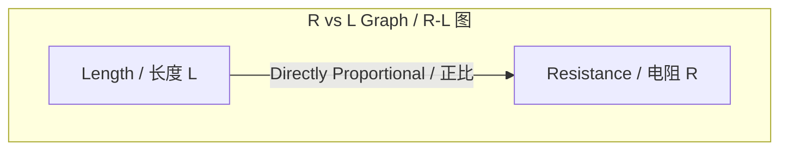
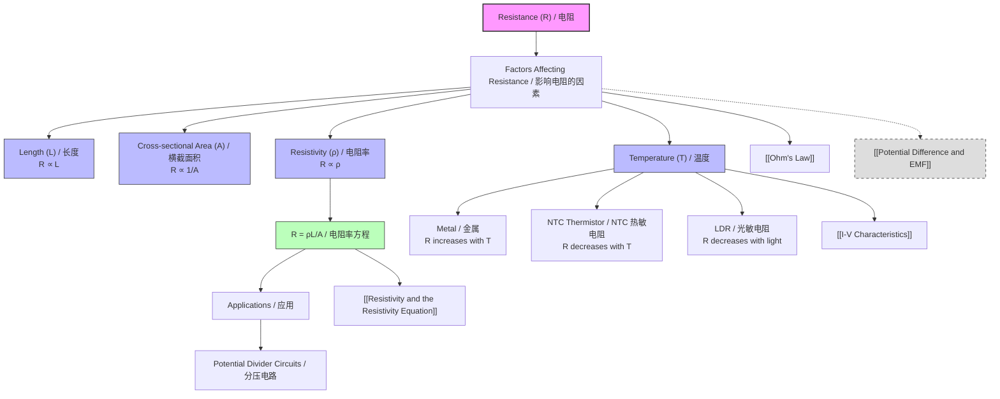

# 1. Overview / 概述

**English:**
This sub-topic explores the physical factors that determine the resistance of a conductor. Resistance is not an intrinsic property of a material; it depends on the conductor's geometry (length and cross-sectional area), the material's intrinsic property (resistivity), and external conditions like temperature. Understanding these factors is crucial for designing circuits, selecting materials for specific applications (e.g., heating elements vs. wires), and explaining why resistance changes in real-world components. This knowledge directly links to [[Resistivity and the Resistivity Equation]] and provides the foundation for understanding [[I-V Characteristics]].

**中文:**
本子知识点探讨决定导体电阻的物理因素。电阻并非材料的固有属性；它取决于导体的几何形状（长度和横截面积）、材料的固有属性（电阻率）以及温度等外部条件。理解这些因素对于设计电路、为特定应用选择材料（例如，加热元件 vs. 导线）以及解释实际元件中电阻的变化至关重要。这些知识直接与[[Resistivity and the Resistivity Equation]]相关联，并为理解[[I-V Characteristics]]奠定基础。

---

# 2. Syllabus Learning Objectives / 考纲学习目标

| CAIE 9702 | Edexcel IAL |
|-----------|-------------|
| 9.3(a) Explain that resistance is defined by $R = V/I$ and understand the factors that affect it. | 3.9 Understand how the resistance of a conductor depends on its length, cross-sectional area, and resistivity. |
| 9.3(b) Describe how the resistance of a metallic conductor varies with temperature. | 3.10 Understand how the resistance of a metallic conductor varies with temperature. |
| 9.3(c) Describe how the resistance of a negative temperature coefficient (NTC) thermistor varies with temperature. | 3.11 Understand how the resistance of a negative temperature coefficient (NTC) thermistor varies with temperature. |
| 9.3(d) Describe how the resistance of a light-dependent resistor (LDR) varies with light intensity. | 3.12 Understand how the resistance of a light-dependent resistor (LDR) varies with light intensity. |
| 9.3(e) Use the equation $R = \rho L / A$ in problem-solving. | (Covered in 3.9) |
| 9.3(f) Describe and explain the uses of thermistors and LDRs in potential divider circuits. | (Covered in potential divider topics) |

**Examiner Expectations / 考官期望:**
- **EN:** Students must be able to explain the *physical reasons* for resistance changes (e.g., increased lattice vibrations with temperature), not just state the relationship. They must also apply the $R = \rho L / A$ equation to calculate resistance changes when dimensions are altered.
- **CN:** 学生必须能够解释电阻变化的*物理原因*（例如，温度升高导致晶格振动加剧），而不仅仅是陈述关系。他们还必须能够应用 $R = \rho L / A$ 方程来计算当尺寸改变时的电阻变化。

---

# 3. Core Definitions / 核心定义

| Term (EN/CN) | Definition (EN) | Definition (CN) | Common Mistakes / 常见错误 |
|--------------|-----------------|-----------------|---------------------------|
| **Resistance** / 电阻 | The opposition to the flow of electric current, defined as $R = V/I$. | 对电流流动的阻碍，定义为 $R = V/I$。 | Confusing resistance with resistivity. Resistance is a property of an *object*; resistivity is a property of a *material*. |
| **Resistivity** / 电阻率 | A material property that quantifies how strongly it opposes the flow of electric current. | 量化材料对电流流动阻碍程度的材料属性。 | Thinking resistivity is constant for all materials; it varies with temperature. |
| **Length (L)** / 长度 | The physical length of the conductor along which current flows. | 电流流经的导体的物理长度。 | Forgetting that doubling length doubles resistance (direct proportionality). |
| **Cross-sectional Area (A)** / 横截面积 | The area of the conductor's face perpendicular to the direction of current flow. | 导体垂直于电流方向的横截面积。 | Forgetting that halving area doubles resistance (inverse proportionality). |
| **Temperature Coefficient of Resistance** / 电阻温度系数 | A measure of how much the resistance of a material changes per degree Celsius change in temperature. | 衡量材料电阻随温度每变化一摄氏度而变化的量度。 | Assuming all materials have a positive coefficient; semiconductors have negative coefficients. |
| **Thermistor** / 热敏电阻 | A temperature-dependent resistor, typically with a negative temperature coefficient (NTC). | 一种温度依赖性电阻器，通常具有负温度系数 (NTC)。 | Confusing NTC (resistance decreases as temperature increases) with PTC (resistance increases). |
| **Light-Dependent Resistor (LDR)** / 光敏电阻 | A resistor whose resistance decreases as light intensity increases. | 一种电阻随光照强度增加而减小的电阻器。 | Thinking LDR resistance increases with light intensity (it's the opposite). |

---

# 4. Key Concepts Explained / 关键概念详解

## 4.1 The Four Factors Affecting Resistance / 影响电阻的四个因素

### Explanation / 解释
**English:**
The resistance $R$ of a conductor depends on four main factors:
1. **Length ($L$):** Resistance is directly proportional to length. $R \propto L$. A longer wire has more collisions for charge carriers.
2. **Cross-sectional Area ($A$):** Resistance is inversely proportional to area. $R \propto 1/A$. A thicker wire provides more pathways for charge carriers.
3. **Resistivity ($\rho$):** Resistance is directly proportional to the material's resistivity. $R \propto \rho$.
4. **Temperature ($T$):** For metallic conductors, resistance increases with temperature. For semiconductors (like thermistors), resistance decreases with temperature.

These factors combine into the resistivity equation: $$R = \frac{\rho L}{A}$$

**中文:**
导体的电阻 $R$ 取决于四个主要因素：
1. **长度 ($L$)：** 电阻与长度成正比。$R \propto L$。更长的导线为电荷载流子带来更多碰撞。
2. **横截面积 ($A$)：** 电阻与面积成反比。$R \propto 1/A$。更粗的导线为电荷载流子提供更多路径。
3. **电阻率 ($\rho$)：** 电阻与材料的电阻率成正比。$R \propto \rho$。
4. **温度 ($T$)：** 对于金属导体，电阻随温度升高而增加。对于半导体（如热敏电阻），电阻随温度升高而减小。

这些因素组合成电阻率方程：$$R = \frac{\rho L}{A}$$

### Physical Meaning / 物理意义
**English:**
- **Length:** Think of a long, narrow hallway. It's harder to move through than a short, wide one. Similarly, charge carriers (electrons) experience more collisions in a longer conductor.
- **Area:** A wider conductor is like a multi-lane highway vs. a single-lane road. More lanes mean less congestion (lower resistance).
- **Resistivity:** This is the material's "personality." Copper has low resistivity (good conductor), while rubber has high resistivity (insulator).
- **Temperature:** In metals, heat makes atoms vibrate more, creating more obstacles for electrons. In semiconductors, heat frees more charge carriers, making conduction easier.

**中文:**
- **长度：** 想象一条又长又窄的走廊。穿过它比穿过一条又短又宽的走廊更难。类似地，电荷载流子（电子）在更长的导体中经历更多碰撞。
- **面积：** 更宽的导体就像多车道高速公路 vs. 单车道道路。更多车道意味着更少拥堵（更低电阻）。
- **电阻率：** 这是材料的“个性”。铜的电阻率低（良导体），而橡胶的电阻率高（绝缘体）。
- **温度：** 在金属中，热量使原子振动更剧烈，为电子制造更多障碍。在半导体中，热量释放更多电荷载流子，使导电更容易。

### Common Misconceptions / 常见误区
- **EN:** "Resistance is the same as resistivity." → No! Resistance is for a specific object; resistivity is for a material.
- **CN:** “电阻和电阻率是一样的。” → 不对！电阻是针对特定物体的；电阻率是针对材料的。
- **EN:** "Doubling the length doubles the resistance, but doubling the diameter also doubles the resistance." → No! Doubling the diameter quadruples the area ($A = \pi r^2$), so resistance becomes one-quarter.
- **CN:** “长度加倍，电阻加倍；直径加倍，电阻也加倍。” → 不对！直径加倍使面积变为四倍 ($A = \pi r^2$)，因此电阻变为四分之一。
- **EN:** "All materials have higher resistance when hot." → No! Semiconductors (thermistors) have lower resistance when hot.
- **CN:** “所有材料在热的时候电阻都更高。” → 不对！半导体（热敏电阻）在热的时候电阻更低。

### Exam Tips / 考试提示
- **EN:** When a wire is stretched to double its length, its cross-sectional area halves (volume conservation). So resistance becomes $2 \times 2 = 4$ times larger.
- **CN:** 当导线被拉伸至两倍长度时，其横截面积减半（体积守恒）。因此电阻变为 $2 \times 2 = 4$ 倍。
- **EN:** Always check if the question asks about a *wire* (object) or a *material* (resistivity).
- **CN:** 始终检查问题是关于*导线*（物体）还是*材料*（电阻率）。

> 📷 **IMAGE PROMPT — FACTORS: Factors Affecting Resistance Diagram**
> A clear diagram showing four panels: (1) A long wire vs. a short wire with electrons colliding more in the long wire. (2) A thin wire vs. a thick wire with more electron pathways in the thick wire. (3) Different materials (copper, iron, rubber) with different resistivity values. (4) A metal wire at low temperature (ordered lattice) vs. high temperature (vibrating lattice). Labels in English and Chinese.

---

## 4.2 Temperature Dependence of Resistance / 电阻的温度依赖性

### Explanation / 解释
**English:**
For **metallic conductors** (e.g., copper, iron):
- As temperature increases, the lattice ions vibrate more vigorously.
- This increases the probability of collisions between free electrons and lattice ions.
- More collisions → more energy loss → higher resistance.
- The relationship is approximately linear over a moderate temperature range: $R_T = R_0(1 + \alpha T)$, where $\alpha$ is the temperature coefficient of resistance.

For **semiconductors** (e.g., thermistors):
- As temperature increases, more electrons gain enough energy to jump from the valence band to the conduction band.
- This increases the number of charge carriers available for conduction.
- More charge carriers → lower resistance.
- This is a non-linear relationship; resistance decreases rapidly with temperature.

**中文:**
对于**金属导体**（例如，铜、铁）：
- 随着温度升高，晶格离子振动更剧烈。
- 这增加了自由电子与晶格离子之间碰撞的概率。
- 更多碰撞 → 更多能量损失 → 更高电阻。
- 在中等温度范围内，该关系近似线性：$R_T = R_0(1 + \alpha T)$，其中 $\alpha$ 是电阻温度系数。

对于**半导体**（例如，热敏电阻）：
- 随着温度升高，更多电子获得足够能量从价带跃迁到导带。
- 这增加了可用于导电的电荷载流子数量。
- 更多电荷载流子 → 更低电阻。
- 这是一种非线性关系；电阻随温度升高而迅速下降。

### Physical Meaning / 物理意义
**English:**
- **Metals:** Think of a crowded dance floor. When the music (temperature) gets louder, people (atoms) dance more wildly, making it harder to move through (higher resistance).
- **Semiconductors:** Think of a dark room. When you turn on a light (heat), more people (electrons) can see and move around, making it easier to navigate (lower resistance).

**中文:**
- **金属：** 想象一个拥挤的舞池。当音乐（温度）更大声时，人们（原子）跳舞更疯狂，使得穿过变得更难（更高电阻）。
- **半导体：** 想象一个黑暗的房间。当你打开灯（热量）时，更多人（电子）能看到并移动，使得导航更容易（更低电阻）。

### Common Misconceptions / 常见误区
- **EN:** "The resistance of a metal wire increases because the electrons move slower when hot." → No! Electrons actually move faster, but they collide more frequently.
- **CN:** “金属导线的电阻增加是因为电子在热的时候移动更慢。” → 不对！电子实际上移动更快，但它们碰撞更频繁。
- **EN:** "A thermistor's resistance increases with temperature." → Only for PTC (positive temperature coefficient) thermistors. NTC thermistors (most common in A-Level) decrease.
- **CN:** “热敏电阻的电阻随温度升高而增加。” → 仅适用于 PTC（正温度系数）热敏电阻。NTC 热敏电阻（A-Level 中最常见）是减小的。

### Exam Tips / 考试提示
- **EN:** For metallic conductors, the resistance at temperature $T$ is given by $R_T = R_0(1 + \alpha T)$. Know how to use this formula.
- **CN:** 对于金属导体，温度 $T$ 时的电阻由 $R_T = R_0(1 + \alpha T)$ 给出。知道如何使用这个公式。
- **EN:** For thermistors, you only need to know the qualitative behavior (resistance decreases with temperature), not the exact formula.
- **CN:** 对于热敏电阻，你只需要知道定性行为（电阻随温度升高而减小），不需要知道精确公式。

> 📷 **IMAGE PROMPT — TEMP: Temperature vs Resistance Graphs**
> Two graphs side by side: (1) Metal: a straight line with positive slope showing R increasing with T. (2) NTC Thermistor: a curve showing R decreasing rapidly as T increases. Both axes labeled (Resistance / Ω, Temperature / °C). Labels in English and Chinese.

---

## 4.3 Light-Dependent Resistor (LDR) / 光敏电阻

### Explanation / 解释
**English:**
An LDR is a semiconductor device whose resistance decreases as light intensity increases.
- In darkness, very few charge carriers are available → high resistance (typically MΩ).
- When light shines on the LDR, photons provide energy to electrons, allowing them to jump to the conduction band → more charge carriers → lower resistance (typically kΩ in bright light).
- The relationship is non-linear; resistance changes most rapidly at low light levels.

**中文:**
光敏电阻 (LDR) 是一种半导体器件，其电阻随光照强度增加而减小。
- 在黑暗中，可用的电荷载流子非常少 → 高电阻（通常为 MΩ）。
- 当光线照射到 LDR 上时，光子为电子提供能量，使它们能够跃迁到导带 → 更多电荷载流子 → 更低电阻（在强光下通常为 kΩ）。
- 这种关系是非线性的；在低光照水平下电阻变化最快。

### Physical Meaning / 物理意义
**English:**
Think of an LDR as a "light-activated switch." In the dark, it blocks current (high resistance). In the light, it allows current to flow (low resistance). This makes it useful for automatic lighting systems (e.g., street lights that turn on at dusk).

**中文:**
将 LDR 想象成一个“光激活开关”。在黑暗中，它阻挡电流（高电阻）。在光线下，它允许电流流动（低电阻）。这使得它对于自动照明系统（例如，在黄昏时亮起的路灯）非常有用。

### Common Misconceptions / 常见误区
- **EN:** "LDR resistance increases with light intensity." → No! It decreases.
- **CN:** “LDR 的电阻随光照强度增加而增加。” → 不对！它是减小的。
- **EN:** "LDR works the same as a thermistor." → Both are semiconductors, but one responds to light, the other to temperature.
- **CN:** “LDR 和热敏电阻的工作原理相同。” → 两者都是半导体，但一个对光响应，另一个对温度响应。

### Exam Tips / 考试提示
- **EN:** LDRs are often used in potential divider circuits. Know how to calculate the output voltage when the LDR resistance changes.
- **CN:** LDR 常用于分压电路中。知道如何计算当 LDR 电阻变化时的输出电压。
- **EN:** You only need qualitative understanding of LDR behavior (resistance vs. light intensity graph shape).
- **CN:** 你只需要对 LDR 行为有定性理解（电阻 vs. 光照强度图的形状）。

> 📷 **IMAGE PROMPT — LDR: LDR Resistance vs Light Intensity Graph**
> A graph showing resistance (R) on the y-axis and light intensity (I) on the x-axis. The curve starts high on the left (dark) and drops steeply, then levels off at low resistance on the right (bright). Labels: "Dark / 黑暗" and "Bright / 明亮". English and Chinese labels.

---

# 5. Essential Equations / 核心公式

## 5.1 Resistivity Equation / 电阻率方程

$$R = \frac{\rho L}{A}$$

| Symbol (符号) | Meaning (EN) | Meaning (CN) | Unit (单位) |
|--------------|-------------|-------------|------------|
| $R$ | Resistance | 电阻 | Ω (ohm) |
| $\rho$ | Resistivity | 电阻率 | Ω m (ohm-meter) |
| $L$ | Length of conductor | 导体长度 | m (meter) |
| $A$ | Cross-sectional area | 横截面积 | m² (square meter) |

**Derivation / 推导:**
- This equation is derived from the definition of resistivity: $\rho = \frac{RA}{L}$. Rearranging gives $R = \frac{\rho L}{A}$.
- 该方程由电阻率的定义推导得出：$\rho = \frac{RA}{L}$。重新排列得到 $R = \frac{\rho L}{A}$。

**Conditions / 适用条件:**
- **EN:** The conductor must have uniform cross-sectional area and be made of a homogeneous material.
- **CN:** 导体必须具有均匀的横截面积并由均质材料制成。

**Limitations / 局限性:**
- **EN:** Does not account for temperature effects (resistivity $\rho$ changes with temperature). Only valid for DC circuits.
- **CN:** 不考虑温度效应（电阻率 $\rho$ 随温度变化）。仅适用于直流电路。

> 📷 **IMAGE PROMPT — FORMULA: Resistivity Formula Diagram**
> A diagram showing a cylindrical wire with length L and cross-sectional area A. The formula R = ρL/A is displayed. Arrows point from L and A to the wire. Labels in English and Chinese.

---

## 5.2 Temperature Dependence of Resistance (Metals) / 电阻的温度依赖性（金属）

$$R_T = R_0(1 + \alpha T)$$

| Symbol (符号) | Meaning (EN) | Meaning (CN) | Unit (单位) |
|--------------|-------------|-------------|------------|
| $R_T$ | Resistance at temperature $T$ | 温度 $T$ 时的电阻 | Ω |
| $R_0$ | Resistance at reference temperature (usually 0°C or 20°C) | 参考温度下的电阻（通常为 0°C 或 20°C） | Ω |
| $\alpha$ | Temperature coefficient of resistance | 电阻温度系数 | °C⁻¹ or K⁻¹ |
| $T$ | Temperature change from reference | 相对于参考温度的温度变化 | °C or K |

**Derivation / 推导:**
- **EN:** This is an empirical relationship. For small temperature changes, the resistance change is approximately proportional to the temperature change.
- **CN:** 这是一个经验关系。对于小的温度变化，电阻变化近似与温度变化成正比。

**Conditions / 适用条件:**
- **EN:** Valid only for metallic conductors over a moderate temperature range (typically 0°C to 100°C). Not valid for semiconductors.
- **CN:** 仅适用于中等温度范围（通常为 0°C 到 100°C）内的金属导体。不适用于半导体。

**Limitations / 局限性:**
- **EN:** The coefficient $\alpha$ itself varies slightly with temperature. The equation is linear, but real behavior may deviate at extreme temperatures.
- **CN:** 系数 $\alpha$ 本身随温度略有变化。该方程是线性的，但实际行为在极端温度下可能会偏离。

---

# 6. Graphs and Relationships / 图表与关系

## 6.1 Resistance vs. Length / 电阻 vs. 长度

### Axes / 坐标轴
- **X-axis:** Length ($L$) / 长度 ($L$)
- **Y-axis:** Resistance ($R$) / 电阻 ($R$)

### Shape / 形状
- **EN:** A straight line through the origin (direct proportionality).
- **CN:** 一条通过原点的直线（正比关系）。

### Gradient Meaning / 斜率含义
- **EN:** Gradient = $\rho / A$. A steeper gradient means higher resistivity or smaller cross-sectional area.
- **CN:** 斜率 = $\rho / A$。更陡的斜率意味着更高的电阻率或更小的横截面积。

### Area Meaning / 面积含义
- **EN:** No physical meaning.
- **CN:** 没有物理意义。

### Exam Interpretation / 考试解读
- **EN:** If the line does not pass through the origin, check for contact resistance or systematic error.
- **CN:** 如果直线不通过原点，检查接触电阻或系统误差。

---

## 6.2 Resistance vs. 1/Area / 电阻 vs. 1/面积

### Axes / 坐标轴
- **X-axis:** $1/A$ (inverse of cross-sectional area) / $1/A$（横截面积的倒数）
- **Y-axis:** Resistance ($R$) / 电阻 ($R$)

### Shape / 形状
- **EN:** A straight line through the origin (direct proportionality between $R$ and $1/A$).
- **CN:** 一条通过原点的直线（$R$ 与 $1/A$ 成正比）。

### Gradient Meaning / 斜率含义
- **EN:** Gradient = $\rho L$. A steeper gradient means higher resistivity or longer length.
- **CN:** 斜率 = $\rho L$。更陡的斜率意味着更高的电阻率或更长的长度。

### Area Meaning / 面积含义
- **EN:** No physical meaning.
- **CN:** 没有物理意义。

### Exam Interpretation / 考试解读
- **EN:** Plotting $R$ vs. $1/A$ is useful for determining resistivity from experimental data.
- **CN:** 绘制 $R$ vs. $1/A$ 图有助于从实验数据确定电阻率。

---

## 6.3 Resistance vs. Temperature (Metal) / 电阻 vs. 温度（金属）

### Axes / 坐标轴
- **X-axis:** Temperature ($T$) / 温度 ($T$)
- **Y-axis:** Resistance ($R$) / 电阻 ($R$)

### Shape / 形状
- **EN:** A straight line with positive slope (approximately linear over moderate range).
- **CN:** 一条具有正斜率的直线（在中等范围内近似线性）。

### Gradient Meaning / 斜率含义
- **EN:** Gradient = $\alpha R_0$. Represents how quickly resistance changes with temperature.
- **CN:** 斜率 = $\alpha R_0$。表示电阻随温度变化的快慢。

### Area Meaning / 面积含义
- **EN:** No physical meaning.
- **CN:** 没有物理意义。

### Exam Interpretation / 考试解读
- **EN:** The y-intercept gives $R_0$ (resistance at 0°C). Use the gradient to find $\alpha$.
- **CN:** y 轴截距给出 $R_0$（0°C 时的电阻）。使用斜率求 $\alpha$。

---

## 6.4 Resistance vs. Temperature (NTC Thermistor) / 电阻 vs. 温度（NTC 热敏电阻）

### Axes / 坐标轴
- **X-axis:** Temperature ($T$) / 温度 ($T$)
- **Y-axis:** Resistance ($R$) / 电阻 ($R$)

### Shape / 形状
- **EN:** A curve that decreases rapidly at low temperatures and then levels off at higher temperatures.
- **CN:** 一条在低温下迅速下降，然后在较高温度下趋于平缓的曲线。

### Gradient Meaning / 斜率含义
- **EN:** The gradient is negative and becomes less steep as temperature increases.
- **CN:** 斜率为负，并且随着温度升高而变缓。

### Area Meaning / 面积含义
- **EN:** No physical meaning.
- **CN:** 没有物理意义。

### Exam Interpretation / 考试解读
- **EN:** The non-linear shape is important for applications like temperature sensors. The most sensitive region (steepest slope) is at low temperatures.
- **CN:** 非线性形状对于温度传感器等应用很重要。最敏感的区域（最陡的斜率）在低温下。

---

## 6.5 Resistance vs. Light Intensity (LDR) / 电阻 vs. 光照强度（LDR）

### Axes / 坐标轴
- **X-axis:** Light Intensity ($I$) / 光照强度 ($I$)
- **Y-axis:** Resistance ($R$) / 电阻 ($R$)

### Shape / 形状
- **EN:** A curve that decreases rapidly at low light intensities and then levels off at higher intensities.
- **CN:** 一条在低光照强度下迅速下降，然后在较高强度下趋于平缓的曲线。

### Gradient Meaning / 斜率含义
- **EN:** The gradient is negative and becomes less steep as light intensity increases.
- **CN:** 斜率为负，并且随着光照强度增加而变缓。

### Area Meaning / 面积含义
- **EN:** No physical meaning.
- **CN:** 没有物理意义。

### Exam Interpretation / 考试解读
- **EN:** The most sensitive region is at low light levels. This is why LDRs are good for detecting darkness (e.g., automatic street lights).
- **CN:** 最敏感的区域在低光照水平下。这就是为什么 LDR 适合检测黑暗（例如，自动路灯）。

---

# 7. Required Diagrams / 必备图表

## 7.1 Factors Affecting Resistance Diagram / 影响电阻的因素图

### Description / 描述
**English:**
A composite diagram showing four factors: (1) Length: a short wire and a long wire with electrons colliding more in the long wire. (2) Cross-sectional area: a thin wire and a thick wire with more electron pathways in the thick wire. (3) Material: different materials (copper, iron, rubber) with different resistivity values. (4) Temperature: a metal wire at low temperature (ordered lattice) vs. high temperature (vibrating lattice).

**中文:**
一个组合图，显示四个因素：(1) 长度：短导线和长导线，电子在长导线中碰撞更多。(2) 横截面积：细导线和粗导线，粗导线中有更多电子路径。(3) 材料：不同材料（铜、铁、橡胶）具有不同的电阻率值。(4) 温度：低温（有序晶格）和高温（振动晶格）下的金属导线。

### Image Prompt / 图片生成提示
> 📷 **IMAGE PROMPT — FACTORS: Factors Affecting Resistance Diagram**
> A four-panel educational diagram. Panel 1: Two wires of different lengths with electron arrows showing more collisions in the longer wire. Panel 2: Two wires of different thicknesses with electron arrows showing more pathways in the thicker wire. Panel 3: Three blocks labeled "Copper (low ρ)", "Iron (medium ρ)", "Rubber (high ρ)". Panel 4: Two wire cross-sections showing ordered lattice (low T) and vibrating lattice (high T). All labels in English and Chinese. Clean, textbook-style illustration.

### Labels Required / 需要标注
- **EN:** Length (L), Cross-sectional Area (A), Resistivity (ρ), Temperature (T), Electron, Lattice Ion, Collision
- **CN:** 长度 (L), 横截面积 (A), 电阻率 (ρ), 温度 (T), 电子, 晶格离子, 碰撞

### Exam Importance / 考试重要性
- **EN:** High. This diagram is frequently used in exam questions to test understanding of the factors affecting resistance.
- **CN:** 高。该图常用于考试题中，以测试对影响电阻因素的理解。

---

## 7.2 Temperature vs. Resistance Graphs / 温度 vs. 电阻图

### Description / 描述
**English:**
Two graphs side by side: (1) Metal: a straight line with positive slope showing R increasing with T. (2) NTC Thermistor: a curve showing R decreasing rapidly as T increases.

**中文:**
两个并排的图：(1) 金属：一条具有正斜率的直线，显示 R 随 T 增加而增加。(2) NTC 热敏电阻：一条曲线，显示 R 随 T 增加而迅速下降。

### Image Prompt / 图片生成提示
> 📷 **IMAGE PROMPT — TEMP: Temperature vs Resistance Graphs**
> Two graphs side by side on a white background. Left graph: "Metal / 金属" with a straight line going up from left to right. Right graph: "NTC Thermistor / NTC 热敏电阻" with a curve dropping steeply then leveling off. Both axes labeled "Resistance / Ω" (y-axis) and "Temperature / °C" (x-axis). English and Chinese labels. Clean, textbook-style.

### Labels Required / 需要标注
- **EN:** Metal, NTC Thermistor, Resistance (R), Temperature (T), Increasing, Decreasing
- **CN:** 金属, NTC 热敏电阻, 电阻 (R), 温度 (T), 增加, 减小

### Exam Importance / 考试重要性
- **EN:** High. Students must be able to sketch and interpret these graphs.
- **CN:** 高。学生必须能够绘制和解释这些图。

---

# 8. Worked Examples / 典型例题

## Example 1: Wire Stretching Problem / 导线拉伸问题

### Question / 题目
**English:**
A copper wire has a resistance of 10 Ω. The wire is stretched uniformly to three times its original length. Assuming the volume and resistivity remain constant, calculate the new resistance.

**中文:**
一根铜导线的电阻为 10 Ω。该导线被均匀拉伸至其原始长度的三倍。假设体积和电阻率保持不变，计算新的电阻。

### Solution / 解答

**Step 1: Understand the relationship / 理解关系**
- Original: $R_1 = \frac{\rho L_1}{A_1} = 10\ \Omega$
- New length: $L_2 = 3L_1$
- Volume conservation: $V = A_1 L_1 = A_2 L_2$
- Therefore: $A_2 = \frac{A_1 L_1}{L_2} = \frac{A_1 L_1}{3L_1} = \frac{A_1}{3}$

**Step 2: Calculate new resistance / 计算新电阻**
$$R_2 = \frac{\rho L_2}{A_2} = \frac{\rho (3L_1)}{(A_1/3)} = \frac{3\rho L_1}{A_1/3} = 9 \times \frac{\rho L_1}{A_1} = 9R_1$$

**Step 3: Substitute value / 代入数值**
$$R_2 = 9 \times 10\ \Omega = 90\ \Omega$$

### Final Answer / 最终答案
**Answer:** 90 Ω | **答案：** 90 Ω

### Quick Tip / 提示
- **EN:** When a wire is stretched, length increases by factor $n$, area decreases by factor $n$, so resistance increases by factor $n^2$.
- **CN:** 当导线被拉伸时，长度增加 $n$ 倍，面积减小 $n$ 倍，因此电阻增加 $n^2$ 倍。

---

## Example 2: Temperature Dependence / 温度依赖性

### Question / 题目
**English:**
A copper wire has a resistance of 5.00 Ω at 20°C. The temperature coefficient of resistance for copper is $\alpha = 0.0039\ \text{°C}^{-1}$. Calculate the resistance of the wire at 80°C.

**中文:**
一根铜导线在 20°C 时的电阻为 5.00 Ω。铜的电阻温度系数为 $\alpha = 0.0039\ \text{°C}^{-1}$。计算该导线在 80°C 时的电阻。

### Solution / 解答

**Step 1: Identify variables / 确定变量**
- $R_0 = 5.00\ \Omega$ (at 20°C)
- $T = 80 - 20 = 60\ \text{°C}$ (temperature change)
- $\alpha = 0.0039\ \text{°C}^{-1}$

**Step 2: Apply formula / 应用公式**
$$R_T = R_0(1 + \alpha T)$$
$$R_T = 5.00(1 + 0.0039 \times 60)$$

**Step 3: Calculate / 计算**
$$R_T = 5.00(1 + 0.234)$$
$$R_T = 5.00 \times 1.234$$
$$R_T = 6.17\ \Omega$$

### Final Answer / 最终答案
**Answer:** 6.17 Ω | **答案：** 6.17 Ω

### Quick Tip / 提示
- **EN:** Remember that $T$ is the *change* in temperature, not the final temperature. Always calculate $\Delta T$ first.
- **CN:** 记住 $T$ 是温度的*变化量*，而不是最终温度。始终先计算 $\Delta T$。

---

# 9. Past Paper Question Types / 历年真题题型

| Question Type / 题型 | Frequency / 频率 | Difficulty / 难度 | Past Paper References / 真题索引 |
|----------------------|------------------|------------------|-------------------------------|
| Calculate resistance after stretching a wire | High | Medium | 📝 *待填入* |
| Explain why resistance of a metal increases with temperature | High | Easy | 📝 *待填入* |
| Sketch and interpret R vs T graph for thermistor | Medium | Medium | 📝 *待填入* |
| Calculate resistance using $R = \rho L / A$ | High | Easy | 📝 *待填入* |
| Explain LDR behavior in a circuit | Medium | Medium | 📝 *待填入* |
| Determine resistivity from experimental data | Medium | Hard | 📝 *待填入* |

**Common Command Words / 常见指令词:**
- **EN:** Calculate, Explain, Sketch, Determine, Show that, Describe
- **CN:** 计算, 解释, 绘制, 确定, 证明, 描述

---

# 10. Practical Skills Connections / 实验技能链接

**English:**
This sub-topic connects to practical work in several ways:

1. **Measuring Resistance of a Wire:** Use an ohmmeter or a Wheatstone bridge to measure resistance of wires of different lengths and thicknesses. Plot $R$ vs. $L$ to verify direct proportionality.

2. **Determining Resistivity:** Measure $R$, $L$, and $A$ (using a micrometer for diameter) for a wire. Use $R = \rho L / A$ to calculate $\rho$. Plot $R$ vs. $L/A$ to find $\rho$ from the gradient.

3. **Temperature Dependence:** Heat a wire in a water bath and measure resistance at different temperatures. Plot $R$ vs. $T$ to find $\alpha$.

4. **Uncertainties:**
   - Length: ±1 mm using a ruler
   - Diameter: ±0.01 mm using a micrometer (measure at several points and average)
   - Resistance: ±0.1 Ω using a digital multimeter
   - Temperature: ±0.5°C using a thermometer

5. **Graph Plotting:** Always plot the independent variable on the x-axis. For resistivity determination, plot $R$ on y-axis and $L/A$ on x-axis. The gradient gives $\rho$.

**中文:**
本子知识点通过多种方式与实验工作相关联：

1. **测量导线的电阻：** 使用欧姆表或惠斯通电桥测量不同长度和厚度导线的电阻。绘制 $R$ vs. $L$ 图以验证正比关系。

2. **确定电阻率：** 测量导线的 $R$、$L$ 和 $A$（使用千分尺测量直径）。使用 $R = \rho L / A$ 计算 $\rho$。绘制 $R$ vs. $L/A$ 图，从斜率求 $\rho$。

3. **温度依赖性：** 在水浴中加热导线并测量不同温度下的电阻。绘制 $R$ vs. $T$ 图以求 $\alpha$。

4. **不确定度：**
   - 长度：使用尺子，±1 mm
   - 直径：使用千分尺，±0.01 mm（在多个点测量并取平均值）
   - 电阻：使用数字万用表，±0.1 Ω
   - 温度：使用温度计，±0.5°C

5. **绘图：** 始终将自变量绘制在 x 轴上。对于电阻率测定，将 $R$ 绘制在 y 轴上，$L/A$ 绘制在 x 轴上。斜率给出 $\rho$。

---

# 11. Concept Map / 概念图谱

---

# 12. Quick Revision Sheet / 速查表

| Category / 类别 | Key Points / 要点 |
|----------------|------------------|
| **Definition / 定义** | Resistance ($R = V/I$) is a property of an object. Resistivity ($\rho$) is a property of a material. |
| **Key Formula / 核心公式** | $R = \frac{\rho L}{A}$ — Resistance depends on length, area, and material. |
| **Length Effect / 长度效应** | $R \propto L$. Doubling length → doubling resistance. |
| **Area Effect / 面积效应** | $R \propto 1/A$. Doubling diameter → area ×4 → resistance ×1/4. |
| **Stretching Effect / 拉伸效应** | Stretching to $n$ times length → resistance increases by $n^2$ (volume constant). |
| **Metal Temperature / 金属温度** | $R$ increases with $T$. $R_T = R_0(1 + \alpha T)$. Lattice vibrations increase collisions. |
| **Thermistor (NTC) / 热敏电阻 (NTC)** | $R$ decreases as $T$ increases. More charge carriers freed by heat. |
| **LDR / 光敏电阻** | $R$ decreases as light intensity increases. Photons free charge carriers. |
| **Key Graph / 核心图表** | Metal: straight line (R vs T). Thermistor/LDR: curve decreasing rapidly then leveling off. |
| **Exam Tip / 考试提示** | Always check if the question asks about a *wire* (R) or a *material* (ρ). For stretching problems, remember volume conservation. |