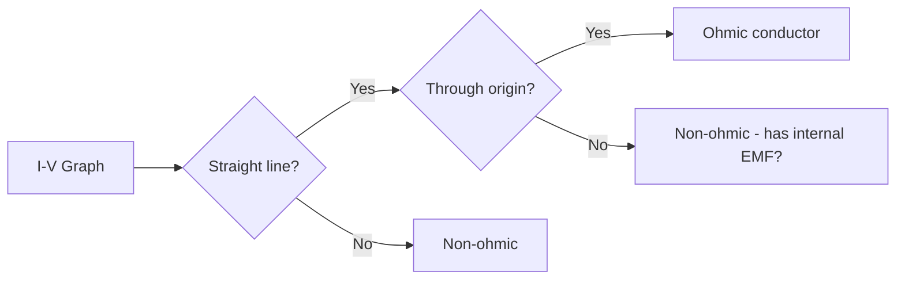

# 1. Overview / 概述

**English:**
Ohm's Law is one of the most fundamental principles in electricity, establishing a direct proportional relationship between [[Potential Difference and EMF|potential difference]] and current for metallic conductors at constant temperature. This sub-topic defines the law itself, its mathematical expression, and crucially, its limitations — not all materials obey Ohm's Law. Understanding Ohm's Law is essential for analyzing [[Resistance and the Ohm|resistance]] in circuits and forms the foundation for studying [[I-V Characteristics]] of different components. The law is expressed as $V = IR$, where $R$ is the constant resistance of the conductor.

**中文:**
欧姆定律是电学中最基本的原理之一，它建立了在恒定温度下金属导体两端[[Potential Difference and EMF|电势差]]与电流之间的直接比例关系。本子知识点定义了该定律本身、其数学表达式，以及关键的是其局限性——并非所有材料都遵守欧姆定律。理解欧姆定律对于分析电路中的[[Resistance and the Ohm|电阻]]至关重要，并为研究不同元件的[[I-V Characteristics]]奠定了基础。该定律表示为 $V = IR$，其中 $R$ 是导体的恒定电阻。

---

# 2. Syllabus Learning Objectives / 考纲学习目标

| CAIE 9702 | Edexcel IAL |
|-----------|-------------|
| 9.3(a) State Ohm's Law | 3.9 State Ohm's Law |
| 9.3(b) Recall $V = IR$ and use it in calculations | 3.10 Use $V = IR$ in calculations |
| 9.3(c) Describe the conditions for Ohm's Law to hold | 3.11 Explain the conditions for Ohm's Law |
| 9.3(d) Distinguish between ohmic and non-ohmic conductors | 3.12 Distinguish between ohmic and non-ohmic conductors |
| 9.3(e) Sketch and interpret I-V characteristics for ohmic conductors | — |
| 9.3(f) Explain the effect of temperature on resistance | — |

**Examiner Expectations / 考官期望:**
- **English:** You must state Ohm's Law **exactly** as "The current through a metallic conductor is directly proportional to the potential difference across it, provided the temperature remains constant." Do NOT omit "metallic" or "constant temperature." You must be able to identify ohmic vs non-ohmic conductors from [[I-V Characteristics|I-V graphs]] and explain why temperature changes cause non-ohmic behavior.
- **中文:** 你必须**准确**陈述欧姆定律："通过金属导体的电流与其两端的电势差成正比，前提是温度保持不变。" 不要省略"金属"或"恒定温度"。你必须能够从[[I-V Characteristics|I-V图像]]中识别欧姆导体和非欧姆导体，并解释温度变化为何导致非欧姆行为。

---

# 3. Core Definitions / 核心定义

| Term (EN/CN) | Definition (EN) | Definition (CN) | Common Mistakes / 常见错误 |
|--------------|-----------------|-----------------|---------------------------|
| **Ohm's Law** / 欧姆定律 | The current through a metallic conductor is directly proportional to the potential difference across it, provided the temperature remains constant. | 通过金属导体的电流与其两端的电势差成正比，前提是温度保持不变。 | ❌ Omitting "metallic" or "constant temperature" — both are essential conditions |
| **Ohmic Conductor** / 欧姆导体 | A conductor that obeys Ohm's Law; its I-V graph is a straight line through the origin. | 遵守欧姆定律的导体；其I-V图像是通过原点的直线。 | ❌ Thinking all conductors are ohmic — only metallic conductors at constant temperature |
| **Non-Ohmic Conductor** / 非欧姆导体 | A conductor that does NOT obey Ohm's Law; its I-V graph is non-linear. | 不遵守欧姆定律的导体；其I-V图像是非线性的。 | ❌ Confusing non-ohmic with "broken" — non-ohmic behavior is expected for some components |
| **Proportionality** / 正比关系 | A relationship where doubling one variable doubles the other, represented by a straight line through the origin. | 一个变量加倍导致另一个变量也加倍的关系，由通过原点的直线表示。 | ❌ Confusing with linear relationship that does NOT pass through origin |
| **Constant Temperature** / 恒定温度 | A condition where the temperature of the conductor does not change during measurement. | 测量过程中导体温度不发生变化的条件。 | ❌ Forgetting that current flow causes heating, which changes resistance |

---

# 4. Key Concepts Explained / 关键概念详解

## 4.1 The Statement of Ohm's Law / 欧姆定律的陈述

### Explanation / 解释
**English:**
Ohm's Law states: **"The current through a metallic conductor is directly proportional to the potential difference across it, provided the temperature remains constant."** This means that if you double the voltage across a metallic wire at constant temperature, the current will also double. The constant of proportionality is the [[Resistance and the Ohm|resistance]] $R$, giving the equation $V = IR$.

The law is **empirical** — discovered experimentally by [[Georg Ohm]] in 1827. It applies specifically to **metallic conductors** (metals) under **constant temperature** conditions. The reason metals obey Ohm's Law relates to their atomic structure: free electrons move through a lattice of positive ions, and at constant temperature, the lattice vibrations (which cause collisions) remain constant, giving a fixed resistance.

**中文:**
欧姆定律指出：**"通过金属导体的电流与其两端的电势差成正比，前提是温度保持不变。"** 这意味着如果在恒定温度下将金属丝两端的电压加倍，电流也会加倍。比例常数是[[Resistance and the Ohm|电阻]] $R$，得到方程 $V = IR$。

该定律是**经验性的**——由[[Georg Ohm]]在1827年通过实验发现。它特别适用于**金属导体**在**恒定温度**条件下。金属遵守欧姆定律的原因与其原子结构有关：自由电子在正离子晶格中移动，在恒定温度下，晶格振动（导致碰撞）保持不变，从而产生固定的电阻。

### Physical Meaning / 物理意义
**English:**
Physically, Ohm's Law tells us that for a metallic conductor at constant temperature, the ratio of voltage to current is constant. This constant ratio is the resistance. The law implies that the conductor's opposition to current flow does not change with the amount of current flowing — the resistance is **independent** of voltage and current.

**中文:**
从物理意义上讲，欧姆定律告诉我们，对于恒定温度下的金属导体，电压与电流的比值是恒定的。这个恒定的比值就是电阻。该定律意味着导体对电流流动的阻碍不会随电流大小而改变——电阻**独立**于电压和电流。

### Common Misconceptions / 常见误区
- ❌ **"Ohm's Law is $V = IR$"** — This is the equation, not the law itself. The law is the statement of proportionality.
- ❌ **"All conductors obey Ohm's Law"** — Only metallic conductors at constant temperature obey it. Semiconductors, electrolytes, and gases do not.
- ❌ **"Ohm's Law applies at any temperature"** — Temperature must remain constant. As current flows, heating occurs, which can change resistance.
- ❌ **"If $V = IR$, then $R = V/I$ means resistance depends on voltage"** — For ohmic conductors, $R$ is constant; $V/I$ gives the same value regardless of $V$.

### Exam Tips / 考试提示
- **English:** When asked to "state Ohm's Law," write the **full statement** including "metallic conductor" and "constant temperature." Do NOT just write $V = IR$.
- **中文:** 当被要求"陈述欧姆定律"时，写出**完整陈述**，包括"金属导体"和"恒定温度"。不要只写 $V = IR$。

> 📷 **IMAGE PROMPT — OHM-01: Experimental Setup for Verifying Ohm's Law**
> A clear diagram showing a circuit with a cell, variable resistor (rheostat), ammeter in series with a metallic wire, and voltmeter in parallel across the wire. Labels show "metallic conductor (wire)," "ammeter," "voltmeter," "variable resistor." Arrows indicate current direction. The setup demonstrates how to vary voltage and measure corresponding current to verify proportionality.

## 4.2 Ohmic vs Non-Ohmic Conductors / 欧姆导体与非欧姆导体

### Explanation / 解释
**English:**
An **ohmic conductor** obeys Ohm's Law: its [[I-V Characteristics|I-V characteristic]] is a straight line through the origin. Examples include metallic wires (copper, aluminum) at constant temperature.

A **non-ohmic conductor** does NOT obey Ohm's Law: its I-V characteristic is curved or non-linear. Examples include:
- **Filament lamp** — as current increases, temperature rises, increasing resistance, so the I-V curve bends
- **Diode** — allows current in only one direction
- **Thermistor** — resistance changes significantly with temperature
- **Semiconductor** — resistance decreases as temperature increases

**中文:**
**欧姆导体**遵守欧姆定律：其[[I-V Characteristics|I-V特性]]是通过原点的直线。例子包括恒定温度下的金属丝（铜、铝）。

**非欧姆导体**不遵守欧姆定律：其I-V特性是弯曲的或非线性的。例子包括：
- **白炽灯**——随着电流增加，温度升高，电阻增大，因此I-V曲线弯曲
- **二极管**——只允许电流沿一个方向流动
- **热敏电阻**——电阻随温度显著变化
- **半导体**——电阻随温度升高而降低

### Physical Meaning / 物理意义
**English:**
For ohmic conductors, the resistance is constant because the atomic lattice vibrations (which cause electron scattering) remain constant at fixed temperature. For non-ohmic conductors, the resistance changes because the material's internal structure or temperature changes with applied voltage/current.

**中文:**
对于欧姆导体，电阻是恒定的，因为在固定温度下原子晶格振动（导致电子散射）保持不变。对于非欧姆导体，电阻会变化，因为材料的内部结构或温度随施加的电压/电流而变化。

### Common Misconceptions / 常见误区
- ❌ **"A filament lamp is ohmic at low voltages"** — Even at low voltages, if the lamp is glowing, its temperature is above ambient, so it's non-ohmic.
- ❌ **"Non-ohmic means the component is broken"** — Many components are designed to be non-ohmic (diodes, thermistors).
- ❌ **"Ohmic means the graph is a straight line"** — It must be a straight line **through the origin**. A straight line with an intercept is NOT ohmic.

### Exam Tips / 考试提示
- **English:** Be able to sketch and label I-V graphs for: ohmic conductor, filament lamp, diode, thermistor. Explain the shape using the concept of resistance change.
- **中文:** 能够绘制并标注以下元件的I-V图像：欧姆导体、白炽灯、二极管、热敏电阻。使用电阻变化的概念解释图像形状。

> 📷 **IMAGE PROMPT — OHM-02: I-V Characteristics Comparison**
> Four I-V graphs on one set of axes: (1) Ohmic conductor — straight line through origin with label "constant R"; (2) Filament lamp — curve bending towards voltage axis with label "R increases as T increases"; (3) Diode — current near zero for negative voltage, steep rise for positive voltage with label "forward bias"; (4) Thermistor — curve bending towards current axis with label "R decreases as T increases". Each curve clearly labeled.

---

# 5. Essential Equations / 核心公式

## Equation 1: Ohm's Law / 欧姆定律

$$ V = IR $$

| Symbol (符号) | Meaning (EN) | Meaning (CN) | Unit (单位) |
|--------------|-------------|-------------|------------|
| $V$ | Potential difference across conductor | 导体两端的电势差 | V (volt) |
| $I$ | Current through conductor | 通过导体的电流 | A (ampere) |
| $R$ | Resistance of conductor | 导体的电阻 | $\Omega$ (ohm) |

**Derivation / 推导:**
Ohm's Law is an empirical law — it cannot be derived from first principles. It was discovered experimentally by Georg Ohm. The equation $V = IR$ follows from the definition of [[Resistance and the Ohm|resistance]] ($R = V/I$) combined with the proportionality statement of Ohm's Law.

**Conditions / 适用条件:**
- **English:** Only applies to metallic conductors at constant temperature. The conductor must be in thermal equilibrium with its surroundings.
- **中文:** 仅适用于恒定温度下的金属导体。导体必须与其周围环境处于热平衡状态。

**Limitations / 局限性:**
- **English:** Does NOT apply to semiconductors, electrolytes, gases, or any component where temperature changes significantly. Does not apply to non-linear components like diodes or transistors.
- **中文:** 不适用于半导体、电解质、气体或任何温度显著变化的元件。不适用于二极管或晶体管等非线性元件。

> 📷 **IMAGE PROMPT — OHM-03: Ohm's Law Triangle**
> A triangle divided into three sections: top section "V", bottom left "I", bottom right "R". Arrows show: V = I × R, I = V/R, R = V/I. Clean, simple design suitable for student revision cards.

---

# 6. Graphs and Relationships / 图表与关系

## 6.1 I-V Characteristic for an Ohmic Conductor / 欧姆导体的I-V特性

### Axes / 坐标轴
- **X-axis:** Potential difference $V$ / V (电势差 $V$ / V)
- **Y-axis:** Current $I$ / A (电流 $I$ / A)

### Shape / 形状
- **English:** A straight line passing through the origin. The gradient is constant.
- **中文:** 通过原点的直线。梯度是恒定的。

### Gradient Meaning / 斜率含义
- **English:** The gradient of the I-V graph is $1/R$ (reciprocal of resistance). A steeper line means lower resistance.
- **中文:** I-V图像的斜率是 $1/R$（电阻的倒数）。线越陡表示电阻越小。

### Area Meaning / 面积含义
- **English:** The area under the I-V graph represents the power dissipated: $P = VI$. For an ohmic conductor, this area is triangular.
- **中文:** I-V图像下的面积表示耗散的功率：$P = VI$。对于欧姆导体，这个面积是三角形的。

### Exam Interpretation / 考试解读
- **English:** If asked "Is this component ohmic?" check: (1) Is the graph a straight line? (2) Does it pass through the origin? If YES to both, it's ohmic. If the line curves, calculate $R = V/I$ at different points — if $R$ changes, it's non-ohmic.
- **中文:** 如果被问"这个元件是欧姆的吗？"检查：(1) 图像是直线吗？(2) 它通过原点吗？如果两者都是肯定的，就是欧姆的。如果线弯曲，在不同点计算 $R = V/I$——如果 $R$ 变化，就是非欧姆的。

## 6.2 V-I Characteristic (Alternative Representation) / V-I特性（另一种表示）

### Axes / 坐标轴
- **X-axis:** Current $I$ / A (电流 $I$ / A)
- **Y-axis:** Potential difference $V$ / V (电势差 $V$ / V)

### Shape / 形状
- **English:** Also a straight line through the origin. The gradient is $R$ (resistance).
- **中文:** 也是通过原点的直线。梯度是 $R$（电阻）。

### Gradient Meaning / 斜率含义
- **English:** The gradient of the V-I graph is $R$. A steeper line means higher resistance.
- **中文:** V-I图像的梯度是 $R$。线越陡表示电阻越大。

### Exam Interpretation / 考试解读
- **English:** Be careful which graph is given. I-V graph gradient = $1/R$; V-I graph gradient = $R$. Always check axes labels first.
- **中文:** 注意给出的是哪种图像。I-V图像斜率 = $1/R$；V-I图像斜率 = $R$。始终先检查坐标轴标签。

---

# 7. Required Diagrams / 必备图表

## 7.1 Circuit for Verifying Ohm's Law / 验证欧姆定律的电路

### Description / 描述
**English:** A circuit diagram showing how to experimentally verify Ohm's Law. A metallic wire (the test conductor) is connected in series with an ammeter and a variable resistor (rheostat). A voltmeter is connected in parallel across the wire. The variable resistor allows the voltage across the wire to be changed, and corresponding current readings are taken.

**中文:** 显示如何通过实验验证欧姆定律的电路图。金属丝（测试导体）与电流表和可变电阻器（变阻器）串联。电压表并联在金属丝两端。可变电阻器允许改变金属丝两端的电压，并记录相应的电流读数。

### Image Prompt / 图片生成提示
> 📷 **IMAGE PROMPT — OHM-04: Ohm's Law Verification Circuit**
> A clean circuit diagram on white background. Components: cell (battery symbol), switch, variable resistor (rheostat symbol with arrow), ammeter (circle with A), metallic wire (zigzag resistor symbol labeled "test wire"), voltmeter (circle with V) in parallel across the test wire. All connected with straight lines. Labels: "Cell," "Switch," "Variable Resistor," "Ammeter," "Test Wire (metallic)," "Voltmeter." Arrows show conventional current direction from positive to negative terminal.

### Labels Required / 需要标注
| English | 中文 |
|---------|------|
| Cell / Battery | 电池 |
| Switch | 开关 |
| Variable Resistor (Rheostat) | 可变电阻器（变阻器） |
| Ammeter (in series) | 电流表（串联） |
| Voltmeter (in parallel) | 电压表（并联） |
| Test Wire (metallic conductor) | 测试金属丝（金属导体） |
| Direction of conventional current | 常规电流方向 |

### Exam Importance / 考试重要性
- **English:** This circuit is frequently tested in Paper 3 (Practical) and Paper 4 (Theory). You must know why the ammeter is in series and voltmeter in parallel. You must also know that the variable resistor is used to vary the voltage, NOT to protect the circuit (though it does that too).
- **中文:** 该电路在Paper 3（实验）和Paper 4（理论）中经常被考到。你必须知道为什么电流表串联而电压表并联。你还必须知道可变电阻器用于改变电压，而不是保护电路（尽管它也有保护作用）。

## 7.2 I-V Characteristic Graphs / I-V特性图像

### Description / 描述
**English:** A composite diagram showing I-V graphs for three different components on the same axes: an ohmic conductor (straight line), a filament lamp (curve bending towards V-axis), and a diode (current only in forward bias). This allows direct comparison of ohmic vs non-ohmic behavior.

**中文:** 一个复合图，在同一坐标轴上显示三种不同元件的I-V图像：欧姆导体（直线）、白炽灯（向V轴弯曲的曲线）和二极管（仅在正向偏压时有电流）。这允许直接比较欧姆与非欧姆行为。

### Image Prompt / 图片生成提示
> 📷 **IMAGE PROMPT — OHM-05: I-V Graphs Comparison**
> A single set of axes with V on x-axis (0 to 12 V) and I on y-axis (0 to 3 A). Three curves: (1) Blue straight line through origin labeled "Ohmic conductor (constant R)"; (2) Red curve starting at origin, initially straight then bending towards V-axis labeled "Filament lamp (R increases)"; (3) Green curve showing near-zero current for negative V, then steep rise for positive V labeled "Diode (forward bias only)". Grid lines visible. Title: "I-V Characteristics of Different Components."

### Labels Required / 需要标注
| English | 中文 |
|---------|------|
| Ohmic conductor | 欧姆导体 |
| Filament lamp | 白炽灯 |
| Diode | 二极管 |
| Forward bias region | 正向偏压区域 |
| Reverse bias region | 反向偏压区域 |
| Gradient = 1/R | 斜率 = 1/R |

### Exam Importance / 考试重要性
- **English:** You must be able to sketch these graphs from memory and explain the shape of each curve using the concept of resistance change. This is a very common exam question.
- **中文:** 你必须能够凭记忆绘制这些图像，并使用电阻变化的概念解释每条曲线的形状。这是一个非常常见的考试题目。

---

# 8. Worked Examples / 典型例题

## Example 1: Verifying Ohm's Law / 验证欧姆定律

### Question / 题目
**English:**
A student sets up the circuit shown in Diagram 7.1 to verify Ohm's Law. She uses a copper wire as the test conductor. The following readings are obtained:

| Voltage / V | Current / A |
|-------------|-------------|
| 0.0 | 0.00 |
| 1.0 | 0.20 |
| 2.0 | 0.41 |
| 3.0 | 0.59 |
| 4.0 | 0.80 |
| 5.0 | 1.01 |

(a) Plot a graph of current (y-axis) against voltage (x-axis).
(b) Determine the resistance of the copper wire.
(c) Explain whether the copper wire obeys Ohm's Law.

**中文:**
一名学生搭建了图7.1所示的电路来验证欧姆定律。她使用铜丝作为测试导体。得到以下读数：

| 电压 / V | 电流 / A |
|-----------|----------|
| 0.0 | 0.00 |
| 1.0 | 0.20 |
| 2.0 | 0.41 |
| 3.0 | 0.59 |
| 4.0 | 0.80 |
| 5.0 | 1.01 |

(a) 绘制电流（y轴）对电压（x轴）的图像。
(b) 确定铜丝的电阻。
(c) 解释铜丝是否遵守欧姆定律。

### Solution / 解答

**Step 1: Plot the graph / 步骤1：绘制图像**
- **English:** Plot the points on a graph with voltage on x-axis (0-6 V) and current on y-axis (0-1.2 A). Draw a best-fit straight line through the points. The line should pass through the origin (0,0).
- **中文:** 在电压为x轴（0-6 V）、电流为y轴（0-1.2 A）的图像上绘制数据点。绘制一条通过所有点的最佳拟合直线。该线应通过原点（0,0）。

**Step 2: Calculate the gradient / 步骤2：计算斜率**
- **English:** Choose two points on the best-fit line (not necessarily data points). For example:
  - Point 1: (1.0 V, 0.20 A)
  - Point 2: (5.0 V, 1.01 A)
  
  Gradient $= \frac{\Delta I}{\Delta V} = \frac{1.01 - 0.20}{5.0 - 1.0} = \frac{0.81}{4.0} = 0.2025 \, \text{A V}^{-1}$

- **中文:** 在最佳拟合线上选择两个点（不一定是数据点）。例如：
  - 点1：(1.0 V, 0.20 A)
  - 点2：(5.0 V, 1.01 A)
  
  斜率 $= \frac{\Delta I}{\Delta V} = \frac{1.01 - 0.20}{5.0 - 1.0} = \frac{0.81}{4.0} = 0.2025 \, \text{A V}^{-1}$

**Step 3: Calculate resistance / 步骤3：计算电阻**
- **English:** For an I-V graph, gradient $= 1/R$, so:
  $$R = \frac{1}{\text{gradient}} = \frac{1}{0.2025} = 4.94 \, \Omega \approx 4.9 \, \Omega$$

- **中文:** 对于I-V图像，斜率 $= 1/R$，所以：
  $$R = \frac{1}{\text{斜率}} = \frac{1}{0.2025} = 4.94 \, \Omega \approx 4.9 \, \Omega$$

**Step 4: Explain Ohm's Law compliance / 步骤4：解释是否符合欧姆定律**
- **English:** The copper wire obeys Ohm's Law because:
  1. The I-V graph is a straight line (linear relationship)
  2. The line passes through the origin (direct proportionality)
  3. The resistance is constant at approximately 4.9 Ω across all voltage values
  This confirms that current is directly proportional to voltage at constant temperature.

- **中文:** 铜丝遵守欧姆定律，因为：
  1. I-V图像是一条直线（线性关系）
  2. 该线通过原点（直接正比关系）
  3. 在所有电压值下，电阻恒定约为4.9 Ω
  这证实了在恒定温度下电流与电压成正比。

### Final Answer / 最终答案
**Answer:** $R = 4.9 \, \Omega$; The copper wire obeys Ohm's Law. | **答案：** $R = 4.9 \, \Omega$；铜丝遵守欧姆定律。

### Quick Tip / 提示
- **English:** Always use points from the **best-fit line**, not original data points, when calculating gradient. This reduces random error.
- **中文:** 计算斜率时，始终使用**最佳拟合线**上的点，而不是原始数据点。这可以减少随机误差。

## Example 2: Non-Ohmic Behavior of a Filament Lamp / 白炽灯的非欧姆行为

### Question / 题目
**English:**
A filament lamp has the following I-V data:

| Voltage / V | Current / A |
|-------------|-------------|
| 0.0 | 0.00 |
| 1.0 | 0.50 |
| 2.0 | 0.80 |
| 3.0 | 1.00 |
| 4.0 | 1.15 |
| 5.0 | 1.25 |

(a) Calculate the resistance of the lamp at 1.0 V and at 5.0 V.
(b) Explain why the resistance changes.
(c) State whether the lamp obeys Ohm's Law. Justify your answer.

**中文:**
一个白炽灯有以下I-V数据：

| 电压 / V | 电流 / A |
|-----------|----------|
| 0.0 | 0.00 |
| 1.0 | 0.50 |
| 2.0 | 0.80 |
| 3.0 | 1.00 |
| 4.0 | 1.15 |
| 5.0 | 1.25 |

(a) 计算灯泡在1.0 V和5.0 V时的电阻。
(b) 解释为什么电阻会变化。
(c) 说明灯泡是否遵守欧姆定律。证明你的答案。

### Solution / 解答

**Step 1: Calculate resistance at each voltage / 步骤1：计算每个电压下的电阻**
- **English:** Using $R = V/I$:
  - At $V = 1.0 \, \text{V}$, $I = 0.50 \, \text{A}$: $R = \frac{1.0}{0.50} = 2.0 \, \Omega$
  - At $V = 5.0 \, \text{V}$, $I = 1.25 \, \text{A}$: $R = \frac{5.0}{1.25} = 4.0 \, \Omega$

- **中文:** 使用 $R = V/I$：
  - 在 $V = 1.0 \, \text{V}$，$I = 0.50 \, \text{A}$ 时：$R = \frac{1.0}{0.50} = 2.0 \, \Omega$
  - 在 $V = 5.0 \, \text{V}$，$I = 1.25 \, \text{A}$ 时：$R = \frac{5.0}{1.25} = 4.0 \, \Omega$

**Step 2: Explain resistance change / 步骤2：解释电阻变化**
- **English:** As the voltage increases, more current flows through the filament. This causes the filament to heat up due to the heating effect of current ($P = I^2R$). The increased temperature causes the metal ions in the filament to vibrate more vigorously, increasing the rate of collisions with free electrons. This increases the resistance of the filament. The resistance doubles from 2.0 Ω to 4.0 Ω as the voltage increases from 1.0 V to 5.0 V.

- **中文:** 随着电压增加，更多电流流过灯丝。由于电流的热效应（$P = I^2R$），灯丝温度升高。温度升高导致灯丝中的金属离子振动更剧烈，增加了与自由电子的碰撞频率。这增加了灯丝的电阻。当电压从1.0 V增加到5.0 V时，电阻从2.0 Ω翻倍到4.0 Ω。

**Step 3: State Ohm's Law compliance / 步骤3：说明是否符合欧姆定律**
- **English:** The lamp does NOT obey Ohm's Law because:
  1. The resistance is not constant — it changes from 2.0 Ω to 4.0 Ω
  2. The I-V graph would be a curve, not a straight line
  3. The condition of constant temperature is violated — the filament's temperature increases significantly

- **中文:** 灯泡不遵守欧姆定律，因为：
  1. 电阻不是恒定的——它从2.0 Ω变化到4.0 Ω
  2. I-V图像是一条曲线，而不是直线
  3. 恒定温度的条件被违反——灯丝温度显著升高

### Final Answer / 最终答案
**Answer:** $R_{1.0V} = 2.0 \, \Omega$, $R_{5.0V} = 4.0 \, \Omega$; The lamp is non-ohmic due to temperature increase. | **答案：** $R_{1.0V} = 2.0 \, \Omega$，$R_{5.0V} = 4.0 \, \Omega$；灯泡因温度升高而呈非欧姆性。

### Quick Tip / 提示
- **English:** For a filament lamp, resistance ALWAYS increases with voltage/current because temperature rises. For a thermistor (NTC), resistance DECREASES with temperature.
- **中文:** 对于白炽灯，电阻总是随电压/电流增加而增加，因为温度升高。对于热敏电阻（NTC），电阻随温度升高而**降低**。

---

# 9. Past Paper Question Types / 历年真题题型

| Question Type / 题型 | Frequency / 频率 | Difficulty / 难度 | Past Paper References / 真题索引 |
|----------------------|------------------|------------------|-------------------------------|
| State Ohm's Law (definition) | ⭐⭐⭐⭐⭐ Very High | Easy | 📝 *待填入* |
| Calculate resistance from I-V data | ⭐⭐⭐⭐⭐ Very High | Medium | 📝 *待填入* |
| Sketch I-V characteristics | ⭐⭐⭐⭐ High | Medium | 📝 *待填入* |
| Explain non-ohmic behavior | ⭐⭐⭐⭐ High | Medium-Hard | 📝 *待填入* |
| Experimental verification circuit | ⭐⭐⭐ Medium | Medium | 📝 *待填入* |
| Compare ohmic vs non-ohmic | ⭐⭐⭐ Medium | Medium | 📝 *待填入* |

**Common Command Words / 常见指令词:**
- **State / 陈述** — Give the exact definition of Ohm's Law
- **Sketch / 绘制** — Draw the I-V characteristic graph (shape matters, not exact values)
- **Calculate / 计算** — Use $V = IR$ to find resistance, current, or voltage
- **Explain / 解释** — Describe why a component is ohmic or non-ohmic using physics principles
- **Determine / 确定** — Find the resistance from a graph or data table
- **Justify / 证明** — Provide evidence (e.g., "the graph is a straight line through the origin")

---

# 10. Practical Skills Connections / 实验技能链接

**English:**
Ohm's Law is directly tested in practical examinations (Paper 3 for CAIE, Unit 2 Practical for Edexcel). Key practical skills include:

1. **Circuit Construction:** Building the circuit shown in Section 7.1 correctly — ammeter in series, voltmeter in parallel, variable resistor connected properly.

2. **Data Collection:** Taking multiple readings of voltage and current by adjusting the variable resistor. Taking at least 6-8 readings for a good graph.

3. **Graph Plotting:** Plotting I-V or V-I graphs with appropriate scales, drawing best-fit lines, and calculating gradients.

4. **Uncertainty Analysis:** 
   - Random uncertainty from multiple readings
   - Systematic uncertainty from meter calibration
   - Percentage uncertainty in resistance: $\frac{\Delta R}{R} = \frac{\Delta V}{V} + \frac{\Delta I}{I}$

5. **Experimental Design Considerations:**
   - Use a **new** metallic wire for each experiment to avoid work-hardening effects
   - Allow the wire to **cool** between readings to maintain constant temperature
   - Use a **rheostat** (variable resistor) to vary voltage, not just a potential divider
   - Record the **ambient temperature** as a control variable

6. **Common Errors to Avoid:**
   - Connecting voltmeter in series (wrong!)
   - Connecting ammeter in parallel (wrong!)
   - Taking readings too quickly without allowing temperature to stabilize
   - Using a wire that is too thin (heats up quickly) or too thick (current too small)

**中文:**
欧姆定律在实验考试中直接测试（CAIE的Paper 3，Edexcel的Unit 2实验）。关键实验技能包括：

1. **电路搭建：** 正确搭建第7.1节所示的电路——电流表串联，电压表并联，可变电阻器正确连接。

2. **数据收集：** 通过调节可变电阻器获取多组电压和电流读数。至少取6-8组读数以获得良好的图像。

3. **图像绘制：** 使用适当的比例绘制I-V或V-I图像，绘制最佳拟合线，并计算斜率。

4. **不确定度分析：**
   - 多次读数的随机不确定度
   - 仪表校准的系统不确定度
   - 电阻的百分比不确定度：$\frac{\Delta R}{R} = \frac{\Delta V}{V} + \frac{\Delta I}{I}$

5. **实验设计考虑：**
   - 每次实验使用**新的**金属丝以避免加工硬化效应
   - 在读数之间让金属丝**冷却**以保持恒定温度
   - 使用**变阻器**（可变电阻器）来改变电压，而不仅仅是分压器
   - 记录**环境温度**作为控制变量

6. **常见错误避免：**
   - 电压表串联（错误！）
   - 电流表并联（错误！）
   - 读数太快，未让温度稳定
   - 使用太细的金属丝（升温快）或太粗的金属丝（电流太小）

---

# 11. Concept Map / 概念图谱

```mermaid
graph TD
    %% Ohm's Law Leaf Node Connections
    OHM[Ohm's Law<br>欧姆定律] --> DEF[Definition<br>定义: V ∝ I at constant T]
    OHM --> EQ[Equation<br>方程: V = IR]
    OHM --> COND[Conditions<br>条件: Metallic conductor,<br>constant temperature]
    
    %% Connections to other concepts
    OHM --> OHMIC[Ohmic Conductors<br>欧姆导体]
    OHM --> NONOHM[Non-Ohmic Conductors<br>非欧姆导体]
    
    OHMIC --> IV_OHMIC[I-V: Straight line<br>through origin<br>通过原点的直线]
    NONOHM --> IV_LAMP[Filament Lamp<br>白炽灯: Curve bends]
    NONOHM --> IV_DIODE[Diode<br>二极管: One-way current]
    NONOHM --> IV_THERM[Thermistor<br>热敏电阻: R changes with T]
    
    %% Link to parent and siblings
    OHM -->|Parent| RESIST[Resistance and Resistivity<br>电阻与电阻率]
    RESIST --> RES_OHM[Resistance and the Ohm<br>电阻与欧姆]
    RESIST --> RESISTIVITY[Resistivity Equation<br>电阻率方程]
    RESIST --> FACTORS[Factors Affecting Resistance<br>影响电阻的因素]
    RESIST --> SERIES_PAR[Resistors in Series/Parallel<br>电阻的串并联]
    
    %% Prerequisites
    OHM --> PD[Potential Difference and EMF<br>电势差与电动势]
    
    %% Related topics
    OHM --> IV_CHAR[I-V Characteristics<br>I-V特性]
    OHM --> KIRCH[Kirchhoff's Laws<br>基尔霍夫定律]
    
    %% Key relationships
    IV_OHMIC -->|Gradient = 1/R| EQ
    NONOHM -->|R changes with V/I| TEMP[Temperature Effect<br>温度效应]
    TEMP -->|P = I²R causes heating| NONOHM
    
    %% Styling
    classDef leaf fill:#e1f5fe,stroke:#01579b,stroke-width:2px
    classDef parent fill:#fff3e0,stroke:#e65100,stroke-width:2px
    classDef sibling fill:#f3e5f5,stroke:#4a148c,stroke-width:1px
    classDef prereq fill:#e8f5e9,stroke:#1b5e20,stroke-width:1px
    classDef related fill:#fce4ec,stroke:#b71c1c,stroke-width:1px
    
    class OHM leaf
    class RESIST parent
    class RES_OHM,RESISTIVITY,FACTORS,SERIES_PAR sibling
    class PD prereq
    class IV_CHAR,KIRCH related
```

---

# 12. Quick Revision Sheet / 速查表

| Category / 类别 | Key Points / 要点 |
|----------------|------------------|
| **Definition / 定义** | Current through a **metallic conductor** is directly proportional to p.d. across it, **provided temperature remains constant**. / 通过**金属导体**的电流与其两端的电势差成正比，**前提是温度保持不变**。 |
| **Key Formula / 核心公式** | $V = IR$ — where $R$ is constant for ohmic conductors / 其中 $R$ 对欧姆导体是恒定的 |
| **Conditions / 条件** | ✅ Metallic conductor ✅ Constant temperature / ✅ 金属导体 ✅ 恒定温度 |
| **Ohmic Conductor / 欧姆导体** | I-V graph: straight line through origin; $R$ is constant / I-V图像：通过原点的直线；$R$ 恒定 |
| **Non-Ohmic Examples / 非欧姆例子** | Filament lamp ($R$ ↑ with $T$), Diode (one-way), Thermistor ($R$ ↓ with $T$) / 白炽灯（$R$ 随 $T$ 升高而增大），二极管（单向），热敏电阻（$R$ 随 $T$ 升高而减小） |
| **Key Graph / 核心图表** | I-V: gradient = $1/R$; V-I: gradient = $R$ / I-V：斜率 = $1/R$；V-I：斜率 = $R$ |
| **Experimental Setup / 实验装置** | Ammeter in series, voltmeter in parallel, variable resistor to vary voltage / 电流表串联，电压表并联，可变电阻器改变电压 |
| **Common Exam Mistake / 常见考试错误** | ❌ Stating "Ohm's Law is $V = IR$" — must state the full definition / ❌ 说"欧姆定律是 $V = IR$"——必须陈述完整定义 |
| **Exam Tip / 考试提示** | Always check: (1) Is the I-V graph a straight line? (2) Does it pass through origin? Both must be YES for ohmic. / 始终检查：(1) I-V图像是直线吗？(2) 它通过原点吗？两者都必须为"是"才是欧姆的。 |
| **Key Equation for Resistance / 电阻关键方程** | $R = \frac{V}{I}$ — but remember, for ohmic conductors $R$ is constant, for non-ohmic $R$ changes / 但记住，对于欧姆导体 $R$ 是恒定的，对于非欧姆 $R$ 会变化 |