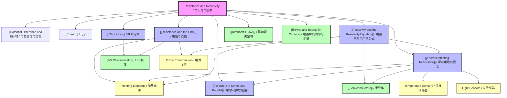

# Resistance and Resistivity / 电阻与电阻率

**Chapter:** 03-Electricity
**Level:** AS
**Difficulty:** Intermediate
**Parent Folder:** `vault/03-Electricity/01-DC-Circuits/Resistance and Resistivity/`

---

# 1. Overview / 概述

**English:**
Resistance and Resistivity form the foundational understanding of how materials oppose the flow of electric current. Resistance ($R$) is a property of a specific component or conductor, quantifying how much it impedes current flow for a given potential difference. Resistivity ($\rho$) is an intrinsic material property that describes how strongly a given material opposes current flow, independent of its shape or size. This topic bridges the macroscopic world of circuit components with the microscopic world of charge carriers and atomic structure.

In both Cambridge 9702 and Edexcel IAL syllabuses, this topic is essential for understanding [[Ohm's Law]], [[I-V Characteristics]], and the behaviour of [[Resistors in Series and Parallel]]. Real-world applications include designing heating elements (high resistivity materials like nichrome), electrical wiring (low resistivity materials like copper), thermistors (temperature-dependent resistivity), and strain gauges (geometry-dependent resistance). The concept of resistivity is also critical in semiconductor physics and the design of integrated circuits.

**中文：**
电阻和电阻率构成了理解材料如何阻碍电流流动的基础。电阻 ($R$) 是特定元件或导体的属性，量化了在给定电势差下它对电流流动的阻碍程度。电阻率 ($\rho$) 是一种固有的材料属性，描述了给定材料阻碍电流流动的强度，与其形状或大小无关。本主题将电路元件的宏观世界与电荷载流子和原子结构的微观世界联系起来。

在剑桥 9702 和爱德思 IAL 教学大纲中，本主题对于理解 [[欧姆定律]]、[[I-V 特性]] 以及 [[串联和并联电阻]] 的行为至关重要。实际应用包括设计加热元件（高电阻率材料，如镍铬合金）、电线（低电阻率材料，如铜）、热敏电阻（温度依赖性电阻率）和应变片（几何依赖性电阻）。电阻率的概念在半导体物理和集成电路设计中也至关重要。

---

# 2. Syllabus Learning Objectives / 考纲学习目标

| CAIE 9702 (9.3 a-f) | Edexcel IAL (WPH11 U2: 3.9-3.12) |
|---------------------|----------------------------------|
| 9.3(a) Define resistance and the ohm | 3.9 Define resistance and the ohm |
| 9.3(b) Recall and use $R = \frac{V}{I}$ | 3.9 Use $R = \frac{V}{I}$ |
| 9.3(c) Define resistivity and use $\rho = \frac{RA}{L}$ | 3.10 Define resistivity and use $\rho = \frac{RA}{L}$ |
| 9.3(d) Describe how resistance varies with temperature for a metal and a thermistor | 3.11 Describe how resistance varies with temperature for a metal and a negative temperature coefficient (NTC) thermistor |
| 9.3(e) Describe how resistance varies with light intensity for a light-dependent resistor (LDR) | 3.12 Describe how resistance varies with light intensity for a light-dependent resistor (LDR) |
| 9.3(f) Describe the effect of temperature on the resistance of a negative temperature coefficient (NTC) thermistor | 3.11 Explain the effect of temperature on the resistance of an NTC thermistor |

**Examiner Expectations / 考官期望:**

**English:**
- Candidates must be able to define resistance and resistivity using precise, exam-standard wording.
- Calculations involving $R = \frac{V}{I}$ and $\rho = \frac{RA}{L}$ must be performed accurately with correct unit conversions.
- Candidates should be able to sketch and interpret graphs of $I$ vs $V$ for ohmic and non-ohmic conductors.
- Understanding the physical meaning of resistivity as a material property is essential.
- For thermistors and LDRs, candidates must explain the mechanism behind resistance change, not just state the relationship.

**中文：**
- 考生必须能够使用精确的、符合考试标准的措辞来定义电阻和电阻率。
- 必须准确进行涉及 $R = \frac{V}{I}$ 和 $\rho = \frac{RA}{L}$ 的计算，并进行正确的单位换算。
- 考生应能够绘制和解释欧姆导体和非欧姆导体的 $I$ vs $V$ 图。
- 理解电阻率作为材料属性的物理意义至关重要。
- 对于热敏电阻和光敏电阻，考生必须解释电阻变化背后的机制，而不仅仅是陈述关系。

> 📋 **CIE Only:** CAIE specifically requires describing the effect of temperature on the resistance of an NTC thermistor (9.3f) as a separate objective.
>
> 📋 **Edexcel Only:** Edexcel explicitly mentions "negative temperature coefficient (NTC) thermistor" in the objective wording and requires explaining the mechanism.

---

# 3. Core Definitions / 核心定义

| Term (EN/CN) | Definition (EN) | Definition (CN) | Common Mistakes / 常见错误 |
|--------------|-----------------|-----------------|---------------------------|
| **Resistance / 电阻** | The opposition to electric current flow in a conductor or component, defined as the ratio of potential difference across the component to the current through it: $R = \frac{V}{I}$ | 导体或元件中对电流流动的阻碍，定义为元件两端的电势差与通过它的电流之比：$R = \frac{V}{I}$ | ❌ Confusing resistance with resistivity. Resistance is component-specific; resistivity is material-specific. ❌ Using $R = \frac{V}{I}$ only for ohmic conductors (it applies to all conductors, but $R$ may vary with $V$). |
| **Ohm / 欧姆** | The SI unit of resistance. A component has a resistance of 1 ohm ($1\ \Omega$) if a potential difference of 1 volt across it causes a current of 1 ampere to flow through it. | 电阻的SI单位。如果元件两端的电势差为1伏特，导致通过它的电流为1安培，则该元件的电阻为1欧姆 ($1\ \Omega$)。 | ❌ Writing "Ohm" with a capital O in unit symbols (correct: $\Omega$). ❌ Confusing the unit with the law (Ohm's Law). |
| **Resistivity / 电阻率** | An intrinsic material property that quantifies how strongly a given material opposes the flow of electric current, defined by $\rho = \frac{RA}{L}$, where $R$ is resistance, $A$ is cross-sectional area, and $L$ is length. | 一种固有的材料属性，量化了给定材料阻碍电流流动的强度，由 $\rho = \frac{RA}{L}$ 定义，其中 $R$ 是电阻，$A$ 是横截面积，$L$ 是长度。 | ❌ Thinking resistivity depends on the dimensions of the sample (it doesn't — it's a material constant). ❌ Using incorrect units (correct: $\Omega \cdot \text{m}$). |
| **Ohmic Conductor / 欧姆导体** | A conductor that obeys Ohm's Law, meaning the current through it is directly proportional to the potential difference across it at constant temperature. | 遵循欧姆定律的导体，意味着在恒定温度下，通过它的电流与它两端的电势差成正比。 | ❌ Assuming all conductors are ohmic (many are not, e.g., diodes, thermistors). ❌ Forgetting the "constant temperature" condition. |
| **Non-Ohmic Conductor / 非欧姆导体** | A conductor that does not obey Ohm's Law; the current is not directly proportional to the potential difference, and resistance changes with applied voltage. | 不遵循欧姆定律的导体；电流与电势差不成正比，电阻随外加电压变化。 | ❌ Thinking non-ohmic means no current flows. ❌ Confusing non-ohmic behaviour with circuit faults. |
| **Thermistor / 热敏电阻** | A temperature-dependent resistor whose resistance changes significantly with temperature. An NTC (Negative Temperature Coefficient) thermistor has resistance that decreases as temperature increases. | 一种温度依赖性电阻器，其电阻随温度显著变化。NTC（负温度系数）热敏电阻的电阻随温度升高而降低。 | ❌ Forgetting to specify NTC or PTC. ❌ Thinking all thermistors behave the same way. |
| **LDR (Light-Dependent Resistor) / 光敏电阻** | A resistor whose resistance decreases as the intensity of incident light increases. | 一种电阻随入射光强度增加而减小的电阻器。 | ❌ Thinking LDR resistance increases with light intensity (it decreases). ❌ Confusing LDR with a photodiode. |

---

# 4. Key Concepts Explained / 关键概念详解

## 4.1 Resistance and the Ohm / 电阻与欧姆

### Explanation / 解释
**English:**
Resistance ($R$) is a measure of how difficult it is for electric current to flow through a component. It arises from collisions between charge carriers (usually electrons) and the atoms of the conductor. The definition is given by:

$$R = \frac{V}{I}$$

where $V$ is the [[Potential Difference and EMF|potential difference]] across the component (in volts) and $I$ is the current through it (in amperes). This relationship holds for all conductors, but for non-ohmic conductors, $R$ is not constant — it depends on the applied voltage.

The unit of resistance is the ohm ($\Omega$). One ohm is defined as the resistance of a component when a potential difference of 1 volt across it produces a current of 1 ampere.

**中文：**
电阻 ($R$) 是衡量电流通过元件难易程度的量度。它源于电荷载流子（通常是电子）与导体原子之间的碰撞。其定义由下式给出：

$$R = \frac{V}{I}$$

其中 $V$ 是元件两端的 [[电势差与电动势|电势差]]（单位为伏特），$I$ 是通过它的电流（单位为安培）。这个关系适用于所有导体，但对于非欧姆导体，$R$ 不是恒定的——它取决于外加电压。

电阻的单位是欧姆 ($\Omega$)。一欧姆定义为当元件两端的电势差为1伏特，产生1安培电流时该元件的电阻。

### Physical Meaning / 物理意义
**English:**
Resistance represents the "friction" that charge carriers experience as they move through a material. Higher resistance means more energy is dissipated as heat for a given current (Joule heating). This is why high-resistance materials like nichrome are used in heating elements, while low-resistance materials like copper are used for power transmission wires.

**中文：**
电阻代表了电荷载流子在材料中移动时所经历的"摩擦"。更高的电阻意味着在给定电流下，更多的能量以热量的形式耗散（焦耳热）。这就是为什么像镍铬合金这样的高电阻材料用于加热元件，而像铜这样的低电阻材料用于电力传输线。

### Common Misconceptions / 常见误区
1. ❌ **"Resistance is the same as resistivity."** — Resistance is component-specific; resistivity is material-specific.
2. ❌ **"A component with zero resistance has infinite current."** — In reality, superconductors have zero resistance but current is limited by the circuit.
3. ❌ **"Resistance only applies to resistors."** — All components have some resistance, including wires (though ideally zero in circuit analysis).

### Exam Tips / 考试提示
**English:**
- Always state the definition: "Resistance is the ratio of potential difference to current."
- When calculating resistance from a graph, use the gradient of the $V$-$I$ graph (not $I$-$V$).
- For non-ohmic conductors, specify that resistance changes with voltage/current.
- Remember that $R = \frac{V}{I}$ gives the *average* resistance for non-ohmic devices; the instantaneous resistance is given by the gradient at a point.

**中文：**
- 始终陈述定义："电阻是电势差与电流之比。"
- 从图表计算电阻时，使用 $V$-$I$ 图的斜率（而不是 $I$-$V$ 图）。
- 对于非欧姆导体，说明电阻随电压/电流变化。
- 记住 $R = \frac{V}{I}$ 给出非欧姆器件的*平均*电阻；瞬时电阻由某点的斜率给出。

---

## 4.2 Resistivity and the Resistivity Equation / 电阻率与电阻率公式

### Explanation / 解释
**English:**
Resistivity ($\rho$) is an intrinsic property of a material that quantifies how strongly it opposes electric current flow, independent of the material's shape or size. It is defined by:

$$\rho = \frac{RA}{L}$$

where:
- $R$ = resistance of the sample ($\Omega$)
- $A$ = cross-sectional area ($\text{m}^2$)
- $L$ = length of the sample ($\text{m}$)

The SI unit of resistivity is the ohm-metre ($\Omega \cdot \text{m}$).

For a uniform conductor, rearranging gives:

$$R = \frac{\rho L}{A}$$

This shows that resistance is directly proportional to length and inversely proportional to cross-sectional area, with resistivity as the proportionality constant.

**中文：**
电阻率 ($\rho$) 是一种材料的固有属性，量化了它阻碍电流流动的强度，与材料的形状或大小无关。它由下式定义：

$$\rho = \frac{RA}{L}$$

其中：
- $R$ = 样品的电阻 ($\Omega$)
- $A$ = 横截面积 ($\text{m}^2$)
- $L$ = 样品的长度 ($\text{m}$)

电阻率的SI单位是欧姆·米 ($\Omega \cdot \text{m}$)。

对于均匀导体，重新排列得到：

$$R = \frac{\rho L}{A}$$

这表明电阻与长度成正比，与横截面积成反比，电阻率是比例常数。

### Physical Meaning / 物理意义
**English:**
Resistivity reflects how easily electrons can move through a material. Materials with low resistivity (e.g., copper: $1.7 \times 10^{-8}\ \Omega \cdot \text{m}$) are good conductors. Materials with high resistivity (e.g., glass: $10^{10}\ \Omega \cdot \text{m}$) are insulators. Semiconductors have intermediate resistivity that can be modified by doping or external factors like temperature and light.

**中文：**
电阻率反映了电子在材料中移动的难易程度。低电阻率材料（例如铜：$1.7 \times 10^{-8}\ \Omega \cdot \text{m}$）是良导体。高电阻率材料（例如玻璃：$10^{10}\ \Omega \cdot \text{m}$）是绝缘体。半导体具有中等电阻率，可以通过掺杂或外部因素（如温度和光）进行修改。

### Common Misconceptions / 常见误区
1. ❌ **"Resistivity changes when you cut a wire."** — No, resistivity is a material property; only resistance changes with dimensions.
2. ❌ **"Resistivity is the same as resistance per unit length."** — No, it's resistance × area / length.
3. ❌ **"All metals have the same resistivity."** — Different metals have different resistivities (e.g., copper vs. aluminium).

### Exam Tips / 考试提示
**English:**
- Always convert area to $\text{m}^2$ before using $\rho = \frac{RA}{L}$.
- For wires, cross-sectional area is usually circular: $A = \pi r^2 = \frac{\pi d^2}{4}$.
- Remember that resistivity is temperature-dependent for most materials.
- Be prepared to derive the resistivity equation from experimental data.

**中文：**
- 在使用 $\rho = \frac{RA}{L}$ 之前，始终将面积转换为 $\text{m}^2$。
- 对于导线，横截面积通常是圆形的：$A = \pi r^2 = \frac{\pi d^2}{4}$。
- 记住，大多数材料的电阻率是温度依赖性的。
- 准备好从实验数据推导电阻率方程。

---

## 4.3 Factors Affecting Resistance / 影响电阻的因素

### Explanation / 解释
**English:**
The resistance of a conductor depends on four main factors:

1. **Length ($L$):** $R \propto L$ — longer wires have more resistance because electrons collide with more atoms.
2. **Cross-sectional Area ($A$):** $R \propto \frac{1}{A}$ — thicker wires have less resistance because there are more paths for electrons.
3. **Resistivity ($\rho$):** $R \propto \rho$ — materials with higher resistivity have higher resistance.
4. **Temperature ($T$):** For metals, $R \propto T$ (increases with temperature); for semiconductors/thermistors, $R \propto \frac{1}{T}$ (decreases with temperature).

Combined: $R = \frac{\rho L}{A}$

**中文：**
导体的电阻取决于四个主要因素：

1. **长度 ($L$)：** $R \propto L$ — 较长的导线电阻更大，因为电子与更多原子碰撞。
2. **横截面积 ($A$)：** $R \propto \frac{1}{A}$ — 较粗的导线电阻更小，因为电子有更多路径。
3. **电阻率 ($\rho$)：** $R \propto \rho$ — 电阻率较高的材料具有更高的电阻。
4. **温度 ($T$)：** 对于金属，$R \propto T$（随温度升高而增加）；对于半导体/热敏电阻，$R \propto \frac{1}{T}$（随温度升高而降低）。

综合：$R = \frac{\rho L}{A}$

### Physical Meaning / 物理意义
**English:**
Understanding these factors allows engineers to design components with specific resistance values. For example:
- **Heating elements:** Use long, thin wires of high-resistivity materials (nichrome).
- **Power cables:** Use short, thick wires of low-resistivity materials (copper).
- **Thermistors:** Use semiconductor materials whose resistance changes predictably with temperature for temperature sensing.

**中文：**
理解这些因素使工程师能够设计具有特定电阻值的元件。例如：
- **加热元件：** 使用长而细的高电阻率材料（镍铬合金）导线。
- **电力电缆：** 使用短而粗的低电阻率材料（铜）导线。
- **热敏电阻：** 使用电阻随温度可预测变化的半导体材料进行温度传感。

### Common Misconceptions / 常见误区
1. ❌ **"Doubling the length doubles the resistance, but doubling the diameter also doubles the resistance."** — No, doubling the diameter quadruples the area ($A \propto d^2$), so resistance becomes one-quarter.
2. ❌ **"Temperature only affects metals."** — Temperature affects all conductors, but the direction of change differs.
3. ❌ **"A thicker wire always has less resistance than a thinner wire of the same material."** — Only if the length is the same.

### Exam Tips / 考试提示
**English:**
- When comparing wires, use the ratio method: $\frac{R_1}{R_2} = \frac{\rho_1 L_1 A_2}{\rho_2 L_2 A_1}$.
- For temperature effects, remember: metals → positive temperature coefficient; semiconductors → negative temperature coefficient.
- Be able to explain the microscopic mechanism: increased temperature → increased lattice vibrations → more electron collisions → higher resistance (for metals).

**中文：**
- 比较导线时，使用比例法：$\frac{R_1}{R_2} = \frac{\rho_1 L_1 A_2}{\rho_2 L_2 A_1}$。
- 对于温度效应，记住：金属 → 正温度系数；半导体 → 负温度系数。
- 能够解释微观机制：温度升高 → 晶格振动增加 → 更多电子碰撞 → 电阻增加（对于金属）。

---

## 4.4 Temperature Dependence of Resistance / 电阻的温度依赖性

### Explanation / 解释
**English:**
The resistance of materials changes with temperature due to changes in the atomic lattice vibrations and charge carrier concentration.

**For Metals:**
- As temperature increases, atoms vibrate more vigorously.
- This increases the probability of collisions between conduction electrons and lattice ions.
- Result: Resistance increases with temperature (positive temperature coefficient).
- The relationship is approximately linear over moderate temperature ranges:
  $$R_T = R_0(1 + \alpha T)$$
  where $\alpha$ is the temperature coefficient of resistance.

**For NTC Thermistors (Semiconductors):**
- As temperature increases, more electrons gain enough energy to jump from the valence band to the conduction band.
- This increases the number of charge carriers significantly.
- Result: Resistance decreases with temperature (negative temperature coefficient).
- The relationship is exponential, not linear.

**For LDRs:**
- As light intensity increases, photons provide energy to electrons, allowing them to become charge carriers.
- More charge carriers → lower resistance.
- In darkness, resistance is very high (M$\Omega$ range); in bright light, resistance can drop to hundreds of ohms.

**中文：**
材料的电阻随温度变化，这是由于原子晶格振动和电荷载流子浓度的变化。

**对于金属：**
- 随着温度升高，原子振动更加剧烈。
- 这增加了传导电子与晶格离子之间碰撞的概率。
- 结果：电阻随温度升高而增加（正温度系数）。
- 在中等温度范围内，关系近似线性：
  $$R_T = R_0(1 + \alpha T)$$
  其中 $\alpha$ 是电阻温度系数。

**对于NTC热敏电阻（半导体）：**
- 随着温度升高，更多电子获得足够能量从价带跃迁到导带。
- 这显著增加了电荷载流子的数量。
- 结果：电阻随温度升高而降低（负温度系数）。
- 关系是指数型的，而非线性的。

**对于光敏电阻：**
- 随着光强度增加，光子为电子提供能量，使它们成为电荷载流子。
- 更多电荷载流子 → 更低的电阻。
- 在黑暗中，电阻非常高（M$\Omega$ 范围）；在强光下，电阻可降至数百欧姆。

### Physical Meaning / 物理意义
**English:**
- **Metals:** Used in resistance temperature detectors (RTDs) for precise temperature measurement.
- **Thermistors:** Used in temperature sensors, fire alarms, and electronic circuits for temperature compensation.
- **LDRs:** Used in automatic lighting systems, light meters, and burglar alarms.

**中文：**
- **金属：** 用于电阻温度检测器 (RTD) 进行精确温度测量。
- **热敏电阻：** 用于温度传感器、火灾报警器和电子电路的温度补偿。
- **光敏电阻：** 用于自动照明系统、测光表和防盗报警器。

### Common Misconceptions / 常见误区
1. ❌ **"All materials have higher resistance at higher temperatures."** — No, semiconductors and thermistors have lower resistance at higher temperatures.
2. ❌ **"The resistance of a thermistor changes linearly with temperature."** — No, it changes exponentially.
3. ❌ **"LDRs respond to heat, not light."** — LDRs respond to light intensity, though some may also be affected by heat.

### Exam Tips / 考试提示
**English:**
- Sketch the $R$ vs $T$ graph for metals (increasing curve) and thermistors (decreasing curve).
- For NTC thermistors, explain using the band theory of solids (electrons gaining energy to cross the band gap).
- For LDRs, explain using photon energy and electron excitation.
- Be able to describe practical applications of each component.

**中文：**
- 绘制金属（上升曲线）和热敏电阻（下降曲线）的 $R$ vs $T$ 图。
- 对于NTC热敏电阻，使用固体能带理论解释（电子获得能量跨越带隙）。
- 对于光敏电阻，使用光子能量和电子激发解释。
- 能够描述每种元件的实际应用。

> 📋 **CIE Only:** CAIE requires describing the effect of temperature on the resistance of an NTC thermistor (9.3f) as a separate objective.
>
> 📋 **Edexcel Only:** Edexcel requires explaining the mechanism for NTC thermistors, not just describing.

---

# 5. Essential Equations / 核心公式

## 5.1 Ohm's Law / 欧姆定律

**Equation / 公式:**
$$V = IR$$

**Variables / 变量:**
| Symbol (符号) | Meaning (EN) | Meaning (CN) | Unit (单位) |
|--------------|-------------|-------------|------------|
| $V$ | Potential difference across the conductor | 导体两端的电势差 | V (volt / 伏特) |
| $I$ | Current through the conductor | 通过导体的电流 | A (ampere / 安培) |
| $R$ | Resistance of the conductor | 导体的电阻 | $\Omega$ (ohm / 欧姆) |

**Derivation / 推导:**
**English:**
Ohm's Law is an empirical law, not derived from first principles. It was discovered by Georg Ohm in 1827 through experimental observation. The law states that for a metallic conductor at constant temperature, the current through it is directly proportional to the potential difference across it.

$$I \propto V \quad \text{(at constant temperature)}$$
$$V = IR$$

**中文：**
欧姆定律是一个经验定律，并非从基本原理推导而来。它由乔治·欧姆于1827年通过实验观察发现。该定律指出，对于恒定温度下的金属导体，通过它的电流与它两端的电势差成正比。

$$I \propto V \quad \text{(在恒定温度下)}$$
$$V = IR$$

**Conditions / 适用条件:**
**English:**
- The conductor must be metallic (ohmic).
- Temperature must remain constant.
- The conductor must not be under extreme conditions (very high voltage, very low temperature).

**中文：**
- 导体必须是金属（欧姆）的。
- 温度必须保持恒定。
- 导体不得处于极端条件下（非常高的电压、非常低的温度）。

**Limitations / 局限性:**
**English:**
- Does not apply to non-ohmic conductors (diodes, thermistors, LDRs, transistors).
- Does not apply when temperature changes significantly.
- Does not apply to superconductors (where $R = 0$).

**中文：**
- 不适用于非欧姆导体（二极管、热敏电阻、光敏电阻、晶体管）。
- 当温度显著变化时不适用。
- 不适用于超导体（其中 $R = 0$）。

**Rearrangements / 变形:**
$$R = \frac{V}{I} \quad \text{and} \quad I = \frac{V}{R}$$

---

## 5.2 Resistance Definition / 电阻定义

**Equation / 公式:**
$$R = \frac{V}{I}$$

**Variables / 变量:**
| Symbol (符号) | Meaning (EN) | Meaning (CN) | Unit (单位) |
|--------------|-------------|-------------|------------|
| $R$ | Resistance | 电阻 | $\Omega$ (ohm / 欧姆) |
| $V$ | Potential difference | 电势差 | V (volt / 伏特) |
| $I$ | Current | 电流 | A (ampere / 安培) |

**Derivation / 推导:**
**English:**
This is the definition of resistance, derived from Ohm's experimental work. It applies to all conductors, ohmic or non-ohmic, but for non-ohmic conductors, $R$ is not constant.

**中文：**
这是电阻的定义，源自欧姆的实验工作。它适用于所有导体，无论是欧姆的还是非欧姆的，但对于非欧姆导体，$R$ 不是恒定的。

**Conditions / 适用条件:**
**English:**
- Applies to all conductors at any instant.
- For non-ohmic conductors, gives the average resistance over the range.

**中文：**
- 适用于任何时刻的所有导体。
- 对于非欧姆导体，给出该范围内的平均电阻。

**Limitations / 局限性:**
**English:**
- Does not give instantaneous resistance for non-ohmic conductors (use gradient of $V$-$I$ graph instead).

**中文：**
- 不给出非欧姆导体的瞬时电阻（改用 $V$-$I$ 图的斜率）。

**Rearrangements / 变形:**
$$V = IR \quad \text{and} \quad I = \frac{V}{R}$$

---

## 5.3 Resistivity Equation / 电阻率公式

**Equation / 公式:**
$$\rho = \frac{RA}{L}$$

**Variables / 变量:**
| Symbol (符号) | Meaning (EN) | Meaning (CN) | Unit (单位) |
|--------------|-------------|-------------|------------|
| $\rho$ | Resistivity of the material | 材料的电阻率 | $\Omega \cdot \text{m}$ (ohm-metre / 欧姆·米) |
| $R$ | Resistance of the sample | 样品的电阻 | $\Omega$ (ohm / 欧姆) |
| $A$ | Cross-sectional area | 横截面积 | $\text{m}^2$ (square metre / 平方米) |
| $L$ | Length of the sample | 样品的长度 | m (metre / 米) |

**Derivation / 推导:**
**English:**
The resistivity equation is derived from the relationship between resistance and the physical dimensions of a conductor. Experimentally, it is found that:

$$R \propto L \quad \text{(for constant } A \text{ and } \rho\text{)}$$
$$R \propto \frac{1}{A} \quad \text{(for constant } L \text{ and } \rho\text{)}$$

Combining these proportionalities:

$$R \propto \frac{L}{A}$$

Introducing the proportionality constant $\rho$ (resistivity):

$$R = \frac{\rho L}{A}$$

Rearranging gives the standard form:

$$\rho = \frac{RA}{L}$$

**中文：**
电阻率公式源自电阻与导体物理尺寸之间的关系。实验发现：

$$R \propto L \quad \text{（对于恒定的 } A \text{ 和 } \rho\text{）}$$
$$R \propto \frac{1}{A} \quad \text{（对于恒定的 } L \text{ 和 } \rho\text{）}$$

结合这些比例关系：

$$R \propto \frac{L}{A}$$

引入比例常数 $\rho$（电阻率）：

$$R = \frac{\rho L}{A}$$

重新排列得到标准形式：

$$\rho = \frac{RA}{L}$$

**Conditions / 适用条件:**
**English:**
- The conductor must be uniform (constant cross-sectional area along its length).
- The material must be homogeneous (same resistivity throughout).
- Temperature must be constant (resistivity is temperature-dependent).

**中文：**
- 导体必须是均匀的（沿其长度横截面积恒定）。
- 材料必须是均匀的（各处电阻率相同）。
- 温度必须恒定（电阻率是温度依赖性的）。

**Limitations / 局限性:**
**English:**
- Does not apply to non-uniform conductors.
- Does not account for temperature variations.
- Assumes the conductor is long and thin (end effects are negligible).

**中文：**
- 不适用于非均匀导体。
- 不考虑温度变化。
- 假设导体长而细（端部效应可忽略）。

**Rearrangements / 变形:**
$$R = \frac{\rho L}{A} \quad \text{and} \quad L = \frac{RA}{\rho} \quad \text{and} \quad A = \frac{\rho L}{R}$$

---

## 5.4 Temperature Dependence of Resistance (Metals) / 电阻的温度依赖性（金属）

**Equation / 公式:**
$$R_T = R_0(1 + \alpha T)$$

**Variables / 变量:**
| Symbol (符号) | Meaning (EN) | Meaning (CN) | Unit (单位) |
|--------------|-------------|-------------|------------|
| $R_T$ | Resistance at temperature $T$ | 温度 $T$ 时的电阻 | $\Omega$ |
| $R_0$ | Resistance at reference temperature (usually 0°C or 20°C) | 参考温度下的电阻（通常为0°C或20°C） | $\Omega$ |
| $\alpha$ | Temperature coefficient of resistance | 电阻温度系数 | $\text{K}^{-1}$ or $°\text{C}^{-1}$ |
| $T$ | Temperature change from reference | 相对于参考温度的温度变化 | K or °C |

**Derivation / 推导:**
**English:**
For metals over moderate temperature ranges, the resistance increases approximately linearly with temperature. This is because the resistivity of metals increases linearly with temperature:

$$\rho_T = \rho_0(1 + \alpha T)$$

Since $R = \frac{\rho L}{A}$ and $L$ and $A$ change negligibly with temperature compared to $\rho$:

$$R_T = R_0(1 + \alpha T)$$

**中文：**
对于中等温度范围内的金属，电阻随温度近似线性增加。这是因为金属的电阻率随温度线性增加：

$$\rho_T = \rho_0(1 + \alpha T)$$

由于 $R = \frac{\rho L}{A}$，且与 $\rho$ 相比，$L$ 和 $A$ 随温度的变化可忽略不计：

$$R_T = R_0(1 + \alpha T)$$

**Conditions / 适用条件:**
**English:**
- Only applies to metals (not semiconductors or thermistors).
- Only valid over moderate temperature ranges (not near melting point or absolute zero).
- $\alpha$ is approximately constant only over limited temperature ranges.

**中文：**
- 仅适用于金属（不适用于半导体或热敏电阻）。
- 仅在中等温度范围内有效（不接近熔点或绝对零度）。
- $\alpha$ 仅在有限的温度范围内近似恒定。

**Limitations / 局限性:**
**English:**
- Does not apply to semiconductors or insulators.
- Not accurate at very high or very low temperatures.
- $\alpha$ itself can vary with temperature.

**中文：**
- 不适用于半导体或绝缘体。
- 在非常高或非常低的温度下不准确。
- $\alpha$ 本身可能随温度变化。

**Rearrangements / 变形:**
$$\alpha = \frac{R_T - R_0}{R_0 T} \quad \text{and} \quad T = \frac{R_T - R_0}{\alpha R_0}$$

---

# 6. Graphs and Relationships / 图表与关系

## 6.1 Current vs Potential Difference for an Ohmic Conductor / 欧姆导体的电流 vs 电势差图

### Axes / 坐标轴
**English:** x-axis: Potential Difference $V$ (V); y-axis: Current $I$ (A)
**中文：** x轴：电势差 $V$ (V)；y轴：电流 $I$ (A)

### Shape / 形状
**English:** A straight line passing through the origin with constant positive gradient.
**中文：** 一条通过原点的直线，具有恒定的正斜率。

### Gradient Meaning / 斜率含义
**English:** The gradient of the $V$-$I$ graph is $\frac{1}{R}$ (conductance). The gradient of the $I$-$V$ graph is $R$.
**中文：** $V$-$I$ 图的斜率是 $\frac{1}{R}$（电导）。$I$-$V$ 图的斜率是 $R$。

### Area Meaning / 面积含义
**English:** The area under the $V$-$I$ graph has no direct physical meaning. The area under the $P$-$t$ graph gives energy.
**中文：** $V$-$I$ 图下的面积没有直接的物理意义。$P$-$t$ 图下的面积给出能量。

### Exam Interpretation / 考试解读
**English:**
- A straight line through origin → ohmic conductor, constant resistance.
- The steeper the line, the lower the resistance.
- Any deviation from linearity → non-ohmic behaviour.

**中文：**
- 通过原点的直线 → 欧姆导体，恒定电阻。
- 线越陡，电阻越低。
- 任何偏离线性 → 非欧姆行为。

### Common Questions / 常见问题
**English:**
- "Calculate the resistance from the graph."
- "Explain why the graph is a straight line."
- "What happens to the graph if temperature increases?"

**中文：**
- "从图表计算电阻。"
- "解释为什么图表是一条直线。"
- "如果温度升高，图表会发生什么变化？"

---

## 6.2 Current vs Potential Difference for a Non-Ohmic Conductor / 非欧姆导体的电流 vs 电势差图

### Axes / 坐标轴
**English:** x-axis: Potential Difference $V$ (V); y-axis: Current $I$ (A)
**中文：** x轴：电势差 $V$ (V)；y轴：电流 $I$ (A)

### Shape / 形状
**English:** A curved line. For a filament lamp, the curve flattens at higher voltages (resistance increases). For a thermistor, the curve becomes steeper at higher voltages (resistance decreases).
**中文：** 一条曲线。对于白炽灯，曲线在较高电压下变平（电阻增加）。对于热敏电阻，曲线在较高电压下变陡（电阻减小）。

### Gradient Meaning / 斜率含义
**English:** The gradient at any point gives the instantaneous resistance at that voltage/current.
**中文：** 任意点的斜率给出该电压/电流下的瞬时电阻。

### Area Meaning / 面积含义
**English:** The area under the $I$-$V$ graph gives the power dissipated at that point ($P = IV$).
**中文：** $I$-$V$ 图下的面积给出该点的耗散功率 ($P = IV$)。

### Exam Interpretation / 考试解读
**English:**
- For a filament lamp: as $V$ increases, $I$ increases but not proportionally → resistance increases due to heating.
- For a thermistor: as $V$ increases, $I$ increases more than proportionally → resistance decreases due to self-heating.
- For a diode: current flows easily in one direction (forward bias) but very little in the reverse direction.

**中文：**
- 对于白炽灯：随着 $V$ 增加，$I$ 增加但不成比例 → 由于加热，电阻增加。
- 对于热敏电阻：随着 $V$ 增加，$I$ 增加超过比例 → 由于自热，电阻减小。
- 对于二极管：电流在一个方向（正向偏置）容易流动，但在反向方向几乎不流动。

### Common Questions / 常见问题
**English:**
- "Explain the shape of the $I$-$V$ characteristic for a filament lamp."
- "Determine the resistance at a specific voltage from the graph."
- "Compare the $I$-$V$ characteristics of a metal and a thermistor."

**中文：**
- "解释白炽灯 $I$-$V$ 特性的形状。"
- "从图表确定特定电压下的电阻。"
- "比较金属和热敏电阻的 $I$-$V$ 特性。"

---

## 6.3 Resistance vs Temperature for a Metal / 金属的电阻 vs 温度图

### Axes / 坐标轴
**English:** x-axis: Temperature $T$ (°C or K); y-axis: Resistance $R$ ($\Omega$)
**中文：** x轴：温度 $T$ (°C 或 K)；y轴：电阻 $R$ ($\Omega$)

### Shape / 形状
**English:** A straight line with positive gradient (approximately linear over moderate temperature ranges).
**中文：** 一条具有正斜率的直线（在中等温度范围内近似线性）。

### Gradient Meaning / 斜率含义
**English:** The gradient is $\alpha R_0$, where $\alpha$ is the temperature coefficient of resistance.
**中文：** 斜率是 $\alpha R_0$，其中 $\alpha$ 是电阻温度系数。

### Area Meaning / 面积含义
**English:** No direct physical meaning.
**中文：** 没有直接的物理意义。

### Exam Interpretation / 考试解读
**English:**
- Positive gradient → resistance increases with temperature.
- The intercept on the $R$-axis gives $R_0$ (resistance at 0°C).
- Used to determine the temperature coefficient $\alpha$.

**中文：**
- 正斜率 → 电阻随温度升高而增加。
- $R$ 轴上的截距给出 $R_0$（0°C 时的电阻）。
- 用于确定温度系数 $\alpha$。

### Common Questions / 常见问题
**English:**
- "Determine the temperature coefficient of resistance from the graph."
- "Calculate the resistance at a given temperature."
- "Explain why the graph is linear."

**中文：**
- "从图表确定电阻温度系数。"
- "计算给定温度下的电阻。"
- "解释为什么图表是线性的。"

---

## 6.4 Resistance vs Temperature for an NTC Thermistor / NTC热敏电阻的电阻 vs 温度图

### Axes / 坐标轴
**English:** x-axis: Temperature $T$ (°C or K); y-axis: Resistance $R$ ($\Omega$)
**中文：** x轴：温度 $T$ (°C 或 K)；y轴：电阻 $R$ ($\Omega$)

### Shape / 形状
**English:** A steeply decreasing curve that flattens at higher temperatures. The relationship is exponential: $R = R_0 e^{B/T}$ where $B$ is a material constant.
**中文：** 一条急剧下降的曲线，在较高温度下变平。关系是指数型的：$R = R_0 e^{B/T}$，其中 $B$ 是材料常数。

### Gradient Meaning / 斜率含义
**English:** The gradient is negative and becomes less steep at higher temperatures.
**中文：** 斜率为负，在较高温度下变得不那么陡。

### Area Meaning / 面积含义
**English:** No direct physical meaning.
**中文：** 没有直接的物理意义。

### Exam Interpretation / 考试解读
**English:**
- Negative gradient → resistance decreases with temperature.
- The graph is not linear → resistance changes rapidly near room temperature.
- Used in temperature sensing circuits.

**中文：**
- 负斜率 → 电阻随温度升高而降低。
- 图表不是线性的 → 电阻在室温附近变化迅速。
- 用于温度传感电路。

### Common Questions / 常见问题
**English:**
- "Explain why the resistance of an NTC thermistor decreases with temperature."
- "Sketch the $R$ vs $T$ graph for an NTC thermistor."
- "Compare the temperature response of a metal and a thermistor."

**中文：**
- "解释为什么NTC热敏电阻的电阻随温度降低。"
- "绘制NTC热敏电阻的 $R$ vs $T$ 图。"
- "比较金属和热敏电阻的温度响应。"

---

## 6.5 Resistance vs Light Intensity for an LDR / 光敏电阻的电阻 vs 光强度图

### Axes / 坐标轴
**English:** x-axis: Light Intensity $E$ (lux or arbitrary units); y-axis: Resistance $R$ ($\Omega$)
**中文：** x轴：光强度 $E$（勒克斯或任意单位）；y轴：电阻 $R$ ($\Omega$)

### Shape / 形状
**English:** A steeply decreasing curve that flattens at higher light intensities. The relationship is approximately: $R \propto \frac{1}{E}$.
**中文：** 一条急剧下降的曲线，在较高光强度下变平。关系近似为：$R \propto \frac{1}{E}$。

### Gradient Meaning / 斜率含义
**English:** The gradient is negative and becomes less steep at higher light intensities.
**中文：** 斜率为负，在较高光强度下变得不那么陡。

### Area Meaning / 面积含义
**English:** No direct physical meaning.
**中文：** 没有直接的物理意义。

### Exam Interpretation / 考试解读
**English:**
- Negative gradient → resistance decreases with increasing light intensity.
- In darkness, resistance is very high (M$\Omega$).
- In bright light, resistance is low (hundreds of $\Omega$).
- Used in light-sensing circuits.

**中文：**
- 负斜率 → 电阻随光强度增加而降低。
- 在黑暗中，电阻非常高（M$\Omega$）。
- 在强光下，电阻很低（数百 $\Omega$）。
- 用于光传感电路。

### Common Questions / 常见问题
**English:**
- "Explain why the resistance of an LDR decreases with increasing light intensity."
- "Sketch the $R$ vs $E$ graph for an LDR."
- "Describe a practical application of an LDR."

**中文：**
- "解释为什么光敏电阻的电阻随光强度增加而降低。"
- "绘制光敏电阻的 $R$ vs $E$ 图。"
- "描述光敏电阻的实际应用。"

---

# 7. Required Diagrams / 必备图表

## 7.1 Circuit for Measuring Resistance Using an Ohmmeter / 使用欧姆表测量电阻的电路

### Description / 描述
**English:**
A simple circuit showing an ohmmeter connected directly across a resistor. The ohmmeter contains a battery and a galvanometer calibrated to read resistance directly. The resistor is disconnected from any other circuit components during measurement.

**中文：**
一个简单的电路，显示欧姆表直接连接在电阻两端。欧姆表包含一个电池和一个校准为直接读取电阻的电流计。测量期间，电阻与任何其他电路元件断开连接。

### Image Prompt / 图片生成提示
> 📷 **IMAGE PROMPT — R01: Ohmmeter Circuit Diagram**
>
> A clean, educational circuit diagram showing an ohmmeter (labeled "Ohmmeter / 欧姆表") connected in parallel with a cylindrical resistor (labeled "Resistor / 电阻器 R"). The ohmmeter is represented as a circle with "Ω" inside, with two terminals. The resistor is shown as a zigzag line. Connecting wires are straight lines. Use a white background with black lines and blue labels. Style: textbook-quality schematic diagram. No perspective, 2D top view only.

### Labels Required / 需要标注
| English | 中文 |
|---------|------|
| Ohmmeter | 欧姆表 |
| Resistor $R$ | 电阻器 $R$ |
| Connecting wires | 连接导线 |
| Terminals | 接线端 |

### Exam Importance / 考试重要性
**English:**
This diagram tests understanding of how resistance is measured in practice. Candidates should know that the component must be isolated from the circuit for accurate measurement.

**中文：**
此图测试对实际中如何测量电阻的理解。考生应知道，为了准确测量，元件必须与电路隔离。

---

## 7.2 Experimental Setup for Determining Resistivity / 测定电阻率的实验装置

### Description / 描述
**English:**
A diagram showing a wire of known length and cross-sectional area connected to a power supply, ammeter (in series), and voltmeter (in parallel). A micrometer screw gauge is shown for measuring wire diameter, and a ruler for measuring length. The wire is mounted on a meter rule.

**中文：**
一个图表，显示已知长度和横截面积的导线连接到电源、电流表（串联）和电压表（并联）。显示用于测量导线直径的千分尺和用于测量长度的尺子。导线安装在米尺上。

### Image Prompt / 图片生成提示
> 📷 **IMAGE PROMPT — R02: Resistivity Experiment Setup**
>
> A detailed educational diagram of a physics laboratory experiment setup. A long, thin wire (constantan or nichrome) is stretched along a meter rule. The wire is connected to a DC power supply (labeled "Power Supply / 电源") through an ammeter (labeled "A") in series. A voltmeter (labeled "V") is connected in parallel across a measured length of the wire using flying leads. A micrometer screw gauge is shown next to the setup, measuring the wire diameter. A ruler is visible along the wire. Use a clean, isometric perspective with a white background. Labels in English and Chinese. Style: textbook illustration, clear and educational.

### Labels Required / 需要标注
| English | 中文 |
|---------|------|
| Power supply | 电源 |
| Ammeter (A) | 电流表 (A) |
| Voltmeter (V) | 电压表 (V) |
| Wire (length $L$) | 导线（长度 $L$） |
| Micrometer screw gauge | 千分尺 |
| Meter rule | 米尺 |
| Flying leads | 飞线 |
| Crocodile clips | 鳄鱼夹 |

### Exam Importance / 考试重要性
**English:**
This is a standard practical for both CAIE (Paper 3/5) and Edexcel (Unit 3/6). Candidates must know how to:
- Measure diameter using a micrometer (multiple readings, average).
- Measure length accurately.
- Connect the circuit correctly.
- Calculate resistivity from measurements.
- Handle uncertainties.

**中文：**
这是剑桥（Paper 3/5）和爱德思（Unit 3/6）的标准实验。考生必须知道如何：
- 使用千分尺测量直径（多次读数，取平均值）。
- 准确测量长度。
- 正确连接电路。
- 从测量值计算电阻率。
- 处理不确定度。

---

## 7.3 I-V Characteristic Curves / I-V特性曲线

### Description / 描述
**English:**
A composite diagram showing three $I$-$V$ characteristic graphs side by side: (a) Ohmic conductor (straight line through origin), (b) Filament lamp (curved, flattening at higher voltages), (c) NTC thermistor (curved, becoming steeper at higher voltages). Each graph has labeled axes and a brief description.

**中文：**
一个组合图，并排显示三个 $I$-$V$ 特性图：(a) 欧姆导体（通过原点的直线），(b) 白炽灯（曲线，在较高电压下变平），(c) NTC热敏电阻（曲线，在较高电压下变陡）。每个图都有标注的坐标轴和简要描述。

### Image Prompt / 图片生成提示
> 📷 **IMAGE PROMPT — R03: I-V Characteristic Curves Comparison**
>
> A three-panel educational diagram comparing I-V characteristics. Panel (a): "Ohmic Conductor / 欧姆导体" — straight line through origin, labeled "Constant R". Panel (b): "Filament Lamp / 白炽灯" — curved line flattening at higher V, labeled "R increases with V". Panel (c): "NTC Thermistor / NTC热敏电阻" — curved line becoming steeper at higher V, labeled "R decreases with V". Each panel has labeled x-axis "V / V" and y-axis "I / A". Use a clean, white background with black curves and blue labels. Style: textbook-quality graph, 2D, no perspective.

### Labels Required / 需要标注
| English | 中文 |
|---------|------|
| Ohmic Conductor | 欧姆导体 |
| Filament Lamp | 白炽灯 |
| NTC Thermistor | NTC热敏电阻 |
| Constant $R$ | 恒定 $R$ |
| $R$ increases with $V$ | $R$ 随 $V$ 增加 |
| $R$ decreases with $V$ | $R$ 随 $V$ 减小 |
| $V$ / V | $V$ / V |
| $I$ / A | $I$ / A |

### Exam Importance / 考试重要性
**English:**
This is a core diagram for understanding ohmic vs non-ohmic behaviour. Candidates must be able to:
- Identify each curve.
- Explain the shape in terms of resistance changes.
- Calculate resistance from any point on the graph.
- Predict the curve for a given component.

**中文：**
这是理解欧姆与非欧姆行为的核心图表。考生必须能够：
- 识别每条曲线。
- 根据电阻变化解释形状。
- 从图上的任意点计算电阻。
- 预测给定元件的曲线。

---

# 8. Worked Examples / 典型例题

## Example 1: Calculating Resistance from I-V Data / 从I-V数据计算电阻

### Question / 题目
**English:**
A potential difference of 12.0 V is applied across a resistor, and a current of 2.50 A flows through it.

(a) Calculate the resistance of the resistor.
(b) If the same resistor is connected to a 9.0 V supply, what current will flow?
(c) The resistor is made of a wire of length 2.00 m and cross-sectional area $5.0 \times 10^{-7}\ \text{m}^2$. Calculate the resistivity of the material.

**中文：**
一个12.0 V的电势差施加在一个电阻器两端，通过它的电流为2.50 A。

(a) 计算电阻器的电阻。
(b) 如果同一个电阻器连接到9.0 V的电源，将流过多少电流？
(c) 该电阻器由长度为2.00 m、横截面积为 $5.0 \times 10^{-7}\ \text{m}^2$ 的导线制成。计算材料的电阻率。

### Solution / 解答

**Part (a):**

$$R = \frac{V}{I} = \frac{12.0}{2.50} = 4.80\ \Omega$$

**Part (b):**

Since the resistor is ohmic (assumed), $R$ is constant:

$$I = \frac{V}{R} = \frac{9.0}{4.80} = 1.875\ \text{A} \approx 1.88\ \text{A}$$

**Part (c):**

Using $\rho = \frac{RA}{L}$:

$$\rho = \frac{4.80 \times 5.0 \times 10^{-7}}{2.00} = 1.2 \times 10^{-6}\ \Omega \cdot \text{m}$$

### Final Answer / 最终答案
**Answer:**
(a) $R = 4.80\ \Omega$
(b) $I = 1.88\ \text{A}$
(c) $\rho = 1.2 \times 10^{-6}\ \Omega \cdot \text{m}$

**答案：**
(a) $R = 4.80\ \Omega$
(b) $I = 1.88\ \text{A}$
(c) $\rho = 1.2 \times 10^{-6}\ \Omega \cdot \text{m}$

### Examiner Notes / 考官点评
**English:**
- Part (a) is straightforward — just apply $R = V/I$.
- Part (b) assumes the resistor is ohmic (constant resistance). If the resistor were a filament lamp, this assumption would be invalid.
- Part (c) requires correct substitution into the resistivity formula. Common mistakes include forgetting to convert units or using diameter instead of area.
- Always check significant figures: 12.0 has 3 sf, 2.50 has 3 sf, so answer should have 3 sf.

**中文：**
- 部分 (a) 直接明了——只需应用 $R = V/I$。
- 部分 (b) 假设电阻器是欧姆的（恒定电阻）。如果电阻器是白炽灯，这个假设就无效了。
- 部分 (c) 需要正确代入电阻率公式。常见错误包括忘记转换单位或使用直径而不是面积。
- 始终检查有效数字：12.0 有3位有效数字，2.50 有3位有效数字，所以答案应有3位有效数字。

---

## Example 2: Temperature Dependence of Resistance / 电阻的温度依赖性

### Question / 题目
**English:**
A copper wire has a resistance of 5.00 $\Omega$ at 20.0°C. The temperature coefficient of resistance for copper is $3.9 \times 10^{-3}\ \text{K}^{-1}$.

(a) Calculate the resistance of the wire at 80.0°C.
(b) The wire is then cooled to 0°C. Calculate its resistance at this temperature.
(c) Explain, in terms of charge carriers and lattice vibrations, why the resistance of a metal increases with temperature.

**中文：**
一根铜导线在20.0°C时的电阻为5.00 $\Omega$。铜的电阻温度系数为 $3.9 \times 10^{-3}\ \text{K}^{-1}$。

(a) 计算导线在80.0°C时的电阻。
(b) 然后将导线冷却到0°C。计算它在这个温度下的电阻。
(c) 从电荷载流子和晶格振动的角度解释为什么金属的电阻随温度升高而增加。

### Solution / 解答

**Part (a):**

Using $R_T = R_0(1 + \alpha T)$:

Temperature change: $T = 80.0 - 20.0 = 60.0\ \text{K}$

$$R_{80} = 5.00(1 + 3.9 \times 10^{-3} \times 60.0)$$
$$R_{80} = 5.00(1 + 0.234)$$
$$R_{80} = 5.00 \times 1.234 = 6.17\ \Omega$$

**Part (b):**

Temperature change from 20.0°C to 0°C: $T = 0 - 20.0 = -20.0\ \text{K}$

$$R_0 = 5.00(1 + 3.9 \times 10^{-3} \times (-20.0))$$
$$R_0 = 5.00(1 - 0.078)$$
$$R_0 = 5.00 \times 0.922 = 4.61\ \Omega$$

**Part (c):**

**English:**
In a metal, conduction electrons move through a lattice of positive metal ions. As temperature increases, the ions vibrate with greater amplitude about their equilibrium positions. This increases the probability of collisions between the conduction electrons and the vibrating ions. More collisions mean greater opposition to electron flow, hence higher resistance. The increased lattice vibrations scatter electrons more effectively, reducing their drift velocity for a given electric field.

**中文：**
在金属中，传导电子在正金属离子的晶格中移动。随着温度升高，离子围绕其平衡位置以更大的振幅振动。这增加了传导电子与振动离子之间碰撞的概率。更多的碰撞意味着对电子流动的阻碍更大，因此电阻更高。增加的晶格振动更有效地散射电子，降低了在给定电场下的漂移速度。

### Final Answer / 最终答案
**Answer:**
(a) $R_{80} = 6.17\ \Omega$
(b) $R_0 = 4.61\ \Omega$
(c) See explanation above.

**答案：**
(a) $R_{80} = 6.17\ \Omega$
(b) $R_0 = 4.61\ \Omega$
(c) 见上述解释。

### Examiner Notes / 考官点评
**English:**
- Part (a) and (b): Note that $T$ is the temperature *change*, not the absolute temperature.
- The formula $R_T = R_0(1 + \alpha T)$ uses temperature change in K or °C (the numerical value is the same).
- Part (c): This is a common 3-4 mark explanation question. Key points: lattice vibrations increase → more collisions → reduced mean free path → higher resistance. Do NOT say "electrons move slower" — they move faster, but are scattered more.
- For Edexcel, the explanation must include reference to the band theory or energy gap for thermistors.

**中文：**
- 部分 (a) 和 (b)：注意 $T$ 是温度*变化*，而不是绝对温度。
- 公式 $R_T = R_0(1 + \alpha T)$ 使用 K 或 °C 的温度变化（数值相同）。
- 部分 (c)：这是一个常见的3-4分解释题。关键点：晶格振动增加 → 更多碰撞 → 平均自由程减小 → 电阻更高。不要说"电子移动更慢"——它们移动得更快，但被散射得更多。
- 对于爱德思，解释必须涉及能带理论或热敏电阻的能隙。

---

# 9. Past Paper Question Types / 历年真题题型

| Question Type / 题型 | Frequency / 频率 | Difficulty / 难度 | Past Paper References / 真题索引 |
|----------------------|------------------|------------------|-------------------------------|
| Calculation of Resistance / 电阻计算 | High | Low-Medium | 📝 *待填入* |
| Calculation of Resistivity / 电阻率计算 | High | Medium | 📝 *待填入* |
| I-V Characteristic Explanation / I-V特性解释 | High | Medium | 📝 *待填入* |
| Temperature Dependence Explanation / 温度依赖性解释 | Medium-High | Medium-High | 📝 *待填入* |
| Graph Sketching / 图表绘制 | Medium | Medium | 📝 *待填入* |
| Experimental Design / 实验设计 | Medium | High | 📝 *待填入* |
| Derivation of Resistivity Equation / 电阻率公式推导 | Low | Low | 📝 *待填入* |
| Comparison of Conductors / 导体比较 | Low-Medium | Medium | 📝 *待填入* |

> 📝 **题库整理中 / Question Bank Under Construction:** 具体试卷编号（如 9702/23/M/J/24 Q3）将在后续整理真题后填入上表。

**Common Command Words / 常见指令词:**

| English | 中文 | Typical Usage |
|---------|------|---------------|
| State | 陈述 | "State Ohm's Law" — recall a definition or law |
| Define | 定义 | "Define resistivity" — give the precise definition |
| Calculate | 计算 | "Calculate the resistance" — perform a numerical calculation |
| Determine | 确定 | "Determine the resistivity" — calculate from given data or graph |
| Explain | 解释 | "Explain why resistance increases with temperature" — give reasons |
| Describe | 描述 | "Describe how the resistance of an LDR varies with light intensity" — state the relationship |
| Sketch | 绘制 | "Sketch the I-V characteristic for a filament lamp" — draw the graph |
| Suggest | 建议 | "Suggest a suitable material for a heating element" — apply knowledge |
| Compare | 比较 | "Compare the temperature dependence of a metal and a thermistor" — highlight similarities and differences |

---

# 10. Practical Skills Connections / 实验技能链接

**English:**
This topic has strong practical components in both CAIE and Edexcel specifications.

**CAIE Practical Connections:**
- **Paper 3 (AS):** Determining the resistivity of a wire using a micrometer, ruler, ammeter, and voltmeter. Candidates must:
  - Measure wire diameter using a micrometer screw gauge (multiple readings, calculate mean).
  - Measure length using a meter rule.
  - Set up a circuit to measure $V$ and $I$.
  - Calculate $R$ and then $\rho$.
  - Plot graphs of $R$ vs $L$ to determine $\rho$ from the gradient.
  - Handle uncertainties in measurements.
- **Paper 5 (A2):** Planning experiments to investigate factors affecting resistance, including temperature dependence.

**Edexcel Practical Connections:**
- **Unit 3 (AS):** Core Practical 4: "Determine the resistivity of a metal wire." Similar procedure to CAIE.
- **Unit 6 (A2):** Investigating the I-V characteristics of components (filament lamp, thermistor, diode).

**Common Practical Skills:**
1. **Using a micrometer screw gauge:**
   - Check for zero error.
   - Take readings at several points along the wire and in different orientations.
   - Calculate mean diameter.
   - Convert to radius and then area ($A = \pi r^2$).

2. **Circuit connections:**
   - Ammeter in series.
   - Voltmeter in parallel.
   - Use a variable resistor (rheostat) to vary voltage/current.
   - Start with low voltages to avoid overheating.

3. **Data analysis:**
   - Plot $R$ vs $L$ graph — should be a straight line through origin.
   - Gradient $= \frac{\rho}{A}$, so $\rho = \text{gradient} \times A$.
   - Alternatively, plot $V$ vs $I$ and find $R$ from gradient.

4. **Uncertainties:**
   - Diameter measurement: typically ±0.01 mm (micrometer).
   - Length measurement: typically ±1 mm (ruler).
   - Voltage/current: depends on instrument precision.
   - Percentage uncertainty in $\rho$ is the sum of percentage uncertainties in $R$, $A$, and $L$.

**中文：**
本主题在剑桥和爱德思的规范中都有很强的实践成分。

**剑桥实践链接：**
- **Paper 3 (AS)：** 使用千分尺、尺子、电流表和电压表测定导线的电阻率。考生必须：
  - 使用千分尺测量导线直径（多次读数，计算平均值）。
  - 使用米尺测量长度。
  - 搭建电路测量 $V$ 和 $I$。
  - 计算 $R$ 然后计算 $\rho$。
  - 绘制 $R$ vs $L$ 图，从斜率确定 $\rho$。
  - 处理测量中的不确定度。
- **Paper 5 (A2)：** 规划实验以研究影响电阻的因素，包括温度依赖性。

**爱德思实践链接：**
- **Unit 3 (AS)：** 核心实践4："测定金属导线的电阻率。" 与剑桥类似的操作步骤。
- **Unit 6 (A2)：** 研究元件的 I-V 特性（白炽灯、热敏电阻、二极管）。

**常见实验技能：**
1. **使用千分尺：**
   - 检查零误差。
   - 沿导线在不同位置和不同方向进行多次读数。
   - 计算平均直径。
   - 转换为半径然后计算面积 ($A = \pi r^2$)。

2. **电路连接：**
   - 电流表串联。
   - 电压表并联。
   - 使用可变电阻器（变阻器）改变电压/电流。
   - 从低电压开始，避免过热。

3. **数据分析：**
   - 绘制 $R$ vs $L$ 图——应为通过原点的直线。
   - 斜率 $= \frac{\rho}{A}$，所以 $\rho = \text{斜率} \times A$。
   - 或者，绘制 $V$ vs $I$ 图，从斜率求 $R$。

4. **不确定度：**
   - 直径测量：通常 ±0.01 mm（千分尺）。
   - 长度测量：通常 ±1 mm（尺子）。
   - 电压/电流：取决于仪器精度。
   - $\rho$ 的百分比不确定度是 $R$、$A$ 和 $L$ 的百分比不确定度之和。

> 📋 **CIE Only:** CAIE Paper 3 often requires plotting $R$ vs $L$ and using the gradient to find $\rho$. Candidates must also calculate percentage uncertainties.
>
> 📋 **Edexcel Only:** Edexcel Unit 3 Core Practical 4 requires a full write-up including risk assessment and conclusion.

---

# 11. Concept Map / 概念图谱

---

# 12. Quick Revision Sheet / 速查表

| Category / 类别 | Key Points / 要点 |
|----------------|------------------|
| **Definitions / 定义** | • **Resistance / 电阻:** $R = \frac{V}{I}$, unit: $\Omega$ (ohm / 欧姆) • **Ohm / 欧姆:** 1 $\Omega$ = 1 V/A • **Resistivity / 电阻率:** $\rho = \frac{RA}{L}$, unit: $\Omega \cdot \text{m}$ (ohm-metre / 欧姆·米) • **Ohmic conductor / 欧姆导体:** $I \propto V$ at constant temperature |
| **Equations / 公式** | • $R = \frac{V}{I}$ (definition of resistance / 电阻定义) • $V = IR$ (Ohm's Law / 欧姆定律) • $\rho = \frac{RA}{L}$ (resistivity / 电阻率) • $R = \frac{\rho L}{A}$ (resistance from dimensions / 从尺寸求电阻) • $R_T = R_0(1 + \alpha T)$ (temperature dependence, metals / 温度依赖性，金属) • $A = \pi r^2 = \frac{\pi d^2}{4}$ (circular cross-section / 圆形横截面) |
| **Graphs / 图表** | • **Ohmic conductor / 欧姆导体:** Straight line through origin on $I$-$V$ graph • **Filament lamp / 白炽灯:** Curve flattening at higher $V$ ($R$ increases) • **NTC thermistor / NTC热敏电阻:** Curve becoming steeper at higher $V$ ($R$ decreases) • **Metal $R$ vs $T$ / 金属 $R$ vs $T$:** Linear, positive gradient • **Thermistor $R$ vs $T$ / 热敏电阻 $R$ vs $T$:** Exponential decay, negative gradient • **LDR $R$ vs $E$ / 光敏电阻 $R$ vs $E$:** Exponential decay, negative gradient |
| **Key Facts / 关键事实** | • Resistivity is a **material property** (independent of shape/size) • Resistance is a **component property** (depends on shape/size) • Metals: $R$ increases with $T$ (positive temperature coefficient) • NTC thermistors: $R$ decreases with $T$ (negative temperature coefficient) • LDRs: $R$ decreases with increasing light intensity • For a wire: $R \propto L$, $R \propto \frac{1}{A}$, $R \propto \rho$ • Doubling diameter → area ×4 → resistance ×$\frac{1}{4}$ |
| **Exam Reminders / 考试提醒** | • Always convert area to $\text{m}^2$ for resistivity calculations • Use $A = \frac{\pi d^2}{4}$ for circular wires (not $\pi d^2$) • For $R_T = R_0(1 + \alpha T)$, $T$ is temperature **change** (in K or °C) • Sketch graphs with labeled axes and correct shape • For explanations: mention lattice vibrations (metals) or charge carrier concentration (thermistors/LDRs) • Practical: measure diameter at multiple points, check zero error on micrometer • State assumptions: uniform wire, constant temperature, ohmic behaviour |