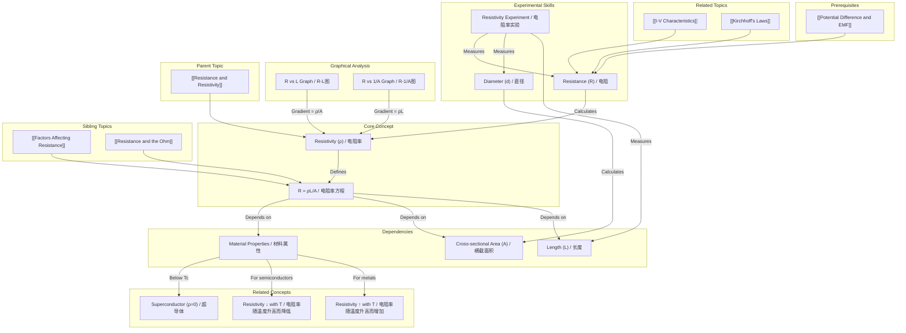

---
# 1. Overview / 概述

**English:**
This sub-topic introduces **resistivity ($\rho$)** as a fundamental material property that quantifies how strongly a material opposes the flow of electric current, independent of its shape or size. While [[Resistance and the Ohm|resistance ($R$)]] depends on both the material and its geometry, resistivity is an intrinsic property of the material itself. The core equation, $R = \frac{\rho L}{A}$, links resistance to resistivity, length, and cross-sectional area. Understanding this relationship is crucial for explaining [[Factors Affecting Resistance]] and for designing electrical components like resistors and wires. This concept is a prerequisite for studying [[I-V Characteristics]] and [[Kirchhoff's Laws]].

**中文:**
本子知识点介绍**电阻率 ($\rho$)** 作为一种基本材料属性，它量化了材料阻碍电流流动的强弱程度，且与材料的形状或尺寸无关。[[Resistance and the Ohm|电阻 ($R$)]] 既取决于材料也取决于其几何形状，而电阻率则是材料本身的固有属性。核心方程 $R = \frac{\rho L}{A}$ 将电阻与电阻率、长度和横截面积联系起来。理解这一关系对于解释[[Factors Affecting Resistance|影响电阻的因素]]以及设计电阻器和导线等电气元件至关重要。这个概念是学习[[I-V Characteristics|I-V特性]]和[[Kirchhoff's Laws|基尔霍夫定律]]的先决条件。

---

# 2. Syllabus Learning Objectives / 考纲学习目标

| CAIE 9702 (9.3) | Edexcel IAL (WPH11 U2: 3.9-3.12) |
|-----------|-------------|
| 9.3(a) Define resistivity and state its SI unit. | 3.9 Define resistivity. |
| 9.3(b) Recall and use $R = \frac{\rho L}{A}$. | 3.10 Use $R = \frac{\rho L}{A}$. |
| 9.3(c) Describe how to measure resistivity of a wire. | 3.11 Describe an experiment to determine the resistivity of a metal. |
| 9.3(d) Describe the effect of temperature on resistivity of a metal and a semiconductor. | 3.12 Explain how the resistivity of a metal and a semiconductor varies with temperature. |
| 9.3(e) Explain the meaning of the term *superconductor* in terms of resistivity. | (Covered in Superconductivity topic) |
| 9.3(f) Describe some applications of superconductors. | (Covered in Superconductivity topic) |

**Examiner Expectations / 考官期望:**
- **EN:** You must be able to define resistivity in words and with the equation. You must be able to rearrange $R = \frac{\rho L}{A}$ to find any variable. You should be able to describe the experimental method for measuring the resistivity of a wire, including the use of a micrometer and an ammeter/voltmeter or an ohmmeter. You must know the temperature dependence of resistivity for metals (increases) and semiconductors (decreases).
- **CN:** 你必须能用文字和方程定义电阻率。你必须能重新排列 $R = \frac{\rho L}{A}$ 以求出任何变量。你应该能够描述测量导线电阻率的实验方法，包括使用千分尺和电流表/电压表或欧姆表。你必须知道金属（增加）和半导体（减少）电阻率的温度依赖性。

---

# 3. Core Definitions / 核心定义

| Term (EN/CN) | Definition (EN) | Definition (CN) | Common Mistakes / 常见错误 |
|--------------|-----------------|-----------------|---------------------------|
| **Resistivity** / 电阻率 ($\rho$) | The electrical resistivity of a material is defined as the resistance of a unit length of a material with a unit cross-sectional area. It is a measure of how strongly a material opposes the flow of electric current. | 材料的电阻率定义为具有单位横截面积的单位长度材料的电阻。它是衡量材料阻碍电流流动强弱程度的量度。 | Confusing resistivity with resistance. Resistivity is a material property; resistance is a property of a specific object. / 混淆电阻率和电阻。电阻率是材料属性；电阻是特定物体的属性。 |
| **Conductor** / 导体 | A material with low resistivity (e.g., $\rho \approx 10^{-8} \, \Omega \text{m}$), allowing current to flow easily. | 具有低电阻率的材料（例如，$\rho \approx 10^{-8} \, \Omega \text{m}$），允许电流轻易通过。 | Assuming all metals have the same resistivity. / 假设所有金属具有相同的电阻率。 |
| **Insulator** / 绝缘体 | A material with very high resistivity (e.g., $\rho \approx 10^{12} \, \Omega \text{m}$), resisting current flow. | 具有非常高电阻率的材料（例如，$\rho \approx 10^{12} \, \Omega \text{m}$），阻碍电流流动。 | Thinking insulators have infinite resistance; they can break down at high voltages. / 认为绝缘体具有无限电阻；它们在高电压下可能被击穿。 |
| **Semiconductor** / 半导体 | A material with resistivity between that of a conductor and an insulator (e.g., $\rho \approx 10^{-3} \, \Omega \text{m}$ to $10^{3} \, \Omega \text{m}$), whose resistivity decreases with increasing temperature. | 电阻率介于导体和绝缘体之间的材料（例如，$\rho \approx 10^{-3} \, \Omega \text{m}$ 到 $10^{3} \, \Omega \text{m}$），其电阻率随温度升高而降低。 | Confusing the temperature dependence of resistivity with that of a metal. / 混淆半导体与金属电阻率的温度依赖性。 |
| **Superconductor** / 超导体 | A material that, below a certain critical temperature ($T_c$), has zero resistivity. | 在低于某个临界温度 ($T_c$) 时，电阻率为零的材料。 | Thinking superconductors have "very low" resistance; they have exactly zero resistance. / 认为超导体具有“非常低”的电阻；它们具有恰好为零的电阻。 |

---

# 4. Key Concepts Explained / 关键概念详解

## 4.1 The Resistivity Equation / 电阻率方程

### Explanation / 解释
**English:**
The fundamental relationship linking resistance ($R$) to the material's intrinsic property (resistivity, $\rho$) and its geometry (length, $L$, and cross-sectional area, $A$) is given by:

$$ R = \frac{\rho L}{A} $$

This equation tells us that for a given material ($\rho$ is constant at a fixed temperature), the resistance of a wire is directly proportional to its length ($R \propto L$) and inversely proportional to its cross-sectional area ($R \propto 1/A$). This is why long, thin wires have high resistance, while short, thick wires have low resistance. This equation is central to understanding [[Factors Affecting Resistance]].

**中文:**
连接电阻 ($R$) 与材料固有属性（电阻率，$\rho$）及其几何形状（长度，$L$，和横截面积，$A$）的基本关系由下式给出：

$$ R = \frac{\rho L}{A} $$

这个方程告诉我们，对于给定的材料（在固定温度下 $\rho$ 是常数），导线的电阻与其长度成正比 ($R \propto L$)，与其横截面积成反比 ($R \propto 1/A$)。这就是为什么长而细的导线具有高电阻，而短而粗的导线具有低电阻。这个方程是理解[[Factors Affecting Resistance|影响电阻的因素]]的核心。

### Physical Meaning / 物理意义
**English:**
- **Resistivity ($\rho$)** represents the "friction" that charge carriers (usually electrons) experience as they move through the material. A higher resistivity means more collisions with the lattice ions, leading to more energy loss as heat.
- **Length ($L$)** represents the distance the charge carriers must travel. A longer path means more collisions.
- **Cross-sectional area ($A$)** represents the "width" of the path. A larger area provides more space for charge carriers to flow, reducing the chance of collisions.

**中文:**
- **电阻率 ($\rho$)** 代表了电荷载流子（通常是电子）在材料中移动时所经历的“摩擦”。更高的电阻率意味着与晶格离子的碰撞更多，导致更多的能量以热的形式损失。
- **长度 ($L$)** 代表了电荷载流子必须行进的距离。更长的路径意味着更多的碰撞。
- **横截面积 ($A$)** 代表了路径的“宽度”。更大的面积为电荷载流子提供了更多流动空间，减少了碰撞的机会。

### Common Misconceptions / 常见误区
- **EN:** Thinking that resistivity changes with the length or area of a wire. Resistivity is a material property and is constant for a given material at a given temperature.
- **CN:** 认为电阻率随导线的长度或面积而变化。电阻率是一种材料属性，对于给定温度下的给定材料是恒定的。
- **EN:** Confusing the symbol for resistivity ($\rho$) with density. They are different quantities.
- **CN:** 混淆电阻率 ($\rho$) 和密度的符号。它们是不同的物理量。
- **EN:** Forgetting to convert units (e.g., mm² to m²) when using the formula.
- **CN:** 使用公式时忘记转换单位（例如，mm² 到 m²）。

### Exam Tips / 考试提示
- **EN:** Always check the units of $A$. If given in mm², convert to m² by multiplying by $10^{-6}$.
- **CN:** 始终检查 $A$ 的单位。如果以 mm² 给出，则乘以 $10^{-6}$ 转换为 m²。
- **EN:** The equation $R = \frac{\rho L}{A}$ can be rearranged to find $\rho = \frac{RA}{L}$, $L = \frac{RA}{\rho}$, or $A = \frac{\rho L}{R}$.
- **CN:** 方程 $R = \frac{\rho L}{A}$ 可以重新排列以求出 $\rho = \frac{RA}{L}$, $L = \frac{RA}{\rho}$, 或 $A = \frac{\rho L}{R}$。
- **EN:** For a wire, $A = \pi r^2$, where $r$ is the radius. The radius is half the diameter.
- **CN:** 对于导线，$A = \pi r^2$，其中 $r$ 是半径。半径是直径的一半。

> 📷 **IMAGE PROMPT — DIAGRAM-01: Visualizing the Resistivity Equation**
> A 3D isometric diagram showing a cylindrical metal wire. The wire is labeled with length 'L' (along its axis) and cross-sectional area 'A' (a circular face). Arrows indicate current flowing through the wire. A callout box shows the equation R = ρL/A, with each variable linked to the corresponding part of the wire (ρ linked to the material, L to the length, A to the cross-section). The style should be clean, educational, and suitable for a physics textbook.

---

## 4.2 Temperature Dependence of Resistivity / 电阻率的温度依赖性

### Explanation / 解释
**English:**
The resistivity of a material is not constant; it changes with temperature. The behavior is different for metals and semiconductors.

- **Metals:** As temperature increases, the lattice ions vibrate more vigorously. This increases the probability of collisions between the conduction electrons and the ions, making it harder for electrons to flow. Therefore, the resistivity of a metal **increases** with increasing temperature.
- **Semiconductors:** As temperature increases, more electrons gain enough energy to break free from their bonds and become conduction electrons. This increases the number of charge carriers available. The increase in charge carriers outweighs the increase in lattice vibrations, so the resistivity of a semiconductor **decreases** with increasing temperature.

**中文:**
材料的电阻率不是恒定的；它随温度变化。金属和半导体的行为不同。

- **金属：** 随着温度升高，晶格离子振动得更剧烈。这增加了传导电子与离子之间碰撞的概率，使电子更难流动。因此，金属的电阻率随温度升高而**增加**。
- **半导体：** 随着温度升高，更多的电子获得足够的能量从它们的键中挣脱出来，成为传导电子。这增加了可用的电荷载流子数量。电荷载流子的增加超过了晶格振动的增加，因此半导体的电阻率随温度升高而**降低**。

### Physical Meaning / 物理意义
**English:**
- **Metals:** The dominant effect is increased scattering of electrons by vibrating ions.
- **Semiconductors:** The dominant effect is the increased number of charge carriers.

**中文:**
- **金属：** 主要效应是振动离子对电子的散射增加。
- **半导体：** 主要效应是电荷载流子数量的增加。

### Common Misconceptions / 常见误区
- **EN:** Thinking that the resistance of all materials increases with temperature. This is only true for conductors (metals). For semiconductors, resistance decreases.
- **CN:** 认为所有材料的电阻都随温度升高而增加。这只对导体（金属）成立。对于半导体，电阻会降低。
- **EN:** Confusing the temperature dependence of resistance with that of resistivity. The same trend applies to both for a given material.
- **CN:** 混淆电阻和电阻率的温度依赖性。对于给定的材料，两者的变化趋势相同。

### Exam Tips / 考试提示
- **EN:** Be prepared to sketch a graph of resistivity vs. temperature for a metal (positive gradient) and a semiconductor (negative gradient).
- **CN:** 准备好绘制金属（正梯度）和半导体（负梯度）的电阻率-温度关系图。
- **EN:** For metals, the relationship is approximately linear over a small temperature range.
- **CN:** 对于金属，在小温度范围内，该关系近似为线性。

> 📷 **IMAGE PROMPT — DIAGRAM-02: Resistivity vs Temperature for Metal and Semiconductor**
> A graph with two lines on the same axes. The x-axis is labeled "Temperature / K" and the y-axis is labeled "Resistivity / Ω m". One line, labeled "Metal", starts at a low value and curves upwards with a positive gradient. The other line, labeled "Semiconductor", starts at a higher value and curves downwards with a negative gradient. The graph should be clear and labeled for an A-Level physics textbook.

---

# 5. Essential Equations / 核心公式

## 5.1 The Resistivity Equation / 电阻率方程

$$ R = \frac{\rho L}{A} $$

| Symbol (符号) | Meaning (EN) | Meaning (CN) | Unit (单位) |
|--------------|-------------|-------------|------------|
| $R$ | Resistance | 电阻 | $\Omega$ (Ohm) |
| $\rho$ | Resistivity | 电阻率 | $\Omega \text{m}$ (Ohm-meter) |
| $L$ | Length of conductor | 导体长度 | $\text{m}$ (meter) |
| $A$ | Cross-sectional area | 横截面积 | $\text{m}^2$ (square meter) |

**Derivation / 推导:**
- This is an empirical relationship, not derived from first principles in the A-Level syllabus. It is based on experimental observation.

**Conditions / 适用条件:**
- **EN:** The material must be uniform (homogeneous) and at a constant temperature. The conductor must have a uniform cross-sectional area.
- **CN:** 材料必须是均匀的（均质的）且处于恒定温度。导体必须具有均匀的横截面积。

**Limitations / 局限性:**
- **EN:** The equation does not apply to non-ohmic materials or at very high frequencies (skin effect). It assumes a direct current (DC) or low-frequency alternating current (AC).
- **CN:** 该方程不适用于非欧姆材料或非常高的频率（趋肤效应）。它假设是直流电 (DC) 或低频交流电 (AC)。

---

# 6. Graphs and Relationships / 图表与关系

## 6.1 Resistance vs. Length / 电阻-长度关系图

### Axes / 坐标轴
- **X-axis:** Length ($L$) / 长度 ($L$)
- **Y-axis:** Resistance ($R$) / 电阻 ($R$)

### Shape / 形状
- **EN:** A straight line passing through the origin.
- **CN:** 一条通过原点的直线。

### Gradient Meaning / 斜率含义
- **EN:** The gradient is $\frac{\rho}{A}$. For a wire of constant cross-sectional area and material, the gradient is constant.
- **CN:** 斜率为 $\frac{\rho}{A}$。对于横截面积和材料恒定的导线，斜率为常数。

### Area Meaning / 面积含义
- **EN:** Not applicable.
- **CN:** 不适用。

### Exam Interpretation / 考试解读
- **EN:** A straight line through the origin confirms that $R \propto L$ for a wire of constant $\rho$ and $A$.
- **CN:** 通过原点的直线证实了对于恒定 $\rho$ 和 $A$ 的导线，$R \propto L$。

## 6.2 Resistance vs. 1/Area / 电阻-1/面积关系图

### Axes / 坐标轴
- **X-axis:** $1/A$ (Inverse of cross-sectional area) / $1/A$ (横截面积的倒数)
- **Y-axis:** Resistance ($R$) / 电阻 ($R$)

### Shape / 形状
- **EN:** A straight line passing through the origin.
- **CN:** 一条通过原点的直线。

### Gradient Meaning / 斜率含义
- **EN:** The gradient is $\rho L$. For a wire of constant length and material, the gradient is constant.
- **CN:** 斜率为 $\rho L$。对于长度和材料恒定的导线，斜率为常数。

### Area Meaning / 面积含义
- **EN:** Not applicable.
- **CN:** 不适用。

### Exam Interpretation / 考试解读
- **EN:** A straight line through the origin confirms that $R \propto 1/A$ for a wire of constant $\rho$ and $L$.
- **CN:** 通过原点的直线证实了对于恒定 $\rho$ 和 $L$ 的导线，$R \propto 1/A$。

> 📷 **IMAGE PROMPT — DIAGRAM-03: R vs L and R vs 1/A Graphs**
> Two separate graphs side-by-side. Left graph: "R vs L" with a straight line through the origin, labeled gradient = ρ/A. Right graph: "R vs 1/A" with a straight line through the origin, labeled gradient = ρL. Both axes are clearly labeled with units.

---

# 7. Required Diagrams / 必备图表

## 7.1 Experimental Setup for Measuring Resistivity / 测量电阻率的实验装置

### Description / 描述
**English:**
A diagram showing the circuit used to measure the resistance of a wire, along with the equipment needed to measure its length and diameter. The wire is typically a constantan or nichrome wire of known length. A micrometer screw gauge is used to measure the diameter at several points along the wire to find the average cross-sectional area.

**中文:**
显示用于测量导线电阻的电路图，以及测量其长度和直径所需的设备。导线通常是康铜或镍铬合金线，长度已知。使用千分尺测量导线沿线的几个点的直径，以求出平均横截面积。

### Image Prompt / 图片生成提示
> 📷 **IMAGE PROMPT — DIAGRAM-04: Resistivity Measurement Experiment**
> A detailed diagram of a physics lab setup. A long, thin wire is taped to a meter ruler. A power supply, ammeter, and variable resistor are connected in series with the wire. A voltmeter is connected in parallel across a specific length (L) of the wire. A micrometer screw gauge is shown in the corner, measuring the wire's diameter. Labels: "Power Supply", "Ammeter", "Voltmeter", "Variable Resistor", "Wire (Length L)", "Meter Ruler", "Micrometer Screw Gauge". The style should be a clean, schematic diagram.

### Labels Required / 需要标注
- **EN:** Power supply, ammeter, voltmeter, variable resistor, wire (length L), meter ruler, micrometer screw gauge.
- **CN:** 电源，电流表，电压表，可变电阻器，导线（长度 L），米尺，千分尺。

### Exam Importance / 考试重要性
- **EN:** This is a very common experiment in both theory and practical papers. You must be able to describe the procedure, identify sources of error, and explain how to improve accuracy.
- **CN:** 这是理论和实验考试中都非常常见的实验。你必须能够描述步骤，识别误差来源，并解释如何提高准确性。

---

# 8. Worked Examples / 典型例题

## Example 1: Calculating Resistivity / 计算电阻率

### Question / 题目
**English:**
A 2.0 m length of copper wire has a diameter of 0.50 mm. Its resistance is measured to be 0.043 $\Omega$. Calculate the resistivity of copper.

**中文:**
一根长 2.0 m 的铜线，直径为 0.50 mm，测得其电阻为 0.043 $\Omega$。计算铜的电阻率。

### Solution / 解答
1.  **Identify knowns / 确定已知量:**
    - $L = 2.0 \, \text{m}$
    - $d = 0.50 \, \text{mm} = 0.50 \times 10^{-3} \, \text{m}$
    - $R = 0.043 \, \Omega$

2.  **Calculate cross-sectional area / 计算横截面积:**
    - Radius, $r = d/2 = 0.25 \times 10^{-3} \, \text{m}$
    - $A = \pi r^2 = \pi \times (0.25 \times 10^{-3})^2 = 1.9635 \times 10^{-7} \, \text{m}^2$

3.  **Rearrange the resistivity equation / 重新排列电阻率方程:**
    $$ \rho = \frac{RA}{L} $$

4.  **Substitute and solve / 代入并求解:**
    $$ \rho = \frac{0.043 \times 1.9635 \times 10^{-7}}{2.0} $$
    $$ \rho = 4.22 \times 10^{-9} \, \Omega \text{m} $$

### Final Answer / 最终答案
**Answer:** $\rho = 4.2 \times 10^{-9} \, \Omega \text{m}$ (to 2 significant figures) | **答案：** $\rho = 4.2 \times 10^{-9} \, \Omega \text{m}$ (保留两位有效数字)

### Quick Tip / 提示
- **EN:** Always convert the diameter to meters before calculating the area. A common mistake is to use the diameter instead of the radius in the area formula.
- **CN:** 在计算面积之前，务必将直径转换为米。一个常见错误是在面积公式中使用直径而不是半径。

---

## Example 2: Effect of Changing Dimensions / 尺寸变化的影响

### Question / 题目
**English:**
A wire of resistance $R$ is stretched to twice its original length. Assuming the volume of the wire remains constant, what is its new resistance?

**中文:**
一根电阻为 $R$ 的导线被拉伸到其原始长度的两倍。假设导线的体积保持不变，其新电阻是多少？

### Solution / 解答
1.  **Initial state / 初始状态:**
    - Length = $L$, Area = $A$, Volume = $V = AL$
    - Resistance: $R = \frac{\rho L}{A}$

2.  **Final state / 最终状态:**
    - New length, $L' = 2L$
    - Volume is constant: $V' = V \Rightarrow A'L' = AL \Rightarrow A'(2L) = AL \Rightarrow A' = \frac{A}{2}$

3.  **Calculate new resistance / 计算新电阻:**
    $$ R' = \frac{\rho L'}{A'} = \frac{\rho (2L)}{(A/2)} = \frac{2\rho L}{A/2} = 4 \left( \frac{\rho L}{A} \right) = 4R $$

### Final Answer / 最终答案
**Answer:** The new resistance is $4R$. | **答案：** 新电阻为 $4R$。

### Quick Tip / 提示
- **EN:** When a wire is stretched, its length increases and its cross-sectional area decreases. Both changes increase the resistance. The volume constant condition is key.
- **CN:** 当导线被拉伸时，其长度增加，横截面积减小。这两种变化都会增加电阻。体积恒定条件是关键。

---

# 9. Past Paper Question Types / 历年真题题型

| Question Type / 题型 | Frequency / 频率 | Difficulty / 难度 | Past Paper References / 真题索引 |
|----------------------|------------------|------------------|-------------------------------|
| **Definition of resistivity** / 电阻率的定义 | High | Easy | 📝 *待填入* |
| **Calculation using $R = \rho L/A$** / 使用 $R = \rho L/A$ 进行计算 | Very High | Medium | 📝 *待填入* |
| **Experimental method for resistivity** / 电阻率实验方法 | High | Medium-Hard | 📝 *待填入* |
| **Graph analysis ($R$ vs $L$, $R$ vs $1/A$)** / 图表分析 ($R$ vs $L$, $R$ vs $1/A$) | Medium | Medium | 📝 *待填入* |
| **Temperature dependence of resistivity** / 电阻率的温度依赖性 | Medium | Medium | 📝 *待填入* |
| **Effect of stretching a wire** / 拉伸导线的影响 | Low-Medium | Hard | 📝 *待填入* |

**Common Command Words / 常见指令词:**
- **EN:** Define, State, Calculate, Determine, Describe, Explain, Sketch, Show that.
- **CN:** 定义，陈述，计算，确定，描述，解释，画出草图，证明。

---

# 10. Practical Skills Connections / 实验技能链接

**English:**
This sub-topic is heavily linked to the practical paper (Paper 3 for CAIE, Unit 2 Practical for Edexcel). The key experiment is **determining the resistivity of a metal wire**.

- **Measurements:** You will need to measure the length of the wire using a meter ruler (precision $\pm 1 \, \text{mm}$) and the diameter using a micrometer screw gauge (precision $\pm 0.01 \, \text{mm}$). You must take multiple readings of the diameter along the wire to account for non-uniformity and calculate a mean.
- **Circuit:** You will set up a circuit to measure the resistance of the wire. This can be done using an ammeter and voltmeter (to calculate $R = V/I$) or directly using an ohmmeter.
- **Uncertainties:** You must calculate the percentage uncertainty in $L$, $d$, and $R$, and then combine them to find the overall uncertainty in $\rho$. The diameter measurement usually contributes the largest uncertainty because it is squared in the area calculation ($A = \pi d^2/4$).
- **Graph Plotting:** You may be asked to plot a graph of $R$ against $L$ to find $\rho$ from the gradient. This is a more accurate method than using a single measurement.

**中文:**
本子知识点与实验考试（CAIE 的 Paper 3，Edexcel 的 Unit 2 Practical）密切相关。关键实验是**测定金属导线的电阻率**。

- **测量：** 你需要使用米尺（精度 $\pm 1 \, \text{mm}$）测量导线的长度，并使用千分尺（精度 $\pm 0.01 \, \text{mm}$）测量直径。你必须沿导线在不同位置多次测量直径，以考虑不均匀性并计算平均值。
- **电路：** 你将搭建电路来测量导线的电阻。这可以使用电流表和电压表（计算 $R = V/I$）或直接使用欧姆表来完成。
- **不确定度：** 你必须计算 $L$、$d$ 和 $R$ 的百分比不确定度，然后合并它们以求出 $\rho$ 的总不确定度。直径测量通常贡献最大的不确定度，因为它在面积计算中被平方 ($A = \pi d^2/4$)。
- **绘图：** 你可能会被要求绘制 $R$ 对 $L$ 的图表，以从斜率求出 $\rho$。这比使用单次测量更准确。

---

# 11. Concept Map / 概念图谱

---

# 12. Quick Revision Sheet / 速查表

| Category / 类别 | Key Points / 要点 |
|----------------|------------------|
| **Definition / 定义** | Resistivity ($\rho$) is the resistance of a unit length of a material with a unit cross-sectional area. / 电阻率 ($\rho$) 是具有单位横截面积的单位长度材料的电阻。 |
| **Key Formula / 核心公式** | $R = \frac{\rho L}{A}$; $\rho = \frac{RA}{L}$; $L = \frac{RA}{\rho}$; $A = \frac{\rho L}{R}$ |
| **Key Graph / 核心图表** | $R$ vs $L$: Straight line through origin (gradient = $\rho/A$). $R$ vs $1/A$: Straight line through origin (gradient = $\rho L$). / $R$ vs $L$: 通过原点的直线 (斜率 = $\rho/A$)。$R$ vs $1/A$: 通过原点的直线 (斜率 = $\rho L$)。 |
| **Temperature Effect / 温度效应** | **Metals:** $\rho$ increases with $T$. **Semiconductors:** $\rho$ decreases with $T$. / **金属：** $\rho$ 随 $T$ 增加而增加。**半导体：** $\rho$ 随 $T$ 增加而减小。 |
| **Key Experiment / 关键实验** | Measure $L$ (meter ruler), $d$ (micrometer), $R$ (ammeter/voltmeter or ohmmeter). Calculate $\rho = RA/L$. / 测量 $L$ (米尺), $d$ (千分尺), $R$ (电流表/电压表或欧姆表)。计算 $\rho = RA/L$。 |
| **Common Mistake / 常见错误** | Forgetting to convert mm² to m². Using diameter instead of radius in $A = \pi r^2$. / 忘记将 mm² 转换为 m²。在 $A = \pi r^2$ 中使用直径而不是半径。 |
| **Exam Tip / 考试提示** | For stretching problems, use volume constant: $A_1L_1 = A_2L_2$. / 对于拉伸问题，使用体积恒定：$A_1L_1 = A_2L_2$。 |