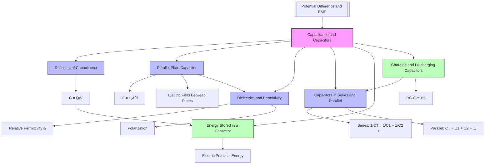

# Capacitance and Capacitors / 电容与电容器

---

# 1. Overview / 概述

**English:**
Capacitance and capacitors form a fundamental topic in A-Level Physics, bridging the concepts of [[Potential Difference and EMF]] with [[Energy Stored in a Capacitor]] and [[Charging and Discharging Capacitors]]. A capacitor is an electrical component that stores electrical energy in an electric field. The capacitance of a capacitor is defined as the ratio of charge stored to the potential difference across its plates. This topic explores the physical principles behind capacitors, including the factors affecting capacitance, the behavior of dielectrics, and the mathematical relationships governing series and parallel combinations.

In real-world applications, capacitors are ubiquitous in electronic circuits. They are used in power supplies for smoothing voltage fluctuations, in timing circuits (such as in camera flashes), in filter circuits for audio equipment, and in energy storage systems for electric vehicles. Understanding capacitance is essential for designing circuits that require controlled energy release, signal processing, or voltage regulation.

For Cambridge International A-Level Physics (9702) and Edexcel IAL Physics (WPH14), this topic is assessed in Paper 4 (A2) and Unit 4 respectively. Students must be able to define capacitance, derive the capacitance of a parallel plate capacitor, explain the role of dielectrics, and solve problems involving capacitors in series and parallel. The topic also connects to practical skills, including measuring capacitance using a ballistic galvanometer or digital multimeter, and analyzing charging/discharging curves.

**中文：**
电容与电容器是A-Level物理中的基础课题，连接了[[电势差与电动势]]、[[电容器储存的能量]]以及[[电容器的充电与放电]]。电容器是一种在电场中储存电能的电子元件。电容定义为电容器储存的电荷量与两极板间电势差的比值。本课题探讨电容器背后的物理原理，包括影响电容的因素、电介质的行为以及串联和并联组合的数学关系。

在实际应用中，电容器在电子电路中无处不在。它们用于电源中的电压平滑、定时电路（如相机闪光灯）、音频设备的滤波电路以及电动汽车的能量存储系统。理解电容对于设计需要受控能量释放、信号处理或电压调节的电路至关重要。

对于剑桥国际A-Level物理（9702）和爱德思IAL物理（WPH14），本课题分别在Paper 4（A2）和Unit 4中考核。学生必须能够定义电容、推导平行板电容器的电容、解释电介质的作用，并解决涉及串联和并联电容器的问题。本课题还涉及实验技能，包括使用冲击电流计或数字万用表测量电容，以及分析充电/放电曲线。

---

# 2. Syllabus Learning Objectives / 考纲学习目标

**English:**
The following table maps the specific learning objectives from both Cambridge 9702 and Edexcel IAL syllabuses. Students should use this to guide their revision and ensure all requirements are covered.

**中文：**
下表映射了剑桥9702和爱德思IAL考纲的具体学习目标。学生应使用此表指导复习，确保覆盖所有要求。

| CAIE 9702 | Edexcel IAL |
|-----------|-------------|
| 19.1(a) Define capacitance and state the unit farad. | 4.1 Understand the concept of capacitance and the unit farad. |
| 19.1(b) Derive and use the formula $C = \frac{Q}{V}$. | 4.2 Use the formula $C = \frac{Q}{V}$ for a capacitor. |
| 19.1(c) Derive and use the formula $C = \frac{\varepsilon_0 A}{d}$ for a parallel plate capacitor. | 4.3 Understand the factors affecting capacitance: plate area, separation, and dielectric. |
| 19.1(d) Explain the effect of a dielectric on capacitance, including the use of relative permittivity $\varepsilon_r$. | 4.4 Use the formula $C = \frac{\varepsilon_0 \varepsilon_r A}{d}$ for a parallel plate capacitor with a dielectric. |
| — | 4.5 Derive and use formulas for capacitors in series and parallel: $\frac{1}{C_T} = \frac{1}{C_1} + \frac{1}{C_2} + ...$ and $C_T = C_1 + C_2 + ...$ |

> 📋 **CIE Only:** Cambridge requires derivation of $C = \frac{\varepsilon_0 A}{d}$ from first principles using $E = \frac{V}{d}$ and $Q = CV$. The effect of a dielectric is explained in terms of polarization reducing the electric field strength.

> 📋 **Edexcel Only:** Edexcel explicitly includes the derivation and use of series and parallel capacitor formulas. The dielectric effect is linked to relative permittivity $\varepsilon_r$ and the concept of polarization.

**Examiner Expectations / 考官期望：**
- **English:** Candidates must be able to recall definitions precisely, derive formulas step-by-step, and apply them to numerical problems. For parallel plate capacitors, the derivation must show clear logical steps. For dielectrics, explanations should mention polarization and reduction of electric field.
- **中文：** 考生必须能够精确回忆定义，逐步推导公式，并将其应用于数值问题。对于平行板电容器，推导必须展示清晰的逻辑步骤。对于电介质，解释应提及极化和电场减弱。

---

# 3. Core Definitions / 核心定义

**English:**
The following table provides official definitions with exam-standard wording, along with common mistakes students make. Use [[wikilinks]] to connect to related concepts.

**中文：**
下表提供了考试标准措辞的官方定义，以及学生常犯的错误。使用[[wikilinks]]连接到相关概念。

| Term (EN/CN) | Definition (EN) | Definition (CN) | Common Mistakes / 常见错误 |
|--------------|-----------------|-----------------|---------------------------|
| **Capacitance / 电容** | The ratio of charge stored on a conductor to the potential difference across it. $C = \frac{Q}{V}$ | 导体上储存的电荷量与其两端电势差之比。$C = \frac{Q}{V}$ | Confusing capacitance with charge; thinking capacitance depends on $Q$ or $V$ (it depends on geometry and dielectric). |
| **Farad / 法拉** | The unit of capacitance. One farad is the capacitance of a capacitor that stores one coulomb of charge when the potential difference across it is one volt. $1 \text{ F} = 1 \text{ C V}^{-1}$ | 电容的单位。1法拉是当电容器两端电势差为1伏特时储存1库仑电荷的电容。$1 \text{ F} = 1 \text{ C V}^{-1}$ | Forgetting that farad is a large unit; typical capacitors are in $\mu\text{F}$, $\text{nF}$, or $\text{pF}$. |
| **Parallel Plate Capacitor / 平行板电容器** | A capacitor consisting of two parallel conducting plates separated by a distance $d$, with an area $A$ of overlap. | 由两块平行导电板组成的电容器，两板相距$d$，重叠面积为$A$。 | Assuming the formula $C = \frac{\varepsilon_0 A}{d}$ applies to all capacitors (it only applies to parallel plate capacitors with vacuum/air between plates). |
| **Dielectric / 电介质** | An insulating material placed between the plates of a capacitor that increases capacitance by reducing the electric field strength. | 放置在电容器极板之间的绝缘材料，通过减弱电场强度来增加电容。 | Thinking a dielectric conducts electricity; confusing dielectric with conductor. |
| **Relative Permittivity / 相对介电常数** | The ratio of the permittivity of a material to the permittivity of free space. $\varepsilon_r = \frac{\varepsilon}{\varepsilon_0}$ | 材料的介电常数与真空介电常数之比。$\varepsilon_r = \frac{\varepsilon}{\varepsilon_0}$ | Forgetting that $\varepsilon_r$ is dimensionless; confusing $\varepsilon_r$ with $\varepsilon$. |
| **Permittivity of Free Space / 真空介电常数** | A physical constant representing the ability of a vacuum to permit electric field lines. $\varepsilon_0 = 8.85 \times 10^{-12} \text{ F m}^{-1}$ | 表示真空允许电场线通过的物理常数。$\varepsilon_0 = 8.85 \times 10^{-12} \text{ F m}^{-1}$ | Using wrong units (should be $\text{F m}^{-1}$, not $\text{F}$). |

---

# 4. Key Concepts Explained / 关键概念详解

## 4.1 Definition of Capacitance / 电容的定义

### Explanation / 解释
**English:**
Capacitance is a measure of a capacitor's ability to store charge. It is defined as the ratio of the charge $Q$ stored on one plate to the potential difference $V$ across the plates:
$$ C = \frac{Q}{V} $$
This relationship is linear for a given capacitor: doubling the voltage doubles the charge stored. The constant $C$ depends only on the physical construction of the capacitor (plate area, separation, and dielectric material), not on $Q$ or $V$. This is analogous to the stiffness of a spring: $F = kx$, where $k$ is a constant determined by the spring's construction.

The unit of capacitance is the farad (F). One farad is a very large capacitance; typical capacitors in circuits range from picofarads ($10^{-12} \text{ F}$) to millifarads ($10^{-3} \text{ F}$). For example, a capacitor with $C = 100 \mu\text{F}$ storing $Q = 1 \text{ mC}$ would have $V = \frac{Q}{C} = \frac{1 \times 10^{-3}}{100 \times 10^{-6}} = 10 \text{ V}$.

**中文：**
电容是衡量电容器储存电荷能力的量度。它定义为极板上储存的电荷量$Q$与两极板间电势差$V$之比：
$$ C = \frac{Q}{V} $$
对于给定的电容器，这个关系是线性的：电压加倍，储存的电荷量也加倍。常数$C$仅取决于电容器的物理结构（极板面积、间距和电介质材料），而不取决于$Q$或$V$。这类似于弹簧的劲度系数：$F = kx$，其中$k$是由弹簧结构决定的常数。

电容的单位是法拉（F）。1法拉是非常大的电容；电路中典型的电容器范围从皮法（$10^{-12} \text{ F}$）到毫法（$10^{-3} \text{ F}$）。例如，一个$C = 100 \mu\text{F}$的电容器储存$Q = 1 \text{ mC}$的电荷，则$V = \frac{Q}{C} = \frac{1 \times 10^{-3}}{100 \times 10^{-6}} = 10 \text{ V}$。

### Physical Meaning / 物理意义
**English:**
Capacitance quantifies how much charge a capacitor can hold per unit voltage. A larger capacitance means the capacitor can store more charge at the same voltage. In practical terms, a capacitor with high capacitance can smooth out larger voltage fluctuations in a power supply or store more energy for a flashbulb.

**中文：**
电容量化了电容器每单位电压能储存多少电荷。更大的电容意味着在相同电压下电容器能储存更多电荷。在实际应用中，高电容的电容器可以平滑电源中更大的电压波动，或为闪光灯储存更多能量。

### Common Misconceptions / 常见误区
1. **English:** "Capacitance depends on charge or voltage." — Incorrect. $C$ is a constant for a given capacitor, determined by geometry and dielectric.
   **中文：** "电容取决于电荷或电压。" — 错误。$C$对于给定的电容器是常数，由几何结构和电介质决定。
2. **English:** "A capacitor stores charge." — Partially correct. A capacitor stores electrical energy in an electric field; charge is separated, not stored.
   **中文：** "电容器储存电荷。" — 部分正确。电容器在电场中储存电能；电荷被分离，而非储存。
3. **English:** "The farad is a small unit." — Incorrect. 1 F is very large; typical capacitors are $\mu\text{F}$ or smaller.
   **中文：** "法拉是一个小单位。" — 错误。1 F非常大；典型电容器是$\mu\text{F}$或更小。

### Exam Tips / 考试提示
**English:**
- Always write $C = \frac{Q}{V}$ with the definition.
- When calculating $C$, ensure $Q$ is in coulombs and $V$ in volts.
- For multiple-choice questions, remember that $C$ is constant for a given capacitor.
- Cambridge often asks: "State what is meant by capacitance." — Use the exact definition.

**中文：**
- 定义时始终写出$C = \frac{Q}{V}$。
- 计算$C$时，确保$Q$以库仑为单位，$V$以伏特为单位。
- 对于选择题，记住$C$对于给定电容器是常数。
- 剑桥常问："说明电容的含义。" — 使用精确的定义。

---

## 4.2 Parallel Plate Capacitor / 平行板电容器

### Explanation / 解释
**English:**
A parallel plate capacitor consists of two conducting plates of area $A$ separated by a distance $d$. When a potential difference $V$ is applied, an electric field $E$ is established between the plates. For a vacuum (or air) between the plates, the electric field is uniform and given by:
$$ E = \frac{V}{d} $$
The charge $Q$ on each plate is related to the electric field by Gauss's law, but at A-Level, we use the relationship:
$$ Q = \varepsilon_0 EA $$
where $\varepsilon_0$ is the permittivity of free space ($8.85 \times 10^{-12} \text{ F m}^{-1}$). Substituting $E = \frac{V}{d}$:
$$ Q = \varepsilon_0 \frac{V}{d} A $$
Rearranging gives the capacitance:
$$ C = \frac{Q}{V} = \frac{\varepsilon_0 A}{d} $$
This derivation shows that capacitance depends only on the geometry (area $A$ and separation $d$) and the permittivity of free space $\varepsilon_0$.

**中文：**
平行板电容器由两块面积为$A$的导电板组成，相距$d$。当施加电势差$V$时，两极板之间建立电场$E$。对于极板间的真空（或空气），电场是均匀的，由下式给出：
$$ E = \frac{V}{d} $$
每块极板上的电荷$Q$与电场的关系由高斯定律给出，但在A-Level中，我们使用关系式：
$$ Q = \varepsilon_0 EA $$
其中$\varepsilon_0$是真空介电常数（$8.85 \times 10^{-12} \text{ F m}^{-1}$）。代入$E = \frac{V}{d}$：
$$ Q = \varepsilon_0 \frac{V}{d} A $$
整理得到电容：
$$ C = \frac{Q}{V} = \frac{\varepsilon_0 A}{d} $$
这个推导表明，电容仅取决于几何结构（面积$A$和间距$d$）以及真空介电常数$\varepsilon_0$。

### Physical Meaning / 物理意义
**English:**
Increasing the plate area $A$ provides more space for charge to accumulate, increasing capacitance. Decreasing the separation $d$ brings the plates closer, strengthening the electric field for a given voltage, which also increases capacitance. The constant $\varepsilon_0$ represents how well a vacuum supports electric field lines.

**中文：**
增加极板面积$A$为电荷积累提供了更多空间，从而增加电容。减小间距$d$使极板更靠近，在给定电压下增强电场，这也增加电容。常数$\varepsilon_0$表示真空支持电场线的能力。

### Common Misconceptions / 常见误区
1. **English:** "The formula $C = \frac{\varepsilon_0 A}{d}$ applies to all capacitors." — Incorrect. It only applies to parallel plate capacitors with vacuum/air between plates.
   **中文：** "公式$C = \frac{\varepsilon_0 A}{d}$适用于所有电容器。" — 错误。它仅适用于极板间为真空/空气的平行板电容器。
2. **English:** "Doubling the area doubles the capacitance." — Correct, as $C \propto A$.
   **中文：** "面积加倍，电容加倍。" — 正确，因为$C \propto A$。
3. **English:** "Halving the distance halves the capacitance." — Incorrect. Halving $d$ doubles $C$, since $C \propto \frac{1}{d}$.
   **中文：** "距离减半，电容减半。" — 错误。$d$减半使$C$加倍，因为$C \propto \frac{1}{d}$。

### Exam Tips / 考试提示
**English:**
- Derivation of $C = \frac{\varepsilon_0 A}{d}$ is commonly tested in Cambridge Paper 4.
- Show all steps: $E = \frac{V}{d}$, $Q = \varepsilon_0 EA$, then combine.
- Remember units: $\varepsilon_0$ in $\text{F m}^{-1}$, $A$ in $\text{m}^2$, $d$ in $\text{m}$.
- For Edexcel, be prepared to explain how changing $A$ or $d$ affects $C$.

**中文：**
- 推导$C = \frac{\varepsilon_0 A}{d}$在剑桥Paper 4中常考。
- 展示所有步骤：$E = \frac{V}{d}$，$Q = \varepsilon_0 EA$，然后合并。
- 记住单位：$\varepsilon_0$以$\text{F m}^{-1}$为单位，$A$以$\text{m}^2$为单位，$d$以$\text{m}$为单位。
- 对于爱德思，准备解释改变$A$或$d$如何影响$C$。

---

## 4.3 Dielectrics and Permittivity / 电介质与介电常数

### Explanation / 解释
**English:**
A dielectric is an insulating material placed between the plates of a capacitor. When a dielectric is inserted, the capacitance increases by a factor called the relative permittivity $\varepsilon_r$ (also known as the dielectric constant):
$$ C = \frac{\varepsilon_0 \varepsilon_r A}{d} $$
The physical mechanism is polarization. The dielectric contains molecules that become polarized in the electric field: positive charges shift slightly toward the negative plate, and negative charges shift toward the positive plate. This creates an internal electric field $E_{\text{induced}}$ that opposes the external field $E_0$, reducing the net electric field between the plates:
$$ E_{\text{net}} = \frac{E_0}{\varepsilon_r} $$
Since $V = Ed$, the potential difference decreases for the same charge, or equivalently, more charge can be stored for the same voltage, increasing capacitance.

For a vacuum, $\varepsilon_r = 1$. For most materials, $\varepsilon_r > 1$ (e.g., air ≈ 1.0006, paper ≈ 3.5, mica ≈ 7, ceramic ≈ 100–10000).

**中文：**
电介质是放置在电容器极板之间的绝缘材料。当插入电介质时，电容增加一个称为相对介电常数$\varepsilon_r$（也称为介电常数）的因子：
$$ C = \frac{\varepsilon_0 \varepsilon_r A}{d} $$
物理机制是极化。电介质中的分子在电场中极化：正电荷略微向负极板移动，负电荷向正极板移动。这产生了一个与外部电场$E_0$相反的内部电场$E_{\text{induced}}$，从而减小了极板间的净电场：
$$ E_{\text{net}} = \frac{E_0}{\varepsilon_r} $$
由于$V = Ed$，对于相同的电荷，电势差减小，或者等效地，对于相同的电压，可以储存更多电荷，从而增加电容。

对于真空，$\varepsilon_r = 1$。对于大多数材料，$\varepsilon_r > 1$（例如，空气≈1.0006，纸≈3.5，云母≈7，陶瓷≈100–10000）。

### Physical Meaning / 物理意义
**English:**
A dielectric increases capacitance without changing the physical dimensions of the capacitor. This allows for smaller capacitors with higher capacitance values. Dielectrics also provide electrical insulation between plates, preventing short circuits, and can withstand higher voltages (higher breakdown strength).

**中文：**
电介质在不改变电容器物理尺寸的情况下增加电容。这使得更小的电容器具有更高的电容值。电介质还提供极板间的电绝缘，防止短路，并能承受更高的电压（更高的击穿强度）。

### Common Misconceptions / 常见误区
1. **English:** "A dielectric conducts electricity." — Incorrect. A dielectric is an insulator; it does not conduct.
   **中文：** "电介质导电。" — 错误。电介质是绝缘体；它不导电。
2. **English:** "The dielectric reduces the charge on the plates." — Incorrect. For a given voltage, the dielectric allows more charge to be stored.
   **中文：** "电介质减少了极板上的电荷。" — 错误。对于给定的电压，电介质允许储存更多电荷。
3. **English:** "Relative permittivity has units." — Incorrect. $\varepsilon_r$ is dimensionless.
   **中文：** "相对介电常数有单位。" — 错误。$\varepsilon_r$是无量纲的。

### Exam Tips / 考试提示
**English:**
- Cambridge often asks: "Explain how a dielectric increases capacitance." — Mention polarization, induced field opposing external field, reduced net field, lower $V$ for same $Q$, hence higher $C$.
- Edexcel may ask to calculate $C$ with a dielectric using $C = \frac{\varepsilon_0 \varepsilon_r A}{d}$.
- Remember that $\varepsilon = \varepsilon_0 \varepsilon_r$ is the absolute permittivity of the material.

**中文：**
- 剑桥常问："解释电介质如何增加电容。" — 提及极化、感应场与外部场相反、净电场减小、相同$Q$下$V$降低，因此$C$更高。
- 爱德思可能要求使用$C = \frac{\varepsilon_0 \varepsilon_r A}{d}$计算带介质的电容。
- 记住$\varepsilon = \varepsilon_0 \varepsilon_r$是材料的绝对介电常数。

---

## 4.4 Capacitors in Series and Parallel / 串联与并联电容器

### Explanation / 解释
**English:**
Capacitors can be combined in circuits to achieve desired capacitance values.

**Series Combination:**
When capacitors are connected in series, the total capacitance $C_T$ is given by:
$$ \frac{1}{C_T} = \frac{1}{C_1} + \frac{1}{C_2} + \frac{1}{C_3} + ... $$
The key characteristics are:
- The charge on each capacitor is the same ($Q_T = Q_1 = Q_2 = Q_3$).
- The total voltage is the sum of individual voltages ($V_T = V_1 + V_2 + V_3$).
- The total capacitance is less than the smallest individual capacitance.

**Parallel Combination:**
When capacitors are connected in parallel, the total capacitance $C_T$ is given by:
$$ C_T = C_1 + C_2 + C_3 + ... $$
The key characteristics are:
- The voltage across each capacitor is the same ($V_T = V_1 = V_2 = V_3$).
- The total charge is the sum of individual charges ($Q_T = Q_1 + Q_2 + Q_3$).
- The total capacitance is greater than the largest individual capacitance.

**中文：**
电容器可以在电路中组合以达到所需的电容值。

**串联组合：**
当电容器串联时，总电容$C_T$由下式给出：
$$ \frac{1}{C_T} = \frac{1}{C_1} + \frac{1}{C_2} + \frac{1}{C_3} + ... $$
关键特性是：
- 每个电容器上的电荷相同（$Q_T = Q_1 = Q_2 = Q_3$）。
- 总电压是各个电压之和（$V_T = V_1 + V_2 + V_3$）。
- 总电容小于最小的单个电容。

**并联组合：**
当电容器并联时，总电容$C_T$由下式给出：
$$ C_T = C_1 + C_2 + C_3 + ... $$
关键特性是：
- 每个电容器两端的电压相同（$V_T = V_1 = V_2 = V_3$）。
- 总电荷是各个电荷之和（$Q_T = Q_1 + Q_2 + Q_3$）。
- 总电容大于最大的单个电容。

### Physical Meaning / 物理意义
**English:**
Series combination reduces total capacitance because the effective plate separation increases (the capacitors share the same charge but the voltage adds). Parallel combination increases total capacitance because the effective plate area increases (the capacitors share the same voltage but the charge adds).

**中文：**
串联组合减小总电容，因为有效极板间距增加（电容器共享相同的电荷，但电压相加）。并联组合增加总电容，因为有效极板面积增加（电容器共享相同的电压，但电荷相加）。

### Common Misconceptions / 常见误区
1. **English:** "Series capacitors add like resistors in series." — Incorrect. Resistors in series add directly ($R_T = R_1 + R_2$), but capacitors in series add reciprocally.
   **中文：** "串联电容器像串联电阻一样相加。" — 错误。串联电阻直接相加（$R_T = R_1 + R_2$），但串联电容器倒数相加。
2. **English:** "Parallel capacitors add like resistors in parallel." — Incorrect. Resistors in parallel add reciprocally, but capacitors in parallel add directly.
   **中文：** "并联电容器像并联电阻一样相加。" — 错误。并联电阻倒数相加，但并联电容器直接相加。
3. **English:** "The total capacitance in series is always greater than the largest." — Incorrect. It is always less than the smallest.
   **中文：** "串联总电容总是大于最大的那个。" — 错误。它总是小于最小的那个。

### Exam Tips / 考试提示
**English:**
- For series, always use the reciprocal formula. A common trick is to ask for two equal capacitors in series: $C_T = \frac{C}{2}$.
- For parallel, simply add.
- Cambridge and Edexcel often combine series and parallel in a single circuit — solve step by step.
- Remember that charge is the same in series; voltage is the same in parallel.

**中文：**
- 对于串联，始终使用倒数公式。一个常见的技巧是问两个相等的电容器串联：$C_T = \frac{C}{2}$。
- 对于并联，直接相加。
- 剑桥和爱德思经常在单个电路中组合串联和并联 — 逐步求解。
- 记住串联中电荷相同；并联中电压相同。

---

# 5. Essential Equations / 核心公式

## 5.1 Definition of Capacitance / 电容的定义

**Equation / 公式:**
$$ C = \frac{Q}{V} $$

**Variables / 变量:**
| Symbol (符号) | Meaning (EN) | Meaning (CN) | Unit (单位) |
|--------------|-------------|-------------|------------|
| $C$ | Capacitance | 电容 | Farad (F) |
| $Q$ | Charge stored on one plate | 极板上储存的电荷 | Coulomb (C) |
| $V$ | Potential difference across plates | 极板间电势差 | Volt (V) |

**Derivation / 推导:**
**English:** This is the defining equation for capacitance. It is not derived but defined experimentally: for a given capacitor, $Q$ is proportional to $V$, and the constant of proportionality is $C$.
**中文：** 这是电容的定义方程。它不是推导出来的，而是实验定义的：对于给定的电容器，$Q$与$V$成正比，比例常数是$C$。

**Conditions / 适用条件:**
**English:** Applicable to any capacitor (parallel plate, cylindrical, etc.) as long as the dielectric is linear (most materials at low voltages).
**中文：** 适用于任何电容器（平行板、圆柱形等），只要电介质是线性的（大多数材料在低电压下）。

**Limitations / 局限性:**
**English:** Does not apply if the dielectric breaks down (exceeds breakdown voltage) or if the capacitor is nonlinear (e.g., varicap diodes).
**中文：** 如果电介质击穿（超过击穿电压）或电容器是非线性的（例如变容二极管），则不适用。

**Rearrangements / 变形:**
$$ Q = CV \quad \text{and} \quad V = \frac{Q}{C} $$

---

## 5.2 Parallel Plate Capacitor (Vacuum) / 平行板电容器（真空）

**Equation / 公式:**
$$ C = \frac{\varepsilon_0 A}{d} $$

**Variables / 变量:**
| Symbol (符号) | Meaning (EN) | Meaning (CN) | Unit (单位) |
|--------------|-------------|-------------|------------|
| $C$ | Capacitance | 电容 | Farad (F) |
| $\varepsilon_0$ | Permittivity of free space | 真空介电常数 | $\text{F m}^{-1}$ |
| $A$ | Area of overlap of plates | 极板重叠面积 | $\text{m}^2$ |
| $d$ | Separation between plates | 极板间距 | $\text{m}$ |

**Derivation / 推导:**
**English:**
1. For a uniform electric field between parallel plates: $E = \frac{V}{d}$
2. The charge on the plates is related to the electric field by: $Q = \varepsilon_0 EA$
3. Substitute $E$: $Q = \varepsilon_0 \frac{V}{d} A$
4. Rearrange: $C = \frac{Q}{V} = \frac{\varepsilon_0 A}{d}$

**中文：**
1. 对于平行板间的均匀电场：$E = \frac{V}{d}$
2. 极板上的电荷与电场的关系：$Q = \varepsilon_0 EA$
3. 代入$E$：$Q = \varepsilon_0 \frac{V}{d} A$
4. 整理：$C = \frac{Q}{V} = \frac{\varepsilon_0 A}{d}$

**Conditions / 适用条件:**
**English:** Only for parallel plate capacitors with vacuum or air between plates. The plates must be large compared to the separation ($A \gg d^2$) to ensure uniform field.
**中文：** 仅适用于极板间为真空或空气的平行板电容器。极板必须远大于间距（$A \gg d^2$）以确保均匀电场。

**Limitations / 局限性:**
**English:** Does not account for edge effects (non-uniform field at edges). For small $A/d$ ratios, the formula becomes inaccurate.
**中文：** 不考虑边缘效应（边缘的非均匀电场）。对于小的$A/d$比值，公式变得不准确。

**Rearrangements / 变形:**
$$ A = \frac{Cd}{\varepsilon_0} \quad \text{and} \quad d = \frac{\varepsilon_0 A}{C} $$

---

## 5.3 Parallel Plate Capacitor with Dielectric / 带介质的平行板电容器

**Equation / 公式:**
$$ C = \frac{\varepsilon_0 \varepsilon_r A}{d} $$

**Variables / 变量:**
| Symbol (符号) | Meaning (EN) | Meaning (CN) | Unit (单位) |
|--------------|-------------|-------------|------------|
| $C$ | Capacitance with dielectric | 带介质的电容 | Farad (F) |
| $\varepsilon_0$ | Permittivity of free space | 真空介电常数 | $\text{F m}^{-1}$ |
| $\varepsilon_r$ | Relative permittivity (dielectric constant) | 相对介电常数（介电常数） | dimensionless (无量纲) |
| $A$ | Area of overlap | 重叠面积 | $\text{m}^2$ |
| $d$ | Separation | 间距 | $\text{m}$ |

**Derivation / 推导:**
**English:** The derivation follows from the vacuum case, but the electric field is reduced by a factor $\varepsilon_r$ due to polarization: $E = \frac{V}{\varepsilon_r d}$. Substituting into $Q = \varepsilon_0 EA$ gives $Q = \varepsilon_0 \frac{V}{\varepsilon_r d} A$, so $C = \frac{Q}{V} = \frac{\varepsilon_0 \varepsilon_r A}{d}$.
**中文：** 推导遵循真空情况，但由于极化，电场减小了$\varepsilon_r$倍：$E = \frac{V}{\varepsilon_r d}$。代入$Q = \varepsilon_0 EA$得到$Q = \varepsilon_0 \frac{V}{\varepsilon_r d} A$，所以$C = \frac{Q}{V} = \frac{\varepsilon_0 \varepsilon_r A}{d}$。

**Conditions / 适用条件:**
**English:** The dielectric must completely fill the space between plates. The dielectric must be linear and isotropic.
**中文：** 电介质必须完全填充极板间的空间。电介质必须是线性和各向同性的。

**Limitations / 局限性:**
**English:** $\varepsilon_r$ can vary with frequency and temperature. The formula assumes a uniform dielectric.
**中文：** $\varepsilon_r$可能随频率和温度变化。该公式假设电介质是均匀的。

**Rearrangements / 变形:**
$$ \varepsilon_r = \frac{Cd}{\varepsilon_0 A} \quad \text{and} \quad A = \frac{Cd}{\varepsilon_0 \varepsilon_r} $$

---

## 5.4 Capacitors in Series / 串联电容器

**Equation / 公式:**
$$ \frac{1}{C_T} = \frac{1}{C_1} + \frac{1}{C_2} + \frac{1}{C_3} + ... $$

**Variables / 变量:**
| Symbol (符号) | Meaning (EN) | Meaning (CN) | Unit (单位) |
|--------------|-------------|-------------|------------|
| $C_T$ | Total capacitance | 总电容 | Farad (F) |
| $C_1, C_2, C_3$ | Individual capacitances | 单个电容 | Farad (F) |

**Derivation / 推导:**
**English:**
1. For capacitors in series, charge is the same: $Q_T = Q_1 = Q_2 = Q_3$
2. Voltage adds: $V_T = V_1 + V_2 + V_3$
3. Using $V = \frac{Q}{C}$: $\frac{Q_T}{C_T} = \frac{Q_1}{C_1} + \frac{Q_2}{C_2} + \frac{Q_3}{C_3}$
4. Since all $Q$ are equal: $\frac{1}{C_T} = \frac{1}{C_1} + \frac{1}{C_2} + \frac{1}{C_3}$

**中文：**
1. 对于串联电容器，电荷相同：$Q_T = Q_1 = Q_2 = Q_3$
2. 电压相加：$V_T = V_1 + V_2 + V_3$
3. 使用$V = \frac{Q}{C}$：$\frac{Q_T}{C_T} = \frac{Q_1}{C_1} + \frac{Q_2}{C_2} + \frac{Q_3}{C_3}$
4. 由于所有$Q$相等：$\frac{1}{C_T} = \frac{1}{C_1} + \frac{1}{C_2} + \frac{1}{C_3}$

**Conditions / 适用条件:**
**English:** Capacitors must be initially uncharged. The formula assumes ideal capacitors with no leakage.
**中文：** 电容器必须初始未充电。该公式假设理想电容器无漏电。

**Limitations / 局限性:**
**English:** Does not account for stray capacitance or leakage currents in real capacitors.
**中文：** 不考虑实际电容器中的杂散电容或漏电流。

**Rearrangements / 变形:**
For two capacitors: $C_T = \frac{C_1 C_2}{C_1 + C_2}$
For $n$ equal capacitors: $C_T = \frac{C}{n}$

---

## 5.5 Capacitors in Parallel / 并联电容器

**Equation / 公式:**
$$ C_T = C_1 + C_2 + C_3 + ... $$

**Variables / 变量:**
| Symbol (符号) | Meaning (EN) | Meaning (CN) | Unit (单位) |
|--------------|-------------|-------------|------------|
| $C_T$ | Total capacitance | 总电容 | Farad (F) |
| $C_1, C_2, C_3$ | Individual capacitances | 单个电容 | Farad (F) |

**Derivation / 推导:**
**English:**
1. For capacitors in parallel, voltage is the same: $V_T = V_1 = V_2 = V_3$
2. Charge adds: $Q_T = Q_1 + Q_2 + Q_3$
3. Using $Q = CV$: $C_T V_T = C_1 V_1 + C_2 V_2 + C_3 V_3$
4. Since all $V$ are equal: $C_T = C_1 + C_2 + C_3$

**中文：**
1. 对于并联电容器，电压相同：$V_T = V_1 = V_2 = V_3$
2. 电荷相加：$Q_T = Q_1 + Q_2 + Q_3$
3. 使用$Q = CV$：$C_T V_T = C_1 V_1 + C_2 V_2 + C_3 V_3$
4. 由于所有$V$相等：$C_T = C_1 + C_2 + C_3$

**Conditions / 适用条件:**
**English:** Capacitors must be initially uncharged. The formula assumes ideal capacitors.
**中文：** 电容器必须初始未充电。该公式假设理想电容器。

**Limitations / 局限性:**
**English:** Does not account for stray capacitance or leakage currents.
**中文：** 不考虑杂散电容或漏电流。

**Rearrangements / 变形:**
For $n$ equal capacitors: $C_T = nC$

---

# 6. Graphs and Relationships / 图表与关系

## 6.1 Charge vs. Voltage Graph / 电荷-电压图

### Axes / 坐标轴
**English:** x-axis: Voltage $V$ (V); y-axis: Charge $Q$ (C)
**中文：** x轴：电压$V$（V）；y轴：电荷$Q$（C）

### Shape / 形状
**English:** A straight line through the origin with gradient $C$.
**中文：** 一条通过原点的直线，斜率为$C$。

### Gradient Meaning / 斜率含义
**English:** The gradient of the $Q$-$V$ graph equals the capacitance $C$ of the capacitor.
**中文：** $Q$-$V$图的斜率等于电容器的电容$C$。

### Area Meaning / 面积含义
**English:** The area under the $Q$-$V$ graph represents the energy stored in the capacitor: $E = \frac{1}{2} QV = \frac{1}{2} CV^2$.
**中文：** $Q$-$V$图下的面积表示电容器中储存的能量：$E = \frac{1}{2} QV = \frac{1}{2} CV^2$。

### Exam Interpretation / 考试解读
**English:**
- A steeper line indicates larger capacitance.
- A curved line would indicate a nonlinear capacitor (not expected at A-Level).
- Cambridge may ask to calculate $C$ from the gradient.

**中文：**
- 更陡的线表示更大的电容。
- 曲线表示非线性电容器（A-Level不预期）。
- 剑桥可能要求从梯度计算$C$。

### Common Questions / 常见问题
**English:**
- "Determine the capacitance from the graph."
- "Calculate the energy stored when the voltage is 5 V."

**中文：**
- "从图中确定电容。"
- "计算电压为5 V时储存的能量。"

> 📷 **IMAGE PROMPT — GRAPH: Q-V Graph for a Capacitor**
>
> A Cartesian graph with voltage (V) on the x-axis (0 to 10 V) and charge (Q) on the y-axis (0 to 100 μC). A straight line passes through the origin with a positive slope. The line is labeled "C = 10 μF". The area under the line up to V = 6 V is shaded to represent energy stored. Clean, textbook-style diagram with gridlines and axis labels.

---

## 6.2 Capacitance vs. Plate Area Graph / 电容-极板面积图

### Axes / 坐标轴
**English:** x-axis: Plate Area $A$ ($\text{m}^2$); y-axis: Capacitance $C$ (F)
**中文：** x轴：极板面积$A$（$\text{m}^2$）；y轴：电容$C$（F）

### Shape / 形状
**English:** A straight line through the origin, since $C \propto A$.
**中文：** 一条通过原点的直线，因为$C \propto A$。

### Gradient Meaning / 斜率含义
**English:** The gradient equals $\frac{\varepsilon_0}{d}$ (for vacuum) or $\frac{\varepsilon_0 \varepsilon_r}{d}$ (with dielectric).
**中文：** 斜率等于$\frac{\varepsilon_0}{d}$（真空）或$\frac{\varepsilon_0 \varepsilon_r}{d}$（有电介质）。

### Area Meaning / 面积含义
**English:** Not applicable.
**中文：** 不适用。

### Exam Interpretation / 考试解读
**English:**
- A steeper line indicates smaller plate separation $d$ or higher permittivity.
- Used to verify the relationship $C \propto A$.

**中文：**
- 更陡的线表示更小的极板间距$d$或更高的介电常数。
- 用于验证关系$C \propto A$。

### Common Questions / 常见问题
**English:**
- "Use the graph to find the permittivity of free space."
- "Explain why the line passes through the origin."

**中文：**
- "使用图找到真空介电常数。"
- "解释为什么线通过原点。"

---

## 6.3 Capacitance vs. 1/d Graph / 电容-1/d图

### Axes / 坐标轴
**English:** x-axis: $1/d$ ($\text{m}^{-1}$); y-axis: Capacitance $C$ (F)
**中文：** x轴：$1/d$（$\text{m}^{-1}$）；y轴：电容$C$（F）

### Shape / 形状
**English:** A straight line through the origin, since $C \propto \frac{1}{d}$.
**中文：** 一条通过原点的直线，因为$C \propto \frac{1}{d}$。

### Gradient Meaning / 斜率含义
**English:** The gradient equals $\varepsilon_0 A$ (for vacuum) or $\varepsilon_0 \varepsilon_r A$ (with dielectric).
**中文：** 斜率等于$\varepsilon_0 A$（真空）或$\varepsilon_0 \varepsilon_r A$（有电介质）。

### Area Meaning / 面积含义
**English:** Not applicable.
**中文：** 不适用。

### Exam Interpretation / 考试解读
**English:**
- A steeper line indicates larger plate area $A$ or higher permittivity.
- Used to verify the relationship $C \propto \frac{1}{d}$.

**中文：**
- 更陡的线表示更大的极板面积$A$或更高的介电常数。
- 用于验证关系$C \propto \frac{1}{d}$。

### Common Questions / 常见问题
**English:**
- "Determine the plate area from the gradient."
- "Explain why plotting $C$ against $1/d$ gives a straight line."

**中文：**
- "从斜率确定极板面积。"
- "解释为什么绘制$C$对$1/d$的图得到一条直线。"

---

# 7. Required Diagrams / 必备图表

## 7.1 Parallel Plate Capacitor / 平行板电容器

### Description / 描述
**English:** A diagram showing two parallel conducting plates of area $A$ separated by distance $d$. The plates are connected to a battery providing voltage $V$. The electric field lines are shown as uniform arrows from the positive plate to the negative plate. Labels indicate plate area $A$, separation $d$, voltage $V$, and charge $+Q$ and $-Q$ on the plates.

**中文：** 显示两块面积为$A$的平行导电板，相距$d$。极板连接到提供电压$V$的电池。电场线显示为从正极板到负极板的均匀箭头。标签指示极板面积$A$、间距$d$、电压$V$以及极板上的电荷$+Q$和$-Q$。

### Image Prompt / 图片生成提示
> 📷 **IMAGE PROMPT — DIAGRAM 01: Parallel Plate Capacitor**
>
> A clean, textbook-style 2D diagram. Two horizontal parallel plates (thick gray rectangles) separated by distance d. The top plate is labeled "+Q" and the bottom plate "-Q". Between them, uniform vertical arrows (blue) represent the electric field E, pointing downward. A battery symbol is connected to the plates via wires on the left. Labels: "Area A" (pointing to plate surface), "Separation d" (double-headed arrow between plates), "V" (next to battery). White background, black lines, blue field arrows. Suitable for A-Level physics textbook.

### Labels Required / 需要标注
- **English:** Plate area $A$, Separation $d$, Voltage $V$, Charge $+Q$ and $-Q$, Electric field $E$
- **中文：** 极板面积$A$、间距$d$、电压$V$、电荷$+Q$和$-Q$、电场$E$

### Exam Importance / 考试重要性
**English:** This diagram is essential for deriving the formula $C = \frac{\varepsilon_0 A}{d}$. Cambridge and Edexcel both expect students to be able to draw and label this diagram in derivation questions.

**中文：** 此图对于推导公式$C = \frac{\varepsilon_0 A}{d}$至关重要。剑桥和爱德思都期望学生能够在推导题中绘制并标注此图。

---

## 7.2 Dielectric Polarization / 电介质极化

### Description / 描述
**English:** A diagram showing a parallel plate capacitor with a dielectric material inserted between the plates. The dielectric is represented as a grid of molecules. Before polarization, molecules are randomly oriented. After polarization, molecules are aligned with the electric field: positive ends point toward the negative plate, negative ends toward the positive plate. Induced charges appear on the dielectric surfaces, creating an opposing electric field.

**中文：** 显示一个平行板电容器，极板间插入了电介质材料。电介质表示为分子网格。极化前，分子随机取向。极化后，分子沿电场方向排列：正端指向负极板，负端指向正极板。电介质表面出现感应电荷，产生相反的电场。

### Image Prompt / 图片生成提示
> 📷 **IMAGE PROMPT — DIAGRAM 02: Dielectric Polarization**
>
> Two parallel plates (top positive, bottom negative) with a dielectric block between them. The dielectric is shown as a grid of oval molecules. On the left side, molecules are randomly oriented (labeled "Before polarization"). On the right side, molecules are aligned vertically (labeled "After polarization"), with positive ends (red) pointing down and negative ends (blue) pointing up. Small "+" and "-" symbols appear on the dielectric surfaces near the plates. Arrows show the external field E0 (downward) and induced field Eind (upward). Clean, educational diagram with color coding.

### Labels Required / 需要标注
- **English:** External field $E_0$, Induced field $E_{\text{induced}}$, Net field $E_{\text{net}}$, Polarized molecules, Induced surface charges
- **中文：** 外部电场$E_0$、感应电场$E_{\text{induced}}$、净电场$E_{\text{net}}$、极化分子、感应表面电荷

### Exam Importance / 考试重要性
**English:** This diagram is crucial for explaining how a dielectric increases capacitance. Cambridge Paper 4 often asks students to explain polarization with reference to this diagram.

**中文：** 此图对于解释电介质如何增加电容至关重要。剑桥Paper 4常要求学生参考此图解释极化。

---

## 7.3 Capacitors in Series and Parallel / 串联与并联电容器

### Description / 描述
**English:** Two circuit diagrams side by side. Left: three capacitors $C_1$, $C_2$, $C_3$ connected in series (end-to-end) with a battery. Right: three capacitors $C_1$, $C_2$, $C_3$ connected in parallel (all top plates connected together, all bottom plates connected together) with a battery. Labels indicate total capacitance formulas.

**中文：** 两个并排的电路图。左：三个电容器$C_1$、$C_2$、$C_3$串联（首尾相连）与电池连接。右：三个电容器$C_1$、$C_2$、$C_3$并联（所有上极板连接在一起，所有下极板连接在一起）与电池连接。标签指示总电容公式。

### Image Prompt / 图片生成提示
> 📷 **IMAGE PROMPT — DIAGRAM 03: Series and Parallel Capacitors**
>
> Two circuit diagrams side by side on a white background. Left: "Series" — a battery (long and short lines) connected to three capacitor symbols (two parallel lines each) in a chain: C1, C2, C3. Formula below: "1/CT = 1/C1 + 1/C2 + 1/C3". Right: "Parallel" — a battery connected to three capacitor symbols side by side, all top terminals connected to one wire, all bottom terminals to another. Formula below: "CT = C1 + C2 + C3". Clean, schematic-style with standard circuit symbols.

### Labels Required / 需要标注
- **English:** Battery $V$, Capacitors $C_1$, $C_2$, $C_3$, Total capacitance $C_T$, Series formula, Parallel formula
- **中文：** 电池$V$、电容器$C_1$、$C_2$、$C_3$、总电容$C_T$、串联公式、并联公式

### Exam Importance / 考试重要性
**English:** This diagram is essential for solving combination circuit problems. Both Cambridge and Edexcel frequently include questions requiring students to calculate total capacitance in mixed series-parallel circuits.

**中文：** 此图对于解决组合电路问题至关重要。剑桥和爱德思都经常包含需要学生在混合串并联电路中计算总电容的问题。

---

# 8. Worked Examples / 典型例题

## Example 1: Calculating Capacitance / 例1：计算电容

### Question / 题目
**English:**
A parallel plate capacitor has plates of area $0.05 \text{ m}^2$ separated by $0.002 \text{ m}$ in a vacuum. Calculate:
(a) The capacitance of the capacitor.
(b) The charge stored when connected to a 12 V battery.
(c) The capacitance if a dielectric of relative permittivity $\varepsilon_r = 4.5$ is inserted.

($\varepsilon_0 = 8.85 \times 10^{-12} \text{ F m}^{-1}$)

**中文：**
一个平行板电容器的极板面积为$0.05 \text{ m}^2$，在真空中相距$0.002 \text{ m}$。计算：
(a) 电容器的电容。
(b) 连接到12 V电池时储存的电荷。
(c) 如果插入相对介电常数$\varepsilon_r = 4.5$的电介质时的电容。

（$\varepsilon_0 = 8.85 \times 10^{-12} \text{ F m}^{-1}$）

### Solution / 解答
**English:**
**(a)** Using $C = \frac{\varepsilon_0 A}{d}$:
$$ C = \frac{(8.85 \times 10^{-12})(0.05)}{0.002} = \frac{4.425 \times 10^{-13}}{0.002} = 2.2125 \times 10^{-10} \text{ F} = 221 \text{ pF} $$

**(b)** Using $Q = CV$:
$$ Q = (2.2125 \times 10^{-10})(12) = 2.655 \times 10^{-9} \text{ C} = 2.66 \text{ nC} $$

**(c)** Using $C = \frac{\varepsilon_0 \varepsilon_r A}{d}$:
$$ C = \frac{(8.85 \times 10^{-12})(4.5)(0.05)}{0.002} = \frac{1.99125 \times 10^{-12}}{0.002} = 9.95625 \times 10^{-10} \text{ F} = 996 \text{ pF} $$

**中文：**
**(a)** 使用$C = \frac{\varepsilon_0 A}{d}$：
$$ C = \frac{(8.85 \times 10^{-12})(0.05)}{0.002} = \frac{4.425 \times 10^{-13}}{0.002} = 2.2125 \times 10^{-10} \text{ F} = 221 \text{ pF} $$

**(b)** 使用$Q = CV$：
$$ Q = (2.2125 \times 10^{-10})(12) = 2.655 \times 10^{-9} \text{ C} = 2.66 \text{ nC} $$

**(c)** 使用$C = \frac{\varepsilon_0 \varepsilon_r A}{d}$：
$$ C = \frac{(8.85 \times 10^{-12})(4.5)(0.05)}{0.002} = \frac{1.99125 \times 10^{-12}}{0.002} = 9.95625 \times 10^{-10} \text{ F} = 996 \text{ pF} $$

### Final Answer / 最终答案
**Answer:**
(a) $C = 221 \text{ pF}$ | **答案：** $C = 221 \text{ pF}$
(b) $Q = 2.66 \text{ nC}$ | **答案：** $Q = 2.66 \text{ nC}$
(c) $C = 996 \text{ pF}$ | **答案：** $C = 996 \text{ pF}$

### Examiner Notes / 考官点评
**English:**
- Always convert units to SI (m², m) before calculation.
- Show the formula before substituting numbers.
- Use appropriate prefixes (pF, nF) for answers.
- The dielectric increases capacitance by a factor of $\varepsilon_r = 4.5$.

**中文：**
- 计算前始终将单位转换为SI（m², m）。
- 在代入数字前先写出公式。
- 使用适当的前缀（pF, nF）表示答案。
- 电介质使电容增加$\varepsilon_r = 4.5$倍。

---

## Example 2: Capacitors in Series and Parallel / 例2：串联与并联电容器

### Question / 题目
**English:**
Three capacitors have capacitances $C_1 = 2 \mu\text{F}$, $C_2 = 3 \mu\text{F}$, and $C_3 = 6 \mu\text{F}$. Calculate the total capacitance when they are connected:
(a) All in series.
(b) All in parallel.
(c) $C_1$ and $C_2$ in parallel, then this combination in series with $C_3$.

**中文：**
三个电容器的电容分别为$C_1 = 2 \mu\text{F}$、$C_2 = 3 \mu\text{F}$和$C_3 = 6 \mu\text{F}$。计算它们连接时的总电容：
(a) 全部串联。
(b) 全部并联。
(c) $C_1$和$C_2$并联，然后此组合与$C_3$串联。

### Solution / 解答
**English:**
**(a)** Series:
$$ \frac{1}{C_T} = \frac{1}{2} + \frac{1}{3} + \frac{1}{6} = \frac{3}{6} + \frac{2}{6} + \frac{1}{6} = \frac{6}{6} = 1 $$
$$ C_T = 1 \mu\text{F} $$

**(b)** Parallel:
$$ C_T = 2 + 3 + 6 = 11 \mu\text{F} $$

**(c)** First, $C_1$ and $C_2$ in parallel:
$$ C_{12} = C_1 + C_2 = 2 + 3 = 5 \mu\text{F} $$
Then $C_{12}$ in series with $C_3$:
$$ \frac{1}{C_T} = \frac{1}{C_{12}} + \frac{1}{C_3} = \frac{1}{5} + \frac{1}{6} = \frac{6}{30} + \frac{5}{30} = \frac{11}{30} $$
$$ C_T = \frac{30}{11} \approx 2.73 \mu\text{F} $$

**中文：**
**(a)** 串联：
$$ \frac{1}{C_T} = \frac{1}{2} + \frac{1}{3} + \frac{1}{6} = \frac{3}{6} + \frac{2}{6} + \frac{1}{6} = \frac{6}{6} = 1 $$
$$ C_T = 1 \mu\text{F} $$

**(b)** 并联：
$$ C_T = 2 + 3 + 6 = 11 \mu\text{F} $$

**(c)** 首先，$C_1$和$C_2$并联：
$$ C_{12} = C_1 + C_2 = 2 + 3 = 5 \mu\text{F} $$
然后$C_{12}$与$C_3$串联：
$$ \frac{1}{C_T} = \frac{1}{C_{12}} + \frac{1}{C_3} = \frac{1}{5} + \frac{1}{6} = \frac{6}{30} + \frac{5}{30} = \frac{11}{30} $$
$$ C_T = \frac{30}{11} \approx 2.73 \mu\text{F} $$

### Final Answer / 最终答案
**Answer:**
(a) $C_T = 1 \mu\text{F}$ | **答案：** $C_T = 1 \mu\text{F}$
(b) $C_T = 11 \mu\text{F}$ | **答案：** $C_T = 11 \mu\text{F}$
(c) $C_T = 2.73 \mu\text{F}$ | **答案：** $C_T = 2.73 \mu\text{F}$

### Examiner Notes / 考官点评
**English:**
- For series, always use the reciprocal formula. A common mistake is to add directly.
- For parallel, simply add.
- In mixed circuits, solve step by step: simplify parallel groups first, then series.
- Check that the series total is less than the smallest capacitor (1 < 2, correct).
- Check that the parallel total is greater than the largest (11 > 6, correct).

**中文：**
- 对于串联，始终使用倒数公式。常见错误是直接相加。
- 对于并联，直接相加。
- 在混合电路中，逐步求解：先简化并联组，再处理串联。
- 检查串联总电容是否小于最小的电容器（1 < 2，正确）。
- 检查并联总电容是否大于最大的电容器（11 > 6，正确）。

---

# 9. Past Paper Question Types / 历年真题题型

**English:**
The following table summarizes the types of questions that appear in Cambridge 9702 and Edexcel IAL examinations for this topic. Use this to focus your revision.

**中文：**
下表总结了剑桥9702和爱德思IAL考试中本课题出现的题型。使用此表聚焦复习。

| Question Type / 题型 | Frequency / 频率 | Difficulty / 难度 | Past Paper References / 真题索引 |
|----------------------|------------------|------------------|-------------------------------|
| Calculation / 计算 | High | Medium | 📝 *待填入* |
| Explanation / 解释 | High | Medium-High | 📝 *待填入* |
| Graph Analysis / 图表分析 | Medium | Medium | 📝 *待填入* |
| Practical / 实验 | Low-Medium | Medium | 📝 *待填入* |
| Derivation / 推导 | Medium | High | 📝 *待填入* |

> 📝 **题库整理中 / Question Bank Under Construction:** 具体试卷编号（如 9702/23/M/J/24 Q3）将在后续整理真题后填入上表。

**Common Command Words / 常见指令词：**

| English | 中文 | Typical Usage |
|---------|------|---------------|
| State | 陈述 | "State the definition of capacitance." |
| Define | 定义 | "Define the farad." |
| Explain | 解释 | "Explain how a dielectric increases capacitance." |
| Describe | 描述 | "Describe the electric field between parallel plates." |
| Calculate | 计算 | "Calculate the capacitance of a parallel plate capacitor." |
| Determine | 确定 | "Determine the total capacitance of the circuit." |
| Derive | 推导 | "Derive the formula for the capacitance of a parallel plate capacitor." |
| Suggest | 建议 | "Suggest how the capacitance could be increased." |

---

# 10. Practical Skills Connections / 实验技能链接

**English:**
This topic connects to practical skills assessed in both Cambridge and Edexcel examinations.

**Measurements / 测量:**
- Measuring capacitance using a digital multimeter (capacitance meter function).
- Measuring capacitance using a ballistic galvanometer: discharge the capacitor through the galvanometer and measure the maximum deflection, which is proportional to charge.
- Measuring the time constant $\tau = RC$ in charging/discharging circuits to determine capacitance.

**Uncertainties / 不确定度:**
- When measuring plate dimensions ($A$ and $d$), consider the uncertainty in ruler/vernier caliper readings.
- For area $A = l \times w$, the percentage uncertainty adds: $\frac{\Delta A}{A} = \frac{\Delta l}{l} + \frac{\Delta w}{w}$.
- For capacitance calculated from $C = \frac{\varepsilon_0 A}{d}$, propagate uncertainties: $\frac{\Delta C}{C} = \frac{\Delta A}{A} + \frac{\Delta d}{d}$.

**Graph Plotting / 图表绘制:**
- Plot $Q$ vs $V$ to find $C$ from gradient.
- Plot $C$ vs $A$ to verify $C \propto A$.
- Plot $C$ vs $1/d$ to verify $C \propto 1/d$ and find $\varepsilon_0$ from gradient.

**Experimental Design / 实验设计:**
- To investigate factors affecting capacitance: vary plate area $A$ (using plates of different sizes), vary separation $d$ (using spacers), and insert different dielectrics.
- Use a variable capacitor (e.g., a parallel plate capacitor with adjustable separation) connected to a capacitance meter.
- Ensure plates are clean and parallel to minimize edge effects.

**中文：**
本课题连接了剑桥和爱德思考试中评估的实验技能。

**测量：**
- 使用数字万用表（电容测量功能）测量电容。
- 使用冲击电流计测量电容：通过电流计放电电容器，测量最大偏转，该偏转与电荷成正比。
- 在充电/放电电路中测量时间常数$\tau = RC$以确定电容。

**不确定度：**
- 测量极板尺寸（$A$和$d$）时，考虑尺子/游标卡尺读数的不确定度。
- 对于面积$A = l \times w$，百分比不确定度相加：$\frac{\Delta A}{A} = \frac{\Delta l}{l} + \frac{\Delta w}{w}$。
- 对于从$C = \frac{\varepsilon_0 A}{d}$计算的电容，传播不确定度：$\frac{\Delta C}{C} = \frac{\Delta A}{A} + \frac{\Delta d}{d}$。

**图表绘制：**
- 绘制$Q$对$V$的图，从斜率求$C$。
- 绘制$C$对$A$的图，验证$C \propto A$。
- 绘制$C$对$1/d$的图，验证$C \propto 1/d$并从斜率求$\varepsilon_0$。

**实验设计：**
- 研究影响电容的因素：改变极板面积$A$（使用不同尺寸的极板），改变间距$d$（使用垫片），插入不同的电介质。
- 使用可变电容器（例如，可调间距的平行板电容器）连接到电容计。
- 确保极板清洁且平行，以最小化边缘效应。

> 📋 **CIE Only:** Cambridge Paper 5 may ask to design an experiment to determine the permittivity of free space $\varepsilon_0$ using a parallel plate capacitor. Include measurement of $A$, $d$, and $C$, with uncertainty analysis.

> 📋 **Edexcel Only:** Edexcel Unit 6 may include a practical to investigate the charging and discharging of capacitors, from which capacitance can be determined using the time constant method.

---

# 11. Concept Map / 概念图谱

**English:**
The following Mermaid diagram shows the connections between this topic (Capacitance and Capacitors), its prerequisites, related topics, and sub-topics.

**中文：**
以下Mermaid图显示了本课题（电容与电容器）、其先决条件、相关主题和子主题之间的连接。

---

# 12. Quick Revision Sheet / 速查表

**English:**
A one-page bilingual summary for last-minute revision.

**中文：**
一页双语摘要，用于最后时刻复习。

| Category / 类别 | Key Points / 要点 |
|----------------|------------------|
| **Definitions / 定义** | **Capacitance:** $C = \frac{Q}{V}$ (ratio of charge to voltage). Unit: farad (F). 1 F = 1 C V⁻¹.   **电容：** $C = \frac{Q}{V}$（电荷与电压之比）。单位：法拉（F）。1 F = 1 C V⁻¹。 |
| **Equations / 公式** | **Parallel plate (vacuum):** $C = \frac{\varepsilon_0 A}{d}$   **With dielectric:** $C = \frac{\varepsilon_0 \varepsilon_r A}{d}$   **Series:** $\frac{1}{C_T} = \frac{1}{C_1} + \frac{1}{C_2} + ...$   **Parallel:** $C_T = C_1 + C_2 + ...$   **平行板（真空）：** $C = \frac{\varepsilon_0 A}{d}$   **有电介质：** $C = \frac{\varepsilon_0 \varepsilon_r A}{d}$   **串联：** $\frac{1}{C_T} = \frac{1}{C_1} + \frac{1}{C_2} + ...$   **并联：** $C_T = C_1 + C_2 + ...$ |
| **Graphs / 图表** | $Q$ vs $V$: straight line through origin, gradient = $C$.   $C$ vs $A$: straight line through origin.   $C$ vs $1/d$: straight line through origin.   $Q$对$V$：通过原点的直线，斜率 = $C$。   $C$对$A$：通过原点的直线。   $C$对$1/d$：通过原点的直线。 |
| **Key Facts / 关键事实** | • $C$ depends only on geometry and dielectric, not on $Q$ or $V$.   • Dielectric increases $C$ by factor $\varepsilon_r$ via polarization.   • Series: $C_T$ < smallest individual $C$.   • Parallel: $C_T$ > largest individual $C$.   • $\varepsilon_0 = 8.85 \times 10^{-12} \text{ F m}^{-1}$.   • $C$仅取决于几何结构和电介质，不取决于$Q$或$V$。   • 电介质通过极化使$C$增加$\varepsilon_r$倍。   • 串联：$C_T$ < 最小的单个$C$。   • 并联：$C_T$ > 最大的单个$C$。   • $\varepsilon_0 = 8.85 \times 10^{-12} \text{ F m}^{-1}$。 |
| **Exam Reminders / 考试提醒** | • Always define $C = Q/V$ first.   • Show derivation steps for $C = \varepsilon_0 A/d$.   • For dielectrics, mention polarization and reduced E-field.   • In series, use reciprocal formula; in parallel, add directly.   • Check units: convert to SI before calculation.   • 始终先定义$C = Q/V$。   • 展示$C = \varepsilon_0 A/d$的推导步骤。   • 对于电介质，提及极化和电场减弱。   • 串联使用倒数公式；并联直接相加。   • 检查单位：计算前转换为SI单位。 |

---

**End of Note / 笔记结束**

*This note is part of the Physics Knowledge Graph. For related topics, see [[Energy Stored in a Capacitor]], [[Charging and Discharging Capacitors]], and [[Potential Difference and EMF]].*