# 1. Overview / 概述

**English:**
This sub-topic explores how capacitors behave when connected in series and parallel configurations. Understanding these combinations is crucial because real circuits rarely use single capacitors — they use combinations to achieve specific total capacitances and voltage ratings. This builds directly on [[Definition of Capacitance]] and [[Potential Difference and EMF]], and is essential for understanding [[Energy Stored in a Capacitor]] and [[Charging and Discharging Capacitors]].

When capacitors are connected in series, the total capacitance decreases — a counterintuitive result that students often find challenging. In parallel, the total capacitance increases. The key difference from resistors is that capacitors in series behave like resistors in parallel, and vice versa. This sub-topic also covers how charge and voltage distribute across each capacitor in a combination, which is critical for circuit analysis.

**中文:**
本子知识点探讨电容器在串联和并联配置中的行为。理解这些组合至关重要，因为实际电路很少使用单个电容器——它们使用组合来实现特定的总电容和额定电压。这直接建立在[[Definition of Capacitance]]和[[Potential Difference and EMF]]的基础上，对于理解[[Energy Stored in a Capacitor]]和[[Charging and Discharging Capacitors]]至关重要。

当电容器串联时，总电容减小——这是一个违反直觉的结果，学生常常觉得具有挑战性。并联时，总电容增加。与电阻的关键区别在于，串联电容器表现得像并联电阻，反之亦然。本子知识点还涵盖电荷和电压如何在组合中的每个电容器上分布，这对电路分析至关重要。

---

# 2. Syllabus Learning Objectives / 考纲学习目标

| CAIE 9702 | Edexcel IAL |
|-----------|-------------|
| 19.1(a): Derive and use the formula for capacitors in series | 4.1: Derive and use the formula for capacitors in series |
| 19.1(b): Derive and use the formula for capacitors in parallel | 4.2: Derive and use the formula for capacitors in parallel |
| 19.1(c): Calculate total capacitance for combinations | 4.3: Calculate total capacitance for combinations |
| 19.1(d): Determine charge and voltage distribution in capacitor networks | 4.4: Determine charge and voltage distribution in capacitor networks |
| — | 4.5: Solve problems involving mixed series-parallel combinations |

**Examiner Expectations / 考官期望:**
- **English:** Students must be able to derive the series and parallel formulas from first principles using conservation of charge and conservation of energy. They should be able to calculate total capacitance for up to three capacitors in any combination, and determine the charge and voltage on each capacitor. Common exam questions involve finding unknown capacitances from given charge/voltage data.
- **中文:** 学生必须能够利用电荷守恒和能量守恒从基本原理推导串联和并联公式。他们应该能够计算任意组合中最多三个电容器的总电容，并确定每个电容器上的电荷和电压。常见的考试问题涉及从给定的电荷/电压数据中找出未知电容。

---

# 3. Core Definitions / 核心定义

| Term (EN/CN) | Definition (EN) | Definition (CN) | Common Mistakes / 常见错误 |
|--------------|-----------------|-----------------|---------------------------|
| **Capacitors in Series** / 串联电容器 | Two or more capacitors connected end-to-end, sharing the same charge but dividing the total voltage | 两个或多个电容器首尾相连，共享相同电荷但分配总电压 | Confusing with parallel; thinking total capacitance increases |
| **Capacitors in Parallel** / 并联电容器 | Two or more capacitors connected across the same two points, sharing the same voltage but dividing the total charge | 两个或多个电容器连接在相同两点之间，共享相同电压但分配总电荷 | Confusing with series; thinking total capacitance decreases |
| **Total Capacitance** / 总电容 | The equivalent capacitance of a combination that would store the same charge for the same applied voltage | 组合的等效电容，在相同外加电压下存储相同电荷 | Forgetting units (F, μF, pF) |
| **Charge Distribution** / 电荷分布 | How total charge divides among capacitors in parallel | 总电荷如何在并联电容器中分配 | Assuming equal charge distribution |
| **Voltage Division** / 电压分配 | How total voltage divides among capacitors in series | 总电压如何在串联电容器中分配 | Assuming equal voltage distribution |
| **Equivalent Capacitor** / 等效电容器 | A single capacitor that replaces a combination, having the same effect on the circuit | 替代组合的单个电容器，对电路具有相同效果 | Not understanding it's a theoretical construct |

---

# 4. Key Concepts Explained / 关键概念详解

## 4.1 Capacitors in Series / 串联电容器

### Explanation / 解释
**English:** When capacitors are connected in series, they are arranged one after another in a single path. The key principle is that **charge is conserved** — each capacitor in series stores the **same charge** $Q$. This is because the charge on one plate induces an equal and opposite charge on the adjacent plate of the next capacitor. The total voltage across the combination is the **sum** of the individual voltages: $V_{total} = V_1 + V_2 + V_3 + ...$

Using $Q = CV$ for each capacitor:
- $V_1 = \frac{Q}{C_1}$, $V_2 = \frac{Q}{C_2}$, $V_3 = \frac{Q}{C_3}$
- $V_{total} = \frac{Q}{C_1} + \frac{Q}{C_2} + \frac{Q}{C_3} = Q\left(\frac{1}{C_1} + \frac{1}{C_2} + \frac{1}{C_3}\right)$
- For the equivalent capacitor: $V_{total} = \frac{Q}{C_{total}}$
- Therefore: $\frac{1}{C_{total}} = \frac{1}{C_1} + \frac{1}{C_2} + \frac{1}{C_3} + ...$

**中文:** 当电容器串联时，它们在一个单一路径中一个接一个地排列。关键原理是**电荷守恒**——串联中的每个电容器存储**相同的电荷** $Q$。这是因为一个板上的电荷会在下一个电容器的相邻板上感应出等量异号电荷。组合的总电压是各个电压的**和**：$V_{total} = V_1 + V_2 + V_3 + ...$

使用每个电容器的 $Q = CV$：
- $V_1 = \frac{Q}{C_1}$, $V_2 = \frac{Q}{C_2}$, $V_3 = \frac{Q}{C_3}$
- $V_{total} = \frac{Q}{C_1} + \frac{Q}{C_2} + \frac{Q}{C_3} = Q\left(\frac{1}{C_1} + \frac{1}{C_2} + \frac{1}{C_3}\right)$
- 对于等效电容器：$V_{total} = \frac{Q}{C_{total}}$
- 因此：$\frac{1}{C_{total}} = \frac{1}{C_1} + \frac{1}{C_2} + \frac{1}{C_3} + ...$

### Physical Meaning / 物理意义
**English:** Adding capacitors in series **decreases** the total capacitance. This is because the effective plate separation increases — the distance between the outermost plates is the sum of all individual separations. Since $C \propto \frac{1}{d}$, increasing $d$ decreases $C$. The total capacitance is always **less than the smallest individual capacitor**.

**中文:** 串联电容器**减小**总电容。这是因为有效板间距增加——最外侧板之间的距离是所有单个间距之和。由于 $C \propto \frac{1}{d}$，增加 $d$ 会减小 $C$。总电容总是**小于最小的单个电容器**。

### Common Misconceptions / 常见误区
- **English:** "Capacitors in series add like resistors in series." ❌ — They actually add like resistors in parallel (reciprocal sum).
- **English:** "The largest capacitor stores the most charge." ❌ — All series capacitors store the same charge.
- **中文:** "串联电容器像串联电阻一样相加。" ❌ — 它们实际上像并联电阻一样相加（倒数求和）。
- **中文:** "最大的电容器存储最多的电荷。" ❌ — 所有串联电容器存储相同的电荷。

### Exam Tips / 考试提示
- **English:** For two capacitors in series, use the shortcut: $C_{total} = \frac{C_1 C_2}{C_1 + C_2}$ (product over sum).
- **English:** Remember: **Series = Same Charge, Voltage Divides**.
- **中文:** 对于两个串联电容器，使用快捷公式：$C_{total} = \frac{C_1 C_2}{C_1 + C_2}$（积除以和）。
- **中文:** 记住：**串联 = 相同电荷，电压分配**。

> 📷 **IMAGE PROMPT — SERIES-001: Capacitors in Series Circuit Diagram**
> A clear circuit diagram showing three capacitors (C1, C2, C3) connected in series with a battery. Label the charge Q on each capacitor as equal. Show the voltage V1, V2, V3 across each capacitor summing to the total voltage V. Use different colors for different voltage drops. Include arrows showing current direction.

---

## 4.2 Capacitors in Parallel / 并联电容器

### Explanation / 解释
**English:** When capacitors are connected in parallel, they are all connected across the same two points. The key principle is that **voltage is the same** across each capacitor — they all experience the same potential difference $V$. The total charge stored is the **sum** of the individual charges: $Q_{total} = Q_1 + Q_2 + Q_3 + ...$

Using $Q = CV$ for each capacitor:
- $Q_1 = C_1 V$, $Q_2 = C_2 V$, $Q_3 = C_3 V$
- $Q_{total} = C_1 V + C_2 V + C_3 V = V(C_1 + C_2 + C_3)$
- For the equivalent capacitor: $Q_{total} = C_{total} V$
- Therefore: $C_{total} = C_1 + C_2 + C_3 + ...$

**中文:** 当电容器并联时，它们都连接在相同的两点之间。关键原理是每个电容器上的**电压相同**——它们都经历相同的电势差 $V$。存储的总电荷是各个电荷的**和**：$Q_{total} = Q_1 + Q_2 + Q_3 + ...$

使用每个电容器的 $Q = CV$：
- $Q_1 = C_1 V$, $Q_2 = C_2 V$, $Q_3 = C_3 V$
- $Q_{total} = C_1 V + C_2 V + C_3 V = V(C_1 + C_2 + C_3)$
- 对于等效电容器：$Q_{total} = C_{total} V$
- 因此：$C_{total} = C_1 + C_2 + C_3 + ...$

### Physical Meaning / 物理意义
**English:** Adding capacitors in parallel **increases** the total capacitance. This is because the effective plate area increases — the total area is the sum of all individual plate areas. Since $C \propto A$, increasing $A$ increases $C$. The total capacitance is always **greater than the largest individual capacitor**.

**中文:** 并联电容器**增加**总电容。这是因为有效板面积增加——总面积是所有单个板面积之和。由于 $C \propto A$，增加 $A$ 会增加 $C$。总电容总是**大于最大的单个电容器**。

### Common Misconceptions / 常见误区
- **English:** "Capacitors in parallel add like resistors in parallel." ❌ — They actually add like resistors in series (direct sum).
- **English:** "The smallest capacitor stores the most charge." ❌ — The largest capacitor stores the most charge (since $Q \propto C$ at same $V$).
- **中文:** "并联电容器像并联电阻一样相加。" ❌ — 它们实际上像串联电阻一样相加（直接求和）。
- **中文:** "最小的电容器存储最多的电荷。" ❌ — 最大的电容器存储最多的电荷（因为相同 $V$ 下 $Q \propto C$）。

### Exam Tips / 考试提示
- **English:** For parallel capacitors, simply add the capacitances: $C_{total} = C_1 + C_2 + C_3 + ...$
- **English:** Remember: **Parallel = Same Voltage, Charge Divides**.
- **中文:** 对于并联电容器，直接相加电容：$C_{total} = C_1 + C_2 + C_3 + ...$
- **中文:** 记住：**并联 = 相同电压，电荷分配**。

> 📷 **IMAGE PROMPT — PARALLEL-001: Capacitors in Parallel Circuit Diagram**
> A clear circuit diagram showing three capacitors (C1, C2, C3) connected in parallel with a battery. Label the voltage V across each capacitor as equal. Show the charge Q1, Q2, Q3 on each capacitor summing to the total charge Q. Use different colors for different charge amounts. Include arrows showing current splitting at the junction.

---

## 4.3 Mixed Series-Parallel Combinations / 混合串并联组合

### Explanation / 解释
**English:** Real circuits often contain both series and parallel capacitors. To solve these, identify groups of capacitors that are purely in series or purely in parallel, and simplify step by step. Always start with the innermost group (farthest from the battery) and work outward.

**中文:** 实际电路通常同时包含串联和并联电容器。要解决这些问题，识别纯串联或纯并联的电容器组，并逐步简化。始终从最内层组（离电池最远）开始，向外工作。

### Step-by-Step Method / 逐步方法
1. **Identify groups** — Look for capacitors connected end-to-end (series) or across same points (parallel).
2. **Simplify innermost group** — Replace with equivalent capacitor.
3. **Redraw circuit** — With the equivalent capacitor in place.
4. **Repeat** — Until only one equivalent capacitor remains.
5. **Work backward** — Use charge/voltage relationships to find values for each original capacitor.

**中文:**
1. **识别组** — 寻找首尾相连（串联）或连接在相同点之间（并联）的电容器。
2. **简化最内层组** — 用等效电容器替换。
3. **重绘电路** — 使用等效电容器。
4. **重复** — 直到只剩下一个等效电容器。
5. **反向工作** — 使用电荷/电压关系找出每个原始电容器的值。

### Common Mistake / 常见错误
- **English:** Trying to simplify the whole circuit at once instead of step-by-step.
- **中文:** 试图一次性简化整个电路，而不是逐步进行。

---

# 5. Essential Equations / 核心公式

## Equation 1: Capacitors in Series / 串联电容器

$$ \frac{1}{C_{total}} = \frac{1}{C_1} + \frac{1}{C_2} + \frac{1}{C_3} + ... $$

| Symbol (符号) | Meaning (EN) | Meaning (CN) | Unit (单位) |
|--------------|-------------|-------------|------------|
| $C_{total}$ | Total equivalent capacitance | 总等效电容 | F (farad) |
| $C_1, C_2, C_3$ | Individual capacitances | 单个电容 | F (farad) |

**Derivation / 推导:** From $V_{total} = V_1 + V_2 + V_3 + ...$ and $Q = CV$ with same $Q$ on each.
**Conditions / 适用条件:** Only for capacitors in series (same charge on each).
**Limitations / 局限性:** Only valid for ideal capacitors; real capacitors have leakage resistance.

**Shortcut for two capacitors:** $$C_{total} = \frac{C_1 C_2}{C_1 + C_2}$$

---

## Equation 2: Capacitors in Parallel / 并联电容器

$$ C_{total} = C_1 + C_2 + C_3 + ... $$

| Symbol (符号) | Meaning (EN) | Meaning (CN) | Unit (单位) |
|--------------|-------------|-------------|------------|
| $C_{total}$ | Total equivalent capacitance | 总等效电容 | F (farad) |
| $C_1, C_2, C_3$ | Individual capacitances | 单个电容 | F (farad) |

**Derivation / 推导:** From $Q_{total} = Q_1 + Q_2 + Q_3 + ...$ and $Q = CV$ with same $V$ across each.
**Conditions / 适用条件:** Only for capacitors in parallel (same voltage across each).
**Limitations / 局限性:** Only valid for ideal capacitors; real capacitors have leakage resistance.

---

## Equation 3: Charge and Voltage Distribution / 电荷与电压分布

**Series (same charge):** $$Q = C_1 V_1 = C_2 V_2 = C_3 V_3$$

**Parallel (same voltage):** $$V = \frac{Q_1}{C_1} = \frac{Q_2}{C_2} = \frac{Q_3}{C_3}$$

| Symbol (符号) | Meaning (EN) | Meaning (CN) | Unit (单位) |
|--------------|-------------|-------------|------------|
| $Q$ | Charge | 电荷 | C (coulomb) |
| $V$ | Voltage | 电压 | V (volt) |
| $C$ | Capacitance | 电容 | F (farad) |

> 📋 **CIE Only:** CAIE 9702 expects students to derive both series and parallel formulas from first principles in exam questions.
> 📋 **Edexcel Only:** Edexcel IAL often includes mixed combinations with up to 4 capacitors and requires systematic simplification.

---

# 6. Graphs and Relationships / 图表与关系

## 6.1 Total Capacitance vs Number of Capacitors / 总电容与电容器数量关系

### Axes / 坐标轴
- **X-axis:** Number of identical capacitors $n$ (EN) / 相同电容器数量 $n$ (CN)
- **Y-axis:** Total capacitance $C_{total}$ (EN) / 总电容 $C_{total}$ (CN)

### Shape / 形状
- **Series:** Hyperbolic decay — $C_{total} = \frac{C}{n}$ (decreases rapidly then slowly)
- **Parallel:** Linear increase — $C_{total} = nC$ (straight line through origin)

### Gradient Meaning / 斜率含义
- **Series:** Gradient is negative and decreasing in magnitude — each additional capacitor reduces total capacitance less.
- **Parallel:** Gradient is constant = $C$ — each additional capacitor adds the same amount.

### Area Meaning / 面积含义
- Not applicable for these graphs.

### Exam Interpretation / 考试解读
- **English:** If asked to sketch these graphs, remember series is a curve approaching zero, parallel is a straight line. Label axes with units.
- **中文:** 如果要求绘制这些图形，记住串联是趋近于零的曲线，并联是直线。标注坐标轴单位。

> 📷 **IMAGE PROMPT — GRAPH-001: Total Capacitance vs Number of Capacitors**
> Two graphs on the same axes: (1) Series: a hyperbolic curve showing C_total = C/n, starting at C for n=1 and approaching 0 as n increases. (2) Parallel: a straight line through origin showing C_total = nC. Label both curves clearly. X-axis: "Number of capacitors, n", Y-axis: "Total capacitance, C_total / F".

---

# 7. Required Diagrams / 必备图表

## 7.1 Series Capacitor Circuit / 串联电容器电路

### Description / 描述
**English:** A circuit diagram showing three capacitors connected in series with a battery and switch. Labels show equal charge Q on each capacitor and voltage division V1, V2, V3 summing to total V.

**中文:** 电路图显示三个电容器与电池和开关串联连接。标签显示每个电容器上的相同电荷 Q 和电压分配 V1、V2、V3 总和为总 V。

### Image Prompt / 图片生成提示
> 📷 **IMAGE PROMPT — DIAG-001: Series Capacitor Circuit**
> Professional circuit diagram with battery (9V symbol), switch (open), and three capacitors labeled C1=2μF, C2=3μF, C3=6μF connected in series. Use red arrows to show charge Q=12μC on each capacitor. Show voltage drops: V1=6V (red), V2=4V (blue), V3=2V (green) across each capacitor. Include a voltmeter symbol across the battery showing 12V. Clean white background, black lines, colored labels.

### Labels Required / 需要标注
- **English:** Battery (V), Switch (S), Capacitors (C1, C2, C3), Charge (Q), Voltages (V1, V2, V3)
- **中文:** 电池 (V), 开关 (S), 电容器 (C1, C2, C3), 电荷 (Q), 电压 (V1, V2, V3)

### Exam Importance / 考试重要性
- **English:** Essential for deriving the series formula. Students must be able to draw and label this diagram.
- **中文:** 推导串联公式所必需。学生必须能够绘制和标注此图。

---

## 7.2 Parallel Capacitor Circuit / 并联电容器电路

### Description / 描述
**English:** A circuit diagram showing three capacitors connected in parallel with a battery and switch. Labels show equal voltage V across each capacitor and charge division Q1, Q2, Q3 summing to total Q.

**中文:** 电路图显示三个电容器与电池和开关并联连接。标签显示每个电容器上的相同电压 V 和电荷分配 Q1、Q2、Q3 总和为总 Q。

### Image Prompt / 图片生成提示
> 📷 **IMAGE PROMPT — DIAG-002: Parallel Capacitor Circuit**
> Professional circuit diagram with battery (12V symbol), switch (closed), and three capacitors labeled C1=2μF, C2=3μF, C3=6μF connected in parallel. Use colored arrows to show charge distribution: Q1=24μC (red), Q2=36μC (blue), Q3=72μC (green). Show voltage V=12V across each capacitor with a single voltmeter symbol. Include ammeter symbols showing current splitting at junctions. Clean white background, black lines, colored labels.

### Labels Required / 需要标注
- **English:** Battery (V), Switch (S), Capacitors (C1, C2, C3), Charges (Q1, Q2, Q3), Voltage (V)
- **中文:** 电池 (V), 开关 (S), 电容器 (C1, C2, C3), 电荷 (Q1, Q2, Q3), 电压 (V)

### Exam Importance / 考试重要性
- **English:** Essential for deriving the parallel formula. Students must be able to draw and label this diagram.
- **中文:** 推导并联公式所必需。学生必须能够绘制和标注此图。

---

# 8. Worked Examples / 典型例题

## Example 1: Series Capacitors / 串联电容器示例

### Question / 题目
**English:** Three capacitors of capacitances 2 μF, 3 μF, and 6 μF are connected in series across a 12 V battery. Calculate:
(a) The total capacitance
(b) The charge stored on each capacitor
(c) The voltage across each capacitor

**中文:** 三个电容分别为 2 μF、3 μF 和 6 μF 的电容器串联连接在 12 V 电池两端。计算：
(a) 总电容
(b) 每个电容器上存储的电荷
(c) 每个电容器两端的电压

### Solution / 解答

**(a) Total capacitance / 总电容:**

$$ \frac{1}{C_{total}} = \frac{1}{2} + \frac{1}{3} + \frac{1}{6} = \frac{3}{6} + \frac{2}{6} + \frac{1}{6} = \frac{6}{6} = 1 $$

$$ C_{total} = 1 \text{ μF} $$

**(b) Charge on each capacitor / 每个电容器上的电荷:**

In series, charge is the same on all capacitors:
$$ Q = C_{total} \times V = 1 \times 10^{-6} \times 12 = 12 \times 10^{-6} \text{ C} = 12 \text{ μC} $$

Each capacitor stores 12 μC.

**(c) Voltage across each capacitor / 每个电容器两端的电压:**

$$ V_1 = \frac{Q}{C_1} = \frac{12}{2} = 6 \text{ V} $$
$$ V_2 = \frac{Q}{C_2} = \frac{12}{3} = 4 \text{ V} $$
$$ V_3 = \frac{Q}{C_3} = \frac{12}{6} = 2 \text{ V} $$

Check: $V_1 + V_2 + V_3 = 6 + 4 + 2 = 12 \text{ V} \checkmark$

### Final Answer / 最终答案
**Answer:** (a) 1 μF, (b) 12 μC on each, (c) V1=6V, V2=4V, V3=2V | **答案：** (a) 1 μF, (b) 每个 12 μC, (c) V1=6V, V2=4V, V3=2V

### Quick Tip / 提示
- **English:** Notice the smallest capacitor (2 μF) has the largest voltage drop (6V). In series, voltage divides inversely with capacitance.
- **中文:** 注意最小的电容器 (2 μF) 有最大的电压降 (6V)。串联中，电压与电容成反比分配。

---

## Example 2: Parallel Capacitors / 并联电容器示例

### Question / 题目
**English:** Three capacitors of capacitances 2 μF, 3 μF, and 6 μF are connected in parallel across a 12 V battery. Calculate:
(a) The total capacitance
(b) The charge stored on each capacitor
(c) The total charge stored

**中文:** 三个电容分别为 2 μF、3 μF 和 6 μF 的电容器并联连接在 12 V 电池两端。计算：
(a) 总电容
(b) 每个电容器上存储的电荷
(c) 存储的总电荷

### Solution / 解答

**(a) Total capacitance / 总电容:**

$$ C_{total} = 2 + 3 + 6 = 11 \text{ μF} $$

**(b) Charge on each capacitor / 每个电容器上的电荷:**

In parallel, voltage is the same (12 V) on all capacitors:
$$ Q_1 = C_1 V = 2 \times 12 = 24 \text{ μC} $$
$$ Q_2 = C_2 V = 3 \times 12 = 36 \text{ μC} $$
$$ Q_3 = C_3 V = 6 \times 12 = 72 \text{ μC} $$

**(c) Total charge / 总电荷:**

$$ Q_{total} = Q_1 + Q_2 + Q_3 = 24 + 36 + 72 = 132 \text{ μC} $$

Check: $Q_{total} = C_{total} V = 11 \times 12 = 132 \text{ μC} \checkmark$

### Final Answer / 最终答案
**Answer:** (a) 11 μF, (b) Q1=24 μC, Q2=36 μC, Q3=72 μC, (c) 132 μC | **答案：** (a) 11 μF, (b) Q1=24 μC, Q2=36 μC, Q3=72 μC, (c) 132 μC

### Quick Tip / 提示
- **English:** Notice the largest capacitor (6 μF) stores the most charge (72 μC). In parallel, charge divides in proportion to capacitance.
- **中文:** 注意最大的电容器 (6 μF) 存储最多的电荷 (72 μC)。并联中，电荷与电容成正比分配。

---

## Example 3: Mixed Combination / 混合组合示例

### Question / 题目
**English:** A 4 μF capacitor and a 6 μF capacitor are connected in parallel. This combination is then connected in series with a 3 μF capacitor across a 12 V battery. Calculate:
(a) The total capacitance
(b) The charge on each capacitor
(c) The voltage across each capacitor

**中文:** 一个 4 μF 电容器和一个 6 μF 电容器并联连接。然后该组合与一个 3 μF 电容器串联，连接在 12 V 电池两端。计算：
(a) 总电容
(b) 每个电容器上的电荷
(c) 每个电容器两端的电压

### Solution / 解答

**Step 1: Simplify parallel group / 简化并联组:**
$$ C_{parallel} = 4 + 6 = 10 \text{ μF} $$

**Step 2: Now in series with 3 μF / 现在与 3 μF 串联:**
$$ \frac{1}{C_{total}} = \frac{1}{10} + \frac{1}{3} = \frac{3}{30} + \frac{10}{30} = \frac{13}{30} $$
$$ C_{total} = \frac{30}{13} \approx 2.31 \text{ μF} $$

**Step 3: Total charge / 总电荷:**
$$ Q_{total} = C_{total} \times V = \frac{30}{13} \times 12 = \frac{360}{13} \approx 27.7 \text{ μC} $$

**Step 4: Charge on 3 μF capacitor / 3 μF 电容器上的电荷:**
In series, charge is same: $Q_3 = 27.7 \text{ μC}$

**Step 5: Voltage across 3 μF / 3 μF 两端的电压:**
$$ V_3 = \frac{Q_3}{C_3} = \frac{27.7}{3} \approx 9.23 \text{ V} $$

**Step 6: Voltage across parallel group / 并联组两端的电压:**
$$ V_{parallel} = V_{total} - V_3 = 12 - 9.23 = 2.77 \text{ V} $$

**Step 7: Charge on parallel capacitors / 并联电容器上的电荷:**
$$ Q_4 = C_4 \times V_{parallel} = 4 \times 2.77 = 11.08 \text{ μC} $$
$$ Q_6 = C_6 \times V_{parallel} = 6 \times 2.77 = 16.62 \text{ μC} $$

Check: $Q_4 + Q_6 = 11.08 + 16.62 = 27.7 \text{ μC} = Q_{total} \checkmark$

### Final Answer / 最终答案
**Answer:** (a) 2.31 μF, (b) Q3=27.7 μC, Q4=11.1 μC, Q6=16.6 μC, (c) V3=9.23 V, V4=V6=2.77 V | **答案：** (a) 2.31 μF, (b) Q3=27.7 μC, Q4=11.1 μC, Q6=16.6 μC, (c) V3=9.23 V, V4=V6=2.77 V

### Quick Tip / 提示
- **English:** Always simplify from the inside out. The parallel group acts as a single capacitor when calculating the series part.
- **中文:** 始终从内向外简化。并联组在计算串联部分时充当单个电容器。

---

# 9. Past Paper Question Types / 历年真题题型

| Question Type / 题型 | Frequency / 频率 | Difficulty / 难度 | Past Paper References / 真题索引 |
|----------------------|------------------|------------------|-------------------------------|
| Calculate total capacitance for series/parallel | Very High | Easy | 📝 *待填入* |
| Find unknown capacitance from charge/voltage data | High | Medium | 📝 *待填入* |
| Mixed series-parallel combinations | High | Medium-Hard | 📝 *待填入* |
| Derive formula from first principles | Medium | Medium | 📝 *待填入* |
| Explain why total capacitance decreases in series | Low-Medium | Medium | 📝 *待填入* |
| Compare capacitor combinations with resistor combinations | Low | Medium | 📝 *待填入* |

**Common Command Words / 常见指令词:**
- **English:** Calculate, Determine, Derive, Show that, Explain, Sketch, Compare
- **中文:** 计算, 确定, 推导, 证明, 解释, 绘制, 比较

---

# 10. Practical Skills Connections / 实验技能链接

**English:**
This sub-topic connects to practical work in several ways:

1. **Measuring Capacitance:** Use a capacitance meter or multimeter to measure individual and combined capacitances, verifying the series and parallel formulas experimentally.

2. **Uncertainty Analysis:** When measuring capacitances, calculate percentage uncertainties and propagate them through the formulas. For series: $\frac{\Delta C_{total}}{C_{total}^2} = \frac{\Delta C_1}{C_1^2} + \frac{\Delta C_2}{C_2^2}$.

3. **Graph Plotting:** Plot $1/C_{total}$ vs $1/C_1$ for series combinations to verify the linear relationship. The gradient should be 1 and intercept should be $1/C_2$.

4. **Experimental Design:** Design an experiment to determine an unknown capacitance by connecting it in series or parallel with a known capacitor and measuring the total capacitance.

5. **Circuit Construction:** Build circuits on breadboards with capacitors, ensuring correct polarity for electrolytic capacitors.

**中文:**
本子知识点通过多种方式与实验工作联系：

1. **测量电容：** 使用电容表或多用表测量单个和组合电容，通过实验验证串联和并联公式。

2. **不确定度分析：** 测量电容时，计算百分比不确定度并通过公式传播。对于串联：$\frac{\Delta C_{total}}{C_{total}^2} = \frac{\Delta C_1}{C_1^2} + \frac{\Delta C_2}{C_2^2}$。

3. **图表绘制：** 绘制串联组合的 $1/C_{total}$ 与 $1/C_1$ 关系图，验证线性关系。斜率应为 1，截距应为 $1/C_2$。

4. **实验设计：** 设计实验，通过将未知电容器与已知电容器串联或并联并测量总电容来确定未知电容。

5. **电路构建：** 在面包板上构建电容器电路，确保电解电容器的极性正确。

---

# 11. Concept Map / 概念图谱

```mermaid
graph TD
    %% Main topic
    CAP[Capacitors in Series and Parallel] --> SERIES[Capacitors in Series]
    CAP --> PARALLEL[Capacitors in Parallel]
    CAP --> MIXED[Mixed Combinations]
    
    %% Series connections
    SERIES --> SAME_Q[Same Charge on Each]
    SERIES --> VOLT_DIV[Voltage Divides]
    SERIES --> SERIES_FORMULA[1/C_total = 1/C1 + 1/C2 + ...]
    SERIES --> DECREASE[Total Capacitance Decreases]
    
    %% Parallel connections
    PARALLEL --> SAME_V[Same Voltage Across Each]
    PARALLEL --> CHARGE_DIV[Charge Divides]
    PARALLEL --> PARALLEL_FORMULA[C_total = C1 + C2 + ...]
    PARALLEL --> INCREASE[Total Capacitance Increases]
    
    %% Mixed combinations
    MIXED --> STEPWISE[Step-by-Step Simplification]
    MIXED --> WORK_BACKWARD[Work Backward for Individual Values]
    
    %% Prerequisites
    PREREQ[Prerequisites] -.-> CAP
    PREREQ --> DEF_CAP[[Definition of Capacitance]]
    PREREQ --> PD_EMF[[Potential Difference and EMF]]
    
    %% Related topics
    CAP --> ENERGY[[Energy Stored in a Capacitor]]
    CAP --> CHARGING[[Charging and Discharging Capacitors]]
    
    %% Comparison with resistors
    CAP --> COMPARE[Compare with Resistors]
    COMPARE --> OPPOSITE[Opposite Behavior]
    
    %% Style
    classDef main fill:#4a90d9,stroke:#2c5f8a,color:white
    classDef series fill:#e74c3c,stroke:#c0392b,color:white
    classDef parallel fill:#2ecc71,stroke:#27ae60,color:white
    classDef mixed fill:#f39c12,stroke:#e67e22,color:white
    classDef prereq fill:#95a5a6,stroke:#7f8c8d,color:white
    classDef related fill:#9b59b6,stroke:#8e44ad,color:white
    
    class CAP main
    class SERIES,SAME_Q,VOLT_DIV,SERIES_FORMULA,DECREASE series
    class PARALLEL,SAME_V,CHARGE_DIV,PARALLEL_FORMULA,INCREASE parallel
    class MIXED,STEPWISE,WORK_BACKWARD mixed
    class PREREQ,DEF_CAP,PD_EMF prereq
    class ENERGY,CHARGING,COMPARE,OPPOSITE related
```

---

# 12. Quick Revision Sheet / 速查表

| Category / 类别 | Key Points / 要点 |
|----------------|------------------|
| **Definition / 定义** | Series: same charge, voltage divides. Parallel: same voltage, charge divides. |
| **Key Formula / 核心公式** | Series: $\frac{1}{C_{total}} = \frac{1}{C_1} + \frac{1}{C_2} + ...$ (Two: $C_{total} = \frac{C_1 C_2}{C_1 + C_2}$) |
| | Parallel: $C_{total} = C_1 + C_2 + C_3 + ...$ |
| **Key Graph / 核心图表** | Series: $C_{total}$ vs $n$ → hyperbolic decay. Parallel: $C_{total}$ vs $n$ → straight line. |
| **Exam Tip / 考试提示** | **Series = Same Q, V divides inversely with C** (smallest C gets largest V) |
| | **Parallel = Same V, Q divides proportionally with C** (largest C gets largest Q) |
| | **Mixed:** Simplify from inside out, then work backward |
| **Common Mistake / 常见错误** | Confusing series/parallel formulas with resistor formulas (they're opposite!) |
| **Memory Aid / 记忆技巧** | "Series adds like parallel resistors; Parallel adds like series resistors" |
| **Units / 单位** | Capacitance: F (farad), μF (microfarad), pF (picofarad). 1 F = $10^6$ μF = $10^{12}$ pF |
| **Key Relationship / 关键关系** | $Q = CV$ applies to each capacitor individually and to the equivalent capacitor |