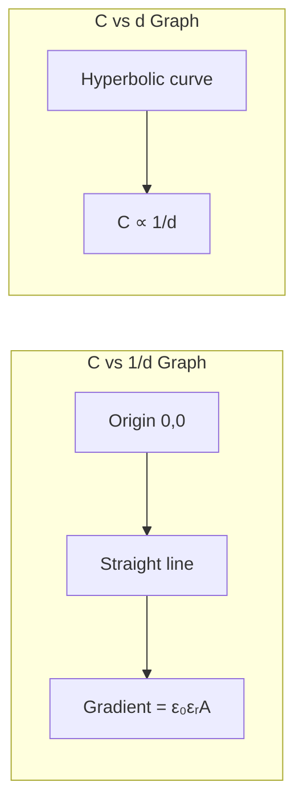
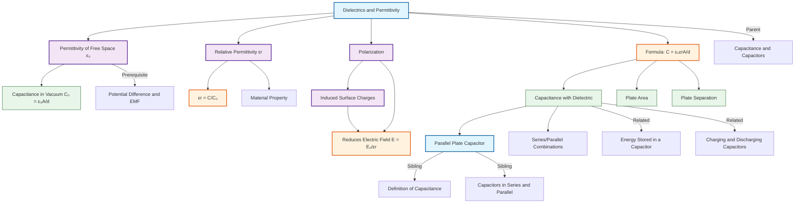

# 1. Overview / 概述

**English:**
This sub-topic explores the role of **dielectrics** — insulating materials placed between capacitor plates — and the fundamental concept of **permittivity**. When a dielectric is inserted between the plates of a [[Parallel Plate Capacitor]], the capacitance increases by a factor called the **relative permittivity** (or dielectric constant) $\varepsilon_r$. This occurs because the dielectric material polarizes, reducing the electric field strength between the plates for the same charge, allowing more charge to be stored at a given voltage. The absolute permittivity of free space $\varepsilon_0$ is a universal constant, while $\varepsilon_r$ describes how much a material enhances capacitance. Understanding dielectrics is essential for designing capacitors with specific values and for explaining why capacitors are often filled with materials like mica, ceramic, or oil rather than being empty.

**中文:**
本子知识点探讨**电介质**（置于电容器极板之间的绝缘材料）的作用，以及**电容率**的基本概念。当电介质插入[[平行板电容器]]的极板之间时，电容会增大一个倍数，称为**相对电容率**（或介电常数）$\varepsilon_r$。这是因为电介质材料会发生极化，在相同电荷量下减弱极板间的电场强度，从而在给定电压下储存更多电荷。真空绝对电容率 $\varepsilon_0$ 是一个普适常数，而 $\varepsilon_r$ 描述材料增强电容的能力。理解电介质对于设计具有特定电容值的电容器至关重要，也解释了为什么电容器通常填充云母、陶瓷或油等材料而非保持真空。

---

# 2. Syllabus Learning Objectives / 考纲学习目标

| CAIE 9702 | Edexcel IAL |
|-----------|-------------|
| 19.1(a): Define capacitance and the farad | 4.1: Understand the concept of capacitance |
| 19.1(b): Derive and use $C = \frac{\varepsilon_0 \varepsilon_r A}{d}$ | 4.2: Use $C = \frac{\varepsilon_0 \varepsilon_r A}{d}$ |
| 19.1(c): Explain the effect of a dielectric on capacitance | 4.3: Explain dielectric action in terms of polarization |
| 19.1(d): Define relative permittivity $\varepsilon_r$ | 4.4: Define relative permittivity |
| — | 4.5: Use $\varepsilon_r = \frac{C}{C_0}$ |

**Examiner Expectations / 考官期望:**
- **CAIE:** You must be able to define $\varepsilon_r$ as the ratio of capacitance with dielectric to capacitance without dielectric. Derivation of $C = \frac{\varepsilon_0 \varepsilon_r A}{d}$ is required, and you should explain dielectric action in terms of polarization of molecules.
- **Edexcel:** You need to apply the formula $C = \frac{\varepsilon_0 \varepsilon_r A}{d}$ in calculations and explain how a dielectric increases capacitance. The concept of polarization is explicitly required.
- **Both:** Be prepared to calculate $\varepsilon_r$ from experimental data and to explain why inserting a dielectric increases capacitance.

---

# 3. Core Definitions / 核心定义

| Term (EN/CN) | Definition (EN) | Definition (CN) | Common Mistakes / 常见错误 |
|--------------|-----------------|-----------------|---------------------------|
| **Dielectric** / 电介质 | An insulating material placed between the plates of a capacitor that increases capacitance. | 置于电容器极板之间的绝缘材料，能增大电容。 | ❌ Confusing dielectrics with conductors — dielectrics do NOT conduct electricity. |
| **Relative Permittivity** $\varepsilon_r$ / 相对电容率 | The ratio of the capacitance of a capacitor with a dielectric to the capacitance of the same capacitor without a dielectric (in vacuum). | 有电介质时电容器的电容与同一电容器无电介质（真空）时电容的比值。 | ❌ Forgetting it is a ratio — $\varepsilon_r$ has NO units. |
| **Permittivity of Free Space** $\varepsilon_0$ / 真空电容率 | The absolute permittivity of a vacuum, a fundamental constant equal to $8.85 \times 10^{-12} \, \text{F m}^{-1}$. | 真空的绝对电容率，是一个基本常数，等于 $8.85 \times 10^{-12} \, \text{F m}^{-1}$。 | ❌ Confusing $\varepsilon_0$ with $\varepsilon_r$ — $\varepsilon_0$ has units, $\varepsilon_r$ is dimensionless. |
| **Polarization** / 极化 | The alignment of electric dipoles within a dielectric material in response to an external electric field. | 电介质内部电偶极子在外电场作用下发生定向排列的现象。 | ❌ Thinking polarization means the dielectric becomes charged — it remains neutral overall. |
| **Absolute Permittivity** $\varepsilon$ / 绝对电容率 | The product $\varepsilon = \varepsilon_0 \varepsilon_r$, representing the permittivity of a specific material. | 乘积 $\varepsilon = \varepsilon_0 \varepsilon_r$，表示特定材料的电容率。 | ❌ Using $\varepsilon$ when $\varepsilon_0$ is required for vacuum calculations. |

---

# 4. Key Concepts Explained / 关键概念详解

## 4.1 How a Dielectric Increases Capacitance / 电介质如何增大电容

### Explanation / 解释
**English:**
When a dielectric is inserted between the plates of a [[Parallel Plate Capacitor]], the capacitance increases by a factor of $\varepsilon_r$. This happens because the dielectric material undergoes **polarization**. The molecules of the dielectric (which are electrically neutral overall) have their positive and negative charge centers displaced slightly by the external electric field. This creates **induced surface charges** on the dielectric surfaces: negative charge on the surface near the positive plate, and positive charge on the surface near the negative plate. These induced charges produce an **internal electric field** $E_{\text{induced}}$ that opposes the external field $E_0$ from the plates. The net electric field $E$ between the plates is therefore reduced: $E = \frac{E_0}{\varepsilon_r}$. Since $V = Ed$, the potential difference decreases for the same charge. With $C = \frac{Q}{V}$, a smaller $V$ means a larger $C$.

**中文:**
当电介质插入[[平行板电容器]]的极板之间时，电容增大 $\varepsilon_r$ 倍。这是因为电介质材料发生**极化**。电介质的分子（整体呈电中性）的正负电荷中心在外电场作用下发生微小位移。这会在电介质表面产生**感应面电荷**：靠近正极板的表面带负电，靠近负极板的表面带正电。这些感应电荷产生一个**内电场** $E_{\text{induced}}$，与极板的外电场 $E_0$ 方向相反。因此极板间的净电场 $E$ 减小：$E = \frac{E_0}{\varepsilon_r}$。由于 $V = Ed$，相同电荷量下的电势差减小。由 $C = \frac{Q}{V}$，更小的 $V$ 意味着更大的 $C$。

### Physical Meaning / 物理意义
**English:**
The dielectric effectively "shields" some of the electric field between the plates, allowing more charge to be stored for the same voltage. The energy stored also increases because $E = \frac{1}{2}CV^2$, but the energy density in the dielectric changes due to polarization.

**中文:**
电介质有效地"屏蔽"了极板间的部分电场，使得在相同电压下能储存更多电荷。储存的能量也增加（因为 $E = \frac{1}{2}CV^2$），但由于极化，电介质中的能量密度会发生变化。

### Common Misconceptions / 常见误区
- ❌ **"Dielectrics conduct electricity"** — No! Dielectrics are insulators; they do not allow charge to flow through them.
- ❌ **"The dielectric becomes charged"** — No! The dielectric remains electrically neutral overall; only the charge distribution shifts (polarization).
- ❌ **"$\varepsilon_r$ depends on voltage"** — No! $\varepsilon_r$ is a material property, independent of applied voltage (for linear dielectrics).
- ❌ **"Inserting a dielectric reduces capacitance"** — No! It always increases capacitance (for $\varepsilon_r > 1$).

### Exam Tips / 考试提示
- **EN:** Always state that the dielectric reduces the electric field strength between the plates, which reduces the potential difference, thus increasing capacitance. Use the phrase "polarization of the dielectric" in your explanation.
- **CN:** 务必说明电介质减小了极板间的电场强度，从而减小了电势差，因此增大了电容。在解释中使用"电介质的极化"这一表述。

> 📷 **IMAGE PROMPT — DIELECTRIC-01: Polarization of a Dielectric in a Capacitor**
> A parallel plate capacitor with positive and negative plates. Between them, a dielectric material showing molecules with separated positive and negative charge centers. Induced surface charges are shown on the dielectric surfaces: negative near the positive plate, positive near the negative plate. Arrows show the external field E0 (downward) and the induced field Eind (upward). The net field E is smaller than E0. Labels: "External Field E0", "Induced Field Eind", "Net Field E", "Induced Surface Charges". Clean, educational style with color coding.

---

## 4.2 Relative Permittivity $\varepsilon_r$ / 相对电容率

### Explanation / 解释
**English:**
Relative permittivity $\varepsilon_r$ (also called the **dielectric constant**) is a dimensionless quantity that measures how much a material increases the capacitance of a capacitor compared to vacuum. It is defined as:

$$\varepsilon_r = \frac{C}{C_0}$$

where $C$ is the capacitance with the dielectric and $C_0$ is the capacitance of the same capacitor in vacuum. For vacuum, $\varepsilon_r = 1$ exactly. For air, $\varepsilon_r \approx 1.0006$ (often taken as 1 in calculations). For common dielectrics: paper ($\approx 3.5$), mica ($\approx 7$), ceramic ($\approx 10-100$), and water ($\approx 80$).

**中文:**
相对电容率 $\varepsilon_r$（也称为**介电常数**）是一个无量纲量，衡量材料相比于真空增大电容器电容的能力。其定义为：

$$\varepsilon_r = \frac{C}{C_0}$$

其中 $C$ 是有电介质时的电容，$C_0$ 是同一电容器在真空中的电容。真空的 $\varepsilon_r = 1$ 精确等于1。空气的 $\varepsilon_r \approx 1.0006$（计算中常取为1）。常见电介质：纸（$\approx 3.5$）、云母（$\approx 7$）、陶瓷（$\approx 10-100$）、水（$\approx 80$）。

### Physical Meaning / 物理意义
**English:**
$\varepsilon_r$ represents the factor by which the electric field is reduced inside the dielectric compared to vacuum. A higher $\varepsilon_r$ means the material polarizes more strongly, creating a larger opposing field and thus a greater capacitance increase.

**中文:**
$\varepsilon_r$ 表示电介质内部电场相比于真空减小的倍数。$\varepsilon_r$ 越大，材料极化越强，产生的反向电场越大，电容增加越多。

### Common Misconceptions / 常见误区
- ❌ **"$\varepsilon_r$ has units"** — No! It is a pure ratio, dimensionless.
- ❌ **"$\varepsilon_r$ is the same for all materials"** — No! It varies widely (1 to >100).
- ❌ **"$\varepsilon_r$ changes with capacitor geometry"** — No! It is a material property.

### Exam Tips / 考试提示
- **EN:** When asked to find $\varepsilon_r$ from experimental data, always use $\varepsilon_r = C/C_0$. Remember that $C_0$ is the capacitance without dielectric (in vacuum or air).
- **CN:** 当要求从实验数据求 $\varepsilon_r$ 时，始终使用 $\varepsilon_r = C/C_0$。记住 $C_0$ 是无电介质（真空或空气）时的电容。

---

## 4.3 The Formula $C = \frac{\varepsilon_0 \varepsilon_r A}{d}$ / 公式 $C = \frac{\varepsilon_0 \varepsilon_r A}{d}$

### Explanation / 解释
**English:**
This is the formula for the capacitance of a [[Parallel Plate Capacitor]] with a dielectric. It combines the vacuum permittivity $\varepsilon_0$, the relative permittivity $\varepsilon_r$, the plate area $A$, and the plate separation $d$. The derivation starts from the vacuum case $C_0 = \frac{\varepsilon_0 A}{d}$ and then multiplies by $\varepsilon_r$ to account for the dielectric.

**中文:**
这是有电介质的[[平行板电容器]]的电容公式。它结合了真空电容率 $\varepsilon_0$、相对电容率 $\varepsilon_r$、极板面积 $A$ 和极板间距 $d$。推导从真空情况 $C_0 = \frac{\varepsilon_0 A}{d}$ 开始，然后乘以 $\varepsilon_r$ 以考虑电介质的影响。

### Derivation / 推导
**English:**
1. For a vacuum capacitor: $C_0 = \frac{Q}{V_0} = \frac{Q}{E_0 d}$
2. With dielectric: $E = \frac{E_0}{\varepsilon_r}$, so $V = Ed = \frac{E_0 d}{\varepsilon_r} = \frac{V_0}{\varepsilon_r}$
3. Since $Q$ is constant (if the capacitor is isolated), $C = \frac{Q}{V} = \frac{Q}{V_0/\varepsilon_r} = \varepsilon_r \frac{Q}{V_0} = \varepsilon_r C_0$
4. Substituting $C_0 = \frac{\varepsilon_0 A}{d}$ gives $C = \frac{\varepsilon_0 \varepsilon_r A}{d}$

**中文:**
1. 对于真空电容器：$C_0 = \frac{Q}{V_0} = \frac{Q}{E_0 d}$
2. 有电介质时：$E = \frac{E_0}{\varepsilon_r}$，所以 $V = Ed = \frac{E_0 d}{\varepsilon_r} = \frac{V_0}{\varepsilon_r}$
3. 由于 $Q$ 不变（如果电容器是孤立的），$C = \frac{Q}{V} = \frac{Q}{V_0/\varepsilon_r} = \varepsilon_r \frac{Q}{V_0} = \varepsilon_r C_0$
4. 代入 $C_0 = \frac{\varepsilon_0 A}{d}$ 得 $C = \frac{\varepsilon_0 \varepsilon_r A}{d}$

### Conditions / 适用条件
- **EN:** The formula assumes a uniform electric field between the plates (valid when $d \ll \sqrt{A}$). The dielectric must completely fill the space between the plates.
- **CN:** 该公式假设极板间电场均匀（当 $d \ll \sqrt{A}$ 时成立）。电介质必须完全填充极板之间的空间。

### Limitations / 局限性
- **EN:** Does not account for edge effects (fringing fields). For very thin dielectrics or high voltages, dielectric breakdown may occur.
- **CN:** 未考虑边缘效应（边缘电场）。对于非常薄的电介质或高电压，可能发生电介质击穿。

---

# 5. Essential Equations / 核心公式

## Equation 1: Capacitance with Dielectric / 有电介质的电容

$$C = \frac{\varepsilon_0 \varepsilon_r A}{d}$$

| Symbol (符号) | Meaning (EN) | Meaning (CN) | Unit (单位) |
|--------------|-------------|-------------|------------|
| $C$ | Capacitance | 电容 | F (farad) |
| $\varepsilon_0$ | Permittivity of free space | 真空电容率 | $\text{F m}^{-1}$ |
| $\varepsilon_r$ | Relative permittivity (dielectric constant) | 相对电容率（介电常数） | dimensionless |
| $A$ | Area of one plate | 单块极板面积 | $\text{m}^2$ |
| $d$ | Separation between plates | 极板间距 | m |

**Derivation / 推导:** See Section 4.3 above.
**Conditions / 适用条件:** Uniform field, dielectric fills entire gap.
**Limitations / 局限性:** Neglects edge effects.

## Equation 2: Definition of Relative Permittivity / 相对电容率的定义

$$\varepsilon_r = \frac{C}{C_0}$$

| Symbol (符号) | Meaning (EN) | Meaning (CN) | Unit (单位) |
|--------------|-------------|-------------|------------|
| $\varepsilon_r$ | Relative permittivity | 相对电容率 | dimensionless |
| $C$ | Capacitance with dielectric | 有电介质时的电容 | F |
| $C_0$ | Capacitance without dielectric (vacuum) | 无电介质（真空）时的电容 | F |

**Derivation / 推导:** Direct definition.
**Conditions / 适用条件:** Same capacitor geometry for both measurements.
**Limitations / 局限性:** None — this is the fundamental definition.

## Equation 3: Electric Field Reduction / 电场减小

$$E = \frac{E_0}{\varepsilon_r}$$

| Symbol (符号) | Meaning (EN) | Meaning (CN) | Unit (单位) |
|--------------|-------------|-------------|------------|
| $E$ | Electric field with dielectric | 有电介质时的电场 | $\text{V m}^{-1}$ |
| $E_0$ | Electric field without dielectric | 无电介质时的电场 | $\text{V m}^{-1}$ |
| $\varepsilon_r$ | Relative permittivity | 相对电容率 | dimensionless |

**Derivation / 推导:** From polarization effect.
**Conditions / 适用条件:** Linear dielectric, uniform field.
**Limitations / 局限性:** Only valid for linear dielectrics.

> 📷 **IMAGE PROMPT — DIELECTRIC-02: Electric Field Reduction by Dielectric**
> A parallel plate capacitor shown in two states: left side without dielectric (vacuum) showing strong uniform field lines E0 between plates; right side with dielectric showing weaker field lines E. The dielectric is shown as a shaded region with polarized molecules. Arrows indicate E0 (long) and E (short). Labels: "Without Dielectric: E0", "With Dielectric: E = E0/εr". Side-by-side comparison style.

---

# 6. Graphs and Relationships / 图表与关系

## 6.1 Capacitance vs. Plate Separation / 电容与极板间距的关系

### Axes / 坐标轴
- **X-axis:** $1/d$ (inverse plate separation) / 极板间距的倒数 ($\text{m}^{-1}$)
- **Y-axis:** $C$ (capacitance) / 电容 (F)

### Shape / 形状
**English:** A straight line through the origin, with gradient $\varepsilon_0 \varepsilon_r A$.
**中文:** 一条通过原点的直线，斜率为 $\varepsilon_0 \varepsilon_r A$。

### Gradient Meaning / 斜率含义
**English:** The gradient equals $\varepsilon_0 \varepsilon_r A$. If $A$ is known, $\varepsilon_r$ can be found from the gradient.
**中文:** 斜率等于 $\varepsilon_0 \varepsilon_r A$。如果已知 $A$，可从斜率求出 $\varepsilon_r$。

### Area Meaning / 面积含义
**English:** No meaningful area under this graph.
**中文:** 该图线下无有意义的面积。

### Exam Interpretation / 考试解读
- **EN:** A common experiment is to measure $C$ for different $d$ values and plot $C$ vs $1/d$. The straight line confirms the relationship $C \propto 1/d$. The gradient can be used to find $\varepsilon_0$ or $\varepsilon_r$.
- **CN:** 常见实验是测量不同 $d$ 值下的 $C$，并绘制 $C$ 对 $1/d$ 的图。直线关系证实了 $C \propto 1/d$。斜率可用于求 $\varepsilon_0$ 或 $\varepsilon_r$。

---

## 6.2 Capacitance vs. Plate Area / 电容与极板面积的关系

### Axes / 坐标轴
- **X-axis:** $A$ (plate area) / 极板面积 ($\text{m}^2$)
- **Y-axis:** $C$ (capacitance) / 电容 (F)

### Shape / 形状
**English:** A straight line through the origin, with gradient $\frac{\varepsilon_0 \varepsilon_r}{d}$.
**中文:** 一条通过原点的直线，斜率为 $\frac{\varepsilon_0 \varepsilon_r}{d}$。

### Gradient Meaning / 斜率含义
**English:** The gradient equals $\frac{\varepsilon_0 \varepsilon_r}{d}$. If $d$ is known, $\varepsilon_r$ can be found.
**中文:** 斜率等于 $\frac{\varepsilon_0 \varepsilon_r}{d}$。如果已知 $d$，可求出 $\varepsilon_r$。

### Area Meaning / 面积含义
**English:** No meaningful area under this graph.
**中文:** 该图线下无有意义的面积。

### Exam Interpretation / 考试解读
- **EN:** This linear relationship confirms $C \propto A$. Used in experimental determination of $\varepsilon_0$ or $\varepsilon_r$.
- **CN:** 线性关系证实了 $C \propto A$。用于实验测定 $\varepsilon_0$ 或 $\varepsilon_r$。

---

# 7. Required Diagrams / 必备图表

## 7.1 Polarization of a Dielectric / 电介质的极化

### Description / 描述
**English:** A diagram showing a parallel plate capacitor with a dielectric between the plates. The dielectric molecules are shown as dipoles (positive and negative ends) aligned with the external field. Induced surface charges are shown on the dielectric surfaces. The external field $E_0$, induced field $E_{\text{ind}}$, and net field $E$ are indicated with arrows.

**中文:** 显示平行板电容器极板间有电介质的示意图。电介质分子显示为偶极子（正负端），沿外电场方向排列。电介质表面显示感应面电荷。用箭头标出外电场 $E_0$、感应电场 $E_{\text{ind}}$ 和净电场 $E$。

### Image Prompt / 图片生成提示
> 📷 **IMAGE PROMPT — DIELECTRIC-03: Dielectric Polarization Diagram**
> A detailed educational diagram of a parallel plate capacitor. Two parallel metal plates (horizontal) with positive charge on top plate and negative charge on bottom plate. Between them, a dielectric material shown as a grid of molecules, each molecule depicted as an oval with a "+" on one end and a "-" on the other, all aligned vertically. On the top surface of the dielectric, negative charges are shown; on the bottom surface, positive charges are shown. Three arrows: a long downward arrow labeled "E0" (external field), a shorter upward arrow labeled "Eind" (induced field), and a medium downward arrow labeled "E" (net field). Labels: "Dielectric", "Induced Surface Charges", "Polarized Molecules". Clean, textbook-quality, color-coded.

### Labels Required / 需要标注
- **EN:** Positive plate (+), Negative plate (-), Dielectric, Polarized molecules, Induced surface charges, $E_0$, $E_{\text{ind}}$, $E$
- **CN:** 正极板 (+)、负极板 (-)、电介质、极化分子、感应面电荷、$E_0$、$E_{\text{ind}}$、$E$

### Exam Importance / 考试重要性
- **EN:** Essential for explaining how a dielectric increases capacitance. Frequently asked in 4-6 mark explanation questions.
- **CN:** 解释电介质如何增大电容的关键图示。常见于4-6分的解释题。

---

## 7.2 Experimental Setup for Measuring $\varepsilon_r$ / 测量 $\varepsilon_r$ 的实验装置

### Description / 描述
**English:** A diagram showing a parallel plate capacitor connected to a capacitance meter. The plates are separated by a known distance $d$ and have known area $A$. First, the capacitance $C_0$ is measured with air between the plates. Then, a dielectric slab of the same thickness is inserted, and the new capacitance $C$ is measured.

**中文:** 显示平行板电容器连接到电容测量仪的示意图。极板间距 $d$ 和面积 $A$ 已知。首先测量极板间为空气时的电容 $C_0$，然后插入相同厚度的电介质板，测量新电容 $C$。

### Image Prompt / 图片生成提示
> 📷 **IMAGE PROMPT — DIELECTRIC-04: Experimental Setup for εr Measurement**
> A clean laboratory diagram showing a parallel plate capacitor (two circular metal plates on insulating stands) connected by wires to a digital capacitance meter (display showing "C = 2.5 nF"). A rectangular dielectric slab (labeled "Dielectric") is being inserted between the plates. Labels: "Plate Area A", "Separation d", "Capacitance Meter", "Dielectric Slab". Two states shown: left side without dielectric (air gap), right side with dielectric inserted. Simple, clear, educational style.

### Labels Required / 需要标注
- **EN:** Capacitance meter, Parallel plates, Dielectric slab, $A$, $d$, $C_0$ (air), $C$ (with dielectric)
- **CN:** 电容测量仪、平行极板、电介质板、$A$、$d$、$C_0$（空气）、$C$（有电介质）

### Exam Importance / 考试重要性
- **EN:** Common in practical-based questions. You may be asked to describe the procedure or calculate $\varepsilon_r$ from given data.
- **CN:** 常见于实验类题目。可能要求描述实验步骤或根据给定数据计算 $\varepsilon_r$。

---

# 8. Worked Examples / 典型例题

## Example 1: Calculating Capacitance with Dielectric / 例1：计算有电介质的电容

### Question / 题目
**English:**
A parallel plate capacitor has plates of area $0.050 \, \text{m}^2$ separated by $2.0 \, \text{mm}$ of air. A sheet of mica ($\varepsilon_r = 7.0$) of the same thickness is inserted between the plates, completely filling the gap. Calculate:
(a) The capacitance with air between the plates.
(b) The capacitance with mica between the plates.
(c) The ratio of the two capacitances.

Given: $\varepsilon_0 = 8.85 \times 10^{-12} \, \text{F m}^{-1}$

**中文:**
一个平行板电容器的极板面积为 $0.050 \, \text{m}^2$，间距为 $2.0 \, \text{mm}$（空气）。将一块相同厚度的云母片（$\varepsilon_r = 7.0$）插入极板之间，完全填充间隙。计算：
(a) 极板间为空气时的电容。
(b) 极板间为云母时的电容。
(c) 两个电容的比值。

已知：$\varepsilon_0 = 8.85 \times 10^{-12} \, \text{F m}^{-1}$

### Solution / 解答

**(a) Air capacitance / 空气电容:**

$$C_0 = \frac{\varepsilon_0 A}{d} = \frac{(8.85 \times 10^{-12})(0.050)}{2.0 \times 10^{-3}}$$

$$C_0 = \frac{4.425 \times 10^{-13}}{2.0 \times 10^{-3}} = 2.21 \times 10^{-10} \, \text{F}$$

$$C_0 = 221 \, \text{pF}$$

**(b) Mica capacitance / 云母电容:**

$$C = \frac{\varepsilon_0 \varepsilon_r A}{d} = \varepsilon_r C_0 = 7.0 \times 2.21 \times 10^{-10}$$

$$C = 1.55 \times 10^{-9} \, \text{F} = 1.55 \, \text{nF}$$

**(c) Ratio / 比值:**

$$\frac{C}{C_0} = \varepsilon_r = 7.0$$

### Final Answer / 最终答案
**Answer:** (a) $C_0 = 221 \, \text{pF}$, (b) $C = 1.55 \, \text{nF}$, (c) Ratio = 7.0 | **答案：** (a) $C_0 = 221 \, \text{pF}$, (b) $C = 1.55 \, \text{nF}$, (c) 比值 = 7.0

### Quick Tip / 提示
- **EN:** Always convert mm to m ($1 \, \text{mm} = 10^{-3} \, \text{m}$). Remember that $1 \, \text{pF} = 10^{-12} \, \text{F}$ and $1 \, \text{nF} = 10^{-9} \, \text{F}$.
- **CN:** 始终将 mm 转换为 m（$1 \, \text{mm} = 10^{-3} \, \text{m}$）。记住 $1 \, \text{pF} = 10^{-12} \, \text{F}$，$1 \, \text{nF} = 10^{-9} \, \text{F}$。

---

## Example 2: Finding $\varepsilon_r$ from Experimental Data / 例2：从实验数据求 $\varepsilon_r$

### Question / 题目
**English:**
A student measures the capacitance of a parallel plate capacitor with air between the plates and obtains $C_0 = 150 \, \text{pF}$. When a dielectric slab is inserted, the capacitance increases to $C = 675 \, \text{pF}$. Calculate the relative permittivity of the dielectric material.

**中文:**
一名学生测量了极板间为空气的平行板电容器的电容，得到 $C_0 = 150 \, \text{pF}$。当插入电介质板后，电容增大到 $C = 675 \, \text{pF}$。计算该电介质材料的相对电容率。

### Solution / 解答

$$\varepsilon_r = \frac{C}{C_0} = \frac{675 \, \text{pF}}{150 \, \text{pF}} = 4.5$$

### Final Answer / 最终答案
**Answer:** $\varepsilon_r = 4.5$ | **答案：** $\varepsilon_r = 4.5$

### Quick Tip / 提示
- **EN:** Since $\varepsilon_r$ is a ratio, the units cancel out. You don't need to convert pF to F.
- **CN:** 由于 $\varepsilon_r$ 是比值，单位相互抵消。无需将 pF 转换为 F。

---

# 9. Past Paper Question Types / 历年真题题型

| Question Type / 题型 | Frequency / 频率 | Difficulty / 难度 | Past Paper References / 真题索引 |
|----------------------|------------------|------------------|-------------------------------|
| Define $\varepsilon_r$ and explain dielectric action | High | Easy | 📝 *待填入* |
| Calculate $C$ using $C = \frac{\varepsilon_0 \varepsilon_r A}{d}$ | High | Medium | 📝 *待填入* |
| Find $\varepsilon_r$ from experimental $C$ and $C_0$ | Medium | Easy | 📝 *待填入* |
| Derive $C = \frac{\varepsilon_0 \varepsilon_r A}{d}$ | Medium | Medium | 📝 *待填入* |
| Explain why inserting dielectric increases $C$ | High | Medium | 📝 *待填入* |
| Graph analysis: $C$ vs $1/d$ or $C$ vs $A$ | Low | Medium | 📝 *待填入* |

**Common Command Words / 常见指令词:**
- **EN:** Define, Explain, Calculate, Derive, Determine, Show that
- **CN:** 定义、解释、计算、推导、确定、证明

---

# 10. Practical Skills Connections / 实验技能链接

**English:**
This sub-topic connects to practical work in several ways:

1. **Measuring $\varepsilon_r$:** Use a capacitance meter to measure $C_0$ (air gap) and $C$ (with dielectric). Calculate $\varepsilon_r = C/C_0$.
2. **Verifying $C \propto A/d$:** Vary plate area $A$ or separation $d$ and plot $C$ vs $A$ or $C$ vs $1/d$ to confirm the linear relationship. The gradient can be used to find $\varepsilon_0$ or $\varepsilon_r$.
3. **Uncertainties:** When measuring $A$ and $d$, consider percentage uncertainties. The uncertainty in $\varepsilon_r$ comes from the uncertainties in $C$ and $C_0$.
4. **Experimental design:** Ensure the dielectric completely fills the gap. Use a guard ring to minimize edge effects. Keep the capacitor isolated to avoid charge leakage.

**中文:**
本子知识点与实验工作有以下几个方面的联系：

1. **测量 $\varepsilon_r$：** 使用电容测量仪测量 $C_0$（空气间隙）和 $C$（有电介质）。计算 $\varepsilon_r = C/C_0$。
2. **验证 $C \propto A/d$：** 改变极板面积 $A$ 或间距 $d$，绘制 $C$ 对 $A$ 或 $C$ 对 $1/d$ 的图，确认线性关系。斜率可用于求 $\varepsilon_0$ 或 $\varepsilon_r$。
3. **不确定度：** 测量 $A$ 和 $d$ 时，考虑百分比不确定度。$\varepsilon_r$ 的不确定度来自 $C$ 和 $C_0$ 的不确定度。
4. **实验设计：** 确保电介质完全填充间隙。使用保护环以最小化边缘效应。保持电容器孤立以避免电荷泄漏。

---

# 11. Concept Map / 概念图谱

---

# 12. Quick Revision Sheet / 速查表

| Category / 类别 | Key Points / 要点 |
|----------------|------------------|
| **Definition / 定义** | $\varepsilon_r = \frac{C}{C_0}$ — ratio of capacitance with dielectric to without. $\varepsilon_r$ is dimensionless. |
| **Key Formula / 核心公式** | $C = \frac{\varepsilon_0 \varepsilon_r A}{d}$ — capacitance of parallel plate capacitor with dielectric. |
| **Key Graph / 核心图表** | $C$ vs $1/d$: straight line through origin, gradient $= \varepsilon_0 \varepsilon_r A$. $C$ vs $A$: straight line through origin, gradient $= \frac{\varepsilon_0 \varepsilon_r}{d}$. |
| **Dielectric Action / 电介质作用** | Polarization → induced surface charges → internal field opposes external field → net field reduced → $V$ reduced → $C$ increased by factor $\varepsilon_r$. |
| **Exam Tip / 考试提示** | Always convert units: mm → m, cm² → m². Remember $\varepsilon_0 = 8.85 \times 10^{-12} \, \text{F m}^{-1}$. For air, $\varepsilon_r \approx 1$. |
| **Common Mistake / 常见错误** | ❌ Saying dielectric becomes charged (it remains neutral). ❌ Forgetting $\varepsilon_r$ has no units. ❌ Using $\varepsilon_0$ when $\varepsilon_r$ is needed. |
| **Experimental Method / 实验方法** | Measure $C_0$ (air), insert dielectric, measure $C$. Calculate $\varepsilon_r = C/C_0$. Plot $C$ vs $1/d$ to verify $C \propto 1/d$. |
| **Prerequisites / 前置知识** | [[Potential Difference and EMF]] — understanding $V = Ed$ and electric fields. |
| **Related Topics / 相关主题** | [[Energy Stored in a Capacitor]], [[Charging and Discharging Capacitors]] |