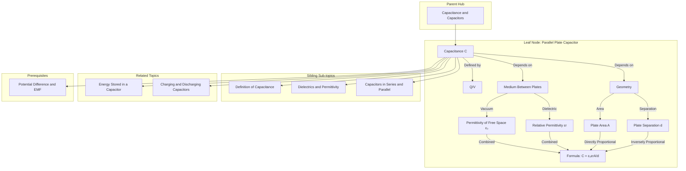

---
# 1. Overview / 概述

**English:**
The parallel plate capacitor is the most fundamental and widely used model for understanding capacitance. This sub-topic focuses on the geometry of a capacitor consisting of two parallel conducting plates separated by a dielectric (insulator). We will derive the relationship between capacitance ($C$), the area of the plates ($A$), the separation between them ($d$), and the permittivity of the dielectric material ($\varepsilon$). Understanding this model is crucial because it provides the physical basis for the definition of capacitance itself and explains how changing the physical dimensions of a capacitor affects its ability to store charge. This knowledge directly links to the broader topic of [[Capacitance and Capacitors]] and is essential for understanding [[Dielectrics and Permittivity]] and [[Energy Stored in a Capacitor]].

**中文:**
平行板电容器是理解电容的最基本、最常用的模型。本子知识点专注于由两块平行导电板（中间由电介质/绝缘体隔开）构成的电容器的几何结构。我们将推导电容 ($C$)、极板面积 ($A$)、极板间距 ($d$) 以及电介质材料的介电常数 ($\varepsilon$) 之间的关系。理解这个模型至关重要，因为它为电容的定义提供了物理基础，并解释了改变电容器的物理尺寸如何影响其储存电荷的能力。这些知识直接联系到 [[Capacitance and Capacitors]] 这一更广泛的主题，并且是理解 [[Dielectrics and Permittivity]] 和 [[Energy Stored in a Capacitor]] 的基础。

---

# 2. Syllabus Learning Objectives / 考纲学习目标

| CAIE 9702 (19.1) | Edexcel IAL (WPH14 U4: 4.1-4.5) |
|-----------|-------------|
| (a) Define capacitance and the farad. | 4.1 Understand the concept of capacitance and the equation $C = Q/V$. |
| (b) Derive and use the formula $C = \varepsilon_0 A / d$ for a parallel plate capacitor. | 4.2 Understand the structure of a parallel plate capacitor. |
| (c) Understand the effect of inserting a dielectric on the capacitance of a parallel plate capacitor. | 4.3 Derive and use the formula $C = \varepsilon_0 \varepsilon_r A / d$. |
| (d) Use the formula $C = \varepsilon_0 \varepsilon_r A / d$. | 4.4 Understand the effect of a dielectric on capacitance. |
| | 4.5 Understand the concept of relative permittivity ($\varepsilon_r$). |

**Examiner Expectations / 考官期望:**
- **CAIE:** You must be able to derive $C = \varepsilon_0 A / d$ from the definition of capacitance and the formula for the electric field between parallel plates ($E = V/d$). You must also understand that inserting a dielectric increases capacitance by a factor of $\varepsilon_r$.
- **Edexcel:** You must be able to recall and apply $C = \varepsilon_0 \varepsilon_r A / d$. You should understand the physical meaning of $\varepsilon_r$ and how it relates to the polarisation of the dielectric material.

---

# 3. Core Definitions / 核心定义

| Term (EN/CN) | Definition (EN) | Definition (CN) | Common Mistakes / 常见错误 |
|--------------|-----------------|-----------------|---------------------------|
| **Parallel Plate Capacitor** / 平行板电容器 | A capacitor consisting of two identical, flat, conducting plates placed parallel to each other, separated by a small distance compared to their dimensions. | 由两块相同、平坦的导电板平行放置，间距远小于其尺寸的电容器。 | Confusing it with a simple conductor. A capacitor stores energy in an electric field, not charge on a single plate. |
| **Permittivity of Free Space ($\varepsilon_0$)** / 真空介电常数 | The absolute permittivity of a vacuum, a fundamental physical constant ($8.85 \times 10^{-12} \, \text{F m}^{-1}$). It quantifies the ability of a vacuum to permit electric field lines. | 真空的绝对介电常数，是一个基本物理常数 ($8.85 \times 10^{-12} \, \text{F m}^{-1}$)。它量化了真空允许电场线通过的能力。 | Forgetting the units ($\text{F m}^{-1}$). It is not dimensionless. |
| **Relative Permittivity ($\varepsilon_r$)** / 相对介电常数 | The ratio of the permittivity of a material ($\varepsilon$) to the permittivity of free space ($\varepsilon_0$). It is a dimensionless number indicating how much a material increases the capacitance compared to a vacuum. | 材料的介电常数 ($\varepsilon$) 与真空介电常数 ($\varepsilon_0$) 的比值。它是一个无量纲数，表示与真空相比，材料使电容增加的程度。 | Confusing it with absolute permittivity ($\varepsilon$). $\varepsilon_r$ has no units. |
| **Dielectric** / 电介质 | An insulating material placed between the plates of a capacitor. It increases capacitance, allows for higher operating voltages, and provides mechanical separation. | 放置在电容器极板之间的绝缘材料。它能增加电容，允许更高的工作电压，并提供机械隔离。 | Thinking a dielectric conducts electricity. It is an insulator. |
| **Polarisation** / 极化 | The slight displacement of positive and negative charges within a dielectric material when placed in an external electric field, creating an internal opposing field. | 当电介质材料置于外部电场中时，其内部正负电荷发生微小位移，产生一个内部反向电场的过程。 | Thinking charges move freely through the dielectric. They only shift slightly within their atoms/molecules. |

---

# 4. Key Concepts Explained / 关键概念详解

## 4.1 Derivation of $C = \varepsilon_0 A / d$ / 公式 $C = \varepsilon_0 A / d$ 的推导

### Explanation / 解释
**English:**
The capacitance of a parallel plate capacitor is derived from its fundamental definition, $C = Q/V$. For a parallel plate capacitor with plate area $A$ and separation $d$, the electric field $E$ between the plates is uniform (ignoring edge effects) and is given by $E = V/d$. The charge $Q$ on one plate is related to the electric field by Gauss's law, which for this geometry simplifies to $E = \sigma / \varepsilon_0 = Q / (A \varepsilon_0)$, where $\sigma$ is the surface charge density. Equating the two expressions for $E$ gives $V/d = Q / (A \varepsilon_0)$. Rearranging for $Q/V$ yields $C = \varepsilon_0 A / d$. This derivation shows that capacitance is a purely geometric property for a given dielectric (in this case, a vacuum).

**中文:**
平行板电容器的电容是从其基本定义 $C = Q/V$ 推导出来的。对于极板面积为 $A$、间距为 $d$ 的平行板电容器，两极板间的电场 $E$ 是均匀的（忽略边缘效应），由 $E = V/d$ 给出。一个极板上的电荷 $Q$ 通过高斯定律与电场相关，对于这种几何结构，该定律简化为 $E = \sigma / \varepsilon_0 = Q / (A \varepsilon_0)$，其中 $\sigma$ 是面电荷密度。将 $E$ 的两个表达式相等，得到 $V/d = Q / (A \varepsilon_0)$。重新整理 $Q/V$ 得到 $C = \varepsilon_0 A / d$。这个推导表明，对于给定的电介质（此处为真空），电容纯粹是一个几何属性。

### Physical Meaning / 物理意义
**English:**
- **Area ($A$):** A larger plate area provides more "space" for charge to be stored, directly increasing capacitance.
- **Separation ($d$):** A smaller separation creates a stronger electric field for the same voltage, allowing more charge to be stored. This is because the force of attraction between opposite charges on the two plates is stronger when they are closer.
- **Permittivity ($\varepsilon_0$):** This constant reflects how well the medium (vacuum) supports the electric field.

**中文:**
- **面积 ($A$):** 更大的极板面积为电荷储存提供了更多“空间”，直接增加了电容。
- **间距 ($d$):** 更小的间距在相同电压下产生更强的电场，从而能储存更多电荷。这是因为当两极板上的异种电荷靠得更近时，它们之间的吸引力更强。
- **介电常数 ($\varepsilon_0$):** 这个常数反映了介质（真空）支持电场的能力。

### Common Misconceptions / 常见误区
- **Misconception:** Capacitance depends on the charge or voltage.
  **Reality:** Capacitance is a geometric property. $C$ is constant for a given capacitor. $Q$ and $V$ change proportionally.
- **Misconception:** The formula $C = \varepsilon_0 A / d$ applies to any capacitor.
  **Reality:** It only applies to the ideal parallel plate geometry. Other shapes (cylindrical, spherical) have different formulas.

### Exam Tips / 考试提示
- **CAIE:** Be prepared to derive this formula from first principles in a "show that" question.
- **Edexcel:** You are more likely to be asked to use the formula directly. Ensure you can rearrange it for any variable.
- **Units:** Always check that your units are consistent (e.g., $A$ in $\text{m}^2$, $d$ in $\text{m}$).

> 📷 **IMAGE PROMPT — DERIVATION: Parallel Plate Capacitor Derivation Diagram**
> A clear, labeled diagram of a parallel plate capacitor. Show two parallel plates of area A separated by distance d. Draw uniform electric field lines (E) from the positive plate to the negative plate. Label the charge on the positive plate as +Q and on the negative plate as -Q. Show the surface charge density σ = Q/A on the positive plate. Include a callout box showing the derivation steps: E = V/d, E = σ/ε₀, V/d = Q/(Aε₀), C = Q/V = ε₀A/d.

---

# 5. Essential Equations / 核心公式

## Equation 1: Capacitance of a Parallel Plate Capacitor (Vacuum)

$$ C = \frac{\varepsilon_0 A}{d} $$

| Symbol (符号) | Meaning (EN) | Meaning (CN) | Unit (单位) |
|--------------|-------------|-------------|------------|
| $C$ | Capacitance | 电容 | Farad (F) |
| $\varepsilon_0$ | Permittivity of free space | 真空介电常数 | $\text{F m}^{-1}$ |
| $A$ | Area of one plate | 单个极板的面积 | $\text{m}^2$ |
| $d$ | Separation between plates | 极板间距 | $\text{m}$ |

**Derivation / 推导:** See Section 4.1.
**Conditions / 适用条件:**
- **EN:** The plates are large and parallel, and the separation $d$ is much smaller than the dimensions of the plates (to ignore edge effects).
- **CN:** 极板足够大且平行，间距 $d$ 远小于极板的尺寸（以忽略边缘效应）。
**Limitations / 局限性:**
- **EN:** Does not account for edge effects (non-uniform field at the edges). Does not include a dielectric material.
- **CN:** 未考虑边缘效应（边缘处的非均匀电场）。不包含电介质材料。

## Equation 2: Capacitance of a Parallel Plate Capacitor (With Dielectric)

$$ C = \frac{\varepsilon_0 \varepsilon_r A}{d} $$

| Symbol (符号) | Meaning (EN) | Meaning (CN) | Unit (单位) |
|--------------|-------------|-------------|------------|
| $\varepsilon_r$ | Relative permittivity (dielectric constant) | 相对介电常数 | Dimensionless (无单位) |
| $\varepsilon$ | Absolute permittivity ($\varepsilon = \varepsilon_0 \varepsilon_r$) | 绝对介电常数 | $\text{F m}^{-1}$ |

**Derivation / 推导:** The dielectric reduces the effective electric field inside the capacitor, allowing more charge to be stored for the same voltage. This is equivalent to increasing the permittivity of the space between the plates by a factor of $\varepsilon_r$.
**Conditions / 适用条件:**
- **EN:** The dielectric completely fills the space between the plates.
- **CN:** 电介质完全充满两极板之间的空间。
**Limitations / 局限性:**
- **EN:** The dielectric constant $\varepsilon_r$ is assumed to be constant, but it can vary with frequency and temperature.
- **CN:** 介电常数 $\varepsilon_r$ 被假定为常数，但它可能随频率和温度变化。

---

# 6. Graphs and Relationships / 图表与关系

## 6.1 Capacitance vs. Plate Area ($C$ vs. $A$) / 电容与极板面积的关系

### Axes / 坐标轴
- **X-axis:** Plate Area, $A$ ($\text{m}^2$) / 极板面积 $A$ ($\text{m}^2$)
- **Y-axis:** Capacitance, $C$ (F) / 电容 $C$ (F)

### Shape / 形状
A straight line passing through the origin. / 一条通过原点的直线。

### Gradient Meaning / 斜率含义
The gradient is $\varepsilon_0 / d$ (for a vacuum) or $\varepsilon_0 \varepsilon_r / d$ (with a dielectric). / 斜率为 $\varepsilon_0 / d$（真空）或 $\varepsilon_0 \varepsilon_r / d$（有电介质）。

### Area Meaning / 面积含义
No physical meaning. / 无物理意义。

### Exam Interpretation / 考试解读
- **EN:** This graph shows that capacitance is directly proportional to plate area. Doubling the area doubles the capacitance.
- **CN:** 该图表明电容与极板面积成正比。面积加倍，电容也加倍。

## 6.2 Capacitance vs. Inverse Separation ($C$ vs. $1/d$) / 电容与间距倒数的关系

### Axes / 坐标轴
- **X-axis:** Inverse Separation, $1/d$ ($\text{m}^{-1}$) / 间距倒数 $1/d$ ($\text{m}^{-1}$)
- **Y-axis:** Capacitance, $C$ (F) / 电容 $C$ (F)

### Shape / 形状
A straight line passing through the origin. / 一条通过原点的直线。

### Gradient Meaning / 斜率含义
The gradient is $\varepsilon_0 A$ (for a vacuum) or $\varepsilon_0 \varepsilon_r A$ (with a dielectric). / 斜率为 $\varepsilon_0 A$（真空）或 $\varepsilon_0 \varepsilon_r A$（有电介质）。

### Area Meaning / 面积含义
No physical meaning. / 无物理意义。

### Exam Interpretation / 考试解读
- **EN:** This graph shows that capacitance is inversely proportional to plate separation. Halving the distance doubles the capacitance. Plotting $C$ vs. $1/d$ linearises the relationship.
- **CN:** 该图表明电容与极板间距成反比。间距减半，电容加倍。绘制 $C$ 与 $1/d$ 的关系图可使关系线性化。

---

# 7. Required Diagrams / 必备图表

## 7.1 Standard Parallel Plate Capacitor Diagram / 标准平行板电容器图

### Description / 描述
**English:** A diagram showing two parallel conducting plates connected to a battery. The plates have area $A$ and are separated by distance $d$. The electric field lines are drawn as straight, parallel arrows from the positive plate to the negative plate, indicating a uniform field. The surface charge density is shown as '+' and '-' signs on the respective plates.

**中文:** 一个显示两块平行导电板连接到电池的示意图。极板面积为 $A$，间距为 $d$。电场线被绘制为从正极板指向负极板的平行直线箭头，表示均匀电场。面电荷密度在相应的极板上用 '+' 和 '-' 符号表示。

### Image Prompt / 图片生成提示
> 📷 **IMAGE PROMPT — DIAGRAM: Standard Parallel Plate Capacitor**
> A clean, educational physics diagram of a parallel plate capacitor. Two large, flat, parallel metal plates are shown. The top plate is labeled "+Q" and the bottom plate is labeled "-Q". The distance between them is labeled "d". The area of one plate is labeled "A". A battery is connected to the plates with wires. Between the plates, draw several straight, evenly spaced, parallel arrows pointing from the top (positive) plate to the bottom (negative) plate, labeled "Uniform Electric Field, E". The space between the plates is empty (vacuum). Use a white background with clear, bold labels.

### Labels Required / 需要标注
- **EN:** Plate Area ($A$), Plate Separation ($d$), Charge on Plate ($+Q, -Q$), Electric Field ($E$), Battery ($V$).
- **CN:** 极板面积 ($A$), 极板间距 ($d$), 极板电荷 ($+Q, -Q$), 电场 ($E$), 电池 ($V$).

### Exam Importance / 考试重要性
- **EN:** This is the foundational diagram for the entire topic. You must be able to draw and label it from memory. It is used to derive the capacitance formula.
- **CN:** 这是整个主题的基础图表。你必须能够凭记忆绘制并标注它。它用于推导电容公式。

## 7.2 Dielectric Polarisation Diagram / 电介质极化图

### Description / 描述
**English:** A diagram showing a parallel plate capacitor with a dielectric material inserted between the plates. The dielectric is shown as a grid of atoms or molecules. Before the battery is connected, the molecules are randomly oriented. After connection, the molecules become polarised, with their positive ends pointing towards the negative plate and their negative ends pointing towards the positive plate. This creates an internal electric field ($E_{\text{dielectric}}$) that opposes the external field ($E_0$).

**中文:** 一个显示平行板电容器中插入电介质材料的示意图。电介质被显示为原子或分子的网格。在连接电池之前，分子是随机取向的。连接后，分子被极化，其正端指向负极板，负端指向正极板。这产生了一个与外部电场 ($E_0$) 方向相反的内部电场 ($E_{\text{dielectric}}$)。

### Image Prompt / 图片生成提示
> 📷 **IMAGE PROMPT — DIAGRAM: Dielectric Polarisation in a Capacitor**
> A split diagram. Left side: A parallel plate capacitor with a battery connected. Between the plates, show a grid of small, randomly oriented, neutral ovals (representing dielectric molecules). Right side: The same capacitor, but now the molecules are aligned. Each molecule is shown as a small dipole (e.g., a circle with a '+' on one side and a '-' on the other). The positive ends of the dipoles point towards the negative plate (bottom), and the negative ends point towards the positive plate (top). Draw a large arrow from top to bottom labeled "External Field, E₀". Draw a smaller arrow from bottom to top labeled "Induced Field, E_dielectric". The net field is shown as a smaller arrow from top to bottom labeled "Net Field, E_net = E₀ - E_dielectric".

### Labels Required / 需要标注
- **EN:** External Field ($E_0$), Induced Field ($E_{\text{dielectric}}$), Net Field ($E_{\text{net}}$), Polarised Dielectric Molecules.
- **CN:** 外部电场 ($E_0$), 感应电场 ($E_{\text{dielectric}}$), 净电场 ($E_{\text{net}}$), 极化电介质分子.

### Exam Importance / 考试重要性
- **EN:** This diagram is crucial for explaining *why* a dielectric increases capacitance. The reduction in net electric field allows more charge to be stored on the plates for the same voltage.
- **CN:** 这个图表对于解释*为什么*电介质会增加电容至关重要。净电场的减少允许在相同电压下在极板上储存更多电荷。

---

# 8. Worked Examples / 典型例题

## Example 1: Calculating Capacitance / 计算电容

### Question / 题目
**English:**
A parallel plate capacitor has plates of area $0.05 \, \text{m}^2$ separated by a distance of $2.0 \, \text{mm}$ in a vacuum. Calculate its capacitance. ($\varepsilon_0 = 8.85 \times 10^{-12} \, \text{F m}^{-1}$)

**中文:**
一个平行板电容器，其极板面积为 $0.05 \, \text{m}^2$，在真空中间距为 $2.0 \, \text{mm}$。计算其电容。($\varepsilon_0 = 8.85 \times 10^{-12} \, \text{F m}^{-1}$)

### Solution / 解答
**Step 1: Identify knowns and formula.**
$A = 0.05 \, \text{m}^2$
$d = 2.0 \, \text{mm} = 2.0 \times 10^{-3} \, \text{m}$
$\varepsilon_0 = 8.85 \times 10^{-12} \, \text{F m}^{-1}$
Formula: $C = \frac{\varepsilon_0 A}{d}$

**Step 2: Substitute values.**
$$ C = \frac{(8.85 \times 10^{-12}) \times (0.05)}{2.0 \times 10^{-3}} $$

**Step 3: Calculate.**
$$ C = \frac{4.425 \times 10^{-13}}{2.0 \times 10^{-3}} = 2.2125 \times 10^{-10} \, \text{F} $$

### Final Answer / 最终答案
**Answer:** $2.21 \times 10^{-10} \, \text{F}$ (or $221 \, \text{pF}$) | **答案：** $2.21 \times 10^{-10} \, \text{F}$ (或 $221 \, \text{pF}$)

### Quick Tip / 提示
- **EN:** Always convert distances to metres before substituting into the formula.
- **CN:** 在代入公式之前，务必将距离转换为米。

## Example 2: Effect of a Dielectric / 电介质的影响

### Question / 题目
**English:**
The capacitor from Example 1 is now filled with a dielectric material of relative permittivity $\varepsilon_r = 4.5$. The battery is disconnected before the dielectric is inserted. Calculate the new capacitance.

**中文:**
将例1中的电容器填充一种相对介电常数 $\varepsilon_r = 4.5$ 的电介质材料。在插入电介质之前，电池已断开。计算新的电容。

### Solution / 解答
**Step 1: Identify knowns.**
$C_0 = 2.21 \times 10^{-10} \, \text{F}$ (from Example 1)
$\varepsilon_r = 4.5$

**Step 2: Apply the formula for a dielectric.**
When the battery is disconnected, the charge $Q$ on the plates remains constant. The capacitance increases by a factor of $\varepsilon_r$.
$$ C_{\text{new}} = \varepsilon_r \times C_0 $$

**Step 3: Calculate.**
$$ C_{\text{new}} = 4.5 \times (2.21 \times 10^{-10}) = 9.945 \times 10^{-10} \, \text{F} $$

### Final Answer / 最终答案
**Answer:** $9.95 \times 10^{-10} \, \text{F}$ (or $995 \, \text{pF}$) | **答案：** $9.95 \times 10^{-10} \, \text{F}$ (或 $995 \, \text{pF}$)

### Quick Tip / 提示
- **EN:** Remember the key difference: if the battery is disconnected ($Q$ constant), inserting a dielectric increases $C$ and decreases $V$. If the battery remains connected ($V$ constant), inserting a dielectric increases $C$ and increases $Q$.
- **CN:** 记住关键区别：如果电池断开（$Q$ 恒定），插入电介质会增加 $C$ 并降低 $V$。如果电池保持连接（$V$ 恒定），插入电介质会增加 $C$ 并增加 $Q$。

---

# 9. Past Paper Question Types / 历年真题题型

| Question Type / 题型 | Frequency / 频率 | Difficulty / 难度 | Past Paper References / 真题索引 |
|----------------------|------------------|------------------|-------------------------------|
| Derivation of $C = \varepsilon_0 A / d$ | Medium (CAIE) | Medium | 📝 *待填入* |
| Calculation of capacitance from geometry | High | Low | 📝 *待填入* |
| Effect of changing $A$, $d$, or $\varepsilon_r$ on $C$, $Q$, $V$, $E$ | High | Medium | 📝 *待填入* |
| Dielectric polarisation explanation | Low | Medium | 📝 *待填入* |
| Graph interpretation ($C$ vs $A$, $C$ vs $1/d$) | Medium | Low | 📝 *待填入* |

**Common Command Words / 常见指令词:**
- **Derive / 推导:** Show the steps to obtain a formula from fundamental principles.
- **Calculate / 计算:** Use a formula to find a numerical value.
- **Explain / 解释:** Give a reason for a physical phenomenon (e.g., why a dielectric increases capacitance).
- **Sketch / 绘制:** Draw a graph showing the general shape and labelled axes.
- **State / 陈述:** Write down a formula or definition without derivation.

---

# 10. Practical Skills Connections / 实验技能链接

**English:**
This sub-topic connects to practical work in several ways:
1.  **Investigating the relationship between $C$ and $d$:** You could use a variable parallel plate capacitor (e.g., two metal plates with a micrometer adjustment) and a capacitance meter. By measuring $C$ for different separations $d$, you can plot $C$ against $1/d$ to verify the inverse proportionality. The gradient of the line can be used to find $\varepsilon_0$ or the area $A$.
2.  **Investigating the effect of a dielectric:** You can measure the capacitance of a capacitor with air between the plates, then insert a dielectric slab (e.g., glass, plastic) and measure the new capacitance. The ratio $C_{\text{with dielectric}} / C_{\text{air}}$ gives the relative permittivity $\varepsilon_r$ of the material.
3.  **Uncertainties:** When measuring $d$ with a micrometer, the uncertainty is small. When measuring $A$ with a ruler, the uncertainty is larger. You must be able to calculate the percentage uncertainty in $C$ from the uncertainties in $A$ and $d$.
4.  **Graph Plotting:** Plotting $C$ vs. $1/d$ is a key skill. You must draw a line of best fit, calculate its gradient, and interpret its physical meaning.

**中文:**
本子知识点通过以下几种方式与实验工作相联系：
1.  **探究 $C$ 与 $d$ 的关系：** 你可以使用一个可变平行板电容器（例如，带有千分尺调节的两块金属板）和一个电容表。通过测量不同间距 $d$ 下的电容 $C$，可以绘制 $C$ 与 $1/d$ 的关系图来验证反比关系。直线的斜率可用于求 $\varepsilon_0$ 或面积 $A$。
2.  **探究电介质的影响：** 你可以测量极板间为空气时电容器的电容，然后插入一块电介质板（例如，玻璃、塑料）并测量新的电容。比值 $C_{\text{有电介质}} / C_{\text{空气}}$ 即为该材料的相对介电常数 $\varepsilon_r$。
3.  **不确定度：** 用千分尺测量 $d$ 时，不确定度很小。用尺子测量 $A$ 时，不确定度较大。你必须能够根据 $A$ 和 $d$ 的不确定度计算出 $C$ 的百分比不确定度。
4.  **图表绘制：** 绘制 $C$ 与 $1/d$ 的关系图是一项关键技能。你必须画出最佳拟合线，计算其斜率，并解释其物理意义。

---

# 11. Concept Map / 概念图谱

---

# 12. Quick Revision Sheet / 速查表

| Category / 类别 | Key Points / 要点 |
|----------------|------------------|
| **Definition / 定义** | A capacitor with two parallel plates of area $A$, separation $d$. Capacitance $C = Q/V$. |
| **Key Formula / 核心公式** | $C = \frac{\varepsilon_0 \varepsilon_r A}{d}$ |
| **Key Graph / 核心图表** | $C$ vs $A$: straight line through origin. $C$ vs $1/d$: straight line through origin. |
| **Effect of Dielectric / 电介质的影响** | Increases $C$ by factor $\varepsilon_r$. Reduces net $E$ field. |
| **Exam Tip / 考试提示** | Always convert $d$ to metres. Know the difference between $Q$ constant and $V$ constant scenarios when inserting a dielectric. |