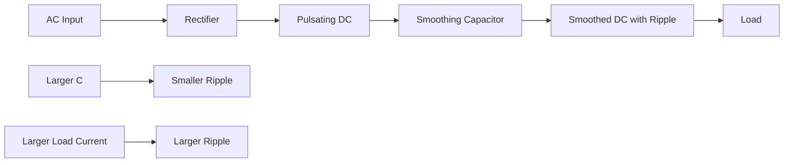

# 1. Overview / 概述

**English:**
This sub-topic explores the practical applications of capacitor charging and discharging in real-world electronic circuits. While the mathematical theory of exponential charging/discharging is essential, understanding how these principles are applied in devices like camera flashes, power supply smoothing, and timing circuits is equally important for A-Level Physics. These applications demonstrate the capacitor's ability to store energy rapidly (flash photography), filter voltage fluctuations (smoothing), and create precise time delays (timing). This leaf node connects the theoretical [[RC Time Constant]] and [[Charging Curve (Exponential Growth)]] to tangible engineering solutions, bridging the gap between abstract physics and practical electronics.

**中文:**
本子知识点探讨电容器充放电在实际电子电路中的具体应用。虽然指数充放电的数学理论至关重要，但理解这些原理如何应用于相机闪光灯、电源平滑和定时电路等设备中，对A-Level物理同样重要。这些应用展示了电容器快速储存能量（闪光摄影）、过滤电压波动（平滑）和产生精确时间延迟（定时）的能力。本节点将理论上的[[RC时间常数]]和[[充电曲线（指数增长）]]与具体的工程解决方案联系起来，弥合了抽象物理与实际电子学之间的差距。

---

# 2. Syllabus Learning Objectives / 考纲学习目标

| CAIE 9702 | Edexcel IAL |
|-----------|-------------|
| 19.3(a): Describe practical applications of capacitors, including flash photography and smoothing | 4.9: Understand the use of capacitors in timing circuits |
| 19.3(b): Explain the use of a capacitor in a camera flash circuit | 4.10: Understand the use of capacitors in smoothing circuits |
| 19.3(c): Explain the use of a capacitor in a smoothing circuit | 4.11: Understand the use of capacitors in flash photography |
| 19.3(d): Describe the effect of changing the capacitance and resistance on the smoothing effect | 4.12: Describe the effect of changing C and R on smoothing |
| 19.3(e): Explain the use of a capacitor in a timing circuit | 4.13: Understand the use of a capacitor in a timing circuit |
| 19.3(f): Describe the use of a capacitor in a potential divider circuit | 4.14: Describe the use of a capacitor in a potential divider circuit |
| 19.3(g): Explain the use of a capacitor in a delay circuit | (Covered in 4.13) |

**Examiner Expectations / 考官期望:**
- **English:** Students must be able to describe the circuit operation, explain the role of the capacitor, and analyze how changing C and R affects performance (e.g., flash recharge time, smoothing ripple, timing period). Qualitative understanding is prioritized over complex calculations, though time constant ($\tau = RC$) is essential.
- **中文:** 学生必须能够描述电路工作原理，解释电容器的作用，并分析改变C和R如何影响性能（例如，闪光灯充电时间、平滑纹波、定时周期）。定性理解优先于复杂计算，但时间常数（$\tau = RC$）是必不可少的。

---

# 3. Core Definitions / 核心定义

| Term (EN/CN) | Definition (EN) | Definition (CN) | Common Mistakes / 常见错误 |
|--------------|-----------------|-----------------|---------------------------|
| **Smoothing** / 平滑 | The process of reducing voltage ripple in a rectified power supply using a capacitor to store charge during peaks and release it during troughs. | 使用电容器在峰值时储存电荷，在谷值时释放电荷，以减少整流电源中电压纹波的过程。 | Confusing smoothing with filtering; smoothing reduces ripple but doesn't eliminate it completely. / 混淆平滑与滤波；平滑减少纹波但不能完全消除。 |
| **Ripple Voltage** / 纹波电压 | The residual AC variation remaining on a DC output after rectification and smoothing. | 整流和平滑后，直流输出上残留的交流变化。 | Thinking ripple is constant; it depends on load current and capacitor size. / 认为纹波是恒定的；它取决于负载电流和电容器大小。 |
| **Flash Recharge Time** / 闪光充电时间 | The time required for a capacitor in a flash circuit to charge to a sufficient voltage (typically ~300 V) to fire the flash tube again. | 闪光电路中的电容器充电到足以再次触发闪光管的电压（通常约300 V）所需的时间。 | Assuming recharge time equals one time constant; it's typically 3-5 time constants for full charge. / 假设充电时间等于一个时间常数；通常需要3-5个时间常数才能充满。 |
| **Timing Circuit** / 定时电路 | A circuit that uses the exponential charging/discharging of a capacitor through a resistor to produce a precise time delay or oscillation period. | 利用电容器通过电阻器的指数充放电来产生精确时间延迟或振荡周期的电路。 | Forgetting that the threshold voltage determines the timing period, not just RC. / 忘记阈值电压决定定时周期，而不仅仅是RC。 |
| **Threshold Voltage** / 阈值电压 | The specific voltage at which a comparator or transistor switches state in a timing circuit. | 在定时电路中，比较器或晶体管切换状态时的特定电压。 | Assuming threshold is always 63% or 50%; it depends on the circuit design. / 假设阈值总是63%或50%；这取决于电路设计。 |
| **Potential Divider with Capacitor** / 含电容器的分压器 | A circuit where a capacitor replaces one resistor in a potential divider, creating a time-dependent output voltage. | 电容器取代分压器中的一个电阻器，产生随时间变化的输出电压的电路。 | Treating the capacitor as a fixed resistor; its impedance varies with time during charging/discharging. / 将电容器视为固定电阻器；其阻抗在充放电过程中随时间变化。 |

---

# 4. Key Concepts Explained / 关键概念详解

## 4.1 Flash Photography / 闪光摄影

### Explanation / 解释
**English:** A camera flash circuit uses a large capacitor (typically 100-1000 μF) charged to a high voltage (around 300 V) through a resistor from a low-voltage battery. A DC-DC converter (boost converter) steps up the battery voltage. The capacitor stores energy slowly over several seconds ($E = \frac{1}{2}CV^2$). When the shutter button is pressed, the capacitor discharges rapidly through the flash tube (xenon gas), producing an intense burst of light lasting about 1/1000 second. The recharge time depends on the [[RC Time Constant]] ($\tau = RC$). A smaller R reduces recharge time but increases current draw from the battery.

**中文:** 相机闪光灯电路使用一个大电容器（通常100-1000 μF）通过电阻器从低压电池充电到高电压（约300 V）。DC-DC转换器（升压转换器）将电池电压升高。电容器在几秒钟内缓慢储存能量（$E = \frac{1}{2}CV^2$）。当按下快门按钮时，电容器通过闪光管（氙气）快速放电，产生持续约1/1000秒的强烈光脉冲。充电时间取决于[[RC时间常数]]（$\tau = RC$）。较小的R可减少充电时间，但会增加电池的电流消耗。

### Physical Meaning / 物理意义
**English:** The capacitor acts as an energy reservoir, storing energy slowly from a low-power source and releasing it rapidly to produce high instantaneous power. This is essential because the battery cannot deliver the high current needed for the flash directly.

**中文:** 电容器充当能量储存器，从低功率源缓慢储存能量，并快速释放以产生高瞬时功率。这是必要的，因为电池无法直接提供闪光所需的高电流。

### Common Misconceptions / 常见误区
- **English:** Students often think the flash tube fires when the capacitor is fully charged. In reality, it fires when the voltage reaches a sufficient threshold (e.g., 300 V), not necessarily 100% charged.
- **中文:** 学生常认为闪光管在电容器充满电时触发。实际上，当电压达到足够阈值（如300 V）时触发，不一定是100%充满。
- **English:** Another misconception is that the flash duration equals the discharge time constant. The flash duration is much shorter because the tube extinguishes once the voltage drops below a sustaining level.
- **中文:** 另一个误区是闪光持续时间等于放电时间常数。闪光持续时间更短，因为一旦电压降至维持水平以下，管子就会熄灭。

### Exam Tips / 考试提示
- **English:** Be able to calculate the energy stored ($E = \frac{1}{2}CV^2$) and relate it to flash brightness. Explain why a larger capacitor gives a brighter flash but longer recharge time.
- **中文:** 能够计算储存的能量（$E = \frac{1}{2}CV^2$）并将其与闪光亮度联系起来。解释为什么更大的电容器提供更亮的闪光但充电时间更长。

> 📷 **IMAGE PROMPT — FP01: Camera Flash Circuit Diagram**
> A schematic diagram showing a battery connected to a DC-DC boost converter, which charges a large capacitor (labeled 470 μF, 330 V) through a resistor. The capacitor is connected in parallel with a xenon flash tube. A trigger circuit (transistor and trigger coil) is shown connected to the flash tube. Arrows indicate the charging path (slow, from battery) and discharging path (fast, through flash tube). Labels: "Energy Storage Capacitor", "Flash Tube (Xenon)", "Trigger Circuit", "DC-DC Converter".

---

## 4.2 Smoothing Circuits / 平滑电路

### Explanation / 解释
**English:** In a power supply, after rectification (converting AC to pulsating DC), a smoothing capacitor is connected in parallel with the load. During the peaks of the rectified waveform, the capacitor charges up. Between peaks, when the rectified voltage falls below the capacitor voltage, the capacitor discharges through the load, maintaining a more constant output voltage. The ripple voltage ($V_{ripple}$) depends on the load current ($I$), capacitance ($C$), and the time between charging peaks ($T$). For a full-wave rectifier, $V_{ripple} \approx \frac{IT}{C}$. A larger capacitance or smaller load current reduces ripple. This connects to the [[Discharging Curve (Exponential Decay)]] concept.

**中文:** 在电源中，整流（将交流转换为脉动直流）后，一个平滑电容器与负载并联连接。在整流波形的峰值期间，电容器充电。在峰值之间，当整流电压降至电容器电压以下时，电容器通过负载放电，维持更恒定的输出电压。纹波电压（$V_{ripple}$）取决于负载电流（$I$）、电容（$C$）和充电峰值之间的时间（$T$）。对于全波整流器，$V_{ripple} \approx \frac{IT}{C}$。更大的电容或更小的负载电流可减少纹波。这与[[放电曲线（指数衰减）]]概念相关。

### Physical Meaning / 物理意义
**English:** The capacitor acts as a temporary voltage source, "filling in the gaps" between the peaks of the rectified waveform. It smooths the output by storing charge when the input is high and releasing it when the input is low.

**中文:** 电容器充当临时电压源，"填补"整流波形峰值之间的间隙。它通过在输入高时储存电荷、输入低时释放电荷来平滑输出。

### Common Misconceptions / 常见误区
- **English:** Students often think a larger capacitor always gives better smoothing. While true, very large capacitors can cause high inrush currents when first connected, potentially damaging diodes.
- **中文:** 学生常认为更大的电容器总是提供更好的平滑。虽然正确，但非常大的电容器在初次连接时可能导致高浪涌电流，可能损坏二极管。
- **English:** Another mistake is assuming the output is perfectly smooth DC. In reality, some ripple always remains, and further regulation may be needed.
- **中文:** 另一个错误是假设输出是完全平滑的直流电。实际上，总会有一些纹波残留，可能需要进一步稳压。

### Exam Tips / 考试提示
- **English:** Be able to sketch the output waveform before and after smoothing. Explain how increasing C or R (load resistance) reduces ripple. Use the approximation $V_{ripple} \approx \frac{IT}{C}$ for calculations.
- **中文:** 能够绘制平滑前后的输出波形。解释增加C或R（负载电阻）如何减少纹波。使用近似公式$V_{ripple} \approx \frac{IT}{C}$进行计算。

> 📷 **IMAGE PROMPT — SM01: Smoothing Circuit Waveforms**
> A graph showing two waveforms: (1) A full-wave rectified output (pulsating DC) with peaks every 10 ms, and (2) The smoothed output after adding a capacitor, showing a much flatter line with small ripple. The capacitor charging and discharging regions are labeled. An inset shows the circuit: a bridge rectifier connected to a transformer, with a capacitor (labeled C) in parallel with a load resistor (labeled R_L). Arrows show current flow during charging and discharging.

---

## 4.3 Timing Circuits / 定时电路

### Explanation / 解释
**English:** Timing circuits use the predictable exponential charging or discharging of a capacitor through a resistor to create precise time delays. A common example is the 555 timer IC in monostable mode. When triggered, the capacitor charges through a resistor until the voltage reaches 2/3 of the supply voltage (the threshold), at which point the timer resets. The timing period is $T = 1.1 RC$ for the 555 timer. In a simple RC delay circuit, a capacitor charges through a resistor until the voltage across it reaches the threshold voltage of a transistor or comparator, which then switches on a load (e.g., a relay or LED). The time delay depends on $\tau = RC$ and the threshold voltage. This is directly linked to the [[Charging Curve (Exponential Growth)]] and [[RC Time Constant]].

**中文:** 定时电路利用电容器通过电阻器的可预测指数充放电来产生精确的时间延迟。一个常见例子是单稳态模式下的555定时器IC。触发时，电容器通过电阻器充电，直到电压达到电源电压的2/3（阈值），此时定时器复位。对于555定时器，定时周期为$T = 1.1 RC$。在简单的RC延迟电路中，电容器通过电阻器充电，直到其两端电压达到晶体管或比较器的阈值电压，然后接通负载（例如继电器或LED）。时间延迟取决于$\tau = RC$和阈值电压。这与[[充电曲线（指数增长）]]和[[RC时间常数]]直接相关。

### Physical Meaning / 物理意义
**English:** The exponential charging curve provides a predictable voltage-time relationship. By setting a threshold voltage, we can convert this continuous curve into a discrete timing event (e.g., turning on a light after a specific delay).

**中文:** 指数充电曲线提供了可预测的电压-时间关系。通过设置阈值电压，我们可以将此连续曲线转换为离散的定时事件（例如，在特定延迟后打开灯）。

### Common Misconceptions / 常见误区
- **English:** Students often think the time delay equals the time constant ($\tau$). In reality, the delay depends on the threshold voltage. For a threshold of 63% of supply voltage, the delay is $\tau$; for 50%, it's $0.69\tau$; for 2/3, it's $1.1\tau$.
- **中文:** 学生常认为时间延迟等于时间常数（$\tau$）。实际上，延迟取决于阈值电压。对于电源电压的63%阈值，延迟为$\tau$；对于50%，为$0.69\tau$；对于2/3，为$1.1\tau$。
- **English:** Another mistake is assuming the capacitor charges linearly. It follows an exponential curve, so the voltage changes fastest at the start and slows down.
- **中文:** 另一个错误是假设电容器线性充电。它遵循指数曲线，因此电压在开始时变化最快，然后减慢。

### Exam Tips / 考试提示
- **English:** Be able to calculate the time delay using $V = V_0(1 - e^{-t/RC})$ for charging or $V = V_0 e^{-t/RC}$ for discharging. Know the 555 timer formula $T = 1.1 RC$ for monostable operation.
- **中文:** 能够使用$V = V_0(1 - e^{-t/RC})$（充电）或$V = V_0 e^{-t/RC}$（放电）计算时间延迟。了解单稳态操作的555定时器公式$T = 1.1 RC$。

> 📷 **IMAGE PROMPT — TC01: RC Timing Circuit with Threshold**
> A circuit diagram showing a resistor R connected to a capacitor C in series with a battery. A comparator (triangle symbol) has its non-inverting input connected to the capacitor, and its inverting input connected to a reference voltage (threshold). The comparator output drives an LED through a transistor. A graph below shows the capacitor voltage rising exponentially from 0 to V_supply, with a horizontal dashed line at the threshold voltage. The time delay (t_d) is marked where the exponential curve crosses the threshold line.

---

# 5. Essential Equations / 核心公式

## 5.1 Energy Stored in Flash Capacitor / 闪光电容器储存的能量

$$ E = \frac{1}{2} C V^2 $$

| Symbol (符号) | Meaning (EN) | Meaning (CN) | Unit (单位) |
|--------------|-------------|-------------|------------|
| $E$ | Energy stored | 储存的能量 | J (joules) |
| $C$ | Capacitance | 电容 | F (farads) |
| $V$ | Voltage across capacitor | 电容器两端电压 | V (volts) |

**Derivation / 推导:** From work done to move charge onto plates: $E = \int_0^Q V \, dq = \int_0^Q \frac{q}{C} \, dq = \frac{Q^2}{2C} = \frac{1}{2}CV^2$.

**Conditions / 适用条件:** Valid for any capacitor at constant capacitance. Assumes linear charge-voltage relationship.

**Limitations / 局限性:** Does not account for energy losses in the circuit (e.g., resistive heating in the charging resistor).

## 5.2 Ripple Voltage Approximation / 纹波电压近似

$$ V_{ripple} \approx \frac{I T}{C} $$

| Symbol (符号) | Meaning (EN) | Meaning (CN) | Unit (单位) |
|--------------|-------------|-------------|------------|
| $V_{ripple}$ | Peak-to-peak ripple voltage | 峰峰值纹波电压 | V |
| $I$ | Load current (constant) | 负载电流（恒定） | A |
| $T$ | Time between charging peaks | 充电峰值之间的时间 | s |
| $C$ | Smoothing capacitance | 平滑电容 | F |

**Derivation / 推导:** For a constant load current, the charge lost during discharge is $\Delta Q = I T$. Since $V = Q/C$, the voltage drop is $\Delta V = \Delta Q / C = IT/C$.

**Conditions / 适用条件:** Valid for full-wave rectification ($T = 10$ ms for 50 Hz mains). Assumes constant load current and linear discharge (good approximation for small ripple).

**Limitations / 局限性:** For large ripple, the discharge is exponential, not linear. The approximation becomes less accurate for very large ripple voltages.

## 5.3 555 Timer Timing Period / 555定时器定时周期

$$ T = 1.1 R C $$

| Symbol (符号) | Meaning (EN) | Meaning (CN) | Unit (单位) |
|--------------|-------------|-------------|------------|
| $T$ | Timing period | 定时周期 | s |
| $R$ | Timing resistor | 定时电阻 | Ω |
| $C$ | Timing capacitor | 定时电容 | F |

**Derivation / 推导:** The 555 timer charges the capacitor to 2/3 of $V_{CC}$ (the threshold). Using $V = V_0(1 - e^{-t/RC})$ with $V = \frac{2}{3}V_0$: $\frac{2}{3} = 1 - e^{-t/RC}$, so $e^{-t/RC} = \frac{1}{3}$, $t = RC \ln 3 \approx 1.1 RC$.

**Conditions / 适用条件:** Specific to the 555 timer IC in monostable mode. Assumes $V_{CC}$ is constant and the threshold is exactly 2/3 $V_{CC}$.

**Limitations / 局限性:** Only applies to the 555 timer. Other timing circuits may have different threshold voltages and thus different formulas.

> 📋 **CIE Only:** CIE 9702 expects students to know the 555 timer formula $T = 1.1 RC$ and be able to use it in calculations.
> 📋 **Edexcel Only:** Edexcel IAL expects qualitative understanding of timing circuits but does not require memorization of the 555 timer formula. However, students should be able to calculate time delays using $V = V_0(1 - e^{-t/RC})$.

---

# 6. Graphs and Relationships / 图表与关系

## 6.1 Smoothing Circuit Output / 平滑电路输出

### Axes / 坐标轴
- **X-axis:** Time (s) / 时间 (s)
- **Y-axis:** Output voltage (V) / 输出电压 (V)

### Shape / 形状
**English:** Before smoothing: a pulsating DC waveform (full-wave rectified) with peaks every 10 ms (for 50 Hz mains). After smoothing: a much flatter waveform with small periodic dips (ripple) corresponding to the capacitor discharging between peaks.

**中文:** 平滑前：脉动直流波形（全波整流），每10 ms出现峰值（50 Hz市电）。平滑后：更平坦的波形，带有与电容器在峰值之间放电相对应的周期性小下降（纹波）。

### Gradient Meaning / 斜率含义
**English:** The slope of the discharge portion indicates the rate of voltage drop. A steeper slope means faster discharge (higher load current or smaller capacitance).

**中文:** 放电部分的斜率表示电压下降速率。更陡的斜率意味着更快的放电（更高的负载电流或更小的电容）。

### Area Meaning / 面积含义
**English:** The area under the ripple waveform represents the charge lost by the capacitor during discharge between peaks.

**中文:** 纹波波形下的面积表示电容器在峰值之间放电期间损失的电荷。

### Exam Interpretation / 考试解读
**English:** Be able to sketch the output waveform for different capacitor values. A larger capacitor gives smaller ripple (flatter output). A larger load current gives larger ripple (more droop between peaks).

**中文:** 能够绘制不同电容值下的输出波形。更大的电容器产生更小的纹波（更平坦的输出）。更大的负载电流产生更大的纹波（峰值之间下降更多）。



---

# 7. Required Diagrams / 必备图表

## 7.1 Camera Flash Circuit / 相机闪光灯电路

### Description / 描述
**English:** A schematic diagram showing the complete camera flash circuit: battery, DC-DC boost converter, charging resistor, energy storage capacitor, trigger circuit, and xenon flash tube. Arrows indicate the slow charging path and fast discharging path.

**中文:** 显示完整相机闪光灯电路的原理图：电池、DC-DC升压转换器、充电电阻、储能电容器、触发电路和氙气闪光管。箭头表示慢速充电路径和快速放电路径。

### Image Prompt / 图片生成提示
> 📷 **IMAGE PROMPT — FP02: Detailed Camera Flash Circuit**
> A detailed schematic diagram of a camera flash circuit. Left side: a 3V battery connected to a DC-DC boost converter (labeled "Boost Converter") that outputs 300V. The output connects through a 10 kΩ charging resistor to a 470 μF capacitor labeled "Energy Storage Capacitor (C)". The capacitor is in parallel with a xenon flash tube (labeled "Xenon Flash Tube"). A trigger circuit consisting of a transistor, a small trigger capacitor, and a trigger coil is connected to the flash tube. Arrows: thick blue arrows showing slow charging path (battery → boost converter → resistor → capacitor), thick red arrows showing fast discharge path (capacitor → flash tube). Labels: "Slow Charge (2-5 seconds)", "Fast Discharge (1/1000 s)". Voltage labels: "300V across capacitor".

### Labels Required / 需要标注
- Battery / 电池
- DC-DC Boost Converter / DC-DC升压转换器
- Charging Resistor (R) / 充电电阻 (R)
- Energy Storage Capacitor (C) / 储能电容器 (C)
- Trigger Circuit / 触发电路
- Xenon Flash Tube / 氙气闪光管
- Charging path (slow) / 充电路径（慢速）
- Discharging path (fast) / 放电路径（快速）

### Exam Importance / 考试重要性
**English:** High. Students must be able to describe the operation of a flash circuit, explain the role of each component, and discuss the trade-off between flash brightness and recharge time.

**中文:** 高。学生必须能够描述闪光电路的工作原理，解释每个组件的作用，并讨论闪光亮度与充电时间之间的权衡。

## 7.2 Smoothing Circuit with Waveforms / 带波形的平滑电路

### Description / 描述
**English:** A diagram showing a bridge rectifier with a smoothing capacitor, accompanied by input and output waveforms. The input waveform is a full-wave rectified signal. The output waveform shows the smoothed DC with ripple.

**中文:** 显示带有平滑电容器的桥式整流器的图表，附有输入和输出波形。输入波形是全波整流信号。输出波形显示带有纹波的平滑直流电。

### Image Prompt / 图片生成提示
> 📷 **IMAGE PROMPT — SM02: Smoothing Circuit with Input/Output Waveforms**
> Top section: A circuit diagram showing a transformer connected to a bridge rectifier (4 diodes). The rectifier output connects to a smoothing capacitor (labeled C) in parallel with a load resistor (labeled R_L). Bottom section: Two waveforms on the same time axis. Waveform 1 (top): Full-wave rectified output before smoothing - a series of half-sine waves with peaks every 10 ms, ranging from 0V to 12V. Waveform 2 (bottom): Smoothed output - a nearly flat line at about 11V with small periodic dips (ripple) of about 0.5V peak-to-peak. The charging and discharging regions of the capacitor are labeled with arrows. Labels: "Capacitor Charging", "Capacitor Discharging", "Ripple Voltage (V_ripple)".

### Labels Required / 需要标注
- Transformer / 变压器
- Bridge Rectifier (4 diodes) / 桥式整流器（4个二极管）
- Smoothing Capacitor (C) / 平滑电容器 (C)
- Load Resistor (R_L) / 负载电阻 (R_L)
- Input Waveform (pulsating DC) / 输入波形（脉动直流）
- Output Waveform (smoothed DC) / 输出波形（平滑直流）
- Ripple Voltage / 纹波电压
- Charging / Discharging regions / 充电/放电区域

### Exam Importance / 考试重要性
**English:** Very high. This is a classic exam question. Students must be able to sketch the waveforms, explain the smoothing process, and describe the effect of changing C or R_L.

**中文:** 非常高。这是一个经典的考试题目。学生必须能够绘制波形，解释平滑过程，并描述改变C或R_L的影响。

---

# 8. Worked Examples / 典型例题

## Example 1: Flash Photography Energy and Recharge Time / 闪光摄影能量与充电时间

### Question / 题目
**English:** A camera flash circuit uses a 470 μF capacitor charged to 300 V. The charging resistor is 10 kΩ.
(a) Calculate the energy stored in the capacitor when fully charged.
(b) Calculate the time constant of the charging circuit.
(c) Estimate the time required for the capacitor to reach 95% of its final voltage.
(d) If the photographer wants a faster recharge time, should they increase or decrease the charging resistor? Explain.

**中文:** 一个相机闪光灯电路使用一个470 μF的电容器充电到300 V。充电电阻为10 kΩ。
(a) 计算电容器充满电时储存的能量。
(b) 计算充电电路的时间常数。
(c) 估算电容器达到其最终电压的95%所需的时间。
(d) 如果摄影师想要更快的充电时间，应该增加还是减少充电电阻？解释原因。

### Solution / 解答

**(a) Energy stored / 储存的能量:**
$$ E = \frac{1}{2} C V^2 = \frac{1}{2} \times (470 \times 10^{-6}) \times (300)^2 $$
$$ E = \frac{1}{2} \times 470 \times 10^{-6} \times 90,000 $$
$$ E = \frac{1}{2} \times 42.3 = 21.15 \text{ J} $$

**Answer:** 21.2 J (3 s.f.) | **答案：** 21.2 J (3位有效数字)

**(b) Time constant / 时间常数:**
$$ \tau = RC = (10 \times 10^3) \times (470 \times 10^{-6}) = 4.7 \text{ s} $$

**Answer:** 4.7 s | **答案：** 4.7 s

**(c) Time to reach 95% / 达到95%的时间:**
Using $V = V_0(1 - e^{-t/RC})$:
$$ 0.95 V_0 = V_0(1 - e^{-t/4.7}) $$
$$ 0.95 = 1 - e^{-t/4.7} $$
$$ e^{-t/4.7} = 0.05 $$
$$ -\frac{t}{4.7} = \ln(0.05) = -2.996 $$
$$ t = 4.7 \times 2.996 \approx 14.1 \text{ s} $$

**Answer:** 14.1 s | **答案：** 14.1 s

**(d) Faster recharge / 更快的充电:**
**English:** To reduce recharge time, the photographer should decrease the charging resistor. This reduces the time constant ($\tau = RC$), allowing the capacitor to charge faster. However, a smaller resistor will draw more current from the battery, potentially draining it faster.

**中文:** 为了减少充电时间，摄影师应该减少充电电阻。这会减少时间常数（$\tau = RC$），使电容器充电更快。然而，更小的电阻器会从电池中汲取更多电流，可能更快地耗尽电池。

### Quick Tip / 提示
**English:** Remember that "fully charged" in practice means reaching a voltage close to the supply voltage. For flash circuits, the flash can fire once the voltage reaches a sufficient threshold (e.g., 95% of final voltage), not necessarily 100%.

**中文:** 记住，在实践中"充满电"意味着达到接近电源电压的电压。对于闪光电路，一旦电压达到足够的阈值（例如最终电压的95%），闪光灯就可以触发，不一定是100%。

---

## Example 2: Smoothing Circuit Ripple Calculation / 平滑电路纹波计算

### Question / 题目
**English:** A full-wave rectifier with a smoothing capacitor supplies a constant load current of 50 mA. The mains frequency is 50 Hz. The smoothing capacitor has a capacitance of 1000 μF.
(a) Calculate the time between charging peaks.
(b) Estimate the peak-to-peak ripple voltage.
(c) Explain how the ripple voltage would change if the capacitance were increased to 2000 μF.
(d) Explain how the ripple voltage would change if the load current increased to 100 mA.

**中文:** 一个带有平滑电容器的全波整流器提供50 mA的恒定负载电流。市电频率为50 Hz。平滑电容器的电容为1000 μF。
(a) 计算充电峰值之间的时间。
(b) 估算峰峰值纹波电压。
(c) 解释如果电容增加到2000 μF，纹波电压将如何变化。
(d) 解释如果负载电流增加到100 mA，纹波电压将如何变化。

### Solution / 解答

**(a) Time between charging peaks / 充电峰值之间的时间:**
For full-wave rectification, the time between peaks is half the mains period:
$$ T = \frac{1}{2f} = \frac{1}{2 \times 50} = \frac{1}{100} = 0.01 \text{ s} = 10 \text{ ms} $$

**Answer:** 10 ms | **答案：** 10 ms

**(b) Ripple voltage / 纹波电压:**
$$ V_{ripple} \approx \frac{I T}{C} = \frac{(50 \times 10^{-3}) \times 0.01}{1000 \times 10^{-6}} $$
$$ V_{ripple} = \frac{5 \times 10^{-4}}{10^{-3}} = 0.5 \text{ V} $$

**Answer:** 0.5 V | **答案：** 0.5 V

**(c) Effect of increasing C / 增加C的影响:**
**English:** If the capacitance is doubled to 2000 μF, the ripple voltage will halve to 0.25 V. This is because $V_{ripple} \propto 1/C$. A larger capacitor stores more charge, so it can supply the same load current for longer with less voltage drop.

**中文:** 如果电容加倍到2000 μF，纹波电压将减半到0.25 V。这是因为$V_{ripple} \propto 1/C$。更大的电容器储存更多电荷，因此可以在更长时间内以更小的电压降提供相同的负载电流。

**(d) Effect of increasing load current / 增加负载电流的影响:**
**English:** If the load current doubles to 100 mA, the ripple voltage will double to 1.0 V. This is because $V_{ripple} \propto I$. A higher load current drains the capacitor faster between peaks, causing a larger voltage drop.

**中文:** 如果负载电流加倍到100 mA，纹波电压将加倍到1.0 V。这是因为$V_{ripple} \propto I$。更高的负载电流在峰值之间更快地耗尽电容器，导致更大的电压降。

### Quick Tip / 提示
**English:** The approximation $V_{ripple} \approx IT/C$ assumes the capacitor discharges linearly. This is valid when the ripple is small compared to the DC voltage. For large ripple, the exponential nature of discharge becomes significant.

**中文:** 近似公式$V_{ripple} \approx IT/C$假设电容器线性放电。当纹波相对于直流电压较小时，这是有效的。对于大纹波，放电的指数性质变得显著。

---

# 9. Past Paper Question Types / 历年真题题型

| Question Type / 题型 | Frequency / 频率 | Difficulty / 难度 | Past Paper References / 真题索引 |
|----------------------|------------------|------------------|-------------------------------|
| Describe operation of flash circuit / 描述闪光电路工作原理 | High / 高 | Medium / 中等 | 📝 *待填入* |
| Calculate energy stored in flash capacitor / 计算闪光电容器储存的能量 | High / 高 | Easy / 简单 | 📝 *待填入* |
| Sketch and explain smoothing waveforms / 绘制并解释平滑波形 | Very High / 非常高 | Medium / 中等 | 📝 *待填入* |
| Calculate ripple voltage / 计算纹波电压 | Medium / 中等 | Medium / 中等 | 📝 *待填入* |
| Explain effect of changing C or R on smoothing / 解释改变C或R对平滑的影响 | High / 高 | Easy / 简单 | 📝 *待填入* |
| Calculate time delay in RC timing circuit / 计算RC定时电路中的时间延迟 | Medium / 中等 | Hard / 困难 | 📝 *待填入* |
| 555 timer timing period calculation / 555定时器定时周期计算 | Low (CIE) / 低 (CIE) | Medium / 中等 | 📝 *待填入* |
| Explain trade-offs in circuit design / 解释电路设计中的权衡 | Medium / 中等 | Hard / 困难 | 📝 *待填入* |

**Common Command Words / 常见指令词:**
- **English:** Describe, Explain, Calculate, Sketch, Show, Determine, Discuss
- **中文:** 描述，解释，计算，绘制，证明，确定，讨论

---

# 10. Practical Skills Connections / 实验技能链接

**English:**
This sub-topic connects to practical work in several ways:

1. **Oscilloscope Measurements:** Students can observe the charging/discharging of a capacitor in real-time using an oscilloscope. For timing circuits, measure the time delay between trigger and output. For smoothing circuits, observe the ripple voltage and measure its amplitude.

2. **Component Selection:** Practical understanding of how changing R and C affects circuit behavior. Students should be able to select appropriate component values for a given application (e.g., choosing a capacitor for a specific flash recharge time).

3. **Uncertainty Analysis:** When measuring time delays or ripple voltages, students should consider uncertainties in component values (e.g., capacitor tolerance ±20%) and measurement errors.

4. **Graph Plotting:** Plotting charging/discharging curves from experimental data and determining the time constant from the graph.

5. **Circuit Construction:** Building simple timing circuits (e.g., 555 timer) or smoothing circuits on a breadboard and testing their performance.

**中文:**
本子知识点通过多种方式与实验工作联系：

1. **示波器测量：** 学生可以使用示波器实时观察电容器的充放电。对于定时电路，测量触发和输出之间的时间延迟。对于平滑电路，观察纹波电压并测量其幅度。

2. **元件选择：** 实际理解改变R和C如何影响电路行为。学生应该能够为给定应用选择合适的元件值（例如，为特定的闪光充电时间选择电容器）。

3. **不确定度分析：** 在测量时间延迟或纹波电压时，学生应考虑元件值的不确定度（例如，电容器容差±20%）和测量误差。

4. **图表绘制：** 从实验数据绘制充放电曲线，并从图表确定时间常数。

5. **电路搭建：** 在面包板上构建简单的定时电路（例如555定时器）或平滑电路，并测试其性能。

---

# 11. Concept Map / 概念图谱

```mermaid
graph TD
    %% Core concept
    A[Applications of Capacitor Charging/Discharging] --> B[Flash Photography]
    A --> C[Smoothing Circuits]
    A --> D[Timing Circuits]
    
    %% Flash Photography connections
    B --> B1[Energy Storage: E = ½CV²]
    B --> B2[Slow Charge via R]
    B --> B3[Fast Discharge through Flash Tube]
    B --> B4[Recharge Time: ~5τ]
    B2 --> B5[[RC Time Constant]]
    B3 --> B6[[Discharging Curve (Exponential Decay)]]
    
    %% Smoothing connections
    C --> C1[Rectified AC Input]
    C --> C2[Capacitor Charges at Peaks]
    C --> C3[Capacitor Discharges between Peaks]
    C --> C4[Ripple Voltage: V ≈ IT/C]
    C2 --> C5[[Charging Curve (Exponential Growth)]]
    C3 --> C6[[Discharging Curve (Exponential Decay)]]
    C4 --> C7[Effect of C and Load on Ripple]
    
    %% Timing connections
    D --> D1[Exponential Charging/Discharging]
    D --> D2[Threshold Voltage Detection]
    D --> D3[Time Delay Calculation]
    D --> D4[555 Timer: T = 1.1RC]
    D1 --> D5[[Charging Curve (Exponential Growth)]]
    D1 --> D6[[Discharging Curve (Exponential Decay)]]
    D2 --> D7[Comparator or Transistor]
    
    %% Prerequisites
    B1 --> E[[Energy Stored in a Capacitor]]
    C --> F[[Capacitance and Capacitors]]
    D --> F
    
    %% Sibling links
    B5 --> G[[RC Time Constant]]
    C6 --> G
    D5 --> G
    D6 --> G
    
    %% Styling
    classDef app fill:#e1f5fe,stroke:#01579b,stroke-width:2px;
    classDef theory fill:#fff3e0,stroke:#e65100,stroke-width:1px;
    classDef sibling fill:#f3e5f5,stroke:#7b1fa2,stroke-width:1px;
    class A,B,C,D app;
    class B1,B2,B3,B4,C1,C2,C3,C4,D1,D2,D3,D4 theory;
    class B5,B6,C5,C6,C7,D5,D6,D7,E,F,G sibling;
```

---

# 12. Quick Revision Sheet / 速查表

| Category / 类别 | Key Points / 要点 |
|----------------|------------------|
| **Definition / 定义** | **Flash:** Capacitor stores energy slowly, releases rapidly for bright flash. **Smoothing:** Capacitor reduces voltage ripple in rectified power supplies. **Timing:** Capacitor's exponential charging creates predictable time delays. / **闪光：** 电容器缓慢储存能量，快速释放以产生明亮闪光。**平滑：** 电容器减少整流电源中的电压纹波。**定时：** 电容器的指数充电产生可预测的时间延迟。 |
| **Key Formula / 核心公式** | Flash energy: $E = \frac{1}{2}CV^2$; Ripple: $V_{ripple} \approx \frac{IT}{C}$; 555 Timer: $T = 1.1RC$; Charging: $V = V_0(1 - e^{-t/RC})$; Discharging: $V = V_0 e^{-t/RC}$ / 闪光能量：$E = \frac{1}{2}CV^2$；纹波：$V_{ripple} \approx \frac{IT}{C}$；555定时器：$T = 1.1RC$；充电：$V = V_0(1 - e^{-t/RC})$；放电：$V = V_0 e^{-t/RC}$ |
| **Key Graph / 核心图表** | Smoothing: Pulsating DC input → Smoothed DC with ripple output. Timing: Exponential charging curve with threshold voltage marking time delay. / 平滑：脉动直流输入 → 带有纹波的平滑直流输出。定时：指数充电曲线，阈值电压标记时间延迟。 |
| **Exam Tip / 考试提示** | Always relate circuit behavior to $\tau = RC$. For smoothing, larger C or R_L reduces ripple. For flash, larger C gives brighter flash but longer recharge. For timing, delay depends on both RC and threshold voltage. / 始终将电路行为与$\tau = RC$联系起来。对于平滑，更大的C或R_L减少纹波。对于闪光，更大的C提供更亮的闪光但更长的充电时间。对于定时，延迟取决于RC和阈值电压。 |
| **Common Mistake / 常见错误** | Confusing charging and discharging equations. Forgetting that flash recharge time is ~5τ, not 1τ. Assuming ripple is eliminated completely by smoothing. / 混淆充电和放电方程。忘记闪光充电时间约为5τ，而不是1τ。假设平滑完全消除了纹波。 |
| **Practical Tip / 实验提示** | Use oscilloscope to observe charging/discharging. Measure time constant from graph (63% of final value). For smoothing, observe ripple reduction with larger capacitor. / 使用示波器观察充放电。从图表测量时间常数（最终值的63%）。对于平滑，观察更大电容器带来的纹波减少。 |