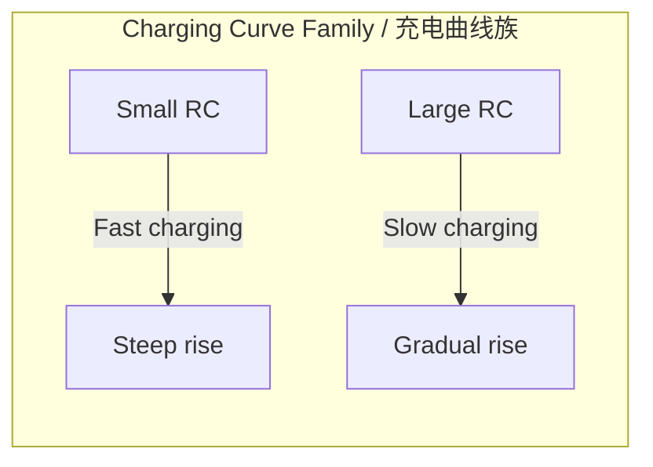

# 1. Overview / 概述

**English:**
The charging curve of a capacitor describes how the potential difference ($V_C$) across the capacitor and the charge ($Q$) stored on it increase exponentially over time when connected to a DC supply through a resistor. This sub-topic focuses specifically on the **exponential growth** phase — from the moment the switch is closed ($t=0$) until the capacitor is fully charged. Understanding this curve is essential for analysing RC circuits, predicting charging times, and designing timing circuits. The charging curve is the inverse of the [[Discharging Curve (Exponential Decay)]] and is governed by the [[RC Time Constant]].

**中文:**
电容器的充电曲线描述了当电容器通过电阻连接到直流电源时，其两端的电势差 ($V_C$) 和储存的电荷 ($Q$) 随时间呈指数增长的过程。本子知识点专门关注**指数增长**阶段——从开关闭合瞬间 ($t=0$) 到电容器完全充电。理解这条曲线对于分析RC电路、预测充电时间以及设计定时电路至关重要。充电曲线是[[放电曲线（指数衰减）]]的逆过程，受[[RC时间常数]]控制。

---

# 2. Syllabus Learning Objectives / 考纲学习目标

| CAIE 9702 | Edexcel IAL |
|-----------|-------------|
| 19.3(a): Show an understanding of the exponential nature of capacitor charging | 4.9: Understand the exponential nature of capacitor charging |
| 19.3(b): Derive and use the equation $V = V_0(1 - e^{-t/RC})$ | 4.10: Use the equation $V = V_0(1 - e^{-t/RC})$ |
| 19.3(c): Sketch and interpret the charging curve | 4.11: Sketch and interpret graphs of $V$, $Q$, and $I$ against $t$ during charging |
| 19.3(d): Define and use the time constant $\tau = RC$ | 4.12: Define and use the time constant $\tau = RC$ |
| 19.3(e): Determine the time constant from the charging curve | 4.13: Determine the time constant from experimental data |
| 19.3(f): Explain the effect of changing $R$ or $C$ on charging | 4.14: Explain the effect of changing $R$ or $C$ on charging time |
| 19.3(g): Solve problems involving charging capacitors | — |

**Examiner Expectations / 考官期望:**
- **EN:** Students must be able to derive the exponential equation from the differential equation, sketch the curve accurately, and calculate values at specific times (e.g., $t = \tau$, $t = 2\tau$). The time constant is the key parameter.
- **CN:** 学生必须能够从微分方程推导指数方程，准确绘制曲线，并计算特定时间（例如 $t = \tau$, $t = 2\tau$）的值。时间常数是关键参数。

---

# 3. Core Definitions / 核心定义

| Term (EN/CN) | Definition (EN) | Definition (CN) | Common Mistakes / 常见错误 |
|--------------|-----------------|-----------------|---------------------------|
| **Charging Curve** / 充电曲线 | A graph showing the exponential increase of $V_C$ or $Q$ with time when a capacitor is charged through a resistor. | 显示电容器通过电阻充电时，$V_C$ 或 $Q$ 随时间呈指数增长的图表。 | Confusing with the linear charging of an ideal capacitor (no resistor). |
| **Time Constant ($\tau$)** / 时间常数 | The time taken for the capacitor to charge to 63.2% of its final voltage (or for the current to fall to 36.8% of its initial value). | 电容器充电至最终电压的63.2%（或电流降至初始值的36.8%）所需的时间。 | Thinking $\tau$ is the time to fully charge (it's not — it takes ~5$\tau$). |
| **Exponential Growth** / 指数增长 | A process where the rate of change of a quantity is proportional to the difference between its current value and its final value. | 一个量的变化率与其当前值和最终值之差成正比的过程。 | Confusing with exponential decay (which has a negative exponent). |
| **Final Voltage ($V_0$)** / 最终电压 | The maximum voltage across the capacitor when fully charged, equal to the supply EMF. | 电容器完全充电时的最大电压，等于电源电动势。 | Forgetting that $V_C$ cannot exceed the supply voltage. |
| **Initial Current ($I_0$)** / 初始电流 | The maximum current at $t=0$, given by $I_0 = V_0/R$. | $t=0$ 时的最大电流，由 $I_0 = V_0/R$ 给出。 | Using $C$ instead of $R$ in the calculation. |

---

# 4. Key Concepts Explained / 关键概念详解

## 4.1 Exponential Growth of Voltage and Charge / 电压和电荷的指数增长

### Explanation / 解释
**English:** When a capacitor is charged through a resistor, the voltage across it does not jump instantly to the supply voltage $V_0$. Instead, it follows an exponential growth curve described by:

$$ V_C(t) = V_0(1 - e^{-t/RC}) $$

Similarly, the charge $Q$ follows:

$$ Q(t) = CV_0(1 - e^{-t/RC}) = Q_0(1 - e^{-t/RC}) $$

where $Q_0 = CV_0$ is the final charge. The current, however, decays exponentially:

$$ I(t) = \frac{V_0}{R}e^{-t/RC} = I_0 e^{-t/RC} $$

This is because as the capacitor charges, the voltage across it opposes the supply, reducing the net voltage across the resistor and hence the current. The rate of charging slows down over time — this is the hallmark of exponential growth. For more on the current decay, see [[Discharging Curve (Exponential Decay)]].

**中文:** 当电容器通过电阻充电时，其两端的电压不会瞬间跳变到电源电压 $V_0$。相反，它遵循指数增长曲线：

$$ V_C(t) = V_0(1 - e^{-t/RC}) $$

类似地，电荷 $Q$ 遵循：

$$ Q(t) = CV_0(1 - e^{-t/RC}) = Q_0(1 - e^{-t/RC}) $$

其中 $Q_0 = CV_0$ 是最终电荷。然而，电流呈指数衰减：

$$ I(t) = \frac{V_0}{R}e^{-t/RC} = I_0 e^{-t/RC} $$

这是因为随着电容器充电，其两端的电压与电源电压相反，减少了电阻两端的净电压，从而减少了电流。充电速率随时间减慢——这是指数增长的特征。有关电流衰减的更多信息，请参见[[放电曲线（指数衰减）]]。

### Physical Meaning / 物理意义
**English:** The exponential growth reflects the fact that the charging rate depends on how much "room" is left for more charge. Initially, the capacitor is empty, so the charging rate is maximum. As charge accumulates, the repulsive force from already stored charge slows down further charging. This is analogous to filling a bucket with water through a narrow pipe — the water level rises quickly at first, then slows as the bucket fills.

**中文:** 指数增长反映了这样一个事实：充电速率取决于还有多少“空间”可以容纳更多电荷。最初，电容器是空的，因此充电速率最大。随着电荷积累，已储存电荷的排斥力减缓了进一步充电。这类似于通过窄管向水桶注水——水位最初上升很快，然后随着水桶装满而减慢。

### Common Misconceptions / 常见误区
- **EN:** "The capacitor charges linearly." → No, it's exponential. Only with a constant current source (not a resistor) would it be linear.
- **CN:** "电容器线性充电。" → 不对，它是指数增长。只有使用恒流源（没有电阻）时才是线性的。
- **EN:** "At $t = \tau$, the capacitor is fully charged." → No, it's only 63.2% charged. Full charge takes about $5\tau$.
- **CN:** "在 $t = \tau$ 时，电容器完全充电。" → 不对，它只充到63.2%。完全充电需要大约 $5\tau$。
- **EN:** "The current also grows exponentially." → No, the current decays exponentially from its maximum.
- **CN:** "电流也呈指数增长。" → 不对，电流从其最大值呈指数衰减。

### Exam Tips / 考试提示
- **EN:** Always check whether the question asks for $V_C$, $Q$, or $I$. The equations are different. For $V_C$ and $Q$, use $(1 - e^{-t/RC})$; for $I$, use $e^{-t/RC}$.
- **CN:** 始终检查题目问的是 $V_C$、$Q$ 还是 $I$。方程不同。对于 $V_C$ 和 $Q$，使用 $(1 - e^{-t/RC})$；对于 $I$，使用 $e^{-t/RC}$。
- **EN:** When sketching, remember the curve starts at (0,0) for $V_C$ and $Q$, and asymptotically approaches $V_0$ or $Q_0$.
- **CN:** 绘图时，记住 $V_C$ 和 $Q$ 的曲线从 (0,0) 开始，并渐近地接近 $V_0$ 或 $Q_0$。

> 📷 **IMAGE PROMPT — CHG-01: Charging Curve of a Capacitor**
> A clear graph showing the exponential growth of voltage across a capacitor during charging. X-axis: time (t), Y-axis: voltage (V_C). The curve starts at (0,0), rises steeply initially, then gradually flattens as it approaches the supply voltage V_0. Mark the point at t = τ where V_C = 0.632V_0 with a dashed line. Also show the asymptote at V = V_0. Include labels for the time constant and the final voltage.

---

# 5. Essential Equations / 核心公式

## Equation 1: Voltage During Charging / 充电过程中的电压

$$ V_C(t) = V_0(1 - e^{-t/RC}) $$

| Symbol (符号) | Meaning (EN) | Meaning (CN) | Unit (单位) |
|--------------|-------------|-------------|------------|
| $V_C(t)$ | Voltage across capacitor at time $t$ | 电容器在时间 $t$ 两端的电压 | V (伏特) |
| $V_0$ | Supply voltage (final voltage) | 电源电压（最终电压） | V (伏特) |
| $t$ | Time elapsed since charging started | 自充电开始以来经过的时间 | s (秒) |
| $R$ | Resistance in series with capacitor | 与电容器串联的电阻 | Ω (欧姆) |
| $C$ | Capacitance | 电容 | F (法拉) |

**Derivation / 推导:**
From Kirchhoff's voltage law: $V_0 = V_R + V_C = IR + \frac{Q}{C}$
Since $I = \frac{dQ}{dt}$: $V_0 = R\frac{dQ}{dt} + \frac{Q}{C}$
Rearranging: $\frac{dQ}{dt} = \frac{V_0}{R} - \frac{Q}{RC}$
This is a first-order differential equation. Solving with initial condition $Q(0) = 0$ gives $Q(t) = CV_0(1 - e^{-t/RC})$, and since $V_C = Q/C$, we get $V_C(t) = V_0(1 - e^{-t/RC})$.

**Conditions / 适用条件:**
- **EN:** Valid for a capacitor charging through a resistor from a constant DC voltage source. Assumes ideal components (no internal resistance of the supply).
- **CN:** 适用于电容器通过电阻从恒定直流电压源充电的情况。假设理想元件（电源无内阻）。

**Limitations / 局限性:**
- **EN:** Does not account for leakage current in the capacitor or the internal resistance of the power supply.
- **CN:** 未考虑电容器中的漏电流或电源的内阻。

## Equation 2: Charge During Charging / 充电过程中的电荷

$$ Q(t) = Q_0(1 - e^{-t/RC}) $$

where $Q_0 = CV_0$

| Symbol (符号) | Meaning (EN) | Meaning (CN) | Unit (单位) |
|--------------|-------------|-------------|------------|
| $Q(t)$ | Charge on capacitor at time $t$ | 电容器在时间 $t$ 的电荷 | C (库仑) |
| $Q_0$ | Final charge ($CV_0$) | 最终电荷 ($CV_0$) | C (库仑) |

## Equation 3: Current During Charging / 充电过程中的电流

$$ I(t) = I_0 e^{-t/RC} $$

where $I_0 = V_0/R$

| Symbol (符号) | Meaning (EN) | Meaning (CN) | Unit (单位) |
|--------------|-------------|-------------|------------|
| $I(t)$ | Current at time $t$ | 时间 $t$ 的电流 | A (安培) |
| $I_0$ | Initial current ($V_0/R$) | 初始电流 ($V_0/R$) | A (安培) |

> 📷 **IMAGE PROMPT — CHG-02: Current Decay During Capacitor Charging**
> A graph showing the exponential decay of current during capacitor charging. X-axis: time (t), Y-axis: current (I). The curve starts at I_0 on the Y-axis, decays rapidly, then gradually approaches zero. Mark the point at t = τ where I = 0.368I_0 with a dashed line. Include the equation I = I_0 e^{-t/RC} as an annotation.

---

# 6. Graphs and Relationships / 图表与关系

## 6.1 Voltage-Time Graph / 电压-时间图

### Axes / 坐标轴
- **X-axis:** Time ($t$) / 时间 ($t$)
- **Y-axis:** Voltage across capacitor ($V_C$) / 电容器两端电压 ($V_C$)

### Shape / 形状
**EN:** Exponential growth curve starting from (0,0), rising steeply initially, then gradually flattening to approach $V_0$ asymptotically. The curve never actually reaches $V_0$, but gets arbitrarily close after about $5\tau$.

**CN:** 指数增长曲线，从 (0,0) 开始，最初急剧上升，然后逐渐变平，渐近地接近 $V_0$。曲线实际上从未达到 $V_0$，但在大约 $5\tau$ 后无限接近。

### Gradient Meaning / 斜率含义
**EN:** The gradient $\frac{dV_C}{dt}$ represents the rate of change of voltage. It is maximum at $t=0$ and decreases to zero as $t \to \infty$. The gradient at any point is proportional to the current at that instant.

**CN:** 梯度 $\frac{dV_C}{dt}$ 表示电压的变化率。它在 $t=0$ 时最大，并随着 $t \to \infty$ 减小到零。任何点的梯度与该时刻的电流成正比。

### Area Meaning / 面积含义
**EN:** The area under the $V_C$-$t$ graph has no direct physical meaning in this context. However, the area under the $I$-$t$ graph gives the total charge stored.

**CN:** 在此上下文中，$V_C$-$t$ 图下的面积没有直接的物理意义。然而，$I$-$t$ 图下的面积给出了储存的总电荷。

### Exam Interpretation / 考试解读
- **EN:** Be able to sketch this graph for different values of $R$ or $C$. A larger $R$ or $C$ means a larger time constant $\tau = RC$, so the curve rises more slowly.
- **CN:** 能够为不同的 $R$ 或 $C$ 值绘制此图。较大的 $R$ 或 $C$ 意味着较大的时间常数 $\tau = RC$，因此曲线上升得更慢。



## 6.2 Current-Time Graph / 电流-时间图

### Axes / 坐标轴
- **X-axis:** Time ($t$) / 时间 ($t$)
- **Y-axis:** Current ($I$) / 电流 ($I$)

### Shape / 形状
**EN:** Exponential decay curve starting from $I_0 = V_0/R$ on the Y-axis, decaying rapidly, then gradually approaching zero.

**CN:** 指数衰减曲线，从 Y 轴上的 $I_0 = V_0/R$ 开始，迅速衰减，然后逐渐接近零。

### Gradient Meaning / 梯度含义
**EN:** The gradient $\frac{dI}{dt}$ is negative and represents how quickly the current is decreasing. It is steepest (most negative) at $t=0$.

**CN:** 梯度 $\frac{dI}{dt}$ 为负，表示电流减小的速度。它在 $t=0$ 时最陡（最负）。

### Area Meaning / 面积含义
**EN:** The area under the $I$-$t$ graph from $t=0$ to $t$ gives the charge stored up to that time. The total area under the entire curve equals $Q_0 = CV_0$.

**CN:** $I$-$t$ 图从 $t=0$ 到 $t$ 的面积给出了到该时间为止储存的电荷。整条曲线下的总面积等于 $Q_0 = CV_0$。

### Exam Interpretation / 考试解读
- **EN:** A common exam question asks to find the charge stored by calculating the area under the $I$-$t$ graph using counting squares or the trapezium rule.
- **CN:** 一个常见的考试题目要求通过使用数方格法或梯形法则计算 $I$-$t$ 图下的面积来找到储存的电荷。

---

# 7. Required Diagrams / 必备图表

## 7.1 Charging Circuit Diagram / 充电电路图

### Description / 描述
**EN:** A circuit diagram showing a capacitor $C$ in series with a resistor $R$ and a DC power supply $V_0$, with a switch. The switch is initially open, and when closed, the capacitor begins to charge.

**中文:** 电路图显示电容器 $C$ 与电阻 $R$ 和直流电源 $V_0$ 串联，带有一个开关。开关最初断开，闭合时电容器开始充电。

### Image Prompt / 图片生成提示
> 📷 **IMAGE PROMPT — CHG-03: Capacitor Charging Circuit**
> A simple circuit diagram for capacitor charging. Components: a DC voltage source (battery symbol) labeled V_0, a switch (open position), a resistor labeled R, and a capacitor labeled C, all connected in series. Use standard circuit symbols. Include arrows to show the direction of conventional current flow when the switch is closed. The circuit should be a simple loop.

### Labels Required / 需要标注
- **EN:** $V_0$ (supply voltage), $R$ (resistor), $C$ (capacitor), switch, direction of current $I$
- **CN:** $V_0$（电源电压），$R$（电阻），$C$（电容器），开关，电流方向 $I$

### Exam Importance / 考试重要性
- **EN:** Essential for understanding the setup. Often asked to draw or interpret this circuit in exam questions.
- **CN:** 对于理解设置至关重要。考试题目中经常要求绘制或解释此电路。

## 7.2 Charging Curve with Time Constant Marked / 带时间常数标记的充电曲线

### Description / 描述
**EN:** A voltage-time graph for capacitor charging, with the time constant $\tau = RC$ clearly marked. At $t = \tau$, $V_C = 0.632V_0$. At $t = 2\tau$, $V_C = 0.865V_0$. At $t = 3\tau$, $V_C = 0.950V_0$. At $t = 5\tau$, $V_C \approx 0.993V_0$ (effectively fully charged).

**中文:** 电容器充电的电压-时间图，清楚地标有时间常数 $\tau = RC$。在 $t = \tau$ 时，$V_C = 0.632V_0$。在 $t = 2\tau$ 时，$V_C = 0.865V_0$。在 $t = 3\tau$ 时，$V_C = 0.950V_0$。在 $t = 5\tau$ 时，$V_C \approx 0.993V_0$（实际上完全充电）。

### Image Prompt / 图片生成提示
> 📷 **IMAGE PROMPT — CHG-04: Charging Curve with Time Constant Markers**
> An exponential growth graph for capacitor charging. X-axis: time (t) from 0 to 6τ. Y-axis: voltage (V_C) from 0 to V_0. The curve rises from (0,0) and approaches V_0. Mark vertical dashed lines at t = τ, 2τ, 3τ, and 5τ. At each marker, show the corresponding voltage value: 0.632V_0 at τ, 0.865V_0 at 2τ, 0.950V_0 at 3τ, and 0.993V_0 at 5τ. Include a horizontal dashed line at V = V_0 as the asymptote. Use different colors for the markers.

### Labels Required / 需要标注
- **EN:** $\tau$, $2\tau$, $3\tau$, $5\tau$, $0.632V_0$, $0.865V_0$, $0.950V_0$, $0.993V_0$, asymptote $V = V_0$
- **CN:** $\tau$, $2\tau$, $3\tau$, $5\tau$, $0.632V_0$, $0.865V_0$, $0.950V_0$, $0.993V_0$, 渐近线 $V = V_0$

### Exam Importance / 考试重要性
- **EN:** Very high. Students must know the key values at multiples of $\tau$ and be able to determine $\tau$ from a graph.
- **CN:** 非常高。学生必须知道 $\tau$ 的倍数处的关键值，并能够从图中确定 $\tau$。

---

# 8. Worked Examples / 典型例题

## Example 1: Calculating Voltage at a Given Time / 计算给定时间的电压

### Question / 题目
**English:**
A $100\ \mu\text{F}$ capacitor is charged through a $10\ \text{k}\Omega$ resistor from a $12\ \text{V}$ DC supply. Calculate:
(a) The time constant of the circuit.
(b) The voltage across the capacitor after 1.5 seconds.
(c) The time taken for the capacitor to reach 9.0 V.

**中文:**
一个 $100\ \mu\text{F}$ 的电容器通过一个 $10\ \text{k}\Omega$ 的电阻从 $12\ \text{V}$ 的直流电源充电。计算：
(a) 电路的时间常数。
(b) 1.5 秒后电容器两端的电压。
(c) 电容器达到 9.0 V 所需的时间。

### Solution / 解答

**(a) Time constant / 时间常数**

$$ \tau = RC = (10 \times 10^3) \times (100 \times 10^{-6}) = 1.0\ \text{s} $$

**Answer:** $\tau = 1.0\ \text{s}$ | **答案：** $\tau = 1.0\ \text{s}$

**(b) Voltage after 1.5 s / 1.5 秒后的电压**

Using $V_C(t) = V_0(1 - e^{-t/RC})$:

$$ V_C(1.5) = 12(1 - e^{-1.5/1.0}) = 12(1 - e^{-1.5}) $$

$$ e^{-1.5} = 0.2231 $$

$$ V_C(1.5) = 12(1 - 0.2231) = 12 \times 0.7769 = 9.32\ \text{V} $$

**Answer:** $V_C = 9.32\ \text{V}$ | **答案：** $V_C = 9.32\ \text{V}$

**(c) Time to reach 9.0 V / 达到 9.0 V 所需的时间**

$$ 9.0 = 12(1 - e^{-t/1.0}) $$

$$ \frac{9.0}{12} = 1 - e^{-t} $$

$$ 0.75 = 1 - e^{-t} $$

$$ e^{-t} = 0.25 $$

$$ -t = \ln(0.25) $$

$$ t = -\ln(0.25) = \ln(4) = 1.39\ \text{s} $$

**Answer:** $t = 1.39\ \text{s}$ | **答案：** $t = 1.39\ \text{s}$

### Quick Tip / 提示
- **EN:** When solving for time, always rearrange to isolate $e^{-t/RC}$ first, then take natural logs. Remember $-\ln(x) = \ln(1/x)$.
- **CN:** 求解时间时，始终先重新排列以隔离 $e^{-t/RC}$，然后取自然对数。记住 $-\ln(x) = \ln(1/x)$。

---

## Example 2: Determining Time Constant from a Graph / 从图中确定时间常数

### Question / 题目
**English:**
A capacitor is charged through a resistor. The graph of voltage against time shows that after 2.0 seconds, the voltage is 7.58 V. The supply voltage is 12.0 V. Determine the time constant of the circuit.

**中文:**
一个电容器通过一个电阻充电。电压-时间图显示，2.0 秒后电压为 7.58 V。电源电压为 12.0 V。确定电路的时间常数。

### Solution / 解答

Using $V_C(t) = V_0(1 - e^{-t/RC})$:

$$ 7.58 = 12.0(1 - e^{-2.0/\tau}) $$

$$ \frac{7.58}{12.0} = 1 - e^{-2.0/\tau} $$

$$ 0.6317 = 1 - e^{-2.0/\tau} $$

$$ e^{-2.0/\tau} = 0.3683 $$

$$ -\frac{2.0}{\tau} = \ln(0.3683) $$

$$ -\frac{2.0}{\tau} = -0.9986 $$

$$ \tau = \frac{2.0}{0.9986} = 2.00\ \text{s} $$

**Answer:** $\tau = 2.0\ \text{s}$ | **答案：** $\tau = 2.0\ \text{s}$

**Alternative method / 替代方法:**
Notice that $7.58\ \text{V} \approx 0.632 \times 12.0\ \text{V} = 7.58\ \text{V}$. This is exactly the voltage at $t = \tau$. Therefore, $\tau = 2.0\ \text{s}$.

**Answer:** $\tau = 2.0\ \text{s}$ (by inspection) | **答案：** $\tau = 2.0\ \text{s}$（通过观察）

### Quick Tip / 提示
- **EN:** If the voltage is exactly $0.632V_0$, the time elapsed is exactly $\tau$. This is the fastest way to find $\tau$ from a graph.
- **CN:** 如果电压正好是 $0.632V_0$，则经过的时间正好是 $\tau$。这是从图中找到 $\tau$ 的最快方法。

---

# 9. Past Paper Question Types / 历年真题题型

| Question Type / 题型 | Frequency / 频率 | Difficulty / 难度 | Past Paper References / 真题索引 |
|----------------------|------------------|------------------|-------------------------------|
| Calculate voltage/charge/current at a given time | Very High | Medium | 📝 *待填入* |
| Determine time constant from graph or data | High | Medium | 📝 *待填入* |
| Sketch charging curves for different R or C values | Medium | Medium | 📝 *待填入* |
| Derive the exponential equation | Low | Hard | 📝 *待填入* |
| Explain the effect of changing R or C | Medium | Easy | 📝 *待填入* |
| Calculate area under I-t graph to find charge | Medium | Medium | 📝 *待填入* |

**Common Command Words / 常见指令词:**
- **EN:** Calculate, Determine, Sketch, Derive, Explain, Show that, Find
- **CN:** 计算，确定，绘制，推导，解释，证明，求

---

# 10. Practical Skills Connections / 实验技能链接

**English:**
This sub-topic connects to practical work in several ways:

1. **Measuring the charging curve:** Use a data logger or oscilloscope to record $V_C$ vs $t$ during charging. Connect the circuit as shown in [[Charging Circuit Diagram]].
2. **Determining $\tau$ experimentally:** From the $V_C$-$t$ graph, find the time when $V_C = 0.632V_0$. Alternatively, plot $\ln(V_0 - V_C)$ against $t$ to get a straight line with gradient $-1/RC$.
3. **Uncertainties:** The main uncertainty comes from reading the voltage and time from the graph. Use error bars and line of best fit.
4. **Graph plotting:** Plot $V_C$ on the y-axis and $t$ on the x-axis. The curve should be smooth and asymptotic.
5. **Experimental design:** Choose $R$ and $C$ values such that $\tau$ is measurable (e.g., 1-10 seconds) with the available equipment.

**中文:**
本子知识点在多个方面与实验工作相关：

1. **测量充电曲线：** 使用数据记录器或示波器记录充电过程中的 $V_C$ 与 $t$ 的关系。按照[[充电电路图]]连接电路。
2. **实验确定 $\tau$：** 从 $V_C$-$t$ 图中，找到 $V_C = 0.632V_0$ 时的时间。或者，绘制 $\ln(V_0 - V_C)$ 与 $t$ 的关系图，得到一条斜率为 $-1/RC$ 的直线。
3. **不确定度：** 主要不确定度来自从图中读取电压和时间。使用误差棒和最佳拟合线。
4. **绘图：** 在 y 轴上绘制 $V_C$，在 x 轴上绘制 $t$。曲线应平滑且渐近。
5. **实验设计：** 选择 $R$ 和 $C$ 值，使得 $\tau$ 可用现有设备测量（例如 1-10 秒）。

---

# 11. Concept Map / 概念图谱

```mermaid
graph TD
    %% Main node
    CHG[Charging Curve / 充电曲线] --> DEF[Core Definitions / 核心定义]
    CHG --> EQ[Essential Equations / 核心公式]
    CHG --> GR[Graphs / 图表]
    CHG --> EX[Worked Examples / 典型例题]
    
    %% Connections to definitions
    DEF --> TC[Time Constant τ / 时间常数 τ]
    DEF --> EG[Exponential Growth / 指数增长]
    DEF --> FV[Final Voltage V₀ / 最终电压 V₀]
    
    %% Connections to equations
    EQ --> V_EQ[V_C = V₀(1 - e^{-t/RC})]
    EQ --> Q_EQ[Q = Q₀(1 - e^{-t/RC})]
    EQ --> I_EQ[I = I₀e^{-t/RC}]
    
    %% Connections to graphs
    GR --> VG[V-t Graph / V-t 图]
    GR --> IG[I-t Graph / I-t 图]
    VG --> SHAPE[Exponential Growth / 指数增长]
    IG --> SHAPE2[Exponential Decay / 指数衰减]
    
    %% Connections to parent and siblings
    CHG --> PARENT[[Charging and Discharging Capacitors]]
    CHG --> SIB1[[RC Time Constant]]
    CHG --> SIB2[[Discharging Curve (Exponential Decay)]]
    CHG --> SIB3[[Graphical Analysis of Charging/Discharging]]
    
    %% Prerequisites
    CHG --> PRE1[[Capacitance and Capacitors]]
    CHG --> PRE2[[Energy Stored in a Capacitor]]
    
    %% Practical connections
    CHG --> PRAC[Practical Skills / 实验技能]
    PRAC --> MEAS[Measurement / 测量]
    PRAC --> UNC[Uncertainties / 不确定度]
    
    %% Styling
    classDef main fill:#4a90d9,color:white
    classDef def fill:#e8f4f8,stroke:#4a90d9
    classDef eq fill:#f0f8e8,stroke:#4a90d9
    classDef graph fill:#fff3e0,stroke:#4a90d9
    classDef link fill:#f3e5f5,stroke:#4a90d9
    
    class CHG main
    class DEF,TC,EG,FV def
    class EQ,V_EQ,Q_EQ,I_EQ eq
    class GR,VG,IG,SHAPE,SHAPE2 graph
    class PARENT,SIB1,SIB2,SIB3,PRE1,PRE2,PRAC,MEAS,UNC link
```

---

# 12. Quick Revision Sheet / 速查表

| Category / 类别 | Key Points / 要点 |
|----------------|------------------|
| **Definition / 定义** | Charging curve shows exponential growth of $V_C$ and $Q$; current decays exponentially. / 充电曲线显示 $V_C$ 和 $Q$ 的指数增长；电流呈指数衰减。 |
| **Key Formula / 核心公式** | $V_C = V_0(1 - e^{-t/RC})$, $Q = Q_0(1 - e^{-t/RC})$, $I = I_0 e^{-t/RC}$ |
| **Time Constant / 时间常数** | $\tau = RC$. At $t = \tau$, $V_C = 0.632V_0$, $I = 0.368I_0$. Fully charged at $t \approx 5\tau$. / $\tau = RC$。在 $t = \tau$ 时，$V_C = 0.632V_0$，$I = 0.368I_0$。在 $t \approx 5\tau$ 时完全充电。 |
| **Key Graph / 核心图表** | $V_C$-$t$: Exponential growth from (0,0) to $V_0$. $I$-$t$: Exponential decay from $I_0$ to 0. / $V_C$-$t$：从 (0,0) 到 $V_0$ 的指数增长。$I$-$t$：从 $I_0$ 到 0 的指数衰减。 |
| **Key Values / 关键值** | $t = \tau$: 63.2% charged; $t = 2\tau$: 86.5%; $t = 3\tau$: 95.0%; $t = 5\tau$: 99.3% / $t = \tau$：充电 63.2%；$t = 2\tau$：86.5%；$t = 3\tau$：95.0%；$t = 5\tau$：99.3% |
| **Effect of R or C / R 或 C 的影响** | Larger $R$ or $C$ → larger $\tau$ → slower charging. Smaller $R$ or $C$ → faster charging. / 较大的 $R$ 或 $C$ → 较大的 $\tau$ → 充电较慢。较小的 $R$ 或 $C$ → 充电较快。 |
| **Exam Tip / 考试提示** | Check if question asks for $V_C$, $Q$, or $I$. Use $(1 - e^{-t/RC})$ for $V_C$ and $Q$; use $e^{-t/RC}$ for $I$. / 检查题目问的是 $V_C$、$Q$ 还是 $I$。对于 $V_C$ 和 $Q$ 使用 $(1 - e^{-t/RC})$；对于 $I$ 使用 $e^{-t/RC}$。 |
| **Common Mistake / 常见错误** | Thinking charging is linear; confusing charging and discharging equations. / 认为充电是线性的；混淆充电和放电方程。 |