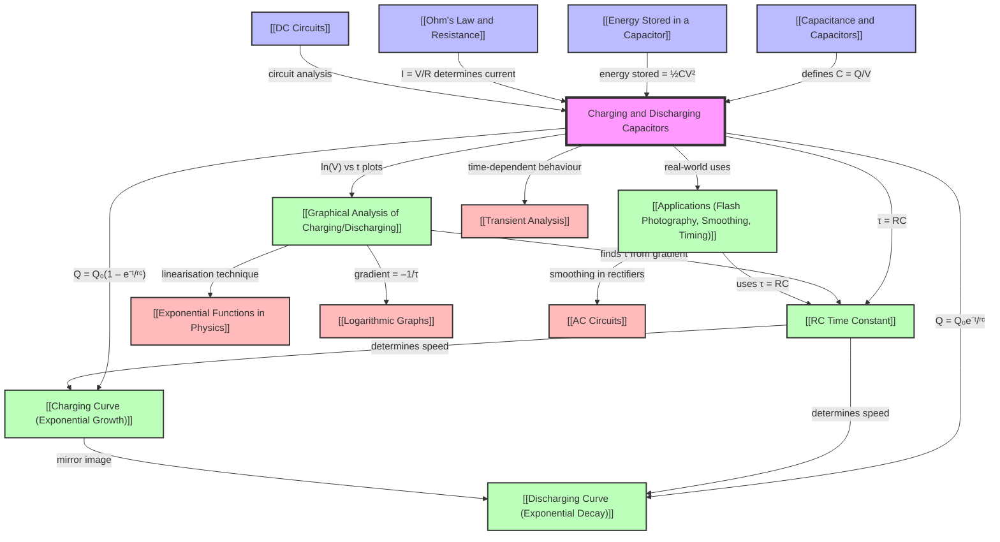

# 1. Overview / 概述

**English:**
This topic explores the transient behaviour of capacitors when they charge and discharge through a resistor. When a capacitor is connected to a DC supply via a resistor, it does not charge instantly; instead, the charge, voltage, and current change exponentially over time. The same exponential behaviour occurs during discharge when the supply is removed. This topic is fundamental to understanding time-dependent circuits, signal processing, and energy storage systems. In Cambridge 9702 (Topic 19.3) and Edexcel IAL (Unit 4, Topics 4.9–4.14), students must derive and apply the exponential equations, analyse charging/discharging curves, calculate the time constant τ = RC, and interpret graphs of Q, V, and I against time. Real-world applications include camera flash units (rapid charging, slow discharge), smoothing capacitors in power supplies, timing circuits (e.g., 555 timer), and defibrillators. This topic bridges [[Capacitance and Capacitors]] and [[Energy Stored in a Capacitor]] with practical circuit analysis.

**中文：**
本专题研究电容器通过电阻充放电时的瞬态行为。当电容器通过电阻连接到直流电源时，它不会瞬间充满；相反，电荷、电压和电流随时间呈指数变化。当电源断开时，放电过程也呈现相同的指数行为。本专题对于理解时变电路、信号处理和储能系统至关重要。在剑桥9702（主题19.3）和爱德思IAL（第4单元，主题4.9–4.14）中，学生必须推导并应用指数方程，分析充放电曲线，计算时间常数 τ = RC，并解释Q、V和I随时间变化的图形。实际应用包括相机闪光灯（快速充电、慢速放电）、电源中的平滑电容器、定时电路（如555定时器）和除颤器。本专题连接了[[Capacitance and Capacitors]]和[[Energy Stored in a Capacitor]]与实际电路分析。

---

# 2. Syllabus Learning Objectives / 考纲学习目标

| CAIE 9702 (19.3 a–g) | Edexcel IAL (WPH14 U4: 4.9–4.14) |
|----------------------|----------------------------------|
| a) Show an understanding of the exponential nature of charging and discharging of a capacitor through a resistor. | 4.9 Understand the exponential nature of charging and discharging of a capacitor through a resistor. |
| b) Derive and use the time constant τ = RC. | 4.10 Derive and use the time constant τ = RC. |
| c) Use the equations for charging: Q = Q₀(1 – e⁻ᵗ/ʳᶜ), V = V₀(1 – e⁻ᵗ/ʳᶜ), I = I₀e⁻ᵗ/ʳᶜ. | 4.11 Use the equations for charging: Q = Q₀(1 – e⁻ᵗ/ʳᶜ), V = V₀(1 – e⁻ᵗ/ʳᶜ), I = I₀e⁻ᵗ/ʳᶜ. |
| d) Use the equations for discharging: Q = Q₀e⁻ᵗ/ʳᶜ, V = V₀e⁻ᵗ/ʳᶜ, I = I₀e⁻ᵗ/ʳᶜ. | 4.12 Use the equations for discharging: Q = Q₀e⁻ᵗ/ʳᶜ, V = V₀e⁻ᵗ/ʳᶜ, I = I₀e⁻ᵗ/ʳᶜ. |
| e) Define the time constant and determine it from graphical data. | 4.13 Define the time constant and determine it from graphical data. |
| f) Sketch and interpret graphs of Q, V, and I against t for charging and discharging. | 4.14 Sketch and interpret graphs of Q, V, and I against t for charging and discharging. |
| g) Solve problems involving the time constant and exponential decay. | (Covered in 4.9–4.14) |

**Examiner Expectations (EN):** Students must be able to derive the exponential equations from the differential equation dQ/dt = –Q/RC (for discharge) and dQ/dt = (V₀ – Q/C)/R (for charging). They must interpret the time constant as the time for Q, V, or I to fall to 1/e (≈ 37%) of its initial value during discharge, or to rise to (1 – 1/e) ≈ 63% of its final value during charging. Graphical analysis includes determining τ from the gradient of ln(Q) vs t or ln(I) vs t plots.

**Examiner Expectations (CN):** 学生必须能够从微分方程 dQ/dt = –Q/RC（放电）和 dQ/dt = (V₀ – Q/C)/R（充电）推导出指数方程。他们必须理解时间常数的含义：放电时Q、V或I下降到初始值的1/e（≈ 37%）所需的时间，或充电时上升到最终值的(1 – 1/e) ≈ 63%所需的时间。图形分析包括从ln(Q) vs t或ln(I) vs t图的斜率确定τ。

> 📋 **CIE Only:** CAIE specifically requires derivation of the exponential equations from the differential equation. Students must also be able to use the equations for both charging and discharging in problem-solving, including cases where the capacitor is initially partially charged.

> 📋 **Edexcel Only:** Edexcel focuses more on application and graphical interpretation. Students must understand the exponential nature but may not be required to derive the equations from first principles. The emphasis is on using the equations to solve problems and interpret experimental data.

---

# 3. Core Definitions / 核心定义

| Term (EN/CN) | Definition (EN) | Definition (CN) | Common Mistakes / 常见错误 |
|--------------|-----------------|-----------------|---------------------------|
| **Time Constant** / 时间常数 | The time required for the charge, voltage, or current to fall to 1/e (≈ 37%) of its initial value during discharge, or to rise to (1 – 1/e) ≈ 63% of its final value during charging. Mathematically, τ = RC. | 在放电过程中，电荷、电压或电流下降到初始值的1/e（≈ 37%）所需的时间；或在充电过程中，上升到最终值的(1 – 1/e) ≈ 63%所需的时间。数学表达式为 τ = RC。 | Confusing τ with half-life. τ is not the time to reach half the final value. For discharge, half-life = τ ln 2 ≈ 0.693τ. |
| **Exponential Decay** / 指数衰减 | A process where a quantity decreases at a rate proportional to its current value, following the equation y = y₀e⁻ᵗ/ʳᶜ. | 一个量以与其当前值成正比的速率减少的过程，遵循方程 y = y₀e⁻ᵗ/ʳᶜ。 | Thinking the decay is linear. The gradient of the decay curve is not constant. |
| **Exponential Growth** / 指数增长 | A process where a quantity approaches a maximum value asymptotically, following the equation y = y₀(1 – e⁻ᵗ/ʳᶜ). | 一个量渐近地接近最大值的过程，遵循方程 y = y₀(1 – e⁻ᵗ/ʳᶜ)。 | Confusing with linear growth. The rate of increase slows down over time. |
| **Initial Current** / 初始电流 | The current at t = 0 when the capacitor is fully uncharged and connected to a supply. I₀ = V₀/R. | 在t = 0时，电容器完全未充电并连接到电源时的电流。I₀ = V₀/R。 | Forgetting that I₀ depends only on V₀ and R, not on C. |
| **Final Voltage** / 最终电压 | The voltage across the capacitor after a long time (t → ∞) when it is fully charged. V_final = V₀ (the supply voltage). | 长时间后（t → ∞）电容器完全充电时的端电压。V_final = V₀（电源电压）。 | Thinking the final voltage depends on R. It does not; only on the supply voltage. |
| **Steady State** / 稳态 | The condition after a long time (t ≫ τ) when the capacitor is fully charged (or fully discharged) and no further change occurs. | 长时间后（t ≫ τ）电容器完全充电（或完全放电）且不再发生变化的状况。 | Assuming steady state is reached exactly at t = 5τ. It is asymptotic. |

---

# 4. Key Concepts Explained / 关键概念详解

## 4.1 Exponential Nature of Charging and Discharging / 充放电的指数特性

### Explanation / 解释
**English:** When a capacitor charges through a resistor, the rate of change of charge is proportional to the difference between the final charge and the current charge. This leads to an exponential approach to the final value. During discharge, the rate of change of charge is proportional to the current charge itself, leading to exponential decay. The fundamental differential equation for discharge is dQ/dt = –Q/RC, which has the solution Q = Q₀e⁻ᵗ/ʳᶜ. For charging, the differential equation is dQ/dt = (V₀ – Q/C)/R, which gives Q = Q₀(1 – e⁻ᵗ/ʳᶜ). This exponential behaviour is characteristic of all first-order RC circuits and is linked to [[RC Time Constant]].

**中文：** 当电容器通过电阻充电时，电荷变化率与最终电荷和当前电荷之差成正比。这导致电荷指数地接近最终值。在放电过程中，电荷变化率与当前电荷本身成正比，导致指数衰减。放电的基本微分方程为 dQ/dt = –Q/RC，其解为 Q = Q₀e⁻ᵗ/ʳᶜ。充电的微分方程为 dQ/dt = (V₀ – Q/C)/R，得到 Q = Q₀(1 – e⁻ᵗ/ʳᶜ)。这种指数行为是所有一阶RC电路的特征，并与[[RC Time Constant]]相关。

### Physical Meaning / 物理意义
**English:** The exponential behaviour arises because the current that charges or discharges the capacitor depends on the voltage across the resistor, which itself depends on the capacitor's voltage. As the capacitor charges, the voltage across the resistor decreases, reducing the current and slowing the charging rate. This creates a self-limiting process. In real life, this explains why a camera flash takes time to recharge, or why a defibrillator must wait between shocks.

**中文：** 指数行为源于充放电电流取决于电阻两端的电压，而该电压又取决于电容器的电压。随着电容器充电，电阻两端的电压减小，电流减小，充电速率减慢。这形成了一个自限过程。在实际生活中，这解释了为什么相机闪光灯需要时间重新充电，或者为什么除颤器在两次电击之间必须等待。

### Common Misconceptions / 常见误区
1. **Linear charging:** Students often think the capacitor charges at a constant rate. In reality, the rate decreases exponentially.
2. **Instantaneous discharge:** Some believe removing the supply instantly discharges the capacitor. In reality, discharge through a resistor takes time.
3. **τ = time to fully charge/discharge:** τ is the time to reach 63% (charge) or 37% (discharge), not 100% or 0%.

### Exam Tips / 考试提示
**English:** Cambridge and Edexcel frequently ask students to sketch the charging/discharging curves and label key points (e.g., at t = τ, t = 2τ, t = 3τ). Be prepared to calculate the charge, voltage, or current at a specific time using the exponential equations. Also, be able to determine τ from experimental data using the gradient of a natural log graph.

**中文：** 剑桥和爱德思经常要求学生绘制充放电曲线并标注关键点（例如在t = τ、t = 2τ、t = 3τ处）。准备好使用指数方程计算特定时间的电荷、电压或电流。同时，能够通过自然对数图的斜率从实验数据中确定τ。

> 📷 **IMAGE PROMPT — [CHG-01]: Exponential Charging and Discharging Curves**
>
> A clear, labelled graph showing two curves on the same axes: an exponential growth curve (charging) rising from 0 to V₀, and an exponential decay curve (discharging) falling from V₀ to 0. The x-axis is labelled "Time / s" and the y-axis "Voltage / V". Key points marked at t = τ (63% and 37%), t = 2τ (86% and 14%), t = 3τ (95% and 5%). The time constant τ is indicated with an arrow. Style: clean, educational diagram with gridlines, suitable for a textbook. Colour scheme: blue for charging, red for discharging.

---

## 4.2 The Time Constant τ = RC / 时间常数 τ = RC

### Explanation / 解释
**English:** The time constant τ is the product of resistance R and capacitance C. It has units of seconds (s). τ determines how quickly the capacitor charges or discharges. A larger τ means slower charging/discharging; a smaller τ means faster. During discharge, after one time constant (t = τ), the charge falls to Q₀e⁻¹ ≈ 0.37Q₀ (37% of initial). During charging, after one time constant, the charge rises to Q₀(1 – e⁻¹) ≈ 0.63Q₀ (63% of final). The time constant is independent of the initial conditions and the supply voltage. This concept is central to [[RC Time Constant]].

**中文：** 时间常数τ是电阻R和电容C的乘积。其单位为秒（s）。τ决定了电容器充放电的快慢。τ越大，充放电越慢；τ越小，充放电越快。在放电过程中，经过一个时间常数（t = τ）后，电荷下降到Q₀e⁻¹ ≈ 0.37Q₀（初始值的37%）。在充电过程中，经过一个时间常数后，电荷上升到Q₀(1 – e⁻¹) ≈ 0.63Q₀（最终值的63%）。时间常数与初始条件和电源电压无关。这个概念是[[RC Time Constant]]的核心。

### Physical Meaning / 物理意义
**English:** τ represents the characteristic timescale of the RC circuit. If R is large, the current is small, so charging/discharging takes longer. If C is large, more charge is needed to reach a given voltage, so charging/discharging also takes longer. In practical terms, τ tells you how long you must wait for a capacitor to charge or discharge to a useful level.

**中文：** τ代表RC电路的特征时间尺度。如果R很大，电流很小，因此充放电需要更长时间。如果C很大，需要更多电荷才能达到给定电压，因此充放电也需要更长时间。在实际应用中，τ告诉你需要等待多长时间才能使电容器充放电到有用水平。

### Common Misconceptions / 常见误区
1. **τ depends on voltage:** τ = RC is independent of voltage. Changing V₀ does not change τ.
2. **τ is the half-life:** The half-life (time to reach 50%) is τ ln 2 ≈ 0.693τ, not τ itself.
3. **τ is the time to fully charge:** The capacitor never fully charges; it approaches the final value asymptotically. After 5τ, it is considered fully charged (99.3%).

### Exam Tips / 考试提示
**English:** You must be able to calculate τ from given R and C values. Also, be able to determine τ from a graph (e.g., the time for voltage to fall to 37% of its initial value, or the gradient of ln(V) vs t). Cambridge often asks students to "determine the time constant from the graph" in Paper 5 practical questions.

**中文：** 你必须能够根据给定的R和C值计算τ。同时，能够从图中确定τ（例如，电压下降到初始值37%所需的时间，或ln(V) vs t图的斜率）。剑桥常在Paper 5实验题中要求学生"从图中确定时间常数"。

---

## 4.3 Charging Equations / 充电方程

### Explanation / 解释
**English:** During charging, the charge Q, voltage V, and current I vary with time according to:
- Q(t) = Q₀(1 – e⁻ᵗ/ʳᶜ)
- V(t) = V₀(1 – e⁻ᵗ/ʳᶜ)
- I(t) = I₀e⁻ᵗ/ʳᶜ

where Q₀ = CV₀ is the final charge, V₀ is the supply voltage, and I₀ = V₀/R is the initial current. Note that the current decays exponentially from its initial value, while the charge and voltage grow exponentially towards their final values. The current is maximum at t = 0 and decreases to zero as the capacitor becomes fully charged. This is detailed in [[Charging Curve (Exponential Growth)]].

**中文：** 在充电过程中，电荷Q、电压V和电流I随时间变化如下：
- Q(t) = Q₀(1 – e⁻ᵗ/ʳᶜ)
- V(t) = V₀(1 – e⁻ᵗ/ʳᶜ)
- I(t) = I₀e⁻ᵗ/ʳᶜ

其中Q₀ = CV₀是最终电荷，V₀是电源电压，I₀ = V₀/R是初始电流。注意，电流从初始值指数衰减，而电荷和电压指数增长至最终值。电流在t = 0时最大，随着电容器完全充电而减小到零。详见[[Charging Curve (Exponential Growth)]]。

### Physical Meaning / 物理意义
**English:** At the start of charging, the capacitor has no charge, so the full supply voltage appears across the resistor, giving maximum current. As charge builds up on the capacitor plates, the capacitor voltage increases, reducing the voltage across the resistor and thus the current. This feedback mechanism causes the exponential approach.

**中文：** 充电开始时，电容器没有电荷，因此电源电压全部加在电阻上，产生最大电流。随着电荷在电容器极板上积累，电容器电压增加，电阻两端的电压减小，从而电流减小。这种反馈机制导致了指数逼近。

### Common Misconceptions / 常见误区
1. **Current is constant during charging:** The current decreases exponentially, not linearly.
2. **Voltage reaches V₀ instantly:** The voltage approaches V₀ asymptotically; it never exactly reaches V₀ in finite time.
3. **I₀ depends on C:** I₀ = V₀/R, which is independent of C. C only affects how long the current flows.

### Exam Tips / 考试提示
**English:** Be prepared to calculate the charge on a capacitor after a given time, or the time required to reach a certain charge. Cambridge often asks students to "show that the time to reach half the final charge is τ ln 2." Also, be able to sketch the charging curves and identify the time constant from the graph.

**中文：** 准备好计算给定时间后电容器上的电荷，或达到特定电荷所需的时间。剑桥常要求学生"证明达到最终电荷一半所需的时间是τ ln 2"。同时，能够绘制充电曲线并从图中识别时间常数。

---

## 4.4 Discharging Equations / 放电方程

### Explanation / 解释
**English:** During discharge, the charge Q, voltage V, and current I all decay exponentially from their initial values:
- Q(t) = Q₀e⁻ᵗ/ʳᶜ
- V(t) = V₀e⁻ᵗ/ʳᶜ
- I(t) = I₀e⁻ᵗ/ʳᶜ

where Q₀ is the initial charge, V₀ is the initial voltage, and I₀ = V₀/R is the initial discharge current. Note that the current direction is opposite to the charging current (the capacitor acts as a source). All three quantities decay to zero asymptotically. This is detailed in [[Discharging Curve (Exponential Decay)]].

**中文：** 在放电过程中，电荷Q、电压V和电流I都从初始值指数衰减：
- Q(t) = Q₀e⁻ᵗ/ʳᶜ
- V(t) = V₀e⁻ᵗ/ʳᶜ
- I(t) = I₀e⁻ᵗ/ʳᶜ

其中Q₀是初始电荷，V₀是初始电压，I₀ = V₀/R是初始放电电流。注意，电流方向与充电电流相反（电容器充当电源）。所有三个量都渐近地衰减到零。详见[[Discharging Curve (Exponential Decay)]]。

### Physical Meaning / 物理意义
**English:** When the supply is removed and the capacitor is connected across a resistor, the stored charge flows through the resistor. The voltage across the capacitor drives the current. As charge leaves the plates, the voltage decreases, reducing the current, which in turn slows the rate of charge loss. This self-limiting process produces exponential decay.

**中文：** 当电源断开且电容器连接到电阻两端时，储存的电荷流过电阻。电容器两端的电压驱动电流。随着电荷离开极板，电压降低，电流减小，进而减缓电荷损失速率。这种自限过程产生指数衰减。

### Common Misconceptions / 常见误区
1. **Discharge is instantaneous:** Discharge through a resistor takes time, determined by τ.
2. **Current is constant during discharge:** The current decreases exponentially.
3. **The capacitor is empty after τ:** After τ, 37% of the charge remains. It takes about 5τ to be effectively empty (99.3% discharged).

### Exam Tips / 考试提示
**English:** You must be able to calculate the charge remaining after a given time, or the time for the charge to fall to a certain fraction. Edexcel often asks students to "determine the time for the voltage to fall to half its initial value" (half-life = τ ln 2). Also, be able to interpret graphs of ln(V) vs t to find τ.

**中文：** 你必须能够计算给定时间后剩余的电荷，或电荷下降到特定比例所需的时间。爱德思常要求学生"确定电压下降到初始值一半所需的时间"（半衰期 = τ ln 2）。同时，能够解释ln(V) vs t图以找到τ。

---

## 4.5 Graphical Analysis / 图形分析

### Explanation / 解释
**English:** Graphical analysis is crucial for determining the time constant and verifying the exponential nature. The key graphs are:
1. **Q, V, I vs t (linear scale):** Exponential curves. For discharge, τ is the time for the quantity to fall to 37% of its initial value. For charge, τ is the time to rise to 63% of its final value.
2. **ln(Q), ln(V), ln(I) vs t:** These produce straight lines with gradient –1/τ. This linearisation confirms exponential decay and allows accurate determination of τ.
3. **log₁₀(Q) vs t:** Also linear, with gradient –1/(τ ln 10). Used in some practical contexts.

This is covered in detail in [[Graphical Analysis of Charging/Discharging]].

**中文：** 图形分析对于确定时间常数和验证指数性质至关重要。关键图形包括：
1. **Q、V、I vs t（线性坐标）：** 指数曲线。对于放电，τ是量下降到初始值37%所需的时间。对于充电，τ是上升到最终值63%所需的时间。
2. **ln(Q)、ln(V)、ln(I) vs t：** 这些产生斜率为–1/τ的直线。这种线性化确认了指数衰减，并允许精确确定τ。
3. **log₁₀(Q) vs t：** 也是直线，斜率为–1/(τ ln 10)。在某些实验中使用。

详见[[Graphical Analysis of Charging/Discharging]]。

### Physical Meaning / 物理意义
**English:** The linearisation of exponential data using natural logarithms is a powerful technique. It allows students to verify the exponential model and determine τ with greater accuracy than reading from the curved graph. The gradient of the ln plot directly gives –1/τ, making τ easy to calculate.

**中文：** 使用自然对数将指数数据线性化是一种强大的技术。它允许学生验证指数模型，并以比从曲线图中读取更高的精度确定τ。ln图的斜率直接给出–1/τ，使τ易于计算。

### Common Misconceptions / 常见误区
1. **ln graph is for charging too:** The ln graph only linearises exponential decay (discharge). For charging, you would plot ln(V₀ – V) vs t.
2. **Gradient is –τ:** The gradient is –1/τ, not –τ.
3. **Any log works:** Only natural log (ln) gives gradient –1/τ. Using log₁₀ gives gradient –1/(τ ln 10).

### Exam Tips / 考试提示
**English:** Cambridge Paper 5 and Edexcel Unit 6 often include practical questions where students must plot ln(V) vs t, calculate the gradient, and determine τ. Be comfortable with error bars, best-fit lines, and calculating uncertainties in τ from the gradient uncertainty.

**中文：** 剑桥Paper 5和爱德思Unit 6常包含实验题，学生必须绘制ln(V) vs t图，计算斜率，并确定τ。要熟悉误差棒、最佳拟合线以及从斜率不确定度计算τ的不确定度。

---

## 4.6 Applications / 应用

### Explanation / 解释
**English:** RC circuits have numerous practical applications:
1. **Camera Flash:** A capacitor charges slowly through a resistor (large τ) and then discharges rapidly through the flash tube (small τ). The flash duration is controlled by the discharge time constant.
2. **Smoothing (Power Supplies):** A capacitor in a rectifier circuit charges when the input voltage rises and discharges when it falls, smoothing out voltage ripples. The time constant must be much larger than the period of the AC input.
3. **Timing Circuits (555 Timer):** The 555 timer uses the charging and discharging of a capacitor to generate precise time delays or oscillations. The frequency is determined by RC values.
4. **Defibrillators:** A capacitor is charged to a high voltage and then discharged through the patient's chest in a controlled pulse.
5. **Touch Sensors:** Some touch sensors use the change in charging time when a finger (adding capacitance) touches a pad.

These are explored in [[Applications (Flash Photography, Smoothing, Timing)]].

**中文：** RC电路有许多实际应用：
1. **相机闪光灯：** 电容器通过电阻缓慢充电（大τ），然后通过闪光管快速放电（小τ）。闪光持续时间由放电时间常数控制。
2. **平滑（电源）：** 整流电路中的电容器在输入电压上升时充电，下降时放电，平滑电压纹波。时间常数必须远大于交流输入的周期。
3. **定时电路（555定时器）：** 555定时器利用电容器的充放电产生精确的时间延迟或振荡。频率由RC值决定。
4. **除颤器：** 电容器充电到高电压，然后通过患者胸部以受控脉冲放电。
5. **触摸传感器：** 一些触摸传感器利用手指（增加电容）触摸垫时充电时间的变化。

详见[[Applications (Flash Photography, Smoothing, Timing)]]。

### Physical Meaning / 物理意义
**English:** The key to all these applications is controlling the time constant τ = RC. By choosing appropriate R and C values, engineers can design circuits that charge or discharge in milliseconds (flash), seconds (timing), or even hours (memory backup).

**中文：** 所有这些应用的关键在于控制时间常数τ = RC。通过选择合适的R和C值，工程师可以设计在毫秒（闪光灯）、秒（定时）甚至小时（内存备份）内充放电的电路。

### Common Misconceptions / 常见误区
1. **Smoothing capacitor charges instantly:** The capacitor takes time to charge; the ripple voltage depends on the time constant relative to the AC period.
2. **Flash capacitor discharges instantly:** The discharge is very fast but not instantaneous; the flash duration is finite.
3. **555 timer uses only charging:** The 555 timer uses both charging and discharging phases to generate its output.

### Exam Tips / 考试提示
**English:** Cambridge and Edexcel often ask students to explain how an RC circuit works in a given application. Be prepared to calculate the time constant for a specific application and explain why a particular τ is chosen (e.g., why τ ≫ T for smoothing). Also, be able to suggest modifications to change the time constant.

**中文：** 剑桥和爱德思常要求学生解释RC电路在给定应用中如何工作。准备好为特定应用计算时间常数，并解释为什么选择特定的τ（例如，为什么平滑需要τ ≫ T）。同时，能够提出修改建议以改变时间常数。

---

# 5. Essential Equations / 核心公式

## 5.1 Time Constant / 时间常数

**Equation / 公式:**
$$ \tau = RC $$

**Variables / 变量:**
| Symbol (符号) | Meaning (EN) | Meaning (CN) | Unit (单位) |
|--------------|-------------|-------------|------------|
| τ | Time constant | 时间常数 | s (秒) |
| R | Resistance | 电阻 | Ω (欧姆) |
| C | Capacitance | 电容 | F (法拉) |

**Derivation / 推导:**
**English:** The time constant arises from the differential equation for capacitor discharge: dQ/dt = –Q/RC. The solution is Q = Q₀e⁻ᵗ/ʳᶜ. The quantity RC has units of seconds because [R] = V/A and [C] = C/V, so [RC] = (V/A)(C/V) = C/A = s (since A = C/s). No further derivation is needed; τ = RC is a definition.

**中文：** 时间常数源于电容器放电的微分方程：dQ/dt = –Q/RC。解为Q = Q₀e⁻ᵗ/ʳᶜ。量RC的单位为秒，因为[R] = V/A，[C] = C/V，所以[RC] = (V/A)(C/V) = C/A = s（因为A = C/s）。无需进一步推导；τ = RC是一个定义。

**Conditions / 适用条件:**
**English:** Valid for any RC circuit where the capacitor charges or discharges through a resistor. R and C must be constant (not time-varying). The circuit must be linear (ohmic resistor, ideal capacitor).

**中文：** 适用于任何电容器通过电阻充放电的RC电路。R和C必须恒定（不随时间变化）。电路必须是线性的（欧姆电阻、理想电容器）。

**Limitations / 局限性:**
**English:** Does not apply if the resistor is non-ohmic (e.g., a diode) or if the capacitor has significant leakage current. Also invalid for circuits with multiple resistors in complex configurations (unless simplified to equivalent R).

**中文：** 不适用于非欧姆电阻（如二极管）或电容器有显著漏电流的情况。对于具有复杂配置的多个电阻的电路也无效（除非简化为等效R）。

**Rearrangements / 变形:**
**English:** R = τ/C, C = τ/R. These are useful for calculating required component values for a desired time constant.

**中文：** R = τ/C，C = τ/R。这些对于计算所需时间常数的元件值很有用。

---

## 5.2 Discharge Equations / 放电方程

**Equation / 公式:**
$$ Q(t) = Q_0 e^{-t/RC} $$
$$ V(t) = V_0 e^{-t/RC} $$
$$ I(t) = I_0 e^{-t/RC} $$

**Variables / 变量:**
| Symbol (符号) | Meaning (EN) | Meaning (CN) | Unit (单位) |
|--------------|-------------|-------------|------------|
| Q(t) | Charge at time t | t时刻的电荷 | C (库仑) |
| Q₀ | Initial charge (at t = 0) | 初始电荷（t = 0时） | C (库仑) |
| V(t) | Voltage at time t | t时刻的电压 | V (伏特) |
| V₀ | Initial voltage (at t = 0) | 初始电压（t = 0时） | V (伏特) |
| I(t) | Current at time t | t时刻的电流 | A (安培) |
| I₀ | Initial current (at t = 0) | 初始电流（t = 0时） | A (安培) |
| t | Time | 时间 | s (秒) |
| R | Resistance | 电阻 | Ω (欧姆) |
| C | Capacitance | 电容 | F (法拉) |

**Derivation / 推导:**
**English:** Starting from the discharge differential equation:
dQ/dt = –I = –V/R = –Q/(RC)
Rearranging: dQ/Q = –dt/(RC)
Integrating: ∫ dQ/Q = –∫ dt/(RC)
ln(Q) = –t/(RC) + constant
At t = 0, Q = Q₀, so constant = ln(Q₀)
Thus: ln(Q/Q₀) = –t/(RC)
Exponentiating: Q = Q₀e⁻ᵗ/ʳᶜ
Since V = Q/C and I = V/R, the other equations follow directly.

**中文：** 从放电微分方程开始：
dQ/dt = –I = –V/R = –Q/(RC)
整理：dQ/Q = –dt/(RC)
积分：∫ dQ/Q = –∫ dt/(RC)
ln(Q) = –t/(RC) + 常数
在t = 0时，Q = Q₀，所以常数 = ln(Q₀)
因此：ln(Q/Q₀) = –t/(RC)
取指数：Q = Q₀e⁻ᵗ/ʳᶜ
由于V = Q/C且I = V/R，其他方程直接得出。

**Conditions / 适用条件:**
**English:** Valid for discharge of a capacitor through a resistor with no other sources in the circuit. The capacitor must be initially charged to Q₀ (or V₀). The resistor must be ohmic.

**中文：** 适用于电容器通过电阻放电且电路中无其他电源的情况。电容器必须初始充电到Q₀（或V₀）。电阻必须是欧姆的。

**Limitations / 局限性:**
**English:** Does not apply if there is a second power source in the discharge path, or if the capacitor is not fully charged initially. Also invalid for non-linear components.

**中文：** 不适用于放电路径中有第二个电源的情况，或电容器初始未完全充电的情况。对于非线性元件也无效。

**Rearrangements / 变形:**
**English:** 
- t = –RC ln(Q/Q₀) = RC ln(Q₀/Q)
- Q₀ = Q eᵗ/ʳᶜ
- ln(Q) = ln(Q₀) – t/RC (linear form for graphical analysis)

**中文：**
- t = –RC ln(Q/Q₀) = RC ln(Q₀/Q)
- Q₀ = Q eᵗ/ʳᶜ
- ln(Q) = ln(Q₀) – t/RC（用于图形分析的线性形式）

---

## 5.3 Charge Equations / 充电方程

**Equation / 公式:**
$$ Q(t) = Q_0 (1 - e^{-t/RC}) $$
$$ V(t) = V_0 (1 - e^{-t/RC}) $$
$$ I(t) = I_0 e^{-t/RC} $$

**Variables / 变量:**
| Symbol (符号) | Meaning (EN) | Meaning (CN) | Unit (单位) |
|--------------|-------------|-------------|------------|
| Q(t) | Charge at time t | t时刻的电荷 | C (库仑) |
| Q₀ | Final charge (as t → ∞) | 最终电荷（t → ∞时） | C (库仑) |
| V(t) | Voltage at time t | t时刻的电压 | V (伏特) |
| V₀ | Supply voltage (final voltage) | 电源电压（最终电压） | V (伏特) |
| I(t) | Current at time t | t时刻的电流 | A (安培) |
| I₀ | Initial current (at t = 0) | 初始电流（t = 0时） | A (安培) |
| t | Time | 时间 | s (秒) |
| R | Resistance | 电阻 | Ω (欧姆) |
| C | Capacitance | 电容 | F (法拉) |

**Derivation / 推导:**
**English:** Starting from the charging differential equation:
dQ/dt = I = (V₀ – V)/R = (V₀ – Q/C)/R = (CV₀ – Q)/(RC)
Let Q₀ = CV₀ (final charge). Then:
dQ/dt = (Q₀ – Q)/(RC)
Rearranging: dQ/(Q₀ – Q) = dt/(RC)
Integrating: –ln(Q₀ – Q) = t/(RC) + constant
At t = 0, Q = 0, so constant = –ln(Q₀)
Thus: –ln(Q₀ – Q) = t/(RC) – ln(Q₀)
ln[(Q₀ – Q)/Q₀] = –t/(RC)
Exponentiating: (Q₀ – Q)/Q₀ = e⁻ᵗ/ʳᶜ
Rearranging: Q = Q₀(1 – e⁻ᵗ/ʳᶜ)

**中文：** 从充电微分方程开始：
dQ/dt = I = (V₀ – V)/R = (V₀ – Q/C)/R = (CV₀ – Q)/(RC)
令Q₀ = CV₀（最终电荷）。则：
dQ/dt = (Q₀ – Q)/(RC)
整理：dQ/(Q₀ – Q) = dt/(RC)
积分：–ln(Q₀ – Q) = t/(RC) + 常数
在t = 0时，Q = 0，所以常数 = –ln(Q₀)
因此：–ln(Q₀ – Q) = t/(RC) – ln(Q₀)
ln[(Q₀ – Q)/Q₀] = –t/(RC)
取指数：(Q₀ – Q)/Q₀ = e⁻ᵗ/ʳᶜ
整理：Q = Q₀(1 – e⁻ᵗ/ʳᶜ)

**Conditions / 适用条件:**
**English:** Valid for charging a capacitor through a resistor from a constant DC voltage source. The capacitor must be initially uncharged (Q = 0 at t = 0). The resistor must be ohmic.

**中文：** 适用于从恒定直流电压源通过电阻给电容器充电的情况。电容器必须初始未充电（t = 0时Q = 0）。电阻必须是欧姆的。

**Limitations / 局限性:**
**English:** Does not apply if the supply voltage is not constant (e.g., AC source), or if the capacitor has an initial charge. Also invalid for non-linear components.

**中文：** 不适用于电源电压不恒定（如交流电源）的情况，或电容器有初始电荷的情况。对于非线性元件也无效。

**Rearrangements / 变形:**
**English:**
- t = –RC ln(1 – Q/Q₀) = RC ln[Q₀/(Q₀ – Q)]
- Q₀ = Q/(1 – e⁻ᵗ/ʳᶜ)
- ln(Q₀ – Q) = ln(Q₀) – t/RC (linear form for graphical analysis of charging)

**中文：**
- t = –RC ln(1 – Q/Q₀) = RC ln[Q₀/(Q₀ – Q)]
- Q₀ = Q/(1 – e⁻ᵗ/ʳᶜ)
- ln(Q₀ – Q) = ln(Q₀) – t/RC（用于充电图形分析的线性形式）

---

## 5.4 Half-Life Relationship / 半衰期关系

**Equation / 公式:**
$$ t_{1/2} = \tau \ln 2 = RC \ln 2 \approx 0.693 RC $$

**Variables / 变量:**
| Symbol (符号) | Meaning (EN) | Meaning (CN) | Unit (单位) |
|--------------|-------------|-------------|------------|
| t₁/₂ | Half-life (time to reach 50% of final value or fall to 50% of initial) | 半衰期（达到最终值50%或下降到初始值50%的时间） | s (秒) |
| τ | Time constant | 时间常数 | s (秒) |
| R | Resistance | 电阻 | Ω (欧姆) |
| C | Capacitance | 电容 | F (法拉) |

**Derivation / 推导:**
**English:** For discharge: Q = Q₀e⁻ᵗ/ʳᶜ. At t = t₁/₂, Q = Q₀/2.
Q₀/2 = Q₀e⁻ᵗ¹/²/ʳᶜ
1/2 = e⁻ᵗ¹/²/ʳᶜ
Taking ln: ln(1/2) = –t₁/₂/RC
–ln 2 = –t₁/₂/RC
t₁/₂ = RC ln 2

For charging: Q = Q₀(1 – e⁻ᵗ/ʳᶜ). At t = t₁/₂, Q = Q₀/2.
Q₀/2 = Q₀(1 – e⁻ᵗ¹/²/ʳᶜ)
1/2 = 1 – e⁻ᵗ¹/²/ʳᶜ
e⁻ᵗ¹/²/ʳᶜ = 1/2
Same result: t₁/₂ = RC ln 2

**中文：** 对于放电：Q = Q₀e⁻ᵗ/ʳᶜ。在t = t₁/₂时，Q = Q₀/2。
Q₀/2 = Q₀e⁻ᵗ¹/²/ʳᶜ
1/2 = e⁻ᵗ¹/²/ʳᶜ
取ln：ln(1/2) = –t₁/₂/RC
–ln 2 = –t₁/₂/RC
t₁/₂ = RC ln 2

对于充电：Q = Q₀(1 – e⁻ᵗ/ʳᶜ)。在t = t₁/₂时，Q = Q₀/2。
Q₀/2 = Q₀(1 – e⁻ᵗ¹/²/ʳᶜ)
1/2 = 1 – e⁻ᵗ¹/²/ʳᶜ
e⁻ᵗ¹/²/ʳᶜ = 1/2
相同结果：t₁/₂ = RC ln 2

**Conditions / 适用条件:**
**English:** Valid for both charging and discharging of an RC circuit. The half-life is the same for both processes.

**中文：** 适用于RC电路的充电和放电。半衰期对于两个过程是相同的。

**Limitations / 局限性:**
**English:** Only applies to exponential growth/decay processes. Not valid for linear or other non-exponential processes.

**中文：** 仅适用于指数增长/衰减过程。不适用于线性或其他非指数过程。

**Rearrangements / 变形:**
**English:** τ = t₁/₂/ln 2 ≈ t₁/₂/0.693. This is useful for finding τ from experimental half-life measurements.

**中文：** τ = t₁/₂/ln 2 ≈ t₁/₂/0.693。这对于从实验半衰期测量中找到τ很有用。

---

# 6. Graphs and Relationships / 图表与关系

## 6.1 Discharge: Q, V, I vs Time (Linear Scale) / 放电：Q、V、I vs 时间（线性坐标）

### Axes / 坐标轴
**English:** x-axis: Time (t) / s; y-axis: Charge (Q) / C, Voltage (V) / V, or Current (I) / A
**中文：** x轴：时间(t) / s；y轴：电荷(Q) / C、电压(V) / V 或电流(I) / A

### Shape / 形状
**English:** Exponential decay curves. All three start at their initial values (Q₀, V₀, I₀) at t = 0 and decay asymptotically towards zero. The curves are steepest at t = 0 and gradually flatten. At t = τ, the value is 37% of the initial. At t = 2τ, it is 14%. At t = 3τ, it is 5%. At t = 5τ, it is < 1%.
**中文：** 指数衰减曲线。三者都在t = 0时从初始值（Q₀、V₀、I₀）开始，渐近地衰减到零。曲线在t = 0时最陡，逐渐变平。在t = τ时，值为初始值的37%。在t = 2τ时，为14%。在t = 3τ时，为5%。在t = 5τ时，小于1%。

### Gradient Meaning / 斜率含义
**English:** The gradient of the Q-t graph is the current (I = dQ/dt). The gradient is negative and its magnitude decreases exponentially. The gradient of the V-t graph is dV/dt = –V/RC. The gradient of the I-t graph is dI/dt = –I/RC.
**中文：** Q-t图的斜率是电流（I = dQ/dt）。斜率为负，其大小指数减小。V-t图的斜率是dV/dt = –V/RC。I-t图的斜率是dI/dt = –I/RC。

### Area Meaning / 面积含义
**English:** The area under the I-t graph from t = 0 to t = T gives the total charge that has flowed through the resistor in that time. The total area under the entire I-t curve (t = 0 to ∞) equals the initial charge Q₀.
**中文：** I-t图从t = 0到t = T的面积给出了在该时间内流过电阻的总电荷。整个I-t曲线（t = 0到∞）下的总面积等于初始电荷Q₀。

### Exam Interpretation / 考试解读
**English:** Students must be able to sketch these curves, label key points (especially at t = τ), and determine τ from the graph (the time for the value to fall to 37% of its initial). Cambridge often asks: "Determine the time constant from the graph."
**中文：** 学生必须能够绘制这些曲线，标注关键点（特别是在t = τ处），并从图中确定τ（值下降到初始值37%所需的时间）。剑桥常问："从图中确定时间常数。"

### Common Questions / 常见问题
**English:** 
1. "Sketch the variation of voltage with time as the capacitor discharges."
2. "Determine the time constant from the graph."
3. "Calculate the initial current."
4. "Find the charge remaining after 3 time constants."
**中文：**
1. "绘制电容器放电时电压随时间变化的草图。"
2. "从图中确定时间常数。"
3. "计算初始电流。"
4. "求3个时间常数后剩余的电荷。"

> 📷 **IMAGE PROMPT — [CHG-02]: Discharge Curves (Q, V, I vs t)**
>
> Three exponential decay curves on separate axes but aligned vertically. Top: Q vs t, starting at Q₀ and decaying to 0. Middle: V vs t, starting at V₀ and decaying to 0. Bottom: I vs t, starting at I₀ and decaying to 0. Each curve has t = τ, t = 2τ, t = 3τ marked with dashed vertical lines. The 37% level is indicated with a horizontal dashed line. Style: clean educational diagram, gridlines, labels in English. Colour: blue for Q, red for V, green for I.

---

## 6.2 Charge: Q, V, I vs Time (Linear Scale) / 充电：Q、V、I vs 时间（线性坐标）

### Axes / 坐标轴
**English:** x-axis: Time (t) / s; y-axis: Charge (Q) / C, Voltage (V) / V, or Current (I) / A
**中文：** x轴：时间(t) / s；y轴：电荷(Q) / C、电压(V) / V 或电流(I) / A

### Shape / 形状
**English:** Q and V follow exponential growth curves, starting at 0 and asymptotically approaching Q₀ and V₀ respectively. I follows an exponential decay curve, starting at I₀ and asymptotically approaching 0. At t = τ, Q and V reach 63% of their final values, and I falls to 37% of I₀. At t = 2τ, Q and V reach 86%, I at 14%. At t = 3τ, Q and V reach 95%, I at 5%.
**中文：** Q和V遵循指数增长曲线，从0开始渐近接近Q₀和V₀。I遵循指数衰减曲线，从I₀开始渐近接近0。在t = τ时，Q和V达到最终值的63%，I下降到I₀的37%。在t = 2τ时，Q和V达到86%，I为14%。在t = 3τ时，Q和V达到95%，I为5%。

### Gradient Meaning / 斜率含义
**English:** The gradient of the Q-t graph is the current (I = dQ/dt). The gradient is positive and decreases exponentially. The gradient of the V-t graph is dV/dt = (V₀ – V)/RC. The gradient of the I-t graph is dI/dt = –I/RC.
**中文：** Q-t图的斜率是电流（I = dQ/dt）。斜率为正，指数减小。V-t图的斜率是dV/dt = (V₀ – V)/RC。I-t图的斜率是dI/dt = –I/RC。

### Area Meaning / 面积含义
**English:** The area under the I-t graph from t = 0 to t = T gives the total charge that has flowed into the capacitor in that time. The total area under the entire I-t curve (t = 0 to ∞) equals the final charge Q₀.
**中文：** I-t图从t = 0到t = T的面积给出了在该时间内流入电容器的总电荷。整个I-t曲线（t = 0到∞）下的总面积等于最终电荷Q₀。

### Exam Interpretation / 考试解读
**English:** Students must be able to sketch these curves, label key points, and determine τ from the graph (the time for the value to rise to 63% of its final value). Cambridge often asks: "Determine the time constant from the charging curve."
**中文：** 学生必须能够绘制这些曲线，标注关键点，并从图中确定τ（值上升到最终值63%所需的时间）。剑桥常问："从充电曲线中确定时间常数。"

### Common Questions / 常见问题
**English:**
1. "Sketch the variation of charge with time as the capacitor charges."
2. "Determine the time constant from the graph."
3. "Calculate the time to reach 90% of the final voltage."
4. "Find the current after 2 time constants."
**中文：**
1. "绘制电容器充电时电荷随时间变化的草图。"
2. "从图中确定时间常数。"
3. "计算达到最终电压90%所需的时间。"
4. "求2个时间常数后的电流。"

> 📷 **IMAGE PROMPT — [CHG-03]: Charging Curves (Q, V, I vs t)**
>
> Three curves on separate axes aligned vertically. Top: Q vs t, starting at 0 and rising asymptotically to Q₀. Middle: V vs t, starting at 0 and rising asymptotically to V₀. Bottom: I vs t, starting at I₀ and decaying to 0. Each curve has t = τ, t = 2τ, t = 3τ marked with dashed vertical lines. The 63% level is indicated with a horizontal dashed line on the Q and V graphs. Style: clean educational diagram, gridlines, labels in English. Colour: blue for Q, red for V, green for I.

---

## 6.3 Natural Log Graphs (Discharge) / 自然对数图（放电）

### Axes / 坐标轴
**English:** x-axis: Time (t) / s; y-axis: ln(Q) / ln(C), ln(V) / ln(V), or ln(I) / ln(A)
**中文：** x轴：时间(t) / s；y轴：ln(Q) / ln(C)、ln(V) / ln(V) 或 ln(I) / ln(A)

### Shape / 形状
**English:** Straight line with negative gradient. The equation is ln(y) = ln(y₀) – t/RC, where y represents Q, V, or I. The y-intercept is ln(y₀), and the gradient is –1/RC = –1/τ.
**中文：** 具有负斜率的直线。方程为ln(y) = ln(y₀) – t/RC，其中y代表Q、V或I。y截距为ln(y₀)，斜率为–1/RC = –1/τ。

### Gradient Meaning / 斜率含义
**English:** The gradient is –1/τ. Therefore, τ = –1/gradient. A steeper (more negative) gradient means a smaller time constant (faster discharge).
**中文：** 斜率为–1/τ。因此，τ = –1/斜率。更陡（更负）的斜率意味着更小的时间常数（放电更快）。

### Area Meaning / 面积含义
**English:** The area under the ln(y) vs t graph has no direct physical meaning.
**中文：** ln(y) vs t图下的面积没有直接的物理意义。

### Exam Interpretation / 考试解读
**English:** This is the most important graph for practical work. Students must plot ln(V) vs t from experimental data, draw a best-fit line, calculate the gradient, and determine τ. Cambridge Paper 5 and Edexcel Unit 6 frequently test this. Students must also calculate uncertainties in τ from the gradient uncertainty.
**中文：** 这是实验工作中最重要的图形。学生必须根据实验数据绘制ln(V) vs t图，绘制最佳拟合线，计算斜率，并确定τ。剑桥Paper 5和爱德思Unit 6经常测试这一点。学生还必须从斜率不确定度计算τ的不确定度。

### Common Questions / 常见问题
**English:**
1. "Plot a graph of ln(V) against t and determine the time constant."
2. "Explain why plotting ln(V) against t gives a straight line."
3. "Determine the initial voltage from the intercept of the ln(V) vs t graph."
4. "Calculate the uncertainty in τ given the uncertainty in the gradient."
**中文：**
1. "绘制ln(V)对t的图并确定时间常数。"
2. "解释为什么绘制ln(V)对t的图得到一条直线。"
3. "从ln(V) vs t图的截距确定初始电压。"
4. "给定斜率的不确定度，计算τ的不确定度。"

> 📷 **IMAGE PROMPT — [CHG-04]: Natural Log Graph for Discharge**
>
> A straight line graph of ln(V) vs t with negative gradient. The y-intercept is labelled ln(V₀). The gradient is calculated and shown as –1/τ. Error bars are shown on some data points. A best-fit line is drawn through the points. The axes are labelled "Time / s" and "ln(V / V)". Style: scientific graph with gridlines, suitable for a practical worksheet. Colour: black line on white background.

---

## 6.4 Natural Log Graph for Charging / 充电的自然对数图

### Axes / 坐标轴
**English:** x-axis: Time (t) / s; y-axis: ln(V₀ – V) / ln(V), or ln(Q₀ – Q) / ln(C)
**中文：** x轴：时间(t) / s；y轴：ln(V₀ – V) / ln(V) 或 ln(Q₀ – Q) / ln(C)

### Shape / 形状
**English:** Straight line with negative gradient. The equation is ln(V₀ – V) = ln(V₀) – t/RC. The y-intercept is ln(V₀), and the gradient is –1/RC = –1/τ.
**中文：** 具有负斜率的直线。方程为ln(V₀ – V) = ln(V₀) – t/RC。y截距为ln(V₀)，斜率为–1/RC = –1/τ。

### Gradient Meaning / 斜率含义
**English:** The gradient is –1/τ. Therefore, τ = –1/gradient. This is the same as for the discharge ln graph.
**中文：** 斜率为–1/τ。因此，τ = –1/斜率。这与放电ln图相同。

### Area Meaning / 面积含义
**English:** The area under this graph has no direct physical meaning.
**中文：** 该图下的面积没有直接的物理意义。

### Exam Interpretation / 考试解读
**English:** Less common than the discharge ln graph, but still examinable. Students must understand that plotting ln(V₀ – V) vs t linearises the charging curve. The gradient gives –1/τ, and the intercept gives ln(V₀).
**中文：** 不如放电ln图常见，但仍可考。学生必须理解绘制ln(V₀ – V) vs t可以将充电曲线线性化。斜率给出–1/τ，截距给出ln(V₀)。

### Common Questions / 常见问题
**English:**
1. "Show that ln(V₀ – V) = ln(V₀) – t/RC for a charging capacitor."
2. "Explain how you would determine the time constant from a charging experiment."
**中文：**
1. "证明对于充电电容器，ln(V₀ – V) = ln(V₀) – t/RC。"
2. "解释如何从充电实验中确定时间常数。"

---

# 7. Required Diagrams / 必备图表

## 7.1 RC Charging Circuit / RC充电电路

### Description / 描述
**English:** A circuit diagram showing a DC voltage source (battery), a resistor R, a capacitor C, and a switch. The switch has two positions: one connecting the battery to the RC series circuit (charging), and one connecting the capacitor across the resistor only (discharging). A voltmeter is connected across the capacitor to measure V(t). An ammeter may be included in series to measure I(t).
**中文：** 电路图显示直流电压源（电池）、电阻R、电容器C和一个开关。开关有两个位置：一个将电池连接到RC串联电路（充电），另一个将电容器仅连接到电阻两端（放电）。电压表并联在电容器两端以测量V(t)。电流表可以串联以测量I(t)。

### Image Prompt / 图片生成提示
> 📷 **IMAGE PROMPT — [CHG-05]: RC Charging/Discharging Circuit**
>
> A clean circuit diagram showing a 6V DC battery symbol, a single-pole double-throw (SPDT) switch, a resistor (labelled R), a capacitor (labelled C), and connecting wires. The switch has two positions: position A connects the battery to the RC series circuit; position B connects the capacitor directly across the resistor (discharge path). A voltmeter is connected in parallel with the capacitor. An ammeter is shown in series with the resistor. All components are clearly labelled. Style: standard circuit diagram, black lines on white background, suitable for a textbook. Labels in English.

### Labels Required / 需要标注
**English:** Battery (V₀), Switch (positions A and B), Resistor (R), Capacitor (C), Voltmeter (V), Ammeter (A)
**中文：** 电池(V₀)、开关（位置A和B）、电阻(R)、电容器(C)、电压表(V)、电流表(A)

### Exam Importance / 考试重要性
**English:** This is the fundamental circuit for all RC experiments. Cambridge Paper 5 and Edexcel Unit 6 practicals often require students to set up this circuit, take readings, and analyse the data. Understanding the circuit is essential for interpreting experimental results.
**中文：** 这是所有RC实验的基本电路。剑桥Paper 5和爱德思Unit 6实验常要求学生搭建此电路、读取数据并分析结果。理解该电路对于解释实验结果至关重要。

---

## 7.2 Charging and Discharging Curves (Combined) / 充放电曲线（组合）

### Description / 描述
**English:** A single graph showing both the charging and discharging curves for voltage (or charge) on the same axes. The charging curve rises from 0 to V₀, and the discharging curve falls from V₀ to 0. The time constant τ is indicated on both curves. The graph shows that the charging and discharging processes are mirror images of each other (exponential growth vs exponential decay).
**中文：** 同一坐标轴上显示电压（或电荷）的充电和放电曲线的单一图形。充电曲线从0上升到V₀，放电曲线从V₀下降到0。两条曲线上都标出了时间常数τ。该图显示充电和放电过程互为镜像（指数增长与指数衰减）。

### Image Prompt / 图片生成提示
> 📷 **IMAGE PROMPT — [CHG-06]: Combined Charging and Discharging Curves**
>
> A single graph with two curves: an exponential growth curve (charging) in blue rising from 0 to V₀, and an exponential decay curve (discharging) in red falling from V₀ to 0. The x-axis is labelled "Time / s" and the y-axis "Voltage / V". The time constant τ is marked with a vertical dashed line at t = τ. On the charging curve, the point (τ, 0.63V₀) is marked. On the discharging curve, the point (τ, 0.37V₀) is marked. Horizontal dashed lines at 0.37V₀ and 0.63V₀ are shown. Style: clean educational diagram, gridlines, labels in English. Colour: blue for charging, red for discharging.

### Labels Required / 需要标注
**English:** V₀ (final voltage), 0.63V₀ (charging at t = τ), 0.37V₀ (discharging at t = τ), τ (time constant), Charging curve, Discharging curve
**中文：** V₀（最终电压）、0.63V₀（t = τ时充电）、0.37V₀（t = τ时放电）、τ（时间常数）、充电曲线、放电曲线

### Exam Importance / 考试重要性
**English:** This combined graph helps students visualise the relationship between charging and discharging. It is often used in exam questions to test understanding of the time constant and the exponential nature of both processes.
**中文：** 这种组合图帮助学生直观理解充电和放电之间的关系。它常用于考试题中测试对时间常数和两个过程的指数性质的理解。

---

## 7.3 Natural Log Graph for Discharge / 放电的自然对数图

### Description / 描述
**English:** A graph of ln(V) against time t for a discharging capacitor. The data points should show a linear relationship with a negative gradient. A best-fit line is drawn through the points. The y-intercept is ln(V₀), and the gradient is –1/τ. Error bars may be shown on the data points to represent measurement uncertainty.
**中文：** 放电电容器的ln(V)对时间t的图。数据点应显示具有负斜率的线性关系。通过点绘制最佳拟合线。y截距为ln(V₀)，斜率为–1/τ。数据点上可显示误差棒以表示测量不确定度。

### Image Prompt / 图片生成提示
> 📷 **IMAGE PROMPT — [CHG-07]: ln(V) vs t Graph for Discharge**
>
> A scatter graph with 8–10 data points showing a linear trend with negative gradient. A best-fit straight line is drawn through the points. The y-intercept is clearly marked as ln(V₀) ≈ 2.0 (assuming V₀ ≈ 7.4 V). The gradient is calculated and displayed: gradient = –0.25 s⁻¹, so τ = 4.0 s. Error bars (vertical) are shown on each data point. The axes are labelled "Time / s" and "ln(V / V)". Style: scientific graph, suitable for a practical report. Colour: black points, red best-fit line.

### Labels Required / 需要标注
**English:** ln(V₀) (y-intercept), Gradient = –1/τ, τ = –1/gradient, Data points with error bars, Best-fit line
**中文：** ln(V₀)（y截距）、斜率 = –1/τ、τ = –1/斜率、带误差棒的数据点、最佳拟合线

### Exam Importance / 考试重要性
**English:** This is the most commonly tested graph in practical exams. Students must be able to plot this graph, calculate the gradient, determine τ, and estimate uncertainties. Cambridge Paper 5 and Edexcel Unit 6 both feature this type of analysis.
**中文：** 这是实验考试中最常测试的图形。学生必须能够绘制此图、计算斜率、确定τ并估计不确定度。剑桥Paper 5和爱德思Unit 6都包含此类分析。

---

# 8. Worked Examples / 典型例题

## Example 1: Discharge of a Capacitor / 例1：电容器放电

### Question / 题目
**English:** A 100 μF capacitor is charged to a voltage of 12 V. It is then discharged through a 50 kΩ resistor.
(a) Calculate the time constant of the discharge circuit.
(b) Calculate the voltage across the capacitor 5.0 s after discharge begins.
(c) Calculate the time taken for the voltage to fall to 3.0 V.
(d) Calculate the initial discharge current.

**中文：** 一个100 μF的电容器充电到12 V。然后通过一个50 kΩ的电阻放电。
(a) 计算放电电路的时间常数。
(b) 计算放电开始后5.0 s时电容器两端的电压。
(c) 计算电压下降到3.0 V所需的时间。
(d) 计算初始放电电流。

### Solution / 解答

**Step 1: Calculate the time constant.**
τ = RC = (50 × 10³ Ω) × (100 × 10⁻⁶ F) = 5.0 s

**Step 2: Calculate the voltage after 5.0 s.**
V(t) = V₀e⁻ᵗ/ʳᶜ = 12 × e⁻⁵·⁰/⁵·⁰ = 12 × e⁻¹ = 12 × 0.368 = 4.42 V

**Step 3: Calculate the time to reach 3.0 V.**
V = V₀e⁻ᵗ/ʳᶜ
3.0 = 12 × e⁻ᵗ/⁵·⁰
e⁻ᵗ/⁵·⁰ = 3.0/12 = 0.25
–t/5.0 = ln(0.25) = –1.386
t = 5.0 × 1.386 = 6.93 s

**Step 4: Calculate the initial discharge current.**
I₀ = V₀/R = 12 / (50 × 10³) = 2.4 × 10⁻⁴ A = 0.24 mA

### Final Answer / 最终答案
**Answer:**
(a) τ = 5.0 s
(b) V(5.0 s) = 4.42 V
(c) t = 6.93 s
(d) I₀ = 0.24 mA

**答案：**
(a) τ = 5.0 s
(b) V(5.0 s) = 4.42 V
(c) t = 6.93 s
(d) I₀ = 0.24 mA

### Examiner Notes / 考官点评
**English:** This is a standard calculation question. Common mistakes include: forgetting to convert μF to F (100 μF = 100 × 10⁻⁶ F), using the wrong equation (charging instead of discharging), and incorrectly handling the natural logarithm. Note that part (c) requires rearranging the exponential equation. Always check that your answer for t is reasonable: since τ = 5.0 s and 3.0 V is 25% of 12 V, the time should be greater than τ (since 37% is reached at τ). 6.93 s > 5.0 s, so the answer is plausible.

**中文：** 这是一个标准计算题。常见错误包括：忘记将μF转换为F（100 μF = 100 × 10⁻⁶ F），使用错误的方程（充电而非放电），以及错误处理自然对数。注意，部分(c)需要重新排列指数方程。始终检查你的t答案是否合理：由于τ = 5.0 s，3.0 V是12 V的25%，时间应大于τ（因为37%在τ时达到）。6.93 s > 5.0 s，因此答案合理。

### Alternative Method / 替代方法
**English:** For part (c), you could also use the half-life relationship. The half-life t₁/₂ = τ ln 2 = 5.0 × 0.693 = 3.47 s. The voltage falls from 12 V to 6 V in 3.47 s, then to 3 V in another 3.47 s, giving a total of 6.94 s (close to 6.93 s). This method is approximate but useful for quick estimation.

**中文：** 对于部分(c)，你也可以使用半衰期关系。半衰期t₁/₂ = τ ln 2 = 5.0 × 0.693 = 3.47 s。电压从12 V下降到6 V需要3.47 s，再下降到3 V需要另一个3.47 s，总共6.94 s（接近6.93 s）。这种方法近似但有助于快速估算。

---

## Example 2: Charging of a Capacitor / 例2：电容器充电

### Question / 题目
**English:** A 200 μF capacitor is charged through a 10 kΩ resistor from a 9.0 V DC supply. The capacitor is initially uncharged.
(a) Calculate the time constant of the charging circuit.
(b) Calculate the charge on the capacitor after 3.0 s.
(c) Calculate the time taken for the voltage across the capacitor to reach 6.0 V.
(d) Sketch the variation of current with time during charging, labelling the initial current and the time constant.

**中文：** 一个200 μF的电容器通过一个10 kΩ的电阻从9.0 V直流电源充电。电容器初始未充电。
(a) 计算充电电路的时间常数。
(b) 计算3.0 s后电容器上的电荷。
(c) 计算电容器两端电压达到6.0 V所需的时间。
(d) 绘制充电过程中电流随时间变化的草图，标注初始电流和时间常数。

### Solution / 解答

**Step 1: Calculate the time constant.**
τ = RC = (10 × 10³ Ω) × (200 × 10⁻⁶ F) = 2.0 s

**Step 2: Calculate the charge after 3.0 s.**
First, find the final charge: Q₀ = CV₀ = (200 × 10⁻⁶) × 9.0 = 1.8 × 10⁻³ C = 1.8 mC
Q(t) = Q₀(1 – e⁻ᵗ/ʳᶜ) = 1.8 × 10⁻³ × (1 – e⁻³·⁰/²·⁰) = 1.8 × 10⁻³ × (1 – e⁻¹·⁵)
e⁻¹·⁵ = 0.223
Q(3.0 s) = 1.8 × 10⁻³ × (1 – 0.223) = 1.8 × 10⁻³ × 0.777 = 1.40 × 10⁻³ C = 1.40 mC

**Step 3: Calculate the time to reach 6.0 V.**
V(t) = V₀(1 – e⁻ᵗ/ʳᶜ)
6.0 = 9.0 × (1 – e⁻ᵗ/²·⁰)
6.0/9.0 = 1 – e⁻ᵗ/²·⁰
0.667 = 1 – e⁻ᵗ/²·⁰
e⁻ᵗ/²·⁰ = 1 – 0.667 = 0.333
–t/2.0 = ln(0.333) = –1.099
t = 2.0 × 1.099 = 2.20 s

**Step 4: Sketch the current vs time graph.**
Initial current: I₀ = V₀/R = 9.0 / (10 × 10³) = 9.0 × 10⁻⁴ A = 0.90 mA
The current decays exponentially: I(t) = I₀e⁻ᵗ/ʳᶜ = 0.90 × 10⁻³ × e⁻ᵗ/²·⁰
At t = τ = 2.0 s, I = 0.90 × 10⁻³ × e⁻¹ = 0.90 × 10⁻³ × 0.368 = 0.331 mA

### Final Answer / 最终答案
**Answer:**
(a) τ = 2.0 s
(b) Q(3.0 s) = 1.40 mC
(c) t = 2.20 s
(d) Sketch: exponential decay from I₀ = 0.90 mA to 0, with I(τ) = 0.331 mA marked.

**答案：**
(a) τ = 2.0 s
(b) Q(3.0 s) = 1.40 mC
(c) t = 2.20 s
(d) 草图：从I₀ = 0.90 mA指数衰减到0，标注I(τ) = 0.331 mA。

### Examiner Notes / 考官点评
**English:** Part (b) requires calculating the final charge first. A common mistake is to use the discharge equation instead of the charging equation. Part (c) requires careful algebraic manipulation. Part (d) tests graphical skills: the current graph for charging is an exponential decay (same shape as discharge), not a growth curve. The initial current is I₀ = V₀/R, and it decays to zero as the capacitor charges.

**中文：** 部分(b)需要先计算最终电荷。常见错误是使用放电方程而非充电方程。部分(c)需要仔细的代数运算。部分(d)测试图形技能：充电的电流图是指数衰减（与放电形状相同），而非增长曲线。初始电流为I₀ = V₀/R，随着电容器充电衰减到零。

### Alternative Method / 替代方法
**English:** For part (c), you could use the relationship: t = RC ln[V₀/(V₀ – V)] = 2.0 × ln[9.0/(9.0 – 6.0)] = 2.0 × ln(9.0/3.0) = 2.0 × ln 3 = 2.0 × 1.099 = 2.20 s. This is a useful rearrangement to remember.

**中文：** 对于部分(c)，你可以使用关系式：t = RC ln[V₀/(V₀ – V)] = 2.0 × ln[9.0/(9.0 – 6.0)] = 2.0 × ln(9.0/3.0) = 2.0 × ln 3 = 2.0 × 1.099 = 2.20 s。这是一个有用的变形公式，值得记住。

---

# 9. Past Paper Question Types / 历年真题题型

| Question Type / 题型 | Frequency / 频率 | Difficulty / 难度 | Past Paper References / 真题索引 |
|----------------------|------------------|------------------|-------------------------------|
| Calculation of τ, Q, V, I / τ、Q、V、I的计算 | High | Medium | 📝 *待填入* |
| Derivation of exponential equations / 指数方程推导 | Medium | High | 📝 *待填入* |
| Graph sketching (Q, V, I vs t) / 图形绘制（Q、V、I vs t） | High | Medium | 📝 *待填入* |
| Graph analysis (ln(V) vs t) / 图形分析（ln(V) vs t） | High | High | 📝 *待填入* |
| Determination of τ from graph / 从图中确定τ | High | Medium | 📝 *待填入* |
| Half-life calculations / 半衰期计算 | Medium | Medium | 📝 *待填入* |
| Practical design and analysis / 实验设计与分析 | Medium | High | 📝 *待填入* |
| Application questions (flash, smoothing, timing) / 应用题（闪光灯、平滑、定时） | Medium | Medium | 📝 *待填入* |
| Explanation of exponential nature / 解释指数性质 | Medium | Low | 📝 *待填入* |
| Comparison of charging and discharging / 充放电比较 | Low | Low | 📝 *待填入* |

> 📝 **题库整理中 / Question Bank Under Construction:** 具体试卷编号（如 9702/23/M/J/24 Q3）将在后续整理真题后填入上表。

**Common Command Words / 常见指令词:**

| Command Word (EN) | Command Word (CN) | Expected Response / 预期回答 |
|-------------------|-------------------|----------------------------|
| State | 陈述 | A brief, factual statement without explanation. |
| Define | 定义 | A precise, formal definition (e.g., "The time constant is the product of resistance and capacitance.") |
| Explain | 解释 | A detailed account of why or how something happens, including physical reasoning. |
| Describe | 描述 | A detailed account of what happens, often including the shape of a graph or the behaviour of a circuit. |
| Calculate | 计算 | A numerical answer with appropriate units, showing working. |
| Determine | 确定 | Find a value from given data or a graph, often involving a calculation or graphical method. |
| Sketch | 绘制 | A rough drawing showing the general shape and key features of a graph, with labelled axes. |
| Derive | 推导 | Show the mathematical steps to obtain an equation from first principles or a differential equation. |
| Suggest | 建议 | Propose a reasonable explanation or modification, often with limited information. |

---

# 10. Practical Skills Connections / 实验技能链接

**English:**
This topic has strong practical components in both CAIE and Edexcel specifications.

**CAIE Paper 3 (AS) / Paper 5 (A2):**
- **Paper 3:** Students may investigate the charging/discharging of a capacitor using a data logger or stopwatch and voltmeter. They measure V(t) and plot graphs to determine τ.
- **Paper 5:** Students design experiments to investigate the exponential decay of a capacitor. They must:
  - Set up the RC circuit correctly (switch, resistor, capacitor, voltmeter).
  - Take readings of V at regular time intervals during discharge.
  - Plot ln(V) vs t and determine τ from the gradient.
  - Calculate uncertainties in τ from the gradient uncertainty.
  - Suggest improvements (e.g., using a data logger for more accurate timing, using a larger capacitor to slow the discharge for manual timing).

**Edexcel Unit 3 (AS) / Unit 6 (A2):**
- **Unit 3:** Core practical: "Investigate the charging and discharging of a capacitor." Students measure V(t) and I(t) and analyse the exponential relationships.
- **Unit 6:** Students may be required to:
  - Use a stopwatch and voltmeter to measure V during discharge.
  - Plot a graph of ln(V) against t.
  - Determine the time constant from the gradient.
  - Evaluate the method and suggest improvements (e.g., using a voltage sensor and data logger for more precise measurements).

**Key Practical Skills:**
1. **Circuit Construction:** Correctly connecting the RC circuit with a switch for charging/discharging.
2. **Measurement:** Using a voltmeter (or data logger) to measure V(t) accurately. Timing with a stopwatch or automated system.
3. **Data Analysis:** Plotting V vs t and ln(V) vs t. Drawing best-fit lines. Calculating gradients.
4. **Uncertainty Analysis:** Estimating uncertainties in V and t. Propagating uncertainties to find uncertainty in τ.
5. **Experimental Design:** Choosing appropriate R and C values to give a convenient time constant (e.g., τ ≈ 10–30 s for manual timing).

**中文：**
本专题在CAIE和Edexcel大纲中都有很强的实验成分。

**CAIE Paper 3 (AS) / Paper 5 (A2)：**
- **Paper 3：** 学生可以使用数据记录器或秒表和电压表研究电容器的充放电。他们测量V(t)并绘制图形以确定τ。
- **Paper 5：** 学生设计实验研究电容器的指数衰减。他们必须：
  - 正确搭建RC电路（开关、电阻、电容器、电压表）。
  - 在放电过程中按固定时间间隔读取V值。
  - 绘制ln(V) vs t图并从斜率确定τ。
  - 从斜率不确定度计算τ的不确定度。
  - 提出改进建议（例如，使用数据记录器以获得更精确的计时，使用更大的电容器以减慢放电速度便于手动计时）。

**Edexcel Unit 3 (AS) / Unit 6 (A2)：**
- **Unit 3：** 核心实践："研究电容器的充放电。"学生测量V(t)和I(t)并分析指数关系。
- **Unit 6：** 学生可能需要：
  - 使用秒表和电压表测量放电过程中的V。
  - 绘制ln(V)对t的图。
  - 从斜率确定时间常数。
  - 评估方法并提出改进建议（例如，使用电压传感器和数据记录器以获得更精确的测量）。

**关键实验技能：**
1. **电路搭建：** 正确连接带充放电开关的RC电路。
2. **测量：** 使用电压表（或数据记录器）精确测量V(t)。使用秒表或自动系统计时。
3. **数据分析：** 绘制V vs t和ln(V) vs t图。绘制最佳拟合线。计算斜率。
4. **不确定度分析：** 估计V和t的不确定度。传播不确定度以找到τ的不确定度。
5. **实验设计：** 选择合适的R和C值以给出方便的时间常数（例如，手动计时τ ≈ 10–30 s）。

> 📋 **CIE Only:** CAIE Paper 5 often requires students to design the experiment from scratch, including the circuit diagram, procedure, table of results, and analysis. Students must be able to justify their choice of component values.

> 📋 **Edexcel Only:** Edexcel Unit 6 practicals often provide a set of instructions and ask students to analyse the data, calculate τ, and evaluate the method. Students may also be asked to compare their experimental value of τ with the theoretical value (RC).

---

# 11. Concept Map / 概念图谱

---

# 12. Quick Revision Sheet / 速查表

| Category / 类别 | Key Points / 要点 |
|----------------|------------------|
| **Definitions / 定义** | **Time Constant (τ):** τ = RC. Time for Q, V, or I to fall to 37% (discharge) or rise to 63% (charge) of final value. **Half-life:** t₁/₂ = τ ln 2 ≈ 0.693τ. **Initial Current:** I₀ = V₀/R. **Final Charge:** Q₀ = CV₀. |
| **Equations / 公式** | **Discharge:** Q = Q₀e⁻ᵗ/ʳᶜ, V = V₀e⁻ᵗ/ʳᶜ, I = I₀e⁻ᵗ/ʳᶜ. **Charge:** Q = Q₀(1 – e⁻ᵗ/ʳᶜ), V = V₀(1 – e⁻ᵗ/ʳᶜ), I = I₀e⁻ᵗ/ʳᶜ. **Linearised:** ln(V) = ln(V₀) – t/RC (discharge); ln(V₀ – V) = ln(V₀) – t/RC (charge). |
| **Graphs / 图表** | **Discharge (Q, V, I vs t):** Exponential decay from initial value to 0. At t = τ: 37% remains. **Charge (Q, V vs t):** Exponential growth from 0 to final value. At t = τ: 63% reached. **Charge (I vs t):** Exponential decay from I₀ to 0. **ln(V) vs t:** Straight line, gradient = –1/τ, intercept = ln(V₀). |
| **Key Facts / 关键事实** | 1. τ is independent of V₀. 2. After 5τ, capacitor is effectively fully charged/discharged (>99%). 3. Charging and discharging are mirror processes. 4. The current equation is the same for both charging and discharging (exponential decay). 5. The half-life is the same for charging and discharging. |
| **Exam Reminders / 考试提醒** | 1. Always convert units: μF → F (×10⁻⁶), kΩ → Ω (×10³). 2. Use the correct equation: charging has (1 – e⁻ᵗ/ʳᶜ), discharging has e⁻ᵗ/ʳᶜ. 3. For ln graphs, gradient = –1/τ, so τ = –1/gradient. 4. For half-life questions, use t₁/₂ = τ ln 2. 5. In practicals, choose R and C so that τ is convenient for timing (e.g., 10–30 s for manual timing). 6. Sketch graphs with correct shape: exponential curves, not linear. 7. Label key points: t = τ, t = 2τ, t = 3τ, and corresponding values. |

---

> 📝 **Document Version:** v1.0 | **Last Updated:** 2025-01-01 | **Author:** A-Level Physics Knowledge Graph Architect
>
> **Related Notes:** [[Capacitance and Capacitors]], [[Energy Stored in a Capacitor]], [[RC Time Constant]], [[Charging Curve (Exponential Growth)]], [[Discharging Curve (Exponential Decay)]], [[Graphical Analysis of Charging/Discharging]], [[Applications (Flash Photography, Smoothing, Timing)]]
>
> **Tags:** #physics #a2 #electricity #capacitors #exponential #RC-circuits #time-constant